# 基于 ICG + 三级同步电路的无毛刺时钟切换方案

> 来源：https://mp.weixin.qq.com/s/yf0upSm3MbGr066ABVf75w
> 作者：IC小鸽
> update 2026/08/03 17 : 25
## 一、电路结构

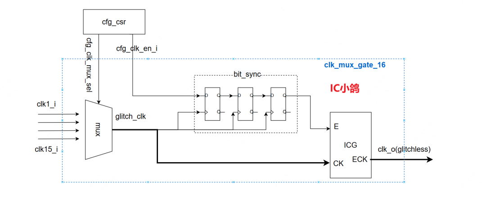

模块clk\_mux\_gate\_16由16 选 1 组合 MUX、三级同步寄存器 bit\_sync、ICG 集成时钟门组成，由 CSR 寄存器下发两路控制信号：时钟选择cfg\_clk\_mux\_sel、全局时钟使能cfg\_clk\_en\_i。

1. 组合 MUX：负责切换多路输入时钟，但选择信号异步变化会在输出glitch\_clk产生毛刺，不可直接输出；
2. bit\_sync 三级同步链：以glitch\_clk为采样时钟，同步异步使能信号，消除亚稳态，将使能跳变约束在时钟上升沿；
3. ICG 时钟门：内部锁存结构仅在时钟低电平阶段响应使能变化，从硬件根源杜绝开关时钟产生毛刺，最终输出纯净clk\_o。

## 二、标准三段式切换操作流程

为隔绝 MUX 切换毛刺，软件严格依照下述顺序配置寄存器：

1. 步骤 1：拉低cfg\_clk\_en\_i，关断输出时钟 配置 CSR 将时钟使能置 0，经过三级同步后 ICG 使能变为低电平，ICG 截断时钟通路，clk\_o恒定为低电平，后端电路无时钟输入，进入安全状态。
2. 步骤 2：改写cfg\_clk\_mux\_sel，切换时钟源 在时钟输出关闭状态下修改多路选择值，MUX 切换时钟源时产生的毛刺被闭锁的 ICG 完全隔离，不会传递到模块输出端口。
3. 步骤 3：拉高cfg\_clk\_en\_i，释放稳定时钟 等待 MUX 输出时钟波形恢复规整、同步链路状态刷新完成后，拉高时钟使能。同步后的使能只会在时钟上升沿翻转，此时 ICG 内部锁存处于锁定状态；待时钟电平拉低后，ICG 才放行时钟，输出无毛刺的目标时钟波形。

# 三、对应 WaveDrom 时序波形

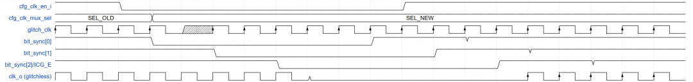

第一步：cfg\_clk\_en\_i配置成0，使能逐级同步拉低，输出时钟clk\_o 关闭；

第二步：配置cfg\_clk\_mux\_sel，修改多路选择，glitch\_clk出现毛刺，输出clk\_o 依旧保持低电平；

第三步：cfg\_clk\_en\_i配置成1，使能逐级同步拉高，ICG模块在时钟低电平窗口平稳输出全新时钟，全程无毛刺脉冲
---

# 83：后向寄存器切片（backword register slice）

> 来源：https://mp.weixin.qq.com/s/9pkKgKvuGcqBscO4ZTVgPA
> 作者：Timingwalker666
> update 2026/08/03 17 : 25
后向寄存器切片（backword register slice）用来隔离下游发往上游的ready信号。

由于上游（source）看到的反压信号rdy\_src比原始信号rdy\_dst慢了一拍，就会产生一个场景：

- rdy\_src = 1，而rdy\_dst = 0。

  如果此时上游刚好有数据要传输（vld\_src=1），则register slice需要具备吸收这一个数据的能力，这个数据由register slice内部深度为1的buffer暂存。

其余情况下，前向路径（vld\_src/data\_src）都是从上游直通到下游，buffer被跳过，因此这个电路也被称为skip buffer。

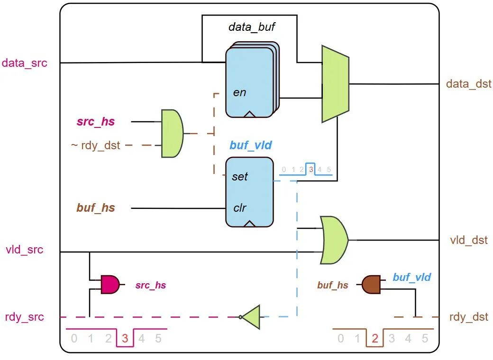

---

**1. data\_buf**

上游数据被存入buffer的条件为：

- 上游正在发送数据：vld\_src & rdy\_src

  同时：
- 下游不具备接收能力，即反压：~rdy\_dst

```
if ( src_hs & ~rdy_dst)
    data_buf <= data_src;
```

**2. buf\_vld**

需要有一个信号指示buffer中是否有数据，显然，data\_src被存入data\_buf的同时，就应该将buf\_vld置1：

```
if ( src_hs & ~rdy_dst)
    buf_vld <= '1;
```

在不满足上述条件的情况下，下游取走buffer数据就将标志位清零：

```
else if ( buf_hs )
    buf_vld <= '0;
```

---

**前向路径**

当register slice中的buffer有数据时，上游送往下游的vld\_dst/data\_dst应该来自buffer，否则直接使用上游信号。

指示buffer是否有数据的信号为buf\_vld，因此：

```
assign data_dst = buf_vld ? data_buf : data_src;
assign vld_dst  = buf_vld ? buf_vld  : vld_src;
```

vld\_dst也可以写成：

```
assign vld_dst = vld_src | buf_vld;
```

即：上游有数据或者buffer有数据都可以通知下游来取。

---

**3. rdy\_src**

这个电路的主要目的就是打断反向的ready信号，因此rdy\_src不能直接来自rdy\_dst。

而是需要看buffer的状态：

- buf\_vld = 0 ： buffer空了。上游可以发送数据，数据或者从旁路路径直接被取走（rdy\_dst=1时），或者被暂存入buffer（rdy\_dst=0时）。
- buf\_vld = 1：buffer缓存了上游发送的前一个数据，等它被取走后才能发送新数据，所以需要反压上游。

因此，rdy\_src就是buf\_vld的取反：

```
assign rdy_src = ~buf_vld;
```

---

**前向、后向寄存器切片对比：**

它们内部的存储单元是相同的，都包含了：

- 一组用于存储data的buffer寄存器。
- 一个用于指示buffer是否有值的寄存器。

  但是起到的作用并不一样。

前向寄存器切片要打断上游发往下游的valid路径，因此所有数据都是要先经过buffer，再送往下游。

后向寄存器切片要打断的是下游返回上游的ready路径，只有在下游不具备接收能力时buffer才暂存数据，其余情况下数据都是直通的。

最终达到的效果：

- valid的时序路径在前向切片被打断，而ready增加一级门电路延时。
- ready的时序路径在后向切片被打断，而valid增加一级门电路延时。
---

# Memory存储器学习笔记

> 来源：https://mp.weixin.qq.com/s/VvkenHZ6NyiIS73OyZX3WA
> 作者：Equilibria
> update 2026/08/03 17 : 25
前言

最近都没什么动力写文章了，主要是因为现在的 AI 回答得又快又好，所以有种写了也是白写的感觉，我所付出的都只是给 AI 投喂训练数据。既然 AI 要干掉我，我后面就出个 AI 芯片系列文章。

随着长鑫存储成为 A 股第一市值，SK 海力士在美股上市，存储芯片的热度一直居高不下。借此机会，顺手把自己尘封已久的学习笔记翻出来整理一下发个科普贴。

1. SRAM (Static Random-Access Memory)

SRAM 静态随机存储器不需要刷新电路即能保存它内部存储的数据，而DRAM每隔一段时间，要刷新充电一次，否则内部的数据即会消失。

SRAM具有很高的性能，但是也有它的缺点，即它的集成度较低，同样面积的硅片可以做出更大容量的DRAM，因此SRAM显得更贵。

SRAM主要用于高速缓存（Cache)，它是利用晶体管来存储数据，与 DRAM 通过电容存储数据方式不同。

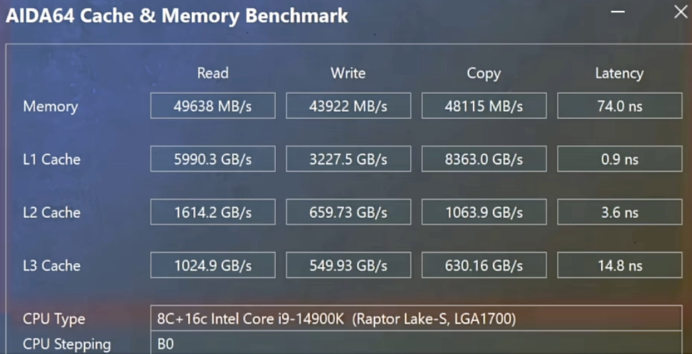

SRAM一般可分为五大部分：存储单元阵列(core cells array)，行/列地址译码器(decode），灵敏放大器(Sense Amplifier），控制电路(control circuit），缓冲/驱动电路(FFIO）。

两个或非门构成的RS触发器，再加两个与门构成1 bit SRAM。因为没有电容，读写数据都是一瞬间完成，速度非常快。

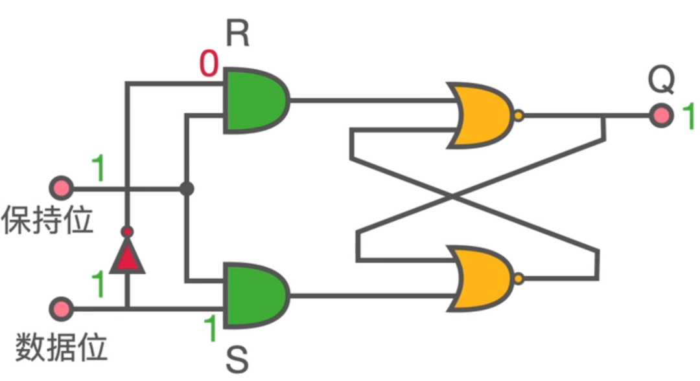

2. DRAM (Dynamic Random Access Memory)

动态随机存取存储器是最为常见的系统内存，DRAM 只能将数据保持很短的时间。为了保持数据，DRAM使用电容存储，所以必须隔一段时间刷新（refresh）一次，如果存储单元没有被刷新，存储的信息就会丢失。

同步动态随机存储器，同步是指 Memory工作需要同步时钟，内部的命令的发送与数据的传输都以它为基准；动态是指存储阵列需要不断的刷新来保证数据不丢失；随机是指数据不是线性依次存储，而是自由指定地址进行数据读写。

DRAM按照产品分类分为DDR/LPDDR/GDDR和传统型(SDR)DRAM。

DDR是Double Data Rate SDRAM的缩写，即双倍速率同步动态随机存储器，主要应用在个人计算机、服务器上。

GDDR指的是Graphics DDR，主要应用于图像处理领域，位宽更大，功耗更高。

LPDDR 内存全称是Low Power Double Data Rate SDRAM，中文意为低功耗双倍数据速率内存，是美国JEDEC固态协会面向低功耗内存制定的通信标准，主要针对于移动端电子产品。相比于DDR来说，LPDDR最大的特点就是功耗更低。

Write：G=1，D=1，充电写1；G=1，D=0，放电写0。

Read：G=1，通过放大器读取当前电压。

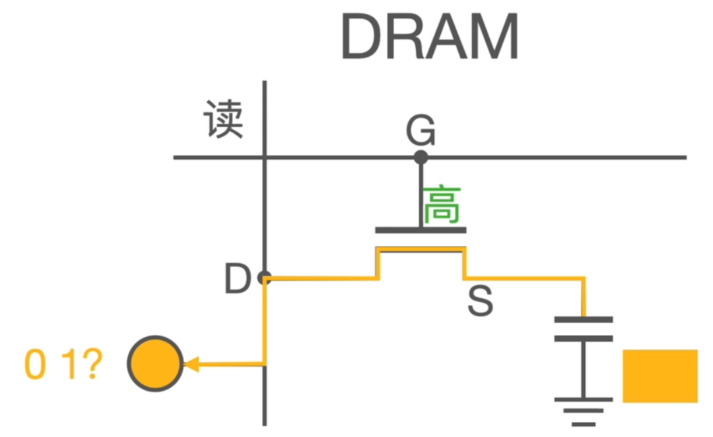

### **应用场景**

- SRAM 主要应用于CPU 和GPU的寄存器，Cache，Buffer。
- DRAM 主要应用于DDR。

### **速写延迟**

- SRAM 是由两个非门组成，读写延迟可以做到一个时钟。
- DRAM 一般通过DDR总线方式读取，读写延迟一般在60~200个时钟。

### **价格**

- SRAM 12nm工艺，1GB 约 3W RMB左右。
- DDR4 当前价格1GB 16RMB。（标准化且量大）

3. PSRAM (Pseudo static random access memory)

PSRAM是一种伪静态SRAM存储器，它具有**类似SRAM的接口协议**：给出地址、读、写命令，就可以实现存取，不像DRAM需要memory controller来控制内存单元定期数据刷新，接口简单。

PSRAM的内核是**DRAM架构**：1T1C一个晶体管一个电容构成存储cell，而传统SRAM需要6T即六个晶体管构成一个存储cell。（现在 2T 即可）

**与DRAM相比的优势区别：**
PSRAM在容量大小上并不占据优势，更多使用DRAM的客户，会在读取速度上考虑用到PSRAM，因为PSRAM相对于DRAM的读取速度要快。

**与SRAM相比的优势区别：**

对比SRAM，PSRAM市面上的产品比SRAM的容量大一倍以上，PSRAM目前最大容量达到64Mbit，并有并口跟SPI接口两种模式，对需要更少I/O的设计应用更为广泛，其次，PSRAM在价格上要低于SRAM。

PSRAM采用的自行刷新（Self-Refresh）技术，不需要刷新电路即能保存它内部存储的数据；而DRAM每隔一段时间，要刷新充电一次，否则内部的数据会消失，因此PSRAM具有更低的功耗水平。

因此，相较于DRAM，PSRAM具有管脚精简、低功耗的优势；而与SRAM比较，PSRAM又具有价格上的优势。

**应用**：PSRAM 更适用于低功耗、高密度存储且不需要复杂控制的嵌入式系统，DRAM 更适合需要大容量高速数据存取的高性能应用。

4. Flash

NOR Flash更像内存，有独立的地址线和数据线，但价格比较贵，容量比较小；而NAND型更像硬盘，地址线和数据线是共用的I/O线，而且NAND的成本较NOR来说很低，而容量却大很多。

因此 NOR 闪存比较适合频繁随机读写的场合，通常用于存储程序代码并直接在闪存运行，容量通常不大；NAND型闪存主要用来存储资料，我们常用的闪存产品，如U盘、SD卡都是用NAND型闪存。

向数据单元内写入数据的过程就是向电荷势阱注入电荷的过程，写入数据有两种技术：热电子注入(hot electron injection)和 F-N 隧道效应(Fowler Nordheim tunneling)，前一种是通过源极给浮栅充电，后一种是通过硅基层给浮栅充电。

NOR FLASH 通过热电子注入方式给浮栅充电，而 NAND 则通过 F-N隧道效应给浮栅充电。

在写入新数据之前，必须先将原来的数据擦除，也就是将浮栅的电荷放掉，两种 FLASH 都是通过 F-N 隧道效应放电。

浮栅层有电荷为0，无电荷为1。

- G极加20V高压，衬底0V，电子进入浮栅层，完成写入，从1写为0；

- 衬底加20V高压，G极0V，电子吸出浮栅层，完成擦除，从0变成1。

遂穿层本质也是绝缘体，寿命的限制是因为遂穿层不断有电子出入，导致损坏。电压足够高就会形成隧道效应，电子就可以穿过遂穿层。

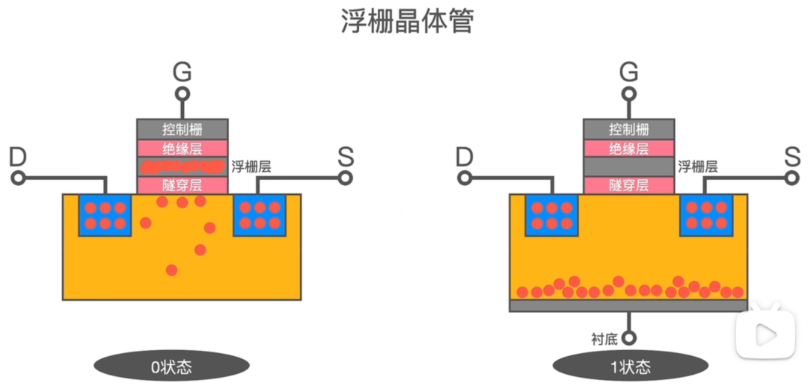

在G极加低压，如果浮栅层没有电荷则形成N沟道，检测到电流(读1)；如果有电荷，因为排斥作用，形成不了N沟道，检测不到电流(读0)。

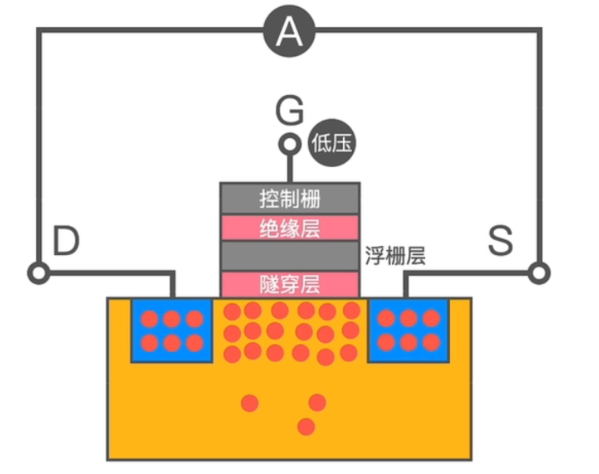

4.1 NOR 和 NAND 对比

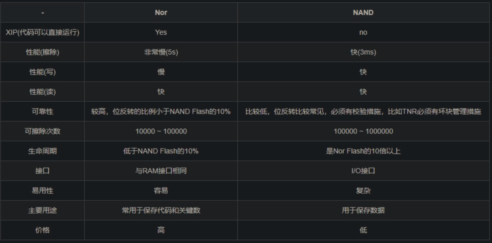

NorFlash（1 Page = 256Byte）

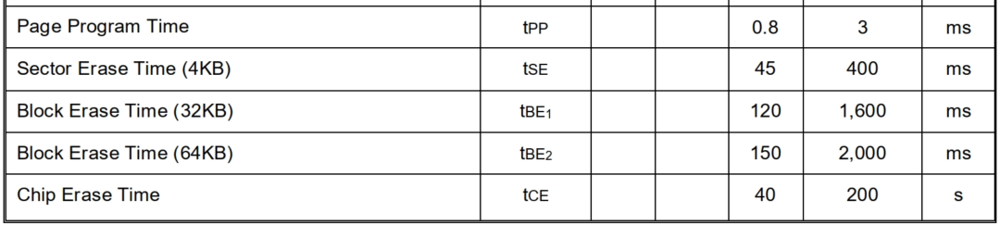

NandFlash

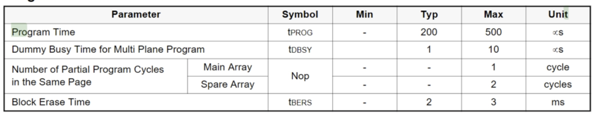

4.2 SLC/MLC/TLC

Nand Flash闪存颗粒中根据存储密度的差异可分为SLC、MLC、TLC和QLC四种：

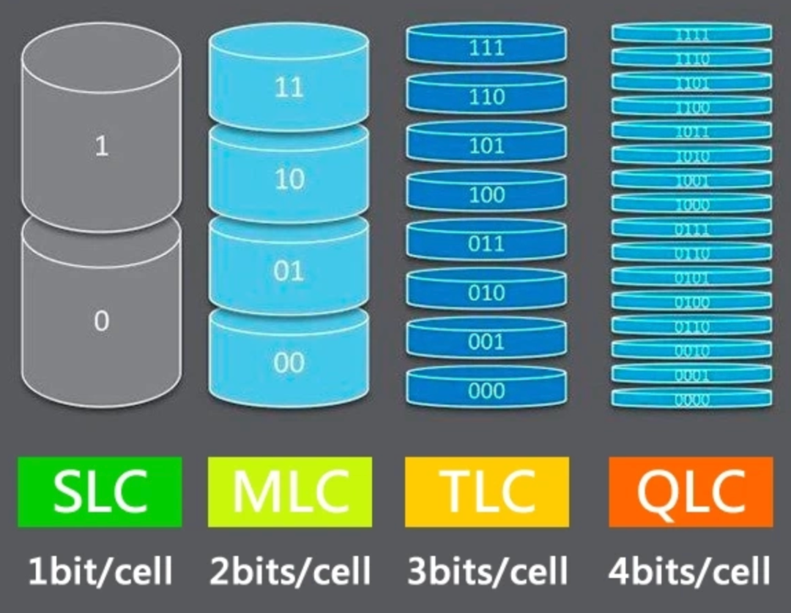

第一代SLC（Single-Level Cell）每单元可存储1比特数据(1bit/cell)，性能好、寿命长，可经受10万次编程/擦写循环，但容量低、成本高，如今已经非常罕见；

第二代MLC（Multi-Level Cell）每单元可存储2比特数据(2bits/cell)，性能、寿命、容量、成各方面比较均衡，可经受1万次编程/擦写循环，现在只有在少数高端SSD中可以见到；

第三代TLC（Trinary-Level Cell）每单元可存储3比特数据(3bits/cell)，性能、寿命变差，只能经受3千次编程/擦写循环，但是容量可以做得更大，成本也可以更低，是当前最普及的（主流手机应用）；

第四代QLC（Quad-Level Cell）每单元可存储4比特数据(4bits/cell)，性能、寿命进一步变差，只能经受1000次编程/擦写循环，但是容量更容易提升，成本也继续降低。

SLC可以简单认为是利用浮栅是否存储电荷来表征数字0'和1'的，MLC则是利用浮栅中电荷多少来表征00，01，10和11，TLC与MLC相同。

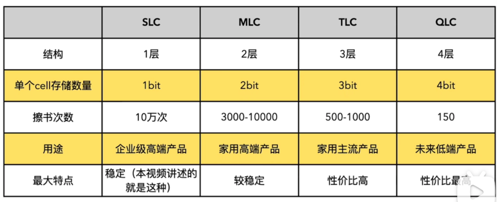

TLC是目前消费级SSD的主流，价格便宜，但可以通过高性能主控器、算法来弥补、提高TLC闪存的性能。

4.3 OTP/MTP

OTP: One-Time Programmable，只允许编程一次，一旦被编程，数据永久有效不能篡改；

MTP: Multiple-Time Programmable，可以多次编程。

OTP 是一种特殊类型的非易失性存储器  只允许编程一次，一旦被编程，数据永久有效。

相较于MTP (multi-time programmable ) 如EEPROM等，OTP 的面积更小而且不需要额外的制造步骤，因此广泛应用于low-cost 芯片中，OTP常用于存储可靠且可重复读取的数据，如：启动程序、加密密钥、模拟器件配置参数等。

4.4 eMMC 和 UFS

eMMC（Embedded Multi Media Card）是一种嵌入式多媒体存储卡标准，它最初是为了解决手机存储容量不足的问题而开发的。eMMC在设计和功能上与闪存相似，但更为简化。

eMMC存储技术采用了闪存和控制器的一体化设计，相比于传统的NAND闪存和单独的控制器，具有更加紧凑的设计和更低的成本。

性能：eMMC的读写速度相对较慢，与UFS相比，其性能较低。它的连续读写速度通常在100-200MB/s之间，随机读写速度则更低。

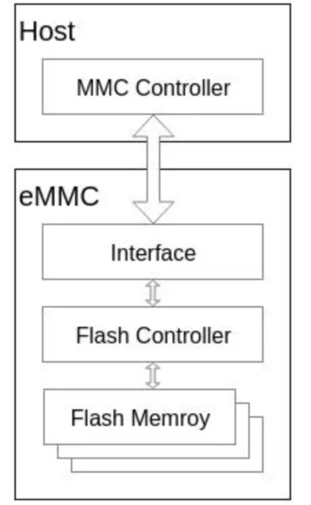

由于Nand Flash自身的物理特性，需要实现坏块管理、磨损均衡、ECC等诸多功能，这些功能就是由FTL（Flash Translation Layer）来实现。

eMMC内部集成的闪存控制器则实现了FTL等功能，减少了由于不同型号Nand Flash的各种特性差异造成的软件开发复杂度；同时闪存控制器也提供了Cache、Memory array、interleave等多种功能，大大提高了Nand Flash读写操作性能。

UFS（Universal Flash Storage）是一种通用闪存存储标准，它的设计目标是提供更高的性能和更低的能耗。

UFS在连续读写速度、随机读写速度以及能效上都优于eMMC。

性能：UFS的读写速度远高于eMMC。连续读写速度通常在700-1000MB/s之间，随机读写速度也更高。这使得UFS在处理大量数据时更为高效。

不管是eMMC还是UFS它们大多都是协议、或者通道上的区别，但是真正储存数据的核心关键还是NAND芯片，NAND芯片的品质才是决定存储是否稳定好用的关键。

5. 参考资料

https://www.bilibili.com/video/BV1cK421Y7Bg/?spm\_id\_from=333.999.0.0&vd\_source=1a89ca09926ad55a60f1f415bd0dd519

https://www.bilibili.com/video/BV1yu4y117by/?spm\_id\_from=333.788.recommend\_more\_video.-1&vd\_source=1a89ca09926ad55a60f1f415bd0dd519

---

如果文章对你有帮助的话麻烦点赞 + 收藏 + 关注，感谢！

本文首发于公众号【Equilibria】，欢迎关注获取最新文章和独家内容。

相关文章：[LPDDR内存学习笔记](https://mp.weixin.qq.com/s?__biz=Mzg2NTg0MDk4OA==&mid=2247484283&idx=1&sn=bcb19823c3e3f2628ae58104a3d102e0&scene=21#wechat_redirect)
---

# 这几种scoreboard架构，多数人从第一天就选错了

> 来源：https://mp.weixin.qq.com/s/mPjB4IWakktJjlyn9lwTow
> 作者：make ic
> update 2026/08/03 17 : 25
# ”你的 scoreboard 为什么比不出这个 bug“，很多人当场语塞。 **比对逻辑到底该长什么样**。


scoreboard 只干一件事：**拿到”期望值“和”实际值“，判断二者是否一致**。架构的差别，本质上只是这两路数据”从哪来、存在哪、怎么配对“的差别。

---

### 一、裸队列直比

一个 `analysis_imp`，一个 `queue`，收到就 `pop`出来 `compare`。十分钟写完，小模块够用。但项目一迭代，DUT 加了乱序、加了丢包，这段代码就开始打补丁，最后没人敢动。**它的问题在于把”预测“和”比对“焊死在了一起**，改一处动全身。

### 二、Predictor 与 Comparator 分离

参考模型单独一个组件算期望值，scoreboard 只管收两路数据做比对。这是**大多数项目的正确答案**，立场很明确：只要模块的生命周期超过三个月，就该这么写。分离之后，参考模型可以单独复用、单独调试，比对逻辑保持干净。前期多花的半天，后面会十倍地还回来。

### 三、乱序比对

DUT 输出顺序不保证时，队列就失效了，得换成按 ID 索引的关联数组：

```
exp_q[tr.id].push_back(tr);
exp_q[tr.id].push_back(tr);
```

NoC、多通道 DMA 绕不开。**难点从”比对“转移到了”配对“**——超时没等到对端数据怎么报、仿真结束时字典里的残留怎么清。

### 四、外挂 golden model

算法复杂到 SV 写不动时，用 DPI-C 挂 C 模型。前提都是**验证环境结构清晰、数据流可追溯**——一坨面条式的 scoreboard，AI 也救不了很难做端到端比对。

---

### **系统的可维护性，取决于职责切分的那一刀落在哪里**。刀切对了，后面每一次需求变化都只碰一个组件；切错了，每次变化都是全局手术。

scoreboard 是环境里**最能体现个人水平的组件**——driver 和 monitor 大家写得都差不多，但 scoreboard 一眼就能看出功底。别把它当成”最后随便糊一下“的部分，它值得占掉环境搭建一半的思考时间。

行业在收紧，工具在变聪明，能留在牌桌上的，是那些把”为什么这么架构“想透了的人，而只会照模板填空的岗位，正在被工具一点点吃掉。
---

# 这几种scoreboard架构，多数人从第一天就选错了

> 来源：https://mp.weixin.qq.com/s/mPjB4IWakktJjlyn9lwTow
> 作者：make ic
> update 2026/08/03 17 : 25
# ”你的 scoreboard 为什么比不出这个 bug“，很多人当场语塞。 **比对逻辑到底该长什么样**。

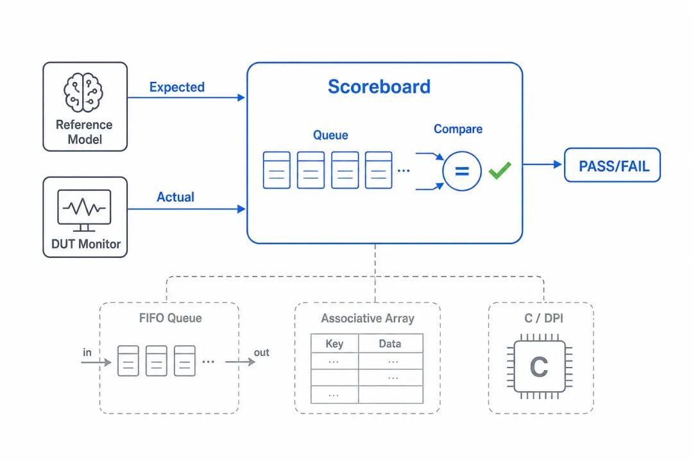

scoreboard 只干一件事：**拿到”期望值“和”实际值“，判断二者是否一致**。架构的差别，本质上只是这两路数据”从哪来、存在哪、怎么配对“的差别。

---

### 一、裸队列直比

一个 `analysis_imp`，一个 `queue`，收到就 `pop`出来 `compare`。十分钟写完，小模块够用。但项目一迭代，DUT 加了乱序、加了丢包，这段代码就开始打补丁，最后没人敢动。**它的问题在于把”预测“和”比对“焊死在了一起**，改一处动全身。

### 二、Predictor 与 Comparator 分离

参考模型单独一个组件算期望值，scoreboard 只管收两路数据做比对。这是**大多数项目的正确答案**，立场很明确：只要模块的生命周期超过三个月，就该这么写。分离之后，参考模型可以单独复用、单独调试，比对逻辑保持干净。前期多花的半天，后面会十倍地还回来。

### 三、乱序比对

DUT 输出顺序不保证时，队列就失效了，得换成按 ID 索引的关联数组：

```
exp_q[tr.id].push_back(tr);
exp_q[tr.id].push_back(tr);
```

NoC、多通道 DMA 绕不开。**难点从”比对“转移到了”配对“**——超时没等到对端数据怎么报、仿真结束时字典里的残留怎么清。

### 四、外挂 golden model

算法复杂到 SV 写不动时，用 DPI-C 挂 C 模型。前提都是**验证环境结构清晰、数据流可追溯**——一坨面条式的 scoreboard，AI 也救不了很难做端到端比对。

---

### **系统的可维护性，取决于职责切分的那一刀落在哪里**。刀切对了，后面每一次需求变化都只碰一个组件；切错了，每次变化都是全局手术。

scoreboard 是环境里**最能体现个人水平的组件**——driver 和 monitor 大家写得都差不多，但 scoreboard 一眼就能看出功底。别把它当成”最后随便糊一下“的部分，它值得占掉环境搭建一半的思考时间。

行业在收紧，工具在变聪明，能留在牌桌上的，是那些把”为什么这么架构“想透了的人，而只会照模板填空的岗位，正在被工具一点点吃掉。
---

# UVM 源码精读 Day2：基础框架总览：uvm_base.svh

> 来源：https://mp.weixin.qq.com/s/XZE4eAH6aSuEoZjnTWACKA
> 作者：study buddy
> update 2026/08/03 17 : 25
— UVM 源码精读系列 - Day 2 —

# 基础框架总览：uvm\_base.svh

UVM 基础模块的组织结构，include 顺序的设计意图

---

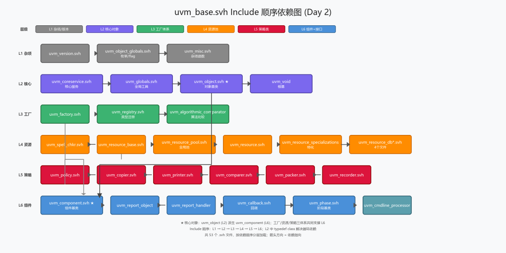

## 一、关键特性

- **依赖驱动的 Include 顺序**：文件按"被依赖者优先"原则严格排列，确保类型先定义后使用，避免编译时 forward reference 错误
- **前向声明解耦循环依赖**：`typedef class uvm_cmdline_processor` 在文件顶部声明，解决 uvm\_globals 与 cmdline\_processor 的相互引用
- **分层模块组织**：从基础类型 - 核心对象 - 工具策略 - 组件 - 接口，六层递进结构清晰划分职责边界
- **条件编译控制可选功能**：`ifndef UVM_REGEX_NO_DPI` 包裹 `uvm_regex_cache.svh`，允许在无 DPI 环境下编译
- **头文件保护宏**：`ifndef UVM_BASE_SVH` / `define UVM_BASE_SVH` 防止同一编译单元重复包含

## 二、源码分析

### 1. 前向声明解决循环依赖

```
`ifndef UVM_BASE_SVH
`define UVM_BASE_SVH

  typedef class uvm_cmdline_processor;
```

`uvm_cmdline_processor` 在文件靠后位置（第 133 行）才被真正 `include`，但 `uvm_globals.svh`（第 54 行）需要引用它。SystemVerilog 的 `typedef class` 前向声明允许在完整类定义前使用类名，这是 UVM 处理模块间循环依赖的标准手法。

### 2. Include 顺序的分层设计

```
  // Miscellaneous classes and functions
  `include "base/uvm_version.svh"
  `include "base/uvm_object_globals.svh"
  `include "base/uvm_misc.svh"

  `include "base/uvm_coreservice.svh"
  `include "base/uvm_globals.svh"

  // The base object element
  `include "base/uvm_object.svh"

  `include "base/uvm_factory.svh"
  `include "base/uvm_registry.svh"
```

第一层（版本/全局/杂项）- 第二层（uvm\_object）- 第三层（工厂）。
`uvm_object` 是 UVM 的"万物之基"，工厂、配置、策略等所有机制都操作 `uvm_object` 或其派生类，因此必须最早完整定义。后续 `uvm_pool`（第 64-65 行）的键值类型也依赖 `uvm_object`。

### 3. 资源与配置系统的依赖链

```
  `include "base/uvm_spell_chkr.svh"
  `include "base/uvm_resource_base.svh"
  `include "base/uvm_resource_pool.svh"
  `include "base/uvm_resource.svh"
  `include "base/uvm_resource_specializations.svh"
  `include "base/uvm_resource_db_implementation.svh"
  `include "base/uvm_resource_db.svh"
  `include "base/uvm_resource_db_options.svh"
  `include "base/uvm_config_db_implementation.svh"
  `include "base/uvm_config_db.svh"
```

资源系统的 include 顺序是教科书级的依赖链：
`resource_base` - `resource_pool`（管理资源的容器）- `resource`（具体资源对象）- `resource_specializations`（类型特化）- `resource_db`（静态接口）- `config_db`（基于 resource\_db 的封装）。
`uvm_config_db` 放在最后，说明它是对底层资源池的**门面模式（Facade）**封装。

### 4. 策略类与组件的层次分离

```
  `include "base/uvm_policy.svh"
  `include "base/uvm_copier.svh"
  `include "base/uvm_printer.svh"
  `include "base/uvm_comparer.svh"
  `include "base/uvm_packer.svh"
  // ...
  `include "base/uvm_component.svh"
```

`uvm_policy` 及 copier/printer/comparer/packer 等策略类（第 82-94 行）在 `uvm_component`（第 125 行）之前引入。这体现了**策略模式（Strategy Pattern）**的设计：`uvm_object` 的数据方法（copy/compare/print/pack）依赖这些策略对象，而 `uvm_component` 作为 `uvm_object` 的派生类，必须在策略类可用后才能定义。

## 三、小结

`uvm_base.svh` 并非简单的"文件列表"，而是 UVM 基础架构的**编译时依赖图**。include 顺序严格反映了 UVM 的架构层次：基础类型 - 核心对象 - 工厂 - 资源池 - 策略 - 组件 - 接口。理解这份顺序，就是理解 UVM 的设计骨架。
---

# AXI Master与Slave VIP对接验证平台搭建

> 来源：https://mp.weixin.qq.com/s/bB8KGVoeISbNya-ZktSRrA
> 作者：芯想事珹
> update 2026/08/03 17 : 30


AXI Master与Slave VIP对接验证平台搭建

在SoC验证中，AXI总线几乎是绕不开的。无论是CPU访问DDR，还是DMA搬运数据，都离不开AXI协议。而AXI VIP正是Synopsys提供的标准化验证组件，用来替代手写AXI BFMs，帮助验证工程师快速搭建总线协议验证环境。

本文记录了一次AXI Master VIP与AXI Slave VIP对接验证平台的搭建过程，重点说清楚环境怎么搭、Sequence怎么封装，以及实际踩过的几个坑

**从基础读写开始**

搭建的第一步是跑通最基本的读写流程。

在Synopsys AXI VIP的示例代码中，已有基础sequence实现了简单的读写操作。把这些示例跑起来，确认：

- Master能发请求
- Slave能回响应
- 仿真不报错，顺利结束

这一步是验证链路通不通的关键。如果基础读写都过不了，说明环境连接或配置有问题，后面做再多封装都没意义。

**把读写操作封装成独立Sequence**

基础sequence的问题在于：地址和数据写死在代码里，每次换测试场景都要改代码，复用性差。

比如要读不同地址、写不同数据，原来需要在sequence内部手动修改参数，然后再重新编译跑仿真。这种做法在验证一个简单模块时还能接受，但一旦测试用例多了，维护成本直线上升。

解决思路很直接：把读和写拆成两个独立的sequence，地址和数据全部做成可配置变量。

写Sequence示例：

```
systemverilog
classaxi_write_seqextendsuvm_sequence;  rand bit [31:0] start_addr;  rand bit [31:0] data [];  // 参数从外部传入，不写死在代码里endclass
```

读Sequence同理，把读取地址设成变量，外部传入。

这样改完之后，同一个sequence可以被不同testcase调用，只需要修改传入的地址和数据即可，不需要再改代码。

**统一管理Sequence**

两个独立sequence做好之后，还需要一个统一的调用接口。不然每次都要在test.sv里单独例化，还是会显得乱。

做法是在单独的文件中对所有sequence进行声明和统一管理，Test层只需要调用对应sequence并传入参数，不需要关心底层transaction的具体创建过程。

这样分层使Test层更简洁，测试人员只需关注测试需求，增加新场景时直接复用已有sequence，快速组装。

**实际踩过的几个坑**

坑一：Slave VIP不响应

一开始跑的时候，Master发了请求，但Slave没有任何反应，仿真一直卡在等待响应状态。

排查过程：

先确认波形，Master确实发了请求

检查Slave VIP的配置，发现部分初始化参数没配全，导致Slave没有处于正确的响应状态

补全agent配置和interface连接参数后，恢复正常

教训：VIP虽然是标准化组件，但配置环节不能大意。任何一个参数没配对，整个链路都可能卡住。

坑二：工程脚本适配

VIP的sequence做好之后，需要把新增文件接入公司现有的编译脚本和目录结构里。这部分看起来是小事，但在实际项目里经常会因为目录路径不对、filelist漏加而编译不过。

建议在做sequence开发的同时，同步把filelist和目录结构调整好，不要等代码写完了再回头改编译环境。

**一些经验**

通过这次AXI VIP平台搭建，有几点体会可以分享：

第一，VIP本身封装了协议细节，用起来省力，但不能只当黑盒用。至少要知道它内部有哪些组件、各个组件怎么配置、连接关系是什么，否则出了问题很难定位。

第二，验证代码要考虑复用，不是为了跑通当前一个case就行了。把读写拆成独立sequence看起来是小事，后续增加测试场景时会省很多时间。

第三，验证平台结构要分层清晰。sequence只管产生激励，test只管组织测试流程，底层的driver、monitor由VIP负责。各层各司其职，环境才不会越改越乱。

**END**


---

# JTAG的TAP状态机介绍

> 来源：https://blog.csdn.net/chenyuheu/article/details/117035639
> 发布时间：最新推荐文章于 2026-06-23 14:22:42 发布
> update 2026/08/03 18 : 21
来自 嵌入式系统Linux内核开发实战指南   http://book.chinaunix.net/showart.php?id=3258

**JTAG****简介**

JTAG接口的基本工作原理是：在芯片内部定义一个TAP（Test Access Port，测试访问端口），开发人员使用连接到芯片的JTAG外部接口上的JTAG调试器，通过访问芯片内部的TAP端口来扫描芯片内部各个扫描单元以写 入或读取扫描寄存器的状态，从而对芯片进行测试和调试。一个扫描单元对应一个外部管脚，每个外部管脚有一个扫描寄存器BSR单元，所有这些管脚的扫描寄存 器连在一起就形成了扫描链。简单地说，PC通过JTAG调试器对目标板的调试就是通过TAP端口完成对扫描寄存器BSR和指令寄存器IR的读写访问。要了 解关于JTAG 更全面的知识，请参阅 IEEE1149.1标准。

**一些基本概念**

**JTAG**

是Joint Test Action Group（联合测试行动组）的缩写，是一种国际标准测试协议，它遵守IEEE 1149.1标准。一个含有JTAG接口的处理器，只要时钟正常，就可以通过JTAG接口访问处理器的内部寄存器、挂在处理器总线上的设备以及内置模块的 寄存器。

**TAP**

是Test Access Port（测试访问端口）的缩写，是芯片内部一个通用的端口，通过TAP可以访问芯片提供的所有数据寄存器（DR）和指令寄存器（IR），对整个TAP的控制是通过TAP控制器（TAP Controller）完成的。

**边界扫描**

英文叫Boundary Scan，边界扫描的基本思想是在靠近芯片的输入输出管脚（PIN）上设置一个移位寄存器单元，也就是边界扫描寄存器（Boundary-Scan Register）。当芯片处于调试状态时，边界扫描寄存器可以将芯片和外部输入输出管脚隔离开来，通过边界扫描寄存器单元，可以实现对芯片外部输入输出 管脚的观察和控制。对于芯片的输出管脚可以通过与之相连的边界扫描寄存器单元把信号（数据）加载到该引脚中去，对于芯片的输入管脚，也可以通过与之相连的 边界扫描寄存器"捕获"该管脚上的输出信号。在正常的运行状态下，边界扫描寄存器对芯片来说是透明的，所以正常的运行不会受到任何影响，这样，边界扫描寄 存器提供了一种便捷的途径用于观测和控制所需调试的芯片。另外，芯片管脚上的边界扫描（移位）寄存器单元可以相互连接起来，使芯片的周围形成一个边界扫描 链（Boundary-Scan Chain），边界扫描链可以串行地输入和输出，通过相应的时钟信号和控制信号，就可以方便地观察和控制处在调试状态下的芯片。

**JTAG****接口信号**

标准的JTAG接口定义了以下一些信号管脚：

TMS：测试模式选择信号，输入，IEEE 1149.1标准强制要求。

TCK：测试时钟信号，输入，IEEE 1149.1标准强制要求。

TDI：测试数据输入信号，输入，IEEE 1149.1标准强制要求。

TDO：测试数据输出信号，输出，IEEE 1149.1标准强制要求。

TRST：内部TAP控制器复位信号，输入，IEEE 1149.1标准不强制要求，因为通过TMS也可以对TAP Controller进行复位。

STCK：时钟返回信号，IEEE 1149.1标准不强制要求。

DBGRQ：目标板上工作状态的控制信号，IEEE 1149.1标准不强制要求

**TAP****控制器的状态机**

TAP控制器有16个同步状态，控制器的下一个状态TMS信号决定，TMS信号在TCK的上升沿被采样生效。

图列出了TAP控制器的16个同步状态转换机制。

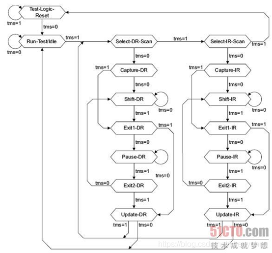

**Test-Logic-Reset****测试逻辑复位状态**

处于这种状态下，测试逻辑被禁止以允许芯片正常操作，读IDCODE寄存器将禁止测试逻辑。

无论TAP控制器处于何种状态，只要将TMS信号在5个连续的TCK信号的上升沿保持高电平，TAP就将进入Test-Logic-Reset状 态，如果TMS信号一直为高电平，那么TAP将保持在Test-Logic-Reset状态，另外TRST信号也可以强迫TAP进入Test- Logic-Reset状态。

处于Test-Logic-Reset状态的TAP，如果下一个TCK的上升沿时TMS信号处于低电平，那么TAP将被切换到Run-Test-Idle状态。

**Run-Test-Idle****运行测试空闲状态**

Run-Test-Idle是TAP控制器扫描操作空闲状态，如果TMS信号一直处于低电平，那么TAP将保持在TRun-Test-Idle状态。当TMS信号在TCK上升沿处于高电平，TAP控制器将进入Select-DR-Scan状态。

**Select-DR-Scan****选择数据寄存器扫描状态**

Select-DR-Scan是TAP控制器的一个临时状态，边界扫描寄存器BSR保持它们先前的状态。

当TMS信号在下一个TCK上升沿处于低电平，TAP控制器进入Capture-DR状态，一个边界扫描寄存器的扫描操作同时被初始化。

如果TMS信号在下一个TCK上升沿处于高电平，TAP控制器将进入Select-IR-Scan状态。

**Capture-DR****捕获数据寄存器状态**

如果TAP控制器处于Capture-DR状态，且当前指令是SAMPLE/PRELOAD指令，那么边界扫描寄存器BSR在TCK信号的上升沿捕 获输入管脚的数据。如果此时不是SAMPLE/PRELOAD指令，那么BSR保持它们先前的值，另外BSR的值被放入连接在TDI和TDO管脚之间的移 位寄存器中。

处于Capture-DR状态时，指令不会被改变。

如果TMS信号在下一个TCK上升沿处于高电平，TAP进入Exit1-DR状态。如果TMS信号在下一个TCK上升沿处于低电平，则TAP进入Shift-DR状态。

**Shift-DR****移位数据寄存器状态**

在Shift-DR状态下，在每个TCK的上升沿，TDI-移位寄存器-TDO串行通道向右移一位，TDI的数据移入移位寄存器，移位寄存器最靠近TDO的位移到TDO管脚上。

处于Shift-DR状态时，指令不会被改变。

如果TMS信号在下一个TCK上升沿处于高电平，TAP进入Exit1-DR状态。如果TMS信号处于低电平，则TAP一直进行移位操作。

**Exit1-DR****退出数据寄存器状态1**

Exit1-DR是TAP控制器的一个临时状态，如果TMS信号在下一个TCK上升沿处于高电平，TAP进入Update-DR状态；如果TMS信号在下一个TCK上升沿处于低电平，则TAP进入Pause-DR状态。

处于Exit1-DR状态时，指令不会被改变。

**Pause-DR****暂停数据寄存器状态**

Pause-DR状态允许TAP控制器暂时停止TDI-移位寄存器-TDO串行通道的移位操作。

处于Pause-DR状态时，指令不会被改变。

如果TMS信号在下一个TCK上升沿处于高电平，TAP进入Exit2-DR状态；如果TMS信号处于低电平，则TAP一直保持暂停状态。

**Exit2-DR****退出数据寄存器状态2**

Exit2-DR也是TAP控制器的临时状态，如果TMS信号在下一个TCK上升沿处于高电平，TAP进入Update-DR状态，结束扫描操作；如果TMS信号在下一个TCK上升沿处于低电平，则TAP重新进入Shift-DR状态。

处于Exit2-D状态时，指令不会被改变。

**Update-DR****更新数据寄存器状态**

在正常情况下，边界扫描寄存器BSR的值是被锁存在并行输出管脚中，以免在EXTEST或SAMPLE/PRELOAD命令下执行移位操作时改变 BSR的值。当处于Update-DR状态时选择的是BSR寄存器，那么移位寄存器中的值将在TCK的下降沿被锁存到BSR寄存器的并行输出管脚中去。

处于Update-DR状态时，指令不会被改变。

如果TMS信号在下一个TCK上升沿处于高电平，TAP进入Select-DR-Scan状态；如果TMS信号在下一个TCK上升沿处于低电平，则TAP进入Run-Test-Idle状态。

**Select-IR-Scan****选择指令寄存器扫描状态**

Select-IR-Scan是TAP控制器的一个临时状态。

如果TMS信号在下一个TCK上升沿处于低电平，TAP控制器进入Capture-IR状态，一个对指令寄存器的扫描操作同时被初始化。

如果TMS信号在下一个TCK上升沿处于高电平，TAP控制器将进入Test-Logic-Reset状态。

处于Select-IR-Scan状态时，指令不会被改变。

**Capture-IR****捕获指令寄存器状态**

处于Capture-IR状态时，指令寄存器中的值被固定设置成0b0000001，并将它放入连接在TDI与TDO之间的移位寄存器中。

处于Capture-DR状态时，指令不会被改变。

如果TMS信号在下一个TCK上升沿处于高电平，TAP进入Exit1-IR状态；如果TMS信号在下一个TCK上升沿处于低电平，则TAP进入Shift-IR状态。

**Shift-IR****移位指令寄存器状态**

在Shift-IR状态下，在每个TCK的上升沿，TDI-移位寄存器-TDO串行通道向右移一位，JTAG指令从TDI管脚上被逐位移入移位寄存器，而移位寄存器中的0b0000001则被逐位从TDO管脚移出。

处于Shift-IR状态时，指令不会被改变。

如果TMS信号在下一个TCK上升沿处于高电平，TAP进入Exit1-IR状态；如果TMS信号处于低电平，则TAP一直进行移位操作。

**Exit1-IR****退出指令寄存器状态1**

Exit1-IR是TAP控制器的一个临时状态，如果TMS信号在下一个TCK上升沿处于高电平，TAP进入Update-IR状态；如果TMS信号在下一个TCK上升沿处于低电平，则TAP进入Pause-IR状态。

处于Exit1-IR状态时，指令不会被改变。

**Pause-IR****暂停指令寄存器状态**

Pause-IR状态允许TAP控制器暂时停止TDI-移位寄存器-TDO串行通道的移位操作。

处于Pause-IR状态时，指令不会被改变。

如果TMS信号在下一个TCK上升沿处于高电平，TAP进入Exit2-IR状态；如果TMS信号处于低电平，则TAP一直处于暂停状态。

**Exit2-IR****退出指令寄存器状态2**

Exit2-IR也是TAP控制器的临时状态，如果TMS信号在下一个TCK上升沿处于高电平，TAP进入Update-IR状态，结束扫描操作；如果TMS信号在下一个TCK上升沿处于低电平，则TAP重新进入Shift-IR状态。

处于Exit2-D状态时，指令不会被改变。

**Update-IR****更新指令寄存器状态**

处于Update-IR状态时，移位寄存器中的值将在TCK的下降沿被锁存到指令寄存器中，一旦锁存成功，新的指令将成为当前的指令。

如果TMS信号在下一个TCK上升沿处于高电平，TAP进入Select-DR-Scan状态；如果TMS信号在下一个TCK上升沿处于电平，则TAP进入Run-Test-Idle状态。

**JTAG****接口指令集**

JTAG接口指令集包含以下常用指令：

**EXTEST****指令**

外部测试指令，必须全为0，TAP强制定义。该指令初始化外部电路测试，主要用于板级互连以及片外电路测试。

EXTEST指令在Shift-DR状态时将扫描寄存器BSR寄存器连接到TDI与TDO之间。在Capture-DR状态时，EXTEST指令将 输入管脚的状态在TCK的上升沿装入BSR中。EXTEST指令从不使用移入BSR中的输入锁存器中的数据，而是直接从管脚上捕获数据。在Update- DR状态时，EXTEST指令将锁存在并行输出寄存器单元中的数据在TCK的下降沿驱动到对应的输出管脚上去。

**SAMPLE/PRELOAD****指令**

采样/预装载指令，TAP强制定义。在Capture-DR状态下，SAMPLE/PRELOAD指令提供一个从管脚到片上系统逻辑的数据流快照， 快照在TCK的上升沿提取。在Update-DR状态时，SAMPLE/PRELOAD指令将BSR寄存器单元中的数据锁存到并行输出寄存器单元中，然后 由EXTEST指令将锁存在并行输出寄存器单元中的数据在TCK的下降沿驱动到对应的输出管脚上去。

**BYPASS****指令**

旁路指令，必须全为1，TAP强制定义。BYPASS指令通过在TDI和TDO之间放置一个1位的旁通寄存器，这样移位操作时只经过1位的旁通寄存 器而不是很多位（与管脚数量相当）的边界扫描寄存器BSR，从而使得对连接在同一JTAG链上主CPU之外的其他芯片进行测试时提高效率。

**IDCODE****指令**

读取CPU ID号指令，TAP强制定义。该指令将处理器的ID号寄存器连接到TDI和TDO之间。
---

# CMOS传输门

> 来源：https://zhuanlan.zhihu.com/p/565873624
> 发布时间：2022-09-19T04:18:14.000Z
> update 2026/08/03 19 : 07
## 一、什么是CMOS传输门

将MOS管的源极和衬底之间的连线断开，这样MOS管的源极和漏极就能互换使用，利用PMOS管和NMOS管的互补特性，将这俩个异性MOS管对称排列起来，PMOS管的衬底接入高电平，NMOS管的衬底接入0V压降，将俩个MOS管的栅极作为控制端，分别接入一对互为反相的控制信号C与C非，这样通过控制栅极与衬底之间的电位差，就可以控制导电沟道的阻值。

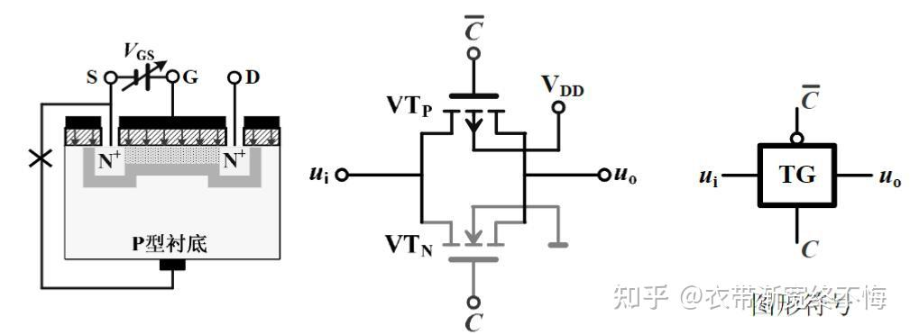

将俩个MOS管的源极直接相连做为输入端子，漏极连接在一起做为输出端子，由于这种MOS管的漏极和源极完全可以互换使用，因而这种电路的输入端与输出端也可以互换，**这就是具有信号传输双向特性的CMOS传输门，简称TG门**

## **二、CMOS传输门的工作原理**

当C端接入低电平，C非端接入高电平的时候

俩个MOS管栅极与衬底之间的压差为0V压降，因而没有导电沟道产生，NMOS管和PMOS管此时都处于截止状态，传输门的输入与输出端之间呈现高阻态，传输门截止

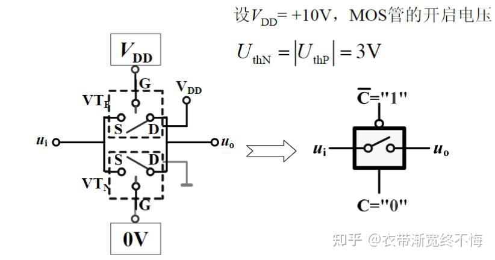

，当C端接入高电平，C非端接入低电平的时候

NMOS管的栅极与衬底之间的压差高于3V的开启压降，而PMOS管的栅极与衬底之间的压差低于-3V的开启压降，所以俩个MOS管都有导电沟道产生

当输入电压是在0~7V的时候，NMOS管的栅极与源极之间的电位差大于3V开启压降，因此电子型导电沟道不会出现夹断，NMOS管导通

当输入电压是在3~10V的时候，PMOS管的栅极与源极之间的电位差低于-3V开启压降，空穴型导电沟道不会出现夹断，PMOS管导通

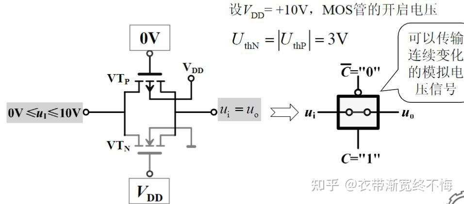

由此可知，当输入电压在0~10V变化时，总有一个MOS管会处于导通状态，电路的输入和输出之间呈现低阻状态，传输门相当于导通

CMOS传输门不仅可以传递数字信号，还可以传输连续变化的模拟信号，在工程应用中，一般要求传输端输出门的对地负载阻值要远远大于传输门的导通电阻，这是因为传输门输出的电压，实际上是导通电阻和负载电阻对输入信号的分压值

## 三、CMOS传输门的开关功能

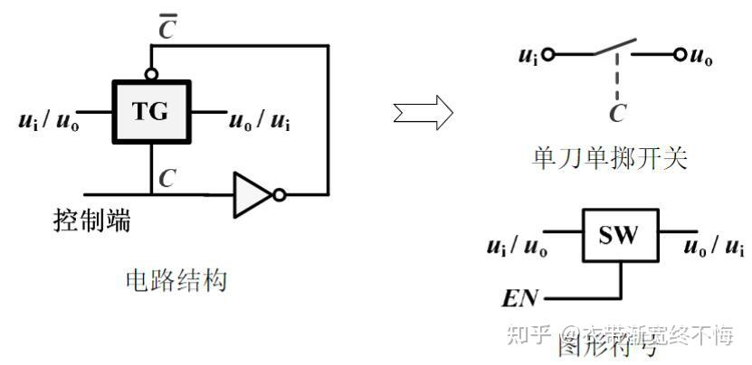

利用CMOS反相器为传输门的控制端提供一对互补的控制信号，这种电路结构实现了可控单刀单掷开关的功能，因而被称为双向模拟开关，图中符号EN端子称为模拟开关的控制端，当使能端接入高电平的时候，控制开关闭合，使能端接入低电平信号的时候，控制开关处于断开的状态。

## 四、集成模拟开关

CC4066是集成模拟开关，内部集成了四个独立的可控双向开关，在供电电源VDD=15V的条件下，开关的导通电阻很小，小于240欧姆

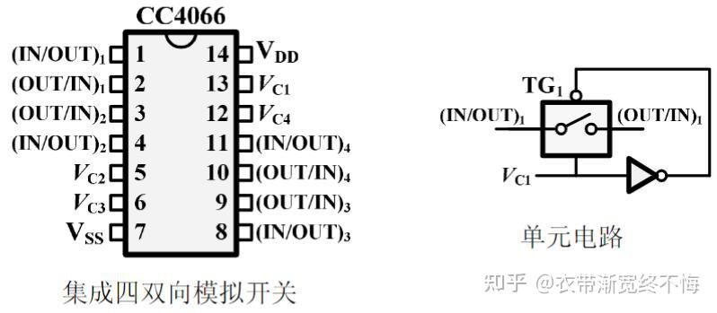

CC4051是集成的八路模拟开关，其内部可以等效为，由数字信号控制的单刀多掷的开关电路，具有低导通阻抗以及极低的截止漏电流

集成芯片由三个二进制端子A、B、C组成以及一个禁止输入端，禁止端的控制级别最高，当禁止端接入高电平的时候，所有的通道都处于截止状态，当禁止端接入低电平的时候，开关的状态才会收到A,B,C三个二进制数码的控制，三个二进制数码对应八个最小项，每个最小项控制一路模拟开关，由最小项的性质可知，任意时刻只能有一个最小项控制有效，能够选择八路开关中的一个通道，将这个通道的信号传递到公共输出端子中

CC4051常用于多路数据采集系统的电路设计

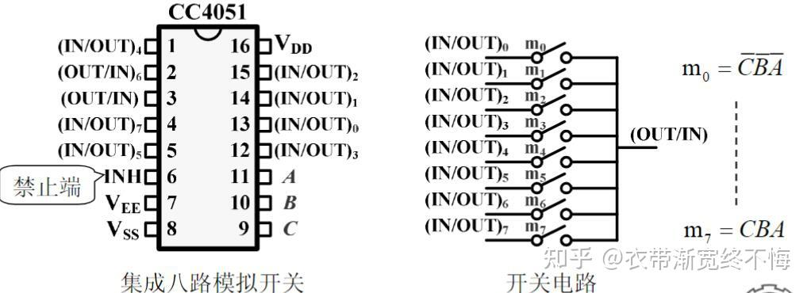

## 五、模拟开关的应用

将多个模拟开关组合，改变开关的连接和控制方式，不仅可以实现可控的单刀单掷开关功能，还可以实现单刀双掷开关，双刀单掷开关，双刀双掷开关

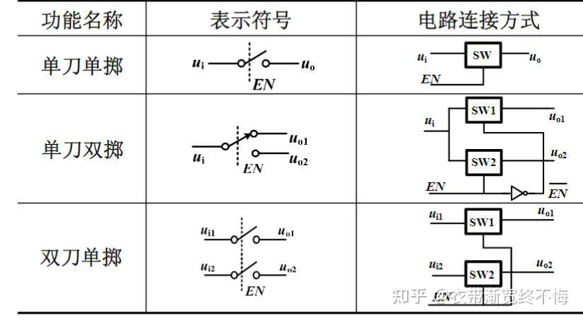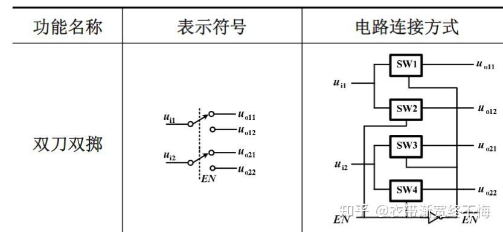
