<!-- toc-start -->

# 目录

[1. 我给AI写了一套"芯片验证SOP"，它真的帮我抓到了bug](#1-我给ai写了一套芯片验证sop它真的帮我抓到了bug)  
　　[1.1 起因：一个反复折腾人的问题](#11-起因一个反复折腾人的问题)  
　　[1.2 一句话说清楚](#12-一句话说清楚)  
　　[1.3 原理：给AI一个"老员工的操作手册"](#13-原理给ai一个老员工的操作手册)  
　　[1.4 一次真实的Debug：UART TX bit\[0\]翻转](#14-一次真实的debuguart-tx-bit0翻转)  
　　　　[1.4.1 故障现象](#141-故障现象)  
　　　　[1.4.2 AI的分析过程](#142-ai的分析过程)  
　　　　[1.4.3 Verdi波形截图](#143-verdi波形截图)  
　　　　[1.4.4 这个过程说明了什么](#144-这个过程说明了什么)  
　　　　[1.4.5 关于这个case的难度](#145-关于这个case的难度)  
　　[1.5 黑猫白猫，能抓老鼠的就是好猫](#15-黑猫白猫能抓老鼠的就是好猫)  
　　[1.6 关于fsdb\_reader.py](#16-关于fsdb_readerpy)  
　　[1.7 Skill的价值：把"可重复的经验"变成"可执行的知识"](#17-skill的价值把可重复的经验变成可执行的知识)  
　　[1.8 写在最后](#18-写在最后)  
[2. 关于控制Agent上下文的一些方法与思考](#2-关于控制agent上下文的一些方法与思考)  
　　[2.1 长对话里 AI 会变笨，这不是错觉](#21-长对话里-ai-会变笨这不是错觉)  
　　[2.2 Compact 不是好答案，Sub-agent 才是](#22-compact-不是好答案sub-agent-才是)  
　　[2.3 轻量版：Claude Code 的 `/btw` 和 Codex 的 `/side`](#23-轻量版claude-code-的-btw-和-codex-的-side)  
　　[2.4 重量版：Claude Code 的 `/fork` 和 Codex 的 sub-agent](#24-重量版claude-code-的-fork-和-codex-的-sub-agent)  
　　　　[2.4.1 Claude Code：`/fork` vs 普通 sub-agent](#241-claude-codefork-vs-普通-sub-agent)  
　　　　[2.4.2 Codex CLI：显式委派 + `/agent` 切换](#242-codex-cli显式委派-agent-切换)  
　　[2.5 为什么这套用法对我个人特别契合](#25-为什么这套用法对我个人特别契合)  
　　[2.6 最后一点感受](#26-最后一点感受)  
[3. AI辅助覆盖率收敛的坑在哪里？](#3-ai辅助覆盖率收敛的坑在哪里)  
　　[3.1 机器学习进来了，先看清它在哪一层干活](#31-机器学习进来了先看清它在哪一层干活)  
　　[3.2 真正能预测盲区的信号，藏在别的地方](#32-真正能预测盲区的信号藏在别的地方)  
　　[3.3 工具变强之后，判断力反而更贵](#33-工具变强之后判断力反而更贵)  
[4. AI 写 UVC？我踩了无数坑后，搞了个 Skill 包救自己](#4-ai-写-uvc我踩了无数坑后搞了个-skill-包救自己)  
　　[4.1 一周没更新，后台炸了](#41-一周没更新后台炸了)  
　　[4.2 第一次尝试：AI 的 UVM，语法都写不对](#42-第一次尝试ai-的-uvm语法都写不对)  
　　[4.3 第一轮突破：给 AI 加上"红绿灯"——TDD](#43-第一轮突破给-ai-加上红绿灯tdd)  
　　[4.4 第二轮突破：Wavedrom——让 AI 正确"看懂"时序](#44-第二轮突破wavedrom让-ai-正确看懂时序)  
　　[4.5 第三轮挑战：Guidelines——让 AI 写出"好"的 UVC](#45-第三轮挑战guidelines让-ai-写出好的-uvc)  
　　　　[4.5.1 问题一：Guideline 写得太抽象，AI 不理解](#451-问题一guideline-写得太抽象ai-不理解)  
　　　　[4.5.2 问题二：模型差异巨大](#452-问题二模型差异巨大)  
　　[4.6 最终方案：代码模板化，脚本 + Prompt 两步走](#46-最终方案代码模板化脚本-prompt-两步走)  
　　[4.7 env-builder：一个完整的 UVC 开发 Skill](#47-env-builder一个完整的-uvc-开发-skill)  
　　　　[4.7.1 uvc\_gen：UVC 框架生成脚本](#471-uvc_genuvc-框架生成脚本)  
　　　　[4.7.2 开发 UVC 的流程](#472-开发-uvc-的流程)  
　　[4.8 ic-verifier：一个面向 DV 的 AI Skill 技能包](#48-ic-verifier一个面向-dv-的-ai-skill-技能包)  
　　[4.9 总结：AI 开发 UVC 的正确姿势](#49-总结ai-开发-uvc-的正确姿势)  
　　　　[4.9.1 TDD 是必须的](#491-tdd-是必须的)  
　　　　[4.9.2 时序描述要结构化](#492-时序描述要结构化)  
　　　　[4.9.3 框架和逻辑分离](#493-框架和逻辑分离)  
　　　　[4.9.4 Guidelines 要具体](#494-guidelines-要具体)  
　　　　[4.9.5 不同模型要区别对待](#495-不同模型要区别对待)  
　　[4.10 项目地址](#410-项目地址)  
[5. AI 会写 testbench 了，验证工程师慌不慌？](#5-ai-会写-testbench-了验证工程师慌不慌)  
　　[5.1 先说清楚 AI 到底吃掉了什么](#51-先说清楚-ai-到底吃掉了什么)  
　　[5.2 验证到底在解什么问题](#52-验证到底在解什么问题)  
　　[5.3 护城河在哪：三样 AI 短期拿不走的东西](#53-护城河在哪三样-ai-短期拿不走的东西)  
　　　　[5.3.1 把模糊的意图翻译成可执行的判断](#531-把模糊的意图翻译成可执行的判断)  
　　　　[5.3.2 判断什么值得验，什么不值得](#532-判断什么值得验什么不值得)  
　　　　[5.3.3 对失败的直觉](#533-对失败的直觉)  
　　[5.4 该往哪走](#54-该往哪走)  
　　[5.5 最后](#55-最后)  
[6. FSDB 波形 × MCP：让 AI Agent 主动查波形、验证假设、定位 Bug](#6-fsdb-波形-mcp让-ai-agent-主动查波形验证假设定位-bug)  
　　[6.1 给 AI 一双「看波形的眼睛」](#61-给-ai-一双看波形的眼睛)  
　　[6.2 分：AI 如何进入波形 Debug 核心环节](#62-分ai-如何进入波形-debug-核心环节)  
　　　　[6.2.1 从 AI-Assisted 走向 AI-Enabled](#621-从-ai-assisted-走向-ai-enabled)  
　　　　[6.2.2 波形是芯片 Debug 中最重要的事实来源之一](#622-波形是芯片-debug-中最重要的事实来源之一)  
　　　　[6.2.3 为什么不能只让 AI 读取波形截图](#623-为什么不能只让-ai-读取波形截图)  
　　[6.3 分：通过 MCP 让 Agent 自己检查 FSDB 波形](#63-分通过-mcp-让-agent-自己检查-fsdb-波形)  
　　　　[6.3.1 什么是 FSDB Waveform MCP Server](#631-什么是-fsdb-waveform-mcp-server)  
　　　　[6.3.2 MCP Server 的六项核心能力](#632-mcp-server-的六项核心能力)  
　　　　[6.3.3 查询某个层级下的信号](#633-查询某个层级下的信号)  
　　　　[6.3.4 查询信号的 Value Change](#634-查询信号的-value-change)  
　　　　[6.3.5 根据条件表达式查询](#635-根据条件表达式查询)  
　　　　[6.3.6 按固定周期或电平条件采样](#636-按固定周期或电平条件采样)  
　　　　[6.3.7 在 Clock 或 Strobe Edge 上采样](#637-在-clock-或-strobe-edge-上采样)  
　　　　[6.3.8 检查时钟边沿前后的信号](#638-检查时钟边沿前后的信号)  
　　　　[6.3.9 查找 Force、Release 和 Deposit](#639-查找-forcerelease-和-deposit)  
　　　　[6.3.10 经典应用场景](#6310-经典应用场景)  
　　[6.4 分：在 Claude Code 中安装与使用](#64-分在-claude-code-中安装与使用)  
　　　　[6.4.1 从 GitHub 下载并安装](#641-从-github-下载并安装)  
　　　　[6.4.2 三种使用方式](#642-三种使用方式)  
　　[6.5 让 Agent 分析波形时应遵循的原则](#65-让-agent-分析波形时应遵循的原则)  
　　　　[6.5.1 先探索层级，再查询信号](#651-先探索层级再查询信号)  
　　　　[6.5.2 优先使用小时间窗口](#652-优先使用小时间窗口)  
　　　　[6.5.3 区分事实、推断和结论](#653-区分事实推断和结论)  
　　[6.6 结语：从「回答问题」到「自主验证」](#66-结语从回答问题到自主验证)  
[7. AI 读波形不用买 License：腾讯开源 wave-mcp 波形调试 MCP 的生产级实践](#7-ai-读波形不用买-license腾讯开源-wave-mcp-波形调试-mcp-的生产级实践)  
[8. 用AI写LPDDR5命令总线解码器](#8-用ai写lpddr5命令总线解码器)  
　　[8.1 为什么要做这件事](#81-为什么要做这件事)  
　　[8.2 什么是命令解码器？](#82-什么是命令解码器)  
　　[8.3 提示词设计与最终结果](#83-提示词设计与最终结果)  
　　　　[8.3.1 工具与方案](#831-工具与方案)  
　　　　[8.3.2 迭代过程与成果](#832-迭代过程与成果)  
　　　　[8.3.3 地址解码逻辑](#833-地址解码逻辑)  
　　　　[8.3.4 仿真验证与交付](#834-仿真验证与交付)  
　　[8.4 总结与收获](#84-总结与收获)  
[9. 如何用Multi-agent（多智能体）重构芯片验证工作流？](#9-如何用multi-agent多智能体重构芯片验证工作流)  
　　[9.1 前言：AI 真正改变芯片验证的，可能不是“帮你写几行代码”](#91-前言ai-真正改变芯片验证的可能不是帮你写几行代码)  
　　[9.2 先说结论：多智能体不是多个聊天机器人开会](#92-先说结论多智能体不是多个聊天机器人开会)  
　　[9.3 哪些芯片验证任务不需要 Agent？](#93-哪些芯片验证任务不需要-agent)  
　　[9.4 单次协议解释](#94-单次协议解释)  
　　[9.5 固定格式转换](#95-固定格式转换)  
　　[9.6 明确规则检查](#96-明确规则检查)  
　　[9.7 一次调用就能完成的文本任务](#97-一次调用就能完成的文本任务)  
　　[9.8 模式一：Single Agent——先从一个真正能干活的助手开始](#98-模式一single-agent先从一个真正能干活的助手开始)  
　　[9.9 芯片验证中的典型应用](#99-芯片验证中的典型应用)  
　　[9.10 单 Agent 的优势](#910-单-agent-的优势)  
　　[9.11 单 Agent 的问题](#911-单-agent-的问题)  
　　[9.12 模式二：Sequential——把固定验证流程做成流水线](#912-模式二sequential把固定验证流程做成流水线)  
　　[9.13 场景一：自动生成 Testplan](#913-场景一自动生成-testplan)  
　　　　[9.13.1 第一步：Spec 解析](#9131-第一步spec-解析)  
　　　　[9.13.2 第二步：Feature 提取](#9132-第二步feature-提取)  
　　　　[9.13.3 第三步：场景生成](#9133-第三步场景生成)  
　　　　[9.13.4 第四步：Coverage 设计](#9134-第四步coverage-设计)  
　　　　[9.13.5 第五步：格式化](#9135-第五步格式化)  
　　[9.14 场景二：回归日报生成](#914-场景二回归日报生成)  
　　[9.15 优点](#915-优点)  
　　[9.16 缺点](#916-缺点)  
　　[9.17 模式三：Parallel——让多个专业 Agent 同时分析](#917-模式三parallel让多个专业-agent-同时分析)  
　　[9.18 典型场景：复杂 Failed Case 定位](#918-典型场景复杂-failed-case-定位)  
　　　　[9.18.1 Log Agent](#9181-log-agent)  
　　　　[9.18.2 Waveform Agent](#9182-waveform-agent)  
　　　　[9.18.3 Git Agent](#9183-git-agent)  
　　　　[9.18.4 Coverage Agent](#9184-coverage-agent)  
　　　　[9.18.5 Historical Bug Agent](#9185-historical-bug-agent)  
　　[9.19 并行模式的关键问题](#919-并行模式的关键问题)  
　　[9.20 模式四：Loop——让 Agent 持续改进，直到达到退出条件](#920-模式四loop让-agent-持续改进直到达到退出条件)  
　　[9.21 场景一：自动修复脚本](#921-场景一自动修复脚本)  
　　[9.22 场景二：Coverage Closure](#922-场景二coverage-closure)  
　　[9.23 场景三：Assertion 修正](#923-场景三assertion-修正)  
　　[9.24 模式五：Review and Critique——让一个 Agent 生成，另一个 Agent 审核](#924-模式五review-and-critique让一个-agent-生成另一个-agent-审核)  
　　[9.25 场景一：Testplan 审核](#925-场景一testplan-审核)  
　　[9.26 场景二：UVM 代码审核](#926-场景二uvm-代码审核)  
　　[9.27 场景三：回归根因审核](#927-场景三回归根因审核)  
　　[9.28 模式六：Iterative Refinement——围绕同一个结果持续优化](#928-模式六iterative-refinement围绕同一个结果持续优化)  
　　[9.29 典型场景：逐步完善验证计划](#929-典型场景逐步完善验证计划)  
　　[9.30 模式七：Coordinator——让总控 Agent 动态分配任务](#930-模式七coordinator让总控-agent-动态分配任务)  
　　[9.31 芯片验证知识助手](#931-芯片验证知识助手)  
　　[9.32 协调器不能只是“转发问题”](#932-协调器不能只是转发问题)  
　　[9.33 模式八：Hierarchical Task Decomposition——把复杂验证项目逐层拆解](#933-模式八hierarchical-task-decomposition把复杂验证项目逐层拆解)  
　　[9.34 适合场景](#934-适合场景)  
　　[9.35 不适合场景](#935-不适合场景)  
　　[9.36 模式九：Swarm——让多个专家 Agent 充分讨论和博弈](#936-模式九swarm让多个专家-agent-充分讨论和博弈)  
　　[9.37 芯片验证中的应用](#937-芯片验证中的应用)  
　　　　[9.37.1 架构 Agent](#9371-架构-agent)  
　　　　[9.37.2 性能 Agent](#9372-性能-agent)  
　　　　[9.37.3 验证 Agent](#9373-验证-agent)  
　　　　[9.37.4 功耗 Agent](#9374-功耗-agent)  
　　　　[9.37.5 软件 Agent](#9375-软件-agent)  
　　[9.38 使用 Swarm 的前提](#938-使用-swarm-的前提)  
　　[9.39 模式十：ReAct——边分析、边行动、边观察](#939-模式十react边分析边行动边观察)  
　　[9.40 最适合 ReAct 的验证场景：Bug 定位](#940-最适合-react-的验证场景bug-定位)  
　　　　[9.40.1 第一轮](#9401-第一轮)  
　　　　[9.40.2 第二轮](#9402-第二轮)  
　　　　[9.40.3 第三轮](#9403-第三轮)  
　　　　[9.40.4 第四轮](#9404-第四轮)  
　　　　[9.40.5 最终结论](#9405-最终结论)  
　　[9.41 模式十一：Human-in-the-loop——关键决策必须由工程师确认](#941-模式十一human-in-the-loop关键决策必须由工程师确认)  
　　[9.42 一个合理的审批流程](#942-一个合理的审批流程)  
　　[9.43 模式十二：Custom Logic——把规则、脚本和 Agent 组合起来](#943-模式十二custom-logic把规则脚本和-agent-组合起来)  
　　[9.44 验证系统中最合理的组合](#944-验证系统中最合理的组合)  
　　　　[9.44.1 脚本负责](#9441-脚本负责)  
　　　　[9.44.2 Agent 负责](#9442-agent-负责)  
　　　　[9.44.3 人工负责](#9443-人工负责)  
　　[9.45 一个完整案例：多智能体如何重构回归分析流程](#945-一个完整案例多智能体如何重构回归分析流程)  
　　[9.46 系统输入](#946-系统输入)  
　　[9.47 第一层：确定性预处理](#947-第一层确定性预处理)  
　　[9.48 第二层：并行分析](#948-第二层并行分析)  
　　[9.49 第三层：Coordinator 汇总](#949-第三层coordinator-汇总)  
　　[9.50 第四层：Critic 审核](#950-第四层critic-审核)  
　　[9.51 第五层：人工确认](#951-第五层人工确认)  
　　[9.52 多智能体系统落地时，最容易踩的六个坑](#952-多智能体系统落地时最容易踩的六个坑)  
　　[9.53 一开始就建设十几个 Agent](#953-一开始就建设十几个-agent)  
　　[9.54 Agent 边界按照“岗位名称”划分](#954-agent-边界按照岗位名称划分)  
　　[9.55 所有工作都交给大模型](#955-所有工作都交给大模型)  
　　[9.56 没有统一的数据接口](#956-没有统一的数据接口)  
　　[9.57 没有评价标准](#957-没有评价标准)  
　　[9.58 Agent 拥有过高权限](#958-agent-拥有过高权限)  
　　[9.59 芯片验证团队应该如何分三步落地？](#959-芯片验证团队应该如何分三步落地)  
　　[9.60 第一阶段：AI Assistant](#960-第一阶段ai-assistant)  
　　[9.61 第二阶段：Agentic Workflow](#961-第二阶段agentic-workflow)  
　　[9.62 第三阶段：Multi-Agent Verification System](#962-第三阶段multi-agent-verification-system)  
　　[9.63 推荐的芯片验证 Agent 总体架构](#963-推荐的芯片验证-agent-总体架构)  
　　[9.64 Agent 会取代芯片验证工程师吗？](#964-agent-会取代芯片验证工程师吗)  
　　[9.65 结语：不要从“我要做多少个 Agent”开始](#965-结语不要从我要做多少个-agent开始)  
[10. 试用专门写 Verilog 的 Codex Skill：比“让 AI 直接吐 RTL”靠谱不少](#10-试用专门写-verilog-的-codex-skill比让-ai-直接吐-rtl靠谱不少)  
　　[10.1 本次试用说明](#101-本次试用说明)  
　　[10.2 我用它做了什么](#102-我用它做了什么)  
　　[10.3 试下来印象比较深的三点](#103-试下来印象比较深的三点)  
　　[10.4 可读性确实比“裸生成 Verilog”好](#104-可读性确实比裸生成-verilog好)  
　　[10.5 最新版不再把“生成代码”当成第一步](#105-最新版不再把生成代码当成第一步)  
　　[10.6 它对“验证证据”的边界比较克制](#106-它对验证证据的边界比较克制)  
　　[10.7 也有几点需要理性看待](#107-也有几点需要理性看待)  
　　[10.8 总体感受](#108-总体感受)  
　　[10.9 项目地址与调用方式](#109-项目地址与调用方式)  
[11. 说话就能生成芯片时序图的开源 Skill，效率提高1000%](#11-说话就能生成芯片时序图的开源-skill效率提高1000)  
　　[11.1 🚀 **wavedrom-gen 应运而生**](#111-wavedrom-gen-应运而生)  
　　[11.2 📦 如何安装](#112-如何安装)  
　　[11.3 第一步：下载](#113-第一步下载)  
　　[11.4 第二步：安装](#114-第二步安装)  
　　[11.5 ✨ 最后](#115-最后)  
[12. 数字IC工程师的AI利器：Cline插件通俗解析](#12-数字ic工程师的ai利器cline插件通俗解析)  
　　[12.1 初识Cline](#121-初识cline)  
　　[12.2 什么是Cline？](#122-什么是cline)  
　　[12.3 核心设计：Plan & Act 工作流](#123-核心设计plan-act-工作流)  
　　[12.4 它到底能做什么？](#124-它到底能做什么)  
　　[12.5 安装与配置](#125-安装与配置)  
　　[12.6 适合什么样的开发者？](#126-适合什么样的开发者)  
　　[12.7 小结](#127-小结)  

<!-- toc-end -->

---

# 1. 我给AI写了一套"芯片验证SOP"，它真的帮我抓到了bug

> 来源：https://mp.weixin.qq.com/s/9qUIKQYhLRh7TGfIjJQRhw
> 作者：AAA建材批发王哥
> update 2026/08/16 01 : 13
> 一个数字前端工程师的AI工具实践记录

---

## 1.1 起因：一个反复折腾人的问题

做数字IC的朋友大概都经历过这种场景——

你接手一个新项目，或者隔了几个月回来维护一个老项目。打开终端，准备跑一把仿真。然后你发现：环境变量忘了source，EDA工具不知道为什么hang住了，flist里少了个define文件，regression跑完了但pass/fail的判定标准和上次不一样……

这些事情单独拎出来都不难。但每次都要重新踩一遍，每次都要翻之前的笔记或者问同事，累积起来就是一种很消耗人的精力。

说句实话，我本职是做设计的。但项目环境起不来、仿真脚本报错、regression结果需要人肉扫一遍——这些事情本来不该占用我的时间，但它们确实会block住我。我需要一个7×24小时待命的资深DV同事，帮我扫平这些障碍。

于是我想，能不能把这些"做过一次就不该再想的事情"真正固化下来——不是写成一篇自己都懒得翻的readme，而是直接让AI知道该怎么做，我说一句"帮我跑个仿真"，它就能按照正确的流程执行。

这就是**eda-sim skill**的由来——一套写给AI的芯片验证工作流指令集。

---

## 1.2 一句话说清楚

它是一份**结构化的操作手册**，但读者不是人——读者是AI。

具体来说，它是Claude Code的一个"Skill"。我把积累下来的VCS/Verdi仿真经验，按照AI能理解和执行的方式，写成了一份详细的SOP。AI读了这份SOP之后，就能在我的指令下帮我完成从编译、仿真、日志分析到波形debug的大部分操作。

它不会帮你写RTL，不会帮你设计testplan，不会替你思考。它就是一个忠实执行你经验的工具人。

---

## 1.3 原理：给AI一个"老员工的操作手册"

很多人对AI的理解还停留在"问它问题，它给你答案"。但现在的AI agent能做的远不止这些——它可以操作你的终端，执行命令，读文件，分析日志。

问题在于，AI不知道你项目的具体情况。它不知道你的VCS装在哪儿，不知道你的license server怎么配的，不知道你们项目的flist结构，不知道你regression的pass/fail判定规则，更不知道`sim.log`里哪些warning是可以忽略的。

**Skill就是解决这个gap的。**

Skill的本质是一份markdown文档（SKILL.md），外加可选的辅助脚本。当你对AI说"帮我跑一下这个case的仿真"时，AI会先读取这份skill文档，了解整个工作流的规范，然后按步骤执行。

拿这个eda-sim skill来说，它告诉AI：

**环境配置。** 每次session开始，先`source .envrc`，把VCS\_HOME、VERDI\_HOME、LICENSE这些全部设好。什么路径该指向哪里，什么环境变量必须导出，哪些wrapper命令不能直接用、必须指向二进制本体——这些全写在skill里。你每次手动配环境要花十分钟回忆的东西，AI读一遍SKILL.md就全知道了。

**编译和仿真。** 优先用原来环境自带的仿真脚本，无论是Makefile还是Python，尽量在此基础上去复现之前的flow，而不是重复造轮子。Skill里同时记录了各种踩坑经验：哪些flag绝对不能用（比如VCS 2023.12之后`+memcbk`已经废弃了），哪些timescale配置会有问题（`-unit_timescale`会覆盖所有模块的timescale，包括vendor IP的）。

**编译错误排查。** 一张常见编译错误的对照表——什么错误对应什么原因，怎么修。AI遇到编译失败时可以对照这张表给出修复建议。

**Regression分析。** 批量分析sim.log，按错误类型归类，区分真正的failure和假fail，给出优先修复建议。

**结果判定。** 不是简单的"有没有error"就完了。sim.log里充满了假fail——比如UVM transaction打印里的`error_type`字段名、analog model的初始化warning、SRAM model在没有SDF的功能仿真里的`MEM_Error`。我把所有常见的误报pattern都写进了skill，AI在分析日志时会自动过滤这些。

**波形debug和coverage。** 怎么开FSDB dump，怎么拉起Verdi，怎么merge coverage。还有一个`fsdb_reader.py`脚本——它能不开GUI直接读FSDB波形数据，AI可以直接查信号值，不需要你手动开Verdi。

---

## 1.4 一次真实的Debug：UART TX bit[0]翻转

光说原理太空洞。下面是一次真实的debug过程——我在OpenTitan的UART TX模块里注入了一个bug，然后让AI来定位它。

### 1.4.1 故障现象

跑完一个UART smoke test，sim.log里scoreboard报了10次TX item mismatch。每次expected和observed的差距都很类似：

```
expected: 0x7e    observed: 0x7f
expected: 0xa4    observed: 0xa5
```

每次恰好差1——bit[0]被翻转了。

### 1.4.2 AI的分析过程

我让AI去查波形。它的做法是：不开Verdi GUI，直接用skill自带的`fsdb_reader.py`脚本去读FSDB文件。

**第一步，列信号。** AI先用`--list-signals`把FSDB里的信号层级扫了一遍，从顶层tb逐步深入到`uart_core`、`uart_tx`模块内部，定位到关键信号的路径。

**第二步，追踪数据路径。** AI沿着数据流方向，逐个观测点读取信号值：

- **观测点A：CPU写WDATA寄存器** — 读`reg_wdata`和`reg_addr`，确认CPU写入的是`0x7F`，地址`0x1C`（WDATA寄存器）。数据在源头是正确的。
- **观测点B：TX FIFO输出** — 读`tx_fifo_data`，值仍然是`0x7F`。FIFO通路没问题。
- **观测点C：TX串口引脚** — 这里是1-bit串行线，AI读取了`uart_tx`引脚和`uart_tx_clk`采样时钟，逐bit解码出实际发送的字节。

**第三步，逐bit解码。** AI用采样时钟的上升沿逐个采样TX引脚：

```
采样时钟上升沿    uart_tx值   含义
─────────────────────────────────
210841199 ps     0           Start bit ✓
315007867 ps     0           D0 = 0  ← 应该是1！
419174535 ps     1           D1 = 1  ✓
523341203 ps     1           D2 = 1  ✓
...
```

解码结果：`0111_1110` = **0x7E**。FIFO给的是0x7F，TX线上发出来的是0x7E。bit[0]被翻转了。

AI又对第二帧做了交叉验证——FIFO输出`0xA5`，TX线解码出`0xA4`，同样是bit[0]翻转。模式完全一致。

**第四步，精确定位bug位置。** AI进一步深入到`uart_tx`模块内部，读取了`wr_data`（模块输入）和`sreg_q`（移位寄存器）：

```
wr_data = 0x7F  (正确)
sreg_q  = 0x6FC (错误！应该是 0x6FE)
```

`sreg_q`是11-bit的移位寄存器：`{stop, parity, data[7:0], start}`。拆解`0x6FC = 11'b110_1111_1100`，其中data部分是`0111_1110 = 0x7E`——数据在从`wr_data`加载到移位寄存器的那一刻就已经被改错了。

**结论：** bug在`uart_tx.sv`的`sreg_d`赋值逻辑里，`wr_data`被执行了`XOR 8'h01`操作（等效于翻转bit[0]）。检查源码第67行，果然在那里。

### 1.4.3 Verdi波形截图

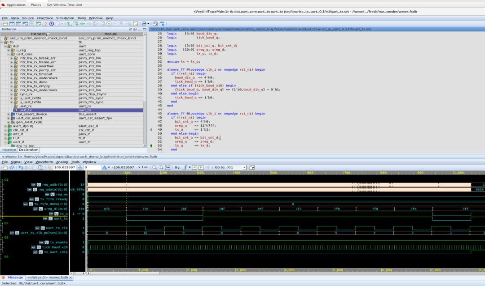

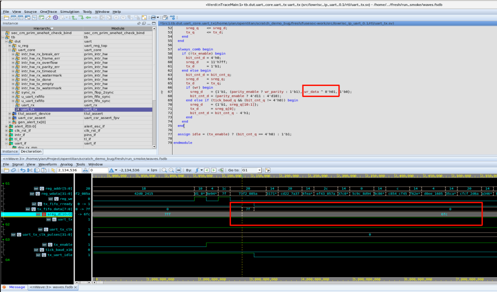

### 1.4.4 这个过程说明了什么

从"scoreboard报10次mismatch"到"定位到uart\_tx.sv第67行的XOR操作"，整个过程AI自主完成了信号路径追踪、逐bit解码、交叉验证。**我全程没有打开Verdi GUI。**

但请注意——AI之所以能做到这些，是因为skill里预先定义了完整的工作流：怎么读FSDB、信号路径用什么格式、怎么过滤NPI的banner输出、怎么处理时间单位转换。没有这些，AI面对一个FSDB文件是无从下手的。

而我之所以能在AI给出分析后迅速确认结果是对的——"是的，0x6FC对应的data确实是0x7E，确实是bit[0]翻转"——靠的是自己对UART协议和移位寄存器结构的理解。**如果我自己不懂这些，AI给出的结论我也无法验证。**

### 1.4.5 关于这个case的难度

肯定有朋友会说：这case太简单了，直接review RTL就能发现，用不着看波形。

没错。但你敢说你没见过比这还简单的问题花了你半小时？环境少source了一个文件、regression 200个case里25个是同一个误报pattern——这些事每一件都不难，但每一件都在吃你的时间。

**省了十分钟也是省时间。** AI帮你扫掉琐碎的，你就有更多完整的时间块去啃真正的硬骨头。

---

## 1.5 黑猫白猫，能抓老鼠的就是好猫

我坚定地认为，**现在AI的能力仍然被严重低估了。** 大多数人还没找到正确的使用方式。

**AI是杠杆，放大你已有的能力。** 你功底扎实，写出的skill就是高质量的，AI就能发挥巨大效能。你基本功不行，写出了有问题的skill自己也发现不了。

> **AI的所有产出都需要人来review。人review AI结果的带宽，才是AI对一个人提升的真正上限。**

---

## 1.6 关于fsdb\_reader.py

这个脚本值得单独说一下，因为它是整个skill里最有技术含量的部分，也是让AI能够"不开GUI就能看波形"的关键。

FSDB是Synopsys的私有波形格式，没有公开的spec。要读它，要么开Verdi GUI，要么用Synopsys的命令行工具（fsdbreport、fsdb2vcd），要么用他们的NPI（Native Programming Interface）。

`fsdb_reader.py`的策略是**NPI优先，CLI兜底**：

**NPI模式：** NPI是Synopsys提供的C/Python接口，可以在代码里直接打开FSDB、遍历信号、读取值变化。但有一个大坑——NPI的`.so`文件是跟Verdi自带的Python 3.6编译的，如果用系统Python 3.7+去加载，直接segfault，没有任何有用的错误信息。我的脚本自动检测Verdi的bundled Python路径，设置好`LD_LIBRARY_PATH`和`PYTHONPATH`，用subprocess调起来。用户（包括AI）完全不需要关心这些兼容性问题。

**CLI兜底：** 如果NPI不可用（比如Verdi版本太老），自动切换到`fsdbreport`/`fsdb2vcd`命令行工具。功能没NPI全面，但基本的信号读取没问题。

另外还做了一件事：**过滤NPI的banner输出**。每次调NPI，Synopsys都会打印一大段license和版权声明（十几行），混在有用的输出里。脚本里有一个关键词过滤列表，把这些banner行全部干掉，只留下干净的信号数据。这对AI的输出解析至关重要——AI需要结构化的数据，不是license声明。

---

## 1.7 Skill的价值：把"可重复的经验"变成"可执行的知识"

干了这些年，我有一个强烈的感受——很多经验是"做过就会，不做就忘"的。比如怎么把老项目跑起来、`-unit_timescale`和`-timescale`的区别、FSDB的NPI接口怎么调、sim.log里哪些是误报……这些东西写在笔记本里，下次用的时候还得翻半天。

Skill把这些经验变成了AI可以直接执行的指令。下次我换一个项目，只要环境类似，source一下.envrc，AI就能按skill走完整个流程。我不需要再记那些flag，不需要再翻笔记。

更重要的是，这个skill可以分享。团队里的新人、或者任何用类似VCS/Verdi环境的人，装上这个skill就能获得一套即开即用的仿真工作流。AI成了一个"随身携带的、有经验的同事"。

---

## 1.8 写在最后

做IC验证是一份需要耐心和经验的工作。AI不会替代这份工作的核心——理解spec、设计测试策略、分析corner case——这些仍然需要工程师的判断力。

但那些重复性的操作——配环境、跑仿真、分析日志、追踪信号——完全可以交给AI来做。前提是你得把你的经验"教"给它。

Skill就是这个"教"的过程。而你教的质量，取决于你自己的功力。

当然，按照AI进化的速度，那些"硬骨头"迟早也会被啃动。到那个时候，游戏规则又会变。但那是以后的事——眼下，先把能用的工具用好。

黑猫白猫，能抓老鼠的就是好猫。工具不分高低贵贱，能帮你抓到bug的就是好工具。

代码已开源：https://github.com/cike128/eda-sim

如果你也在做数字IC设计，也在探索AI辅助工作流，欢迎交流。

---

*（本文提到的eda-sim skill基于Synopsys VCS/Verdi工具链。Skill运行在Claude Code Opus 4.6 effort max。）*

---

# 2. 关于控制Agent上下文的一些方法与思考

> 来源：https://mp.weixin.qq.com/s/UKEy0kFSoLzxq0etvdAqIA
> 作者：AAA建材批发王哥
> update 2026/08/16 01 : 14
---

## 2.1 长对话里 AI 会变笨，这不是错觉

用过 Claude Code 或 Codex 跑过几小时长会话的人，大概都有这个体感：聊到一定程度，AI 像换了个人，开始忘事、开始绕弯、开始把你早就否决过的方案重新提出来。

这不是错觉。**即使是当下最新的御三家 AI——GPT-5.5、Claude Opus 4.7、Gemini 3.1 Pro——上下文占用一旦上到 60%~70% 这个区间，注意力稀释的问题就会客观出现**。这不是某一家模型特有的问题，也不是模型不够强，而是 attention 机制在长序列下的物理限制，不是靠堆参数能根治的。

Stanford 那个 *lost in the middle* 的发现在过去几年里被反复验证：长上下文里开头和结尾的信息记得清楚，中间段的信息准确率掉得最厉害。各家厂商宣称的256k, 1M甚至更大的上下文窗口，跟它实际能稳定使用的"有效上下文"完全是两件事。

放到 coding agent 场景下，这个问题被进一步放大，原因有三个：

1. **上下文是只进不出的**。每次 read file、每个 grep 结果、每条 bash 输出都堆进窗口里，直到你手动 compact 或撞上限。
2. **干扰项密度高**。代码库里语义相似的函数一抓一大把，模型注意力被稀释。
3. **任务跨度长**。一个调试任务跑一两小时是常态，期间上下文质量持续滑坡。

所以问题从来不在于窗口够不够大——基本上你想用多大都有——而在于**怎么让窗口里始终是高质量的信息**。

---

## 2.2 Compact 不是好答案，Sub-agent 才是

绝大多数人遇到这种情况的第一反应是 `/compact`——把历史对话压成摘要，腾出空间继续聊。

这是个无奈的选择。Compact 本质上是一次有损压缩，而且是**模型自己决定哪些信息可以扔**。对于一个长链条的调试任务，被扔掉的往往就是后来被证明关键的那一行约束、那一个 corner case、那一段 waveform 描述。我个人现在已经基本不主动 compact，宁可换思路。

更好的思路是：**从源头控制什么信息有资格进主上下文**。

这就是 sub-agent 真正在做的事。它的本质不是"帮你跑个支线任务"，而是建立了一个**信息隔离边界**——子 agent 在自己独立的上下文窗口里折腾，跑工具、读文件、试错、走弯路，所有这些过程性的、低信噪比的 token 都待在子上下文里，**只有最后被它自己提炼出来的结论，才有资格回到主线**。

主对话从头到尾保持干净。

具体到 Claude Code 和 Codex 这两个工具，我现在最常用的有两套机制，一套轻量、一套重量，分别对应不同场景。

---

## 2.3 轻量版：Claude Code 的 `/btw` 和 Codex 的 `/side`

这是我使用频率最高的一对命令，专门用来处理"快问快答"式的临时插队问题。

什么场景？——主线讨论 RTL 实现，中间冒出一个我不熟悉的概念、一个想确认的细节、一个突然想起来的疑问。这种问题不值得为它专门派一个 sub-agent 跑流程，但又必须搞清楚才能继续往下走。

以前怎么办？要么开个新窗口去问，要么硬着头皮在主线里问完——前者切上下文累，后者污染主线。

`/btw`（Claude Code，by the way 的缩写）和 `/side`（Codex）就是为这个场景设计的：

- 直接在主对话里输入命令，起一个临时的轻量级会话
- 你可以在里面**进行多轮对话**，把这个小问题真正讨论清楚——不是只能问一句就走
- 讨论完直接退出，主线一个字都不被污染，继续从你刚才停下的地方往下走

它比 `/fork` 轻很多，因为不继承父对话的完整历史，起来快、退得也快。我自己日常用它的频率比 `/fork` 还高——基本上每天几十次。

一旦用顺了，你会发现自己的提问意愿都变了：以前嫌切上下文麻烦，很多疑问就咽下去了；现在每个小疑问都可以"快问快答"地解掉，做完一个复杂任务回头看，中途其实顺手把好几个知识盲点也补了。

---

## 2.4 重量版：Claude Code 的 `/fork` 和 Codex 的 sub-agent

`/btw` 和 `/side` 适合小问题，但有些任务本身就复杂——比如"基于我们刚刚定的接口约定，去看看 RX 那边的状态机会不会冲突"——这种任务需要主线积累的完整上下文，需要跑工具、需要可能几十轮的内部探索。这时候轻量级会话就不够用了。

### 2.4.1 Claude Code：`/fork` vs 普通 sub-agent

Claude Code 现在有两套机制，区别值得搞清楚：

- **普通 sub-agent**：你让它"派一个 agent 去把 testbench 里所有的 assertion failure 列出来"，它会启一个干净上下文的子 agent，跑完只回传结论。适合任务独立、不需要主线背景的场景。
- **`/fork`**：这是相对新的机制，关键差别在于——**fork 出来的子 agent 继承父对话的完整历史和系统提示**，但它自己后续的工具调用不污染主上下文。Anthropic 官方文档里写得很清楚：fork 牺牲了输入侧的隔离，换取了"不用重新解释背景"这件事，同时保留输出侧的隔离。

什么时候用哪个，我自己的判断标准很简单：

- 如果支线任务**需要主线积累的上下文**，用 `/fork`。
- 如果支线任务**完全独立**（比如"去 grep 一下整个 repo 里所有用到 SVA 的地方"），用普通 sub-agent，启一个干净窗口反而更好。

启用 `/fork` 需要在环境变量里设 `CLAUDE_CODE_FORK_SUBAGENT=1`，然后在交互会话里直接 `/fork <你的问题>` 即可。

### 2.4.2 Codex CLI：显式委派 + `/agent` 切换

Codex 这边的设计哲学不太一样。它没有对应的 `/fork` 命令，而是：

- 你**显式地**在 prompt 里说"开一个 subagent 去做 X"，Codex 才会派生子线程（默认是不会的）。
- 用 `/subagents` 命令在多个活跃 agent thread 之间来回切换、查看、停止、关闭。
- 主线和子线之间是平行的多线程模型，而不是 Claude Code 那种"父-子层级"模型。

Codex 官方 best practice 文档里有句话写得挺直白：**主 agent 应该聚焦核心问题，subagent 用来 offload 探索、测试、triage 这种"边界明确但会污染上下文"的工作**。

---

## 2.5 为什么这套用法对我个人特别契合

这一段我想多说几句。

我自己的思维方式比较发散，做事喜欢刨根问底。一个新概念出现，没搞懂之前会一直停在那里。这个习惯在没有 sub-agent 之前其实挺折磨人——讨论一个 RTL 实现，中间冒出一个我不熟悉的 protocol 细节，我要么硬着头皮跳过去（后面经常翻车），要么停下来去查，等查完回来，主线的思路已经断了，得花十几分钟把刚才在想什么重新捡起来。

`/btw`、`/side`、`/fork`、sub-agent 这一整套机制，相当于让我能在主线里随时按下"暂存"——派一个支线去把疑问搞清楚——再回到主线，主线的所有状态原封不动。我在上面感受到的认知负担减轻是非常显著的，做复杂项目的时候明显感觉自己能同时 hold 住更多东西了。

以前 Claude Code 早期版本只有 `/branch`，体验差一截。Branch 出去要回来还得记 session ID、还得手动 resume，这个流程本身就在消耗注意力，几次之后你就懒得用了。现在两个工具都把这套流程做顺了，门槛低到你不会再因为"嫌麻烦"而放弃使用，这才是它们在 2026 年初我觉得最值得推荐的更新。

---

## 2.6 最后一点感受

写到这里，顺便想多说几句最近这几个月深度使用 Agent CLI 工具下来的一点感受。

用得越久，我越发现一件事：**在有限的资源里，让一个能力有限的下属把事情做成，真的是一门难度不低的手艺**。

现在的 AI 模型，哪怕已经迭代到 GPT-5.5、Claude Opus 4.7 这一代，能力依然是有边界的。它会忘事、会过度自信、会在不该走捷径的地方走捷径、会在你没盯着的时候偷偷把硬骨头绕过去。

面对这种情况，我现在已经不会主动去要求模型自己 auto-complete 一个长任务，也不会傻等它"自己想明白"——因为那样基本一定会损失一些东西，而且损失的往往是你最在意的那部分。

我现在的做法是：**有意识地去控制工具的"行为"，而不是去期待它的"能力"强到能解决所有事情**。

我不去强求它变得更聪明——它的智商就在那里，我改变不了；但我可以通过 `/btw`、`/side`、`/fork`、sub-agent 这些机制，把它框定在一个我已经验证过、效果最好的工作状态里。让主线干主线该干的事，让支线吸收所有探索性的损耗。

这就是我现在用 AI 的一点态度。仅供参考。

如果您有什么关于数字设计前端，中端，验证，任何与 AI 相关的想法、建议，或者有一些想要去实现的东西，欢迎来聊一聊。


---

# 3. AI辅助覆盖率收敛的坑在哪里？

> 来源：https://mp.weixin.qq.com/s/yvwsNtz5eaWrZLzUVAyYMg
> 作者：make ic
> update 2026/08/17 23 : 20


---

验证要回答的问题是：**设计的行为空间里，有没有和意图不一致的地方。**

而覆盖率回答的是另一个问题：**已经跑过的激励，碰到了哪些预先定义好的点。**

这两个问题之间，隔着两层塌方。

第一层，覆盖模型是人写的。没写进 covergroup 的状态组合，工具永远不会提醒它缺席。

第二层，检查器也是人写的。约束随机跑到了那个点，scoreboard 没盯住那条路径，覆盖率照样加一分，bug 照样活着。

所以"覆盖率 100%"这句话，严格的说法应该是：*人类想到的地方，都跑过了。*

至于人类没想到的部分——那才是流片失败的主要来源。

---

## 3.1 机器学习进来了，先看清它在哪一层干活

近两年 EDA 厂商把 AI 塞进了验证流程，方向基本一致：用机器学习引导约束随机，把仿真算力花在有价值的种子上。

Synopsys 的 VSO.ai 在 VCS 里做覆盖驱动的约束求解，宣传的数据是同样的跑测次数下多拿到 33% 的功能覆盖率，同时缩小回归规模。Cadence 的 Verisium SimAI 走的是从回归数据里学习、把仿真往罕见事件上推的路子。

这些工具确实有用——**它们把"最后 10% 覆盖率要烧掉 60% 算力"这件事，变得便宜了。**

但要说清一件事：这一类优化，做的是**搜索效率**，而不是**认知补全**。

模型的输入是覆盖点定义、约束、历史仿真数据。它的目标函数是"点亮更多已定义的 bin"。**一个从未被定义的覆盖点，对模型来说不存在梯度，也不存在诱因。**

指望它替人想出漏掉的场景，等于指望地图软件帮你发现没修的路。

再补一句更扫兴的：机器学习天生偏爱"接近已跑通路径"的解。**它会把已经收敛的区域打磨得更漂亮，而真正的盲区往往在分布的尾巴上**，那里样本少、回报慢，模型本能地绕开。

覆盖率曲线因此变得更好看，风险曲线未必跟着下降。

---

## 3.2 真正能预测盲区的信号，藏在别的地方

如果目标是找盲区，机器学习的输入就该换一批数据。有几个方向在实践里明显更有价值。

**代码结构与覆盖率的错配。** 拿 RTL 的控制流复杂度、状态机深度、跨时钟域路径数量，去对齐功能覆盖模型的密度。某个模块代码复杂度排前 10%，覆盖点数量排后 30%——这个偏差本身就是一条高质量线索。

**历史 bug 的空间分布。** 同一家公司、同一批人、同一套设计习惯，bug 会聚类。上一代芯片的 bug 集中在低功耗握手和复位释放边界，这一代大概率还在那里。**Bug 有惯性，因为写代码的人有惯性。**

**回归数据里的"永远相邻"关系。** 两个覆盖点在几十万次仿真里从来没有同时被点亮，可从设计意图看它们应该可以共存。这种交叉的缺口，人工翻报告基本翻不出来，做成关联分析却很自然。

---

## 3.3 工具变强之后，判断力反而更贵

工具能把搜索做到极致，唯独没法替人回答"什么才值得被搜索"。**覆盖率盲区的本质是认知盲区，而认知盲区不在仿真器里，在人的假设里。**

一个成熟的做法：把每一条 waiver 当作一次赌注登记下来，写清楚赌的是什么前提。项目末期回头看这份清单，往往比任何 AI 报告都更有信息量——它记录的是团队集体相信过、却没验证过的东西。

---

覆盖率是一面镜子。它照出的是验证工程师的想象力边界，而不是设计的正确性边界。

机器学习让这面镜子擦得更亮、更快。至于镜子对着的方向，还得靠人自己拿主意。

---

# 4. AI 写 UVC？我踩了无数坑后，搞了个 Skill 包救自己

> 来源：https://mp.weixin.qq.com/s/JPJMb_WtbNge857dP66kCg
> 作者：福尔摩芯
> update 2026/08/22 11 : 21

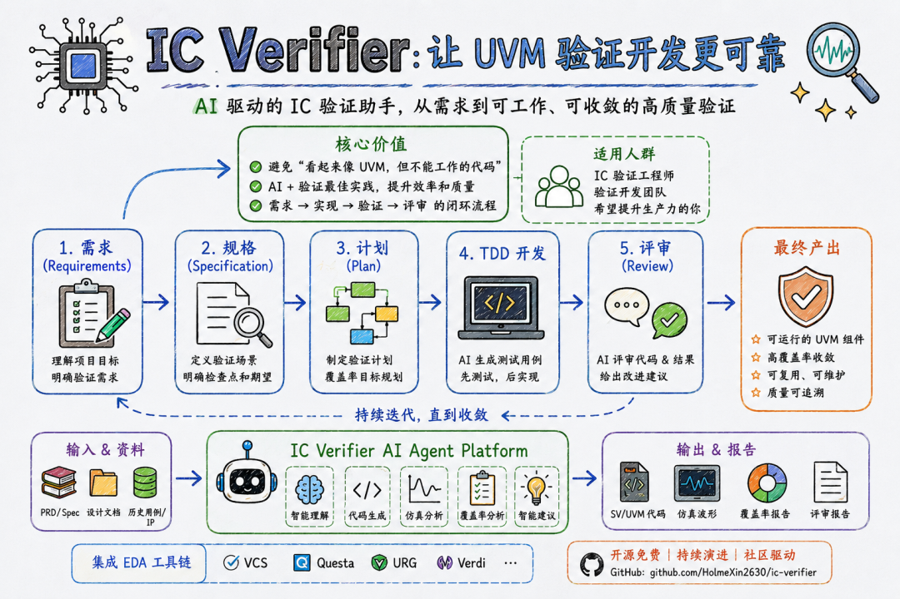

## 4.1 一周没更新，后台炸了

上周休假出去浪了一圈，整整一个星期没更新公众号。本来以为大家会把我忘了，结果后台私信和互动反而更多了。

看来大家对 UVM/UVC 的开发确实很感兴趣，这个话题的热度远超我的预期。

本来我在想，怎么能把 UVC 的开发介绍做得更浅显易懂一些。但是转念一想——现在都是 AI 时代了，**未来的 UVC 开发，完全可以交给 AI 来做啊！**

于是旅游回来以后，我就迫不及待地尝试了一下。

结果……一言难尽。

---

## 4.2 第一次尝试：AI 的 UVM，语法都写不对

我先用 mimo-v2.5-pro，让它按照我之前介绍的 UVC 开发思路，去开发一个 APB UVC。

信心满满地等它输出，然后一看代码，我人傻了：

```
// AI 生成的"精彩"代码
// AI 生成的"精彩"代码
class
class
 apb_driver
extends
extends
 uvm_driver;
    def run_phase(self, phase):
// 这是 Python 吧？！
// 这是 Python 吧？！
while
while
 True:
            item = self
.seq_item_port
.seq_item_port
.get_next_item
.get_next_item
()
            self
.drive
.drive
(item)
function
function
 drive(item):
// SV 里混 Python？
// SV 里混 Python？
if
if
 item
.direction
.direction
 ==
"READ"
"READ"
:
            self
.vif
.vif
.paddr
.paddr
 = item
.addr
.addr
// ...
// ...
```

**我：？？？这是 UVM？**

UVM 里混杂了 Python 的 `def`、`self`、`while True`，还有一堆不伦不类的语法。这要是能仿真通过，我把键盘吃了。

不死心，我又切到了 DeepSeek v4，结果也没好到哪里去。虽然语法错误少了，但生成的代码风格诡异，各种反模式层出不穷。

**原因分析：** 用于 AI 训练的 SystemVerilog/UVM 代码量，相比 Python、Java 这些主流语言，实在是太少了。AI 对 UVM 的理解，基本停留在"看起来像 UVM"的程度。

---

## 4.3 第一轮突破：给 AI 加上"红绿灯"——TDD

既然 AI 写的代码质量不行，那怎么才能让它**知道自己写错了**？

答案是：**测试！**

我让 AI 先写了一套 APB 的基本测试用例：

```
// 基础测试用例
// 基础测试用例
class
class
 apb_basic_test
extends
extends
 uvm_test;
// 1. 单次读操作
// 1. 单次读操作
// 2. 单次写操作
// 2. 单次写操作
// 3. 随机读写操作
// 3. 随机读写操作
// 4. 连续读（back-to-back read）
// 4. 连续读（back-to-back read）
// 5. 连续写（back-to-back write）
// 5. 连续写（back-to-back write）
// 6. 读写交替操作
// 6. 读写交替操作
endclass
endclass
```

然后告诉 AI："你按照 TDD 的方式开发 UVC，写完以后必须用仿真工具跑通这些测试，才算完成。"

这一步效果立竿见影！

AI 开发的 UVC 终于能编译通过、仿真成功了。但是……实际操作的时序还是有些问题。比如 APB 的 setup phase 和 access phase 时序不对，信号的驱动时机有偏差。

于是又继续来回迭代，让 AI 通过查看仿真波形（VCD）来识别自己的时序错误，然后修复。

**折腾了好几轮，UVC 终于能跑起来了。**

---

## 4.4 第二轮突破：Wavedrom——让 AI 正确"看懂"时序

时序问题一直困扰着我。

做芯片设计或验证的同学都知道，**描述时序是一件非常麻烦的事情**。尽管我们可以用自然语言描述，但要把一个时序描述清楚，自然语言的篇幅可能比 Verilog 代码还长。

比如你想告诉 AI："在时钟上升沿，如果 PSEL 为高且 PENABLE 为低，则进入 setup phase，此时 PADDR 和 PWRITE 必须稳定；下一个周期 PENABLE 拉高，进入 access phase……"

光描述一个 APB 的基本读写时序，就要写一大段。而且 AI 还不一定能完全理解。

**有没有一种好的交互格式，能让 AI 准确地知道各信号之间的时序关系？**

这时候我发现了一个叫 **WaveDrom** 的东西。

> “
>
> **WaveDrom** 是一个基于 JSON 格式描述数字时序图的开源工具。它使用一种叫做 WaveJSON 的语法，可以用简洁的 JSON 结构精确描述信号的波形时序。
>
> 官网：https://wavedrom.com/

举个例子，用 WaveDrom 描述一个简单的 APB 读操作：

```
{
"signal"
"signal"
: [
    {
"name"
"name"
:
"PCLK"
"PCLK"
,
"wave"
"wave"
:
"p....."
"p....."
},
    {
"name"
"name"
:
"PSEL"
"PSEL"
,
"wave"
"wave"
:
"01.0.."
"01.0.."
},
    {
"name"
"name"
:
"PENABLE"
"PENABLE"
,
"wave"
"wave"
:
"0.10.."
"0.10.."
},
    {
"name"
"name"
:
"PWRITE"
"PWRITE"
,
"wave"
"wave"
:
"0....."
"0....."
},
    {
"name"
"name"
:
"PADDR"
"PADDR"
,
"wave"
"wave"
:
"x=x..."
"x=x..."
,
"data"
"data"
: [
"addr"
"addr"
]},
    {
"name"
"name"
:
"PRDATA"
"PRDATA"
,
"wave"
"wave"
:
"x.=x.."
"x.=x.."
,
"data"
"data"
: [
"data"
"data"
]},
    {
"name"
"name"
:
"PREADY"
"PREADY"
,
"wave"
"wave"
:
"x.10.."
"x.10.."
}
  ],
"config"
"config"
: {
"hscale"
"hscale"
:
2
2
}
}
```

用这种格式，我可以把时序**精确地、结构化地**告诉 AI，而不是用一大段自然语言去描述。

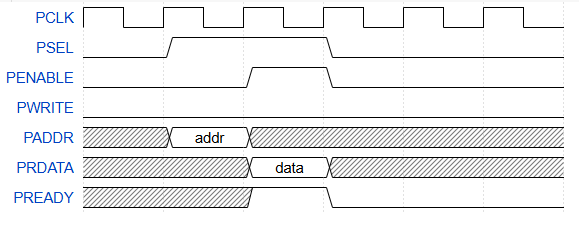

时序图效果

AI 拿到这个 JSON 以后，就能清楚地知道：

- 什么时候 PSEL 拉高
- 什么时候 PENABLE 拉高
- 什么时候地址和数据必须稳定
- 什么时候从设备可以返回数据

**继续迭代 UVC，此时生成的代码时序已经比较准确了。**

---

## 4.5 第三轮挑战：Guidelines——让 AI 写出"好"的 UVC

UVC 能跑、时序也对了，但这还不够。

UVC 毕竟是给别人用的，需要满足一些工程规范：

- **高内聚、低耦合**：组件之间职责清晰
- **依赖注入原则**：配置通过顶层注入，而不是底层自己去 config\_db 里 get
- **避免递归式 config\_db**：不要到处乱 set/get，导致配置链路混乱
- **遵循 UVM Cookbook 的最佳实践**

于是我把 UVM Cookbook 里的 guideline 做成 skill，用来指导 AI 生成 UVC。

**然后……我就被拖进泥潭了。**

### 4.5.1 问题一：Guideline 写得太抽象，AI 不理解

一开始我写的 guideline 比较简短：

> “
>
> "代码要符合 OOP 思想，遵循高内聚低耦合原则。"

结果 AI 根本不买账。它"理解"的 OOP 跟我想要的完全不一样。

后来我发现，**必须写成"正确示范"和"错误示范"的形式**，AI 才能理解：

```
// ✅ DO: Use config to control active/passive
// ✅ DO: Use config to control active/passive
if
if
 (cfg
.is_active
.is_active
 == UVM_ACTIVE)
begin
begin
    drv = my_driver::type_id::create(
"drv"
"drv"
,
this
this
);
end
end
// ❌ DON'T: Use config_db for config within UVM hierarchy
// ❌ DON'T: Use config_db for config within UVM hierarchy
uvm_config_db
#(int)::get(this, "", "is_active", is_active)
#(int)::get(this, "", "is_active", is_active)
;
// WRONG
// WRONG
```

但是这样一来，skill 的内容就变得非常大，很快就把上下文窗口占满了。UVC 迭代两轮，上下文就没了。

### 4.5.2 问题二：模型差异巨大

不同模型对代码的理解能力天差地别：

| 模型 | 表现 |
| --- | --- |
| GPT-5.5 | 一直比较符合预期，理解能力强 |
| MIMO v2.5 | 偶尔降智，需要反复提醒 |
| DeepSeek v4 | 时好时坏，不太稳定 |

切换模型以后，之前好不容易调通的流程又开始出问题。

**这一刻我深刻体会到：光靠 prompt 和 guideline，是不够的。**

---

## 4.6 最终方案：代码模板化，脚本 + Prompt 两步走

折腾了好几天以后，我终于想通了一个道理：

> “
>
> **不要让 AI 做它不擅长的事情。**

AI 擅长什么？**填充逻辑、实现细节、处理变化的部分。**

AI 不擅长什么？**保证代码结构的一致性、遵循复杂的规范。**

那怎么办？

**脚本生成框架，AI 填充逻辑。**

以前我不是开发过一个生成 UVC 的脚本吗？（uvc\_gen）先把 UVC 的框架用脚本生成出来，再让 AI 去填充时序和具体的协议逻辑。

**说干就干！**

效果立竿见影——AI 生产出来的 UVC 非常符合我的预期了：

```
#
#
 第一步：脚本生成 UVC 框架
 第一步：脚本生成 UVC 框架
python3 uvc_gen.py -n apb -m single -v v1.0 -o ./my_project
#
#
 第二步：AI 填充时序和逻辑
 第二步：AI 填充时序和逻辑
#
#
 此时 AI 只需要关注 drive_trans() 和 rcv_data_phase() 的实现
 此时 AI 只需要关注 drive_trans() 和 rcv_data_phase() 的实现
```

脚本保证了代码结构、命名规范、TLM 连接等"骨架"部分的正确性，AI 只需要往里面填"肉"。

---

## 4.7 env-builder：一个完整的 UVC 开发 Skill

搞定了上面这些问题以后，我把整个流程整合成了一个 Claude Code Skill——**env-builder**。

这个 Skill 由两部分组成：

### 4.7.1 uvc\_gen：UVC 框架生成脚本

uvc\_gen 是一个 Python 脚本，支持生成常见的 UVM 组件框架：

**支持的模式：**

- **single 模式**：单 agent 类型（如 APB、SPI、I2C）
- **mstslv 模式**：主从类型（如 AXI、AHB）
- **多通道 env 层**：支持多个 agent 的环境封装

**设计原则：**

- 遵循**依赖注入**原则：UVC 开发后向使用者提供 `sequence_lib` 作为 API
- 控制 agent 只能通过顶层的 cfg 依赖注入
- 去掉了递归式的 `config_db`，避免底层配置被破坏
- 最终使用体验：**把 UVC 当作 Python 的库一样简洁，最大化方便使用者集成和复用**

```
# 安装
# 安装
npx skills add HolmeXin2630/ic-verifier -g
# 使用（自动调用 uvc_gen）
# 使用（自动调用 uvc_gen）
> /env-builder
> Create an APB UVC with driver, monitor, and sequencer
```

### 4.7.2 开发 UVC 的流程

参照 **Brainstorm** 的思路，开发 UVC 的过程中 AI 会层层询问你的需求：

```
┌─────────────────────────────────────────────────────────┐
│  Step 1: 需求澄清                                        │
│  - 这是什么协议？                                        │
│  - 需要哪些组件？（driver/monitor/scoreboard）            │
│  - 使用场景是什么？                                      │
│  - 时序要求是什么？                                      │
├─────────────────────────────────────────────────────────┤
│  Step 2: 生成 UVC 框架                                   │
│  - 调用 uvc_gen 生成代码骨架                             │
│  - 生成 config、transaction、agent 等组件                │
├─────────────────────────────────────────────────────────┤
│  Step 3: 编写开发文档                                    │
│  - 输出 spec（架构、接口、时序）                         │
│  - 用户确认后继续                                        │
├─────────────────────────────────────────────────────────┤
│  Step 4: TDD 开发                                        │
│  - 先写测试用例（RED）                                   │
│  - 填充实现逻辑（GREEN）                                 │
│  - 仿真验证（需要告知 AI 你的 EDA 工具）                 │
├─────────────────────────────────────────────────────────┤
│  Step 5: Review                                          │
│  - 调用 review-agent 审查代码                            │
│  - 检查 UVM 规范、命名、时序等                           │
│  - 发现问题则回到 Step 4                                 │
└─────────────────────────────────────────────────────────┘
```

在 TDD 开发过程中，你需要告知 AI 你所使用的 EDA 工具是什么（VCS、Xcelium、Questa 等），它会自动配置编译和仿真命令。


---

## 4.8 ic-verifier：一个面向 DV 的 AI Skill 技能包

env-builder 只是开始。

我的规划是开发一个完整的 **IC Verifier** 技能包，覆盖验证工程师的日常工作场景：

| Skill | 命令 | 状态 | 说明 |
| --- | --- | --- | --- |
| UVM Environment Builder | `/env-builder` | ✅ 可用 | UVC/VIP 开发全流程 |
| Testplan Manager | `/testplan` | 🔜 规划中 | 测试计划管理 |
| Coverage Closure | `/coverage` | 🔜 规划中 | 覆盖率收敛 |
| Formal Property | `/formal` | 🔜 规划中 | 形式化属性验证 |

**最终目标：** 让 AI 成为验证工程师的得力助手，而不是一个"看起来像在帮忙，实际上在添乱"的工具。

---

## 4.9 总结：AI 开发 UVC 的正确姿势

经过这一番折腾，我总结出了 AI 开发 UVC 的几个关键点：

### 4.9.1 TDD 是必须的

不要相信 AI 一次就能写对。先写测试，再写代码，让仿真工具来验证。

### 4.9.2 时序描述要结构化

用 WaveDrom 或类似的格式精确描述时序，而不是用自然语言"大概说一下"。

### 4.9.3 框架和逻辑分离

用脚本生成框架（保证结构正确），让 AI 只负责填充逻辑（发挥它的创造力）。

### 4.9.4 Guidelines 要具体

"符合 OOP 思想"这种抽象描述没用，必须写成"正确示范 vs 错误示范"的形式。

### 4.9.5 不同模型要区别对待

GPT-5.5、MIMO、DeepSeek 的表现差异很大，要根据实际情况调整策略。

---

## 4.10 项目地址

**ic-verifier：** https://github.com/HolmeXin2630/ic-verifier

欢迎安装试用：

```
npx skills add HolmeXin2630/ic-verifier -g
```

**欢迎大家使用，有任何问题和建议，欢迎在 GitHub 上提 issue！**

---

#UVM #VIP #UVC #AI #SKILL

---

# 5. AI 会写 testbench 了，验证工程师慌不慌？

> 来源：https://mp.weixin.qq.com/s/TcqJtzm75mTMgOTU_HJYWQ
> 作者：make ic
> update 2026/08/22 11 : 44

某个周三下午，组里的新人用大模型生成了一份 UVM 环境的骨架。

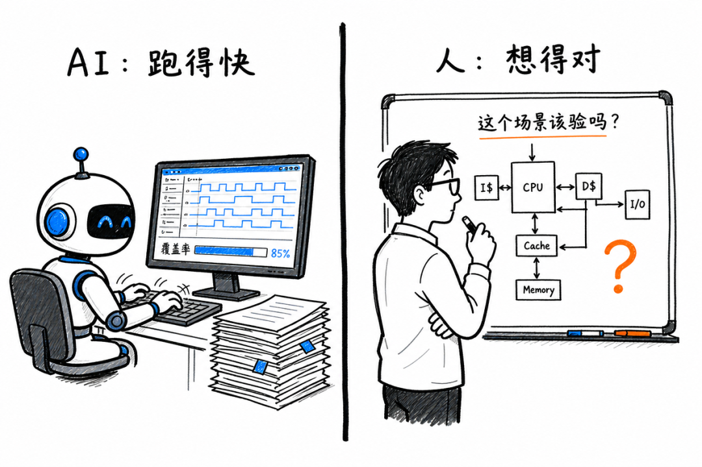

driver、monitor、sequencer、agent，一应俱全，命名规范得能直接进公司模板库。二十分钟，抵得上过去两天的手速。

---

## 5.1 先说清楚 AI 到底吃掉了什么

得承认，AI 在验证上的进展是真的，而且不慢。

Synopsys 的 VSO.ai 已经在 NVIDIA 的项目里落地，公开数据是功能覆盖率提升超过 33%，回归压缩 2 到 7 倍。Cadence 在 2026 年 COMPUTEX 上直接放出了所谓"L5 级自主 AI 芯片设计工程师"。学术界那边，ASP-DAC 2026 有专门的 LLM 辅助电路验证综述，agentic AI 做形式验证覆盖率收敛的论文也已经出来了。

把这些东西拆开看，AI 真正吃掉的是三类活：

**「重复性的代码搬运」**——寄存器模型、总线 agent、这些有标准答案的东西。

**「大规模的搜索」**——从几千个随机种子里挑出最有可能碰到新覆盖点的那批，这本来就是机器擅长的组合优化问题。

**「日志里的模式识别」**——一万条 failure 归成三类，找出最可能的 root cause 嫌疑犯。

这三类加起来，占了不少验证工程师的日常工时。有人焦虑，很正常。

---

## 5.2 验证到底在解什么问题

想找护城河，得先回到最原始的问题上。

**「验证的本质，是在一个近乎无限大的状态空间里，用有限的资源，建立起"这颗芯片能用"的信心。」**

注意这句话里的三个词：无限、有限、信心。

状态空间是无限的。一个带 cache 的多核 SoC，理论状态数远超宇宙原子总数，穷举永远不可能。资源是有限的，流片有 deadline，服务器有配额，人有下班时间。

而"信心"这个词，是整件事的关键——它不是一个数字，它是一个判断。

覆盖率 100% 不等于设计没问题，这话每个验证工程师都会背。真正的问题在于：**「覆盖率模型本身是人定义的。」** 一个没被写进 covergroup 的场景，跑一亿个种子也不会被发现。

AI 能帮你更快填满你画的那张表。**「它填不了你没画的那一格。」**

---

## 5.3 护城河在哪：三样 AI 短期拿不走的东西

### 5.3.1 把模糊的意图翻译成可执行的判断

Spec 永远是不完整的。这不是架构师偷懒，是自然语言的固有属性。

真正决定芯片成败的，往往是那些没写进文档的东西：两份 spec 之间互相矛盾的一句话、设计者脑子里默认成立但从没说出口的假设。

处理这些，靠的是把设计、软件、系统架构三边的人拉进一个会议室，吵一个下午，然后达成共识。**「这个过程的输入不在任何一份可训练的语料里。」**

### 5.3.2 判断什么值得验，什么不值得

带宽有限时的取舍，是验证工程师最值钱的能力，也最不容易被看见。

流片前两周，还剩 40 个覆盖点没收敛。哪几个必须补，哪几个可以写进 waiver，哪几个属于"理论上存在但实际软件永远不会这么用"——**「做这个决定要承担责任，而 AI 目前不承担任何责任。」**

工具可以给你一份排序建议。签字的还是人。

### 5.3.3 对失败的直觉

老验证工程师有一种说不清的能力：看一眼波形，就知道"这个味道不对"。

这个直觉的底层，是几百个 bug 积累下来的因果模型——知道哪种设计写法容易在什么地方出错，知道哪个 IP 的 vendor 交付质量向来一般，知道上次流片回来的 silicon bug 长什么样。

**「这是经验的压缩，不是知识的检索。」** 大模型能检索，压缩得还很粗糙。

护城河存在，但它在变窄。

那种只会照着 spec 写 sequence、只会盯着覆盖率报告跑回归的岗位，会消失。速度可能比预期快。

行业里已经有一种明显的分层：**「AI 让能力强的人更强，让能力一般的人被替代。」** 高级工程师用 AI 一天干完三天的活，因为他知道该让 AI 干什么、以及怎么检查 AI 干的对不对。而缺乏系统理解的人，用 AI 生成一堆自己看不懂的代码，反而制造了更难查的问题。

**「AI 放大的是判断力，不是打字速度。」** 判断力为零的时候，任何数乘以零还是零。

---

## 5.4 该往哪走

三个方向，说得直接一些。

**「往上走」**，走向系统。理解这颗芯片上跑的软件长什么样，理解 SoC 级的性能瓶颈在哪，理解客户真正会怎么用它。这一层的上下文，AI 目前接不住。

**「往下走」**，走向底层机制。形式验证的收敛原理、时序与功能的交界处、post-silicon 的 debug。这些地方需要的是对因果链的完整掌握。

**「往旁边走」**，成为把 AI 用到极致的那个人。工具链的能力边界在哪、什么时候该信它、什么时候必须自己动手，这本身正在成为一项独立的专业技能。

---

## 5.5 最后

验证这个行当，从来卖的都不是代码行数。

**「卖的是一句话：这颗芯片，可以流片了。」**

说这句话需要的东西——对复杂系统的理解、对未知风险的敬畏、以及愿意为判断承担后果——这些东西，机器暂时还学不会。

至于"暂时"有多长，没人知道。所以更实际的做法是：**「别把时间花在担心上，花在那些让判断力变得更值钱的事情上。」**

毕竟，AI 现在还不会在流片评审会上举手说"这个我签"。

---

# 6. FSDB 波形 × MCP：让 AI Agent 主动查波形、验证假设、定位 Bug

> 来源：https://mp.weixin.qq.com/s/K3vvqXlPsMhHBp3dnZWXlA
> 作者：SJ66
> update 2026/08/29 13 : 09

AI-ENABLED DESIGN VERIFICATION

## 6.1 给 AI 一双「看波形的眼睛」

基于 MCP 的 FSDB AI Debug 实践

在 AI-Enabled 芯片工程时代，AI 不应该只帮助工程师写代码、读文档和分析 Log，它还应该能够进入设计验证最核心的工作现场，直接查看波形、检查信号，并完成初步的 Debug 分析。

对于芯片设计验证工程师来说，波形分析几乎是无法绕开的工作环节。当 Testcase Fail、Assertion 触发、Scoreboard 报错，或者 DUT 行为与预期不一致时，工程师通常会打开 Verdi，加载 FSDB 波形，然后沿着时间、层级和数据路径逐层追踪。

Reset 是否在正确时间释放？

Clock 是否正常启动并持续翻转？

总线握手为什么没有完成？

Interrupt 在什么条件下被拉高？

FSM 卡在了哪个状态？

Request 已经发出，为什么 Response 没有返回？

某个信号为什么一直保持常量？

这个信号是否被 Testbench 强制 Force？

数据在时钟边沿前后是否稳定？

这些问题看起来各不相同，但本质上都依赖同一类能力：在正确的时间窗口内，找到正确的信号，并理解这些信号之间的时序关系。

过去，这项工作高度依赖工程师手工操作波形工具。现在，我们可以通过 MCP 给 AI Agent 提供直接查询 FSDB 波形的能力，让 Agent 真正参与到芯片 Debug 的核心流程中。

1

## 6.2 分：AI 如何进入波形 Debug 核心环节

### 6.2.1 从 AI-Assisted 走向 AI-Enabled

过去两年，AI 在芯片设计验证领域的应用越来越广泛。工程师已经开始使用 AI 完成 RTL 和 UVM Code Review、Testplan 与 Assertion 生成、Regression Log 分析、Failure Cluster 分类、Coverage Hole 分析、Specification 问答、Debug Report 生成，以及 Python、TCL 和 Shell 脚本编写。

但在许多实际工作流中，AI 仍然停留在外围。一个 Testcase Fail 之后，Agent 可以读取仿真 Log，并根据错误文本推测 Read Response 没有返回、Register Model 没有同步、Reset 没有释放、Bus Transaction 超时，或者 DUT 内部状态机卡住。问题在于，这些通常只是推测。

```
UVM_ERROR: Read data mismatch
Expected: 0x12345678
Actual:   0x00000000
Time:     152340ns
```

如果 AI 无法访问波形，它就无法确认在 152340ns 之前 Request 是否真正发出，Valid 和 Ready 是否完成握手，Response Channel 是否返回有效数据，目标寄存器是否真的被写入，以及相关信号是否被 Testbench Force。

AI-Assisted Debug：AI 根据人类提供的 Log、截图和文字描述进行推理。
AI-Enabled Debug：AI 可以主动调用工程工具，获取证据，验证假设并继续调查。

真正的 AI-Enabled 并不是让 AI 给出更多猜测，而是让它能够主动执行验证动作。

### 6.2.2 波形是芯片 Debug 中最重要的事实来源之一

在验证环境中，不同数据源承担着不同角色：Specification 描述设计应该如何工作，RTL 描述设计逻辑如何实现，Testbench 描述测试如何激励和检查设计，Simulation Log 描述仿真过程中记录了什么，Coverage 描述哪些功能或代码已经被触达，而 Waveform 描述设计在每一个时间点实际上发生了什么。

波形提供了带时间维度的设计状态。对于一个协议事务，Log 可能只告诉我们最终超时，但波形可以展示 Request 生成、Address 接受、Data 传输、Target Busy、Response 缺失和 Timeout 触发的完整过程。

|  |  |  |  |  |  |
| --- | --- | --- | --- | --- | --- |
| Request generated | Address accepted | Data transferred | Target busy | No response | Timeout |

工程师可以根据波形，将一个模糊的"测试失败"逐步缩小到激励没有生成、信号没有到达 DUT、Interconnect 没有路由、Slave 没有响应、Clock 或 Reset 状态异常、CDC 路径出现问题，或者 Testbench Force 覆盖了设计行为。因此，如果希望 AI Agent 真正参与 Debug，就必须给它访问波形的能力。

### 6.2.3 为什么不能只让 AI 读取波形截图

将 Verdi 波形截图交给多模态模型，适合快速解释小范围波形、分析少量信号、理解已有截图，以及对简单协议时序进行初步判断。但它仍存在三类局限。

第一，截图只包含局部信息。Agent 无法主动改变时间窗口、信号列表、Hierarchy、显示格式和采样条件。

第二，截图不适合精确计算。例如两个事件具体相差多少时间、某信号第一次拉高的时刻、一个时间窗口内发生多少次握手、每个 Clock Edge 对应的数据值，以及 Reset 释放后经过多少个周期进入目标状态。这些问题更适合结构化查询。

第三，Agent 无法继续调查。它从截图中发现异常后，通常需要查看更多上下游信号。如果不能主动查询波形，Debug 流程仍然必须由工程师手工接管。

更有效的方式，是将 FSDB 波形查询能力封装成 Tool，让 AI Agent 像调用搜索、数据库和 Shell 一样主动查询波形。这正是 MCP 可以解决的问题。

2

## 6.3 分：通过 MCP 让 Agent 自己检查 FSDB 波形

### 6.3.1 什么是 FSDB Waveform MCP Server

MCP，即 Model Context Protocol，可以理解为 AI Agent 与外部工具之间的一种标准化接口。我们可以将 Synopsys Fsdbreport 封装成 MCP Server，并向 Agent 暴露一组波形查询工具。

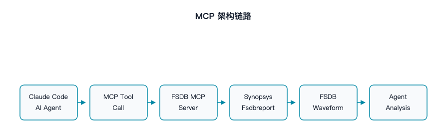

MCP 架构链路

Agent 不需要理解 Fsdbreport 的全部命令行细节。它只需要知道要分析哪个 FSDB 文件、查询哪些信号、查看哪个时间窗口、采用哪种采样方式，以及是否搜索 Force、Release 或 Deposit 事件。MCP Server 负责把意图转换成实际命令，并将结果返回给 Agent。

### 6.3.2 MCP Server 的六项核心能力

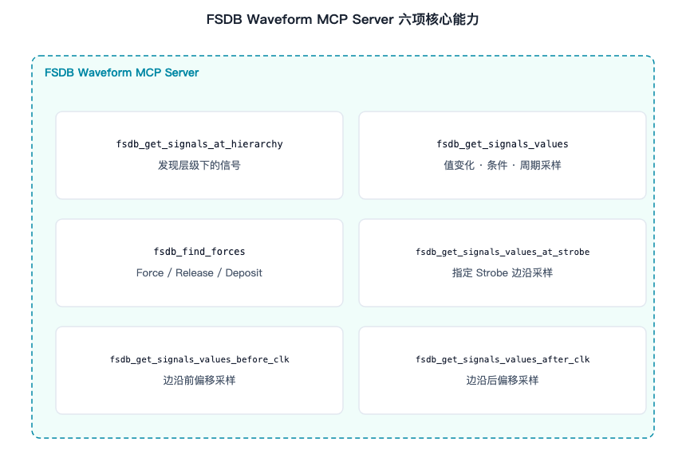

FSDB Waveform MCP Server 六项核心能力

| MCP Tool | 主要能力 | 典型用途 |
| --- | --- | --- |
| fsdb\_get\_signals\_at\_hierarchy | 发现指定 Hierarchy 下的信号 | 进入陌生模块、定位 Clock/Reset/Interface/FSM |
| fsdb\_get\_signals\_values | 查询 Value Change，或按条件、电平、周期采样 | 常规波形分析、握手定位、事件搜索 |
| fsdb\_find\_forces | 查询 Force/Release/Deposit | 排查 Testbench Override 和异常常量 |
| fsdb\_get\_signals\_values\_at\_strobe | 在指定 Strobe Edge 上采样 | 同步逻辑、协议与 FSM 周期分析 |
| fsdb\_get\_signals\_values\_before\_clk | 在边沿前偏移采样 | Setup Side 波形观察 |
| fsdb\_get\_signals\_values\_after\_clk | 在边沿后偏移采样 | Hold Side 或边沿后状态观察 |

### 6.3.3 查询某个层级下的信号

`fsdb_get_signals_at_hierarchy` 用于发现指定 Hierarchy 下有哪些信号。Agent 可以先查询 `/tb/dut/dut/*`，再定位 Clock、Reset、Request、Acknowledge、Address、Data、FSM State、Interrupt 和 Error Status。这相当于工程师在 Verdi 中展开 Design Hierarchy 并查看某个 Instance 下的 Signals。

|  |  |  |  |  |
| --- | --- | --- | --- | --- |
| 发现 Hierarchy | 列出信号 | 筛选关键信号 | 查询信号值 | 分析时序关系 |

FSDB 中的层级分隔符可能使用 "/" 或 "."。查询 Scope 时通常还需要带通配符，因此推荐 Agent 先从顶层或较短路径开始探索，再逐步进入目标模块。

### 6.3.4 查询信号的 Value Change

`fsdb_get_signals_values` 是最常用的工具。它可以查询一个或多个信号在指定时间窗口内的变化，例如检查 req、ack 和 state 在 100us 到 120us 之间的行为。若不指定特殊采样模式，工具返回信号发生变化的时间点和值，适合分析 Request 何时拉高、Acknowledge 是否返回、FSM 如何变化，以及 Error 是否在某个事件后出现。

### 6.3.5 根据条件表达式查询

condition\_expression 对应 Fsdbreport `-exp`。例如 `valid==1 && ready==1` 可以只查看真正发生握手的时间点，`reset_n!=0` 可以帮助查找 Reset 离开初始值的时刻。典型用途包括第一次总线握手、Error Flag 首次出现、Interrupt 拉高、FSM 进入目标状态，以及 FIFO Full 或 Empty 条件发生。

### 6.3.6 按固定周期或电平条件采样

periodic\_sampling\_interval 对应 `-period`，例如每隔 100ns 采样一次目标信号，适合周期性状态检查、性能计数器、Heartbeat、FSM 和 Queue Depth 的趋势观察。levelstrobe 对应 `-levelstrobe`，适合 Enable、Chip Select、Power Domain On 或 Transaction Active 条件成立期间的采样。条件表达式、Level Strobe 和周期采样属于互斥模式，一次查询选择其中一种。

### 6.3.7 在 Clock 或 Strobe Edge 上采样

`fsdb_get_signals_values_at_strobe` 可以在 posedge clk 等指定边沿上采样 Data、Valid、Ready、FSM State、Counter 和 FIFO Pointer。它比普通 Value Change 更适合同步数字逻辑，因为 RTL 状态更新通常与时钟边沿相关。

### 6.3.8 检查时钟边沿前后的信号

`fsdb_get_signals_values_before_clk` 和 `fsdb_get_signals_values_after_clk` 分别用于 Strobe Edge 前后偏移一定时间进行采样，可辅助观察边沿前的数据稳定性，以及边沿后的状态与输出。需要注意，这类查询不是静态时序分析，不能替代 STA 或 Gate-Level Timing Check。它的定位是快速观察 Clock Edge 附近的波形状态，并辅助 Gate-Level Simulation Debug。

### 6.3.9 查找 Force、Release 和 Deposit

`fsdb_find_forces` 是非常适合 DV Debug 的能力。在复杂 UVM 环境中，信号行为异常有时并不是 RTL 本身的问题，而是 Virtual Sequence、Error Injection、Backdoor 操作或 Debug Hook 覆盖了 DUT 行为。该工具能够返回事件对应的信号、时间、值和类型，还可以使用 first\_force\_only 快速查看每个信号第一次被 Force 的时间。

当信号长期保持常量或与 RTL 驱动逻辑不一致时，先排除 Force、Release 和 Deposit，可以显著减少错误方向上的 Debug 时间。

### 6.3.10 经典应用场景

场景一：Reset 和 Clock Bring-up 检查

Agent 可以检查主 Clock 是否开始翻转、Reset 在何时释放、Reset 前后 Clock 是否稳定、FSM 是否离开初始状态、是否出现 X，以及 Clock Gate 是否按预期打开。

```
检查这个 FSDB 中 DMA 模块的启动过程。
先定位 clock、reset、enable 和 FSM state。
分析 0 到 20us：确认 Clock、Reset 释放时间、FSM 离开 IDLE 的周期数，
并检查是否存在 Reset 已释放但 Clock 未启动的窗口。
```

场景二：总线协议握手 Debug

对于 AXI、AHB、APB 或自定义 Request/Response 接口，Agent 可以检查 Request、Valid/Ready、Address、Control、Response、Latency、Backpressure、Timeout 和 Error Response。

```
分析 150us 到 170us 的 AXI Read Transaction。
检查 ARVALID/ARREADY 和 RVALID/RREADY，确认请求是否被接受、Read Data 是否返回，
并计算 Address Handshake 到第一个 Read Data 的延迟。
```

场景三：FSM 卡死分析

Agent 可以查询 FSM State，找到最后一次状态转换，检查进入当前状态的输入条件和离开条件，再结合 RTL 状态机逻辑判断是输入条件不满足还是内部逻辑异常。RTL 告诉 Agent 状态应该如何跳转，FSDB 则告诉 Agent 状态实际上如何跳转。

场景四：定位异常信号是否被 Force

当信号长时间保持 0 或 1、与 RTL 驱动逻辑不一致、在异常时间跳变，或者在不同 Testcase 中表现不同，Agent 可以优先调用 `fsdb_find_forces`，排除 Testbench Override 后再检查 RTL 数据路径。

场景五：围绕 Failure Time 自动收敛

如果 Log 给出 `UVM_ERROR at 152340ns`，Agent 可以先建立 152240ns 到 152440ns 的小窗口，查询 Error 相关信号、上游 Request、目标模块状态、下游 Response 和 Force 事件。随后按证据扩大或缩小时间窗口，逐步找到最早偏离预期的事件。

|  |  |  |  |  |  |
| --- | --- | --- | --- | --- | --- |
| 读取 Failure Log | 提出初始假设 | 查询波形 | 验证或否定 | 追踪上下游 | 形成 Root Cause |

3

## 6.4 分：在 Claude Code 中安装与使用

### 6.4.1 从 GitHub 下载并安装

```
git clone <fsdb-waveform-probe-github-url>
cd fsdb-waveform-probe
uv venv .venv
uv pip install --python .venv/bin/python -e .
```

安装完成后，可独立启动 Server：

```
.venv/bin/python -m server
```

### 6.4.2 三种使用方式

方式一：直接在 Prompt 中调用

```
使用 fsdb-waveform-probe 分析以下波形：
FSDB：/path/to/test.fsdb
首先查看 /tb/dut/DMA/* 下的信号，定位 clock、reset、request、ack、interrupt 和 state。
然后分析 100us 到 120us：
1. Reset 何时释放
2. Clock 是否持续翻转
3. Request 是否被接受
4. Response 是否返回
5. Interrupt 是否拉高
6. 是否存在 Force、Release 或 Deposit
7. 给出关键时间点和初步 Root Cause
```

高质量 Prompt 应明确 FSDB 路径、目标 Hierarchy、时间窗口、已知 Failure Time、关注协议，以及希望回答的问题。

方式二：写入 Skill 的 Validation Step

可以在 DMA Debug Skill 或 Verification Skill 中，将波形查询定义为固定步骤。例如从 Simulation Log 提取第一个 Failure Time，定位 DMA Controller 层级，检查 Clock、Reset、DMA Request、Descriptor、Address、Bus Handshake、Completion、Interrupt 和 Force Event，最后生成带时间证据的 Root Cause Report。

```
Validation Step 4：
调用 fsdb_get_signals_values 检查 dma_req、dma_ack 和 dma_state。
时间窗口使用 Failure Time 前后各 10us。
如果 dma_req 未拉高，继续检查 enable、reset、descriptor_valid 和 start。
如果 dma_req 已拉高但 dma_ack 未返回，则检查下游 Bus Interface。
```

方式三：创建专门的 FSDB Waveform Subagent

复杂项目可以创建专门与 FSDB 交互的 Subagent，并只赋予 FSDB Waveform MCP、RTL Search、Simulation Log 读取和必要的设计文档访问能力。

```
You are an FSDB Waveform Debug Agent.
1. Discover relevant signal hierarchy.
2. Identify clocks, resets, interfaces, states and error signals.
3. Query the smallest useful time window first.
4. Expand the time window only when necessary.
5. Check force, release and deposit before blaming RTL.
6. Correlate waveform evidence with RTL state transitions.
7. Report exact signal names, values and timestamps.
8. Separate observed facts from inferred conclusions.
9. Never claim root cause without waveform or RTL evidence.
```

主 Agent 可将 DMA Timeout 等任务委派给该 Subagent。波形 Agent 返回 Observed Facts、Inference 和 Recommended Next Check，主 Agent 再把波形证据与 Log、RTL、Specification 和历史问题整合起来。这样既能减少主 Agent 的上下文压力，也便于独立维护波形分析策略和工具权限。

4

## 6.5 让 Agent 分析波形时应遵循的原则

### 6.5.1 先探索层级，再查询信号

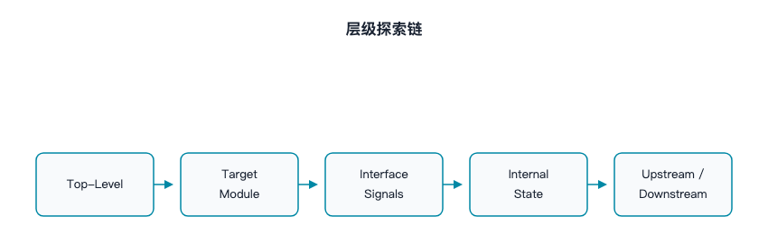

层级探索链

不要让 Agent 一开始就猜完整 Signal Path。先确认真实层级和命名，再逐步下钻。

### 6.5.2 优先使用小时间窗口

大型 FSDB 查询可能消耗 CPU、内存、磁盘、NFS 带宽、EDA License 和 Agent Context。如果已有 Failure Time，应先查询其附近的小窗口，只有在证据不足时才逐步向前扩展。

### 6.5.3 区分事实、推断和结论

**Observed Facts：**req 在 100ns 拉高，ack 在 500ns 前始终为 0，state 在 110ns 进入 WAIT\_ACK。

**Inference：**状态机正在等待下游响应。

**Root Cause 或 Next Step：**当前证据只能证明 Response 未返回，需要继续检查下游 Slave 的 Clock、Reset 和 Request 接收状态。

这种分层表达可以避免 Agent 把相关性错误解释为根因。

正确定位是：它让 AI Agent 获得波形调查能力，而不是让 Fsdbreport 取代所有验证和 Signoff 工具。

5

## 6.6 结语：从「回答问题」到「自主验证」

当 AI 只能阅读文档和 Log 时，它更像一个知识助手。当 AI 可以调用 FSDB MCP 后，它开始具备工程验证能力。

|  |  |  |  |  |  |  |
| --- | --- | --- | --- | --- | --- | --- |
| 读取错误 | 提出假设 | 查询信号 | 验证假设 | 继续追踪 | 收集证据 | 形成结论 |

这意味着 Agent 不再只是回答"这个 Failure 可能是什么原因"，而是可以明确说明它检查了哪些 Reset、Clock、Request、Response、FSM 和 Force Event，最早异常发生在什么时间，以及下一步应追踪哪个上游或下游模块。

波形是芯片运行行为最直接的记录，也是设计验证 Debug 中最重要的事实来源之一。通过 MCP 将 Fsdbreport 封装为标准化工具，我们可以让 Claude Code 或其他 Agent 主动探索 FSDB Hierarchy、查询信号变化、按条件采样、分析时钟边沿，并查找 Force、Release 和 Deposit 事件。

让 Agent 能够「看见」波形，表面上只是增加一项 Tool 能力，实质上却是 AI 从外围辅助走向芯片验证核心工程闭环的重要一步。

— END —

---

# 7. AI 读波形不用买 License：腾讯开源 wave-mcp 波形调试 MCP 的生产级实践

> 来源：https://mp.weixin.qq.com/s/fXjgqpmYdC9PUL1jTzMkWA
> update 2026/08/29 13 : 11

做芯片验证的朋友，应该都有过这种经历：回归挂了，开波形、点层次、翻信号、看驱动链，一步步定位，半天就过去了。

现在大家都想让 AI 把这活接过去。回归跑完，AI 自动分析失败原因。新写的 RTL，AI 帮着 review。出了 X 态，AI 顺着驱动链追根因。更激进一点的团队，已经在研究让 AI 接管芯片前端全流程了。

这些场景要落地，都绕不开同一件事：**让 AI 能读波形、分析层次。问题恰恰出在这一步。**

AI 读波形的方案，目前就两条路。一条是自己写脚本解析 VCD，又慢又脆，波形一大就挂掉。另一条是上 C 家或 S 家的商用工具 MCP，日常开发用还行，但上面说的场景几乎都是高并发：成千上万个 agent 同时调，每个工程师的 IDE 里还挂一个。License 按这个规模买，账算不过来。

所以我们把 wave-mcp 开源了。


wave-mcp 是腾讯蓬莱实验室验证团队开源的波形调试 MCP Server。MIT 协议，免费，随便用，不限机器数，不限并发。

它读 VCD/FST 波形和 RTL 网表，提供 27 个 MCP 工具，覆盖 8 个类别：层次探索、信号查询、值查询、驱动分析、值/X 态追踪、文件与声明查询，还有无波形静态分析。

**三个设计选择，说一下。**

不跑仿真器。你用什么仿真器都行，Verilator、Icarus、xrun、VCS 随便，wave-mcp 只消费你跑出来的 FST 或 VCD，转换和读取它包了。

数据源全开源。FST 用 pylibfst 读，网表用 pyslang 做完整 elaboration，零商用依赖，这也是它能免费的原因。

输出给 LLM 看。每个工具都返回结构化结果加人读文本，驱动和追溯的结果里自带代码位置和源码片段。AI 拿到的不是一串裸数值，是带着代码上下文的信息。

**能上生产吗**

开源工具被问得最多的一句话，就是这个。

我们的答案是几组数字。

在真实生产级芯片项目上完整验证：几十个模块，225 万信号级验证，值查询正确性 100%。我们还把开源项目加入了测试集，用 OpenTitan 的 27 个 IP、香山的 38 个 IP 进行了完备的测试，总共一百多个测试 case，35 万多次工具调用全部通过。百万级 scope 的超大模块，一样稳定跑完。27 个工具，每一个都实测过，没有一个落下。

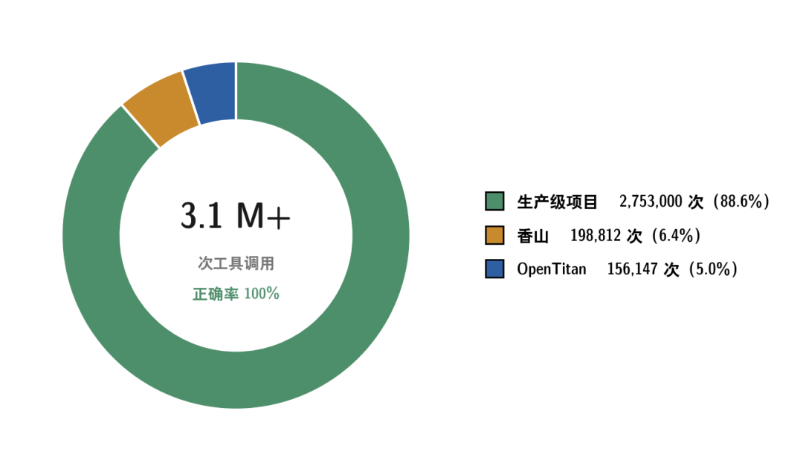

读波形这事本身也不难，写个脚本就能读。难的是给 AI 讲清楚波形背后的因果。

举个例子。AI 在 debug 一个 UART，发现 tx\_serial 在某个时刻是 0，想知道为什么。用 trace\_value 一追，直接拿到一棵追溯树：这个 0 来自 START 状态分支的赋值，代码在 uart\_top.sv 第 79 行。再往上一级，START 状态又是 tx\_valid 拉高触发的。每一级节点都带值、带代码位置、带源码片段，回溯级数和节点数也一并返回。

这才是 AI 做自动错误分析真正需要的东西。不是一堆波形数值，是把数值和代码串起来的因果链。

类似的还有几个。

trace\_x 追 X 态根因。返回 X 因果树，多驱动冲突时把全部活跃驱动都展开，根因节点带终止原因。不用再一层层手工翻 hierarchy 猜 X 从哪来。

signal\_drivers 和 active\_drivers 给出信号的所有驱动代码位置和分支条件，结合 4 值求值，判断某个时刻到底是哪个驱动在起作用。signal\_fanin 支持跨层次递归展开扇入。

还有一个能力值得单独说：open\_static\_session 无波形静态分析。仿真之前，只凭 RTL 源码就能建 session，查接口、查驱动、查扇入扇出、浏览层次，拿来给团队做 AI code review 的提效也很不错。

如何上手：

pip install wave-mcp

#给 AI 发送 git 链接，让 AI 帮你自动安装

#GitHub：https://github.com/Tencent/wave-mcp

#PyPI：https://pypi.org/project/wave-mcp

Code Agent 里也能用。Claude Code、Cursor、VS Code Copilot 加一段 mcpServers 配置，直接调 prepare\_session 工具就行，配置示例在仓库 README 里。

最后

代码在 GitHub 开源，PyPI 直接能装。

做验证的同行，欢迎 star，或者 pip install 跑起来试试。遇到问题来 issue 聊。

GitHub：https://github.com/Tencent/wave-mcp

PyPI：https://pypi.org/project/wave-mcp

---

# 8. 用AI写LPDDR5命令总线解码器

> 来源：https://mp.weixin.qq.com/s/je2QsxoZOdkeEPNL-INZLQ
> 作者：Junxiao
> update 2026/08/29 13 : 19

```
相关代码仓库
LPDDR5 Monitor VIP：https://github.com/Junxiao-Zhang/IC_Tools/tree/main/lpddr5_mon_vipGDDR6 Checker：https://github.com/Junxiao-Zhang/IC_Tools/tree/main/gddr6_chk
```

---

## 8.1 为什么要做这件事

在 DDR 性能验证中，我们通常会在总线接口上做带宽与延迟统计。但对于 DRAM 而言，总线地址还要经过 DDR 控制器内部的地址映射与命令调度。仅凭总线侧统计，很难量化 DRAM 侧的实际行为。

DRAM 侧可以统计的行为包括：

- 各类命令的数量统计
- 读写切换次数
- Page 命中率
- 无效 ACT 命令数量

这些数据能有效评估当前 DRAM 的调度行为，并为后续调优指明方向。传统商业 VIP（如 S 家的 VIP）提供了 Verdi 的 Protocol & Performance Analysis 功能，方便统计各类命令数量、带宽等性能指标。但商业 VIP 依赖 license 采购，且功能无法自定义——因此，自研 DRAM slave VIP 成为一个可行的替代方案。

> 传统做法：对照 GDDR6 JEDEC 协议，手工编写命令解码器。一个 Command Bus Decoder，从读懂协议到写出可运行的代码，往往要折腾一周。

---

## 8.2 什么是命令解码器？

命令总线解码器是 VIP 中 Monitor（监控器）的"眼睛"，它的任务是：

- 在正确的时钟沿（CK 的上升/下降沿，按 1N/2N 模式）采样 `CA[6:0]` 与 `CS`；
- 按 opcode 将若干个采样点拼成一条完整命令；
- 将波形级别的信号还原为事务对象（transaction）：命令类型 + Bank/BG/Row/Column/突发长度等参数；
- 交给上层做协议检查（Protocol Checker）、记分板比对（Scoreboard）与覆盖率收集。

这次我决定换一个思路：让大模型（LLM）替我完成这部分工作。

LPDDR5 使用一组 CA[6:0] 命令/地址总线，命令在 CS 的下降沿被采样，有 1N / 2N 两种模式；一条命令由 1～2 个 CS 周期拼成 8bit 或 16bit 的 opcode，再映射到 ACTIVATE / READ / WRITE / PRECHARGE / REFRESH / MRS / ZQC 等数十种操作。

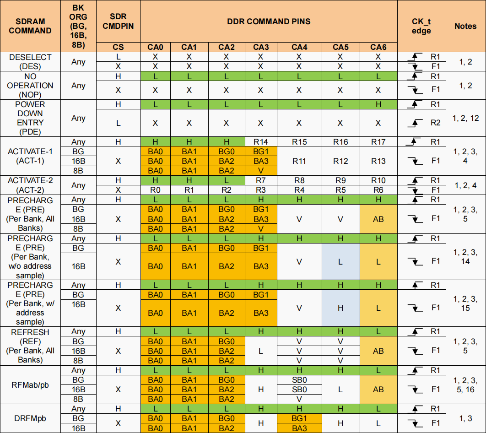

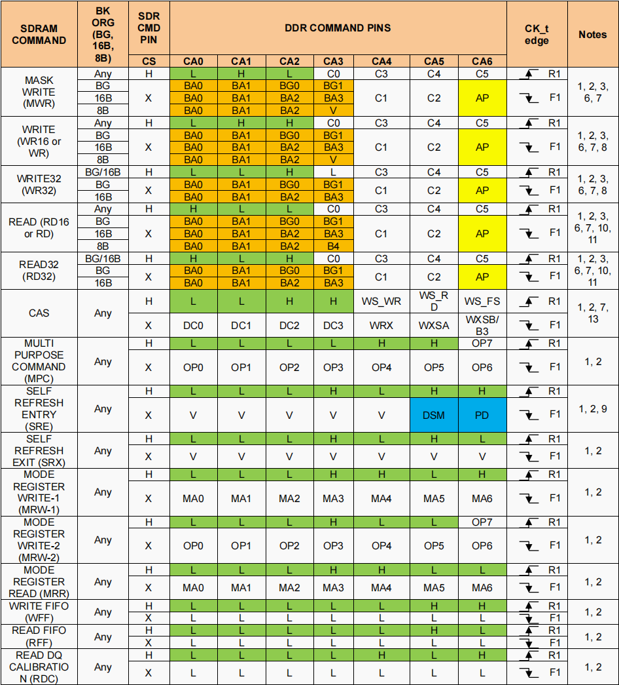

这件事非常适合用 AI 来生成解码器。首先，JEDEC 文档里就有现成的命令真值表、时序参数表、MR 配置表——这些"表格型知识"正是 LLM 的强项。为了加速开发，从网上找到了 Micron 的 LPDDR5 model，里面带有完整的 golden tb 环境。AI 生成代码后，可以集成到 golden 环境中做回归测试；通过与 golden model 对比，AI 就能自主完成迭代与 bug fix。

---

## 8.3 提示词设计与最终结果

### 8.3.1 工具与方案

AI 工具方面，我使用当红炸子鸡 Deepseek-v4-pro + harness 作为开发基座，并开启 plan mode。给出提示词后，先让 AI 就模糊不清的地方与我讨论，确认需求后再动手编码。

下面是我实际使用的提示词（节选）：

```
【角色】
你是一名资深 SystemVerilog / UVM 验证 IP 开发专家，擅长 LPDDR 协议建模，熟悉 UVM / SystemVerilog 语法。 【任务】请为 LPDDR5（JESD209-5C）VIP 的”命令总线解码器”生成 UVM slave agent 实现。在开始编码之前，请先与我讨论清楚工作任务与需求文档；有了清晰、高质量的文档后再开始编码。 【上下文：协议规则（节选）】1. 命令总线 CA[6:0]，在 CS_n 下降沿采样；2. 命令类型与 opcode 映射（附真值表）：参考 Table 201 - Command Truth Table3. 命令参数解析：解析 Bank / Col / Row 等地址信息4. 采样沿：在 CK 上升沿锁存 CA，按链路结构对齐。5. 不考虑数据总线 DQ：无需关注 DQ 总线相关行为，以降低开发难度。 【编码约束】1. 命令类型用 enum 定义；参数用 parameter / localparam 配置化。2. 命名风格：使用 UVM 1.2 及 SystemVerilog IEEE 1800 语法。 【输出格式】1. 模块端口签名（含方向、位宽）；2. 命令类型 enum 定义；3. 完整 module 实现（解码组合逻辑）；4. 一段最小 testbench 示例，能打印 5 条典型命令的解码结果；5. 需要支持 debug port，方便在波形上查看命令解码结果。 【迭代要求】1. 若对某个问题答案不确定，请及时停下与我确认，不可编造。2. tb_lpddr5 是基于 Micron LPDDR5 的环境，可当作仿真时的 golden 模型。需要将 LPDDR5 slave agent 集成至 tb_lpddr5 环境，并与 _debug_port 中的命令解码对比成功；需要支持 dump vcd + fsdb 格式波形。 【参考资料】ref 文件夹下为对应的参考资料：1. eda_ref 包含 VCS 与 Verdi 的用户手册，仿真编译出问题可参考；2. slave_agent 是 Mentor UVM Cookbook 自带的 example，可参考其结构作为自研 VIP 的架构参考；3. tb_lpddr5 是基于 Micron LPDDR5 的环境，可当作仿真时的 golden 模型；4. gddr6_chk 是我基于 GDDR6 协议开发的 DRAM 命令解码器，可作为 DRAM 命令解码参考。 【工具】1. wavedrom：用于生成时序图；2. drawio：用于生成架构图；3. VCS：前仿真工具；4. Verdi：波形查看工具。
```

### 8.3.2 迭代过程与成果

整个 AI 迭代测试花了两天时间，总计花费 53.73 元，成功实现了 LPDDR5 的命令解码。经测试，Micron LP5 环境中所有用例的命令解码全部比对通过。过程中除了与 AI 确认问题，执行环节采用了"Yes 工程师"模式（即对 AI 的修改建议一路放行）。

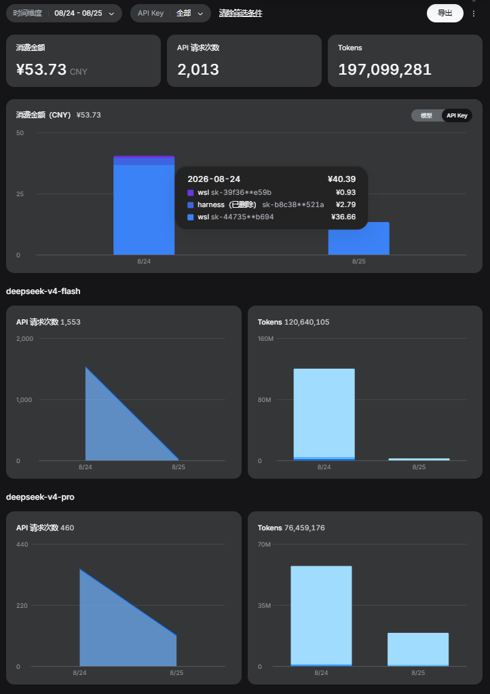

AI 生成的 VIP 架构如下：

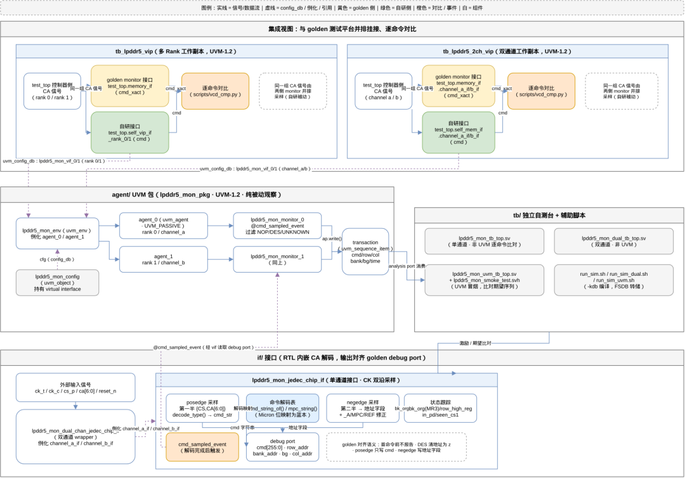

### 8.3.3 地址解码逻辑

```
CA 总线 {CS, CA[6:0]}
   │  ck_t posedge：锁存第一半   ▼decode_type() ── 命令类型 ──► cmd_string_of()（受 bk_org 模式影响）   │                              │   │  ck_c negedge：锁存第二半     ▼   ▼                          cmd 字符串 ──┐地址字段提取：                            │  micron_col() → col_shift(<<5/<<4)      │（右对齐装入）  row = {row_high_reg, ACT2 字段}        ▼  bank/bg 条件更新                    debug port  字符串修正（_A / MPC / REF/PRE all） ──► cmd[255:0] row bank bg col                                            │                       cmd_sampled_event ◄──┘（每条命令触发一次）                                            │   @event：lpddr5_mon_monitor ◄────────────┘                                            │  过滤 NOP / DESELECT / UNKNOWN                                            ▼                    打包 lpddr5_mon_transaction                                            │                               ap.write() ──▼──► 消费者                                   （冒烟比对期望序列 / 与 golden cmd 逐命令对比）
```

### 8.3.4 仿真验证与交付

仿真结果：

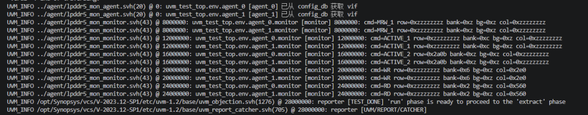

基于该 agent，我让 AI 进一步开发了一个冒烟（smoke）验证环境，已同步上传至 GitHub，可参考 README 使用 VCS + Verdi 进行仿真。

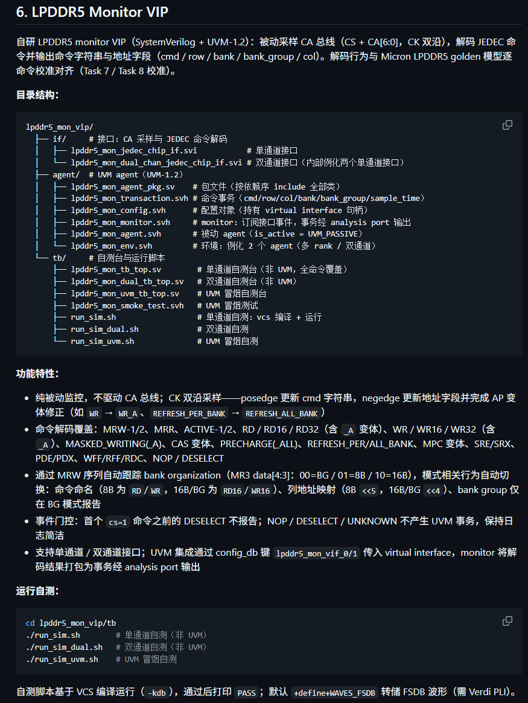

---

## 8.4 总结与收获

- 协议即数据：JEDEC 文档里的真值表、时序表、MR 配置表都是"表格型知识"，非常适合作为 LLM 的输入。
- Golden 模型是关键：接入 Micron golden 环境做回归比对，让 AI 能闭环自测、自主修 bug，这是两天跑通的核心。
- 成本极低：两天迭代仅花费 53.73 元，远低于手工一周的工作量。
- 可复用的范式：同样的"协议文档 + golden 模型 + AI 迭代"流程，已成功复用于 GDDR6 解码器，可推广到其他 DRAM 协议的 VIP 开发。

---

# 9. 如何用Multi-agent（多智能体）重构芯片验证工作流？

> 来源：https://mp.weixin.qq.com/s/O9Qj1NOuGcFOYj2OxIauFg
> 作者：AI应用普及
> update 2026/08/29 13 : 44

## 9.1 前言：AI 真正改变芯片验证的，可能不是“帮你写几行代码”

过去两年，越来越多芯片验证工程师开始使用大模型：

- 让 AI 解释 AXI、PCIe、CHI 等协议；
- 让 AI 编写简单的 SystemVerilog 和 UVM 代码；
- 让 AI 分析编译报错；
- 让 AI 根据日志猜测仿真失败原因；
- 让 AI 帮忙整理 Testplan；
- 让 AI 生成脚本、周报和回归报告。

这些应用确实可以提升效率，但本质上仍然是：

> 工程师提出一个问题，AI 返回一次答案。

真正值得关注的下一阶段，并不是把 ChatGPT 当作一个更强大的搜索引擎，而是让 AI 能够围绕一个目标，自主完成一系列操作：

```
理解任务
→ 拆解步骤→ 调用工具→ 获取结果→ 判断下一步→ 检查输出→ 修正错误→ 交付最终结果
```

这就是 AI Agent，也就是智能体。

2026 年 5 月 28 日，Google Cloud 更新了官方架构指南《Choose a design pattern for your agentic AI system》。这份指南系统梳理了单 Agent、多 Agent、顺序执行、并行执行、循环改进、生成—审查、协调器、分层任务拆解、Swarm、ReAct、Human-in-the-loop 等多种 Agent 设计模式。

对芯片验证工程师来说，这份资料真正有价值的地方，不在于教我们如何“搭建一个聊天机器人”，而在于它提供了一套新的工作流设计方法：

> 把复杂的芯片验证任务拆成多个专业角色，再通过确定性流程、模型调度和人工审批，把这些角色组织成一个可以协同工作的系统。

本文就结合芯片验证工作，详细解读这些 Agent Design Patterns。

---

## 9.2 先说结论：多智能体不是多个聊天机器人开会

很多人一听到 Multi-Agent，第一反应是：

```
建立几个不同的 AI 角色，
让它们互相讨论，最后给出答案。
```

这种理解只说对了一小部分。

真正的多智能体系统通常包含以下几个部分：

```
大模型
+ 专业提示词+ 工具接口+ 领域知识+ 状态管理+ 工作流编排+ 权限控制+ 结果评估
```

例如，一个“回归分析 Agent”并不是只会阅读日志。

它还可能需要调用：

- 回归数据库查询接口；
- 仿真日志解析脚本；
- Coverage 数据库；
- Git 提交记录；
- Bug 管理系统；
- 波形摘要工具；
- 历史失败案例库；
- 邮件或即时通信接口。

它拿到一个 Failed Case 后，可能执行：

```
读取失败日志
→ 提取第一个有效错误→ 判断失败阶段→ 查询相似历史问题→ 检查最近代码提交→ 对比历史通过版本→ 生成根因假设→ 给出建议责任人
```

因此，Agent 的核心并不只是“会生成文字”，而是：

> 能够基于目标，在一定权限范围内，自主决定下一步做什么，并调用外部工具完成任务。

Google 将 Agent 定义为适合处理开放式问题、自主决策和复杂多步骤工作流的系统。如果任务高度固定，或者一次模型调用就能完成，那么使用普通生成式 AI、规则脚本或 RAG，往往更加简单和经济。

这条原则对芯片验证尤其重要：

> 不是所有工作都需要做成 Agent。

---

## 9.3 哪些芯片验证任务不需要 Agent？

在讨论多智能体之前，先把不适合 Agent 的场景排除掉。

## 9.4 单次协议解释

例如：

> AXI 中为什么同一个 ID 的事务需要保序？

普通大模型问答就可以完成，不需要建立复杂工作流。

## 9.5 固定格式转换

例如：

- 将仿真结果转换为 Excel；
- 将 JSON 转换成 Markdown；
- 从日志中提取固定格式字段；
- 统计 PASS、FAIL 和 TIMEOUT 数量。

这些任务使用 Python、Shell、Perl 或 Ruby 脚本通常更可靠。

## 9.6 明确规则检查

例如：

- 检查地址是否跨越 4KB 边界；
- 检查寄存器地址是否对齐；
- 检查 testcase 命名是否符合规范；
- 检查文件头是否包含版权信息。

这些检查最好使用确定性程序，而不是让大模型“判断”。

## 9.7 一次调用就能完成的文本任务

例如：

- 总结一份较短的 Spec；
- 翻译一段协议内容；
- 润色一段项目描述；
- 对日志进行简单分类。

Google 的建议同样是：如果任务可预测、结构化，或者一次模型调用即可完成，应优先考虑非 Agent 方案。

一个基本原则是：

> 能用脚本稳定完成的，不要强行交给 Agent；能用单个 Agent 完成的，不要急着拆成多个 Agent。

---

## 9.8 模式一：Single Agent——先从一个真正能干活的助手开始

Google 将 Single Agent，也就是单智能体，视为 Agent 系统最基础的模式。

一个单 Agent 通常包含：

```
一个大模型
+ 一套系统提示词+ 一组工具+ 必要的上下文和知识库
```

它可以理解用户目标、规划执行步骤，并根据情况选择不同工具。Google 建议在 Agent 项目早期优先从单 Agent 做起，先把核心逻辑、提示词和工具定义打磨稳定，再考虑复杂的多 Agent 架构。

## 9.9 芯片验证中的典型应用

可以先构建一个“验证工程助手 Agent”，为它提供以下工具：

```
search_spec() 搜索设计规格
search_protocol() 搜索协议资料query_regression() 查询回归结果read_log() 读取仿真日志search_bug_db() 查询历史Bugsearch_git_commit() 查询代码提交generate_report() 生成分析报告
```

当工程师输入：

> 帮我分析 regression\_20260720 中所有 PCIe link training 失败的用例。

这个 Agent 可以：

## 9.10 单 Agent 的优势

- 架构简单；
- 开发速度快；
- 调试链路短；
- 权限控制容易；
- 适合验证概念和快速试点。

## 9.11 单 Agent 的问题

当工具越来越多、上下文越来越大、职责越来越杂时，单 Agent 容易出现：

- 选错工具；
- 忘记执行关键步骤；
- 工具参数填写错误；
- 不同领域知识互相干扰；
- 延迟明显增加；
- 输出质量不稳定。

Google 也指出，当单 Agent 使用的工具增多、任务复杂度提高时，可能出现延迟增加、工具选择错误或任务无法完成等问题。这时候才需要考虑将不同职责拆给专业 Agent。

---

## 9.12 模式二：Sequential——把固定验证流程做成流水线

Sequential Pattern，也就是顺序模式，适合步骤明确、执行顺序固定的任务。

它的结构类似于：

```
Agent A
 ↓Agent B ↓Agent C ↓Agent D
```

前一个 Agent 的输出，成为后一个 Agent 的输入。

Google 将它归类为确定性工作流：任务步骤预先已知，不需要模型在运行时决定应该调用哪个 Agent。

## 9.13 场景一：自动生成 Testplan

可以设计为：

```
Spec解析 Agent
 ↓Feature提取 Agent ↓验证场景生成 Agent ↓Coverage设计 Agent ↓格式化 Agent
```

### 9.13.1 第一步：Spec 解析

读取 Spec，提取：

- 功能描述；
- 接口定义；
- 状态机；
- 配置寄存器；
- 异常处理；
- 性能指标；
- 低功耗要求。

### 9.13.2 第二步：Feature 提取

将原始内容整理成结构化 Feature List：

```
Feature ID
Feature名称输入条件输出行为异常情况相关寄存器依赖模块
```

### 9.13.3 第三步：场景生成

为每个 Feature 生成：

- 基本功能场景；
- 边界场景；
- 并发场景；
- 异常场景；
- 恢复场景；
- Reset 场景；
- 低功耗场景；
- 性能场景。

### 9.13.4 第四步：Coverage 设计

根据场景设计：

- coverpoint；
- bins；
- illegal\_bins；
- ignore\_bins；
- cross coverage；
- assertion coverage；
- code coverage 关注点。

### 9.13.5 第五步：格式化

输出团队规定的 Excel、Markdown、HTML 或测试管理平台格式。

## 9.14 场景二：回归日报生成

```
回归结果提取
→ 失败分类→ Coverage汇总→ 趋势分析→ 报告生成→ 邮件发送
```

这种流程非常适合顺序模式，因为步骤基本固定，不需要每次都让大模型重新决定执行路径。

## 9.15 优点

- 执行过程清晰；
- 容易追踪每一步输入和输出；
- 便于替换某个 Agent；
- 容易定位错误发生在哪一阶段；
- 比完全动态调度更稳定。

## 9.16 缺点

- 灵活性较低；
- 上游错误容易向下游传播；
- 某些不必要步骤仍可能被执行；
- 不适合路径变化很大的开放式问题。

---

## 9.17 模式三：Parallel——让多个专业 Agent 同时分析

Parallel Pattern，也就是并行模式，适合多个相互独立的子任务。

结构通常是：

```
┌→ Log分析 Agent
输入任务 → 分发器 ├→ Coverage Agent ├→ 代码变更 Agent └→ 历史Bug Agent ↓ 汇总 Agent
```

Google 指出，并行模式可以同时从多个来源收集信息，从而降低整体等待时间，但会增加资源消耗、Token 成本，以及最终结果合并的复杂度。

## 9.18 典型场景：复杂 Failed Case 定位

当某个 SoC testcase 失败后，可以同时启动：

### 9.18.1 Log Agent

负责：

- 识别第一个有效错误；
- 区分 Error、Warning 和级联错误；
- 判断失败发生在哪个仿真阶段；
- 提取 UVM component、transaction 和时间点。

### 9.18.2 Waveform Agent

负责：

- 提取失败时间窗口；
- 检查关键状态机；
- 比较 expected 和 actual；
- 分析握手、时序和协议异常。

### 9.18.3 Git Agent

负责：

- 查询最近代码提交；
- 找出相关模块修改；
- 对比上一次通过版本；
- 识别高风险改动。

### 9.18.4 Coverage Agent

负责：

- 检查相关功能点是否命中；
- 判断是否为新场景；
- 分析失败是否暴露 Coverage 缺口。

### 9.18.5 Historical Bug Agent

负责：

- 搜索历史相似日志；
- 检索相同 error signature；
- 查找曾经出现过的根因和修复方案。

最后由一个 Summary Agent 汇总：

```
最可能根因
支持证据反对证据相关提交建议责任人下一步排查动作置信度
```

## 9.19 并行模式的关键问题

多个 Agent 可能给出相互冲突的结论。

例如：

- Log Agent 判断是 DUT Bug；
- Waveform Agent 判断是 testcase 时序不合法；
- Git Agent 判断最近只有环境代码变化；
- Historical Bug Agent 找到一个 VIP 配置问题。

这时候不能简单投票，而需要一个汇总机制，根据证据强度判断。

因此，汇总 Agent 不能只收到四段自然语言结论，还应该收到结构化结果：

```
{
 ”hypothesis”: ”可能根因”, ”evidence”: [], ”counter_evidence”: [], ”confidence”: 0.78, ”recommended_action”: []}
```

多 Agent 系统能不能稳定，很多时候不取决于 Agent 数量，而取决于 Agent 之间的数据接口是否清晰。

---

## 9.20 模式四：Loop——让 Agent 持续改进，直到达到退出条件

Loop Pattern，也就是循环模式，会反复执行一组 Agent，直到满足终止条件。

```
生成
→ 检查→ 修改→ 再检查→ 达到要求后退出
```

Google 认为它适合迭代改进和自我纠错，但必须设置可靠的退出条件，否则可能出现无限循环、资源持续消耗和系统卡住等问题。

## 9.21 场景一：自动修复脚本

```
代码生成 Agent
→ 编译工具→ 报错分析 Agent→ 代码修改 Agent→ 再次编译
```

退出条件可以是：

- 编译通过；
- 达到最大修改次数；
- 连续两次出现相同错误；
- 超过执行时间；
- 需要人工介入。

## 9.22 场景二：Coverage Closure

```
Coverage分析 Agent
→ Hole识别 Agent→ 场景生成 Agent→ Test生成 Agent→ 启动仿真→ 更新Coverage→ 判断是否继续
```

退出条件可以设置为：

```
目标功能覆盖率达到98%
或连续三轮没有新增Coverage或达到最大仿真预算
```

## 9.23 场景三：Assertion 修正

```
SVA生成 Agent
→ 编译检查→ 仿真验证→ False Failure分析→ SVA修改
```

这里尤其要注意：

> 编译通过，不等于 Assertion 正确。

Agent 可能为了消除报错而不断放宽 Property，最后写出一个“永远不会失败”的 Assertion。

因此，退出条件不能只看编译结果，还要加入语义检查：

- 是否覆盖原始需求；
- 是否存在 vacuous pass；
- antecedent 是否实际触发；
- 是否误用了 disable iff；
- 是否错误放宽时序窗口。

---

## 9.24 模式五：Review and Critique——让一个 Agent 生成，另一个 Agent 审核

Review and Critique 又叫 Generator–Critic，也就是“生成者—批评者”模式。

它通常包含两个角色：

```
Generator Agent
 ↓Critic Agent ↓通过 / 退回修改
```

Google 将这种模式视为 Loop Pattern 的一种典型实现。生成 Agent 负责产生初稿，审查 Agent 根据准确性、格式要求、安全规范或测试结果进行检查。它适合那些在交付前必须经过明确验证的任务。

这可能是最适合芯片验证领域的一种 Agent 模式。

因为芯片验证本身就是一个不断“生成—检查—修正”的过程。

## 9.25 场景一：Testplan 审核

Generator Agent 负责生成 Testplan。

Critic Agent 负责检查：

- Feature 是否遗漏；
- 正常场景和异常场景是否完整；
- 是否覆盖 Reset；
- 是否覆盖并发和竞争；
- 是否考虑背压；
- 是否考虑 outstanding；
- 是否考虑低功耗切换；
- 是否有明确检查点；
- Coverage 是否可测量；
- 场景是否可以真正实现。

## 9.26 场景二：UVM 代码审核

Generator Agent 负责生成：

- sequence；
- driver；
- monitor；
- scoreboard；
- coverage model；
- assertion。

Critic Agent 负责检查：

- UVM phase 使用是否正确；
- objection 是否可能泄漏；
- transaction 是否正确 clone；
- analysis port 是否正确连接；
- scoreboard 是否考虑乱序；
- sequence 是否支持 backpressure；
- constraint 是否可能无解；
- factory registration 是否正确；
- 是否存在并发竞争；
- 是否符合团队编码规范。

## 9.27 场景三：回归根因审核

Analysis Agent 给出：

> 失败可能由 DUT 的状态机跳转错误导致。

Critic Agent 不能只判断语言是否通顺，而要追问：

- 是否有对应波形证据？
- 第一个异常信号是什么？
- 是否排除了 testcase 问题？
- 是否排除了 VIP 配置问题？
- 是否排除了 Reset、X 传播和时序问题？
- 是否存在历史相同错误？
- 能否通过最小 testcase 复现？

这会迫使第一个 Agent 从“猜测”升级为“证据链分析”。

---

## 9.28 模式六：Iterative Refinement——围绕同一个结果持续优化

Iterative Refinement 和普通 Loop 很像，但关注点略有不同。

Loop 更强调重复执行流程，而 Iterative Refinement 更强调：

> 每一轮都基于上一轮结果，持续改善同一个输出。

Google 建议设置质量阈值或最大迭代次数，避免循环无法结束。

## 9.29 典型场景：逐步完善验证计划

第一轮只生成基础功能场景。

第二轮补充：

- 边界条件；
- 非法输入；
- 资源耗尽；
- 并发访问；
- Reset 打断；
- 动态配置。

第三轮补充：

- Coverage 交叉；
- 场景优先级；
- 用例依赖；
- 可复用组件；
- 性能检查点。

第四轮再根据 Reviewer 反馈压缩重复内容、补充遗漏点。

这种模式很适合：

- Testplan；
- Verification Checklist；
- Coverage Model；
- 项目总结；
- Bug 分析报告；
- 技术方案评审材料。

它不一定需要多个 Agent，也可以由同一个 Agent在不同阶段扮演不同角色。

---

## 9.30 模式七：Coordinator——让总控 Agent 动态分配任务

Coordinator Pattern，也就是协调器模式，是多 Agent 系统最常见的架构之一。

系统中存在一个总控 Agent：

```
┌→ AXI Agent
 ├→ PCIe Agent用户 → Coordinator├→ DDR Agent ├→ UVM Agent ├→ Coverage Agent └→ GLS Agent
```

Coordinator 根据用户输入，决定：

- 调用哪个专业 Agent；
- 是否需要多个 Agent；
- Agent 执行顺序；
- 是否需要进一步补充信息；
- 何时汇总结果。

Google 指出，协调器模式适合输入类型多样、需要动态路由到专业 Agent 的任务。不过，因为协调器自身也要多次调用模型来判断和分配任务，因此可能增加延迟和成本。

## 9.31 芯片验证知识助手

可以设置以下专业 Agent：

```
协议类
├── AXI Agent├── AHB/APB Agent├── ACE/CHI Agent├── PCIe Agent├── DDR/DFI Agent└── NoC Agent 方法学类├── SystemVerilog Agent├── UVM Agent├── SVA Agent├── RAL Agent└── Coverage Agent 流程类├── Regression Agent├── Debug Agent├── GLS Agent├── Low Power Agent└── Formal Agent
```

用户问：

> AXI Master 发出不同 ID 的写请求，DUT 写 SRAM 的顺序和 B Response 的顺序应该怎么理解？

Coordinator 可以识别：

- 主要领域：AXI ordering；
- 次要领域：memory write side effect；
- 可能需要：协议 Agent + DUT 架构 Agent；
- 不需要：PCIe、DDR、GLS Agent。

然后只调度相关角色。

## 9.32 协调器不能只是“转发问题”

一个有效的 Coordinator 至少需要完成四件事：

否则它只是一个昂贵的路由器。

---

## 9.33 模式八：Hierarchical Task Decomposition——把复杂验证项目逐层拆解

对于一个完整的 SoC 验证项目，单层 Coordinator 可能还不够。

这时候可以使用 Hierarchical Task Decomposition，也就是分层任务拆解模式。

结构类似组织架构：

```
SoC验证总控 Agent
│├── 需求分析 Agent│ ├── Spec解析 Agent│ ├── Feature提取 Agent│ └── 风险识别 Agent│├── 环境规划 Agent│ ├── UVM架构 Agent│ ├── VIP集成 Agent│ └── Reference Model Agent│├── 用例规划 Agent│ ├── Basic Test Agent│ ├── Stress Test Agent│ ├── Error Injection Agent│ └── Performance Test Agent│├── Coverage Agent│ ├── Functional Coverage Agent│ ├── Code Coverage Agent│ └── Assertion Coverage Agent│└── Regression Agent ├── Failure Classification Agent ├── Debug Agent └── Report Agent
```

顶层 Agent 不需要理解每个寄存器字段，也不直接分析每一条日志。

它只负责：

- 理解整体目标；
- 规划工作包；
- 分配给下一级 Agent；
- 汇总各方向结果；
- 判断任务是否完成。

Google 将这种模式用于需要多层模型编排、任务开放且模糊、必须逐层分解才能解决的问题。它能获得更加全面的结果，但也会带来更高延迟和更多模型调用。

## 9.34 适合场景

- 从零规划一个新 IP 的验证方案；
- 分析一个复杂 SoC 子系统；
- 设计一致性 NoC 验证体系；
- 规划 PCIe Gen6 验证平台；
- 梳理低功耗验证流程；
- 建立公司级 Verification Checklist。

## 9.35 不适合场景

- 分析一条编译报错；
- 解释一个协议问题；
- 修改一个 sequence；
- 查询一个寄存器字段；
- 统计一轮回归结果。

不能因为 Hierarchical 架构听起来高级，就把所有小任务都拆成五层 Agent。

---

## 9.36 模式九：Swarm——让多个专家 Agent 充分讨论和博弈

Swarm Pattern 可以理解为“专家群体协作”。

它不像 Coordinator 那样由一个中央 Agent 统一调度，而是允许多个 Agent 之间进行动态交流：

```
架构 Agent ←→ 性能 Agent
 ↕ ↕验证 Agent ←→ 功耗 Agent ↕ ↕软件 Agent ←→ 成本 Agent
```

Agent 可以：

- 提出观点；
- 质疑其他观点；
- 补充证据；
- 修改自己的判断；
- 最终形成共识。

Google 建议将 Swarm 用于高度复杂、开放、模糊，需要多个专业角度反复讨论的问题。同时也明确指出，这通常是实现成本和运行成本最高的模式之一，容易出现无效讨论或无法收敛。

## 9.37 芯片验证中的应用

例如评估一个 NoC 架构方案：

### 9.37.1 架构 Agent

关注：

- 拓扑；
- 路由策略；
- QoS；
- 地址映射；
- 一致性协议。

### 9.37.2 性能 Agent

关注：

- 吞吐；
- 延迟；
- 拥塞；
- Head-of-Line Blocking；
- 带宽利用率。

### 9.37.3 验证 Agent

关注：

- 可观测性；
- 可控性；
- Corner Case；
- Coverage Closure；
- Reference Model。

### 9.37.4 功耗 Agent

关注：

- Clock Gating；
- Power Domain；
- 动态频率；
- 上下电流程；
- Isolation 和 Retention。

### 9.37.5 软件 Agent

关注：

- 初始化；
- 中断；
- 错误恢复；
- 性能监控；
- 驱动可见性。

这些 Agent 可以共同判断：

> 当前架构能不能被完整验证？哪些功能最容易出现系统级 Bug？需要增加哪些硬件可观测点？

## 9.38 使用 Swarm 的前提

必须明确：

- 谁可以向谁发送消息；
- 每轮讨论目标是什么；
- 什么条件下结束；
- 冲突如何裁决；
- 最大讨论轮数；
- 如何保存中间结论。

否则 Swarm 很容易变成：

> 五个 Agent 用不同说法反复表达类似观点。

---

## 9.39 模式十：ReAct——边分析、边行动、边观察

ReAct 是 Reason and Act 的缩写，可以理解为：

```
思考
→ 行动→ 观察→ 再思考
```

Google 将 ReAct 描述为一个持续循环：模型根据当前信息判断下一步，调用工具获得新结果，再根据结果调整计划，直到任务完成、达到最大迭代次数，或者遇到无法继续的错误。

## 9.40 最适合 ReAct 的验证场景：Bug 定位

假设用户提出：

> 一个 PCIe testcase 在 Recovery.RcvrLock 状态卡住了，请帮忙分析。

ReAct Agent 可能这样工作：

### 9.40.1 第一轮

判断：

需要先确认进入 Recovery 的原因。

行动：

读取 LTSSM 状态日志和关键寄存器。

观察：

发现 Recovery 之前出现连续 Receiver Error。

### 9.40.2 第二轮

判断：

需要确认是信号质量模拟问题，还是协议训练参数问题。

行动：

查询 equalization、lane status 和 error counter。

观察：

发现 Lane 2 持续失锁。

### 9.40.3 第三轮

判断：

需要检查 Lane 2 是否存在配置差异。

行动：

对比 Lane 0～3 的 PHY 配置。

观察：

发现 Lane 2 polarity inversion 配置异常。

### 9.40.4 第四轮

判断：

检查该配置是否来自 testcase 或 DUT 默认值。

行动：

查询 testcase 参数和最近代码提交。

观察：

发现 testcase 在随机化时错误覆盖了 Lane 2 配置。

### 9.40.5 最终结论

```
根因：Testcase随机配置错误
证据：Lane 2 polarity inversion与其他Lane不一致建议：约束该字段或增加合法性检查
```

ReAct 非常适合路径无法提前完全确定的 Debug 任务。

但它也存在风险：

> 如果某一次工具输出错误，后续推理可能建立在错误观察之上，最终产生一条看似完整、实际上错误的证据链。

Google 同样提醒，ReAct 的结果质量高度依赖模型推理能力和工具返回信息的准确性。

---

## 9.41 模式十一：Human-in-the-loop——关键决策必须由工程师确认

Human-in-the-loop 的含义是：

> Agent 可以分析和执行，但在高风险节点必须暂停，等待人工审批。

Google 将它用于安全、可靠性、合规性要求较高，或者需要主观判断的任务。Google 的多 Agent 参考架构也建议，在业务关键系统中，让人类能够审查、批准、拒绝、暂停或纠正 Agent 的行为。

芯片验证系统中，以下操作不应该默认完全自动化：

- 修改正式分支代码；
- 提交 Merge Request；
- 关闭 Bug；
- 修改回归基线；
- Waive Assertion；
- Waive Code Coverage；
- 修改 GLS Timing Check；
- 修改 UPF；
- 启动大规模昂贵回归；
- 将问题直接判定给某个责任团队；
- 对最终 Sign-off 作出结论。

## 9.42 一个合理的审批流程

```
Agent生成修改建议
 ↓自动编译与小规模测试 ↓Agent生成风险说明 ↓工程师Review ↓批准后提交代码 ↓运行完整回归
```

Agent 可以提高效率，但不应该模糊责任边界。

特别是在 Sign-off 阶段，最终判断仍应由具备项目背景和技术责任的工程师完成。

---

## 9.43 模式十二：Custom Logic——把规则、脚本和 Agent 组合起来

实际芯片验证流程往往很难只用一种标准模式描述。

例如一次回归分析可能包含：

```
先并行分析Log和Git提交
 ↓如果是编译失败，走编译问题流程 ↓如果是仿真超时，走性能和死锁流程 ↓如果是数据比对错误，走Scoreboard分析流程 ↓高置信度问题自动分类 ↓低置信度问题交给人工
```

这种场景需要 Custom Logic，也就是自定义逻辑模式。

Google 建议在需要复杂分支、精细控制，或者必须将固定规则和模型推理混合时使用 Custom Logic。不过，开发者需要自行设计、实现和调试整个编排流程，因此维护成本也更高。

## 9.44 验证系统中最合理的组合

```
确定性规则负责底线
Agent负责模糊判断人工负责高风险决策
```

例如：

### 9.44.1 脚本负责

- 读取 Coverage；
- 计算 PASS Rate；
- 提取 Error Signature；
- 判断是否编译失败；
- 检查文件是否存在；
- 执行 Git Diff；
- 启动仿真。

### 9.44.2 Agent 负责

- 解释日志含义；
- 提出根因假设；
- 归纳问题类别；
- 推荐下一步动作；
- 生成总结报告。

### 9.44.3 人工负责

- 确认根因；
- 决定是否修改设计；
- 决定是否 Waive；
- 决定是否关闭 Bug；
- 决定是否达到 Sign-off。

这才是 Agent 在芯片验证领域最现实的落地方式。

---

## 9.45 一个完整案例：多智能体如何重构回归分析流程

下面设计一个相对完整、但可以逐步落地的回归分析系统。

## 9.46 系统输入

```
Regression ID
Testcase NameSeedSimulatorBuild VersionLog PathWaveform PathGit CommitCoverage Database
```

## 9.47 第一层：确定性预处理

先用普通程序完成：

- 检查文件完整性；
- 识别编译失败、运行失败或超时；
- 提取 UVM\_ERROR 和 UVM\_FATAL；
- 提取第一个 Error；
- 生成 Error Signature；
- 统计失败时间；
- 提取随机种子。

这一层不要交给大模型。

## 9.48 第二层：并行分析

```
Log Agent
Waveform AgentGit AgentBug Database AgentEnvironment Agent
```

各 Agent 输出统一结构：

```
发现
证据可能根因置信度建议动作
```

## 9.49 第三层：Coordinator 汇总

Coordinator 根据各 Agent 输出：

- 消除重复结论；
- 识别冲突；
- 判断还缺少什么证据；
- 决定是否调用其他工具；
- 输出初步根因。

## 9.50 第四层：Critic 审核

Critic 检查：

- 是否引用真实证据；
- 是否跳过了其他可能性；
- 是否把级联错误当成根因；
- 是否错误归责 DUT；
- 是否需要最小 testcase；
- 是否需要人工分析波形。

## 9.51 第五层：人工确认

工程师看到的不是一句：

> 可能是 DUT Bug。

而是一份结构化报告：

```
问题分类：Testcase配置问题
 置信度：82% 首个异常：152340ns，Lane 2 polarity配置与其他Lane不一致 证据：1. Receiver Error从152360ns开始持续出现2. 其他Lane配置正常3. 最近DUT代码无相关修改4. Testcase本轮新增随机化配置 建议动作：1. 固定Lane 2 polarity字段复跑2. 增加合法性constraint3. 增加配置一致性assertion 待人工确认：是否允许Agent创建Bug草稿
```

这比“让 ChatGPT 读一下日志”高出了一个层级。

---

## 9.52 多智能体系统落地时，最容易踩的六个坑

## 9.53 一开始就建设十几个 Agent

很多团队还没有稳定的日志格式、工具接口和知识库，就开始设计：

- Coordinator；
- Planner；
- Executor；
- Reviewer；
- Memory Agent；
- Reflection Agent；
- Protocol Agent。

最后系统看起来很复杂，却没有一个 Agent 能稳定完成实际任务。

正确顺序应该是：

```
单点工具
→ 单Agent→ 固定工作流→ 增加审核→ 再考虑多Agent
```

## 9.54 Agent 边界按照“岗位名称”划分

例如：

- 高级验证 Agent；
- 初级验证 Agent；
- 专家 Agent。

这种划分没有意义。

Agent 边界应该按照清晰任务划分：

- Spec Feature 提取；
- Error Signature 分类；
- Git Diff 分析；
- Coverage Hole 分析；
- Assertion 审核。

每个 Agent 都要有明确输入、输出和成功标准。

## 9.55 所有工作都交给大模型

读取文件、计算数字、执行命令和判断固定规则，应该尽量交给确定性程序。

大模型更适合：

- 模糊分类；
- 语义理解；
- 任务规划；
- 证据归纳；
- 解释和生成。

## 9.56 没有统一的数据接口

Agent A 输出一大段自然语言，Agent B 再从自然语言中猜字段，这种系统非常脆弱。

应该尽可能使用结构化接口：

```
{
 ”category”: ”protocol_violation”, ”root_cause”: ”AWLEN configuration error”, ”evidence”: [ ”AWADDR=0x1FF0”, ”AWLEN=7”, ”AWSIZE=2” ], ”confidence”: 0.91}
```

## 9.57 没有评价标准

不能只凭“感觉回答不错”评价 Agent。

至少应该统计：

- 问题分类准确率；
- Top-1 根因准确率；
- Top-3 根因覆盖率；
- 人工接受率；
- 错误归责率；
- 平均定位时间；
- Token 成本；
- 工具调用成功率；
- 人工介入比例。

## 9.58 Agent 拥有过高权限

Agent 不应该默认拥有：

- 删除数据权限；
- 直接合入代码权限；
- 修改 Coverage Waiver 权限；
- 关闭 Bug 权限；
- 修改正式回归配置权限。

权限应该遵循最小化原则。

---

## 9.59 芯片验证团队应该如何分三步落地？

## 9.60 第一阶段：AI Assistant

目标不是自动化，而是增强工程师。

优先实现：

- Spec 问答；
- 协议问答；
- 日志解释；
- 代码解释；
- Testplan 补充；
- 文档生成；
- 脚本辅助。

这个阶段使用普通大模型、RAG 或单 Agent 即可。

## 9.61 第二阶段：Agentic Workflow

开始让 Agent 调用工具，完成固定流程：

- 自动读取日志；
- 查询回归数据库；
- 搜索历史 Bug；
- 对比 Git 提交；
- 生成日报；
- 分析 Coverage Hole。

这个阶段优先使用：

- Single Agent；
- Sequential；
- Parallel；
- Review and Critique；
- Human-in-the-loop。

## 9.62 第三阶段：Multi-Agent Verification System

当单 Agent 已经稳定、工具接口成熟、知识库质量可靠后，再构建：

- Coordinator；
- 专业领域 Agent；
- Hierarchical Task Decomposition；
- ReAct Debug Agent；
- Coverage Closure Loop；
- Swarm Architecture Review。

不要反过来。

Google 的建议同样是从单 Agent 开始，随着任务职责和复杂度增加，再逐步引入多 Agent。

---

## 9.63 推荐的芯片验证 Agent 总体架构

对于大多数验证团队，一个比较务实的架构是：

```
用户
 ↓ Coordinator ↓ ┌──────────────────┼──────────────────┐ ↓ ↓ ↓ Knowledge Agent Workflow Agent Debug Agent ↓ ↓ ↓协议/Spec/RAG 回归/Coverage Log/Wave/Git └──────────────────┼──────────────────┘ ↓ Review Agent ↓ Human Approval Gate ↓ 最终输出或执行
```

底层工具包括：

```
文档搜索
代码搜索日志解析回归数据库Coverage数据库Bug系统Git系统仿真平台波形分析报告平台
```

外围还需要：

```
身份认证
权限控制操作审计成本监控执行超时异常恢复数据脱敏质量评估
```

多智能体系统不是在大模型外面套几个 Prompt 就结束了。

它实际上是一个新的工程平台。

---

## 9.64 Agent 会取代芯片验证工程师吗？

短期内，Agent 更可能取代的是部分低效工作方式，而不是验证工程师这个岗位。

容易被自动化的工作包括：

- 重复整理日志；
- 人工统计回归结果；
- 重复搜索历史 Bug；
- 格式化报告；
- 编写简单脚本；
- 生成基础 testcase 框架；
- 整理 Spec Feature；
- 补充常规验证场景。

但以下能力会越来越重要：

- 理解设计意图；
- 识别架构风险；
- 设计验证策略；
- 判断验证是否充分；
- 分析跨模块系统问题；
- 构建可验证性；
- 判断 Agent 结论是否可信；
- 设计 Agent 的工具、边界和评价体系。

未来更有竞争力的验证工程师，不一定是写代码最快的人，而可能是：

> 既懂芯片验证，又知道如何把验证知识、工具和流程封装成 Agent 工作流的人。

---

## 9.65 结语：不要从“我要做多少个 Agent”开始

Google 的 Agent Design Patterns 给我们最大的启示，并不是必须使用某一种架构，而是：

> 架构选择应该由任务决定。

固定流程，优先使用 Sequential。

独立任务，考虑 Parallel。

需要反复修正，使用 Loop。

需要质量审核，使用 Review and Critique。

任务路径不确定，考虑 ReAct。

需要动态分配专家，使用 Coordinator。

任务极其复杂，再考虑 Hierarchical 或 Swarm。

涉及高风险操作，必须加入 Human-in-the-loop。

对于芯片验证团队来说，最现实的起点不是立刻搭建一个宏大的“多智能体验证平台”，而是选择一个高频、痛苦、可衡量的任务。

例如：

```
自动分析每日回归失败
```

先让一个 Agent 稳定完成：

```
读取日志
→ 提取首个有效错误→ 查询历史问题→ 给出分类建议→ 生成人工可审核的报告
```

当这个流程真正节省了工程师时间，再逐步增加 Git 分析、Coverage 分析、波形分析和多 Agent 协作。

AI Agent 对芯片验证最大的价值，不是替工程师“凭空创造答案”，而是把过去散落在文档、脚本、日志、经验和个人脑海里的知识组织起来，形成一套可复用、可执行、可审计的工程工作流。

这才是多智能体真正可能重构芯片验证的地方。

欢迎对AI和芯片验证同时感兴趣的朋友加入，一起讨论讨论学习。


---

# 10. 试用专门写 Verilog 的 Codex Skill：比“让 AI 直接吐 RTL”靠谱不少

> 来源：https://mp.weixin.qq.com/s/AhZQmin_dT3JGTntSwQ54g
> 作者：智芯溯源
> update 2026/09/15 21 : 39

最近试用了一个面向Verilog-2001 RTL 开发的 Codex Skill：Verilog Generator。

这次我重点阅读了当前最新版v1.3.1的工作流，同时拿之前使用v1.0.0生成的一份实际 RTL 结果做了对照。

它给我的第一印象是：这并不是简单给模型加一句“你是 FPGA 专家”，而是在尝试把 AI 生成 Verilog 变成一套更接近工程习惯的流程——先把接口、时钟与复位、逐周期行为、状态转换和边界情况讲清楚，再进入代码生成与验证。

> 一句话结论：
>
> 它把“让 AI 直接吐一段 RTL”，推进到了“先确认设计行为，再生成、审查并说明验证边界”的阶段。

GitHub 项目地址：

https://github.com/Eriemon/verilog-generator

## 10.1 本次试用说明

| 项目 | 内容 |
| --- | --- |
| 当前最新版 | v1.3.1 |
| 实验结果来源 | 使用 v1.0.0 生成的 RTL |
| 测试模块 | 64×64 Conway Game of Life 二维元胞自动机 |
| 重点观察 | 接口、状态机、双缓冲、边界处理、代码组织和中文注释 |
| 本次未包含 | testbench、仿真波形、综合报告、时序报告和上板结果 |

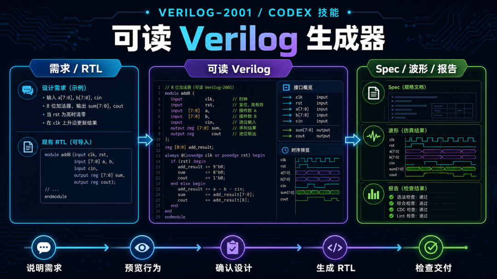

## 10.2 我用它做了什么

这次选择的测试任务，是生成一个64×64 Conway Game of Life（生命游戏）RTL 核心。

需求主要包括：

1. 在空闲状态下写入初始种子；
2. 支持连续运行和单步演化；
3. 输出忙状态、单代完成脉冲和代数计数；
4. 支持按行读取当前一代的 64 bit 细胞状态；
5. 按照 Conway 生命游戏的 B3/S23 规则生成下一代状态。

从 v1.0.0 生成的代码来看，它没有只给出一个接口空壳，而是把主要的数据通路和控制流程都展开了。

模块内部使用三个状态组织一代生命演化：

```
localparam [1:0] ST_IDLE   = 2'd0;
localparam [1:0] ST_SCAN   = 2'd1;localparam [1:0] ST_COMMIT = 2'd2;
```

三个状态分别负责：

ST\_IDLE：等待单步或连续运行请求，同时允许写入初始种子；

ST\_SCAN：逐点扫描 64×64 网格，并计算下一代细胞状态；

ST\_COMMIT：完成整代计算后切换双缓冲，并决定继续运行还是返回空闲态。

此外，生成结果还包含：

A/B 两份 4096 bit 帧数据，用于当前代与下一代之间的切换；

八邻域的独立边界判断与活细胞计数；

B3/S23 规则判断；

连续运行、单步运行和完成脉冲控制；

种子逐点写入与当前代按行读回；

对接口、状态、计数器、标志信号、索引和帧缓存的分区组织；

比较完整的中文语义注释。

> 【生成结果中的模块端口】

```
// 64x64 二维生命游戏自演化核心模块
module cellular_automaton_2d(//-----------------全局信号-----------------//	input i_clk,                                // 模块主时钟,用于推进扫描状态机和代际切换	input i_rstn,                               // 模块低有效复位,拉低时清空双缓冲和代数计数
//-----------------控制接口-----------------//	input i_run_en,                             // 连续运行使能,为高时每代提交后立刻开始下一代扫描	input i_step,                               // 单步推进请求,仅在空闲态被采纳为一代启动脉冲	output o_busy,                              // 正在执行扫描或提交流程时对外拉高的忙标志	output o_generation_done,                   // 每代提交完成后维持一个时钟周期的完成脉冲	output [31:0]o_generation_count,            // 已经提交完成的生命代数统计值
//---------------种子写入接口---------------////SEED接口	input i_seed_we,                            // 空闲态逐点写入种子的写使能脉冲	input [5:0]i_seed_row,                      // 种子写请求命中的目标行编号	input [5:0]i_seed_col,                      // 种子写请求命中的目标列编号	input i_seed_value,                         // 种子写请求希望写入的细胞状态值
//---------------状态读取接口---------------//	input [5:0]i_read_row,                      // 当前代按行读回所选择的行编号	output [63:0]o_read_row_data                // 当前代指定行的完整 64bit 细胞状态向量);
```

> 【状态机】
>
> 例如 `ST_IDLE / ST_SCAN / ST_COMMIT` 状态机，以及 A/B 双缓冲切换相关代码

```
//---------------配置参数区域---------------//
// 网格尺寸与零值常量组	localparam [5:0]GRID_LAST_INDEX = 6'd63;    // 64x64 网格中最后一行或最后一列对应的索引值	localparam [63:0]ROW_DATA_ZERO = 64'd0;     // 越界行或复位清零时复用的全零行向量	localparam [4095:0]FRAME_DATA_ZERO = 4096'd0; // 双缓冲整帧复位时复用的全零 4096bit 初始图样
//---------------状态参数区域---------------//// 顶层控制状态编码组	localparam [1:0]ST_IDLE = 2'd0;             // 停机并允许外部装载种子的空闲状态	localparam [1:0]ST_SCAN = 2'd1;             // 逐点扫描当前代并写出下一代结果的运行状态	localparam [1:0]ST_COMMIT = 2'd2;           // 整代扫描结束后切换前后台缓冲的提交状态
//-----------------计数信号-----------------//	wire [3:0]cnt_neighbor_sum;                 // 当前被扫描细胞 8 邻域中活细胞数量的求和结果
//----------------状态机信号----------------//	reg [1:0]state_current = 0;                 // 当前正在执行的生命演化控制状态	reg [1:0]state_next = 0;                    // 组合逻辑计算得到的下一拍控制状态	reg [5:0]state_row_index = 0;               // 扫描流程当前命中的细胞行号	reg [5:0]state_col_index = 0;               // 扫描流程当前命中的细胞列号
//----------------寄存器信号----------------//	reg [4095:0]reg_frame_a = 0;                // 扁平化帧缓冲 A,按 {行号,列号} 映射 4096 个生命位	reg [4095:0]reg_frame_b = 0;                // 扁平化帧缓冲 B,作为与 A 轮换的整帧存储向量
    //----------------状态机区域----------------//// 根据当前状态与控制输入决定下一拍状态流向	always@(*)begin		state_next = state_current;             // 缺省保持当前状态,避免组合分支遗漏导致锁存推断case(state_current)
// 状态分支说明: 空闲态负责吸收启动控制并保持种子可写// 空闲态等待单步或连续运行请求启动新一代扫描			ST_IDLE:beginif(flag_start_scan == 1'b1)begin					state_next = ST_SCAN;       // 收到连续运行或单步请求后切换到扫描状态				end else begin					state_next = ST_IDLE;       // 没有启动请求时继续停留在空闲状态				end			end
// 状态分支说明: 扫描态遍历全网格并生成后继代位图// 扫描态逐点遍历 64x64 网格并在末单元后进入提交阶段			ST_SCAN:beginif(flag_scan_last_cell == 1'b1)begin					state_next = ST_COMMIT;     // 整个 64x64 网格最后一个细胞计算完成后进入提交状态				end else begin					state_next = ST_SCAN;       // 尚未扫完整个网格时继续保持扫描状态				end			end
// 状态分支说明: 提交态负责换帧并判定后续是否继续运行// 提交态翻转双缓冲并根据运行使能决定是否继续下一代			ST_COMMIT:beginif(i_run_en == 1'b1)begin					state_next = ST_SCAN;       // 连续运行打开时提交完成后直接开始下一代扫描				end else begin					state_next = ST_IDLE;       // 连续运行关闭时提交完成后回到空闲装载状态				end			end
// 状态分支说明: 默认分支吸收非法状态编码并回到安全起点// 兜底分支把异常状态编码拉回安全空闲态default:begin				state_next = ST_IDLE;           // 检测到未定义状态编码时回退到安全空闲状态			end		endcase	end
// 把组合求得的下一状态注册为当前状态	always@(posedge i_clk or negedge i_rstn)beginif(i_rstn == 1'b0)begin			state_current <= ST_IDLE;           // 复位时强制状态机回到空闲态等待重新装载		end else begin			state_current <= state_next;        // 每个时钟把下一状态锁存成新的当前状态		end	end
```

> 【八邻域求和代码】
>
> 八邻域求和与 B3/S23 规则代码。

```
        //-------------状态任务处理区域-------------//
// 当前帧选择位在提交态完成前后台缓冲互换	always@(posedge i_clk or negedge i_rstn)beginif(i_rstn == 1'b0)begin			flag_frame_select <= 1'b0;          // 复位后固定由 A 帧作为当前代读出来源end else if(state_current == ST_COMMIT)begin			flag_frame_select <= ~flag_frame_select; // 每次提交新一代时翻转当前帧选择位完成双缓冲切换		end	end
// 扫描行号在启动、行末和整代切换时进行更新	always@(posedge i_clk or negedge i_rstn)beginif(i_rstn == 1'b0)begin			state_row_index <= 6'd0;            // 复位时从网格首行重新开始扫描坐标end else if((state_current == ST_IDLE) && (state_next == ST_SCAN))begin			state_row_index <= 6'd0;            // 从空闲态启动新一代时把扫描起点重新放回首行end else if(state_current == ST_SCAN)beginif(flag_scan_last_cell == 1'b1)begin				state_row_index <= 6'd0;        // 扫描完最后一个细胞后把下一代行起点预置回首行end else if(flag_scan_last_col == 1'b1)begin				state_row_index <= state_row_index + 6'd1; // 当前行末列写完后把扫描行号推进到下一行			end		end	end
// 扫描列号在启动、列推进与行切换时进行更新	always@(posedge i_clk or negedge i_rstn)beginif(i_rstn == 1'b0)begin			state_col_index <= 6'd0;            // 复位时从网格首列重新开始扫描坐标end else if((state_current == ST_IDLE) && (state_next == ST_SCAN))begin			state_col_index <= 6'd0;            // 从空闲态启动新一代时把扫描起点重新对准首列end else if(state_current == ST_SCAN)beginif(flag_scan_last_col == 1'b1)begin				state_col_index <= 6'd0;        // 当前行最后一列写完后把列坐标回卷到首列			end else begin				state_col_index <= state_col_index + 6'd1; // 同一行内部扫描时把列坐标推进到下一个细胞			end		end	end
// A 帧在复位、空闲装载和 B 当前帧扫描时承接下一代写入	always@(posedge i_clk or negedge i_rstn)beginif(i_rstn == 1'b0)begin			reg_frame_a <= FRAME_DATA_ZERO;     // 复位时把 A 扁平帧一次性清成 4096bit 全零图样end else if((state_current == ST_IDLE) && (i_seed_we == 1'b1))begin			reg_frame_a[index_seed_bit] <= i_seed_value; // 空闲装载阶段把外部种子值写入 A 帧目标单元位end else if((state_current == ST_SCAN) && (flag_frame_select == 1'b1))begin			reg_frame_a[index_scan_bit] <= flag_cell_next; // 当 B 帧作为当前代时把计算出的下一代位写回 A 帧		end	end
// B 帧在复位、空闲镜像装载和 A 当前帧扫描时收集候选后继代	always@(posedge i_clk or negedge i_rstn)beginif(i_rstn == 1'b0)begin			reg_frame_b <= FRAME_DATA_ZERO;     // 复位时把 B 扁平帧初始化成备用后继代的全零图样end else if((state_current == ST_IDLE) && (i_seed_we == 1'b1))begin			reg_frame_b[index_seed_bit] <= i_seed_value; // 空闲装载阶段把同一颗种子同步镜像写入 B 帧对应单元位end else if((state_current == ST_SCAN) && (flag_frame_select == 1'b0))begin			reg_frame_b[index_scan_bit] <= flag_cell_next; // 当 A 帧作为源帧时把新计算的后继位落入 B 帧待提交结果		end	end
```

## 10.3 试下来印象比较深的三点

## 10.4 可读性确实比“裸生成 Verilog”好

最明显的是，代码结构比较容易顺着读下来。

端口、参数、状态、计数器、寄存器、标志信号、索引和输出都有明确分区。信号名也尽量表达用途，而不是大量出现 tmp1、data2 这类需要反复回头猜语义的名字。

例如，八邻域分别使用具有明确含义的信号表示：

```
flag_neighbor_up_left
flag_neighbor_up_centerflag_neighbor_up_rightflag_neighbor_mid_leftflag_neighbor_mid_rightflag_neighbor_down_leftflag_neighbor_down_centerflag_neighbor_down_right
```

这种写法可能不是最短的，但对人工审查、课堂讲解、工程交接和后续修改更友好。

注释也不是简单重复代码，而是在解释某个信号为什么存在、某个状态负责什么、当前帧与下一帧如何切换，以及边界条件如何处理。

## 10.5 最新版不再把“生成代码”当成第一步

最新版更强调先确认行为，再生成 RTL。

新模块的流程不再是：

```
一句自然语言需求
        ↓直接生成一大段 RTL
```

而更接近：

```
需求输入
   ↓补齐接口、时钟、复位和时序信息   ↓形成 codegen plan 与同名模块 Spec   ↓通过 WaveDrom 预览逐周期行为   ↓确认状态转换、握手和边界情况   ↓生成 RTL 并执行所需检查
```

这比传统的“一句话需求 → 一大段 RTL”更合理。

因为 FPGA 设计里真正容易出错的，往往不是 Verilog 语法，而是双方对复位、延迟、握手、完成脉冲和异常场景的理解不一致。

## 10.6 它对“验证证据”的边界比较克制

我比较认可的一点，是它会把静态检查、仿真、综合、实现和硬件结果分开。

| 检查层次 | 能说明什么 | 不能直接说明什么 |
| --- | --- | --- |
| 静态审查 | 命名、位宽、结构和潜在风险 | 功能一定正确 |
| 编译或 Lint | 工具可以解析，部分规则检查通过 | 仿真行为正确 |
| 仿真 | 指定测试场景下行为符合预期 | 综合后时序一定收敛 |
| 综合 | 设计能够映射到目标器件资源 | 实现时序一定通过 |
| 实现与时序 | 布局布线后满足指定约束 | 板级系统一定正常 |
| 上板验证 | 指定硬件环境中的真实运行结果 | 所有输入场景均已覆盖 |

没有实际运行过的检查，不应该被写成已经通过。

```
代码看起来合理
≠ 语法检查通过≠ 仿真通过≠ 综合通过≠ 时序收敛≠ 上板可用
```

这听起来像一句常识，但在 AI 生成硬件代码时非常重要。

## 10.7 也有几点需要理性看待

首先，这次用来对照的是 v1.0.0 生成的一份 RTL 源码，没有同时附带 testbench、仿真波形、综合报告和时序报告。因此，本次试用主要能说明它在代码组织、接口完整性和可读性方面的表现，不能据此直接声称设计已经完成全部工具验证。

其次，生成结果的注释比较密。对于教学、交接和首次理解很友好，但放进已有大型工程后，可能还需要根据团队规范适当收敛。

另外，生命游戏示例直接使用两份 4096 bit 扁平帧数据，逻辑关系很直观。但真正部署到具体 FPGA 时，仍然需要结合器件资源继续考虑 BRAM/URAM 映射、存储端口、行缓存、吞吐率、流水线、并行化和目标频率。

> 可读的 RTL 初版很有价值，但它不等于已经得到最优硬件实现。

## 10.8 总体感受

整体试下来，我觉得它已经不太像一个单纯的“Verilog 代码生成 Prompt”，而更像一个围绕下面这些环节组织起来的 Codex Skill：

当然，正式工程里仍然离不开 testbench、仿真、综合、时序分析、上板验证和人工 review。但从这次试用来看，它至少把 AI 写 RTL 从：

```
生成一段看起来像代码的文本
```

往下面这个方向推进了一步：

```
生成一份行为更明确、结构可阅读、能够继续审查和验证的工程结果
```

这也是我认为它目前最有价值的地方。

## 10.9 项目地址与调用方式

GitHub：https://github.com/Eriemon/verilog-generator

也可以直接把下面这句话交给 Codex：

```
请从 https://github.com/Eriemon/verilog-generator 安装 Verilog Generator，
并使用 $readable-verilog-generator 帮我完成这个 Verilog 任务。
```

#FPGA #Verilog #RTL #Codex #EDA #AgentSkill #AI4EDA

---

# 11. 说话就能生成芯片时序图的开源 Skill，效率提高1000%

> 来源：https://mp.weixin.qq.com/s/C1kBfnEvJnFUaCI5F9BkKQ
> 作者：硅农
> update 2026/09/15 21 : 51

画时序图是每一个芯片设计工程师都必备的技能，画图这件事本身是一个精细又繁琐的工作，非常消耗时间，所以选一个趁手的工具非常重要。常见方式包括：

- 使用 Visio/draw.io 手工绘制，画些组件，方便拼接
- TimGen/TimingDesigner之类的通过 GUI 点击编辑
- WaveDrom 这类用编码方式描述时序图
- Excel 表格画数据流等

现在 AI 时代到来了，大家都在口喷，都在 Vibe Coding，都在谈 Agentic Workflow，那么有没有一种能用自然语言描述需求并生成时序图的方法，我就说说话，Agent帮我画图呢。有的兄弟，有的。

## 11.1 🚀 **wavedrom-gen 应运而生**

我基于 WaveDrom 做了一个Skill，通过自然语言生成、修改、校验和渲染数字时序图。直接来看效果。安装好 Skill 后，可以直接告诉 Agent：

> 画一个 AXI4 三拍写突发时序图，第二拍插入一个 WREADY 等待周期，最后一拍拉高 WLAST，写响应返回 OKAY。

Agent 会把自然语言转换成结构化的 WaveJSON，运行校验器，然后通过官方 WaveDrom CLI 渲染。

生成的 JSON5 会被完整保留，用户随时可以继续编辑，而不是只能拿到一张最终图片。

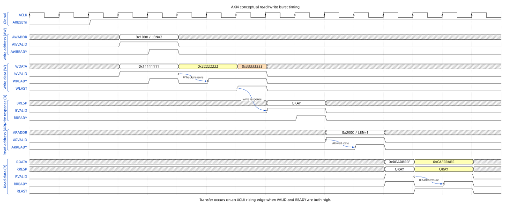

再生成一张经典的异步 FIFO 跨时钟域（CDC）时序图，提示词为

> 画一个异步 FIFO CDC的时序图

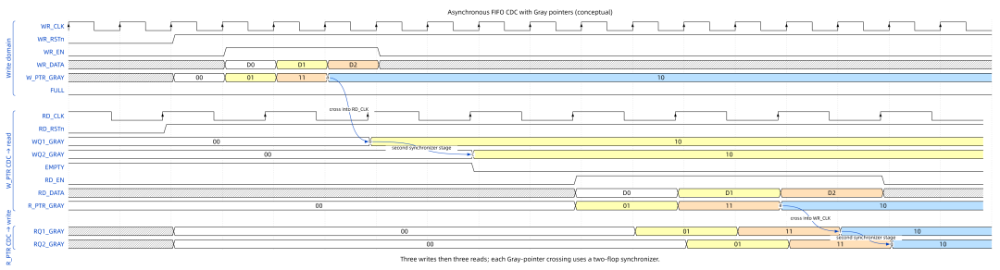

这样的效果对于日常的设计文档编写工作已经足够了

wavedrom-gen skill在此基础上，还支持了datasheet级别的时序图生成，只需要提示词加一句生成datasheet风格的xxx时序图

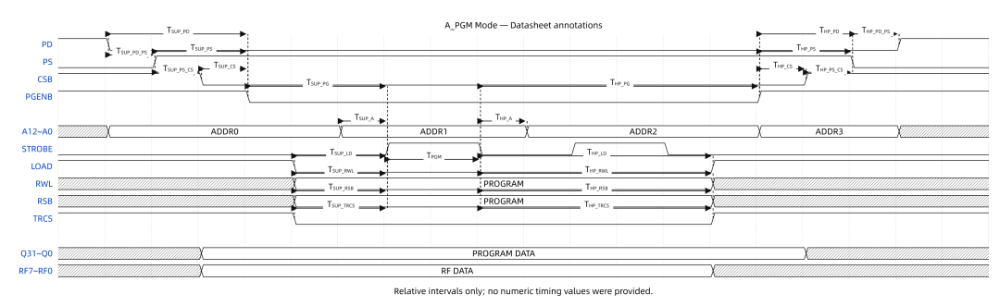

可以更精细地添加标注setup、hold 等时间参数，让你的时序图展示更加专业。

同时支持离线 HTML实时查看编辑WaveJSON 源文件，实时预览时序图，下载源码SVG和PNG图，虽然这个功能大概率用不到。

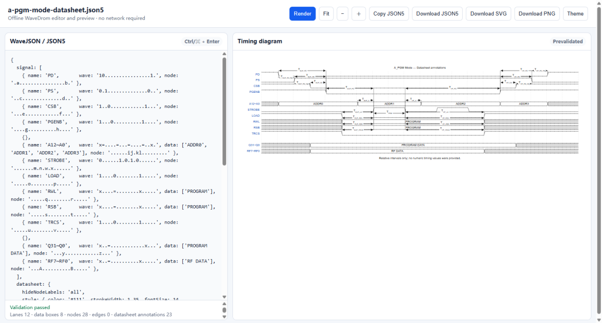

这是一个给Agent用的Skill，补齐 Agent 在设计文档中绘制时序图的能力。

## 11.2 📦 如何安装

## 11.3 第一步：下载

我开源到GitHub上了，关注硅农微信订阅号，后台回复“**硅农**”，就可以获得链接。有什么问题欢迎给我提交 Issue，我的 Agent收到会自动修复后回复。

## 11.4 第二步：安装

把GitHub链接发给你的Codex、Claude Code、Kimi Code、WorkBuddy等助手，让它给你下载安装。

## 11.5 ✨ 最后

AI 时代，如果有人再问我最好的编程语言是什么，我会说，就是你现在正在说的语言。

如果你喜欢我的内容，麻烦点赞、转发、关注，后面继续更新。

---

# 12. 数字IC工程师的AI利器：Cline插件通俗解析

> 来源：https://mp.weixin.qq.com/s/DHun7vG2StPQ0cPN3k-7OA
> 作者：勇开芯扉
> update 2026/09/15 22 : 04

## 12.1 初识Cline

作为一名数字IC设计工程师，日常工作中少不了和代码打交道，不管是写RTL代码，还是搭建testbench。最近AI编程工具层出不穷，很多IC公司都在倡导AI提效。但老实讲，我们公司里的IT环境是内外网严格隔离，并且可以上网的个人本地电脑，员工也没有管理员权限。公司出于法律、合规、商业等等因素考量，员工个人是不允许随意安装软件的，以免引发吃官司。不过，今年有幸可以在公司的个人电脑上安装了VS Code，毕竟是开源免费的嘛，没有商业争议！最近我和deepseek探讨AI提效的过程中，它为我推荐了Cline插件。经过了解，我甚至喜爱，于是乎，迫不及待进行了安装和使用。

## 12.2 什么是Cline？

简单来说，Cline是一款运行在VS Code里的开源AI编程助手插件（它原名Claude Dev，2025年3月才正式更名为Cline）。

它和传统工具最大的不同在于：它把大模型变成了一个能真正“动手干活”的自主智能体，而不是只会给建议的聊天框。目前，Cline在VS Code市场的安装量已超500万次，GitHub上更是拿下了5.8万+ Star，热度可见一斑。

## 12.3 核心设计：Plan & Act 工作流

Cline最让我觉得安心的设计，是它的 Plan（计划）和 Act（执行）双模式分离。

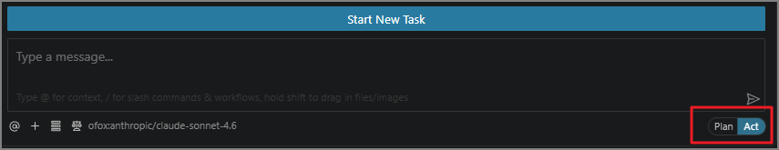

当你描述完任务后，Cline不会急着一上来就改代码。它会先进入 Plan 模式，扫描整个项目，分析文件结构和调用关系，然后给你一份详细的执行计划。这个阶段它不会动任何文件，你可以像在沙盘上一样，慢慢审视它的方案。

等你批准计划，它才会进入 Act 模式按步骤执行。而且，每次文件修改都会弹出Diff对比让你审查，每条命令运行都需要你点头确认。万一出了问题，随时可以回滚到之前的状态。

这套“人在回路”的设计，既让AI有了自主执行能力，又彻底杜绝了AI乱改项目、把代码搞崩的风险。

## 12.4 它到底能做什么？

用了一段时间下来，我发现它的能力远超普通的代码补全工具：

- 全仓库级操作：它不只是补全单段代码，而是能一次性读写、重构数十个关联文件，这在大型项目改造时简直是救星。
- 内置终端：它能自动执行npm install、跑测试、Git提交等命令。遇到报错还会实时捕获并主动尝试修复，省去了很多手动排查的时间。
- 浏览器调试：遇到前端问题，它能直接打开无头浏览器调试页面、截图定位报错，实现了开发到测试的闭环。
- MCP协议扩展：这是一个很酷的设定。你可以让它接入数据库、GitHub、云服务等外部工具，甚至让它自己创建新工具来扩展能力。
- 模型自由选择：它不绑定任何厂商，无论是OpenAI、Anthropic、Google、DeepSeek，还是本地的Ollama模型，你都可以一键切换。

## 12.5 安装与配置

安装非常简单：在VS Code扩展商店搜索“Cline”安装，打开侧边栏的机器人图标即可。

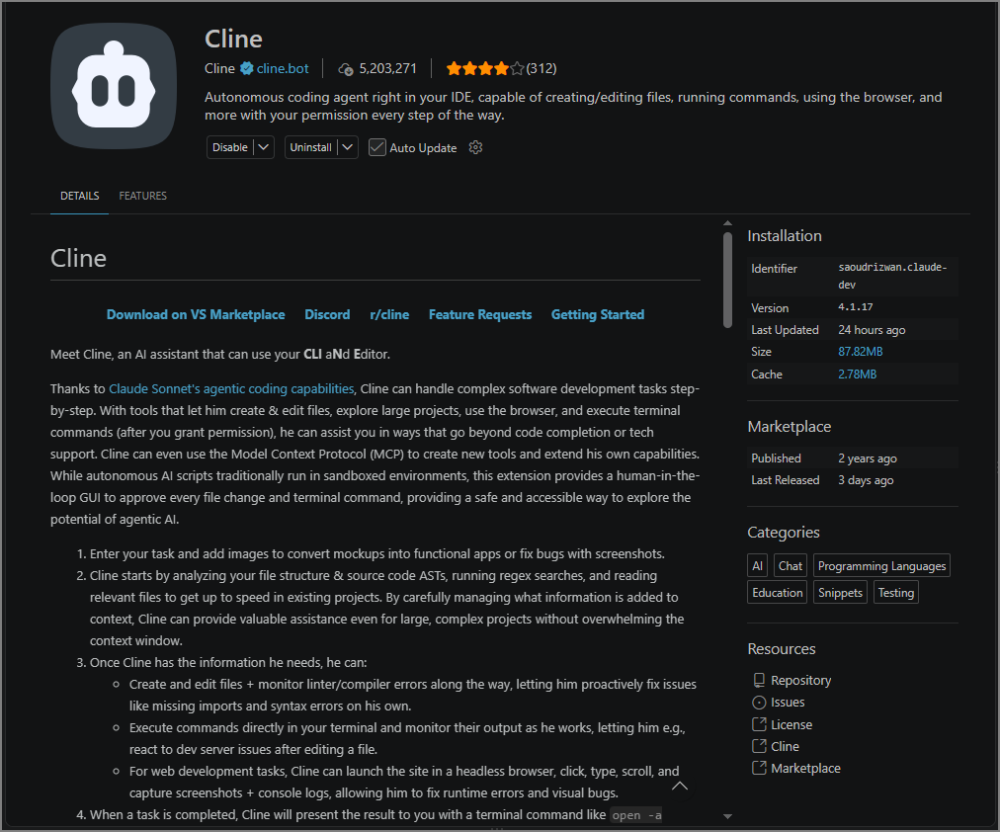

配置API Key时，你可以选择“OpenAI Compatible”模式，填入Base URL和API Key。如果你习惯使用国内服务，百度智能云、腾讯云、阿里云百炼等也都支持。

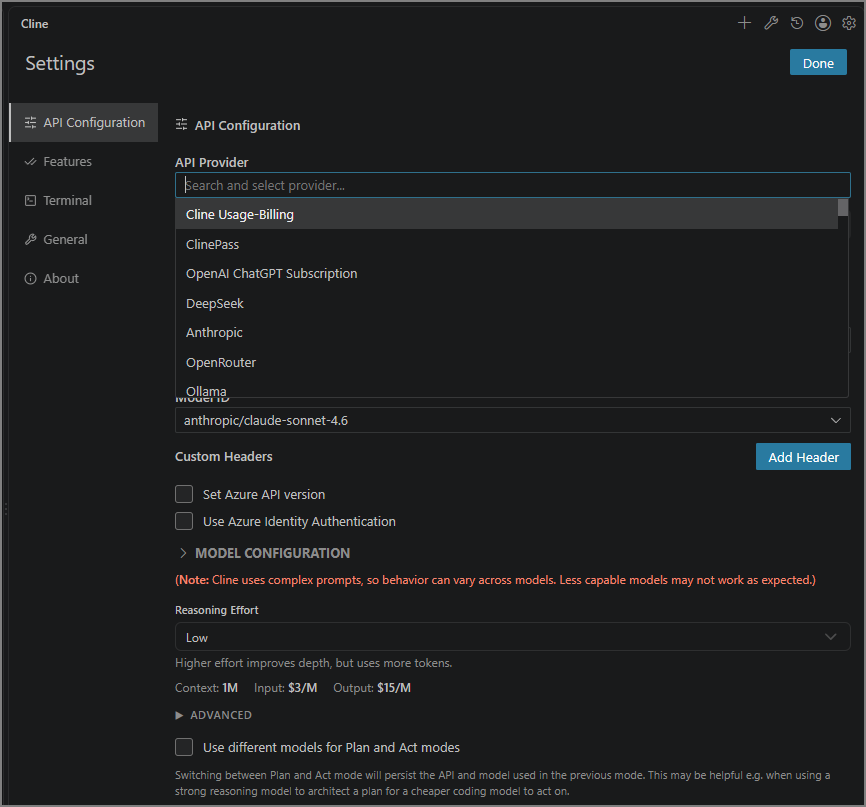

插件本体是完全免费的，你只需要支付所调用大模型的API费用。

## 12.6 适合什么样的开发者？

说实话，Cline并不是万能的。它更适合这些朋友：

- 重度使用VS Code，经常需要处理复杂重构或项目级任务的开发者；
- 在意数据隐私，想自己控制模型和成本的开发者；
- 愿意花十几分钟配置API，追求更高掌控感的开发者。

但如果你只是想快速补全单行代码，或者希望AI全自动“躺着写完”整个项目，那Cline可能不太适合你——它每一步都需要确认的机制，在纯自动化场景下反而会显得繁琐【注：如果想减少确认次数，可以尽量多放开访问操作权限！但相应的可能不太安全了哦】。

相比Continue、Copilot这类轻量工具，Cline的自动化程度和项目掌控力强得多。Continue更适合日常代码补全和对话，而Cline则擅长自主完成多步骤的复杂任务。

## 12.7 小结

对于数字IC设计这种涉及大量工程代码、多文件协作的领域，Cline的“先规划、再执行、每步确认”工作流尤其有价值。它不只是帮你写代码，而是像一个真正能动手的同事，帮你读代码、改文件、跑命令、查浏览器——每一步都在你的监督下进行。

下一篇，我会分享如何将Cline接入AI大模型，以及在实际数字IC开发中的使用体验。敬请期待！
