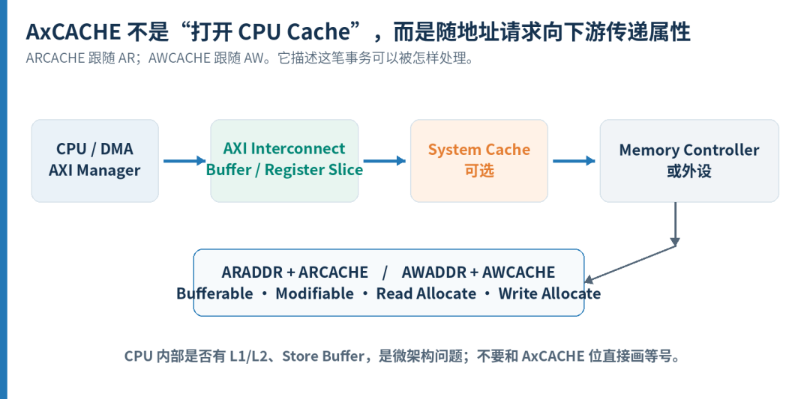
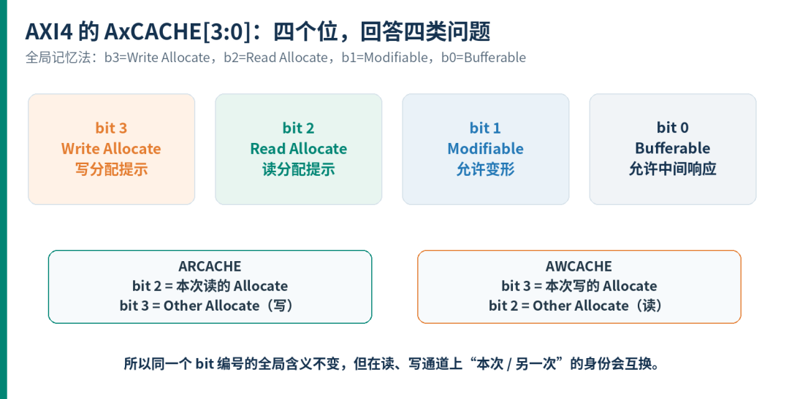
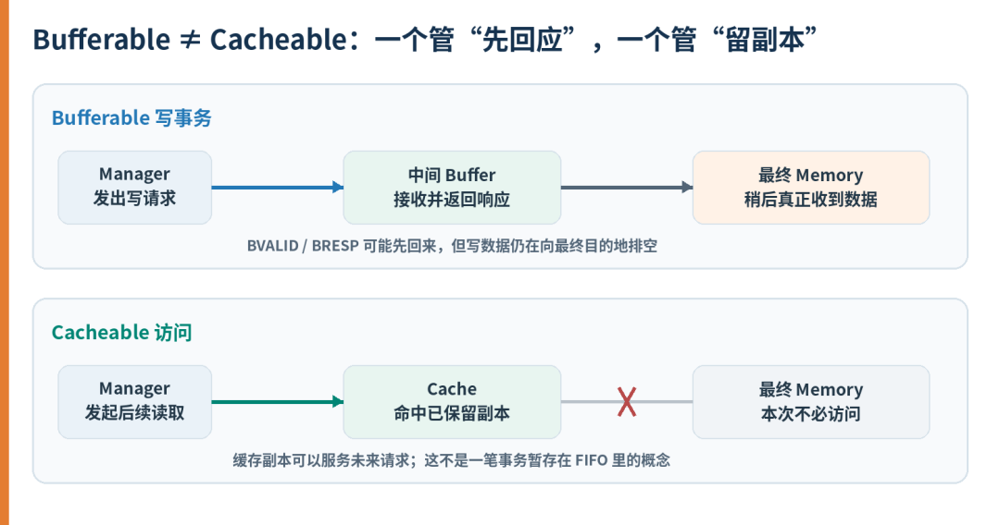
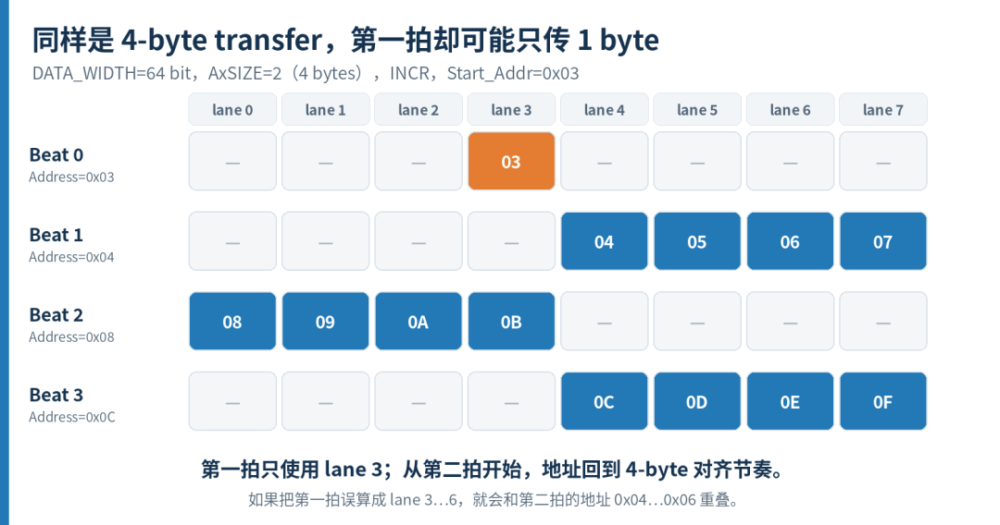
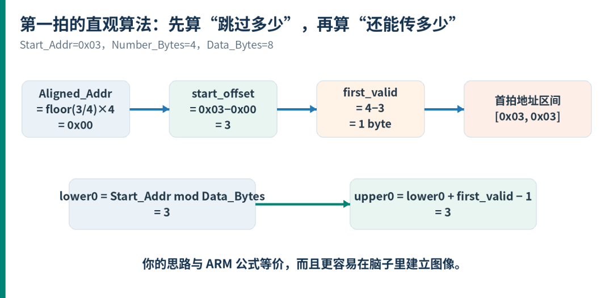
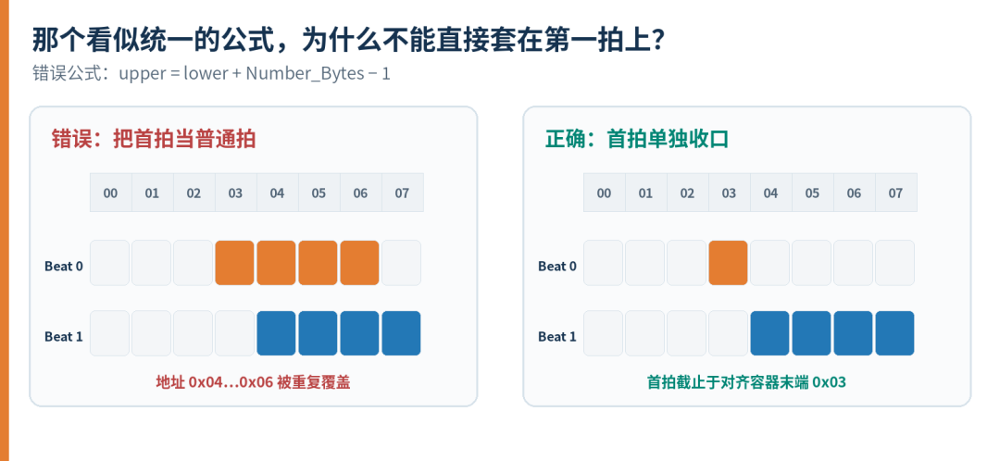

<!-- toc-start -->

# 目录

[1. 为什么一笔 AXI Burst 不能跨越 4KB 边界？](#1-为什么一笔-axi-burst-不能跨越-4kb-边界)  
　　[1.1 什么叫跨越 4KB 边界？](#11-什么叫跨越-4kb-边界)  
　　[1.2 为什么 AXI 不允许这样做？](#12-为什么-axi-不允许这样做)  
　　[1.3 为什么选择4KB？](#13-为什么选择4kb)  
　　[1.4 如何计算一笔 burst 是否跨界？](#14-如何计算一笔-burst-是否跨界)  
　　[1.5 刚好到达边界算不算跨界？](#15-刚好到达边界算不算跨界)  
　　[1.6 如果 Master 真的发出了跨界 burst，会发生什么？](#16-如果-master-真的发出了跨界-burst会发生什么)  
　　[1.7 正确做法：由Master主动拆分](#17-正确做法由master主动拆分)  
　　[1.8 为什么VIP还要检查两个地址范围配置是否一致？](#18-为什么vip还要检查两个地址范围配置是否一致)  
　　[1.9 验证环境应该检查什么？](#19-验证环境应该检查什么)  
　　[1.10 总结](#110-总结)  
[2. AXI 的 Cacheable、Bufferable 到底是什么意思？](#2-axi-的-cacheablebufferable-到底是什么意思)  
　　[2.1 先看它在系统里的位置](#21-先看它在系统里的位置)  
　　[2.2 四个位，分别在回答什么](#22-四个位分别在回答什么)  
　　[2.3 Bufferable：重点不是“有没有 Buffer”，而是响应点在哪里](#23-bufferable重点不是有没有-buffer而是响应点在哪里)  
　　[2.4 为什么 Buffer 不能替代 Cache](#24-为什么-buffer-不能替代-cache)  
　　[2.5 Modifiable：允许下游“变形”，但不能改变结果](#25-modifiable允许下游变形但不能改变结果)  
　　[2.6 Read Allocate 和 Write Allocate：是提示，不是强制命令](#26-read-allocate-和-write-allocate是提示不是强制命令)  
　　[2.7 回到最常见的问题：4'b1111 到底表示什么](#27-回到最常见的问题4b1111-到底表示什么)  
　　[2.8 几个常见编码，最好成对看 ARCACHE / AWCACHE](#28-几个常见编码最好成对看-arcache-awcache)  
　　[2.9 Write-through 和 Write-back，差别在最终目的地](#29-write-through-和-write-back差别在最终目的地)  
　　[2.10 为什么 MMIO 寄存器通常不能乱设 Cacheable](#210-为什么-mmio-寄存器通常不能乱设-cacheable)  
　　[2.11 做 RTL 和验证时，可以重点检查这些地方](#211-做-rtl-和验证时可以重点检查这些地方)  
　　[2.12 最后，把四个位压缩成一句话](#212-最后把四个位压缩成一句话)  
[3. AXI 非对齐传输：为什么第一个 Beat 要特殊处理？](#3-axi-非对齐传输为什么第一个-beat-要特殊处理)  
　　[3.1 先别急着算：分清三个尺度](#31-先别急着算分清三个尺度)  
　　[3.2 “非对齐”到底是对什么没对齐](#32-非对齐到底是对什么没对齐)  
　　[3.3 先看一个最典型的例子](#33-先看一个最典型的例子)  
　　[3.4 为什么后续地址要从 Aligned\_Addr 继续](#34-为什么后续地址要从-aligned_addr-继续)  
　　[3.5 第一拍的 lower 和 upper 应该怎么算](#35-第一拍的-lower-和-upper-应该怎么算)  
　　[3.6 如果第一拍也使用普通公式，会发生什么](#36-如果第一拍也使用普通公式会发生什么)  
　　[3.7 为什么通用实现里也必须有 first-beat 分支](#37-为什么通用实现里也必须有-first-beat-分支)  
　　[3.8 写事务还有一种等价的表达方式](#38-写事务还有一种等价的表达方式)  
　　[3.9 byte lane 范围和 WSTRB 不是同一个概念](#39-byte-lane-范围和-wstrb-不是同一个概念)  
　　[3.10 INCR、FIXED、WRAP 不要混着套公式](#310-incrfixedwrap-不要混着套公式)  
　　[3.11 协议允许，不等于每个 IP 都必须接受](#311-协议允许不等于每个-ip-都必须接受)  
　　[3.12 验证环境怎么写，最不容易绕晕](#312-验证环境怎么写最不容易绕晕)  
　　[3.13 最后，把这件事压缩成一句话](#313-最后把这件事压缩成一句话)  
　　[3.14 资料出处](#314-资料出处)  
[4. PCIe LTSSM：从一对差分线到可靠链路](#4-pcie-ltssm从一对差分线到可靠链路)  
　　[4.1 为什么不能接上差分线就开始发包？](#41-为什么不能接上差分线就开始发包)  
　　[4.2 Detect：先确认对面是否有接收器](#42-detect先确认对面是否有接收器)  
　　[4.3 Polling：用已知序列建立可验证的交流](#43-polling用已知序列建立可验证的交流)  
　　[4.4 Configuration：把多条 Lane 组织成一条 Link](#44-configuration把多条-lane-组织成一条-link)  
　　[4.5 Recovery：速率变了，就要重新验证链路](#45-recovery速率变了就要重新验证链路)  
　　[4.6 均衡：让接收端告诉对面，怎样发更容易收](#46-均衡让接收端告诉对面怎样发更容易收)  
　　[4.7 L0 之外：节能、测试和复位各有目的](#47-l0-之外节能测试和复位各有目的)  
　　[4.8 真正有用的调试问题：哪项退出条件没满足？](#48-真正有用的调试问题哪项退出条件没满足)  

<!-- toc-end -->

---

# 1. 为什么一笔 AXI Burst 不能跨越 4KB 边界？

> 来源：https://mp.weixin.qq.com/s/bM96-F0hatIXnFNGCiPn_Q
> 作者：基米
> update 2026/09/15 21 : 49

在使用 AXI VIP 产生随机激励时，我们可能会看到类似下面的报错：

```
AXI burst crosses 4KB boundary
```

很多人的第一反应是：

> AXI 的 burst 不就是地址连续递增吗？为什么递增到 4KB 边界就不允许继续了？

更让人疑惑的是：为什么偏偏是 4KB，而不是 1KB、8KB 或者其他大小？

这条看起来有些突兀的协议规定，实际上与 AXI Interconnect 的地址译码方式、Slave 选择方式以及写数据通道的结构密切相关。

## 1.1 什么叫跨越 4KB 边界？

4KB 等于：

$4KB=4096Byte=2^{12}=0x1000$

所以地址空间可以按照 4KB 划分：

```
0x0000 ～ 0x0FFF：第一个4KB区域
0x1000 ～ 0x1FFF：第二个4KB区域0x2000 ～ 0x2FFF：第三个4KB区域
```

地址的低 12 bit 表示当前 4KB 区域内的偏移：

```
address[11:0]
```

更高位则决定地址属于哪个 4KB 区域：

```
address[ADDR_WIDTH-1:12]
```

如果一笔 burst 的起始地址和结束地址不在同一个 4KB 区域，就称这笔 burst 跨越了 4KB 边界。

例如：

```
Start_Address = 0x0FF8
AxSIZE        = 2AxLEN         = 3AxBURST       = INCR
```

其中：

```
AxSIZE = 2 → 每个 beat 传输 2² = 4 Byte
AxLEN  = 3 → 一共有 AxLEN+1 = 4 个 beat
```

地址依次为：

```
Beat 0：0x0FF8
Beat 1：0x0FFCBeat 2：0x1000Beat 3：0x1004
```

前两个 beat 位于：

```
0x0000 ～ 0x0FFF
```

后两个 beat 位于：

```
0x1000 ～ 0x1FFF
```

因此，这是一笔跨越 4KB 边界的非法 burst。

## 1.2 为什么 AXI 不允许这样做？

假设系统地址映射如下：

```
0x0000 ～ 0x0FFF → Slave A
0x1000 ～ 0x1FFF → Slave B
```

Master 发出：

```
AWADDR = 0x0FF8
AWLEN  = 3AWSIZE = 2AWBURST= INCR
```

Interconnect 在接收到 AW transaction 时，会根据 AWADDR=0x0FF8 完成地址译码，并选择 Slave A。

问题在于，一笔 burst 只有一次 AW 地址传输。

后续的写数据通道只有：

```
WVALID
WREADYWDATAWSTRBWLAST
```

W 通道上没有每个 beat 对应的地址信号。

因此，当 burst 执行到第三个 beat、地址理论上已经进入 0x1000 时，Interconnect 很难突然把后半部分 WDATA 从 Slave A 切换到 Slave B。

如果允许这么做，Interconnect 就必须在内部完成：

将一笔 burst 拆成两笔子 burst；

重新产生两次 AW transaction；

把 WDATA 按照 4KB 边界切开；

重新产生每个子 burst 的 WLAST；

收集两个 Slave 返回的 BRESP；

把两个写响应合并成一个响应；

保证 BID 和事务顺序不被破坏。

读事务同样存在这个问题。Interconnect需要拆分 AR transaction、重新组合 RDATA，并正确处理 RID、RRESP 和 RLAST。

这样会显著增加 Interconnect 的实现复杂度。

所以 AXI 采用了更简单、也更明确的规则：

> 一笔 transaction 不得跨越 4KB 地址边界。

这样，Interconnect只需要在 AW或AR握手时进行一次地址译码，就能保证整个 burst 始终发送给同一个 Slave。

Arm 的 AXI 协议规范也明确规定，transaction 不得跨越 4KB 地址边界，其目的之一就是避免一次 transaction 跨越两个 Slave 的地址边界。AMBA AXI Protocol Specification

## 1.3 为什么选择4KB？

选择 4KB 并不是偶然的。

首先：

4KB=2^{12}

硬件只需要比较起始地址和结束地址的高位，就可以判断 burst 是否跨界：

```
start_addr[ADDR_WIDTH-1:12]
==end_addr[ADDR_WIDTH-1:12]
```

这种判断在硬件中非常简单。

其次，4KB 是系统中非常常见的地址管理粒度：

许多处理器使用 4KB 作为基础内存页大小；

外设寄存器空间经常按照 4KB 对齐分配；

Interconnect 可以使用地址高位选择目标 Slave；

软件和硬件的地址空间划分更容易保持一致。

但这里需要注意：

> AXI 的 4KB 边界限制并不代表系统必须使用 MMU，也不代表每个 Slave 只能占用 4KB。

即使某个 DDR、SRAM 或外设占用了数 MB 的连续空间，一笔 AXI burst 仍然不能从：

```
0x...FFF
```

跨越到：

```
0x...000
```

## 1.4 如何计算一笔 burst 是否跨界？

首先计算每个 beat 的最大传输字节数：

Number\_Bytes=2^{AxSIZE}

计算 burst 长度：

Burst\_Length=AxLEN+1

对于 INCR burst，还需要得到向下对齐地址：

Aligned\_Address = Start\_Address - (Start\_Address % Number\_Bytes)

最后一个有效字节地址为：

End\_Address = Aligned\_Address + Burst\_Length \* Number\_Bytes - 1

最终检查：

```
Start_Address[ADDR_WIDTH-1:12]
==End_Address[ADDR_WIDTH-1:12]
```

两者相等，说明没有跨越 4KB；两者不相等，则说明该 burst 非法。

## 1.5 刚好到达边界算不算跨界？

假设：

```
Start_Address = 0x0FF0
每个 beat     = 4 ByteBurst_Length  = 4
```

地址序列为：

```
0x0FF0
0x0FF40x0FF80x0FFC
```

最后一个 beat 覆盖：

```
0x0FFC ～ 0x0FFF
```

虽然计算下一个地址会得到 0x1000，但这笔 burst 的最后一个有效字节仍然是 0x0FFF，因此没有跨界。

也就是说：

> burst 可以刚好结束在 4KB 边界之前，但不能包含边界之后的任何有效字节。

判断时应比较最后一个有效字节地址，而不是简单判断“起始地址加总字节数是否等于 0x1000”。

## 1.6 如果 Master 真的发出了跨界 burst，会发生什么？

首先要明确：

> 跨越 4KB 的 burst 是 Master 违反 AXI 协议。

AXI 并没有规定所有 Interconnect 都必须用完全相同的方式处理这种非法输入。

实际系统中可能出现以下情况。

1. VIP或Protocol Checker报错

商业 AXI VIP 通常会计算 burst 的结束地址，并报告类似错误：

```
Burst crosses 4KB boundary
```

这通常是验证环境中最先看到的现象。

但即使 AWREADY 或 ARREADY 已经拉高，也不能说明 transaction 是合法的。READY 只表示接收方能够完成握手，并不是协议合法性认证信号。

2. 整个 burst 仍被送给最初选中的 Slave

Interconnect可能只根据起始地址完成一次译码：

```
AWADDR=0x0FF8 → 选择 Slave A
```

随后把所有 W beat 都送给 Slave A。

即使后面的地址理论上已经进入 Slave B，Slave B 也可能完全收不到数据。

最终可能出现：

数据写入错误位置；

地址高位被截断；

Slave 内部地址发生回卷；

非法地址访问；

静默数据破坏。

这种情况比直接报错更加危险。

3. 返回DECERR或SLVERR

一些具有防御性设计的 Interconnect 会检测跨界 burst，并把 transaction 导向内部 error slave。

读事务可能返回：

```
RRESP = DECERR
```

写事务可能在接收完全部 W beat 后返回：

```
BRESP = DECERR
```

如果错误是在 Slave 内部发现，也可能返回：

```
SLVERR
```

但不能认为跨界后一定返回 DECERR，因为 Master 已经违反协议，后续行为取决于具体实现。

4. 系统发生阻塞

如果 Interconnect 和 Slave 默认所有 Master 都严格遵守 AXI 协议，它们可能没有为非法跨界 transaction设计完整的恢复机制。

可能出现：

```
AW已经握手
部分W数据已经传输后续WREADY不再拉高Master一直等待
```

或者读通道始终等不到完整的 RDATA 和 RLAST。

因此，Master不能依赖下游模块帮助自己修复非法 burst。

## 1.7 正确做法：由Master主动拆分

如果 Master 需要访问：

```
0x0FF8 ～ 0x1007
```

应该在发送地址之前将其拆成两笔合法 burst。

第一笔：

```
0x0FF8
0x0FFC
```

第二笔：

```
0x1000
0x1004
```

也就是：

```
Burst 1：边界之前
Burst 2：边界之后
```

这种拆分应该由 Master、DMA 或协议转换模块完成，而不是等到 Interconnect 收到非法 transaction 后再处理。

## 1.8 为什么VIP还要检查两个地址范围配置是否一致？

在一些 AXI VIP 示例中，可以看到类似配置：

```
`SVT_AXI_TRANSACTION_ADDR_RANGE_NUM_LSB_BITS
`SVT_AXI_TRANSACTION_4K_ADDR_RANGE
```

随后在 post\_body() 中进行判断：

```
if (NUM_LSB_BITS > 12 && ADDR_RANGE > 4096)
    // 配置一致else if (NUM_LSB_BITS <= 12 && ADDR_RANGE <= 4096)    // 配置一致else    `uvm_error(”post_body”,               ”The 4K boundary crossing values are inconsistent”)
```

这段代码并不是在拆分或者修正跨界 burst，而是在检查测试配置是否自洽。

其中一个配置使用地址位数描述范围：

```
12 bit → 2¹² = 4096 Byte
```

另一个配置直接使用字节数描述范围。

如果出现：

```
NUM_LSB_BITS = 12
ADDR_RANGE   = 8192
```

一个配置把地址变化限制在 4KB 内，另一个配置却希望覆盖超过 4KB 的范围。

这可能导致：

约束随机化失败；

测试认为自己产生了跨界激励，实际却没有；

coverage 与实际 transaction 不一致；

testcase 出现“假 PASS”。

所以这项检查的真正目的不是处理非法 transaction，而是：

> 保证与 4KB 跨界测试相关的多个配置表达了相同的测试意图。

## 1.9 验证环境应该检查什么？

对于 AXI Master，至少应检查：

```
AWADDR/ARADDR
AWSIZE/ARSIZEAWLEN/ARLENAWBURST/ARBURST
```

然后计算最后一个有效字节地址。

可以加入类似断言：

```
assert (
    start_addr[ADDR_WIDTH-1:12]    ==    end_addr[ADDR_WIDTH-1:12])else    `uvm_error(”AXI_4KB”,               ”AXI burst crosses 4KB boundary”)
```

正常功能测试中，Master sequence 应当通过 constraint 避免产生跨界 burst。

如果故意测试 DUT 对非法输入的防御能力，则应将其作为负向测试，并明确预期结果：

VIP是否报告 protocol error；

Interconnect是否返回 DECERR；

是否正确接收并丢弃剩余 W beat；

是否仍然返回完整的 R beat 和 RLAST；

是否会造成死锁；

非法事务之后，接口能否继续正常工作。

需要特别注意：负向测试的预期行为应以具体 DUT 规格为准，不能默认所有 Interconnect 都会返回相同响应。

## 1.10 总结

AXI 禁止 burst 跨越 4KB 边界，最根本的原因是：

> 保证一次 AW/AR 地址译码选中的 Slave，在整个 burst 期间始终不变。

4KB 等于 (2^{12})，硬件只需要比较起始地址和结束地址的高位，就能快速完成边界检查。

如果 Master 发出跨界 burst：

VIP可能报告协议错误；

Interconnect可能返回 DECERR；

整个 burst 也可能被送往错误的 Slave；

严重时甚至可能造成数据破坏或总线阻塞。

所以，4KB 边界不是一个可有可无的 VIP 检查项，而是 AXI Master 地址生成逻辑必须遵守的基本规则。

真正可靠的设计，不是期待 Interconnect 修复非法 burst，而是在 Master 发出 AW或AR之前，就完成边界计算和 burst 拆分。

---

# 2. AXI 的 Cacheable、Bufferable 到底是什么意思？

> 来源：https://mp.weixin.qq.com/s/P9fZ2qxz01LaPR96RmKoPw
> 作者：吉米儿
> update 2026/09/15 21 : 56

做 AXI4 设计时，经常会遇到这样的配置：ARCACHE=4'b1111，AWCACHE=4'b1111。第一次看到它，很多人的直觉是：“四个位全为 1，是不是等于强制把数据放进 Cache？读请求会自动缓存，写请求会立刻写回 DDR？”

这个理解很自然，却把协议属性、Cache 策略和 CPU 微架构混在了一起。AxCACHE 不负责凭空创建一个 Cache，也不是命中、回写、替换这些动作的直接命令。它随 AR 或 AW 地址请求向下游传递，告诉互连、缓存和存储控制器：这笔事务能不能暂存在中间，能不能被拆分或合并，要不要查 Cache，以及是否建议分配 Cache line。

先给结论：AxCACHE 不是“缓存开关”，而是一组内存属性和处理权限。它定义下游可以怎样优化这笔请求，但最终是否命中、是否分配、何时回写，仍取决于系统中真实存在的 Cache 及其策略。

本文讨论 AXI4。AXI3 曾把 AxCACHE[1] 称为 Cacheable；到了 AXI4，这一位的正式名称是 Modifiable。沿用旧资料时，尤其要留意这个变化。

## 2.1 先看它在系统里的位置

AXI4 有独立的读地址通道 AR 和写地址通道 AW，因此也有 ARCACHE 和 AWCACHE。它们都是 4-bit 属性，分别跟随读地址、写地址请求向下游传播。



图 1　AxCACHE 属于 AXI 地址请求的属性，主要约束请求进入 AXI 系统之后的处理方式。

如果 AXI Manager 是 CPU，CPU 内部可能早已存在 L1/L2 Cache 和 Store Buffer；如果 Manager 是 DMA，它也可能完全没有私有 Cache。无论上游内部结构怎样，只要发出 AXI 请求，ARCACHE/AWCACHE 表达的都是这笔下游事务允许怎样被处理。

所以，“CPU 写数据先进入 Store Buffer，再进入 Cache”可以是某种处理器的真实写路径，但它不是 AxCACHE[0] 的定义。Store Buffer 只是 Buffer 的一种具体微架构；协议里的 Bufferable 覆盖的是更广的中间缓冲与响应点语义。

## 2.2 四个位，分别在回答什么

把位名按统一视角记住最简单：bit 0 是 Bufferable，bit 1 是 Modifiable，bit 2 是 Read Allocate，bit 3 是 Write Allocate。后两位既出现在 ARCACHE，也出现在 AWCACHE，因为一个系统级 Cache 需要知道：同一条 Cache line 是否可能已经被另一类访问分配过。



图 2　AxCACHE[3:0] 的 AXI4 含义，以及 ARCACHE/AWCACHE 上 Allocate 与 Other Allocate 的对应关系。

| 位 | AXI4 含义 | 它真正允许或提示什么 |
| --- | --- | --- |
| AxCACHE[0] | Bufferable | 写响应能否由中间点返回；部分普通内存读还能否转发尚未到最终目的地的写数据 |
| AxCACHE[1] | Modifiable | 下游能否在保持可观察语义的前提下拆分、合并或调整事务形态 |
| AxCACHE[2] | Read Allocate | 提示这条 line 可能由读分配，或建议当前读进行分配 |
| AxCACHE[3] | Write Allocate | 提示这条 line 可能由写分配，或建议当前写进行分配 |

从单个通道看，规范使用的是 Allocate 与 Other Allocate：对 ARCACHE 来说 bit 2 是本次读的 Allocate，bit 3 是 Other Allocate；对 AWCACHE 来说 bit 3 是本次写的 Allocate，bit 2 是 Other Allocate。换成系统级名称后，就是固定的 Read Allocate 与 Write Allocate。

## 2.3 Bufferable：重点不是“有没有 Buffer”，而是响应点在哪里

对写事务，Bufferable 最关键的区别是：B 响应是否必须等写请求到达最终目的地。 当 AWCACHE[0]=0 时，写响应要来自最终目的地；当 AWCACHE[0]=1 时，只要满足协议的可观察性要求，中间的互连、桥或缓冲节点就可以先返回响应，再把数据继续向后排空。



图 3　Bufferable 允许事务在中间完成响应；Cacheable 则意味着系统可以保留供未来访问使用的副本。

这解释了一个很实用的验证陷阱：看到 BVALID/BRESP 握手完成，不能一概断定 DDR 此刻已经更新。如果这笔写是 Bufferable，响应可能只说明某个中间节点已经承担了继续完成写入的责任。

Bufferable 对读的影响窄得多。对于可修改的 Normal Non-cacheable 访问，它可以允许读直接获得仍在传向最终目的地的写数据；而 Device 类型的读仍要从最终目的地取得数据。无论哪种情况，它都不等于“把读数据缓存起来供以后命中”。

## 2.4 为什么 Buffer 不能替代 Cache

Buffer 保存的是尚在路上的事务或数据。它的目标通常是解耦时序、吸收突发流量、让上游尽早继续工作；数据最终仍要离开 Buffer，抵达下一站。

Cache 保存的是可被未来访问复用的副本。后续读取可能直接命中，不再访问最终 Memory；Write-back Cache 甚至可以暂时只更新缓存副本，等替换、维护或其他策略触发时再把脏数据写回。

| 比较项 | Buffer | Cache |
| --- | --- | --- |
| 主要目的 | 解耦上下游、暂存正在传输的数据 | 利用局部性，保存可复用的数据副本 |
| 数据停留 | 通常是临时的，事务完成后继续排空 | 可能跨越多笔事务长期存在 |
| 后续访问 | 一般不会因为“以前经过”而直接命中 | 可以命中已有 Cache line |
| 典型结构 | FIFO、register slice、write buffer、桥接队列 | L1/L2、system cache、last-level cache |
| AxCACHE 关联 | bit 0 的响应与转发权限 | bit 3:2 的查找/分配语义及整体内存类型 |

一句话区分：Bufferable 讨论“这笔事务可不可以先停在中间”；Cacheable 讨论“这份数据可不可以留下副本，供后面的事务复用”。

## 2.5 Modifiable：允许下游“变形”，但不能改变结果

AXI4 把 AxCACHE[1] 定义为 Modifiable。它为互连和转换器提供优化空间：例如把一笔长事务拆开、把相邻请求合并、调整传输大小，或对读取做预取。前提是这些变化不能破坏协议规定的可观察行为。

当 Modifiable=0 时，下游通常必须保留事务的关键属性，不应为了效率随意改造；当它为 1 时，也只是允许修改，并不要求一定修改。更重要的是，Modifiable=1 本身不能证明这笔访问可缓存。

判断 AXI4 请求是否属于 Cacheable 区域，应看 AxCACHE[3:2]：只要 Read Allocate 或 Write Allocate 有一位为 1，就需要进行 Cache lookup。不要只看到 bit 1 为 1，便沿用 AXI3 术语把它判成 Cacheable。

## 2.6 Read Allocate 和 Write Allocate：是提示，不是强制命令

Allocate 位的作用有两层。第一层是要求相关 Cache 进行查找，因为同一地址的 Cache line 可能已经存在；第二层是向 Cache 提供分配建议。当前事务对应的 Allocate 位为 1 时，分配被推荐，但不是绝对强制。

为什么读请求也带 Write Allocate，写请求也带 Read Allocate？因为系统级 Cache 只看到当前请求，却必须判断一条 line 是否可能被此前另一种请求分配过。举例说，ARCACHE[3]=1 并不是“这次读要做写分配”，而是在告诉 Cache：这条 line 可能曾因写操作而被分配，所以本次读不能跳过查找。

当 AxCACHE[3:2]=2'b00 时，下游不需要进行 Cache lookup；只要其中任一位为 1，就必须查找。至于 miss 后是否真的创建新 Cache line，还要结合当前通道的 Allocate 位和具体 Cache 策略。

## 2.7 回到最常见的问题：4'b1111 到底表示什么

现在逐位展开 ARCACHE=4'b1111：Bufferable=1，Modifiable=1，Read Allocate=1，Write Allocate=1。按 AXI4 的内存类型编码，它表示 Write-back、Read and Write Allocate。

对一个读请求来说，它要求相关 Cache 查找这条 line，并推荐在读 miss 后进行读分配；同时声明这条 line 也可能由写操作分配过。它不保证一定命中，也不保证一定新建 Cache line，更不会让一条原本不存在 Cache 的数据通路突然拥有缓存能力。

AWCACHE=4'b1111 同样属于 Write-back、Read and Write Allocate。对写请求而言，它允许下游把写数据保留在 Cache 中，而不必立即抵达最终 Memory；是否分配、何时把脏 line 写回，取决于 Cache 实现、替换策略、同步要求和维护操作。“Write-back 属性”不等于“现在立刻执行一次 writeback”。

## 2.8 几个常见编码，最好成对看 ARCACHE / AWCACHE

Allocate 与 Other Allocate 在读写通道上的角色不同，所以有些内存类型的 ARCACHE 和 AWCACHE 并不相同。下面列的是规范中常见、且适合建立直觉的一组编码。

| ARCACHE | AWCACHE | 典型内存类型 | 直观理解 |
| --- | --- | --- | --- |
| 0000 | 0000 | Device Non-bufferable | 寄存器式访问；写响应等到最终目的地 |
| 0001 | 0001 | Device Bufferable | 仍是 Device；写响应可由中间点返回 |
| 0010 | 0010 | Normal Non-cacheable Non-bufferable | 可修改，但不查 Cache，也不提前返回写响应 |
| 0011 | 0011 | Normal Non-cacheable Bufferable | 不留缓存副本；允许缓冲和中间写响应 |
| 1011 | 0111 | Write-back No Allocate | 需要查 Cache；本次 miss 不推荐分配 |
| 1111 | 0111 | Write-back Read Allocate | 读 miss 推荐分配，写 miss 不推荐 |
| 1011 | 1111 | Write-back Write Allocate | 写 miss 推荐分配，读 miss 不推荐 |
| 1111 | 1111 | Write-back Read and Write Allocate | 读写都需查找，读写 miss 都建议分配 |

这里最容易踩的坑是把 0011 读成“Cacheable”。它的 bit 1 虽然为 1，但在 AXI4 里表示 Modifiable；由于 bit 3:2 都是 0，它仍然是 Normal Non-cacheable。

## 2.9 Write-through 和 Write-back，差别在最终目的地

两者都可以使用 Cache 副本服务读取，也都允许 Cache lookup、预取和合并。真正的差异在写数据最终何时到达后端 Memory。

Write-through 属性要求写数据及时传播到最终目的地；Cache 中可以保留副本，但后端 Memory 也要跟上。Write-back 属性则允许写先停留在 Cache，最终目的地不必因为当前写请求立即更新，之后再由替换或维护流程完成回写。

因此，用逻辑分析仪只看 AXI 上游的 B 响应，很难直接推出 DRAM 里的物理内容已经更新。要同时知道内存类型、响应点、Cache 状态以及系统的同步操作。

## 2.10 为什么 MMIO 寄存器通常不能乱设 Cacheable

访问 SRAM 或 DDR 时，预取、合并、缓存副本往往能提高性能；访问状态寄存器、FIFO 端口、中断清除寄存器时，这些优化却可能改变每次访问应有的副作用。

例如某个寄存器“读一次就清零”，如果下游从 Cache 副本返回第二次读取，软件看到的行为就完全错误；两个相邻寄存器写如果被合并，也可能破坏设备规定的访问顺序。因此 MMIO 一般应映射成合适的 Device 类型，而不是为了性能随手把 AxCACHE 置成 1111。

同一个地址区域还必须在各个 Manager 之间保持一致的 Cacheability 认知。一个核把它当 Cacheable，另一个 DMA 却把它当 Non-cacheable，会让“谁拥有最新数据”变得无法可靠判断。系统若要改变区域属性，通常需要先停止访问，并完成必要的 Cache maintenance 与同步。

## 2.11 做 RTL 和验证时，可以重点检查这些地方

| 检查项 | 真正要确认的问题 |
| --- | --- |
| 位定义 | AXI4 中 bit 1 按 Modifiable 解释；不要照搬 AXI3 的 Cacheable 名称 |
| 属性传播 | ARCACHE/AWCACHE 是否与对应 AR/AW 请求一起穿过互连、桥和转换器 |
| 写响应点 | Bufferable=0/1 时，B 响应分别由最终目的地还是允许的中间点产生 |
| 事务变形 | Modifiable=0 时是否保持关键属性；=1 时拆分/合并后语义是否等价 |
| Cache lookup | AxCACHE[3:2] 任一为 1 时，相关 Cache 是否执行查找 |
| Allocate 提示 | 区分“推荐分配”和“强制分配”；No Allocate 也不是绝对禁止 |
| Memory type | Device、Normal Non-cacheable、Write-through、Write-back 的组合是否合法 |
| 地址一致性 | 不同 Manager 对同一物理区域的 Cacheability 是否一致 |
| Scoreboard | 不要把 Bufferable 写的 B 响应直接等价成“最终 Memory 已更新” |

如果系统里根本没有 Cache，Cacheable 属性通常不会凭空产生命中；但互连、桥和控制器仍要正确传播或约束这些属性。如果下游只支持部分组合，转换策略也必须在集成文档里说清楚。

## 2.12 最后，把四个位压缩成一句话

AxCACHE 告诉系统：这笔请求可不可以先停在中间、可不可以被改造、是否需要查 Cache，以及是否建议为读或写留下 Cache line。

理解这句话以后，很多似是而非的问题会自然分开：Store Buffer 是具体实现，Bufferable 是协议权限；Cache hit 是运行结果，Allocate 是请求提示；Write-back 是内存属性，也不是“现在立即写回”的动作。

所以，下次再看到 ARCACHE/AWCACHE=4'b1111，不要只翻译成“可缓存”。更准确的说法是：这是一笔可缓冲、可修改、需要 Cache lookup，并同时给出读写分配提示的 Write-back 访问。

资料出处

[1] Arm，AMBA AXI Protocol Specification，Issue J：Memory types、transaction attributes 与 AxCACHE 编码。查看原文

[2] Arm，Learn the architecture — An introduction to AMBA AXI：AxCACHE 与 allocation attributes 概览。查看原文

本文示意图为解释协议语义而绘制，未复用规范原图。具体产品对事务属性的支持范围，还应结合对应互连、桥接器、Cache 和端点文档确认。

---

# 3. AXI 非对齐传输：为什么第一个 Beat 要特殊处理？

> 来源：https://mp.weixin.qq.com/s/mD1MFee8HlvDn3wQFEW9xQ
> 作者：吉米儿
> update 2026/09/15 22 : 05

先不谈 AXI4 的公式。假设每次最多搬运 4 byte，那么自然的起始地址会是 0x00、0x04、0x08、0x0C……每个地址都落在一个 4-byte 分组的开头。如果偏偏从 0x03 开始，它没有落在任何一组的起点，这就是一次 4-byte 非对齐传输。

把它放回 AXI4：AxSIZE=2 表示每次 transfer 最多传 4 byte。在 64-bit 数据总线上，0x04 虽然位于 8-byte 总线字的中间，却仍然是对齐起点；0x03 才是非对齐起点。可见“对齐”看的是本次 transfer 的大小，不是整条数据总线有多宽。

接下来问题就出现了：如果第一拍从 0x03 连续取满 4 byte，它会覆盖 0x03…0x06；但第二拍又要从 0x04 开始，覆盖 0x04…0x07。这样 0x04…0x06 就重复了。所以第一拍为什么特殊，本质上是在解决非对齐起点与后续对齐节奏怎样交接。

答案先说：第一拍不是一拍“平移后的完整 transfer”，而是原本对齐传输容器被 Start\_Addr 截掉前半段之后，剩下的尾巴。 所以它的 lower byte 由真实起点决定，upper byte 却必须收口在第一个对齐容器的末端。

本文聚焦 AXI4 中最常见的 INCR 非对齐 burst，并用 Beat 0 表示第一拍。ARM 规范的公式按第 1、2、3…次 transfer 编号，换成 0-based 写法时要相应减 1。

## 3.1 先别急着算：分清三个尺度

理解非对齐传输，最容易混淆的是总线宽度、单拍传输大小和起始地址偏移。它们分别决定“有多少条 byte lane”“每拍最多传多少字节”和“第一拍从哪条 lane 开始”。

| 名称 | 计算或来源 | 决定什么 |
| --- | --- | --- |
| Data\_Bytes | DATA\_WIDTH / 8 | 数据总线一共有多少条 byte lane |
| Number\_Bytes | 2^AxSIZE | 每个 transfer 允许覆盖的最大字节数 |
| Start\_Addr | AxADDR | burst 第一拍的真实起始字节地址 |
| Aligned\_Addr | floor(Start\_Addr / Number\_Bytes) × Number\_Bytes | Start\_Addr 所在 transfer 容器的对齐起点 |

例如 DATA\_WIDTH=64 bit，则 Data\_Bytes=8；AxSIZE=2，则 Number\_Bytes=4。这里并不是“64-bit 总线每拍一定传 8 byte”，而是总线上有 8 条 lane，本次窄传输每拍最多使用其中连续的 4 条。ARM 规范也把 Size 定义为每次数据传输的最大字节数。[1]

## 3.2 “非对齐”到底是对什么没对齐

AXI4 里的对齐基准是 Number\_Bytes，也就是 2^AxSIZE，而不是数据总线的总字节数。判断方法很简单：如果 AxADDR mod Number\_Bytes 不等于 0，这次传输的起点就是非对齐的。

仍以 64-bit 总线、AxSIZE=2 为例：每拍最多传 4 byte。地址 0x04 虽然落在 8-byte 总线字的中间，却能被 4 整除，所以它是对齐的窄传输；地址 0x03 才是非对齐起点。把“总线字对齐”和“transfer size 对齐”混为一谈，是分析 lane 时最常见的第一处误区。

AxSIZE 描述的是每次 transfer 的最大字节数，AxLEN+1 描述 burst 中有多少次 transfer。两者都不保证每拍真的写入同样多的有效字节：非对齐首拍可能被截短，写通道还可以用 WSTRB 在合法窗口内进一步屏蔽字节。

## 3.3 先看一个最典型的例子

设定：64-bit 数据总线、AxSIZE=2、AxBURST=INCR、Start\_Addr=0x03，且 AxLEN=3，也就是一共 4 个 beat。

Start\_Addr=0x03 没有按 4 byte 对齐。它所在的 4-byte 对齐容器是 [0x00, 0x03]，而起点已经落到了容器最后一个字节。因此第一拍真正还能使用的只剩地址 0x03。



图 1　64-bit 总线上的 32-bit 非对齐 INCR burst；第一拍只有 1 个有效 byte lane。

| Beat | 传输地址 | 有效 lane | 对应内存地址 |
| --- | --- | --- | --- |
| 0 | 0x03 | lane 3 | 0x03 |
| 1 | 0x04 | lane 4…7 | 0x04…0x07 |
| 2 | 0x08 | lane 0…3 | 0x08…0x0B |
| 3 | 0x0C | lane 4…7 | 0x0C…0x0F |

这里最关键的观察是：Beat 0 的地址是原始 Start\_Addr=0x03；Beat 1 的地址却是 Aligned\_Addr+4=0x04。 第一拍和第二拍正好在第一个 4-byte 容器的边界处交接。

因此这个 4-beat burst 覆盖的是 0x03…0x0F，共 13 个有效地址，而不是机械地得到 4×4=16 个有效字节。AxLEN 统计的是 transfer 次数，不是最终有效字节数。

## 3.4 为什么后续地址要从 Aligned\_Addr 继续

对于由非对齐 AxADDR 发起的 INCR burst，ARM 给出的地址规则可以改写成下面的 0-based 形式：

Address[0] = Start\_Addr

Address[i] = Aligned\_Addr + i × Number\_Bytes，i > 0

这说明非对齐偏移只影响 burst 起点。第一拍结束后，INCR burst 立即回到按 Number\_Bytes 对齐的地址序列。它不是从 0x03、0x07、0x0B 这样一直错位地向后走，而是 0x03、0x04、0x08、0x0C。

这里的 Aligned\_Addr 是把 Start\_Addr 向下取整到 Number\_Bytes 边界。它不是把地址对齐到整条数据总线，也不是修改总线上实际出现的第一拍地址，而是后续 INCR 地址计算的基准。

## 3.5 第一拍的 lower 和 upper 应该怎么算

byte lane 本质上是当前地址在一个数据总线字中的偏移，因此第一拍的 lower byte 很直接：

lower0 = Start\_Addr mod Data\_Bytes

upper byte 则不能从 Start\_Addr 再数满 Number\_Bytes，而要停在第一个对齐 transfer 容器的末端：

upper0 = Aligned\_Addr + Number\_Bytes − 1 − floor(Start\_Addr/Data\_Bytes)×Data\_Bytes

代入例子：Aligned\_Addr=0x00，Number\_Bytes=4，Data\_Bytes=8，于是 lower0=3，upper0=3。ARM 规范在 Transaction equations 中对第一拍和后续拍分别给出了这两套 byte lane 公式。[1]

而你之前提出的思路，可以写成更直观的等价形式：

start\_offset = Start\_Addr − Aligned\_Addr

first\_valid\_bytes = Number\_Bytes − start\_offset

upper0 = lower0 + first\_valid\_bytes − 1



图 2　先求起点在对齐容器内跳过了多少字节，再求第一拍还剩多少有效字节。

这个思路是对的。它直接回答了“第一拍为什么变短”：不是总线装不下，而是 Start\_Addr 前面的字节不属于本次 transaction；同时，容器末端之后的字节已经属于下一拍。

## 3.6 如果第一拍也使用普通公式，会发生什么

假设错误地统一使用 upper=lower+Number\_Bytes−1，那么第一拍会得到 lower=3、upper=6，也就是把 lane 3…6 都当成有效范围，对应地址 0x03…0x06。

但第二拍按照协议从 0x04 开始，它会再次访问 0x04…0x07。于是 0x04、0x05、0x06 在两个 beat 中重复出现。问题不是“第一拍能不能放下 4 byte”，而是它已经侵入了下一拍负责的地址区间。



图 3　错误统一公式会让第一拍与第二拍覆盖重叠地址；正确算法在 0x03 处收口。

判断第一拍 upper byte 的真正边界，不是 Start\_Addr + Number\_Bytes − 1，而是 Aligned\_Addr + Number\_Bytes − 1。

## 3.7 为什么通用实现里也必须有 first-beat 分支

把规范公式翻译成 RTL、VIP、scoreboard 或 memory model 后，核心逻辑通常都会出现类似的首拍分支：

if (first\_transfer && unaligned)

upper = end\_of\_first\_aligned\_container;

else

upper = lower + Number\_Bytes - 1;

第一条分支使用“首个对齐容器的末端”，第二条分支才允许从当前 lower 往后数满一拍。这个判断不是某个项目的特殊约定，而是 AXI4 transaction equations 的直接代码化表达。

工程实现可以不显式保存 unaligned 标志，只要能在第一拍选择正确公式；也可以在接受 AxADDR 时计算首拍 mask，并让后续拍统一走对齐路径。具体写法不同，必须维护的协议边界相同。包括 PULP AXI 在内的一些开源实现，也会在地址与 byte-lane 辅助函数中把第一拍单独分支；它只是通用规则的一种实现参考。[2]

## 3.8 写事务还有一种等价的表达方式

对于写事务，AXI4 允许两种方式描述非对齐的逻辑起点：直接用 AWADDR 低位表明起点；或者把 AWADDR 按 Number\_Bytes 对齐，再用首拍 WSTRB 屏蔽前面的无效字节。[1] 以逻辑起点 0x03 为例，可以用 AWADDR=0x03 表达；也可以用对齐地址配合首拍 strobe，只写实际需要的 lane。

这两种表示最终都依赖同一件事：地址、AxSIZE 与 WSTRB 必须共同描述一致的有效字节集合。验证环境不能只看 AWADDR，也不能只看 WSTRB；应该先由地址和 size 建立合法 lane 窗口，再检查 strobe 是否落在窗口内。

## 3.9 byte lane 范围和 WSTRB 不是同一个概念

lower/upper byte 给出的是这一个 beat 允许落在哪些 lane。对于写事务，WSTRB 再指出这些 lane 里哪些字节实际有效。ARM 要求地址低位与 byte strobe 信息保持一致，而且 WSTRB 只能在装有有效数据的 lane 上拉高。[1]

在本例中，如果第一拍的 0x03 确实要写，则 WSTRB 可以是 8'b0000\_1000；第二拍完整写 0x04…0x07 时，可以是 8'b1111\_0000。WSTRB 还能在合法窗口内进一步打洞，但不能靠拉高窗口外的 strobe，把第一拍偷偷延伸到下一拍。

读通道没有 RSTRB，因此验证环境需要根据 ARADDR、ARSIZE、ARBURST 和 beat index 自己算出有效 lane，只比较这些 byte；否则第一拍未参与传输的位也拿去比，很容易产生假错误。

## 3.10 INCR、FIXED、WRAP 不要混着套公式

| Burst 类型 | 正确地址规则 | 容易误用的地方 |
| --- | --- | --- |
| INCR 非对齐首拍 | Start\_Addr；upper 截止容器末端 | 误把每拍都写成 Start\_Addr+i×Size |
| INCR 后续拍 | Aligned\_Addr+i×Size | 误沿用首拍缩短后的有效字节数 |
| FIXED | 每拍都使用 Start\_Addr | 误套 INCR 的恢复对齐公式 |
| WRAP | 递增至 wrap boundary 后回绕 | 忽略起点对齐与 2/4/8/16 长度限制 |

WRAP 需要特别强调：规范要求它的起始地址按每次 transfer 的大小对齐，因此本文这种“首拍被截短”的现象主要出现在 INCR 场景。FIXED 则有自己的恒定地址语义，不应把 INCR 的后续地址公式照搬过去。

## 3.11 协议允许，不等于每个 IP 都必须接受

AXI4 协议定义了非对齐传输，但具体 interconnect、桥接器、存储控制器或外设接口，可能只实现一部分 transaction 属性组合。设计集成时要同时核对协议合法性和端点能力，必要时由上游拆分、对齐或拒绝不支持的请求。

另一个独立约束是 4KB 边界：一次 transaction 不能跨越 4KB。检查时要看整个 burst 实际覆盖的地址范围，而不能只确认最后一个 beat 的起始地址仍在同一页。非对齐首拍会改变有效起点和字节数，但不会取消 4KB 规则。

## 3.12 验证环境怎么写，最不容易绕晕

scoreboard 或 memory model 最好把“transfer 地址”“合法 lane 窗口”和“实际有效字节”拆成三个步骤。先算当前 address，再算 lower/upper，最后叠加 WSTRB 或读通道 mask；不要把内存地址、WDATA 位号和 strobe 混在一个大公式里。

| 检查项 | 建议覆盖 |
| --- | --- |
| Start\_Addr offset | 扫描 0…Number\_Bytes−1，重点覆盖最后一个字节起步 |
| AxSIZE / DATA\_WIDTH | 全宽与窄传输组合，确认 lane 周期切换 |
| 首拍期望 | upper0 必须等于首个对齐容器末端对应的 lane |
| 后续拍期望 | 地址从 Aligned\_Addr+Number\_Bytes 开始，不重叠、不跳洞 |
| WSTRB | 窗口内稀疏 strobe 合法；窗口外 strobe 应报错或被断言捕获 |
| 读数据比较 | 只比较计算出的有效 lane，其他位按模型约定 mask |
| burst 约束<o:page> | AxLEN+1、4KB 边界、WRAP 对齐和允许长度同时检查 |
| 端点能力 | 协议合法但 DUT 不支持的组合，要有清晰拒绝或转换策略 |

最有效的断言之一，是把相邻 INCR beat 的协议地址窗口拿出来检查：这些窗口本身不应重叠；WSTRB 只能在窗口内删减实际写字节，不能把窗口向外扩展。第一拍之后，每个 beat 的窗口大小应恢复为 Number\_Bytes。

## 3.13 最后，把这件事压缩成一句话

第一拍特殊，是因为它既要尊重“真实起点 Start\_Addr”，又不能越过“第一个对齐 transfer 容器的末端”；后续拍只有在它收口之后，才能回到整拍、对齐的递增节奏。

所以看到 first\_transfer 或 beat\_index==0 的分支，不要把它理解成代码不够统一。恰恰相反，它是在维护一个更深层的统一：burst 中每个字节只能落到自己所属的 transfer，不重叠、不越界，也不因为起始地址没对齐就改变后续地址节奏。

## 3.14 资料出处

[1] Arm，AMBA AXI Protocol Specification，Issue J：Transaction equations、byte lanes、WSTRB、unaligned transfers 与 4KB 边界。查看原文

[2] PULP Platform，axi\_pkg.sv：首拍地址与 byte-lane 计算的一种开源实现参考（非本文主线）。查看原文

文中的 64-bit 总线、32-bit transfer 与 Start\_Addr=0x03 均为解释原理而构造的原创示例；三张示意图未复用规范或项目原图。

---


