<!-- toc-start -->

# 目录

[1. RISC-V指令集，离一颗芯片有多远？](#1-risc-v指令集离一颗芯片有多远)  
　　[1.1 RISC-V提供的是ISA规范](#11-risc-v提供的是isa规范)  
　　[1.2 把ISA实现成CPU核](#12-把isa实现成cpu核)  
　　[1.3 把CPU核集成进SoC](#13-把cpu核集成进soc)  
　　[1.4 让软件栈适配具体SoC](#14-让软件栈适配具体soc)  
　　[1.5 验证要覆盖ISA、微架构和SoC交互](#15-验证要覆盖isa微架构和soc交互)  
　　[1.6 从RTL进入物理实现和Tapeout](#16-从rtl进入物理实现和tapeout)  
　　[1.7 经过制造、封装和测试拿到样片](#17-经过制造封装和测试拿到样片)  
　　[1.8 回片后完成Bring-up和系统验证](#18-回片后完成bring-up和系统验证)  
　　[1.9 不同芯片场景下，RISC-V的角色并不相同](#19-不同芯片场景下risc-v的角色并不相同)  
　　[1.10 总结](#110-总结)  
[2. CPU 启动一次 DMA 传输后，数据是怎么搬走的？](#2-cpu-启动一次-dma-传输后数据是怎么搬走的)  
　　[2.1 DMA 与 CPU 的分工](#21-dma-与-cpu-的分工)  
　　[2.2 DMA Engine 的角色](#22-dma-engine-的角色)  
　　[2.3 DMA 配置与 Descriptor](#23-dma-配置与-descriptor)  
　　[2.4 DMA 从源地址读取数据流程](#24-dma-从源地址读取数据流程)  
　　[2.5 DMA 内部的数据搬运流水](#25-dma-内部的数据搬运流水)  
　　[2.6 DMA 向目的地址写入数据流程](#26-dma-向目的地址写入数据流程)  
　　[2.7 DMA 传输完成与 CPU 通知](#27-dma-传输完成与-cpu-通知)  
　　[2.8 DMA 与 Cache 一致性](#28-dma-与-cache-一致性)  
　　[2.9 DMA 地址与 IOMMU](#29-dma-地址与-iommu)  
　　[2.10 DMA 性能与系统瓶颈](#210-dma-性能与系统瓶颈)  
　　[2.11 Memory-to-Memory DMA 完整数据路径](#211-memory-to-memory-dma-完整数据路径)  
　　[2.12 参考资料](#212-参考资料)  
　　　　[2.12.1 引用链接](#2121-引用链接)  
[3. 多核异构问题你还不懂？A7与M0到底谁在管硬件？](#3-多核异构问题你还不懂a7与m0到底谁在管硬件)  
　　[3.1 RK3506多核异构真相：A7与M0到底谁在管硬件？](#31-rk3506多核异构真相a7与m0到底谁在管硬件)  
　　[3.2 AMP不是"主从关系"，而是"资源隔离"](#32-amp不是主从关系而是资源隔离)  
　　[3.3 RK3506为什么要搞"3+1"而不是四核A7？](#33-rk3506为什么要搞31而不是四核a7)  
　　[3.4 外设归属的底层逻辑：不是你想用就能用](#34-外设归属的底层逻辑不是你想用就能用)  
　　[3.5 核间通信：RPMsg不是简单的"传数据"](#35-核间通信rpmsg不是简单的传数据)  
　　[3.6 实时性的边界：Linux、RTOS、裸机差多少？](#36-实时性的边界linuxrtos裸机差多少)  
　　[3.7 实际部署的三种典型架构](#37-实际部署的三种典型架构)  
　　[3.8 工程实践里的几个深坑](#38-工程实践里的几个深坑)  
　　[3.9 写在最后](#39-写在最后)  

<!-- toc-end -->

---

# 1. RISC-V指令集，离一颗芯片有多远？

> 来源：https://mp.weixin.qq.com/s/kZMA71woQGoi6O7RCpmfgg
> 作者：芯片验证
> update 2026/08/22 07 : 44

这几年，RISC-V被提到的频率越来越高。有时它被当成一种CPU核来讨论，有时又被理解成“开源芯片”，也经常被拿来和Arm、x86放在一起比较。这里面其实混在了几个不同层次的概念：**指令集、CPU核、SoC，以及最终完成制造并回片验证的芯片**。

准确地说，RISC-V首先是一套开放标准的指令集架构，也就是ISA。它定义的是软件能够看到的架构规则，而不是直接交付一颗CPU核，更不是自动生成一颗SoC或一颗可以量产的芯片。

**从一套RISC-V ISA，到一颗完成Tapeout并回片后能够稳定运行软件的芯片，中间到底还要做哪些工作？**

RISC-V最核心开放的是ISA规范。它定义软件可见的架构行为，但CPU核怎么实现、SoC怎么集成、芯片怎么验证和制造，这是一个芯片制作的工程问题。

## 1.1 RISC-V提供的是ISA规范

CPU能执行软件，是因为软件和处理器之间有一套共同约定。编译器把程序变成机器指令，处理器再按照约定去取指、译码、执行，并更新软件可见的状态。这个约定，就是指令集架构，也就是ISA。

RISC-V的核心开放点，正是在这一层。它定义了基础指令集和一系列标准扩展，也包括特权架构相关内容，例如特权级、CSR、异常与中断、地址转换等系统级行为。除此之外，RISC-V规范体系中还包括Debug Specification，用来定义常见的硬件调试支持和调试工具接口。

ISA要做的是：软件能看到什么？一条指令应该表示什么含义？处理器对异常、中断、权限和地址转换应该表现出什么行为？至于这些行为在硬件里怎么实现，是另一层问题。流水线怎么划分，是否需要Cache，是否支持MMU，是否做分支预测，是否追求低功耗还是高性能，这些都属于CPU核和微架构设计的范畴。RISC-V给出的是规则，不是直接可用的处理器。

## 1.2 把ISA实现成CPU核

指令集规定“应该支持什么”，CPU核实现则要解决“具体怎么做”。以一条加法指令为例，在ISA里，它会规定操作数来自哪里、执行什么运算、结果写回到哪里，以及这些行为对软件可见状态有什么影响。但真正落到CPU核里，硬件还要完成取指、译码、执行、写回等一系列动作。为了提升性能，可能会设计多级流水线；为了减少访存延迟，可能会加入Cache；为了支持操作系统，可能还需要MMU、异常处理和特权级机制。

同样支持RISC-V ISA，不同CPU核的实现方式可以差别很大。有的核面向低功耗控制场景，结构简单，面积小，功耗低；有的核面向高性能计算，会加入更深的流水线、更复杂的Cache层次，甚至乱序执行；还有一些核会围绕实时性、安全性、可验证性或功能安全做专门取舍。

NOTEDMXAI芯片验证RISC-V是开放标准，不等于所有RISC-V CPU核都必须开源。开放的是ISA规范，具体微架构、RTL实现和芯片产品，可以有不同的授权方式。

到了CPU核这一层，问题已经不只是“能不能执行RISC-V指令”，还包括性能、面积、功耗、时序、可测试性、可调试性，以及后续软件适配是否顺畅。

## 1.3 把CPU核集成进SoC

即使已经有了一个RISC-V CPU核，也还没有得到一颗完整的芯片系统。一颗SoC里，CPU核通常只是其中一个关键模块。围绕它，还需要总线或片上互连、中断控制器、片上存储、时钟和复位、Debug模块、BootROM、外设接口、低功耗管理，以及和片外Flash、DDR、传感器、通信接口之间的连接。

CPU核能执行指令，只说明它具备处理器能力。SoC能不能跑起来，还要看整个系统能不能配合起来。很多芯片问题并不出在ISA，也不一定出在CPU核，而是出在系统集成。比如，中断没有正确送到CPU，软件可能一直等不到事件；总线地址映射配置错误，CPU可能读不到外设寄存器；BootROM跳转地址不对，系统可能停在启动早期；Debug链路没有打通，回片后连最基本的定位手段都受影响。这些问题都不是指令集本身能解决的。

因此，一颗芯片不是给CPU核套一个外壳。真正决定系统能不能运行的，是处理器、互连、存储、外设、启动流程、软件和调试能力之间能否形成完整闭环。

## 1.4 让软件栈适配具体SoC

有了RISC-V CPU核和SoC结构，软件也不会自动运行起来。软件看到的系统，必须和硬件真实提供的系统对得上。软件栈本身分很多层。Toolchain需要支持目标RISC-V ISA、扩展和ABI；链接脚本、BootROM、Bootloader、固件、操作系统和驱动，则需要和具体SoC的内存映射、启动路径、中断控制器、MMU、外设寄存器定义相匹配。

对复杂芯片来说，一部分软件适配还会前移到Emulation或FPGA Prototype上进行。Boot flow、固件、驱动和部分系统软件可以在Tapeout前提前运行，这样可以减少回片之后同时暴露的未知问题。

这一层解决的不是ISA是否开放，而是软件、固件、启动流程和SoC硬件描述之间能不能保持一致。很多启动失败、驱动异常和外设不可用的问题，最后都会回到这种一致性上。

## 1.5 验证要覆盖ISA、微架构和SoC交互

验证也不是等芯片回来以后才做的事情。对于一颗复杂SoC来说，它应该从架构定义阶段就开始介入，并贯穿CPU核实现、SoC集成、Tapeout前验证和回片Bring-up全过程。对RISC-V处理器来说，验证可以从几个层次展开。

在ISA层，要确认软件可见的架构行为符合所选择的RISC-V规范和扩展，包括指令语义、CSR、异常与中断、权限和地址转换等。

在微架构层，要验证流水线冲突（hazard）、分支预测、Cache、执行单元等具体实现，在各种边界条件下仍然保持正确的架构行为。

进入SoC层后，验证范围还会扩展到互连、中断控制器、存储系统、Debug、低功耗管理以及软硬件协同。

这里有一个常见误区：通过RISC-V架构一致性测试，并不等于处理器验证已经完成。一致性测试主要关注实现是否符合规范规定的软件可见行为，但流水线边界条件、异步事件、Cache行为、微架构状态组合和SoC级交互问题，仍然需要完整的DV计划覆盖。

如果芯片中加入RISC-V自定义扩展，复杂度还会继续上升。影响往往不止RTL，编译器、汇编器、参考模型、仿真环境、性能模型和Debug工具，都可能需要同步扩展或验证。

## 1.6 从RTL进入物理实现和Tapeout

当CPU核和SoC RTL在功能层面已经比较成熟时，得到的仍然主要是一套逻辑设计，还不是可以制造出来的硅片。

RTL需要经过综合，映射成门级网表；之后还要进入floorplan、placement、clock tree、routing、时序收敛、电源完整性分析和物理验证等实现流程。与此同时，DFT这类面向量产测试的能力，也需要在设计和实现流程中完成插入、验证和签核。只有完成关键signoff，并达到Tapeout条件后，设计数据才会交给晶圆厂制造。

所以，Tapeout不是“已经有了芯片”，而是芯片设计完成了制造前的数据交付。到这一步，设计从逻辑和版图实现阶段，进入真实制造阶段。

## 1.7 经过制造、封装和测试拿到样片

设计数据交给晶圆厂之后，还要经历晶圆制造、晶圆测试、封装和成品测试。

这一阶段关注的问题，已经不只是逻辑功能是否正确，还包括工艺制造、良率、封装连接、测试覆盖率和量产筛选能力。DFT、ATE测试程序、测试向量和失效分析流程，都会直接影响芯片能否被稳定筛选和交付。

晶圆制造完成，也还不能直接把它当作一个可运行系统。只有经过必要的测试、封装和板级准备，工程团队才会拿到可以进入回片调试的真实芯片。

## 1.8 回片后完成Bring-up和系统验证

芯片真正回片之后，还要进入Bring-up阶段。电源、时钟、复位、JTAG等调试链路、BootROM、Flash、DDR、UART日志、软件镜像，每一个环节都可能影响系统能不能跑起来。

Bring-up的目标是先建立一个可控制、可观察、可继续验证的基础状态。系统能够启动、日志能够采集、关键寄存器能够访问、基础软件路径能够运行，后续硅后验证和软件开发才有展开条件。

从RISC-V ISA到真正可用的芯片，最后还差的不只是制造出来的硅片，还包括把真实芯片、板卡、固件、驱动和系统软件打通的能力。

## 1.9 不同芯片场景下，RISC-V的角色并不相同

RISC-V可以进入低功耗MCU，作为主控处理器，负责控制逻辑、通信协议和基础软件运行。在AI芯片、通信芯片、存储芯片或安全芯片里，RISC-V也可以作为片上控制核，负责启动、配置、任务调度、异常处理和系统管理。

在一些需要定制化的芯片中，RISC-V还可以结合自定义扩展，把特定计算、控制或加速需求放进处理器设计里。但无论用在哪里，RISC-V都不是某一种固定芯片，也不是某一个固定CPU核。它更像是一套开放的架构规则，给软件和硬件之间建立共同约定。

## 1.10 总结

从RISC-V ISA到一颗能够稳定运行软件的芯片，中间要完成CPU核实现、SoC集成、软件适配、验证覆盖、物理实现、Tapeout、制造封装测试和回片Bring-up。

---

# 2. CPU 启动一次 DMA 传输后，数据是怎么搬走的？

> 来源：https://mp.weixin.qq.com/s/oa6B0VQWucmR8QgYIYNokQ
> 作者：烓围玮未
> update 2026/08/22 11 : 06


在 SoC 和嵌入式开发里，DMA 大概是那种“大家都知道它是干什么的，但真让你把完整数据路径画出来，又容易画漏一截”的模块。

最常见的一句话是：

> DMA 可以不经过 CPU，直接搬数据。

这句话方向没错，但很容易产生第二个误解：好像 DMA 一启动，数据就找到了一条绕过 CPU、NoC、Memory Controller 的专用高速公路，从 Source 瞬移到了 Destination。

实际上没这么玄学。

**DMA 的核心不是把 SoC 原来的数据路径消失掉，而是把 Payload 搬运时的总线发起者，从 CPU 换成了 DMA Engine。**

CPU 通常负责把任务准备好：从哪里搬、搬到哪里、搬多少，必要时再准备 Descriptor、DMA Address、Cache 同步。传输真正开始以后，DMA Engine 自己在系统互连上发起 Read，再把返回的数据组织成 Write，最后通知 CPU：这笔活干完了。

为了搞清楚这个问题，我们可以沿着一笔最简单的 **Memory-to-Memory DMA**，把整条路径走一遍。

> 下面以一个典型的 AXI SoC 为例。不同芯片的 DMA、NoC、Cache Coherency 和 IOMMU 设计会不同，具体实现以对应 SoC/IP 文档为准。

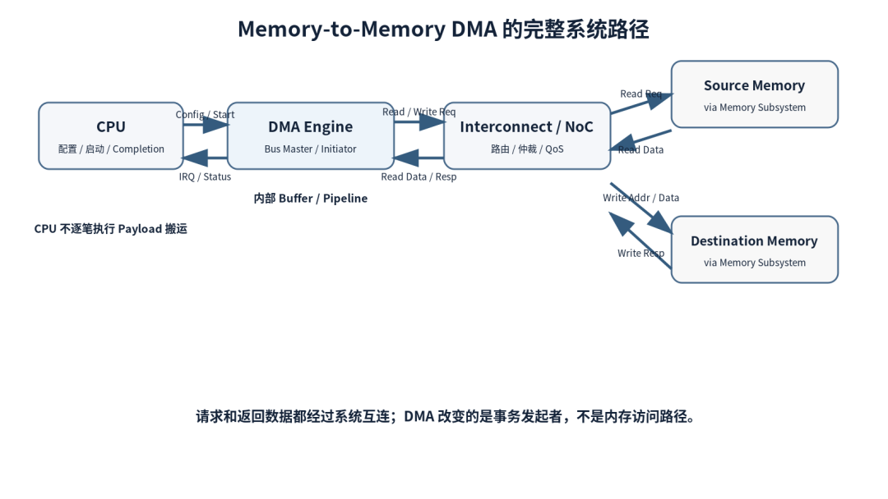

---

## 2.1 DMA 与 CPU 的分工

先看不用 DMA 的情况。

假设我们要把一块 Memory Buffer 从 A 拷到 B，最直观的方法当然是 CPU 自己做：

```
memcpy
memcpy
(dst, src, size);
```

从硬件角度看，CPU 会不断执行 Load 和 Store。数据进入 CPU 的 Cache / Load-Store Path，再通过片上互连和内存系统完成访问。

这时候，**CPU 是数据搬运工作的执行者之一。**

但如果数据量很大，或者这种搬运需要持续进行，让 CPU 一直用 Load / Store 来搬数据就会占用大量执行周期。CPU 本来还有别的事情要做，这类重复的数据搬运更适合交给专门的 DMA Engine。

换成 DMA 以后，分工就不一样了。

CPU 可能只需要准备：

```
Source Address
Destination Address
Transfer Size
Control / Attribute
```

简单 DMA 可以直接写寄存器；更复杂的 DMA 可能让 CPU 在 Memory 中准备 Descriptor，然后告诉 DMA Engine 去哪里取任务。

随后 DMA Engine 开始执行搬运。

所以，“CPU 不参与 DMA”更准确的说法应该是：

> **CPU 通常不再逐笔执行 Payload 的 Load/Store 搬运。**

但 CPU 并没有从整个流程里人间蒸发。

它仍然可能参与：

- 配置 DMA；
- 准备 Descriptor；
- 建立 DMA Address Mapping；
- 做必要的 Cache Maintenance；
- 启动 Transfer；
- 处理中断或检查完成状态。

换句话说，CPU 更像负责开单，DMA 负责扛货。

单子开完以后，就没必要每搬一个字节都回来请示 CPU 一次了。

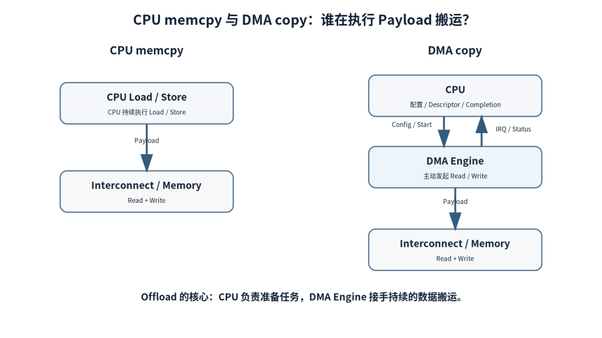

---

## 2.2 DMA Engine 的角色

从 SoC 架构看，一个 DMA Engine 通常同时面对两类完全不同的流量：

```
Control Plane
Data Plane
```

Control Plane 用来接收配置。

比如 CPU 通过 APB、AXI-Lite 或其他低带宽寄存器接口告诉 DMA：

```
SRC = 0x...
DST = 0x...
LEN = ...
START = 1
```

Data Plane 才是真正搬 Payload 的路径。

在 AXI 系统里，DMA Engine 会作为 Master/Initiator 主动发起 Memory Transaction。[1][2]

这一点很关键：DMA 并不是 Memory Controller 里面偷偷伸出来的一根“快速 memcpy 线”。

它本身就是 SoC 中一个能够主动发起事务的 Master。

因此从系统视角看，DMA 和 CPU、GPU、ISP、NPU 一样，都可能成为片上互连的流量来源。

区别只是大家发的请求、QoS、带宽需求和访问模式不一样。

---

## 2.3 DMA 配置与 Descriptor

最简单的 DMA 很容易理解。

CPU 写几组寄存器：

```
Source Address
Destination Address
Length
Start
```

DMA 读完这些配置就可以开始。

但当任务复杂起来，比如一次要搬很多不连续 Buffer，继续让 CPU 每搬一块就重新写一遍寄存器，CPU 很快又变成了调度员。

所以更复杂的 DMA 往往支持 Descriptor 或 Scatter-Gather。[3]

可以把 Descriptor 简化理解成：

```
+----------------------+
| Source Address       |
| Destination Address  |
| Length               |
| Control              |
| Next Descriptor      |
+----------------------+
```

实际格式完全取决于 DMA IP，不能拿这一张示意图去套所有芯片。

这里还有一个很工程的问题：

CPU 把 Descriptor 写进 Memory，不代表“CPU 代码已经执行到这里”就自动等于“DMA 一定已经按我们想要的顺序看见了这些内容”。

在某些系统里，软件还要遵守相应的 Memory Ordering / Barrier 要求。即使使用 coherent DMA memory，CPU 的 Store Ordering 也不一定自动满足 Descriptor 的发布顺序，必要时仍然需要相应的 Memory Barrier。[4]

所以驱动里有些看起来很不起眼的 `wmb()`、sync 或 DMA API，并不是程序员心情好顺手加的。

很多时候它是在防那种最烦的 Bug：

> Descriptor 明明写了，硬件怎么看到的还是旧东西？

---

## 2.4 DMA 从源地址读取数据流程

配置完成以后，真正的数据搬运开始了。

假设：

```
Source      = Memory A
Destination = Memory B
Length      = 1 MB
```

DMA Engine 首先要从 Source 取数据。

在 AXI 系统里，可以把这笔读取拆成两个方向：

```
Read Request:
DMA Engine → Interconnect / NoC → Memory Subsystem
Read Data:
Memory Subsystem → Interconnect / NoC → DMA Engine
```

如果 Source 在 DDR，Memory Subsystem 内部还会继续经过 DDR Controller、PHY，最终访问 DRAM。

**DMA 改变的是谁来发起这笔访问，而不是把原来的内存访问链路绕开。**

原来可能是：

```
CPU 发起 Read
```

现在变成：

```
DMA 发起 Read
```

为了提高大块 Memory Copy 的效率，DMA 通常还会利用 Transfer Width、Burst Size 等能力，把连续访问组织成更适合总线的数据传输。

更高性能的实现还可能允许多个请求在途，也就是保持一定数量的 Outstanding Transaction。

不过这一点是实现相关的。

不同 DMA：

```
Outstanding Depth
Burst Length
Channel Count
Internal Buffer Depth
Arbitration
```

可能完全不一样。

因此，单凭一个 DMA IP 支持 AXI，并不能推断它和其他 DMA 有相同的性能表现。

---

## 2.5 DMA 内部的数据搬运流水

源地址读取的数据返回 DMA Engine 后，通常会先进入内部 Buffer / FIFO。等目的端写通路具备条件后，DMA 再从 Buffer 中取出数据，向目的地址发起新的 Write 事务。

Read 和 Write 不是同一笔事务的上下半场，而是 DMA 在两侧分别发起的访问，中间由 DMA 自己的数据通路衔接。

一个容易理解错的流程是：

```
先把 1 MB 全部读进 DMA
→
然后再把 1 MB 全部写出去
```

很多高性能 DMA 没必要等整块数据全部读完再开始写，而是会让 Read 与 Write 形成流水：

```
Source Read
    ↓
Small Buffer / FIFO / Pipeline
    ↓
Destination Write
```

前面的 Read 还在继续，已经返回的数据就可以开始向 Destination 发送。

内部 Buffer 的意义之一，就是把 Read Side 和 Write Side 的节奏解耦。

例如：

- Source 暂时返回得快；
- Destination 突然被 Backpressure；
- NoC 仲裁让某一侧短暂停顿；
- Read/Write Response 需要等待。

如果完全没有缓冲，两边一点节奏差就可能把数据路径卡得很难看。

当然，具体采用 FIFO、Register Slice、Queue 还是更复杂的 Data Mover Pipeline，取决于 DMA IP 的微架构，不能仅仅因为它是一个 DMA 模块就直接下结论。

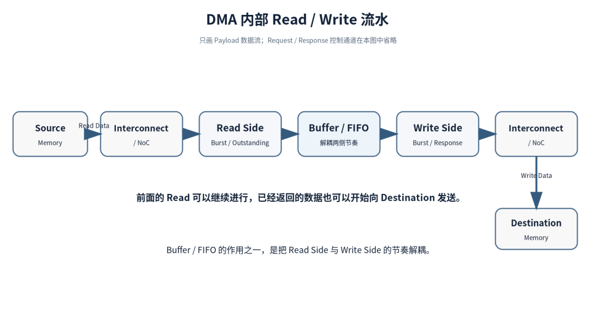

这里也顺便说明另一个事实：

> **NoC / Interconnect 不是一根透明导线。**

DMA 和其他 Master 可能同时访问 Memory。

此时还会遇到：

```
Arbitration
QoS
Backpressure
Outstanding
Address Routing
Clock Domain Crossing
```

所以系统里“DMA 带宽不够”，问题不一定在 DMA Engine 本身。

有时候 DMA 已经很努力了，只是前面的路堵得跟晚高峰一样。

---

## 2.6 DMA 向目的地址写入数据流程

当写侧具备发送条件后，DMA 会从内部 Buffer / Pipeline 中取出已经返回的数据，向 Destination 发起 Write。

在 AXI 里，大致对应：

```
Write Address
Write Data
Write Response
```

从系统路径看，这笔写入仍然要经过原来的互连和内存系统：

```
DMA Engine → Interconnect / NoC → Destination Memory
```

如果 Destination 是 DDR，后面仍然会进入对应的 Memory Controller / PHY / DRAM 路径。

这时候有一个很重要的边界：

> **最后一个 Data Beat 发出去，不一定等于整笔 DMA Transfer 已经完成。**

DMA 至少需要满足它自己定义的 Completion 条件。

例如某些设计会要求对应的 Write Transaction 已经得到完成/响应，再更新 Descriptor Status 或触发 Completion。

具体在哪个点拉 `done`，是 DMA IP 的行为定义，不应该凭经验猜。

这件事在 Debug 时特别重要。

如果软件说：

> DMA 已经 done 了。

硬件第一反应不应该只是：

> 最后一拍 WDATA 出去了吗？

而应该继续问：

> 这个 IP 对 done 的定义到底是什么？

---

## 2.7 DMA 传输完成与 CPU 通知

DMA 把这笔任务做完以后，CPU 通常还得知道。

常见方式包括：

```
Interrupt
Polling Status
Completion Callback
Descriptor Status Update
```

具体组合取决于 DMA IP 和软件框架。

于是一次最简单的流程可以写成：

```
CPU 配置任务
↓
DMA 执行 Read / Write
↓
DMA 更新状态
↓
触发 Interrupt 或完成事件
↓
CPU 继续处理结果
```

DMA 并不是搬完以后默默下班。

至少得想办法告诉 CPU 一声：

> 活干完了。

如果出错，同样需要有 Error Status、Abort、Timeout 或相应恢复机制。

再往下就是 Error、Abort、Timeout 和恢复机制了。先把正常传输的 Completion 路径收住。

---

## 2.8 DMA 与 Cache 一致性

到这里，数据路径看起来已经完整了。

但 DMA 最容易把初学者坑到怀疑人生的地方，往往才刚开始：

> **DMA 明明搬完了，为什么 CPU 读到的还是旧数据？**

答案经常在 Cache。

先看 Source。

CPU 刚刚修改了 Buffer A，但新数据还只在 CPU Cache 里，是 Dirty 的。

如果 DMA 是 Non-Coherent Master，而且它直接去 Memory 读：

```
CPU Cache      Memory
 new data      old data
    |             ^
    |             |
    X          DMA Read
```

DMA 可能读到旧版本。

再看 Destination。

DMA 已经把新数据写进 Memory B，但 CPU Cache 里恰好还留着 B 的旧 Cache Line。

CPU 再读 B：

```
DMA → Memory B = new data
CPU Cache B = old data
      |
      v
CPU reads old data
```

于是你会看到一种极其有迷惑性的现象：

```
DMA Status = DONE
Memory      = 对的
CPU Read    = 错的
```

这时候 DMA 很委屈，因为货确实已经送到了。

只是 Cache 还活在自己的世界里。

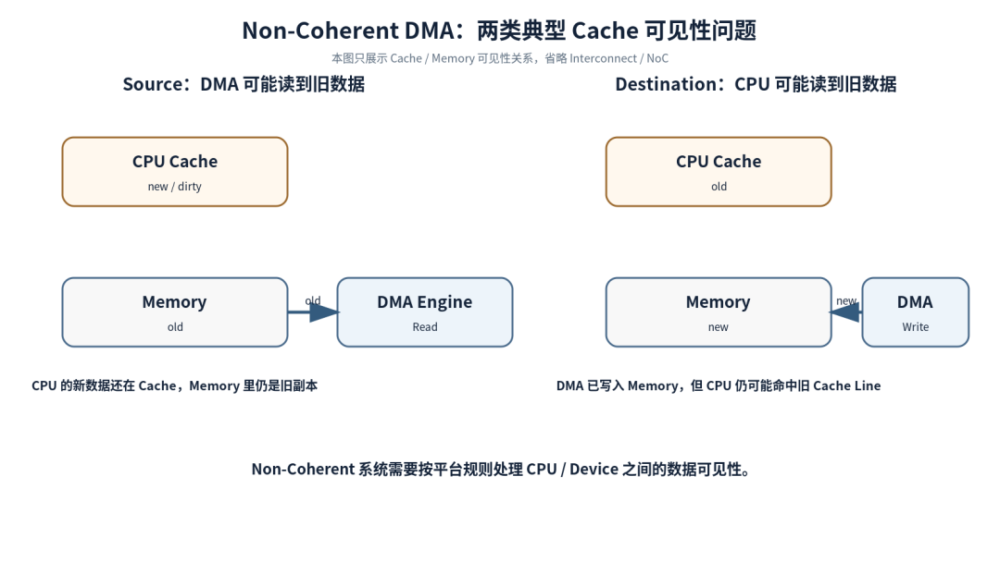

所以“DMA 和 Cache 的关系”必须看系统是否支持 Hardware Coherency。

在 coherent system 中，DMA 访问可能进入一致性域，由硬件维护可见性。

在 non-coherent system 中，软件通常需要按照平台规则做 Cache Clean / Invalidate 或通过操作系统 DMA API 完成 ownership/synchronization。

Linux 的 DMA Mapping 文档明确要求：当 CPU 和 Device 重复访问 streaming DMA buffer 时，需要正确执行面向 CPU / Device 的同步操作，否则双方可能看到不正确的副本。[4]

这也是为什么：

> **“CPU 不搬 Payload”不等于“CPU 什么都不用管”。**

---

## 2.9 DMA 地址与 IOMMU

CPU 里拿到一个 Buffer Pointer，也不意味着这个地址可以直接写进 DMA。

在一个带虚拟内存和 IOMMU 的系统里，至少可能同时存在三套地址：

```
CPU Virtual Address
CPU Physical Address
DMA / Bus Address
```

这几套地址之间的关系可以简化成：

```
CPU Virtual X
      |
      | CPU page table
      v
CPU Physical Y
DMA Address Z
      |
      | IOMMU
      v
CPU Physical Y
```

也就是说，CPU 看见的 `void *`，通常不是 DMA Engine 应该直接拿去发总线请求的地址。[4]

在简单系统里：

```
DMA Address == Physical Address
```

完全可能。

但在另一些系统里：

```
DMA Address != Physical Address
```

IOMMU/SMMU 会负责 Translation。

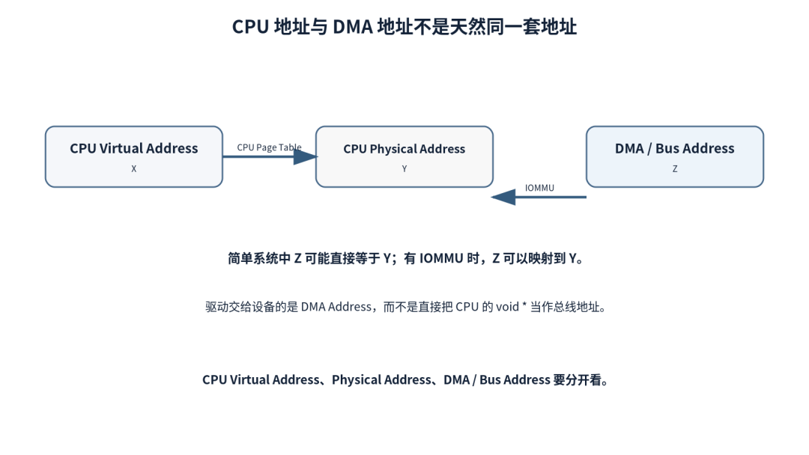

这也是 DMA Mapping API 要解决的核心问题之一。

从驱动视角看，你真正交给设备的是一个 **DMA Address**。

设备拿这个地址发请求，IOMMU 再决定它最终落到哪一块 Physical Memory。

这样做不仅是地址转换，也能形成设备访问隔离和保护边界。

所以 Debug DMA Address 问题时，别只盯 CPU 的 Virtual Pointer。

那很可能根本不是硬件正在使用的地址空间。

---

## 2.10 DMA 性能与系统瓶颈

讲到 DMA，很容易顺手得出一个结论：

> DMA 比 CPU memcpy 快。

但是，这个结论不完全对。

DMA 最直接的价值之一是 **Offload**。

它让 CPU 不需要持续执行 Payload 的 Load/Store，因此 CPU 可以并行做其他工作，系统也可能获得更好的能效。

至于一笔 Copy 的 Wall-clock Time 是否一定更短，要看具体平台。

DMA 自己也有启动成本：

```
Prepare Descriptor
DMA Mapping
Cache Sync
Program DMA
Wait / Interrupt
Completion Handling
```

所以对于非常小的数据块，固定开销占比可能很高。

这也是为什么工程上更应该问：

> **这个平台从多大的 Transfer 开始值得用 DMA？**

而不是简单认为：

> DMA 一定比 CPU 快。

再看大数据搬运。

假设 Source 和 Destination 都在同一套外部 DRAM，搬 1 GB 数据，从 Memory Traffic 的账本看，至少要发生：

```
Read  1 GB
+
Write 1 GB
```

也就是约 2 GB 的 Payload Memory Traffic，还没算协议、刷新、地址冲突等额外开销。

DMA 不会凭空制造 DRAM 带宽。

如果 DDR 已经被 GPU、NPU、ISP 打得很满，再启动一个 DMA，不一定是“加速”，也可能只是多来一个人抢路。

因此 DMA 性能通常要沿整条路径分析：

```
DMA Issue Capability
↓
Burst / Outstanding
↓
Interconnect Arbitration / QoS
↓
IOMMU / Translation
↓
Memory Controller Scheduling
↓
DDR Bandwidth / Efficiency
↓
Destination Backpressure
```

这和我们分析 CPU→DDR、PCIe→Memory 的思路其实是同一个东西：

> **不要只盯某一个 IP 的 Peak Number，要看完整系统路径。**

---

## 2.11 Memory-to-Memory DMA 完整数据路径

现在把整条链收回来。

CPU 发起一次 Memory-to-Memory DMA，大致可以拆成：

```
1. CPU 准备 Source / Destination Buffer
2. 必要时建立 DMA Mapping
   CPU Address → DMA Address
3. 必要时处理 Cache / Ownership
4. CPU 写 DMA Register
   或准备 Descriptor
5. CPU 启动 DMA
6. DMA Engine 作为 Bus Master
   发起 Source Read
7. Read Data 经 Interconnect 返回 DMA
8. DMA 通过内部 Buffer / Pipeline
   组织 Destination Write
9. Write 经 Interconnect 到达 Destination
10. DMA 满足自身 Completion 条件
11. DMA 更新状态 / 触发 Interrupt
12. CPU 在需要时做同步并消费结果
```

如果只记一张图，我建议记这一张：


DMA 并不是一个神奇的“高速 memcpy 开关”。

更准确的理解是：

> **DMA Engine 接过了 Payload 搬运的主动权，成为真正发起 Memory Transaction 的那个 Master。**

CPU 从搬运工变成任务发起者，但 SoC 的 Interconnect、Cache、IOMMU、Memory Controller 和 DDR 并没有消失。

以后再遇到 DMA 问题，可以先把下面五个问题弄清楚：

```
谁在发 Request？
使用什么 Address？
数据经过哪些模块？
什么时候定义 Complete？
CPU 和 DMA 之间如何保证数据可见？
```

把这五个问题画清楚，大部分 DMA 问题就已经有了正确的 Debug 起点。

---

## 2.12 参考资料

[1] Arm, *CoreLink DMA-330*
https://www.arm.com/products/silicon-ip-system/embedded-system-design/dma-330[1]

[2] Arm, *CoreLink / PrimeCell DMA Controller Technical Reference Manual (PL330 / DMA-330)*
https://developer.arm.com/documentation/ddi0424/[2]

[3] Linux Kernel Documentation, *DMAengine controller documentation*
https://docs.kernel.org/driver-api/dmaengine/provider.html[3]

[4] Linux Kernel Documentation, *Dynamic DMA mapping Guide*
https://docs.kernel.org/core-api/dma-api-howto.html[4]

---

**转载说明：欢迎全文转载，无需授权；请保留作者「烓围玮未」及来源「微信公众号：芯片设计进阶之路（x\_chip）」，不得冒充原创或歪曲原意。**

### 2.12.1 引用链接

[1]*https://www.arm.com/products/silicon-ip-system/embedded-system-design/dma-330*

[2]*https://developer.arm.com/documentation/ddi0424/*

[3]*https://docs.kernel.org/driver-api/dmaengine/provider.html*

[4]*https://docs.kernel.org/core-api/dma-api-howto.html*

---

# 3. 多核异构问题你还不懂？A7与M0到底谁在管硬件？

> 来源：https://mp.weixin.qq.com/s/EazcAeI8hR3Am0EU4OPHTQ
> 作者：景老师
> update 2026/08/22 11 : 45

## 3.1 RK3506多核异构真相：A7与M0到底谁在管硬件？

深度拆解AMP架构的资源归属、核间通信与实时性边界

做工业控制的朋友大概率遇到过这种场景：主控跑Linux，界面刷得挺流畅，结果某个关键时刻PWM输出抖了一下，电机直接过冲。查了半天日志，发现是内核调度把实时任务挤掉了。这时候你可能想过，能不能把实时性要求高的部分单独拎出来，交给一颗专门的小核去跑？

瑞芯微的RK3506就是冲着这个痛点来的。三核Cortex-A7加一颗Cortex-M0，表面看是"大核带小核"，实际上背后的AMP（Asymmetric Multi-Processing，非对称多处理）架构远比"谁主谁从"复杂得多。这篇文章把RK3506的资源归属、核间通信、实时性边界一次性讲透。

景芯入驻小红书了：


## 3.2 AMP不是"主从关系"，而是"资源隔离"

很多人第一次接触RK3506的AMP方案，容易陷入一个误区：A7是主核，M0是从核，所有事情都得A7说了算。这种理解放在SMP（对称多处理）架构里没问题，但在AMP里完全是两码事。

AMP的核心思想是**分而治之**。RK3506内部的三颗A7和一颗M0，在物理层面共享同一片硅片，但在软件层面可以运行完全不同的操作系统——A7跑Linux处理网络、存储、显示，M0跑RT-Thread或者干脆裸机跑控制算法。它们之间不是"上级管下级"的关系，而是**各自拥有独立地址空间、独立外设、独立中断系统的平行世界**。

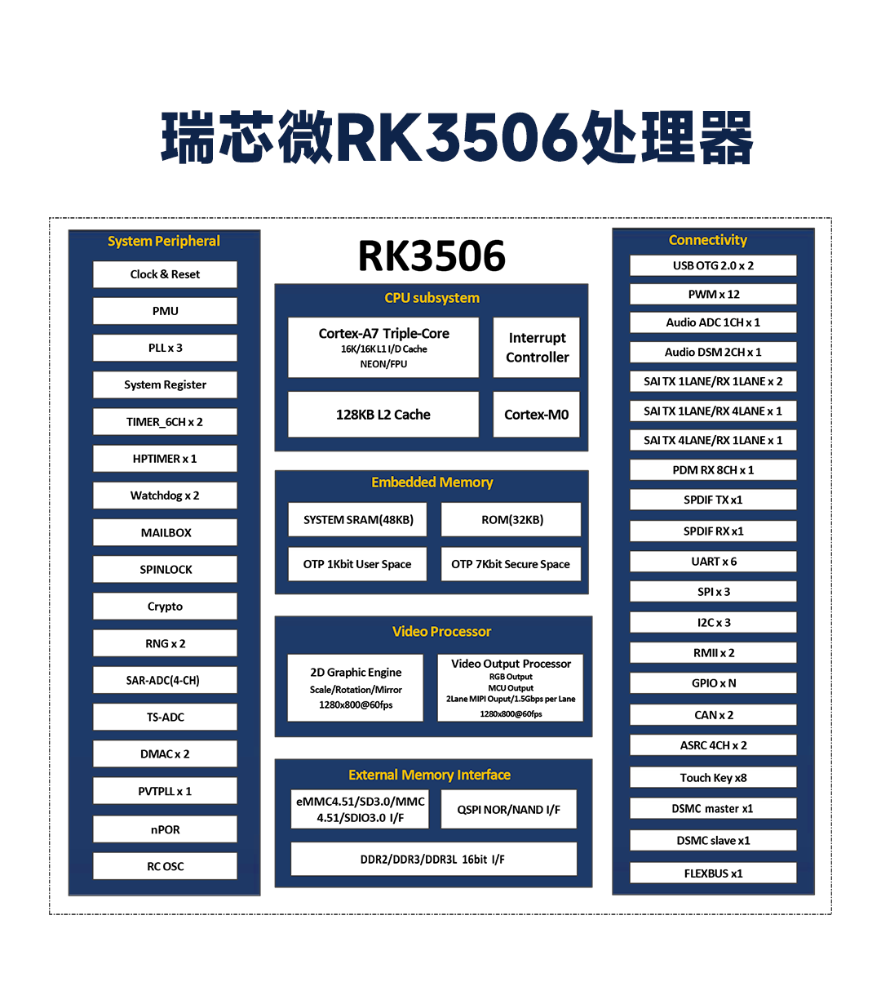

▲ RK3506内部架构：三核A7共享128KB L2 Cache，M0独立运行

真正需要回答的问题不是"谁是主人"，而是**"这片外设此刻归谁管"**。GPIO引脚、UART、CAN、PWM这些硬件资源，同一时刻只能被一个核独占。RK3506的芯片手册里并没有某个"总管家"角色，而是通过设备树（Device Tree）在启动阶段就把资源划清楚：这张表上的UART归Linux，那张表上的PWM归M0。划完之后，双方各管各的，互不干扰。

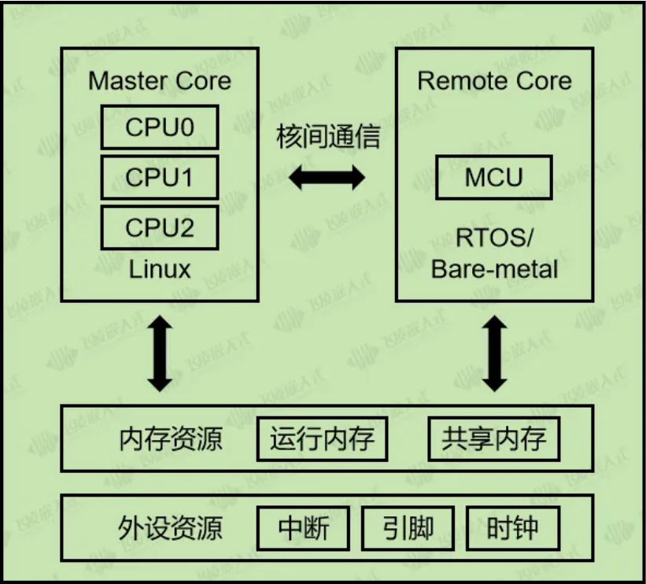

▲ AMP架构下，内存与外设资源需在启动时明确划分归属

## 3.3 RK3506为什么要搞"3+1"而不是四核A7？

瑞芯微在RK3506上选择了三核Cortex-A7（1.5GHz）加单核Cortex-M0（200MHz）的组合，而不是直接堆四颗A7。这个决策背后有很深的工程考量。

Cortex-A7是应用处理器架构，带MMU（内存管理单元），跑Linux这种复杂操作系统是它的强项，但代价是中断响应存在内核态切换开销，再快也得几十微秒。Cortex-M0是微控制器架构，没有MMU，但中断响应可以做到**12个时钟周期以内**，按200MHz主频算下来就是60纳秒级别。这种数量级的差距，在伺服电机电流环控制、EtherCAT从站同步这类场景里是致命的。

更关键的是功耗。RK3506采用22nm工艺，满载功耗控制在3.8W左右，待机可以低到0.5W。如果四颗A7全速跑，功耗和散热根本压不住。M0核的存在让系统可以在A7休眠时，仅靠M0维持外设轮询和看门狗，这对电池供电的工业手持设备特别重要。

**实际工程经验：**M0核没有硬件浮点单元（FPU），如果你的控制算法涉及大量浮点运算，最好把计算密集型任务放在A7上跑RTOS，M0只负责GPIO翻转和简单状态机。

## 3.4 外设归属的底层逻辑：不是你想用就能用

RK3506的AMP方案里，外设归属是一个启动时就定死的规则，而不是运行时动态协商的结果。为什么？因为芯片内部的**外设仲裁逻辑**并不支持多核并发访问同一组寄存器。

以GPIO为例。RK3506的GPIO控制器挂在AHB总线上，每个GPIO Bank有独立的时钟使能、复用配置和数据寄存器。如果A7和M0同时往同一个GPIO写数据，总线仲裁器可能会让其中一个核拿到旧值，另一个核的写入被覆盖，结果就是电平抖动。这种bug在产线上可能几个月才出现一次，排查起来极其痛苦。

正确的做法是在设备树里用`status = "disabled"`把某个UART从Linux的设备树节点里关掉，同时在M0的启动代码里初始化对应的时钟和引脚复用。RK3506 SDK里的AMP配置文件本质上就是一张**"资源归属清单"**，告诉每颗核：你能动哪些寄存器，其他的别碰。

// Linux设备树片段：把UART3划归M0核管理 &uart3 {status = "disabled"; /\* 对应pinctrl也从Linux侧释放 \*/ /delete-property/ pinctrl-0; }; // M0侧Bare-metal代码：重新初始化UART3 void uart3\_init(void) {/\* 使能UART3时钟 \*/ CRU->CLK\_CON[0x123] |= (1 << 15); /\* 配置GPIO复用为UART3\_TX/RX \*/ GPIO1->SWPORT\_DR |= (0x3 << 10); }

这里有个容易踩的坑：即使你在Linux设备树里把外设关了，如果M0核没有正确配置对应的时钟门控，这个外设实际上仍处于复位状态，A7侧虽然不用它，但其他核也动不了。所以AMP方案里**时钟和电源域的划分**比外设本身更重要。

## 3.5 核间通信：RPMsg不是简单的"传数据"

A7和M0各自跑各自的系统，但总有需要交换信息的时候。比如A7的HMI界面收到用户点击"急停"按钮，需要通知M0立刻切断PWM输出。这种跨核通信靠的不是全局变量，而是RK3506内置的一套**Mailbox + 共享内存 + RPMsg**机制。

先说说Mailbox。RK3506内部有多个硬件Mailbox模块，每个Mailbox可以看作一个32位寄存器加上中断线。A7往Mailbox写一个字，M0那边立刻触发中断，响应速度在微秒级。Mailbox适合传"命令字"，比如0x01表示急停，0x02表示启动。但如果你想传一段传感器数据或者一帧日志，Mailbox的带宽就不够用了。

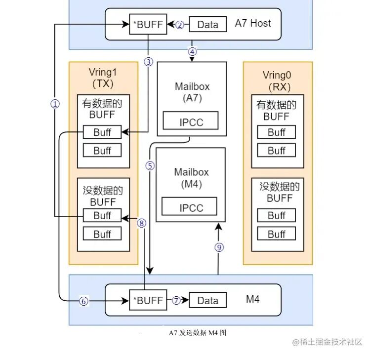

▲ 基于VirtIO Ring的共享内存通信：A7通过Vring向M0发送数据

这时候就要上RPMsg（Remote Processor Messaging）。RPMsg的底层依赖VirtIO框架，在共享内存里维护两个环形缓冲区（Vring）：一个用于A7发M7收，一个反过来。数据本身不经过Mailbox，Mailbox只负责发一个"有新数据"的中断信号。这种设计把**控制面**（中断）和**数据面**（共享内存）解耦，效率很高。

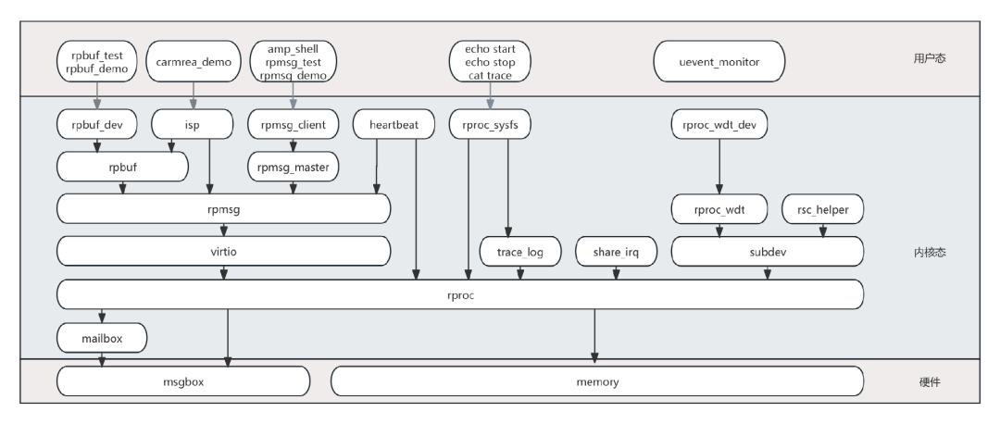

▲ RPMsg软件栈：从用户态rpmsg\_client到内核态virtio，最终落到硬件Mailbox

Linux侧使用RPMsg很方便，内核已经集成了rpmsg驱动，用户态通过/dev/rpmsgX设备节点读写即可。但M0侧如果是裸机或者RT-Thread，就需要自己实现VirtIO的Vring管理。瑞芯微SDK里提供了OpenAMP库，把这部分封装好了，不过实际用起来要注意**Cache一致性**问题——A7写的数据还在Cache里没刷到DDR，M0去读共享内存拿到的就是旧值。解决办法是在共享内存区域配置为Non-Cacheable，或者每次通信后手动做Cache Clean/Invalidate。

/\* Linux侧：发送急停命令到M0 \*/ int fd = open("/dev/rpmsg0", O\_RDWR); char cmd[] = {"EMERGENCY\_STOP"}; write(fd, cmd, sizeof(cmd)); // 数据写入共享内存Vring /\* 内核自动触发Mailbox中断通知M0 \*/

## 3.6 实时性的边界：Linux、RTOS、裸机差多少？

选RK3506做工业控制，最关心的问题往往是：到底能不能做到微秒级响应？答案是——**看你怎么用**。

如果三颗A7全跑标准Linux，即使打上Preempt-RT实时补丁，cyclictest测出来的中断延迟大概在60~100微秒量级。这个水平对于HMI刷新、网络通信绰绰有余，但面对1ms周期的EtherCAT主站控制，抖动占到10%，伺服驱动器可能会报警。

把其中一颗A7隔离出来跑RT-Thread，延迟可以压到5微秒以内。因为RTOS没有Linux那么复杂的调度器、页表切换和内核锁，任务切换就是几个寄存器压栈出栈的事。RK3506的SDK实测数据显示，隔离核跑RT-Thread时，中断响应稳定在微秒级，满足PLC和远程I/O的需求。

如果再把实时性要求推到极限，比如多轴运动控制或者安全继电器逻辑，可以让M0跑裸机（Bare-metal）。没有操作系统就没有调度开销，中断来了直接进Handler，延迟取决于ARM Cortex-M0本身的中断流水线，理论值在百纳秒级。当然，裸机的代价是你要自己管理所有外设和中断，代码量陡增。

**三种方案的实时性对比：**
Linux+RT补丁 延迟 ~60-100μs，适合HMI、网关、协议转换
A7隔离+RTOS 延迟 ~5μs，适合PLC、数据采集、EtherCAT主站
M0裸机 延迟 ~100ns级，适合急停、安全链、高频PWM

## 3.7 实际部署的三种典型架构

根据我们景芯训练营在多个工业项目中的经验，RK3506的AMP方案通常有三种落地形态，分别对应不同的成本控制和实时性要求。

**第一种是AP+MCU模式**：两颗A7跑Linux负责显示和网络，一颗A7跑RTOS做协议栈，M0跑裸机做电机控制。这种模式资源划分最清晰，但M0的200MHz主频和缺少FPU是瓶颈，复杂控制算法还是得放回A7。

**第二种是AP+AP模式**：两颗A7跑Linux，第三颗A7隔离出来跑RT-Thread或者Xenomai，M0做看门狗和GPIO扩展。这种模式在FTU（馈线终端单元）和工业网关上用得很多，因为A7跑RTOS可以处理复杂的浮点运算，同时保持微秒级响应。

**第三种是RT-Linux全栈模式**：三颗A7都跑打了Preempt-RT补丁的Linux，通过CPU核隔离把实时任务绑定到特定核心。好处是开发方便，一套代码搞定；坏处是Linux内核本身的复杂性决定了延迟天花板比纯RTOS高一个数量级。

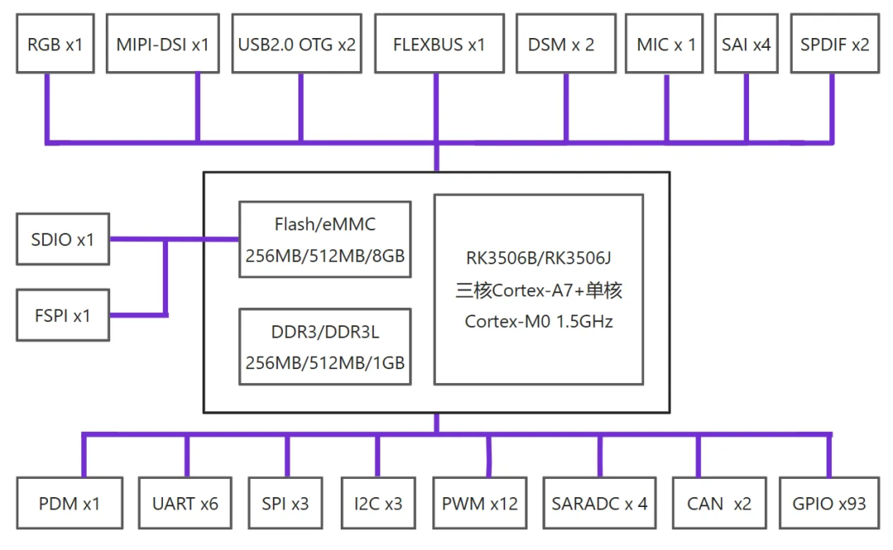

▲ RK3506核心板典型系统连接：双网口、多路UART、CAN-FD、DSMC总线

## 3.8 工程实践里的几个深坑

理论很美好，上板子调试的时候该踩的坑一个不少。

**第一个坑是启动顺序**。RK3506上电后，A7先从BootROM加载固件，M0处于复位状态。Linux启动完成后，需要通过remoteproc框架加载M0的固件并释放复位信号。如果M0的固件加载晚了，A7那边RPMsg初始化会超时，表现为/dev/rpmsg0设备节点迟迟不出现。调试时建议在M0固件入口处先闪个LED，确认它确实跑起来了。

**第二个坑是共享内存对齐**。RPMsg的Vring要求共享内存地址按4KB页对齐，如果设备树里配置的共享内存区域没对齐，Linux侧virtio驱动初始化会直接失败，内核日志里报"failed to find vring"之类的错误，排查起来很隐蔽。

**第三个坑是时钟域交叉**。RK3506内部A7和M0的时钟树是独立的，A7侧关掉某个外设时钟以为省电，结果M0正在用这个外设，直接挂死。AMP方案里建议把外设时钟的使能放在M0侧管理，A7只负责大局。

**第四个坑是调试器的干扰**。用JTAG调试M0时，如果A7正在访问同一个APB总线上的外设，调试器可能会触发总线挂起，表现为A7内核假死。多核异构调试最好准备两套调试器，或者先用串口日志定位问题。

## 3.9 写在最后

RK3506的AMP架构本质上是一颗芯片里塞进了两个世界：A7的Linux世界负责"聪明"，M0的实时世界负责"快"。它们之间没有绝对的"主人"和"仆人"，只有明确的"边界"和"契约"。

做硬件设计的时候，与其纠结A7和M0谁说了算，不如在启动阶段就把资源归属表写死，把通信协议定好，把时钟域划清。AMP最大的好处是隔离，最大的风险也是隔离——隔离意味着你不能像单核系统那样随意共享变量，但同时也意味着A7崩溃时M0还能把电机停下来。

对于工业控制、智能网关、HMI一体机这些场景，RK3506这种"3+1"异构方案在成本和实时性之间找到了一个不错的平衡点。毕竟，能用一颗几十块钱的芯片搞定的事，何必上FPGA呢？

景芯入驻小红书了：

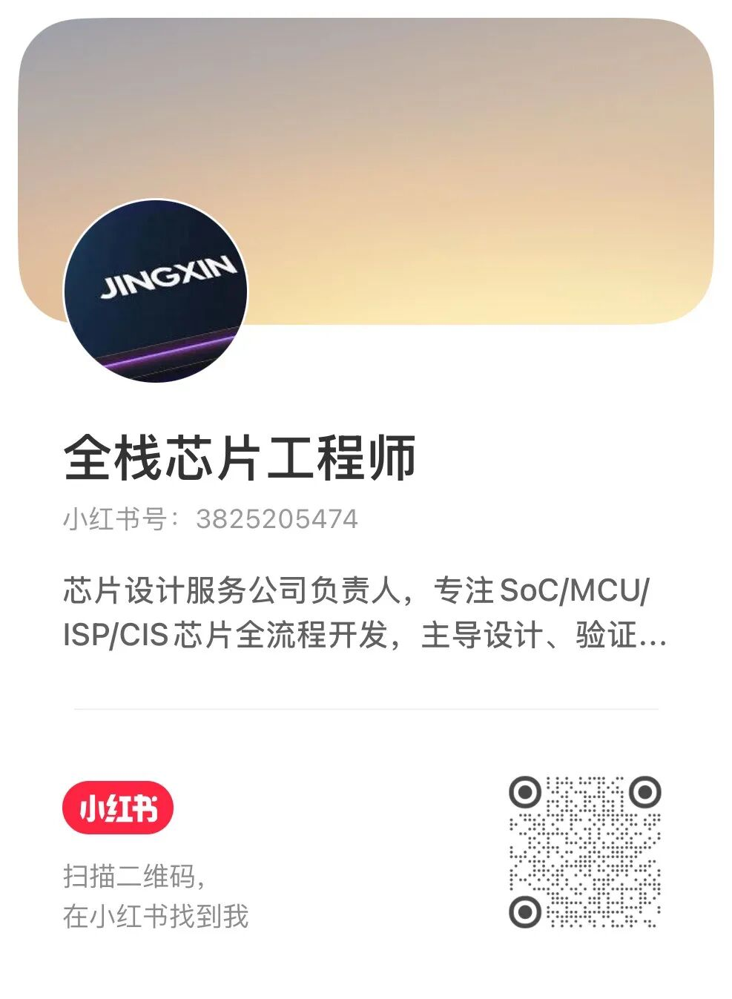

---

关注「景芯SoC训练营」，更多芯片架构与嵌入式实战干货
