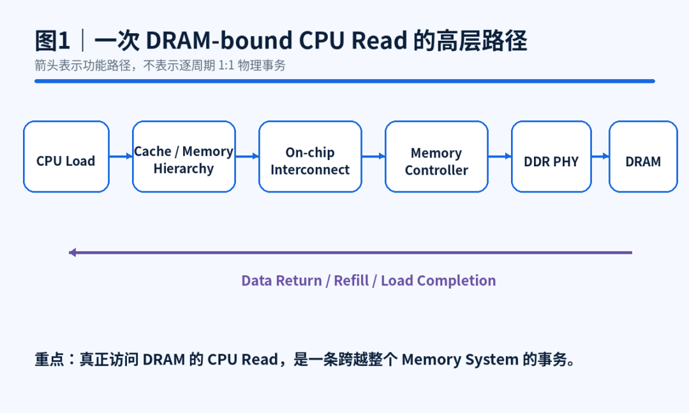
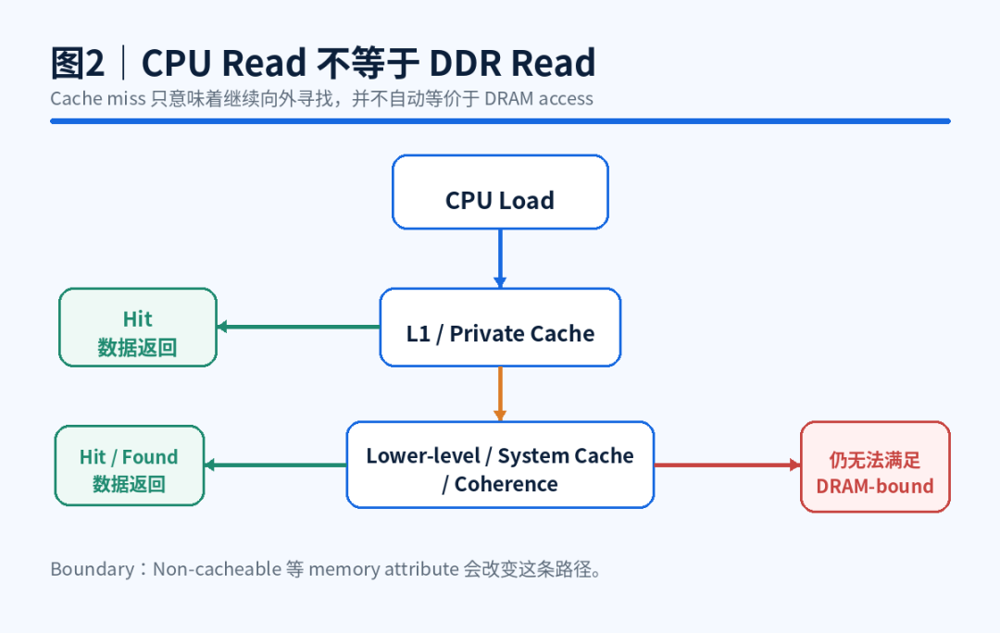
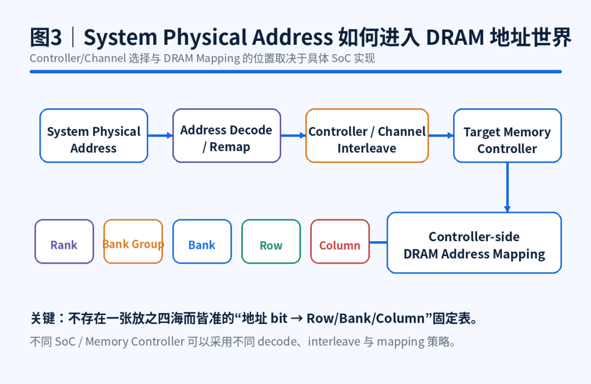
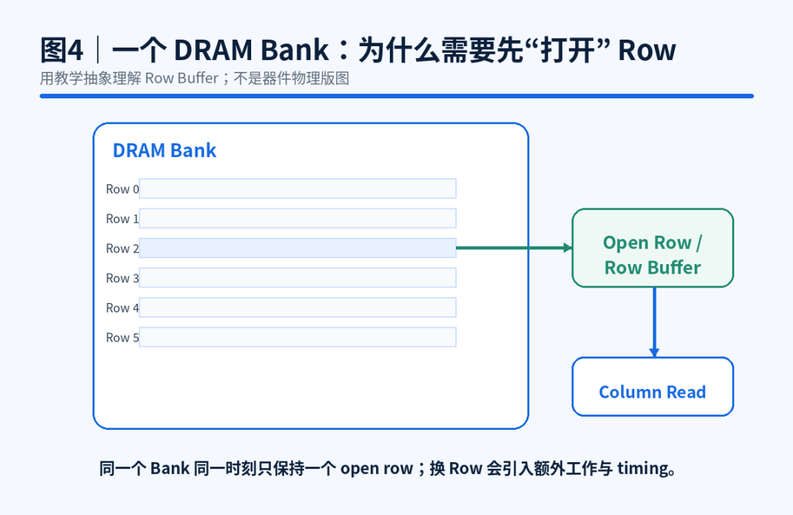
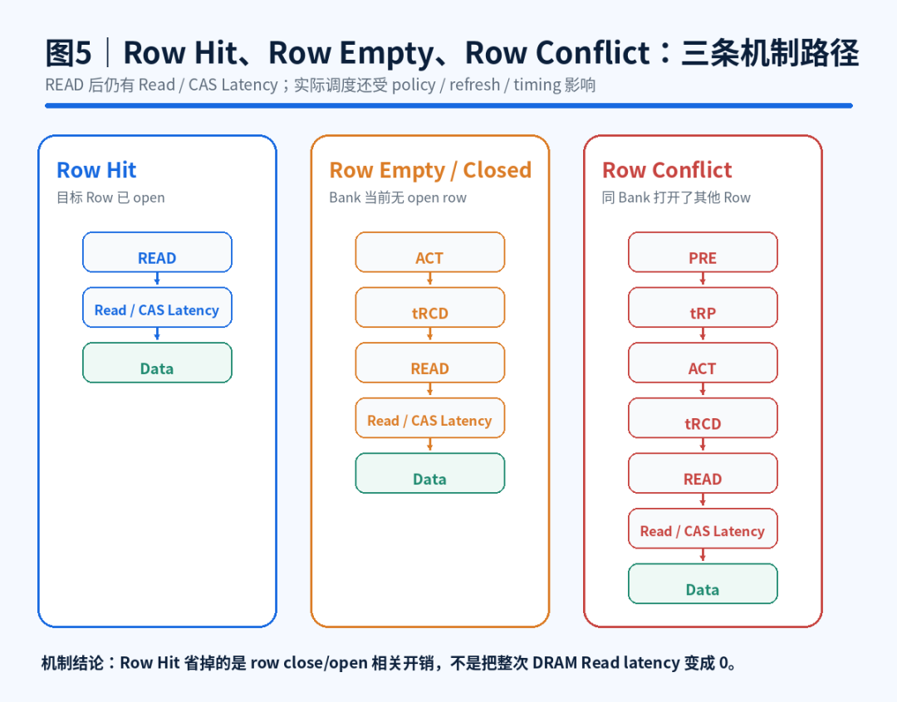
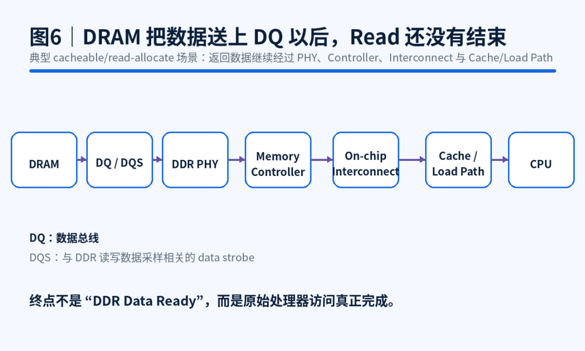
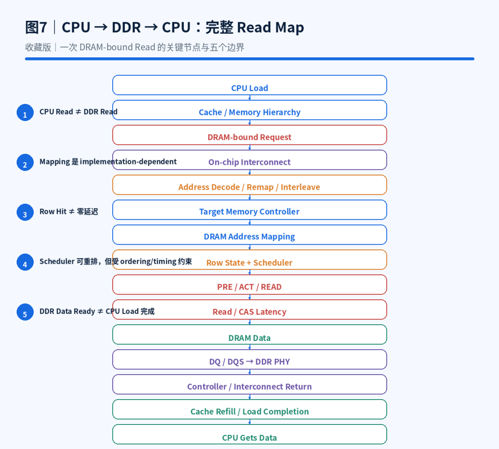

<!-- toc-start -->

# 目录

[1. CPU 读一个地址，数据到底是怎么从 DDR 回来的？](#1-cpu-读一个地址数据到底是怎么从-ddr-回来的)  
　　[1.1 ——一次 Read，如何穿过整个 SoC？](#11-一次-read如何穿过整个-soc)  
　　[1.2 先把一个最容易说错的点钉死：Cache Miss 不等于访问 DDR](#12-先把一个最容易说错的点钉死cache-miss-不等于访问-ddr)  
　　[1.3 很多图会画成 CPU → AXI → DDR Controller，但别把示意图当成普遍结构](#13-很多图会画成-cpu-axi-ddr-controller但别把示意图当成普遍结构)  
　　[1.4 到了内存侧，地址开始换一种语言](#14-到了内存侧地址开始换一种语言)  
　　[1.5 理解 DRAM，最容易犯的错是把它想成一块很大的 SRAM](#15-理解-dram最容易犯的错是把它想成一块很大的-sram)  
　　[1.6 目标 Row 已经打开：Row Hit](#16-目标-row-已经打开row-hit)  
　　[1.7 Bank 当前没有打开目标 Row：先 ACT](#17-bank-当前没有打开目标-row先-act)  
　　[1.8 同一个 Bank 打开的是另一个 Row：Row Conflict](#18-同一个-bank-打开的是另一个-rowrow-conflict)  
　　[1.9 既然 Row Hit 少了一段开销，Scheduler 会不会专门“捡 Hit”？](#19-既然-row-hit-少了一段开销scheduler-会不会专门捡-hit)  
　　[1.10 很多图到 DRAM 把数据吐出来就画句号，我不建议这么画](#110-很多图到-dram-把数据吐出来就画句号我不建议这么画)  
　　[1.11 把路径压成一张图](#111-把路径压成一张图)  
　　[1.12 这张路径图最实际的用途，是改掉一种性能排查习惯](#112-这张路径图最实际的用途是改掉一种性能排查习惯)  
　　[1.13 最后收成 5 句话](#113-最后收成-5-句话)  
　　[1.14 下一篇就盯 Row Hit / Row Empty / Row Conflict](#114-下一篇就盯-row-hit-row-empty-row-conflict)  
　　[1.15 技术依据 / 参考资料](#115-技术依据-参考资料)  
　　　　[1.15.1 引用链接](#1151-引用链接)  
[2. DDR为什么不是接上就能用？](#2-ddr为什么不是接上就能用)  
　　[2.1 DDR不是一颗孤立的存储芯片](#21-ddr不是一颗孤立的存储芯片)  
　　[2.2 上电后，还需要初始化](#22-上电后还需要初始化)  
　　[2.3 DDR训练，核心是找到可靠采样窗口](#23-ddr训练核心是找到可靠采样窗口)  
　　[2.4 为什么换板、换颗粒可能出问题](#24-为什么换板换颗粒可能出问题)  
　　[2.5 验证不能只看能不能读写](#25-验证不能只看能不能读写)  

<!-- toc-end -->

---

# 1. CPU 读一个地址，数据到底是怎么从 DDR 回来的？

> 来源：https://mp.weixin.qq.com/s/7fglKiJ6TOE6I_vB95M-Bg
> 作者：烓围玮未
> update 2026/08/16 03 : 02
> **已截图**

## 1.1 ——一次 Read，如何穿过整个 SoC？

CPU 读一个地址。

写在 C 里可能只是一行代码。命中 L1 时，这件事很快就结束了；但如果它一路 miss，最后真的要去 DRAM 拿数据，这条 Load 会把 SoC 里一串模块都拉进来：

```
Cache
→ On-chip Interconnect
→ Address Decode / Memory Controller
→ DDR PHY / DRAM
→ 再沿返回路径回到 CPU
```

这一篇先把范围收窄。TLB、Coherence 细节、DDR Training、完整 Timing 参数都先不展开，只沿着一条最终访问 DRAM 的 Read Path 走一遍。

先看全局图。



---

## 1.2 先把一个最容易说错的点钉死：Cache Miss 不等于访问 DDR

CPU 发出 Load，第一站通常还是 Cache。

如果数据就在 L1，DDR 根本不会参与。L1 miss 之后也一样，下一步可能是 L2、LLC、System Cache，或者一致性系统里的其他数据源。[1]

所以这条路径更接近：

```
CPU Load
    ↓
L1 Cache
 ├── Hit  → 数据返回
 └── Miss
        ↓
Lower-level / System Cache / Coherence
 ├── Hit / Found → 数据返回
 └── 仍无法满足
        ↓
DRAM-bound Request
```

这里最值得记的其实很简单：

> **Miss 只说明这一层没找到，不说明下一站就是 DDR。**

memory attributes 也会改变路径。比如 non-cacheable 场景就不一定按上面的 cacheable 路径走。为了不把文章拉到 MMU 和 Memory Attribute 里，后面统一讨论一个典型场景：cacheable Load 最终需要访问外部 DRAM。



---

## 1.3 很多图会画成 CPU → AXI → DDR Controller，但别把示意图当成普遍结构

从处理器侧走向内存侧，中间一定要经过片上互连，但这段互连叫什么、怎么组织，取决于 SoC。

有的系统能看到 AXI fabric，有的会用 CHI / NoC，也有 Controller 直接接在 NoC-native interface 后面。

所以本文统一把它抽象成：

```
CPU / Cache System
        ↓
On-chip Interconnect
        ↓
Memory System
```

这张图只想表达一件事：这不是一根“地址线”。

Request 可能在这里经历 routing、arbitration、buffering 和 backpressure。多个 Master 同时访问内存时，它们共享的不只是 DDR，前面的路径也在共享。

这篇先不拆 NoC 和 Arbitration。只要先把这个直觉留下来：**请求到达 DDR Controller 之前，系统里已经可能发生排队。**

---

## 1.4 到了内存侧，地址开始换一种语言

CPU 和软件看到的是 System Physical Address。

DRAM 端最终需要的却是另一组东西：哪个 Rank、哪个 Bank、哪个 Row、哪个 Column。

中间怎么转换，别背成一张固定 bit 表。

在真实 SoC 里，路径可能是：

```
System Physical Address
          ↓
Address Decode / Remap
          ↓
Controller / Channel Interleave
          ↓
Target Memory Controller
          ↓
Controller-side DRAM Address Mapping
          ↓
Rank / Bank Group / Bank / Row / Column ...
```

这里有个很容易被框图误导的点：**Controller/Channel 的选择不一定全部发生在某一个 Memory Controller 内。**

例如，多 Memory Controller 系统可以在 NoC 一侧先做 interleave，把不同地址片段送到不同的物理 DDR Controller。[2] 请求到了目标 Controller 后，再继续做它负责的 DRAM Address Mapping。

所以更稳的说法不是“Memory Controller 把地址变成 Channel/Bank/Row”，而是：

> **Memory System 最终要把系统地址落到具体的 DRAM 位置；这件事在哪一级完成多少，取决于 SoC 实现。**

而且 Mapping 本身也常常是可配置的。AMD 的文档就明确给出不同 mapping，并指出不存在适合所有 workload 的 one-size-fits-all 方案。[3]

这不是一个只存在于文档里的细节。两个在线性地址上看起来很近的请求，经过 interleave 和 mapping 之后，可能落到不同 Controller / Bank，也可能反复撞在同一个 Bank 的不同 Row。

后面 Row Hit / Row Conflict 的差别，就是从这里开始埋下的。



---

## 1.5 理解 DRAM，最容易犯的错是把它想成一块很大的 SRAM

先只看一个 Bank。

```
            DRAM Bank
        ┌─────────────┐
Row 0   │             │
Row 1   │   Cell      │
Row 2   │   Array     │
 ...    │             │
        └──────┬──────┘
               ↓
          Open Row
               ↓
          Column Read
```

访问某个 Row 之前，要先把它打开；同一个 Bank 同一时刻只有一个 Row 处于 open 状态。

这就带来三种完全不同的情况。



## 1.6 目标 Row 已经打开：Row Hit

```
Target Row already open
        ↓
      READ
        ↓
等待 Read / CAS Latency
        ↓
      Data
```

Row Hit 省掉的是 Row 切换。

它并不意味着 READ 发出去以后数据立刻出现。CAS / Read Latency 还在，其他 DDR timing 也还在。[4]

这一点图里最好直接画出来。否则一个“READ → Data”的简图，很容易把“少了一段开销”误读成“这段访问没有延迟”。

---

## 1.7 Bank 当前没有打开目标 Row：先 ACT

```
ACT
 ↓
等待 tRCD
 ↓
READ
 ↓
等待 Read / CAS Latency
 ↓
Data
```

这里 `tRCD` 先按最朴素的方式理解：ACTIVATE 一个 Row 之后，到能够对它发 READ / WRITE 之间，要满足相应的最小时序要求。

完整 DDR Timing 很大，这篇没必要全塞进来。先抓住一点：**DRAM 命令之间不是“发完下一拍就随便继续”。**

---

## 1.8 同一个 Bank 打开的是另一个 Row：Row Conflict

假设现在打开的是 Row A，要读的却在 Row B。

基本机制会多出 Row 切换：

```
当前 open：Row A
        ↓
      PRE
        ↓
    等待 tRP
        ↓
      ACT Row B
        ↓
    等待 tRCD
        ↓
      READ
        ↓
等待 Read / CAS Latency
        ↓
      Data
```

对比就很直接了：

```
Row Hit
READ
```

```
Row Conflict
PRE → ACT → READ
```

差别不在“Hit”这个名字听起来更快，而在于 Conflict 暴露了额外的 close/open Row 操作和对应 timing。

这张图也只能理解到这里，不能拿它当逐周期 RTL 模板。真实 Controller 还要处理 scheduler、page policy、refresh、其他 pending request、column timing 等；Auto-Precharge 也可能改变后续是否还需要显式 PRE。[5]



---

## 1.9 既然 Row Hit 少了一段开销，Scheduler 会不会专门“捡 Hit”？

Controller 前面通常不只有一笔 Request。

它可能同时看着多笔 pending request，并在 ordering / timing 允许的范围内调度或重排。[6][7]

把这件事抽象一下：

```
多个 Pending Request
        ↓
Controller Scheduler
        ↓
选择下一笔可以推进的请求 / 命令
```

这里别从“可以重排”再推一步，得出“所有 DDR Controller 都是 Row-Hit-First”。

官方资料能证明的是：Controller 会看 pending request，会做调度/重排，也会利用 page state、command overlap 等机会提高接口效率。[6][7]

至于具体是 FR-FCFS、什么优先级、怎么兼顾 QoS 和公平性，那是 Controller Microarchitecture 的下一层问题。本文不替所有实现下统一结论。

这也是我更愿意把 Memory Controller 看成“调度点”，而不只是一个 Request→DDR Command 的格式转换器。

---

## 1.10 很多图到 DRAM 把数据吐出来就画句号，我不建议这么画

DDR 侧真正开始返回数据后，典型路径可以抽象成：

```
DRAM
  ↓
DQ / DQS
  ↓
DDR PHY
  ↓
Memory Controller
  ↓
On-chip Interconnect
  ↓
Cache / Load Path
  ↓
CPU
```

DQ 是数据总线，DQS 用于读写数据采样相关的 strobe。[8]

`Memory Controller + DDR PHY` 也只是常见的架构分层，不是所有芯片必须物理拆成两个独立 IP。[9]

重点是：**DRAM Data Ready 不是这条 CPU Read 的终点。**

数据还要经过 PHY、Controller 和片上互连回到处理器侧。在本文聚焦的典型 cacheable、read-allocate 场景里，它通常还会参与 cache line refill，最后原始 Load 才完成。



到这里，一条真正走到 DRAM 的 Read 才算追完整。

---

## 1.11 把路径压成一张图

```
CPU Load
   ↓
Address / Memory Attributes
   ↓
Private Cache
   ↓ miss
Lower-level / System Cache / Coherence
   ↓
若没有更近的数据副本满足
   ↓
DRAM-bound Request
   ↓
On-chip Interconnect
   ↓
System Address Decode / Remap / Interleave
   ↓
Target Memory Controller
   ↓
DRAM Address Mapping
   ↓
Bank / Row / Column ...
   ↓
Controller Scheduler
   ↓
当前目标 Row 状态？
   ├── Hit      → READ
   ├── Closed   → ACT → READ
   └── Conflict → PRE → ACT → READ
   ↓
Read / CAS Latency + 其他必要 timing
   ↓
DRAM Data
   ↓
DQ / DQS
   ↓
DDR PHY
   ↓
Memory Controller
   ↓
On-chip Interconnect
   ↓
Cache / Load Completion
   ↓
CPU 获得数据
```



这张图要加一个很重要的阅读说明：

> **它是功能路径，不是逐周期波形。**

真实 CPU 可以有 non-blocking cache，同时挂着多笔 outstanding miss，甚至还有 prefetch 在并行推进。[10] 所以不要把图理解成“一条 Load 独占整条链路，走完以后下一条才能开始”。

框图负责把因果关系捋直，不能替代微架构时序。

---

## 1.12 这张路径图最实际的用途，是改掉一种性能排查习惯

看到“DDR 带宽不够”，第一反应如果只看 MT/s，往往看得太靠后了。

沿着今天这条路径，至少可以把问题先分成几层：

```
On-chip Interconnect
↓
Outstanding / Request Supply
↓
Memory Controller Scheduling
↓
Bank / Row Access Pattern
```

这不是固定 Debug SOP，这篇也不展开 Outstanding 或 NoC 性能模型。

它只是把排查视角从“DDR 频率够不够”往前拉：**请求有没有持续送到内存侧？Controller 有没有足够并行机会？访问模式是不是一直在制造 Row 切换？**

Row Conflict 就是一个很直观的例子。它比 Row Hit 多暴露一段 Row close/open 相关命令和 timing 压力，但这也不等于“一次 Conflict 固定多 X ns”。

多个 Bank 可以并行，Controller 会调度，其他流量也可能隐藏或放大这段开销。

所以看到理论带宽和实测吞吐之间有差距时，别急着把锅只扣在 DDR 频率上。先沿 Memory Path 看是哪一层没有把后面的能力喂起来。

---

## 1.13 最后收成 5 句话

1. **CPU Read 不等于 DDR Read。**
   某一级 Cache Miss 只说明这一层没找到，数据仍可能来自更低层 Cache 或其他一致性数据源。
2. **DRAM-bound Request 要先穿过片上 Memory System。**
   AXI、CHI、NoC 都可能出现，具体结构取决于 SoC。
3. **System Physical Address 最终还要落到 DRAM 的 Bank / Row / Column 等地址维度。**
   Controller/Channel selection 和 mapping 在哪里完成多少，是实现问题，不是固定模板。
4. **访问 DDR 不是固定成本。**
   Row Hit、Row Empty、Row Conflict 暴露的 Row 操作不同；Row Hit 也仍然有 READ/CAS latency。
5. **DRAM 把数据送上 DQ，不代表 CPU Read 已经结束。**
   返回路径还要经过 PHY、Controller、Interconnect 和 Cache / Load Completion。

把这五句话连起来，CPU → DDR → CPU 的 Read Path 就有了骨架。

---

## 1.14 下一篇就盯 Row Hit / Row Empty / Row Conflict

这篇只把三个状态放到了完整路径里，还没有回答一个更具体的问题：

> **Row Hit 到底省了多少东西？Row Empty 和 Row Conflict 为什么不能混成一个“Row Miss”？**

下一篇把 Bank、Row Buffer、Address Mapping 和 Scheduler 放到一起，专门拆这件事。

它也是继续理解 DDR Scheduler、Outstanding、QoS，以及“理论带宽为什么跑不满”的一个很好入口。

————————————————————————————————

转载说明：欢迎全文转载，无需授权；请保留作者「烓围玮未」及来源「微信公众号：芯片设计进阶之路（x\_chip）」，不得冒充原创或歪曲原意。

---

## 1.15 技术依据 / 参考资料

1. Arm, *Using Streamline to Guide Cache Optimization* — L1 refill 的数据源可以来自 L2、更远缓存或 main memory。
   https://developer.arm.com/community/arm-community-blogs/b/tools-software-ides-blog/posts/using-streamline-to-guide-cache-optimization[1]
2. AMD, PG313, *Memory Controller Interleaving* — NoC NMU 可跨多个 DDR Controller 做 interleaving，并把子事务路由到对应物理 Controller。
   https://docs.amd.com/r/en-US/pg313-network-on-chip/Memory-Controller-Interleaving[2]
3. AMD, PG313, *DRAM Address Mapping* — System physical address 到 DRAM row/column/bank/bank-group 的 mapping 通常可编程，不存在 one-size-fits-all mapping。
   https://docs.amd.com/r/en-US/pg313-network-on-chip/DRAM-Address-Mapping[3]
4. Intel, *System Memory Timing Support* — tCL、tRCD、tRP 等主内存 timing 定义与支持值。
   https://edc.intel.com/content/www/us/en/design/ipla/software-development-platforms/client/platforms/alder-lake-desktop/12th-generation-intel-core-processors-datasheet-volume-1-of-2/001/system-memory-timing-support/[4]
5. AMD, PG353, *Autoprecharge* — Controller 的 AutoPrecharge / look-ahead 行为示例。
   https://docs.amd.com/r/en-US/pg353-versal-acap-soft-ddr4-mem-ip/Autoprecharge[5]
6. AMD, PG313, *Memory Controller Feature Summary* — 支持 out-of-order command execution 以提升 SDRAM efficiency。
   https://docs.amd.com/r/en-US/pg313-network-on-chip/Memory-Controller-Feature-Summary[6]
7. AMD, PG353, *Controller Head of Line Blocking and Look Ahead* — 根据 page status 处理 page hit / page open，并允许多事务命令交错。
   https://docs.amd.com/r/en-US/pg353-versal-acap-soft-ddr4-mem-ip/Controller-Head-of-Line-Blocking-and-Look-Ahead[7]
8. Intel, *DDR4 Memory Interface* — DQ/DQS 与数据采样接口说明。
   https://edc.intel.com/content/www/us/en/design/products/platforms/details/raptor-lake-s/13th-generation-core-processors-datasheet-volume-1-of-2/003/ddr4-memory-interface/[8]
9. AMD, PG313, *PHY Architecture* — Memory Controller / calibration logic 与 dedicated PHY 的接口关系。
   https://docs.amd.com/r/en-US/pg313-network-on-chip/PHY-Architecture[9]
10. AMD, UG585, *Level 1 Caches* — Cortex-A9 L1 D-cache non-blocking，并支持多个 outstanding cache miss。
    https://docs.amd.com/r/en-US/ug585-zynq-7000-SoC-TRM/Level-1-Caches[10]

### 1.15.1 引用链接

[1]*https://developer.arm.com/community/arm-community-blogs/b/tools-software-ides-blog/posts/using-streamline-to-guide-cache-optimization*

[2]*https://docs.amd.com/r/en-US/pg313-network-on-chip/Memory-Controller-Interleaving*

[3]*https://docs.amd.com/r/en-US/pg313-network-on-chip/DRAM-Address-Mapping*

[4]*https://edc.intel.com/content/www/us/en/design/ipla/software-development-platforms/client/platforms/alder-lake-desktop/12th-generation-intel-core-processors-datasheet-volume-1-of-2/001/system-memory-timing-support/*

[5]*https://docs.amd.com/r/en-US/pg353-versal-acap-soft-ddr4-mem-ip/Autoprecharge*

[6]*https://docs.amd.com/r/en-US/pg313-network-on-chip/Memory-Controller-Feature-Summary*

[7]*https://docs.amd.com/r/en-US/pg353-versal-acap-soft-ddr4-mem-ip/Controller-Head-of-Line-Blocking-and-Look-Ahead*

[8]*https://edc.intel.com/content/www/us/en/design/products/platforms/details/raptor-lake-s/13th-generation-core-processors-datasheet-volume-1-of-2/003/ddr4-memory-interface/*

[9]*https://docs.amd.com/r/en-US/pg313-network-on-chip/PHY-Architecture*

[10]*https://docs.amd.com/r/en-US/ug585-zynq-7000-SoC-TRM/Level-1-Caches*

---

# 2. DDR为什么不是接上就能用？

> 来源：https://mp.weixin.qq.com/s/YJiSCAFmd4htdBL0GzLJEA
> 作者：芯片验证
> update 2026/09/15 22 : 07

芯片刚回片时，系统启动卡住，很多人第一反应会看BootROM、JTAG、软件镜像。但在复杂SoC里，如果DDR没起来，Bootloader、Linux、驱动和应用往往都会失去继续运行的基础。

memory test过不了，Bootloader加载失败，Linux启动到一半崩掉，或者数据偶发错误，表面看都是“内存不能用”。往下查，问题可能牵涉DDR Controller、PHY、DRAM颗粒、PCB走线、电源、时钟和训练参数。

DDR不是一颗接上线就自动工作的普通外设。软件最后看到的是一段内存地址，硬件背后却是一条高速、强时序约束、带有明显模拟特性的数字链路。

DDR能稳定工作，依赖的不是某一条读写命令，而是上电复位、Controller配置、PHY训练、时序校准、板级信号质量和软件初始化流程共同形成闭环。DMXAI芯片验证

## 2.1 DDR不是一颗孤立的存储芯片

从软件角度看，DDR很容易被理解成一段连续地址空间。CPU、DMA或NPU访问某个地址，数据读出来或者写进去，好像这块内存已经自然存在。

但从芯片工程角度看，这条路径并不简单。一次DDR访问通常要经过片上互连、DDR Controller、DDR PHY，再通过封装和PCB连接到外部DRAM颗粒。中间既有协议命令，也有高速数据采样；既有数字控制逻辑，也有延迟、阻抗、电源噪声和时钟相位。

所以DDR问题经常不像普通寄存器错误那样直接。一个配置bit写错，可能表现为训练失败；一组时序参数不匹配，可能表现为偶发数据错误；板级或电源问题，也可能只在某些温度、电压或频率条件下暴露。

## 2.2 上电后，还需要初始化

DDR上电后，不能马上当作普通内存使用。系统需要先让电源、复位和参考时钟满足要求，再由初始化软件或硬件流程配置Controller、PHY和DRAM内部模式寄存器，让两端对工作方式形成一致理解。

这些配置通常包括工作频率、突发长度、CAS latency、ODT、驱动强度、刷新策略、地址映射和rank/bank组织等。不同DDR、LPDDR或GDDR系统的细节不同，但核心问题相似：Controller、PHY和存储器必须知道彼此按照什么规则通信。

今天主要从复杂SoC和板级Bring-up角度理解DDR。不同DDR、LPDDR或GDDR系统的初始化、训练和校准流程并不完全相同；HBM在封装形态和通道组织上又有自己的特点，我们暂不展开讨论。具体实现要以芯片架构、PHY IP、DRAM规范和板级设计为准。

## 2.3 DDR训练，核心是找到可靠采样窗口

DDR初始化之后，很多系统还要做training或calibration。它要解决的不是“能不能发出信号”，而是接收端能不能在正确的时间窗口里稳定采到正确的数据。

DDR接口速率很高，数据、时钟和strobe之间的相位关系非常关键。读数据时，PHY要找到合适的采样点；写数据时，也要保证数据到达DRAM时落在可接受窗口内。常见训练内容会涉及读写leveling、DQS/DQ延迟调整、Vref校准和数据眼图窗口搜索。

如果训练没过，系统通常连最基本的大容量内存访问都站不住。如果训练勉强通过但margin很小，问题可能更难定位：低频能跑，高频不稳；室温能跑，高低温失败；小数据量测试通过，长时间压力测试出错。

DDR training通过，只能说明当前条件下找到了一组可用参数，不代表所有频率、电压、温度和负载组合下都有足够margin。

真正麻烦的不是DDR完全不能访问，而是它看起来能用，却在特定负载、温度、电压、地址模式或运行时间后才暴露错误。

## 2.4 为什么换板、换颗粒可能出问题

很多工程师在FPGA Prototype或板级Bring-up中会遇到这种情况：Controller RTL没变，初始化代码大体也没变，但换一块板、换一组DRAM颗粒或者换一个频率点，DDR就不稳定了。

原因在于DDR不是只由RTL决定。PCB走线长度、阻抗控制、拓扑结构、端接方式、电源完整性、参考时钟质量、封装寄生参数和DRAM颗粒特性，都会影响最终可用窗口。对高速内存来说，板级和物理条件不是外围细节，而是功能能否稳定成立的一部分。

这也解释了为什么DDR Bring-up通常需要结合示波器、PHY状态寄存器、训练日志、memory test和压力测试一起看。软件报一个内存错误，背后不一定是软件bug，也不一定是Controller功能错，可能是整个内存通道没有足够margin。

| 现象 | 可能原因 |
| --- | --- |
| Training失败 | PHY参数、时钟、复位、电源或板级信号问题 |
| 低频能跑，高频失败 | 时序margin不足 |
| 室温正常，高低温失败 | PVT条件下可用窗口变窄 |
| 小测试通过，压力测试失败 | 数据模式、地址模式或长时间稳定性问题 |

## 2.5 验证不能只看能不能读写

Pre-Silicon阶段，DDR Controller会用VIP、协议检查、随机激励和覆盖率验证命令顺序、刷新、仲裁、低功耗、错误处理和AXI等系统接口行为。PHY和真实电气特性相关的部分，则通常需要结合PHY IP模型、厂商验证方案和硅后测试一起考虑。

对复杂SoC来说，还要验证DDR如何进入真实启动链路。BootROM或Bootloader什么时候初始化DDR？训练失败后系统如何报告或回退？地址映射是否和软件、MMU、DMA、NPU和安全区域一致？多个master同时访问时，内存系统是否还能保持一致性和性能预期？

FPGA Prototype和Emulation可以提前跑通部分Boot Flow、固件、驱动、memory test和系统软件，帮助团队在Tapeout前发现很多集成问题。但它们不能等价替代真实硅片上的电源噪声、封装、PCB、PVT条件和DRAM颗粒差异。

DDR验证要确认的不是“某个地址能不能读回来”，而是芯片在真实启动、真实负载和真实系统约束下，能不能把外部内存变成稳定可用的系统资源。

DMXAI芯片验证DDR不是接好线就能直接使用的普通外设，而是Controller、PHY、DRAM、PCB、电源、时钟和软件初始化共同组成的高速内存子系统。真正让DDR稳定工作的，不只是读写命令，而是上电复位、模式配置、训练校准、信号质量和系统验证共同形成闭环。

我们关注芯片研发、SoC验证、FPGA原型验证和半导体人才等方向，分享技术内容与职位信息。欢迎关注我们。
