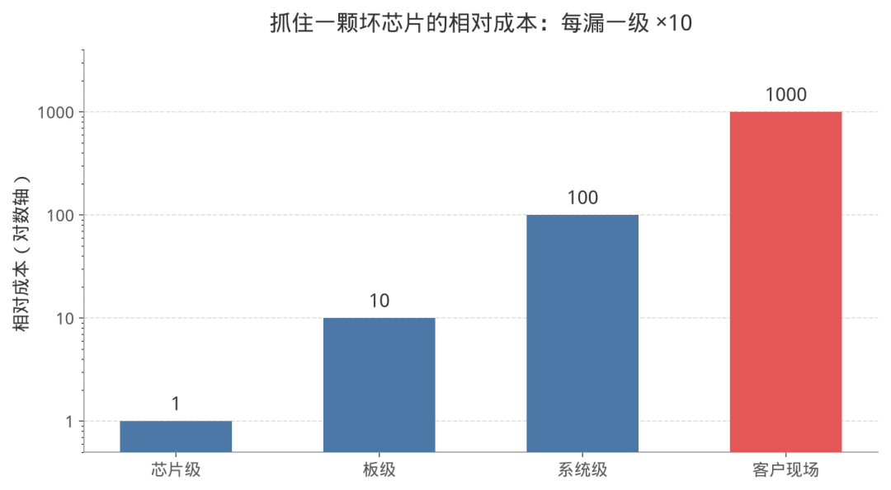
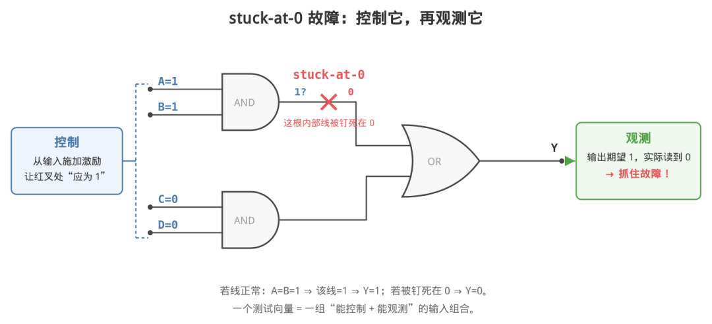
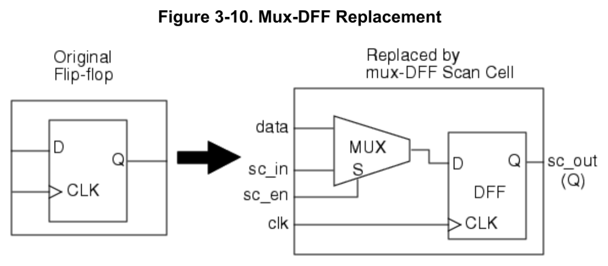
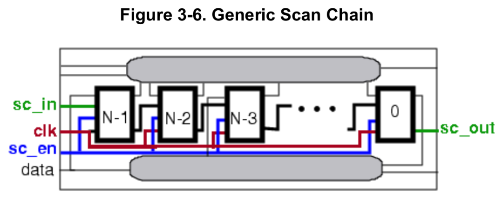
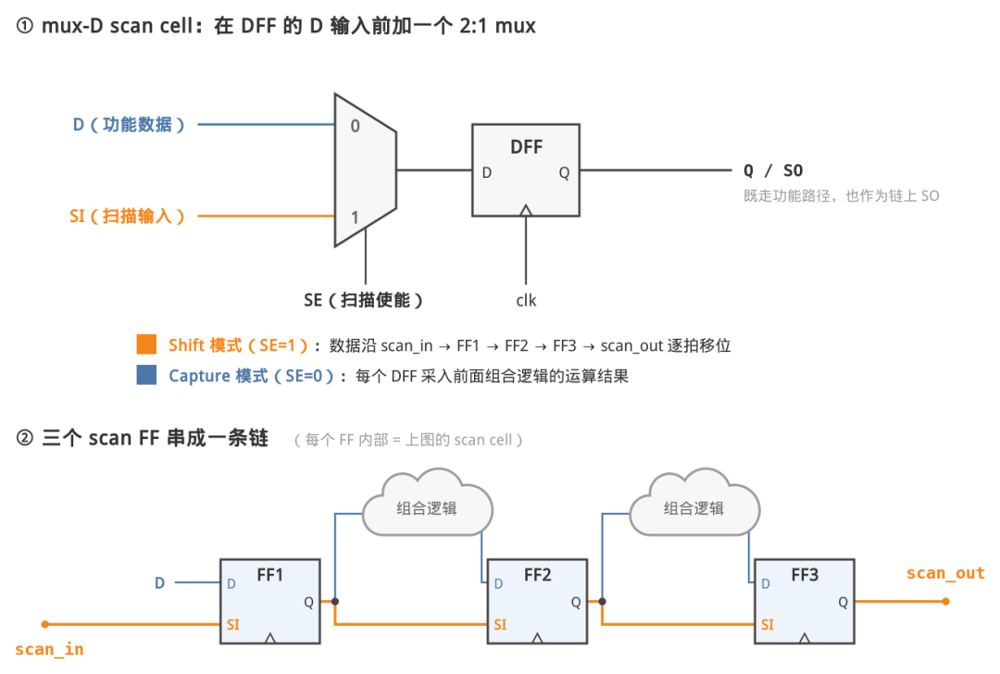
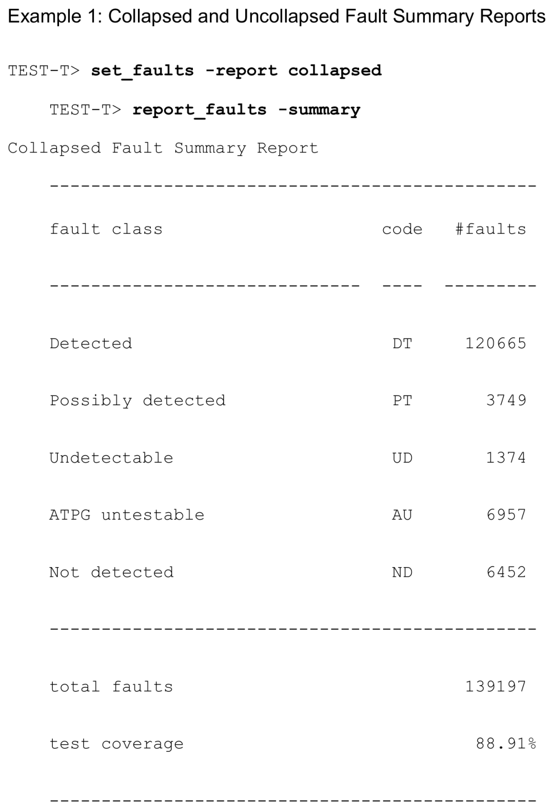
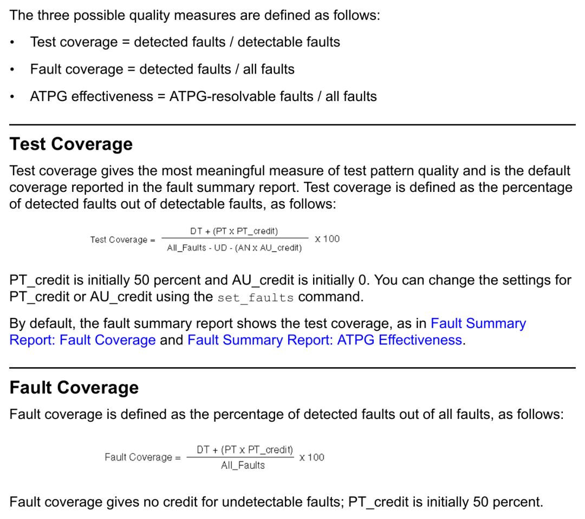
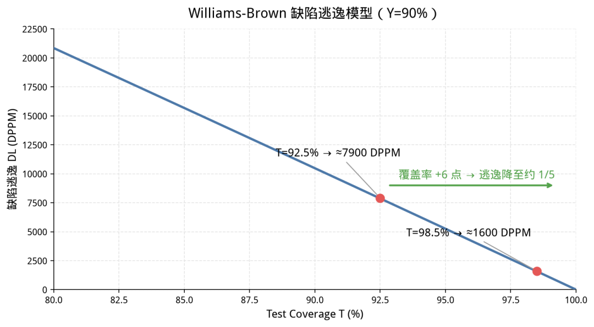

<!-- toc-start -->

# 目录

[1. Scan/ATPG 学习笔记（上）：从故障模型到覆盖率](#1-scanatpg-学习笔记上从故障模型到覆盖率)  
　　[1.1 验证与测试](#11-验证与测试)  
　　[1.2 故障模型：stuck-at](#12-故障模型stuck-at)  
　　[1.3 可控性与可观测性](#13-可控性与可观测性)  
　　[1.4 Scan：把时序电路化为组合电路来测](#14-scan把时序电路化为组合电路来测)  
　　[1.5 ATPG](#15-atpg)  
　　[1.6 覆盖率的定义](#16-覆盖率的定义)  
　　[1.7 覆盖率与缺陷逃逸：Williams-Brown 模型](#17-覆盖率与缺陷逃逸williams-brown-模型)  
　　[1.8 下篇内容](#18-下篇内容)  
　　[1.9 参考资料](#19-参考资料)  

<!-- toc-end -->

---

# 1. Scan/ATPG 学习笔记（上）：从故障模型到覆盖率

> 来源：https://mp.weixin.qq.com/s/3HPuYFeATkMw4px3HjMSLQ
> 作者：临界
> update 2026/08/17 23 : 19

最近在学习 DFT（Design for Testability，可测性设计），整理成两篇笔记。上篇梳理基本概念：为什么需要制造测试、故障如何建模、scan 与 ATPG 的原理、覆盖率的定义与含义——教材与工具手册中的关键内容尽量原文摘抄，出处附在文末。下篇记录AI在一颗开源 MCU 上做的一组ATPG实验，以及对"覆盖率与测试时间"这组权衡的理解。

---

## 1.1 验证与测试

学习 DFT 的第一步，是把两个容易混淆的概念分开。

\*\*Verification（验证）\*\*回答的问题是：这个设计是否符合 spec？对象是设计本身——回归跑多少轮，验的都是同一个设计。

\*\*Test（测试）\*\*回答的问题是：某一颗具体的芯片，制造过程中是否引入了缺陷？对象是硅片，并且每一颗出厂前都要做一遍。

之所以每一颗都要测，是因为制造过程不完美：晶圆上的一粒尘埃、一次光刻偏移、一处金属残留，都可能造成短路或开路。设计再正确，良率也到不了 100%。测试的任务是把制造环节坏掉的个体挑出来，避免流入下游。

漏检的代价有一个流传很广的经验法则，叫Rule of Ten：在芯片级发现一颗坏芯片的成本记为 1，漏到板级再发现约为 10，系统级约为 100，客户现场约为 1000（Bushnell & Agrawal 的教材开篇讲测试经济学时就引用了它）。数字未必精确，但量级关系是业界共识：缺陷每向下游漏一级，处理代价放大约一个数量级。

图 1：Rule of Ten——发现一颗坏芯片的相对成本随环节递增（对数轴示意）

因此每颗芯片出厂前都要在 ATE（Automatic Test Equipment，自动测试设备）上完成电学测试。接下来的问题是：怎么测。

## 1.2 故障模型：stuck-at

制造缺陷的物理形态无法枚举：短路、开路、桥接、电阻性通孔等等。工程上的做法是在逻辑层面做统一抽象：

Stuck-at fault（固定型故障）：假设电路中某个节点永远固定为 0（stuck-at-0）或永远固定为 1（stuck-at-1）。

这个模型非常简化。它在上世纪五十年代末就已出现（通常认为 Eldred 1959 年的论文是源头），至今仍是数字测试的基础。它能沿用至今，一般归结为三点：

其一，可枚举。每个 gate 的每个引脚各有 sa0/sa1 两种故障，故障总数 = 故障位点数 × 2，有限、可数（等价故障合并之后还会更少）。

其二，可度量。故障列表有限，就可以定义一个比值：测试向量集能检出其中多少——这就是覆盖率，整个测试质量体系建立在这个度量之上。

其三，经验上有效。大量硅上数据表明：stuck-at 覆盖率做高之后，多数真实物理缺陷（包括很多并非"固定"形态的）也会被顺带检出，文献中称之为 fortuitous detection。

stuck-at 不是全部——故障模型是一个家族，这两篇笔记先集中在 stuck-at 上。

> 延伸阅读 ｜ 速度相关的缺陷用 transition fault 模型做 at-speed 测试，launch-on-capture / launch-on-shift 是这条线的入门关键词；相邻线短路有 bridging fault；静态漏电流异常有 IDDQ 测试；先进工艺下还有把故障建到晶体管级的 cell-aware model。每一个在 Bushnell & Agrawal 的教材里都有整章展开。

## 1.3 可控性与可观测性

要检测某根内部线 net\_X 上的 stuck-at-0 故障，需要从芯片管脚出发完成两件事：

控制（controllability）：从输入施加一组激励，使 net\_X 在无故障时应为 1；

观测（observability）：使 net\_X 的取值沿某条路径传播到某个输出管脚。输出与期望一致，说明该故障不存在；不一致，则故障被检出。

图 2：检测一个 stuck-at-0 故障的两个条件——控制（激励使故障线"应为 1"）与观测（结果传播到输出端比对）。注意下方 AND 的输入需设为 0，故障效应才能通过 OR 门传播——这正是 ATPG 求解的问题

组合逻辑上这两件事是可解的。困难在时序逻辑：真实电路里 net\_X 往往埋在多级触发器之后，把它控制到指定值可能需要从复位状态走很多拍，把结果送到管脚又要很多拍。一个 32 位计数器的最高位，从复位数到第一次翻转需要 2^31 个周期。对成千上万个触发器包围的内部逻辑逐个求激励序列，计算上不可行。

scan 设计正是针对这个问题提出的。

## 1.4 Scan：把时序电路化为组合电路来测

scan 的核心想法：在测试模式下，把全部触发器串成一个移位寄存器。

具体做法是把普通 D 触发器替换为 scan 触发器——D 输入前加一个 mux：功能模式下走原来的逻辑（D），测试模式下走前一级触发器的输出（SI，scan input）。Tessent 手册中的图示：

图 3：普通 DFF 替换为 mux-DFF scan cell——D 前加一个由 sc\_en 选择的 MUX（摘自 Tessent\_Scan\_and\_ATPG\_Users\_Manual.pdf, Figure 3-10, p.100）

全部触发器首尾相连，头接输入管脚（scan\_in），尾接输出管脚（scan\_out），构成scan chain：

图 4：N 个 scan cell 串成移位链，sc\_in 移入、sc\_out 移出，clk/sc\_en 全链共享（摘自 Tessent\_Scan\_and\_ATPG\_Users\_Manual.pdf, Figure 3-6, p.97）

测试由此变成一个固定节奏的循环：

1. Shift（移入）：置起 scan enable，施加 N 个时钟（N = 链长），把预定状态从 scan\_in 逐位移入全部触发器——每个触发器由此变得完全可控；
2. Capture（捕获）：撤销 scan enable，施加一拍功能时钟，组合逻辑的运算结果被各触发器捕获；
3. Shift（移出）：再次置起 scan enable，把捕获结果从 scan\_out 逐位移出比对——每个触发器由此变得完全可观测。移出的同时，下一个 pattern 同步移入。

图 5：scan cell 与 scan 链——SE=1 时数据沿链移位（shift），SE=0 时各 DFF 捕获组合逻辑的运算结果（capture）

效果是：时序电路的测试问题被化归为组合电路的——每段组合逻辑的输入端（触发器输出）可任意设置，输出端（触发器输入）可直接读出。Tessent 手册对这一思想的概括是：scan 设计的目的，是把内部时序单元转变为对测试而言直接可控、可观测的点，使电路在测试时可以按组合电路处理。

工业化的里程碑通常追溯到 IBM 1977 年发表的 LSSD（Level-Sensitive Scan Design，Eichelberger & Williams）——那是基于电平敏感锁存器的一种 scan 风格；今天更主流的是上图的 mux-D 风格，实现不同，思想同源。综合网表里 SDFF 前缀的 cell、后端报告里的 scan chain stitch，都属于这条技术线。

代价方面：每个触发器换成 scan 版本，单元面积增加百分之十几，摊到全芯片通常是百分之几；外加几根测试管脚和一些时序约束。换来的是每个触发器都成为直接可控、可观测的点——就可测性而言，这笔投入通常被认为是非常划算的。

> 延伸阅读 ｜ scan 覆盖的是芯片内部的数字逻辑；管脚与板级互连有 boundary scan——IEEE 1149.1，即 JTAG；memory 阵列用 MBIST 自测甚至自修；还有不依赖 ATE 的 LBIST。这一族技术统称 DFT，想看全景，Wang/Wu/Wen 的教材是很好的地图。

## 1.5 ATPG

触发器可控可观测之后，剩下的问题是：几十万个故障，每一个都需要一组"控制值 + 传播路径"，由谁来求解。

ATPG（Automatic Test Pattern Generation，自动测试向量生成）：给定网表和故障列表，算法自动为每个故障推导 pattern。理论源头是 1966 年 Roth 的 D-algorithm（第一个被证明完备的算法：只要故障可测，就必能构造出检测向量），1981 年 Goel 的 PODEM 大幅提升了求解效率。今天的商用工具——Synopsys 的 TetraMAX（现名 TestMAX ATPG）、Siemens 的 Tessent——内核都是这条线的延续。

> 延伸阅读 ｜ ATPG 算法是很完整的一段计算机科学：五值逻辑、D 传播、回溯搜索，Bushnell & Agrawal 用了一整章推导；近年还有把问题转给 SAT 求解器的路线，关键词 SAT-based ATPG。

现代 ATPG 有一个后文会用到的性质：单个 pattern 中真正被指定的位（care bit）非常稀疏。为检测某个故障，工具往往只需指定几十个触发器的值，其余位可任意填充。工具会做压实（compaction），把互不冲突的多个故障的激励合并进同一个 pattern，因此最终 pattern 数远小于故障数。这个稀疏性是下篇讨论的 scan 压缩得以实现 10 倍以上压缩比的基础。

## 1.6 覆盖率的定义

ATPG 完成后，工具输出 fault summary。TestMAX 手册中的示例：

图 6：report\_faults -summary的 Fault Summary Report 示例——五个 fault class 加总，最后一行即 test coverage（摘自 TestMAX\_ATPG\_Diagnosis\_User\_Guide\_T-2022.03-SP3.pdf, Chapter 14, p.604-605）

五个 fault class，每个故障归入其一：

- DT（Detected）：已被 pattern 检出；
- PT（Possibly detected）：可能检出（如故障效应传播到了 X 值上），默认按 50% 计入；
- UD（Undetectable）：理论上不可检测（冗余逻辑等），不计入分母——不是工具能力不足，而是问题本身无解；
- AU（ATPG untestable）：在当前测试条件与约束下不可检测。注意措辞：不是理论不可测，而是施加给工具的条件（管脚约束、测试模式设定、时钟约束）使其无法检测。下篇实验的核心就是这一类；
- ND（Not detected）：尚无定论——工具中途放弃（abort）或未分析完，可能可测，也可能不可测。

覆盖率的定义，手册原文：

> Test coverage = detected faults / detectable faults
> Fault coverage = detected faults / all faults

区别在分母：test coverage 把 UD 从分母中剔除。另外 PT 默认按 50% 计入、AU 按 0% 计入，两个 credit 都可以用 set\_faults 修改——所以比较不同来源的覆盖率数字之前，应先确认口径一致。手册明确写道 "Test coverage gives the most meaningful measure of test pattern quality"——通常所说的"覆盖率"，一般指 test coverage。完整公式：

图 7：Test Coverage 与 Fault Coverage 的定义——分母相差 UD 与 AU\_credit 项，PT 计半（摘自 TestMAX\_ATPG\_Diagnosis\_User\_Guide\_T-2022.03-SP3.pdf, Chapter 14, p.617）

这个定义有一个值得注意的推论：\*\*AU 在分母里，却几乎拿不到分子。\*\*每一个 AU 故障都在实际拉低覆盖率——而"不可测"的原因往往不在工具，在设计写法和测试约束。这一点下篇用实测数字验证。

## 1.7 覆盖率与缺陷逃逸：Williams-Brown 模型

最后一个问题：覆盖率 92% 与 98%，差别有多大？

Williams 与 Brown 在 1981 年给出了一个至今仍被广泛引用的模型（IEEE Transactions on Computers）：

DL = 1 − Y^(1−T)

其中 DL 是缺陷逃逸率（defect level，出货芯片中坏品的比例），Y 是良率，T 是故障覆盖率。取良率 90% 代入：

- T = 92.5% 时，DL ≈ 0.79%，即每百万颗出货约 7900 颗漏检坏片；
- T = 98.5% 时，DL ≈ 0.16%，约 1600 颗。

  

图 8：Williams-Brown 模型（Y=90%）——覆盖率与缺陷逃逸（DPPM）的对应关系

覆盖率提高 6 个点，逃逸降到约五分之一。这解释了业界的覆盖率要求：消费类产品普遍要求 stuck-at 覆盖率 97~98%，车规产品要求 99% 以上并叠加其他测试手段——DPPM（百万分之缺陷率）直接写在质量协议里，每一颗逃逸都对应退货、返修乃至召回的成本。

模型是理想化的，参数需按工艺校准，但它给了覆盖率一个可换算成成本的锚点。下篇讨论"覆盖率目标定在哪里"时，会回到这个模型。

> 延伸阅读 ｜ 后人对该模型有不少修正，例如考虑缺陷成团分布的 clustering 修正——顺着 defect level model 这个关键词能找到一整条文献线。

## 1.8 下篇内容

下篇记录实验部分：我用Fable-5 在 openMSP430 搭的小系统上做五次 ATPG实验

- 同一设计中，被使能约束关闭的调试模块只损失 22 个 fault，一组观测选择逻辑损失 2135 个：功能相似的两块逻辑，覆盖率结果完全不同，差异来自 RTL 写法；
- 给 ATPG 设置 95 的覆盖率目标，观察一行配置如何丢掉 3.4 个点；
- 以及覆盖率与测试时间的量化权衡：T = P × L / f，实测收敛曲线，和一笔换算成时间与成本的账。

## 1.9 参考资料

- M. Bushnell, V. Agrawal, Essentials of Electronic Testing for Digital, Memory and Mixed-Signal VLSI Circuits, Springer, 2000
- L.-T. Wang, C.-W. Wu, X. Wen, VLSI Test Principles and Architectures, Morgan Kaufmann, 2006
- T. W. Williams, N. C. Brown, "Defect Level as a Function of Fault Coverage," IEEE Transactions on Computers, 1981
- E. B. Eichelberger, T. W. Williams, "A Logic Design Structure for LSI Testability," DAC, 1977
- `TestMAX_ATPG_Diagnosis_User_Guide_T-2022.03-SP3.pdf`
- `TetraMAX_ATPG_User_Guide.pdf`
- `Tessent_Scan_and_ATPG_Users_Manual.pdf`
