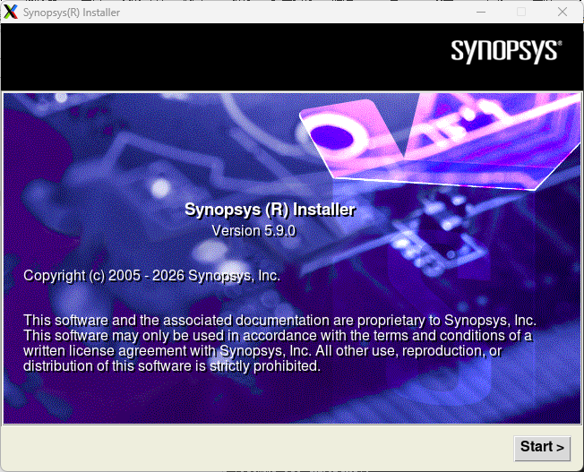
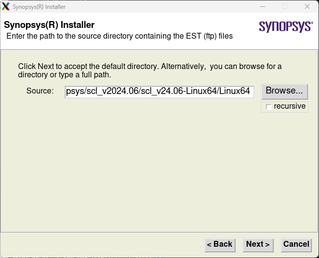
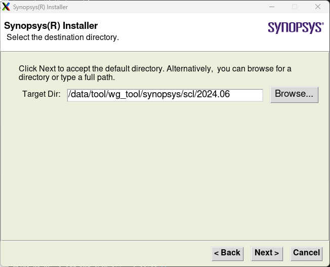
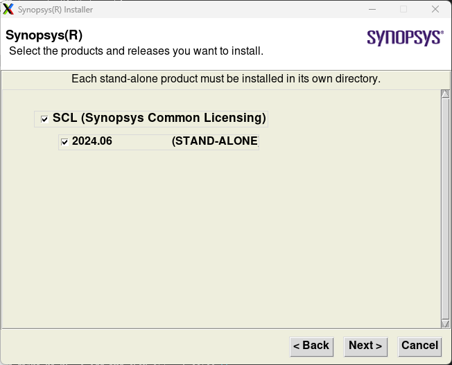
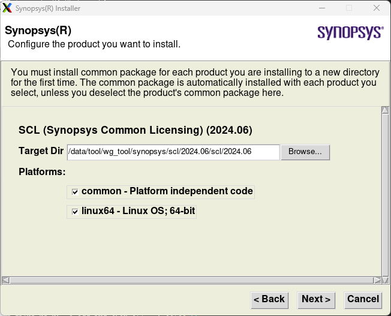
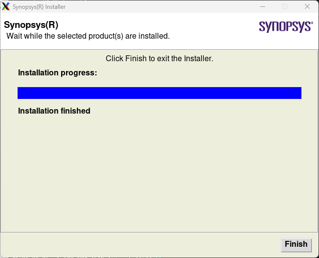
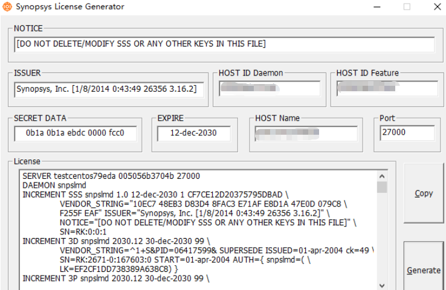

# 1 EDA工具安装：Synopsys SCL【Version 2024.06】安装部署保姆级教程

> 来源：https://mp.weixin.qq.com/s/CP4bAw54R3o69zrx2sD7Rw
> 作者：陕西IT老张
> update 2026/08/16 03 : 05
**声明：相关软件环境仅供测试学习使用！**

本文仅用于技术学习与交流目的，所涉及的操作步骤、工具使用及配置方法均基于公开资料整理。文中提及的软件为商业授权产品，其合法使用须遵守相关软件许可协议及所在国家/地区的法律法规。

作者及发布平台不鼓励、不支持、亦不承担任何因使用破解工具、绕过授权机制或违反软件许可条款而引发的法律风险、系统安全问题或知识产权纠纷。建议用户在正式开发或生产环境中使用正版授权软件，相关内容如有侵权，请联系作者删除。

## 1.1 概念

SCL (Synopsys Common License) 软件为 Synopsys License 统一管理工具。该软件完成后，Synopsys 其他相关工具的安装无需再单独设置，只需要安装对应工具并指定相关 PATH 变量就可以直接使用。

Synopsys的工具，是需要官方授权的license认证，才可以运行的。因此需要搭建license服务器，以提供license服务。Synopsys提供了scl工具，用来搭建license服务器。

## 1.2 环境

操作系统：CentOS Linux release 7.9.2009 (Core)

installer安装包：synopsysinstaller\_v5.9

scl安装包：scl\_v2024.06【更新使用2024版本】

安装用户：eda

## 1.3 安装过程

```
## 规划好目录结构，soft按厂商分类、tool按厂商安装、license单独存放；
、
、
[eda@wg-eda ~]$ cd /data/tool/wg_tool/soft/synopsys/[eda@wg-eda synopsys]$ ll -ahl总用量 32Kdrwxr-xr-x. 8 eda  rnd  4.0K 8月   9 13:50 .drwxr-xr-x. 5 eda  rnd  4.0K 7月  27 15:35 ..drwxr-xr-x. 3 eda  rnd  4.0K 1月  29 2026 scl_keygen_2030drwxr-xr-x  3 root root 4.0K 1月  29 2026 scl_v2024.06drwxr-xr-x. 6 eda  rnd  4.0K 7月  24 17:43 synopsysinstaller_v5.9drwxr-xr-x. 2 eda  rnd  4.0K 7月  27 11:49 tweaker_S-2021.06-SP5drwxr-xr-x. 2 root root 4.0K 12月  3 2025 tweakersuite_vU-2022.12-SP4[eda@wg-eda synopsys]$ tree -L 3 scl_v2024.06/scl_v2024.06/├── scl_v24.06-Linux64│   └── Linux64│       ├── Patch│       ├── scl_v2024.06_common.spf│       └── scl_v2024.06_linux64.spf├── scl_v24.06-Linux64.zip└── scl_v24.06-Windows.zip
3 directories, 4 files[eda@wg-eda synopsys]$ ll -ahl /data/tool/wg_tool/soft/synopsys/synopsysinstaller_v5.9总用量 72Kdrwxr-xr-x.  6 eda rnd 4.0K 7月  24 17:43 .drwxr-xr-x.  8 eda rnd 4.0K 8月   9 13:50 ..-rwxr-xr-x.  1 eda rnd 9.0K 2月   5 2025 batch_installerdrwxr-xr-x.  2 eda rnd 4.0K 2月   5 2025 container_setupdrwxr-xr-x.  3 eda rnd 4.0K 2月   5 2025 doc-rwxr-xr-x.  1 eda rnd  633 2月   5 2025 efttooldrwxr-xr-x. 10 eda rnd 4.0K 2月   5 2025 install_bin-rwxr-xr-x.  1 eda rnd  11K 2月   5 2025 installer-rwxr-xr-x.  1 eda rnd  16K 7月  24 17:43 installer.logdrwxr-xr-x.  3 eda rnd 4.0K 2月  15 23:39 .ocad-rwxr-xr-x.  1 eda rnd  463 2月   5 2025 setup.sh[eda@wg-eda synopsys]$ /data/tool/wg_tool/soft/synopsys/synopsysinstaller_v5.9/setup.sh
```













```
[eda@wg-eda synopsys]$ tree -L 4 /data/tool/wg_tool/synopsys/scl/2024.06/
@wg
-
-
L
4
/data/
/wg_tool/
/scl/
2024.06
/
/data/tool/wg_tool/synopsys/scl/2024.06/└── scl    └── 2024.06        ├── admin        │   ├── license        │   └── logs        ├── doc        │   ├── DONGLE_README.TXT        │   ├── FLEXnet_ID_Dongle_Drivers.pdf        │   ├── FlexNetLicensingEndUserGuide.pdf        │   ├── foss        │   ├── SCL_2024.06_Administration_Guide.pdf        │   ├── SCL_2024.06_Install.pdf        │   └── SCL_2024.06_Release_Notes.pdf        ├── examples        │   ├── rotate_lic_server.sh        │   ├── scl_boot.sh        │   ├── sysmon.README        │   ├── sysmon.sh        │   └── watchlog.c        ├── install.log        ├── LICENSE.TXT        └── linux64            ├── bin            └── drivers
11 directories, 13 files
[eda@wg-eda scl]$ ll -ahl /data/tool/wg_tool/synopsys/scl/2024.06/scl/2024.06/linux64/bin/snpslmd-rwxr-xr-x 1 eda rnd 15M 5月  27 2024 /data/tool/wg_tool/synopsys/scl/2024.06/scl/2024.06/linux64/bin/snpslmd[eda@wg-eda scl]$ mv /data/tool/wg_tool/synopsys/scl/2024.06/scl/2024.06/linux64/bin/snpslmd /data/tool/wg_tool/synopsys/scl/2024.06/scl/2024.06/linux64/bin/snpslmd.bak[eda@wg-eda scl]$ cp /data/tool/wg_tool/soft/synopsys/scl_v2024.06/scl_v24.06-Linux64/Linux64/Patch/snpslmd  /data/tool/wg_tool/synopsys/scl/2024.06/scl/2024.06/linux64/bin/[eda@wg-eda scl]$ chmod 755 /data/tool/wg_tool/synopsys/scl/2024.06/scl/2024.06/linux64/bin/snpslmd[eda@wg-eda scl]$ ll /data/tool/wg_tool/synopsys/scl/2024.06/scl/2024.06/linux64/bin/snpslmd-rwxr-xr-x 1 eda rnd 14930152 8月   9 14:19 /data/tool/wg_tool/synopsys/scl/2024.06/scl/2024.06/linux64/bin/snpslmd[eda@wg-eda scl]$ /data/tool/wg_tool/soft/synopsys/scl_keygen_2030/1patch -ecc /data/tool/wg_tool/synopsys/scl/2024.06Start self extract...Running....<INFO-1> Current directory: /data/tool/wg_tool/synopsys/scl<INFO-3> Change directory to: /data/tool/wg_tool/synopsys/scl/2024.06...<INFO-2> Start patching...Generic ECC patcher by tanker, v1.4, 2020-04Type -h for more help..FTW done with ret code = 0, all file checkedTotal search 42 files.Total 0 file are changed.Generic synopsys file checksum patcher & string extractor by tanker, v1.6, 2020-05Type -h for more help..Searching..... please wait....FTW done with ret code = 0, all file checkedTotal search 42 files.Total 0 file are changed.<INFO-3> Patched:/data/tool/wg_tool/synopsys/scl/2024.06...<INFO-6> Go back to: /data/tool/wg_tool/synopsys/scl...Finished.
```



```
## Windows系统下操作：
Windows系统下操作：
D:\Soft\EDA Tool\EDA-JH\scl_keygen_2030>fix.bat Synopsys.datAdd dummy SIGN to license file...please wait...移动了         1 个文件。## 记事本打开Synopsys.dat文件修改，在第二行末尾加上安装路径，格式如下：SERVER wg-eda 005056b3abcb 27000DAEMON snpslmd /data/tool/wg_tool/synopsys/scl/2024.06/scl/2024.06/linux64/bin/snpslmd## 上传服务器器后查看确认；head -n 10 /data/tool/wg_tool/synopsys/license/Synopsys.dat[eda@wg-eda ~]$ /data/tool/wg_tool/synopsys/scl/2024.06/scl/2024.06/linux64/bin/lmgrd -c /data/tool/wg_tool/synopsys/license/Synopsys.dat -l /data/tool/wg_tool/synopsys/license/lic.log[eda@wg-eda ~]$ /data/tool/wg_tool/synopsys/scl/2024.06/scl/2024.06/linux64/bin/lmutil lmstat -a -c /data/tool/wg_tool/synopsys/license/Synopsys.dat## 设置开机自启；vim  /etc/rc.d/rc.localsu - eda -c '/data/tool/wg_tool/synopsys/scl/2024.06/scl/2024.06/linux64/bin/lmgrd -c /data/tool/wg_tool/synopsys/license/Synopsys.dat -l /data/tool/wg_tool/synopsys/license/lic.log'chmod +x /etc/rc.d/rc.localps aux | grep lmgrd | grep -v grepss -tulpn | grep -E "lmgrd|snpslmd"ss -tulpn | grep 27000pgrep -l lmgrd && pgrep -l snpslmd
```

```
## 整体.cshrc环境整理；
## 整体.cshrc环境整理；

#! /bin/csh############################################################################# 统一 EDA 工具 .cshrc# 支持Cadence IC618 / Spectre / MMSIM / Calibre / RedHawk / Innovus211# 支持Synopsys VCS / Verdi / DC / PT / FM / StarRC / ICC2 / FineSim / XA / tweaker############################################################################
setenv  os_type         `uname -s`setenv  linux_ver       `uname -r`setenv  hostnm          `hostname`umask 022
#===============================================================================# 常用别名#===============================================================================alias cls     'clear'alias vi      'gvim'alias g       'gedit'alias chm     'chmod -R 755'alias rh      'redhawk_sc_et &'alias rh_v    'redhawk_sc_et -v'alias cp_cds  'cp -r /data/tool/wg_tool/cshrc/.cdsinit .'alias proj    'cd /data/project'alias vir     'virtuoso &'alias cali    'calibre -gui &'#alias pt_shell 'script -q /dev/null -c "pt_shell" |& grep -v "PT-063"'#===============================================================================# 快速切换环境：ddi23 / eda_old#===============================================================================alias ddi23  'source /data/tool/wg_tool/cshrc/use_ddi23.cshrc'alias eda_old 'source /data/tool/wg_tool/cshrc/.cshrc'
#----------------------------------------------------------------------# Synopsys 许可服务操作#----------------------------------------------------------------------alias lmg_start   'lmgrd -c /data/tool/wg_tool/synopsys/license/Synopsys.dat -l /data/tool/wg_tool/synopsys/license/lic.log'alias lmg_stop    'lmdown -q -c 27000@wg-eda'alias lmg_check   'lmutil lmstat -a -c 27000@wg-eda'
#----------------------------------------------------------------------# Innovus 环境#----------------------------------------------------------------------alias use_innovus 'setenv LD_LIBRARY_PATH $INNOVUS_HOME/lib; setenv OA_HOME $CADHOME/INNOVUS211/oa_v22.60.052'
#===============================================================================# 统一工具根目录#===============================================================================setenv TOOL_HOME       /data/tool/wg_toolsetenv CADHOME         ${TOOL_HOME}/cadencesetenv MENTOR_HOME     ${TOOL_HOME}/mentorsetenv REDHAWK_HOME    ${TOOL_HOME}/other/RedHawk-SC_Electrothermal_Linux64e7_V2023R2.1setenv SYNPS_HOME      ${TOOL_HOME}/synopsys
#===============================================================================# 1. Cadence IC618 + Spectre + MMSIM#===============================================================================setenv SPECTRE_DEFAULTS        -Esetenv LANG                    Csetenv CDS_Netlisting_Mode     Analogsetenv CDS_ENABLE_VMS          1setenv CDS_LOAD_ENV            CWDsetenv CDS_AUTO_64BIT          ALLsetenv OA_UNSUPPORTED_PLAT     linux_rhel50_gcc44x
setenv CDS              ${CADHOME}/IC618setenv CDSDIR           ${CDS}setenv CDSHOME          ${CDS}setenv CADENCE_DIR      ${CDS}setenv CDS_INST_DIR     ${CDS}setenv CDS_ROOT         ${CDS}setenv CDSROOT          ${CDS}
setenv CDS_LIC_FILE     ${CADHOME}/license/license.datsetenv CDS_LIC_ONLY     1
setenv SPECTRE_HOME     ${CADHOME}/SPECTRE181setenv MMSIMHOME        ${CADHOME}/MMSIM151setenv INNOVUS_HOME     ${CADHOME}/INNOVUS211
#===============================================================================# 2. Calibre#===============================================================================setenv CALIBRE_HOME             ${MENTOR_HOME}/calibre2019/aoj_cal_2019.3_15.11setenv MGC_HOME                 ${CALIBRE_HOME}setenv MGLS_LICENSE_FILE        ${MENTOR_HOME}/license/license.datsetenv MGC_LIB_PATH             ${CALIBRE_HOME}/libsetenv CALIBRE_ENABLE_SKILL_PEXBA_MODE  1setenv MGC_CALIBRE_REALTIME_VIRTUOSO_ENABLED 1setenv MGC_CALIBRE_REALTIME_VIRTUOSO_SAVE_MESSENGER_CELL 1setenv MGC_CALIBRE_SAVE_ALL_RUNSET_VALUES 1
#===============================================================================# 3. RedHawk#===============================================================================setenv APACHEDA_LICENSE_FILE    ${REDHAWK_HOME}/license/ansyslmd.lic
#===============================================================================# 4. Synopsys 工具 (VCS / Verdi / DC / PT / FM / StarRC / ICC2 / FineSim / XA)#===============================================================================#setenv SCL_HOME                 ${SYNPS_HOME}/scl/2023.09setenv SCL_HOME ${SYNPS_HOME}/scl/2024.06/scl/2024.06setenv VERDI_LICENSE_FEATURE    Verdi
setenv VCS_TARGET_ARCH          amd64setenv HSPICE_64                1setenv SW_SX_64                 1setenv HSIM_64                  1setenv XA_64                    1
setenv VCS_HOME                 ${SYNPS_HOME}/vcs2022Patched/vcs/T-2022.06setenv VERDI_HOME               ${SYNPS_HOME}/verdi2022/verdi/T-2022.06setenv SYN_HOME                 ${SYNPS_HOME}/syn201806setenv PTS_HOME                 ${SYNPS_HOME}/pt201806setenv FM_HOME                  ${SYNPS_HOME}/fm/V-2023.12-SP5setenv STARRC_HOME              ${SYNPS_HOME}/starrc201806setenv ICC2_HOME                ${SYNPS_HOME}/icc2_201806setenv FINESIM_HOME             ${SYNPS_HOME}/finesim/finesim/O-2018.09-SP2setenv CUSTOMSIM_HOME           ${SYNPS_HOME}/xa/xa/V-2023.12-SP1
# Synopsys Licensesetenv SNPSLMD_LICENSE_FILE     27000@wg-edasetenv LM_LICENSE_FILE          27000@wg-eda
#===============================================================================# PATH 统一顺序，后加的优先级高#===============================================================================set path = ( \    $SCL_HOME/linux64/bin \    $VCS_HOME/bin \    $VERDI_HOME/bin \    $SYN_HOME/bin \    $PTS_HOME/bin \    $FM_HOME/bin \    $STARRC_HOME/bin \    $ICC2_HOME/bin \    $FINESIM_HOME/bin \    $CUSTOMSIM_HOME/bin \    $CDSDIR/tools/bin \    $CDSDIR/tools/dfII/bin \    $SPECTRE_HOME/bin \    $SPECTRE_HOME/tools/bin \    $MMSIMHOME/bin \    $MMSIMHOME/tools/relxpert/bin \    $MMSIMHOME/tools/dfII/bin \    $MMSIMHOME/tools/spectre/bin \    $MMSIMHOME/tools/ultrasim/bin \    $MMSIMHOME/tools/bin \    $CALIBRE_HOME/bin \    $INNOVUS_HOME/bin \    $REDHAWK_HOME/bin \    $path \)
#===============================================================================# LD_LIBRARY_PATH#===============================================================================if (! $?LD_LIBRARY_PATH) then    setenv LD_LIBRARY_PATH ""endif
setenv LD_LIBRARY_PATH \${FINESIM_HOME}/lib:${CALIBRE_HOME}/shared/pkgs/icv/tools/calibre_client/lib/64:$LD_LIBRARY_PATH
#===============================================================================# 修复 PrimeTime PT-063 警告#===============================================================================#setenv SYNOPSYS_LIB_COMP_HOME $SYN_HOME# 强制屏蔽 PrimeTime PT-063 警告#setenv PT_DISABLE_LIB_COMP_CHECK 1#setenv SNPS_SKIP_LIB_COMP_CHECK 1
#===============================================================================# 额外优化#===============================================================================setenv CDS_SPECTRERF_FBENABLE   1setenv CDS_SPECTRE_FBENABLE     1
#===============================================================================# Tweaker S-2021.06-SP5 (patched)#===============================================================================setenv TWEAKER_HOME /data/tool/wg_tool/synopsys/tweaker_S-2021.06-SP5/tweaker_S-2021.06-SP5set path = ($TWEAKER_HOME/bin $path)

#===============================================================================# Login Environment Info#===============================================================================echo ""echo "========================================================================"echo "  Current Environment: Default Classic EDA Flow"echo "  Tools available: IC618 | Spectre | MMSIM | Calibre | RedHawk | Innovus211 (use_innovus)"echo "                   VCS | Verdi | DC | PT | FM | StarRC | ICC2 | FineSim | XA | tweaker"echo ""echo "  Quick Switch Commands:"echo "      ddi23      Switch to DDI23.14 (Genus / Innovus23 / Joules)"echo "      eda_old    Switch back to Classic EDA Environment"echo "========================================================================"echo ""
## use_ddi23.cshrc环境整理；
#!/bin/csh -f
# 先清空旧环境关键变量，避免冲突unsetenv CDS_LIC_FILEunsetenv LM_LICENSE_FILEunsetenv CDSunsetenv CDSDIRunsetenv CDSHOMEunsetenv INNOVUS_HOMEunsetenv OA_HOMEunsetenv SNPSLMD_LICENSE_FILE
# DDI23.14 独立许可setenv CDS_LIC_FILE     /data/tool/wg_tool/cadence/license/license_ddi23.datsetenv LM_LICENSE_FILE  /data/tool/wg_tool/cadence/license/license_ddi23.dat
# 许可兼容参数setenv CDS_ALLOW_OLD_LICENSE        1setenv CDS_SKIP_VERSION_CHECK       1setenv CDS_LIC_ONLY                 1setenv CDS_NO_LIC_WARNING           1setenv CDS_ALLOW_UNLICENSED         1setenv CDNS_LICENSE_SKIP_VERIFY     1setenv CDNS_SKIP_LIC_SIGN_CHECK     1setenv CDS_AUTO_64BIT               ALLsetenv OA_UNSUPPORTED_PLAT          linux_rhel70_gcc93x
# DDI23 主目录setenv DDI23_HOME /data/tool/wg_tool/cadence/DDI23.14.000.ISR4
# 优先使用 DDI23 工具set path = ( \    $DDI23_HOME/GENUS231/tools.lnx86/bin \    $DDI23_HOME/INNOVUS231/tools.lnx86/bin \    $DDI23_HOME/JSTUDIO231/tools.lnx86/bin \    $DDI23_HOME/bin \    $path \)
rehashecho "=> 已切换到 DDI23.14 环境 (Genus / Innovus23 / Joules)"
```

至此，SCL v2024.06版本安装测试完成；
