<!-- toc-start -->

# 目录

[1. 一笔 PCIe Memory Read，到底是怎么完成的？](#1-一笔-pcie-memory-read到底是怎么完成的)  
　　[1.1 先看整条路径：为什么读比写多了一个“返回数据”的过程](#11-先看整条路径为什么读比写多了一个返回数据的过程)  
　　[1.2 第一步：CPU 发起 Load，本质上仍然是一次本地地址访问](#12-第一步cpu-发起-load本质上仍然是一次本地地址访问)  
　　[1.3 第二步：Outbound 地址转换，把本地地址翻译成 PCIe 地址](#13-第二步outbound-地址转换把本地地址翻译成-pcie-地址)  
　　[1.4 第三步：Controller 生成一笔 MRd](#14-第三步controller-生成一笔-mrd)  
　　[1.5 为什么读比写复杂得多？](#15-为什么读比写复杂得多)  
　　[1.6 第四步：Endpoint 收到 MRd 后，先 BAR 命中，再去本地取数](#16-第四步endpoint-收到-mrd-后先-bar-命中再去本地取数)  
　　[1.7 第五步：对端拿到数据之后，要把它装进 CplD](#17-第五步对端拿到数据之后要把它装进-cpld)  
　　[1.8 Requester / Completer 不是固定角色，而是这笔事务里的角色](#18-requester-completer-不是固定角色而是这笔事务里的角色)  
　　[1.9 CplD 返回时，系统靠什么找到原始 MRd？](#19-cpld-返回时系统靠什么找到原始-mrd)  
　　[1.10 为什么一笔 MRd 可能对应多个 CplD？](#110-为什么一笔-mrd-可能对应多个-cpld)  
　　[1.11 最后一步：RC 匹配完成后，数据怎样回到 CPU？](#111-最后一步rc-匹配完成后数据怎样回到-cpu)  
　　[1.12 为什么 Memory Read 会超时？](#112-为什么-memory-read-会超时)  
　　　　[1.12.1 CPU / AXI 真的发起了 Read 吗？](#1121-cpu-axi-真的发起了-read-吗)  
　　　　[1.12.2 NoC / AXI 是否命中 PCIe Window？](#1122-noc-axi-是否命中-pcie-window)  
　　　　[1.12.3 Outbound ATU 是否命中？](#1123-outbound-atu-是否命中)  
　　　　[1.12.4 RC 真的发出了 MRd 吗？](#1124-rc-真的发出了-mrd-吗)  
　　　　[1.12.5 Endpoint 是否收到了 MRd，并正确 BAR 命中？](#1125-endpoint-是否收到了-mrd并正确-bar-命中)  
　　　　[1.12.6 Endpoint 本地 AXI Read 是否真正完成？](#1126-endpoint-本地-axi-read-是否真正完成)  
　　　　[1.12.7 CplD 是否被正确返回并匹配？](#1127-cpld-是否被正确返回并匹配)  
　　[1.13 最容易理解错的 6 个点](#113-最容易理解错的-6-个点)  
　　[1.14 误区 1：MRd 发出去时，数据已经在包里了](#114-误区-1mrd-发出去时数据已经在包里了)  
　　[1.15 误区 2：CplD 只靠顺序匹配](#115-误区-2cpld-只靠顺序匹配)  
　　[1.16 误区 3：RC 永远是 Requester](#116-误区-3rc-永远是-requester)  
　　[1.17 误区 4：CplD 只会有一个](#117-误区-4cpld-只会有一个)  
　　[1.18 误区 5：只要链路是 L0，读就一定不会超时](#118-误区-5只要链路是-l0读就一定不会超时)  
　　[1.19 误区 6：Memory Read 和 Memory Write 只是“一个读、一个写”而已](#119-误区-6memory-read-和-memory-write-只是一个读一个写而已)  
　　[1.20 一张图记住全文](#120-一张图记住全文)  
　　[1.21 后记](#121-后记)  
　　[1.22 《PCIe Tag 到底有什么用？为什么 Read 可以乱序返回？》](#122-pcie-tag-到底有什么用为什么-read-可以乱序返回)  
　　[1.23 参考资料](#123-参考资料)  
[2. PCIe Tag 到底有什么用？为什么 Read 可以乱序返回？](#2-pcie-tag-到底有什么用为什么-read-可以乱序返回)  
　　[2.1 Tag 到底在解决什么问题？](#21-tag-到底在解决什么问题)  
　　[2.2 如果只有一笔 MRd，其实根本感受不到 Tag 的存在](#22-如果只有一笔-mrd其实根本感受不到-tag-的存在)  
　　[2.3 先看最直观的问题：为什么不能只靠“返回顺序”？](#23-先看最直观的问题为什么不能只靠返回顺序)  
　　[2.4 为什么 PCIe 允许 Read 乱序返回？](#24-为什么-pcie-允许-read-乱序返回)  
　　[2.5 Tag 的第一层作用：给每一笔未完成请求一个编号](#25-tag-的第一层作用给每一笔未完成请求一个编号)  
　　[2.6 光有 Tag 还不够，为什么还要有 Requester ID？](#26-光有-tag-还不够为什么还要有-requester-id)  
　　[2.7 Outstanding Request Table：Tag 真正落地的地方](#27-outstanding-request-tabletag-真正落地的地方)  
　　[2.8 Tag 的第二层作用：支持高并发读](#28-tag-的第二层作用支持高并发读)  
　　[2.9 Tag 的生命周期：从空闲到释放](#29-tag-的生命周期从空闲到释放)  
　　[2.10 为什么一笔 MRd 可能不止一个 CplD？](#210-为什么一笔-mrd-可能不止一个-cpld)  
　　[2.11 Tag 满了，是不是 PCIe 出故障了？](#211-tag-满了是不是-pcie-出故障了)  
　　[2.12 正常饱和状态](#212-正常饱和状态)  
　　[2.13 真正异常状态](#213-真正异常状态)  
　　[2.14 乱序返回 + 多个 Completion + 生命周期，构成了 Tag 的完整意义](#214-乱序返回-多个-completion-生命周期构成了-tag-的完整意义)  
　　　　[2.14.1 Tag 给每笔 Outstanding Read Request 一个编号](#2141-tag-给每笔-outstanding-read-request-一个编号)  
　　　　[2.14.2 Tag 让系统能支持多个并发 Read 并允许乱序返回](#2142-tag-让系统能支持多个并发-read-并允许乱序返回)  
　　　　[2.14.3 Tag 必须和 Outstanding Table 一起管理](#2143-tag-必须和-outstanding-table-一起管理)  
　　[2.15 Debug 时，最应该围绕 Tag 查什么？](#215-debug-时最应该围绕-tag-查什么)  
　　　　[2.15.1 Tag 分配是否唯一？](#2151-tag-分配是否唯一)  
　　　　[2.15.2 Outstanding Table 是否正确建表？](#2152-outstanding-table-是否正确建表)  
　　　　[2.15.3 返回的 Completion 是否带回了正确的 Requester ID 和 Tag？](#2153-返回的-completion-是否带回了正确的-requester-id-和-tag)  
　　　　[2.15.4 如果 Completion 乱序返回，Controller 是否仍能正确匹配？](#2154-如果-completion-乱序返回controller-是否仍能正确匹配)  
　　　　[2.15.5 如果一笔请求被拆成多个 CplD，Tag 是否被提前释放？](#2155-如果一笔请求被拆成多个-cpldtag-是否被提前释放)  
　　　　[2.15.6 请求完成后，表项是否正常清除？](#2156-请求完成后表项是否正常清除)  
　　　　[2.15.7 超时和迟到 Completion 如何处理？](#2157-超时和迟到-completion-如何处理)  
　　[2.16 最容易理解错的 6 个点](#216-最容易理解错的-6-个点)  
　　[2.17 误区 1：Tag 是为了“加速链路”](#217-误区-1tag-是为了加速链路)  
　　[2.18 误区 2：Tag 在整个 PCIe 系统里必须全局唯一](#218-误区-2tag-在整个-pcie-系统里必须全局唯一)  
　　[2.19 误区 3：乱序返回是一种异常行为](#219-误区-3乱序返回是一种异常行为)  
　　[2.20 误区 4：只收到一个 Completion，说明这笔请求可以结束了](#220-误区-4只收到一个-completion说明这笔请求可以结束了)  
　　[2.21 误区 5：Tag 满就一定是故障](#221-误区-5tag-满就一定是故障)  
　　[2.22 误区 6：Tag 可以脱离 Outstanding Table 单独理解](#222-误区-6tag-可以脱离-outstanding-table-单独理解)  
　　[2.23 一张图记住全文](#223-一张图记住全文)  
　　[2.24 后记](#224-后记)  
　　[2.25 《PCIe Credit 到底是什么？为什么它和 Tag 完全不是一回事？》](#225-pcie-credit-到底是什么为什么它和-tag-完全不是一回事)  
　　[2.26 参考资料](#226-参考资料)  
[3. CPU 写一个地址，PCIe 到底发生了什么？](#3-cpu-写一个地址pcie-到底发生了什么)  
　　[3.1 先问一个很具体的问题](#31-先问一个很具体的问题)  
　　[3.2 第一步：CPU 发起的其实只是一次本地访存](#32-第一步cpu-发起的其实只是一次本地访存)  
　　[3.3 第二步：本地地址还不是 PCIe 总线地址](#33-第二步本地地址还不是-pcie-总线地址)  
　　[3.4 第三步：AXI Write 在 Controller 里变成 Memory Write TLP](#34-第三步axi-write-在-controller-里变成-memory-write-tlp)  
　　[3.5 第四步：为什么 Memory Write 不需要 Completion？](#35-第四步为什么-memory-write-不需要-completion)  
　　[3.6 第五步：PCIe 差分线上到底传的是什么？](#36-第五步pcie-差分线上到底传的是什么)  
　　[3.7 第六步：Endpoint 收到 TLP 后，为什么要先看 BAR？](#37-第六步endpoint-收到-tlp-后为什么要先看-bar)  
　　[3.8 最后一步：又变回一笔本地 AXI Write](#38-最后一步又变回一笔本地-axi-write)  
　　[3.9 为什么这条路径对 Debug 特别重要？](#39-为什么这条路径对-debug-特别重要)  
　　　　[3.9.1 CPU 真的发起 Store 了吗？](#391-cpu-真的发起-store-了吗)  
　　　　[3.9.2 NoC / AXI 真的命中 PCIe Window 了吗？](#392-noc-axi-真的命中-pcie-window-了吗)  
　　　　[3.9.3 Outbound Translation 命中了吗？](#393-outbound-translation-命中了吗)  
　　　　[3.9.4 Controller 真的生成 MWr 了吗？](#394-controller-真的生成-mwr-了吗)  
　　　　[3.9.5 链路真的把包发出去了么？](#395-链路真的把包发出去了么)  
　　　　[3.9.6 Endpoint 是否 BAR Hit？](#396-endpoint-是否-bar-hit)  
　　　　[3.9.7 本地 AXI / 寄存器真的写成功了吗？](#397-本地-axi-寄存器真的写成功了吗)  
　　[3.10 最容易理解错的 5 个地方](#310-最容易理解错的-5-个地方)  
　　[3.11 误区 1：AXI 会直接跨芯片传输](#311-误区-1axi-会直接跨芯片传输)  
　　[3.12 误区 2：PHY 知道 BAR 和地址](#312-误区-2phy-知道-bar-和地址)  
　　[3.13 误区 3：BAR 就是一段内存](#313-误区-3bar-就是一段内存)  
　　[3.14 误区 4：MWr 没有 Completion，所以无法判断链路是否可靠](#314-误区-4mwr-没有-completion所以无法判断链路是否可靠)  
　　[3.15 误区 5：写失败优先查 PHY](#315-误区-5写失败优先查-phy)  
　　[3.16 一张图记住全文](#316-一张图记住全文)  
　　[3.17 后记](#317-后记)  
　　[3.18 《一笔 PCIe Memory Read，到底是怎么完成的？》](#318-一笔-pcie-memory-read到底是怎么完成的)  
　　[3.19 参考资料](#319-参考资料)  
[4. PCIe 为什么不会把接收端 Buffer 撑爆？理解 Credit 流控机制](#4-pcie-为什么不会把接收端-buffer-撑爆理解-credit-流控机制)  
　　[4.1 Credit 流控解决的问题](#41-credit-流控解决的问题)  
　　[4.2 PCIe 的六类基础 Credit](#42-pcie-的六类基础-credit)  
　　[4.3 一笔 TLP 如何消耗 Credit](#43-一笔-tlp-如何消耗-credit)  
　　[4.4 Credit 如何建立和更新](#44-credit-如何建立和更新)  
　　[4.5 Credit 与 Tag 的区别](#45-credit-与-tag-的区别)  
　　[4.6 可用 Credit 被耗尽时会发生什么](#46-可用-credit-被耗尽时会发生什么)  
　　[4.7 一笔 TLP 发不出去时怎么查](#47-一笔-tlp-发不出去时怎么查)  
　　　　[4.7.1 先确认 Requester 真的生成了 Request](#471-先确认-requester-真的生成了-request)  
　　　　[4.7.2 再确认这笔 TLP 需要哪类 Credit](#472-再确认这笔-tlp-需要哪类-credit)  
　　　　[4.7.3 检查 Flow Control 是否已经初始化完成](#473-检查-flow-control-是否已经初始化完成)  
　　　　[4.7.4 检查 Credit 是否继续更新](#474-检查-credit-是否继续更新)  
　　　　[4.7.5 有 Switch 时逐跳检查](#475-有-switch-时逐跳检查)  
　　[4.8 PCIe 6.0 Flit Mode 的边界](#48-pcie-60-flit-mode-的边界)  
　　[4.9 一张图记住 Credit](#49-一张图记住-credit)  
　　[4.10 参考资料](#410-参考资料)  
[5. PCIe接口介绍及设计注意事项](#5-pcie接口介绍及设计注意事项)  
　　[5.1 PCIe框图介绍](#51-pcie框图介绍)  
　　[5.2 信号介绍](#52-信号介绍)  
　　[5.3 PCIe各代速率与带宽（单Lane）](#53-pcie各代速率与带宽单lane)  
　　[5.4 RC和EP概念介绍](#54-rc和ep概念介绍)  
　　[5.5 原理图设计注意事项](#55-原理图设计注意事项)  
　　[5.6 PCB设计注意事项：](#56-pcb设计注意事项)  
　　[5.7 思考题：](#57-思考题)  
[6. \[PCIE\] BAR 基本概念详解：地址空间是怎么被"要"到、又是怎么被"用"起来的](#6-pcie-bar-基本概念详解地址空间是怎么被要到又是怎么被用起来的)  
[7. PCIe传输和DMA传输有什么区别吗？谁负责完成数据复制？设备之间通过什么路径交换数据？DMA控制器与CPU中的加载存储单元有什么本质区别？](#7-pcie传输和dma传输有什么区别吗谁负责完成数据复制设备之间通过什么路径交换数据dma控制器与cpu中的加载存储单元有什么本质区别)  
　　[7.1 PCIe本质上是一种高速设备互连协议](#71-pcie本质上是一种高速设备互连协议)  
　　[7.2 DMA本质上是一种内存访问机制](#72-dma本质上是一种内存访问机制)  
　　[7.3 PCIe传输和DMA传输为什么经常一起出现？](#73-pcie传输和dma传输为什么经常一起出现)  
　　[7.4 DMA一定需要PCIe吗？](#74-dma一定需要pcie吗)  
　　[7.5 两者在访问方向上的区别](#75-两者在访问方向上的区别)  
　　[7.6 PCIe DMA的数据流机制](#76-pcie-dma的数据流机制)  
　　[7.7 中断、缓存一致性与DMA的关系](#77-中断缓存一致性与dma的关系)  
　　[7.8 PCIe和DMA的层次关系](#78-pcie和dma的层次关系)  
　　[7.9 总结](#79-总结)  
[8. PCIe不是一根线——理解Root Complex、Switch和Endpoint](#8-pcie不是一根线理解root-complexswitch和endpoint)  
　　[8.1 🛣️ 先讲个高速公路的故事](#81-先讲个高速公路的故事)  
　　[8.2 🌳 树状拓扑：三层结构一个都不能少](#82-树状拓扑三层结构一个都不能少)  
　　　　[8.2.1 Root Complex —— 一切的总起点](#821-root-complex-一切的总起点)  
　　　　[8.2.2 Switch —— 不是简单的"分线器"](#822-switch-不是简单的分线器)  
　　　　[8.2.3 Endpoint —— 最末端的叶子](#823-endpoint-最末端的叶子)  
　　[8.3 📊 配置空间：Type 0 和 Type 1 的本质区别](#83-配置空间type-0-和-type-1-的本质区别)  
　　[8.4 🚌 Bus 号分配：一棵树的深度优先遍历](#84-bus-号分配一棵树的深度优先遍历)  
　　[8.5 📦 BAR 资源分配：把设备"挂"到地址空间上](#85-bar-资源分配把设备挂到地址空间上)  
　　[8.6 ⚡ Link Training：LTSSM 状态机](#86-link-trainingltssm-状态机)  
　　[8.7 🔄 PCIe 枚举全流程（EDK2 PciBusDxe）](#87-pcie-枚举全流程edk2-pcibusdxe)  
[9. 多 Lane Link 的 PIPE 接口 PCLK 同步机制](#9-多-lane-link-的-pipe-接口-pclk-同步机制)  
[10. \[PCIE\] 为什么高速率之后必须换一种打包方式：Flit Mode 与 Non-Flit Mode](#10-pcie-为什么高速率之后必须换一种打包方式flit-mode-与-non-flit-mode)  
[11. PCIe Flow Control详解——信用从产生到消耗的完整故事](#11-pcie-flow-control详解信用从产生到消耗的完整故事)  
[12. 写事务的边界与拆分：Large Write 背后的 PCIe 规范](#12-写事务的边界与拆分large-write-背后的-pcie-规范)  
[13. PCIe Function 层级详解](#13-pcie-function-层级详解)  
　　[13.1 PF（Physical Function）](#131-pfphysical-function)  
　　[13.2 VF（Virtual Function）](#132-vfvirtual-function)  
　　[13.3 SR-IOV 与 MF-IOV 的本质区别](#133-sr-iov-与-mf-iov-的本质区别)  
　　[13.4 总结](#134-总结)  
[14. PCIe 上电的那 200ms：一张总线的自我修炼之路](#14-pcie-上电的那-200ms一张总线的自我修炼之路)  
　　[14.1 从 2003 到 2019：带宽翻了 16 倍](#141-从-2003-到-2019带宽翻了-16-倍)  
　　[14.2 上电后的 200ms：一场精密的电气仪式](#142-上电后的-200ms一场精密的电气仪式)  
　　　　[14.2.1 为什么要等 100ms 才撤销 PERST#？](#1421-为什么要等-100ms-才撤销-perst)  
　　　　[14.2.2 Gen3 之后为什么多了"均衡"这一步？](#1422-gen3-之后为什么多了均衡这一步)  
　　[14.3 设备固件：不用在 100ms 内准备好](#143-设备固件不用在-100ms-内准备好)  
　　[14.4 为什么 Gen5 对 AI 推理集群至关重要](#144-为什么-gen5-对-ai-推理集群至关重要)  
　　[14.5 一张图总结](#145-一张图总结)  
[15. 为什么 AI 时代离不开 PCIe？真正理解之前，先补这一层基础](#15-为什么-ai-时代离不开-pcie真正理解之前先补这一层基础)  
　　[15.1 PCIe 为什么会反复出现在 AI 系统里？](#151-pcie-为什么会反复出现在-ai-系统里)  
　　[15.2 PCIe 越来越快以后，问题不只是“协议更复杂”](#152-pcie-越来越快以后问题不只是协议更复杂)  
　　[15.3 三个很典型的问题，Spec 往往不会从头教你](#153-三个很典型的问题spec-往往不会从头教你)  
　　　　[15.3.1 问题一：32 GT/s，为什么不能直接理解成 32 GHz？](#1531-问题一32-gts为什么不能直接理解成-32-ghz)  
　　　　[15.3.2 问题二：PCIe 数据已经几十 GT/s，为什么参考时钟还是 100 MHz？](#1532-问题二pcie-数据已经几十-gts为什么参考时钟还是-100-mhz)  
　　　　[15.3.3 问题三：为什么 PCIe 总在谈 85Ω？一根铜线为什么会有“85Ω”？](#1533-问题三为什么-pcie-总在谈-85ω一根铜线为什么会有85ω)  
　　[15.4 为什么 PCIe Spec 不把这些基础从头讲一遍？](#154-为什么-pcie-spec-不把这些基础从头讲一遍)  
　　[15.5 先建立一个最重要的高速串行链路模型](#155-先建立一个最重要的高速串行链路模型)  
　　[15.6 这门基础课到底会讲到哪里？](#156-这门基础课到底会讲到哪里)  
　　　　[15.6.1 分：PCIe 与高速串行接口基础](#1561-分pcie-与高速串行接口基础)  
　　　　[15.6.2 分：信号编码与传输基础](#1562-分信号编码与传输基础)  
　　　　[15.6.3 分：链路电气与接口设计基础](#1563-分链路电气与接口设计基础)  
　　　　[15.6.4 分：时钟与信号完整性基础](#1564-分时钟与信号完整性基础)  
　　[15.7 学完第一节，先记住四句话](#157-学完第一节先记住四句话)  
　　[15.8 参考资料](#158-参考资料)  
　　[15.9 继续学习](#159-继续学习)  
　　　　[15.9.1 引用链接](#1591-引用链接)  
[16. PCIe 中断怎么选？](#16-pcie-中断怎么选)  
　　[16.1 PCIe 中断怎么选——MSI、MSI-X](#161-pcie-中断怎么选msimsi-x)  
　　[16.2 先把共同底座讲清楚：中断其实是一笔写事务](#162-先把共同底座讲清楚中断其实是一笔写事务)  
　　[16.3 MSI：结构紧凑，代价是向量组织不够灵活](#163-msi结构紧凑代价是向量组织不够灵活)  
　　[16.4 MSI-X：每个表项独立，灵活性来自额外状态](#164-msi-x每个表项独立灵活性来自额外状态)  
　　[16.5 Mask 与 Pending：真正决定“会不会漏中断”的地方](#165-mask-与-pending真正决定会不会漏中断的地方)  
　　[16.6 从 DMA 队列看差异：向量是在减少共享，不是在制造吞吐](#166-从-dma-队列看差异向量是在减少共享不是在制造吞吐)  
　　[16.7 放到同一张表里：优缺点与适用边界](#167-放到同一张表里优缺点与适用边界)  
　　[16.8 怎么选：先数并行上下文，再看退化路径](#168-怎么选先数并行上下文再看退化路径)  
　　[16.9 联调时别只看“中断计数在涨”](#169-联调时别只看中断计数在涨)  
　　[16.10 写在最后](#1610-写在最后)  
[17. PCIe LTSSM：从一对差分线到可靠链路](#17-pcie-ltssm从一对差分线到可靠链路)  
　　[17.1 为什么不能接上差分线就开始发包？](#171-为什么不能接上差分线就开始发包)  
　　[17.2 Detect：先确认对面是否有接收器](#172-detect先确认对面是否有接收器)  
　　[17.3 Polling：用已知序列建立可验证的交流](#173-polling用已知序列建立可验证的交流)  
　　[17.4 Configuration：把多条 Lane 组织成一条 Link](#174-configuration把多条-lane-组织成一条-link)  
　　[17.5 Recovery：速率变了，就要重新验证链路](#175-recovery速率变了就要重新验证链路)  
　　[17.6 均衡：让接收端告诉对面，怎样发更容易收](#176-均衡让接收端告诉对面怎样发更容易收)  
　　[17.7 L0 之外：节能、测试和复位各有目的](#177-l0-之外节能测试和复位各有目的)  
　　[17.8 真正有用的调试问题：哪项退出条件没满足？](#178-真正有用的调试问题哪项退出条件没满足)  
[18. PCIe协议实战2·从仿真中学习PCIe枚举过程](#18-pcie协议实战2从仿真中学习pcie枚举过程)  
　　[18.1 先看全局：PCIe 枚举到底做了什么](#181-先看全局pcie-枚举到底做了什么)  
　　[18.2 枚举开始前：L0 不等于立即可以发配置请求](#182-枚举开始前l0-不等于立即可以发配置请求)  
　　[18.3 第一步：通过配置读发现 Function](#183-第一步通过配置读发现-function)  
　　　　[18.3.1 读取 Header Type](#1831-读取-header-type)  
　　　　[18.3.2 读取 Vendor ID](#1832-读取-vendor-id)  
　　[18.4 第二步：遍历 Capability 链表](#184-第二步遍历-capability-链表)  
　　　　[18.4.1 标准 Capability](#1841-标准-capability)  
　　　　[18.4.2 Extended Capability](#1842-extended-capability)  
　　[18.5 第三步：BAR sizing，为什么要先写全 1](#185-第三步bar-sizing为什么要先写全-1)  
　　　　[18.5.1 BAR0：64-bit Memory BAR，1 MiB](#1851-bar064-bit-memory-bar1-mib)  
　　　　[18.5.2 BAR2：32-bit Memory BAR，1 MiB](#1852-bar232-bit-memory-bar1-mib)  
　　　　[18.5.3 BAR4：I/O BAR，256 Byte](#1853-bar4io-bar256-byte)  
　　[18.6 第四步：写入 BAR 基址，并打开 Command Register](#186-第四步写入-bar-基址并打开-command-register)  
　　　　[18.6.1 从 TLP Header 看 Command 写入](#1861-从-tlp-header-看-command-写入)  
　　[18.7 第五步：用 Memory Read 验证 BAR 是否真正生效](#187-第五步用-memory-read-验证-bar-是否真正生效)  
　　　　[18.7.1 MRd32 和 MRd64 的区别](#1871-mrd32-和-mrd64-的区别)  
　　　　[18.7.2 Request 和 Completion 如何配对](#1872-request-和-completion-如何配对)  
　　[18.8 读波形时，建议始终沿着因果链](#188-读波形时建议始终沿着因果链)  
　　[18.9 总结](#189-总结)  

<!-- toc-end -->

---

# 1. 一笔 PCIe Memory Read，到底是怎么完成的？

> 来源：https://mp.weixin.qq.com/s/gytQOlu4Wvrkul8KBXGJBQ
> 作者：烓围玮未
> update 2026/08/16 03 : 11
> **已截图**

> **《PCIe 进阶之路》第 2 篇** · 不背协议，沿着真实数据路径学 PCIe 公众号：**芯片进阶之路** · 知乎专栏：芯片设计进阶之路 · 作者：烓围玮未

在上一篇《CPU 写一个地址，PCIe 到底发生了什么？》里，我们沿着一笔 `Store` 走完了这样一条路径：

```
CPU Store
→ NoC / AXI
→ Outbound ATU
→ Memory Write TLP
→ PCIe Link
→ Endpoint BAR Hit
→ Inbound ATU
→ Endpoint 本地 AXI / 寄存器
```

写事务的特点很鲜明：

> **只要把包送到对端，正常情况下就不需要再把什么东西带回来。**

但读事务不一样。

如果软件执行：

```
value = *(
volatile
volatile
unsigned
unsigned
int
int
 *)
0x40001234
0x40001234
;
```

那么最终不仅要把“请求”送到对端，还要把“数据”再带回来。

也就是说，一笔 PCIe Memory Read 本质上至少包含两个阶段：

```
1. 发出读请求（MRd）
2. 对端把数据通过 Completion with Data（CplD）送回来
```

所以第二篇文章只讲一件事：

> **一笔 CPU Load，怎样从本地地址访问，变成一笔 MRd，再由对端返回 CplD，最终让 CPU 真正拿到数据。**

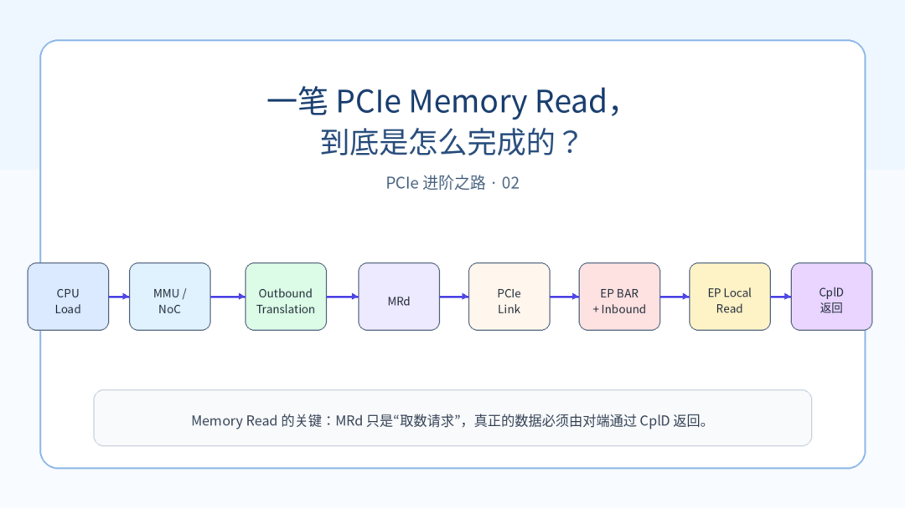

---

## 1.1 先看整条路径：为什么读比写多了一个“返回数据”的过程

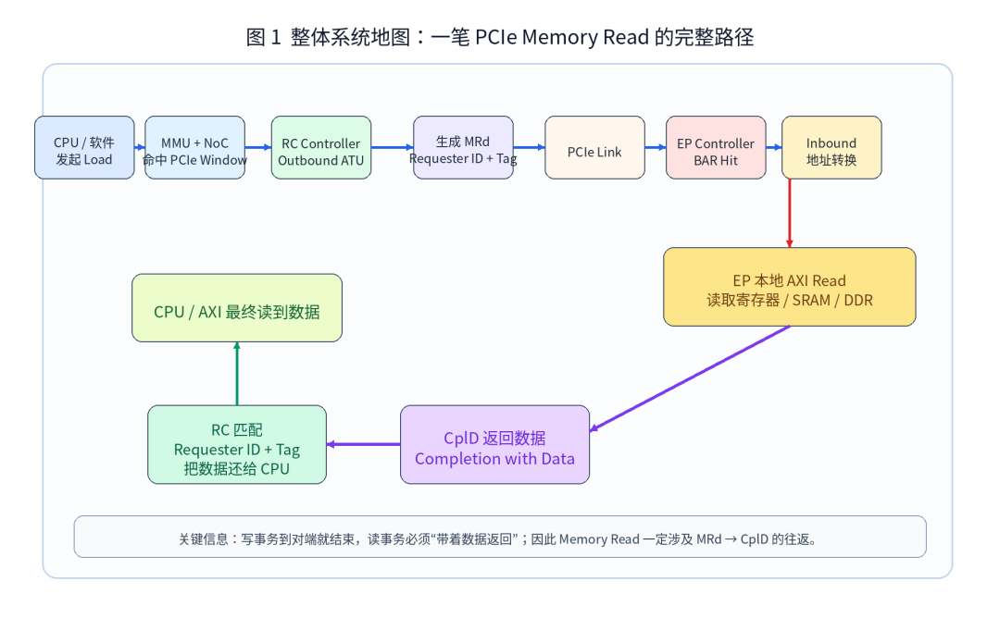

如果把细节都先折叠，读路径可以压缩成：

```
CPU Load
    ↓
MMU + NoC
    ↓
RC Controller / Outbound ATU
    ↓
Memory Read TLP（MRd）
    ↓
PCIe Link
    ↓
Endpoint Controller / BAR Hit
    ↓
Inbound Translation
    ↓
Endpoint 本地 AXI Read
    ↓
得到读数据
    ↓
Completion with Data（CplD）
    ↓
返回 Root Complex
    ↓
用 Requester ID + Tag 匹配原始请求
    ↓
把数据交还给 CPU / AXI
```

和上一篇对比，真正新增加的部分只有一句话：

> **读请求必须“把数据拿回来”。**

这也是为什么 Memory Read 必须比 Memory Write 多出一整套：

- Requester / Completer
- Completion
- Requester ID
- Tag
- Outstanding Request

这些概念其实并不抽象，它们只是为了解决一个现实问题：

> 包发出去了，但数据回来时，系统怎么知道该还给谁？

---

## 1.2 第一步：CPU 发起 Load，本质上仍然是一次本地地址访问

和写事务一样，CPU 在最开始并不知道自己要“做 PCIe”。

它只知道自己要执行一条读操作：

```
value = *(
volatile
volatile
unsigned
unsigned
int
int
 *)
0x40001234
0x40001234
;
```

于是流程依旧从 SoC 内部开始：

```
CPU Virtual Address
        ↓ MMU
SoC Physical Address
        ↓ NoC / Interconnect
找到目标外设
```

如果 SoC 地址地图定义为：

```
0x4000_0000 ~ 0x4000_FFFF → PCIe Root Complex Window
```

那么这笔读操作就会被送进 PCIe Controller，而不是送去 DDR。

这一点特别值得强调，因为很多调试问题第一步就搞错了。

软件层看到的只是：

```
读地址 0x4000_1234
```

但硬件系统真正需要回答的是：

> **这笔地址访问到底有没有命中 PCIe Controller？**

如果连这一步都没进去，后面所有 MRd、CplD、Tag 的讨论都无从谈起。

---

## 1.3 第二步：Outbound 地址转换，把本地地址翻译成 PCIe 地址

进入 RC Controller 后，本地 SoC 地址还需要被翻译成 PCIe 总线地址。

这一步和上一篇完全一样，仍由某种 **Outbound Address Translation** 逻辑来完成。

例如：

```
RC 本地 PCIe Window：0x4000_0000 ~ 0x4000_FFFF
Outbound Target     ：0x8000_0000
EP BAR0             ：0x8000_0000，大小 64 KB
EP Local Target     ：0x2000_0000
```

如果 CPU 读：

```
0x4000_1234
```

那么 RC 侧转换后，会得到：

```
PCIe Address
= 0x8000_0000 + (0x4000_1234 - 0x4000_0000)
= 0x8000_1234
```

这说明：

```
CPU / AXI Address = 0x4000_1234
PCIe Address      = 0x8000_1234
```

不是一个地址概念。

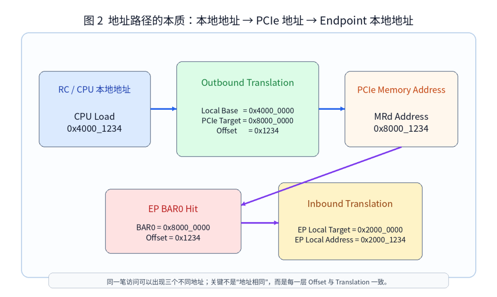

所以当你在波形里看到 TLP Address 是 `0x8000_1234` 时，不要以为软件写错了。

很可能这是完全正确的，因为：

> **软件地址只是本地视图，PCIe TLP 里的地址是总线视图。**

---

## 1.4 第三步：Controller 生成一笔 MRd

地址转换完成后，Controller 会把这笔本地读请求转换成 PCIe Transaction Layer Packet。

这里对应的事务类型就是：

```
Memory Read TLP
简称：MRd
```

和 MWr 最大的差别在于：

- MWr 自己就带着要写的数据
- MRd 只是在说：**“请把这段地址上的数据给我”**

所以你可以粗略理解成：

```
AXI Read Request
Address = 0x4000_1234
        ↓
Outbound Translation
        ↓
PCIe MRd
Address = 0x8000_1234
```

这里必须建立一个核心直觉：

> **MRd 发出去的时候，读数据其实还不在这笔包里。**

它只是一张“取数单”。

真正的数据，要等到对端完成本地读取后，再通过 Completion with Data 送回来。

---

## 1.5 为什么读比写复杂得多？

这一点用一张图就足够直观。

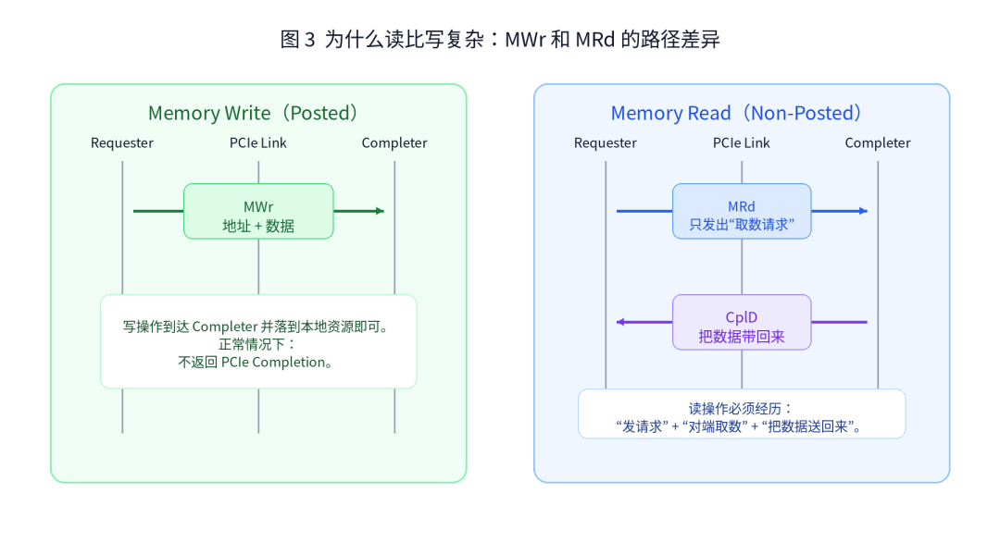

Memory Write：

```
Requester ───────── MWr ─────────→ Completer
```

正常情况下，包送到对端并落地到本地资源，写事务就结束了。

Memory Read：

```
Requester ───────── MRd ─────────→ Completer
Requester ←──────── CplD ───────── Completer
```

所以读路径里多出来的并不是“某一个小字段”，而是整个返回路径：

```
对端取数
→ 生成 Completion
→ 把数据送回
→ 本端匹配原始请求
→ 最终把数据还给 CPU
```

这就是为什么几乎所有复杂的 PCIe 事务机制——比如 Requester ID、Tag、Outstanding——都会优先出现在 Read 路径里。

---

## 1.6 第四步：Endpoint 收到 MRd 后，先 BAR 命中，再去本地取数

MRd 到达 Endpoint 后，对端 Controller 看到的是：

```
这是一个 Memory Read 请求
目标地址 = 0x8000_1234
```

接下来它必须先确认：

> 这段地址是不是属于我这个 Function 暴露的 BAR 空间？

假设：

```
BAR0 Base = 0x8000_0000
BAR0 Size = 64 KB
```

那么：

```
0x8000_1234
```

落在 BAR0 范围内，于是地址命中成功。

然后 Controller 再做 Inbound 地址转换：

```
Offset = 0x8000_1234 - 0x8000_0000 = 0x1234
EP Local AXI Address = 0x2000_0000 + 0x1234 = 0x2000_1234
```

这时，对端内部最终发起的才是一笔本地 AXI Read：

```
AXI Read
Address = 0x2000_1234
```

从这里开始，对端要么去读寄存器，要么去读 SRAM，要么去读 DDR，取决于本地地址映射到了什么资源。

所以需要记住一个顺序：

```
先 BAR Hit
→ 再 Inbound Translation
→ 再本地 AXI Read
```

不是一上来就把 TLP 地址直接丢给本地 AXI。

---

## 1.7 第五步：对端拿到数据之后，要把它装进 CplD

Endpoint 的本地 AXI Read 完成后，对端终于拿到了真正的读数据。

但它还不能直接把本地 AXI 的 `RDATA` 原样扔回 Root Complex。

它需要重新封装成一笔 PCIe Completion：

```
Completion with Data
简称：CplD
```

于是读路径变成：

```
MRd 到达 Endpoint
→ EP 本地 AXI Read
→ 取到数据
→ 生成 CplD
→ CplD 返回给 RC
```

这时候 CplD 里携带的就不仅是“这是一个响应”，还包括：

- 这是谁的响应
- 响应的是哪笔请求
- 带回多少数据
- 读到的实际数据值

到这里，一个新问题自然就来了：

> 如果同时发出了很多个 MRd，返回的 CplD 怎么知道自己属于哪一笔？

这就轮到 **Requester ID 和 Tag** 出场了。

---

## 1.8 Requester / Completer 不是固定角色，而是这笔事务里的角色

在继续讲 Tag 之前，先把一个经常被误解的概念讲清楚。

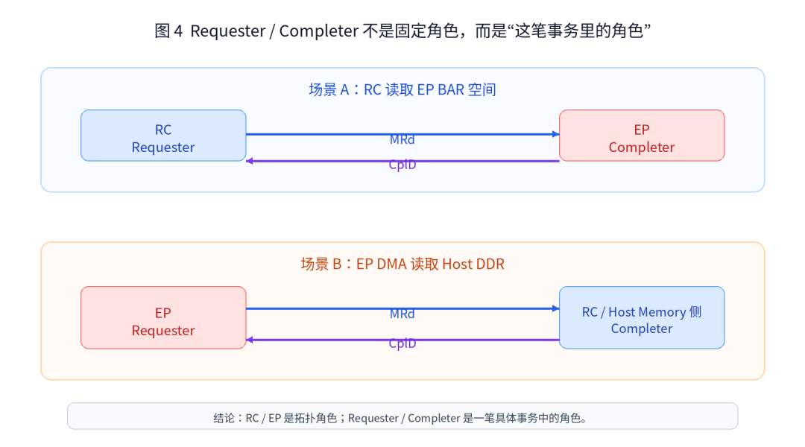

很多初学者会本能地以为：

```
RC 永远是 Requester
EP 永远是 Completer
```

其实不对。

当 RC 读取 EP 的 BAR 空间时：

```
RC = Requester
EP = Completer
```

但如果 EP 自己发起 DMA 去读 Host DDR：

```
EP = Requester
RC / Host Memory 侧 = Completer
```

所以更准确的理解是：

- **RC / EP**：是拓扑角色
- **Requester / Completer**：是某一笔事务里的角色

这两个维度不要混在一起。

---

## 1.9 CplD 返回时，系统靠什么找到原始 MRd？

这就是本篇最关键的机制。

假设 RC 同时发出三笔 MRd：

```
MRd A：Tag = 5，Address = 0x1000
MRd B：Tag = 9，Address = 0x2000
MRd C：Tag = 12，Address = 0x3000
```

Controller 内部会把这些未完成请求记录在一张表里，也就是常说的 **Outstanding Request Table**。

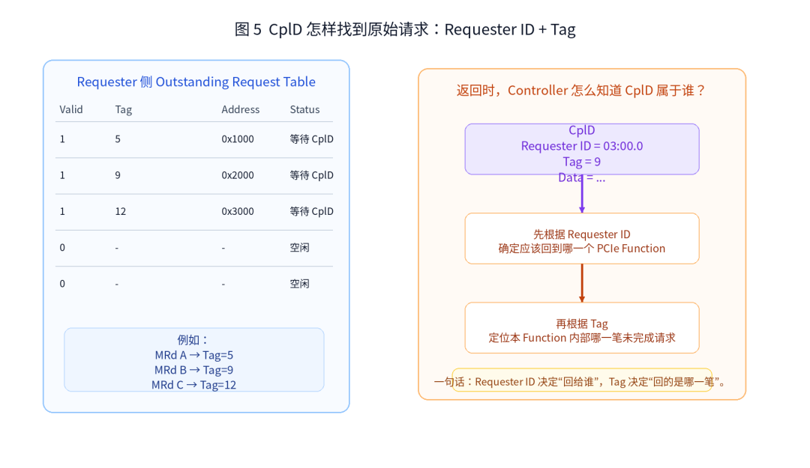

当某个 CplD 返回时，例如：

```
Requester ID = 03:00.0
Tag          = 9
Data         = ...
```

Controller 会先根据 **Requester ID** 确定：

> 这个 Completion 应该回到哪一个 PCIe Function。

然后再根据 **Tag** 确定：

> 它对应的是这个 Function 内部哪一笔未完成请求。

一句话概括：

```
Requester ID 决定“回给谁”
Tag          决定“回的是哪一笔”
```

这样，即使多个读请求的返回顺序发生变化，Controller 也不会搞混。

这就是为什么 PCIe 读请求可以乱序返回，却仍然不会把数据交错给错误的事务。

---

## 1.10 为什么一笔 MRd 可能对应多个 CplD？

除了“多笔 MRd 可能乱序返回”，还有一种更进一步的情况：

> **同一笔 MRd，本身就可能被拆成多个 CplD。**

例如一笔较大的读请求：

```
MRd
Requester ID = 03:00.0
Tag          = 12
Address      = 0x1080
Length       = 256B
```

对端未必一次把 256B 全部送回来。

它完全可能拆成：

```
CplD #1：128B，Tag = 12
CplD #2：128B，Tag = 12
```

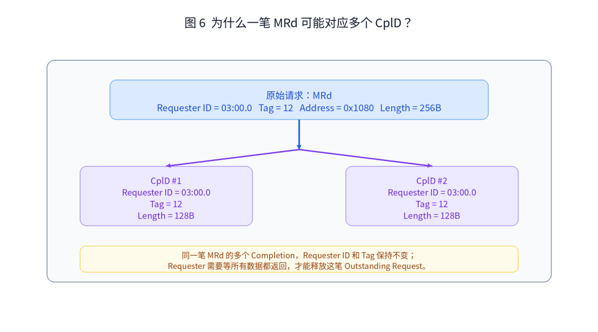

这时有两个重要结论：

1. 同一笔 MRd 拆出来的多个 Completion，**Requester ID 和 Tag 保持不变**。
2. Requester 必须等整笔请求的全部数据都返回，才能真正完成这笔 Outstanding Request。

所以在工程实现里，Tag 不能在“收到第一段数据”后就提前释放。

只有当：

- 所有数据都返回完成，或者
- 这笔请求被明确错误终止

这张 Outstanding 表项才能被清掉。

---

## 1.11 最后一步：RC 匹配完成后，数据怎样回到 CPU？

当 CplD 回到 RC 后，Controller 用 Requester ID + Tag 找到原始请求，再把数据重新交还给 SoC 内部的读路径。

于是整体时序可以抽象成下面这样。

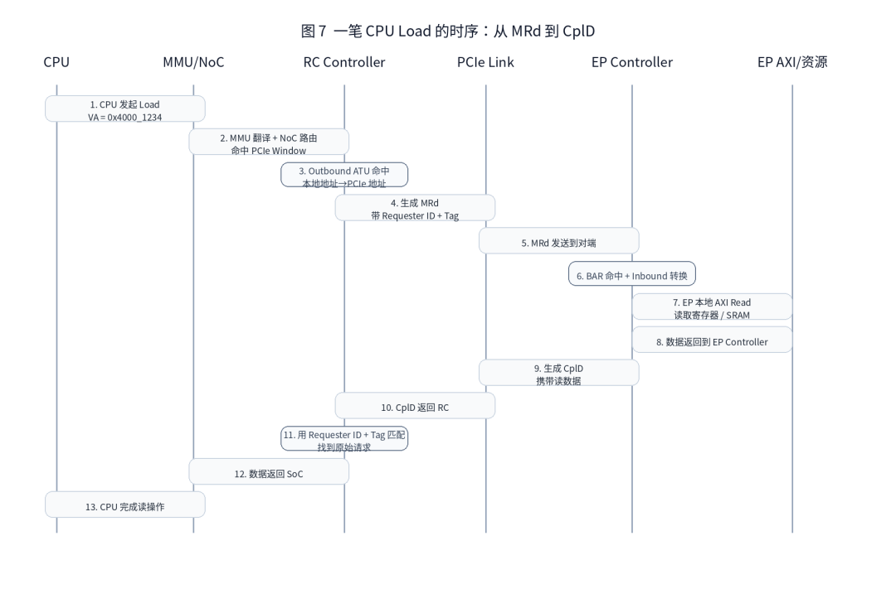

所以，从 CPU 视角看，最终发生的是：

```
CPU 发起 Load
→ 系统等待数据
→ 数据回来
→ CPU / AXI 读完成
```

而在这个“等待数据”的时间窗口里，背后其实已经完成了：

```
本地地址访问
→ PCIe MRd
→ 对端 BAR / Inbound / AXI 取数
→ CplD 返回
→ Requester ID + Tag 匹配
```

这也正是为什么读路径比写路径对延迟、Outstanding 数量、Tag 资源更敏感。

---

## 1.12 为什么 Memory Read 会超时？

一旦理解了整条路径，读超时就不再是“玄学问题”。

它一定是这条链路中某个环节出了问题。

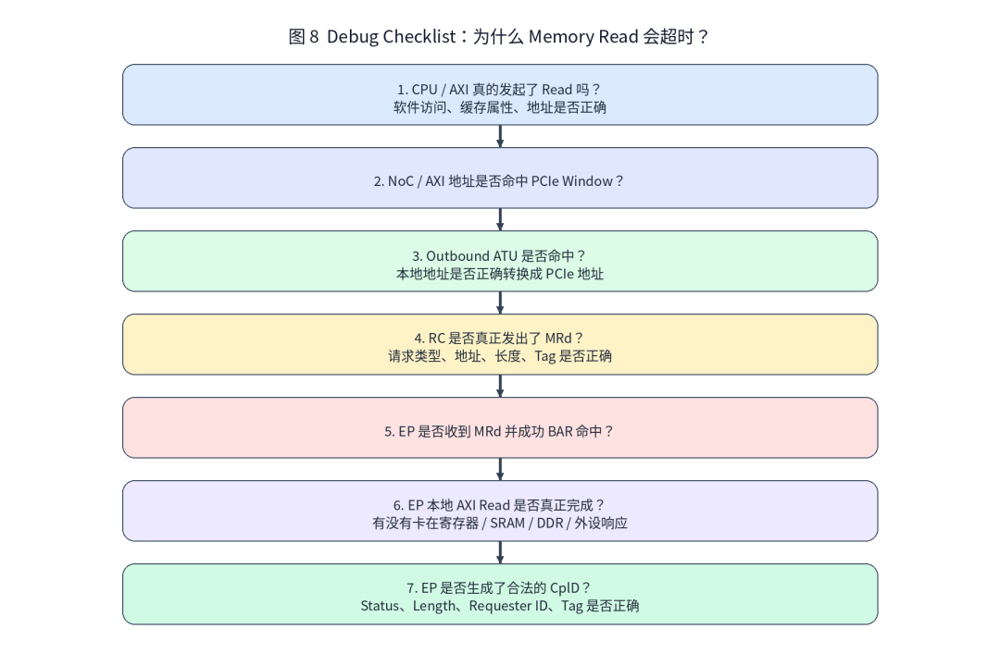

建议固定沿着下面这 7 步查：

### 1.12.1 CPU / AXI 真的发起了 Read 吗？

先看软件访问、地址、缓存属性、总线是否真的有读事务。

### 1.12.2 NoC / AXI 是否命中 PCIe Window？

如果地址地图错了，根本不会进入 PCIe。

### 1.12.3 Outbound ATU 是否命中？

Base / Limit / Target / 类型是否正确。

### 1.12.4 RC 真的发出了 MRd 吗？

检查：

- TLP Type
- 地址
- Length
- Tag
- Requester ID

### 1.12.5 Endpoint 是否收到了 MRd，并正确 BAR 命中？

很多问题在这里就丢了。

### 1.12.6 Endpoint 本地 AXI Read 是否真正完成？

这通常是读路径里最关键的一层。

因为即使链路没问题，如果对端本地寄存器 / SRAM / DDR 响应不了，CplD 也生成不出来。

### 1.12.7 CplD 是否被正确返回并匹配？

检查：

- Completion Status
- Requester ID
- Tag
- Length
- 数据是否完整

一旦这条链路走通，你就能很清楚地区分：

```
是“请求没发出去”
还是“请求到对端了但对端没取到数据”
还是“对端拿到数据了但 CplD 没回来”
还是“CplD 回来了但本端没匹配成功”
```

这才是有工程价值的 PCIe Debug 方法。

---

## 1.13 最容易理解错的 6 个点

## 1.14 误区 1：MRd 发出去时，数据已经在包里了

不是。

MRd 只是在发“读请求”。真正的数据在后续的 CplD 里。

---

## 1.15 误区 2：CplD 只靠顺序匹配

不是。

因为多个读请求完全可能乱序返回。

真正匹配依赖的是：

```
Requester ID + Tag
```

---

## 1.16 误区 3：RC 永远是 Requester

不对。

当 Endpoint 发 DMA 去读 Host 内存时，Requester 就变成了 EP。

---

## 1.17 误区 4：CplD 只会有一个

不一定。

大一些的读请求可能被拆成多个 Completion 返回。

---

## 1.18 误区 5：只要链路是 L0，读就一定不会超时

不对。

L0 只说明链路建好了。

真正的数据路径还可能卡在：

- BAR
- Inbound Translation
- EP 本地 AXI Read
- Completion 生成
- Completion 匹配

---

## 1.19 误区 6：Memory Read 和 Memory Write 只是“一个读、一个写”而已

它们的本质区别比“方向不同”大得多：

```
MWr：Posted，只发出去即可
MRd：Non-Posted，必须等待数据返回
```

所以很多复杂机制天然围绕 Read 路径展开。

---

## 1.20 一张图记住全文

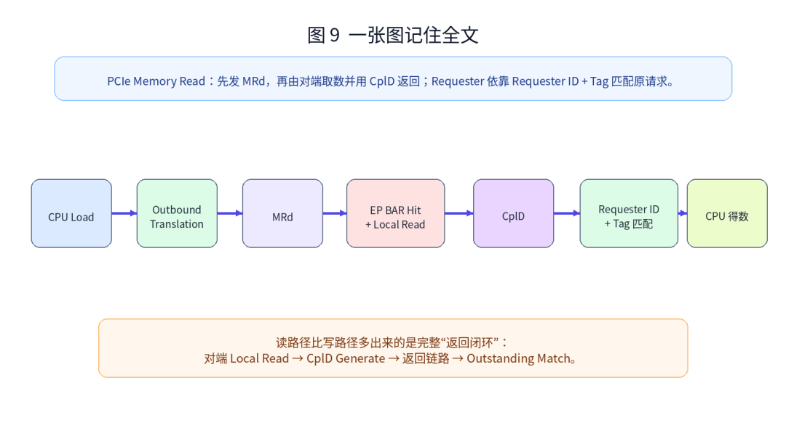

如果只保留一句话，那就是：

> **PCIe Memory Read 的本质，是先发出一笔 MRd 请求，再把数据通过 CplD 送回来；返回时依靠 Requester ID + Tag 找到原始请求。**

以后看到：

```
value = *(
volatile
volatile
uint32_t
uint32_t
 *)addr;
```

如果 `addr` 落在 PCIe Window，脑子里应该自动展开成：

```
CPU Load
→ NoC / AXI
→ Outbound Translation
→ MRd
→ PCIe Link
→ EP BAR Hit
→ EP Local AXI Read
→ CplD
→ Requester ID + Tag 匹配
→ 数据返回 CPU
```

这就是第二篇最想建立的认知模型。

---

## 1.21 后记

技术很重要，技术背后的思想更重要。

理解 PCIe Memory Read，最重要的不是背住几个英文缩写，而是理解这样一个现实事实：

> **请求和数据并不在同一个动作里完成。**

你先把“我要什么数据”告诉对端，再等对端把数据拿回来。

为了在高并发、可乱序的场景下仍然把数据交还给正确的请求，PCIe 才引入了 Requester ID、Tag、Outstanding Request、Completion 这些机制。

下一篇，如果继续顺着这条主线展开，最自然的题目就是：

## 1.22 《PCIe Tag 到底有什么用？为什么 Read 可以乱序返回？》

下一篇可以专门把：

- Tag 生命周期
- Outstanding Request Table
- 多个 CplD
- Completion Timeout
- Unexpected Completion

彻底讲透。

---

## 1.23 参考资料

1. PCI Express Base Specification, Revision 6.0，PCI-SIG。
2. MindShare, *PCI Express System Architecture*。
3. 文中地址与拓扑均为便于理解而构造的示例，不对应某个唯一实现。

---

**知乎专栏：芯片设计进阶之路**
**微信公众号：芯片进阶之路**

---

# 2. PCIe Tag 到底有什么用？为什么 Read 可以乱序返回？

> 来源：https://mp.weixin.qq.com/s/b3skkqaEeaTnIHaFyhJNQA
> 作者：烓围玮未
> update 2026/08/16 03 : 26
> **已截图**

> **《PCIe 进阶之路》第 03 篇** · 不背协议，沿着真实数据路径学 PCIe 公众号：**芯片进阶之路** · 知乎专栏：芯片设计进阶之路 · 作者：烓围玮未

在前两篇文章里，我们已经把两条最核心的数据路径串起来了：

- 第 1 篇：**CPU Store → MWr → 对端 BAR / AXI**
- 第 2 篇：**CPU Load → MRd → 对端取数 → CplD 返回**

到了这里，一个新的问题几乎一定会冒出来：

> **如果同时发出了很多笔 Memory Read，请求返回时，系统怎么知道每个 CplD 属于哪一笔原始 MRd？**

更进一步：

> **为什么 PCIe 允许 Read 请求乱序返回？这样不会把数据搞乱吗？**

这两个问题，正是 **Tag** 存在的原因。

所以第三篇我们不再讲“读请求怎么从 RC 到 EP 再回来”，而是只聚焦一个核心机制：

## 2.1 Tag 到底在解决什么问题？

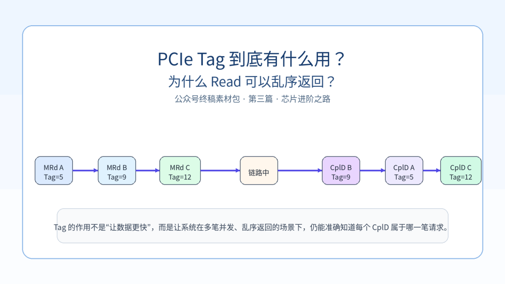

---

## 2.2 如果只有一笔 MRd，其实根本感受不到 Tag 的存在

假设系统里永远只有一笔读请求：

```
MRd A
→ 等待
→ CplD A 返回
```

这种情况下，就算没有 Tag，很多人也会本能地觉得：

> 反正只有一个请求，回来的一定就是它。

这没错。

Tag 真正体现价值的场景，从来不是“只有一笔请求”的世界。

它存在的前提是：

```
多个 Read Request 并发 Outstanding
```

也就是说，请求已经发出去了，但还没完成。

例如：

```
MRd A：读地址 0x1000
MRd B：读地址 0x2000
MRd C：读地址 0x3000
```

如果这三笔请求几乎同时在路上，那么系统就必须回答：

> **当某个 Completion 返回时，我怎么知道它属于 A、B 还是 C？**

这就是 Tag 的起点。

---

## 2.3 先看最直观的问题：为什么不能只靠“返回顺序”？

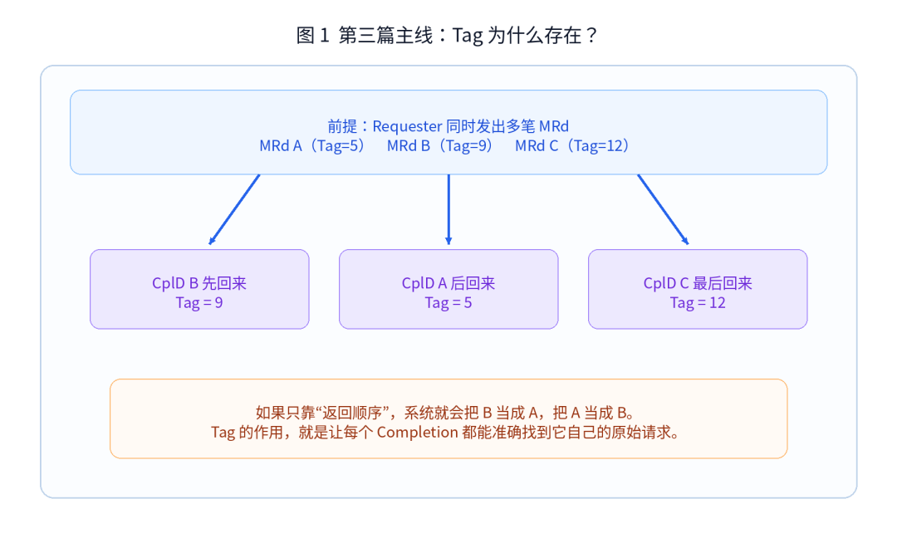

很多初学者第一次接触 Completion 匹配时，会下意识地想：

> 先发的先回，后发的后回，不就行了吗？

如果世界真这么简单，Tag 的重要性就会小很多。

但真实系统不是这样。

同一时间发出的多个 MRd，目标资源的准备时间完全可能不同：

- 某一笔地址已经命中缓存，数据很快准备好
- 某一笔地址需要更长的内部访问路径
- 某一笔地址甚至会被拆成多段返回

因此，谁先返回，本质上取决于：

> **哪一笔请求对应的数据先准备好。**

而不是“谁先发出去”。

所以，PCIe 允许这种情况发生：

```
先发 MRd A
再发 MRd B
最后却先收到 CplD B，再收到 CplD A
```

如果这时系统只靠“返回顺序”去猜，那么结果一定会错。

---

## 2.4 为什么 PCIe 允许 Read 乱序返回？

这个设计并不是为了给实现增加复杂度，而是为了性能。

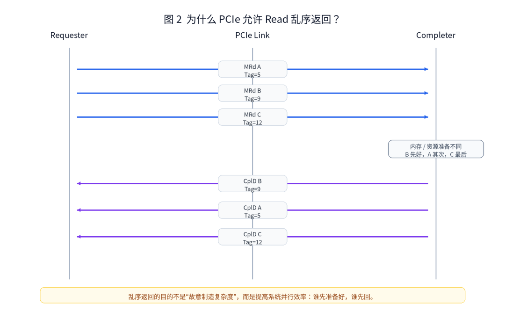

想象下面这个场景：

```
MRd A → 去读一个较慢资源
MRd B → 去读一个已经准备好的资源
MRd C → 去读另一个普通资源
```

如果强制规定：

> **B 就算已经准备好了，也必须等 A 回来之后才能回。**

那会发生什么？

- 链路空着
- 完成包明明能回，却被人为压住
- 并发读的价值被浪费
- 整个系统吞吐变差

因此，PCIe 更倾向于：

```
谁先准备好，谁先回
```

这就是“Read 可以乱序返回”的本质。

也正因为允许乱序，系统才必须有一种机制，能在返回时准确定位原始请求。

这个机制就是：

```
Requester ID + Tag
```

---

## 2.5 Tag 的第一层作用：给每一笔未完成请求一个编号

你可以先把 Tag 想象成：

> **Requester 给每一笔 Outstanding Read Request 发的一张号码牌。**

例如：

```
MRd A → Tag = 5
MRd B → Tag = 9
MRd C → Tag = 12
```

这样，当 Completion 返回时，它不会只说：

```
我带回了一些数据
```

而是会说：

```
我带回的是 Tag = 9 那笔请求的数据
```

于是系统就能知道：

> 这是 MRd B 的 Completion。

这就是 Tag 最朴素、也最重要的作用：

> **让每个返回的 Completion 都能指回它自己的原始请求。**

---

## 2.6 光有 Tag 还不够，为什么还要有 Requester ID？

到了这里，另一个问题自然会出现：

> 如果两个不同设备都用了 Tag=5，难道不会冲突吗？

答案是：

> **会重复，但不冲突。**

因为 Completion 的匹配从来不只靠 Tag 一项。

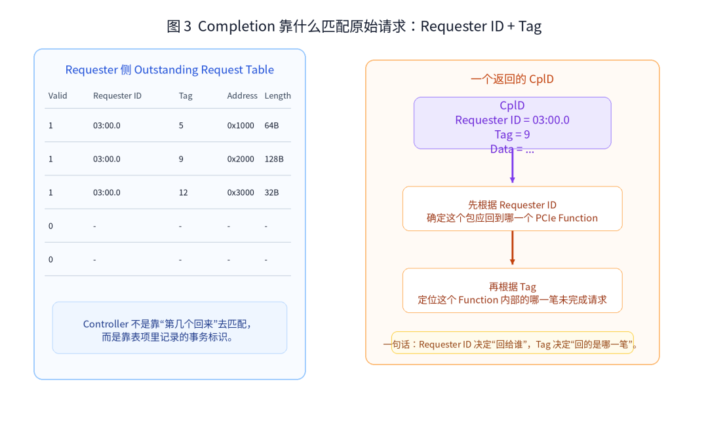

真正起作用的是：

```
Requester ID + Tag
```

你可以把这两个字段分工理解成：

```
Requester ID
→ 这包该回到哪一个 PCIe Function
Tag
→ 回到这个 Function 之后，属于哪一笔未完成请求
```

一句话概括就是：

> **Requester ID 决定“回给谁”，Tag 决定“回的是哪一笔”。**

这就是为什么在协议实现里，我们经常会说：

```
Transaction ID ≈ Requester ID + Tag
```

它们一起决定了一笔 Completion 的归属。

---

## 2.7 Outstanding Request Table：Tag 真正落地的地方

Tag 不是一个空洞的概念，它最终一定会落到某种实现结构里。

最常见的抽象就是：

```
Outstanding Request Table
```

也就是“未完成请求表”。

当 Requester 发出一笔新的 MRd 时，通常会做几件事：

1. 找一个空闲 Tag
2. 把这笔请求的信息写进 Outstanding Table
3. 把 MRd 发到 PCIe 链路
4. 等待后续 Completion 返回

表里一般会记录：

- Requester ID
- Tag
- 请求地址
- 请求长度
- 本地目标
- 当前状态

这样，当 CplD 返回时，Controller 才能根据：

```
Requester ID + Tag
```

在表中准确找到对应的那一行。

所以，Tag 的意义并不是“一个抽象数字”，而是：

> **它是 Controller 跟踪 Outstanding Read Request 的关键索引。**

---

## 2.8 Tag 的第二层作用：支持高并发读

有了 Tag 之后，Requester 就不需要这样工作：

```
发一笔 MRd
等回来
再发下一笔
再等回来
```

它可以更激进地工作：

```
连续发很多笔 MRd
每一笔都分配不同 Tag
把它们都挂进 Outstanding Table
谁先回来就先完成谁
```

这正是现代 PCIe 高吞吐读路径的基础。

换句话说，Tag 让系统拥有了这样一种能力：

> **在多个请求同时在途的情况下，仍然能把每个 Completion 正确还给原始请求。**

如果没有 Tag，那么系统就会被迫回到极低效的串行模式。

所以可以说：

```
Tag 并不直接“搬运数据”
但它支撑了高并发、可乱序、可并行的读事务模型
```

---

## 2.9 Tag 的生命周期：从空闲到释放

Tag 不能只是“分配一下就完了”，它本身也有生命周期。

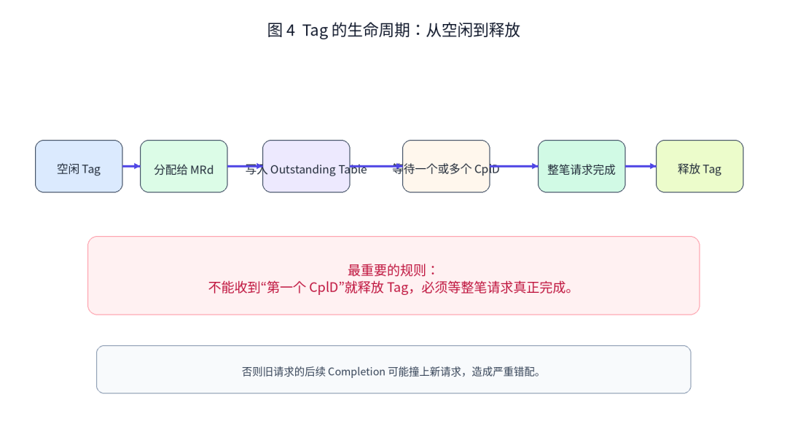

一笔典型的 Read Request，其 Tag 一般会经历：

```
空闲
→ 分配给一笔 MRd
→ 写入 Outstanding Table
→ 等待一个或多个 Completion
→ 整笔请求完成
→ 释放 Tag
```

这里最重要的一条规则是：

> **不能只因为收到“一个 Completion”就立刻释放 Tag。**

你必须确认：

- 这笔请求对应的所有数据都已经返回，或者
- 这笔请求已经被明确地以错误方式终止

否则，过早释放 Tag 会带来严重后果。

---

## 2.10 为什么一笔 MRd 可能不止一个 CplD？

这也是很多人第一次接触 PCIe Completion 时会忽略的点。

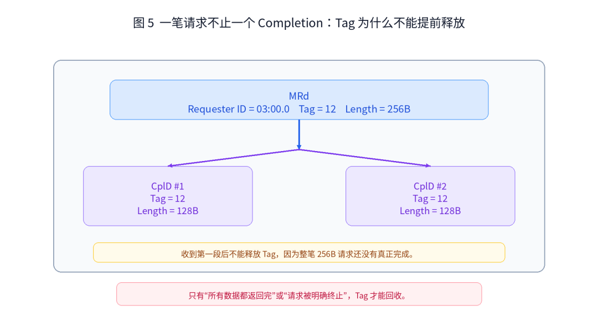

假设：

```
MRd
Requester ID = 03:00.0
Tag          = 12
Length       = 256B
```

这笔请求完全可能被拆成：

```
CplD #1：128B，Tag = 12
CplD #2：128B，Tag = 12
```

于是就出现了一个非常关键的实现要求：

> **收到第一段数据之后，Tag 仍然不能释放。**

因为整笔 256B 请求还没有真正完成。

如果你在收到第一个 CplD 时就把 Tag=12 释放掉，并把它重新分给新的请求，那么当旧请求的第二个 CplD 返回时，就会撞上新请求，造成极难调试的错配错误。

因此：

> **Tag 的释放条件不是“收到过 Completion”，而是“整笔请求已经完成”。**

---

## 2.11 Tag 满了，是不是 PCIe 出故障了？

这个问题非常经典。

很多人看到“所有 Tag 都处于 Outstanding”时，会本能地觉得：

> 糟了，系统卡死了。

其实不一定。

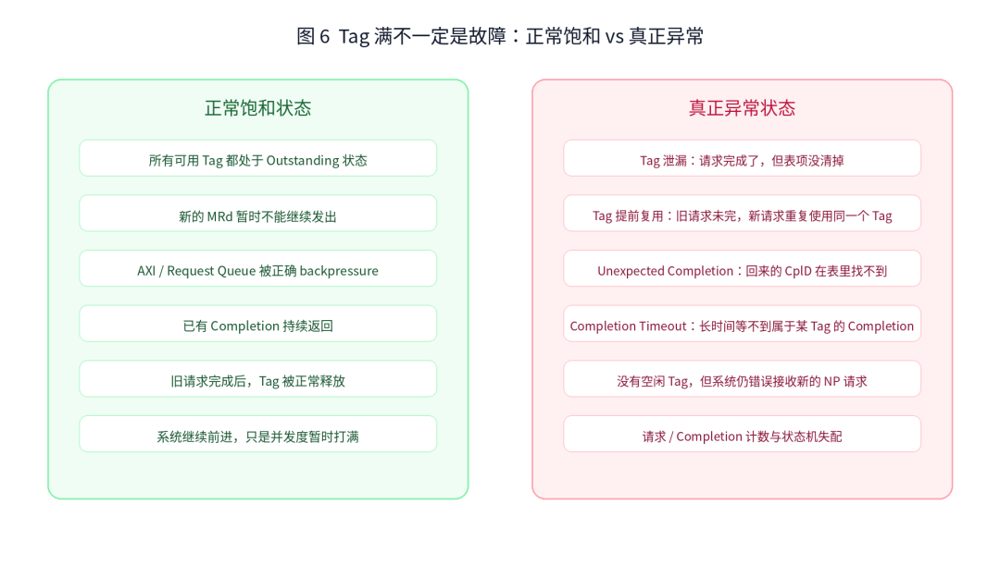

要分两种情况：

## 2.12 正常饱和状态

这是完全可能的正常行为：

- 所有可用 Tag 都被已发出的 MRd 占用
- 新的 MRd 暂时不能继续发
- AXI / Request Queue 被正确 backpressure
- 已有 Completion 持续返回
- 老请求完成后，Tag 被释放
- 系统继续前进，只是当前并发度打满了

这种状态不是故障，只是：

> **Tag 资源暂时用满了。**

## 2.13 真正异常状态

真正需要警惕的是这些情况：

- **Tag 泄漏**：请求完成了，但表项没清掉
- **Tag 提前复用**：旧请求没完成就被新请求占用
- **Unexpected Completion**：回来的 Completion 在表里根本找不到
- **Completion Timeout**：长时间等不到某个 Tag 对应的 Completion
- **没有空闲 Tag，但设计仍错误地接收新的请求**

所以要把：

```
Tag 满
```

和：

```
Tag 管理出错
```

明确区分开。

---

## 2.14 乱序返回 + 多个 Completion + 生命周期，构成了 Tag 的完整意义

到这里，Tag 的作用其实已经完整了。

如果只分条记忆，可以总结成三句话：

### 2.14.1 Tag 给每笔 Outstanding Read Request 一个编号

这样返回时不会搞不清属于哪一笔。

### 2.14.2 Tag 让系统能支持多个并发 Read 并允许乱序返回

谁先准备好，谁先回，性能更高。

### 2.14.3 Tag 必须和 Outstanding Table 一起管理

它不是一个“发出去就忘”的字段，而是本端状态机的一部分。

---

## 2.15 Debug 时，最应该围绕 Tag 查什么？

如果你的问题已经不再是“链路起不来”，而是这种更偏事务层的现象：

- MRd 发出去了，但 Completion 经常匹配错
- Completion 超时
- 某些请求偶发丢失
- 乱序场景才出问题
- 大包读请求偶发异常

那么你就应该把视角切到 Tag / Outstanding 这一层。

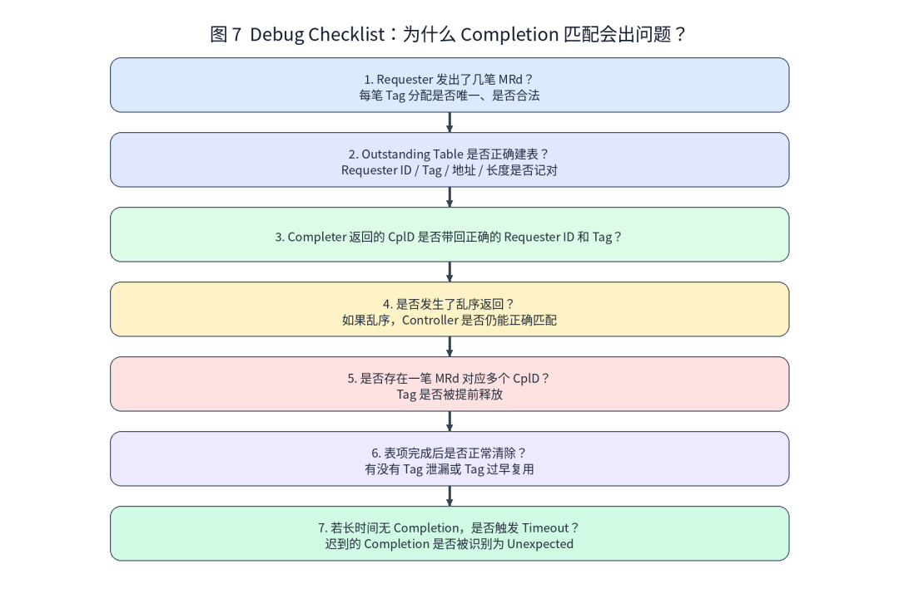

建议重点查这 7 个点：

### 2.15.1 Tag 分配是否唯一？

同一时刻并发 Outstanding 的请求，Tag 是否出现了重复使用。

### 2.15.2 Outstanding Table 是否正确建表？

Requester ID、Tag、地址、长度是否都正确记录。

### 2.15.3 返回的 Completion 是否带回了正确的 Requester ID 和 Tag？

这是最基本的对包核查。

### 2.15.4 如果 Completion 乱序返回，Controller 是否仍能正确匹配？

不要假设返回顺序永远和请求顺序一致。

### 2.15.5 如果一笔请求被拆成多个 CplD，Tag 是否被提前释放？

这类问题非常常见，也最隐蔽。

### 2.15.6 请求完成后，表项是否正常清除？

否则就会出现 Tag 泄漏。

### 2.15.7 超时和迟到 Completion 如何处理？

如果请求已经 Timeout，但迟到的 Completion 仍然回来了，它往往会变成：

```
Unexpected Completion
```

这时就必须确认设计是否按预期处理了这种场景。

---

## 2.16 最容易理解错的 6 个点

## 2.17 误区 1：Tag 是为了“加速链路”

不准确。

Tag 不是物理层加速机制，它本质上是事务层的请求跟踪机制。

---

## 2.18 误区 2：Tag 在整个 PCIe 系统里必须全局唯一

不对。

不同 Requester 可以使用相同 Tag，只要它们的 Requester ID 不同即可。

---

## 2.19 误区 3：乱序返回是一种异常行为

不是。

在满足协议规则的前提下，Read Completion 乱序返回是正常的、甚至是高性能系统希望出现的行为。

---

## 2.20 误区 4：只收到一个 Completion，说明这笔请求可以结束了

不一定。

一笔较大的 MRd 完全可能对应多个 CplD。

---

## 2.21 误区 5：Tag 满就一定是故障

不对。

如果只是并发度打满、请求在正常流动、Backpressure 也正常，那只是资源暂时用满。

---

## 2.22 误区 6：Tag 可以脱离 Outstanding Table 单独理解

也不对。

Tag 的真实意义，只有放进“未完成请求跟踪”这个上下文里才完整。

---

## 2.23 一张图记住全文

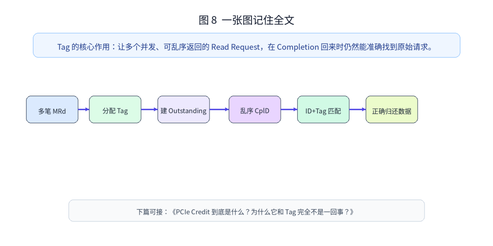

如果只保留一句话，那就是：

> **Tag 的核心作用，是让多个并发、可乱序返回的 Read Request，在 Completion 回来时仍然能准确找到原始请求。**

因此，每次看到：

```
MRd A、MRd B、MRd C 同时在路上
```

脑子里都应该自动联想到：

```
给每笔请求分配不同 Tag
→ 写入 Outstanding Table
→ Completion 回来时用 Requester ID + Tag 匹配
→ 谁先回来就先完成谁
```

这就是 PCIe Tag 的本质。

---

## 2.24 后记

技术很重要，技术背后的思想更重要。

Tag 之所以值得单独讲一篇，不是因为它本身有多复杂，而是因为它恰好暴露了 PCIe 的一个核心哲学：

> **协议设计不是为了“看起来整齐”，而是为了在高并发、可乱序、真实复杂的系统里，仍然能准确地跟踪每一笔事务。**

理解了 Tag，你就真正迈进了 PCIe 事务层的核心地带。

下一篇如果继续顺着这个脉络展开，最自然的题目就是：

## 2.25 《PCIe Credit 到底是什么？为什么它和 Tag 完全不是一回事？》

因为接下来最容易混淆的一对概念，正是：

- Tag：跟踪未完成事务
- Credit：反映接收缓冲资源

很多初学者会把这两个东西混在一起。下一篇正好把它们彻底分开。

---

## 2.26 参考资料

1. PCI Express Base Specification, Revision 6.0，PCI-SIG。
2. MindShare, *PCI Express System Architecture*。
3. 文中地址、Tag 数字与拓扑均为便于理解而构造的示例。

---

**知乎专栏：芯片设计进阶之路**
**微信公众号：芯片进阶之路**

---

# 3. CPU 写一个地址，PCIe 到底发生了什么？

> 来源：https://mp.weixin.qq.com/s/8_op-4qJpRJuGgVTVjEeLw
> 作者：烓围玮未
> update 2026/08/16 03 : 37
> **已截图**


> **《PCIe 进阶之路》第 01 篇** · 不背协议，沿着真实数据路径学 PCIe 公众号：**芯片进阶之路** · 知乎专栏：芯片设计进阶之路 · 作者：烓围玮未
>
> 这篇文章不从 PCIe 三层协议开始背概念，而是只追一笔最普通的 CPU Store： **它怎样从 SoC 内部的一次 AXI 写，变成一笔 PCIe Memory Write，再落到另一颗芯片内部的寄存器。**

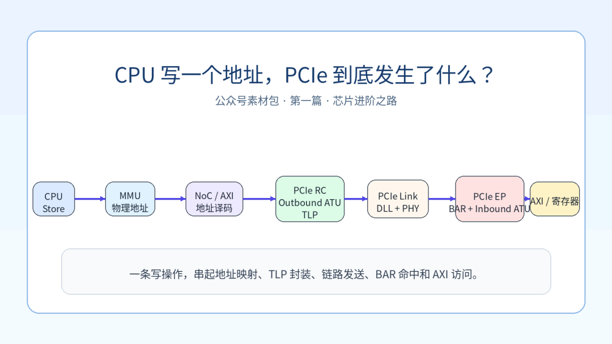

---

## 3.1 先问一个很具体的问题

假设软件里有这样一行代码：

```
*(
volatile
volatile
unsigned
unsigned
int
int
 *)
0x40001234
0x40001234
 =
0x55AA
0x55AA
;
```

如果 `0x4000_1234` 这段地址不是 DDR，也不是片上 UART、SPI，而是被系统映射成了一个 PCIe Root Complex 的访问窗口，那么这条看起来再普通不过的 `Store` 指令，最终可能会让板子另一端一颗 PCIe Endpoint 芯片中的某个寄存器变成 `0x55AA`。

这里真正值得想明白的问题是：

> **CPU 写的是本地地址，为什么最后能改到另一颗芯片里的寄存器？**

很多 PCIe 概念——BAR、ATU、TLP、Memory Write、AXI、Controller、PHY——其实都可以沿着这一个问题串起来。

先看完整路径。

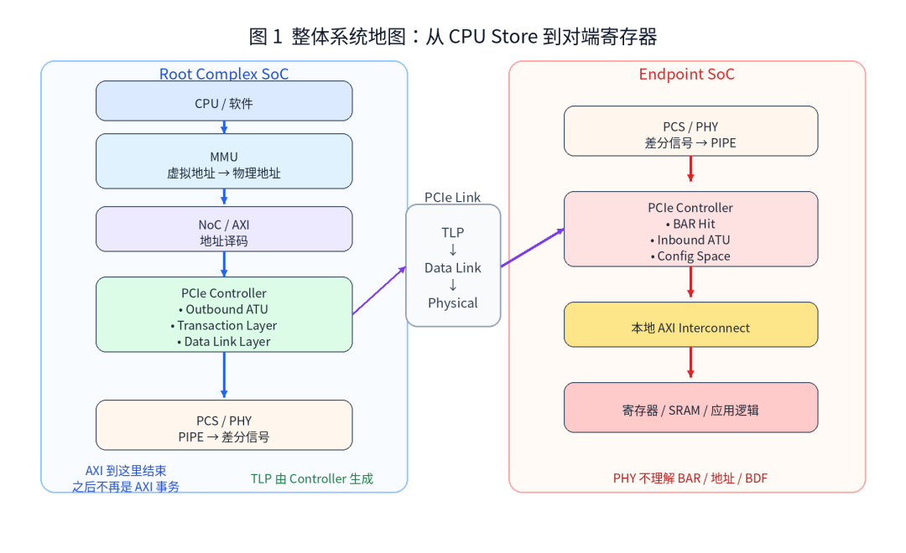

如果先忽略所有协议细节，整条链路可以压缩成：

```
CPU / 软件
    ↓
MMU
    ↓
NoC / AXI
    ↓
PCIe Root Complex
    ↓
Outbound 地址转换
    ↓
Memory Write TLP
    ↓
PCIe Link
    ↓
Endpoint Controller
    ↓
BAR 命中
    ↓
Inbound 地址转换
    ↓
本地 AXI
    ↓
寄存器 / SRAM / 应用逻辑
```

理解这条路径以后，PCIe 就不再是一堆零散名词，而是一套连续的“事务翻译系统”。

---

## 3.2 第一步：CPU 发起的其实只是一次本地访存

CPU 本身并不知道“我要发 PCIe”。

它只知道：

> 我要把数据 `0x55AA` 写到某个地址。

如果系统开启了 MMU，那么 CPU 最开始使用的可能还是虚拟地址。经过页表翻译后，它得到一个 SoC 物理地址，然后交给片内 NoC / AXI Interconnect。

可以先建立这样一个模型：

```
CPU Virtual Address
        ↓ MMU
SoC Physical Address
        ↓ NoC / Interconnect
DDR / PCIe / UART / SPI / ...
```

真正决定这笔访问去 DDR，还是去 PCIe Controller 的，是 **SoC 地址地图和片内地址译码**。

例如：

```
0x0000_0000 ~ 0x3FFF_FFFF  → DDR
0x4000_0000 ~ 0x4000_FFFF  → PCIe RC Window
0x5000_0000 ~ 0x5000_FFFF  → 其他外设
```

这时 CPU 写：

```
0x4000_1234 = 0x55AA
```

NoC 看见地址落在 PCIe Window，就把这笔 AXI 写送到 PCIe Root Complex。

这里有一个很重要的工程直觉：

> **PCIe 访问首先仍然是 SoC 内部的一笔地址访问。**

所以以后遇到“CPU 写 PCIe 设备没有反应”，不要一上来就查 PHY。

第一件事应该先确认：

> 这笔地址真的打到 PCIe Controller 了吗？

---

## 3.3 第二步：本地地址还不是 PCIe 总线地址

这时 Controller 收到的是一个 SoC 本地地址，例如：

```
0x4000_1234
```

但 Endpoint 在 PCIe 地址空间里对应的地址可能是：

```
0x8000_1234
```

这两个地址显然不是一个东西。

因此，大多数 SoC / PCIe Controller 实现中都会存在某种 **Outbound Address Translation** 机制。不同厂商名字可能不同，常见实现会叫：

- Outbound ATU
- iATU
- Address Translation Window
- PCIe Outbound Region

本质都是一回事：

> **把本地 SoC 地址空间，映射到 PCIe 地址空间。**

看一个最简单的例子。

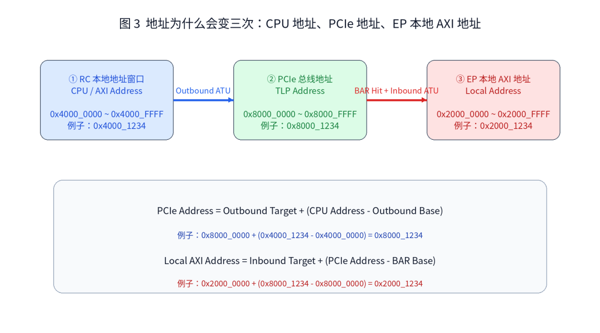

假设：

```
RC 本地 PCIe Window：
0x4000_0000 ~ 0x4000_FFFF
Outbound Target：
0x8000_0000
EP BAR0：
0x8000_0000，大小 64 KB
EP 本地目标地址：
0x2000_0000
```

CPU 写：

```
0x4000_1234
```

Outbound 地址转换后：

```
PCIe Address
= 0x8000_0000
+ (0x4000_1234 - 0x4000_0000)
= 0x8000_1234
```

于是，同一次访问已经出现了两个不同的地址：

```
CPU / AXI Address = 0x4000_1234
PCIe Address      = 0x8000_1234
```

这就是很多初学者理解 PCIe 地址映射时最容易卡住的地方：

> **CPU 看到的地址，不一定就是 TLP 里真正携带的 PCIe 地址。**

---

## 3.4 第三步：AXI Write 在 Controller 里变成 Memory Write TLP

到这里为止，我们都还在 SoC 内部。

Controller 收到一笔 AXI 写后，需要把它“翻译”成 PCIe 能理解的事务。

对于“CPU 写 Endpoint 的 BAR Memory Space”这个场景，最典型的是：

```
Memory Write TLP
简称：MWr
```

Controller 会根据这笔本地事务，构造出 PCIe Transaction Layer Packet。

一个 MWr 至少需要表达：

- 这是什么类型的事务
- 目标 PCIe 地址
- 数据长度
- Byte Enable
- Payload 数据
- 相关属性

可以粗略理解为：

```
AXI Write
Address = 0x4000_1234
Data    = 0x0000_55AA
        ↓
Outbound Translation
        ↓
PCIe Memory Write TLP
Address = 0x8000_1234
Data    = 0x0000_55AA
```

这里必须建立一个非常清晰的边界：

> **AXI 到 Controller 为止。**

PCIe 链路上不会直接传：

```
AWADDR
AWVALID
WVALID
BRESP
```

这些都是片内 AXI 协议的概念。

Controller 对外送出去的是 PCIe 事务。

---

## 3.5 第四步：为什么 Memory Write 不需要 Completion？

这是理解 PCIe 事务类型时非常关键的一点。

普通 Memory Write 属于：

> **Posted Request**

也就是说：

```
Requester ───────── MWr ─────────→ Completer
```

正常情况下不会再返回一个 PCIe Completion。

对比 Memory Read：

```
Requester ───────── MRd ─────────→ Completer
Requester ←──────── CplD ───────── Completer
```

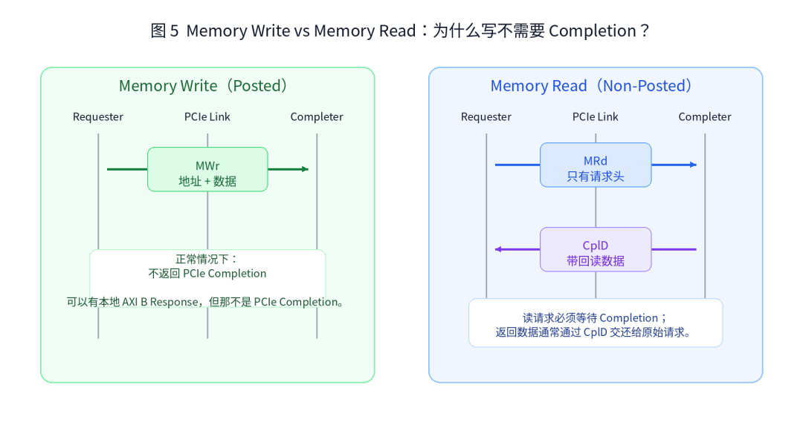

为什么写操作这样设计？

因为如果每一笔 Memory Write 都必须返回 Completion，那么高吞吐写流量会额外产生大量响应包。

PCIe 选择了另一种设计：

```
Memory Write
→ Posted
→ 正常情况下不返回 Completion
```

而：

```
Memory Read
→ Non-Posted
→ 必须返回 Completion with Data
```

这里再强调一个特别容易混淆的点：

> **PCIe 没有返回 Completion，不代表 Endpoint 内部没有 AXI B Response。**

Endpoint 内部如果最终把这笔写转换成本地 AXI Write，AXI Slave 仍然可能返回 `BRESP`。

但：

```
AXI B Response
≠
PCIe Completion
```

它们属于完全不同的协议层级。

---

## 3.6 第五步：PCIe 差分线上到底传的是什么？

TLP 生成以后，还要继续经过 Data Link Layer 和 Physical Layer。

所以真正跨过板级链路的是：

```
TLP
  ↓
Data Link Layer 处理
  ↓
Physical Layer 处理
  ↓
高速差分信号
```

而不是：

- AXI 地址线
- BAR 信号
- APB 地址
- `valid / ready`
- “直接裸着飞”的 C 语言地址

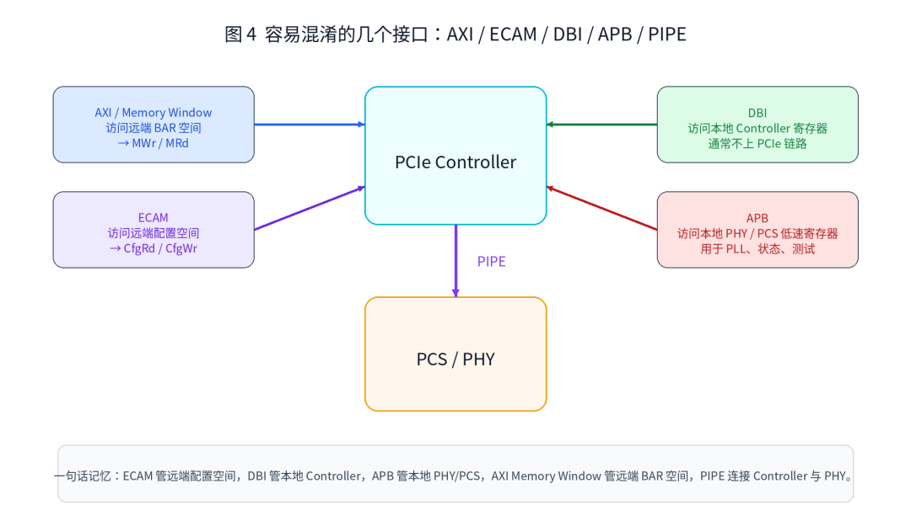

对做 SoC 集成的人来说，可以先把几个接口粗暴地分成：

```
AXI / Memory Window
→ SoC 内部普通数据访问
ECAM
→ 远端 PCIe 配置空间访问
DBI（部分 Controller 厂商常用叫法）
→ 本地 Controller 配置/状态访问
APB
→ 本地 PHY / PCS 等低速配置
PIPE
→ Controller 与 PCS / PHY 之间的专用接口
```

需要注意：

> DBI、APB、ATU 等具体名字和接口形式会因 IP 厂商而不同，但“本地控制面、远端配置面、正常数据面、PHY 接口”这几个逻辑边界是通用的。

---

## 3.7 第六步：Endpoint 收到 TLP 后，为什么要先看 BAR？

现在这笔 MWr 已经到了 Endpoint。

TLP 里面带着：

```
PCIe Address = 0x8000_1234
```

Endpoint 不能直接把这个地址送进自己的 AXI。

它首先要判断：

> **这个地址到底是不是属于我这个 Function？**

这里就轮到 BAR 登场了。

假设：

```
BAR0 Base = 0x8000_0000
BAR0 Size = 64 KB
```

那么：

```
0x8000_1234
```

落在 BAR0 范围内。

于是 Controller 知道：

> 这是一笔命中 BAR0 的 Memory Request。

接下来再做 Inbound 地址转换。

例如：

```
PCIe Address = 0x8000_1234
BAR0 Base    = 0x8000_0000
```

得到 BAR 内偏移：

```
Offset = 0x1234
```

如果 Endpoint 本地映射目标是：

```
0x2000_0000
```

那么最终本地 AXI 地址就是：

```
0x2000_1234
```

所以这笔事务完整地经历了：

```
CPU Address   : 0x4000_1234
        ↓
PCIe Address  : 0x8000_1234
        ↓
EP AXI Address: 0x2000_1234
```

这三个地址完全可以不同。

但它们代表的是同一次业务访问。

---

## 3.8 最后一步：又变回一笔本地 AXI Write

经过 BAR 命中和 Inbound Translation 后，Endpoint Controller 最终可以在本地侧重新生成一笔 AXI 写。

例如：

```
AXI Address = 0x2000_1234
AXI Data    = 0x55AA
```

如果这个地址对应一个控制寄存器，那么寄存器最终被更新。

到这里，一笔 CPU Store 才真正完成了我们关心的数据路径：

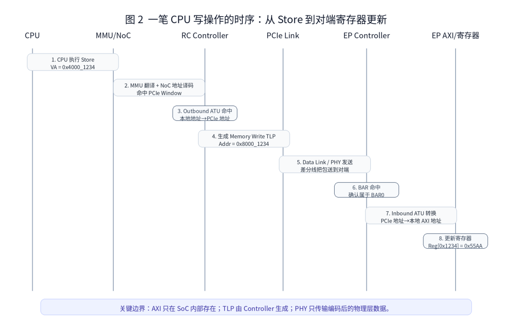

把全文压缩成一句话：

> **CPU 的本地地址访问，被 RC 翻译成 PCIe Memory Write TLP；TLP 经过链路到达 EP 后，再由 BAR 和 Inbound Translation 重新落成本地 AXI 访问。**

这就是 PCIe Controller 做的最核心工作之一：

> **把两个不同芯片内部的本地总线事务，通过 PCIe Transaction 连接起来。**

---

## 3.9 为什么这条路径对 Debug 特别重要？

因为“CPU 写了但对端没反应”并不是一个问题。

它可能是七个完全不同的问题。

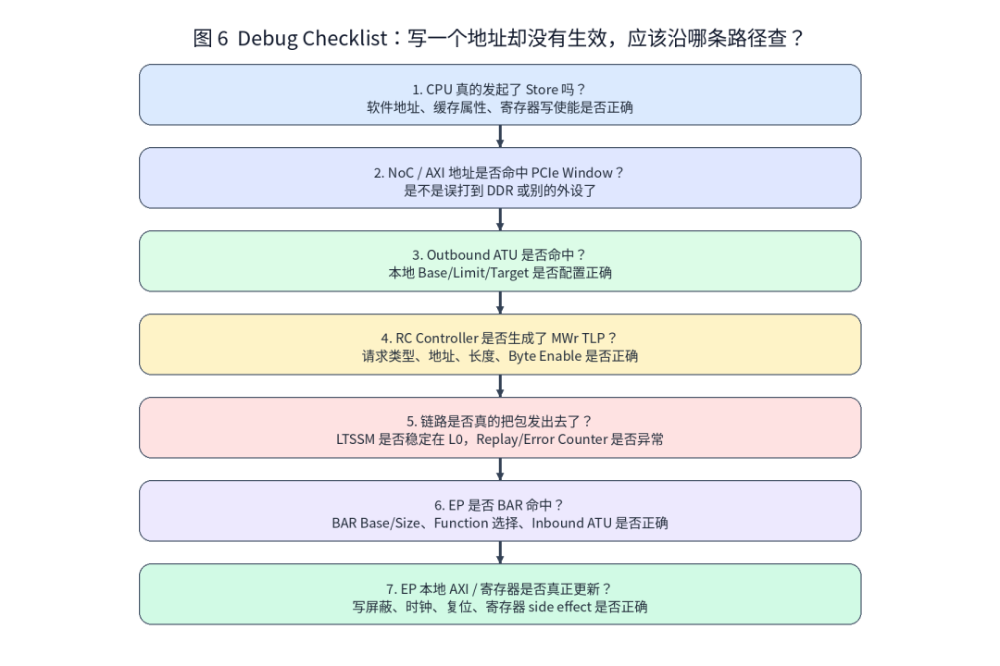

建议以后固定按这条路径查：

### 3.9.1 CPU 真的发起 Store 了吗？

检查：

- 软件地址
- MMU 映射
- Cache / Device 属性
- 写操作是否被优化
- 访问权限

### 3.9.2 NoC / AXI 真的命中 PCIe Window 了吗？

如果地址地图错了，访问甚至不会进入 PCIe Controller。

### 3.9.3 Outbound Translation 命中了吗？

重点看：

- Base
- Limit
- Target
- Region Enable
- Memory / Config 类型

### 3.9.4 Controller 真的生成 MWr 了吗？

检查：

- TLP Type
- Address
- Length
- Byte Enable
- Payload

### 3.9.5 链路真的把包发出去了么？

这时才开始看：

- Link 是否稳定在 L0
- Replay / Error Counter
- Link 是否反复 Recovery

### 3.9.6 Endpoint 是否 BAR Hit？

重点看：

- BAR Base
- BAR Size
- Function
- Memory Space Enable
- Inbound Translation

### 3.9.7 本地 AXI / 寄存器真的写成功了吗？

最后再看：

- AXI 握手
- Slave 是否响应
- 寄存器写保护
- Clock / Reset
- Side Effect

真正高效的 PCIe Debug 方法不是：

> 猜“可能是 PHY”“可能是 ATU”。

而是：

> **跟着一笔事务，看它到底消失在哪一级。**

---

## 3.10 最容易理解错的 5 个地方

## 3.11 误区 1：AXI 会直接跨芯片传输

不会。

AXI 是 SoC 内部总线协议。

跨 PCIe Link 传的是 PCIe 协议数据。

---

## 3.12 误区 2：PHY 知道 BAR 和地址

PHY 不负责理解：

- BAR
- BDF
- Memory Read / Write 语义
- Configuration Space

这些属于 Controller / PCIe 协议逻辑。

PHY 更关心：

- 串并转换
- CDR
- Equalization
- Electrical Idle
- 差分电气发送与接收

---

## 3.13 误区 3：BAR 就是一段内存

不准确。

BAR 首先是 Configuration Space 中的 Base Address Register。

它描述/保存的是：

> 这个 PCIe Function 暴露的一段地址窗口。

真正的 SRAM、寄存器或 DDR，可以位于这段 BAR Window 后面。

---

## 3.14 误区 4：MWr 没有 Completion，所以无法判断链路是否可靠

Memory Write 不返回事务层 Completion。

但 PCIe 链路本身仍然有自己的可靠传输机制。

因此：

```
“没有 Completion”
≠
“链路不做错误检测和重传”
```

这是事务层和数据链路层职责不同导致的。

---

## 3.15 误区 5：写失败优先查 PHY

如果链路已经稳定 Link Up，那么大量“访问不生效”问题其实发生在：

```
Address Map
ATU
TLP Generation
BAR
Inbound Translation
AXI
Register
```

PHY 只是整条路径的一部分。

---

## 3.16 一张图记住全文

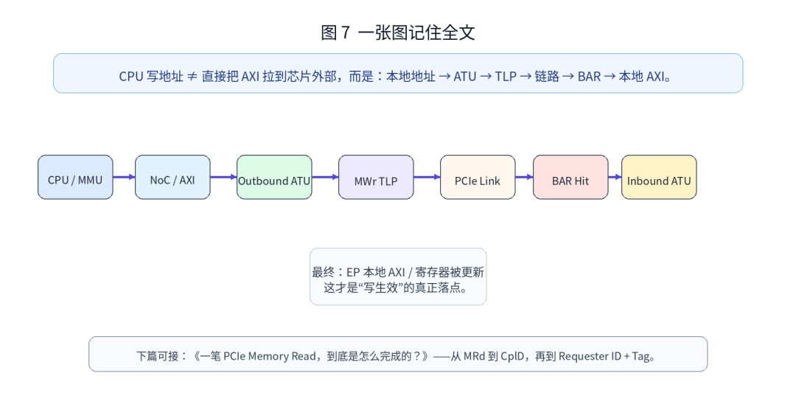

以后看到一句：

```
*(
volatile
volatile
uint32_t
uint32_t
 *)addr = data;
```

如果 `addr` 对应 PCIe Window，脑子里应该自动展开成：

```
CPU Store
   ↓
MMU
   ↓
NoC / AXI
   ↓
PCIe RC Window
   ↓
Outbound Translation
   ↓
Memory Write TLP
   ↓
PCIe Link
   ↓
Endpoint BAR Hit
   ↓
Inbound Translation
   ↓
Local AXI
   ↓
Register / SRAM / DDR
```

这张图比死记几十个 PCIe 名词更重要。

因为后面我们学习：

- BAR
- ATU
- TLP
- Tag
- Credit
- Completion
- LTSSM
- PIPE
- PCS / PHY

其实都只是在逐渐把这条主路径展开。

---

## 3.17 后记

技术很重要，技术背后的思想更重要。

PCIe 最值得理解的，并不是“规范里有多少种包”，而是：

> **不同芯片内部有各自独立的地址空间和总线协议，PCIe Controller 如何把一边的本地事务，转换成一笔可以跨芯片传输的协议事务，再在另一端重新还原成本地访问。**

一旦这条主线建立起来，很多原本零散的知识点就会自动找到自己的位置。

下一篇继续沿着这条路径：

## 3.18 《一笔 PCIe Memory Read，到底是怎么完成的？》

Memory Write 不需要 Completion，但 Memory Read 必须等数据回来。

那么：

- CplD 怎么找到原来的 MRd？
- Requester ID 和 Tag 各自干什么？
- 为什么 Read 可以乱序返回？
- 什么叫 Outstanding Request？
- 为什么一个 MRd 可以对应多个 CplD？

下一篇继续。

---

## 3.19 参考资料

1. PCI Express Base Specification, Revision 6.0，PCI-SIG。
2. MindShare, *PCI Express System Architecture*。
3. 本文中的地址、窗口和拓扑均为便于理解而构造的示例，具体 SoC / Controller 实现可能不同。

---

**知乎专栏：芯片设计进阶之路；****微信公众号：芯片进阶之路**

---

# 4. PCIe 为什么不会把接收端 Buffer 撑爆？理解 Credit 流控机制

> 来源：https://mp.weixin.qq.com/s/f6B5A62yXr0f3YM1xd4oow
> 作者：烓围玮未
> update 2026/08/22 07 : 37
> **已截图**


PCIe 链路跑起来以后，TLP 可以一包接一包地往前送。但接收端的 Buffer 明明是有限的：**发送端怎么知道什么时候还能继续发，什么时候必须停下来？**

在片上总线里，我们很熟悉 READY / Backpressure：接收端没空间了，就直接把发送端按住。但是PCIe 是跨芯片的高速串行链路，链路上没有一根像 AXI READY 那样逐拍反馈的信号。

PCIe 换了一种办法：**发送之前，先把“对面还能接多少”这件事算清楚。**

这就是 PCIe 的 **Credit-based Flow Control**。

可以先把它理解成一句话：

> **Receiver 先告诉 Transmitter 自己能接多少；Transmitter 发 TLP 之前先看额度，额度不够，对应的 TLP 就先不能发。**

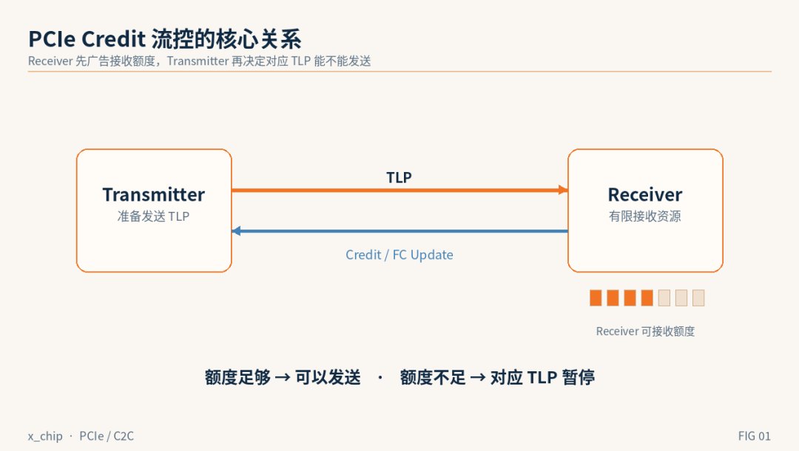

---

## 4.1 Credit 流控解决的问题

PCIe Flow Control 解决的并不是“这个 Request 最终能不能被 Endpoint 处理”，而是一个更靠近链路的问题：

> **下一跳 Receiver 有没有足够的接收资源，把这个 TLP 收下来？**

这里的“下一跳”很重要。

假设路径是：

```
Root Port
   ↓
Switch
   ↓
Endpoint
```

Root Port 发给 Switch 时，看的是 **Root Port ↔ Switch 这一跳**的 Credit。

Switch 再往 Endpoint 转发时，要重新看 **Switch ↔ Endpoint 这一跳**的 Credit。

所以 Credit 本质上是 **Hop-by-Hop** 的接收资源管理，而且两个传输方向各算各的账。它不是一张从 Root Complex 一直管到 Endpoint 的“全局余额表”。

Receiver 把可用接收资源以 Credit 的形式告诉对端，Transmitter 再根据自己维护的 Flow Control 状态决定某类 TLP 现在能不能发。PCIe Base Specification 对这个约束有明确规定：发送 TLP 之前，必须满足相应的 Flow Control Credit 条件。[1]

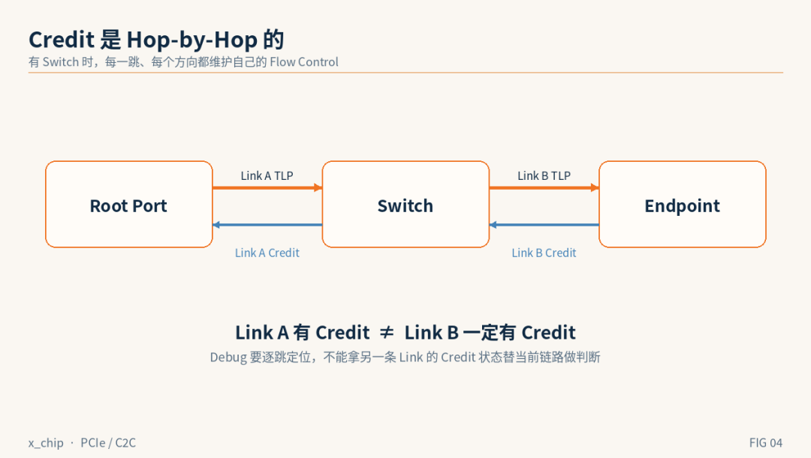

---

## 4.2 PCIe 的六类基础 Credit

为了先把核心机制讲清楚，这里先用最常见的六类 Credit 建立基本概念。PCIe 6.0 Flit Mode 下还有 Shared / Merged Flow Control 等扩展，后面再单独讲。

PCIe 的 TLP 并不都是同一类流量。一个 Memory Write、一个 Memory Read Request、一个带数据的 Completion，对接收端资源的占用方式并不一样。

因此 Flow Control 会按事务类别和 Header / Data 分开记账：

| TLP 类别 | Header Credit | Data Credit |
| --- | --- | --- |
| Posted | PH | PD |
| Non-Posted | NPH | NPD |
| Completion | CplH | CplD |

这些状态还会按 Virtual Channel 分开维护，于是我们最常见的是：

```
PH    Posted Header
PD    Posted Data
NPH   Non-Posted Header
NPD   Non-Posted Data
CplH  Completion Header
CplD  Completion Data
```

这里不要把协议里的六类 Credit 直接理解成“芯片内部一定有六块独立 SRAM”。

**Credit 是协议层看到的资源账本；Receiver 内部到底怎么组织 Buffer，是具体实现的问题。**

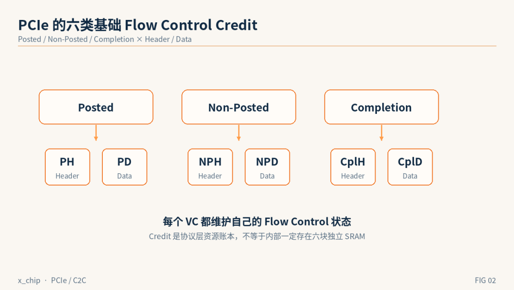

---

## 4.3 一笔 TLP 如何消耗 Credit

知道 Credit 的分类以后，判断一笔 TLP 需要什么资源就比较直观了：先看它属于哪一类，再看它有没有 Data Payload。

例如一笔普通 Memory Write：

```
Memory Write
→ Posted Request
→ 需要 Posted Header
→ 有 Payload，还需要 Posted Data
```

可以先记成：

```
MWr → PH + PD
```

再看 Memory Read Request：

```
Memory Read Request
→ Non-Posted Request
→ Request 本身通常没有 Data Payload
```

所以它最核心的 Flow Control 条件是：

```
MRd → NPH
```

等 Completer 把数据返回时，发送的是 **Completion with Data TLP**，这时检查的是 Completion 方向的资源：

```
Completion with Data → CplH + CplD Credit
```

这里先不展开一个具体 TLP 到底消耗多少个 Data Credit Unit。具体数量还和 Payload 大小以及 PCIe 的 Flow Control accounting 规则有关。

这一节真正需要记住的是：

> **Header 和 Data 分开记账；Posted、Non-Posted、Completion 也分开记账。**

于是再看一笔 PCIe Memory Read，就能看到两个方向其实分别受 Credit 约束：

```
Requester
   |
   | MRd：检查 NPH
   v
Completer
   |
   | Completion with Data：检查 CplH / CplD
   v
Requester
```

如果中间还有 Switch，每一跳又有自己独立的 Flow Control 状态。

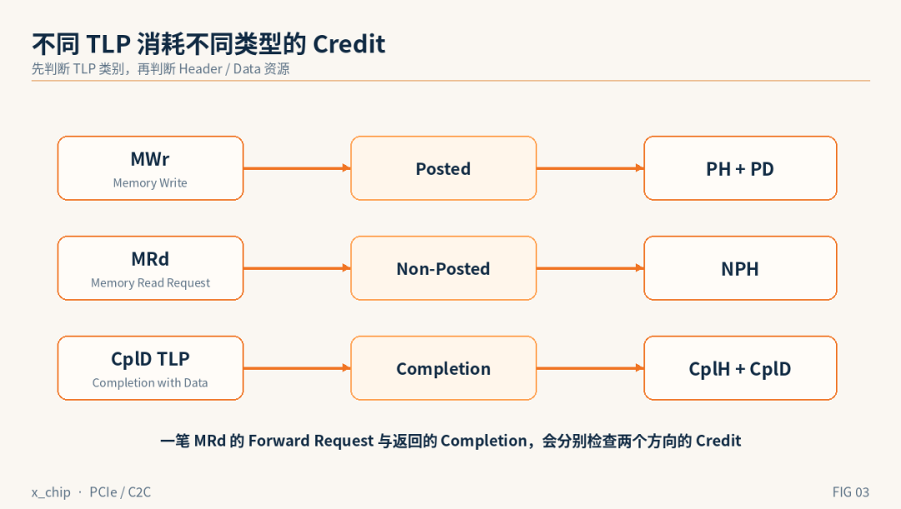

---

## 4.4 Credit 如何建立和更新

链路刚起来时，发送端不能凭空猜对面有多少接收资源。

因此 PCIe 会先完成 Flow Control Initialization，让链路两端建立初始 Credit 状态。之后 Receiver 的接收资源重新可用时，再通过 Flow Control Update 把新的额度信息告诉 Transmitter。

理解上可以把过程压成：

```
Receiver 广告 Credit
        ↓
Transmitter 发送 TLP
        ↓
对应额度被消耗
        ↓
Receiver 释放接收资源
        ↓
Flow Control Update
        ↓
Transmitter 获得新的可用额度
```

这里有一个很重要的细节：抓到一笔 UpdateFC，并不能简单把里面的数值理解成“Receiver 此刻还剩几个空 Buffer”。

PCIe 使用的是累计式 Flow Control Accounting。发送端结合 Receiver 广告的累计额度和自己已经发送、已经消耗的额度，判断下一笔 TLP 是否还能继续发送。[1]

再往下会涉及 UpdateFC 的计数、回绕以及 Scaled Flow Control。这些可能需要单独写一篇文章讲清楚，这里就不继续深入。

---

## 4.5 Credit 与 Tag 的区别

上一篇我们讲过 PCIe Tag。

Credit 和 Tag 经常被放在一起，是因为它们最终都可能限制“还能不能继续增加并发”。但它们管的根本不是同一种资源。

可以先记住这个区别：

> **Tag 用来标识需要 Completion 的 Outstanding Request；Credit 用来约束下一跳现在还能不能接收对应类型的 TLP。**

拿 Memory Read 来看最清楚。

Requester 想增加一笔新的 MRd Outstanding，需要先有可用 Tag。这个 Tag 会跟着 Request 走，直到返回的 Completion 能够找到原来的事务。

但有 Tag 还不够。

真正把 MRd 发到 Link 上之前，还要确认下一跳有足够的 NPH Credit。

于是可能出现两种完全不同的堵法：

```
Tag 资源耗尽
→ Requester 暂时没有新的 Tag 可分配
→ 新的 MRd Outstanding 受到限制
```

和：

```
NPH 可用额度不足
→ Request 已经准备好了
→ 但这一跳暂时不允许把 MRd 发出去
```

Completion 返回时，两者的分工同样清楚。

Completion 里带着用于匹配原始 Request 的 Requester ID / Tag；但这个 Completion 想在反方向 Link 上真正发出来，还要满足那一跳的 CplH / CplD Credit。

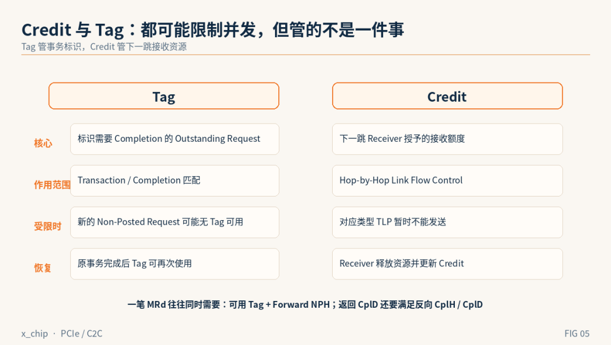

所以看到“PCIe 并发上不去”，不能只看到 Tag 或 Credit 其中一个就下结论。

它们最后都可能表现成“新的事务发不出去”，但卡住的位置完全不同。

---

## 4.6 可用 Credit 被耗尽时会发生什么

当发送端按自己的 Flow Control 账本判断：某一类 TLP 已经没有足够的可用 Credit 时，这类 TLP 就要先停下来，等待 Receiver 释放资源并更新 Credit。

这里说的“Credit 用完”，是**发送端计算后的可用额度不足**，不是简单看某个 InitFC / UpdateFC 字段的原始数值是不是 0。

这种情况完全可能只是正常的 Backpressure，并不等于：

```
Link Down
PHY Error
整个 PCIe 都停了
```

例如某个 VC 的 NPH 暂时不足，需要 NPH 的 TLP 会被限制；但其他 Credit 类型如果还有额度，相应流量仍可能继续推进。哪些 TLP 能绕过当前被阻塞的 TLP，还要继续满足 PCIe 的 Ordering 和 Deadlock Avoidance 规则。[1]

所以 Debug 时看到某类 TLP 因 Credit 发不出去，第一反应不应该是“Credit 计数器坏了”，而是继续确认：

```
是哪一种 Credit？
属于哪个 VC？
什么时候开始没有新的可用额度？
Receiver 的对应资源有没有继续释放？
Flow Control Update 有没有正常回来？
```

Credit 也不仅关系到“会不会把 Buffer 撑爆”，还会影响吞吐。接收端提供的 Credit 太少，发送端就可能频繁等额度更新，链路 Pipeline 也就很难持续跑满。[1]

---

## 4.7 一笔 TLP 发不出去时怎么查

假设现在看到：

```
Link = L0
Requester 有新的 Memory Read 要发
但线上迟迟看不到新的 MRd TLP
```

这时候可以顺着发送路径往前查。

### 4.7.1 先确认 Requester 真的生成了 Request

如果 Requester 内部根本没有新的事务，查 Credit 没意义。

先确认：

```
Request valid / pending
Tag available
内部 Queue 没被其他条件卡住
```

### 4.7.2 再确认这笔 TLP 需要哪类 Credit

MRd 属于 Non-Posted Request，所以首先关注：

```
NPH
```

不要看到一个 `Credit` 信号就把所有类型混在一起。

### 4.7.3 检查 Flow Control 是否已经初始化完成

如果初始 Flow Control 状态都没有建立，后面的 Credit 判断本身就没有可靠基础。

### 4.7.4 检查 Credit 是否继续更新

如果 NPH 长时间处于不可发送状态，再往 Receiver 方向追：

```
Receiver 对应资源是否真的被占住？
TLP 有没有被后级及时取走？
FC Update 是否正常生成？
Update 是否正常到达对端？
发送端的 Credit Accounting 是否正确？
```

### 4.7.5 有 Switch 时逐跳检查

Endpoint 前面的那条 Link 有 Credit，不代表 Root Port 到 Switch 的这一跳也有；反过来也一样。

Credit 是 Hop-by-Hop 的，所以 Debug 也应该 Hop-by-Hop。

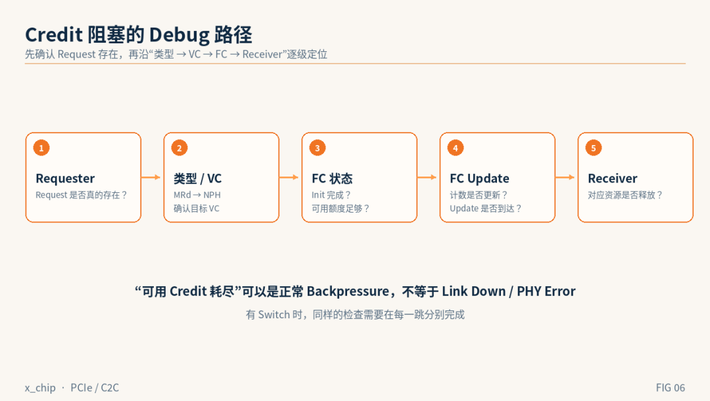

最后再回头看 Tag。

如果实现里的可观察状态是：

```
Tag available
NPH unavailable
```

优先沿 Credit / Flow Control 路径查。

反过来如果：

```
NPH available
Tag exhausted
```

那就不是 Flow Control 在拦，而是 Requester 自己的 Outstanding Transaction 资源先到头了。

两种情况在系统层都可能表现成“Read 发不出去”。真正有效的 Debug，还是找到第一处不再往前推进的边界。

---

## 4.8 PCIe 6.0 Flit Mode 的边界

前面用六类基础 Credit 建立的是比较理解的基本模型。

到了 PCIe 6.0 Flit Mode，Flow Control 的资源组织和记账方式会继续扩展，例如 Shared Flow Control Credit，以及把部分资源池合并使用的 Merged Flow Control。[2]

这些机制会改变“Credit 怎么组织、怎么共享”，但核心逻辑并没有变：

> **发送端在发送 TLP 前，仍然要确认下一跳 Receiver 已经提供了足够的 Flow Control 资源。**

所以看到 PCIe 6.0 里更多的 Credit 字段和模式时，可以先记住这个本质。

复杂的是账本怎么扩展，不是为什么需要这本账。

---

## 4.9 一张图记住 Credit

把上面内容压缩成一条主线：

```
Receiver 接收资源有限
        ↓
Receiver 广告 Credit
        ↓
Transmitter 按 TLP 类型检查额度
        ↓
额度足够 → 发送
额度不足 → 对应 TLP 等待
        ↓
Receiver 释放资源
        ↓
Flow Control Update
        ↓
继续发送
```

再把 Tag 放回来：

```
Tag
= Outstanding Request 的事务标识
Credit
= 下一跳 Receiver 授予的接收额度
```

一笔 Memory Read 想顺利跑起来，可能同时受到这些资源限制：

```
Requester 有可用 Tag
+
Forward Link 有 NPH Credit
+
Return Link 有 CplH / CplD Credit
```

所以我更愿意把 PCIe Credit 理解成一种 **链路上的接收资源预算**。

它不是用来标识事务，也不是一张端到端的全局 Buffer 表。它做的事情很朴素：

> **先确认下一跳接得住，再把包发过去。**

下一篇继续沿 PCIe 数据链路往下看：**为什么 PCIe 需要 Replay / ACK / NAK，而 Completion Timeout 又为什么不是同一层的问题。**

**技术很重要，技术背后的思想更重要！**

芯片设计中的很多问题，单看一个模块并不复杂，但放进完整系统后才会真正体现难度。

如果这篇文章对你的工作或学习有帮助，欢迎点赞、在看，也欢迎关注 x\_chip，后续一起讨论更多 SoC 架构与芯片设计实践。

---

## 4.10 参考资料

[1] PCI-SIG, *PCI Express® Base Specification Revision 6.0.1*, Flow Control / Receive Buffer / DLLP 相关章节。

[2] PCI-SIG, *PCI Express® 6.0 Specification Functionality Updates – Part 2*, Shared Flow Control / Merged Flow Control 相关说明。

---

**转载授权：欢迎全文转载，无需授权；请保留作者「烓围玮未」及来源「微信公众号：芯片设计进阶之路（x\_chip）」，不得冒充原创或歪曲原意。**

---

# 5. PCIe接口介绍及设计注意事项

> 来源：https://mp.weixin.qq.com/s/IypzxrOFEqJBJHh4vQ5q3g
> 作者：devin.ding
> update 2026/08/22 18 : 09
> **已截图**

PCIe是PCI Express，高速串行差分总线。目前接触的PCIe接口应用中，既有有线网络，也有无线网络，还有场景是用于扩展成USB3.0接口。当然PCIe还用于CPU连接显卡、SSD、扩展坞等，但目前不在PC行业，不多做介绍。

PCIe采用点对点差分串行传输，CDR时钟数据恢复，无需收发端时钟严格同步。

不知道你有没有和疑惑，前面提到PCIe数据信号自带时钟，那为什么我们在进行PCIe电路设计时，会有一组差分时钟呢？其实这组时钟并不是传输数据信号的参考时钟，而是给device芯片内部PLL做倍频基准、给控制逻辑做时序参考，有点像摄像头的参考CLK。

## 5.1 PCIe框图介绍

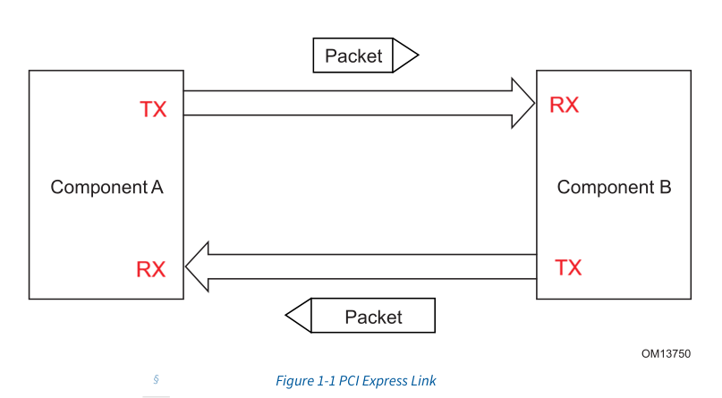

PCIe链路框图

链路（Link）指两个器件之间的双工通信通道。最基础的 PCI Express 链路包含两组低压差分驱动信号对：一对发送差分线（Transmit）与一对接收差分线（Receive）。

如果PCIe只有一组TX和RX，就表明这路PCIe port是1lane port，如果PCIe port有2组TX和RX，则是2 lane port，以此类推。

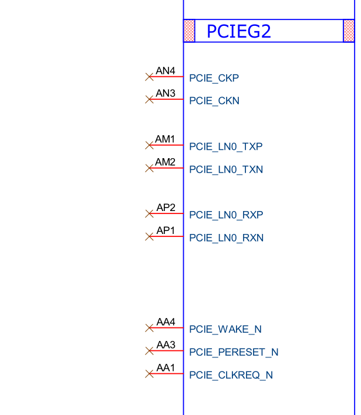

1 lane PCIe port信号

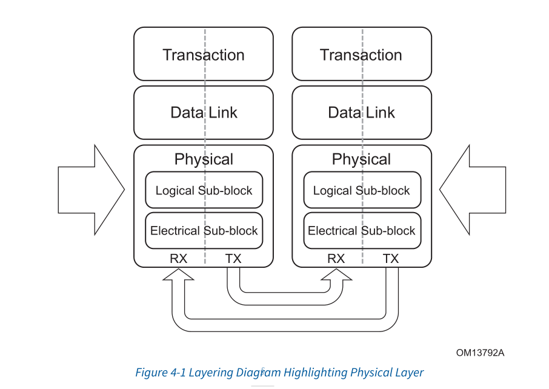

PCIe 物理层框图

物理层就是我们常说的PHY，一般都集成在SOC内部。

## 5.2 信号介绍

参考图“1 lane PCIe port”，PCIe信号介绍如下：

1. 高速差分信号：Tx/Rx数据差分对，高速串行，信号完整性要求高。
2. REFCLK参考时钟：100MHz差分时钟，PLL参考时钟。
3. 辅助低速信号：

PERSTN复位：硬件复位、上电时序控制。

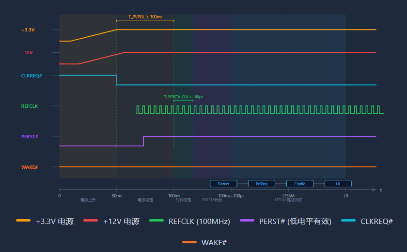

PCIe上电时序图（made by kimi）

WAKEN唤醒：Device向Host发送唤醒信号，要求平台为所连接的device做reset、恢复参考时钟。

CLKREQN：Device向Host请求100MHz PCIe参考差分时钟 REFCLK，实现空闲时关时钟，实现低功耗目的。

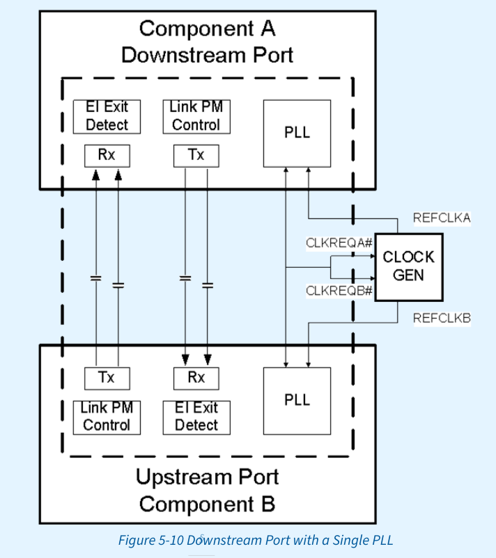

CLKREQN逻辑关系：

拉低（有效）：设备需要 REFCLK ，通知主板时钟芯片必须打开100MHz参考时钟，PHY PLL上电锁定，链路可正常收发数据。

拉高（无效）：设备进入深度 L1 低功耗模式，告知系统可以关掉该路 REFCLK，直接关闭时钟电路、PHY PLL，大幅降低静态功耗。

## 5.3 PCIe各代速率与带宽（单Lane）

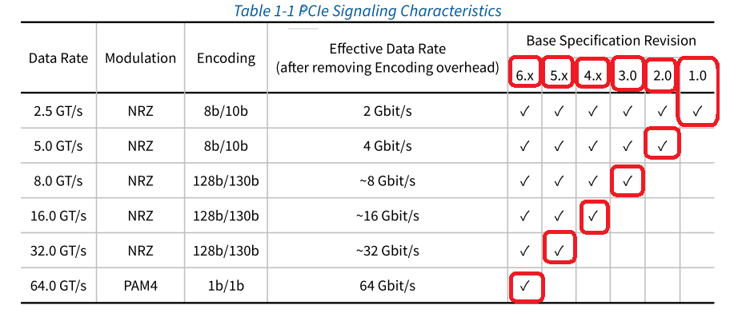

PCIe版本和速率

注：PCIe的data rate默认用GT/s来表示，GT/s 描述的是 PHY 硬件每秒打出去多少个符号，Gbps 是扣除编码、协议包头、开销后的上层有效吞吐量。例如：PCIe 2.0是8b/10b 编码，每 10 个传输符号，只承载 8 个有效数据比特，编码损耗 20%。PCIe 2.0data rate是5.0GT/s，所以 有效带宽不是5Gbps，而是 5 × 0.8 = 4Gbps/lane。

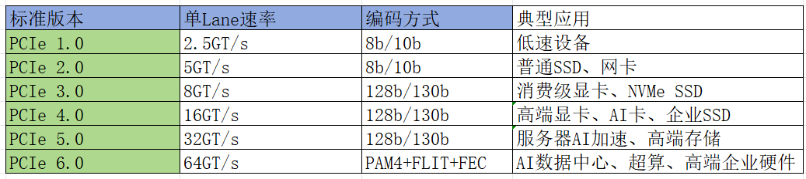

PCIe版本和应用场景

## 5.4 RC和EP概念介绍

前面介绍PCIe主控端和设备端用的是Host和Device，其实还有个更规范的说法是RC端和EP端。接触这个概念还是从一个描述中提到SOC芯片在做RC和EP时，允许的走线长度不一样看到的。芯片规格描述SOC在做RC时，建议走线总长度是130mm，做EP时，建议走线总长度是190mm。

接下来先介绍RC和EP概念，再解释原因。

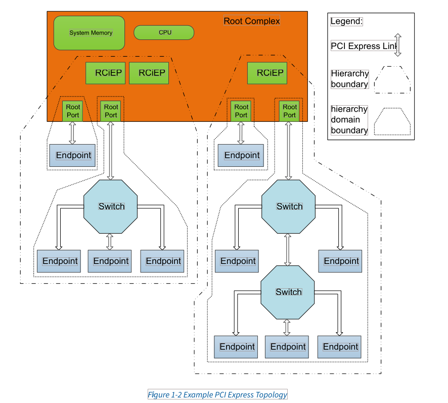

RC和EP拓扑图

RC ，Root Complex 根复合体（主机），PCIe 树形总线的唯一根节点，是整个PCIe总线的管理者。比如PC CPU内置PCIe控制器、ARM SOC主机模式PCIe、FPGA PCIe Host控制器都是RC。

EP，Endpoint 端点设备（外设），PCIe总线末端外设，只被动响应主机指令，所有插在主板上的硬件都是EP。例如NVMe SSD、独立显卡、网卡都是EP。

那为什么RC和EP有这种走线长度要求的区别呢？本质原因是上行、下行 PHY 收发能力不对称。

1. 下行链路：RC TX to EP RX

首先RC TX端能力受限，协议强制约束 Root Complex（CPU/PCH 根端口）发送端 Tx 均衡档位、预加重幅度、输出摆幅上限，目的是兼容老旧低速 EP 设备，不能用强预加重补偿高频损耗，信号本身对长线衰减抵抗力差。

其次EP RX端修复能力一般，Endpoint 接收端无法深度修复长线带来的 ISI 码间干扰、眼图闭合等问题。

2. 上行链路：EP TX to RC RX

首先EP TX端可满功率补偿损耗， EP 无向下兼容限制，通过强预加重，在信号发出前主动抬升高频分量，抵消长距离 PCB 绕线损耗。

其次RC RX端修复能力强，经过一定长度走线后，依然可以还原合格眼图。

综合来说，因为TX、RX总体走线长度接近，所以具体设计时，当RC和EP给出不同的走线长度建议时，只能以短距离的为准。

## 5.5 原理图设计注意事项

1. TX端需要注意加0.1uF耦合电容。无论是host还是device端，各自负责自己的TX信号加耦合电容。PCIE GEN3及以上，建议使用0.22uF耦合电容。
2. 部分平台时钟信号（差分电流模式输出）上需要加对地49.9R电阻。
3. Host端TX接Device端RX，Device 端TX接Host端RX，这点务必检查，很容易出错。

## 5.6 PCB设计注意事项：

1，阻抗控制。PCIe阻抗既不像USB那样是标准的90欧姆阻抗，也不像HDMI那样标准的100欧姆阻抗，他经常是一个范围，甚至在Host和Device搭配时，各自还给出自己不的标准。CLK一般建议差分阻抗控制在100欧姆，DATA信号差分阻抗控制在90欧姆左右。

2，为了阻抗连续性，串接电容及信号换层处过孔做禁空处理（有点类似射频信号走线的挖空方式）。

3，信号要有完整参考平面，两侧包地。

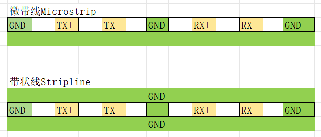

4，注意走线总长度符合要求。（这点主要是为了评估插入损耗是否符合要求，PCIe3.0及以上最好能做仿真，仿真项包含插入损耗）

5，时钟对地电阻靠近device端摆放。

6，等长处理，如果P/N之间skew小于125um，TX 与TX之间的skew＜200mil，RX 与RX之间的skew＜200mil。

## 5.7 思考题：

1，一个2 lane的PCIe接口，但搭配只需要1 lane的device，可以只使用这个PCIe接口的一个lane吗？

答：可以只使用其中一个lane，软件做好配置即可。

2，在PCIe电路设计中，发现没有WAKEN信号，那怎么唤醒平台呢？

答：除了WAKEN唤醒，PCIe还有一种唤醒方式，叫做in-band唤醒，走 PCIe 高速差分 TX/RX 主链路本身，无额外引脚。

以上就是对PCIe接口的介绍，内容虽经认真思考和整理，但个人能力有限，如有问题，欢迎指出和讨论。


---

# 6. [PCIE] BAR 基本概念详解：地址空间是怎么被"要"到、又是怎么被"用"起来的

> 来源：https://mp.weixin.qq.com/s/gfLdIFyTOpC8aDUE_VQfEQ
> 作者：周漾
> update 2026/08/29 13 : 16

**导读**

早些年调 BAR 相关问题的时候，最容易被绕进去的一点是：BAR 明明只是设备配置空间里几个普普通通的寄存器，为什么牵扯的东西这么多——地址怎么分配、大小怎么申报、64 位怎么拼、预取属性有什么用，一环套一环。后来把 PCIe 规范里 BAR 这部分从头看了一遍，才发现这些细节并不是随意堆砌的规则，而是"设备怎么找地方安家"这一件事，在演进过程中不断被打磨出来的解法。这篇文章想把 BAR 的基本概念、以及背后的设计动机讲清楚。

**一、为什么需要 BAR**

现代计算机上，内存地址空间只有一份，由整个系统统一管理，不是每台外设各自划一块地盘出来。CPU 和操作系统不允许 PCI 设备自作主张地占用某段地址——如果每个设备都按自己的意愿去挑地址，两个设备撞在同一段地址上几乎是必然的事，所以地址必须由系统统一规划、统一分配。

但同时，PCI 设备本身确实需要一块内存空间，用来存放和自己功能相关的数据，比如寄存器、状态信息、配置参数。不同设备、不同功能，需要的这块空间大小天然不一样：一个简单的控制器可能只需要几十 KB，一块显卡的显存窗口动辄需要几个 GB。这就产生了一个"量身定制"的需求——系统需要知道每台设备到底要多大空间，才能按需分配，而不是给所有设备统一分一样大的地址块。

**BAR（Base Address Register，基地址寄存器）** 就是用来解决这个量身定制问题的机制。每块 PCI/PCIe 设备的配置空间里最多有 6 个 BAR 寄存器，设备可以只启用其中一部分，也可以全部启用，具体用几个、每个申报多大，由设备自身的功能需求决定。

一旦某个 BAR 被启用、系统把分配好的地址写入其中，这个 BAR 就和一段系统内存地址建立起了对应关系。此后主机每次访问这段地址范围，实际上访问的就是这台设备；设备这一侧只要发现某笔事务的地址落在自己某个 BAR 的范围内，就会认领这次请求，因为它知道自己正是这次访问的目标。

**二、如何使用 BAR 寄存器**

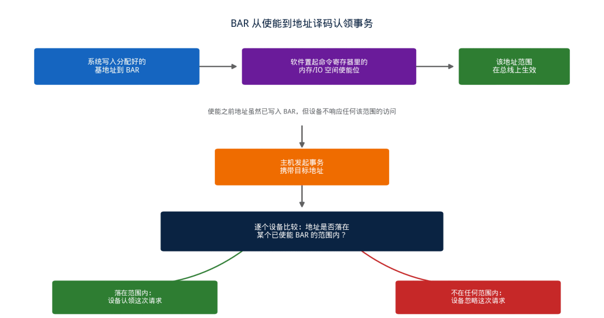

BAR 从"申报到手"变成"能被访问"，中间还差一步关键的开关。

系统完成地址分配、把基地址写进 BAR 之后，这个地址暂时还不会生效。要让这段空间真正在总线上生效，软件还需要单独去 PCI 命令寄存器（Command Register）里，置起对应的空间使能位——内存空间使能位或者 I/O 空间使能位，具体置哪一位取决于这个 BAR 申报的是内存空间还是 I/O 空间。

"配置地址"和"允许访问"被拆成两个独立的开关，不是多此一举。系统启动阶段往往要给很多设备依次分配地址，如果地址一写进 BAR 就立刻生效，先分配完的设备会立刻开始响应总线上的访问，而这时候后面的设备可能还没分配完，整个系统的地址空间还处于不完整、可能冲突的中间状态。先让所有设备保持沉默，等全部规划完成后再统一放行，才能避免这种过渡期里的误访问。

使能之后，主机每发起一次内存事务，实际执行的是一次地址匹配：把事务携带的目标地址，和系统里每一台已使能设备的 BAR 地址范围做比较，落在哪个范围内，这次事务就转发给对应的设备。

这也是为什么设备自己不需要知道"我在系统里排第几个""前面还有哪些设备"——它只需要记住自己被分配到的地址范围，剩下的匹配、路由工作交给地址译码逻辑去做。设备侧的逻辑始终是同一句判断：这笔请求的地址，落在不落在我的地盘里。

**三、申报的窍门：用硬件电路本身来表达"我要多大"**

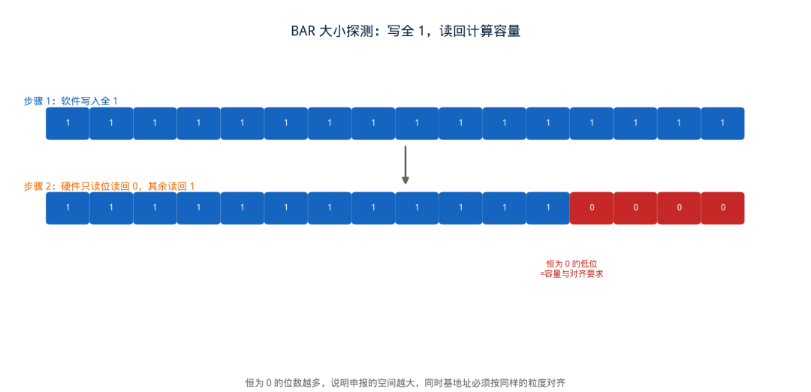

这里有一个很巧妙的设计问题：BAR 本身是一个寄存器，能装的信息有限，怎么才能既装下"最终分配到的基地址"，又能表达"我申报的大小是多少"这两件不同的事？

PCIe 规范给出的答案是：**用同一个寄存器的低位比特本身的硬件行为，来编码需求的大小，不需要额外的字段。** 具体做法是，BAR 寄存器里对应"申报空间大小"的那些低位比特，在硬件上被设计成永远只能读出 0，无法被写入 1——这些位在电路里根本没有接触发器，写操作对它们不起作用。软件按照规范规定的探测流程，向整个 BAR 寄存器写入全 1，再读回来，哪些位读回来是 1、哪些位读回来是 0，就直接反映了这个设备的地址空间到底需要多大：读回 0 的那些低位，意味着"这些位置我说了不算，必须始终为 0"，间接表达了对齐要求和空间大小。

这个设计非常值得玩味的地方在于：**申报大小这件事，不是靠某个专门的"大小寄存器"来表达的，而是直接体现为寻址范围本身的物理约束。** 一块申报了 16MB 空间的 BAR，它天然要求自己的基地址必须按 16MB 对齐——这不是规范额外强加的一条规则，而是"用哪些位能写、哪些位不能写"这套探测机制自然导出的数学结果。地址空间越大，需要保持恒零的低位就越多，天生就要求更严格的对齐，两者是同一件事的两种表述。

**四、BAR 里的几个标志位：内存还是 I/O，32 位还是 64 位**

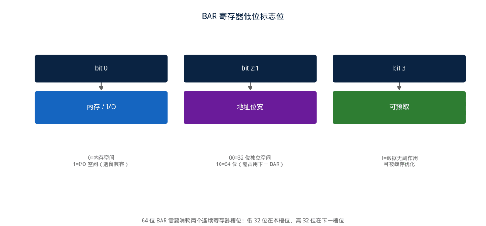

除了拿来表达对齐和大小的那些位，BAR 寄存器最低的几位还承担着描述"这块空间的性质"的职责，这几位是可以被软件读出真实含义的。

**最低一位**区分这个 BAR 申报的是内存空间还是 I/O 空间——现代 PCIe 设备几乎都用内存空间，I/O 空间是更早期 PCI 时代遗留下来的寻址方式，PCIe 保留了它主要是为了兼容。**紧接着的两位**在内存空间模式下，用来表明这个 BAR 到底是一个独立的 32 位地址空间，还是需要和紧邻的下一个 BAR 拼接起来，组成一个 64 位地址空间——这也是为什么使用 64 位 BAR 时，规范要求消耗两个连续的 BAR 寄存器槽位，第二个槽位专门用来承载高 32 位地址，本身不能再申报别的空间。**往上一位**是可预取（prefetchable）标志，它告诉系统"这块空间里的数据具备一致性，即使被提前读取、缓存，也不会因为读取顺序或者读取次数的变化而产生副作用"，系统据此决定要不要对这块地址做缓存优化；带副作用的寄存器空间（比如读一次就清零状态的寄存器）绝不能标记为可预取，否则缓存机制会让软件读到过期或者被吞掉的状态。

一台设备为什么常常需要 64 位 BAR——这也是"申报大小"这件事的自然延伸：一块现代 GPU 的显存动辄几十 GB，这个体量的地址空间，32 位地址线（最多能表达 4GB）根本装不下，必须借助 64 位寻址才能完整暴露出来。

**五、深入一层：BAR 只是入口，真正的空间划分发生在设备内部**

把视角从"一个 BAR 寄存器"挪到"一整块 BAR 空间内部"，会发现申报到手的这一整块地址空间，很少是被当成铁板一块使用的。以图形类设备为例，一块被申报出来的 BAR 空间，内部通常还要再切分成好几个功能区——一部分映射寄存器堆，用来控制芯片内部各个模块的行为；一部分映射真正的帧缓冲或者显存窗口；还可能划出一小块专门给"门铃"（doorbell）机制使用，用于软件通知硬件"有新任务了"这种轻量级信令。

这一层内部划分，PCIe 规范本身并不关心——规范只负责保证"报出去的这块地址空间是排他的、不会和别的设备冲突"，具体这块空间内部怎么切、切多大，完全是设备自己的实现细节，软件驱动需要提前知道这份内部布局（通常通过设备文档或者某种自描述机制），才能正确地在这块地址空间里定位到自己想访问的具体功能。

理解了这一层，就能理解为什么"BAR 大小"和"设备功能复杂度"经常成正比——功能越丰富、需要独立寻址的子模块越多，内部划分需要的地址空间就越大，反映到外部，就是申报的 BAR 也越大。

**六、前线的移动：从静态申报到动态可调**

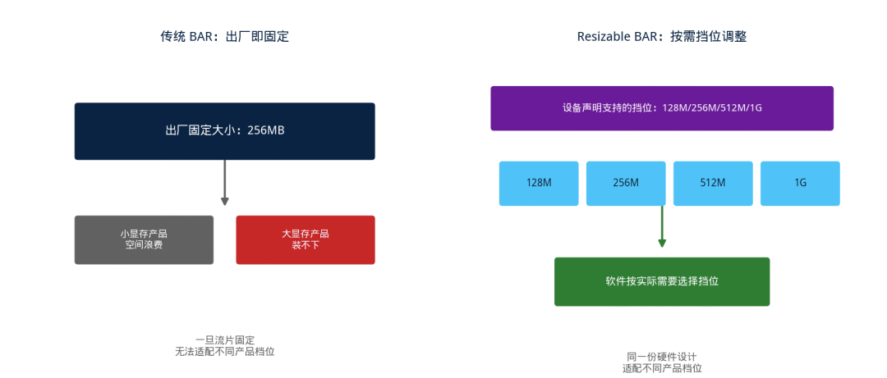

传统的 BAR 机制有一个隐含假设：**设备申报多大，就永远是这么大，一旦系统启动、地址分配完成，这个大小在整个设备生命周期内不会再变。** 这个假设在很长一段时间里没有问题——大多数设备的地址空间需求本来就是固定的。

但当显存、内存这类资源本身可以按需配置的设备出现之后，固定大小的 BAR 开始显得不够用了：如果 BAR 大小按最大可能的显存配置来固定申报，那配置了小显存的产品也要浪费同样大的地址空间；如果按最小配置申报，配置了大显存的产品又装不下。这背后的矛盾，倒逼出了 **Resizable BAR（可调整大小的 BAR）** 这样的扩展能力——设备在配置空间里额外声明自己支持哪些大小挡位，软件在系统初始化阶段，可以根据实际需要，从这些挡位里选择一个，重新配置 BAR 的大小，而不必被出厂时定死的单一数值捆住。

这个演进路径很有代表性：一开始的设计只解决"怎么申报固定大小"这个基础问题；当现实场景出现"同一份硬件设计，不同产品需要不同大小"这个新诉求时，才在原有机制上叠加一层可协商的挡位机制，而不是推倒重来。这也是为什么理解 Resizable BAR 之前，必须先理解最基础的申报-分配协议——它是在原有地基上做的扩展，不是另起炉灶。

**七、验证中值得关注的几个点**

**大小探测的位模式要覆盖边界**：验证 BAR 大小时，不能只测一个典型值，需要覆盖最小合法空间到最大支持空间的边界，确认低位恒零的位数与申报大小精确对应，尤其是恰好在某个 2 的幂次边界附近的取值。

**64 位 BAR 的高低位拼接要作为一个整体验证**：64 位 BAR 占用两个连续槽位，验证时需要确认高 32 位寄存器本身不会被误当成一个独立的 32 位 BAR 使用，同时基地址跨越 4GB 边界的场景要专门覆盖，这类场景最容易暴露地址拼接逻辑里的隐藏 bug。

**可预取属性与实际访问行为要交叉检查**：如果某块空间被错误地标记为可预取，而它内部实际存在读取副作用的寄存器，需要验证系统在这种配置下的行为——这类问题往往不会在功能测试里直接报错，而是表现为某个状态位偶发性地读不到预期值。

**内存访问使能位与 BAR 生效时机的先后关系**：软件先配置 BAR 地址、再置起内存访问使能位是标准流程，验证里需要覆盖乱序场景——使能位置起但 BAR 地址尚未配置完成时，设备不应该响应任何该地址空间的访问。

**Resizable BAR 场景下的地址一致性**：BAR 大小被重新配置后，验证需要确认旧的地址映射不会继续生效，新的地址范围内所有原本可访问的功能点都能正确访问，新旧配置切换的过渡时刻不会出现地址悬空或者重叠的窗口。

**八、总结**

BAR 机制解决的核心问题只有一个：**在设备完全不知道自己会被放在系统地址空间哪个位置的前提下，让设备准确表达自己需要多大空间，再由软件统一分配、避免冲突。** 用低位比特的硬件只读特性来编码大小需求，把"大小"和"对齐"这两件事统一成同一套探测机制的自然结果，是这套设计里最精巧的一笔。

从最基础的固定大小申报，到应对显存等资源可配置场景而出现的 Resizable BAR，BAR 机制的演进路径也提供了一个很有代表性的样本：先解决最基础的分配问题，再针对现实中出现的新需求，在已有框架上做兼容性的扩展。理解了这条主线，再遇到与 BAR 相关的具体特性时，大多能顺着"这解决的是申报-分配协议里的哪个环节"这条思路，找到设计动机所在。

---

# 7. PCIe传输和DMA传输有什么区别吗？谁负责完成数据复制？设备之间通过什么路径交换数据？DMA控制器与CPU中的加载存储单元有什么本质区别？

> 来源：https://mp.weixin.qq.com/s/CST0D641pm3JXQz2JzkfoA
> 作者：亦然1
> update 2026/08/29 13 : 40
> **已截图**

在现代计算机系统中，数据搬运效率已经成为影响整体性能的重要因素。无论是高速固态存储、GPU计算、网络接口还是人工智能加速设备，大量数据都需要在处理器、内存以及外部设备之间高速交换。在讨论这些数据交换过程时，经常会同时出现“PCIe传输”和“DMA传输”两个概念，很多工程实践中甚至将二者混合使用。那么，PCIe和DMA究竟描述的是同一个过程的不同名称，还是两个具有不同层次含义的技术？

理解二者区别的关键，在于区分“通信通道”和“数据搬运机制”。PCIe解决的是设备之间如何通过高速互连进行数据交换的问题，而DMA解决的是数据如何绕过CPU直接完成内存访问的问题。二者经常组合出现，但它们属于计算机体系结构中的不同抽象层。

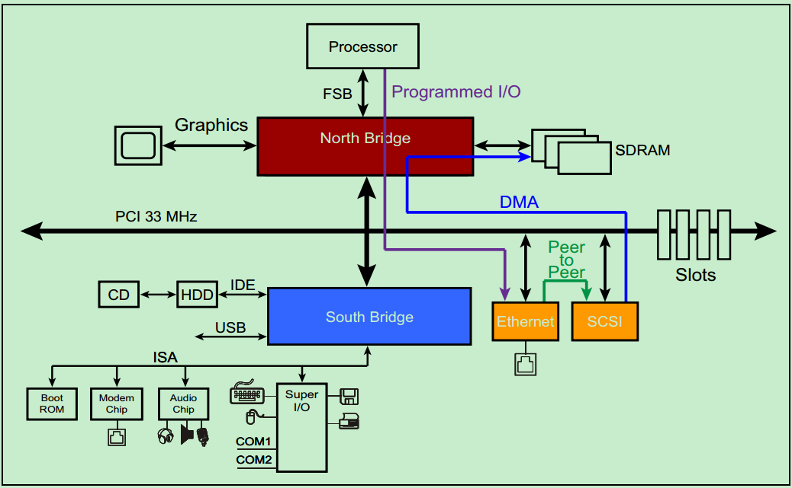

## 7.1 PCIe本质上是一种高速设备互连协议

PCIe（Peripheral Component Interconnect Express）是一种高速串行互连协议，其核心目标是建立处理器、内存系统以及外部设备之间的数据通信路径。

从体系结构角度看，PCIe类似于一种设备通信网络。它规定了数据如何封装、如何传输、如何确认以及如何管理链路状态。PCIe链路由多个Lane组成，每个Lane包含发送和接收通道，多个Lane可以组合形成不同带宽的链路，例如x1、x4、x8、x16。

PCIe传输的数据并不关心这些数据来自文件、网络还是计算任务，它只负责将一个设备产生的数据包可靠地传递到另一个设备。

例如：

- GPU通过PCIe连接CPU；
- NVMe固态硬盘通过PCIe连接主板；
- 高速网卡通过PCIe连接服务器。

在这些场景中，PCIe提供的是物理和协议层面的连接能力。

可以将PCIe的数据传输过程抽象为：

其中PCIe负责中间的数据交换过程。

但是，仅有PCIe并不能决定数据是否经过CPU，也不能决定谁负责发起内存读写请求。

## 7.2 DMA本质上是一种内存访问机制

DMA（Direct Memory Access，直接内存访问）的核心思想是：让外部设备拥有直接访问内存的能力，而不需要CPU逐字节参与数据复制。

传统的数据传输方式如下：

例如一个网卡收到数据，如果CPU负责搬运，那么CPU需要不断执行读取设备寄存器、读取数据、写入内存等操作。这种方式会消耗大量处理器时间。

DMA改变了这种模式：

设备通过DMA控制器或者自身集成的DMA引擎，直接向内存读写数据。CPU主要负责配置传输参数，例如：

- 数据源地址；
- 目标地址；
- 数据长度；
- 传输方向。

配置完成后，DMA硬件执行实际的数据移动。

因此，DMA关注的问题是：

“谁负责完成数据复制？”

而PCIe关注的问题是：

“设备之间通过什么路径交换数据？”

二者解决的问题不同。

## 7.3 PCIe传输和DMA传输为什么经常一起出现？

现代设备通常同时使用PCIe和DMA，因此容易造成概念混淆。

以GPU计算为例，CPU希望将数据发送给GPU：

传统理解：

实际现代系统中：

CPU将内存地址和控制信息交给GPU驱动，然后GPU中的DMA引擎通过PCIe读取系统内存。

实际路径：

这里：

- PCIe负责数据经过什么连接传输；
- DMA负责GPU主动读取内存。

如果没有PCIe，GPU无法高速连接CPU系统；如果没有DMA，GPU可能需要CPU参与大量数据复制。

因此，一个完整的数据交换过程通常包含：

但二者不是同一个概念。

## 7.4 DMA一定需要PCIe吗？

并不是。

DMA是一种通用机制，它可以有于多种硬件结构中。

例如：

- 片上系统中的DMA控制器；
- 内存控制器中的DMA通道；
- USB设备DMA；
- 网络设备DMA。

这些DMA访问路径可能完全不经过PCIe。

例如嵌入式系统中：

这里没有PCIe，但仍然属于DMA传输。

同样，PCIe也不一定涉及DMA。

例如CPU访问PCIe设备寄存器：

这种访问属于PCIe Memory Read/Write事务，但不是DMA。

## 7.5 两者在访问方向上的区别

从发起者角度看，PCIe和DMA具有明显差异。

PCIe访问

PCIe事务可以由CPU发起，也可以由设备发起。

例如CPU读取GPU寄存器：

这是CPU主动访问设备。

DMA访问

DMA通常强调设备主动访问内存。

例如网卡收到数据：

这里设备成为数据访问的主动方。

因此，一个简单判断方式是：

如果关注“数据通过什么接口传输”，讨论的是PCIe。

如果关注“谁控制内存读写”，讨论的是DMA。

## 7.6 PCIe DMA的数据流机制

现代服务器中的高速设备通常采用PCIe DMA。

例如NVMe SSD读取数据：

第一阶段：

CPU通过PCIe向SSD发送命令。

第二阶段：

SSD控制器解析命令。

第三阶段：

SSD内部DMA引擎将数据写入系统内存。

数据路径：

CPU并没有参与每个数据字节的复制。

这种设计使得高速设备可以达到很高的数据吞吐能力。

## 7.7 中断、缓存一致性与DMA的关系

DMA虽然减少了CPU参与，但也引入了新的系统设计问题，其中最重要的是缓存一致性。

CPU访问数据时，通常经过Cache：

而DMA可能直接访问Memory：

如果CPU Cache中的数据和内存中的数据不一致，就可能出现读取错误。

因此现代系统需要：

- Cache一致性协议；
- 内存屏障；
- DMA同步机制。

PCIe设备还可能使用：

- MSI/MSI-X中断机制；
- IOMMU地址转换机制；
- PCIe事务层控制。

这些机制共同保证高速设备能够安全访问系统资源。

## 7.8 PCIe和DMA的层次关系

从计算机体系结构角度，可以这样理解：

| 层次 | 主要问题 | 典型技术 |
| --- | --- | --- |
| 物理连接层 | 信号如何传输 | PCIe Lane |
| 通信协议层 | 数据如何封装交换 | PCIe协议 |
| 访问控制层 | 谁发起访问 | DMA、CPU |
| 内存管理层 | 地址如何映射 | IOMMU、页表 |
| 软件控制层 | 如何配置设备 | 驱动程序 |

PCIe属于互连通信体系，DMA属于数据访问体系。

二者经常协同工作，但并没有包含关系。

## 7.9 总结

PCIe传输和DMA传输的区别，本质上是通信路径和访问方式的区别。PCIe描述设备之间的数据交换通道，它决定设备如何通过高速互连进行通信；DMA描述数据搬运方式，它决定设备是否可以直接访问内存而减少CPU参与。

在现代计算系统中，GPU、NVMe、网卡等高速设备通常采用“PCIe + DMA”的组合结构：PCIe提供高速连接，DMA提供高效的数据移动机制。理解这一点，可以避免将接口协议、总线结构和内存访问机制混为一谈，也能够更准确地分析现代计算机系统中的性能瓶颈。

 

欢迎你加入计算机科学研**究交流群**！无论你是初学者还是资深专家，我们都期待与你一起交流、学习、进步！

 

 

长按识别下方二维码

回复【计科研究**】**联系加群


感谢你的关注和支持！

 

 

关注**计算机科学研究**，你将获得关于计算机科学领域的前沿研究与技术创新的深度洞察。**欢迎大家关注！**

---

# 8. PCIe不是一根线——理解Root Complex、Switch和Endpoint

> 来源：https://mp.weixin.qq.com/s/PRebH1Hv5Pqc4aRocg062A
> 作者：固件笔记
> update 2026/08/29 13 : 43
> **已截图**


> 你以为是一根管，其实是一棵树

---

## 8.1 🛣️ 先讲个高速公路的故事

很多人以为 PCIe 就是"CPU 和显卡之间那根插槽线"。这个直觉对了一半——它确实是一根线，但是一根可以分岔的线。

把 PCIe 想象成高速公路网。CPU 是首都，Root Complex 是出城收费站，Switch 是沿途的分岔路口，Endpoint 是目的地：可能是显卡、NVMe 硬盘、网卡、USB 控制器。你以为从 CPU 到硬盘是一根直连的管道，但实际上数据包经过了：CPU 内部 Fabric → Root Complex 的路由表 → Root Port → PCIe Link → Switch Upstream Port → Switch 内部 Crossbar → Switch Downstream Port → PCIe Link → Endpoint。

这一路上，每一段都是独立的 PCIe Link，有独立的速率协商、通道数、电源状态。出了任何问题，你得知道是哪一段断了——是整个 RC 配置不对，还是某条 Link Training 失败，还是 Endpoint 的 BAR 没分配上。

笔记本平台更复杂。因为 CPU 和 PCH 各有一套 RC，它们之间还要协调——CPU 直出的 RC 管着独立显卡和主 NVMe 槽，PCH 内置的 RC 管 Wi-Fi、LAN、次要存储和其他低速 PCIe 设备。两套 RC 共用同一个 IOMMU、同一个中断域，但 Bus 号空间要独立分配。

---

## 8.2 🌳 树状拓扑：三层结构一个都不能少

PCIe 的拓扑是严格的树状结构，根在 CPU/RC，叶子是 Endpoint。BIOS 的铁律：**必须是树，不能有环，不能有多个根。**

### 8.2.1 Root Complex —— 一切的总起点

RC 不是一颗独立的芯片。在现代 x86 SoC 里，它是 CPU Die 内部的一部分，或者更大的一块嵌入在 PCH Die 里。RC 的关键职责：

**把 CPU 的内存访问请求翻译成 PCIe TLP（Transaction Layer Packet）。**当 CPU 执行一条 `MOV [MMIO_ADDR], EAX`，RC 把这个内存写操作封装成 TLP，填上地址、数据、请求者 ID，然后往 PCIe 链路扔出去。同理，Endpoint 发起的 DMA 读请求，也由 RC 接收 TLP 并翻译成内存总线事务。

**管理整个 PCIe 域的 Bus 号空间。**在 BIOS 枚举阶段，RC 从 Bus 0 开始分配号。每遇到一个桥或 Switch 端口，分配一个新的 Secondary Bus Number。Bus 号是 8 位的，理论最大 256——笔记本绝对够用，服务器上大量 SR-IOV 虚拟功能可能不够，PCIe 规范后来加了 ARI（Alternative Routing-ID）把 Bus 号利用率提升了数倍。

**处理 MSI/MSI-X 中断转换。**PCIe 设备没有物理中断线。它们发 MSI 中断的方式是：往一个预配置的系统地址写一个特定的数据值——这本身就是一个合法的 PCIe TLP Memory Write。RC 收到这个 TLP 后，识别出地址落在 IOMMU 中断重映射表里，然后把 PCIe 中断消息翻译成 LAPIC 中断（x86）或 ITS 中断（ARM），最终到达 CPU 核心。

**维护地址路由表。**RC 知道每个地址范围该发给哪个 Root Port。比如 0xF0000000 ~ 0xF1FFFFFF 映射到 Root Port 1（独立显卡），0xF2000000 ~ 0xF20FFFFF 映射到 Root Port 2（NVMe）。这个路由表在 BIOS 枚举完成后通过 ACPI \_CRS 和 MCFG 表报告给 OS。

### 8.2.2 Switch —— 不是简单的"分线器"

PCIe Switch 看起来很像个 PCIe 版本的 USB Hub，但它比 Hub 强得多。Switch 内部有完整的 Crossbar 交换结构——上行口收到的 TLP 根据地址路由到对应下行口，不同下行口之间的数据甚至可以不经过上行口直接在内部交换（Peer-to-Peer）。

区分一个关键概念：Switch 本身在配置空间里是 Type 1 设备（PCI-to-PCI Bridge），它的每个端口有独立的配置空间。Downstream Port 也是 Type 1——这意味着你用枚举工具扫描时，看到一个 Type 1 可能是一个 Switch Port，也可能是一个独立桥。扫描到 Switch Upstream Port 后，你要递归扫描它下面所有 Downstream Port 和它们各自的子总线。

笔记本上独立 Switch 芯片比较少见了——通常集成在 PCH 内部。但 Thunderbolt 控制器本质上就是一个挂在 RC 下的 Switch 加几个 PCIe-to-USB/DP 的桥，拓扑展开后能扫出三四层。

### 8.2.3 Endpoint —— 最末端的叶子

Type 0 配置头，有最多 6 个 BAR（Base Address Register）。Endpoint 不是纯被动接收方——它可以通过 Bus Mastering 主动发起 DMA。NVMe 的 SQ/CQ（Submission/Completion Queue）机制就是这样：Host 往 SQ 写命令，NVMe 控制器从 SQ 读命令并通过 DMA 搬运数据，完成后往 CQ 写完成记录并触发 MSI-X 中断。

Endpoint 的另一个高级特性是 SR-IOV：一个物理 Endpoint 虚拟成多个 Virtual Function，每个 VM 独占一个 VF，看起来就像有自己的独立 PCIe 设备。笔记本上基本用不到——服务器和云计算场景是主力。

---

## 8.3 📊 配置空间：Type 0 和 Type 1 的本质区别

每个 PCIe 设备都有一个配置空间——标准 256 字节，PCIe 扩展模式下可达 4KB。前 16 字节是标准头，Header Type 字段（偏移 0x0E）决定了一切：

| Header Type | 设备类型 | 关键寄存器 | BIOS 干什么 |
| --- | --- | --- | --- |
| 0x00 | Type 0（Endpoint） | BAR0~BAR5, IntPin, IntLine | 分配 BAR 地址，配置中断 |
| 0x01 | Type 1（PCI-to-PCI Bridge） | Primary/Secondary/Subordinate Bus | 分配 Bus 号，配置 MMIO 窗口 |
| 0x02 | Type 2（CardBus Bridge） | 已废弃 | 忽略 |

**Type 0 的关键字段（Endpoint）：**

- Vendor ID (0x00) & Device ID (0x02)：读 0xFFFF 说明设备不在——这是设备存在性检测的核心
- BAR0 ~ BAR5 (0x10 ~ 0x27)：告诉系统"我需要多大的 MMIO/IO 空间"
- Subsystem Vendor/Device ID (0x2C ~ 0x2F)：区分同芯片不同板卡的关键（比如同一颗 NVMe 控制器在不同 OEM 机器上表现不同）
- Interrupt Pin (0x3D)：INTA#/INTB#/INTC#/INTD#，用于 INTx 中断路由
- Capabilities Pointer (0x34)：链表指针，指向 PCIe Capability、MSI Capability、Power Management Capability 等扩展结构

**Type 1 的关键字段（Bridge）：**

// EDK2 源码路径: MdePkg/Include/IndustryStandard/Pci.h#define PCI\_BRIDGE\_PRIMARY\_BUS\_REGISTER\_OFFSET    0x18#define PCI\_BRIDGE\_SECONDARY\_BUS\_REGISTER\_OFFSET  0x19#define PCI\_BRIDGE\_SUBORDINATE\_BUS\_REGISTER\_OFFSET 0x1A#define PCI\_BRIDGE\_MEMORY\_BASE\_REGISTER\_OFFSET    0x20#define PCI\_BRIDGE\_MEMORY\_LIMIT\_REGISTER\_OFFSET   0x22#define PCI\_BRIDGE\_PREFETCHABLE\_MEMORY\_BASE       0x24#define PCI\_BRIDGE\_PREFETCHABLE\_MEMORY\_LIMIT      0x26

Primary Bus = 这个桥**上面**的 Bus 号 Secondary Bus = 这个桥**下面紧邻**的第一条 Bus 号 Subordinate Bus = 这个桥**下面最远**的 Bus 号（含嵌套 Switch 的所有子总线）

这三个数字是 BIOS 枚举的核心产出。写错了，Configuration Request 传到桥就被吞掉——"不在我的管辖范围"。Memory Base/Limit 寄存器同理，定义了桥向下游转发 MMIO 访问的地址窗口。

⚠️ **踩坑一：Type 1 不一定是独立桥。**PCIe Switch 的 Upstream Port 是 Type 1，Downstream Port 也是 Type 1。但它们的寄存器用法完全不同：Upstream Port 的 Primary Bus = 上游 Bus，Secondary Bus = Switch 内部的第一级 Bus；Downstream Port 的 Primary Bus = 内部分配的 Bus，Secondary Bus = Endpoint 所在 Bus。你的扫描代码看到 Type 1 就统一处理的话，很容易把 Upstream Port 当成另一个需要单独分配资源的端点——实际上它的 BAR 是 Switch 内部交换结构用的，不需要 BIOS 给它分配。

---

## 8.4 🚌 Bus 号分配：一棵树的深度优先遍历

PCIe 枚举最核心的动作就是给每一个 Type 1 设备分配 Bus 号。算法极简——深度优先遍历：

1. RC 自身占用 Bus 0
2. 扫描 Bus 0 上所有 Device（0~31），每个 Device 的 Function 0~7
3. 如果 Vendor ID 不是 0xFFFF → 设备存在
4. 读 Header Type：

- Type 0 → 记录 BAR 需求
- Type 1 → 分配 Secondary Bus = 当前最大 Bus + 1，递归扫描这个 Secondary Bus，返回后设 Subordinate Bus = 子扫描中最大的 Bus 号

1. 继续同层下一个 Device

实际例子，一个典型的笔记本平台：

RC (Bus 0)├── Root Port 1 → Bus 1 → NVMe SSD (Dev 0, Func 0)├── Root Port 2 → Bus 2 → Switch Upstream│   ├── Downstream Port 1 → Bus 3 → Wi-Fi (Dev 0, Func 0)│   ├── Downstream Port 2 → Bus 4 → GPU (Dev 0, Func 0)│   └── Downstream Port 3 → Bus 5 → (空槽，无设备)├── Root Port 3 → Bus 6 → LAN (Dev 0, Func 0)└── Root Port 4 → Bus 7 → Thunderbolt Upstream    ├── Downstream → Bus 8 → USB 3.1 Controller    └── Downstream → Bus 9 → (eGPU 热插拔预留)

各 Root Port 的 Bus 寄存器：

- Root Port 1: Primary=0, Secondary=1, Subordinate=1
- Root Port 2: Primary=0, Secondary=2, Subordinate=5
- Root Port 3: Primary=0, Secondary=6, Subordinate=6
- Root Port 4: Primary=0, Secondary=7, Subordinate=9

Subordinate Bus 的深远影响：桥只转发 Bus 号在 [Secondary, Subordinate] 之间的 Configuration Request。一个请求要经过多级桥才能到达目标设备——每一级桥都检查 Bus 号是否在范围内。

⚠️ **踩坑二：Subordinate Bus 号设小了。**BIOS 枚举算法有 bug，漏扫了一条子总线——Subordinate 只写到了实际最大 Bus 号 - 1。比如说实际最大是 Bus 9，你写成了 Bus 8。那么 OS 启动后试图枚举 Bus 9 上的设备时，Configuration Read TLP 到达 Root Port 4，桥看到 Bus 9 > Subordinate 8，直接丢弃这个 TLP。OS 认不到 Bus 9 上的设备。这个 bug 的诡异之处：BIOS 自己扫的时候可能没扫 Bus 9（所以"看起来没问题"），但 OS 做了一遍完整扫描就暴露了。查这个问题最快的方法是用 `lspci -t`看 OS 视角的拓扑，再跟 BIOS log 里的拓扑对比。

⚠️ **踩坑三：多 Function 设备扫描不全。**PCIe 规范允许一个 Device 有最多 8 个 Function（0~7）。但 Function 0 的 Header Type bit[7] 有一个 Multi-Function 标志位：为 1 表示这是一个多 Function 设备，你需要扫 Func 1~7；为 0 表示只有 Function 0。如果这个标志位不对——比如设备厂商忘记设——BIOS 只扫了 Func 0 就跳过了。结果是同一个物理芯片的 Func 1（比如网卡的第二个端口）完全不可见。遇到一次 Intel 网卡的 Function 1 没出来，最后发现是 ARI（Alternative Routing-ID）模式下 Multi-Function 标志的行为不同。ARI 下 Func Number 被重新解释，常规的 Multi-Function 标志不再有效。

---

## 8.5 📦 BAR 资源分配：把设备"挂"到地址空间上

PCIe 设备通过 BAR 告诉系统："我需要一段地址空间，大小是 X，类型是 MMIO/IO，对齐要求是 Y。" BAR 的初始化和分配是 BIOS 资源管理里最耗时的步骤之一。

**Step 1：探测 BAR 大小和属性。**往 BAR 寄存器写全 1（0xFFFFFFFF），再读回来。读回值的低位中，为 0 的位表示大小信息。比如写 0xFFFFFFFF 读回来是 0xFFFFF000——低 12 位是 0，说表明 BAR 需要 4KB 空间。低 4 位是属性位：bit[0] = 1 表示 IO Space，= 0 表示 Memory Space；bit[2:1] = 00 表示 32-bit，= 10 表示 64-bit；bit[3] = 1 表示 Prefetchable。

**Step 2：全局地址分配。**BIOS 收集所有设备的 BAR 需求后，从 RC 的 MMIO 地址窗口里分配。策略一般是自顶向下：先把 RC 窗口分给各 Root Port 的 Bridge MMIO 窗口，Root Port 再分配给下游。32 位 BAR 分配在 4GB 以下，64 位 BAR 可以分配到 4GB 以上（高端内存）。

**Step 3：写回并启用。**把分配好的基地址写回 BAR，然后置位 Command Register bit[1]（Memory Space Enable）或 bit[0]（IO Space Enable）。必须先写地址再 Enable——顺序反了，设备会在旧地址上响应，内存空间映射冲突导致系统挂起。

// EDK2 源码路径: MdeModulePkg/Bus/Pci/PciBusDxe/PciResourceSupport.c// BAR 大小探测核心逻辑UINT64PciGetBarSize (  IN PCI\_IO\_DEVICE  \*PciIoDevice,  IN UINT8          BarIndex  ){  UINT64  OriginalValue;  UINT64  Size;   // 保存原始 BAR 值  OriginalValue = PciIoDevice->PciBar[BarIndex].BaseAddress;   // Step 1: 写全 1 探测大小  PciIo->Pci.Write (PciIo, EfiPciIoWidthUint32, BarOffset, 1, &AllOnes);   // Step 2: 读回并计算  PciIo->Pci.Read (PciIo, EfiPciIoWidthUint32, BarOffset, 1, &Size);  Size = ~(Size & 0xFFFFFFF0) + 1;  // 取反加一得到 BAR 大小   // Step 3: 恢复原始值  PciIo->Pci.Write (PciIo, EfiPciIoWidthUint32, BarOffset, 1, &OriginalValue);   return Size;}

⚠️ **踩坑四：64 位 BAR 占了两个寄存器。**BAR0 和 BAR1 可以合并成一个 64 位 BAR。如果你在枚举时把 BAR1 当成独立 BAR 分配了地址——设备根本不认你写的 BAR1 值，因为 BAR1 不存在，它是 BAR0 的高 32 位。判断标准：读 BAR 的低 4 位，bit[2:1] = 0b10 就是 64 位 BAR，下一个 BAR（BAR1 或 BAR3 等）要跳过。

⚠️ **踩坑五：Prefetchable vs Non-Prefetchable 搞反了。**BAR 属性里有一个 Prefetchable bit。GPU 显存用的是 Prefetchable BAR——CPU 可以预取数据，读取没有副作用（idempotent）。但是设备寄存器必须是 Non-Prefetchable——读取可能有副作用，比如读状态寄存器会清除中断标志。如果你把 NVMe 控制器的寄存器 BAR 标记成了 Prefetchable，CPU Prefetcher 可能在你不经意间提前读走了寄存器值，读到一肚子垃圾数据，还意外清掉了中断状态。反过来，把 GPU 显存 BAR 标成 Non-Prefetchable——CPU 不能做预取优化，DMA 性能直接腰斩。EDK2 里 `PciResourceSupport.c`的 `PciBarResourceType`函数就是判断这个的：IO BAR → NonPrefetchable；MMIO BAR 看 bit[3] 决定。

---

## 8.6 ⚡ Link Training：LTSSM 状态机

Link Training 的底层是 LTSSM，11 个状态。你不用全记，但得知道几个关键状态的转换意味着什么：

Detect → Polling → Configuration → L0（正常工作）                            ↓                      Recovery（链路恢复）                            ↓                  Disabled / Loopback / Hot Reset

**Detect：**纯电气检测。接收端看对面有没有终端电阻。有 → 有设备插着，往下走。没有 → 槽是空的，挂起。这个阶段不传任何数据，只看阻抗。

**Polling：**两边互发 TS1 序列（Training Sequence 1），协商支持的速率。顺序是从低到高——Gen1 2.5GT/s 起步，然后尝试 Gen2 5.0GT/s、Gen3 8.0GT/s、Gen4 16.0GT/s、Gen5 32.0GT/s。每一代的编码也不同——Gen1/2 用 8b/10b，Gen3+ 用 128b/130b。信号质量在 Polling 阶段不做评估——那是 Recovery 阶段的事。

**Configuration：**确认 Link Width（x1/x2/x4/x8/x16），给每个 Lane 分配编号。如果 PCB Layout 把 Lane 编号交换了或者正负极接反了，Configuration 阶段自动检测并纠正。但前提是你的芯片配置允许 Lane Reversal 和 Polarity Inversion。

**Recovery：**链路已经起来了，但因为信号质量下降或其他原因需要重新训练。常见触发条件：退出 L1 低功耗状态、检测到太多 bit error、速率切换（比如 ASPM 动态调速率）。Recovery 阶段会重新做均衡（Equalization），Gen3+ 的 Receiver Equalization 在这个阶段协商。

⚠️ **踩坑六：Lane Reversal 被 FSP 关掉了。**PCB Layout 工程师画差分对时，为了走线方便把 Lane 0 和 Lane 3 的差分对交换了——这在 PCIe 规范里完全允许。但如果你在 Intel FSP 的 UPD 配置里把 `PcieLaneReversal`设成了 Disable，Link Training 在 Configuration 阶段发现 Lane 编号不对，直接失败。BIOS log 里只有冷冰冰一行"PCIe Link Down, No device found"——没有任何线索告诉你"其实有设备，是 Lane Reversal 被关了"。查了两天，对比 BIOS log 和示波器波形（能看到对端确实在发 TS1），才发现是 FSP 配置问题。经验：永远打开 Lane Reversal 和 Polarity Inversion——它们对兼容性没有任何负面影响，关掉纯粹是为了最小化链路建立时间（省几十微秒），得不偿失。

⚠️ **踩坑七：均衡（Equalization）参数不收敛。**Gen3+ 链路建立时需要协商发送端和接收端的均衡参数。如果 PCB 走线质量差、损耗大（>20dB 插损），均衡算法可能不收敛——Preset 0 到 Preset 9 都试了一遍，没有一个满足 BER 要求。结果是链路反复训练反复失败，偶尔一次成功（均衡参数刚好落在临界点），系统大部分时间卡 POST，偶尔能起来。根本解决是优化 PCB 走线（降低插损），临时方案是锁定一个特定 Preset 值不给它变（通过 FSP UPD 配置）。

---

## 8.7 🔄 PCIe 枚举全流程（EDK2 PciBusDxe）

在 UEFI 里，PCIe 枚举的主力驱动是 `PciBusDxe`。整个流程分 4 个阶段：

**Phase 1：Host Bridge 初始化。**`PciHostBridgeDxe`扫描 RC 的 Root Port，给每个 Root Port 创建 Handle 并安装 `EFI_PCI_ROOT_BRIDGE_IO_PROTOCOL`。这个 Protocol 提供了访问配置空间（CF8/CFC 或 ECAM MMIO）和 MMIO/IO 空间的底层方法。

**Phase 2：设备扫描。**`PciBusDxe`从 Bus 0 开始，通过读配置空间的 Vendor ID 判断设备是否存在。发现 Type 1 → 分配 Bus 号 → 递归扫描。发现 Type 0 → 记录 BAR 信息、中断需求、Capability 列表。扫描时要注意：Multi-Function 设备要扫完所有 Function；如果某个 Device 的 Func 0 不存在（Vendor ID = 0xFFFF），Func 1~7 一定不存在——直接跳过，这是 PCI 规范的规定，可以加快扫描速度。

// EDK2 源码路径: MdeModulePkg/Bus/Pci/PciBusDxe/PciEnumeratorSupport.cEFI\_STATUSPciScanBus (  IN PCI\_IO\_DEVICE  \*Bridge,  IN UINT8          StartBusNumber,  OUT UINT8         \*SubBusNumber,  OUT UINT8         \*PaddedBusRange  ){  // 遍历 Device 0~31, Function 0~7  // Vendor ID != 0xFFFF → 设备存在  // 读 Header Type → Type 1: 分配 Secondary Bus 并递归  // SubBusNumber 返回子扫描中最大的 Bus 号}

**Phase 3：资源分配。**收集所有设备的 BAR 需求，按类型和大小排序，统一分配。EDK2 使用自顶向下策略——先把 RC 的内存窗口分给各 Root Port，Root Port 在其 MMIO Limit 范围内分配给下游。这个阶段会处理对齐要求（Power-of-2 对齐）、IO 空间（x86 特有，64KB 总共，稀缺资源）和 64 位 BAR 的高端分配。

**Phase 4：编程硬件。**把分配好的 BAR 基地址、Bus 号寄存器（Primary/Secondary/Subordinate）、MMIO 窗口（Memory Base/Limit）、Command Register（Bus Master、Memory/IO Space Enable）、中断配置（写入 Interrupt Line register）一次性写入硬件。写完之后设备就准备好在分配的地址空间里工作了。

⚠️ **踩坑八：热插拔端口要预留资源。**如果笔记本有 Thunderbolt 口，并且支持外接 eGPU，那么这条 Root Port 下面可能出现一个根本没有在 BIOS 阶段插着的设备。BIOS 枚举必须预留总线和 MMIO 窗口——这个叫 Resource Padding。如果不预留：BIOS 枚举时给 Thunderbolt Root Port 分配了 Bus 2~2（Subordinate=2，只够挂一个没有 Switch 的设备），用户插上带 4 口 PCIe Switch 的 eGPU 盒子——Switch 需要 4 条 Bus 号（Upstream + 3 个 Downstream），Bus 号不够用，设备枚举直接失败。Resource Padding 通过在 ACPI \_PRT 或 PCD 里声明额外的 Bus 号和 MMIO 窗口来实现——这是纯 BIOS 策略，用户看不到但必须有。

⚠️ **踩坑九：ACPI MCFG 表跟实际枚举结果不匹配。**PCIe 增强配置访问（ECAM）使用 MMIO 直接访问配置空间，不再走 CF8/CFC 端口。MCFG 表告诉 OS 哪段 MMIO 对应哪个 Bus 范围。如果 BIOS 枚举后发现实际 Bus 号范围跟 MCFG 表描述的不一致（比如 FSP 多分配了一条 Bus），OS 访问的 MMIO 地址就错了，读到的是随机数据。这个会直接导致 OS 在 PCIe 枚举阶段蓝屏或 kernel panic，错误信息往往是一串毫无意义的地址访问异常。查 bug：在 DXE 阶段把最终的 Bus 号范围和 MCFG 表内容 dump 出来对比。

---

PCIe 是一棵树，不是一根线。理解了 Root Complex → Switch → Endpoint 的三层树状拓扑、Type 0/Type 1 配置头的本质差异、Bus 号深度优先分配算法和 BAR 资源管理的完整流程，才算真正掌握了 PCIe 枚举。每一个环节的偏差都可能导致设备不可见、DMA 失败或者性能打折。少踩坑的唯一可靠路径——把 EDK2 PciBusDxe 的枚举流程按源码走一遍，跟 debug log 里的每一步对上号。

固件笔记 · 笔记本BIOS老兵实战记录

---

# 9. 多 Lane Link 的 PIPE 接口 PCLK 同步机制

> 来源：https://mp.weixin.qq.com/s/lRksmMPoZCPHZrsWxd5hxw
> 作者：IC小鸽
> update 2026/08/29 13 : 45
> **已截图**

1. 背景

PCIe 链路可由多条 lane 组成（x1/x2/x4/x8/x16）。PIPE 接口中每条 lane 有独立的 pipe\_laneX\_pclk / pipe\_laneX\_max\_pclk 时钟信号。为保证多 lane 链路正常工作，同一 link 内所有 lane 的这些时钟必须保持相位同步。

本文基于 Synopsys PCIe6 PHY/PCS Databook，介绍 PCS 和 PHY 层面如何保证这一同步。

2. 核心要求

核心约束：

|  |
| --- |
| 同一链路所有 lane 的 pipe\_laneX\_in\_pclk 输入必须彼此相位同步（phase-synchronous）。  同一链路所有 lane 的 pipe\_laneX\_max\_pclk 输出也保证相位同步 |

前者是对 MAC 的要求，后者是 PCS 的保证。PCS 本身不包含对输入 PCLK 的去偏斜或相位校正逻辑——同步必须在源头保证。

3.  时钟架构概述

3.1  PLL 时钟分频链

PHY 内部 PLL 产生的时钟经分频链得到各级时钟：

|  |
| --- |
| Plain Text                   VCO (10 GHz) → word\_clk (2 GHz) → dword\_clk (1 GHz) → qword\_clk (500 MHz) → oword\_clk (250 MHz) |

其中 dword\_clk（1 GHz）是 PCLK 生成的主要参考时钟。

3.2 PCS 内部时钟分发

在 x4 配置下，最多 4 个 PHY 实例（PHY0~PHY3）的 pll0\_dword\_clk 全部并行连接到 PCS 中每个 lane 的 lane\_clk\_ctl 模块：

|  |
| --- |
| Plain Text                   Phy0\_pll0\_dword\_clk ─┬──→ lane\_clk\_ctl[0]                   Phy1\_pll0\_dword\_clk ──┤──→ lane\_clk\_ctl[1]                   Phy2\_pll0\_dword\_clk ──┤──→ lane\_clk\_ctl[2]                   Phy3\_pll0\_dword\_clk ──┴──→ lane\_clk\_ctl[3] |

每个 lane\_clk\_ctl 内部通过无毛刺时钟 MUX（Glitchless Clock Mux）选择实际使用的 PLL 时钟源，然后产生 lane\_pclk、lane\_max\_pclk、lane\_pcs\_clk、lane\_pma\_clk 等内部时钟。

4. 同步机制：信号配置

4.1 pipe\_laneX\_link\_num —— 定义 lane 所属链路

|  |  |
| --- | --- |
| 属性 | 值 |
| 信号名 | pipe\_laneX\_link\_num[3:0] |
| 方向 | Input（MAC → PCS） |
| 功能 | 将每条 lane 分配到某个逻辑链路 |

通过此信号定义哪些 lane 组成一条 link。示例：

|  |  |  |  |  |
| --- | --- | --- | --- | --- |
| 拓扑 | lane 0 | lane 1 | lane 2 | lane 3 |
| 1× x4 | 0 | 0 | 0 | 0 |
| 2× x2 | 0 | 0 | 2 | 2 |
| 4× x1 | 0 | 1 | 2 | 3 |

4.2 pipe\_laneX\_phy\_src\_sel —— 选择 PLL 时钟源

|  |  |
| --- | --- |
| 属性 | 值 |
| 信号名 | pipe\_laneX\_phy\_src\_sel[1:0] |
| 方向 | Input（MAC → PCS） |
| 功能 | 每 lane 选择从 PHY[0..3] 中的哪个 PHY 取 PLL 时钟 |
| 同步方式 | 异步 |
| 存在条件 | 始终存在 |

编码含义：

|  |  |
| --- | --- |
| 值 | 选择源 |
| 2'b00 | PHY0 |
| 2'b01 | PHY1 |
| 2'b10 | PHY2 |
| 2'b11 | PHY3 |

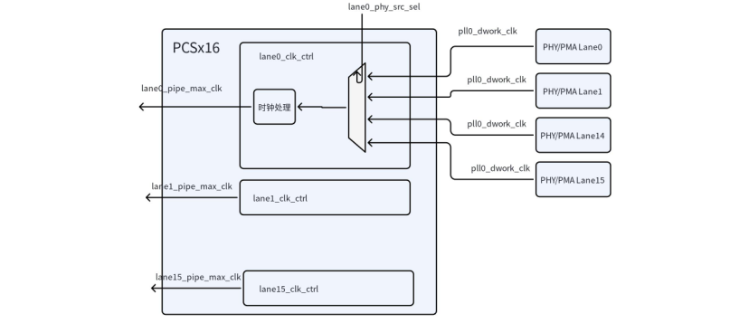

4.3 核心配置规则

|  |
| --- |
| 同一链路中的所有 lane，必须选择该链路中最低 lane 编号对应的 PHY 的时钟源。 |

这一规则是同步的核心保证：它强制同一 link 的所有 lane 从同一个 PHY PLL 取时钟，从源头避免了相位差异。

4.4 配置示例

假设本地硬件为 2 颗 x2 PHY：PHY0 接 lane 0-1，PHY1 接 lane 2-3。

|  |  |  |  |  |
| --- | --- | --- | --- | --- |
| 本地拓扑 | lane 0 phy\_src\_sel | lane 1 | lane 2 | lane 3 |
| 1 条 x4 link | 2'b00 (PHY0) | 2'b00 (PHY0) | 2'b00 (PHY0) | 2'b00 (PHY0) |
| 2 条 x2 link | 2'b00 (PHY0) | 2'b00 (PHY0) | 2'b01 (PHY1) | 2'b01 (PHY1) |

4.5 配置时机与约束

两个信号均在系统初始化阶段、phy\_reset 解复位之前完成配置。任何更改都必须后接 phy\_reset 置位，因此这类配置属于静态/启动时配置，不支持运行时动态更改。

初始化时序：

|  |
| --- |
| Plain Text                   1. 上电                   2. 配置 pipe\_laneX\_link\_num + pipe\_laneX\_phy\_src\_sel         3. 置位 phy\_reset            4. 解复位 phy\_reset                    5. PHY 校准、PLL 锁定                   6. Link Training 开始 |

4.6 配置者

两个信号均由 MAC / Controller（或者内部固件）驱动，是 PCS Wrapper 的顶层输入端口。它们不是 RTL 编译宏，也不是固件寄存器。

---

# 10. [PCIE] 为什么高速率之后必须换一种打包方式：Flit Mode 与 Non-Flit Mode

> 来源：https://mp.weixin.qq.com/s/YsZCqS1RXHQmOIT8r_GUyQ
> 作者：周漾
> update 2026/08/29 13 : 46
> **已截图**

**[PCIE] 为什么高速率之后必须换一种打包方式 Flit Mode 与 Non-Flit Mode**

**导读**

前几天被问到一个问题：同样是 PCIe，为什么讲到 64GT/s 这一代，突然冒出一个"Flit Mode"的新概念，像之前几代协议里从来没听过。查了一圈资料才发现，这不是一个孤立的新特性，而是信号速率提高到某个临界点之后，原来那套打包方式撑不住了，不得不换一套新的容器结构。这篇文章想把 Flit Mode 和 Non-Flit Mode 的本质区别讲清楚，尤其是"为什么必须换"这一层原因。

**一、Non-Flit Mode：可变长度的包，靠标记符号定边界**

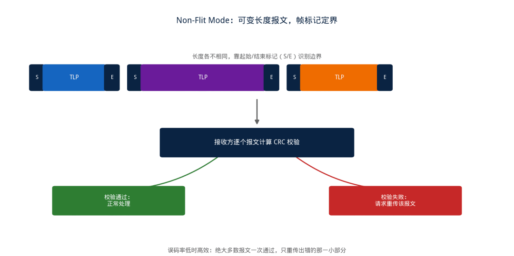

在 64GT/s 这一代之前，PCIe 的链路层一直用的是一种"可变长度打包"的方式：一个 TLP（事务层报文）想多长就多长，具体长度由报文本身带的长度字段决定；报文的起始和结束，靠专门的帧标记符号来界定——发送方在报文开头插入一个起始标记，结尾插入一个结束标记，接收方靠识别这两个标记，从连续的比特流里把一个个报文正确地切出来。

这种方式的可靠性保障，是以"每个报文独立校验、独立重传"为单位的：每个 TLP 都带有自己的循环冗余校验（CRC），接收方算出来的校验结果和报文里携带的不一致，就判定这个报文出错，通过应答报文告知发送方"这一个报文要重发"，发送方从自己的重传缓冲区里把对应的报文重新发一遍。**可变长度 + 帧标记定界 + 逐包校验重传**，这三件事绑在一起，构成了 Non-Flit Mode 的核心逻辑。

这套方式在信号速率不那么高的时候运转得很好，原因很直接：**原始误码率足够低**。链路上因为噪声、抖动等因素偶然翻转一个比特的概率很小，绝大多数报文一路平安到达，逐包校验、有错才重传的模式，平时几乎不产生额外开销，只有真正出错的那一小撮报文才需要重新发送一次，整体效率很高。

**二、速率提高之后，原来的假设不成立了**

把信号速率推到 64GT/s 这一档，链路层不得不面对一个新问题：调制方式从原来的二电平（NRZ）换成了四电平（PAM4）。同样的物理噪声水平下，四电平调制要在更接近的几个电压区间之间做判决，天然比二电平调制更容易判断错，原始误码率会有数量级上的抬升。

误码率一旦显著变高，Non-Flit Mode 那套"平时几乎不出错，出错了再重传"的逻辑就开始吃力——错误变得频繁，意味着重传变得频繁，而重传本身是有代价的——不仅要重新占用链路带宽重发数据，还要等一整个来回时延才能确认某个报文确实需要重传，链路速率越高，这个延迟相对损失的带宽就越可观。**光靠事后重传去对抗一个高得多的原始误码率，代价已经划不来了。**

更麻烦的是帧标记定界这件事本身：可变长度报文靠一两个特殊标记符号来界定边界，一旦这个标记符号本身在传输中被错误翻转，接收方可能会彻底找错报文的起止位置，导致后面一连串数据全部错位解析——标记本身出错的破坏性，比数据内容出错要严重得多。误码率变高之后，这种"定界标记出错导致连锁错位"的风险也随之上升。

这两个问题合在一起，倒逼出了 Flit Mode 这样一套新的打包方式。

**三、Flit Mode 的解法：固定大小容器 + 前向纠错**

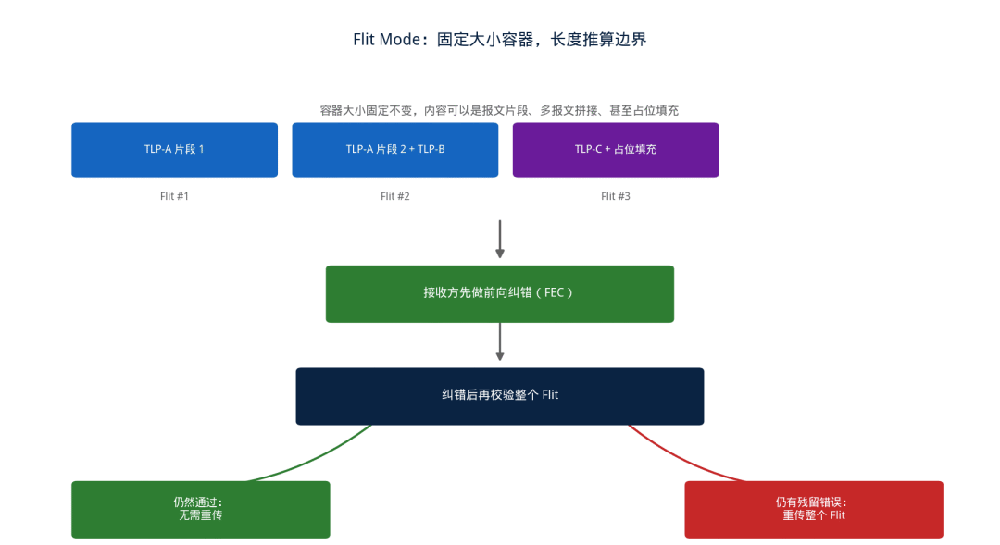

Flit（Flow Control Unit，流控单元）是 Flit Mode 里传输的基本单位，它和 Non-Flit Mode 里的 TLP 最大的不同是：**大小固定，不再是可变长度**。链路上所有的 Flit 都是同样大小的容器，一个个连续排列，接收方永远知道下一个 Flit 从哪里开始、到哪里结束，完全不需要再依赖某个特殊标记符号去定位边界——边界信息直接由固定长度这个规则本身给出，不会因为某一位翻转而找错位置。

一个 Flit 容器内部，可能装着一个较大 TLP 的一部分，也可能装着好几个较小的 TLP 拼在一起，具体怎么切分由发送方按当前有哪些数据要发来决定；如果暂时没有足够的有效数据填满这个容器，就用占位数据补齐，容器大小始终不变。这种"内容可以变，容器大小不变"的设计，把"定位边界"和"内容本身"这两件事彻底解耦了。

固定大小容器还带来另一个关键能力：**前向纠错（FEC）**。因为每个 Flit 大小固定、结构规整，可以按照固定的规则在容器里周期性地嵌入一些冗余校验信息，接收方拿到这些冗余信息后，很多情况下能够直接在本地把发生翻转的比特纠正回来，根本不需要触发重传。这是应对高误码率最直接的办法——**与其等错误发生了再花一次往返时延去重传，不如让接收方自己就有能力把大多数错误纠正掉**。整个 Flit 结束时还会附带一个针对整个容器的校验字段，用来判断经过前向纠错之后，这个 Flit 是否还残留着无法修复的错误，只有这种情况才会真正触发重传。

**四、重传粒度的变化：从报文级变成容器级**

Non-Flit Mode 里，重传的单位是一个个独立的 TLP，每个报文各自校验、各自决定要不要重传。Flit Mode 里，重传的单位变成了 Flit 本身——不管这个 Flit 里装的是一个大报文的片段，还是好几个小报文的拼接，一旦这个容器经过纠错后仍然判定有错，就要把整个 Flit 重新发一遍，而不是去追究里面具体是哪个报文的哪一部分出了问题。

这个变化背后的逻辑是：固定大小的容器本身就是最小的可寻址、可编号单位，重传的粒度天然就跟着容器走，而不是跟着容器里装的报文内容走。

对验证和调试来说，这个粒度变化意味着排查思路也要跟着变：Non-Flit Mode 下"哪个报文丢了、错了"是一个直接能问的问题；Flit Mode 下先要确认是哪个 Flit 序号出了问题，再去看这个 Flit 里恰好装了哪几个报文的哪些片段，报文和容器之间不再是一一对应的关系。

**五、代价：小报文场景下的容器利用率**

固定大小容器不是没有代价的。如果实际要传输的数据远小于一个 Flit 的容量，容器里大部分位置都要用占位数据填充，这部分带宽实质上被浪费掉了——这是用可预测的边界、更强的纠错能力，换来的开销。

这也是为什么 Non-Flit Mode 至今仍然保留在协议里，没有被 Flit Mode 完全取代：在信号速率不高、原始误码率本来就低的场景下，Non-Flit Mode 可变长度打包的效率优势依然成立，没有必要为了应对一个并不存在的高误码率问题，去承受固定容器带来的填充开销。**两种模式的取舍，本质上是"按需变长、事后补救"和"固定容器、事前防护"之间，随着原始信道质量变化而变化的一次权衡。**

这也解释了为什么 Flit Mode 在协议里是从 64GT/s 这一档开始成为强制要求，而不是从一开始就通用——只有当原始误码率真的高到让事后重传的代价难以接受时，固定容器加前向纠错的方案才划算。

**六、验证中值得关注的几个点**

**边界推算的一致性**：验证 Flit Mode 时，需要确认接收方对 Flit 边界的推算完全基于固定长度规则，构造压力场景（比如背靠背连续多个 Flit）确认边界推算不会因为内容巧合而出现误判。

**纠错与重传的边界条件**：需要覆盖"错误数量恰好在纠错能力边界上"的场景——比纠错能力少一位的错误应该被正确纠正且不触发重传，超出纠错能力的错误应该被正确识别并触发重传，这个边界最容易暴露纠错逻辑实现上的偏差。

**跨容器报文重组**：一个较大 TLP 跨越多个 Flit 传输时，需要验证接收方在其中一个 Flit 触发重传的情况下，能否正确地把重传回来的内容和已经收到的其他片段重新拼接成完整报文，不会因为重传打乱了原有的顺序假设。

**多报文合并封装的正确拆分**：多个小 TLP 拼进同一个 Flit 的场景，需要验证接收方能够正确地从一个 Flit 里拆出多个独立报文，不会把拼接边界和报文本身的内容混淆。

**模式协商与混合链路场景**：链路两端在建链阶段需要协商是否使用 Flit Mode，验证需要覆盖协商失败或者两端能力不一致时的回退行为，确认链路能够正确降级到双方都支持的模式，而不是维持在一个不一致的状态下继续传输。

**七、总结**

Flit Mode 和 Non-Flit Mode 的核心差异，可以归结成一句话：**Non-Flit Mode 用可变长度换取效率，靠帧标记定界、逐包校验重传来应对低误码率环境；Flit Mode 用固定大小容器换取确定性，靠前向纠错减少重传次数，来应对高误码率环境。** 两者不是新旧替代关系，而是分别适配了不同信道质量下的最优策略。

理解了这层"信道质量变了，打包策略也要跟着变"的因果关系，再遇到 Flit Mode 相关的具体规则（容器多大、纠错能力多强、什么时候强制启用）时，大多能顺着"这解决的是原始误码率升高之后的哪个具体麻烦"这条思路，找到设计动机所在。

---

# 11. PCIe Flow Control详解——信用从产生到消耗的完整故事

> 来源：https://mp.weixin.qq.com/s/ZDHxX0FskY9QQx2tQ7C3YA
> 作者：周漾
> update 2026/08/29 13 : 51
> **已截图**

**导读**

有一次在分析仿真日志时发现发送方停了很久、没有发出任何 TLP，一开始以为是设计 bug，后来才发现是流控信用耗尽导致的——接收方缓冲还没有释放，发送方只能等。这件事让我重新认真看了一遍 PCIe 流控规范。信用机制听起来简单，背后的细节却很有意思。这篇文章把整个信用生命周期捋一遍，希望对碰到类似问题的人有帮助。

**一、为什么 PCIe 需要流控**

PCIe 是一个点对点的串行总线，链路两端的发送方和接收方之间没有共享总线的仲裁机制。接收方有有限的缓冲区，一旦发送方发送过快、接收方来不及处理，数据就会丢失。

早期的并行总线可以用硬件握手信号（比如 ready/valid）来做实时背压。PCIe 在高速串行链路上不能这样做——往返延迟使得实时握手不现实。于是规范引入了**信用（Credit）**机制：接收方提前告诉发送方自己还能接收多少，发送方在信用范围内自由发送，超出后等待。这是一种基于预告的流控，而不是基于反馈的流控，本质上是把"能接收多少"这个信息提前传递出去，消除了实时握手的延迟代价。

**二、三类信用，每类两个维度**

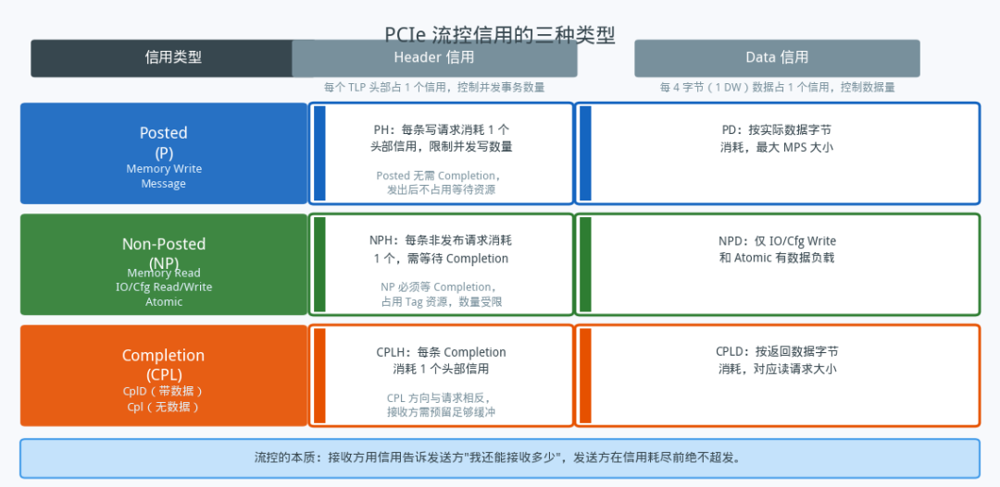

PCIe 规范把 TLP 分成三大类，每类对应一套独立的信用体系：

**Posted（P）**：单向发送、无需等待回应的事务。内存写请求和消息属于这一类。Posted 发出后，发送方不等任何 Completion，因此它不会占用 Tag 等待资源。

**Non-Posted（NP）**：需要等待 Completion 的事务。内存读请求、IO/配置空间读写、Atomic 操作都属于这一类。Non-Posted 的发送方必须保留 Tag，等待目标方完成处理后通过 Completion 返回结果。

**Completion（CPL）**：专门用于响应 Non-Posted 请求的事务类型，方向与原始请求相反。

这三类事务各自有两个信用维度：**Header 信用**和 **Data 信用**。Header 信用以 TLP 为单位——发送一个 TLP 头部消耗一个 Header 信用，用于控制并发事务的数量；Data 信用以 4 字节（1 DW）为单位，用于控制实际数据量，与接收缓冲的容量直接对应。

这样，六种信用（PH/PD、NPH/NPD、CPLH/CPLD）独立运作。某一类信用耗尽，只会阻塞该类事务，不影响其他类别的发送。这个设计让不同优先级、不同方向的事务之间互不干扰。

**三、信用的完整生命周期**

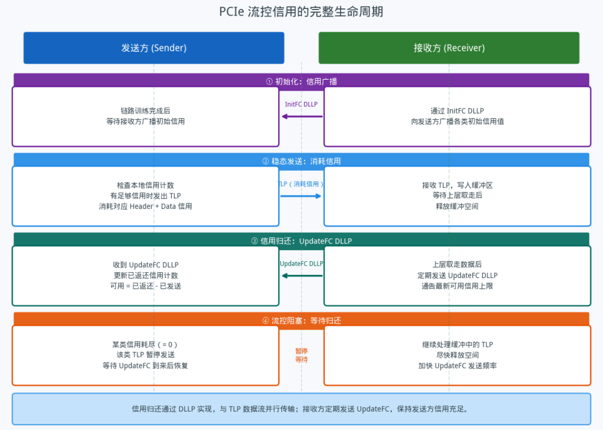

**初始化阶段**：链路训练完成后，双方进入流控初始化序列。接收方通过特殊的链路层数据包（DLLP）向发送方广播六类信用的初始值。这个过程需要确认握手，完成后双方才能开始正式的 TLP 传输。初始信用值直接反映接收方在启动时刻能提供的缓冲容量。

**稳态发送阶段**：发送方维护两个计数器：已发送（consumed）和已授权（allocated）。每次发送 TLP 之前，先检查目标信用类型的 available = allocated - consumed 是否大于零。有信用就发，发完计数；没有信用就等。

**信用归还阶段**：接收方的缓冲区在上层取走数据后会被释放。每当可用缓冲增加，接收方就通过 UpdateFC DLLP 向发送方通告最新的 allocated 上限。发送方收到后更新本地的 allocated 计数，重新计算 available，若有信用可用则恢复发送。

**流控阻塞阶段**：当某类信用 available 降为零，发送方停止发送该类 TLP，直到收到新的 UpdateFC 为止。这是设计正常行为，不是故障——仿真中看到发送方静默一段时间，首先应该排查流控是否为原因。

UpdateFC DLLP 的发送频率直接影响总线利用率。接收方应当尽快发送 UpdateFC，规范也规定了最大允许的归还延迟，超出会被视为错误。

**四、无限信用与信用计数逻辑**

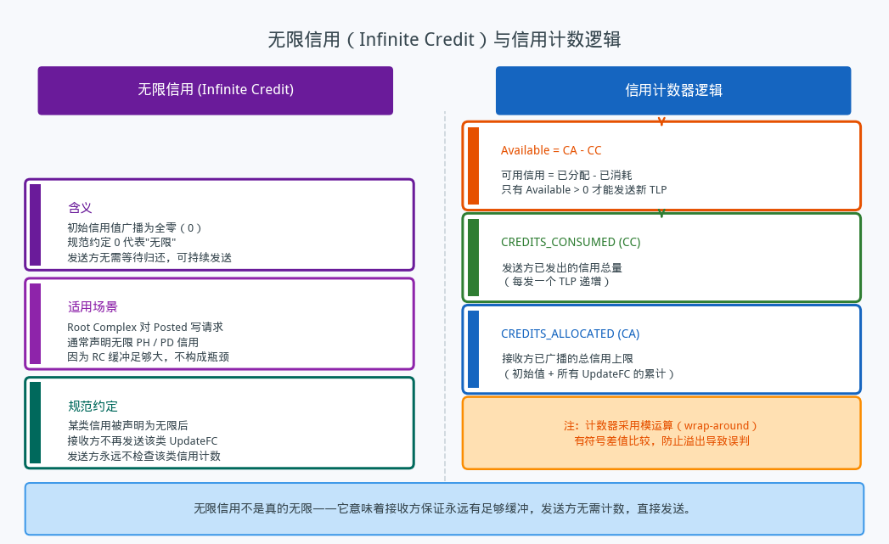

PCIe 规范规定，如果某类信用的初始广播值为全零，表示该类信用是**无限（Infinite）**的。发送方收到初始值为零的信用后，将其视为"无须检查、随时可发"，不维护该类计数器，接收方也不需要再发 UpdateFC。

无限信用并不是真的没有限制——它的含义是接收方向发送方做出承诺：对这类事务，我的缓冲永远够用，你不需要担心，尽管发。实践中，Root Complex 对下行的 Posted 写通常声明无限 PH 和 PD 信用，因为系统内存侧的缓冲资源充裕，不会构成瓶颈。

信用计数器在实现上有一个值得注意的细节：计数器是有限位宽的，会发生溢出（wrap-around）。规范要求用有符号差值来判断 available 的大小，而不是直接比较绝对值，这样即使计数器绕回也能正确判断是否还有可用信用。如果实现用无符号比较，一旦计数器绕回就会产生误判，导致发送方在明明有信用的情况下停止发送，或者在无信用时继续发送。

**五、验证中的几个关注维度**

流控机制在仿真中相对难以直接观察，但它是很多"奇怪的发送停顿"背后的真正原因。以下几个维度在验证时值得重点关注：

**初始化完整性**：六类信用的 InitFC 序列必须全部完成，且确认握手正确。任何一类初始化未完成，对应类型的 TLP 发送都会被阻塞。边界情况是某类信用初始值为零（无限信用），需确认发送方正确识别并跳过该类信用检查。

**信用计算正确性**：在发送方视角，每次消耗信用后的 available 计算必须正确。Counter wrap-around 场景是容易出错的点——刻意构造信用计数器接近边界的场景，验证有符号比较逻辑是否正确。

**UpdateFC 的及时性**：接收方在缓冲释放后延迟多久才发送 UpdateFC？延迟过大会导致发送方长时间等待，影响带宽。验证时可以测量从缓冲释放到 UpdateFC 发出之间的延迟，对照规范允许的最大值。

**各类信用独立性**：某一类信用耗尽时，其他类别的 TLP 不应受到影响。构造单一类型信用耗尽的场景，观察其他类型是否继续正常传输。

**无限信用场景**：验证接收方正确广播零值、发送方正确识别无限信用并不发送该类 UpdateFC。若实现错误地发送了对无限信用的 UpdateFC，或者发送方错误地等待一个永远不会到来的信用归还，都会产生协议违规或活锁。

**六、总结**

PCIe 流控的设计思路是一套精妙的预告机制：接收方不是在快撑满时才叫停发送方，而是提前告知容量，让发送方在安全范围内自由发。三类事务、六种信用独立计数，让不同流量之间互不干扰。InitFC 广播初始值，UpdateFC 持续归还，计数器 wrap-around 用有符号差值处理——这些细节加在一起，构成了一个在高速串行链路上既高效又健壮的流控体系。

下次在仿真中看到发送方莫名其妙停止发送，先看看是不是流控等在那里——大概率是的。

---

# 12. 写事务的边界与拆分：Large Write 背后的 PCIe 规范

> 来源：https://mp.weixin.qq.com/s/lK2Q6USeUtV4BP-mYIYHFw
> 作者：周漾
> update 2026/08/29 13 : 52
> **已截图**

**从 TLP、MPS 到内部总线写机制**

*芯片验证 · PCIe · 总线协议 · 写事务*

**摘要**：一笔写事务为什么不能随意大？为什么超过某个边界就必须拆分？为什么拆出的碎片需要用 chain 位串联起来？这些问题的答案根植于 PCIe 规范——TLP 格式、MPS 协商、流控信用、4KB 边界规则。Large Write 特性正是在这套规范框架下，把内部写事务的粒度从 64B 提升到 256B，从而减少拆分次数、降低信用消耗、提高总线效率。本文从 PCIe 规范出发，把整个机制串讲一遍。

**零、PCIe 规范的基础约束**

在理解大写事务拆分之前，需要先建立三个 PCIe 规范概念。

**TLP（Transaction Layer Packet）** 是 PCIe 的最小传输单元。一笔内存写操作对应一个 Memory Write TLP，由头部和数据载荷两部分组成。头部携带地址、长度、请求者 ID 等控制信息；数据载荷就是实际写入的字节。

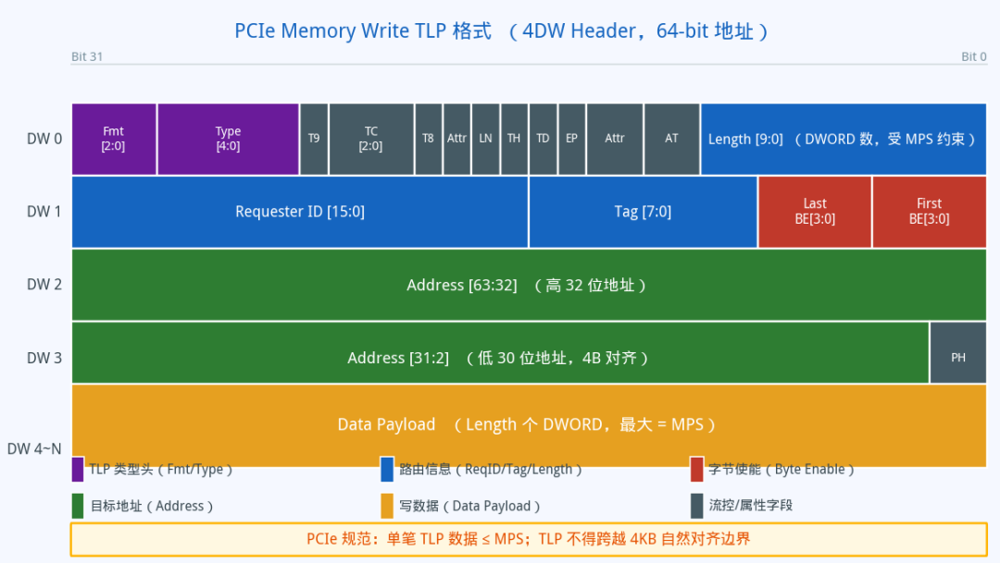

**MPS（Max Payload Size）** 是 PCIe 规范定义的关键参数，限制单个 TLP 数据载荷的最大字节数。MPS 在链路枚举阶段协商，取链路两端 MPS 能力的最小值，写入设备控制寄存器（Device Control Register[7:5]），可选值从 128B 到 4096B。单笔 Memory Write TLP 的数据量不得超过 MPS。

128B 是规范强制要求的最小值，所有符合 PCIe 规范的设备都必须支持。这个数字不是随意选的：Memory Write TLP 的头部本身占 12～16 字节，如果数据载荷只有 32B 或 64B，头部开销占比就会超过 30%，总线效率极低；而 128B 把头部占比压到约 10%，在传输效率和接收端缓冲成本之间找到了合理的平衡点。128B 也恰好是两条 x86 缓存行，对 DMA 场景有天然的对齐优势。更高的 MPS（256B、512B……）需要设备主动声明支持，链路两端取能力的最小值，这就是为什么大量嵌入式或低功耗设备只支持 128B，也是 Large Write 依赖 MPS≥256B 才能完整发挥效果的根本原因。

**4KB 边界规则**：PCIe 规范明确要求，任何单笔 Memory Write TLP 不得跨越自然对齐的 4KB 地址边界。一笔跨越 4KB 边界的写请求必须拆成两笔。

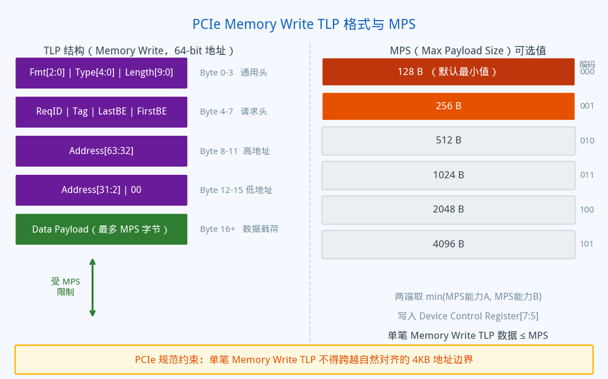

**一、流控信用：写为什么要先申请空间**

PCIe 使用信用（Credit）机制进行流量控制。接收方在链路初始化时向发送方通告自己有多少缓冲信用，发送方每发出一笔事务就消耗对应的信用，等到接收方处理完并释放信用后才能继续发送。

与写事务直接相关的是两类信用：Posted Header Credit（PH，控制写请求的数量）和 Posted Data Credit（PD，控制写请求的数据量）。数据信用的最小单位是 4 字节（1 DWORD）。

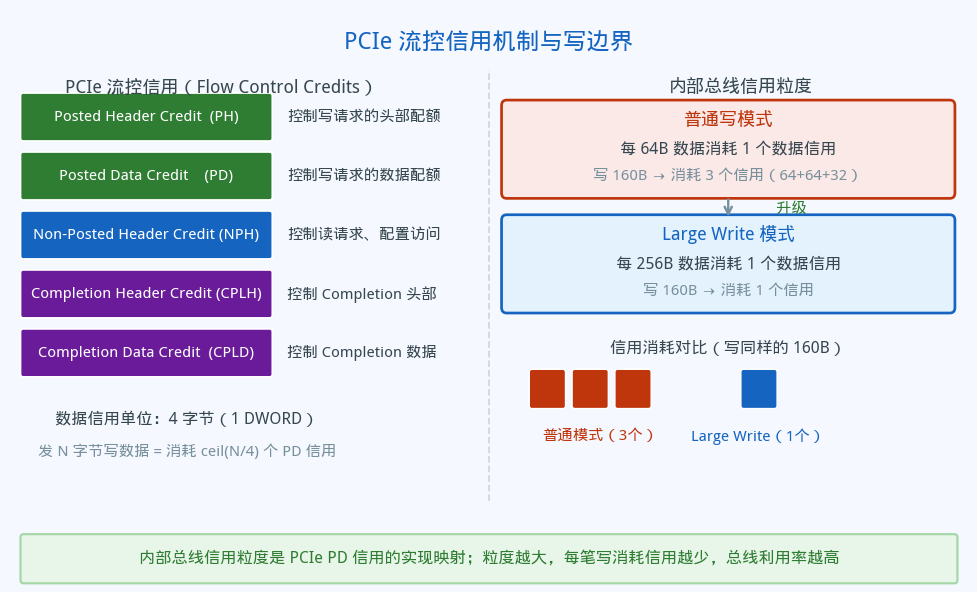

信用粒度对效率影响极大：内部总线每次传输消耗一个数据信用，粒度越细，同样的数据量需要消耗更多的信用事务；粒度越粗，同样的数据量消耗的信用越少，总线利用率越高。这正是 Large Write 从 64B 升级到 256B 粒度带来的核心收益。

**二、普通写模式：64B 边界 + Chain 串联**

在不启用 Large Write 的情况下，内部总线写事务的边界是 **64B**。一笔原始写事务如果跨越了 64B 边界，就必须在边界处拆分。

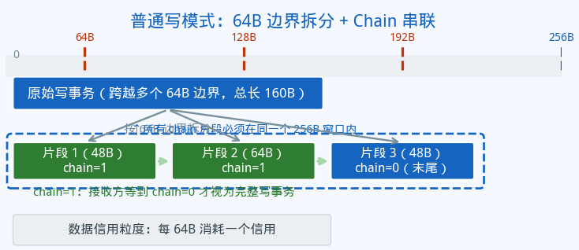

拆出的多个片段通过 **chain 位**串联：

非最后片段：chain=1，告诉接收方"这笔写还没结束，继续等"

最后片段：chain=0，接收方将本次 chain 链内所有片段合并，视为一次完整写

这个设计来自 PCIe TLP 的组包逻辑：一笔超出 MPS 的写必须拆成多个 TLP，接收端在重组时需要知道哪些 TLP 属于同一笔逻辑写。chain 机制就是内部总线对这个"同组标记"的实现。

但 chain 有一个强约束：**所有 chain=1 的片段必须落在同一个 256B 窗口内**。到达 256B 边界时，chain 必须置 0，下一组重新开始。这对应了 PCIe 规范中 MPS=256B 时的拆分粒度——超过 256B 的写必须分组，每组独立处理。

每发送 64B 数据消耗一个数据信用，写 160B 数据需要消耗 3 个信用。

**三、Large Write 模式：256B 边界，去掉 Chain**

启用 Large Write 后，写事务的边界从 64B 扩展到 **256B**，直接对齐 MPS=256B 的 TLP 载荷大小。

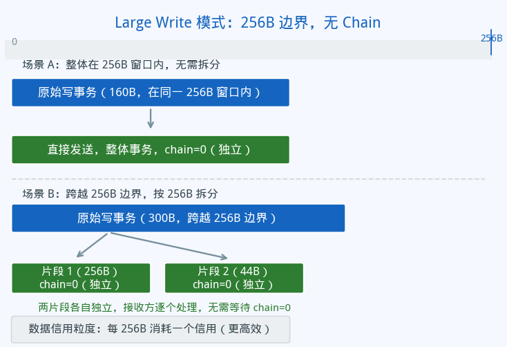

在 256B 窗口内的写事务整体发送，chain=0，无需串联。跨越 256B 边界时在边界处拆开，每个片段独立，各自 chain=0，接收方逐个处理。

去掉 chain=1 意味着：接收端不再需要维护"等待下一片"的中间状态，每笔收到的写请求都是完整的。这大幅简化了接收端的实现，也消除了因 chain 状态机引入的延迟和错误风险。

信用粒度同步从 64B 升为 **256B**，写同样的 160B 数据只需消耗 1 个数据信用，而不是之前的 3 个。信用消耗频率下降，相同的信用池能支撑更高的写带宽。

**四、读事务不受影响**

PCIe 读事务（Memory Read TLP）只携带地址和长度，没有数据载荷，不受 MPS 约束。读的对应约束是 MRRS（Max Read Request Size，最大读请求大小）和 RCB（Read Completion Boundary，读完成边界）。

内部总线的读事务始终按 **256B 边界**拆分，无论 Large Write 是否开启，行为完全一致。Large Write 这个名字已经明确：它只影响写，读不在讨论范围内。

**五、普通模式 vs Large Write 模式：一眼看差异**

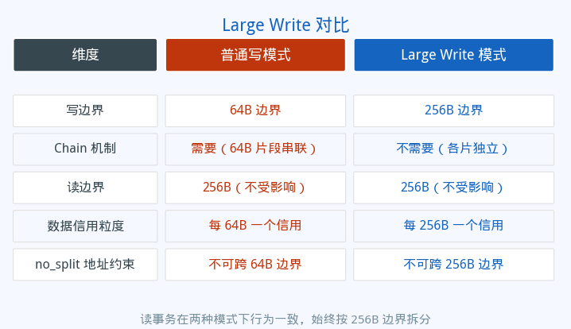

两种模式的分水岭是写边界：64B 还是 256B。边界决定了拆分粒度，拆分粒度决定了 chain 机制是否存在，也决定了信用消耗的效率。

从 PCIe 规范视角看，Large Write 模式让内部总线的写粒度与 MPS=256B 的 TLP 载荷大小对齐，减少了从 PCIe TLP 到内部总线事务之间的"不必要的二次拆分"，是内部实现对规范能力的更充分利用。

**六、拆分决策的完整流程**

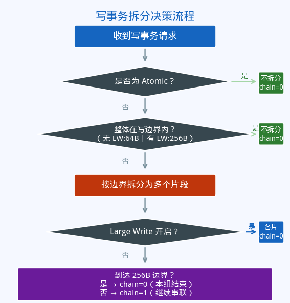

Atomic 操作不受边界约束，整体发送。普通写事务先判断是否在写边界内（64B 或 256B），在边界内整体发送；超出边界进入拆分逻辑：Large Write 开启时各片段独立，否则逐片判断是否到达 256B 窗口边界来决定 chain 值。

**七、Large Write 的限制与注意事项**

Large Write 不是没有代价的，启用前有四点需要清楚。

**硬件能力是前提。** Large Write 需要链路两端同时支持才能开启。如果接收端不具备这个能力，只能回退到普通写模式，写边界和信用粒度都回到 64B。这意味着在异构系统中，Large Write 的覆盖面受制于能力最弱的那一端。

**no\_split 模式下地址约束变严了。** 普通写模式的 no\_split 约束是"事务地址不得跨越 64B 边界"，启用 Large Write 后变成"不得跨越 256B 边界"。表面上限制变宽松了（从 64B 变成 256B），但实际上 256B 对齐比 64B 对齐更难满足，会压缩随机地址测试的可选空间，降低边界附近的地址覆盖率。如果验证序列没有针对性地补充 256B 边界附近的地址场景，这部分覆盖空白很容易被忽视。

**小写事务的信用效率可能反而变差。** 信用粒度从 64B 升到 256B，意味着接收端要为每笔写事务预留 256B 的缓冲配额，哪怕实际写入只有几十字节。在写事务普遍偏小（远小于 256B）的场景下，Large Write 不仅无法节省信用，反而会让接收端的缓冲利用率下降，因为大量配额被"锁住"却没有被充分使用。

**与 MPS 的耦合。** Large Write 把内部写事务的粒度对齐到 256B，但最终到了 PCIe TLP 层，单笔 TLP 的数据量仍不能超过链路协商的 MPS。如果 MPS=128B（默认最小值），256B 的内部写事务到了 TLP 层还是要再次拆分，Large Write 带来的拆分次数减少优势在此场景下大打折扣。只有当 MPS≥256B 时，两层粒度才能对齐，Large Write 才能完整发挥作用。

**八、实际验证中的关键测试点**

以下测试点来自对验证环境的代码分析，涵盖了 Large Write 功能正确性的核心检查面。

**测试点一：拆分边界的正确性**

核心要验证的是：写事务在边界处能否被正确切割。需要覆盖三类地址场景——事务地址恰好落在边界上、事务起始地址在边界之前但大小超过边界、事务整体在边界内不需拆分。两种模式下分别用 64B 边界（普通模式）和 256B 边界（Large Write 模式）作为切割点，每个场景都应跑出覆盖率。普通模式下还要验证拆出的各片段 chain 值是否正确：中间片段 chain=1，最后片段 chain=0，且在 256B 窗口结束处 chain 必须重置。

**测试点二：信用计数的正确性**

信用验证分两个维度：动态检查和静态检查。动态检查指在仿真过程中实时监控信用计数，要求信用不能出现下溢（released - taken 不能为负）；静态检查指在测试结束时验证所有信用都已完整归还，即 released - taken 等于初始信用总量。Large Write 模式下，每笔写消耗的数据信用数量变为 256B 对应的份额，需要确认信用消耗逻辑随模式切换正确更新，不能出现仍按 64B 计算的情况。

**测试点三：信用耗尽场景**

当可用信用降至零时，发送方必须停止发送并进入阻塞等待。需要验证：阻塞状态能被正确识别、阻塞期间没有新的写事务被发出、待接收方释放信用后发送能正确恢复。Large Write 模式下信用粒度更大，每笔写消耗更多信用，信用池更容易被快速耗尽，这个场景在 Large Write 模式下尤为重要。

**测试点四：no\_split 模式与边界约束的一致性**

no\_split 模式要求事务地址不得跨越写边界，在普通模式是 64B，在 Large Write 模式是 256B。验证时需要确认约束随模式变化正确生效：Large Write 开启后，原来仅需不跨 64B 的地址限制变为不跨 256B，如果随机地址生成器没有跟随模式更新约束，就会出现非法地址的写事务漏掉拆分逻辑。

**测试点五：Atomic 操作不受拆分逻辑影响**

Atomic 操作（如 FetchAdd、Swap、CAS）在任何模式下都不拆分，整体发送，chain=0。需要验证在 Large Write 模式下 Atomic 操作的行为没有因为拆分逻辑的变化而受到影响，Atomic 的原子性得到保证。

**测试点六：地址边界附近的随机覆盖**

验证框架通常通过专门的地址分布参数来控制生成落在边界附近的事务概率。对于 Large Write，需要专门确保 256B 边界处的写流量被充分覆盖——包括跨边界的写（需拆分）和恰好到达边界的写（不拆分，chain=0）。这两类场景在普通模式下对应 64B 边界，切换到 Large Write 后对应 256B 边界，如果没有针对性的测试点，256B 边界的分支很可能处于覆盖盲区。

**九、总结**

Large Write 的本质是一次内部总线写粒度的升级，但它的根源在 PCIe 规范中：

MPS 决定了单个 TLP 能携带多少数据；信用机制决定了发送方每次消耗多少缓冲配额；4KB 边界规则和 MPS 共同决定了写事务需要在哪里拆分。内部总线的 64B/256B 边界，是对这些规范约束的具体实现选择。

普通写模式选 64B，粒度细、chain 复杂、信用消耗多；Large Write 模式选 256B，粒度与 MPS 对齐、无 chain、信用高效。两者都合规，但后者在 MPS=256B 的场景下更充分地利用了 PCIe 规范允许的能力上限。

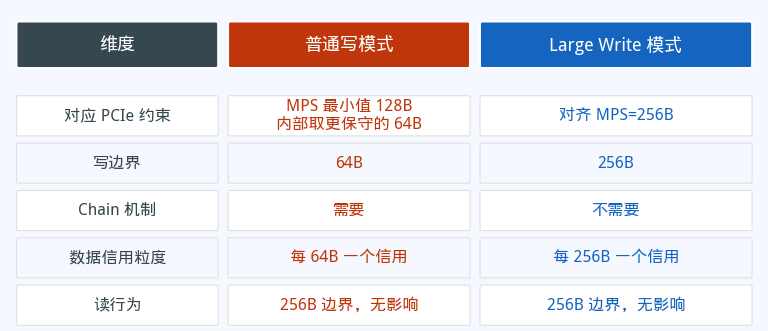


点击蓝字，关注我们

---

# 13. PCIe Function 层级详解

> 来源：https://mp.weixin.qq.com/s/SvAZPy5WtFuz2nTOO018LQ
> 作者：周漾
> update 2026/08/29 13 : 53
> **已截图**

*芯片验证 · PCIe · 虚拟化*

今天被同事问到一个问题：为什么 PCIe 里会有 VF，PF 和 VF 究竟是什么关系？我愣了一下，发现自己虽然天天和这些概念打交道，却没办法从头到尾讲清楚。于是去翻了翻资料，整理成这篇文章。

**前置概念速查**

>

- **PCIe EP**（Endpoint）：挂在 PCIe 链路末端的设备，如 GPU、网卡、NVMe 控制器

- **BDF**：Bus:Device:Function，PCIe 的三级寻址，唯一标识总线上的一个 Function

- **Config Space**：每个 Function 独立拥有的配置空间，软件通过 BDF 访问

- **Hypervisor / VM**：虚拟化场景下的宿主软件与虚拟机

**本文关注于**：

- PCIe 里 Function 是什么，为什么它是软件交互的最小粒度
- PF 和 VF 各自的职责，以及它们之间的从属关系
- SR-IOV 的标准工作流程
- MF-IOV 与 SR-IOV 的核心区别：重映射 vs 原生 VF
- 验证工程师在这套层级中需要关注什么

**摘要**：在 PCIe 设备虚拟化领域，PF 和 VF 是绕不开的两个概念。PF 是真实存在于硬件上的功能单元，而 VF 是由 PF 派生出的轻量级虚拟功能——它有独立的配置空间和 BAR，但共享 PF 的物理资源。实现这一派生关系的机制有两种：业界标准的 SR-IOV，以及更激进的 MF-IOV。理解它们的设计逻辑，是理解现代多功能 PCIe 设备行为的基础。

零、起源：为什么需要 PF 和 VF

故事要从服务器虚拟化说起。

2000 年代中期，VMware、Xen 等 Hypervisor 开始流行，一台物理服务器可以跑几十个虚拟机。CPU 和内存的虚拟化问题很快被解决了，但 I/O 设备——尤其是网卡——成了新的瓶颈。

**最早的做法是软件模拟**：Hypervisor 拦截虚拟机的每一次网卡读写，用软件模拟硬件行为，再转发给真实网卡。这能跑，但性能极差——每次数据包都要经过 Hypervisor 的多次上下文切换，吞吐量只有裸机的几分之一。

**第二种尝试是 Pass-through（直通）**：把整块物理网卡直接分配给某一个虚拟机，绕过 Hypervisor，性能接近裸机。但问题随之而来——一块网卡只能给一个 VM，其他 VM 怎么办？买更多网卡？机箱里的 PCIe 插槽有限，成本也高。

**真正的问题变成了**：能不能让一块物理网卡同时被多个虚拟机以接近裸机的性能独占访问，同时彼此完全隔离、互不干扰？

这个问题在 2007 年前后推动 PCI-SIG 制定了 SR-IOV 规范，给出了答案：**在硬件层面把一块物理设备切成多个独立的逻辑功能单元**，每个 VM 拿到一个，直接访问，不经过软件模拟。

于是就有了两种角色：

- **PF（Physical Function）**：那块完整的硬件，负责管理和资源分配，归 Hypervisor 控制
- **VF（Virtual Function）**：从 PF 切出来的轻量级切片，每个 VM 独占一个，有完整的数据面访问能力，但无法越权管理设备

这不是凭空设计出来的抽象，而是数据中心实际痛点倒逼出来的工程解答。理解了这个背景，PF 和 VF 的设计取舍就很自然了。

一、从一个设备说起：Function 是什么

PCIe 用 **BDF（Bus:Device:Function）** 三元组唯一标识总线上的一个逻辑单元。Function 是软件实际交互的最小粒度——每个 Function 有独立的配置空间、BAR（Base Address Register）、中断向量，以及独立的读写权限控制。

一个物理 PCIe 设备可以暴露多个 Function，操作系统看到的是这些 Function，而不是"物理卡"本身。这种抽象让一张物理网卡可以同时被多个虚拟机独占使用。软件通过 BDF 寻址，感知不到"它们其实共用一块硅"。

## 13.1 PF（Physical Function）

PF 是设备上真正具备完整硬件资源的功能单元，是一切虚拟化的起点。

PF 拥有完整的配置空间，包含 SR-IOV Extended Capability，通过写寄存器控制 VF 的创建数量和使能状态。PF 负责设备的初始化、资源分配、驱动加载和复位控制。驱动运行在 Host 或 Hypervisor 层，对整个设备有完整控制权。

PF 通过 SR-IOV Capability 中的几个字段来管理 VF：一个使能开关控制 VF 是否对外可见，一个数量字段设置当前实际创建的 VF 数量（不超过硬件上限），一个首 VF 偏移量记录第一个 VF 相对于 PF 的路由 ID 偏移，一个步长记录相邻 VF 之间的路由 ID 间距，还有一个内存访问使能位控制该 Function 的 BAR 空间是否允许被访问。这些字段共同构成了 Hypervisor 控制 VF 生命周期的完整接口。

## 13.2 VF（Virtual Function）

VF 是由 PF 派生出的轻量级功能单元。它有独立的配置空间和 BAR，但**不拥有独立的物理资源**——所有 VF 共享同一 PF 的硬件引擎，只是在寻址和权限上被隔离开来。

VF 的本质是资源隔离，而非资源复制。VF 的配置空间极简，只包含必要的 Capabilities。VF 的 BAR 是 PF BAR 空间的一个分片，每个 VF 拿到固定大小的切片，互相不重叠。这种设计让一块物理 GPU 的 framebuffer 可以被切成多份，分别映射给不同的虚拟机。

VF 没有独立的 Device Number，它的 Routing ID 由 PF 的路由信息加上偏移量计算得来。PF 的配置空间中记录了首 VF 偏移和步长两个值：第一个 VF 的 Routing ID 等于 PF 的 Routing ID 加上首 VF 偏移，后续每个 VF 在前一个基础上再加一个步长。在 ARI 模式下，Function Number 扩展为 8 位，可容纳更多 VF。

VF 的可见性受两个条件联合控制：PF 的 SR-IOV 使能位已置起，且该 VF 的序号在当前配置的 VF 数量范围之内。驱动可以通过调整数量字段来动态扩缩可见的 VF 数目，无需改变硬件配置。

四、SR-IOV：标准的单根虚拟化

SR-IOV（Single Root I/O Virtualization）是 PCI-SIG 定义的标准规范，允许一个 PCIe 设备的单个 PF 派生出多个 VF，每个 VF 可以独立分配给一个虚拟机。

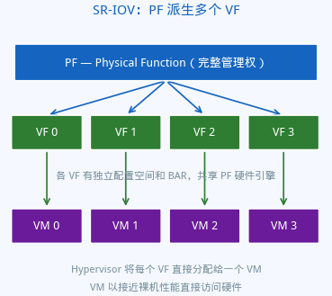

VF 有独立的配置空间和 BAR 切片，PF 保留完整管理权，VF 只有数据面访问权。Hypervisor 将每个 VF 的 Routing ID 分配给指定 VM，VM 通过 VF 直接访问硬件，完全绕过软件模拟层。

SR-IOV 的工作流程分四步：首先 OS/Hypervisor 发现 PF，读取 SR-IOV Extended Capability 获知 VF 的数量上限和 BAR 布局；然后为所有 VF 的 BAR 空间分配物理内存地址；接着配置 VF 数量字段并置起使能位，VF 开始对外可见；最后将每个 VF 分配给指定 VM，VM 通过 VF 独占访问硬件。

SR-IOV 标准要求 VF 的数量和 BAR 大小在硬件设计时就固定，不能动态改变。这也是 Resize BAR 等机制存在的原因——在固定框架内提供有限的灵活性。

五、MF-IOV：重映射的虚拟功能

MF-IOV（Multi-Function I/O Virtualization）是一种不同的虚拟化路径。它的核心思想是：**不把 VF 暴露为 VF，而是把它们重映射（remap）为普通的 PCIe Function**，让 OS 看起来像是有多个独立的 PF。

SR-IOV 的 VF 需要操作系统/Hypervisor 有 SR-IOV 感知能力。MF-IOV 把 VF 重新包装成普通 Function，操作系统用标准 PCIe 枚举流程就能发现它们，无需额外的 SR-IOV 驱动支持。

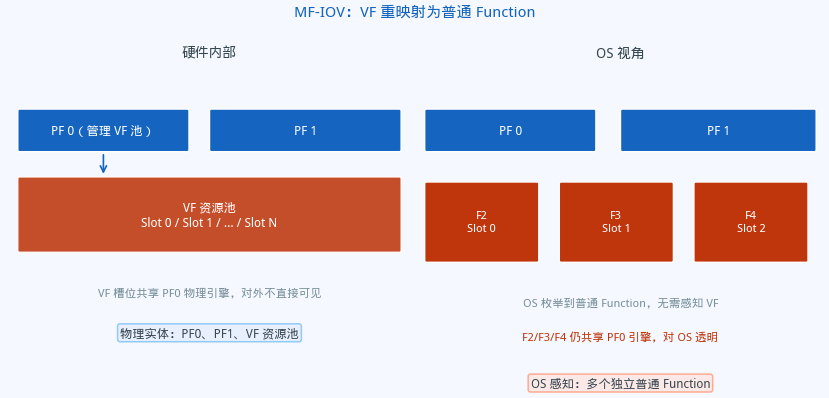

硬件内部，设备有若干 PF 和一个 VF 资源池，每个 VF 槽位在物理上仍共享 PF 的引擎。OS 看到的视图里，这些 VF 槽位被重映射成了普通 Function，枚举流程和访问方式与普通 PF 完全一样。硬件内部需要额外的地址翻译层，将这些重映射 Function 的访问路由到正确的 VF 资源。

MF-IOV 模式下，标准 SR-IOV VF 的数量为 0，两种机制不共存。重映射 Function 有独立的 BAR 和配置空间，但物理资源仍来自原 PF 的资源池。BAR 大小调整的控制路径与 SR-IOV VF 共用同一套机制。

每个重映射 Function 都携带两个关键信息：它逻辑上归属于哪个 PF 的资源池，以及它占用的是资源池中的第几个槽位。这两个信息在 MF-IOV 模式的地址路由和资源管理中至关重要。

## 13.3 SR-IOV 与 MF-IOV 的本质区别

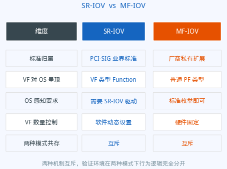

两者的根本分歧在于 VF 如何对外呈现。SR-IOV 选择把 VF 如实暴露给 OS，代价是需要 OS 有感知能力；MF-IOV 选择把 VF 包装成普通 Function，代价是硬件需要额外的地址翻译逻辑。两种机制互斥，芯片设计时选定其一，整个验证环境在两种模式下的行为逻辑完全分开。

七、验证视角：关注什么

**Function 的正确性**：每个 Function 的 BDF 是否唯一，Config Space 是否按规格正确初始化，BAR 空间是否与地址分配一致，内存访问使能状态是否符合预期。

**VF 的可见性边界**：VF 的可见性由使能位和数量字段联合控制。需要验证边界条件——刚好可见的最后一个 VF、使能位清零后 VF 消失、数量字段变化后的即时响应。

**Routing ID 的正确性**：VF 的 Routing ID 由首偏移和步长计算得来，需要验证每个 VF 的 BDF 与计算结果一致，ARI 模式和非 ARI 模式下的计算路径分别正确。

**SR-IOV 与 MF-IOV 的模式路径**：两种模式互斥，需要分别在两种配置下跑完各自的功能路径。进入 MF-IOV 模式后标准 VF 数量确实为 0，重映射 Function 的归属关系与配置一致。

**BAR 空间分配**：PF 的 BAR、VF 的 BAR 切片、重映射 Function 的 BAR 之间不能有重叠，Resize BAR 操作后地址空间重新布局仍然正确。

## 13.4 总结

**PF 是根，VF 是叶。** PF 持有完整的管理权限和物理资源，VF 是由 PF 派生的隔离视图。没有 PF 就没有 VF——PF 控制 VF 的生命周期、数量和可见性。

**SR-IOV 是标准路径。** VF 以 VF 身份暴露给 OS，需要 SR-IOV 感知的软件栈。VF 的 Routing ID 由 PF 加上偏移和步长计算，由使能位与数量字段联合控制可见性。

**MF-IOV 是重映射路径。** VF 被重映射为普通 PCIe Function，对 OS 完全透明。两种模式互斥，整个验证环境在两种配置下的行为逻辑完全分开。

**验证的核心**：BDF 唯一性、可见性边界、Routing ID 计算正确性、两种虚拟化模式互斥且各自路径完整，以及 BAR 空间布局无重叠。

求点赞


求分享


求喜欢


---

# 14. PCIe 上电的那 200ms：一张总线的自我修炼之路

> 来源：https://mp.weixin.qq.com/s/3N-YS7dCb_cmB9RbxNEVQA
> 作者：AI builder
> update 2026/08/29 14 : 51
> **已截图**

你插一块显卡或 NVMe SSD，按下电源键，BIOS 出现在屏幕上——这一切背后，PCIe 总线用不到 200ms 完成了一套严密的"握手仪式"。它从 Gen1 的 250 MB/s 一路爬升到 Gen5 的 4 GB/s，每一代都有新规矩。

本文把这套流程拆开来讲清楚。

---

## 14.1 从 2003 到 2019：带宽翻了 16 倍

PCIe 的每一代，单条 Lane 的带宽都恰好翻一倍：

|  |  |  |  |
| --- | --- | --- | --- |
| 版本 | 发布年份 | x16 双向带宽 | 编码方式 |
| Gen 1 | 2003 | 8 GB/s | 8b/10b，20% 损耗 |
| Gen 2 | 2007 | 16 GB/s | 8b/10b，20% 损耗 |
| Gen 3 | 2010 | 32 GB/s | 128b/130b，仅 1.5% 损耗 |
| Gen 4 | 2017 | 64 GB/s | 128b/130b |
| Gen 5 | 2019 | 128 GB/s | 128b/130b |

Gen3 是个隐藏的分水岭：编码从 8b/10b 换成 128b/130b，开销从 20% 骤降到 1.5%。所以 Gen3 的实际有效带宽提升远超"名义频率翻倍"的幅度。

> 规范发布 ≠ 量产落地。Gen5 的 H100 GPU 到 2022 年才量产，消费级 NVMe SSD 到 2023 年才普及。

---

## 14.2 上电后的 200ms：一场精密的电气仪式

插卡上电，PCIe 并不会立刻开始传数据。它先要走完一套时序流程：

```
T=0         主板上电

T=0~100ms   等待电源和时钟稳定   ← TPVPERL ≥ 100ms

T=100ms     PERST# 信号撤销     ← 设备收到"可以工作了"的信号

T=100~160ms LTSSM 跑完，Gen1 链路建立

T=160~260ms 升速到 Gen4/Gen5，完成均衡

T=260~1100ms 设备固件初始化，用 CRS 告知主机"稍等"

T≤1100ms   设备完全就绪，枚举完成
```

### 14.2.1 为什么要等 100ms 才撤销 PERST#？

很多人以为这是 CPU 在等某个信号。其实不是——****这 100ms 是给设备内部模拟电路的建立时间****：

- 稳压器（LDO/DCDC）输出稳定：~10ms
- 内部 PLL 锁定到工作频率：~5ms
- SerDes PHY 模拟电路稳定：~10ms
- 片上 MCU 固件 ROM 加载：~50ms

哪一步没完成就撤销 PERST#，设备 PLL 还没锁、寄存器值随机，后续链路训练必然失败。

****控制这个时序的不是 CPU，而是主板上的 PMIC（电源管理芯片）和 EC（嵌入式控制器）****。CPU 只是等 PERST# 撤销之后才开始枚举，它是被动方。

---

链路训练：LTSSM 状态机的闯关之旅

PERST# 撤销后，PCIe 的 LTSSM（链路训练状态机）开始工作，这是真正建立通信的核心过程：

```
Detect        → 检测对端是否存在          （超时 12ms）
Polling       → 发送 TS1/TS2，协商速率    （超时 24ms）Configuration → 分配 Lane 和 Link 编号    （超时 24ms）─────────────────────────────────────────Gen1 L0       ← 基础链路建立！约 60msRecovery      → 发起升速请求              （每次 24ms）Equalization  → Gen3+ 强制信号均衡        （最多 4×24ms）─────────────────────────────────────────Gen5 L0       ← 目标速率建立！再约 100ms
```

****没有单一的"必须在 200ms 内完成"的全局条款****，但从上电到 Gen5 L0，正常情况下就落在 200ms 这个量级。

### 14.2.2 Gen3 之后为什么多了"均衡"这一步？

Gen3 开始，信号速率高到 8 GT/s，PCB 走线的阻抗不连续、连接器的反射、相邻信号的串扰，都会让波形畸变。LTSSM 新增了 4 个 Equalization Phase，让收发两端互相协商均衡参数、调整发射端的预加重和接收端的均衡器，确保眼图张开到足够大。Gen5 的 32 GT/s 对此要求更严。

---

## 14.3 设备固件：不用在 100ms 内准备好

一个常见的误解："设备固件必须在 PERST# 撤销后 100ms 内完成初始化。"

****这是错的。****

PCIe 协议设计了一个优雅的解耦机制：****CRS（Configuration Request Retry Status）****。

```
主机读 Config Space（Vendor ID）
    │    └─ 设备固件未就绪 → 返回 CRS（"我还没好，再等等"）       主机每 ~100ms 重试一次       最长可以等到 PERST# 撤销后 1000ms       超过才算故障
```

所以一块 GPU 或 NIC 的实际启动时序可能是这样的：

- ****+60ms****：物理链路（Gen4/5 L0）建立，主机开始读 Config Space，设备返回 CRS
- ****+300ms****：片上 MCU 固件加载完成，Vendor ID / Device ID 正常响应
- ****+500ms****：设备内部资源初始化完毕，进入 Ready 状态

这种设计把"复位时序"和"固件就绪时序"完全解耦——PERST# 是单向信号，设备没有反向通路说"我好了"，于是协议把同步点推迟到 Config Space 应答层面。简单，灵活。

---

## 14.4 为什么 Gen5 对 AI 推理集群至关重要

|  |  |  |
| --- | --- | --- |
| GPU | PCIe 版本 | x16 双向带宽 |
| A100 | Gen 4 | 64 GB/s |
| H100 | Gen 5 | 128 GB/s |

400GbE 网卡的理论吞吐约 50 GB/s，低于 Gen5 x16 的 128 GB/s。这意味着 ****Gen5 基本消除了 GPU↔NIC 路径上 PCIe 带宽的瓶颈****，GPUDirect RDMA 可以跑满网卡速率，跨节点的 KV Cache 传输不再受总线拖累。

---

## 14.5 一张图总结

---

**本文适合有一定硬件或系统软件背景的读者，覆盖 PCIe Base Spec 中 LTSSM、TPVPERL、CRS 等核心机制。**

---

# 15. 为什么 AI 时代离不开 PCIe？真正理解之前，先补这一层基础

> 来源：https://mp.weixin.qq.com/s/l97rU3ietT3XHW_w9wJbPQ
> 作者：烓围玮未
> update 2026/09/15 21 : 54
> **已截图**

> 很多人第一次接触 PCIe 时，会从 TLP、LTSSM、BAR、DMA 等协议概念开始。
>
> 但真正进入工程实践后，经常会发现一个问题：
>
> **协议字段看懂了，为什么 PHY、信号完整性、时钟和波形这些内容还是很陌生？**
>
> 这也是我制作《看懂 PCIe：20 个高速接口前置常识》这套课程的原因。
>
> 这篇文章作为课程第一部分，先从 PCIe 之外的高速接口基础认知开始。

如果把一套 AI 系统只看成“多少 TOPS、多少 TFLOPS”，很容易忽略另一件同样重要的事：

**数据得先到得了计算单元。**

模型参数要从存储里读出来，输入数据要送进加速器，计算结果要写回内存或者送到网络，GPU、加速卡、NVMe SSD、NIC 之间还会不断交换数据。

计算越来越快以后，数据移动本身就越来越容易成为系统里的关键问题。

PCIe 的价值，正是在这里变得越来越明显。

## 15.1 PCIe 为什么会反复出现在 AI 系统里？

先别把 PCIe 想成电脑主板上的“显卡插槽”。

更准确一点说，PCIe 是一套成熟、通用、高速的串行 I/O 互联技术。它可以承载很多不同类型的设备：GPU/加速卡、NVMe SSD、NIC、采集卡，以及各种高速外设。

PCI-SIG 自己把 PCIe 6.0 定位为面向 Data Center、AI/ML、HPC、Automotive、IoT 等数据密集型市场的高速、低延迟互联；PCIe 7.0 则继续把原始数据率提升到 128 GT/s。[1][2]

但这里一定要先划一个边界：

> **不是 AI 系统里的所有数据都走 PCIe。**

如果 CPU、NPU、GPU 已经集成在同一颗 SoC 里，它们之间更可能走片上 NoC、System Cache 或其他内部互联；一颗 GPU 内部的计算阵列之间当然也不会通过 PCIe 交流。

PCIe 更典型的位置，是**芯片与芯片、板卡与主机、处理器与高速外设之间的系统级 I/O**。

所以，当你把视角从“一颗 IP”放大到“一块板、一个服务器或者一个完整计算平台”，PCIe 很快就会出现。

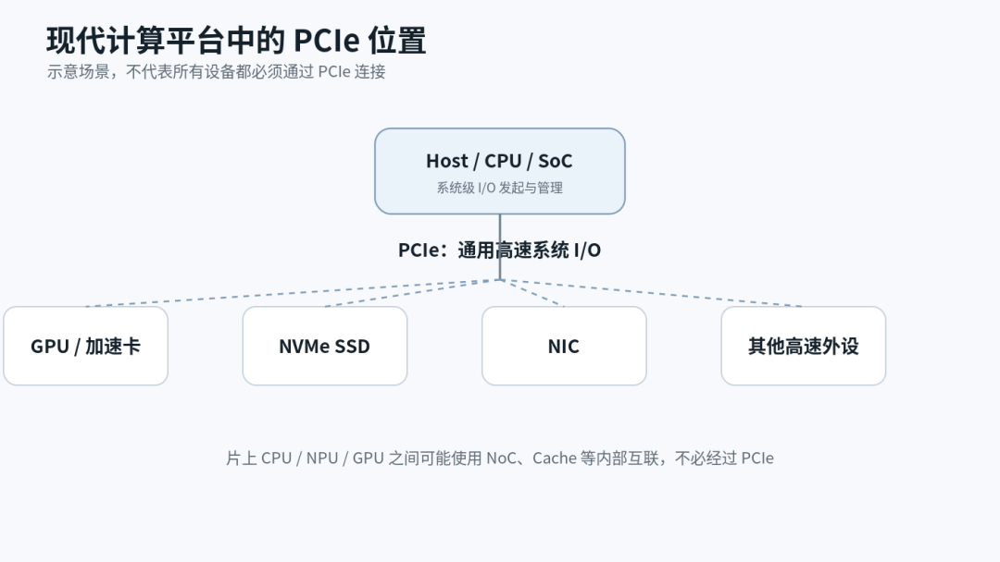

*PCIe 不是所有数据的唯一通路，但它长期承担着系统级高速 I/O 的重要角色。*

这也是为什么今天做 SoC、GPU/NPU、SSD、NIC、服务器甚至很多高性能嵌入式系统，很难完全绕开 PCIe。

不过，这还只是“为什么值得学”。真正让很多新人卡住的，是下一件事。

## 15.2 PCIe 越来越快以后，问题不只是“协议更复杂”

从 PCIe 3.0 开始看，链路原始传输速率几乎是一眼可见的翻倍：

- **PCIe 3.0：8 GT/s，NRZ**
- **PCIe 4.0：16 GT/s，NRZ**
- **PCIe 5.0：32 GT/s，NRZ**
- **PCIe 6.0：64 GT/s，PAM4**
- **PCIe 7.0：128 GT/s，PAM4**

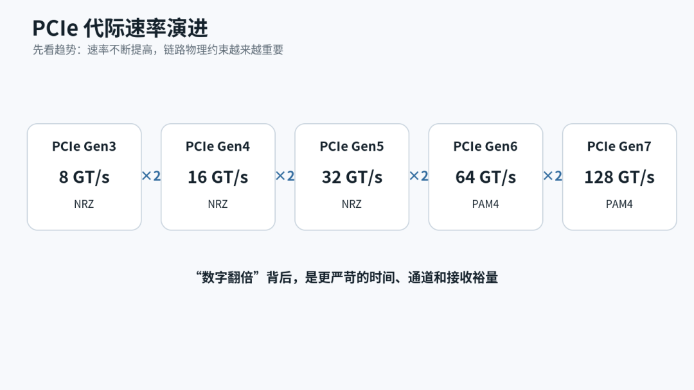

*数字看起来只是不断翻倍，但链路进入几十 GT/s 后，很多过去可以忽略的物理问题都会被放大。*

如果只是站在数字逻辑的角度，很容易把它理解成：

> “协议版本升级了，速度跑得更快了。”

但真实世界并不是这样。

数据最后一定要变成电信号，从芯片的 TX 出来，经过 Package、PCB Trace、Via、Connector，再进入对端 RX。

这些东西都不是理想的。

走线有损耗，阻抗会不连续，相邻信号会互相耦合，边沿会抖动，接收端看到的波形也不会和发送端一模一样。

速率越高，留给链路的时间和信号裕量越少，很多原来“差不多就行”的问题就会突然变成不能忽略的问题。

所以学到 PCIe 后面，你会发现一个很有意思的现象：

**明明自己在学一个数字协议，讨论却越来越像模拟电路和信号完整性。**

这不是跑题，而是高速串行接口本来就站在数字与模拟的交界处。

## 15.3 三个很典型的问题，Spec 往往不会从头教你

如果你刚开始看 PCIe 或 PHY 资料，很快就可能遇到下面三个问题。

### 15.3.1 问题一：32 GT/s，为什么不能直接理解成 32 GHz？

GT/s、Gbps、Gbaud、GHz 看起来都带一个“G”，但它们描述的根本不是同一件事。

有的在描述传输次数，有的在描述 bit rate，有的在描述 symbol rate，有的才是在描述频率。

如果这些单位的关系没搞清楚，后面看到 Nyquist Frequency 时就很容易继续误解。

这一节先不展开答案，我们后面会专门讲。

### 15.3.2 问题二：PCIe 数据已经几十 GT/s，为什么参考时钟还是 100 MHz？

很多人第一次看到 PCIe REFCLK 时都会有这个疑问。

如果数据在几十 GT/s 地跑，100 MHz 怎么可能“提供这么快的时钟”？

这里真正需要区分的是：

**Reference Clock、PHY 内部产生的高速时序，以及接收端从数据里恢复出来的采样时序，并不是一回事。**

这个问题如果没有基本的 PLL、CDR 直觉，直接看时钟章节会非常痛苦。

### 15.3.3 问题三：为什么 PCIe 总在谈 85Ω？一根铜线为什么会有“85Ω”？

如果只学过低速数字电路，很自然会把“Ω”理解成普通电阻。

于是看到 PCIe 常说 85Ω Differential Impedance，就会本能地问：

> “难道 PCB 上那两根线串起来有 85Ω 电阻？”

当然不是。

这里讨论的是高速传输线的**特性阻抗**，而不是拿万用表量到的 DC Resistance。

注意，这三个问题都非常基础。

但它们又不属于“把 TLP Header 背下来”就能自动获得的知识。

这正是很多人直接看 PCIe Spec 时容易产生断层的地方。

## 15.4 为什么 PCIe Spec 不把这些基础从头讲一遍？

因为 Spec 的任务和教材不一样。

PCI-SIG 对 PCI Express Base Specification 的说明很明确：它定义的是构建设备与系统所需要的 electrical、protocol、platform architecture 和 programming interface 等内容。[3]

也就是说，PCIe 本身从来不只是一个 Packet Protocol。

但是 Specification 更像工程规则书，它要规定：

- 发送端和接收端必须满足什么要求；
- 不同厂商的设备怎样互操作；
- 哪些电气指标必须达到；
- 协议行为和状态应该怎样定义。

它不会在每次出现“Differential Impedance”时，先给你上一节“什么是差分信号”；

也不会在每次出现 Nyquist Frequency 时，从“数字方波为什么有频谱”开始讲；

更不会为了介绍 Eye Diagram，先把 Noise、Jitter、ISI、Equalization 全部重新教一遍。

事实上，PCI-SIG 面向新人的 PCI Express Basics 培训，本身也是同时从 Electrical、Packet-based Protocol 和 Configuration Mechanism 三个方向介绍 PCIe。[4]

这背后隐含了一个很重要的前提：

> **真正进入 PCIe 世界，需要的不只是协议知识，还需要一层高速串行接口的基础认知。**

但这里也不用走到另一个极端。

你不需要为了学 PCIe，先完整学一遍电磁场理论；也不需要先学会 HFSS、ADS、VNA，更不需要会设计 CDR 环路或者 DFE 电路。

对于刚入门的人，更有价值的是先建立一套正确的 **Common Sense**。

看到一个词，知道它在说什么；

看到一张图，知道它大概在看哪里；

听工程师讨论时，能判断大家正在谈**速率、频率、幅度、时序、通道还是时钟**。

这就已经能解决大量入门阶段的误解。

## 15.5 先建立一个最重要的高速串行链路模型

后面的课程会出现不少新词，但先不要急着记。

整个高速串行接口，其实可以先压缩成一条很简单的链路：

> **数字数据 → 变成高速电信号 → 穿过真实物理通道 → 接收端重新判断 → 恢复数字数据**

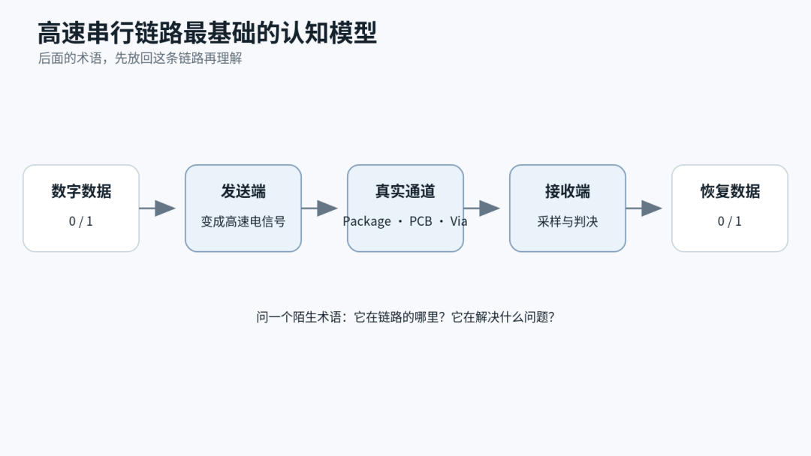

*后面的很多术语，本质上都是在解释这条链路的某一个位置。*

例如：

- GT/s、Gbaud、UI，在帮我们描述这条链路到底有多快；
- NRZ、PAM4，在描述数据怎样映射成信号电平；
- Transmission Line、Impedance、Reflection、Loss，在描述物理通道会对信号做什么；
- Jitter、Noise、ISI，在描述信号怎样被破坏；
- Eye、Equalization、CDR、BER，则是在回答接收端还能不能把数据正确找回来。

你会发现，一旦把这些词放回同一条链路，它们就不再是一堵术语墙。

如果你希望系统理解 PCIe，而不是只记住几个协议名词，可以查看完整课程：

《看懂 PCIe：20 个高速接口前置常识》

专栏入口(点阅读原文可直达，20篇文章限时早鸟价10元)：
https://xiaobot.net/p/pciecommonsense


这也是这门课最希望建立的习惯：

> **以后碰到一个陌生高速接口术语，先别急着背定义，先问它处在链路的哪个位置、在解决什么问题。**

这个问题通常比定义本身更重要。

## 15.6 这门基础课到底会讲到哪里？

这 20 节课分成四个部分。

### 15.6.1 分：PCIe 与高速串行接口基础

先把 Lane、Link、PHY、SerDes、差分信号、GT/s、Gbaud、GHz、UI 这些最基本的语言统一起来。

目标不是背术语，而是先建立“高速到底有多快”的尺度感。

### 15.6.2 分：信号编码与传输基础

再看数字信号为什么也要谈频率，NRZ 和 PAM4 是什么，Nyquist Frequency 为什么经常出现，以及高速 PCB 走线为什么不能再简单当成一根理想导线。

### 15.6.3 分：链路电气与接口设计基础

开始解释原理图和 PCB 上最容易让新人困惑的东西：85Ω、特性阻抗、反射、Termination、REXT、AC Coupling、100 MHz REFCLK。

### 15.6.4 分：时钟与信号完整性基础

最后进入 SRNS/SRIS、Loss、S11/S21、Noise、Jitter、Skew、ISI、Eye Diagram、Equalization、CDR 和 BER。

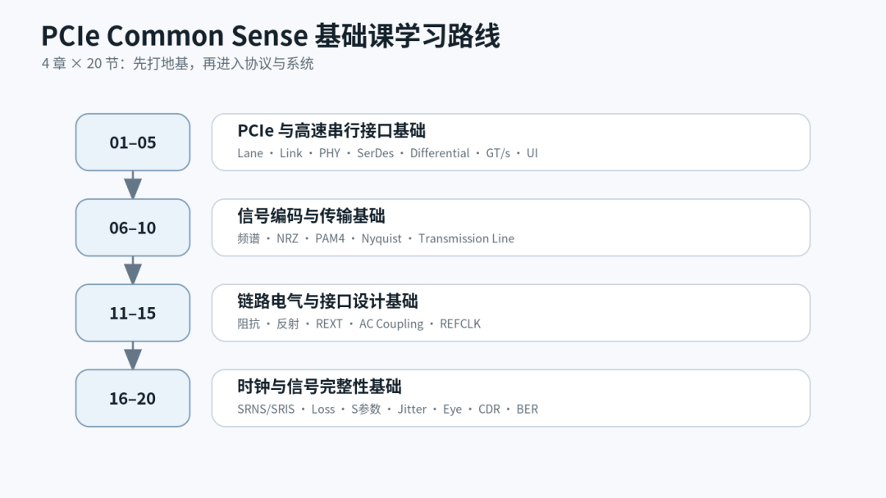

*这门课先补高速接口 Common Sense；TLP、LTSSM 等协议与系统层内容不在本课展开。*

这里也明确一下我们**不会**在这门基础课里深入什么：

TLP、DLLP、Credit、ACK/NAK、Replay、LTSSM、BAR、DMA、IOMMU、P2P……这些都很重要，但不在这门 Common Sense 基础课的展开范围内。

这门课先把地基打稳。

## 15.7 学完第一节，先记住四句话

如果这一节只留下四个印象，我希望是下面四个：

**第一，PCIe 不只是“显卡插槽”，它是一套通用的高速串行 I/O 互联。**

**第二，AI 时代让数据移动越来越重要，所以 PCIe 这类高速 I/O 的价值也越来越明显。**

**第三，PCIe 越来越快以后，只会数字协议是不够的；很多电气、时钟和信号完整性基础会直接影响你能不能理解它。**

**第四，Spec 会告诉你规则，但不会负责把所有先验知识从零教一遍。**

所以我们这套基础课不急着从 TLP 开始。

先把那些“大家讨论 PCIe 时默认你懂”的东西一层一层补起来。

下一节就从最基础的一张地图开始：

> **PCIe 到底是什么？一条 Lane、一个 Link、PHY 和 SerDes 分别代表什么？**

---

## 15.8 参考资料

**[1] PCI-SIG — PCI Express 6.0 Specification**
https://pcisig.com/pci-express-6.0-specification[1]

**[2] PCI-SIG — PCI Express 7.0 FAQ / Base Specification Revision 7.0**
https://pcisig.com/faq?field\_category\_value%5B%5D=pci\_express\_7.0[2]
https://pcisig.com/PCIExpress/Spec/Base/\_7.0[3]

**[3] PCI-SIG — PCI Express Base**
https://pcisig.com/specification-overview/pci-express-base[4]

**[4] PCI-SIG — PCI Express Basics & Background**
https://pcisig.com/developer/education/pci-express-basics-background-17[5]

**[5] PCI-SIG — Evolution of PCI Express Specification: Speeds and Feeds**
https://pcisig.com/sites/default/files/files/PCIe\_Specification\_Webinar\_Rev%206\_FINAL\_0.pdf[6]

---

---

## 15.9 继续学习

这篇只是 PCIe Common Sense 学习路径的第一步。

后续课程会继续围绕：

- Lane、Link、PHY、SerDes
- GT/s、Gbps、Gbaud、GHz
- NRZ、PAM4
- Transmission Line、85Ω
- REFCLK、S 参数、Jitter、Eye、CDR

建立一套完整的高速接口认知体系。

如果你希望系统理解 PCIe，而不是只记住几个协议名词：

**《看懂 PCIe：20 个高速接口前置常识》**

专栏入口： https://xiaobot.net/p/pciecommonsense[7]

点阅读原文可直达，20篇文章限时早鸟价10元，也可以扫码阅读：


转载授权：欢迎全文转载，无需授权；请保留作者「烓围玮未」及来源「微信公众号：芯片设计进阶之路（x\_chip）」，不得冒充原创或歪曲原意。

### 15.9.1 引用链接

[1]*https://pcisig.com/pci-express-6.0-specification*

[2]https://pcisig.com/faq?field\_category\_value%5B%5D=pci\_express\_7.0: *https://pcisig.com/faq?field\_category\_value%255B%255D=pci\_express\_7.0*

[3]*https://pcisig.com/PCIExpress/Spec/Base/\_7.0*

[4]*https://pcisig.com/specification-overview/pci-express-base*

[5]*https://pcisig.com/developer/education/pci-express-basics-background-17*

[6]https://pcisig.com/sites/default/files/files/PCIe\_Specification\_Webinar\_Rev%206\_FINAL\_0.pdf: *https://pcisig.com/sites/default/files/files/PCIe\_Specification\_Webinar\_Rev%25206\_FINAL\_0.pdf*

[7]*https://xiaobot.net/p/pciecommonsense*

---

# 16. PCIe 中断怎么选？

> 来源：https://mp.weixin.qq.com/s/BK22ssNT5ZPjJAFWvp58HA
> 作者：alltowine
> update 2026/09/15 21 : 55
> **已截图**

## 16.1 PCIe 中断怎么选——MSI、MSI-X

板卡联调时，经常会出现这样一种讨论：设备只有几路中断源，MSI 已经能用，为什么还要为 MSI-X 多做一张表、一个 PBA，再配一套驱动逻辑？另一边也有人认为，MSI-X 向量多、支持逐向量屏蔽，新项目直接上 MSI-X 就结束了。

两个判断都只说对了一半。

MSI 与 MSI-X 的本质相同：设备不再拉一根中断线，而是发起一次带特定地址和数据的 Memory Write。两者真正的差别，不在“能不能中断”，而在**向量如何组织、屏蔽如何控制、资源不足时如何退化，以及多队列能否自然地映射到 CPU**。

本文面向 PCIe Endpoint、FPGA、DMA 与驱动开发工程师，集中回答四个问题：MSI 与 MSI-X 的硬件结构分别是什么；各自的优缺点在哪里；为什么“向量更多”不等于“性能一定更高”；一个项目究竟该怎么选、怎么验证。

## 16.2 先把共同底座讲清楚：中断其实是一笔写事务

在 PCIe 中，MSI 和 MSI-X 都属于消息信号中断。系统软件先为设备写入一个目标地址和一份消息数据；设备需要请求服务时，向这个地址发起一次 DWORD Memory Write。中断控制器接收这笔写事务，再把它转换成送往某个 CPU 的中断请求。

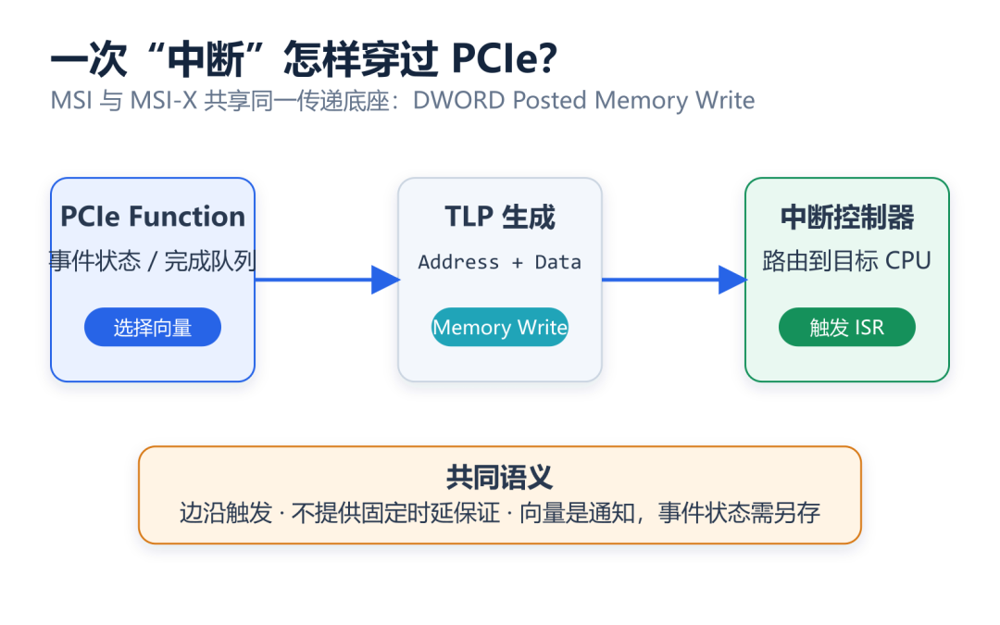

图 1：MSI 与 MSI-X 消息传递机制示意。两种机制最终都以 Posted Memory Write 穿过 PCIe 层次，差异主要发生在设备选择地址和数据的方式。

这件事带来三个直接结论。

第一，MSI/MSI-X 是**边沿触发**机制，不是 INTx 那种电平语义。设备不能想当然地认为“中断状态一直为 1，系统总会再进一次 ISR”。硬件状态、事件队列和驱动清除流程必须形成闭环。

第二，中断消息本身不是性能数据。增加向量可以减少共享与软件分流，但不会提高 PCIe 链路带宽，也不会自动解决队列拥塞、DMA 描述符不足或 CPU 处理不及时。

第三，MSI/MSI-X 写事务带有顺序语义：同一 Function 先前发出的 Posted Request 不能被后发的中断消息越过，因此驱动进入 ISR 后，应能观察到中断之前到达的 Posted Write 更新。不过，如果设备跨多个 Traffic Class 传输数据与中断，就不能把这一结论无限外推，设备必须额外保证不同 TC 之间的同步。

## 16.3 MSI：结构紧凑，代价是向量组织不够灵活

MSI 的核心控制信息直接放在 PCI 配置空间的 MSI Capability 中。系统软件读取 Multiple Message Capable 字段，知道设备最多请求多少向量；再通过 Multiple Message Enable 告诉设备实际分配了多少向量。

MSI 每个 Function 最多支持 32 个向量。请求数与分配数都按 2 的幂组织：设备若需要 3 个向量，能力上必须请求 4 个；系统最终可能只分给 4、2 或 1 个。设备必须能够在分配数少于请求数时继续正确工作。

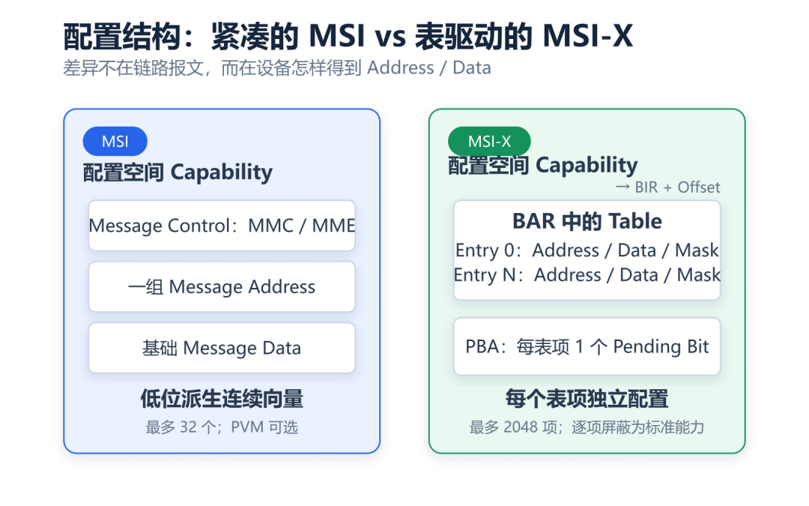

图 2：MSI 与 MSI-X 配置结构示意。MSI 把共享基址和能力字段放在配置空间；MSI-X 用 Capability 指向 BAR 中的 Table 与 PBA，每个表项保存独立地址、数据和控制。

MSI 的多向量不是保存多套完整地址与数据。软件写入一份 Message Address 和一份 Message Data；当 Multiple Message Enable 非零时，设备可以修改 Message Data 的若干低位来产生不同向量。例如分配 4 个向量时，设备可修改低 2 位，形成 4 个连续向量。

这种结构的优点很实在。

- **硬件与配置空间开销小。** 不需要 BAR 中再放中断表，适合中断源少、资源紧张的 Endpoint。

- **驱动模型简单。** 单向量或少量连续向量容易初始化，旧系统与轻量软件环境也更容易支持。

- **对简单设备足够。** 若设备只有一个 DMA 完成源加少量异常源，用状态寄存器在 ISR 中分流，往往已经能满足需求。

它的限制也来自同一个结构。

- **向量上限是 32，且按 2 的幂分配。** 需要 6 个逻辑通道时，能力上要按 8 个申请，系统还可能只给 4 个或 2 个。

- **地址共享、数据低位派生。** 向量组织没有 MSI-X 那样逐项独立，软件对路由和别名的控制空间较小。

- **逐向量屏蔽是可选能力。** 若设备没有实现 MSI Per-Vector Masking，驱动就要靠状态重读、设备专用屏蔽寄存器或其他握手避免漏事件与伪中断。

- **共享向量会增加 ISR 分流成本。** 多个队列共用一个向量时，驱动必须读取状态或消费事件队列，判断究竟是谁触发。

因此，MSI 更像一组紧凑的、连续编号的门牌。门不多时很省事；门多了，谁该敲哪一扇、资源不够时怎么合并，就开始受限。

## 16.4 MSI-X：每个表项独立，灵活性来自额外状态

MSI-X 把控制结构拆成三部分：配置空间中的 MSI-X Capability、BAR Memory Space 中的 MSI-X Table，以及记录挂起状态的 Pending Bit Array，也就是 PBA。

每个 MSI-X Table Entry 占 16 字节，包含 64 位 Message Address、32 位 Message Data 和 Vector Control。每个表项都可以使用独立的地址与数据，表项数量最多为 2048。PBA 则为每个表项保留一个 Pending Bit。

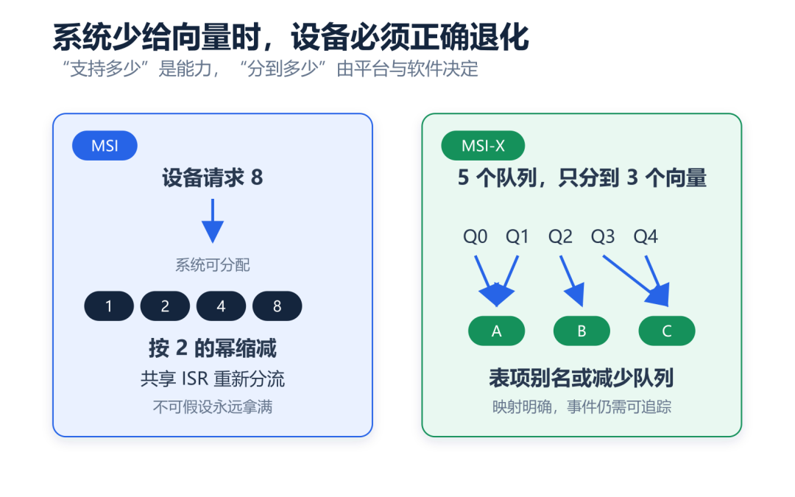

图 3：向量不足时的退化路径示意。MSI 通过降低 2 的幂分配数来退化；MSI-X 可以让多个表项共享同一系统向量，也可以减少启用的队列数。

MSI-X 的优势主要体现在规模化与可控性上。

- **向量容量大。** 多队列网卡、NVMe 控制器、高通道 DMA 和 SR-IOV 场景，能够为更多队列或 Function 建立独立入口。

- **每个表项地址与数据独立。** 软件可以更灵活地把事件映射到不同中断目标，并配合操作系统设置 CPU affinity。

- **逐表项屏蔽是标准能力。** Vector Control 中的 Mask Bit 可以单独屏蔽一个表项；Function Mask 又能一次屏蔽整个 Function 的所有表项。

- **资源不足时更容易做显式别名。** 当设备有 5 个队列而系统只分到 3 个向量，软件可以把多个 Table Entry 配到同一 Address/Data 对，仍然保留“哪个源映射到哪个表项”的设备结构。

- **更适合虚拟化和多队列并行。** 每个队列一向量、每个 VF 独立管理中断，更容易降低无关队列之间的锁竞争和缓存抖动。

但 MSI-X 不是免费的升级包。

- **占用 BAR 空间并增加实现复杂度。** Table 与 PBA 必须位于 Memory Space；硬件要处理表项读取或缓存、Pending 状态、屏蔽与解屏蔽语义。

- **表项更新有严格同步要求。** 软件不能在表项未屏蔽时修改 Address、Data 或 Steering Tag，否则结果未定义。正确顺序是先屏蔽，再更新，再解屏蔽。

- **资源隔离要认真设计。** MSI-X 结构若和普通 CSR 共用 BAR，不应落在同一个自然对齐的 4 KB 地址范围内。把 Table/PBA 放进独立 BAR，或至少隔离到独立页范围，通常更利于处理器属性与访问控制。

- **大表不等于多向量一定可用。** 操作系统、平台中断资源、虚拟化层和驱动策略都会限制实际分配数。设备声明 256 个表项，驱动最后拿到 32 个，是完全需要支持的正常退化路径。

- **验证状态更多。** 除了消息是否发出，还要覆盖表项默认屏蔽、Function Mask、PBA 置位/清零、向量别名、热复位和 Function Level Reset 等状态组合。

灵活性越高，软硬件契约就越需要精确。

## 16.5 Mask 与 Pending：真正决定“会不会漏中断”的地方

MSI-X 默认把每个表项置为屏蔽状态。向量被屏蔽时，如果硬件本应发送消息，就不能真的发出，而要置位对应 Pending Bit；当软件解屏蔽且 Pending Bit 仍为 1 时，设备必须安排发送消息，并在消息发送后清除 Pending Bit。

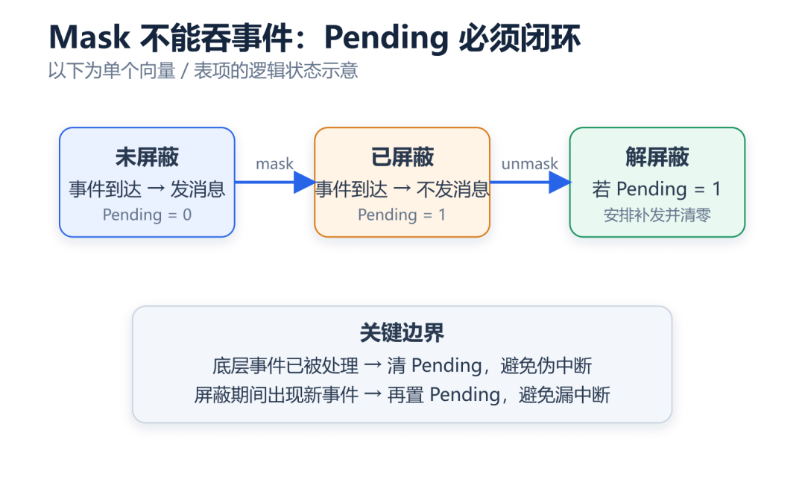

图 4：Mask、Pending 与补发状态逻辑示意。Mask 阻止消息发出，但不能丢掉事件；Pending Bit 把“发生过且仍需处理”的状态带到解屏蔽时刻。

这里有一个很容易忽略的边界：如果向量被屏蔽后，底层事件已经被软件或硬件处理完，设备应清除 Pending Bit，避免解屏蔽时发出伪中断；如果屏蔽期间又出现新事件，则必须再次置位。

更关键的是，规范并不保证“同一向量连续发送 N 次，ISR 就一定被调用 N 次”。同一个向量在软件确认前被重复发送时，只保证至少有一次得到服务。如果每个事件都不能丢，必须让事件本身进入可计数、可回读的结构，例如完成队列、事件 FIFO、producer/consumer 指针或单调递增计数器，中断只负责通知“有活了”。

这也是为什么高性能设备普遍把队列当成事实来源，把中断当成提示：ISR 或轮询线程醒来后，以 producer 指针和 consumer 指针为准，一次批量处理多个完成项。即使发生中断合并、同向量重复通知折叠，事件仍然留在队列里。

对 MSI 而言，如果实现了可选的 Per-Vector Masking，也能采用相同闭环；如果没有，就需要驱动在清除最后一个已知事件后重新读取状态，直到确认没有新事件。这个循环可能带来一次“ISR 进来却发现没有待处理项”的伪中断，但比悄悄漏掉完成事件安全得多。

## 16.6 从 DMA 队列看差异：向量是在减少共享，不是在制造吞吐

假设一块采集卡有 8 条 DMA 队列，每条队列都有完成事件。

使用单向量 MSI 时，8 条队列共享一个入口。CPU 进入 ISR 后，需要扫描队列状态或读取统一完成队列。优点是向量资源少、逻辑简单；缺点是所有流量汇聚到同一 CPU 或同一处理路径，负载高时容易出现锁竞争和缓存热点。

使用 MSI-X 时，可以把 8 条队列分别映射到 8 个表项，再由操作系统把向量分散到不同 CPU。每个 CPU 只处理自己的队列，数据结构和缓存行也更容易保持局部性。但如果平台最终只分配 4 个向量，驱动仍要把 8 条队列分成 4 组，并保证共享组内的事件不会丢。

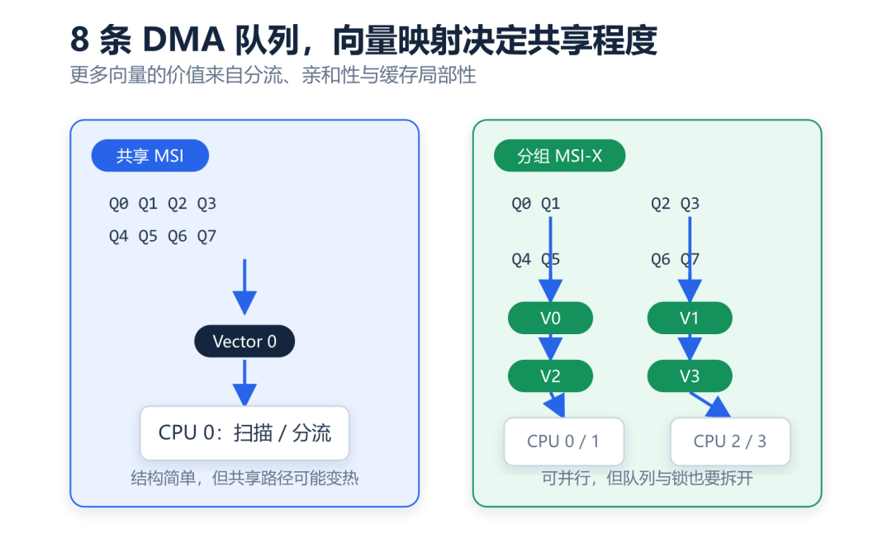

图 5：八条 DMA 队列的中断映射示意。MSI 常见做法是多队列共享少量连续向量；MSI-X 更适合把队列、向量与 CPU 做一一或分组映射。

所以，MSI-X 可能改善性能的因果链是：更多可独立配置的向量 → 更少的软件分流与共享锁 → 更灵活的 CPU affinity → 更好的缓存局部性和并行处理。只要其中任一环没有成立，例如驱动仍把所有向量绑到同一 CPU，或者队列本身共用一把大锁，MSI-X 的优势就可能只剩下更复杂的配置。

还要留意中断频率。每个完成项都发一次中断，即使有很多向量，也会把 CPU 消耗在入口与调度上。工程上通常需要结合包数阈值、字节数阈值或定时器做 interrupt moderation，让一次通知对应一批完成项。低负载追求时延，高负载追求批处理效率，阈值应通过测量决定。


## 16.7 放到同一张表里：优缺点与适用边界

| 比较维度 | MSI | MSI-X |
| --- | --- | --- |
| 每 Function 最大规模 | 32 个向量 | 2048 个表项 |
| 分配粒度 | 1、2、4、8、16、32，按 2 的幂 | 表项独立配置，可按软件策略使用或别名 |
| 地址/数据组织 | 一组地址与基础数据，低位派生多向量 | 每个表项独立 64 位地址与 32 位数据 |
| 逐向量屏蔽 | 可选；SR-IOV 中实现 MSI 时有额外要求 | 标准能力，另有 Function Mask |
| 挂起状态 | 实现 PVM 时提供 Pending Bits | 标准 PBA，每个表项一个 Pending Bit |
| 设备实现成本 | 低，配置结构紧凑 | 较高，需要 Table、PBA、缓存/同步逻辑与 BAR 空间 |
| 驱动复杂度 | 单向量最简单；共享时需状态分流 | 初始化和同步更复杂；多队列映射更自然 |
| 典型优势场景 | 少量中断源、资源受限、兼容性优先 | 多队列、高并发、CPU 亲和性、虚拟化 |
| 主要风险 | 向量不足、无 PVM 时握手更难、共享入口热点 | 表项更新竞态、BAR 隔离、资源分配不足、验证状态膨胀 |

这张表里最重要的不是“32 对 2048”，而是**设备是否真的需要独立处理的并行上下文**。若只有两个事件源，申请 64 个 MSI-X 表项并不会凭空产生并行度；若有几十条独立队列，却只设计一个共享状态位，MSI-X 也救不了事件可观察性。

## 16.8 怎么选：先数并行上下文，再看退化路径

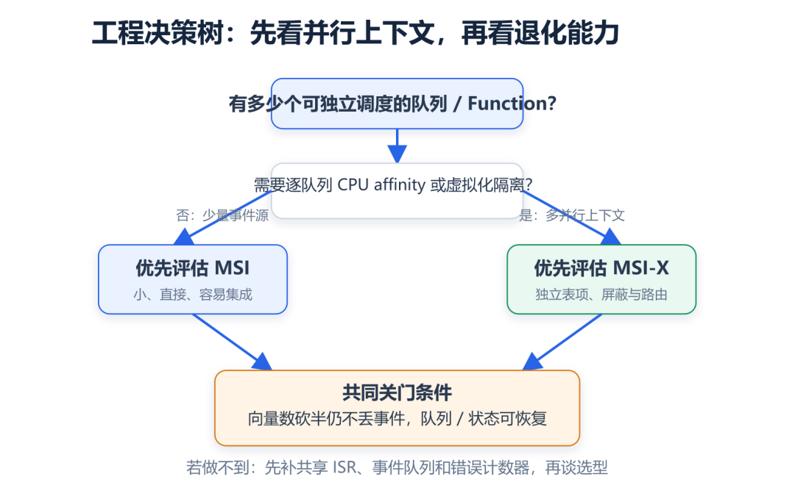

图 6：MSI 与 MSI-X 工程决策流程示意。选择应从并行队列、屏蔽需求与平台分配能力出发，并明确向量不足时的正确退化方式。

可以把选择压缩成下面四条规则。

**规则 1：中断源少、CPU 分流成本低，优先考虑 MSI。** 例如控制型 Endpoint、低速 DMA 或只有 1～4 个稳定事件类别的设备。前提是共享向量下仍有可靠的状态寄存器或事件队列。

**规则 2：队列多、需要 CPU affinity 或虚拟化隔离，优先考虑 MSI-X。** 典型是多队列网络、存储、加速器和多通道采集设备。向量应尽量对应可独立调度的数据结构，而不是随意对应每个细小状态位。

**规则 3：任何方案都必须支持“拿到的向量比请求的少”。** MSI 要能降低 Multiple Message Enable；MSI-X 要能做表项别名、队列分组或减少启用队列。初始化失败不应成为唯一退路。

**规则 4：事件完整性由队列或状态握手保证，不能由中断次数保证。** 中断可以合并、延迟或共享；完成项、错误状态和计数器必须可追踪、可重复读取、可在恢复流程中重建。

## 16.9 联调时别只看“中断计数在涨”

一个可执行的验证清单，至少覆盖下面几组场景。

1. **能力枚举：** 读取 Capability，确认 MSI 的 MMC/MME、64 位地址和 PVM 能力，或 MSI-X 的 Table Size、Table BIR/Offset、PBA BIR/Offset；核对实际分配数，而不是只看设备声明值。

2. **基本触发：** 每个已分配向量单独触发，记录设备事件计数、发消息计数、主机 ISR 计数和完成队列消费数，四者差异要能解释。

3. **屏蔽与挂起：** 屏蔽一个向量后注入事件，确认消息不发送、Pending 置位；事件仍在时解屏蔽，确认补发；事件已清除时解屏蔽，确认不会产生伪消息。

4. **资源降级：** 分别只分配 1、2、4 个向量，验证队列分组、表项别名或共享 ISR；不能丢完成项，也不能依赖固定向量号。

5. **突发与合并：** 使用短包高 IOPS、长包高吞吐和混合流量，扫过不同批量/定时阈值，测量 IRQ/s、P50/P99 延迟、CPU 占用、队列积压和吞吐。

6. **并发竞态：** 在事件持续到达时反复 mask/unmask，验证 Pending 状态与事件队列一致；MSI-X 更新表项时严格执行“屏蔽—写地址/数据—解屏蔽”。

7. **异常恢复：** 覆盖链路重训、热复位、Function Level Reset、驱动重载和错误中断风暴，确认 Table/PBA/设备状态重新初始化顺序正确。

8. **顺序与数据可见性：** DMA 写回、完成指针更新与中断通知按设计顺序到达；若使用多个 TC，单独验证跨 TC 同步方案。

建议主机与设备两侧都保留计数器：设备侧至少有事件产生、消息发送、Pending 置位、队列溢出和异常次数；主机侧至少有每向量 ISR、无工作 ISR、完成项消费、队列重启和超时次数。只有两边的账对得上，中断链路才算真正闭环。

## 16.10 写在最后

回到开头的问题：MSI-X 并不是因为“更新”就天然优于 MSI，MSI 也不是只能留给简单旧设备。

MSI 的优势是结构小、集成快、对少量中断源足够直接；MSI-X 的优势是每表项独立、屏蔽标准化、规模大，更适合把多队列映射到多个 CPU。两者共同的底线是：**向量只负责通知，事件状态必须另有可靠载体；资源可以减少，正确性不能随之退化。**

下一次评审 PCIe 中断方案时，先画出“事件源—队列—表项/向量—CPU”的映射，再故意把可用向量数砍半。如果系统仍能正确运行，你的 MSI 或 MSI-X 设计才真正具备工程韧性。


---

# 17. PCIe LTSSM：从一对差分线到可靠链路

> 来源：https://mp.weixin.qq.com/s/8P1S450trAIxep58nEvDBg
> 作者：alltowine
> update 2026/09/15 22 : 05


板卡上电，参考时钟有了，复位也释放了，PCIe 却迟迟不起链。调试窗口里，LTSSM 在 Detect 和 Polling 之间反复跳转。另一次，状态终于到了 L0，设备却仍没有按预期工作。

这些现象并不矛盾。电路接通、物理链路可用、数据链路层就绪、软件完成枚举，是不同层次的事实。LTSSM 负责其中最靠近信号的一段：让两个端口从互不了解，走到能够按共同规则传送数据，并在条件变化时重新建立这种能力。

## 17.1 为什么不能接上差分线就开始发包？

先做一个思想实验：你要把两个芯片连接起来，它们之间只有高速串行通道，接收端看到的是随时间变化的电压。发送端眼中的一个比特，经过封装、走线和连接器，到对端已经带上了衰减、反射和抖动。

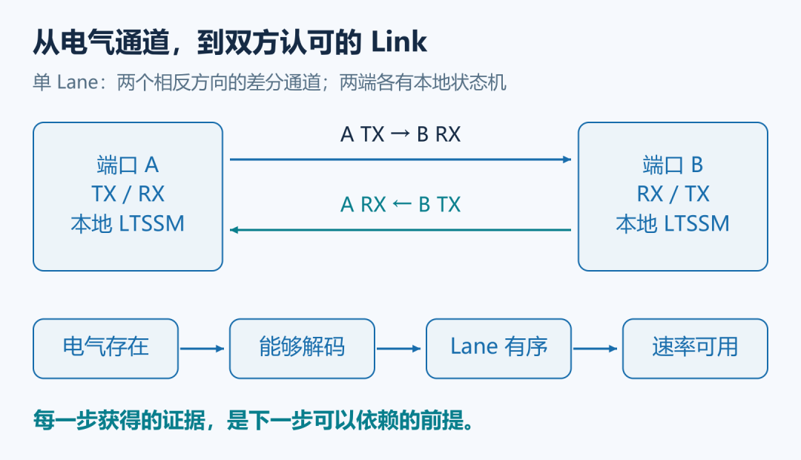

图1：一条 Lane 包含两个相反方向的差分通道。两端分别运行本地 LTSSM，通过训练序列交换信息；电气存在、可解码、Lane 组织和目标速率可用性要逐层确认。

接收端首先得知道在哪里采样。即使两个端口采用同源参考时钟，参考时钟也不会直接告诉接收器：经过这条通道后，每一位数据的最佳采样相位在哪里。时钟数据恢复（CDR）仍要解决串行输入的采样问题。

能采样还不够。连续的比特流没有天然的“第一个字符”：接收端需要找到编码边界，识别训练信息。多条 Lane 并行时，还要知道它们属于哪条 Link、各自排第几，以及怎样吸收不同到达时间造成的偏斜。

这就给出了 LTSSM 的第一性原理：**每一步都要先获得足够的证据，才允许下一步依赖它。** Detect 检查电气存在；Polling 建立训练信息的收发；Configuration 组织 Lane；Recovery 在重训练或变速时重新验证条件。

LTSSM 的全称是 Link Training and Status State Machine。它不是主机控制的单一全局状态机。链路两端各自根据本地接收结果、计数器、定时器和控制请求前进，所以抓到一端进入下一状态、另一端还在上一状态，并不自动意味着违规。协议必须容纳这种传播与响应延迟。

## 17.2 Detect：先确认对面是否有接收器

如果对面没有器件，或者接收端尚未呈现规定的终端特性，发送训练序列并不能产生有效握手。Detect 因而先做一项比解码更基础的工作：由发送端执行 Receiver Detection，检测相应 Lane 是否连接了接收器。

从电路直觉看，AC 耦合通道接上规定的接收端终端后，会呈现可检测的电气响应。具体检测电路由 PHY 实现，电气要求见规范第 8 章。这里的“检测到”，并不意味着对端 CDR 已锁定，也不意味着它已经正确收到 TS1。

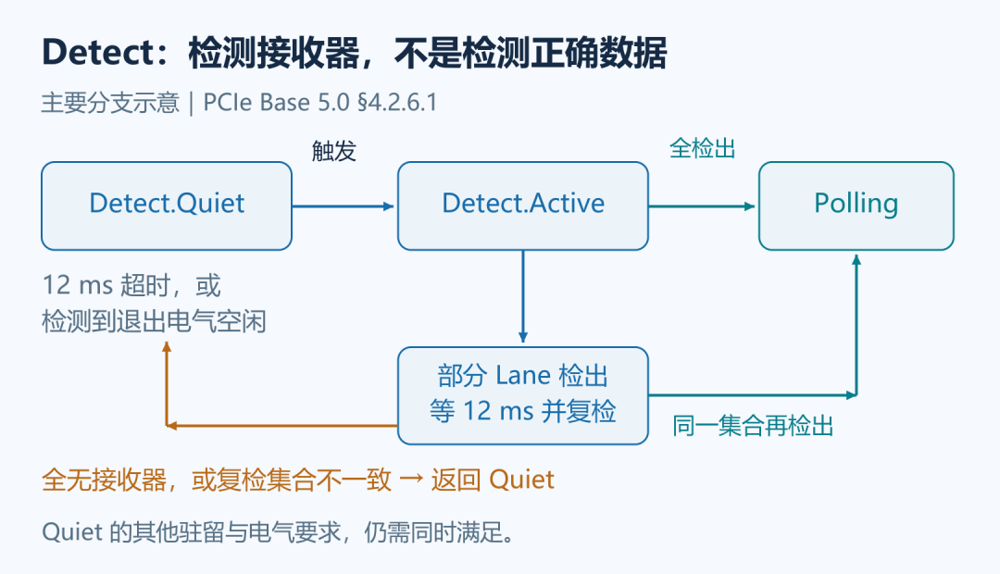

图2：Detect.Active 对候选 Lane 做接收器检测；全无接收器时回到 Quiet，部分 Lane 检出时还需按规则等待并复检。图中为主要分支，完整条件见 §4.2.6.1。

在 5.0 规范中，Detect.Quiet 的发送端处于 Electrical Idle，并选择 2.5 GT/s。满足该子状态要求后，12 ms 超时或任意 Lane 检测到退出 Electrical Idle，可触发进入 Detect.Active；不能把它简化成“每次固定等 12 ms”。

Detect.Active 也不是“只要一条 Lane 有响应就立即过关”。如果所有候选 Lane 都检出接收器，可以进入 Polling；如果一条也没有，返回 Quiet；如果只有部分检出，则等待 12 ms 后复检，只有相同 Lane 集合再次检出才按规则前进。

因此，长期在 Detect 循环时，最有价值的证据是逐 Lane 的 Receiver Detect 结果，以及供电、复位、PHY 就绪、连接与终端条件。此时修改 BAR 或 DMA 描述符，通常触及不到问题所在的层次。

还要分清两种 Idle。**Electrical Idle 是电气状态；Idle 数据符号是正在传输的编码内容。** 后面的 Configuration.Idle 和 Recovery.Idle 涉及正常编码的空闲数据，不能因为名称里都有 Idle，就把它们理解成线路没有有效信号。

## 17.3 Polling：用已知序列建立可验证的交流

接收器存在以后，下一步不是发业务数据，而是反复发送双方都认识的训练序列。已知的结构让接收端有机会恢复采样、建立符号锁定，并检查自己读到的信息是否连续一致。

TS1、TS2 是 Training Sequence Ordered Sets，属于物理层有序集，不是 TLP 或 DLLP。在本文的初次建链路径里，端口以 2.5 GT/s 使用 8b/10b 编码进行这些交换。高代际设备也要先按兼容的低速流程建链，再通过 Recovery 改变速率。

以传统 8b/10b TS 为例，一组训练序列包含 16 个 Symbol：COM、Link Number、Lane Number、N\_FTS、Data Rate Identifier、Training Control，以及重复的 TS 标识。TS1 与 TS2 的标识不同，字段的有效解释还取决于当前状态。Polling 时 Link Number 和 Lane Number 使用 PAD，表示此时尚未完成相应编号，而不是“编号为零”。

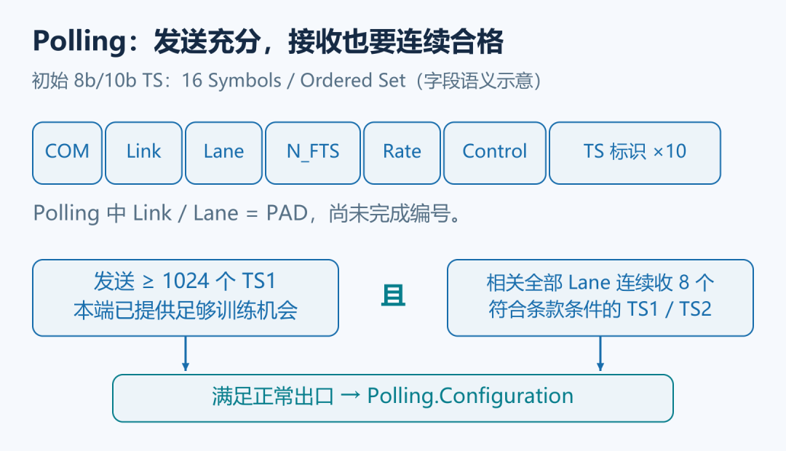

图3：上半部分给出初始 8b/10b 训练序列的语义结构，下半部分表示 Polling.Active 正常前进路径同时检查发送数量和接收结果。计数单位是 Ordered Set，不能当作 PHY 时钟周期。

Polling.Active 持续发送 TS1。以 §4.2.6.2.1 的正常前进路径为例：本端至少发送 1024 个 TS1，同时所有在 Detect 中检测到接收器的 Lane，都收到连续 8 个符合条件的训练序列，才能进入 Polling.Configuration。接收条件可以由规定的 TS1 或 TS2 满足，规范还允许识别其反相形式；不能缩写为“收到 8 个 TS1 就跳转”。

这里有两道独立门槛。接收连续性提供稳定识别的证据；最少发送数量保证本端也给对端留下足够的训练机会。把“我已经听懂”与“我已经充分发送”分开，正是两个本地状态机能够协调前进的原因。

Polling.Configuration 转而发送 Link/Lane 字段为 PAD 的 TS2，并按规定完成必要的极性反转处理。进入后续 Configuration 的条件，包括相关接收 Lane 上连续收到 8 个合格 TS2，以及在收到一个 TS2 后再发出 16 个 TS2；它不是只检查一个接收脉冲。

连续 8 个是协议的判定门槛，不等于完成了长期误码率测试。此外，Polling.Active 的 24 ms 超时分支有额外 Lane 条件，可能进入 Polling.Configuration、Polling.Compliance 或 Detect；Polling.Configuration 则有 48 ms 超时回 Detect 的规则。超时值要和具体出口一起读，不能合并成一个“训练超时”。

本文列出的是规范给出的超时值。5.0 §4.2.5 还规定：除非另有说明，LTSSM 超时允许 −0 / +50% 的容差。抓到的驻留时间要结合容差及实际触发条件判断，不能要求每次都精确等于标称值。

## 17.4 Configuration：把多条 Lane 组织成一条 Link

假设四条 Lane 各自都能稳定识别训练序列，是否就已经得到一条 x4 Link？还差一步：两端必须对参与链路的 Lane 集合及其逻辑顺序达成一致。

Configuration 通过 Linkwidth.Start、Linkwidth.Accept、Lanenum.Accept、Lanenum.Wait、Complete 和 Idle 等子状态完成这一过程。普通 Downstream/Upstream 端口的动作并不完全对称；Link Number 与 Lane Number 从 PAD 走向有效值，接收端再以对端返回的字段确认协商结果。

这里的 Link Number、Lane Number 用于物理链路训练，不能与软件枚举分配的 Bus/Device/Function 混为一谈。LTSSM 的 Configuration 也不是“配置空间访问阶段”：此时讨论的是物理层如何形成 Link。

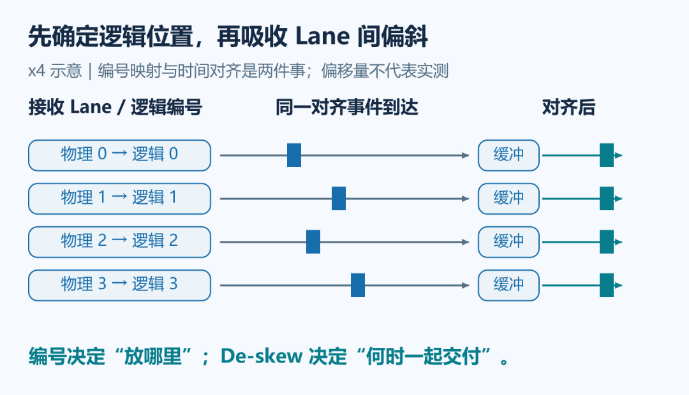

图4：Lane 编号确定逻辑位置；去偏斜吸收同一对齐事件在各 Lane 上的到达差异。图为支持相应连接方式时的 x4 教学示意，横向偏移不代表实测时间。

Lane 编号解决“这条数据应该放在哪里”，Lane-to-Lane De-skew 解决“这些数据何时可以一起交付”。一个端口不能因为某条 Lane 先到，就把不同发送时刻的数据拼到一起。规范要求接收端在向数据链路层交付前，补偿允许范围内的 Lane 间偏斜。

两种看似相似的布线问题也要区分：Polarity Inversion 是同一差分对的正负极性颠倒；Lane Reversal 是多条 Lane 的顺序反转。5.0 Base Spec 将 Lane Reversal 列为可选能力，不能由“支持极性反转”推出“任意 Lane 交换都能自动修复”。

若目标为 x4，最终却形成 x1，应该检查端口支持的宽度、板级连接、候选 Lane 的检测与训练结果、编号协商及去偏斜条件。中间宽度是否支持受端口能力约束；“坏一条就一定降到某个宽度”不是普遍规则。

完成 TS2 确认后，Configuration.Idle 通过规定的 Idle 交换收尾，随后可以进入 L0。**到这里，物理层已达到运行条件；上层能做什么，还要看上层自己的状态。**

## 17.5 Recovery：速率变了，就要重新验证链路

5.0 规范明确规定，初次训练先以 2.5 GT/s 到达 L0，随后通过 Recovery 进行速率变化。因此，一条能够运行在 32 GT/s 的链路，在启动过程中短暂显示 2.5 GT/s，是符合机制的现象。

为什么不直接跳到最高速？低速阶段先建立可用的交流基础，双方才能交换能力与控制信息。切换速率会改变采样时序和通道要求，原先成功的锁定与参数设置不能无条件沿用。

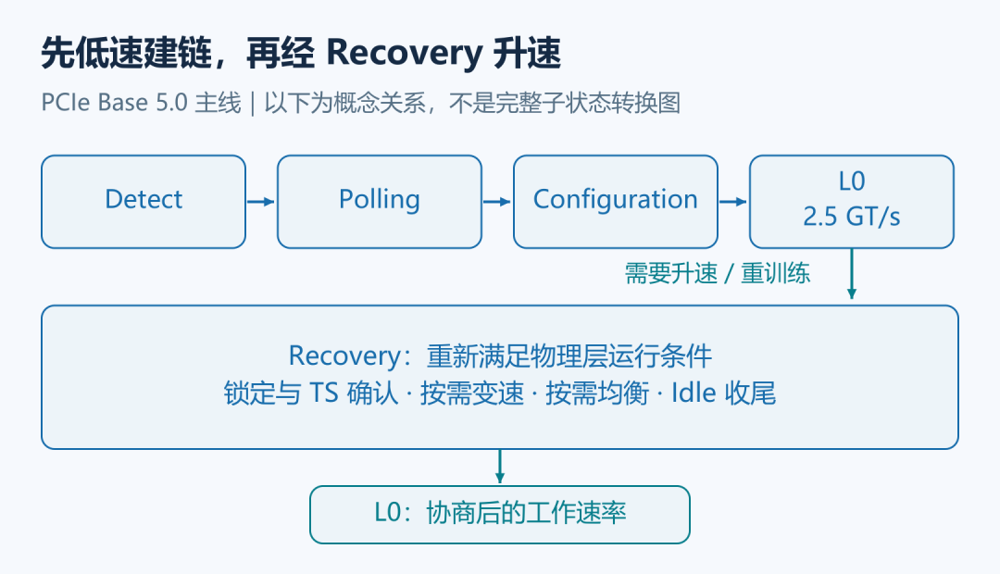

图5：实线给出初次建链到低速 L0 的主线；后续升速通过 Recovery，图中框内为相关工作的集合，不表示每次都按同一顺序走遍全部子状态。

Recovery.RcvrLock 负责重新建立接收锁定并处理训练序列；Recovery.RcvrCfg 用 TS2 等完成相应确认；需要变速时，Recovery.Speed 进入 Electrical Idle，并在规定条件与等待时间下改变工作速率，随后返回 RcvrLock；需要均衡时，还会涉及 Recovery.Equalization；Recovery.Idle 则负责回到正常传输前的收尾。

这些名字不能直接画成一条永远不变的流水线。是否变速、是否已经完成对应速率的均衡、双方能力和此前的状态，都会影响路径。5.0 还定义了有条件的均衡绕过机制，不能宣称所有链路都必须逐代升速、逐次完整执行每个阶段。

Recovery 的触发也不只有错误。定向升速、重训练，以及 L1 退出都可能经过它。因此诊断时先找“进入 Recovery 前发生了什么”：软件是否请求 Retrain，目标速率是否改变，是否刚退出低功耗，还是出现失锁、接收错误或对端训练序列。

若正常运行期间没有预期控制动作，却频繁从 L0 进入 Recovery，才需要重点检查误码、锁定、信号完整性及对端行为。Recovery 是一次重新满足物理层条件的过程；它的出现本身不是根因报告。

## 17.6 均衡：让接收端告诉对面，怎样发更容易收

提高速率后，每个比特可用的时间缩短，通道对相邻比特的影响更难忽略。前一个符号的响应拖到后一个符号里，形成码间干扰。接收端即使知道正确的采样位置，也可能已经没有足够的判决裕量。

均衡从发送与接收两侧改善这种情况。发送端可以通过 preset 或系数调整输出波形；接收端调整自身处理。LTSSM 组织训练信息和请求/响应握手，具体的接收评估与搜索算法则由实现决定。规范没有要求所有 PHY 使用同一种“寻找最佳眼图”的算法。

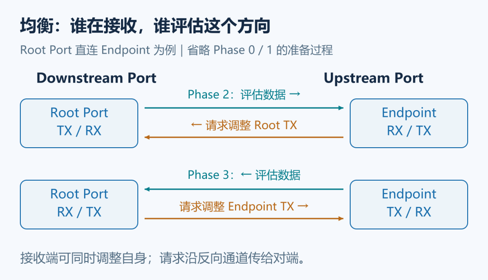

图6：以规范定义的端口角色为准，Phase 2 由 Upstream Port 接收端评估 Downstream Port 的发送；Phase 3 交换方向。请求沿反向通道传递，调整对象是对端发送器，同时本端可调整接收器。

对 Gen3–Gen5 的典型均衡流程，Phase 0 为目标速率训练准备初始 preset；Phase 1 先让双方在当前目标速率上具备继续交换 TS1 的条件；Phase 2 由 Upstream Port 改善自己接收的方向；Phase 3 由 Downstream Port 改善自己接收的方向。流程最多包含四个阶段，部分阶段可以在规范允许的条件下跳过。

以 Root Port 直连 Endpoint 为例，前者是 Downstream Port，后者是 Upstream Port。于是 Phase 2 对应 Root Port TX → Endpoint RX，Phase 3 对应 Endpoint TX → Root Port RX。加入交换机后仍应按每一跳的端口角色判断，不能把 Upstream 永远翻译成“主机”。

还有一个容易误用的细节：Phase 0 的准备工作发生在向目标均衡速率协商的过程中，不能把所有阶段都理解为“已经稳定运行在目标速率后再调整”。调试记录必须同时包含当前速率、均衡阶段、Lane、请求值和响应结果。

Gen6 也不能只把图里的 32 GT/s 改成 64 GT/s。6.2 规范规定 64 GT/s 使用 PAM4、1b/1b 编码并强制 Flit Mode，涉及新的物理层和传输处理；Flit Mode 也可在协商后用于较低速率。本文关于 8b/10b 训练字段及 Gen3–Gen5 均衡的讲解，不应直接充当 64 GT/s 的完整实现规则。

## 17.7 L0 之外：节能、测试和复位各有目的

L0 是正常工作的物理链路状态。数据链路层仍有自己的初始化流程：物理层报告链路可用后，数据链路层在 DL\_Init 中执行流控初始化，满足条件后进入 DL\_Active。只有 L0 截图，无法证明软件已经枚举、BAR 已映射或 DMA 已具备运行条件。

把其他主状态按“为什么离开正常传输”来理解，比把名字背成一串更有用。下面的表用于定位职责，不展开每个状态的全部出口。

| 状态或状态组 | 进入它要解决什么 | 观察时的关键边界 |
| --- | --- | --- |
| L0 | 正常物理层传输 | 再核对 DL\_Active、枚举和业务条件 |
| L0s | 减少某个方向的空闲功耗 | 两方向可独立；退出涉及 FTS，不能一概画成经 Recovery |
| L1 | 更深入地降低链路功耗 | 需协调进入；正常退出进入 Recovery，L1 子状态另有规则 |
| L2 | 为主电源移除等情形做准备 | 恢复涉及唤醒与重新建链条件，不是一次普通 Idle |
| Disabled | 将链路置于禁用状态 | 先查禁用来源及相应出口控制 |
| Polling.Compliance | 输出/接收规定的测试模式 | 属于 Polling 子状态，通常不在正常建链主线上 |
| Loopback | 支持物理链路测试 | Master/Slave 角色与正常业务转发不同 |
| Hot Reset | 通过带内协议传播复位 | 不等同于 PERST# 所代表的 Fundamental Reset 机制 |

L0s 的快速退出与 L1 的恢复路径不同，不能为了画一张整齐的总图，把所有低功耗状态都画成 L0 的对称分支。L1.1、L1.2 的电源和时钟条件还需要结合 L1 PM Substates 规则及平台实现阅读。

同样，Hot Reset 是带内协议复位，Fundamental Reset 是另一类复位机制。看到 LTSSM 回到 Detect 时，应核对复位来源和此前状态，不能仅凭一个终态判断究竟发生了哪种复位。

## 17.8 真正有用的调试问题：哪项退出条件没满足？

“卡在 Polling”仍然太粗。工程上要把它改写成：当前是哪个子状态，已经停留多久，在当前速率下，哪些 Lane 满足了接收条件，哪一个发送计数或控制条件尚未满足。

先记录状态变化，而不是只读取此刻的状态寄存器。建议每条记录至少包含时间戳、上一状态、当前状态、当前速率、有效 Lane 位图、接收锁定/错误信息，以及本次可获得的控制触发。状态编码按具体 IP 文档解码；某家 IP 的十六进制值并不是 PCIe 通用状态编号。

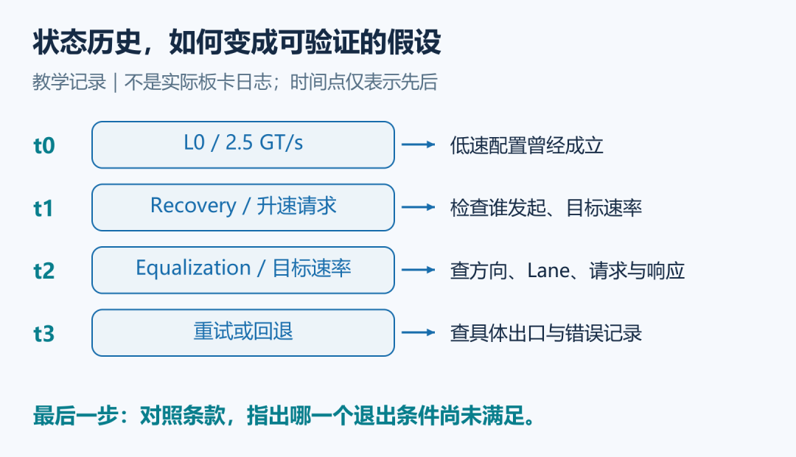

图7：示例记录用于说明如何缩小证据范围，不是实际板卡日志。状态循环只能限定排查方向；逐 Lane 接收结果和控制请求才能区分候选原因。

以一个假设场景说明：目标是 Gen4 x4，链路能够在 2.5 GT/s 到达 L0，却在后续升速中反复进入 Recovery。已有证据支持“某个低速配置可以建立”，尚不能推出“四条 Lane 在 16 GT/s 都合格”。

此时应先对齐两个端口的速率与均衡记录，再看失败发生在哪一方向、哪一 Lane、哪个阶段，以及请求参数是否得到响应。如果低速状态也只有 x1，还应把宽度协商问题一并保留，不能把全部现象归结为高速均衡。

可以按平台支持的方式约束目标速率，逐档比较稳定性；也可以在合法配置范围内比较宽度，或者关闭已确认会干扰复现的自动重训练因素。每次实验只改变清楚记录的条件，并保留前后状态轨迹。限制速率能帮助定位，但低速成功不能替代目标速率下的信号完整性和误码验证。

对 RTL 与验证团队，测试计划应覆盖正常前进、接收序列不连续、字段不匹配、部分 Lane 失效、超时回退、软件重训练和低功耗退出。计数器要按规范规定的事件累计，特别是“收到第一个合格序列之后再发送若干组”，不能偷换成从进入状态开始计数。

最终，把规范条款落成一张调试卡就够用了：**进入条件、发送内容、接收匹配条件、计数起点、超时值、下一状态。** 下一次再看到 LTSSM 循环，先给这六项填上实测证据，再决定该改 PHY 配置、板级条件还是控制逻辑。

---

# 18. PCIe协议实战2·从仿真中学习PCIe枚举过程

> 来源：https://mp.weixin.qq.com/s/r-XgD2rkCF8MoZo8G-bSpQ
> 作者：比特手术刀
> update 2026/09/15 22 : 06

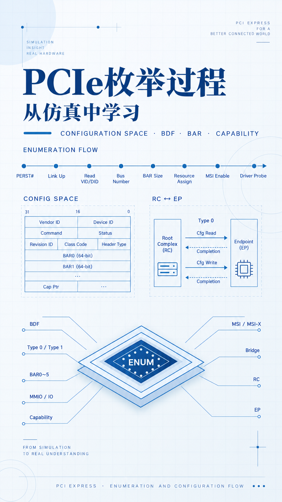

很多人第一次接触 PCIe 枚举时，会把它理解成“主机读取一下设备信息”。但从仿真波形看，枚举远不止一次配置读。

主机需要先确认链路可用，再发现设备和 Function，遍历 Capability，探测 BAR 的类型与大小，为 BAR 分配系统地址，打开地址空间，最后用真实的 Memory Request 验证地址译码是否生效。

本文不只讲寄存器定义，而是把协议事务、配置空间和内部波形放到同一条时间线上，完整观察一次 Endpoint 枚举过程。

## 18.1 先看全局：PCIe 枚举到底做了什么

从系统视角看，一次典型枚举可以概括为：

```
链路进入 L0，数据链路可用
    ↓
读取 Header Type 和 Vendor ID，发现 Function
    ↓
遍历标准 Capability 和 Extended Capability
    ↓
对 BAR 写全 1并读回，获得类型、位宽和窗口大小
    ↓
为有效 BAR 分配系统地址并写回
    ↓
设置 Command Register，打开 I/O、Memory 和 Bus Master
    ↓
发送 Memory Read，验证 BAR 命中和数据返回
```

其中最容易混淆的是 BAR 配置。它不是简单地“给寄存器写一个地址”，而是包含两个阶段：

```
阶段一：资源探测
CfgWr0(all 1) → Cpl
CfgRd0        → CplD(mask)
mask          → 计算 BAR 大小

阶段二：资源分配
选择满足对齐要求的 base
CfgWr0(base)  → Cpl
写 Command Register，打开地址译码
```

可以把 BAR 理解为设备向系统提出的一份资源申请：

- BAR 类型说明需要 Memory Space 还是 I/O Space。
- BAR mask 说明需要多大的连续地址窗口。
- 系统软件决定这段窗口最终放在系统地址图的哪里。
- Command Register 决定设备是否开始响应这段地址。

## 18.2 枚举开始前：L0 不等于立即可以发配置请求

PCIe 链路完成训练后进入 L0，但事务并不会在 LTSSM 跳到 L0 的同一时刻立刻出现。数据链路层还要完成 Flow Control 初始化，使虚通道具备发送 TLP 的条件。

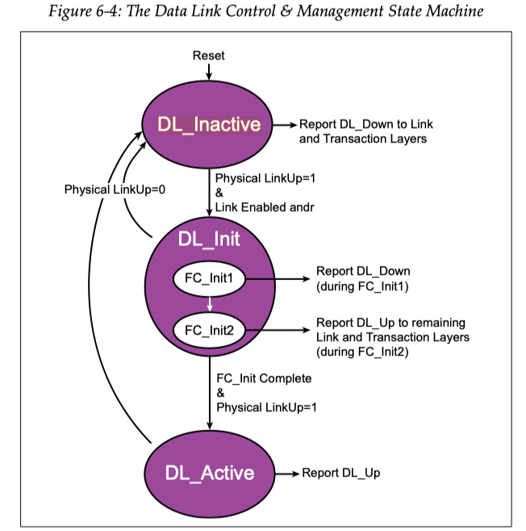

Flow Control 初始化分为 FC\_Init1 和 FC\_Init2。设备会交换 Posted、Non-Posted 和 Completion 三类 Credit 信息，告诉对端自己可以接收多少 Header 和 Data。

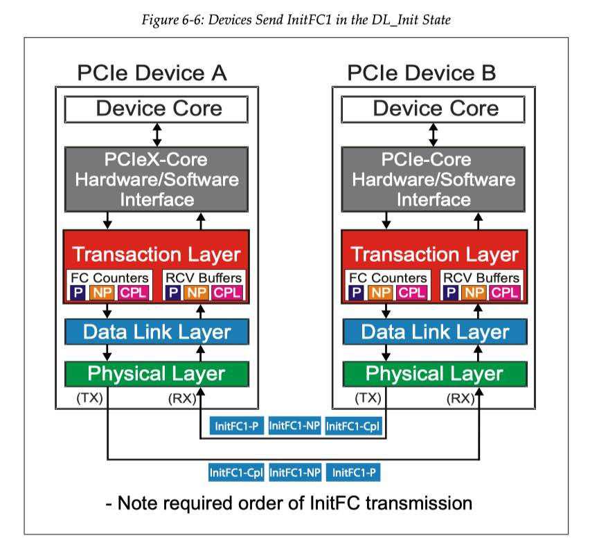

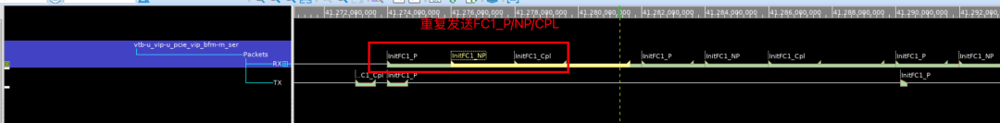

本次波形中的关键时间关系是：

```
41076.1 ns  LTSSM 进入 L0
41300.1 ns  数据链路 ready
41423.0 ns  第一笔 CfgRd0 发出
```

因此，分析枚举起点时不要只盯着 L0。真正值得关注的边界是：数据链路可用之后，第一笔 Configuration Request 何时出现。

## 18.3 第一步：通过配置读发现 Function

主机首先需要回答两个问题：

1. 目标 BDF 上是什么类型的配置头？
2. 对应 Function 是否真实存在？

### 18.3.1 读取 Header Type

第一笔 `CfgRd0` 访问 `01:00.0` 的配置空间 `0x0C` DWORD。Header Type 位于 byte offset `0x0E`，因此读取整个 `0x0C` DWORD 后再提取对应字节。

```
Request：CfgRd0
Target BDF：01:00.0
Offset：0x0C
Completion：CplD / Successful Completion
Read Data：0x00000000
```

读回结果表示这是 Type 0 Configuration Header，并且 Multi-Function 位为 0。

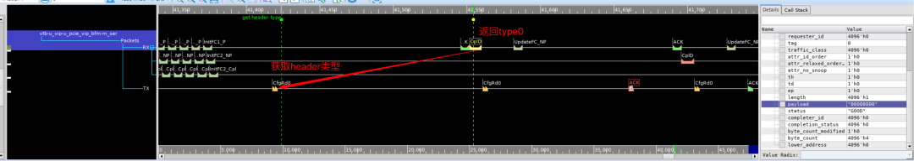

这里要区分三个概念：

- `CfgRd0` 只携带目标 BDF、寄存器位置和 Transaction ID，不携带读回数据。
- `ACK` 是数据链路层对 TLP 可靠接收的确认。
- 真正的配置数据位于后续 `CplD` 的 payload 中。

### 18.3.2 读取 Vendor ID

随后主机读取配置空间 `0x00`：

```
41566 ns  CfgRd0，BDF=01:00.0，offset=0x00
41696 ns  CplD，Status=SC，Data=0xABCD16C3
```

配置空间 `0x00` DWORD 的低 16 bit 是 Vendor ID，高 16 bit 是 Device ID。只要访问成功且 Vendor ID 不是全 1，就可以确认该 Function 存在。

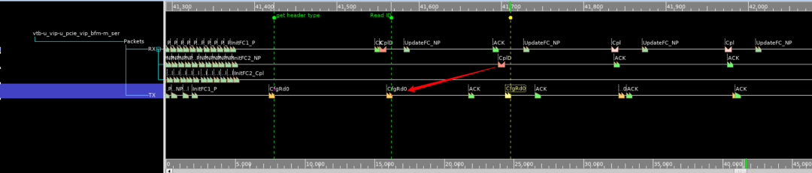

本次仿真还继续访问了 `01:00.1` 到 `01:00.7`。这些请求返回 `Cpl/UR`，因此没有被识别为有效 Function。

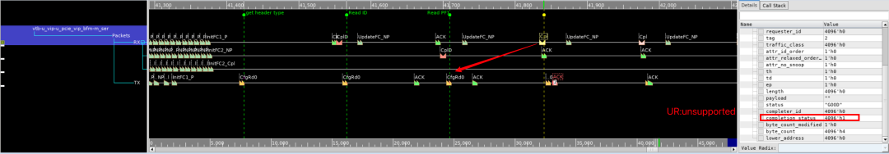

需要注意：本例即使读到 Multi-Function 位为 0，仍继续扫描了 Function 1～7。这是测试场景为了覆盖异常响应而采用的访问序列，不代表所有 BIOS 或操作系统都必须发出完全相同的请求。

## 18.4 第二步：遍历 Capability 链表

确认 Function 存在后，主机还需要知道它实现了哪些能力，例如电源管理、MSI、PCIe Capability 和错误报告能力。

PCIe 中有两套 Capability 链表：

- 标准 Capability 位于前 256 Byte 配置空间。
- Extended Capability 位于 `0x100～0xFFF` 扩展配置空间。

### 18.4.1 标准 Capability

Type 0 Configuration Header 的 `0x34` 保存 Capabilities Pointer，它指向标准 Capability 链表的第一个节点。

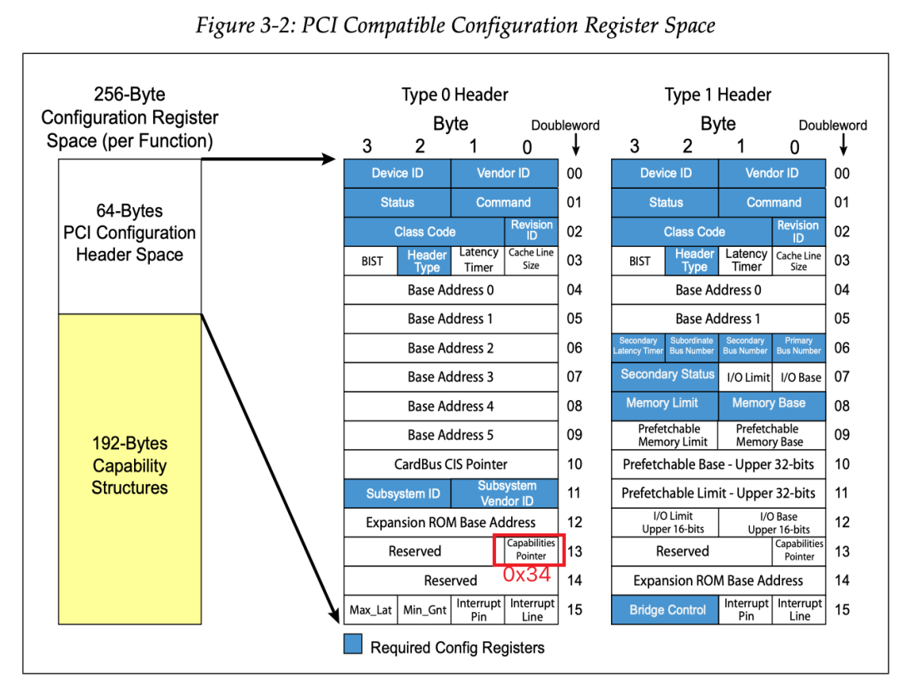

每个标准 Capability 节点的头部格式为：

```
[7:0]   Capability ID
[15:8]  Next Capability Pointer
```

本次遍历结果为：

```
0x34 Capabilities Pointer → 0x40

0x40：ID=0x01，Power Management，Next=0x50
0x50：ID=0x05，MSI，Next=0x70
0x70：ID=0x10，PCI Express，Next=0x00
```

`Next=0x00` 表示标准 Capability 链表结束。

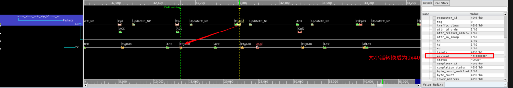

这几笔请求的 BDF 始终是 `01:00.0`，变化的是配置空间 offset 和 Tag。软件必须等待当前 `CplD` 返回，取得 Next Pointer 后，才能确定下一笔读取的位置。

### 18.4.2 Extended Capability

Extended Capability 不通过 `0x34` 寻找入口，而是固定从 `0x100` 开始。其公共头部为 32 bit：

```
[15:0]   Extended Capability ID
[19:16]  Capability Version
[31:20]  Next Capability Offset
```

本次波形中的扩展链为：

```
0x100  AER
  ↓
0x148  Secondary PCI Express
  ↓
0x168  Physical Layer 16.0 GT/s
  ↓
0x18C  Lane Margining
  ↓
0x1A4  Data Link Feature
  ↓
0x1B0  Vendor-Specific Extended Capability
  ↓
0x000  End
```

标准 Capability 的 Next Pointer 是 8 bit；Extended Capability 的 Next Offset 是 12 bit。两者格式不同，但遍历思路相同：读取当前节点，解析 ID 和 Next，再访问下一个节点。

配置请求中的 BDF 用来选择 Function，Register Number 用来选择该 Function 内部的配置 DWORD，Byte Enable 则进一步指定 DWORD 中哪些字节有效。

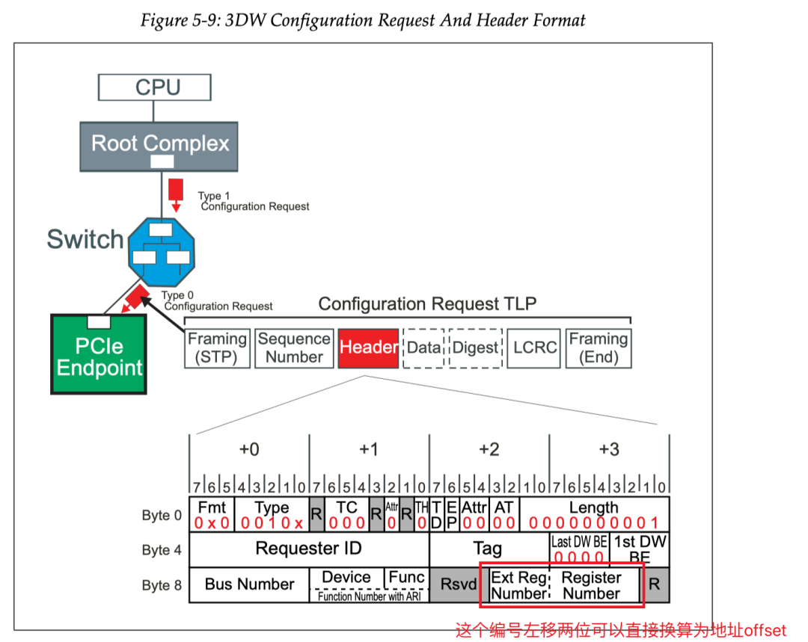

## 18.5 第三步：BAR sizing，为什么要先写全 1

Capability 遍历结束后，主机开始探测 BAR0～BAR5。

此时主机还不知道每个 BAR 是否实现、属于哪种类型、需要多大窗口，所以不能直接分配地址。传统 BAR sizing 的基本流程是：

```
保存原 BAR 值
    ↓
保持对应地址空间关闭
    ↓
向 BAR 写入 0xFFFFFFFF
    ↓
读回设备实现的 mask 与属性位
    ↓
清除属性位，按 ~mask + 1 计算窗口大小
```

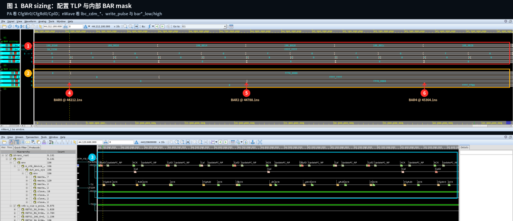

从协议分析视图可以看到 `CfgWr0 → Cpl → CfgRd0 → CplD` 的事务序列；从内部波形可以看到写全 1 后，BAR 并没有保存所有 1，而是保留了由硬件实现的地址 mask。

### 18.5.1 BAR0：64-bit Memory BAR，1 MiB

BAR0 读回：

```
readback = 0xFFF00004
bit 0 = 0          → Memory BAR
bits [2:1] = 10b   → 64-bit BAR
bit 3 = 0          → Non-Prefetchable
address mask       → 0xFFF00000
```

BAR0 是 64-bit BAR，因此 BAR1 是其高 32 bit，而不是独立 BAR。合并 BAR0/BAR1 后：

```
mask = 0xFFFFFFFF_FFF00000
size = ~mask + 1
     = 0x00100000
     = 1 MiB
```

### 18.5.2 BAR2：32-bit Memory BAR，1 MiB

```
readback = 0xFFF00000
type     = 32-bit Memory BAR
size     = ~0xFFF00000 + 1
         = 0x00100000
         = 1 MiB
```

### 18.5.3 BAR4：I/O BAR，256 Byte

```
readback = 0xFFFFFF01
bit 0    = 1 → I/O BAR
mask     = 0xFFFFFF00
size     = ~0xFFFFFF00 + 1
         = 0x100
         = 256 Byte
```

最终探测结果如下：

| BAR | 类型 | 大小 | 说明 |
| --- | --- | --- | --- |
| BAR0/BAR1 | 64-bit Memory | 1 MiB | 两个连续 DWORD 组成一个 BAR |
| BAR2 | 32-bit Memory | 1 MiB | 独立 Memory BAR |
| BAR3 | 未实现 | - | 读回 0 |
| BAR4 | I/O | 256 Byte | I/O 地址窗口 |
| BAR5 | 未实现 | - | 读回 0 |

BAR sizing 的本质不是读取一个现成的 Size 字段，而是设备通过只读地址位暴露 aperture mask，软件再由 mask 反推出资源大小。

## 18.6 第四步：写入 BAR 基址，并打开 Command Register

知道 BAR 的类型和大小后，系统软件从不同地址池中选择满足自然对齐、互不重叠的基地址。

对齐条件可以写成：

```
base & (size - 1) == 0
```

例如 1 MiB BAR 的低 20 bit 必须为 0；256 Byte BAR 的低 8 bit 必须为 0。

本次仿真分配的地址为：

| BAR | Base | 地址范围 |
| --- | --- | --- |
| BAR0/BAR1 | `0x80000000_00000000` | `0x80000000_00000000～0x80000000_000FFFFF` |
| BAR2 | `0x80000000` | `0x80000000～0x800FFFFF` |
| BAR4 | `0x8000` | `0x8000～0x80FF` |

BAR0 是 64-bit BAR，需要分两笔配置写：

```
BAR0 low  = 0x00000000
BAR1 high = 0x80000000
```

写完 BAR 以后，地址窗口仍然没有正式启用。主机还要向配置空间 `0x04` 的 Command Register 写入 `0x0007`：

```
bit 0：I/O Space Enable
bit 1：Memory Space Enable
bit 2：Bus Master Enable
```

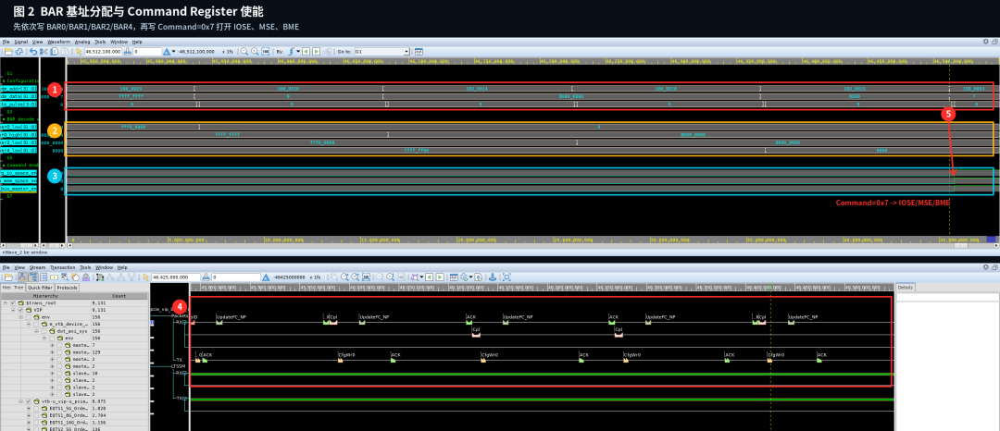

这张图给出了一个非常重要的因果边界：

```
BAR 中已经有 base
        ≠
设备已经开始响应该地址
```

只有在对应的 Space Enable 置位后，Function 才会对命中 BAR 窗口的请求进行地址译码。Bus Master Enable 则控制 Function 是否可以作为 Requester 主动发起 Memory 或 I/O Request。

### 18.6.1 从 TLP Header 看 Command 写入

写 Command Register 的事务为：

```
TLP              = CfgWr0
Target BDF       = 01:00.0
Register Offset  = 0x04
Length           = 1 DW
First DW BE      = 0x1
Payload          = 0x00000007
```

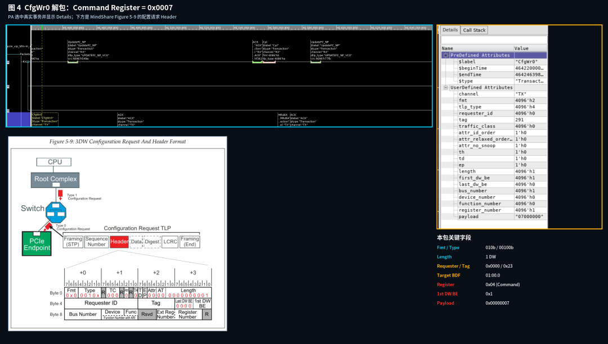

`First DW BE=0x1` 表示只写最低一个 Byte。由于 IOSE、MSE 和 BME 位于 Command Register 的 bit 0～2，一个 Byte 就足够，同时不会改动同一 DWORD 中的 Status 字段。

配置写属于 Non-Posted Request。链路层 ACK 只表示 TLP 已可靠接收，事务是否成功还要看带有相同 Requester ID 和 Tag 的 `Cpl/SC`。

## 18.7 第五步：用 Memory Read 验证 BAR 是否真正生效

如果文章停在 Command Register 写完，枚举过程还缺少最后一环：地址配置是否真的可用？

本次仿真分别向 BAR0 和 BAR2 的基地址发起 Memory Read：

```
BAR0：MRd64，Address=0x80000000_00000000
BAR2：MRd32，Address=0x80000000
```

内部波形显示，请求地址进入匹配逻辑后分别命中：

```
BAR0 request → bar_match = 0x01
BAR2 request → bar_match = 0x04
```

随后请求被送往应用侧接口，并最终返回带数据的 Completion。

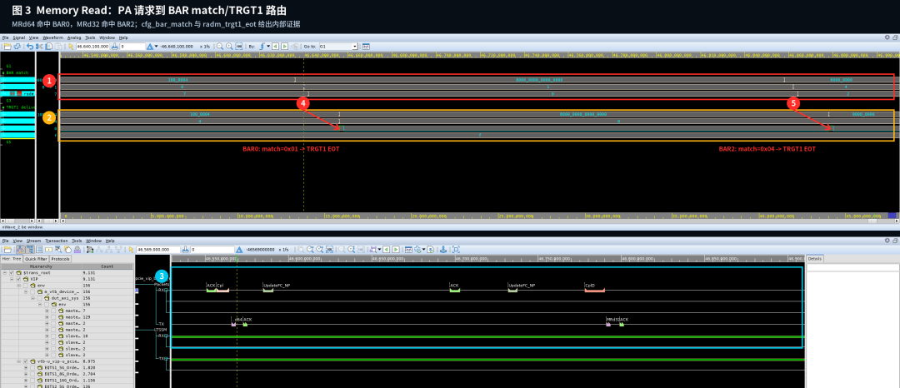

这一步把前面的配置动作闭环起来：

```
BAR sizing
    ↓
BAR programming
    ↓
Command Memory Space Enable
    ↓
Memory Read 到达 Endpoint
    ↓
地址落入 BAR 窗口
    ↓
BAR one-hot 命中
    ↓
请求交付应用逻辑
    ↓
CplD 返回数据
```

### 18.7.1 MRd32 和 MRd64 的区别

Memory Read 的 Type 相同，32-bit 与 64-bit 地址的差异主要由 Fmt 指示的 Header 长度决定：

- `MRd32` 使用 3DW Header。
- `MRd64` 使用 4DW Header。
- Memory Read 本身不携带数据。
- 返回数据位于后续 `CplD` 中。

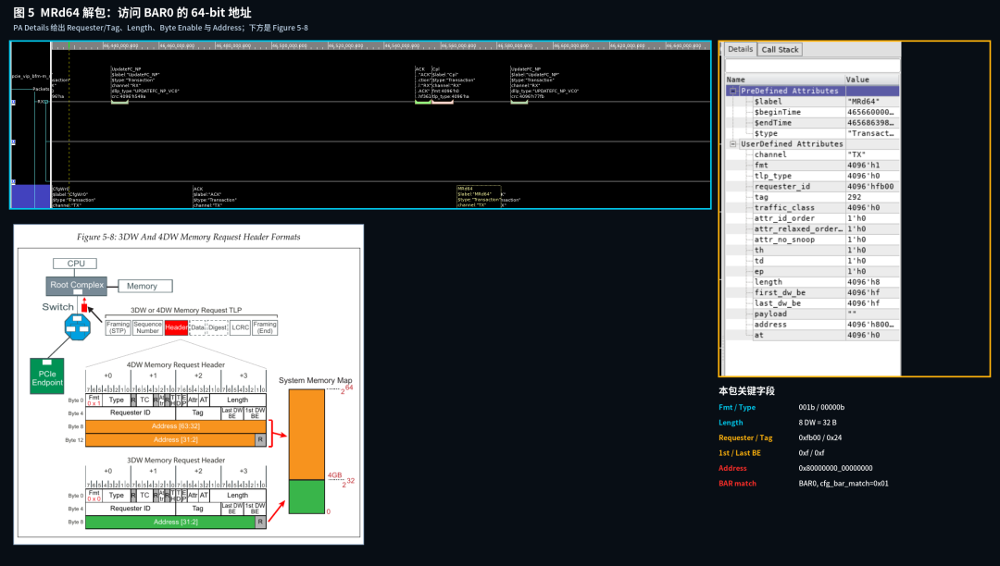

本例 BAR0 请求的关键字段为：

```
Fmt / Type       = 001b / 00000b
Length           = 8 DW = 32 Byte
Requester / Tag  = 0xFB00 / 0x24
Address          = 0x80000000_00000000
```

### 18.7.2 Request 和 Completion 如何配对

Completion 必须复制原请求的 Requester ID 和 Tag。二者共同构成 Transaction ID，用于把返回结果交给正确的请求。

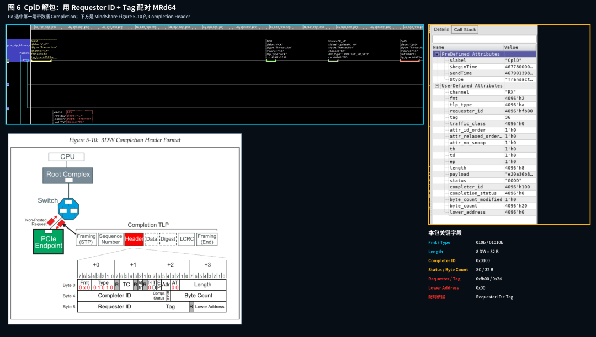

```
MRd64：Requester/Tag = 0xFB00/0x24
CplD ：Requester/Tag = 0xFB00/0x24
```

在只有一笔 outstanding request 时，按时间看似乎也能配对；但当多笔请求并发、Completion 被拆分或发生乱序返回时，必须按 Transaction ID 分析，不能简单选择“时间上最近的 Completion”。

## 18.8 读波形时，建议始终沿着因果链

面对枚举波形，不建议一开始就展开大量内部信号。更高效的方法是先定位协议事务，再向内部追踪。

可以按下面的顺序检查：

1. 确认 LTSSM 进入 L0，数据链路完成初始化。
2. 找到第一笔 `CfgRd0`，确认目标 BDF、offset 和 Tag。
3. 用相同 Requester ID + Tag 找到对应 `Cpl` 或 `CplD`。
4. 遍历 Capability 时，只跟踪当前 offset、ID 和 Next Pointer。
5. 分析 BAR 时，先找 `CfgWr0(all 1)`，再找 `CfgRd0` 与 mask。
6. 确认基址写回后，再找 Command Register 的 Space Enable。
7. 最后用真实 Memory Request 验证 BAR 命中和 Completion 返回。

协议分析视图回答“链路上传输了什么”，内部波形回答“设备收到请求后做了什么”。二者放在同一时间轴上，才能建立完整证据链。

## 18.9 总结

通过这次仿真，可以把 PCIe 枚举理解为三个层次。

第一层是**发现设备**：通过 BDF、Header Type、Vendor ID 和 Completion Status 确认 Function 是否存在。

第二层是**发现能力和资源**：遍历 Capability 链表，并通过 BAR sizing 得到每个地址窗口的类型、位宽、大小和对齐要求。

第三层是**让资源真正可用**：为 BAR 分配基址，打开 Command Register，再用 Memory Request 验证地址匹配、内部路由和数据返回。

整条主线最终可以压缩为：

```
CfgRd0 → 发现 Function 与 Capability
CfgWr0(all 1) + CfgRd0 → 探测 BAR
CfgWr0(base) → 分配地址
CfgWr0(Command) → 打开空间
MRd32/MRd64 → 验证 BAR 命中
CplD → 完成事务闭环
```

枚举并不是“读几个配置寄存器”，而是系统软件与设备共同完成的一次资源协商：设备声明自己需要什么，系统决定资源放在哪里，最后再通过真实事务确认整个地址通路已经打通。

---

参考资料：

- PCI Express Base Specification，Configuration Space、Configuration Request、BAR 与 Completion 相关章节。
- PCI Express Technology，Configuration Request、Memory Request 与 Completion Header 相关示意图。
