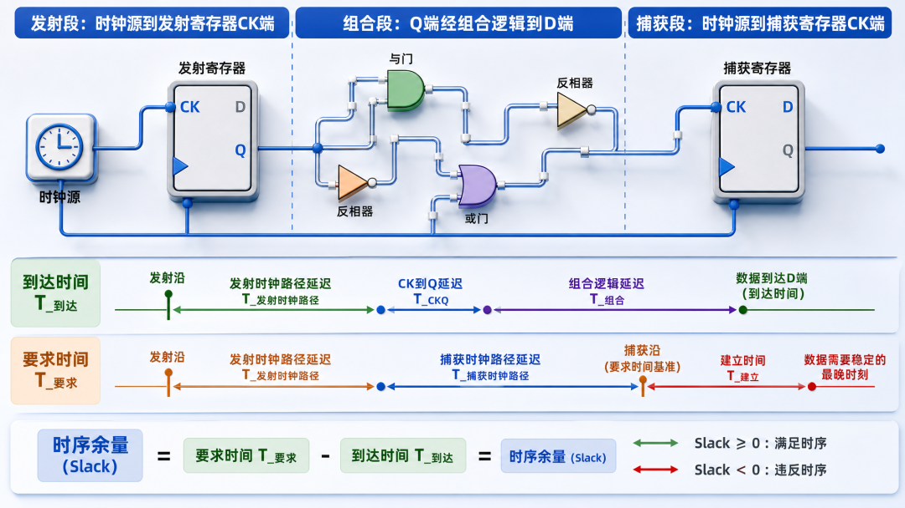
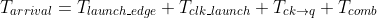
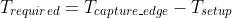
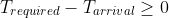
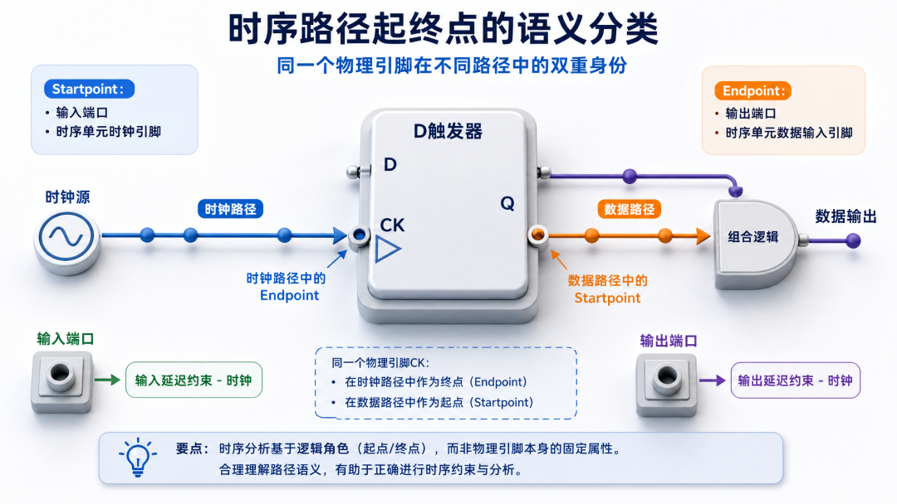
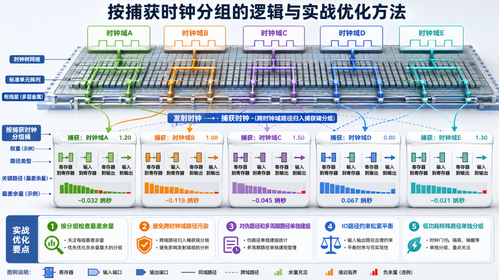

<!-- toc-start -->

# 目录

[1. STA中 timing path、startpoint/endpoint、path group是什么](#1-sta中-timing-pathstartpointendpointpath-group是什么)  
　　[1.1 Timing path：从一条边，到一个"段"](#11-timing-path从一条边到一个段)  
　　[1.2 Startpoint 和 endpoint 到底长什么样](#12-startpoint-和-endpoint-到底长什么样)  
　　[1.3 Path group：按捕获时钟给路径分桶](#13-path-group按捕获时钟给路径分桶)  
　　[1.4 实战里的几个判断要点](#14-实战里的几个判断要点)  

<!-- toc-end -->

---

# 1. STA中 timing path、startpoint/endpoint、path group是什么

> 来源：https://mp.weixin.qq.com/s/BzyQ3SglZei-uJZwpKY-yA
> 作者：最初的梦想
> update 2026/09/27 18 : 58

## 1.1 Timing path：从一条边，到一个"段"

在数字后端做静态时序分析（STA）时，整个设计会被展开成一张**时序图**：节点是 pin、port，边是单元延时弧和 net 延时。所谓的 `timing path`，就是这张图上从**起点**到**终点**的一条有向路径，用来描述一个信号必须在某个时钟沿之前/之后到达的完整传播过程。



一个标准寄存器到寄存器路径可以拆成三段：

1. **发射段**：从时钟源到发射寄存器的 clock pin。这一段决定信号什么时候被"打出去"。

2. **组合段**：从发射寄存器的 output（Q 端）经过组合逻辑和连线，到达捕获寄存器的 input（D 端）。

3. **捕获段**：从时钟源到捕获寄存器的 clock pin。这一段决定捕获沿什么时候来。

我们平时说的 setup 检查，本质上就是比较：





只有当  时，这条路径才算是过的。这里的起点不是任意一个 pin，而是**与时钟沿强绑定**的位置；终点也不是随便一个数据 pin，而是下一个时序单元要采样的地方。

## 1.2 Startpoint 和 endpoint 到底长什么样



很多人对 startpoint 和 endpoint 有误解，以为它们就是物理上的一根线。其实不然。在 PrimeTime、Tempus 这类工具里，startpoint 和 endpoint 是路径的**语义端点**，不是几何端点。

**Startpoint** 通常只有两类：

- 输入端口（input port）

- 时序单元被时钟驱动的 pin，比如寄存器或 latch 的 CK、CLK 引脚

**Endpoint** 通常也只有两类：

- 输出端口（output port）

- 时序单元的数据输入 pin，比如寄存器的 D 端

输入端口作为 startpoint 时，必须靠 `set\_input\_delay -clock` 给出一个相对于某个时钟的锚定时间；输出端口作为 endpoint 时，必须靠 `set\_output\_delay -clock` 给出外部要求的采样窗口。如果没有这两个约束，工具根本不知道该把这条路径往哪个时钟域里放，自然也算不出 slack。

同一个物理 pin 在不同路径里可能扮演不同角色。最典型的例子就是寄存器的 clock pin：对从时钟源到寄存器 clock pin 的**时钟路径**来说，这个 pin 是 endpoint；但对从该寄存器出发的**数据路径**来说，同一个 clock pin 又是 startpoint。这种"双重身份"经常让人在看 `report\_timing` 时产生困惑，本质上是因为路径类型变了。

## 1.3 Path group：按捕获时钟给路径分桶



当工具算完成千上万条 timing path 后，总需要一个**分类维度**来管理和优化。这个维度就是 `path group`。在 PrimeTime 的默认行为里，path group 是按**捕获时钟**来分的：同一条时钟域内的 reg2reg 路径会落在以该时钟命名的 group 里；跨时钟域路径则归到捕获端时钟对应的 group。

举个例子：路径由 `CLK\_A` 发射、被 `CLK\_B` 捕获，那么这条路径会被放进 `CLK\_B` 这个 path group。这个规则对排重和报违例非常关键，因为你不能只看总 WNS，而要打开每个 group 看各自的 worst path。

实际工程中常见的 group 大致有：

- **reg2reg**：最核心、数量最多，通常决定主频。

- **in2reg**：输入到寄存器，受 input delay 约束影响大。

- **reg2out**：寄存器到输出，受 output delay 约束影响大。

- **in2out**：纯组合穿通，往往被单独约束。

工具还允许用户用 `group\_path` 自定义分组。比如：

```tcl

group\_path -name CLK\_HIGH -weight 5

group\_path -name CLK\_LOW -weight 2

```

这里的 weight 是个容易踩坑的参数。它告诉优化器哪个 group 更值得花力气：高 weight 的 group 会得到更多优化资源；低 weight 的 group 即使还有 -30 ps 的 slack，也可能因为全局 WNS 看起来"还行"而被忽略。签核时如果只盯着总体 slack，很容易漏掉某个 weight 设置不合理的小 group。

## 1.4 实战里的几个判断要点

做 timing signoff 时，我通常会先跑一轮 `report\_timing -groups`，看看每个 group 的 worst slack 和 endpoint 分布，而不是直接看全局 TNS/WNS。因为有些路径看起来 slack 很大，其实是因为 group 分类错了，比如一条本该属于 `CLK\_A` 的跨时钟路径被错误地归到了 `CLK\_B`。

IO 路径是另一个重灾区。input delay 和 output delay 的数值直接决定 in2reg、reg2out 这两个 group 的松紧。如果约束给得太死，工具会把大量优化资源砸在 IO 上，反而让 reg2reg 的时序恶化；如果给得太松，芯片功能也许没问题，但接口时序会留不下 margin。

对于跨时钟域路径，最好显式声明为 false path 或 multicycle path，并单独建 group 管理。否则它们会被默认归到捕获时钟的 group 里，污染该 group 的时序报告，也让后端优化器做很多无用功。现代低功耗流程里，clock gating、level shifter、isolation cell 这类特殊路径也建议单独分组，方便在 signoff 阶段快速定位问题。

本文图片由AI辅助生成
