<!-- toc-start -->

# 目录

[1. \[SystemVerilog语法拾遗\] SystemVerilog中的宏使用详解](#1-systemverilog语法拾遗-systemverilog中的宏使用详解)  
　　[1.1 引言](#11-引言)  
　　[1.2 前言](#12-前言)  
　　[1.3 介绍](#13-介绍)  
　　　　[1.3.1 什么是宏？](#131-什么是宏)  
　　　　[1.3.2 为什么要使用宏？](#132-为什么要使用宏)  
　　[1.4 宏语法规范](#14-宏语法规范)  
　　　　[1.4.1 宏名称](#141-宏名称)  
　　　　[1.4.2 反引号——*``` ``, `", `\`" ```*](#142-反引号)  
　　　　[1.4.3 其他应用](#143-其他应用)  
　　[1.5 传递参数](#15-传递参数)  
　　[1.6 宏风格指引](#16-宏风格指引)  
　　[1.7 参考示例](#17-参考示例)  
　　[1.8 总结](#18-总结)  
　　[1.9 疑问与评论](#19-疑问与评论)  
　　　　[1.9.1 补充](#191-补充)  
[2. 【朝花夕拾】SystemVerilog：编译器不让赋值，为什么 $cast 却可以？](#2-朝花夕拾systemverilog编译器不让赋值为什么-cast-却可以)  
[3. SystemVerilog interface：为什么 UVM 需要 virtual interface](#3-systemverilog-interface为什么-uvm-需要-virtual-interface)  
　　[3.1 先把术语分清](#31-先把术语分清)  
　　[3.2 interface 先解决什么问题](#32-interface-先解决什么问题)  
　　[3.3 module、interface 与 virtual interface 的关系](#33-moduleinterface-与-virtual-interface-的关系)  
　　[3.4 virtual interface 到底“虚”在哪里](#34-virtual-interface-到底虚在哪里)  
　　[3.5 一个 interface，多个 class](#35-一个-interface多个-class)  
　　[3.6 vif 与 config\_db 的两层定位](#36-vif-与-config_db-的两层定位)  
　　[3.7 vif 生命周期与使用时机](#37-vif-生命周期与使用时机)  
　　[3.8 UVM 中的完整配置链](#38-uvm-中的完整配置链)  
　　[3.9 driver 为什么需要 virtual interface](#39-driver-为什么需要-virtual-interface)  
　　[3.10 monitor 为什么也需要 virtual interface](#310-monitor-为什么也需要-virtual-interface)  
　　[3.11 读懂现象](#311-读懂现象)  
　　[3.12 DV 检查点](#312-dv-检查点)  
　　[3.13 真实调试流程](#313-真实调试流程)  
　　[3.14 面试问答](#314-面试问答)  
　　[3.15 问题 3：`config_db::get` 成功却 driver 驱动不到 DUT，可能是什么原因？](#315-问题-3config_dbget-成功却-driver-驱动不到-dut可能是什么原因)  
　　[3.16 小结](#316-小结)  

<!-- toc-end -->

---

# 1. [SystemVerilog语法拾遗] SystemVerilog中的宏使用详解

> 来源：https://zhuanlan.zhihu.com/p/660094987
> 发布时间：2023-10-08T08:51:51.000Z
> update 2026/08/22 11 : 12

## 1.1 引言

刚刚写了一篇 [数字验证大头兵：[SystemVerilog语法拾遗] 宏函数实例讲解](https://zhuanlan.zhihu.com/p/660080798)，本想着过一段时间再好好研究研究宏函数的语法再写一篇详细点的解析文档，奈何求知欲过于强烈的我还是决定现在就好好研究下宏函数的语法，正巧看到一篇写的不错的宏函数讲解文章，这里就用我有限的英文翻译水平加之对宏函数的一点理解共享给大家，原文链接如下：[SystemVerilog Macros - SystemVerilog.io](https://link.zhihu.com/?target=https%3A//www.systemverilog.io/verification/macros/)

下面是全文翻译

## 1.2 前言

合理的使用宏可以大大简化我们在使用SystemVerilog编写代码的工作量，如果你不熟悉宏的使用，不仅降低写代码的效率，同时在阅读别人写的代码时也会产生诸多困惑，这里的例子将揭开`` `, `", `\`" ``这些宏中常用的符号的含义以及如何使用它们的神秘面纱。

我们还将探索UVM源代码中的一些宏，并建立编写宏的风格指南。

在我们开始之前有一个警告：过度使用宏可能会导致代码可读性降低，所以使用宏一定要尽可能的再简化代码的前提下不要因为对代码的过度封装而影响其可读性。

本文中涉及到的所有代码示例都可以从下面的链接下载使用：[All code presented here can be downloaded from GitHub](https://link.zhihu.com/?target=https%3A//github.com/subbdue/systemverilog.io)

## 1.3 介绍

### 1.3.1 什么是宏？

宏是使用`define编译器指令创建的代码段。它们主要包含三部分：名称、文本和可选参数，如下所示。

```
`define macroname(ARGS) macrotext
```

在编译预处理阶段，代码中每次出现`macroname都会替换为字符串macrotext，ARGS是可以在macrotext中使用的变量。

### 1.3.2 为什么要使用宏？

在编写测试平台和测试用例时，有时候会重复使用某些代码段，如下所示。

```
//1
for (int ii=0; ii<numbytes; ii++) begin
    if ((ii !=0) && (ii % 16 == 0))
        $display("\n");
    $display("0x%x ", bytearray[ii]);
end
//2
for (int ii=20; ii<100; ii++) begin
    if (ii % 16 == 0)
        $display("\n");
    $display("0x%x ", pkt[ii]);
end
```

代码段1和2有着高度的相似性，我们可以从中提取公共部分辅之以参数化的形式将其抽象成如下所示的宏，从而大大简化了代码量，并且后期如果需要更改其中的打印控制只需修改一处就可以了。

```
`define print_bytes(ARR, STARTBYTE, NUMBYTES) \
    for (int ii=STARTBYTE; ii<STARTBYTE+NUMBYTES; ii++) begin
        if ((ii != 0) && (ii % 16 == 0))
            $display("\n");
        $display("0x%x ", ARR[ii]);
    end

// When someone reads this code, they'll know
// it prints a formatted array of bytes
`print_bytes(bytearray, 0, numbytes)
`print_bytes(pkt, 20, 80)
```

我喜欢使用宏，尤其是用于特殊的打印功能，而`uvm\_info是不够的。如果您的所有团队成员都使用这个宏，那么就统一了团队的打印风格，这样使得每个人都更容易阅读log信息。

以下是使用宏的推荐方法：

- 您和您的团队可以建立一个宏库
- 对此库中的宏使用特定的命名规则，例如<\*>\_utils（print\_byte\_utils等）。
- 将其放入名为macro\_utils.sv的文件中，并将其包含在一个公共包中
- 在设计/验证需要的场景中导入这个宏文件，避免重复造轮子的情况

以上便是宏存在的价值。

## 1.4 宏语法规范

### 1.4.1 宏名称

宏名称的唯一规则是，除编译器指令外，您可以使用任何名称，即不能使用关键字，如“define”、“ifdef”、“endif”、“else”、”elseif“、”include“等。如果你最终错误地使用了编译器指令，你会得到如下错误提示。

```
Mentor Graphics Questa

----------------------
    ** Error: macros_one.sv(4): (vlog-2264) Cannot redefine compiler
directives
:
    `include.

Synopsys VCS
------------
    Error-[IUCD] Illegal use of compiler directive
      Illegal use of compiler directive: `include is illegal in this context.
      "macros_one.sv", 28
      Source info:         $display(`include(clock));
```

此外，宏的作用域为“全局”的，宏的使用只跟编译顺序有关，一旦在某个某件中定义了宏，随后编译的文件中都可以使用这个宏，不管这个宏是定义在在类内还是在类外。一旦编译器获取了一个定义，它就可以在任何地方使用。如果你重新定义宏，你会得到如下错误提示。

```
** Warning: macros2.sv(7): (vlog-2263) Redefinition of macro:
    'debug' (previously defined near macros2.sv(3)) .

    Parsing design file 'macros4.sv'

    Warning-[TMR] Text macro redefined
    macros2.sv, 7
      Text macro (debug) is
redefined
. The last definition will override previous
      ones.
      In macros2.sv, 3, it was defined as $display("%s, %0d: %s", `__FILE__,
      `__LINE__, msg)
```

### 1.4.2 反引号——*``` ``, `", `\`" ```*

常用的符号主要有三类。

**1、反引号和双引号 `"**

如果宏文本用纯引号“ 括起来，它本质上就是一个字符串。双引号内的参数不会被替换，如果宏文本嵌入了其他宏，它们也不会展开。如果在双引号前面加一个反引号`，那么双引号的意义就被替换了，使得宏在展开时需要遵循以下原则：

- 包含双引号`"与`"
- 两个双引号内的参数需要被替换
- 两个双引号内嵌入的宏都应该展开

我们看下面这个例子

```
/* Example 1.1 */
`define append_front_bad(MOD) "MOD.master"
`define append_front_good(MOD) `"MOD.master`"

program automatic test;
    initial begin
        $display(`append_front_bad(clock1));
        $display(`append_front_good(clock1));
    end
endprogram: test
```

运行结果如下所示

```
CONSOLE OUTPUT
# MOD.master
# clock1.master
```

``append_front_bad`——接受一个参数MOD，期望宏将两个字符串（MOD和“.master”）串联起来，但由于使用了双引号，输出结果为字符串“MOD.master”，参数并未被替换。

``append_front_good`——这是`append\_front\_bad的正确版本。通过在双引号前使用反引号，进而告诉编译器，当宏展开时，需要替换参数MOD。

**2、双反引号 ``**

本质上是一个标记分隔符，它有助于编译器清楚地区分参数和宏文本中字符串的其余部分，可以用在需要分隔的字符串前面或者后面来对字符串做分隔。

参考如下的代码例子

```
/* Example 1.2 */
`define append_front_2a(MOD) `"MOD.master`"
`define append_front_2b(MOD) `"MOD master`"
`define append_front_2c_bad(MOD) `"MOD_master`"
`define append_front_2c_good(MOD) `"MOD``_master`"
`define append_middle(MOD) `"top_``MOD``_master`"
`define append_end(MOD) `"top_``MOD`"
`define append_front_3(MOD) `"MOD``.master`"

program automatic test;
    initial begin
        /* Example 1.2 */
        $display(`append_front_2a(clock2a));
        $display(`append_front_2b(clock2b));
        $display(`append_front_2c_bad(clock2c));
        $display(`append_front_2c_good(clock2c));
        $display(`append_front_3(clock3));
        $display(`append_middle(clock4));
        $display(`append_end(clock5));
    end
endprogram: test
```

运行结果如下所示

```
CONSOLE OUTPUT
    # clock2a.master
    # clock2b master
    # MOD_master
    # clock2c_master
    # clock3.master
    # top_clock4_master
    # top_clock5
```

``append_front_2a`和2b——**空格和句点都是自然的标记分隔符**，即编译器可以清楚地识别宏文本中的参数\_2a在参数MOD和字符串master之间使用“句点”\_2b在参数MOD和字符串master之间使用了一个“空格”，。

``append_front_2c_bad`——如果参数附加了**非空格**或**非句点**字符，例如“MOD\_master`”中的**下划线（\_）**，则编译器无法确定参数字符串MOD的结束位置，因而就**不会对MOD进行替换而将MOD\_master作为一个整体进行解析**。

``append_front_2c_good`——**双反引号``在MOD和\_master之间创建了一个分隔符**，这就是为什么MOD被正确识别和替换的原因`append\_middle和`append\_end是另外两个例子。

``append_front_3`——在自然标记分隔符（即空格或句点）之前或之后放置“”是可以的，但属于冗余操作。

**3、反引号、反斜杠和双引号 `\`"**

宏展开时会解析为 `"` ，如果需要嵌套的使用双引号，可以使用此选项，代码示例如下

```
/* Example 1.3 */
`define complex_string(ARG1, ARG2) \
    `"This `\`"Blue``ARG1`\`" is Really `\`"ARG2`\`"`"

program automatic test;
    initial begin
        $display(`complex_string(Beast, Black));
    end
endprogram: test
```

运行结果如下

```
CONSOLE OUTPUT
    # This "BlueBeast" is Really "Black"
```

如果以上这些例子还不足以解释清除这几个符号的意义的话，还可以通过下面的链接下载更多的实例：[Download the example code from this section](https://link.zhihu.com/?target=https%3A//github.com/subbdue/systemverilog.io/tree/master/macros)

### 1.4.3 其他应用

- 嵌套使用宏
- 宏中也可以使用注释
- 宏中也可以使用`ifdefs` 这类宏

## 1.5 传递参数

在使用宏参数时以下几点需要铭记于心：

- 参数允许有缺省值。
- 您可以通过将该位置留空来跳过参数，即使它没有缺省值（这一点跟函数/任务调用不同），下面的代码示例中`test2(,,)打印结果验证无缺省值的变量参数空缺时宏会把它替换为空字符。
- 观察下免示例中的`debug1和`debug2这两个宏，如果参数是字符串，则是否需要将参数用双引号括起来取决于参数在宏文本中的替换位置。在`debug1中，MODNAME位于宏文本的引号内，因此在调用宏时，我没有用引号括起字符串`program-block`。而对于`debug2，传递的参数是用引号括起来的`“program-block”`，因为MODNAME出现在宏文本的引号外。

代码示例如下

```
/* Example 2 */
`define test1(A) $display(`"1 Color A`")
`define test2(A=blue, B, C=green) $display(`"3 Colors A, B, C`")
`define test3(A=str1, B, C=green) \
    if (A == "orange")$display("Oooo .. I received an Orange!"); \
    else $display(`"3 Colors %s, B, C`", A);

`define debug1(MODNAME, MSG) \
    $display(`" ``MODNAME`` >> %s, %0d: %s`", `__FILE__, `__LINE__, MSG)
`define debug2(MODNAME, MSG) \
    $display(`"%s >> %s, %0d: %s`", MODNAME, `__FILE__, `__LINE__, MSG)

program automatic test;
    initial begin
        string str1, str2;
        str1 = "gray";
        str2 = "orange";

        // No args provided even without default value
        `test1();
        `test2(,,);

        // Passing some args
        `test1(black);
        `test2(,pink,);

        // Passing a var (str1, str2) as an arg
        `test3(str1,mistygreen,babypink);
        `test3(str2,mistygreen,babypink);

        `debug1(program-block, "this is a debug message");
        `debug2("program-block", "this is a debug message");

        /* The following will result in an Error
        * `test2(); // no args provided
        * `test2(,); // insufficient args provided
        *
        * // arg1 is used as a var in an if statement,
        * // This will compile fail because the macro
        * // will expand to *if ( == "orange")*
        * `test(, blue, pink)
        */
    end
endprogram: test
```

运行结果如下

```
CONSOLE OUTPUT

    # 1 Color
    # 3 Colors blue, , green
    # 1 Color black
    # 3 Colors blue, pink, green
    # 3 Colors gray, mistygreen, babypink
    # Oooo .. I received an Orange!
    #  program-block >> macros2.sv, 31: this is a debug message
    # program-block >> macros2.sv, 32: this is a debug message
```

## 1.6 宏风格指引

在整个团队中遵循一致的宏命名风格是非常有用的。由于UVM现在被广泛用作验证方法，我们可以从他们的源代码中借用一段，并使用他们宏编码风格。如果您查看UVM库的源代码，您将看到以下内容：

- 如果宏定义函数或任务，请使用大写宏名称和小写参数名称
- 如果宏定义了类、代码段等内容，请使用小写宏名称和大写作为参数
- 用下划线分隔宏名称中的单词

在下一节中，我从UVM库中挑选了一些宏，它们很好的彰显了上述命名规则。

## 1.7 参考示例

通常，你只需要看一堆例子便可以刷新你对如何使用宏的认知，下面是我从UVM库的源代码中挑选的一些示例，你应该能够从我们上面讲解的内容中很好的理解这些示例。

```
//> src/base/uvm_phase.svh
`define UVM_PH_TRACE(ID,MSG,PH,VERB) \
   `uvm_info(ID, {$sformatf("Phase '%0s' (id=%0d) ", \
       PH.get_full_name(), PH.get_inst_id()),MSG}, VERB);

//> src/macros/uvm_tlm_defines.svh
// Check out the MacroStyleGuide in use here
// [ 1.] If the Macro defines a function or a task,
// use UPPERCASE for macro name and lower case for args
`define UVM_BLOCKING_TRANSPORT_IMP_SFX(SFX, imp, REQ, RSP, req_arg, rsp_arg) \
  task transport( input REQ req_arg, output RSP rsp_arg); \
    imp.transport``SFX(req_arg, rsp_arg); \
  endtask

// [ 2a.] For everything else (i.e., if Macro defines
// a snippet of code, class or a convenience definition),
// use lowercase with UPPERCASE args
`define uvm_analysis_imp_decl(SFX) \
    class uvm_analysis_imp``SFX #(type T=int, type IMP=int) \
      extends uvm_port_base #(uvm_tlm_if_base #(T,T)); \
      `UVM_IMP_COMMON(`UVM_TLM_ANALYSIS_MASK,`"uvm_analysis_imp``SFX`",IMP) \
      function void write( input T t); \
        m_imp.write``SFX( t); \
      endfunction \
      \
    endclass

// [ 2b.] Examples of lowercase+uppercase with snippets
`define uvm_error(ID, MSG) \
   begin \
     if (uvm_report_enabled(UVM_NONE,UVM_ERROR,ID)) \
       uvm_report_error (ID, MSG, UVM_NONE, `uvm_file, `uvm_line, "", 1); \
   end
// [ 3.] Separate words with underscores, don't use camelCase
`define uvm_non_blocking_transport_imp_decl(SFX) \
    `
uvm
_nonblocking_transport_imp_decl(SFX)

//> src/macros/uvm_sequence_defines.svh
`define uvm_do(SEQ_OR_ITEM) \
  `uvm_do_on_pri_with(SEQ_OR_ITEM, m_sequencer, -1, {})

`define uvm_do_with(SEQ_OR_ITEM, CONSTRAINTS) \
  `uvm_do_on_pri_with(SEQ_OR_ITEM, m_sequencer, -1, CONSTRAINTS)

 `define uvm_do_on_pri_with(SEQ_OR_ITEM, SEQR, PRIORITY, CONSTRAINTS) \
  begin \
  uvm_sequence_base __seq; \
  `uvm_create_on(SEQ_OR_ITEM, SEQR) \
  if (!$cast(__seq,SEQ_OR_ITEM)) start_item(SEQ_OR_ITEM, PRIORITY);\
  if ((__seq == null || !__seq.do_not_randomize) && !SEQ_OR_ITEM.randomize() with CONSTRAINTS ) begin \
    `uvm_warning("RNDFLD", "Randomization failed in uvm_do_with action") \
  end\
  if (!$cast(__seq,SEQ_OR_ITEM)) finish_item(SEQ_OR_ITEM, PRIORITY); \
  else __seq.start(SEQR, this, PRIORITY, 0); \
  end

`define uvm_create_on(SEQ_OR_ITEM, SEQR) \
  begin \
  uvm_object_wrapper w_; \
  w_ = SEQ_OR_ITEM.get_type(); \
  $cast(SEQ_OR_ITEM , create_item(w_, SEQR, `"SEQ_OR_ITEM`"));\
  end
```

## 1.8 总结

- 遵循统一的宏编码风格，确保整个团队的一致性

- 函数和任务的大写宏名称和小写参数
- 用下划线分隔单词
- 其他所有内容（如类、代码片段等）的小写宏名称和大写参数
- 使用宏时要谨慎，过度使用可能会导致代码可读性变差

- 知道何时使用以下符号 `"、`` 和 `\`"
- 宏强制在全局命名空间有效，在类中定义宏并不意味着它只对该类可见。
- 注意编译log中的宏重新定义的警告
- 编写宏时，请使用本文中的示例作为参考

## 1.9 疑问与评论

可以通过如下链接与作者进行交流讨论：[please use this GitHub Discussions link](https://link.zhihu.com/?target=https%3A//github.com/subbdue/systemverilog.io/discussions/9)

### 1.9.1 补充

如果想要在字符串中嵌套宏，可以借助反引号`完成，如下图所示：

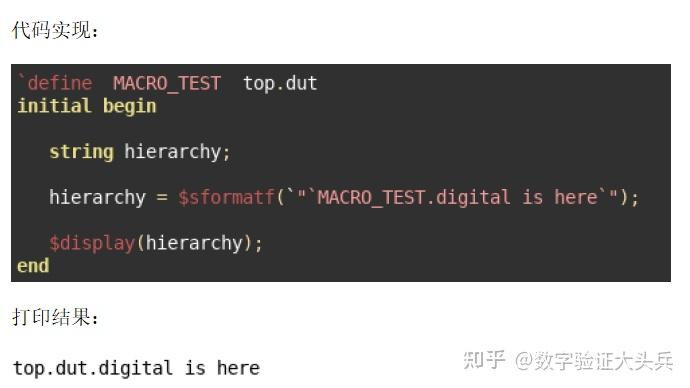

---

# 2. 【朝花夕拾】SystemVerilog：编译器不让赋值，为什么 $cast 却可以？

> 来源：https://mp.weixin.qq.com/s/VX3w7Ice4bPYAvYn3S3e5Q
> 作者：吉米儿
> update 2026/09/15 21 : 53

该篇致力于理解，当初入行困惑很久的小问题... 大佬请划走...

读 UVM 代码时，经常会遇到这样的写法：

$cast(req, req\_resp);

`uvm\_send(req)

 

看起来，它只是让 req 引用 req\_resp 对应的 transaction，再把事务送给 driver。既然如此，为什么不直接写 req = req\_resp;？

常见的解释是：“父类句柄不能直接赋给子类句柄，要用 $cast。”这个回答很容易引出更深一层的疑问：既然编译器不允许，$cast 为什么又可以？它到底检查了什么？

关键在于：句柄的声明类型，与句柄实际指向的对象类型，是两个层面的信息。

本文只讨论普通类句柄之间的 $cast。先从一个最小例子看起：父类描述地址，子类在此基础上增加 burst 长度。

class base\_trans;

    int addr;

endclass

 

class axi\_trans extends base\_trans;

    int burst\_len;

endclass

 

声明 base\_trans b;，只是定义了一个父类类型的句柄变量；真正的对象要通过 new 或工厂创建。这个句柄既可以引用 base\_trans 对象，也可以引用从它派生的对象。

接着创建一个 axi\_trans 对象，再用父类句柄引用它。下面的模块与前面的类定义可以放在同一个 SystemVerilog 文件中：

示例代码：父类句柄保存子类对象，再通过 $cast 取得子类句柄

module tb;

    base\_trans b;

    axi\_trans  a1, a2;

 

    initialbegin

        a1 = new();

        a1.burst\_len = 8;

        b = a1;

 

        // a2 = b;  // 取消注释后，这一行会编译报错

 

        if ($cast(a2, b)) begin

            $display("burst\_len=%0d", a2.burst\_len);

        end

    end

endmodule

 

先停在 b = a1; 这一行。赋值完成后，对象依然是完整的 axi\_trans，burst\_len 仍然存在，值仍然是 8。变化的只是：现在多了一个名叫 b 的句柄引用它。

| 观察对象 | 此时的类型或状态 |
| --- | --- |
| 句柄 b 的声明类型 | base\_trans |
| b 实际指向的对象类型 | axi\_trans |
| 对象是否丢失 burst\_len | 没有，成员仍然存在 |

 

通过 b 可以直接访问父类声明的 addr；要直接访问子类新增的 burst\_len，需要取得相应的子类句柄。对象拥有哪些成员，与某种句柄类型允许你直接访问哪些成员，需要分开看。

再看被注释的 a2 = b;。普通赋值根据声明类型检查，右边是 base\_trans，左边是 axi\_trans。父类句柄可能指向不同对象，语言不允许未经运行时检查就把它当作某个具体子类使用。

即使这个简单例子中，前一行已经写了 b = a1，直接赋值仍然受到同一条类型规则约束。编译器不会因此放宽父类句柄到子类句柄的赋值规则。 类句柄赋值规则

所以，这里的编译错误表达的是：仅凭声明类型，不能保证这次直接赋值安全。实际对象是否兼容，仍然有可能在运行时得到确认。

这正是 $cast(a2, b) 发挥作用的地方。它检查 b 当前引用的对象能否由 axi\_trans 类型的句柄接收。对于这里的非空对象，实际类型是 axi\_trans，或是 axi\_trans 的进一步派生类，都可以通过检查。

示例中的对象确实是 axi\_trans，因此 $cast 返回 1，并且已经完成句柄赋值。随后打印的 burst\_len 为 8。

$cast 检查成功时就完成赋值，不需要再补一行 a2 = b。

成功后，a1、b 和 a2 都引用同一个对象。通过 a2 修改 burst\_len，a1 也会看到修改；$cast 没有创建新对象，也没有复制一份 transaction。

不过，这几个句柄变量仍然独立。之后执行 a2 = null，只会清空 a2，a1 和 b 仍然引用原来的对象。句柄赋值不会建立持续同步变化的连接。

为了看到检查真正的作用，可以在同一个 initial 块后面继续加入：

b = new();  // 这次创建的是 base\_trans 对象

 

if (!$cast(a2, b)) begin

    $display("cast failed");

end

 

这一次，b 指向的确实是 base\_trans 对象，它没有子类新增的 burst\_len。$cast 返回 0，进入失败分支，a2 保持原值。在这个例子里，a2 仍然引用之前的 axi\_trans 对象。

动态检查能够识别这次不兼容的赋值，却不会给父类对象补出缺失的成员。写了 $cast，也不能保证每一次转换都会成功。

到这里，很容易产生另一个误解：“既然 $cast 做了检查，用它就不会报错了吧？”这还要看它的调用方式。

独立调用：按任务形式使用

$cast(req, req\_resp);

 

像原始 UVM 代码这样独立调用，类型检查失败时会报告运行时错误。编译通过，只表示这是一种受支持的动态转换写法，实际传入的对象还必须在运行时通过检查。

检查返回值：按函数形式使用

if ($cast(req, req\_resp)) begin

    // 成功：句柄赋值已完成

end

elsebegin

    // 失败：req 保持原值，在这里处理失败

end

 

放在 if 条件中时，成功返回 1，失败返回 0。失败的转换本身不会自动报告运行时错误；是否调用 $error、uvm\_error 或 uvm\_fatal，由失败分支决定。 任务与函数两种调用形式

| 写法 | 检查依据 | 不兼容时的行为 |
| --- | --- | --- |
| 父类句柄直接赋给子类句柄 | 声明类型 | 编译阶段拒绝 |
| 独立调用 $cast | 运行时的实际对象 | 报告运行时错误 |
| 在 if 中检查 $cast 返回值 | 运行时的实际对象 | 返回 0，由代码处理 |

 

以上比较限定为本文讨论的类句柄场景。

处理失败也不能只是打印一句话后继续使用 req。失败时它可能仍然保留上一笔事务的句柄，后续代码必须根据结果选择正确路径。类型检查之外，对象是否可用、事务字段是否有效，仍需由相应代码保证。

这些规则在 UVM 中尤其常见，因为通用接口往往使用父类句柄传递对象。例如，uvm\_object 的 clone() 返回类型就是 uvm\_object。

UVM 1.2 中 clone() 的方法声明

virtual function uvm\_object clone();

 

假设 axi\_item 派生自 uvm\_sequence\_item，已按 UVM 要求实现创建和复制功能，src 是有效的 axi\_item 对象，那么下面的写法需要区分：

代码片段：在 UVM 的 task/function 中使用，假设 src 已有效创建

axi\_item dst;

 

// dst = src.clone();  // 返回类型是 uvm\_object，不能直接赋值

 

if (!$cast(dst, src.clone())) begin

    `uvm\_fatal("CAST", "clone result has an incompatible type")

end

 

这里，clone() 负责创建并复制对象，$cast 负责检查其返回的对象能否由 dst 接收。新对象来自 clone()，不是 $cast。默认 clone() 调用 create() 和 copy()，具体字段复制还依赖类的复制实现。 UVM：clone、copy 与 do\_copy

回到最开始的 $cast(req, req\_resp);，判断它是否必要，要先找到两个句柄的声明类型。

同一类的句柄之间可以直接赋值；把子类句柄赋给父类句柄也可以直接赋值。这些情况下，如果其余条件相同，成功的 $cast 与直接赋值会得到相同的对象引用关系。

当来源是父类句柄、目标是子类句柄时，才需要进一步追踪来源：它实际保存的是目标子类对象，还是另一个不兼容对象？$cast 就是在代码运行到这一刻时给出答案。

因此，阅读一行 $cast，至少要同时看清三个信息：左边期望什么类型，右边实际从哪里取得对象，以及失败后代码如何继续。把这三点连起来，它在验证环境中的作用就能落到具体事务上。

延伸阅读：

Siemens Verification Horizons，Chris Spear，2021。 Class Variables and $cast

Siemens Verification Horizons，Chris Spear，2021。 Runtime checks with the $cast() method

Accellera UVM 1.2 Class Reference。 uvm\_object：clone / copy / do\_copy

---

# 3. SystemVerilog interface：为什么 UVM 需要 virtual interface

> 来源：https://mp.weixin.qq.com/s/dQu9AUYK6Wr9psNq8kJeZA
> 作者：芯片验证碎碎念
> update 2026/09/15 22 : 07

UVM driver 和 monitor 都是 class。class 可以在仿真中由 factory 动态创建，但 DUT 引脚、时钟和接口实例是 elaboration 阶段（[[UVM] Phase 机制详解：为什么组件的生命周期要切成这么多段](https://mp.weixin.qq.com/s?__biz=MzcwOTM2NDg5NA==&mid=2247484005&idx=2&sn=5957ed450f261dd522e3819f0a17ff27&scene=21#wechat_redirect)）确定的静态硬件结构。两类对象生命周期不同，不能靠在 class 内直接例化接口解决连接问题。`virtual interface` 就是 class 保存静态接口实例引用的句柄。

## 3.1 先把术语分清

interface 是把同一协议的信号、时钟块、modport 和协议辅助任务放在一起的静态结构。modport 是接口的方向视图，规定从某个使用者角度哪些信号可读、哪些可写。clocking block 是接口中的时序视图，规定采样与驱动相对时钟沿的位置。virtual interface 是 class 内的句柄，它不创建信号，只引用已经在顶层例化的 interface。

## 3.2 interface 先解决什么问题

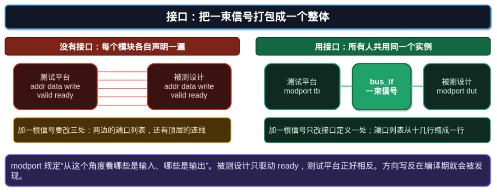

图 1：地址、数据、有效和就绪不再以多组端口重复出现，而是由一个接口实例统一承载。

没有 interface 时，DUT、driver、monitor 和断言模块都要重复声明同一组信号；加一根 sideband 信号时，多个端口列表必须一起修改。interface 把这份连接契约集中起来，模块端口只传一个接口或 modport 视图。

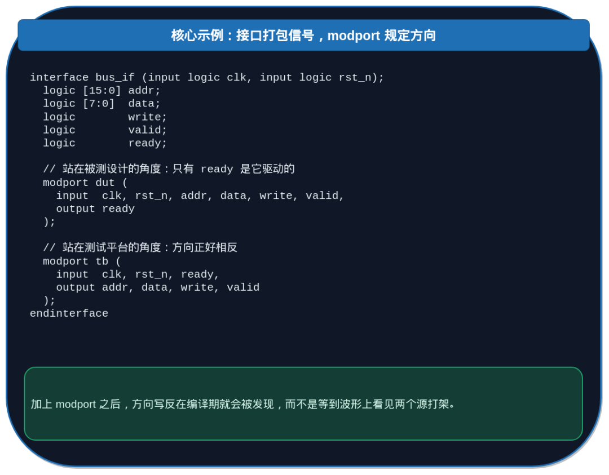

代码图 1：interface 保存公共信号；DUT 和测试平台通过不同 modport 看到相反方向。

modport 不是额外连线，而是编译期方向约束。driver 使用测试平台的驱动视图，DUT 使用设计视图；若两边都试图驱动同一信号，方向冲突会更早暴露。modport 不解决时序竞争，时序属于 clocking block 的职责。

为什么 class 不能直接“连上信号”

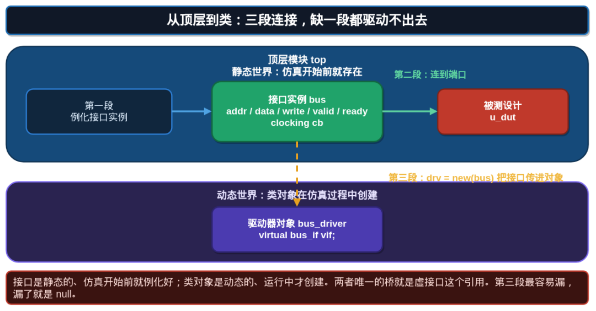

图 2：顶层例化 interface，DUT 静态连接该实例；UVM class 通过 virtual interface 句柄引用同一实例。

class 不是 module，不能出现在静态端口连接网络里。driver 需要访问真实信号，但它的实例由 `type_id::create` 在 build\_phase 创建；此时不能重新生成一个接口，也不能在 class 中写死顶层接口名字。正确结构是：顶层创建唯一的 interface 实例；顶层把它接到 DUT；testbench 在 run\_test 前把该实例放进 `uvm_config_db`；agent 的 driver 和 monitor 在 build\_phase 取出同一个 virtual interface 句柄。

## 3.3 module、interface 与 virtual interface 的关系

module 是静态硬件层级节点：DUT、时钟产生器和顶层 testbench 都是 module；它们在 elaboration 阶段确定端口连接。interface 也属于这个静态世界：顶层 module 创建 `bus_if` 实例，DUT module 通过 port/modport 使用它，信号值因此在同一个仿真网络中传播。

UVM 的 driver、monitor、agent 和 env 是 class component，属于动态验证对象世界。它们不能成为 module port，也不能通过层次名可靠地绑定到某一个 DUT 实例。virtual interface 正是两层之间的“引用桥”：module 负责拥有真实 `bus_if`，class 负责保存 `virtual bus_if vif`；vif 指向 module 已创建的那个实例。接口实例不会因为 driver 被 factory 替换而重新生成，driver 也不会因为 DUT 层级改变而需要改信号访问代码。

可以把三者的关系记成一条单向链：module 创建 interface，interface 连接 module 端口，virtual interface 被 class 引用。不能反过来让 class 创建 DUT 连线，也不能让 virtual interface 代替真实 interface。virtual interface 为空时，静态接口可能仍然存在且 DUT 正常运行，只是该 UVM component 没有拿到通向它的引用。

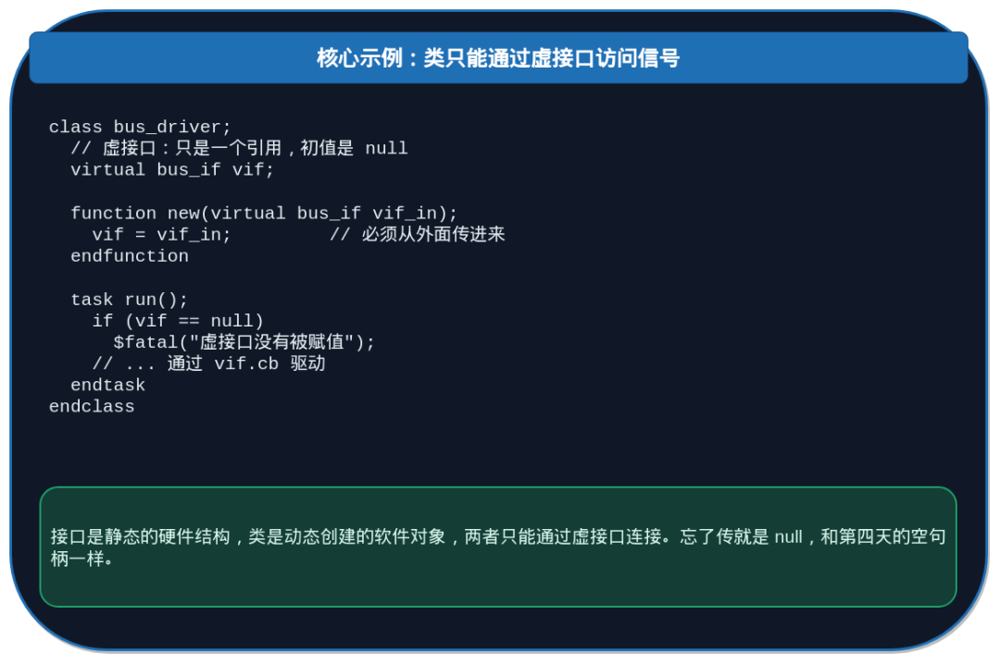

代码图 2：class 中只有 `virtual` 句柄；它初始为 null，必须由外部赋值。

这里的 null 与普通 class 句柄相同：声明了变量不等于已经指向对象。`vif == null` 时访问 `vif.cb` 会产生运行时空句柄错误。最安全的写法是在 build\_phase 的 `config_db::get` 失败时立即 `uvm_fatal`，不要拖到 driver 的 run\_phase 才发现。

## 3.4 virtual interface 到底“虚”在哪里

`virtual` 不表示接口本身是虚构的，也不表示信号没有真实值。真正的 interface 实例仍由顶层静态例化，里面的时钟、地址、数据和握手信号都是真实仿真网络的一部分。虚的是 class 中保存方式：class 不保存一份接口信号，也不拥有 interface 的生命周期，只保存一个能够指向既有实例的引用。

因此，一个 virtual interface 句柄的赋值不会复制任何信号。两个 monitor 若持有同一个 vif，就会观察同一组波形；一个 driver 和一个 monitor 持有同一个 vif，则 driver 的驱动会出现在 monitor 采样的那组信号上。反过来，两个 vif 指向不同 interface 实例时，即使它们使用相同 class 和相同 config key 名称，也是在操作两条不同总线。

virtual interface 也有类型边界。`virtual bus_if` 只能引用 `bus_if` 类型的实例；若 driver 需要特定 modport 视图，应将句柄声明为对应的 virtual modport 类型或在接口任务中封装访问。类型不匹配属于编译或配置阶段的问题，不应通过强制转换把错误延后到运行时。

## 3.5 一个 interface，多个 class

同一 interface 被 driver、monitor、protocol checker 和 assertion wrapper 共同引用是正常模式。它们不应各自从顶层重新寻找接口；应从同一个 agent\_cfg 取得 vif。cfg 的意义不是为了少写一个变量，而是把“这几个组件属于同一条接口实例”变成明确、可检查的关系。

多个 agent 场景更能体现这一点。顶层可以例化 `bus_if_0` 与 `bus_if_1`；env 为 agent0 和 agent1 建立不同 cfg，并将不同 vif 放入各自配置对象。此时两个 driver 的 class 类型完全相同，却因为 vif 句柄不同而驱动不同实例。若 config\_db set 的范围写成通配所有 agent，两个 driver 可能拿到同一个 vif，典型现象是一条总线被双重驱动，另一条总线始终静止。

## 3.6 vif 与 config\_db 的两层定位

`config_db::get` 成功不等于连接一定正确。get 成功只证明按当前组件路径和 key 找到一个配置对象；还需要确认 cfg 内的 `vif` 非 null，并确认这个 vif 是目标 DUT 已连接的实例。建议在 build\_phase 打印组件完整路径、cfg 名称和 vif 是否为 null；在调试模式下，driver/monitor 可各自打印首次驱动或采样时的接口实例标识。这样能区分“没有取到 cfg”“cfg 没有填 vif”“取到了错误 vif”三类问题。

## 3.7 vif 生命周期与使用时机

interface 在 run\_test 前已经存在，vif 句柄应在 component 的 build\_phase 被取得；driver 和 monitor 的 run\_phase 才开始通过 vif 等待时钟、驱动或采样。不要在 constructor 中依赖 vif，因为 constructor 执行时 config\_db 路径和父组件层级可能尚未完全建立。也不要在 transaction 中保存 vif：transaction 应保存协议事实，接口句柄属于长期 component 的环境资源。

当 reset 发生时，vif 本身通常不会改变，它仍指向同一接口实例；改变的是接口上的信号状态和 driver/monitor 的协议状态。把“reset 后需要清空 pending transaction”与“vif 需要重新赋值”混为一谈，会导致不必要的重新配置。只有环境真正切换到另一实例，或一个 test 建立了新的 agent\_cfg 时，才需要改变 vif 引用。

## 3.8 UVM 中的完整配置链

顶层的 `uvm_config_db::set` 把真实接口实例以某个 key 放入配置数据库。config\_db 是按组件层级路径查找的键值数据库，不是普通全局变量。env 或 agent 将目标范围限定为需要该接口的子树；driver 和 monitor 分别用相同 key 调用 `get`。这样同一个 env 有多个 agent 时，每个 agent 也能取到正确的接口，而不会误连到另一条总线。

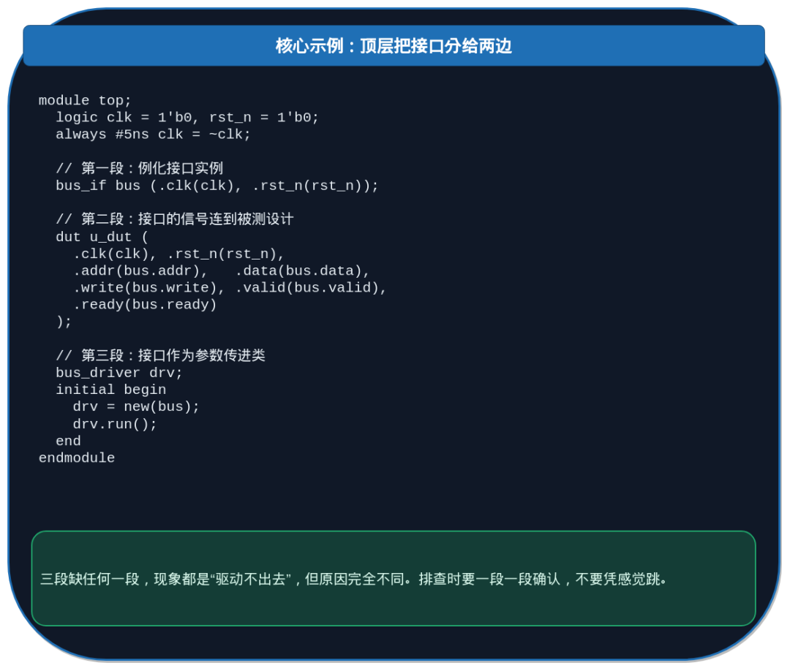

代码图 3：静态顶层既连接 DUT，也通过配置链把同一 interface 实例交给 UVM 组件。

真实 UVM 写法通常会把 virtual interface 放进 `agent_cfg`。cfg 是配置对象，除 vif 外还可携带 active/passive 模式、超时参数等。agent 取得 cfg 后，将同一 cfg 交给 driver 和 monitor。这样 interface 的来源只有一个，driver 与 monitor 不会意外观察两条不同总线。

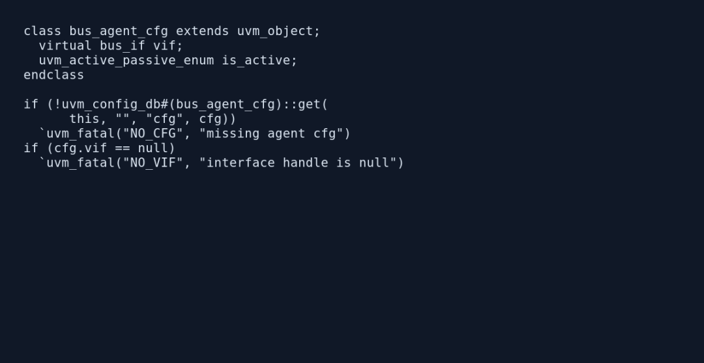

代码图 4：配置对象同时保存 vif 和 agent 模式；agent 在 build\_phase 对 cfg 与 `cfg.vif` 分别做失败检查。

这种“两级检查”来自真实 UVC 的常用边界。第一层检查 cfg 是否成功取得，定位 set/get 的路径或 key 错误；第二层检查 cfg 中的 vif 是否为 null，定位顶层是否真正把接口实例赋进配置对象。两者不能合并，因为 cfg 存在但 vif 为空与 cfg 根本不存在是不同根因。driver 与 monitor 都从同一个 cfg 取得 vif，避免两个组件使用不同来源的接口句柄。

## 3.9 driver 为什么需要 virtual interface

driver 的职责是把 sequence item 转换为接口上的时序动作。sequence item 是 class transaction，包含地址、数据、方向等字段；driver 通过 vif 的 clocking block 在指定时钟边沿驱动它。clocking block 的 output skew 表示驱动动作相对时钟沿的时间位置，避免与 DUT 在同一沿采样形成竞争。

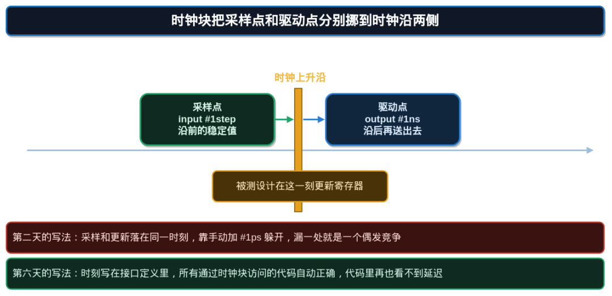

图 3：输入在稳定采样点读取，输出在指定驱动点更新，避免同一时钟沿的读写竞争。

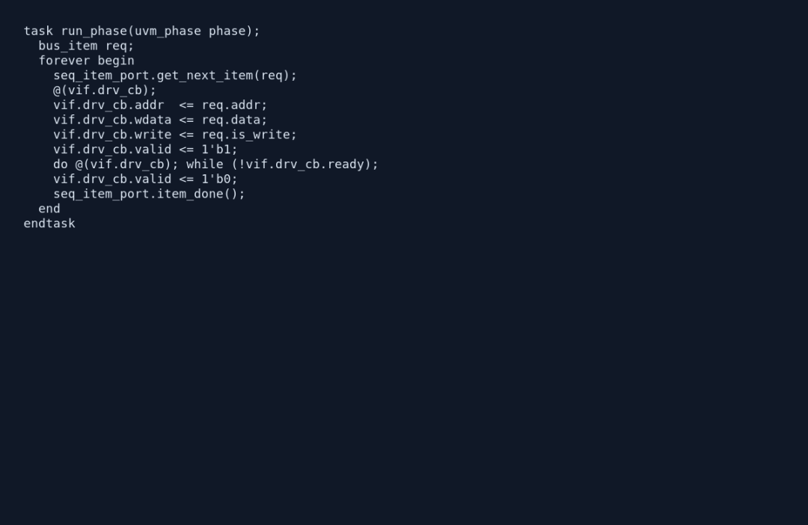

代码图 5：driver 从 sequencer 取得 `bus_item`，等待 `vif.drv_cb`，驱动地址/数据/方向/valid，等待 ready 后撤销 valid，最后调用 `item_done`。

这段代码体现的是完整的 transaction 到引脚转换，而不只是一次赋值。`get_next_item` 从 sequencer 取到已经随机化好的事务；`@(vif.drv_cb)` 把动作对齐到 driver clocking block；valid 保持到 ready 出现，避免在接收方未接收前覆盖字段；`item_done` 释放 sequencer，允许下一笔事务继续。任何一步缺失都会出现不同症状：没有 `get_next_item` 时 driver 永远没有工作；没有等待 ready 时会丢交易；漏掉 `item_done` 时 sequence 卡在第一笔。

这里的 vif 只决定“操作哪一组真实信号”，clocking block 决定“何时操作”。driver 不访问顶层层次名，因此换 DUT 实例、增加第二个 agent、或将同一 driver 用到另一条总线时，只需下发不同 cfg.vif，代码本身不变。实际项目还应在等待 ready 的循环外加入有界计数或 timeout；超过周期阈值时打印 `req.addr`、`req.data`、valid 与 ready 状态，避免无限等待掩盖接口死锁。

## 3.10 monitor 为什么也需要 virtual interface

monitor 不驱动接口，却同样需要 vif 来采样真实信号。monitor 在前图所示的 clocking block 输入采样点读取稳定值，组装成新的 transaction，再经 analysis port 广播给 predictor、scoreboard 和 coverage。driver 与 monitor 使用同一 interface 实例，但通过不同 modport/clocking block 完成不同职责。

## 3.11 读懂现象

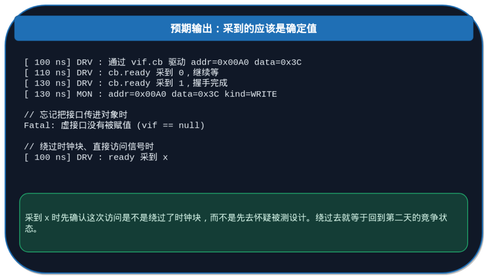

输出图 1：正常场景中 driver 驱动、DUT 响应、monitor 采样的字段一致；vif 未赋值时会在访问点报空句柄。

若 driver 日志显示发送了 transaction，但接口波形不动，先检查 driver 是否拿到正确 vif，以及顶层 interface 是否真的连接到 DUT。若 monitor 采到 x 或偶发旧值，检查它是否绕过 clocking block 直接读取信号。若两个 agent 互相影响，检查 config\_db 的 set 作用域是否过宽。

## 3.12 DV 检查点

建立三个明确检查。第一，driver 和 monitor 在 build\_phase 都确认 vif 非 null，并打印 `get_full_name()`，以便定位哪一个组件取配置失败。第二，对每笔 sequence item 记录 driver 驱动计数与 monitor 观察计数；active 模式下两者应按协议延迟对应。第三，覆盖接口方向：driver 不应驱动 monitor-only 信号，monitor 不应修改接口。这些检查把 virtual interface 问题从波形猜测变成配置、连接和时序三类可验证事实。

## 3.13 真实调试流程

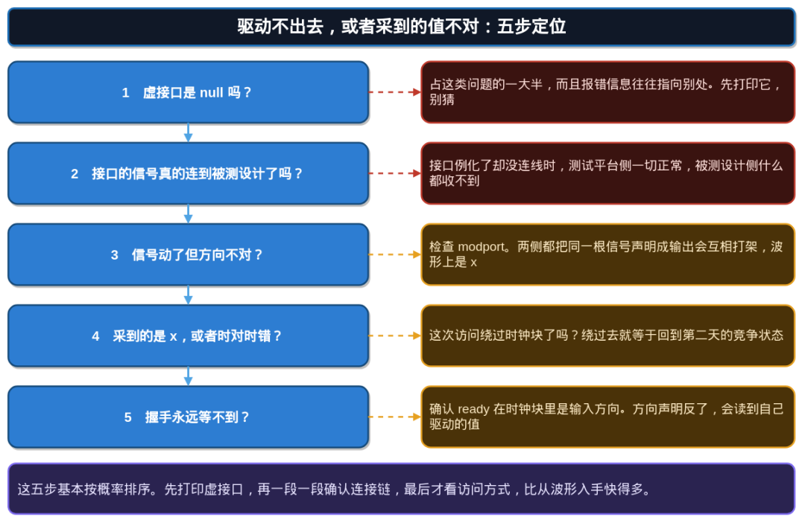

图 4：先查 vif 是否为空，再查顶层静态连接，再查 config\_db 路径和 clocking block 访问方式。

先在 driver 和 monitor 的 build\_phase 检查 `get` 返回值。若一方失败，比较 set 的上下文、目标路径和 key。若两方都成功但信号不动，查看顶层 interface 与 DUT port 的连接；interface 例化成功不代表其信号已经连到 DUT。若信号在动但采样错，最后才检查 modport 方向和 clocking block。这个顺序能避免把配置问题误判为协议问题。

## 3.14 面试问答

问题 1：为什么 UVM driver 使用 virtual interface，而不是直接引用顶层接口名？

回答：driver 是可复用 class，顶层接口实例是静态层次对象。virtual interface 让 driver 保存由外部注入的实例引用，因此同一 driver 可以用于不同 DUT 实例和多个 agent；写死层次名会破坏复用与多实例能力。

问题 2：interface、modport、clocking block、virtual interface 各自解决什么问题？

回答：interface 打包协议信号；modport 定义使用者的读写方向；clocking block 定义相对时钟沿的采样和驱动时刻；virtual interface 让动态 class 持有静态 interface 实例的引用。四者相关，但不能互相替代。

## 3.15 问题 3：`config_db::get` 成功却 driver 驱动不到 DUT，可能是什么原因？

回答：get 成功只证明 driver 拿到了某个 interface 实例，不证明它正是连接 DUT 的那个实例。应检查顶层 port 连接，以及多 agent 场景中 config\_db 路径是否让 driver 拿错了 interface。

## 3.16 小结

interface 将协议信号、方向和时序规则集中定义；virtual interface 则让 UVM class 能够安全引用那个静态实例。完整链路是顶层例化并连接 interface，config\_db 下发引用，agent 将 cfg 交给 driver 与 monitor，driver 用 clocking block 驱动，monitor 用 clocking block 采样。最常见的错误不是语法，而是 vif 没有注入、注入到错误实例，或绕过 clocking block 造成竞争。
