<!-- toc-start -->

# 目录

[1. \[SystemVerilog语法拾遗\] SystemVerilog中的宏使用详解](#1-systemverilog语法拾遗-systemverilog中的宏使用详解)  
　　[1.1 引言](#11-引言)  
　　[1.2 前言](#12-前言)  
　　[1.3 介绍](#13-介绍)  
　　　　[1.3.1 什么是宏？](#131-什么是宏)  
　　　　[1.3.2 为什么要使用宏？](#132-为什么要使用宏)  
　　[1.4 宏语法规范](#14-宏语法规范)  
　　　　[1.4.1 宏名称](#141-宏名称)  
　　　　[1.4.2 反引号——*``` ``, `", `\`" ```*](#142-反引号)  
　　　　[1.4.3 其他应用](#143-其他应用)  
　　[1.5 传递参数](#15-传递参数)  
　　[1.6 宏风格指引](#16-宏风格指引)  
　　[1.7 参考示例](#17-参考示例)  
　　[1.8 总结](#18-总结)  
　　[1.9 疑问与评论](#19-疑问与评论)  
　　　　[1.9.1 补充](#191-补充)  
[2. 【朝花夕拾】SystemVerilog：编译器不让赋值，为什么 $cast 却可以？](#2-朝花夕拾systemverilog编译器不让赋值为什么-cast-却可以)  
[3. SystemVerilog interface：为什么 UVM 需要 virtual interface](#3-systemverilog-interface为什么-uvm-需要-virtual-interface)  
　　[3.1 先把术语分清](#31-先把术语分清)  
　　[3.2 interface 先解决什么问题](#32-interface-先解决什么问题)  
　　[3.3 module、interface 与 virtual interface 的关系](#33-moduleinterface-与-virtual-interface-的关系)  
　　[3.4 virtual interface 到底“虚”在哪里](#34-virtual-interface-到底虚在哪里)  
　　[3.5 一个 interface，多个 class](#35-一个-interface多个-class)  
　　[3.6 vif 与 config\_db 的两层定位](#36-vif-与-config_db-的两层定位)  
　　[3.7 vif 生命周期与使用时机](#37-vif-生命周期与使用时机)  
　　[3.8 UVM 中的完整配置链](#38-uvm-中的完整配置链)  
　　[3.9 driver 为什么需要 virtual interface](#39-driver-为什么需要-virtual-interface)  
　　[3.10 monitor 为什么也需要 virtual interface](#310-monitor-为什么也需要-virtual-interface)  
　　[3.11 读懂现象](#311-读懂现象)  
　　[3.12 DV 检查点](#312-dv-检查点)  
　　[3.13 真实调试流程](#313-真实调试流程)  
　　[3.14 面试问答](#314-面试问答)  
　　[3.15 问题 3：`config_db::get` 成功却 driver 驱动不到 DUT，可能是什么原因？](#315-问题-3config_dbget-成功却-driver-驱动不到-dut可能是什么原因)  
　　[3.16 小结](#316-小结)  
[4. \[SystemVerilog标准分析\] 一文讲清楚SystemVerilog的调度机制](#4-systemverilog标准分析-一文讲清楚systemverilog的调度机制)  
　　[4.1 引言](#41-引言)  
　　[4.2 先建立心智模型：时间片与分层事件队列](#42-先建立心智模型时间片与分层事件队列)  
　　[4.3 什么是时间片（time slot）](#43-什么是时间片time-slot)  
　　[4.4 阻塞赋值与非阻塞赋值：一在Active，一在NBA](#44-阻塞赋值与非阻塞赋值一在active一在nba)  
　　[4.5 核心：UVM的阻塞赋值与RTL的非阻塞赋值到底怎么竞争](#45-核心uvm的阻塞赋值与rtl的非阻塞赋值到底怎么竞争)  
　　[4.6 先纠正一个隐蔽的认知前提](#46-先纠正一个隐蔽的认知前提)  
　　[4.7 那么问题来了：driver 该用 `=` 还是 `<=`？](#47-那么问题来了driver-该用-还是)  
　　[4.8 正解：用clocking block的skew消除竞争](#48-正解用clocking-block的skew消除竞争)  
　　[4.9 clocking block 是什么](#49-clocking-block-是什么)  
　　[4.10 加了 clocking block 之后，时序长这样](#410-加了-clocking-block-之后时序长这样)  
　　[4.11 回到开头的四个问题，逐一作答](#411-回到开头的四个问题逐一作答)  
　　[4.12 问题1：driver 在时钟沿用阻塞赋值驱动，DUT 能不能当前拍采到？](#412-问题1driver-在时钟沿用阻塞赋值驱动dut-能不能当前拍采到)  
　　[4.13 问题2：UVM 的阻塞赋值和 RTL 的非阻塞赋值之间有没有竞争？](#413-问题2uvm-的阻塞赋值和-rtl-的非阻塞赋值之间有没有竞争)  
　　[4.14 问题3：写 driver 该用 `=` 还是 `<=`？](#414-问题3写-driver-该用-还是)  
　　[4.15 问题4：采样 DUT 输出，采到的是前一拍的值还是最新变化的值？](#415-问题4采样-dut-输出采到的是前一拍的值还是最新变化的值)  
　　[4.16 采样 DUT 输出：input #1step 采的是“前一拍的稳定值”](#416-采样-dut-输出input-1step-采的是前一拍的稳定值)  
　　[4.17 一个完整的教科书式最小例子](#417-一个完整的教科书式最小例子)  
　　[4.18 总结](#418-总结)  
　　[4.19 参考文献](#419-参考文献)  
[5. \[SystemVerilog标准分析\] 聊聊SystemVerilog中的浮点数](#5-systemverilog标准分析-聊聊systemverilog中的浮点数)  

<!-- toc-end -->

---

# 1. [SystemVerilog语法拾遗] SystemVerilog中的宏使用详解

> 来源：https://zhuanlan.zhihu.com/p/660094987
> 发布时间：2023-10-08T08:51:51.000Z
> update 2026/08/22 11 : 12

## 1.1 引言

刚刚写了一篇 [数字验证大头兵：[SystemVerilog语法拾遗] 宏函数实例讲解](https://zhuanlan.zhihu.com/p/660080798)，本想着过一段时间再好好研究研究宏函数的语法再写一篇详细点的解析文档，奈何求知欲过于强烈的我还是决定现在就好好研究下宏函数的语法，正巧看到一篇写的不错的宏函数讲解文章，这里就用我有限的英文翻译水平加之对宏函数的一点理解共享给大家，原文链接如下：[SystemVerilog Macros - SystemVerilog.io](https://link.zhihu.com/?target=https%3A//www.systemverilog.io/verification/macros/)

下面是全文翻译

## 1.2 前言

合理的使用宏可以大大简化我们在使用SystemVerilog编写代码的工作量，如果你不熟悉宏的使用，不仅降低写代码的效率，同时在阅读别人写的代码时也会产生诸多困惑，这里的例子将揭开`` `, `", `\`" ``这些宏中常用的符号的含义以及如何使用它们的神秘面纱。

我们还将探索UVM源代码中的一些宏，并建立编写宏的风格指南。

在我们开始之前有一个警告：过度使用宏可能会导致代码可读性降低，所以使用宏一定要尽可能的再简化代码的前提下不要因为对代码的过度封装而影响其可读性。

本文中涉及到的所有代码示例都可以从下面的链接下载使用：[All code presented here can be downloaded from GitHub](https://link.zhihu.com/?target=https%3A//github.com/subbdue/systemverilog.io)

## 1.3 介绍

### 1.3.1 什么是宏？

宏是使用`define编译器指令创建的代码段。它们主要包含三部分：名称、文本和可选参数，如下所示。

```
`define macroname(ARGS) macrotext
```

在编译预处理阶段，代码中每次出现`macroname都会替换为字符串macrotext，ARGS是可以在macrotext中使用的变量。

### 1.3.2 为什么要使用宏？

在编写测试平台和测试用例时，有时候会重复使用某些代码段，如下所示。

```
//1
for (int ii=0; ii<numbytes; ii++) begin
    if ((ii !=0) && (ii % 16 == 0))
        $display("\n");
    $display("0x%x ", bytearray[ii]);
end
//2
for (int ii=20; ii<100; ii++) begin
    if (ii % 16 == 0)
        $display("\n");
    $display("0x%x ", pkt[ii]);
end
```

代码段1和2有着高度的相似性，我们可以从中提取公共部分辅之以参数化的形式将其抽象成如下所示的宏，从而大大简化了代码量，并且后期如果需要更改其中的打印控制只需修改一处就可以了。

```
`define print_bytes(ARR, STARTBYTE, NUMBYTES) \
    for (int ii=STARTBYTE; ii<STARTBYTE+NUMBYTES; ii++) begin
        if ((ii != 0) && (ii % 16 == 0))
            $display("\n");
        $display("0x%x ", ARR[ii]);
    end

// When someone reads this code, they'll know
// it prints a formatted array of bytes
`print_bytes(bytearray, 0, numbytes)
`print_bytes(pkt, 20, 80)
```

我喜欢使用宏，尤其是用于特殊的打印功能，而`uvm\_info是不够的。如果您的所有团队成员都使用这个宏，那么就统一了团队的打印风格，这样使得每个人都更容易阅读log信息。

以下是使用宏的推荐方法：

- 您和您的团队可以建立一个宏库
- 对此库中的宏使用特定的命名规则，例如<\*>\_utils（print\_byte\_utils等）。
- 将其放入名为macro\_utils.sv的文件中，并将其包含在一个公共包中
- 在设计/验证需要的场景中导入这个宏文件，避免重复造轮子的情况

以上便是宏存在的价值。

## 1.4 宏语法规范

### 1.4.1 宏名称

宏名称的唯一规则是，除编译器指令外，您可以使用任何名称，即不能使用关键字，如“define”、“ifdef”、“endif”、“else”、”elseif“、”include“等。如果你最终错误地使用了编译器指令，你会得到如下错误提示。

```
Mentor Graphics Questa

----------------------
    ** Error: macros_one.sv(4): (vlog-2264) Cannot redefine compiler
directives
:
    `include.

Synopsys VCS
------------
    Error-[IUCD] Illegal use of compiler directive
      Illegal use of compiler directive: `include is illegal in this context.
      "macros_one.sv", 28
      Source info:         $display(`include(clock));
```

此外，宏的作用域为“全局”的，宏的使用只跟编译顺序有关，一旦在某个某件中定义了宏，随后编译的文件中都可以使用这个宏，不管这个宏是定义在在类内还是在类外。一旦编译器获取了一个定义，它就可以在任何地方使用。如果你重新定义宏，你会得到如下错误提示。

```
** Warning: macros2.sv(7): (vlog-2263) Redefinition of macro:
    'debug' (previously defined near macros2.sv(3)) .

    Parsing design file 'macros4.sv'

    Warning-[TMR] Text macro redefined
    macros2.sv, 7
      Text macro (debug) is
redefined
. The last definition will override previous
      ones.
      In macros2.sv, 3, it was defined as $display("%s, %0d: %s", `__FILE__,
      `__LINE__, msg)
```

### 1.4.2 反引号——*``` ``, `", `\`" ```*

常用的符号主要有三类。

**1、反引号和双引号 `"**

如果宏文本用纯引号“ 括起来，它本质上就是一个字符串。双引号内的参数不会被替换，如果宏文本嵌入了其他宏，它们也不会展开。如果在双引号前面加一个反引号`，那么双引号的意义就被替换了，使得宏在展开时需要遵循以下原则：

- 包含双引号`"与`"
- 两个双引号内的参数需要被替换
- 两个双引号内嵌入的宏都应该展开

我们看下面这个例子

```
/* Example 1.1 */
`define append_front_bad(MOD) "MOD.master"
`define append_front_good(MOD) `"MOD.master`"

program automatic test;
    initial begin
        $display(`append_front_bad(clock1));
        $display(`append_front_good(clock1));
    end
endprogram: test
```

运行结果如下所示

```
CONSOLE OUTPUT
# MOD.master
# clock1.master
```

``append_front_bad`——接受一个参数MOD，期望宏将两个字符串（MOD和“.master”）串联起来，但由于使用了双引号，输出结果为字符串“MOD.master”，参数并未被替换。

``append_front_good`——这是`append\_front\_bad的正确版本。通过在双引号前使用反引号，进而告诉编译器，当宏展开时，需要替换参数MOD。

**2、双反引号 ``**

本质上是一个标记分隔符，它有助于编译器清楚地区分参数和宏文本中字符串的其余部分，可以用在需要分隔的字符串前面或者后面来对字符串做分隔。

参考如下的代码例子

```
/* Example 1.2 */
`define append_front_2a(MOD) `"MOD.master`"
`define append_front_2b(MOD) `"MOD master`"
`define append_front_2c_bad(MOD) `"MOD_master`"
`define append_front_2c_good(MOD) `"MOD``_master`"
`define append_middle(MOD) `"top_``MOD``_master`"
`define append_end(MOD) `"top_``MOD`"
`define append_front_3(MOD) `"MOD``.master`"

program automatic test;
    initial begin
        /* Example 1.2 */
        $display(`append_front_2a(clock2a));
        $display(`append_front_2b(clock2b));
        $display(`append_front_2c_bad(clock2c));
        $display(`append_front_2c_good(clock2c));
        $display(`append_front_3(clock3));
        $display(`append_middle(clock4));
        $display(`append_end(clock5));
    end
endprogram: test
```

运行结果如下所示

```
CONSOLE OUTPUT
    # clock2a.master
    # clock2b master
    # MOD_master
    # clock2c_master
    # clock3.master
    # top_clock4_master
    # top_clock5
```

``append_front_2a`和2b——**空格和句点都是自然的标记分隔符**，即编译器可以清楚地识别宏文本中的参数\_2a在参数MOD和字符串master之间使用“句点”\_2b在参数MOD和字符串master之间使用了一个“空格”，。

``append_front_2c_bad`——如果参数附加了**非空格**或**非句点**字符，例如“MOD\_master`”中的**下划线（\_）**，则编译器无法确定参数字符串MOD的结束位置，因而就**不会对MOD进行替换而将MOD\_master作为一个整体进行解析**。

``append_front_2c_good`——**双反引号``在MOD和\_master之间创建了一个分隔符**，这就是为什么MOD被正确识别和替换的原因`append\_middle和`append\_end是另外两个例子。

``append_front_3`——在自然标记分隔符（即空格或句点）之前或之后放置“”是可以的，但属于冗余操作。

**3、反引号、反斜杠和双引号 `\`"**

宏展开时会解析为 `"` ，如果需要嵌套的使用双引号，可以使用此选项，代码示例如下

```
/* Example 1.3 */
`define complex_string(ARG1, ARG2) \
    `"This `\`"Blue``ARG1`\`" is Really `\`"ARG2`\`"`"

program automatic test;
    initial begin
        $display(`complex_string(Beast, Black));
    end
endprogram: test
```

运行结果如下

```
CONSOLE OUTPUT
    # This "BlueBeast" is Really "Black"
```

如果以上这些例子还不足以解释清除这几个符号的意义的话，还可以通过下面的链接下载更多的实例：[Download the example code from this section](https://link.zhihu.com/?target=https%3A//github.com/subbdue/systemverilog.io/tree/master/macros)

### 1.4.3 其他应用

- 嵌套使用宏
- 宏中也可以使用注释
- 宏中也可以使用`ifdefs` 这类宏

## 1.5 传递参数

在使用宏参数时以下几点需要铭记于心：

- 参数允许有缺省值。
- 您可以通过将该位置留空来跳过参数，即使它没有缺省值（这一点跟函数/任务调用不同），下面的代码示例中`test2(,,)打印结果验证无缺省值的变量参数空缺时宏会把它替换为空字符。
- 观察下免示例中的`debug1和`debug2这两个宏，如果参数是字符串，则是否需要将参数用双引号括起来取决于参数在宏文本中的替换位置。在`debug1中，MODNAME位于宏文本的引号内，因此在调用宏时，我没有用引号括起字符串`program-block`。而对于`debug2，传递的参数是用引号括起来的`“program-block”`，因为MODNAME出现在宏文本的引号外。

代码示例如下

```
/* Example 2 */
`define test1(A) $display(`"1 Color A`")
`define test2(A=blue, B, C=green) $display(`"3 Colors A, B, C`")
`define test3(A=str1, B, C=green) \
    if (A == "orange")$display("Oooo .. I received an Orange!"); \
    else $display(`"3 Colors %s, B, C`", A);

`define debug1(MODNAME, MSG) \
    $display(`" ``MODNAME`` >> %s, %0d: %s`", `__FILE__, `__LINE__, MSG)
`define debug2(MODNAME, MSG) \
    $display(`"%s >> %s, %0d: %s`", MODNAME, `__FILE__, `__LINE__, MSG)

program automatic test;
    initial begin
        string str1, str2;
        str1 = "gray";
        str2 = "orange";

        // No args provided even without default value
        `test1();
        `test2(,,);

        // Passing some args
        `test1(black);
        `test2(,pink,);

        // Passing a var (str1, str2) as an arg
        `test3(str1,mistygreen,babypink);
        `test3(str2,mistygreen,babypink);

        `debug1(program-block, "this is a debug message");
        `debug2("program-block", "this is a debug message");

        /* The following will result in an Error
        * `test2(); // no args provided
        * `test2(,); // insufficient args provided
        *
        * // arg1 is used as a var in an if statement,
        * // This will compile fail because the macro
        * // will expand to *if ( == "orange")*
        * `test(, blue, pink)
        */
    end
endprogram: test
```

运行结果如下

```
CONSOLE OUTPUT

    # 1 Color
    # 3 Colors blue, , green
    # 1 Color black
    # 3 Colors blue, pink, green
    # 3 Colors gray, mistygreen, babypink
    # Oooo .. I received an Orange!
    #  program-block >> macros2.sv, 31: this is a debug message
    # program-block >> macros2.sv, 32: this is a debug message
```

## 1.6 宏风格指引

在整个团队中遵循一致的宏命名风格是非常有用的。由于UVM现在被广泛用作验证方法，我们可以从他们的源代码中借用一段，并使用他们宏编码风格。如果您查看UVM库的源代码，您将看到以下内容：

- 如果宏定义函数或任务，请使用大写宏名称和小写参数名称
- 如果宏定义了类、代码段等内容，请使用小写宏名称和大写作为参数
- 用下划线分隔宏名称中的单词

在下一节中，我从UVM库中挑选了一些宏，它们很好的彰显了上述命名规则。

## 1.7 参考示例

通常，你只需要看一堆例子便可以刷新你对如何使用宏的认知，下面是我从UVM库的源代码中挑选的一些示例，你应该能够从我们上面讲解的内容中很好的理解这些示例。

```
//> src/base/uvm_phase.svh
`define UVM_PH_TRACE(ID,MSG,PH,VERB) \
   `uvm_info(ID, {$sformatf("Phase '%0s' (id=%0d) ", \
       PH.get_full_name(), PH.get_inst_id()),MSG}, VERB);

//> src/macros/uvm_tlm_defines.svh
// Check out the MacroStyleGuide in use here
// [ 1.] If the Macro defines a function or a task,
// use UPPERCASE for macro name and lower case for args
`define UVM_BLOCKING_TRANSPORT_IMP_SFX(SFX, imp, REQ, RSP, req_arg, rsp_arg) \
  task transport( input REQ req_arg, output RSP rsp_arg); \
    imp.transport``SFX(req_arg, rsp_arg); \
  endtask

// [ 2a.] For everything else (i.e., if Macro defines
// a snippet of code, class or a convenience definition),
// use lowercase with UPPERCASE args
`define uvm_analysis_imp_decl(SFX) \
    class uvm_analysis_imp``SFX #(type T=int, type IMP=int) \
      extends uvm_port_base #(uvm_tlm_if_base #(T,T)); \
      `UVM_IMP_COMMON(`UVM_TLM_ANALYSIS_MASK,`"uvm_analysis_imp``SFX`",IMP) \
      function void write( input T t); \
        m_imp.write``SFX( t); \
      endfunction \
      \
    endclass

// [ 2b.] Examples of lowercase+uppercase with snippets
`define uvm_error(ID, MSG) \
   begin \
     if (uvm_report_enabled(UVM_NONE,UVM_ERROR,ID)) \
       uvm_report_error (ID, MSG, UVM_NONE, `uvm_file, `uvm_line, "", 1); \
   end
// [ 3.] Separate words with underscores, don't use camelCase
`define uvm_non_blocking_transport_imp_decl(SFX) \
    `
uvm
_nonblocking_transport_imp_decl(SFX)

//> src/macros/uvm_sequence_defines.svh
`define uvm_do(SEQ_OR_ITEM) \
  `uvm_do_on_pri_with(SEQ_OR_ITEM, m_sequencer, -1, {})

`define uvm_do_with(SEQ_OR_ITEM, CONSTRAINTS) \
  `uvm_do_on_pri_with(SEQ_OR_ITEM, m_sequencer, -1, CONSTRAINTS)

 `define uvm_do_on_pri_with(SEQ_OR_ITEM, SEQR, PRIORITY, CONSTRAINTS) \
  begin \
  uvm_sequence_base __seq; \
  `uvm_create_on(SEQ_OR_ITEM, SEQR) \
  if (!$cast(__seq,SEQ_OR_ITEM)) start_item(SEQ_OR_ITEM, PRIORITY);\
  if ((__seq == null || !__seq.do_not_randomize) && !SEQ_OR_ITEM.randomize() with CONSTRAINTS ) begin \
    `uvm_warning("RNDFLD", "Randomization failed in uvm_do_with action") \
  end\
  if (!$cast(__seq,SEQ_OR_ITEM)) finish_item(SEQ_OR_ITEM, PRIORITY); \
  else __seq.start(SEQR, this, PRIORITY, 0); \
  end

`define uvm_create_on(SEQ_OR_ITEM, SEQR) \
  begin \
  uvm_object_wrapper w_; \
  w_ = SEQ_OR_ITEM.get_type(); \
  $cast(SEQ_OR_ITEM , create_item(w_, SEQR, `"SEQ_OR_ITEM`"));\
  end
```

## 1.8 总结

- 遵循统一的宏编码风格，确保整个团队的一致性

- 函数和任务的大写宏名称和小写参数
- 用下划线分隔单词
- 其他所有内容（如类、代码片段等）的小写宏名称和大写参数
- 使用宏时要谨慎，过度使用可能会导致代码可读性变差

- 知道何时使用以下符号 `"、`` 和 `\`"
- 宏强制在全局命名空间有效，在类中定义宏并不意味着它只对该类可见。
- 注意编译log中的宏重新定义的警告
- 编写宏时，请使用本文中的示例作为参考

## 1.9 疑问与评论

可以通过如下链接与作者进行交流讨论：[please use this GitHub Discussions link](https://link.zhihu.com/?target=https%3A//github.com/subbdue/systemverilog.io/discussions/9)

### 1.9.1 补充

如果想要在字符串中嵌套宏，可以借助反引号`完成，如下图所示：

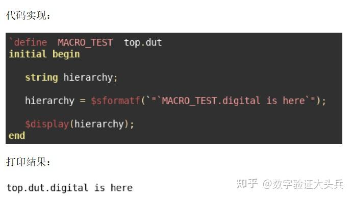

---

# 2. 【朝花夕拾】SystemVerilog：编译器不让赋值，为什么 $cast 却可以？

> 来源：https://mp.weixin.qq.com/s/VX3w7Ice4bPYAvYn3S3e5Q
> 作者：吉米儿
> update 2026/09/15 21 : 53

该篇致力于理解，当初入行困惑很久的小问题... 大佬请划走...

读 UVM 代码时，经常会遇到这样的写法：

$cast(req, req\_resp);

`uvm\_send(req)

 

看起来，它只是让 req 引用 req\_resp 对应的 transaction，再把事务送给 driver。既然如此，为什么不直接写 req = req\_resp;？

常见的解释是：“父类句柄不能直接赋给子类句柄，要用 $cast。”这个回答很容易引出更深一层的疑问：既然编译器不允许，$cast 为什么又可以？它到底检查了什么？

关键在于：句柄的声明类型，与句柄实际指向的对象类型，是两个层面的信息。

本文只讨论普通类句柄之间的 $cast。先从一个最小例子看起：父类描述地址，子类在此基础上增加 burst 长度。

class base\_trans;

    int addr;

endclass

 

class axi\_trans extends base\_trans;

    int burst\_len;

endclass

 

声明 base\_trans b;，只是定义了一个父类类型的句柄变量；真正的对象要通过 new 或工厂创建。这个句柄既可以引用 base\_trans 对象，也可以引用从它派生的对象。

接着创建一个 axi\_trans 对象，再用父类句柄引用它。下面的模块与前面的类定义可以放在同一个 SystemVerilog 文件中：

示例代码：父类句柄保存子类对象，再通过 $cast 取得子类句柄

module tb;

    base\_trans b;

    axi\_trans  a1, a2;

 

    initialbegin

        a1 = new();

        a1.burst\_len = 8;

        b = a1;

 

        // a2 = b;  // 取消注释后，这一行会编译报错

 

        if ($cast(a2, b)) begin

            $display("burst\_len=%0d", a2.burst\_len);

        end

    end

endmodule

 

先停在 b = a1; 这一行。赋值完成后，对象依然是完整的 axi\_trans，burst\_len 仍然存在，值仍然是 8。变化的只是：现在多了一个名叫 b 的句柄引用它。

| 观察对象 | 此时的类型或状态 |
| --- | --- |
| 句柄 b 的声明类型 | base\_trans |
| b 实际指向的对象类型 | axi\_trans |
| 对象是否丢失 burst\_len | 没有，成员仍然存在 |

 

通过 b 可以直接访问父类声明的 addr；要直接访问子类新增的 burst\_len，需要取得相应的子类句柄。对象拥有哪些成员，与某种句柄类型允许你直接访问哪些成员，需要分开看。

再看被注释的 a2 = b;。普通赋值根据声明类型检查，右边是 base\_trans，左边是 axi\_trans。父类句柄可能指向不同对象，语言不允许未经运行时检查就把它当作某个具体子类使用。

即使这个简单例子中，前一行已经写了 b = a1，直接赋值仍然受到同一条类型规则约束。编译器不会因此放宽父类句柄到子类句柄的赋值规则。 类句柄赋值规则

所以，这里的编译错误表达的是：仅凭声明类型，不能保证这次直接赋值安全。实际对象是否兼容，仍然有可能在运行时得到确认。

这正是 $cast(a2, b) 发挥作用的地方。它检查 b 当前引用的对象能否由 axi\_trans 类型的句柄接收。对于这里的非空对象，实际类型是 axi\_trans，或是 axi\_trans 的进一步派生类，都可以通过检查。

示例中的对象确实是 axi\_trans，因此 $cast 返回 1，并且已经完成句柄赋值。随后打印的 burst\_len 为 8。

$cast 检查成功时就完成赋值，不需要再补一行 a2 = b。

成功后，a1、b 和 a2 都引用同一个对象。通过 a2 修改 burst\_len，a1 也会看到修改；$cast 没有创建新对象，也没有复制一份 transaction。

不过，这几个句柄变量仍然独立。之后执行 a2 = null，只会清空 a2，a1 和 b 仍然引用原来的对象。句柄赋值不会建立持续同步变化的连接。

为了看到检查真正的作用，可以在同一个 initial 块后面继续加入：

b = new();  // 这次创建的是 base\_trans 对象

 

if (!$cast(a2, b)) begin

    $display("cast failed");

end

 

这一次，b 指向的确实是 base\_trans 对象，它没有子类新增的 burst\_len。$cast 返回 0，进入失败分支，a2 保持原值。在这个例子里，a2 仍然引用之前的 axi\_trans 对象。

动态检查能够识别这次不兼容的赋值，却不会给父类对象补出缺失的成员。写了 $cast，也不能保证每一次转换都会成功。

到这里，很容易产生另一个误解：“既然 $cast 做了检查，用它就不会报错了吧？”这还要看它的调用方式。

独立调用：按任务形式使用

$cast(req, req\_resp);

 

像原始 UVM 代码这样独立调用，类型检查失败时会报告运行时错误。编译通过，只表示这是一种受支持的动态转换写法，实际传入的对象还必须在运行时通过检查。

检查返回值：按函数形式使用

if ($cast(req, req\_resp)) begin

    // 成功：句柄赋值已完成

end

elsebegin

    // 失败：req 保持原值，在这里处理失败

end

 

放在 if 条件中时，成功返回 1，失败返回 0。失败的转换本身不会自动报告运行时错误；是否调用 $error、uvm\_error 或 uvm\_fatal，由失败分支决定。 任务与函数两种调用形式

| 写法 | 检查依据 | 不兼容时的行为 |
| --- | --- | --- |
| 父类句柄直接赋给子类句柄 | 声明类型 | 编译阶段拒绝 |
| 独立调用 $cast | 运行时的实际对象 | 报告运行时错误 |
| 在 if 中检查 $cast 返回值 | 运行时的实际对象 | 返回 0，由代码处理 |

 

以上比较限定为本文讨论的类句柄场景。

处理失败也不能只是打印一句话后继续使用 req。失败时它可能仍然保留上一笔事务的句柄，后续代码必须根据结果选择正确路径。类型检查之外，对象是否可用、事务字段是否有效，仍需由相应代码保证。

这些规则在 UVM 中尤其常见，因为通用接口往往使用父类句柄传递对象。例如，uvm\_object 的 clone() 返回类型就是 uvm\_object。

UVM 1.2 中 clone() 的方法声明

virtual function uvm\_object clone();

 

假设 axi\_item 派生自 uvm\_sequence\_item，已按 UVM 要求实现创建和复制功能，src 是有效的 axi\_item 对象，那么下面的写法需要区分：

代码片段：在 UVM 的 task/function 中使用，假设 src 已有效创建

axi\_item dst;

 

// dst = src.clone();  // 返回类型是 uvm\_object，不能直接赋值

 

if (!$cast(dst, src.clone())) begin

    `uvm\_fatal("CAST", "clone result has an incompatible type")

end

 

这里，clone() 负责创建并复制对象，$cast 负责检查其返回的对象能否由 dst 接收。新对象来自 clone()，不是 $cast。默认 clone() 调用 create() 和 copy()，具体字段复制还依赖类的复制实现。 UVM：clone、copy 与 do\_copy

回到最开始的 $cast(req, req\_resp);，判断它是否必要，要先找到两个句柄的声明类型。

同一类的句柄之间可以直接赋值；把子类句柄赋给父类句柄也可以直接赋值。这些情况下，如果其余条件相同，成功的 $cast 与直接赋值会得到相同的对象引用关系。

当来源是父类句柄、目标是子类句柄时，才需要进一步追踪来源：它实际保存的是目标子类对象，还是另一个不兼容对象？$cast 就是在代码运行到这一刻时给出答案。

因此，阅读一行 $cast，至少要同时看清三个信息：左边期望什么类型，右边实际从哪里取得对象，以及失败后代码如何继续。把这三点连起来，它在验证环境中的作用就能落到具体事务上。

延伸阅读：

Siemens Verification Horizons，Chris Spear，2021。 Class Variables and $cast

Siemens Verification Horizons，Chris Spear，2021。 Runtime checks with the $cast() method

Accellera UVM 1.2 Class Reference。 uvm\_object：clone / copy / do\_copy

---

# 3. SystemVerilog interface：为什么 UVM 需要 virtual interface

> 来源：https://mp.weixin.qq.com/s/dQu9AUYK6Wr9psNq8kJeZA
> 作者：芯片验证碎碎念
> update 2026/09/15 22 : 07

UVM driver 和 monitor 都是 class。class 可以在仿真中由 factory 动态创建，但 DUT 引脚、时钟和接口实例是 elaboration 阶段（[[UVM] Phase 机制详解：为什么组件的生命周期要切成这么多段](https://mp.weixin.qq.com/s?__biz=MzcwOTM2NDg5NA==&mid=2247484005&idx=2&sn=5957ed450f261dd522e3819f0a17ff27&scene=21#wechat_redirect)）确定的静态硬件结构。两类对象生命周期不同，不能靠在 class 内直接例化接口解决连接问题。`virtual interface` 就是 class 保存静态接口实例引用的句柄。

## 3.1 先把术语分清

interface 是把同一协议的信号、时钟块、modport 和协议辅助任务放在一起的静态结构。modport 是接口的方向视图，规定从某个使用者角度哪些信号可读、哪些可写。clocking block 是接口中的时序视图，规定采样与驱动相对时钟沿的位置。virtual interface 是 class 内的句柄，它不创建信号，只引用已经在顶层例化的 interface。

## 3.2 interface 先解决什么问题

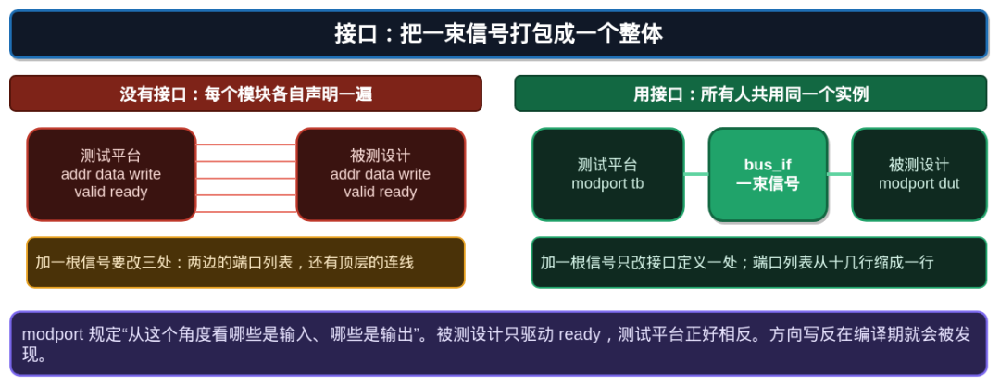

图 1：地址、数据、有效和就绪不再以多组端口重复出现，而是由一个接口实例统一承载。

没有 interface 时，DUT、driver、monitor 和断言模块都要重复声明同一组信号；加一根 sideband 信号时，多个端口列表必须一起修改。interface 把这份连接契约集中起来，模块端口只传一个接口或 modport 视图。

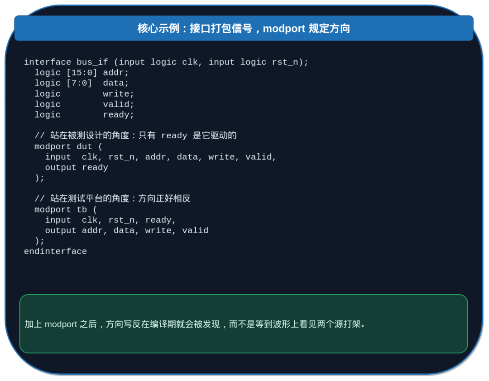

代码图 1：interface 保存公共信号；DUT 和测试平台通过不同 modport 看到相反方向。

modport 不是额外连线，而是编译期方向约束。driver 使用测试平台的驱动视图，DUT 使用设计视图；若两边都试图驱动同一信号，方向冲突会更早暴露。modport 不解决时序竞争，时序属于 clocking block 的职责。

为什么 class 不能直接“连上信号”

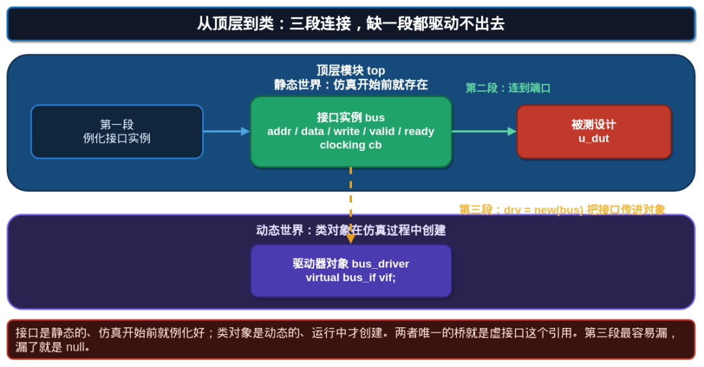

图 2：顶层例化 interface，DUT 静态连接该实例；UVM class 通过 virtual interface 句柄引用同一实例。

class 不是 module，不能出现在静态端口连接网络里。driver 需要访问真实信号，但它的实例由 `type_id::create` 在 build\_phase 创建；此时不能重新生成一个接口，也不能在 class 中写死顶层接口名字。正确结构是：顶层创建唯一的 interface 实例；顶层把它接到 DUT；testbench 在 run\_test 前把该实例放进 `uvm_config_db`；agent 的 driver 和 monitor 在 build\_phase 取出同一个 virtual interface 句柄。

## 3.3 module、interface 与 virtual interface 的关系

module 是静态硬件层级节点：DUT、时钟产生器和顶层 testbench 都是 module；它们在 elaboration 阶段确定端口连接。interface 也属于这个静态世界：顶层 module 创建 `bus_if` 实例，DUT module 通过 port/modport 使用它，信号值因此在同一个仿真网络中传播。

UVM 的 driver、monitor、agent 和 env 是 class component，属于动态验证对象世界。它们不能成为 module port，也不能通过层次名可靠地绑定到某一个 DUT 实例。virtual interface 正是两层之间的“引用桥”：module 负责拥有真实 `bus_if`，class 负责保存 `virtual bus_if vif`；vif 指向 module 已创建的那个实例。接口实例不会因为 driver 被 factory 替换而重新生成，driver 也不会因为 DUT 层级改变而需要改信号访问代码。

可以把三者的关系记成一条单向链：module 创建 interface，interface 连接 module 端口，virtual interface 被 class 引用。不能反过来让 class 创建 DUT 连线，也不能让 virtual interface 代替真实 interface。virtual interface 为空时，静态接口可能仍然存在且 DUT 正常运行，只是该 UVM component 没有拿到通向它的引用。

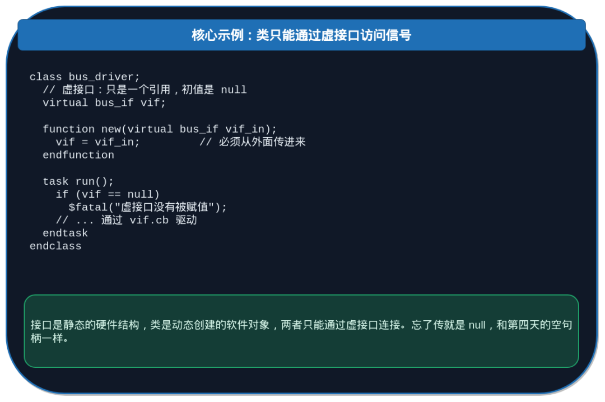

代码图 2：class 中只有 `virtual` 句柄；它初始为 null，必须由外部赋值。

这里的 null 与普通 class 句柄相同：声明了变量不等于已经指向对象。`vif == null` 时访问 `vif.cb` 会产生运行时空句柄错误。最安全的写法是在 build\_phase 的 `config_db::get` 失败时立即 `uvm_fatal`，不要拖到 driver 的 run\_phase 才发现。

## 3.4 virtual interface 到底“虚”在哪里

`virtual` 不表示接口本身是虚构的，也不表示信号没有真实值。真正的 interface 实例仍由顶层静态例化，里面的时钟、地址、数据和握手信号都是真实仿真网络的一部分。虚的是 class 中保存方式：class 不保存一份接口信号，也不拥有 interface 的生命周期，只保存一个能够指向既有实例的引用。

因此，一个 virtual interface 句柄的赋值不会复制任何信号。两个 monitor 若持有同一个 vif，就会观察同一组波形；一个 driver 和一个 monitor 持有同一个 vif，则 driver 的驱动会出现在 monitor 采样的那组信号上。反过来，两个 vif 指向不同 interface 实例时，即使它们使用相同 class 和相同 config key 名称，也是在操作两条不同总线。

virtual interface 也有类型边界。`virtual bus_if` 只能引用 `bus_if` 类型的实例；若 driver 需要特定 modport 视图，应将句柄声明为对应的 virtual modport 类型或在接口任务中封装访问。类型不匹配属于编译或配置阶段的问题，不应通过强制转换把错误延后到运行时。

## 3.5 一个 interface，多个 class

同一 interface 被 driver、monitor、protocol checker 和 assertion wrapper 共同引用是正常模式。它们不应各自从顶层重新寻找接口；应从同一个 agent\_cfg 取得 vif。cfg 的意义不是为了少写一个变量，而是把“这几个组件属于同一条接口实例”变成明确、可检查的关系。

多个 agent 场景更能体现这一点。顶层可以例化 `bus_if_0` 与 `bus_if_1`；env 为 agent0 和 agent1 建立不同 cfg，并将不同 vif 放入各自配置对象。此时两个 driver 的 class 类型完全相同，却因为 vif 句柄不同而驱动不同实例。若 config\_db set 的范围写成通配所有 agent，两个 driver 可能拿到同一个 vif，典型现象是一条总线被双重驱动，另一条总线始终静止。

## 3.6 vif 与 config\_db 的两层定位

`config_db::get` 成功不等于连接一定正确。get 成功只证明按当前组件路径和 key 找到一个配置对象；还需要确认 cfg 内的 `vif` 非 null，并确认这个 vif 是目标 DUT 已连接的实例。建议在 build\_phase 打印组件完整路径、cfg 名称和 vif 是否为 null；在调试模式下，driver/monitor 可各自打印首次驱动或采样时的接口实例标识。这样能区分“没有取到 cfg”“cfg 没有填 vif”“取到了错误 vif”三类问题。

## 3.7 vif 生命周期与使用时机

interface 在 run\_test 前已经存在，vif 句柄应在 component 的 build\_phase 被取得；driver 和 monitor 的 run\_phase 才开始通过 vif 等待时钟、驱动或采样。不要在 constructor 中依赖 vif，因为 constructor 执行时 config\_db 路径和父组件层级可能尚未完全建立。也不要在 transaction 中保存 vif：transaction 应保存协议事实，接口句柄属于长期 component 的环境资源。

当 reset 发生时，vif 本身通常不会改变，它仍指向同一接口实例；改变的是接口上的信号状态和 driver/monitor 的协议状态。把“reset 后需要清空 pending transaction”与“vif 需要重新赋值”混为一谈，会导致不必要的重新配置。只有环境真正切换到另一实例，或一个 test 建立了新的 agent\_cfg 时，才需要改变 vif 引用。

## 3.8 UVM 中的完整配置链

顶层的 `uvm_config_db::set` 把真实接口实例以某个 key 放入配置数据库。config\_db 是按组件层级路径查找的键值数据库，不是普通全局变量。env 或 agent 将目标范围限定为需要该接口的子树；driver 和 monitor 分别用相同 key 调用 `get`。这样同一个 env 有多个 agent 时，每个 agent 也能取到正确的接口，而不会误连到另一条总线。

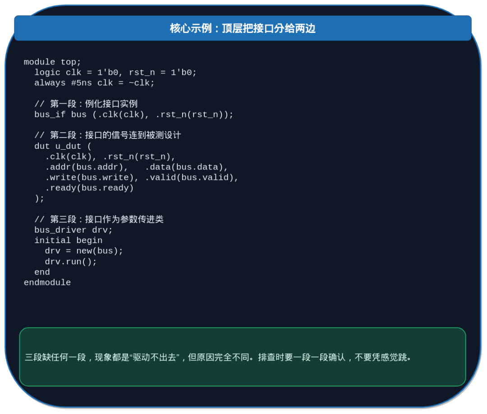

代码图 3：静态顶层既连接 DUT，也通过配置链把同一 interface 实例交给 UVM 组件。

真实 UVM 写法通常会把 virtual interface 放进 `agent_cfg`。cfg 是配置对象，除 vif 外还可携带 active/passive 模式、超时参数等。agent 取得 cfg 后，将同一 cfg 交给 driver 和 monitor。这样 interface 的来源只有一个，driver 与 monitor 不会意外观察两条不同总线。

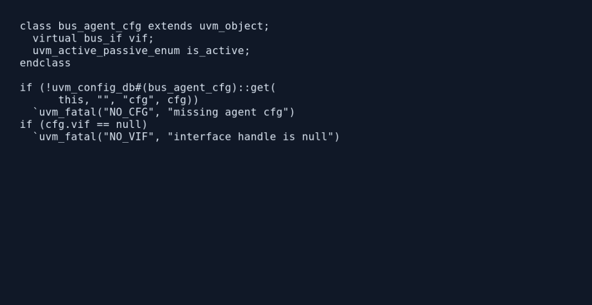

代码图 4：配置对象同时保存 vif 和 agent 模式；agent 在 build\_phase 对 cfg 与 `cfg.vif` 分别做失败检查。

这种“两级检查”来自真实 UVC 的常用边界。第一层检查 cfg 是否成功取得，定位 set/get 的路径或 key 错误；第二层检查 cfg 中的 vif 是否为 null，定位顶层是否真正把接口实例赋进配置对象。两者不能合并，因为 cfg 存在但 vif 为空与 cfg 根本不存在是不同根因。driver 与 monitor 都从同一个 cfg 取得 vif，避免两个组件使用不同来源的接口句柄。

## 3.9 driver 为什么需要 virtual interface

driver 的职责是把 sequence item 转换为接口上的时序动作。sequence item 是 class transaction，包含地址、数据、方向等字段；driver 通过 vif 的 clocking block 在指定时钟边沿驱动它。clocking block 的 output skew 表示驱动动作相对时钟沿的时间位置，避免与 DUT 在同一沿采样形成竞争。

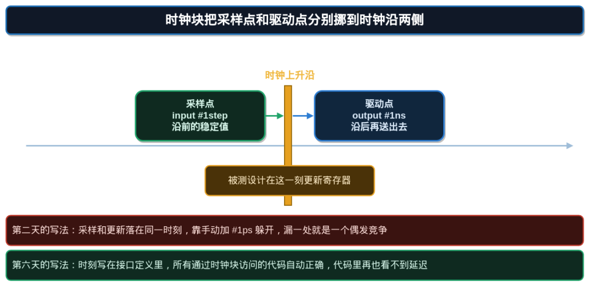

图 3：输入在稳定采样点读取，输出在指定驱动点更新，避免同一时钟沿的读写竞争。

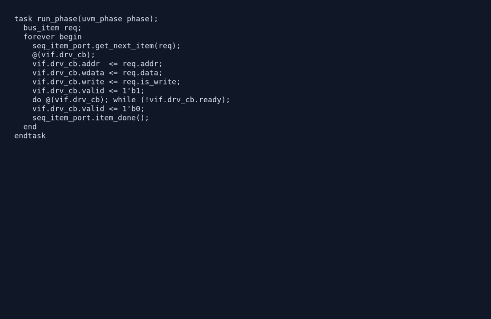

代码图 5：driver 从 sequencer 取得 `bus_item`，等待 `vif.drv_cb`，驱动地址/数据/方向/valid，等待 ready 后撤销 valid，最后调用 `item_done`。

这段代码体现的是完整的 transaction 到引脚转换，而不只是一次赋值。`get_next_item` 从 sequencer 取到已经随机化好的事务；`@(vif.drv_cb)` 把动作对齐到 driver clocking block；valid 保持到 ready 出现，避免在接收方未接收前覆盖字段；`item_done` 释放 sequencer，允许下一笔事务继续。任何一步缺失都会出现不同症状：没有 `get_next_item` 时 driver 永远没有工作；没有等待 ready 时会丢交易；漏掉 `item_done` 时 sequence 卡在第一笔。

这里的 vif 只决定“操作哪一组真实信号”，clocking block 决定“何时操作”。driver 不访问顶层层次名，因此换 DUT 实例、增加第二个 agent、或将同一 driver 用到另一条总线时，只需下发不同 cfg.vif，代码本身不变。实际项目还应在等待 ready 的循环外加入有界计数或 timeout；超过周期阈值时打印 `req.addr`、`req.data`、valid 与 ready 状态，避免无限等待掩盖接口死锁。

## 3.10 monitor 为什么也需要 virtual interface

monitor 不驱动接口，却同样需要 vif 来采样真实信号。monitor 在前图所示的 clocking block 输入采样点读取稳定值，组装成新的 transaction，再经 analysis port 广播给 predictor、scoreboard 和 coverage。driver 与 monitor 使用同一 interface 实例，但通过不同 modport/clocking block 完成不同职责。

## 3.11 读懂现象

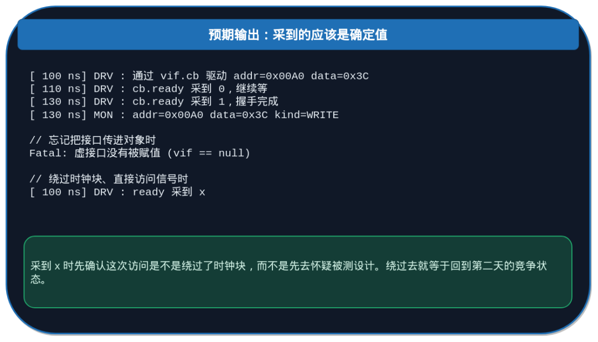

输出图 1：正常场景中 driver 驱动、DUT 响应、monitor 采样的字段一致；vif 未赋值时会在访问点报空句柄。

若 driver 日志显示发送了 transaction，但接口波形不动，先检查 driver 是否拿到正确 vif，以及顶层 interface 是否真的连接到 DUT。若 monitor 采到 x 或偶发旧值，检查它是否绕过 clocking block 直接读取信号。若两个 agent 互相影响，检查 config\_db 的 set 作用域是否过宽。

## 3.12 DV 检查点

建立三个明确检查。第一，driver 和 monitor 在 build\_phase 都确认 vif 非 null，并打印 `get_full_name()`，以便定位哪一个组件取配置失败。第二，对每笔 sequence item 记录 driver 驱动计数与 monitor 观察计数；active 模式下两者应按协议延迟对应。第三，覆盖接口方向：driver 不应驱动 monitor-only 信号，monitor 不应修改接口。这些检查把 virtual interface 问题从波形猜测变成配置、连接和时序三类可验证事实。

## 3.13 真实调试流程

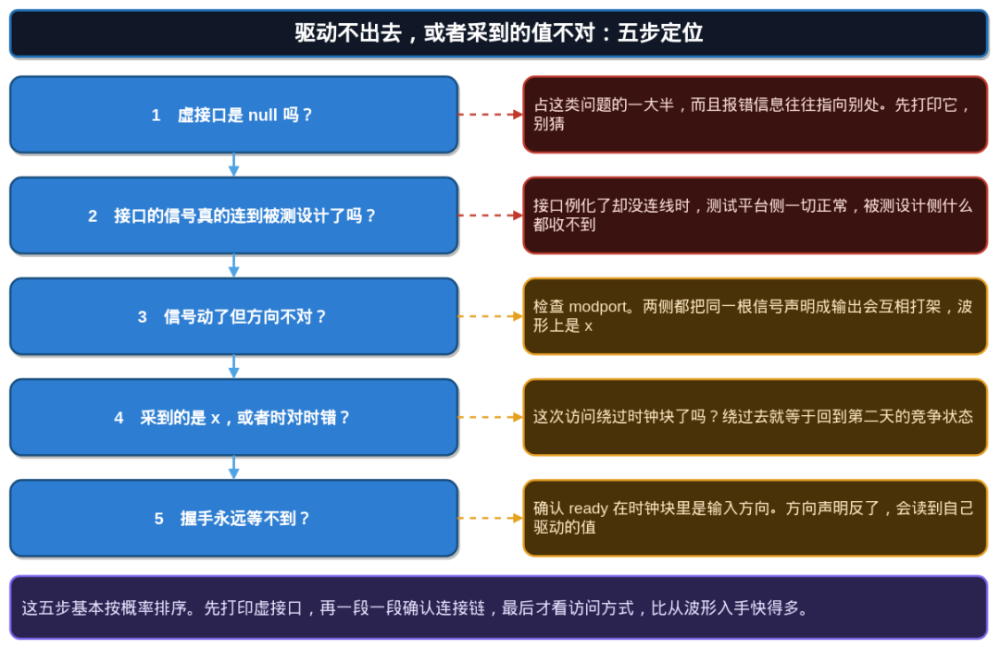

图 4：先查 vif 是否为空，再查顶层静态连接，再查 config\_db 路径和 clocking block 访问方式。

先在 driver 和 monitor 的 build\_phase 检查 `get` 返回值。若一方失败，比较 set 的上下文、目标路径和 key。若两方都成功但信号不动，查看顶层 interface 与 DUT port 的连接；interface 例化成功不代表其信号已经连到 DUT。若信号在动但采样错，最后才检查 modport 方向和 clocking block。这个顺序能避免把配置问题误判为协议问题。

## 3.14 面试问答

问题 1：为什么 UVM driver 使用 virtual interface，而不是直接引用顶层接口名？

回答：driver 是可复用 class，顶层接口实例是静态层次对象。virtual interface 让 driver 保存由外部注入的实例引用，因此同一 driver 可以用于不同 DUT 实例和多个 agent；写死层次名会破坏复用与多实例能力。

问题 2：interface、modport、clocking block、virtual interface 各自解决什么问题？

回答：interface 打包协议信号；modport 定义使用者的读写方向；clocking block 定义相对时钟沿的采样和驱动时刻；virtual interface 让动态 class 持有静态 interface 实例的引用。四者相关，但不能互相替代。

## 3.15 问题 3：`config_db::get` 成功却 driver 驱动不到 DUT，可能是什么原因？

回答：get 成功只证明 driver 拿到了某个 interface 实例，不证明它正是连接 DUT 的那个实例。应检查顶层 port 连接，以及多 agent 场景中 config\_db 路径是否让 driver 拿错了 interface。

## 3.16 小结

interface 将协议信号、方向和时序规则集中定义；virtual interface 则让 UVM class 能够安全引用那个静态实例。完整链路是顶层例化并连接 interface，config\_db 下发引用，agent 将 cfg 交给 driver 与 monitor，driver 用 clocking block 驱动，monitor 用 clocking block 采样。最常见的错误不是语法，而是 vif 没有注入、注入到错误实例，或绕过 clocking block 造成竞争。

---

# 4. [SystemVerilog标准分析] 一文讲清楚SystemVerilog的调度机制

> 来源：https://mp.weixin.qq.com/s/nBxXtdO7qISCJhoWUzG_bA
> 作者：款款就是飞哥
> update 2026/09/27 18 : 27

【SystemVerilog标准分析】· 基于 IEEE 1800-2017（SystemVerilog LRM）

## 4.1 引言

做验证这一行，有些问题你未必天天遇到，但每次遇到都会让人心里“咯噔一下”。下面这几个，我问过不下十位“工作多年”的验证工程师，能一次性讲清楚的，一只手数得过来：

**问题****1**：我在 driver 的run\_phase里，@(posedge clk)之后用阻塞赋值vif.sig = data往 DUT 接口上打，RTL 里always @(posedge clk) q <= sig用非阻塞赋值采样——这一拍 DUT 到底能不能采到我刚打的值？

**问题****2**：UVM 环境里的阻塞赋值，和 RTL 里的非阻塞赋值，两者之间到底存不存在竞争关系？

**问题****3**：写 driver 的时候，到底该用阻塞赋值=还是非阻塞赋值<=？

**问题****4**：我在时钟沿采样 DUT 的输出，采到的到底是“前一拍的值”，还是“这一拍刚变化的新值”？

这四个问题，看起来是四个独立的坑，其实背后是同一个东西在起作用——SystemVerilog 的**分层事件调度器（****stratified event scheduler****）**。把这套调度机制彻底搞懂，这四个问题就全解了，而且你会发现自己对“仿真器到底怎么执行代码”这件事的理解，上了一个台阶。

这一篇，咱们就以 IEEE 1800-2017 的 §4.4（调度语义）和 §14（clocking block）为蓝本，用最具体的代码和波形，把“一个时钟沿上到底发生了什么”掰开揉碎讲清楚。为了让“一看波形就头疼”的读者也能跟上，我会用最少的信号、最慢的节奏来讲。

## 4.2 先建立心智模型：时间片与分层事件队列

## 4.3 什么是时间片（time slot）

仿真器并不是把时间当成一条连续不断的河流，而是把它切成一段一段的离散刻度，每一段叫一个**time slot****（时间片）**。同一个时间片里，所有“发生在同一仿真时刻”的事件会聚在一起，按照一套固定的顺序分批次处理。你代码里那个@(posedge clk)被触发、=赋值生效、<=赋值更新、断言求值……这些动作，全都落在某个时间片的某个“小格子”里。

这套“小格子”的正式名字叫**分层事件队列（****stratified event queue****）**，是 SystemVerilog 调度机制的绝对核心。IEEE 1800-2017 §4.4 把每个时间片从前往后划分成 17 个事件区域（event region），自上而下依次处理，如图1：

*图**1**：一个时间片内的分层事件队列（**17**个区域，自上而下依次处理）*

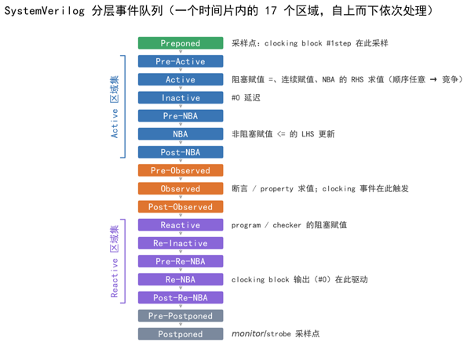

17 个区域看着吓人，但对验证工程师来说，真正每天打交道的其实只有 8 个。我把它们的职责浓缩成一句话：

**Preponed**：采样点。clocking block 的#1step输入就在这儿采样，等价于“上一个时间片的 Postponed”。

**Active**：干活的主力。阻塞赋值=、连续赋值、非阻塞赋值<=的**右值（****RHS****）求值**都在这里。

**Inactive**：#0延迟的歇脚点。

**NBA**：非阻塞赋值<=的**左值（****LHS****）更新**在这里发生。

**Observed**：断言（assertion）求值，以及 clocking 事件的触发点。

**Reactive / Re-NBA**：program 块和 checker 的代码；clocking block 的**输出**（无 skew 或#0）在这里驱动。

**Postponed**：$monitor/$strobe的采样点，一旦到了这里，本时间片内不再允许任何信号变化。

其中最关键、也最“危险”的一句话，出自 §4.4.2.2：

*The Active region holds the current active region set events being evaluated and can be processed in any order.*

翻译：**Active****区域里的事件，可以以任意顺序被处理。**这句话，就是后面所有“竞争（race）”问题的总根源——你永远不能假设“我的代码先跑，你的后跑”。先把它记牢，第三节会反复用到。

## 4.4 阻塞赋值与非阻塞赋值：一在Active，一在NBA

在聊 UVM 和 RTL 的竞争之前，得先把=和<=这两个“老熟人”的调度差异讲透。很多工程师用了一辈子<=，却未必说得清“它到底晚在哪儿”。看这段代码：

*图**2**：例**1**非阻塞赋值**vs**阻塞赋值*

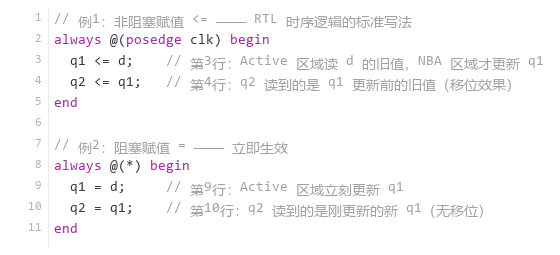

两种写法，看似只差一个符号，调度行为却完全不同：

**<=****（非阻塞）**：第 3 行q1 <= d的执行分两步——先在**Active****区域**读d的旧值，然后这个“更新 q1”的动作被挂到**NBA****区域**，等 Active 里所有事件都跑完才真正更新q1。所以第 4 行q2 <= q1在 Active 区域读到的q1，还是**更新前的旧值**。这正是移位寄存器能“逐拍移位”的根本原因。

**=****（阻塞）**：第 9 行q1 = d在 Active 区域**立刻**把q1更新掉，第 10 行q2 = q1读到的就是**刚更新的新值**，所以没有移位效果。

用波形看更直观：

*图**3**：非阻塞赋值的波形**——Active**读旧值，**NBA**才更新，**q2**落后**q1**一拍*

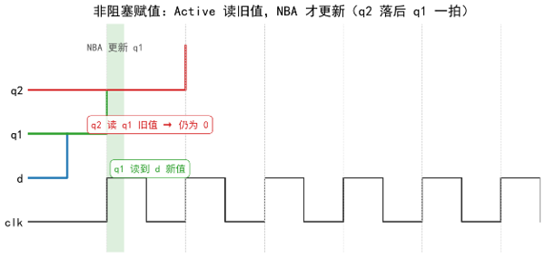

注意图 3 里那个绿色的 NBA 小窗口：q1的更新被推迟到了时钟沿之后的 NBA 区域，而q2在 Active 区域读q1时读到的还是旧值 0，于是q2比q1又晚了一拍。这正是 §4.4.2.4 说的：

*The NBA (nonblocking assignment update) region holds the events to be evaluated after all the Inactive events are processed.*

翻译：NBA 区域里的更新事件，要等 Inactive（乃至更早的 Active）全部处理完才轮到它。

一句话记住：**=****在****Active****立即生效，****<=****在****NBA****才更新**。这个“NBA 才更新”的延迟，是 RTL 时序逻辑正确性的基石，但同时也是下一节“跨域竞争”的伏笔。

## 4.5 核心：UVM的阻塞赋值与RTL的非阻塞赋值到底怎么竞争

## 4.6 先纠正一个隐蔽的认知前提

要理解这个竞争，得先破除一个几乎人人都有、却很少有人点破的误解：**UVM****的组件代码，跑在哪个事件区域？**

很多人以为 UVM 环境跟program块一样跑在 Reactive 区域。其实不是。标准 UVM 环境不推荐、也基本不用program块，uvm\_test\_top是用module包起来的，run\_test()也是从 module 里调的。也就是说，**你的****driver****、****monitor****、****sequence****里的代码，统统跑在****module****的****Active****区域**，和 RTL 的always块是“同一片江湖”。

这个前提一旦明确，竞争的根源就浮出水面了。看这段最常见的代码：

*图**4**：例**2**无**clocking block**时，**driver**阻塞赋值**与**RTL**非阻塞读**的竞争*

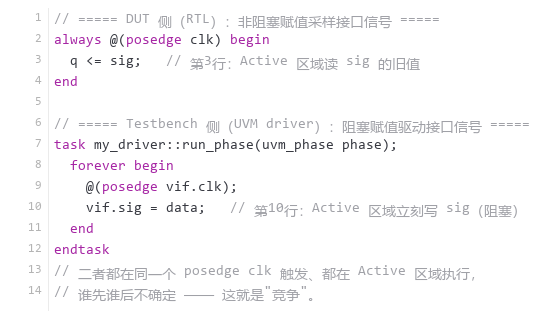

DUT 里的q <= sig在第 3 行**Active****区域**读sig的旧值；driver 里的vif.sig = data在第 10 行**Active****区域**立刻写sig。两者都被同一个posedge clk触发，**都在****Active****区域执行**。

还记得第一节那句“can be processed in any order”吗？现在它咬人了：Active 区域里，driver 的写和 RTL 的读，**谁先执行完全由仿真器说了算**。这就产生了两种截然不同的结果：

若**driver****先执行**：sig先被写成新值，RTL 随后读sig，读到的是**新值**，于是q这一拍就更新成新值；

若**RTL****先执行**：RTL 先读到sig的**旧值**，driver 再写新值，于是q这一拍保持旧值，新值要等下一拍才被采到。

*图**5**：竞争波形**——**同一时钟沿，**q**可能采到旧值也可能采到新值*

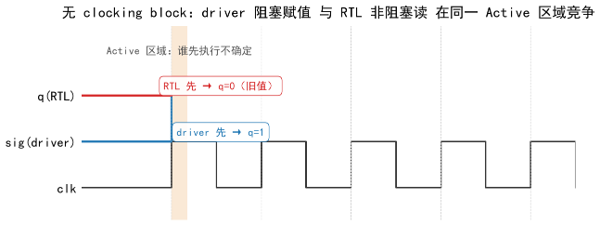

图 5 里那个橙色的 Active 窗口，就是“竞争窗口”：q到底是 0 还是 1，全看 driver 和 RTL 谁先抢到执行权。**同一个测试、同一段代码，换个仿真器版本、换个随机种子，结果可能就不一样。**这就是最典型、也最难查的竞争（race）。

## 4.7 那么问题来了：driver 该用 `=` 还是 `<=`？

有人会说：那我把 driver 里的=换成<=不就行了？换成<=之后，sig的更新被推迟到 NBA 区域，而 RTL 读sig在 Active 区域，于是 RTL 一定读到旧值，竞争似乎消失了。

这个观察**在技术上是成立的**，但它是一条“歪路”，不是正解。原因有三：

1. **语义错位**：testbench 是过程化代码，=的“立即生效”才符合人的直觉；在 driver 里用<=，你自己回头读代码都会怀疑人生。
2. **只解决一个方向**：它侥幸避开了“driver 写 vs RTL 读”这一个竞争点，但 TB 和 RTL 之间还有采样、比对、$display等一堆其他交互点，<=一个都救不了。
3. **脆弱**：它依赖“TB 用<=、RTL 用<=、两者恰好错开区域”这种没人明说、随时可能被打破的约定。

所以结论先放这儿：**直接写=会竞争（上一小节已证明），直接换成<=又是歪路（上面三条理由）。**真正一劳永逸的正解，是把时序约束显式地声明出来——这就是下一节的 clocking block。

## 4.8 正解：用clocking block的skew消除竞争

## 4.9 clocking block 是什么

clocking block 是 SystemVerilog 专为 testbench 设计的“时钟时序声明”。它用一句话，把“相对某个时钟沿，输入什么时候采样、输出什么时候驱动”这件事写死在接口上，让 TB 和 DUT 之间不再靠“谁先抢到执行权”这种运气。看这段接口定义：

*图**6**：例**3 clocking block**接口**+ driver**的驱动方式*

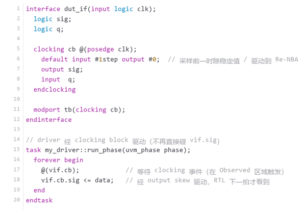

第 6 行的default input #1step output #0是整段代码的灵魂，它声明了两件事：

1. **input #1step**：采样发生在“上一个时间步的末尾”，等价于 Preponed 区域——**采到的一定是时钟沿到来前的稳定旧值**。
2. **output #0**：驱动发生在 clocking 事件同一时刻的**Re-NBA****区域**——**比****RTL****的****Active****读和****NBA****更新都要晚**。

这两条 skew 的含义，IEEE 1800-2017 §14.4 说得非常直白，我原文摘录加翻译：

*An input skew of 1step indicates that the signal is to be sampled at the end of the previous time step. In other words, the value sampled is always the signal's last value immediately before the corresponding clock edge.*

翻译：#1step输入 skew 意味着信号在**上一个时间步的末尾**被采样，换句话说，采到的一定是**紧挨着该时钟沿之前的最后一个值**。

*Inputs with explicit #0 skew shall be sampled at the same time as their corresponding clocking event, but to avoid races, they are sampled in the Observed region. Likewise, clocking block outputs with no skew (or explicit #0 skew) shall be driven at the same time as their specified clocking event, in the Re-NBA region.*

翻译：显式#0的输入在 clocking 事件同一时刻采样，但为避免竞争，它在**Observed**区域采样；同理，无 skew（或#0）的 clocking block 输出在**Re-NBA**区域驱动。

还有一句特别容易被误读，一定要记牢：

*Skews are declarative constructs; thus, they are semantically very different from the syntactically similar procedural delay statement. In particular, an explicit #0 skew does not suspend any process, nor does it execute or sample values in the Inactive region.*

翻译：skew 是**声明性**的，跟语法相似的#0过程延迟完全是两码事。显式#0 skew 不会挂起任何进程，也不会跑到 Inactive 区域去。

再补一个默认值的小知识点：§14.4 规定，**如果你不显式写****skew****，默认****input skew****是****1step****、****output skew****是****0**。不过工程上强烈建议显式写出来，免得后人读接口还要翻标准。

## 4.10 加了 clocking block 之后，时序长这样

现在 driver 不再直接碰 vif.sig，而是写 vif.cb.sig <= data（第 18 行）。注意这个 <= 不是普通的非阻塞赋值，而是标准专门给 clocking block 定义的同步驱动（synchronous drive）语法——IEEE 1800-2017 §14.16 的语法（Syntax 14-5）规定其形式就是 clockvar <= expression，写 clocking block 输出用的就是它。这个驱动会被 output skew 接管，最终在 Re-NBA 区域才真正驱动到 sig 线上。看波形：

*图**7**：加**clocking block**后**——sig**在**Re-NBA**才驱动，**q**下一拍才变*

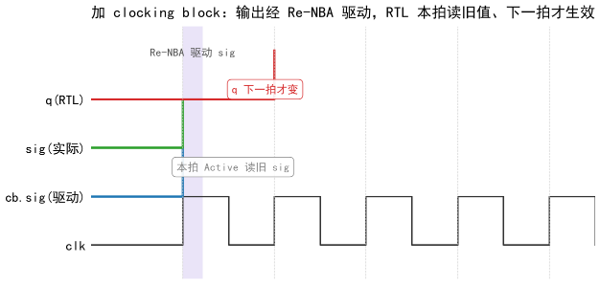

图 7 里那个紫色的 Re-NBA 窗口是关键：sig的实际驱动被推迟到了 RTL 的 Active 读和 NBA 更新**之后**。于是：

当前拍（t=1 沿）：RTL 在 Active 读到的还是sig的旧值，q更新为旧值；sig的新值在 Re-NBA 才上到线上；下一拍（t=2 沿）：RTL 才读到sig的新值，q才更新为新值。

竞争彻底消失，行为变得**确定且可预期**：**driver****这一拍打的，****DUT****永远采不到；它会在下一拍生效。**这就是 clocking block 把“运气”变成“契约”的威力。

## 4.11 回到开头的四个问题，逐一作答

现在把开头那四个问题逐个收口。每一个答案都能在前文找到出处。

## 4.12 问题1：driver 在时钟沿用阻塞赋值驱动，DUT 能不能当前拍采到？

**取决于有没有****clocking block****。**没有 clocking block 时，driver 的=和 RTL 的<=读都在 Active 区域，谁先谁后不确定——**可能采到，也可能采不到**（图5）。加了 clocking block（output #0 → Re-NBA）后，驱动发生在 RTL 采样之后，**这一拍一定采不到，下一拍才生效**（图7）。

## 4.13 问题2：UVM 的阻塞赋值和 RTL 的非阻塞赋值之间有没有竞争？

**有，而且这是最典型的一类竞争。**根源是两者都在 Active 区域、且 Active 区域 “can be processed in any order”。它不是“会不会有”的问题，而是“只要不隔离就一定会有”的问题。隔离手段就是 clocking block 的 skew。

## 4.14 问题3：写 driver 该用 `=` 还是 `<=`？

分两层说。 没有 clocking block 时：直接 vif.sig = data 会跟 RTL 竞争（图5），换成直接 vif.sig <= data 又是歪路（前面三条理由）。加了 clocking block 之后：驱动语法被固定成 <=，也就是 vif.cb.sig <= data。但一定分清——这里的 <= 是 §14.16 的同步驱动（synchronous drive），跟 RTL 里那个非阻塞赋值 <= 是两码事，真正的时序完全由 output skew 决定。记住一句话：别裸碰 vif.sig；经 clocking block 用同步驱动 <=，时序交给 skew。

## 4.15 问题4：采样 DUT 输出，采到的是前一拍的值还是最新变化的值？

**没有****clocking block****直接****@(posedge clk)****采样，是竞争，两个都可能；用****clocking block****的****input****#1step****采样，采到的是****“****前一拍的稳定值****”****。**这个下一节展开讲。

## 4.16 采样 DUT 输出：input #1step 采的是“前一拍的稳定值”

采样输出是验证里最频繁的动作，也是最容易“采到毛刺/采错拍”的地方。看这段对比：

*图**8**：例**4 monitor**的正确采样**vs**反例*

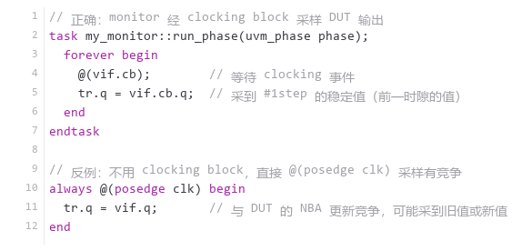

第 10 行的反例里，always @(posedge clk)之后直接读vif.q，会跟 RTL 里q的 NBA 更新**竞争**——你读到的可能是更新前的旧值，也可能是更新后的新值，取决于 Active/NBA 的相对顺序。这不稳定，scoreboard 会莫名其妙地时对时错。

正确的做法是第 5 行：用 clocking block 的@(vif.cb)采样vif.cb.q。因为 input skew 是#1step，采样发生在 Preponed 区域，等价于“上一个时间片的 Postponed”，所以**采到的一定是时钟沿到来前已经稳定下来的旧值**。波形上看得最清楚：

*图**9**：**input #1step**采样**——monitor**采到的是前一拍的稳定值*

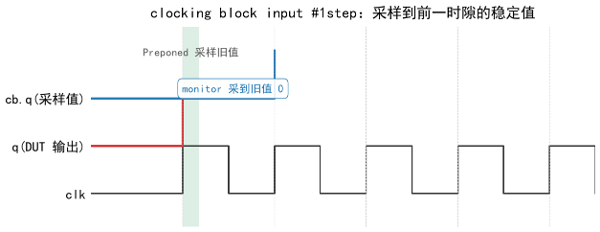

图 9 里q在 NBA 区域（时钟沿之后）才更新，而cb.q在 Preponed 区域（时钟沿之前）就采好了，所以 monitor 拿到的cb.q永远是“上一个周期稳定下来的值”，不存在竞争。

这里还有个特别隐蔽的坑，IEEE 1800-2017 §14.4 的 NOTE 专门警告过：

*A clocking block does not eliminate potential races when an event control outside a program block is sensitive to the same clock as the clocking block and a statement after the event control attempts to read a member of the clocking block. The race is between reading the old sampled value and the new sampled value.*

翻译：如果**在****clocking block****之外**（比如普通always/initial里）用@(posedge clk)这种和 clocking 块同频的事件控制，然后又去读 clocking block 的成员，那么竞争依然存在——你读到的到底是“旧的采样值”还是“新的采样值”，不确定。

换句话说，**光有****clocking block****还不够，你还得****“****从****clocking block****内部****”****去采样它**——用@(vif.cb)触发的vif.cb.q，而不是在普通@(posedge clk)里读vif.cb.q。这也顺带解释了一个经典问题：为什么标准写法是always @(vif.cb)，而不是always @(posedge clk) $display(vif.cb.q)——前者确定采到更新后的采样值，后者是竞争。

## 4.17 一个完整的教科书式最小例子

把前面所有要点串起来，给一个可以直接抄进项目的完整最小例子：

*图**10**：例**5**完整示例**——interface + clocking block + driver + monitor*

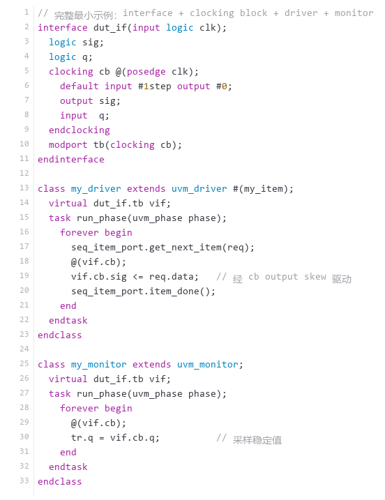

这个例子里有四个“教科书式”的细节，值得一条条对照：

**driver****用****=****经****vif.cb.sig****驱动**（第 19 行）：语义自然，且被 output skew 接管，DUT 下一拍才看到；

**monitor****用****@(vif.cb)****采样**（第 29 行）：采到前一拍的稳定值，无竞争；

**interface****里显式写****default input #1step output #0**（第 6 行）：把采样/驱动时序声明在接口上，一劳永逸；

**driver/monitor****都用****modport tb****的****virtual interface**（第 13、25 行）：从源头上保证 TB 只能通过 clocking block 访问信号，想“裸碰” vif.sig都碰不到。

## 4.18 总结

这一篇把 SystemVerilog 调度机制的骨架、以及它跟验证最相关的那部分讲完了。核心结论就这几条：

1. 仿真时间被切成一个个 time slot，每个 slot 内部是 17 个区域的有序队列，自上而下处理。
2. =在 Active 立即生效，<=在 NBA 才更新——这是 RTL 时序正确性的基石。
3. Active 区域 “can be processed in any order”，是所有 TB/RTL 竞争的根源。
4. UVM 组件跑在 module 的 Active 区域（不是 program），所以 driver 的=和 RTL 的<=读会在同一区域竞争——**DUT****这一拍能否采到****driver****的值，不确定。**
5. clocking block 的 input #1step（Preponed 采样）和 output #0（Re-NBA 驱动）把时序“锁死”：driver 这一拍打的，DUT 下一拍才采到；monitor 采到的，是前一拍的稳定值。
6. 写 driver 别裸碰 vif.sig；正确姿势是经 clocking block 用同步驱动 <=（vif.cb.sig <= data）——这个 <= 是 clocking\_drive 语法而非普通非阻塞赋值，时序交给 skew。
7. 采样输出要用@(vif.cb) + input #1step，而不是裸@(posedge clk)。

下一篇，咱们顺着调度器这条线再往里走一层，聊聊program块到底把“竞争”隔离到了什么程度、以及为什么现代 UVM 反而不怎么用program了——这背后又是另一个被误解多年的点，敬请期待。

## 4.19 参考文献

IEEE Std 1800-2017, IEEE Standard for SystemVerilog—Unified Hardware Design, Specification, and Verification Language. §4.4 Scheduling semantics；§14 Clocking blocks（含 §14.16 Synchronous drives）.

---

# 5. [SystemVerilog标准分析] 聊聊SystemVerilog中的浮点数

> 来源：https://mp.weixin.qq.com/s/7hm4dLJaelmRSP-SXux67w
> 作者：款款就是飞哥
> update 2026/09/27 18 : 44

【SystemVerilog标准分析】· 基于 IEEE 1800-2017 标准

**引言**

在「SystemVerilog标准分析」这个专题下，我们之前聊过进程调度、聊过线网驱动强度，都是围绕SystemVerilog 语言标准里那些“平时用得着、但底层语义容易被忽略”的细节展开。今天我们把目光转向另一个同样容易让人“一知半解”的数据类型——浮点数。

很多工程师对浮点数的印象停留在“real 是双精度、shortreal 是单精度”这种结论层面，但真要问一句：一个 1.5，在 shortreal 里存成什么、在 real 里又存成什么？为什么 0.1 存进去再打印出来会有误差，而 0.5 和 0.25 就没有？负数跟正数在 bit 层面到底差在哪？——能答得清楚的人就不多了。

这篇文章，我们就从 SystemVerilog 标准出发，把浮点类型的定义、分类，以及“正数、负数、小数在单/双精度浮点里究竟表示成多少”这件事，掰开揉碎讲清楚。

**一、****SystemVerilog****浮点类型的定义与分类**

SystemVerilog 标准（IEEE 1800-2017）在 §6.12 专门定义了三个浮点相关的数据类型：real、shortreal和realtime。标准原文的大意如下：

*The real data type is the same as a C double. The shortreal data type is the same as a C float. The realtime declarations shall be treated synonymously with real declarations and can be used interchangeably.*

翻译过来就是：real 等价于 C 语言的 double（双精度浮点），shortreal 等价于 C 语言的 float（单精度浮点），而 realtime 与 real 完全同义、可以互换使用（realtime 只是给“时间/延时计算”这种场景一个语义更明确的名字）。补充一点历史背景：real和realtime 在Verilog 时代就已经存在，shortreal则是SystemVerilog 新引入的类型。三者汇总如下：

|  |  |  |  |  |
| --- | --- | --- | --- | --- |
| **类型** | **等价****C****类型** | **位宽** | **精度** | **说明** |
| real | double | 64 bit | 双精度 | 通用浮点类型 |
| shortreal | float | 32 bit | 单精度 | 省空间、仿真更快 |
| realtime | double | 64 bit | 双精度 | 与 real 完全同义 |

这里要特别强调一点：这三个浮点类型只能作为变量（variable）声明，不能作为线网（net/wire）的数据类型，绝大多数综合工具也不支持浮点综合。它们和integer 这类整型是两套完全独立的体系，不要混淆。

**二、****IEEE 754****浮点的内部表示**

real 和shortreal 内部都遵循IEEE 754 浮点标准。标准§6.12 的脚注12 明确写道：

*The real and shortreal types are represented as described by IEEE Std 754.*

（译：real 与 shortreal 类型按 IEEE Std 754 描述的方式表示。）一个浮点数由三部分组成：

- 符号位S（Sign）：1 bit，0 表示正、1 表示负；
- 指数E（Exponent）：单精度 8 bit、双精度 11 bit，存储时加了偏移量（bias）；
- 尾数M（Fraction/Mantissa）：单精度 23 bit、双精度 52 bit，隐含了整数部分的 1。

位宽分配如下：

|  |  |  |  |  |  |
| --- | --- | --- | --- | --- | --- |
| **类型** | **符号位** | **指数位** | **尾数位** | **总位宽** | **偏置****bias** |
| shortreal（单精度） | 1 | 8 | 23 | 32 | 127 |
| real（双精度） | 1 | 11 | 52 | 64 | 1023 |

对于规格化数（normalized），其真实值由下面的公式给出：

*value = (-1)^S × 1.M × 2^(E - bias)*

其中 1.M 表示“整数 1 后面接小数点再接尾数 M”。也就是说，整数位隐含为 1、只有小数部分真正存下来。这个“隐含的 1”是关键所在：它让同样的位数凭空多出了一位有效精度。

**三、正数、负数、小数具体怎么表示**

理解了上面的三段式，我们就可以手工算出任意一个具体数值的bit 表示了。SystemVerilog还贴心地提供了四个系统函数，让我们能在仿真里直接把浮点数的 bit 掏出来看：

*$realtobits(r) / $bitstoreal(b) —— real**（**64**位）与**64**位向量的互转* *$shortrealtobits(s) / $bitstoshortreal(b) —— shortreal**（**32**位）与**32**位向量的互转*

这四个函数在 IEEE 1800-2017 的转换函数章节（§20.5）中定义。下面这段代码，打印出几个典型数值在real 和shortreal 下的bit 表示：

module tb;
  initial begin
    real      r;
    shortreal s;
    r = 1.5;   s = 1.5;
   $display("real      1.5 = %h", $realtobits(r));
   $display("shortreal 1.5 = %h", $shortrealtobits(s));
   $display("real      0.1 = %h", $realtobits(0.1));
   $display("shortreal 0.1 = %h", $shortrealtobits(0.1));
  end
endmodule

我们以 1.5 为例手工拆解一遍（先看单精度 shortreal）。1.5 的二进制是 1.1b（即 1 + 0.5），写成“1.M × 2^E”的形式就是 1.1b × 2^0，于是：

· 符号位S = 0（正数）；

· 实际指数为0，存储时加偏置127，E = 127 = 0111\_1111b；

· 尾数M = 0.1b，也就是最高位bit22 为1、其余全0。

拼起来就是0\_01111111\_10000000000000000000000 = 0x3FC00000，与仿真打印结果一致。

再看几个典型值，正数、负数、小数的 32 位与 64 位表示汇总如下：

|  |  |  |
| --- | --- | --- |
| **数值** | **shortreal****（****32****位）** | **real****（****64****位）** |
| 0.0 | 0x00000000 | 0x0000000000000000 |
| -0.0 | 0x80000000 | 0x8000000000000000 |
| 1.0 | 0x3F800000 | 0x3FF0000000000000 |
| -1.0 | 0xBF800000 | 0xBFF0000000000000 |
| 0.5 | 0x3F000000 | 0x3FE0000000000000 |
| 1.5 | 0x3FC00000 | 0x3FF8000000000000 |
| 0.25 | 0x3E800000 | 0x3FD0000000000000 |
| 100.0 | 0x42C80000 | 0x4059000000000000 |
| 0.1 | 0x3DCCCCCD | 0x3FB999999999999A |

从这张表可以直观看出几个规律：

1. 正负数只在符号位不同。1.0是0x3F800000，-1.0是0xBF800000，差别仅仅是最高位符号位从0 变1，其余完全一样。这是浮点表示最“优雅”的地方——取反在 bit 层面就是翻转最高位。

2. 0.5、0.25这类“2的负整数次幂”存得干干净净。0.5 = 2^-1、0.25 = 2^-2，尾数全是 0，只靠指数位（单精度分别是126、125）就精确表示。

3. 1.5、100.0这类“尾数非 0”的数，需要同时动用指数位和尾数位。以 100.0 为例：100 = 1.5625 × 2^6，所以尾数存 0.5625、实际指数 6（单精度存 6+127=133）。

**四、为什么****0.1****存不精确**

表格里最“刺眼”的，是 0.1 那一行：0.1 在 shortreal 里存成 0x3DCCCCCD，在 real 里存成0x3FB999999999999A，尾巴上拖着长长一串不整齐的数字。

根本原因是：0.1 在二进制里是一个无限循环小数。十进制 0.1 转二进制是 0.0001100110011...（“1100”无限循环）。而 IEEE 754 的尾数位数是有限的（单精度 23 位、双精度52 位），装不下无限位，只能截断后舍入。于是：

· shortreal 里存的 0.1，实际值是0.100000001490116119384765625（比 0.1 大一点）；

· real 里存的0.1，实际值是0.1000000000000000055511151231257827（比 0.1 大一点点）。

这就是为什么我们用 $display 打印 0.1 时，单精度下会看到 0.100000001 这种“尾巴”，而 0.5、0.25 却永远精确——因为后者是2 的负整数次幂，二进制下是有限小数。

这个特性直接引出一条工程上的重要结论：浮点数不要用== 做相等比较。两个看起来“相等”的浮点数，在 bit 层面可能相差一个 ulp（unit in the last place，最末位）。正确做法是判断两者差的绝对值是否小于某个阈值epsilon。

**五、特殊值与边界**

除了上面这些“普通数”，IEEE 754 还定义了几类特殊值：正负零、正负无穷、NaN、非规格化数。这里要特别交代一句：IEEE 1800-2017 标准对 real/shortreal 的内部表示只做了两处承诺——§6.12 脚注12 说“real与shortreal 按IEEE Std 754 描述的方式表示”，§20.5 注 1 说这些转换函数“应遵循 IEEE 754 单精度与双精度浮点表示”。标准本身并没有逐个列出 NaN、无穷这些特殊值，下面这些 bit 模式与性质都来自 IEEE 754 的定义；只是因为 real/shortreal 承诺遵循 IEEE 754，它们在 SystemVerilog 里同样成立：

1. ±0.0：符号位可以不同。+0.0是0x00000000、-0.0是0x80000000（单精度）。二者数值相等，但bit 不同，这就是浮点特有的“正零/负零”现象。

2. 无穷大±Infinity：指数位全1、尾数位全0。单精度正无穷是0x7F800000、负无穷是0xFF800000；双精度正无穷是0x7FF0000000000000。浮点除法除以0 就会得到无穷。

3. NaN（Not a Number）：指数位全1、尾数位非0（如单精度0x7FC00000）。0.0/0.0这类未定义运算会得到NaN。NaN有个“脾气”：它跟任何数（包括它自己）都不相等——这是 IEEE 754 的规定，所以判断一个数是不是 NaN 时不能简单地用 ==（因为 NaN == NaN 恒为 false）。工程上常用的做法是利用“x != x”这一 IEEE 754 特性来判定，或者用 $realtobits 把 bit 取出来与 0x7FC00000 这类模式比对。这里要特别提醒：IEEE 1800-2017 标准并没有提供 $isnan()、$isinf() 这类内建函数——§20.8 的数学函数只有$ln、$log10、$exp、$sqrt、$pow、$floor、$ceil、$sin、$cos、$tan、$asin、$acos、$atan、$atan2、$hypot、$sinh、$cosh、$tanh、$asinh、$acosh、$atanh 这 20 个常规函数，不含任何专门判断NaN/无穷的函数。

4. 非规格化数（Denormal/Subnormal）：指数位全 0、尾数位非 0。它是为了表示比“最小规格化数”更接近 0 的那段极小数而存在的（此时不再隐含整数 1，而是 0.M）。比如单精度下 1e-38 已经落进非规格化区间（0x006CE3EE）。

最后给一下各自的范围，做到心里有数：

|  |  |  |  |
| --- | --- | --- | --- |
| **类型** | **最小值（规格化）** | **最大值** | **有效十进制位数** |
| shortreal（单精度） | 约 ±1.175494e-38 | 约 ±3.402823e38 | 约 7 位 |
| real（双精度） | 约 ±2.225074e-308 | 约 ±1.797693e308 | 约 15~16 位 |

**六、总结**

把今天的要点串一下：

1. SystemVerilog 的浮点类型就三个：real（64位双精度，等价C double）、shortreal（32 位单精度，等价 C float）、realtime（与 real 完全同义）。三者都遵循 IEEE 754，都只能作变量、不可综合。

2. 一个浮点数= 符号位+ 指数位（加偏置）+尾数位（隐含整数1），规格化数的真值是(-1)^S × 1.M × 2^(E-bias)。单精度偏置 127、双精度偏置1023。

3. 正负数在bit 层面只差一个符号位；0.5、0.25 这类 2 的负整数次幂能精确表示（尾数全 0），而0.1 因二进制无限循环只能截断近似——这是浮点误差的根源。

4. 想亲眼看到浮点的bit 表示，用$realtobits / $shortrealtobits（反向是 $bitstoreal / $bitstoshortreal）。

5. 工程上要记住三条：浮点比较用误差阈值而不是 ==；判断NaN 没有现成的$isnan() 可用（IEEE 1800-2017 未提供），可利用“x != x”或比对$realtobits 的bit 模式；对精度要求高就选real 而非shortreal。

浮点这个话题在 SystemVerilog 里其实还有“舍入模式（rounding）”、“$cast 截断与四舍五入的区别”等衍生问题，后续有机会我们再专门展开，敬请期待。
