<!-- toc-start -->

# 目录

[1. 芯片上电之后发生了什么？一文读懂 Boot Simulation](#1-芯片上电之后发生了什么一文读懂-boot-simulation)  
　　[1.1 Boot Simulation 到底是什么](#11-boot-simulation-到底是什么)  
　　　　[1.1.1 真实固件](#111-真实固件)  
　　　　[1.1.2 真实 RTL](#112-真实-rtl)  
　　　　[1.1.3 从真实 Reset Vector 开始](#113-从真实-reset-vector-开始)  
　　　　[1.1.4 固件驱动，testbench 观测](#114-固件驱动testbench-观测)  
　　[1.2 Boot Simulation 填补了哪一块验证空白](#12-boot-simulation-填补了哪一块验证空白)  
　　[1.3 为什么模块都通过，芯片仍可能启动失败](#13-为什么模块都通过芯片仍可能启动失败)  
　　　　[1.3.1 第一层：验证启动正确性](#131-第一层验证启动正确性)  
　　　　[1.3.2 第二层：验证系统集成正确性](#132-第二层验证系统集成正确性)  
　　　　[1.3.3 第三层：风险前移与签核](#133-第三层风险前移与签核)  
　　[1.4 一套 Boot Simulation 怎么跑起来](#14-一套-boot-simulation-怎么跑起来)  
　　　　[1.4.1 第一步：构建可信输入](#141-第一步构建可信输入)  
　　　　[1.4.2 第二步：建立真实启动环境](#142-第二步建立真实启动环境)  
　　　　[1.4.3 第三步：让启动链路真实执行](#143-第三步让启动链路真实执行)  
　　　　[1.4.4 第四步：形成证据链](#144-第四步形成证据链)  
　　[1.5 怎么判断 Boot Simulation 真的通过了](#15-怎么判断-boot-simulation-真的通过了)  
　　　　[1.5.1 核心启动证据矩阵](#151-核心启动证据矩阵)  
　　　　[1.5.2 扩展检查清单](#152-扩展检查清单)  
　　[1.6 结语](#16-结语)  
[2. 基于 ICG + 三级同步电路的无毛刺时钟切换方案](#2-基于-icg-三级同步电路的无毛刺时钟切换方案)  
　　[2.1 电路结构](#21-电路结构)  
　　[2.2 标准三段式切换操作流程](#22-标准三段式切换操作流程)  
　　[2.3 对应 WaveDrom 时序波形](#23-对应-wavedrom-时序波形)  
[3. 后向寄存器切片（backword register slice）](#3-后向寄存器切片backword-register-slice)  
[4. 什么是寄存器？为什么芯片里到处都是寄存器？](#4-什么是寄存器为什么芯片里到处都是寄存器)  
　　[4.1 芯片为什么需要“记住”东西](#41-芯片为什么需要记住东西)  
　　[4.2 寄存器到底是什么](#42-寄存器到底是什么)  
　　[4.3 为什么芯片里到处都是寄存器](#43-为什么芯片里到处都是寄存器)  
　　[4.4 不只是存数据，也在控制系统](#44-不只是存数据也在控制系统)  
　　[4.5 寄存器出错，系统可能怎么表现](#45-寄存器出错系统可能怎么表现)  
　　[4.6 验证，不能只看能不能读写](#46-验证不能只看能不能读写)  
[5. CDC是什么？为什么跨时钟数据容易出错？](#5-cdc是什么为什么跨时钟数据容易出错)  
　　[5.1 CDC到底是什么](#51-cdc到底是什么)  
　　[5.2 为什么跨时钟数据容易出错](#52-为什么跨时钟数据容易出错)  
　　[5.3 单bit信号通常需要同步](#53-单bit信号通常需要同步)  
　　[5.4 多bit数据为什么更危险](#54-多bit数据为什么更危险)  
　　[5.5 CDC不只是两级同步器](#55-cdc不只是两级同步器)  
　　[5.6 为什么仿真不一定能发现CDC问题](#56-为什么仿真不一定能发现cdc问题)  
　　[5.7 CDC验证到底要看什么](#57-cdc验证到底要看什么)  
　　[5.8 CDC问题为什么硅后很难调](#58-cdc问题为什么硅后很难调)  
　　[5.9 总结](#59-总结)  
[6. AXI 为什么要支持 Burst？连续传输如何提升总线访问效率](#6-axi-为什么要支持-burst连续传输如何提升总线访问效率)  
　　[6.1 单次访问的事务开销](#61-单次访问的事务开销)  
　　[6.2 Burst 的事务结构](#62-burst-的事务结构)  
　　[6.3 地址组织与边界](#63-地址组织与边界)  
　　[6.4 Burst 与互连开销](#64-burst-与互连开销)  
　　[6.5 多 Master 下的 Burst](#65-多-master-下的-burst)  
　　[6.6 AXI Burst 与 DDR](#66-axi-burst-与-ddr)  
　　[6.7 Burst 长度与并发访问](#67-burst-长度与并发访问)  
　　[6.8 工程设计与性能分析](#68-工程设计与性能分析)  
　　[6.9 参考资料](#69-参考资料)  
　　　　[6.9.1 引用链接](#691-引用链接)  
[7. 【芯片设计】梳理一下带宽计算公式和影响因素](#7-芯片设计梳理一下带宽计算公式和影响因素)  
[8. 时序例外：false_path / multicycle_path / max_delay](#8-时序例外false_path-multicycle_path-max_delay)  
　　[8.1 从一个问题开始](#81-从一个问题开始)  
　　[8.2 时序例外的全景](#82-时序例外的全景)  
　　[8.3 false\_path：不存在的路径](#83-false_path不存在的路径)  
　　　　[8.3.1 什么时候用](#831-什么时候用)  
　　　　[8.3.2 异步时钟域的 false\_path 写法](#832-异步时钟域的-false_path-写法)  
　　　　[8.3.3 常见错误](#833-常见错误)  
　　[8.4 multicycle\_path：多周期路径](#84-multicycle_path多周期路径)  
　　　　[8.4.1 核心概念](#841-核心概念)  
　　　　[8.4.2 基础语法](#842-基础语法)  
　　　　[8.4.3 hold 的"减一"规则](#843-hold-的减一规则)  
　　　　[8.4.4 典型应用场景](#844-典型应用场景)  
　　[8.5 set\_max\_delay / set\_min\_delay：自定义延迟约束](#85-set_max_delay-set_min_delay自定义延迟约束)  
　　　　[8.5.1 什么时候用](#851-什么时候用)  
　　　　[8.5.2 典型场景](#852-典型场景)  
　　　　[8.5.3 优先级规则](#853-优先级规则)  
　　[8.6 虚拟项目实战：充电管理芯片的 SDC 例外](#86-虚拟项目实战充电管理芯片的-sdc-例外)  
　　　　[8.6.1 项目背景](#861-项目背景)  
　　　　[8.6.2 需要处理的例外](#862-需要处理的例外)  
　　　　[8.6.3 完整 SDC 片段](#863-完整-sdc-片段)  
　　　　[8.6.4 验证方法](#864-验证方法)  
　　[8.7 记忆曲线回访](#87-记忆曲线回访)  
　　　　[8.7.1 回访 SDC 时钟约束第一课（2026-05-20）](#871-回访-sdc-时钟约束第一课2026-05-20)  
　　　　[8.7.2 与 OCV / POCV 的关系](#872-与-ocv-pocv-的关系)  
　　[8.8 总结](#88-总结)  

<!-- toc-end -->

---

# 1. 芯片上电之后发生了什么？一文读懂 Boot Simulation

> 来源：https://mp.weixin.qq.com/s/aBrgD1Q6nQDnIgz41jZ5WA
> 作者：SJ66
> update 2026/08/17 23 : 17

技术博客


如果 BootROM、Clock、Reset、NoC 和存储控制器分别都通过了自己的模块级验证，是否就能证明整颗芯片一定可以启动？

答案是否定的。

一颗芯片从上电到真正“活起来”，需要走过一条很长的启动链路：

1. Power / Clock

   电源与参考时钟稳定

2. Reset Release

   复位按顺序释放

3. Strap / Fuse Latch

   启动配置锁存

4. CPU Reset Vector

   CPU 从固定地址取指

5. BootROM Execute

   BootROM 开始执行

6. Boot Media Init

   初始化启动介质

7. Image Read

   读取下一阶段镜像

8. Authentication

   镜像认证与完整性检查

9. Load to Memory

   镜像加载到目标内存

10. Jump to Next Stage

    控制权交给下一阶段软件

    这条链路中，任何一个环节出现问题，都可能导致芯片无法启动。

    CPU 可能根本取不到第一条指令，也可能停在 BootROM 的某个轮询循环中，还可能在访问启动介质、认证镜像或跳转到下一阶段软件时突然卡死。

    更棘手的是，BootROM 属于芯片最早执行的软件之一。一旦相关逻辑在流片后固化，修改代价通常非常高。

    于是，一个关键问题摆在验证团队面前：

> 在芯片还没有流片之前，如何证明真实启动固件能够在真实的 SoC 硬件路径上，把芯片从复位状态带到下一阶段软件？

这正是 Boot Simulation 要回答的问题。

## 1.1 Boot Simulation 到底是什么

严格来说，Boot Simulation 是指：

> 让一份真实或具有代表性的候选启动固件，从芯片真实的复位入口开始，在 SoC RTL 上由 CPU 完成真实的取指、译码和执行，驱动相关硬件完成从复位到约定启动终点的完整过程。

这个定义中有四个关键词。

### 1.1.1 真实固件

Boot Simulation 使用的应尽量是发布候选版本或具有代表性的启动固件，而不是专门为了让仿真快速通过而大幅简化的替代代码。

如果固件为了仿真而绕过了某些硬件初始化、缩短了关键等待流程，甚至由 testbench 直接代替它配置寄存器，那么最终“跑通”的链路就不再等同于真实启动链路。

### 1.1.2 真实 RTL

固件不是运行在抽象的软件平台模型上，而是在当前版本的 SoC RTL 上运行。

CPU 的取指、NoC 事务、寄存器访问、存储控制器响应和安全模块行为，都来自实际的 RTL 实现。

### 1.1.3 从真实 Reset Vector 开始

CPU 应当从架构规定的 Reset Vector 获取第一条指令，而不是由测试平台直接将 CPU 放到某个已经完成初始化的中间状态。

只有从真实复位入口开始，才能覆盖：

- Clock 和 Reset 的释放顺序
- Strap 和 Fuse 的锁存
- BootROM 地址映射
- CPU 首次取指
- 启动早期的 NoC 和外设访问

### 1.1.4 固件驱动，testbench 观测

Boot Simulation 与许多模块级 UVM 测试最本质的区别，在于激励的主要来源发生了变化。

在模块级验证中，sequence 通常直接配置寄存器、发起总线事务并检查 DUT 响应。

而在 Boot Simulation 中：

- 固件负责配置寄存器
- 固件负责初始化外设
- 固件负责读取启动介质
- 固件负责解析、认证和加载镜像
- 固件负责执行最终跳转

测试平台负责提供时钟、复位、启动介质模型和外围环境，并根据需要注入异常、采集日志、记录波形和判断结果。

可以用一句话概括：

> 在 Boot Simulation 中，固件是主角，测试平台是配角。

## 1.2 Boot Simulation 填补了哪一块验证空白

Boot Simulation 不是唯一的启动验证方法。

UVM 仿真、ISS/QEMU、RTL 仿真、Emulation 和 FPGA 原型验证，都能从不同角度发现问题。

它们之间的主要区别如下。

UVM/IP 仿真

单个模块或子系统 RTL

速度 · 较慢可观测性 · 高

主要回答：模块功能和接口协议是否正确

ISS/QEMU

指令集或平台行为模型

速度 · 快可观测性 · 中

主要回答：软件栈能否在抽象平台上运行

RTL Boot Simulation

SoC RTL 与真实固件

速度 · 慢可观测性 · 高

主要回答：固件能否驱动真实 RTL 完成启动

Emulation

映射到硬件加速平台的设计

速度 · 较快可观测性 · 中

主要回答：更长的启动流程和软件负载能否运行

FPGA Prototype

映射到 FPGA 的设计

速度 · 快可观测性 · 较低

主要回答：系统能否以接近真实速度运行较长软件

Boot Simulation 的独特价值，并不是速度最快，也不是能够运行最长的软件负载，而是同时具备两个特点：

1. 1.

   固件看到的是当前版本的真实 RTL 行为。
2. 2.

   验证工程师仍然能够观察 PC、寄存器、总线事务、状态机和波形。

因此，它特别适合发现由以下因素引起的启动问题：

- 固件假设与 RTL 实现不一致
- 地址映射配置错误
- Clock 与 Reset 顺序错误
- 启动早期 NoC 访问异常
- 外设控制器就绪时序不匹配
- Fuse 或 strap 配置组合错误
- 镜像认证与加载路径异常

但 Boot Simulation 也有明确边界。

它能够证明的是：在当前 RTL、当前固件和给定配置组合下，存在一条具有可验证证据的启动路径。

它不能替代模块级验证去覆盖每一个接口协议细节，不能替代形式化验证穷尽所有状态空间，也不能替代硅后验证发现真实工艺和电气环境中的问题。

## 1.3 为什么模块都通过，芯片仍可能启动失败

Boot Simulation 的价值可以归纳为三个层次。

1. 启动正确性

   芯片是否能够完成基本启动

2. 系统集成正确性

   软硬件与跨模块契约是否成立

3. 风险前移与签核

   在流片前发现问题并形成证据

### 1.3.1 第一层：验证启动正确性

启动是一切后续功能的基础。

Boot Simulation 首先需要证明：

- CPU 能够从正确的 Reset Vector 取指
- BootROM 能够正常执行
- 启动介质能够完成初始化和读取
- 镜像能够被定位、认证和加载
- CPU 能够跳转到下一阶段软件

如果最基础的启动链路不可信，后续所有性能、功耗和系统功能验证都建立在不稳定的基础上。

### 1.3.2 第二层：验证系统集成正确性

模块级验证通过，并不代表系统集成后一定能够正常启动。

因为模块级环境通常独立验证单个模块的功能，而真实 Boot 流程会在特定时序下，把多个模块串成一条因果链：

1. CPU 执行 BootROM

2. BootROM 配置 Clock 和外设

3. CPU 通过 NoC 访问存储控制器

4. 存储控制器访问启动介质

5. 数据经过互连写入目标内存

6. CPU 跳转到加载后的镜像

   这条链路中的问题，往往不属于某一个单独模块，而是来自模块之间的隐含假设。

#### 1.3.2.1 一个典型问题

假设 NoC 和存储控制器分别通过了模块级验证。

在 SoC 集成后，BootROM 检测到存储控制器的初始化完成标志，于是立即发起第一次介质读取。

但此时控制器虽然已经报告“初始化完成”，内部数据通路或介质状态机却尚未真正进入可服务状态。

现象

- CPU 长时间停留在某段轮询代码中
- 启动日志停止在介质初始化之后
- 仿真无法进入镜像加载阶段

根因

BootROM 将“初始化完成标志”理解为“控制器已经可以响应读取”，但 RTL 对该标志的定义可能只是“初始化流程已经退出”。

软件和硬件对同一个状态的理解不一致。

可观察证据

- PC 在一个固定地址区间反复执行
- CPU 已经发出读取请求
- NoC 请求已经到达控制器
- 控制器没有在预期窗口内返回完成响应
- 可见寄存器状态与内部状态机不同步

这个问题可能无法在单独的 NoC 测试或存储控制器测试中暴露，却会在真实固件形成完整访问序列时出现。

### 1.3.3 第三层：风险前移与签核

Boot Simulation 还能将原本可能在硅后 Bring-up 阶段才暴露的问题，提前到流片之前发现。

除了正常启动路径，还应覆盖：

- 镜像认证失败
- 启动介质读取超时
- 非法镜像或镜像损坏
- 异常向量触发
- 恢复模式或下载模式
- Warm Reset 后的状态清理

通过这些场景，可以为 BootROM 固化和流片签核提供可追溯的验证证据。

## 1.4 一套 Boot Simulation 怎么跑起来

一套完整的 Boot Simulation，可以抽象为四个步骤。

1. 构建可信输入

2. 建立真实启动环境

3. 从 Reset Vector 执行

4. 收集并判断启动证据

### 1.4.1 第一步：构建可信输入

仿真结论是否可信，首先取决于输入是否可信。

通常需要准备：

- 当前待验证的 SoC RTL
- 真实或发布候选级 BootROM
- Fuse 和 strap 配置
- 启动介质内容
- 下一阶段启动镜像
- Clock 和 Reset 配置
- 必要的内存与外围设备模型

关键原则是尽量减少仅为仿真而进行的特殊修改。

固件越接近最终发布版本，配置越接近真实芯片场景，仿真结论对流片决策的参考价值就越高。

### 1.4.2 第二步：建立真实启动环境

一个典型的 Boot Simulation 环境可以抽象为：

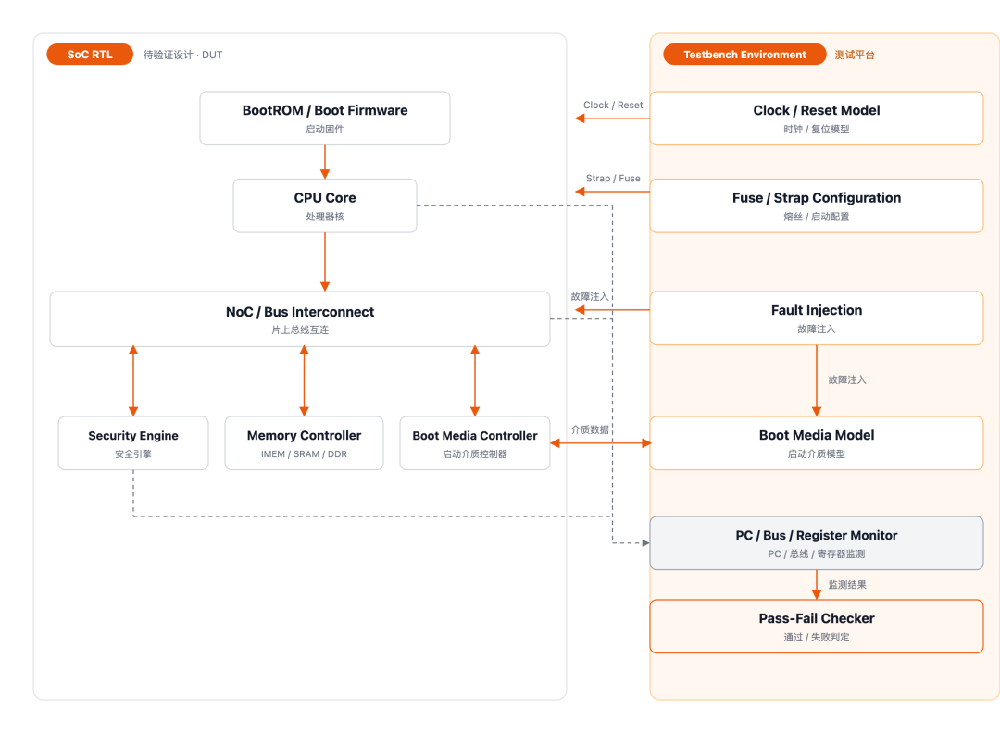

Boot Simulation 环境框图：SoC RTL 内部模块与 Testbench Environment 组件的连接关系

在这个环境中，testbench 可以提供启动介质模型，但介质初始化、读取命令、镜像解析、认证和加载动作，应尽量由固件真实触发。

### 1.4.3 第三步：让启动链路真实执行

仿真启动后，应让 CPU 从真实 Reset Vector 开始执行。

不要由 testbench 直接完成以下动作：

- 跳过 BootROM 初始化
- 直接写入目标寄存器状态
- 直接将镜像放入最终执行地址
- 直接修改 PC 到下一阶段入口
- 绕过真实的认证或加载过程

测试平台可以做的是：

- 提供外部环境
- 设置 Fuse 与 strap
- 模拟启动介质
- 注入认证失败或读取超时
- 采集日志、波形和总线事务
- 根据证据判断测试结果

### 1.4.4 第四步：形成证据链

一个可信的 Boot Simulation 结果，应该能够回答：

- CPU 是否从正确地址取到了第一条指令？
- 固件是否读取到了正确的启动配置？
- NoC 事务是否到达了预期目标？
- 启动介质是否完成了初始化？
- 镜像数据是否被正确读取和写入内存？
- 认证成功和失败路径是否符合预期？
- 最终跳转地址是否正确？
- 跳转后是否取到了下一阶段的第一条指令？

只有这些问题都有明确证据，才能说明启动链路确实完成，而不是仿真仅仅“没有报错”。

## 1.5 怎么判断 Boot Simulation 真的通过了

Boot Simulation 最容易出现的误区，是把“仿真跑完”当成“验证通过”。

事实上，以下现象都不能单独构成充分的通过条件：

- 仿真器没有报 fatal
- CPU 仍然在执行指令
- 日志中出现了某个成功字符串
- 波形运行到了预定时间
- testbench 没有触发 timeout

真正有说服力的通过标准，是关键启动节点都有可追溯、可复现的证据。

### 1.5.1 核心启动证据矩阵

Clock / Reset— 时钟不稳定或复位释放顺序错误

通过证据：时钟稳定标志、复位释放时序波形

Strap / Fuse— 启动配置错误，固件进入错误分支

通过证据：锁存后的配置值、固件读取日志

Reset Vector— CPU 从错误地址取指，或无法取得有效指令

通过证据：首次 PC 轨迹、首次取指总线事务

NoC / Boot Media— 总线访问超时、控制器未就绪、读取内容错误

通过证据：总线事务日志、控制器状态、数据比对

Secure Boot— 合法镜像被拒绝，或非法镜像被接受

通过证据：认证结果、校验日志、失败后的安全状态

Image Load / Jump— 镜像不完整或跳转地址错误

通过证据：内存数据比对、跳转 PC、下一阶段首次取指

### 1.5.2 扩展检查清单

根据具体 SoC 的启动方案，还可以继续检查：

- BootROM 地址映射与内容完整性
- GPT、镜像头或其他标准格式解析
- 多种启动介质选择
- 启动介质读取超时
- 异常向量处理
- 恢复模式或下载模式
- Watchdog 触发
- Warm Reset
- 复位前后的状态清理
- 多组 Fuse 与 strap 配置组合

并不是每一颗 SoC 都需要覆盖完全相同的对象。

真正重要的是，每个测试场景都应该明确三个问题：

1

要验证什么？

Verification Objective

2

可能怎样失败？

Failure Mode

3

什么证据证明正确？

Observable Evidence

这三个问题共同构成 Boot Simulation 的最小验证闭环。

## 1.6 结语

Boot Simulation 验证的，不只是某一段 BootROM 代码是否能够执行。

它验证的是从复位释放到控制权交接之间，启动固件与 SoC RTL 的完整契约是否成立：

- CPU 是否从正确入口开始执行
- Clock、Reset 和配置是否符合固件假设
- NoC、存储控制器与启动介质是否能够协同工作
- 镜像是否被正确读取、认证和加载
- 正常与异常路径是否进入预期状态
- 控制权是否被正确交给下一阶段软件

因此，真正可信的启动签核标准，不应只是：

> 仿真跑完了，并且没有报错。

而应该是：

> 从 Reset Vector 到下一阶段镜像的每一个关键节点，都留下了可复现、可追溯并能够支撑判断的工程证据。

---

# 2. 基于 ICG + 三级同步电路的无毛刺时钟切换方案

> 来源：https://mp.weixin.qq.com/s/yf0upSm3MbGr066ABVf75w
> 作者：IC小鸽
> update 2026/08/22 11 : 34

## 2.1 电路结构

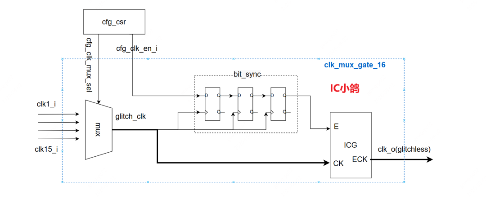

模块clk\_mux\_gate\_16由16 选 1 组合 MUX、三级同步寄存器 bit\_sync、ICG 集成时钟门组成，由 CSR 寄存器下发两路控制信号：时钟选择cfg\_clk\_mux\_sel、全局时钟使能cfg\_clk\_en\_i。

1. 组合 MUX：负责切换多路输入时钟，但选择信号异步变化会在输出glitch\_clk产生毛刺，不可直接输出；
2. bit\_sync 三级同步链：以glitch\_clk为采样时钟，同步异步使能信号，消除亚稳态，将使能跳变约束在时钟上升沿；
3. ICG 时钟门：内部锁存结构仅在时钟低电平阶段响应使能变化，从硬件根源杜绝开关时钟产生毛刺，最终输出纯净clk\_o。

## 2.2 标准三段式切换操作流程

为隔绝 MUX 切换毛刺，软件严格依照下述顺序配置寄存器：

1. 步骤 1：拉低cfg\_clk\_en\_i，关断输出时钟 配置 CSR 将时钟使能置 0，经过三级同步后 ICG 使能变为低电平，ICG 截断时钟通路，clk\_o恒定为低电平，后端电路无时钟输入，进入安全状态。
2. 步骤 2：改写cfg\_clk\_mux\_sel，切换时钟源 在时钟输出关闭状态下修改多路选择值，MUX 切换时钟源时产生的毛刺被闭锁的 ICG 完全隔离，不会传递到模块输出端口。
3. 步骤 3：拉高cfg\_clk\_en\_i，释放稳定时钟 等待 MUX 输出时钟波形恢复规整、同步链路状态刷新完成后，拉高时钟使能。同步后的使能只会在时钟上升沿翻转，此时 ICG 内部锁存处于锁定状态；待时钟电平拉低后，ICG 才放行时钟，输出无毛刺的目标时钟波形。

## 2.3 对应 WaveDrom 时序波形

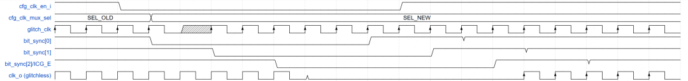

第一步：cfg\_clk\_en\_i配置成0，使能逐级同步拉低，输出时钟clk\_o 关闭；

第二步：配置cfg\_clk\_mux\_sel，修改多路选择，glitch\_clk出现毛刺，输出clk\_o 依旧保持低电平；

第三步：cfg\_clk\_en\_i配置成1，使能逐级同步拉高，ICG模块在时钟低电平窗口平稳输出全新时钟，全程无毛刺脉冲

---

# 3. 后向寄存器切片（backword register slice）

> 来源：https://mp.weixin.qq.com/s/9pkKgKvuGcqBscO4ZTVgPA
> 作者：Timingwalker666
> update 2026/08/22 11 : 35

后向寄存器切片（backword register slice）用来隔离下游发往上游的ready信号。

由于上游（source）看到的反压信号rdy\_src比原始信号rdy\_dst慢了一拍，就会产生一个场景：

- rdy\_src = 1，而rdy\_dst = 0。

  如果此时上游刚好有数据要传输（vld\_src=1），则register slice需要具备吸收这一个数据的能力，这个数据由register slice内部深度为1的buffer暂存。

其余情况下，前向路径（vld\_src/data\_src）都是从上游直通到下游，buffer被跳过，因此这个电路也被称为skip buffer。

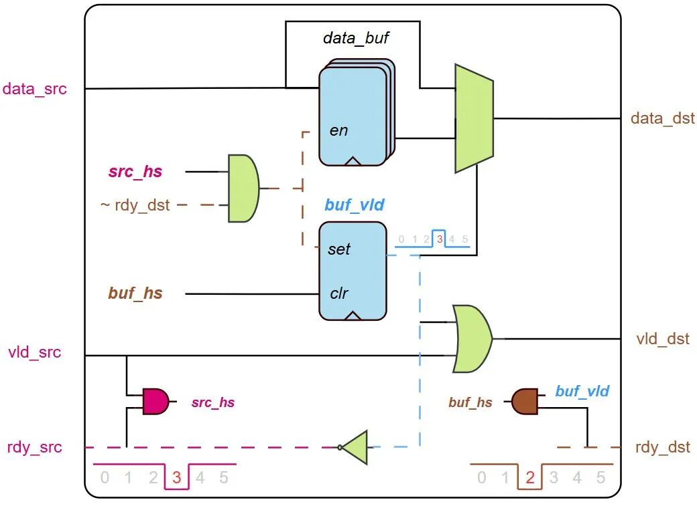

---

**1. data\_buf**

上游数据被存入buffer的条件为：

- 上游正在发送数据：vld\_src & rdy\_src

  同时：
- 下游不具备接收能力，即反压：~rdy\_dst

```
if ( src_hs & ~rdy_dst)
    data_buf <= data_src;
```

**2. buf\_vld**

需要有一个信号指示buffer中是否有数据，显然，data\_src被存入data\_buf的同时，就应该将buf\_vld置1：

```
if ( src_hs & ~rdy_dst)
    buf_vld <= '1;
```

在不满足上述条件的情况下，下游取走buffer数据就将标志位清零：

```
else if ( buf_hs )
    buf_vld <= '0;
```

---

**前向路径**

当register slice中的buffer有数据时，上游送往下游的vld\_dst/data\_dst应该来自buffer，否则直接使用上游信号。

指示buffer是否有数据的信号为buf\_vld，因此：

```
assign data_dst = buf_vld ? data_buf : data_src;
assign vld_dst  = buf_vld ? buf_vld  : vld_src;
```

vld\_dst也可以写成：

```
assign vld_dst = vld_src | buf_vld;
```

即：上游有数据或者buffer有数据都可以通知下游来取。

---

**3. rdy\_src**

这个电路的主要目的就是打断反向的ready信号，因此rdy\_src不能直接来自rdy\_dst。

而是需要看buffer的状态：

- buf\_vld = 0 ： buffer空了。上游可以发送数据，数据或者从旁路路径直接被取走（rdy\_dst=1时），或者被暂存入buffer（rdy\_dst=0时）。
- buf\_vld = 1：buffer缓存了上游发送的前一个数据，等它被取走后才能发送新数据，所以需要反压上游。

因此，rdy\_src就是buf\_vld的取反：

```
assign rdy_src = ~buf_vld;
```

---

**前向、后向寄存器切片对比：**

它们内部的存储单元是相同的，都包含了：

- 一组用于存储data的buffer寄存器。
- 一个用于指示buffer是否有值的寄存器。

  但是起到的作用并不一样。

前向寄存器切片要打断上游发往下游的valid路径，因此所有数据都是要先经过buffer，再送往下游。

后向寄存器切片要打断的是下游返回上游的ready路径，只有在下游不具备接收能力时buffer才暂存数据，其余情况下数据都是直通的。

最终达到的效果：

- valid的时序路径在前向切片被打断，而ready增加一级门电路延时。
- ready的时序路径在后向切片被打断，而valid增加一级门电路延时。

---

# 4. 什么是寄存器？为什么芯片里到处都是寄存器？

> 来源：https://mp.weixin.qq.com/s/7bgTBQ_BP6xtZOZ2DtXfrA
> 作者：芯片验证
> update 2026/08/29 13 : 00

芯片不是一团一直变化的组合逻辑。它需要记住当前状态，等待下一个时钟周期，响应软件配置，保存中间结果，也需要把复杂操作拆成一步一步可以控制的过程。能“记住”这些信息的地方，很多就是寄存器。一个状态机当前走到哪一步，一个模块是否busy，一个DMA要从哪里搬数据、搬多长，一个中断是否已经发生，很多时候都和寄存器有关。

## 4.1 芯片为什么需要“记住”东西

如果一个电路只有组合逻辑，它的输出只取决于当前输入。输入一变，输出也跟着变。这样的电路可以做加法、比较、选择，但它很难表达“上一步发生了什么”“当前处于哪个阶段”“这个操作是否已经完成”。

真实芯片需要状态。比如一个控制器要记住自己正在idle、busy还是done；一个计数器要记住已经数到多少；一个接口要记住上一拍valid是否已经被接收；一个处理器要保存当前指令执行到哪里。没有这些状态，芯片就很难把复杂任务拆成多个cycle完成。

寄存器的作用，就是在时钟边沿把某些信息保存下来，让电路在下一个时钟周期继续基于这些信息工作。DMXAI芯片验证

## 4.2 寄存器到底是什么

从电路角度看，寄存器可以理解为数字电路中在时钟边沿保存一小段信息的基本结构。它通常由触发器组成，可以保存1bit，也可以由多个bit组成一个多bit寄存器。

触发器，也就是Flip-Flop，是更底层的1bit存储单元；硬件寄存器通常由多个触发器组成，用来保存状态或控制信息；软件可访问寄存器，也就是Memory-Mapped Register，则是软件通过地址访问的一组控制和状态字段。

软件可访问寄存器背后可能连接触发器、状态逻辑或硬件控制逻辑，而不一定只是一个简单的触发器数组。

一个寄存器保存的内容，可能是一段数据，也可能是一个状态、一个控制位、一个计数值，或者一个软件可读写的配置项。它的关键不在于“存了多少”，而在于它把芯片行为和时钟节奏绑定起来。

同一个时钟域里，寄存器在一个时钟边沿采样输入，在下一个时钟周期把保存下来的值提供给后级逻辑。数字芯片之所以可以按节奏运行，很大程度上就是靠寄存器把连续的逻辑变化切成一个个确定的时钟周期。

## 4.3 为什么芯片里到处都是寄存器

寄存器首先用来保存状态。状态机状态、计数器、flag、valid、busy、done，都是芯片内部常见的状态信息。它们让硬件知道自己现在处于什么阶段，下一步应该做什么。

寄存器也用来切分时序。复杂组合逻辑如果全部塞在一个cycle里，延迟可能太长，频率跑不上去。工程上常常会用流水线寄存器把一段长逻辑拆成几段，让每一段在一个时钟周期内完成。这样做会增加latency，但有机会提升频率和吞吐。

在模块之间，由寄存器或存储单元构成的buffer、FIFO，也能起到缓冲作用，避免上游和下游必须在同一个时刻完成所有动作。接口里的valid、ready、data、last等信号背后，往往都有寄存器参与状态保存和节奏控制。这里也要注意边界：FIFO不一定完全由寄存器实现，较大的FIFO也可能使用SRAM等存储结构。

到了SoC层面，寄存器还承担软件和硬件之间的连接。软件写一个enable bit，硬件开始工作；读一个status bit，软件知道模块是否完成；写地址和长度寄存器，DMA开始搬数据；清一个中断状态位，系统继续处理后面的事件。

这也是为什么一颗芯片里会有大量寄存器。它们不是重复堆出来的“小存储”，而是在保存状态、组织时序、缓冲模块、支撑软件控制。

DMXAI芯片验证在SoC里，软件看到的很多“寄存器”通常是Memory-Mapped Register。软件像访问内存一样读写这些地址，但背后连接的是硬件控制逻辑、状态逻辑和中断逻辑。

## 4.4 不只是存数据，也在控制系统

很多人刚接触寄存器时，会把它理解成“存一个数”。这个理解没有错，但不够完整。芯片里的很多寄存器并不是为了保存普通数据，而是为了控制系统行为。

比如控制寄存器里的enable bit，可能决定一个模块是否启动；mode字段可能决定模块工作在普通模式、测试模式还是低功耗模式；status寄存器里的busy、done、error，可能决定软件下一步是等待、继续还是进入异常处理。

还有一些寄存器带有side effect。软件写入某个bit，不只是改变寄存器值，还可能触发硬件动作；软件读取某个地址，可能会清除一个状态；写1清除的W1C位，则要求软件写1表示清除，写0保持不变。这些行为如果定义不清或实现不对，很容易造成软硬件协同问题。

所以寄存器不是静态表格里的地址和字段。它是软件和硬件之间的一组约定：软件写什么，硬件应该怎么响应；硬件发生什么，软件应该从哪里看到。

## 4.5 寄存器出错，系统可能怎么表现

寄存器问题有时很小，但表现出来可能很大。如果reset默认值错了，芯片上电后可能进入错误模式；如果enable寄存器写入后没有真正生效，软件会以为硬件已经启动，但模块其实没有动；如果busy或done状态更新不对，软件可能一直等待，或者过早认为任务完成。

中断相关寄存器也很容易出问题。中断状态位如果清除逻辑不对，系统可能反复进入中断；如果状态位过早清掉，软件可能漏掉事件；如果mask、pending、clear之间关系定义不清，驱动调试会变得很困难。

寄存器还可能牵涉CDC问题。软件可见寄存器通常在总线时钟域，但真实硬件模块可能运行在另一个时钟域。配置值怎么跨域生效，状态位怎么返回总线域，中断信号怎么同步，如果没有处理好，就可能出现偶发错误。

这些问题在仿真里可能只是一个case失败；到了Bring-up阶段，可能表现为启动卡住、驱动超时、模块偶发不响应、状态读数不一致。表面看像软件问题，根因却可能是寄存器行为没有按spec实现。

## 4.6 验证，不能只看能不能读写

寄存器验证不是简单地写进去一个值，再读出来一样就结束了。对一个真实的SoC来说，寄存器验证至少要看几个层面。

首先是reset值是否符合spec。芯片刚上电或模块复位后，关键寄存器必须进入预期状态。很多启动问题，最早就出在默认配置不对。

其次是访问属性是否正确。RW、RO、WO、W1C、reserved bit、只读状态位、写保护字段，不同类型寄存器的行为不同。软件能不能写，写了是否生效，读出来是否符合定义，都要验证。

第三是side effect是否正确。写一个start bit是否真正触发硬件动作，清中断是否只清目标事件，读状态是否会影响后续行为，这些都不能只靠普通读写测试覆盖。

第四是寄存器和真实硬件状态是否一致。status寄存器显示done，硬件是否真的完成；error bit拉起时，是否有对应错误条件；配置寄存器更新后，数据路径是否真的按新配置运行。寄存器如果和硬件内部状态脱节，软件看到的信息就不可信。

在验证环境里，寄存器模型、寄存器文档和RTL实现之间也要保持一致，否则测试本身可能基于错误假设。寄存器表看起来像文档，实际却是软件、验证和硬件共同依赖的接口契约。

对验证团队来说，寄存器是很基础的验证对象，但基础不代表简单。它连接了spec、RTL、总线协议、软件驱动、CDC、reset和Bring-up，是很多系统问题的入口。

交流微信，请备注单位和职务


---

# 5. CDC是什么？为什么跨时钟数据容易出错？

> 来源：https://mp.weixin.qq.com/s/GvSkKJUyvxtF7uaZHqG6AA
> 作者：芯片验证
> update 2026/08/29 13 : 05

芯片里有些bug，并不是逻辑功能本身写错，而是信号从一个时钟域进入另一个时钟域时，没有被正确接收。在一个简单数字电路里，所有寄存器都跟着同一个时钟工作，数据在固定的时钟边沿被采样，时序分析也有明确的参考关系。

真实SoC很少只有一个时钟。CPU、DDR控制器、PCIe、NoC、外设、AI加速器、低功耗管理模块，可能运行在不同频率、不同相位、不同开关策略的时钟下。DMXAI芯片验证

CDC不是少数特殊设计才会遇到的问题。只要不同时钟域之间存在信号交互，跨时钟数据传递就需要被认真处理。

## 5.1 CDC到底是什么

CDC是Clock Domain Crossing，指信号从一个时钟域传到另一个时钟域的过程。所谓时钟域，可以简单理解为一组由同一个clock控制的寄存器和逻辑。在同一个时钟域内，发送端和接收端共享明确的时钟关系，STA可以基于这个关系检查setup和hold是否满足。

一旦信号跨到另一个异步时钟域，情况就变了。发送端什么时候改变，接收端什么时候采样，两者之间没有固定相位关系。接收端可能刚好在信号变化附近采样，也可能在一个很不稳定的时间点采到这个信号。所以CDC的本质不是“把一根线从A模块连到B模块”，而是让一个时钟域产生的信息，被另一个时钟域以可控、可解释的方式接收。

## 5.2 为什么跨时钟数据容易出错

同一时钟域内，数据从一个寄存器传到另一个寄存器，中间组合逻辑的延迟可以通过STA检查。只要setup和hold满足，接收端就应该能在时钟边沿采到稳定数据。跨异步时钟域时，这个前提不再成立。两个clock之间没有固定相位关系，接收端采样边沿可能落在发送端信号变化的附近。如果信号变化撞上接收触发器的setup或hold窗口，触发器就可能进入亚稳态。

亚稳态并不是简单的“采到0”或“采到1”。它表示触发器输出在一小段时间内无法快速稳定到确定电平。如果这个不稳定状态继续传播到后级逻辑，就可能引发错误判断、状态机跳错、数据丢失，甚至系统死锁。这也是CDC问题麻烦的地方：它不一定每次都发生，也不一定能稳定复现。某个跨时钟路径在仿真里看起来正常，不代表它在真实硅片的所有电压、温度、频率和负载条件下都安全。

## 5.3 单bit信号通常需要同步

最常见的CDC处理，是给单bit控制信号加同步器。比如一个慢变化的enable、status或flag信号，从源时钟域进入目标时钟域时，通常会在目标时钟域用两级或多级寄存器重新采样。两级同步器的作用，不是把亚稳态“消灭”，而是给第一级触发器的亚稳态更多时间恢复，降低不稳定状态继续传到后级逻辑的概率。在工程上，它把风险降低到一个可以接受的范围。

但这个方法有明确边界。同步器降低的是亚稳态继续传播的概率，并不自动保证跨域信号的功能语义正确。即使用同步器，源端信号也需要保持足够长的时间，确保目标时钟域有机会采到。两级同步器主要适用于单bit电平信号或慢变化状态信号，并不能保证短pulse一定被捕获，也不能直接解决多bit数据一致性问题。

DMXAI芯片验证同步器不是把异步信号变成“绝对安全”，而是在目标时钟域内重新采样，并降低亚稳态继续传播的概率。CDC设计关注的是风险降低和结构正确，而不是数学意义上的零风险。

## 5.4 多bit数据为什么更危险

多bit数据跨时钟域，比单bit控制信号更容易出问题。如果一个多bit总线的每一位都各自通过同步器进入目标时钟域，接收端看到的各个位，可能来自不同时间点。结果就是，目标时钟域可能采到一个发送端从未真正产生过的组合值。

比如一个4bit计数器从`0111`跳到`1000`，理论上这是一次正常变化。但如果跨时钟采样时各bit到达目标域的时间不一致，接收端可能看到`0100`、`1101`或其他中间状态。这些值在源时钟域里可能从未真实存在过，但目标逻辑却会把它当成有效数据。所以多bit数据不能简单按bit各自同步。常见做法包括异步FIFO、握手协议，或者在协议明确保证数据稳定窗口的前提下采样；在特定场景中，也可以使用Gray Code减少多bit同时变化。Gray Code常用于异步FIFO指针等场景，因为相邻编码通常只变化1bit，但仍需要配合正确的同步结构和时序约束，并不是所有多bit跨域都适用。

## 5.5 CDC不只是两级同步器

很多人一提CDC，就想到两级同步器。但真实芯片里的CDC远不止这一种结构。

单bit电平信号可以用同步器处理；短pulse跨时钟时，可能需要pulse stretching、toggle同步或握手机制，否则目标时钟域可能根本采不到这个pulse。多bit配置寄存器跨域，通常需要保证数据稳定，并用握手信号确认接收时机。数据流跨域时，异步FIFO往往是更合适的结构。

Reset跨域通常作为RDC问题单独讨论。它和CDC类似，也需要关注异步assert、同步deassert以及不同复位域之间的交互。clock gating、低功耗域切换、配置更新、状态机跨域交互，也都可能带来CDC相关问题。

所以CDC不是一个“加两个寄存器”的局部技巧，而是一套围绕跨时钟信息传递建立起来的设计和验证方法。

## 5.6 为什么仿真不一定能发现CDC问题

普通RTL仿真通常不会真实建模触发器亚稳态。仿真里信号是0、1、X或Z，但真实触发器在setup/hold窗口被撞上时，可能经历一个模拟电路层面的不稳定过程。这意味着，testcase跑过、波形看起来正常，并不代表CDC结构就是安全的。仿真能覆盖某些功能场景，但它很难穷尽异步时钟之间所有可能的相位关系。

CDC bug经常表现为偶发问题。它可能和异步相位、频率、电压、温度、工艺和负载条件相关；更麻烦的是，加入log、改变软件节奏或插入调试逻辑后，现象还可能变化。这就是为什么CDC不能只靠普通功能仿真兜底。

## 5.7 CDC验证到底要看什么

CDC验证首先要确认芯片里有哪些clock domain，以及这些时钟之间是什么关系。同步时钟、异步时钟、派生时钟、可关断时钟，如果定义不清，后面的检查就很难可信。

接下来要识别所有跨时钟路径，并判断每条路径是否有合理的CDC结构。单bit控制信号有没有同步器，多bit数据有没有握手或FIFO，pulse会不会丢失，reset释放是否安全，组合逻辑是否可能产生glitch，这些都需要被检查。

还要特别注意reconvergence风险。多个相关信号如果分别同步到目标时钟域，再在目标域重新汇合，可能因为同步延迟不同而造成不一致判断。这类问题表面上看每条路径都有同步结构，但系统语义仍然可能出错。

CDC工具可以帮助团队发现可疑路径和结构问题，但工具结果不是最终答案。真正的CDC Signoff，还要结合设计意图、协议约束、CDC waiver和验证证据来判断。

没有问题的路径，要说清楚为什么安全；被waive的路径，要说清楚为什么可以接受。CDC waiver不是忽略问题，而是在明确设计意图、影响范围和剩余风险后，做出的工程判断。复杂跨域协议，则要能解释发送端、接收端和中间控制信号之间的时序关系。

## 5.8 CDC问题为什么硅后很难调

CDC问题如果漏到硅后，通常不会表现得很友好。它可能表现为偶发死锁、偶发丢包、状态机跑飞、启动卡住、配置偶尔不生效，或者某个高负载场景下系统突然停住。问题表面可能在软件、驱动、总线、外设或内存系统里，真正根因却可能是一个很小的跨时钟控制信号没有处理好。

Bring-up阶段如果遇到这类问题，团队往往需要在有限可观测性下反复缩小范围。它不是不能定位，但成本通常很高。所以CDC检查要尽量前移到Pre-Silicon阶段。越早把跨时钟路径识别清楚，把结构问题、协议问题和waiver风险讲清楚，硅后调试时的不确定性就越少。

## 5.9 总结

CDC是芯片中信号跨越不同时钟域时必须面对的设计和验证问题。它的风险不只是数据传不过去，而是接收端可能在不确定的时刻采样，带来亚稳态、数据不一致、pulse丢失、reset释放异常和偶发系统错误。好的CDC设计不是简单加两个寄存器，而是根据单bit控制、多bit数据、pulse、握手、FIFO、reset等不同场景选择合适的跨域结构。对验证团队来说，CDC检查也不是普通仿真能完全覆盖的内容，而是Tapeout前必须单独识别、分类、检查和解释的Signoff工作。

交流微信，请备注单位和职务


---

# 6. AXI 为什么要支持 Burst？连续传输如何提升总线访问效率

> 来源：https://mp.weixin.qq.com/s/RROuuvkPbN6-y-u-ELr6Ow
> 作者：烓围玮未
> update 2026/08/29 13 : 13


在 AXI 里，Burst 是一个很基础的机制。可真到做 DMA、NoC 或内存带宽分析时，问题往往不是 `AxLEN` 怎么编码，而是：

同样搬 256 Byte 数据，为什么通常更希望把它组织成一笔 Burst，而不是很多笔 Single-beat Transaction？

假设 Master 的 Data Bus 是 128 bit，并且每个 Beat 都使用满宽 16 Byte。搬 256 Byte 一共需要 16 个 Data Beat。

如果全部拆成 Single-beat，需要 16 笔独立 Transaction；如果组织成 16-beat Burst，只需要一笔地址事务，后面跟 16 个 Data Beat。

数据量没有变化，变化的是为了搬这些数据，系统需要处理多少次事务级控制信息。

这个差别在 AXI 接口上看起来只是少了几笔地址请求，放到共享互连和内存路径里，固定开销会继续沿着数据路径体现出来。Burst 真正有意思的地方，也正是在这里：一个很小的协议机制，最后会影响 NoC Packet、Multi-Master 调度、Memory Controller 和 DDR 效率。

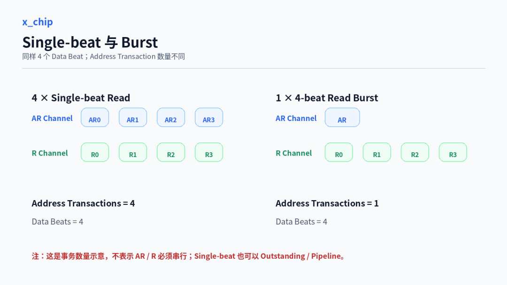

## 6.1 单次访问的事务开销

先看 AXI Read。

一笔 Read Transaction 在 AR Channel 上给出 Address 和 Control，数据通过 R Channel 返回。假设连续读取 16 个 Beat：

```
16 × Single-beat
→ 16 笔 AR Transaction
→ 16 个 R Data Beat

1 × 16-beat Burst
→ 1 笔 AR Transaction
→ 16 个 R Data Beat
```

Burst 并不会让 16 个 Data Beat 变成 1 个 Beat，也不会取消 R Channel 上每个 Beat 的 VALID/READY。真正减少的是 Address Transaction 的数量。

Write 侧也是一样的思路。一笔 Write Burst 包含 AW Address、多个 W Data Beat，以及整笔 Write Transaction 对应的 B Response。如果相同 Payload 被拆成很多 Single-beat Write，就会产生更多独立 AW Transaction 和对应的事务级 Write Response。

但这里不能把 Burst 简化成“少了地址周期，所以 Data Channel 就一定更连续”。

AXI 的几个 Channel 本来就是独立的，而且协议支持 Multiple Outstanding Transaction。只要 Master、Slave 和中间 Fabric 具备足够的并发能力，多笔 Single-beat Transaction 也可以流水起来。一个做得很激进的 Master，完全可能在前面几笔 Read Data 还没回来时继续往 AR Channel 塞新请求。

因此，Burst 并不是用来替代 Outstanding，也不是靠强制“地址拍和数据拍串起来”获得吞吐。

它更直接地解决的是另一件事：同样一段连续 Payload，不要每搬一个 Beat 都重新建立一笔独立的事务级描述。

从 Master 自己的实现看，这会影响 Address Request 的产生频率、Transaction Tracking 数量以及内部 Request Queue 的压力。进入 Fabric 以后，又会继续影响 Packet Header、路由信息和其他固定开销被多少 Payload 分摊。

所以 Burst 的价值可以先收成一句话：

> 用更少的事务级 Address / Control 描述承载连续 Payload，让每 Byte 数据分摊的固定控制开销更低。

## 6.2 Burst 的事务结构

AXI 是 Burst-based Protocol，一笔 Burst 由首地址、Burst Control 和多个 Data Transfer 共同描述。

常用的三个字段分别回答三个问题：

```
AxLEN
→ 一笔 Burst 有多少个 Transfer

AxSIZE
→ 每个 Transfer 有多少 Byte

AxBURST
→ 后续 Transfer 的地址怎么变化
```

AXI4 中：

```
Burst_Length = AxLEN + 1
```

所以 `AxLEN=15` 表示这笔 Transaction 包含 16 个 Transfer。

INCR Burst 最长可以达到 256 个 Transfer；FIXED 和 WRAP 最长为 16 个，其中 WRAP 只允许 2、4、8 或 16 个 Transfer。[1]

`AxSIZE` 定义的是每个 Transfer 的大小，而不是简单等于 Data Bus Width。

比如一条 128-bit AXI Data Bus：

```
Data Bus Width = 16 Byte
```

Master 完全可以发一个 4 Byte 的 Narrow Transfer。对于 Write，真正哪些 Byte Lane 有效还要结合 `WSTRB` 看。

所以性能分析里直接用：

```
Burst Length × Data Bus Width
```

计算所有 Transaction 的真实有效 Payload，并不总是成立。如果系统里存在 Narrow Transfer、非对齐访问或者大量 Partial Write，真正值得统计的是有效 Byte，而不是总线理论宽度。

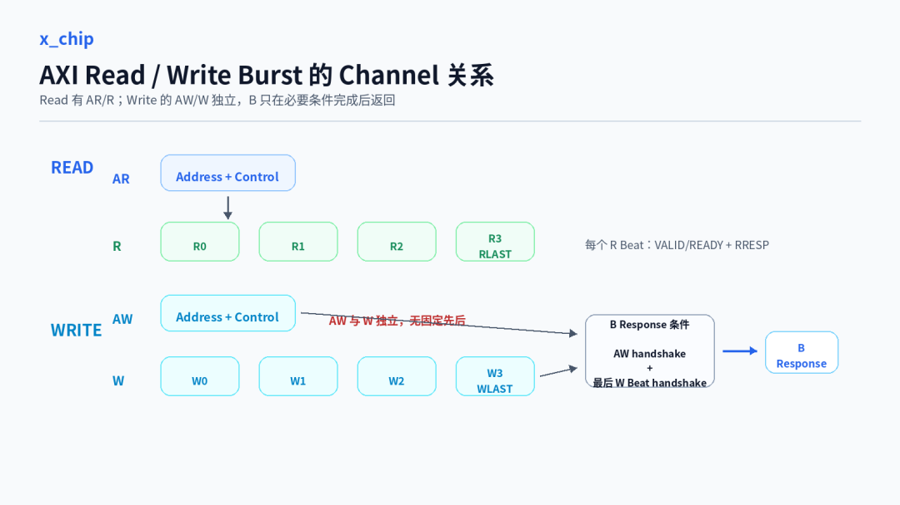

Read 和 Write 的 Channel 关系也值得单独区分。

Read Address 被接受以后，Slave 才能返回对应的 Read Data。

Write 的 AW Channel 和 W Channel 则彼此独立。Master 不应该等 `AWREADY` 以后才决定是否拉高 `WVALID`，W Data 可以早于、晚于或与 AW 同期被接受。B Response 则需要等 Write Address 已经被接受，并且最后一个 W Beat 完成握手后才能返回。[1]

画 AXI Write 流程图时，如果直接画成：

```
AW → W0 → W1 → W2 → B
```

很容易把三个独立 Channel 看成严格串行协议。

工程上更适合把它理解成：

```
AW Channel ─┐
            ├─ 完成必要条件 → B Response
W Channel ──┘
```

这个区别不只是画图习惯。做性能分析时，如果把 AW 和 W 当成必须前后串行，就很容易高估 Address Phase 带来的空拍，也会误判 Register Slice、Buffer 或 Channel Decoupling 的价值。

## 6.3 地址组织与边界

AXI 定义三种 Burst Type：

```
FIXED
INCR
WRAP
```

FIXED 的每个 Transfer 使用相同地址，适合 FIFO 这类重复访问同一地址端口的场景。

INCR 的地址按照 Transfer Size 递增，是 DMA Buffer、Frame Buffer、连续内存块最常见的方式。

假设：

```
Start Address = 0x1000
AxSIZE = 4
```

每个 Transfer 是 16 Byte，那么对齐的 INCR Burst 地址依次是：

```
0x1000
0x1010
0x1020
0x1030
...
```

WRAP 与 INCR 类似，但到达 Wrap Boundary 后会回绕，典型用途是 Cache Line Access。

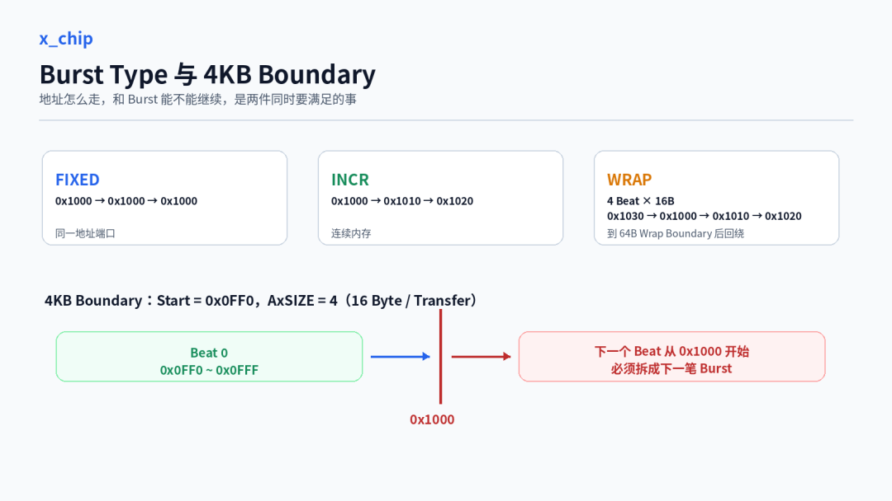

所有 Burst 还必须满足 4KB Boundary 规则。

比如：

```
Start Address = 0x0FF0
AxSIZE = 4
```

第一个 16 Byte Transfer 正好覆盖：

```
0x0FF0 ~ 0x0FFF
```

下一个 INCR Transfer 将从 `0x1000` 开始，因此这两个 Transfer 不能留在同一笔 Burst 中，必须在 4KB Boundary 前拆开。AXI 规范明确要求 Burst 不能跨 4KB Boundary，用来避免一笔 Burst 跨越两个 Slave 的地址区域，同时限制 Slave 需要支持的地址递增范围。[1]

这也是为什么 DMA 里一个“搬 1MB”的任务，到了 AXI 接口上往往会被切成很多笔 Burst。

真正决定下一笔 Burst Length 的通常不是一个 `MAX_BURST_LEN`：

```
Next Burst
=
min(
    Remaining Data,
    Protocol Limit,
    4KB Boundary,
    Descriptor / Line Boundary,
    Local Buffer Capability,
    Downstream Limit
)
```

对图像类 DMA 来说，还会再多一层 Line Length 和 Stride。整帧数据在业务上是一个连续任务，但每一行之间如果存在 Padding 或地址跳变，AXI 看到的就不一定是一条可以无限延长的 INCR Burst。

Burst Generator 做得好不好，很多时候就藏在这些边界里。功能仿真只要数据没搬错，未必能暴露问题；真正跑 Bandwidth 时，平均 Burst Length 被各种边界切得很碎，性能才会明显掉下来。

## 6.4 Burst 与互连开销

从 AXI Master 往下走，一笔 Transaction 通常还要经过 Interconnect 或 NoC。

很多高性能 NoC 并不是直接拿 AXI Channel 在芯片里一路传到底，而是把 AXI Transaction 转换成内部 Packet。Packet 里除了 Payload，还需要 Header、Route、Response Tracking 等信息。

这时候 Burst Length 会直接影响固定开销被多少数据分摊。

AMD Versal NoC 的公开文档给了一个很直观的例子。它的 NoC Data Path 以 16 Byte 为一个 Flit。在 256 Byte Chop Size 下：

```
16 Byte Write
→ 1 Header Flit + 1 Data Flit

256 Byte Write
→ 1 Header Flit + 16 Data Flit
```

前者相当于每 16 Byte Payload 就配一个 Header；后者 256 Byte Payload 只对应一个 Header。文档给出的示例开销分别约为 100% 和 6%。[2]

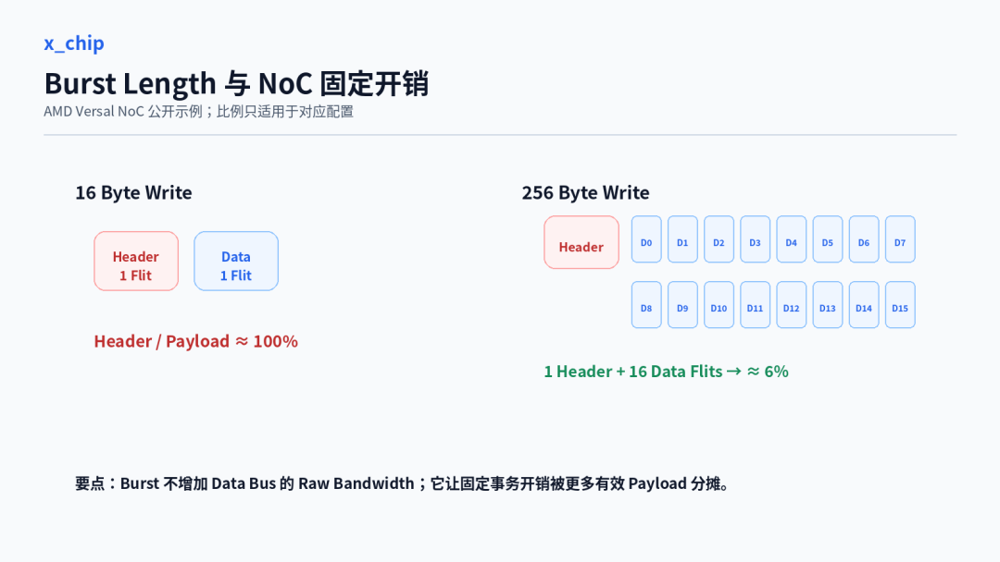

这个数字只能用于 AMD Versal NoC 的对应配置，不能直接套到其他 SoC。

但背后的关系是通用的：

```
固定事务开销
÷
每笔 Transaction 的有效 Payload
```

Payload 太小，Header、Route、Queue Entry、Tracking 等固定成本就会显得很重。

Read 和 Write 还不能完全按同一种方式算。Packetized NoC 里，Read Request、Read Data、Write Request、Write Response 可能走不同方向，Header 和 Response 的占比也不一样。某条物理链路如果同时承载 Read/Write 混合流量，最终瓶颈甚至可能出现在和直觉不同的方向。[2]

这也是为什么高带宽 Master 通常不会只看“AXI Data Bus 有多宽”，还会关心平均每笔 Transaction 到底带了多少有效数据。

一条 256-bit、500 MHz 的 Data Bus，Raw Bandwidth 是：

```
256 / 8 × 500 MHz = 16 GB/s
```

但 16 GB/s 只说明 Data Channel 每个有效周期最多能搬多少数据。

最终能不能接近这个数字，还取决于：

```
Burst Length
Outstanding
Backpressure
Packetization
Arbitration
Buffer
Memory Latency
```

只看位宽和频率，离系统真实带宽还差好几层。

## 6.5 多 Master 下的 Burst

真实 SoC 里，Memory Path 很少只服务一个 Master。

同一个 Interconnect / NoC 后面可能同时挂着：

```
CPU
GPU / NPU
ISP
DMA
Display
Video Codec
```

这些 Master 对总线的需求并不一样。

CPU 的 Memory Traffic 往往更看重 Latency。一次 Cache Miss 如果被堵很久，影响的是当前执行路径。哪怕数据量不大，尾部延迟过高也会直接反映到软件性能上。

ISP、Display、Video Codec 更像持续流量，关注的是一定时间窗口内能不能稳定拿到 Bandwidth。它们未必要求单笔访问延迟最低，但一旦长时间被饿住，FIFO 就可能开始积压甚至溢出。

DMA 做大块 Memory Copy 时，也希望请求足够连续，减少每 Byte 的事务级开销。

GPU / NPU 则经常同时需要较大的有效 Transaction 和较高的并发度，用大量在途请求覆盖 Memory Latency。如果 Burst 不够大，固定开销偏高；如果 Outstanding 不够，Memory Latency 又盖不住。

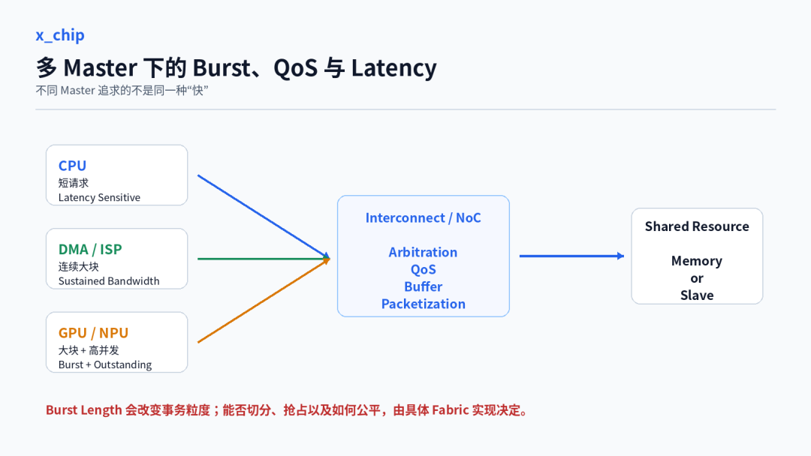

这时候 Burst Length 就不能只从单个 Master 的吞吐看。

假设一个 DMA 正在持续写大块 Buffer，同时 CPU 发来一笔延迟敏感的访问。长 Burst 对 DMA 本身很友好，但如果某一级共享资源只能在较粗的粒度上切换服务对象，CPU 的等待时间就可能被拉长。

这里不能下结论说“一个 Burst 一定霸占总线直到结束”。

AXI 并没有规定整个 SoC 必须以原始 Burst 为最小仲裁单位。Interconnect / NoC 可以有自己的 Packetization、Arbitration 和 QoS 机制。AXI4 甚至允许长度大于 16 的 INCR Transaction 被转换成多个较短 Burst，规范明确提到这样做可能用于降低长 Burst 对 QoS Guarantee 的影响。[1]

所以 Multi-Master 场景真正要看的不是某一个 Master 的 `AxLEN`，而是：

```
Transaction Size
Arbitration Granularity
QoS Policy
Buffer Occupancy
Backpressure
Latency Target
```

这些东西组合起来以后，才决定某个 Burst Length 对整个系统是好还是坏。

## 6.6 AXI Burst 与 DDR

一笔 AXI Burst 从 Master 发出去，并不会原样变成一笔 DRAM Burst。

中间通常还有：

```
AXI Master
   ↓
Interconnect / NoC
   ↓
Bridge / Width Conversion
   ↓
Memory Controller
   ↓
DRAM
```

Fabric 可以拆分、转换或 Packetize Transaction；到了 Memory Controller，还要继续处理 Address Mapping、Queue、Bank/Row 状态、ACT/PRE、READ/WRITE、Refresh 和各种 Timing Constraint。

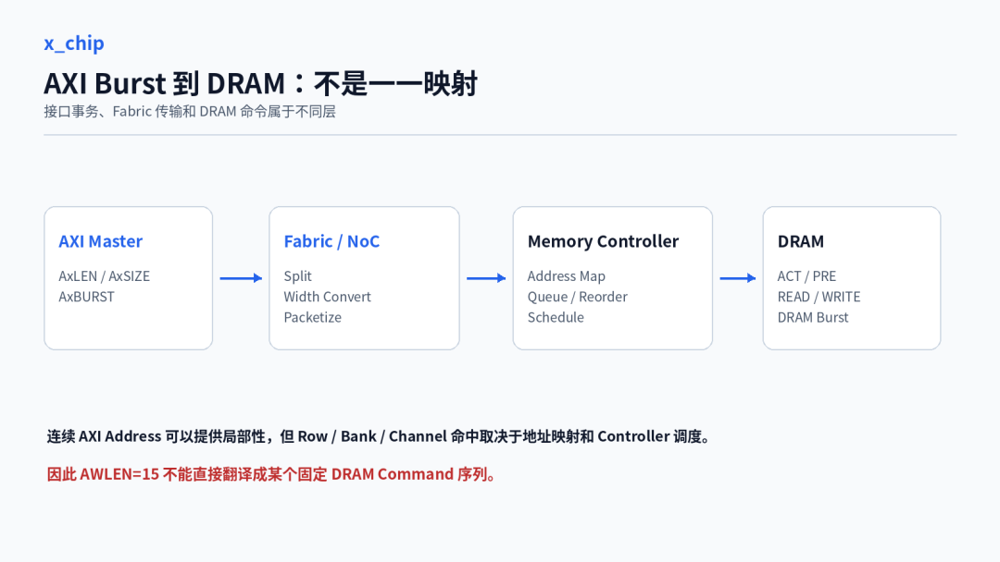

所以：

```
AXI Burst
≠
DRAM Burst
```

也不能从 `AWLEN=15` 直接推导“DRAM 一定连续执行 16 个对应操作”。

连续 AXI Address 仍然很有价值，因为连续、成块的 Memory Traffic 通常能给 Memory Controller 更大的调度空间。但它是否命中同一 Row、是否落在不同 Bank、是否做 Channel Interleave，都取决于具体地址映射和 Controller 策略。

有些系统会有意把连续系统地址交错到多个 Bank 或 Channel，以增加并行度；有些访问模式则可能连续地打在一个已经打开的 Row 上。两种情况都可能高效，但背后的原因完全不同。

所以“DDR 喜欢长 Burst”这种说法如果不加边界，很容易把两层协议混在一起。

更准确的说法是：

> 连续、成块的 Memory Traffic 通常更容易被 Memory Controller 组织成高效率访问，而 AXI Burst 是形成这种 Traffic 的重要手段之一。

Burst Length 也不是越大越好。

AMD 在 Zynq-7000 DDR Controller 的一组公开测试中，4 个 HP/AFI Master 做 Sequential Read/Write 时，AXI Burst Length 为 4、8、16 得到的 DDR Efficiency 都是 87%。文档同时指出，中等长度 Burst 对 Latency-sensitive 环境可能更合适，因为更长 Burst 会增加高优先级 Master 的 Latency。[3]

这组数据没有证明“4 Beat 永远够用”，也没有证明“16 Beat 没意义”。它真正说明的是：AXI Burst Length 与 DDR Efficiency 之间不存在一个脱离系统条件的单调关系。

把 `AxLEN` 拉长，只是改变了 AXI 侧 Transaction 的组织方式。

最终系统是否更快，还要看 Memory Controller 和整个共享数据路径有没有真正从中获益。

## 6.7 Burst 长度与并发访问

Burst Length 解决的是：

```
一笔 Transaction 带多少个 Data Beat
```

Outstanding 解决的是：

```
同时允许多少笔 Transaction 在路上
```

这是两个不同维度。

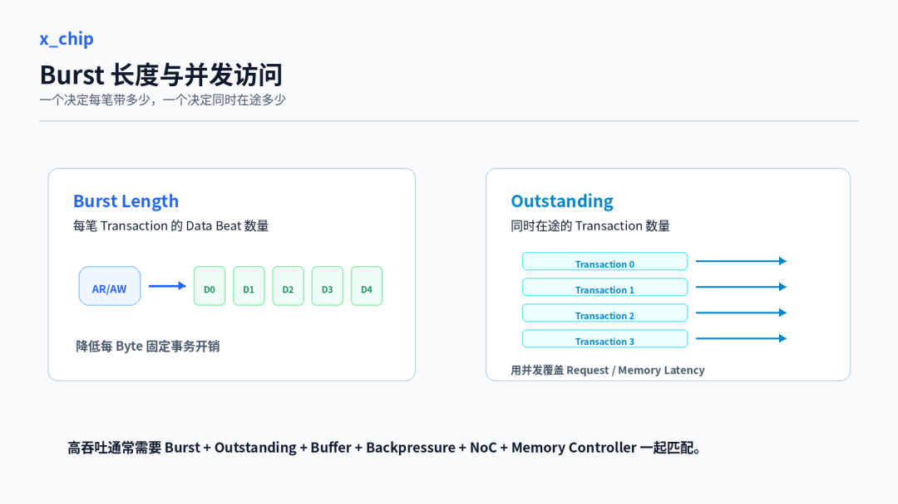

只有长 Burst，没有足够 Outstanding，长 Memory Latency 仍然可能让 Request Pipeline 断掉。

举个简单的方向性例子。假设一个 Master 每次只允许 2 笔 Read Outstanding，而从 Request 发出到第一批 Response 回来需要很长时间，那么即使每笔 Burst 本身很大，前两笔 Request 发完之后仍然可能因为 Outstanding 用尽而停下来。

反过来，Outstanding 很深，但每笔 Transaction 都很小，又可能让 Fabric 固定开销和 Transaction Tracking 压力变大。

AMD Versal NoC 的性能文档也直接给出了 Latency、Throughput 和 Outstanding Transaction 之间的关系：如果 Slave Latency 超过 Master 能维持的 Outstanding 数量，Master 会碰到 Outstanding 上限，无法继续持续发 Request，Pipeline 出现 Gap，最终 Bandwidth 下降。[4]

长 Burst 还有另一个协议约束：AXI 不支持 Burst Early Termination。

一笔 Burst 一旦建立，就必须把规定数量的 Transfer 完整走完。Write 即使后面的 Byte 不想真正写入，也只能通过 `WSTRB` 关闭有效 Byte，剩余 Transfer 仍然要完成；Read 可以丢弃不需要的数据，但 Transaction 不能提前结束。[1]

这对 Master 的 Buffer 设计也有影响。

如果 Write Master 已经发出一个很长的 AW Burst，但内部 FIFO 后续供数跟不上，W Channel 就会不断出现 Bubble。`AxLEN` 看起来很大，数据却并不连续。Read 侧也是一样，如果接收 FIFO 太浅，`RREADY` 经常拉低，长 Burst 反而会把 Backpressure 更长时间地留在链路上。

所以高带宽 Master 真正需要的是一组匹配的参数：

```
Burst Length
+
Outstanding Depth
+
Internal Buffer
+
Backpressure Capability
+
Fabric / NoC
+
Memory Controller
```

单独把任何一个参数拉满，都不能保证性能变好。

## 6.8 工程设计与性能分析

真正做 DMA、ISP、GPU、NPU 这类 Master 时，我更习惯把 Burst 问题分三层看。

第一层先确认协议正确。

```
AxLEN / AxSIZE / AxBURST
4KB Boundary
RLAST / WLAST
WSTRB
VALID / READY
Write Response
```

这些条件有问题，后面不用谈性能。

第二层看 Master 实际生成了什么 Traffic。

比如一个 Frame DMA 从软件上看是在“连续写一帧图像”，但 AXI 侧真正发出的 Transaction 还会受到：

```
Line Stride
Address Alignment
4KB Boundary
Descriptor Boundary
FIFO Depth
MAX_BURST_LEN
```

影响。

所以我更愿意看真实 Traffic，而不是只看寄存器配置：

```
Burst Length Distribution
Average Bytes / Transaction
R/W Data Channel Utilization
AR/AW Stall Cycles
R/W Stall Cycles
Outstanding Occupancy
```

这些指标最好一起看。

例如 Burst Length Distribution 很短，但 AR Channel 基本不 Stall，说明问题更可能在 Master 自己没有把连续 Request 聚合起来；如果 Burst 已经足够长，但 W Channel 频繁断流，就去查 FIFO 和上游供数；如果 Master 侧很顺，NoC 入口却长时间 Backpressure，再去看共享带宽、QoS 和下游拥塞。

如果配置的是 16-beat Burst，但真实流量大部分只有 2～4 Beat，优先应该回头看 Request Aggregation、Boundary Split 和 Buffer，而不是直接把问题甩给 DDR。

第三层再看整条系统路径。

```
Master
→ Interconnect / NoC
→ Bridge
→ Memory Controller
→ DRAM
```

Master 侧 Burst 很规整，但 NoC 入口频繁 Backpressure，就继续看 Fabric 的带宽分配、QoS、Buffer 和拥塞。

AXI 侧很顺，但 DDR Efficiency 仍然低，就继续查 Address Mapping、读写切换、Bank/Row 状态和 Memory Controller Scheduling。

如果 SoC 有 Performance Counter，最好把 Master、NoC、Memory Controller 三层数据分开看。这样才能回答三个不同的问题：Master 有没有产生合适的 Traffic，NoC 有没有把这些 Traffic 高效送过去，Memory Controller 有没有把最终请求调度好。

`AWLEN=15` 能确认的是，这笔 AXI Write Transaction 包含 16 个 W Transfer。

它确认不了整条 Memory Path 已经高效。

这也是 Burst 真正值得研究的地方。单看 `AxLEN` 只是一个很小的协议字段，顺着它往系统里走，却会一路碰到 Transaction Overhead、NoC Packetization、Multi-Master QoS、Outstanding、Memory Controller 和 DDR。

很多 SoC 性能问题，最后都不是某一个参数填错了，而是上下游对“什么样的 Traffic 才高效”没有真正对上。

**技术很重要，技术背后的思想更重要！**

芯片设计中的很多问题，单看一个模块并不复杂，但放进完整系统后才会真正体现难度。

如果这篇文章对你的工作或学习有帮助，欢迎点赞、在看，也欢迎关注 x\_chip，后续一起讨论更多 SoC 架构与芯片设计实践。

---

## 6.9 参考资料

[1] Arm, *AMBA AXI and ACE Protocol Specification*, ARM IHI 0022H，A1.2、A3.2、A3.4。
https://developer.arm.com/-/media/Arm%20Developer%20Community/PDF/IHI0022H\_amba\_axi\_protocol\_spec.pdf[1]

[2] AMD, *Versal Adaptive SoC Programmable Network on Chip and Integrated Memory Controller Product Guide (PG313)*，Packetization Overhead / Read and Write Bandwidth。
https://docs.amd.com/r/en-US/pg313-network-on-chip/Packetization-Overhead[2]
https://docs.amd.com/r/en-US/pg313-network-on-chip/Read-and-Write-Bandwidth[3]

[3] AMD, *Zynq-7000 SoC Technical Reference Manual (UG585)*，DDR Efficiency。
https://docs.amd.com/r/en-US/ug585-zynq-7000-SoC-TRM/DDR-Efficiency[4]

[4] AMD, *Versal Adaptive SoC Programmable Network on Chip and Integrated Memory Controller Product Guide (PG313)*，Throughput, Latency, and Outstanding Transactions。
https://docs.amd.com/r/en-US/pg313-network-on-chip/Throughput-Latency-and-Outstanding-Transactions[5]

---

**转载授权：欢迎全文转载，无需授权；请保留作者「烓围玮未」及来源「微信公众号：芯片设计进阶之路（x\_chip）」，不得冒充原创或歪曲原意。**

### 6.9.1 引用链接

[1]https://developer.arm.com/-/media/Arm%20Developer%20Community/PDF/IHI0022H\_amba\_axi\_protocol\_spec.pdf: *https://developer.arm.com/-/media/Arm%2520Developer%2520Community/PDF/IHI0022H\_amba\_axi\_protocol\_spec.pdf*

[2]*https://docs.amd.com/r/en-US/pg313-network-on-chip/Packetization-Overhead*

[3]*https://docs.amd.com/r/en-US/pg313-network-on-chip/Read-and-Write-Bandwidth*

[4]*https://docs.amd.com/r/en-US/ug585-zynq-7000-SoC-TRM/DDR-Efficiency*

[5]*https://docs.amd.com/r/en-US/pg313-network-on-chip/Throughput-Latency-and-Outstanding-Transactions*

---

# 7. 【芯片设计】梳理一下带宽计算公式和影响因素

> 来源：https://mp.weixin.qq.com/s/yJogayiFJkTB2jT-iVK7iA
> 作者：尼德兰的喵
> update 2026/08/29 13 : 48

我将用最简单最直白最不绕弯子的方式来梳理一下如何计算系统的带宽哈哈哈，这块早就想总结一下了正好最近频繁的在解释好几次，不如落在文字上，先来梳理下计算带宽的几个关键信息。

说来的确是和系统性能斗争了很多年了哈，刚一工作时每天就得面对带宽、突发、抖动、拥塞等等等等，脑袋一天比一天大。以前的文章里还提到过，那时候面对的第一个困难就是，我转不过来频率和周期的对应关系，就比如别人轻轻松松记住的GHz对应ns这类的我就是记不住。对此我也想了很多办法，最开始是在桌面白板上直接写对应关系，这样子的：

```
1TGHz = 1T/s = 1Tps，10^12对应1ps
1GHz = 1G/s = 1Gps，10^9对应1ns1MHz = 1M/s = 1Mps，10^6对应1μs
```

但这样还是得计算加转换，弱项大集合，所以后面进步了一下搞个脚本哎展示：

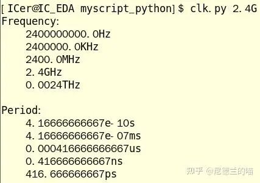

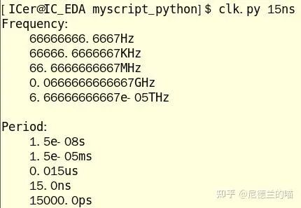

但是没有用因为写了之后压根就想不起来脚本名字，那没办法继续进步一下，所以就有了第一次封的GUI：

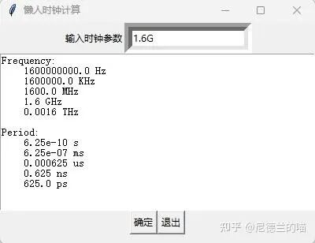

那不得不承认我的审美还是比较堪忧的，于是多年之后又封装了第二次：

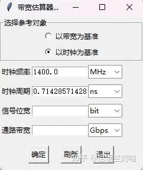

真的这次看着就好多了，至少看起来挺唬人的。以上这些在前文其实都聊过，属于复述了一下（好吧在公众号还没发过，回头发，请见阅读原文）。

复述的目的除了水一水字数外，还是主要强调下如果想快速的估算性能带宽什么的，那么时钟频率和周期的单位对应关系最好还是记得熟一些。而我在折腾了这么多次之后，可以说已经是肌肉记忆了，背的滚瓜烂熟。

| 频率单位 | 换算为赫兹 (Hz) | 周期单位 | 周期时间 (秒) |
| --- | --- | --- | --- |
| 1 PHz (拍赫兹) | 10^15 Hz | 1 fs (飞秒) | 10^-15 s |
| 1 THz (太赫兹) | 10^12 Hz | 1 ps (皮秒) | 10^-12 s |
| 1 GHz (吉赫兹) | 10^9 Hz | 1 ns (纳秒) | 10^-9 s |
| 1 MHz (兆赫兹) | 10^6 Hz | 1 μs (微秒) | 10^-6 s |
| 1 kHz (千赫兹) | 10^3 Hz | 1 ms (毫秒) | 10^-3 s |
| 1 Hz (赫兹) | 1Hz | 1 s (秒) | 1 s |

在熟练对应频率和周期后，下一个可以让计算起各种带宽如鱼得水的关键就是，对于Hz这个单位的理解。之前我就一直理解的不到位，觉得Hz就是Hz嘛越大时钟越快，但Hz实际上是1/秒（这里仿佛说了一句废话，大家都知道）。关键点是，Hz = 1/s = PS，GHz = G/s = GPS，理解到这一点后我突然就豁然开朗了：那32Gbps是什么，不就是32bit\*1GHz嘛；32GBps不就是32Byte\*1GHz嘛，诸如此类。

- Gbps（千兆比特每秒），是衡量交换机总数据交换能力的单位，也称为交换带宽，代表每秒传输10亿比特数据的速率。基于IEEE 802.3以太网标准扩展，该单位主要应用于千兆位以太网，其传输速度为1Gbps，核心功能是衡量交换机背板带宽，数值越高表明数据处理能力越强

只要想通了Hz就是ps or PS，那很多东西就一通百通了，比如各种带PS的性能衡量指标：

- TOPS (Tera Operations Per Second)，即每秒万亿次运算。这个指标在 AI 芯片（如 NPU、TPU）和自动驾驶计算平台中非常流行，它通常默认指代整数运算（如 INT8）
- FLOPS (Floating Point Operations Per Second)，每秒执行的浮点运算次数。这是衡量超级计算机或AI芯片计算能力的黄金标准
- IPS (Instructions Per Second)，每秒执行的指令数量。这是一个更底层的指标，与具体的CPU架构强相关。常用MIPS (Million IPS)，即每秒百万条指令
- DMIPS (Dhrystone Million Instructions Per Second)：基于 Dhrystone 基准测试程序得出的每秒百万条指令数。Dhrystone 是一个专门用于测试处理器整数运算和字符串处理能力的合成基准程序，其结果比单纯的 MIPS 更具可比性

这些指标里的PS其实都可以粗略的映射到时钟频率Hz上来，所以知道了一款芯片的主频那以上这些指标的数量级大概也就估出来了。这个地方想通后，只需要补充对应待计算性能的具体信息就行了，比如算带宽那得知道总线位宽是多少，通过Byte和Hz组成GB/s的带宽单位；如果计算浮点运算能力，那就得知道每拍能处理多少浮点数，得到FLOPS。我们今天只计算带宽，所以下一个关键信息自然就是总线位宽DW了，这个就不多说。

有频率f和位宽dw的话，就能计算一个系统的理论极限性能，毕竟你内部计算的再快数据供应不上也不行，所以我们得到这个公式（假设频率为2GHz，读写总线位宽分别为32Byte）：

```
系统极限带宽max_perf = DW * f = 32B * 2GHz = 64GB/s
```

这也就是之前那个gui计算的另外一个值：

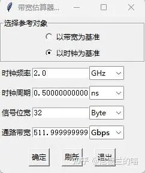

这511.9999999过于经典，机器专用防人码。当然这里算的是系统的理论极限带宽，如何达到这个带宽呢？条件自然就是拍拍有数据返回（或者写出）。那么我们一个子系统，面对的是外面noc+ddr组成的soc总线，系统是否可以拍拍给我们提供数据呢？

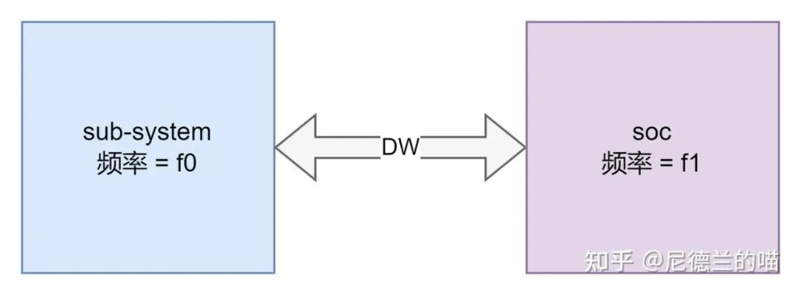

要判断这一点，就需要知道另外两个关键的指标：通路延迟soc\_latency和子系统突发能力。通路延迟好理解，指从一个子系统发起一个数据请求，到它开始接收到响应数据之间的时间间隔。这个指标通常由物理传输延迟、协议与逻辑延迟和目标设备响应延迟（主要是DDR读写延迟）组成，对于子系统设计而言，这是一个外部常量，我们能做的就是“求求了，延迟能不能再降一降！”而子系统突发能力呢指的是一次数据传输事务中，能够连续传输的数据量，或者理解为能够连续发出的未完成请求对应的数据量/拍数。它决定了通道的利用率，是弥补高延迟、提升实际带宽的关键，主要由两个参数确定：

- 突发长度 Burst Length(bl)
- 最大未完成事务数Oustanding(ostd)

关于这一点，之前的文章也详细的聊过了，不详细的说了：

[如何计算系统的outstanding 和 burst length？](https://mp.weixin.qq.com/s?__biz=MzIxMjc1NDgxOA==&mid=2247484775&idx=1&sn=5e40362bf14bba8a101ddf663a867db4&scene=21#wechat_redirect)

那么有了ostd和bl，我们就能计算子系统最大突发的能力以及能抗住多大的外部延迟：

```
突发能力max_burst = ostd * bl
覆盖外部延迟cover_latency = max_burst/f = ostd * bl / f
```

覆盖延迟能力单位肯定时ns、ps什么的，所以显然需要把频率作为除数放上去，这样好记。有了外部延迟以及覆盖外部延迟的数值之后，就能判断总线接口是否能够拍拍打满了。

```
if(cover_latency > soc_latency) 可以打满
else 不行
```

可以打满的情况放一边，关注更普遍的不能打满的情况，当接口不能拍拍打满时就必须考虑占空比的事了，即有多少时间接口上是有数据的。

```
duty_time = cover_latency / soc_latency
```

很显然，接口上真正能支持的最大带宽就是理论极限带宽\*数据有效占空比：

```
limit_max_perf
= duty_time * max_perf= (cover_latency / soc_latency) * dw * f= ostd * bl * period * dw * f / soc_latency= ostd * bl * dw / soc_latency
```

ostd \* bl \* dw是子系统突发的总数据量，单位是Byte；soc\_latency是外部的数据延迟，单位是s，所以整体的单位就是B/s，非常的合理了。而且通过观察计算结果可以看出，如果性能本身打不满时，提频是没有意义的，只有在外部数据供应能跟上时，子系统提频才对性能有意义。

那我们实际算一个：

```
dw = 32Byte, f0 = f1 = 2GHz, ostd = 32, bl = 8 , soc_latency = 500ns
max_perf = dw * f0 = 32GB/slimit_max_perf = ostd * bl * dw / soc_latency = 32 * 8 * 32 / 500 = 16.384GB/s因为limit_max_perf更小，所以真实总线带宽为16.384GB/s
```

换一个更复杂的场景，xpu 128B位宽@4GHz ostd=64 burst\_len=16，SOC 512B位宽@2GHz delay = 400ns，xpu和soc之间有中间有异步fifo和位宽转换（环路可按6cyc\_s+6cyc\_t延迟计算），请估算真实带宽。

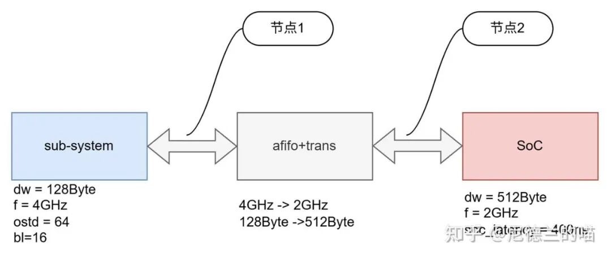

对于这类比较复杂的场景我一向是避免从全局去计算的，很容易把自己绕进去，因此会拆分出几个节点，比如这个场景下就分节点1（system-afifo）和节点2（afifo-SoC）来看。先计算节点1的三个指标：最大带宽，覆盖延迟和外部延迟。

```
p1_max_perf = dw * f1 = 512B * 2GHz = 1024GB/s
p1_cover_latency = ostd * bl / f1 = 64 * 16 / 2 = 256nsp1_soc_latency = soc_latency + trans_latency = 400 + 6/4GHz + 6/2GHz = 404.5ns
```

因为外部延迟大于覆盖延迟，所以p1的能提供实际最大性能为：

```
p1_limit_perf = p1_max_perf * p1_cover_latency / p1_soc_latency = 512 * 256 / 404.5 = 324.035GB/s
```

计算得到节点1的实际最大带宽后，再计算一下节点2。节点2这里的三个指标分别是：

```
p2_max_perf = dw * f2 = 512B * 2GHz = 1024GB/s
p2_cover_latency = ostd * bl / f2 = 64 * 4 / 2 = 128ns //128转512, bl折算为4p2_soc_latency = soc_latency = 400ns
```

因为外部延迟大于覆盖延迟，所以p2的能提供实际最大性能为：

```
p2_limit_perf = p2_max_perf * p2_cover_latency / p2_soc_latency = 1024 * 128 / 400 = 327.68GB/s
```

那么显然这个子系统的最大总线带宽是324.035GB/s。上面这样算还是太绕了，可以进一步简化：

第一步，判断瓶颈位置：首先比较两个节点的理论峰值带宽。

- XPU端理论带宽：128B \* 4GHz = 512 GB/s
- SOC端理论带宽：512B \* 2GHz = 1024 GB/s

结论：SOC端的理论带宽大于XPU端。因此，整个系统的理论瓶颈在XPU端。这意味着，如果XPU端能跑满512 GB/s，SOC端是能跟上的。那么，XPU端能跑满吗？

第二步，计算瓶颈点的实际带宽（节点1）。

- XPU发起请求的覆盖延迟能力：(64 \* 16) / 4GHz = 256ns
- XPU面临的总外部延迟：400ns (SoC) + 1.5ns (XPU->FIFO) + 3ns (FIFO->SoC) = 404.5ns

由于 256ns < 404.5ns，XPU端无法完全掩盖延迟，其实际带宽会被打折扣。

XPU端实际能提供的最大带宽：(256ns / 404.5ns) \* 512 GB/s ≈ 324 GB/s

第三步，分析最终系统性能。

既然XPU端是瓶颈，且其实际最大输出为 324 GB/s，而SOC端的理论带宽（1024 GB/s）远大于此，可以轻松跟上。因此，整个系统的实际最大带宽就是 324 GB/s。

好了，大概写这么多，最后让千问总结一下主干吧。

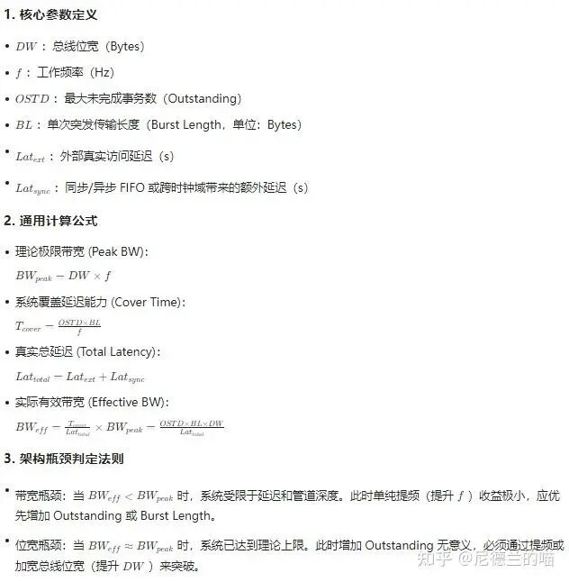


**系列文章入口**

|  |
| --- |
| [【芯片设计】SoC 101（一）：绪论](http://mp.weixin.qq.com/s?__biz=MzIxMjc1NDgxOA==&mid=2247487169&idx=1&sn=ee364b18f2e474bca64202a4a8b0cd0f&chksm=9740062ca0378f3ab8fe99e8eb245386cc74b62679742baf8ce951b84d793b576003dcf738e6&scene=21#wechat_redirect) |
| [【芯片设计】FIFO漫谈（零）从无处不在的FIFO开始说起](http://mp.weixin.qq.com/s?__biz=MzIxMjc1NDgxOA==&mid=2247486852&idx=1&sn=a53c95188e74ba2ec6bb2dd39b510e12&chksm=97400569a0378c7fb56d572e479bc1d87bb368082c232bc100fe721a3d5ec33d2ff950e3c736&scene=21#wechat_redirect) |
| [【芯片设计】计算机体系结构（一）虚拟内存](http://mp.weixin.qq.com/s?__biz=MzIxMjc1NDgxOA==&mid=2247486555&idx=1&sn=aac850d8953a8ebe11186fb1a9133c9e&chksm=974004b6a0378da0ceceeb2dab19522a8dbe66a2af041353502a22879034b505ce8b4db51168&scene=21#wechat_redirect) |
| [【芯片设计】深入理解AMBA总线（零）绪论](http://mp.weixin.qq.com/s?__biz=MzIxMjc1NDgxOA==&mid=2247485988&idx=1&sn=968a8ecc218e1fca016b358fdd2813c0&chksm=974002c9a0378bdf693e6add1881fee0ed47ba4c16354d325fd3f164a32306cafdacc12041df&scene=21#wechat_redirect) |
| [【芯片设计】握手协议的介绍与时序说明](http://mp.weixin.qq.com/s?__biz=MzIxMjc1NDgxOA==&mid=2247485353&idx=1&sn=602ccf45b2fa3c2bc9a1254dc9d10842&chksm=97400f44a03786520bf3371214511d277168f0ec0863b90308b6ce2c8ece2e2321ebb8599f9b&scene=21#wechat_redirect) |
| [【芯片设计】复位那些小事 —— 复位消抖](http://mp.weixin.qq.com/s?__biz=MzIxMjc1NDgxOA==&mid=2247485023&idx=1&sn=8ac6641396fda2e257258127bd299ce7&chksm=97400eb2a03787a44f1994c4b262cbf506432086e915aec38a3f81611a3a384d1b7e6323137b&scene=21#wechat_redirect) |
| [【芯片设计】快速入门数字芯片设计（一）Introduction](http://mp.weixin.qq.com/s?__biz=MzIxMjc1NDgxOA==&mid=2247488312&idx=1&sn=fd8df508a270483d02e69856213934c7&chksm=97401bd5a03792c369757c1f23c746025aa1d8e7b55e063a7320afcf0eb8d9ce51cb9e54de98&scene=21#wechat_redirect) |
| [【芯片验证】UVM源码计划（零）下定决心读源码前的自测环节](http://mp.weixin.qq.com/s?__biz=MzIxMjc1NDgxOA==&mid=2247488834&idx=1&sn=c1d11c01cbe55297f12518a203ccdb2b&chksm=97401dafa03794b9a494042723b428084a5f06432dad28c02482061d862256ef664d22976319&scene=21#wechat_redirect) |
| [【芯片设计】异步电路碎碎念（一） 到底什么是异步电路](http://mp.weixin.qq.com/s?__biz=MzIxMjc1NDgxOA==&mid=2247488891&idx=1&sn=d089bd3c8a90c72ddd4e3a28bbf16594&chksm=97401d96a0379480eb5d363beb8cd1f1f7fe0f8c2c9286660936a058b4e97da9200d8f252585&scene=21#wechat_redirect) |
| [【芯片设计】从RTL到GDS（一）：Introduction](http://mp.weixin.qq.com/s?__biz=MzIxMjc1NDgxOA==&mid=2247488894&idx=1&sn=478e51eb151fd398ff2bd8c2d6002d3e&chksm=97401d93a037948580602637236714bff48299a3422bede152a38b7f1f10fc1204bec84a0e98&scene=21#wechat_redirect) |
| [【芯片设计】系统中的可维可测状态记录寄存器设计](https://mp.weixin.qq.com/s?__biz=MzIxMjc1NDgxOA==&mid=2247491368&idx=1&sn=7ac7ac21c1855c421fee407184164ae0&scene=21#wechat_redirect) |
| [【芯片设计】偶遇编码建议（一）为什么RTL中避免使用task](https://mp.weixin.qq.com/s?__biz=MzIxMjc1NDgxOA==&mid=2247491687&idx=1&sn=ce82a22865b66dcab75ab538a3eaa755&scene=21#wechat_redirect)[‍](https://mp.weixin.qq.com/s?__biz=MzIxMjc1NDgxOA==&mid=2247491687&idx=1&sn=ce82a22865b66dcab75ab538a3eaa755&scene=21#wechat_redirect) |
| [【systemC的学习日常】安装systemC库并运行第一个demo](https://mp.weixin.qq.com/s?__biz=MzIxMjc1NDgxOA==&mid=2247491898&idx=1&sn=f5fdd39f566e504eadd9b4bf3c7a85c4&scene=21#wechat_redirect) |

**其他文章链接**

|  |
| --- |
| [【芯片验证】sva\_assertion: 15道助力飞升的断言练习](http://mp.weixin.qq.com/s?__biz=MzIxMjc1NDgxOA==&mid=2247485304&idx=1&sn=bb68e3aa3897f12029a0376f558faf83&chksm=97400f95a0378683a7c9fa01f87ee8b4f97dfaa097b1176ac50f946459671bacf7baf985c0fc&scene=21#wechat_redirect) |
| [【芯片验证】可能是RTL定向验证的巅峰之作](http://mp.weixin.qq.com/s?__biz=MzIxMjc1NDgxOA==&mid=2247484940&idx=1&sn=55ae277e60dccb60b20f67fd00b60a6c&chksm=97400ee1a03787f7955cac9e9268d7c5cd750fa74a0b634643811b6cbbe39f207b3c99101c34&scene=21#wechat_redirect) |
| [【芯片验证】RTL仿真中X态行为的传播 —— 从xprop说起](http://mp.weixin.qq.com/s?__biz=MzIxMjc1NDgxOA==&mid=2247484876&idx=1&sn=10d5f9a44768a70f00367e5b4fcb6cdb&chksm=97400d21a0378437a5a48db6829b433ee0fadf5c5788dc5b949701d3628d55b8dc3b3c2b781a&scene=21#wechat_redirect) |
| [【芯片验证】年轻人的第一个systemVerilog验证环境全工程与解析](http://mp.weixin.qq.com/s?__biz=MzIxMjc1NDgxOA==&mid=2247487134&idx=1&sn=402f2f24e2f1897f59abe099f215807e&chksm=97400673a0378f653b8573d189cec2112b4390981cbe1178de92e80ac1427c73aee13d82e4d7&scene=21#wechat_redirect) |

|  |
| --- |
| [【芯片设计】verilog中有符号数和无符号数的本质探究](http://mp.weixin.qq.com/s?__biz=MzIxMjc1NDgxOA==&mid=2247485007&idx=1&sn=4019dd90b9665d4237ca4a4218139a70&chksm=97400ea2a03787b4bfccf885b31dfa014df2059b0010b8c2bfc71c886ef901f8bd36247d3e0e&scene=21#wechat_redirect) |
| [【芯片设计】论RTL中always语法的消失术](http://mp.weixin.qq.com/s?__biz=MzIxMjc1NDgxOA==&mid=2247484900&idx=1&sn=0786012d5eaad91ee097787bb847261b&chksm=97400d09a037841f6f80ce341f0a9cab3047b0936f4f0c9ad900a46c0412acd056d702aa2819&scene=21#wechat_redirect) |
| [【芯片设计】代码即注释，注释即代码](http://mp.weixin.qq.com/s?__biz=MzIxMjc1NDgxOA==&mid=2247484906&idx=1&sn=cab1a7294096b5842ea5d2b27acf13fa&chksm=97400d07a03784113124a3dff39e22ff267dc32e96c43ff4b076b07c99153c2ceb0542c2d1ce&scene=21#wechat_redirect) |
| [【芯片设计】700行代码的risc处理器你确实不能要求太多了](http://mp.weixin.qq.com/s?__biz=MzIxMjc1NDgxOA==&mid=2247485185&idx=1&sn=6b9b44c455d27b24b5c12aba5798a381&chksm=97400feca03786fa08783059d4709b67cba02f733a5f42d993861536226a57459d9aa16c15d4&scene=21#wechat_redirect) |

|  |
| --- |
| [入职芯片开发部门后，每天摸鱼之外的时间我们要做些什么呢](http://mp.weixin.qq.com/s?__biz=MzIxMjc1NDgxOA==&mid=2247484555&idx=1&sn=02dd18383113f3144f86b1a7603fadce&chksm=97400c66a037857067972999b4e13b88e5c4d6b3fb599f3bf05a24ed47758bfdf0dde10914c2&scene=21#wechat_redirect) |
| [如何计算系统的outstanding 和 burst length？](http://mp.weixin.qq.com/s?__biz=MzIxMjc1NDgxOA==&mid=2247484775&idx=1&sn=5e40362bf14bba8a101ddf663a867db4&chksm=97400d8aa037849c5b81412607578fcb2024e7e0136b20c55fa7716d9ca9eeb3daa2f1e83be1&scene=21#wechat_redirect) |
| [芯片搬砖日常·逼死强迫症的关键词不对齐事件](http://mp.weixin.qq.com/s?__biz=MzIxMjc1NDgxOA==&mid=2247486838&idx=1&sn=bab3ea9407974acd2568446c028844c2&chksm=9740059ba0378c8d56abe4fa0be0cb050df804455ea287ae6d4688b44dcaa0023ef003aec442&scene=21#wechat_redirect) |
| [熟人社会里，一群没有社会价值的局外人](http://mp.weixin.qq.com/s?__biz=MzIxMjc1NDgxOA==&mid=2247486809&idx=1&sn=8cae86ad8adf265b33e6c93e17fe5485&chksm=974005b4a0378ca22d32ee2a3ba9551dcb0624e0253f0395d961327254f0333c11f5a0525203&scene=21#wechat_redirect) |

---

# 8. 时序例外：false_path / multicycle_path / max_delay

> 来源：https://mp.weixin.qq.com/s/U6Q7z-y2TQ9BTxD9_fjYEw
> 作者：lookoutwl
> update 2026/08/29 13 : 48

## 8.1 从一个问题开始

上两篇我们写了基本时钟约束、IO 约束——给了工具足够的路径信息。但有一个问题没解决：**不是所有路径都需要做 setup/hold 检查。**

有些路径天生就不该被检查——比如异步时钟域之间的路径、芯片刚上电时的复位信号。有些路径确实需要检查，但不是每个周期——比如 SPI 的数据路径，数据可能在 2~3 个时钟周期后才稳定。

这就是"时序例外（Timing Exception）"要解决的问题。**学懂了时序例外，你的 SDC 才真正属于这个设计，而不是一个模板复制品。**

---

## 8.2 时序例外的全景

三种时序例外，对应三类场景：

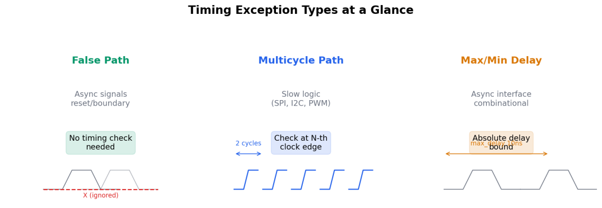

```
╔══════════════════╦══════════════════╦══════════════════════╗
║   false_path     ║  multicycle_path ║   set_max/min_delay ║╠══════════════════╬══════════════════╬══════════════════════╣║ 不检查时序        ║ 放宽检查周期      ║ 自定义绝对延迟上限    ║║  → 异步跨域路径   ║  → 慢速逻辑路径   ║  → 异步组合信号      ║║  → 测试模式路径   ║  → 同步使能路径   ║  → IO 接口组合路径   ║║  → 复位路径      ║  → 特定计算路径   ║  → 跨时钟握手信号    ║╚══════════════════╩══════════════════╩══════════════════════╝
```

---

## 8.3 false\_path：不存在的路径

### 8.3.1 什么时候用

**打个比方：** 一条路从 A 到 B，但中间有扇永远锁着的门——你永远不会走这条路。那就别浪费时间在这条路上设交警查超速了。

**具体场景：**

| 场景 | 说明 | 典型命令 |
| --- | --- | --- |
| **异步时钟域** | 两个无关联时钟之间的所有路径 | `set_false_path -from [get_clocks CLK_A] -to [get_clocks CLK_B]` |
| **复位路径** | 所有寄存器异步置位/清零端（不限制源端，适用于多级复位树） | `set_false_path -to [all_registers -async]` |
| **测试模式** | scan\_enable / test\_mode 在功能模式下的路径 | `set_false_path -through [get_pins .../test_mode]` |
| **DFT 隔离** | scan 链在 func 模式下不活动的路径 | `set_false_path -from [all_registers -scan]` |
| **DC 耦合路径** | 仿真用但综合不需要的逻辑 | `set_false_path -through [get_nets dc_bias_sim]` |

### 8.3.2 异步时钟域的 false\_path 写法

最常见的场景——两个异步时钟域之间的所有寄存器到寄存器的路径：

```
# ⚠️ 错误写法：只考虑了一个方向
set_false_path -from [get_clocks clk_spi] -to [get_clocks clk_sys]# ✅ 正确写法：两个方向都要设（或者用 clock groups）set_clock_groups -asynchronous \  -group [get_clocks clk_spi] \  -group [get_clocks clk_sys]# 等效于：set_false_path -from [get_clocks clk_spi] -to [get_clocks clk_sys]set_false_path -from [get_clocks clk_sys] -to [get_clocks clk_spi]
```

**注意：**`set_clock_groups -asynchronous` 是双向的，而 `set_false_path` 是单向的。用 clock groups 更简洁不易遗漏。

### 8.3.3 常见错误

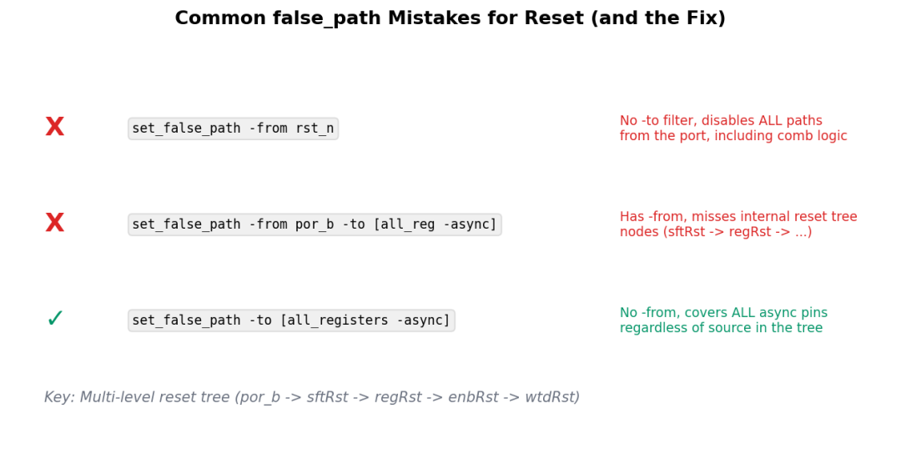

```
# ✗ 错误：对复位端口设 from → 只覆盖了从该端口出发的路径,
#   如果复位树有多级内部节点（如 por_b → sftRst → regRst），#   中间节点的复位路径不会被覆盖set_false_path -from [get_ports rst_n] -to [all_registers -async]# → 这只覆盖了 rst_n 直连的路径，漏掉了复位树内部的异步路径# ✅ 正确：不限制源端，对所有寄存器的异步端设 false_pathset_false_path -to [all_registers -async]# → 无论复位源来自顶层端口还是内部复位树节点，全部覆盖
```

---

## 8.4 multicycle\_path：多周期路径

### 8.4.1 核心概念

**打个比方：** 一辆快递车每天发一班，但有的包裹需要 3 天才能到——你查快递状态时在第 3 天查才是合理的，第 2 天查肯定显示"未到达"引发误报。multicycle\_path 就是告诉工具："这条路径的包裹要 3 个时钟周期才能到，别在 1 个周期后催。"

**默认情况：** 没写 multicycle\_path 时，工具假设**每个启动沿（launch）都在下一个捕获沿（capture）完成检查**。如果数据实际需要 2 个或更多周期，工具会报假违例。

### 8.4.2 基础语法

```
# 3-cycle setup mulicyle path
set_multicycle_path 3 -setup -from [get_pins reg_a/CK] -to [get_pins reg_b/D]# 配套的 hold multicycle（重要！容易忘）set_multicycle_path 2 -hold -from [get_pins reg_a/CK] -to [get_pins reg_b/D]
```

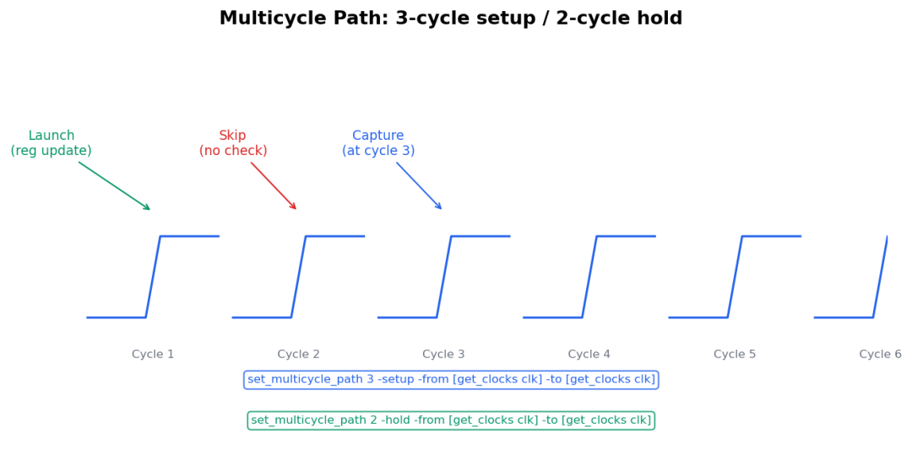

### 8.4.3 hold 的"减一"规则

**这是 multicycle 最让人困惑的细节。** 看公式：

```
setup check 的周期偏移 = M - 1
hold check 的周期偏移  = N - 1其中 M = setup multicycle 值    N = hold multicycle 值
```

规则：**hold multicycle 一般比 setup 少 1**。原因：

```
默认（M=1, N=1）:
  setup check: launch 沿的下一个沿（偏移=0=1-1）  hold check:  launch 沿的同一个沿（偏移=0=1-1）3-cycle setup（M=3）:  setup check: launch 沿之后的第 2 个沿（偏移=2=3-1）  hold check: 默认情况下会在同一个沿检查 → 太严格，实际上数据要在第 3 个沿才被捕获为什么 hold 要减 1:  如果 setup 在第 3 个沿检查，hold 最早应该在 launch 沿之后的第 1 个沿检查  （因为数据必须保持到第 3 个沿，但第 0 个沿之后数据就变了）  所以 hold multicycle = setup - 1 = 2
```

**一句话记住：****写 M-cycle setup，一定要配套写 (M-1)-cycle hold。** 忘了 hold 是 multicycle 最常见的 bug。

**打个比方：** 你约了朋友 3 天后见面（3-cycle setup），那"保持通信畅通"的时间应该是到第 1 天？还是到第 3 天？答案是到第 1 天之后就解除保持要求了——因为真正的检查在第 3 天，你需要在第 2 天之后才能改变计划。hold 的 (M-1) 就是这个道理。

### 8.4.4 典型应用场景

```
# 1. 使能控制的寄存器路径（数据每 N 个周期才更新一次）
# 数据路径经过一个 en 控制的寄存器，只在 en=1 时更新set_multicycle_path 2 -setup -through [get_pins u_en_reg/Q]set_multicycle_path 1 -hold  -through [get_pins u_en_reg/Q]# 2. SPI 数据路径（在慢时钟域中组合逻辑较长）# SPI 时钟 2.5MHz，寄存器到寄存器的组合逻辑超过 400ns# 允许 2 个 SPI 时钟周期set_multicycle_path 2 -setup -from [get_clocks clk_spi] -to [get_clocks clk_spi]set_multicycle_path 1 -hold  -from [get_clocks clk_spi] -to [get_clocks clk_spi]# 3. 分频器输出路径（计数器分频后的信号）# 输出每 4 个时钟周期才翻转一次set_multicycle_path 4 -setup -through [get_pins u_div_cnt/Q]set_multicycle_path 3 -hold  -through [get_pins u_div_cnt/Q]
```

---

## 8.5 set\_max\_delay / set\_min\_delay：自定义延迟约束

### 8.5.1 什么时候用

**打个比方：** 你有一条没有红绿灯的辅路（没有时钟同步），交通规则说"所有车必须在 10 秒内通过"。你不能用 setup/hold 来约束（因为没有时钟），只能用直接的"10 秒上限"。

### 8.5.2 典型场景

```
# 1. 异步握手信号
# data_valid 从 CLK_A 域到 CLK_B 域，组合路径没有时钟set_max_delay 10 -from [get_pins u_sync/data_valid_reg/Q] \                  -to [get_pins u_sync_b/data_valid_sync/D]set_min_delay 2  -from [get_pins u_sync/data_valid_reg/Q] \                  -to [get_pins u_sync_b/data_valid_sync/D]# 2. IO 组合路径（输入直接到输出，不经过寄存器）set_max_delay 50 -from [get_ports data_in] -to [get_ports data_out]set_min_delay 5  -from [get_ports data_in] -to [get_ports data_out]# 3. 跨时钟域的 fast→slow 路径上的组合逻辑set_max_delay 15 -from [get_clocks clk_fast] -to [get_clocks clk_slow]
```

### 8.5.3 优先级规则

当多个例外作用于同一条路径时，**最严格的一个生效**：

```
同一路径上同时存在：
  set_max_delay 10  set_false_path→ false_path 优先级最高，覆盖 max_delay
```

优先级（从高到低）：

```
1. set_false_path          → 完全跳过检查
2. set_max/min_delay        → 自定义延迟上限/下限3. set_multicycle_path      → 放宽检查周期4. 默认 setup/hold 检查     → 最宽松
```

---

## 8.6 虚拟项目实战：充电管理芯片的 SDC 例外

### 8.6.1 项目背景

```
工艺：180nm 9TV50
时钟：  clk_sys   = 2.5MHz (400ns) — 系统主时钟  clk_spi   = 2.5MHz (400ns) — SPI 从模式时钟（与 clk_sys 异步）  clk_pwm   = 100kHz (10us)  — PWM 调制时钟（由 clk_sys 分频）
```

### 8.6.2 需要处理的例外

| 路径 | 类型 | 原因 | SDC 命令 |
| --- | --- | --- | --- |
| clk\_sys ↔ clk\_spi | false\_path | 异步时钟域 | `set_clock_groups -asynchronous` |
| rst\_n → 所有寄存器的异步端 | false\_path | 复位路径 | `set_false_path -to [all_registers -async]` |
| SPI data → SPI register (en=1才更新) | multicycle 2 | 使能控制 | `set_multicycle_path 2/1` |
| ADC 结果寄存器到 PWM 比较器 | multicycle 4/3 | 每 4 个周期才更新 | `set_multicycle_path 4/3` |
| test\_mode → 所有 MUX 选择端 | false\_path | 功能模式 | `set_false_path -through [get_pins .../test_mode]` |
| 输入 GPIO 到输出 GPIO（不带寄存器） | max\_delay | 纯组合 IO 路径 | `set_max_delay 300 -from [IO_IN] -to [IO_OUT]` |
| 异步中断信号 comb 路径 | max\_delay | 无时钟同步 | `set_max_delay 100` |

### 8.6.3 完整 SDC 片段

```
# ========== 时钟例外 ==========
# 异步时钟域set_clock_groups -asynchronous \  -group [get_clocks clk_sys] \  -group [get_clocks clk_spi]# ========== false_path ==========# 复位路径（不限制源端，覆盖多级复位树的全部异步端）set_false_path -to [all_registers -async]# 测试模式路径set_false_path -through [get_pins */test_mode]# ========== multicycle_path ==========# SPI 数据路径（使能控制）set_multicycle_path 2 -setup -through [get_pins u_spi_reg/Q]set_multicycle_path 1 -hold  -through [get_pins u_spi_reg/Q]# ADC → PWM 路径（慢速更新，4 个周期）set_multicycle_path 4 -setup -from [get_clocks clk_sys] \                       -to [get_clocks clk_pwm]set_multicycle_path 3 -hold  -from [get_clocks clk_sys] \                       -to [get_clocks clk_pwm]# ========== max/min_delay ==========# GPIO 纯组合路径set_max_delay 300 -from [all_inputs] -to [all_outputs]set_min_delay 5   -from [all_inputs] -to [all_outputs]# 异步中断握手set_max_delay 100 -from [get_pins u_int_gen/irq_reg/Q] \                   -to [get_pins u_int_sync/irq_sync/D]
```

### 8.6.4 验证方法

写完例外后，一定要检查：

```
# 列出所有被 false_path 覆盖的路径
report_timing -exceptions all -significant_fp 10# 列出所有 multicycle 路径的 setup/hold 周期report_multicycle_path -all# 检查没有被任何例外覆盖的路径（遗漏检查）check_timing -override_defaults -verbose
```

---

## 8.7 记忆曲线回访

### 8.7.1 回访 SDC 时钟约束第一课（2026-05-20）

当时我们写了 basic clock constraints，但留下了"例外"这个缺口。现在补上了：

```
完整的 SDC 应该包含：
┌─────────────────────────────────────┐│ 1. 时钟定义（create_clock）          │ ← 已学│ 2. 时钟特性（uncertainty/latency）   │ ← 已学│ 3. IO 约束（input/output delay）     │ ← 已学│ 4. 时序例外（false/multi/max/min）   │ ← 现在│ 5. 时钟组（clock groups）            │ ← 现在│ 6. 设计规则约束（transition/cap/fanout）│ ← 未学└─────────────────────────────────────┘
```

### 8.7.2 与 OCV / POCV 的关系

例外和 OCV 是两个正交的概念：

```
例外影响"检查什么路径"
OCV 影响"检查时用什么 margin"两者不冲突：  先设例外（确定哪些路径需检查）  再设 OCV（确定检查的严格程度）
```

---

## 8.8 总结

```
┌────────────────────────────────────────────────────────────┐
│                                                           ││  时序例外的选择法则：                                       ││                                                           ││  Q: 这条路径需要检查 setup/hold 吗？                        ││  ├─ NO  → set_false_path                                   ││  │                                                         ││  └─ YES → Q: 每 1 个时钟周期都检查？                       ││            ├─ YES → 不需要例外（默认）                      ││            │                                                ││            └─ NO  → Q: 路径有同步时钟吗？                  ││                     ├─ YES → set_multicycle_path           ││                     └─ NO  → set_max/min_delay             ││                                                           │└────────────────────────────────────────────────────────────┘
```

**三个容易忘的点：**

```
1. set_multicycle_path 的 hold 必须比 setup 少 1
2. set_clock_groups -asynchronous 比两个 false_path 更安全3. false_path 优先级最高，会覆盖 max_delay
```
