<!-- toc-start -->

# 目录

[1. 芯片验证工程师应该具备的七种能力](#1-芯片验证工程师应该具备的七种能力)  
　　[1.1 RTL 设计理解](#11-rtl-设计理解)  
　　[1.2 验证方法学](#12-验证方法学)  
　　[1.3 SoC 与协议](#13-soc-与协议)  
　　[1.4 能不能理解系统级交互？从 block-level 到 SoC-level，验证难度会明显上升。原因不是模块数量简单增加，而是模块之间的交互开始变得复杂。AXI、PCIe、DDR、DMA、Interrupt、Coherency 这些内容，往往是系统级问题的高发区域。](#14-能不能理解系统级交互从-block-level-到-soc-level验证难度会明显上升原因不是模块数量简单增加而是模块之间的交互开始变得复杂axipcieddrdmainterruptcoherency-这些内容往往是系统级问题的高发区域)  
　　[1.5 软件与固件协同](#15-软件与固件协同)  
　　[1.6 平台与工具使用](#16-平台与工具使用)  
　　[1.7 能不能从发现 bug 走向风险闭环并自我成长](#17-能不能从发现-bug-走向风险闭环并自我成长)  
　　[1.8 总结](#18-总结)  
[2. 什么是上电复位POR以及为啥还需要专用的电源监控芯片？](#2-什么是上电复位por以及为啥还需要专用的电源监控芯片)  
　　[2.1 POR（上电复位 Power-On Reset）](#21-por上电复位-power-on-reset)  
　　　　[2.1.1 POR](#211-por)  
　　　　[2.1.2 内部POR潜在风险](#212-内部por潜在风险)  
　　[2.2 STM32 RC外部复位电路](#22-stm32-rc外部复位电路)  
　　　　[2.2.1 工作过程](#221-工作过程)  
　　　　[2.2.2 RC两个核心作用](#222-rc两个核心作用)  
　　　　[2.2.3 RC电路天生缺陷](#223-rc电路天生缺陷)  
　　[2.3 为什么额外使用电源监控芯片（TPS3307这类）？](#23-为什么额外使用电源监控芯片tps3307这类)  
　　　　[2.3.1 外部电源监控芯片的独有能力](#231-外部电源监控芯片的独有能力)  
　　　　[2.3.2 使用场景](#232-使用场景)  
　　[2.4 会不会出现无法捕获阈值、复位失效？](#24-会不会出现无法捕获阈值复位失效)  
　　　　[2.4.1 场景1：电压变化速率过快](#241-场景1电压变化速率过快)  
　　　　[2.4.2 场景2：迟滞电压（TPS3307自带，很多内置POR迟滞很小）](#242-场景2迟滞电压tps3307自带很多内置por迟滞很小)  
　　　　[2.4.3 场景3：电源上电斜率过缓](#243-场景3电源上电斜率过缓)  
　　[2.5 数字系统电源与时序设计](#25-数字系统电源与时序设计)  
　　　　[2.5.1 步骤1：梳理所有电源轨，明确上电顺序要求](#251-步骤1梳理所有电源轨明确上电顺序要求)  
　　　　[2.5.2 步骤2：明确需求清单](#252-步骤2明确需求清单)  
　　　　[2.5.3 步骤3：复位方案选型对比](#253-步骤3复位方案选型对比)  
　　　　[2.5.4 步骤4：风险预判](#254-步骤4风险预判)  
　　[2.6 TPS3307总结](#26-tps3307总结)  
　　[2.7 常见问题](#27-常见问题)  
[3. 外设集成没人爱管，真正难的从来不是外设本身](#3-外设集成没人爱管真正难的从来不是外设本身)  
　　[3.1 真正难的从来不是外设本身](#31-真正难的从来不是外设本身)  
　　[3.2 SoC 级验证该验什么，不该验什么](#32-soc-级验证该验什么不该验什么)  
　　[3.3 寄存器验证：最容易糊弄，也最容易反噬](#33-寄存器验证最容易糊弄也最容易反噬)  
　　[3.4 一点系统层面的想法](#34-一点系统层面的想法)  
[4. 软件同事说程序跑到一半跳到了一个谁都不认识的地址](#4-软件同事说程序跑到一半跳到了一个谁都不认识的地址)  
　　[4.1 验证环境该怎么搭](#41-验证环境该怎么搭)  
[5. 分层验证后仿思路](#5-分层验证后仿思路)  
[6. PR后仿流程](#6-pr后仿流程)  
[7. 什么是芯片 Bring-up](#7-什么是芯片-bring-up)  
　　[7.1 Bring-up 发生在什么阶段？](#71-bring-up-发生在什么阶段)  
　　[7.2 Bring-up 和其他验证活动有什么区别？](#72-bring-up-和其他验证活动有什么区别)  
　　[7.3 Bring-up 通常怎样展开？](#73-bring-up-通常怎样展开)  
　　　　[7.3.1 确认电源和板级状态](#731-确认电源和板级状态)  
　　　　[7.3.2 检查时钟和复位](#732-检查时钟和复位)  
　　　　[7.3.3 打通调试入口](#733-打通调试入口)  
　　　　[7.3.4 建立最小执行路径](#734-建立最小执行路径)  
　　　　[7.3.5 打通启动介质、DDR 和基础外设](#735-打通启动介质ddr-和基础外设)  
　　　　[7.3.6 启动系统软件和关键数据路径](#736-启动系统软件和关键数据路径)  
　　[7.4 为什么 Bring-up 难？](#74-为什么-bring-up-难)  
　　[7.5 Bring-up 的准备工作要在回片前完成](#75-bring-up-的准备工作要在回片前完成)  
　　　　[7.5.1 可观测性](#751-可观测性)  
　　　　[7.5.2 可控制性](#752-可控制性)  
　　　　[7.5.3 测试与诊断能力](#753-测试与诊断能力)  
　　[7.6 FPGA Prototype 能提前暴露哪些问题？](#76-fpga-prototype-能提前暴露哪些问题)  
[8. 【验证专项】寄存器专项测试](#8-验证专项寄存器专项测试)  
　　[8.1 寄存器复位值测试](#81-寄存器复位值测试)  
　　[8.2 寄存器属性测试](#82-寄存器属性测试)  
　　[8.3 地址粘连测试](#83-地址粘连测试)  
　　[8.4 数据粘连测试](#84-数据粘连测试)  
　　[8.5 地址边界测试](#85-地址边界测试)  
　　[8.6 全地址遍历测试](#86-全地址遍历测试)  
[9. \[验证专项\]\[UPF 功耗仿真\]UPF 功耗仿真原理通俗版讲解](#9-验证专项upf-功耗仿真upf-功耗仿真原理通俗版讲解)  
　　[9.1 先搞懂普通仿真的问题](#91-先搞懂普通仿真的问题)  
　　[9.2 UPF 核心作用：给仿真器加上「电源模型」](#92-upf-核心作用给仿真器加上电源模型)  
　　[9.3 功耗统计原理](#93-功耗统计原理)  
　　[9.4 PA 功耗仿真整体运行机制](#94-pa-功耗仿真整体运行机制)  
　　[9.5 一句话总结](#95-一句话总结)  
[10. SOC验证总纲怎么写：从边界、内容到准出的完整方法](#10-soc验证总纲怎么写从边界内容到准出的完整方法)  
　　[10.1 先明确：SOC验证总纲到底解决什么问题](#101-先明确soc验证总纲到底解决什么问题)  
　　[10.2 SOC验证目标为什么可以分成五类](#102-soc验证目标为什么可以分成五类)  
　　　　[10.2.1 集成结构正确性](#1021-集成结构正确性)  
　　　　[10.2.2 基础功能路径正确性](#1022-基础功能路径正确性)  
　　　　[10.2.3 组合与并发正确性](#1023-组合与并发正确性)  
　　　　[10.2.4 异常可控与恢复正确性](#1024-异常可控与恢复正确性)  
　　　　[10.2.5 非功能约束与实现正确性](#1025-非功能约束与实现正确性)  
　　[10.3 SOC验证边界应该如何确定](#103-soc验证边界应该如何确定)  
　　[10.4 SOC验证内容如何形成有逻辑的分解](#104-soc验证内容如何形成有逻辑的分解)  
　　　　[10.4.1 SOC功能验证：四个递进维度](#1041-soc功能验证四个递进维度)  
　　　　[10.4.2 SOC专项验证与签核](#1042-soc专项验证与签核)  
　　[10.5 验证方法不是工具清单，而是一套证据组合](#105-验证方法不是工具清单而是一套证据组合)  
　　　　[10.5.1 场景与激励](#1051-场景与激励)  
　　　　[10.5.2 结果检查与自校验](#1052-结果检查与自校验)  
　　　　[10.5.3 形式化与静态检查](#1053-形式化与静态检查)  
　　　　[10.5.4 子系统Top层Toggle](#1054-子系统top层toggle)  
　　　　[10.5.5 验证载体协同](#1055-验证载体协同)  
　　[10.6 几千条Case，需求追溯不等于逐条手工维护](#106-几千条case需求追溯不等于逐条手工维护)  
　　[10.7 缺陷、验证限制、豁免和剩余风险必须分开](#107-缺陷验证限制豁免和剩余风险必须分开)  
　　[10.8 SOC验证准出应该回答四个问题](#108-soc验证准出应该回答四个问题)  
　　　　[10.8.1 功能是否通过](#1081-功能是否通过)  
　　　　[10.8.2 证据是否充分](#1082-证据是否充分)  
　　　　[10.8.3 缺陷和风险是否可接受](#1083-缺陷和风险是否可接受)  
　　　　[10.8.4 专项是否完成签核](#1084-专项是否完成签核)  
　　[10.9 结语](#109-结语)  
[11. 芯片回片后跑不起来，先别急着怀疑RTL](#11-芯片回片后跑不起来先别急着怀疑rtl)  
　　[11.1 先把“跑不起来”拆开](#111-先把跑不起来拆开)  
　　[11.2 为什么通常从底层状态看起](#112-为什么通常从底层状态看起)  
　　[11.3 看到状态，不等于找到根因](#113-看到状态不等于找到根因)  
　　[11.4 什么时候该重点看RTL](#114-什么时候该重点看rtl)  
　　[11.5 可观测性要在回片前考虑](#115-可观测性要在回片前考虑)  
　　[11.6 总结](#116-总结)  
[12. 芯片验证工程师为什么要懂软件？](#12-芯片验证工程师为什么要懂软件)  
　　[12.1 我们也可以从以下几个方面来分析，软件对于验证工程师有什么帮助，我们为什么要掌握软件技能，学习路径应该是什么样：](#121-我们也可以从以下几个方面来分析软件对于验证工程师有什么帮助我们为什么要掌握软件技能学习路径应该是什么样)  
　　[12.2 从“验证 RTL”走向“验证系统”](#122-从验证-rtl走向验证系统)  
　　[12.3 看懂芯片怎么被使用](#123-看懂芯片怎么被使用)  
　　[12.4 验证工程师需要懂哪些软件能力？](#124-验证工程师需要懂哪些软件能力)  
　　[12.5 提升 debug 效率](#125-提升-debug-效率)  
　　[12.6 在 Emulation、FPGA Prototype 和 Bring-up 中，软件能力更关键](#126-在-emulationfpga-prototype-和-bring-up-中软件能力更关键)  
　　[12.7 让硬件验证更完整](#127-让硬件验证更完整)  
　　[12.8 学习路线](#128-学习路线)  
　　[12.9 一个小问题](#129-一个小问题)  
[13. 模块级Case移植到SoC完整链路](#13-模块级case移植到soc完整链路)  
[14. 芯片上最不起眼的三个模块，能让一颗流片好的芯片彻底变成砖头](#14-芯片上最不起眼的三个模块能让一颗流片好的芯片彻底变成砖头)  
[15. 不会写C的验证工程师，在SoC验证里能走多远？](#15-不会写c的验证工程师在soc验证里能走多远)  
　　[15.1 **Transaction不等于真实世界**](#151-transaction不等于真实世界)  
　　[15.2 **系统视角的本质是因果链**](#152-系统视角的本质是因果链)  
[16. 超越UVM：高级验证工程师的思维跃迁与未来护城河](#16-超越uvm高级验证工程师的思维跃迁与未来护城河)  
　　[16.1 给验证工程师的进阶路线图](#161-给验证工程师的进阶路线图)  
[17. AXI VIP 的 Monitor 已经能检查协议，为什么还要写 Scoreboard？](#17-axi-vip-的-monitor-已经能检查协议为什么还要写-scoreboard)  
　　[17.1 Synopsys 为什么要推出 Port Monitor](#171-synopsys-为什么要推出-port-monitor)  
　　[17.2 Port Monitor：只盯住一条 AXI 接口](#172-port-monitor只盯住一条-axi-接口)  
　　[17.3 为什么 Port Monitor 特别适合多级互连系统](#173-为什么-port-monitor-特别适合多级互连系统)  
　　[17.4 Port Monitor 能检查什么，不能检查什么](#174-port-monitor-能检查什么不能检查什么)  
　　[17.5 Bus Monitor：看见一个互连的全局关系](#175-bus-monitor看见一个互连的全局关系)  
　　[17.6 原文中的 Scoreboard 需要自己写吗？](#176-原文中的-scoreboard-需要自己写吗)  
　　[17.7 不同场景应该怎样选择](#177-不同场景应该怎样选择)  
　　　　[17.7.1 单个 Master 到单个 Slave](#1771-单个-master-到单个-slave)  
　　　　[17.7.2 Block 级验证，没有 AXI Interconnect](#1772-block-级验证没有-axi-interconnect)  
　　　　[17.7.3 单个 AXI Interconnect 的合规性验证](#1773-单个-axi-interconnect-的合规性验证)  
　　　　[17.7.4 多级 Interconnect 的复杂 SoC](#1774-多级-interconnect-的复杂-soc)  
　　　　[17.7.5 系统重点是端到端数据正确性](#1775-系统重点是端到端数据正确性)  
　　[17.8 搭建验证环境时最容易踩的几个坑](#178-搭建验证环境时最容易踩的几个坑)  
　　　　[17.8.1 把协议检查当成功能检查](#1781-把协议检查当成功能检查)  
　　　　[17.8.2 Scoreboard 只按到达顺序比较](#1782-scoreboard-只按到达顺序比较)  
　　　　[17.8.3 忽略事务变换](#1783-忽略事务变换)  
　　　　[17.8.4 没有明确 Monitor 的观察点](#1784-没有明确-monitor-的观察点)  
　　　　[17.8.5 Reset 后没有清理关联状态](#1785-reset-后没有清理关联状态)  
　　[17.9 结语](#179-结语)  
[18. 这几种scoreboard架构，多数人从第一天就选错了](#18-这几种scoreboard架构多数人从第一天就选错了)  
　　[18.1 ”你的 scoreboard 为什么比不出这个 bug“，很多人当场语塞。 **比对逻辑到底该长什么样**。](#181-你的-scoreboard-为什么比不出这个-bug很多人当场语塞-比对逻辑到底该长什么样)  
　　　　[18.1.1 裸队列直比](#1811-裸队列直比)  
　　　　[18.1.2 Predictor 与 Comparator 分离](#1812-predictor-与-comparator-分离)  
　　　　[18.1.3 乱序比对](#1813-乱序比对)  
　　　　[18.1.4 外挂 golden model](#1814-外挂-golden-model)  
　　　　[18.1.5 **系统的可维护性，取决于职责切分的那一刀落在哪里**。刀切对了，后面每一次需求变化都只碰一个组件；切错了，每次变化都是全局手术。](#1815-系统的可维护性取决于职责切分的那一刀落在哪里刀切对了后面每一次需求变化都只碰一个组件切错了每次变化都是全局手术)  
[19. AXI Master与Slave VIP对接验证平台搭建](#19-axi-master与slave-vip对接验证平台搭建)  
[20. Reset Test 踩坑记](#20-reset-test-踩坑记)  
　　　　[20.0.1 第一步：报错到底从哪儿冒出来的](#2001-第一步报错到底从哪儿冒出来的)  
　　　　[20.0.2 第二步：顺着调用链往上捋](#2002-第二步顺着调用链往上捋)  
　　　　[20.0.3 第三步：还原现场](#2003-第三步还原现场)  
　　　　[20.0.4 第四步：解法其实 UVM 自己给了](#2004-第四步解法其实-uvm-自己给了)  
　　　　[20.0.5 几句实操提醒](#2005-几句实操提醒)  
[21. 芯片验证：Verification 和 Validation 到底有什么区别？](#21-芯片验证verification-和-validation-到底有什么区别)  
　　[21.1 **一、两个核心问题**](#211-一两个核心问题)  
　　[21.2 **二、Verification 更关注规格一致性**](#212-二verification-更关注规格一致性)  
　　[21.3 **三、Validation 更关注真实目标是否成立**](#213-三validation-更关注真实目标是否成立)  
　　[21.4 **四、二者的差异**](#214-四二者的差异)  
　　[21.5 **五、为什么芯片项目里两者容易混淆？**](#215-五为什么芯片项目里两者容易混淆)  
　　[21.6 **六、对工程师有什么启发？**](#216-六对工程师有什么启发)  
　　[21.7 **总结**](#217-总结)  
[22. 从 IP 验证切到 SOC 验证，我才发现自己之前只是在”做局部题”](#22-从-ip-验证切到-soc-验证我才发现自己之前只是在做局部题)  
　　[22.1 SOC 覆盖率的三个真正关注点](#221-soc-覆盖率的三个真正关注点)  
　　[22.2 为什么很多工程师切到 SOC 验证会不适应](#222-为什么很多工程师切到-soc-验证会不适应)  
[23. IP验证如何转向SoC验证](#23-ip验证如何转向soc验证)  
[24. \[验证平台\]时钟产生模块优化（二）](#24-验证平台时钟产生模块优化二)  
[25. \[验证平台\]时钟产生器](#25-验证平台时钟产生器)  
[26. 什么是BootROM？为什么芯片启动离不开它](#26-什么是bootrom为什么芯片启动离不开它)  
　　[26.1 芯片上电后，谁来执行第一段代码](#261-芯片上电后谁来执行第一段代码)  
　　[26.2 BootROM是什么](#262-bootrom是什么)  
　　[26.3 BootROM通常负责哪些事情](#263-bootrom通常负责哪些事情)  
　　[26.4 BootROM和Bootloader有什么区别](#264-bootrom和bootloader有什么区别)  
　　[26.5 为什么BootROM一旦出错很难补救](#265-为什么bootrom一旦出错很难补救)  
　　[26.6 为什么BootROM也需要专门验证？](#266-为什么bootrom也需要专门验证)  
　　[26.7 总结DMXAI芯片验证](#267-总结dmxai芯片验证)  
[27. 从精确控制到放手：SOC验证工程师的第一课](#27-从精确控制到放手soc验证工程师的第一课)  
　　[27.1 激励源的代际更替](#271-激励源的代际更替)  
　　[27.2 Chiplet时代的验证困境](#272-chiplet时代的验证困境)  
　　[27.3 你需要重建思维模型](#273-你需要重建思维模型)  
　　[27.4 控制的幻觉与真实的价值](#274-控制的幻觉与真实的价值)  
[28. 什么是Assertion？把芯片设计规则变成自动检查](#28-什么是assertion把芯片设计规则变成自动检查)  
　　[28.1 为什么光靠看波形不够](#281-为什么光靠看波形不够)  
　　[28.2 Assertion是什么](#282-assertion是什么)  
　　[28.3 Assertion通常检查哪些规则](#283-assertion通常检查哪些规则)  
　　[28.4 Assertion和Testbench是什么关系](#284-assertion和testbench是什么关系)  
　　[28.5 Assertion为什么也能用于Formal Verification](#285-assertion为什么也能用于formal-verification)  
　　[28.6 Assertion没有报错，就说明验证到了吗？](#286-assertion没有报错就说明验证到了吗)  
　　[28.7 什么样的Assertion才真正有价值](#287-什么样的assertion才真正有价值)  
　　[28.8 总结](#288-总结)  
[29. SoC级SRAM/ROM验证方法](#29-soc级sramrom验证方法)  
[30. 一个中断，从外设到CPU，中间经过了什么？](#30-一个中断从外设到cpu中间经过了什么)  
　　[30.1 外设有了数据，中断请求怎么产生？](#301-外设有了数据中断请求怎么产生)  
　　[30.2 状态有了，为什么还没有中断？](#302-状态有了为什么还没有中断)  
　　[30.3 中断控制器怎样决定通知哪个CPU？](#303-中断控制器怎样决定通知哪个cpu)  
　　[30.4 CPU收到请求，怎样进入处理函数？](#304-cpu收到请求怎样进入处理函数)  
　　[30.5 进入ISR后，我们具体要处理什么？](#305-进入isr后我们具体要处理什么)  
　　[30.6 清了外设状态，为什么还没有结束？](#306-清了外设状态为什么还没有结束)  
　　[30.7 再来一次事件，这条链路还能走通吗？](#307-再来一次事件这条链路还能走通吗)  
[31. 芯片设计中，Reset释放时为什么容易出问题？](#31-芯片设计中reset释放时为什么容易出问题)  
　　[31.1 进入复位和退出复位，要求并不一样](#311-进入复位和退出复位要求并不一样)  
　　[31.2 复位释放后，状态位未必同步更新](#312-复位释放后状态位未必同步更新)  
　　[31.3 同步释放，要同步到哪个时钟](#313-同步释放要同步到哪个时钟)  
　　[31.4 时钟没恢复，本地复位也可能释放不了](#314-时钟没恢复本地复位也可能释放不了)  
　　[31.5 验证要看到退出复位后的状态](#315-验证要看到退出复位后的状态)  
[32. 只读一个寄存器，为什么也可能改变芯片状态？](#32-只读一个寄存器为什么也可能改变芯片状态)  
　　[32.1 一次读取，也可以清掉状态](#321-一次读取也可以清掉状态)  
　　[32.2 脚本先读了，驱动还能看到什么](#322-脚本先读了驱动还能看到什么)  
　　[32.3 读FIFO时，数据也可能被取走](#323-读fifo时数据也可能被取走)  
　　[32.4 不能只看RO，还要读访问说明](#324-不能只看ro还要读访问说明)  
　　[32.5 验证时，也要检查读取之后](#325-验证时也要检查读取之后)  
[33. 芯片寄存器里的Reserved bit，为什么不能随便写？](#33-芯片寄存器里的reserved-bit为什么不能随便写)  
　　[33.1 只改一个bit，为什么也会写到保留位](#331-只改一个bit为什么也会写到保留位)  
　　[33.2 写回之前，要确认哪些要求](#332-写回之前要确认哪些要求)  
　　[33.3 换一版芯片，旧写法可能出问题](#333-换一版芯片旧写法可能出问题)  
　　[33.4 验证时，把手册里的要求落到检查上](#334-验证时把手册里的要求落到检查上)  
[34. GPIO 概念与 PL061 控制器实现·学习笔记](#34-gpio-概念与-pl061-控制器实现学习笔记)  
　　[34.1 GPIO 概述](#341-gpio-概述)  
　　　　[34.1.1 关于 PL061 GPIO](#3411-关于-pl061-gpio)  
　　　　[34.1.2 特性清单](#3412-特性清单)  
　　　　[34.1.3 整体框图](#3413-整体框图)  
　　[34.2 功能块与双模式控制](#342-功能块与双模式控制)  
　　　　[34.2.1 五大寄存器类](#3421-五大寄存器类)  
　　　　[34.2.2 模式控制：软件 vs 硬件](#3422-模式控制软件-vs-硬件)  
　　　　[34.2.3 硬件控制接口的三组信号](#3423-硬件控制接口的三组信号)  
　　[34.3 数据寄存器与地址掩码](#343-数据寄存器与地址掩码)  
　　　　[34.3.1 GPIODATA：一个寄存器占 256 个地址](#3431-gpiodata一个寄存器占-256-个地址)  
　　　　[34.3.2 写操作的地址掩码](#3432-写操作的地址掩码)  
　　　　[34.3.3 读操作的地址掩码](#3433-读操作的地址掩码)  
　　　　[34.3.4 GPIODIR：方向寄存器](#3434-gpiodir方向寄存器)  
　　　　[34.3.5 复位与初始化](#3435-复位与初始化)  
　　[34.4 中断系统](#344-中断系统)  
　　　　[34.4.1 七个中断寄存器](#3441-七个中断寄存器)  
　　　　[34.4.2 触发链：IS → IBE → IEV](#3442-触发链is-ibe-iev)  
　　　　[34.4.3 状态与清除：RIS → MIS → IC](#3443-状态与清除ris-mis-ic)  
　　　　[34.4.4 中断初始化顺序（避免伪中断）](#3444-中断初始化顺序避免伪中断)  
　　[34.5 寄存器总览与标识](#345-寄存器总览与标识)  
　　　　[34.5.1 寄存器一览](#3451-寄存器一览)  
　　　　[34.5.2 数据与方向寄存器](#3452-数据与方向寄存器)  
　　　　[34.5.3 中断寄存器](#3453-中断寄存器)  
　　　　[34.5.4 模式控制寄存器](#3454-模式控制寄存器)  
　　　　[34.5.5 标识寄存器](#3455-标识寄存器)  
　　[34.6 信号与总结](#346-信号与总结)  
　　　　[34.6.1 AMBA APB 信号](#3461-amba-apb-信号)  
　　　　[34.6.2 片上信号](#3462-片上信号)  
　　　　[34.6.3 到 pad 的信号](#3463-到-pad-的信号)  
　　　　[34.6.4 一份典型操作的编程清单](#3464-一份典型操作的编程清单)  
　　　　[34.6.5 全书主线](#3465-全书主线)  
[35. 芯片寄存器里的状态位，为什么要写1清零？](#35-芯片寄存器里的状态位为什么要写1清零)  
　　[35.1 状态位不是普通变量](#351-状态位不是普通变量)  
　　[35.2 写1清零，是为了只清该清的状态](#352-写1清零是为了只清该清的状态)  
　　[35.3 不能把所有寄存器都按一种写法处理](#353-不能把所有寄存器都按一种写法处理)  
　　[35.4 硬件又来一个事件怎么办](#354-硬件又来一个事件怎么办)  
[36. Boot Mode是什么？芯片为什么会走错启动路径？](#36-boot-mode是什么芯片为什么会走错启动路径)  
　　[36.1 Boot Mode不是软件选项，而是启动方向](#361-boot-mode不是软件选项而是启动方向)  
　　[36.2 Boot Mode通常从哪里来](#362-boot-mode通常从哪里来)  
　　[36.3 为什么芯片会走错启动路径](#363-为什么芯片会走错启动路径)  
　　[36.4 怎么判断Boot Mode有没有走对](#364-怎么判断boot-mode有没有走对)  
　　[36.5 提前留下判断启动路径的证据](#365-提前留下判断启动路径的证据)  
　　[36.6 先确认芯片到底去了哪里](#366-先确认芯片到底去了哪里)  

<!-- toc-end -->

---

# 1. 芯片验证工程师应该具备的七种能力

> 来源：https://mp.weixin.qq.com/s/RPxiqCLEAMrG9tPhkIb61w
> 作者：芯片验证
> update 2026/08/16 01 : 12
很多人提到芯片验证工程师，第一反应是写 testbench、跑 simulation、看 waveform、收 coverage。这些当然是基本功，但不是全部。

随着 SoC、AI 芯片、Chiplet、HBM、高速接口和软件栈越来越复杂，验证工程师面对的问题已经不再局限于单个 RTL 模块。很多 bug 出现在设计、协议、软件、平台和系统场景的交界处。

所以，验证工程师的能力结构也需要从“单点技能”走向“系统能力”。一名优秀的芯片验证工程师应该具备以下7种能力：

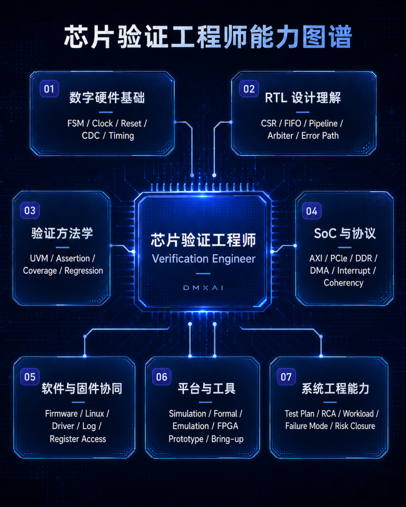

一、数字硬件基础

数字硬件基础直接决定了能不能理解设计行为，是验证工程师最基础的能力。FSM、Clock、Reset、CDC、Timing 这些概念，看起来基础，但很多真实 bug 最后都会回到这些问题上。如果缺少数字硬件基础，验证工程师可能只能看到 case fail，却很难判断问题到底是协议错误、状态机错误、时钟复位问题，还是环境建模问题。

## 1.1 RTL 设计理解

能不能把规格、波形和代码对应起来？验证工程师不一定每天写大量 RTL，但需要能读懂 RTL。这里的重点不是语法，而是理解设计结构。比如 CSR、FIFO、Pipeline、Arbiter、Error Path 这些模块，在真实设计中经常决定系统行为。

一个 DMA timeout，表面看是软件等不到完成信号；往下看，可能是 FIFO 没有出数，arbiter 没有授权，pipeline 中某一级 valid 没有传递，或者 error path 没有正确返回状态。这时验证工程师需要把几件事对应起来：

- 规格里说它应该怎么工作；
- 波形里实际发生了什么；
- RTL 代码为什么会走到这个状态？

## 1.2 验证方法学

能不能把风险变成可检查的工程任务？这考验的是验证手段，验证方法，验证效率，最终影响验证的质量。UVM、Assertion、Coverage、Regression 这些能力是验证工程师的核心专业能力。但它们的价值不在于“会不会用某个框架”，而在于能不能把设计风险拆解成：

- test plan；
- stimulus；
- checker；
- assertion；
- coverage point；
- regression case；
- Bug tracking

例如，验证一个 AXI 接口，不只是跑几个正常读写 case，而是要考虑 burst、alignment、outstanding transaction、backpressure、error response、reset in transaction 等场景。Coverage 也不是为了追求数字好看，而是为了回答：关键风险点有没有被系统性触达？

所以验证方法学体现的是：能不能把“不确定的设计风险”转化成可检查、可回归、可度量的验证任务。

## 1.3 SoC 与协议

## 1.4 能不能理解系统级交互？从 block-level 到 SoC-level，验证难度会明显上升。原因不是模块数量简单增加，而是模块之间的交互开始变得复杂。AXI、PCIe、DDR、DMA、Interrupt、Coherency 这些内容，往往是系统级问题的高发区域。

例如：

- DMA 搬运数据，涉及 memory map、cache coherency、interrupt 和 driver；
- PCIe 枚举失败，可能和 reset、clock、BAR 配置、firmware 初始化有关；
- DDR 带宽不足，可能不只是 controller 的问题，也可能和 NoC arbitration、QoS、访问模式有关。

所以 SoC 与协议能力体现的是：能不能从单个模块的正确性，进一步理解系统交互是否成立？

## 1.5 软件与固件协同

现代芯片验证里，软件越来越早进入验证流程。Firmware、Linux、Driver、Log、Register Access，不只是软件团队的事情。很多硬件问题，只有在真实软件路径下才会被触发。需要理解软件如何触发硬件问题。

例如：

- bootloader 初始化寄存器顺序不符合 RTL 假设；
- driver enable interrupt 的时机暴露了 pending bit 问题；
- device tree 配置错误导致地址空间访问异常；
- firmware 对某个状态位的理解和设计实现不一致；
- Linux log 里的 timeout，其实指向硬件状态机没有响应。

验证工程师不需要变成软件工程师，但需要知道软件如何配置硬件、启动硬件、观察硬件。所以，软件与固件协同能力体现的是：能不能理解硬件问题如何被软件路径触发。

## 1.6 平台与工具使用

Simulation、Formal、Emulation、FPGA Prototype、Bring-up， 每种工具和平台的使用对应不同层级的风险观察方式。

- RTL Simulation 适合协议细节、corner cases、assertions 和 coverage。
- Formal 适合状态空间、死锁、不变量和安全属性。
- Emulation 适合大规模 RTL、firmware、driver 和系统启动。
- FPGA Prototype 适合接近真实速度、真实 I/O、长时间 workload。
- Bring-up 面对真实硅片、真实板卡和真实物理环境。

所以平台与工具能力体现的是：能不能把不同验证平台连接成连续证据链，而不是孤立使用。

## 1.7 能不能从发现 bug 走向风险闭环并自我成长

系统工程能力是很多验证工程师后期成长的关键。Test Plan、RCA、Workload、Failure Mode、Risk Closure，这些能力决定了验证工作能不能从“发现一个 bug”走向“收敛一类风险”。例如，板子上发现一个 driver timeout，不能只修掉当前的 bug。还要继续追问：

- 这是单点问题，还是一类场景没有覆盖？
- 是否需要补 assertion？
- 是否需要补 coverage？
- 是否要把真实 driver sequence 抽象成 regression case？
- 是否暴露了 debug visibility 不足？
- 是否说明规格或架构假设需要调整？

所以系统工程能力体现的是：能不能把单个问题转化成可复用、可追踪、可闭环的工程经验。

遇到问题持续总结，学习，成长，将遇到过的问题沉淀成为自己的经验。以后再遇到类似的问题，可能就提前想到并处理，规避掉一些项目风险。这也是为什么工作经验值钱,期待每个验证工程师都能持续增值。

## 1.8 总结

芯片验证工程师的核心能力，不只是写 testbench，也不只是跑 simulation，而是把硬件、RTL、验证方法、SoC 协议、软件路径、平台工具和系统风险连接起来。

把复杂系统中的问题，转化成可检查、可复现、可回归、可闭环的工程证据。并实现自我成长，让自己升值。

---

# 2. 什么是上电复位POR以及为啥还需要专用的电源监控芯片？

> 来源：https://mp.weixin.qq.com/s/6qkt7BFZPNdLi06R-mE9Fw
> 作者：嵌入式电子学习
> update 2026/08/16 01 : 15
> 字数 3059，阅读大约需 16 分钟

## 2.1 POR（上电复位 Power-On Reset）

### 2.1.1 POR

#### 2.1.1.1 上电复位 Power-On Reset

- **本质目的**：电源电压从0慢慢爬升过程中，MCU/FPGA内核、寄存器、RAM状态是**随机不定态**。
- 电源刚上电，电压低于芯片最低工作电压时，逻辑单元电平不确定：寄存器可能随机0/1、总线冲突、外设乱启动、程序跑飞。
- [上电启动（2）：上电复位](https://mp.weixin.qq.com/s?__biz=MzYyNTA5OTU0Mw==&mid=2247483734&idx=1&sn=7142be1ebc301a88b91f8c704d221456&scene=21#wechat_redirect)

POR规则：

- 电源电压**低于复位阈值Vth+** → 强制拉复位（芯片保持复位状态，不运行程序）
- 电压缓慢上升，**超过阈值并且维持一段时间（对应POR输出的复位持续时间）** → **释放复位**，芯片开始正常启动、加载程序。
- **电源电压处于阈值电压以下时MCU一直处在复位状态**！


#### 2.1.1.2 下电复位（掉电复位BOR）

- **本质目的**：断电不是瞬间归零！很多场景电压缓慢跌落（电池耗尽、负载突变拉垮电源、插拔瞬间压降）。

如果电压慢慢掉到芯片最低工作电压之下，但**没有触发复位直接断电**：

- RAM、寄存器数据半截被改写、Flash正在写操作中途断电：**Flash数据损坏**；
- 下次上电芯片状态混乱，无法正常启动。

BOR/下电POR：电压下跌低于**负阈值Vth-**，立刻再次触发复位，**让芯片进入安全复位状态，防止器件在亚稳态区间无序工作**。

> 简单总结：
> 上电复位：**等电压足够高，再开机**
> 下电复位：**电压不够高的时候，立刻强制停机**

### 2.1.2 内部POR潜在风险

内部POR是芯片内置模拟电路，天生有短板：

#### 2.1.2.1 **阈值精度差**

- STM32、FPGA内置POR阈值是范围值，比如内置POR阈值可能1.8~2.4V区间浮动，批次差异、温度漂移大。

#### 2.1.2.2 **没有可调延时**

- 内置POR固定复位保持时间，不受外部控制。
- 系统有多芯片（MCU+FPGA+DDR+PHY）时，**电源先后上电、各芯片就绪时间不一致，时序无法匹配**。

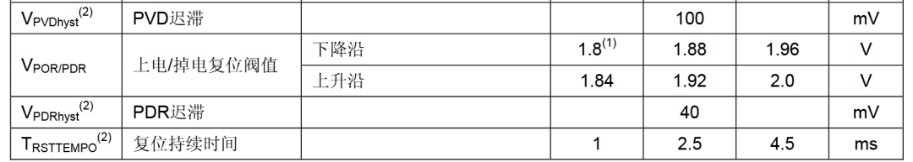

#### 2.1.2.3 **抗干扰弱**

电源存在尖峰、纹波、瞬时跌落：

- 瞬时电压短暂低于阈值又回升（迟滞区间不足） → 内部POR可能误触发复位；
- 或者**窄脉冲电压扰动时间太短，POR内部电路来不及响应 → 【最关键问题：漏复位！】**

##### 2.1.2.3.1 **会不会捕获不到阈值，导致无法复位？**

- POR模拟电路需要**建立时间**。如果电压快速跌落/快速上升，电压跨越阈值的持续时间极短，内部比较器来不及采样识别，复位信号不会产生。
- 典型场景：热插拔、电源瞬间抖动、浪涌、负载突增产生的短暂电压凹陷。

#### 2.1.2.4 **监控电压单一**

- 芯片内部POR只监控**主内核供电（比如3.3V）**。
- 系统有多路电源：1.0V内核、1.8V IO、2.5V PLL、DDR电源。内部POR看不到其他轨电压。某一路辅助电源失效，主电源正常，内部POR不会触发复位，系统照样异常。

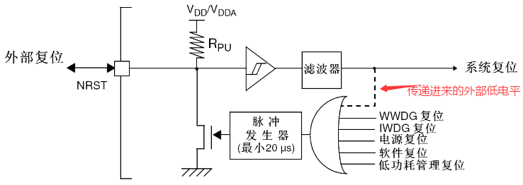

#### 2.1.2.5 **无法多器件同步复位**

- MCU内部POR只管自己，FPGA内部POR只管自己。两者上电快慢不同，一个先启动、一个后启动，通信时序错乱。

---

## 2.2 STM32 RC外部复位电路

经典电路：NRST引脚 → 上拉电阻R接到3.3V；电容C接到GND

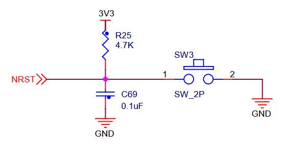

### 2.2.1 工作过程

1. **上电瞬间**：电容两端电压差值不能突变。上电时刻3.3V建立，电容初始电压=0V，NRST被电容拉低 → **持续复位**。
2. 电源稳定后，3.3V通过电阻R给电容C充电，电容电压指数上升；
3. 当NRST引脚电压上升超过芯片**复位释放阈值**，复位解除，STM32启动。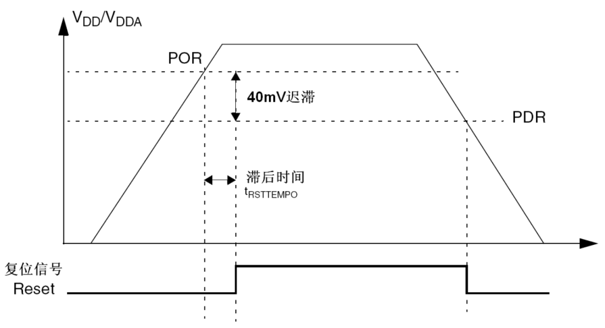

### 2.2.2 RC两个核心作用

#### 2.2.2.1 **产生复位延时（首要目的！）**

- 通过RC充电时间常数 τ=R*C，人为拉长\**低电平复位持续时间**。
- 内置POR延时很短，若电源上升斜率很陡，内置复位时间不够，RC延长复位保持时间，保证内部电路稳定后再启动。

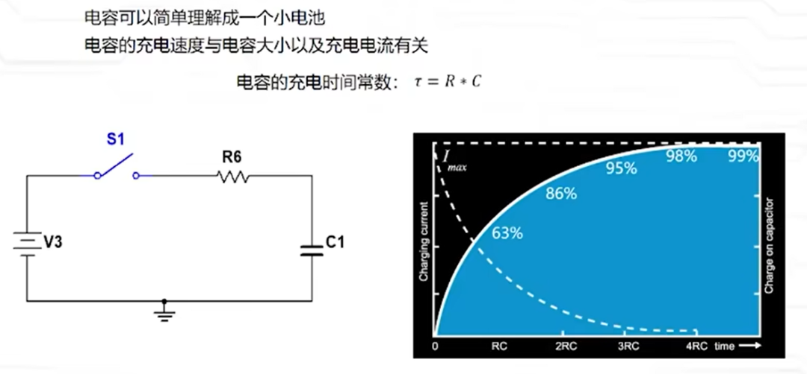

#### 2.2.2.2 **滤除高频干扰（次要）**

- 电源上电尖峰、空间电磁干扰，容易在NRST引脚上产生窄尖峰脉冲。电容抑制高频毛刺，防止**误复位**。

#### 2.2.2.3 常见误区纠正

- 错误：RC只是滤波
- 真相：**延时是核心，滤波是附加收益**

### 2.2.3 RC电路天生缺陷

1. 复位阈值完全由芯片内部决定，外部无法调整；
2. **无法监控电源电压！** RC电路只看上电时序，电压跌到2V还是3V，RC完全无感。电压跌落时RC不会自动产生复位； RC复位**只有上电复位能力，没有掉电监控BOR功能**！电源缓慢掉电场景完全失效；
3. 温漂、电容老化会改变延时；
4. 无法应对电压短暂跌落（电压掉下去又快速回升，RC不会触发二次复位）；
5. 不能同步给FPGA、其他外设提供统一复位信号。

> 结论：RC复位=低成本简易方案，适合小家电、简单单片机；复杂工业设备、带FPGA、高速接口、DDR的系统不够可靠。

## 2.3 为什么额外使用电源监控芯片（TPS3307这类）？

- TPS3307是典型**多路电压监控+独立POR+推挽复位输出**电源监控IC。
- **不是内部POR完全不能用，是内部POR满足不了复杂数字系统的时序与可靠性要求**。

### 2.3.1 外部电源监控芯片的独有能力

#### 2.3.1.1 精准、稳定的电压检测阈值

- TPS3307阈值由芯片内部带隙基准决定，精度高、温漂小。
- STM32内置POR阈值误差±几百mV，工业高低温环境下波动巨大。
- 可以设定：3.3V电源低于2.9V立刻触发复位，阈值严格可控。

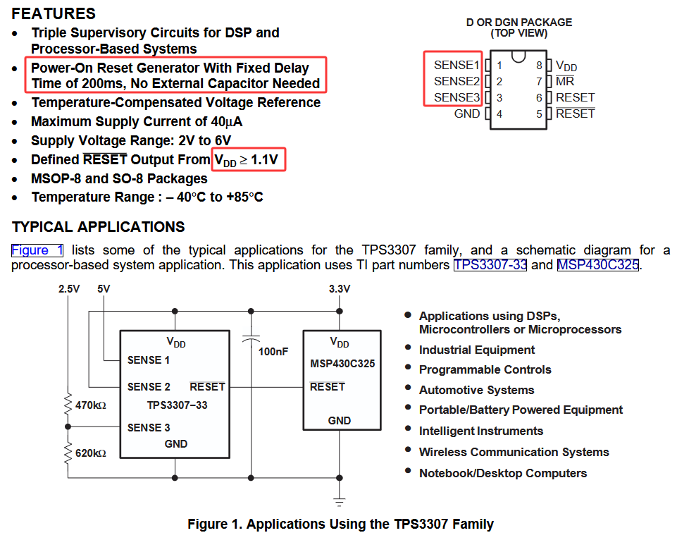

#### 2.3.1.2 独立可编程复位延时（解决多芯片时序）

- 监控芯片上电后，电压达标，**还会维持一段固定复位时间tRESET**，延时可选（ms级别）。

工程价值：

- 系统存在多级电源：先产生5V → 转换成3.3V → 1.8V → 1.0V内核电压。
- 各路电源建立有先后顺序。

需要：**所有电源轨全部稳定就绪之后，再释放全局复位**。

- MCU/FPGA不能某一路电源还没稳定就启动。
- 内置POR只能等待自身电压，不知道其他电源状态。
- **外部监控芯片可以配合多路监控，保证“全部电源就绪再开机”**。

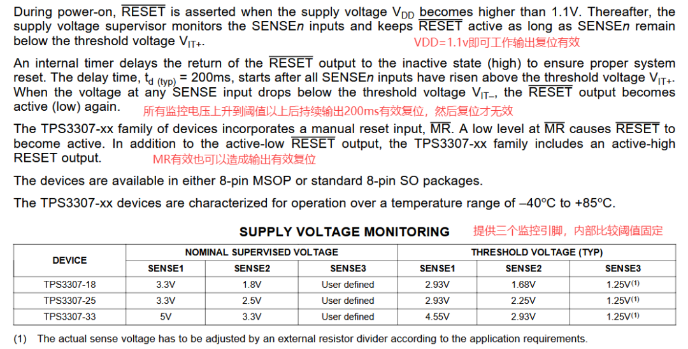

#### 2.3.1.3 同时实现【上电复位 + 掉电复位（BOR）】

- RC电路没有掉电检测！电压慢慢往下掉的时候无反应（除非MCU内部自带BOR）。

TPS3307持续实时监测电源：

- 电压高于阈值 → 复位释放
- 电压一旦跌破阈值 → **立刻拉低复位**，无论上电还是运行中跌落。
- 完美解决电压跌落、负载扰动导致的亚稳态运行。

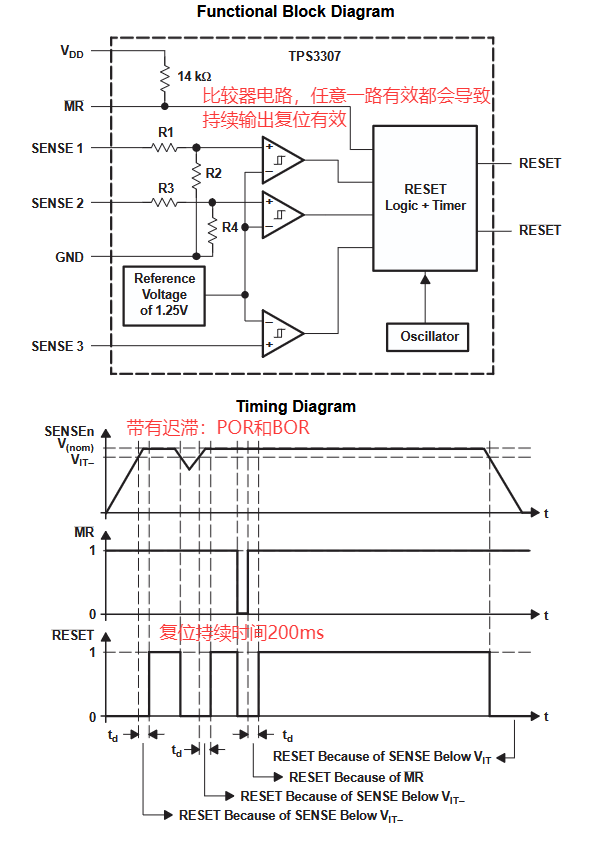

#### 2.3.1.4 全局统一复位源（MCU+FPGA+DDR+PHY时序同步）

这是大型硬件系统最核心需求：

- MCU有自己内部POR、FPGA也有内置POR。两者上电启动时间天生不同。

如果各自独立复位：

- FPGA先启动，等待MCU；
- 或者MCU先运行，FPGA还在复位，双方通信出错、FIFO溢出、总线异常。

解决方案：

- **使用TPS3307单一复位信号，同时驱动MCU NRST、FPGA nCONFIG、DDR复位引脚**。
- 所有器件**同时进入复位，同时释放复位**，全局时序对齐。

#### 2.3.1.5 多电源轨监控（TPS3307可同时监控2路/3路电压）

- FPGA系统常见：3.3V IO、1.2V内核、2.5V 辅助电源。
- 只要任意一路电压异常，立刻触发全局复位。
- 芯片内置POR只能监测单一供电，别的电源失效无法感知。

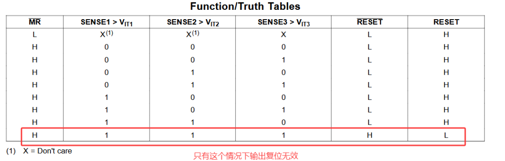

#### 2.3.1.6 强驱动复位信号，抗干扰

- 内置POR复位信号在芯片内部，外部引脚驱动能力有限；
- TPS3307推挽输出复位信号，可以驱动多个芯片复位引脚，不容易被干扰拉高/拉低；还能配合增加噪声滤波。

### 2.3.2 使用场景

- 低成本消费类简单MCU产品：单电源、无高速外设、无FPGA、无DDR → STM32内置POR + RC复位足够。
- 工业控制、通信设备、FPGA+MCU架构、带DDR、要求高稳定性、宽温工作、电源环境恶劣：必须外部电源监控芯片。

## 2.4 会不会出现无法捕获阈值、复位失效？

### 2.4.1 场景1：电压变化速率过快

- POR/BOR比较器需要一定响应时间。
- 电压快速跌落，短暂低于阈值几微秒立刻恢复；
- 内部模拟电路来不及响应 → **不产生复位，漏检**。

外部TPS3307同样有响应时间，但可以搭配：

- 合适的延时、输入端RC滤波，过滤短暂毛刺，同时保证持续电压跌落可靠识别。

### 2.4.2 场景2：迟滞电压（TPS3307自带，很多内置POR迟滞很小）

- 如果没有电压迟滞：电压在阈值附近小幅来回波动，复位反复震荡（不断复位、释放、复位）。

芯片设计增加迟滞：

- 上升阈值V+，下降阈值V-（V+ > V-）。
- TPS3307内置迟滞，避免阈值附近震荡；很多MCU内置POR迟滞宽度小，容易出现反复抖动。

### 2.4.3 场景3：电源上电斜率过缓

- 电压极其缓慢爬升，长时间徘徊在阈值附近，容易让内部模拟电路进入亚稳态，复位逻辑异常。外部监控芯片时序特性更稳定。

## 2.5 数字系统电源与时序设计

### 2.5.1 步骤1：梳理所有电源轨，明确上电顺序要求

- 哪些电源需要先建立？
- 内核电压还是IO电压？
- FPGA通常要求内核先于IO上电。

### 2.5.2 步骤2：明确需求清单

1. 是否需要上电复位？
2. 是否需要运行中电压跌落检测（BOR掉电复位）？
3. 芯片数量：是否同时存在MCU、FPGA、DDR、以太网PHY，是否需要**同步全局复位**？
4. 环境：常温消费产品 / 工业宽温、强电磁干扰？
5. 失效后果：只是重启，还是会造成设备误动作、数据损坏？

### 2.5.3 步骤3：复位方案选型对比

1. 仅芯片内置POR/BOR：最便宜，可靠性下限最低，无法多芯片同步，无多路电源监控
2. 内置POR + 外部RC复位：增加上电延时，无掉电监控，低成本折中方案
3. 专用电源监控芯片（TPS3307、MAX809、ADM705）：精准阈值、上电+掉电监控、可编程延时、全局复位输出，工业主流方案

### 2.5.4 步骤4：风险预判

- 电压抖动会不会漏复位？增加输入端RC滤波；
- 复位信号布线容易受干扰？复位线路短、远离高速信号线；
- 多个器件复位电平（高有效/低有效）不一致，增加电平转换；
- 上电延时是否满足所有电源稳定时间，预留裕量。

## 2.6 TPS3307总结

- TPS3307本质就是一块**独立、高精度、带时间延迟的电压比较器系统**。
- 它不和MCU/FPGA内部电路绑定，独立持续监测供电电压；一旦电压不合格，强制输出复位电平；电压达标后，等待预设时间再放开复位。
- 作用就是**把“电源合格”作为所有数字芯片启动的前置必要条件，统一所有器件启动时序，弥补MCU/FPGA内置POR精度不足、监控范围有限、无法多芯片同步的短板**。

## 2.7 常见问题

1. RC复位电路不要电容选太大！电容过大，上电复位时间太长；
2. 使用外部电源监控芯片时，MCU内部POR依然可以保留，形成双重保护；
3. FPGA特别依赖稳定复位，FPGA配置芯片、nCONFIG信号时序出错会导致无法加载程序，复杂FPGA项目几乎都会搭配外部电源监控。

---

# 3. 外设集成没人爱管，真正难的从来不是外设本身

> 来源：https://mp.weixin.qq.com/s/SC7SO59zxi-vbK6bDqTOQg
> 作者：make ic
> update 2026/08/16 03 : 03
## 3.1 真正难的从来不是外设本身

UART 有多难？波特率分频、起始位、停止位、奇偶校验，一个星期能验完。SPI、I2C、Timer、PWM 也一样，都是几十年的老协议，IP 厂商卖了上千次，内部 bug 早被市场清洗干净了。

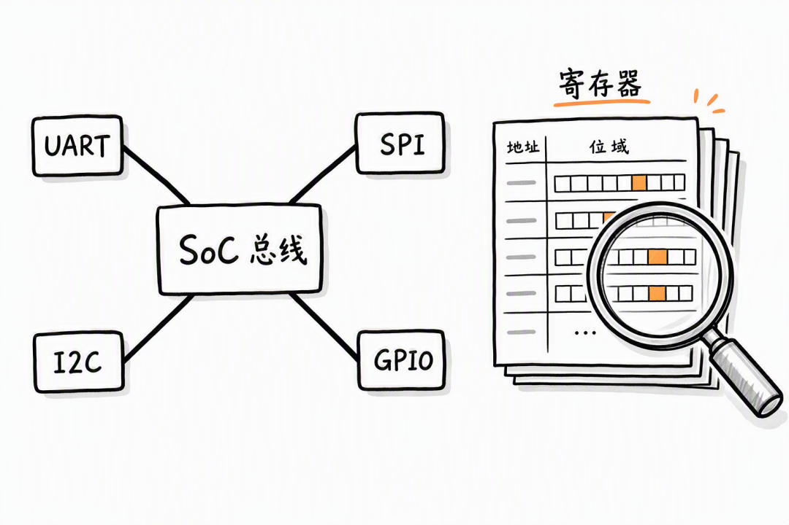

但每次 SoC 流片回来，出问题的清单上总有它们的名字。

**外设 IP 级验证和 SoC 级验证，验的是两件不同的事**。IP 级验的是协议行为，SoC 级验的是这个 IP 在这颗芯片里的连接关系、地址映射、时钟复位、中断路径、复用配置、低功耗行为。IP 厂商保证前者，后者只属于你。

工程上真正容易出错的地方，永远是接缝，而不是零件。

## 3.2 SoC 级验证该验什么，不该验什么

**SoC 级别再去跑一遍 UART 的协议一致性，是在浪费机器时间。**

SoC 级该盯的是这几件事：

- 地址译码有没有错，两个外设有没有踩到同一段空间
- 中断线接对了没有，PWM 的 fault 是不是接到了别人的输入
- 复位域交叉，异步复位释放顺序
- pinmux 复用后，SPI 的 MISO 是不是被 GPIO 抢走了

这些都不需要复杂的 sequence，需要的是**连接性和配置的全覆盖**。用连线检查（connectivity check）和形式化工具做，比写一堆定向用例靠谱得多，也快得多。

集成阶段最常见的翻车现场：某个信号在顶层被接成常量 0，仿真里毫无异常，因为没人激励过它。等到 FPGA 上板才发现，中断永远不来。

## 3.3 寄存器验证：最容易糊弄，也最容易反噬

寄存器验证有个特点，看起来最简单，因此最容易被草率对待。

标准做法是 UVM RAL，跑 `uvm_reg_hw_reset_seq`、`uvm_reg_bit_bash_seq`、`uvm_reg_access_seq`。三个 sequence 跑过，报告一片绿，sign off。

问题出在这里：**这三个 sequence 只能证明"寄存器模型和 RTL 一致"，证明不了"寄存器模型和 spec 一致"。**

如果 RAL 模型是从 RTL 反推手写的，那这个验证就变成了自己和自己对账。

唯一可靠的解法是**单一数据源**：spec（IP-XACT 或者 excel/yaml）自动生成 RTL、RAL 模型、C header、文档，四份产出同源。这从根上消除人工同步这个错误来源。这条路业界走了很多年，TI 在 DVCon 上就分享过 IP-XACT 到 UVM 寄存器模型的完整实践。

还有几类寄存器，标准 sequence 基本无能为力，得手工补：

`// 只读状态位、W1C 中断标志、shadow/lock 寄存器`

`// 写保护寄存器、side-effect 寄存器（读一下就清）`

`// 这些必须 set_compare(UVM_NO_CHECK) 后单独写用例`

尤其是 **W1C**（写 1 清零）的中断标志。它的行为依赖硬件的置位时机，标准访问测试跑过去只会得到一堆假通过。

另外 SoC 级用 RAL 有个现实：RAL 走的是前门访问，路径长、地址转换多，全片寄存器扫一遍可能要几小时。合理做法是 SoC 级只抽查关键寄存器和地址可达性，把全量 bit bash 留在 IP/子系统级完成。

## 3.4 一点系统层面的想法

外设验证的地位很尴尬。它不出彩，写在周报里没人夸；它出事，责任又落不到具体某个人身上，因为"IP 是买的""连线是集成组接的""寄存器表是设计给的"。

**验证工程师真正的价值，恰恰在这些没有明确责任人的地方。**

复杂系统的失效，很少来自某个模块被做得不够好，多数来自模块之间的假设没有对齐。DV 的职责就是把这些隐含假设逼出来，写成可执行的检查，让它在仿真里而不是在客户手里暴露。

至于"外设很简单"——它通常出自还没有被 pinmux 折磨过的人。

---

# 4. 软件同事说程序跑到一半跳到了一个谁都不认识的地址

> 来源：https://mp.weixin.qq.com/s/YMH_RcKZmfJ17xBkOoGihQ
> 作者：make ic
> update 2026/08/16 03 : 06
---

芯片回来了，软件同事说程序跑到一半跳到了一个谁都不认识的地址。

翻波形，翻代码，翻文档，最后发现问题出在一段**没人验证过的地址空间**——ITCM 的尾部越界之后，总线既没有报错，也没有返回数据，直接把 CPU 挂在那里等一个永远不会来的 ready。

这类问题不稀奇。SOC内存子系统的验证，最容易被当成"接口通了就算过"。

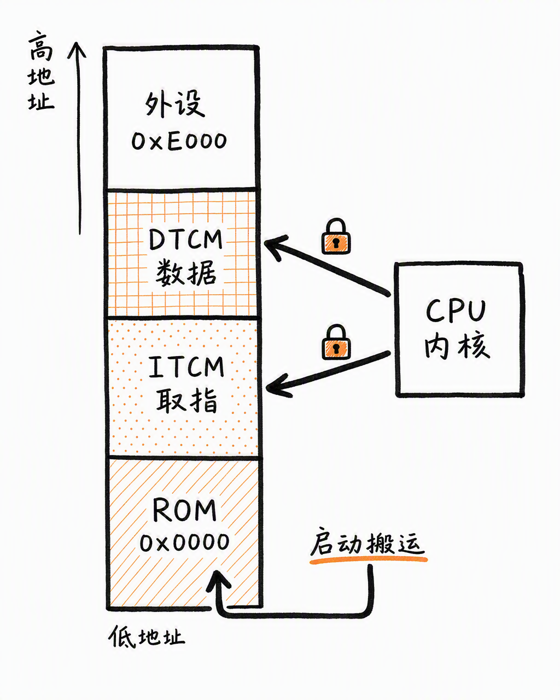

处理器发出的地址只是一串二进制位。它没有语义，没有属性，也不知道自己该去哪。

**是译码逻辑赋予它意义。**

ITCM、DTCM、ROM、外设寄存器，这些名字全部活在文档和译码器的比较逻辑里。

所以内存映射验证的第一个动作，从来不是跑一段程序看能不能启动，而是回答三个问题：

> **一、每一个地址落在哪个区间？**
>
> **二、落在两个区间之间的空洞里会怎样？**
>
> **三、落在区间里但权限不符会怎样？**

第三个问题最容易被跳过。

上电那一刻，TCM 里是随机值或者全零。CPU 必须从 ROM 取第一条指令。

搬运程序的这段代码，自己也得有地方跑。

这里有个经典的死锁式设计问题：**搬运 ITCM 的循环，能不能自己待在 ITCM 里？** 显然不能。它必须留在 ROM，还要在搬完之后小心地跳过去。而"跳过去"的那一拍，PC 值从 ROM 空间切到 ITCM 空间，流水线里可能还残留着按旧映射预取的指令。

## 4.1 验证环境该怎么搭

**别用 CPU 的行为反推内存系统对不对。**

CPU 是个太善良的测试者。它只会发出编译器生成的那些访问，规规矩矩，对齐良好。真实世界里的问题来自 DMA 抢占、非对齐访问、跨边界突发、以及调试器在 CPU 停住时的旁路读写。

这些都需要一个**独立的 bus agent** 直接怼在总线上，绕开处理器，按地址空间逐段扫描。扫描的目标是建立一张实际映射表，然后和文档里那张表做逐位对比。两张表不一致的地方，就是bug。

商业上也能看出内存子系统的分量。近两年在 AI 加速器和边缘推理芯片里，紧耦合存储的容量比例明显上升，因为搬数据的功耗已经超过算数据。这意味着 TCM 相关的设计只会更复杂，多 bank、多端口、带 ECC、带低功耗保持,每加一项，映射和权限的组合就翻一倍。

内存映射是芯片里少数**完全由人定义、没有物理约束的部分**。想怎么划就怎么划。

正因为自由，它才容易错。

物理上不成立的东西还有EDA工具拦住，逻辑上不合理的地址划分，没有任何工具会替你把关。

一份靠谱的内存子系统验证，最终交付的东西是一张经过实测确认的地址表。它比任何覆盖率数字都有说服力，因为它回答的是软件同事真正会问的那个问题：这个地址，我能不能碰。

---

# 5. 分层验证后仿思路

> 来源：https://mp.weixin.qq.com/s/wIjtzKYp8Rg9R1lq3InN-A
> update 2026/08/16 03 : 29

不像RTL功能仿真，后仿，特别是带SDF的PR网表仿真，我们很难避免的问题就是仿真效率。大型AI芯片，动辄几百亿门的规模，想让后仿跑起来，并能充分验证，达到signoff的标准，就不得不采取层次化后仿的思路。

从RTL功能仿真（前仿）的层次划分来看，有UT、IT、ST的验证分类，那么最朴素的想法，我们也按照UT、IT、ST的层次划分对应去做后仿真。是否可行呢，需要先澄清下面几个问题：

1.为什么我们最先想要按照前仿的划分来做？这个很朴素，前仿环境可以直接复用，用例可能也不需要怎么修改就可直接复用，这样对后仿验证来说，工作量最小。很直观的理由，但不一定可行。

2.前仿层次和后仿层次是否对应？以目前的项目经验来看，后仿的harden层次结构和前仿层次差异很大，且基本上无法对齐。这主要取决于以下几点：前仿UT、IT的分割主要基于功能完整性、验证可行性的角度进行分割；而后仿harden层次结构的分割主要受到后端时序、面积、布局布线的影响，某一harden可能包含多个UT，甚至只包含其中的某一部分。这带来的问题是，除非你基于harden层级再重做一套匹配的验证环境，测试用例，否则基于harden层次的后仿验证就无法开展。

3.可否基于ST网表来做signoff？显然不行，仿真效率慢的无法接受。目前项目中，一个冒烟soc前仿用例时间（不做任何后门加速）可能需要2天左右，以最保守的时间来评估，那后仿也需要40天左右的时间。这还只是一条用例，想做完整的signoff，整体时间无法接受。

既然存在上述的一些问题，那么后仿可选的方案就很有限了：要么基于UT、IT层次的网表来做；要么就仅基于IT层次的网表来做。

这里分析一下是否基于UT层次做后仿这件事。首先上面提到的1. 后端不会提供每个前仿UT的harden网表给你去做后仿。2. 全片接近100个UT，全做UT后仿，人力资源也吃不消。3. UT后仿的大部分场景可以直接在IT后仿中进行覆盖，且时间可接受。

倒是也不是说UT就完全不用考虑，对于一些复杂的异步、数模混合模块，在有时间、人力的情况下也可以考虑做一做。

那么现在可选的也只剩用IT层次网表来做后仿了。但也存在几个问题需要解决：

1.IT前仿环境和IT harden层次（soc-1层）网表不匹配，无法直接复用。针对这种情况，我们选择直接在soc rtl中，替换部分harden网表，其他harden依旧是rtl代码。这样，使用soc环境，通过libmap即可完成环境适配，仿真时间也在可接受的范围内。

2.那如果我们刚好有和harden层级匹配的IT前仿环境呢？显然直接使用IT前仿环境是更好的选择，毕竟通过soc部分替换的策略，只是因为harden网表不匹配的无赖之举。

3.现在所有soc-1的harden层级都有了其验证归属，那soc呢，难道就真的不需要了么？也没那么绝对，soc全片的时钟、复位、低功耗绝对是后仿的重点内容，这些内容在soc-1的harden层级中很难验证到。所以，如果外部条件允许，我们需要裁剪一个后端能做的、后仿能跑的soc简化架构，保留时钟、复位主体框架，并在此网表下做基础功能验证。

---

# 6. PR后仿流程

> 来源：https://mp.weixin.qq.com/s/8eNXre6rw-BQUHNCY5WVLA
> update 2026/08/16 03 : 38

本文谈一下PR网表（带sdf反标）的后仿流程。

1.网表文件准备。设计提供给你的PR网表压缩包，打开看看，和设计确认一下网表类型，是PR网表、还是PR网表+UPF、还是PG网表。一般说来，单纯功能仿真使用PR网表就可以，如果涉及到不同电源域的低功耗验证，就需要PR网表+UPF，如果需要功耗验证，最好选择PG网表。

2.三级同步器第一级触发器的屏蔽文件准备。第一级触发器在后仿过程中，一定是报时序违例，但它是无害的，需要屏蔽，否则影响timing violation检查与收敛。具体操作方法就是让ai写个脚本，帮你提取网表文件中所有三级触发器的（带dff3后缀）第一级触发器的实例路径。然后基于vcs支持的格式 instance {path}{noTiming}；生成屏蔽文件，后面仿真脚本中会用。

3.Sram复位。Sram不是仿真加载进去后就可以用的，需要通过force的方式，在仿真前进行复位与解复位。方法和触发器屏蔽类似，让ai写个脚本，提取网表文件中所有sram的实例路径（一般sram命名都是sadr\sasr\sass等开头，看看sram命名就知道了），force sram的RSCRST信号，先force为0， 再force为1，再release。有时候在网表中RSCRST信号会和其他信号关联起来，这个时候就不能force sram接口上的RSCRST，就需要往sram中找一级，force它。

4.SDF文件准备。先确认后仿signoff的corner选择，一般选择三个corner，TT、SS、FF，对应选择不同工艺、温度、电压。这块是和后端一起确认的，后仿过程中，只需要打开SDF文件，在文件开头部分，会提供当前SDF的corner信息，确认与约定的corner参数一致。

5.单元库的准备。分为两个部分，1. 各种非sram的cell，以及sram。其中非sram的cell，主要包括各种类型的逻辑门、以及缓冲器，触发器，加法器等。这些类型通常可以通过cell命名规则中看出来。Sram就不太一样了。前仿过程中，我们也用sram，但是用的是sram的fast\_func模型（在命名上有fast\_func后缀），后仿过程中要将其替换为指定corner下的，带时序检查的sram模型。如果不知道路径，直接找设计、或者后端要。

6.加入后仿仿真参数以及必要的文件加载（基于VCS）。因为后仿环境一般都是继承前仿环境而来，所以需要在仿真命令中加入后仿相关参数（编译参数）。主要有：

(1)后仿真参数，+neg\_tchk, -negdelay, -sdfretain, -sdfverbose，具体含义自己查一查。

(2)Sdf加载：-sdf max:test:sdf\_path，这里test是我们的模块名，sdf\_path是对应的sdf文件路径。需要说一下的是max需要和用于setup检查的sdf匹配，min需要和用于hold检查的sdf匹配。

(3)无复位端寄存器初始化：编译参数加+vcs+initreg+random, 仿真参数加+vcs+initreg+0。

(4)Cell单元的debug功能，最好打开对cell单元的波形debug功能，后仿的时候用得到，-debug\_region+cell+encrypt。

(5)三级同步器的第一级触发器时序检查屏蔽：+optconfigfile+mask\_file, 其中mask\_file是符合vcs要求的触发器屏蔽代码。

(6)网表文件替换：rtl文件替换成网表文件，这个简单，但如果是在在rtl代码中局部替换部分harden为网表，就需要使用vcs的libmap功能。搜索一下，也很简单。

(7)Sram和标准单元路径加载：上面找到了对应的路径，这里当作普通文件吃进去就好了。

---

# 7. 什么是芯片 Bring-up

> 来源：https://mp.weixin.qq.com/s/3zGSqLRCBnhgqDYyaJ6Etw
> 作者：DMXAI
> update 2026/08/16 03 : 40

芯片 Bring-up 是 Tapeout 之后，团队基于真实硅片、封装、板卡和底层软件，完成首次系统启动、状态确认和故障定位的过程。它的目标不是立即证明芯片完全正确，而是先建立一个可供控制、观察和继续验证的基础环境。

## 7.1 Bring-up 发生在什么阶段？

芯片研发通常会经历架构定义、RTL 设计、流片前验证、综合实现、物理设计、Tapeout、晶圆制造、封装测试、板级集成、硅后验证和量产导入。Bring-up 发生在芯片回片早期。此时团队面对的已经不是仿真模型、Emulation 平台或 FPGA Prototype，而是真实硅片。

在仿真环境中，工程师可以查看大量内部波形，逐拍分析信号变化。FPGA Prototype 能够提前运行部分系统路径和软件栈，但在频率、电气特性、PHY、功耗和工艺行为上，仍然与真实芯片存在明显差异。到了 Bring-up 阶段，设计假设会第一次同时受到真实物理条件的检验。电源质量、参考时钟、封装连接、PCB、温度、噪声、工艺偏差和软件初始化顺序，都可能影响芯片是否能够正常启动。

## 7.2 Bring-up 和其他验证活动有什么区别？

芯片项目中，流片前验证、FPGA Prototype、Bring-up、硅后验证和量产测试经常被放在一起讨论，但它们关注的问题并不相同。

| 活动 | 典型阶段 | 主要回答的问题 |
| --- | --- | --- |
| 流片前验证 | Tapeout 前 | RTL 和 SoC 实现是否符合规格 |
| FPGA Prototype / Emulation | Tapeout 前 | 软件栈和系统路径能否提前运行 |
| Bring-up | 回片早期 | 真实芯片能否进入可控、可观察、可运行状态 |
| 硅后验证 | 回片后 | 芯片的功能、性能、功耗、兼容性和可靠性是否达到目标 |
| 量产测试 | 流片前规划和开发，晶圆测试、封装测试和量产阶段使用 | 如何快速、稳定地筛选芯片，并控制覆盖率、良率和测试成本 |

Bring-up 通常是硅后验证的起点。它不会一开始就覆盖所有性能和可靠性指标，而是先打通继续验证所需的基础条件。如果 JTAG 无法访问、BootROM 没有执行、片上 SRAM 不可用，或者 DDR 初始化完全失败，后续的接口验证、性能测试和系统软件调试都无法正常展开。不同公司的流程划分可能略有差异，但 Bring-up 的核心任务基本一致：先让真实芯片进入一个可以继续工作的状态。此文DMXAI芯片验证原创，未授权转发。

## 7.3 Bring-up 通常怎样展开？

真实项目中的 Bring-up 很少完全按照流程图推进，但整体上都会遵循一条相似的主线：从风险最低、最容易观察的部分开始，逐步建立对芯片状态的信任。

### 7.3.1 确认电源和板级状态

Bring-up 通常从电源开始。工程师需要检查各条电源轨的电压、上电顺序和电流曲线，观察是否存在异常漏电、短路或局部过热。这个阶段常用到电源分析仪、万用表、示波器和板级控制脚本。

在确认基本状态之前，团队通常不会直接让芯片进入全速运行。先在受控条件下观察电流、温度和复位状态，可以降低损坏芯片或板卡的风险。

### 7.3.2 检查时钟和复位

电源状态基本可信后，下一步通常是确认参考时钟、PLL 和复位流程。PLL 是否锁定，复位是否在正确条件下释放，各个时钟域是否进入预期状态，都会影响芯片能否执行第一条有效指令。很多看起来像软件卡死的问题，最后会回到时钟或复位上。例如某个电源域尚未稳定，相关模块的复位却已经解除；或者参考时钟出现抖动，导致 PLL 偶发失锁。

### 7.3.3 打通调试入口

JTAG、SWD、UART 和 trace 接口是 Bring-up 阶段最重要的入口。JTAG 无法连接时，问题未必出在 TAP 控制器本身。电源域、复位、管脚复用、板级连接和安全配置都需要排查。一旦调试入口可用，团队就可以读取芯片 ID、检查状态寄存器、访问片上存储，并逐步确认芯片内部已经运行到哪个阶段。

### 7.3.4 建立最小执行路径

调试入口可用后，下一步是确认 BootROM、片上 SRAM 和最小固件是否能够执行。启动模式是否正确，strap 或 eFuse 配置是否生效，异常向量是否有效，片上存储能否读写，这些问题共同决定芯片能否从静态硬件状态进入软件控制状态。

串口打印出第一行日志，通常是一个重要节点，但距离完整启动还很远。它至少说明处理器、部分时钟、复位、存储和 UART 路径已经具备基本工作条件。

### 7.3.5 打通启动介质、DDR 和基础外设

最小代码能够执行后，团队才会进一步处理片外 Flash、DDR 或 HBM、内存映射、中断控制器和基础外设。DDR training 通过并不代表存储子系统已经完全稳定。后续还要验证不同地址范围、访问宽度、突发传输、DMA、缓存一致性和长时间压力。GPIO、I2C、SPI、UART、timer 等基础外设通常会较早进入测试，因为它们可以帮助团队建立更多观测和控制手段。此文DMXAI芯片验证原创，未授权转发。

### 7.3.6 启动系统软件和关键数据路径

基础硬件路径稳定后，Bring-up 才会逐步进入 bootloader、RTOS 或 Linux 阶段。此时需要确认 device tree、内存映射、中断路由、驱动初始化和固件配置是否与真实硬件一致。之后再逐步打开 PCIe、Ethernet、USB、MIPI、SerDes、NPU、DSP 或视频处理链路等关键模块。

Bring-up 不要求所有模块一次性全部工作。更常见的做法是逐项启用，每增加一个子系统，就确认它没有破坏此前已经稳定的路径。

## 7.4 为什么 Bring-up 难？

Bring-up 最麻烦的地方，是一个简单现象可能对应完全不同的根因。例如：串口没有输出，可能是 BootROM 根本没有执行，也可能是时钟或复位异常，还可能只是管脚复用、波特率或板级连接配置错误。

在仿真环境中，这些状态通常可以通过波形区分；真实芯片默认没有这样的可见性。工程师只能依赖电流变化、JTAG 状态、启动进度码、错误寄存器和有限的 trace，一层层缩小范围。

问题跨层也是常态。PCIe 无法枚举时，根因可能来自控制器状态机、SerDes、参考时钟、复位、寄存器配置或主机兼容性。DDR training 失败，也可能与 PHY 参数、板级走线、供电、温度、固件配置和初始化顺序有关。这类问题很难由单个团队独立闭环。硬件、验证、固件、驱动、板级、封装、电源和测试团队通常需要同时参与。

另一个难点是问题不一定稳定复现。有些故障只会在特定电压、温度、频率或负载下出现；有些问题与上电间隔、初始化顺序或前一次运行状态有关。跑通一次只能说明在某次条件下成功，不能说明路径已经稳定。

因此，Bring-up 不只追求“能跑”，还要建立可复现、可记录、可解释的证据链。

## 7.5 Bring-up 的准备工作要在回片前完成

Bring-up 虽然发生在回片后，但调试能力往往在芯片设计阶段就已经决定。如果芯片缺少状态寄存器、错误记录、启动进度码、恢复模式和关键路径的观测能力，那么回片后即使问题出现，团队也很难快速判断故障范围。

### 7.5.1 可观测性

- 关键模块的状态寄存器；
- sticky error bit 和错误码；
- BootROM 和固件启动进度码；
- trace、事件计数器和性能计数器；
- 总线错误、中断状态和超时记录。

### 7.5.2 可控制性

- 安全启动模式和恢复模式；
- 最小启动路径；
- 对时钟、复位和电源域的调试控制；
- 可选择的启动介质和启动配置；
- 可在异常状态下保留的诊断信息。

### 7.5.3 测试与诊断能力

- MBIST、LBIST、scan 等 DFT 机制；
- 固件诊断接口和寄存器访问工具；
- 板级自动化脚本；
- 可复用的启动测试；
- 日志收集和结果归档机制。

这些能力平时并不显眼，回片后却直接决定问题是几小时收敛，还是几周都停留在猜测阶段。

一个有效的调试设计，能够把“系统不工作”缩小为“某个电源域未进入状态”“某条总线访问超时”“某个启动阶段没有完成”或“某个 IP 报告协议错误”。范围缩小，才是真正的调试效率。

## 7.6 FPGA Prototype 能提前暴露哪些问题？

FPGA Prototype 无法复现真实硅片的 PLL、SerDes、DDR PHY、功耗、工艺和封装效应，但可以提前打通大量软件与系统路径。在回片前，团队可以通过原型平台验证：

- 启动流程是否完整；
- 固件和驱动对寄存器模型的理解是否正确；
- 中断、DMA 和内存映射是否能够跑通；
- Linux bring-up 是否存在明显阻塞；
- 基础运行负载是否能够执行；
- 日志格式、调试脚本和诊断工具是否可用。

这些工作不能消除真实硅片风险，但可以减少 Bring-up 阶段同时存在的未知数。如果启动流程、驱动初始化和基础软件路径已经在 FPGA Prototype 上跑通过，回片后遇到问题时，团队可以优先排查真实硅片特有的电气、时钟、PHY、封装和板级因素，而不必重新从整个软件栈开始怀疑。

最后总结一下，芯片 Bring-up 是在回片早期围绕真实硅片、板卡和底层软件展开的首次系统启动与故障定位。它通常从电源、时钟和复位开始，随后打通调试入口、最小执行路径、存储、基础外设、操作系统和关键数据链路。每完成一个阶段，团队就多一组可信状态，也能把后续问题限制在更小的范围内。

Bring-up 暴露的不只有 RTL 缺陷。电源、时钟、封装、PCB、固件、驱动、验证覆盖和调试规划，都可能在这个阶段接受检验。一次 Bring-up 的结果也会反过来影响下一版芯片：哪些状态需要增加观测点，哪些启动步骤需要加入进度码，哪些软件和系统路径应该提前放到 FPGA Prototype 上验证。

芯片能跑起来，只是第一步。能够稳定复现问题、快速缩小范围，并为后续硅后验证和软件开发提供可靠环境，才说明 Bring-up 真正取得了进展。

---

# 8. 【验证专项】寄存器专项测试

> 来源：https://mp.weixin.qq.com/s/7OlZxLRCNamOKvddR2BbqQ
> update 2026/08/16 14 : 46

## 8.1 寄存器复位值测试

- 最优测试方案

  全局/模块复位后，通过总线前门遍历读取所有寄存器，与Spec标准复位值逐一对标校验。

- 覆盖范围

  异步复位、同步复位、断电保持寄存器初值；杜绝上电随机X态、复位值异常、寄存器初始化错误问题。

## 8.2 寄存器属性测试

- 最优测试方案

  摒弃冗余随机激励，采用**固定极值特征图案**高效全覆盖：全0、全1、0x55/0xAA交替图案、单bit行走图案。针对性校验所有寄存器字段属性：

  1. RW读写字段：正常读写、字段掩码有效、无越权修改。
  2. RO只读字段：软件写无效，数值保持不变。
  3. 特殊控制位：W1C/W0C/W1S/W1T标准语义校验。
  4. Reserved保留位：写忽略、读符合Spec定义。

- 覆盖范围

  寄存器字段功能异常、掩码失效、保留位可篡改、特殊位动作逻辑错误、读写权限异常。

## 8.3 地址粘连测试

- 最优高效组合方案（提速+全覆盖无漏测）

  **March C- 9步三九算法**工业通用最优方案，兼顾效率与全覆盖，无需11步冗余校验，完整覆盖：单/多地址线桥接短路、地址译码重叠、跨地址误写污染、双向时序敏感地址故障。

- 覆盖范围

  地址线单bit粘连、多线桥接短路、地址译码冲突、地址双向访问时序故障、总线地址误选通污染。

## 8.4 数据粘连测试

- 最优测试方案

  **March C- 9步三九算法**（寄存器数据粘连唯一高效全覆盖用例）

  通过升序+降序双向遍历、多轮0/1互补读写翻转，强制激活寄存器数据位所有电平状态，100%检出**数据位stuck0/stuck1固定粘连故障**。

- 关键区分

  棋盘、行走位、普通遍历**不覆盖数据粘连**，仅March系列算法可同时覆盖地址+数据双粘连故障。

- 覆盖范围

  寄存器DFF数据位固定0、固定1卡死，数据存储单元失效，读写数据固化异常。

## 8.5 地址边界测试

- 最优测试方案

  仅测试**核心边界地址**，摒弃无效冗余地址，最高效覆盖边界风险：首地址、末地址、跨4K边界、字对齐/非对齐边界、寄存器块偏移极值地址。

  对边界地址执行标准读写+0/1极值翻转校验，搭配非法边界地址访问校验总线响应。

- 覆盖范围

  边界地址译码失效、边界地址读写异常、跨边界地址串扰、非对齐边界访问报错异常、非法边界地址污染有效寄存器。

## 8.6 全地址遍历测试

- 最优测试方案

  采用**分层轻量化遍历**，拒绝无脑全量遍历耗时（选择遍历地址页签和边界）：

  1. 日常回归：基础全地址遍历+棋盘预筛，快速确认所有地址可达性；
  2. 版本签核：基于March C- 9步完成全地址遍历校验，一举兼顾可达性、地址粘连、数据粘连，无需重复遍历。

- 覆盖范围

     所有寄存器地址映射有效性、死地址、未绑定地址、地址遗漏、单地址通路失效问题。

---

# 9. [验证专项][UPF 功耗仿真]UPF 功耗仿真原理通俗版讲解

> 来源：https://mp.weixin.qq.com/s/OgIwO_7oTdp9KEwmW1ss7w
> update 2026/08/16 23 : 00

## 9.1 先搞懂普通仿真的问题

普通 Verilog/SV 仿真，相当于默认**整个芯片全程一直通电、电压不变、永远正常工作**：

- 不管真实芯片会不会关掉某块模块电源、进入睡眠，仿真里这块模块也一直在跑，信号都是正常 0/1。
- 不知道断电后电路会浮空、产生未知信号 X，也不知道隔离 / 保持寄存器的特殊行为。
- 没法验证睡眠唤醒会不会出错、会不会把坏信号扩散到整个芯片，也没法算出真实功耗。
- UPF 就是一份单独的 Tcl 说明书：告诉 EDA 仿真软件 —— 芯片电源是怎么划分、怎么开关、怎么防 X 污染、怎么保存状态、有哪些合法供电模式。

## 9.2 UPF 核心作用：给仿真器加上「电源模型」

第一步：划分电源区域 UPF 用`create_power_domain`把芯片分成好几块区域：

- 常电区域（AON）：比如电源管理电路、隔离单元、备份保持寄存器，永远有电，全程正常工作。
- 可断电区域：比如 UART、外设模块，可以整体关掉主电源省电 同时画出对应的电源线（supply net），还有专门给备份寄存器用的常电电源线。

第二步：加电源开关模型`create_power_switch`定义睡眠控制信号（sleep\_en）：

- sleep\_en=0：可断电区域正常供电，信号正常 0/1，正常运行。
- sleep\_en=1：可断电区域主电源关掉 → 仿真器把这个区域内部信号标记为 **X 未知态（模拟真实浮空 / 失效状态）。**

第三步：隔离单元模型（防 X 扩散）`set_isolation`配置常电隔离单元和隔离使能信号 iso\_en：

- 正常模式：隔离关闭，信号正常互通。
- 准备断电前：打开隔离，强制把可断电区域对外输出信号固定成 0/1，不让内部 X 信号跑到主芯片里污染正常电路。
- 关键点：隔离单元放在常电区域，本身不会跟着外设一起断电，持续生效。

第四步：保持寄存器模型（保存关键数据）`set_retention`配置常电备份寄存器和保存信号 ret\_save：

- 断电前：把主寄存器数据复制到常电备份寄存器。
- 主域断电：主寄存器变成 X，备份寄存器由常电持续供电、保留原有数据。
- 上电唤醒：把备份数据恢复回主寄存器，恢复原来状态，避免数据丢失、重头初始化。

第五步：电源状态表 PST

add\_power\_state定义合法供电模式（正常 1V、睡眠低压、深度断电 0V） 仿真器会监控电源跳转，不允许出现非法电压 / 非法上电顺序，避免模拟芯片硬件损坏风险。

## 9.3 功耗统计原理

- 动态功耗：仿真记录每根信号翻转的时刻和频率，结合工艺库参数，算出开关翻转消耗的功耗。
- 静态漏功耗：根据当前电源模式（正常 / 睡眠 / 断电）和单元漏电模型，计算晶体管漏电功耗。
- 睡眠模式下大部分模块断电，漏功耗显著下降，和真实芯片省电行为保持一致。

## 9.4 PA 功耗仿真整体运行机制

- 仿真器同时载入：原始 RTL / 网表 + UPF 功耗规则 + 标准单元库模型。
- 正常运行时：和普通仿真一样跑逻辑。
- 进入睡眠流程：按 UPF 规则先开隔离、保存状态、再关闭子域电源，子域内部信号变为 X、隔离挡住 X 扩散、备份寄存器保存状态。
- 唤醒流程：子域重新上电、恢复备份状态、确认稳定后关闭隔离，恢复正常通信。
- 全程校验时序和电源跳转规则，同时统计整体功耗。
- 和纯功能仿真最大区别：**仿真器感知电源状态变化，真实模拟断电 X 行为、隔离钳位、状态备份恢复和功耗变化，不再默认全芯片永久上电。**

## 9.5 一句话总结

         UPF 功耗仿真 = **用 UPF 脚本教会仿真软件识别芯片的多电源架构和低功耗策略，模拟模块断电浮空 (X)、隔离防污染、保持存状态、睡眠省电的真实行为，同时算功耗，验证低功耗流程是否正确**，不再跑一个 “永远满电” 的假仿真。

---

# 10. SOC验证总纲怎么写：从边界、内容到准出的完整方法

> 来源：https://mp.weixin.qq.com/s/I5YMvM10wgMS_aoxdA71mg
> update 2026/08/17 23 : 21

SOC VERIFICATION


从验证边界、内容分解、技术策略，到质量证据与准出结论

很多SOC验证方案看起来内容很全，但读完后仍然回答不了三个问题：到底验证什么？采用什么方法验证？最后凭什么证明已经验证充分？

造成这种情况的根本原因，往往不是验证内容不够多，而是文档没有建立一条完整的逻辑主线：有的方案偏重交付流程，有的方案堆叠功能清单，还有的方案混合了UT、IT、软件测试和SOC验证的职责，最终导致范围重复、证据分散、准出标准难以执行。

> 一份合格的SOC验证总纲，不是用例清单，也不是项目管理流程。它应该是一套从验证边界、内容分解、技术策略到质量证据和准出结论的顶层规则。

本文给出一种适用于一般SOC项目的验证总纲框架。它不展开模块级UT和子系统级IT的详细功能，也不代替具体项目的实施方案，而是回答SOC验证最核心的“What—How—Proof”三个问题。

## 10.1 先明确：SOC验证总纲到底解决什么问题

SOC验证总纲首先是一份顶层基线文件，用于统一验证范围、内容分类、技术原则和质量要求。

它需要回答三个层次的问题：

1. **验证什么**

   ：哪些功能和风险必须在SOC层验证，哪些由UT、IT或软件测试负责。
2. **怎么验证**

   ：如何组织场景，如何选择前仿、形式化、性能验证、EMU和门级后仿等技术手段。
3. **如何证明充分**

   ：如何通过需求追溯、执行结果、Top层Toggle、缺陷闭环、风险评估和专项签核形成准出证据。

这三部分可以形成一条完整闭环：

```
芯片需求与架构风险
        ↓
定义SOC验证对象和层级边界
        ↓
选择验证方法并构建场景体系
        ↓
形成追溯、Toggle、缺陷和专项证据
        ↓
依据准出标准形成验证结论
        ↓
反向检查需求遗漏和剩余风险
```

总纲只规定“必须做什么”和“用什么原则证明”，具体Master—Target通路、配置组合、验证点、VFL和Case，则应在项目实施方案及专项方案中继续细化。

## 10.2 SOC验证目标为什么可以分成五类

SOC验证的最终目标，是证明芯片完成全片集成后，在支持的配置和工作模式下，能够正确启动、执行硬件任务、访问本地及远端资源、处理并发和异常，并满足数据完整性、稳定性、可调试性、时序及性能要求。

为了让这个目标可分析、可映射，可以按照“从静态结构到动态行为、从正常功能到异常与实现约束”的逻辑分成五类。

### 10.2.1 集成结构正确性

确认顶层连接、地址映射、接口配置、时钟复位及全局控制符合架构定义。这是SOC能够正常运行的结构基础。

### 10.2.2 基础功能路径正确性

确认芯片能够正常启动，各类SOC级基本硬件能力，以及Master到Target的端到端通路能够独立正确工作。

### 10.2.3 组合与并发正确性

确认多项基础能力组合后，多Master、多子系统、多Die或多Chip在并发、竞争、同步和反压条件下仍然正确。

### 10.2.4 异常可控与恢复正确性

确认错误能够被检测、定位、隔离和上报，并按照规格恢复、重新开工或安全退出，避免静默数据污染。

### 10.2.5 非功能约束与实现正确性

确认关键功能在带宽、时延、吞吐、功耗和门级时序等约束下满足签核要求。

需要注意，这五类是质量结论的五个观察视角，并不是五组互斥功能。同一项跨Die访存能力，可能同时提供连接性、基础通路、并发、异常恢复和性能证据。最终是否完备，不能只看分类名称，而要通过需求追溯确认每项SOC需求都有对应的验证内容和签核证据。

## 10.3 SOC验证边界应该如何确定

SOC层重点覆盖只有在全芯片集成后才能充分验证的内容。一个验证对象满足以下任一条件时，通常应纳入SOC验证范围：

- 只有完成SOC顶层连接和配置后，才能观察或证明其正确性；
- 跨越子系统、Die、Chip或外部接口边界，存在端到端控制流、数据流或状态依赖；
- 涉及地址空间、权限、一致性、时钟复位、共享资源或错误处理等全局规则；
- 属于芯片启动、硬件任务执行、并发协同或异常恢复等全芯片运行行为；
- 需要在SOC层形成性能或门级实现等独立专项签核结论。

相对地，以下内容原则上不应在SOC层重复穷举：

- 单模块内部算法、局部状态机和数据组合；
- 单子系统内部已经由IT充分覆盖的功能和压力场景；
- 单个IP的全部协议组合及协议一致性；
- 单个存储Wrapper、Pad、时钟或复位单元的完整局部功能。

SOC层仍可选择少量代表性场景，证明这些对象接入全芯片后能够正确工作，但不应把下层功能重新做一遍。

这里还有一个容易混淆的问题：UT或IT存在覆盖缺口，是否意味着SOC需要补测？

答案是否定的。UT、IT遗留问题不应直接转化为SOC功能用例。只有当它可能影响全片集成行为或SOC级结论时，才在SOC层建立相应的“集成风险验证点”，重点检查其对跨模块通路、全局状态和芯片行为的影响，而不是承接下层内部功能穷举。

## 10.4 SOC验证内容如何形成有逻辑的分解

SOC验证内容可以分成两大类：一类是SOC功能验证，另一类是性能和门级实现等专项签核。

### 10.4.1 SOC功能验证：四个递进维度

SOC功能验证可以按照“状态建立—通路可用—能力组合—全局规则”组织。

#### 10.4.1.1 芯片启动、运行状态与恢复

重点检查芯片从上电、复位释放、Boot、资源发现、链路训练、存储初始化，到子系统开工、Ready、首个代表性任务及空闲状态的完整转换过程。

异常场景还应覆盖启动失败、运行异常、局部隔离、热复位、恢复和重新开工，并检查各阶段依赖、完成标志、超时、状态清理和恢复后的资源可用性。

#### 10.4.1.2 基础通路与接口集成

这一部分从互联结构和事务传输角度，逐项证明各类Master能够通过预期路径正确访问各类Target。

典型对象包括：计算与数据搬运单元访问本地或远端存储，主机接口完成MMIO、DMA和中断传递，Die间或Chip间链路完成远端访问，管理与调试单元访问片上资源等。

通用检查项包括Target选择、地址译码、路由、事务属性、访问权限、数据正确性、响应类型、超时和非法访问处理。

#### 10.4.1.3 硬件任务组合与系统并发

基础通路打通后，还要进一步验证多个硬件能力组合起来是否能够正确协同。

典型场景包括任务配置、输入和权重搬运、计算执行、结果写回、完成中断的衔接；单任务与多任务、单核组与多核组、核组或Die间同步；多Master并发、原子竞争、共享存储访问、QoS、反压和资源仲裁等。

压力场景需要关注最大Outstanding、热点资源、随机流量和长序列运行下的死锁、活锁、饥饿、数据污染和资源释放。

这里可以使用少量代表性端到端任务检查硬件集成，但不承担完整模型、软件栈和业务级长稳的签核责任。

#### 10.4.1.4 全局属性与机制

全局机制不是另一套互斥用例，而是从芯片级规则出发，系统检查某项规则是否对所有适用对象、配置和状态成立。

常见专项包括：

- 全地址空间映射和顶层连接性；
- 一致性、原子性和共享状态规则；
- 地址域、访问属性、权限和安全隔离；
- 时钟、复位、门控和低功耗控制；
- RAS、冗余、错误记录、汇总、上报、隔离和恢复；
- JTAG、调试模块、性能监控和Trace等可观测机制。

基础通路关注“一条路能否正确工作”，组合并发关注“多条路和多个硬件能力能否正确协同”，全局机制关注“一项规则是否覆盖所有适用对象和状态”。三者观察角度不同，但可以复用同一组测试场景作为证据。

### 10.4.2 SOC专项验证与签核

性能和门级实现不属于SOC功能对象的同类分类，因此适合独立组织专项方案和签核结论。

#### 10.4.2.1 性能专项

SOC性能验证主要确认基础通路和基础硬件场景的理论值符合设计预期，并形成可供架构分析和软件优化参考的基础性能数据。

场景可覆盖计算单元、数据搬运、核心访存、片间互联、高速IO、任务调度、地址域切换、全片开工、同步、中断及调频调压等。指标以流程周期、访问时延、有效带宽和理论算力为主，测试结果必须绑定频率、拓扑、路径、数据量和并发条件。

如果没有目标值或统一测量口径，就不能直接给出性能通过结论。

#### 10.4.2.2 门级后仿专项

门级后仿用于确认综合、布局布线、SDF反标和ECO引入后，关键功能和时序相关行为仍然正确，而不是重复前仿已经完成的全部功能验证。

重点覆盖时钟、复位、门控、异步逻辑、数模混合、高速接口、代表性关键通路和ECO回归，并检查未解释的时序违例、X态、多驱、浮空以及时钟频率、相位、占空比和复位关系。

对于做空、RTL替换或VIP替换的部分，必须记录裁剪范围和替代证据，不能直接计入真实门级通路的签核结论。

## 10.5 验证方法不是工具清单，而是一套证据组合

SOC验证方法需要同时覆盖激励、检查、静态证明、覆盖缺口分析和多载体协同。

### 10.5.1 场景与激励

- 定向测试用于启动、复位、配置和错误恢复；
- 约束随机用于扩大通路、事务属性、并发次序和反压组合；
- 精简软件或固件可用于Boot、任务下发和中断处理，但检查目标仍然是硬件行为；
- 配置遍历与等价类用于控制拓扑和模式组合规模；
- 故障注入用于验证错误检测、上报、隔离和恢复；
- 压力及长稳测试用于发现死锁、活锁、饥饿和资源泄漏。

### 10.5.2 结果检查与自校验

SOC功能用例原则上应具备自动自校验。可以通过协议断言、全局控制断言、参考模型、Scoreboard、内存镜像、状态寄存器、错误记录和超时监控，对地址、数据、属性、权限、响应、中断和资源释放进行检查。

关键结论最好使用不同观测来源交叉确认，例如参考模型与内存结果、性能计数器与波形统计相互校验。

### 10.5.3 形式化与静态检查

对于规则明确、组合空间大、动态仿真遍历效率低的内容，可优先使用形式化或静态工具，例如顶层Connectivity、Feedthrough、位宽和极性、地址及权限不变量、关键互斥、CDC和RDC等。

但形式化和静态结果不能替代包含软件配置、动态时序、真实数据流和异常恢复过程的SOC场景验证。

### 10.5.4 子系统Top层Toggle

如果SOC层只收集子系统Top层Toggle，那么它的定位应非常明确：用于检查SOC集成接口、关键控制路径和状态信号是否在计划回归中被激活，而不是替代子系统内部代码覆盖率签核。

未翻转信号需要区分激励遗漏、配置未启用、常量或保留信号、环境裁剪、设计不可达和真实设计问题。有效未翻转项需要补测或调整配置，不适用和不可达项则应形成原因说明或批准豁免。

Toggle只能发现潜在验证缺口，不能证明功能已经正确。

### 10.5.5 验证载体协同

RTL仿真、形式化和静态检查、EMU或原型平台、门级后仿可以共同提供证据，但每项需求必须有明确的主验证载体和最终结论责任人。

软件可以作为配置、任务下发和场景构造手段，软件及系统测试结果也可以作为外部风险输入，但不能替代SOC硬件验证闭环。

## 10.6 几千条Case，需求追溯不等于逐条手工维护

SOC需求追溯只针对SOC级需求和功能，不拆解模块或子系统内部的UT、IT功能点。

面对数千条Case，合理做法是建立分层追溯链：

```
SOC需求或专项规格
        ↓
SOC验证点及适用配置
        ↓
VFL条目 / Test Group / Case模板
        ↓
具体Case、配置和随机种子
        ↓
执行结果、缺陷和专项证据
        ↓
SOC需求结论与剩余风险
```

追溯主表维护到VFL或Test Group层即可，不需要逐条人工维护参数化Case和随机种子。具体执行实例通过Test Group、验证点和需求编号标签自动继承追溯关系，运行结果由回归系统管理。

主追溯矩阵抓住六个核心字段即可：

1. SOC需求来源；
2. SOC验证点；
3. VFL或Test Group；
4. 检查方法与证据；
5. 执行结果；
6. 验证结论。

执行结果可以是未执行、执行中、通过或失败；最终验证结论则应使用已关闭、批准豁免、不适用或未关闭。“部分通过”只能用于过程统计，不能作为准出结论。

## 10.7 缺陷、验证限制、豁免和剩余风险必须分开

这四个概念经常被混用，但它们对应不同的管理动作。

- **缺陷**

  ：验证中发现的设计或实现问题，需要修复、回归或形成遗留结论；
- **验证限制**

  ：受规格、环境、模型、算力或后仿裁剪影响，暂时无法获得充分证据；
- **豁免**

  ：经过技术分析和正式审批后，对不适用、设计不可达或风险可接受项目形成的签核决定；
- **剩余风险**

  ：准出时仍然存在的未关闭缺陷、验证限制、性能偏差或外部依赖。

无法验证不等于可以豁免。任何豁免都应先完成影响分析、替代证据评估和风险审批。

剩余风险清单至少要说明影响范围、发生条件、探测能力、规避措施、后续计划和接受人。对于死锁、数据错误、启动失败、静默数据污染、时序违例和跨Die或跨Chip异常等高风险问题，还应进行同类机制扩展检查，而不是只验证单点修复。

## 10.8 SOC验证准出应该回答四个问题

SOC验证准出不是一句“回归通过率达标”，而是对整套质量证据的最终判断。

### 10.8.1 功能是否通过

项目定义的SOC必验需求均有明确结论；必测VFL、Test Group及适用配置满足通过要求；芯片启动、代表性硬件任务链、关键Master通路、多Die或多Chip以及异常恢复场景全部通过。

### 10.8.2 证据是否充分

“SOC需求—验证点—VFL/Test Group—检查证据”的双向追溯链完整，没有无法解释的需求遗漏或孤立验证项；Top层Toggle已经分析；关键验证点引用的形式化、性能、门级后仿及其他辅助证据完整、可复核。

### 10.8.3 缺陷和风险是否可接受

不存在未关闭的致命或严重缺陷，不存在未解释的死锁、数据错误、X传播、异常上报和时序违例；遗留缺陷、验证限制和豁免项均已完成影响分析及风险接受。

### 10.8.4 专项是否完成签核

形式化连接性及关键属性、性能关键指标、门级后仿计划用例、时序违例和ECO回归均已形成独立结论。

只有这四个问题同时得到肯定回答，SOC验证才具备真正可复核的准出基础。

## 10.9 结语

SOC验证总纲的价值，不在于罗列了多少功能和方法，而在于能否建立一套稳定的顶层逻辑：

> 先用范围划清责任，再用内容覆盖风险，用技术手段形成证据，最后通过追溯、缺陷和专项结论完成准出。

在这套总纲之下，具体项目还需要继续形成实施方案，细化架构对象、通路矩阵、配置组合、验证点、VFL、Case、环境能力和专项计划。总纲负责保证方向和逻辑完整，实施方案负责把这些原则落实到真实芯片上。

— END —

---

# 11. 芯片回片后跑不起来，先别急着怀疑RTL

> 来源：https://mp.weixin.qq.com/s/C5grLKeRdB2wksB_MS4qzw
> 作者：芯片验证
> update 2026/08/22 10 : 52

芯片回片后，最让人紧张的情况，不一定是某个测试fail，而是系统几乎没有有效反馈。上电后没有日志，程序没有跑起来，JTAG连不上或者不稳定，UART一直没有输出，启动介质也看不到明显访问。芯片好像就是“跑不起来”，这个时候难的是，你还不知道系统到底停在哪一步。

这种情况下，可能就会有很多原因猜想：是不是RTL有问题？是不是板级电源不稳？是不是时钟或复位没起来？是不是启动配置错了？是不是软件镜像、Flash内容或者DDR初始化出了问题？

Bring-up早期最需要做的，不是猜什么原因，而是先看系统还能给出哪些状态。哪怕只是一条电源状态、一段JTAG响应、一句Boot日志、一个寄存器状态，都可能让问题从“跑不起来”变得更具体。

Bring-up早期不要急着猜测问题出在哪，而是先看能确认哪些状态：电源是否稳定，时钟和复位是否到位，调试链路能不能打通，启动流程走到了哪一步。能看到的状态越具体，问题范围就越容易收窄。

## 11.1 先把“跑不起来”拆开

对Bring-up来说，更有用的问题不是“芯片为什么没跑起来”，最好是能定位到系统已经走到了哪一步，又停在了哪里。

没有按预期启动，背后的原因可能有很多。可能是电源轨不稳定，可能是PLL没有锁定，可能是复位没有释放，也可能是JTAG链路不稳定。再往后看，可能是启动处理器没有进入BootROM路径，可能是Flash没有被访问，可能是DDR初始化失败，也可能是软件卡在某个状态位等待上。这些情况最后都可能表现为“系统没有起来”，但排查方向并不一样。

如果问题还在电源、时钟或复位上，讨论Boot流程、驱动配置或者RTL状态机往往还太早；如果JTAG已经可以稳定访问，但没有启动日志，接下来要区分的是启动路径、UART本身以及相关软硬件配置；如果日志已经打印到DDR初始化之前，问题范围又会收敛到DDR配置、PHY训练、时钟复位或板级连接。

## 11.2 为什么通常从底层状态看起

很多Bring-up排查看起来像固定顺序：先看电源，再看时钟、复位、JTAG、Boot、DDR、外设和软件。越底层的状态，通常依赖越少，也更容易确认。电源是很多后续状态的前提，时钟和复位也是。如果关键电源轨异常，后面关于Boot、DDR、软件驱动和RTL状态机的大量分析都可以先放一放。

相比之下，系统软件是否启动成功，可能依赖于启动处理器、BootROM、固件、DDR、总线、外设、中断、存储介质、驱动和配置文件等大量条件。越靠近高层系统行为，依赖项越多，一个现象里的不确定性也越大。

一条状态信息有没有价值，关键看它能让问题范围缩小多少。如果确认某条关键电源轨异常，很多更高层分析可以暂时停止；如果确认BootROM已经执行到某个阶段标记，那么“启动处理器完全没有执行”“早期时钟/复位路径完全不可用”这类判断的优先级就会下降。

专业的Bring-up是沿着系统依赖关系去看状态，把看到的现象变成下一步定位依据，再一步步缩小问题范围。

## 11.3 看到状态，不等于找到根因

Bring-up里有些状态很有价值，但也要谨慎推理。一个状态通常只能说明系统走到了某个位置，不能直接推出后面的链路都正常。

比如JTAG能够稳定读到IDCODE，可能的结论是：外部JTAG链路和目标TAP至少有基本响应。但这还不能说明主系统已经正常，也不能直接推出启动处理器、NoC、DDR或Boot路径都已经工作。

再比如，UART已经打印到DDR init之前，说明早期启动代码至少执行到了一定阶段，日志路径也基本可用。但下一步重点不应该停留在“启动处理器是不是完全没起来”，而是继续看DDR配置、PHY训练、时钟复位和板级连接。

## 11.4 什么时候该重点看RTL

芯片回片后当然可能发现RTL问题。设计遗漏、状态机异常、接口时序问题、寄存器定义错误、跨时钟域处理不完整、低功耗状态切换异常，都可能在硅片上暴露出来。

但手里的信息还不够时，直接把问题归因到RTL，往往会让排查变慢。因为Bring-up现场同时存在太多变量：板级连接、电源时序、晶振、复位网络、启动模式管脚、Flash内容、测试脚本、烧录工具、软件镜像、驱动配置、调试器设置、仪器连接方式，都可能影响最终现象。

如果这些变量没有被逐步排除，就直接怀疑RTL，很容易陷入低效状态：设计团队开始翻代码，软件团队开始改配置，板级团队也在怀疑硬件连接，但没有一条清楚的信息能说明问题真正指向哪里。

即使问题最终指向芯片内部，也不意味着已经定位到RTL。根因还可能来自物理实现、时序裕量、模拟/PHY、DFT/DFx、时钟复位集成、配置路径，或者芯片与封装、板级环境之间的交互。

## 11.5 可观测性要在回片前考虑

很多Bring-up问题能不能快速定位，早在芯片设计和验证阶段就已经埋下伏笔。如果芯片内部没有足够的状态寄存器、错误标志、调试接口和可观测点，回片后即使问题真实存在，工程师也可能看不清系统到底停在哪一步。系统只表现为“不启动”“没有日志”“等待超时”，但内部到底卡在时钟、复位、总线、DDR、外设还是软件状态机上，很难快速判断。

所以，后硅调试能力不能只靠回片后的经验补救。在设计阶段，就应该考虑哪些状态需要暴露出来，哪些错误需要记录下来，哪些关键路径需要可观测。比如Boot阶段标记、复位原因寄存器、PLL锁定状态、DDR training状态、总线错误信息、DMA错误计数器、异常地址记录等，都可能成为后续定位中的关键线索。

还有一类工作可以进一步前移。Boot flow、寄存器模型、基础固件、驱动初始化、诊断脚本和部分系统软件路径，可以在Emulation或FPGA Prototype阶段提前运行和验证。这些工作不能等价复现目标硅片自身的工艺、电源/功耗、片上PLL/PHY、封装以及部分真实时序和模拟电气行为，但可以提前验证大量软件和系统路径，减少回片当天同时存在的未知数。

在架构设计、RTL实现、验证环境和软件启动流程中，就考虑后硅调试需要哪些状态、哪些标志、哪些调试入口。

## 11.6 总结

芯片回片后跑不起来，沿着系统依赖关系查看状态，逐步缩小故障范围。

---

# 12. 芯片验证工程师为什么要懂软件？

> 来源：https://mp.weixin.qq.com/s/nK0dH8xTcvAKovpUxTkaEQ
> 作者：DMXAI
> update 2026/08/22 10 : 59

验证工程师为什么要懂软件？因为芯片验证对象正在从单个 RTL 模块扩展到软硬件协同系统，今天的芯片验证已经越来越离不开软件。

　　在传统认知里，验证工程师主要面对 RTL、testbench、coverage、assertion 和波形。但在真实 SoC 项目中，硬件从来不是孤立运行的。寄存器由软件配置，DMA 由软件提交，中断由软件响应，cache 和地址映射也需要软件配合。到了 AI SoC、Emulation、FPGA Prototype 和 first silicon bring-up 阶段，软件更是直接参与验证过程。

　　所以，验证工程师懂软件，本质上是为了看懂硬件在系统里如何被使用。只有理解软件如何配置硬件、驱动硬件、暴露问题，验证工程师才能更准确地设计测试场景，更快地定位问题，也更容易和 firmware、driver、system 和 bring-up 团队协同。

　　下图中列出了验证工程师需要掌握的一些软件能力以及作用域，可以直观看到掌握哪些软件技能可以对哪些工作有帮助。

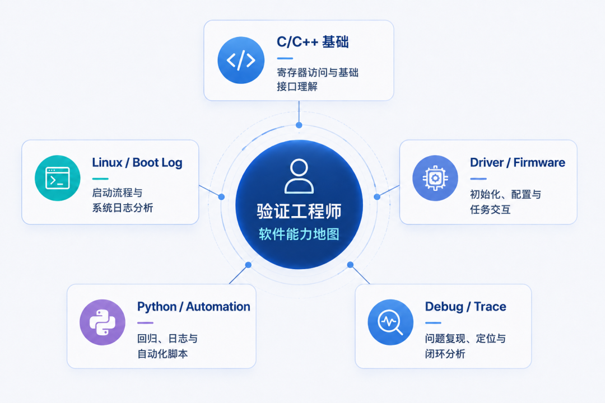

## 12.1 我们也可以从以下几个方面来分析，软件对于验证工程师有什么帮助，我们为什么要掌握软件技能，学习路径应该是什么样：

## 12.2 从“验证 RTL”走向“验证系统”

　　早期谈芯片验证，很多人会想到 RTL、UVM、coverage、assertion、scoreboard、协议检查和波形调试。这些仍然是验证工程师的基本功，也不会因为 SoC 变复杂就不重要。

　　但今天的芯片项目，尤其是大型 SoC、AI SoC、网络芯片、存储控制芯片和车载芯片，已经不再只是“几个模块拼起来”。它们往往包含 CPU、NoC、DMA、DDR/HBM、PCIe、安全模块、低功耗控制、外设接口，以及 firmware、driver、runtime 和操作系统。

　　这意味着验证对象正在从单个 RTL 模块扩展到软硬件协同系统。

　　单模块验证通过，不代表系统一定能启动。总线协议正确，不代表 driver 一定能跑通。寄存器定义没问题，也不代表 firmware 初始化顺序一定正确。越接近 SoC 集成、emulation、FPGA prototype 和 first silicon bring-up，软件越会进入验证现场。

## 12.3 看懂芯片怎么被使用

　　硬件不是自己运行起来的。大多数 SoC 里的硬件模块，都需要软件配置、启动、监控和恢复。

　　寄存器由 firmware 或 driver 写入。DMA descriptor 由软件组织。中断需要软件打开、响应和清除。地址映射和权限由系统软件配置。cache flush、invalidate、memory barrier 这些动作，也会影响硬件看到的数据是否正确。

　　举个常见例子：一个 DMA 任务没有返回。

　　表面上看，好像是 DMA 硬件卡住了。但真实原因可能有很多：descriptor 地址写错了，buffer 没有 flush，IOMMU 映射不对，中断没有 enable，doorbell 没有写到正确的寄存器，或者硬件状态机确实进入了异常状态。

　　如果验证工程师完全不了解软件配置路径，就很难判断问题从哪里查起。具备基本软件理解能力，不是为了替软件团队承担问题，而是为了更快缩小问题范围。

## 12.4 验证工程师需要懂哪些软件能力？

　　验证工程师不需要把自己训练成全栈软件工程师。更现实的目标是：掌握那些和硬件行为直接相关的软件能力。

| 能力 | 为什么重要 | 应掌握到什么程度 |
| --- | --- | --- |
| C / C++ 基础 | 理解 firmware、driver、寄存器访问和底层 test | 能读懂底层配置逻辑，能写简单测试程序 |
| Python / 脚本 | 自动化 regression、日志分析、数据处理、生成测试 | 能写脚本提升验证效率，能处理日志和批量任务 |
| Linux 基础 | 看 boot log、driver probe、设备树、权限和进程状态 | 能看懂基本启动流程，能定位常见驱动加载问题 |
| Driver / Firmware 概念 | 理解硬件如何初始化、配置、提交任务和处理中断 | 能看懂关键初始化流程和寄存器操作 |
| Register / DMA / Interrupt | 软硬件交界最常出问题的地方 | 能把软件配置、硬件状态和系统现象对应起来 |
| Debug / Trace / Regression | 快速复现、定位和归档问题 | 能构造最小复现，能把问题变成可追踪的验证证据 |

　　这里的重点不是“学得越多越好”，而是要和验证工作形成闭环。能读懂一段寄存器配置代码，能写一个最小复现脚本，能从 log 里判断系统卡在 boot、driver、DMA 还是 interrupt 阶段，这些能力在项目里非常实用。

## 12.5 提升 debug 效率

　　很多验证问题，最终消耗时间的不是修 bug，而是确认 bug 到底在哪里。

　　如果验证工程师具备基本软件能力，就可以更主动地构造场景，而不是只等别人提供 stimulus。比如写一个 C test 去访问寄存器，写 Python 脚本批量跑随机配置，解析 driver log，自动比对 register dump，或者把失败场景缩小成一个最小复现 case。

这会直接提升 debug 效率。

　　比如一个中断没有触发。只从 RTL 看，可能要追很多信号；只从软件看，可能只是看到 timeout。懂软硬件交界的验证工程师，会同时检查 interrupt enable、mask、status、clear、CPU interrupt controller、driver handler 和寄存器读写顺序。这样排查路径会清楚很多。

　　这也是为什么很多 SoC 验证岗位越来越重视脚本、C test、bare-metal test、Linux log 和自动化回归。它们不是“附加技能”，而是在复杂系统里把问题讲清楚的工具。

## 12.6 在 Emulation、FPGA Prototype 和 Bring-up 中，软件能力更关键

　　在 RTL simulation 阶段，验证工程师更多地面对 testbench、波形和覆盖率。到了 emulation，系统开始运行更大规模的 RTL，bootloader、firmware 和 driver 会更早进入验证流程。

　　到了 FPGA prototype，平台更接近真实系统。软件团队可能会在上面跑 Linux、driver、runtime、网络协议栈、AI workload 或外设测试。验证工程师如果能理解软件运行路径，就能更好地判断问题到底是 RTL、软件配置、平台环境，还是测试方法本身。

　　First silicon bring-up 更是如此。芯片回来以后，问题往往不会直接告诉你“我是硬件 bug”还是“我是软件 bug”。它可能只表现为系统不启动、PCIe link 不稳定、DDR training 失败、driver probe 卡住、DMA 数据不一致。

　　这个时候，懂软件的验证工程师更容易和 firmware、driver、system、board 和 bring-up 团队建立共同语言，也更容易把 pre-silicon 阶段积累的测试和诊断方法迁移到硅后。

## 12.7 让硬件验证更完整

　　这里需要避免一个误解：验证工程师懂软件，并不意味着硬件基础可以弱化。

　　恰恰相反，UVM、SystemVerilog、协议、时序、低功耗、CDC、assertion、coverage、scoreboard 这些能力仍然是验证工程师的基本盘。软件能力是在这个基础上补系统视角。

　　不同岗位对软件技能的则重点也不一样。

　　做 IP 验证，可能重点是脚本、C model、reference model 和寄存器测试。做 SoC 验证，要更多地理解 firmware、boot flow、DMA、中断和 memory map。做 emulation、FPGA prototype 或 bring-up，则更需要 Linux、driver、log、trace 和系统调试能力。

## 12.8 学习路线

　　第一，先打好数字电路、Verilog/SystemVerilog、计算机体系结构和基本协议基础。

　　第二，学习 UVM、assertion、coverage、testbench 架构，理解验证工程师到底怎么构造场景、检查结果和收敛风险。

　　第三，同时补 C 和 Python。C 用来理解底层软件和寄存器访问，Python 用来做自动化、日志处理和测试生成。

　　第四，学习基本 Linux 使用、boot log、设备树、driver probe、寄存器 dump 和简单调试工具。

　　第五，重点理解软硬件交界点：memory map、DMA、中断、cache、reset、clock、power domain。这些地方最容易出系统级问题。

　　最后，如果有条件，可以做一个小项目：用软件配置一个硬件模块，让它完成数据搬运、中断返回和结果校验。这个过程比单独背概念更有帮助。

如果你还有什么好的建议和想法，欢迎在评论区聊聊。

## 12.9 一个小问题

　　关于芯片验证的职业技能，你有什么想法，有什么想了解的，可以在评论区告诉我们。

点个赞，鼓励一下作者吧。


---

# 13. 模块级Case移植到SoC完整链路

> 来源：https://mp.weixin.qq.com/s/Qxc05YLTN1zFJS5N-GhL9Q
> 作者：芯想事珹
> update 2026/08/22 11 : 01


**01**

**EEPROM Random Read先写后读**

在把模块级 I2C Case 移植到 Cortex-M4 芯片级验证环境时，我一开始以为，这项工作的核心只是把模块地址换成芯片级地址。

真正开始调试后才发现，从一条 C 语句到 EEPROM 中的数据，中间隔着 CPU、AHB、APB、I2C Controller、FIFO，以及 SCL/SDA 上的完整协议时序。

其中最容易让我困惑的问题是：

明明要读取 EEPROM，为什么 I2C 波形里要先执行一次写操作？

**从一行C代码说起**

芯片级Case中，CPU可以使用内存映射方式访问I2C0寄存器

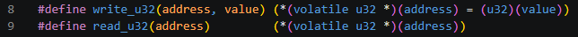

例如：

```
write_u32(IC_DATA_CMD, command);
command
```

这行代码并不会直接在 SDA 上发出数据。

C 程序首先被编译、链接并转换成 BIN 文件，再由 Testbench 将程序加载到 ROM。Cortex-M4 从 ROM 中取出指令并执行，最终产生一次寄存器访问。

完整路径是：

```
C程序
  ↓Cortex-M4执行  ↓AHB System Bus  ↓AHB Matrix  ↓AHB2APB Bridge  ↓I2C0 Controller寄存器
```

CPU 做的事情只是配置 I2C Controller。真正产生 START、SCL、SDA、ACK、Repeated START 和 STOP 的，是 I2C Controller 内部的状态机。

因此，还存在另一条路径：

```
I2C0 Controller
I2C0
  ↓SCL / SDA  ↓EEPROM Model
```

这也是模块级Case移植到芯片级时，不能只改寄存器地址的原因。

**02**

**什么读取 EEPROM 前要先“写地址”？**

假设现在要读取 EEPROM 内部地址 0x0123 中的数据。典型的 I2C Random Read 流程是：

```
START
START
→ EEPROM设备地址 + Write→ 内部地址高字节0x01→ 内部地址低字节0x23→ Repeated START→ EEPROM设备地址 + Read→ EEPROM返回数据→ STOP
```

看到前半段的 Write，我最初误以为它会修改 EEPROM 中的数据。实际上，这一步写入的不是存储数据，而是 EEPROM 的内部地址。可以把 EEPROM 想象成一本书。

设备地址：选择哪一本书

内部地址：翻到哪一页

读命令：读取这一页的内容

所以读取 0x0123 时，需要先发送：

```
0x01：内部地址高字节
0x23：内部地址低字节
```

EEPROM 收到这两个字节后，只是把内部地址指针移动到 0x0123，并没有修改这个地址中的内容。随后，I2C Master 使用 Repeated START 把传输方向从 Write 切换成 Read，EEPROM 才开始返回 0x0123 中保存的数据。这里的“Random”也不是随机生成一个地址，而是：可以先指定任意内部地址，再从该地址开始读取。

**03**

**为什么要使用 Repeated START？**

发送完内部地址以后，可以采用下面两种形式：

```
STOP
→ START→ Read或者：Repeated START→ Read
```

在不释放 I2C 总线的情况下，重新发出 START，并改变后续传输方向。前半段还是 Master 向 EEPROM 发送内部地址，后半段则变成 EEPROM 向 Master 返回数据。整个过程仍然属于一次连续的组合传输：

EEPROM Random Read 通常使用第二种。

Repeated START 的关键作用是：先通过写操作设置EEPROM内部地址，再以Repeated START在不释放总线的情况下切换至读方向完成数据读取，这正是DW\_apb\_i2c中IC\_RESTART\_EN需要使能的原因。

**04**

**IC\_DATA\_CMD如何描述一条I2C命令**

在 DW\_apb\_i2c 中，CPU通过 IC\_DATA\_CMD 寄存器向控制器提交读写命令。

常用字段可以简单理解为：

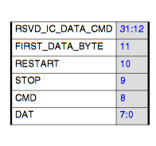

```
bit[7:0]  DAT      写数据或读回数据
bit
7
0
bit[8]    CMD      0表示写，1表示读bit[9]    STOP     命令完成后产生STOPbit[10]   RESTART  命令执行前产生Repeated START
```

例如，向 EEPROM 写入数据 0x5A，并在发送完成后结束事务：

```
write_u32(
    IC_DATA_CMD,    0x5AU | (1U << 9));
```

这条命令写入寄存器的实际数值是：

```
0x05A：低8位数据为0x5A
0
8
0
0x200：bit[9]为1结果：0x25A
```

I2C Controller 不会把整个 0x25A 当成串行数据发送。

它会按照寄存器字段解释：

```
DAT  = 0x5A
DAT
0
CMD  = WriteSTOP = 1
```

最终在 I2C 总线上完成一次完整的写事务：先发送 0x5A 的 8 个 bit，在第 9 个时钟接收从设备的 ACK/NACK 响应，最后产生 STOP 信号结束传输。

类似地，一个带 Repeated START 和 STOP 的读命令可以写成：

```
u32 read_command;

read_command =      (1U << 8)    /* READ */    | (1U << 9)    /* STOP */    | (1U << 10);  /* RESTART */
write_u32(IC_DATA_CMD, read_command);
```

CPU 通过写入 IC\_DATA\_CMD 告诉控制器执行一次带 Repeated START 和 STOP 的读操作，而不是直接控制 SCL 和 SDA。

**05**

**一次完整的EEPROM写读验证**

以地址 0x0123、数据 0x5A 为例，验证流程可以分为两部分。

**EEPROM Byte Write**

I2C EEPROM Byte Write 操作以 START 信号开始，依次发送设备地址及写方向位、内部地址高字节 0x01 和低字节 0x23，将地址指针定位到 0x0123，随后写入数据 0x5A，最后以 STOP 信号结束整个写事务。

对应的软件命令类似：

```
write_u32(IC_DATA_CMD, 0x01U);
write_u32
0
write_u32(IC_DATA_CMD, 0x23U);write_u32(IC_DATA_CMD, 0x5AU | (1U << 9));
```

这里仅在最后一个数据字节上设置 STOP，因为 0x01、0x23 和 0x5A 必须属于同一次连续事务。

**EEPROM Random Read**

I2C EEPROM Random Read 操作以 START 信号开启，先发送设备地址及写方向位，随后写入内部地址高字节 0x01 和低字节 0x23，将地址指针定位到 0x0123，再通过 Repeated START 在不释放总线的条件下重新发起传输，发送设备地址及读方向位，从该地址读取数据 0x5A，最后以 STOP 信号结束。

控制器收到读命令后，会产生 I2C 读事务。EEPROM 返回的数据被 I2C0 接收并放入 RX FIFO，CPU再读取 IC\_DATA\_CMD 的低 8 位：

```
read_data = read_u32(IC_DATA_CMD) & 0xFFU;
read_data
0
;
```

最后由 C 程序完成自动比较：

```
if (read_data != write_data)
if
{    printf(        "FAIL: address=0x%04x, "        "write=0x%02x, read=0x%02x\n",        memory_address,        write_data,        read_data    );
    return1;}
```

如果结果一致，则打印

```
EEPROM address=0x0123, write=0x5a, read=0x5a
EEPROM
0
0
0
PASS
```

**06**

**调试时不能只盯着最终数据**

当读回数据不一致时，直接修改 C 程序通常效率很低。

更有效的方法是沿着数据路径逐层排查

1. CPU是否进入main()

2. BIN是否正确加载到ROM

3. CPU是否访问了正确的I2C0地址

4. AHB2APB是否完成地址转换

5. IC\_DATA\_CMD是否成功写入

6. 命令是否进入TX FIFO

7. I2C0是否产生START

8. EEPROM是否返回ACK

9. 内部地址0x0123是否正确发送

10. 是否产生Repeated START

11. EEPROM是否返回正确数据

12. 数据是否进入RX FIFO

13. CPU是否读取了正确寄存器

14. 软件中的期望值是否正确

调试时只需找到最后一个正确点和第一个错误点，例如APB写IC\_DATA\_CMD和TX FIFO均正确而SDA无START，则问题必然锁定在TX FIFO之后到引脚输出之前的I2C Master状态机路径上，无需盲目排查整个SoC。

**07**

**模块到芯片 不只是地址**

这次移植让我真正理解到，模块级验证和芯片级验证的区别并不是简单替换寄存器基地址。

模块级环境中，Testbench 可以直接操作外设寄存器；芯片级环境中，必须打通完整链路：

```
C程序
→ 编译和链接→ BIN加载→ Cortex-M4取指→ AHB访问→ AHB2APB转换→ I2C0寄存器→ I2C协议→ EEPROM Model→ 读回比较
```

其中任何一层出现问题，都可能表现为最终数据不一致。

完成基本功能后，我还对多个 EEPROM 地址和数据组合进行了验证，包括 0x00FF 到 0x0100 的地址进位边界，并通过 VCS 收集了仅针对 I2C0 实例的 Line、Condition、Branch、Toggle 和 FSM 代码覆盖率。

**08**

**总结**

EEPROM Random Read 中的“先写后读”，本质上是：

```
→ 写内部地址
→ 定位待读取的存储单元→ 使用Repeated START切换方向→ 再读取该地址的数据
```

而在芯片级验证中，一条简单的 C 寄存器写操作，背后连接着 CPU、系统总线、总线桥、外设控制器、FIFO、协议状态机和外部设备模型。

这次调试带给我的最大收获，不只是学会了如何读写 EEPROM，而是开始建立一种分层定位问题的方法：

不从最终错误反复猜测，而是沿着事务路径寻找第一个偏离预期的位置。

**END**


---

# 14. 芯片上最不起眼的三个模块，能让一颗流片好的芯片彻底变成砖头

> 来源：https://mp.weixin.qq.com/s/MbNpx5-_R-SNMDZAP-kAqQ
> 作者：make ic
> update 2026/08/22 11 : 05

一颗 SoC 里，CLKGEN、PMU、AON 这三块代码量加起来可能不到全芯片的 2%。但翻一翻业界的硅后 bug 统计，跟时钟、复位、低功耗相关的问题常年稳居前三。

因为：**这三块是整颗芯片唯一没有"上游"的地方**。DSP 出错了，还有时钟在跑，还能读寄存器、还能挂调试器。时钟错了、复位错了，芯片连"我错了"这句话都说不出来。它就是安静地不动，或者更糟——偶尔动一下。

芯片工程师最怕的不是失败，而是**失败了，但是不给其他信息**。

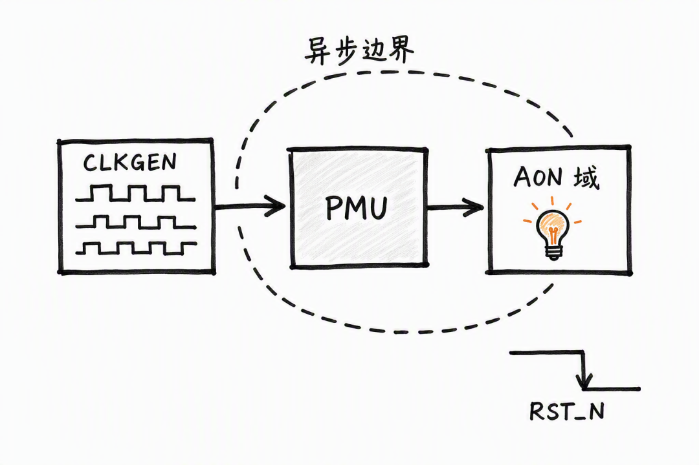

数字设计的整套方法论建立在一个前提上：**每个触发器的输入在采样窗口内是稳定的**。这个前提由 STA 保证，而 STA 的前提是 SDC 里写清楚了时钟关系。

一旦跨了异步时钟域，这个前提直接消失。CDC 工具做的事，本质上是在帮你找出"哪些地方 STA 已经不管了"。

这里有个被反复低估的点：**复位也是一条信号线**。它跨域的时候，一样会亚稳态。

低功耗验证还有个隐藏门槛：UPF/CPF 描述的隔离、电平转换、状态保持，在 RTL 仿真里默认全都不存在。**没跑低功耗仿真的 UPF，等于没有 UPF**。断电域输出该是 X 的时候，你的仿真给了个漂亮的 0，然后大家一起签了 sign-off。

---

AON 域的存在理由很简单——总得有人负责把别人叫醒。它的验证难点也很简单：**它是唯一一个"被断电域"和"上电域"直接接触的地方**。

这个边界上最容易出的问题不是功能错，而是**唤醒事件丢了一个脉冲**。GPIO 上来一个窄脉冲，AON 里的采样时钟是 32kHz，脉冲宽度 20ns。仿真里加了 delay 就过了，硅上就漏。

芯片睡下去以后，唯一能救它的就是 AON。所以 AON 里的逻辑越简单越好，越少状态越好。

结论：**AON 域应该被写得"不聪明"**。

---

行业往先进封装、Chiplet 走以后，情况没变简单。多 die 之间的复位顺序、跨 die 的时钟同步、UCIe 链路的初始化握手，全都是老问题换了个更大的舞台。

对做验证的人来说，这里有个值得琢磨的地方：**大部分验证工作是在证明"某件事会发生"，而时钟复位功耗这一块，验证的是"某件坏事不会发生"**。后者本质上更难，因为不存在使用测试用例能覆盖"所有可能"。

所以这三块的验证方法必须往形式化、往 CDC/RDC 静态检查、往低功耗仿真这些"结构性手段"上靠。靠写更多定向用例来堆覆盖率，方向从一开始就错了。

一个成熟团队的标志，是在 RTL 冻结之前就把 CDC 报告清干净，而不是在硅回来之后开会讨论"为什么这颗芯片偶尔起不来"。

那种会，开一次就够了。因为，流片失败，明年可能大家都坐不到一起了...

---

# 15. 不会写C的验证工程师，在SoC验证里能走多远？

> 来源：https://mp.weixin.qq.com/s/QPGDIzWmLLkQjDlpyYeJeQ
> 作者：make ic
> update 2026/08/22 11 : 07

团队花了半年搭建了一套完美的UVM验证平台，各种sequence写得行云流水，coverage收敛到99%。Tapeout后芯片回来，跑Linux kernel，第一次boot就死在MMU初始化。

问题出在哪？**验证环境里从来没跑过真实的软件。**

## 15.1 **Transaction不等于真实世界**

IP验证的经典打法：UVM testbench发transaction，monitor抓响应，scoreboard比对。这套方法在简单接口上无往不利。

到了SoC验证就不一样了。CPU不是被动响应transaction的slave，CPU是通过执行指令序列主动产生行为的master。一条`ldr x0, [x1]`指令可能触发：

- TLB miss导致page table walk
- L1 cache miss触发L2访问
- L2 miss引发DDR burst读
- Memory barrier导致的流水线stall

这些行为的timing、interleaving、corner case，**不是用SystemVerilog的transaction能模拟出来的**。真实软件的执行路径远比手写的sequence复杂。

最近Cadence发布的PSS（Portable Stimulus Standard）方法学就是在解决这个问题——如何协调UVM测试和C程序测试，让软硬件验证形成闭环。但说到底，验证工程师自己要能写C测试，工具才有发挥空间。

很多从IP验证转过来的工程师，听到"写C测试"就头大。心里想的是：这是软件工程师的活，验证工程师懂硬件就够了吧？

SoC验证的核心场景就是CPU跑程序。不会写bare-metal C代码，怎么验证：

- Boot sequence（从reset vector到跳转main函数的整个流程）
- Exception和interrupt handling（精确到每一条指令的状态保存）
- Cache coherence protocol（多核场景下的MESI状态转换）
- Memory ordering和barrier指令（弱内存序模型的各种race condition）
- 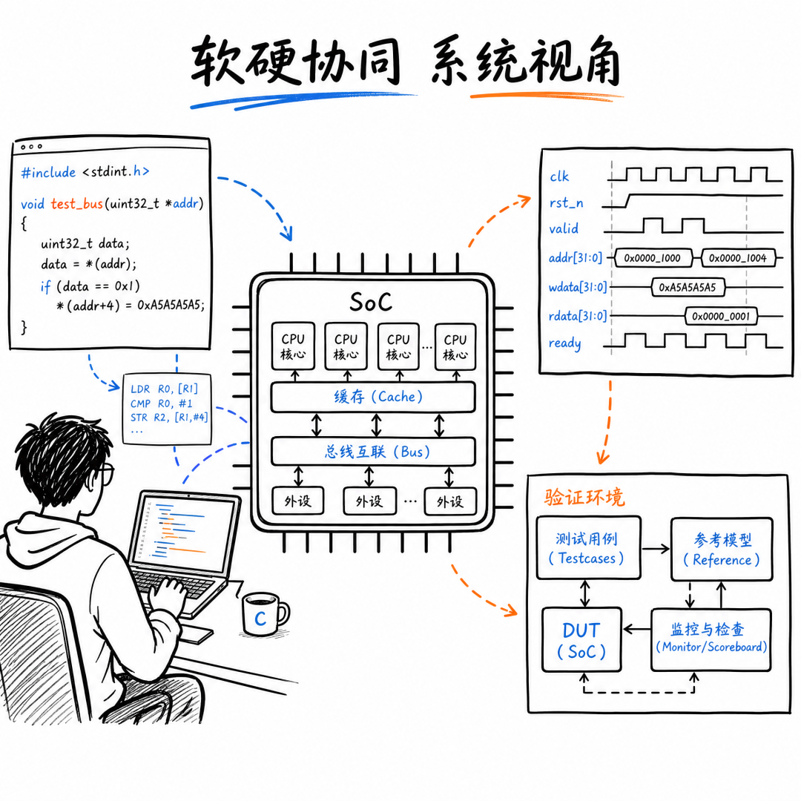

```
// 验证cache coherence的典型C测试volatile int shared_data = 0;
void core0_task() {    shared_data = 0x42;    __asm__ volatile("dsb sy"); // data synchronization barrier    // 期望core1能看到更新}
void core1_task() {    while (shared_data != 0x42);    // 验证点：core1从cache还是memory读到数据？}
```

这段代码看起来简单，验证起来涉及的硬件行为极其复杂。cache line在不同core之间的状态变化、memory barrier对write buffer的影响、interconnect的ordering rule——**这些都是C代码触发的。**

## 15.2 **系统视角的本质是因果链**

软硬协同验证难在哪？难在追踪因果链。

软件工程师写的代码是cause，硬件行为是effect。中间隔着编译器优化、指令流水线、缓存层级、总线仲裁、外设时序。验证工程师要站在系统层面，把整条因果链串起来。

举个例子：软件跑memcpy卡住了。可能的原因？

- DMA controller的descriptor链表配置错误
- AXI总线的outstanding transaction超限导致deadlock
- DDR controller的refresh timing和burst access冲突
- Power domain切换时clock gating导致的glitch

**每一个可能性，都需要同时理解C代码的执行逻辑和硬件的状态机。** 只懂硬件的人看不出软件配置的问题，只懂软件的人定位不到硬件的bug。

RISC-V生态在过去两年爆发式增长，市场上大量基于RISC-V的SoC项目开始流片。RISC-V的开放ISA让更多团队能做自己的CPU core，但也带来新的验证挑战——**没有Intel、ARM那样成熟的validation suite，很多corner case要验证团队自己用C代码构造出来。**

验证工程师的技能栈如果停留在"会写UVM、会搭testbench、会看波形"这个层面，在SoC验证里就是半桶水。

真正的SoC验证工程师，要能看懂kernel代码、写得了bare-metal测试、追得了软硬件联调的bug。这个要求高吗？高。但这就是行业现实。

那些拒绝学C、拒绝理解软件栈的验证工程师，会发现自己的职业天花板越来越低。项目里真正有价值的bug——那些只在真实软件执行时才会暴露的race condition、timing corner case、system-level deadlock——**全都需要软硬协同的验证手段才能抓到。**

想清楚自己要做哪种验证工程师，然后决定要不要补C编程这一课。

---

# 16. 超越UVM：高级验证工程师的思维跃迁与未来护城河

> 来源：https://mp.weixin.qq.com/s/ZvRUxN5zaAAQj8gjMBB4wA
> 作者：清风
> update 2026/08/22 11 : 33
> **已截图**

当所有人都能写出Sequence时，你的价值就不再是“会写UVM”，而是“能用UVM解决芯片级问题”。

做了几年UVM验证，你会发现一个残酷的现实：入门级的UVM能力正在被快速平民化。

脚本可以生成框架，AI能补全driver和monitor，甚至一些基础sequence都能由工具自动产生。当“会用”变得不值钱，真正的验证专家在拼什么？今天我们不谈代码，谈思维、路径和未来。

一、从“实现者”到“架构师”：三个关键思维跃迁

大部分验证工程师的成长路径是：学会接口时序 -> 写driver/monitor -> 搭Scoreboard -> 写sequence。走到这一步，就触碰到了第一个天花板。要突破，必须完成三次思维跃迁。

第一次跃迁：从“激励产生”到“场景建模”

初级工程师思考的是“我要发一个什么数据包”，高级工程师思考的是“这个IP在实际系统中会经历哪些极限边界场景”。场景建模能力，本质上是将芯片规格书翻译成概率约束网络的艺术。比如，你不再只是随机化一个数据长度，而是定义出“小包风暴紧随大包停顿”这种真实业务模型，并让这个模型可复用、可组合。

第二次跃迁：从“单一环境”到“验证平台生态”

你搭的UVM环境不再只为某一块IP服务。你需要设计组件时考虑水平复用（同系列不同子系统的集成）和垂直复用（从模块级到芯片级，再到系统级）。这要求你深刻理解UVM Factory的覆写哲学、配置对象的层级传播机制，以及如何利用TLM2.0将通信抽象化，使得环境像乐高一样随意拼接，而不是每次都要拆墙重建。

第三次跃迁：从“发现Bug”到“量化信心”

这是最被忽视的一环。高手不只关注跑出了多少个红色Error，更关注覆盖率收敛的斜率和形状。你能从一段覆盖率数据的平躺曲线中，嗅出是某个角落的状态机卡死了随机组合，还是Testbench本身限制了合法激励。你开始用功能覆盖率模型反向驱动随机生成，这就是Coverage-Driven Verification从口号变为实践的质变。

二、UVM不会死，但你必须了解它的进化方向

很多人说UVM过于复杂、陈旧，未来将被Python或C++替代。我的观点是：UVM不会消失，但它正在沉入“基础设施”层，而上层应用和流程创新将重新定义验证工作。

1. 便携式激励(PSS)与UVM的共生

PSS不是来革UVM命的，而是解决UVM最笨拙的部分：跨层级、跨平台的测试意图复用。未来顶级的验证工程师，将是能用PSS描述场景意图，再将其自动映射到UVM测试平台上的人。你懂UVM越深，对PSS生成的激励质量把控就越精准。

2. AI辅助的验证闭环

AI正从两个方向渗透：一是智能约束求解和激励生成，能自动补全你遗漏的边界组合；二是失效分析和调试，从海量Log中剥离出根因。但AI需要“养料”——结构良好、命名规范、具有清晰分层注释的UVM环境，是AI理解芯片行为的最佳语料库。你今日搭建环境的“洁癖”，就是明天AI助手的高效基础。

3. 系统级验证的融合

Chiplet和异构集成让系统级验证（SLT）变得空前重要。纯RTL的UVM环境，必须向上与虚拟原型、固件、操作系统协同仿真。这就需要你打通从UVM事务级到软件API级的通道，理解软硬件协同的错误注入与恢复机制。这是目前验证领域薪资最高的那块技术拼图。

## 16.1 给验证工程师的进阶路线图

如果你正处在“熟手”的瓶颈期，可以考虑三条硬核进阶路径：

路径A：深耕领域专家

选一个复杂协议或应用方向（如PCIe 6.0、CXL 3.0、高速SerDes、AI加速器存内计算），深挖物理层到协议层乃至应用层的所有异常场景。成为这个领域内，连设计人员都要来请教“协议上到底允不允许这种边界情况”的行走的百科全书。

路径B：方法论与效能专家

不再局限于单个项目，转而研究验证流程的自动化、回归管理的智能化、覆盖率的预测模型。你能搭建一套让10个人团队效率翻倍的验证框架，或者开发出自动识别覆盖盲点的脚本套件。你的价值单位，从“完成一个模块”变成了“提升整个部门”。

路径C：系统与架构验证师

直接瞄准芯片架构师的方向，专注于性能验证与架构建模。用SystemC或TLM模型在RTL成熟前进行吞吐量、延迟和死锁分析。你输出的不是“有没有Bug”，而是“这套架构能撑住多少路并发，会在哪个节点最先崩塌”。这是距离芯片商业成功最近的技术角色。

尾声：慢就是快

验证是一门需要沉淀的手艺。周围越是被“快速入门”“AI替代”的声音充斥，你越要沉下心来钻研那些看似笨拙的基础功：一个精准的断言、一个滴水不漏的覆盖模型、一个能扛住百万次回归的环境架构。

这些才是你不可替代的护城河。别在低水平的代码堆砌上沉浸，去思考场景、拥抱系统、量化信心。

---

延伸思考

在你的项目中，是哪个UVM组件的设计失误，导致了最严重的一次验证迭代延迟？是Driver的时序僵硬，还是Scoreboard的比较逻辑疏漏？欢迎在留言区复盘你的“踩坑史”，我们一起精进。

---

# 17. AXI VIP 的 Monitor 已经能检查协议，为什么还要写 Scoreboard？

> 来源：https://mp.weixin.qq.com/s/KbfG4aidtg5eQK2e2OhxRw
> 作者：芯片验证那些事儿
> update 2026/08/22 11 : 40
> **已截图**

最近在给几位芯片验证工程师做项目复盘和面试辅导时，我发现一个很典型的问题：很多人会接 AXI VIP，也知道 Monitor 能够采集事务、检查协议，但一问到“为什么还要写 Scoreboard？” “Monitor、Bus Monitor 和 Scoreboard 分别负责什么？”，就容易讲乱。

Synopsys以前发布的一篇技术公告——DesignWare Introduces Port Monitor Verification IP for the AMBA 3 AXI Protocol——把这几个组件的职责边界讲得很清楚。虽然原文面向 AMBA AXI3，使用的还是 VMM 时代的术语，但它讨论的架构思想放到今天的 UVM 验证环境中依然成立。

> 先说结论：**Port Monitor 负责看清一个 AXI 端口是否遵守协议；Bus Monitor 负责看清一个互连内部多个端口之间是否匹配；Scoreboard 负责判断整个设计的端到端行为是否正确。**

## 17.1 Synopsys 为什么要推出 Port Monitor

在 Port Monitor 出现之前，Synopsys 已经提供了面向整个 AXI 互连的 Bus Monitor。Bus Monitor 能同时连接互连的多个 Master、Slave 端口，因而可以完成跨端口跟踪、地址映射检查和跨端口覆盖率统计。

但这种能力也带来了明显代价。原文中的 Bus Monitor 具有固定的 64 端口规模，最多支持 32 个 Master 和 32 个 Slave。即使实际只使用少量端口，剩余端口仍然存在；在 VHDL 仿真环境中，未使用端口还需要全部连接。与此同时，覆盖率报告里会出现大量没有实际意义的 Source/Destination 状态，编译规模、内存占用和加载时间也会受到影响。

如果验证对象只是一个 AXI Master、一个 AXI Slave，或者只想观察多级互连中的某一条接口，为整个互连实例化一套 Bus Monitor 就显得过重了。

Port Monitor 正是为了解决这个问题：**它只观察一个 AXI 端口或一条 AXI 接口，不要求了解整个互连拓扑。**

## 17.2 Port Monitor：只盯住一条 AXI 接口

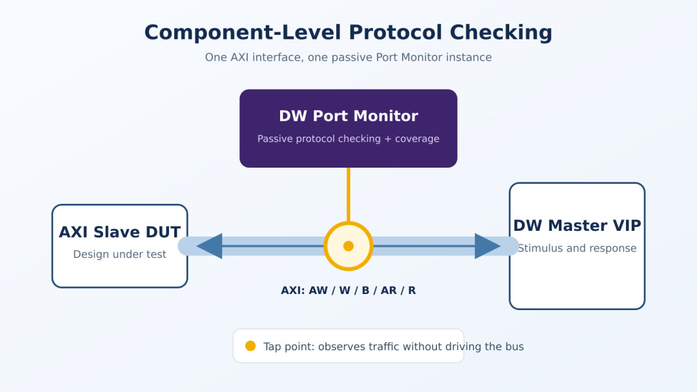

图1：Port Monitor用于组件级AXI协议检查

图 1 是最典型的使用场景：DW Master VIP 向 AXI Slave DUT 发起访问，Port Monitor 被动地挂在两者之间，观察 AW、W、B、AR、R 五个通道。

这里的“被动”非常重要。Port Monitor 不产生激励，也不参与握手，它主要完成两件事：

1. 检查当前端口上的 AXI 协议行为，例如握手、通道关系、传输属性和时序规则是否满足协议要求；
2. 采集该端口上的协议覆盖率与事务信息，并将事务活动提供给上层验证环境。

与 Bus Monitor 相比，Port Monitor 有几个直接优势：

- 不存在大量未使用端口，实例化更简单；
- 不需要配置完整的系统地址映射；
- 覆盖率报告不会混入未使用的 Source/Destination 状态；
- 不依赖互连采用何种拓扑，也不受多地址通路、多数据通路架构的限制；
- 引脚规模更小，能够减少仿真编译量、可执行文件体积和运行时内存占用。

原文还特别说明，Port Monitor 的协议检查器来自已经验证过的 Bus Monitor 技术，因此它并不是一个“功能缩水的简易 Monitor”。**在单端口范围内，它仍然保留了完整的端口级协议检查能力。**

## 17.3 为什么 Port Monitor 特别适合多级互连系统

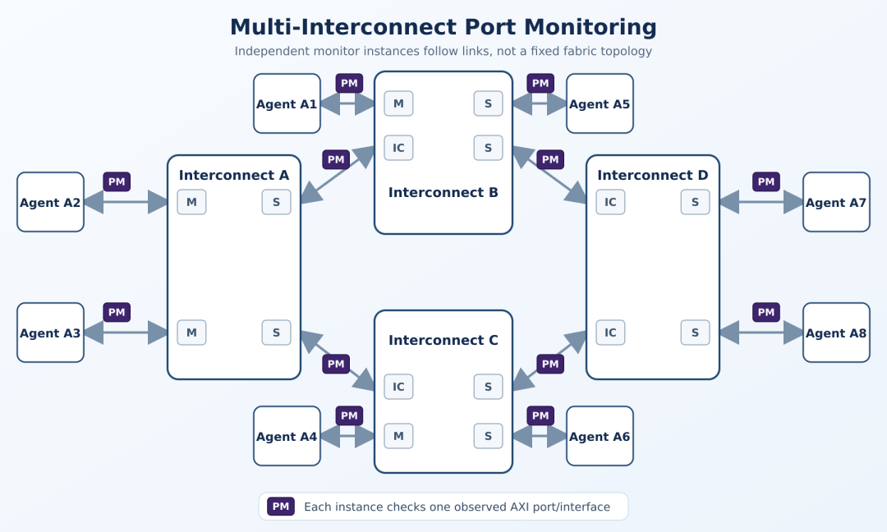

图2：多级互连中的Port Monitor部署方式

当 SoC 内部存在多级 AXI Interconnect 时，请求可能先经过一级互连，再进入二级或三级互连。此时，一个固定连接在某一级互连上的 Bus Monitor 很难天然理解跨越多个互连后的完整 Source/Destination 关系。

Port Monitor 的思路更直接：在关心的接口上各放一个独立 Monitor。每个实例只理解自己所观察的端口，因此它与系统拓扑解耦。只要仿真资源允许，Monitor 实例数量可以随接口数量扩展，原文甚至明确提到可以通过多个独立实例支持超过 64 个端口的系统。

这种方式能够很好地回答下面的问题：

- 这个接口上是否真的出现了请求？
- AXI 五通道行为是否满足协议？
- 事务在这一段链路上的属性、ID、地址、数据和响应是什么？
- 某一级互连的输入端和输出端分别观察到了什么？

但它仍然无法自动回答另一些问题：

- Master 端发出的请求，是否在正确的 Slave 端出现？
- Slave 端观察到的事务，是否能够在 Master 端找到对应请求？
- 地址是否被路由到了正确的目标设备？
- ID 是否经过了合法映射，返回顺序是否满足系统规则？
- 某个 Slave 是否是另一个 Slave 的地址别名？

原因并不复杂：**每个 Port Monitor 只看得到局部事务，却不知道整个系统的地址空间、路由规则和端口对应关系。**

## 17.4 Port Monitor 能检查什么，不能检查什么

原文对多端口场景下的功能边界给出了明确说明，可以整理成下面这张表：

| 检查项目 | Port Monitor | 原因 |
| --- | --- | --- |
| 单个端口上的 AXI 协议检查 | 支持 | 只依赖当前接口信号与事务状态 |
| 单端口协议覆盖率 | 支持 | 覆盖状态来自当前端口 |
| 涉及多个端口的覆盖率 | 不直接支持 | 不掌握其他端口的事务关系 |
| 涉及多个端口的 Warning/Error | 不直接支持 | 无法独立完成跨端口关联 |
| Slave 端事务是否匹配某个 Master 请求 | 不直接支持 | 需要同时观察并匹配两侧事务 |
| 地址是否进入正确的 Slave | 不直接支持 | Port Monitor 没有系统 Memory Map |
| Slave 地址别名跟踪 | 不直接支持 | 需要系统地址映射与别名信息 |
| 设计相关的数据变换和端到端功能 | 需要外部检查 | 属于 DUT 语义，而不是通用 AXI 协议规则 |

这里必须避免一个常见误解：“Port Monitor 不支持跨端口检查”不等于“Port Monitor 采不到相关信息”。它能够把各端口采集到的事务提供给 Testbench，只是不会替用户自动推导不同端口之间的设计关系。

> 顺着这个问题多说一句：实际项目中最难的，往往不是找不到协议或 User Guide，而是文档看完以后，仍然不知道问题究竟属于协议违规、VIP 配置、Scoreboard 架构，还是 DUT 本身的设计行为。类似 AXI Outstanding、反压、VIP 使用、Scoreboard 搭建，以及后仿和 Debug 中遇到的一线问题，我会持续整理到知识星球《数字芯片验证》（星球号：7833526）。目前星球已经沉淀了 500 多篇精华内容，遇到问题时还可以直接提问，比临时到处翻零散资料更高效。一年365天答疑，为您的工作和学习保驾护航！


## 17.5 Bus Monitor：看见一个互连的全局关系

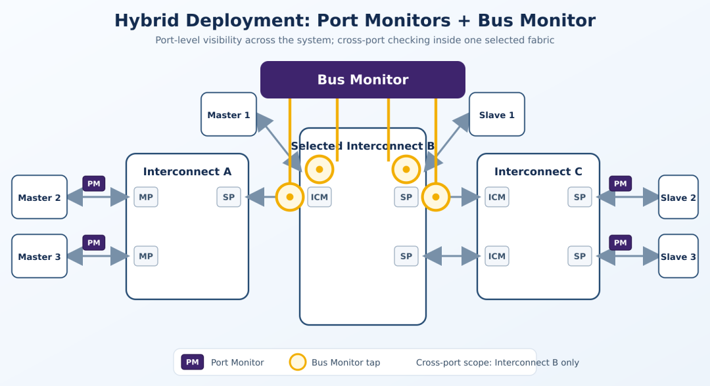

图3：Port Monitor与Bus Monitor混合部署

Bus Monitor 同时连接某个互连的多个输入、输出端口，因此能完成更复杂的跨端口跟踪。原文列出的能力包括：

- 检查需要跨端口关联的 Warning 和 Error；
- 统计需要跨端口跟踪的覆盖率；
- 根据 Memory Map 判断事务是否到达了正确的 Slave；
- 跟踪 Slave Alias；
- 识别 Master ID、Slave ID，并用于错误检查和覆盖率统计；
- 跟踪多地址通路、多数据通路架构中的事务关系。

因此，Port Monitor 和 Bus Monitor 并不是互相替代的关系。对于复杂 SoC，更合理的方式往往是混合部署：

- 在系统各级关键接口放置 Port Monitor，获得低成本、可扩展的局部可观测性；
- 在需要重点验证的某一级 Interconnect 上放置 Bus Monitor，完成该互连内部的跨端口检查；
- 将多个 Port Monitor 输出的事务送入系统级 Scoreboard，完成跨互连、端到端的功能检查。

三者的职责可以进一步概括如下：

| 组件 | 观察范围 | 最擅长解决的问题 | 主要缺口 |
| --- | --- | --- | --- |
| Port Monitor | 一条 AXI 接口或一个端口 | 端口级协议合法性、局部覆盖率、事务采集 | 不理解全局拓扑和地址映射 |
| Bus Monitor | 一个互连的多个端口 | 跨端口匹配、Memory Map、别名、ID 与互连覆盖率 | 规模较重，且全局能力通常止于所连接的互连 |
| Scoreboard | 用户定义的端到端路径 | 数据正确性、路由、转换、顺序和系统策略 | 规则依赖 DUT，需要验证团队实现 |

## 17.6 原文中的 Scoreboard 需要自己写吗？

答案是：**需要。Scoreboard是由验证工程师根据 DUT 行为自行定义的。**

多个 Port Monitor 的活动通道可以接入一个 Scoreboard，再由 Scoreboard 执行“user defined system level checks”。换句话说，VIP 提供端口级事务信息和协议检查能力，但并不知道你的系统应该怎样路由、怎样修改数据、怎样处理 ID，也不知道哪些重排是合法的。

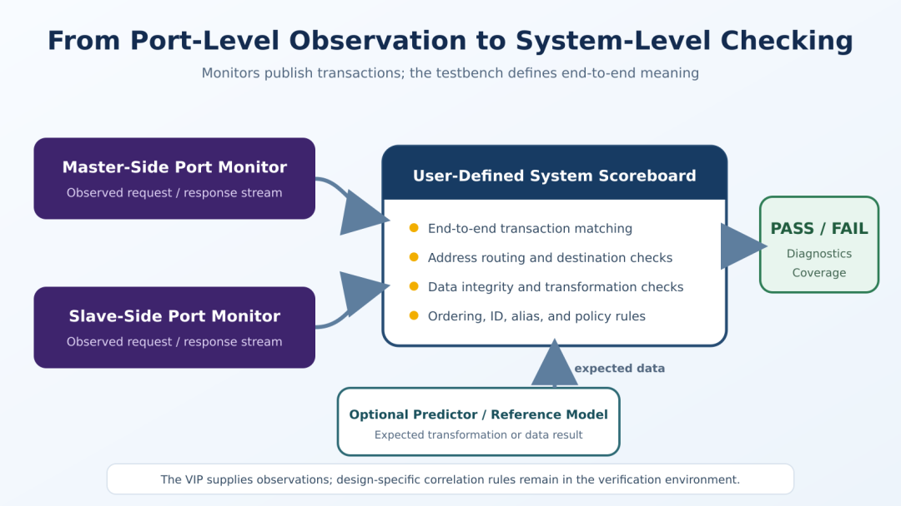

图4：Port Monitor与用户自定义Scoreboard的关系

这篇文章并没有描述一个可以直接继承并覆盖少量函数，就自动完成任意系统检查的“通用 Scoreboard”。原因是系统级比较规则天然与设计相关，例如：

- 地址如何译码，事务应该到达哪个 Slave；
- AXI ID 是否会被扩展、压缩或重新映射；
- 多个 Outstanding 事务允许怎样乱序返回；
- Interconnect 是否会拆分、合并或转换 Burst；
- 数据是否经过宽度转换、字节重排、加解密或其他处理；
- 错误响应、超时、重试和别名地址应该怎样处理。

这些信息无法仅从 AXI 协议本身推导出来，所以必须由用户的 Testbench 提供。

如果映射到今天常见的 UVM 架构，连接关系通常是：

```
// 仅用于说明架构；不同版本、不同厂商 VIP 的端口名称并不相同master_side_monitor.analysis_port.connect(sb.master_fifo.analysis_export);slave_side_monitor.analysis_port.connect(sb.slave_fifo.analysis_export);
// 仅用于说明架构；不同版本、不同厂商 VIP 的端口名称并不相同
master_side_monitor.analysis_port.connect(sb.master_fifo.analysis_export);
slave_side_monitor.analysis_port.connect(sb.slave_fifo.analysis_export);
```

Scoreboard 可以继承 `uvm_scoreboard`，但真正关键的内容仍需自己实现：事务如何匹配、怎样处理 Outstanding 和乱序、哪些字段参与比较、超时如何判定、Reset 后队列如何清理等。

如果只是严格的一进一出、完全保序比较，可以复用 UVM 提供的 FIFO 或 Comparator 组件；但一旦出现多 ID、乱序返回、Burst 转换或多目标路由，简单的顺序比较通常就不够了，需要基于 ID、地址、事务序号等信息建立关联模型。

> 需要注意：原文发布于 2007 年，描述的是 AMBA AXI3 和 VMM activity channel。当前 Synopsys SVT VIP 的具体类名、TLM 端口和示例环境，应以实际安装版本的 User Guide 与 Example 为准，不能直接照搬文章中的历史接口名称。

> 从面试官的角度看，能不能把这层边界讲清楚，也是判断候选人项目深度的一道分水岭。简历里只写“搭建 UVM 验证环境、接入 AXI VIP”，很难体现真正的技术价值；如果能够进一步讲清 Monitor 的观察点、Scoreboard 的匹配策略、Outstanding 与乱序处理，以及协议检查和功能检查的分工，项目可信度会高很多。对于正在求职的朋友，我的求职辅导套餐会基于真实经历，覆盖简历优化和项目经历重写、项目深挖、面试知识体系梳理、一对一模拟面试，并延伸到岗位与公司选择、Offer 分析和薪资谈判。核心不是包装虚假项目，而是把真正做过的事情讲清楚、讲专业、讲到点子上。

## 17.7 不同场景应该怎样选择

结合原文建议，可以按下面的方式选择：

### 17.7.1 单个 Master 到单个 Slave

优先使用 Port Monitor。它足以完成端口级协议检查和覆盖率采集，配置简单，也不需要完整 Memory Map。

### 17.7.2 Block 级验证，没有 AXI Interconnect

优先使用 Port Monitor。此时不存在跨端口路由问题，Bus Monitor 的大量能力用不上。

### 17.7.3 单个 AXI Interconnect 的合规性验证

优先考虑 Bus Monitor。它能够同时观察多个 Master、Slave 端口，适合检查互连内部的路由、ID 和跨端口覆盖率。

### 17.7.4 多级 Interconnect 的复杂 SoC

使用多个 Port Monitor 加自定义 Scoreboard；如果某一级互连需要重点验证，再在该互连上增加 Bus Monitor。这样既能获得系统级可观测性，也不会让每一级互连都承担固定规模 Bus Monitor 的成本。

### 17.7.5 系统重点是端到端数据正确性

无论是否使用 Bus Monitor，都需要 Scoreboard 或 Reference Model。协议检查只能证明事务“说话合规”，不能证明 DUT “事情做对了”。

> 工具和架构怎么选，背后其实也对应着验证工程师的职业路径。不少工程师学过很多协议，职业竞争力却没有明显提升，问题往往不是学得不够多，而是能力主线太散。职业规划不是简单告诉你“哪家公司好”，而是结合已有项目、工作年限、目标城市和现实机会，判断你现在处于什么位置、已有经验能够迁移到哪里、目标岗位还缺什么，以及未来 3～6 个月最值得补哪条主线。如果你正纠结 IP 验证与 SoC／系统验证怎么选、准备转方向、打算跳槽，或者正在比较多个 Offer，可以联系我做一次一对一梳理，先把方向想明白，再决定时间应该投在哪里。文末有联系方式。

## 17.8 搭建验证环境时最容易踩的几个坑

### 17.8.1 把协议检查当成功能检查

AXI 协议全部合法，只能说明握手、顺序和属性没有违反协议，并不能证明地址路由、数据内容和寄存器副作用正确。

### 17.8.2 Scoreboard 只按到达顺序比较

支持 Outstanding 的 AXI 系统可能允许不同 ID 之间乱序返回。Scoreboard 如果只比较队头事务，很容易把合法乱序误报为错误。

### 17.8.3 忽略事务变换

Interconnect 可能进行宽度转换、Burst 拆分、ID 映射或地址转换。Scoreboard 应比较“经过合法变换后的预期结果”，而不是简单逐字段复制输入事务。

### 17.8.4 没有明确 Monitor 的观察点

同一笔事务在不同层级的接口上可能已经发生格式变化。Testplan 中应明确每个 Monitor 放在哪里、采集的是变换前还是变换后的事务，以及这些事务应该如何关联。

### 17.8.5 Reset 后没有清理关联状态

Monitor、Predictor 和 Scoreboard 必须对 Reset 采用一致策略。否则 Reset 前尚未完成的事务可能残留在队列中，造成 Reset 后的假失败。

## 17.9 结语

这篇早期技术公告真正有价值的地方，不是介绍了一个具体的 VIP 组件，而是划清了三个层次：

- **Port Monitor 判断一个端口是否遵守 AXI 协议；**
- **Bus Monitor 判断一个互连的多个端口能否正确关联；**
- **Scoreboard 判断整个 DUT 是否完成了设计要求的功能。**

所以，Monitor 和 Scoreboard 从来不是二选一。Monitor 负责把总线行为可靠地还原成事务，协议检查器负责发现接口违规，Scoreboard 则站在更高层次判断端到端结果。只有把这三层职责分开，验证环境才能既清晰，又真正具备可复用性。

如果你喜欢这种从官方资料出发、再落到真实项目和面试场景的技术拆解，欢迎关注公众号／视频号《芯片验证日记》。技术学习和项目答疑，可以加入知识星球（星球号：7833526）；正处在职业选择或求职阶段，可以联系我进行职业规划或求职辅导。


---

# 18. 这几种scoreboard架构，多数人从第一天就选错了

> 来源：https://mp.weixin.qq.com/s/mPjB4IWakktJjlyn9lwTow
> 作者：make ic
> update 2026/08/22 11 : 41

## 18.1 ”你的 scoreboard 为什么比不出这个 bug“，很多人当场语塞。 **比对逻辑到底该长什么样**。

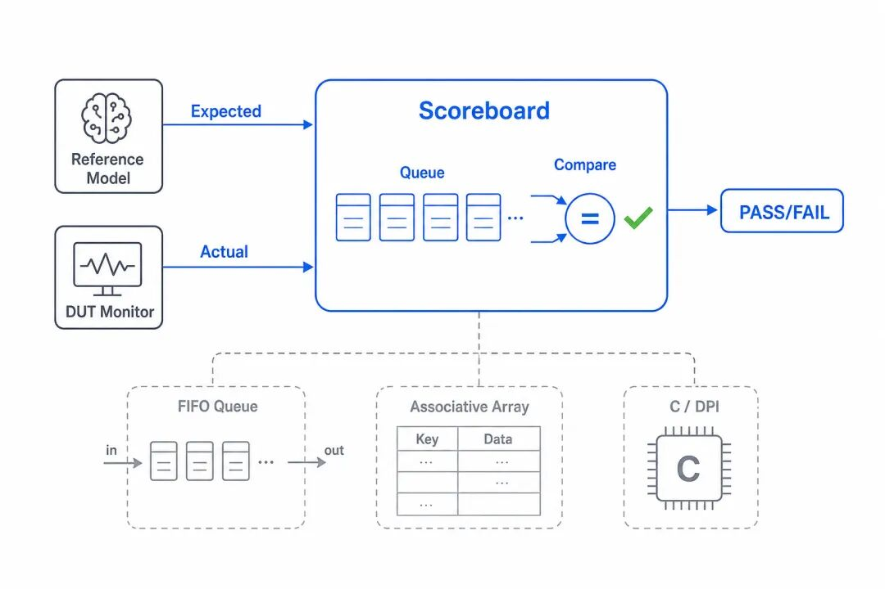

scoreboard 只干一件事：**拿到”期望值“和”实际值“，判断二者是否一致**。架构的差别，本质上只是这两路数据”从哪来、存在哪、怎么配对“的差别。

---

### 18.1.1 裸队列直比

一个 `analysis_imp`，一个 `queue`，收到就 `pop`出来 `compare`。十分钟写完，小模块够用。但项目一迭代，DUT 加了乱序、加了丢包，这段代码就开始打补丁，最后没人敢动。**它的问题在于把”预测“和”比对“焊死在了一起**，改一处动全身。

### 18.1.2 Predictor 与 Comparator 分离

参考模型单独一个组件算期望值，scoreboard 只管收两路数据做比对。这是**大多数项目的正确答案**，立场很明确：只要模块的生命周期超过三个月，就该这么写。分离之后，参考模型可以单独复用、单独调试，比对逻辑保持干净。前期多花的半天，后面会十倍地还回来。

### 18.1.3 乱序比对

DUT 输出顺序不保证时，队列就失效了，得换成按 ID 索引的关联数组：

```
exp_q[tr.id].push_back(tr);
exp_q[tr.id].push_back(tr);
```

NoC、多通道 DMA 绕不开。**难点从”比对“转移到了”配对“**——超时没等到对端数据怎么报、仿真结束时字典里的残留怎么清。

### 18.1.4 外挂 golden model

算法复杂到 SV 写不动时，用 DPI-C 挂 C 模型。前提都是**验证环境结构清晰、数据流可追溯**——一坨面条式的 scoreboard，AI 也救不了很难做端到端比对。

---

### 18.1.5 **系统的可维护性，取决于职责切分的那一刀落在哪里**。刀切对了，后面每一次需求变化都只碰一个组件；切错了，每次变化都是全局手术。

scoreboard 是环境里**最能体现个人水平的组件**——driver 和 monitor 大家写得都差不多，但 scoreboard 一眼就能看出功底。别把它当成”最后随便糊一下“的部分，它值得占掉环境搭建一半的思考时间。

行业在收紧，工具在变聪明，能留在牌桌上的，是那些把”为什么这么架构“想透了的人，而只会照模板填空的岗位，正在被工具一点点吃掉。

---

# 19. AXI Master与Slave VIP对接验证平台搭建

> 来源：https://mp.weixin.qq.com/s/bB8KGVoeISbNya-ZktSRrA
> 作者：芯想事珹
> update 2026/08/22 11 : 44
> **已截图**


AXI Master与Slave VIP对接验证平台搭建

在SoC验证中，AXI总线几乎是绕不开的。无论是CPU访问DDR，还是DMA搬运数据，都离不开AXI协议。而AXI VIP正是Synopsys提供的标准化验证组件，用来替代手写AXI BFMs，帮助验证工程师快速搭建总线协议验证环境。

本文记录了一次AXI Master VIP与AXI Slave VIP对接验证平台的搭建过程，重点说清楚环境怎么搭、Sequence怎么封装，以及实际踩过的几个坑

**从基础读写开始**

搭建的第一步是跑通最基本的读写流程。

在Synopsys AXI VIP的示例代码中，已有基础sequence实现了简单的读写操作。把这些示例跑起来，确认：

- Master能发请求
- Slave能回响应
- 仿真不报错，顺利结束

这一步是验证链路通不通的关键。如果基础读写都过不了，说明环境连接或配置有问题，后面做再多封装都没意义。

**把读写操作封装成独立Sequence**

基础sequence的问题在于：地址和数据写死在代码里，每次换测试场景都要改代码，复用性差。

比如要读不同地址、写不同数据，原来需要在sequence内部手动修改参数，然后再重新编译跑仿真。这种做法在验证一个简单模块时还能接受，但一旦测试用例多了，维护成本直线上升。

解决思路很直接：把读和写拆成两个独立的sequence，地址和数据全部做成可配置变量。

写Sequence示例：

```
systemverilog
classaxi_write_seqextendsuvm_sequence;  rand bit [31:0] start_addr;  rand bit [31:0] data [];  // 参数从外部传入，不写死在代码里endclass
```

读Sequence同理，把读取地址设成变量，外部传入。

这样改完之后，同一个sequence可以被不同testcase调用，只需要修改传入的地址和数据即可，不需要再改代码。

**统一管理Sequence**

两个独立sequence做好之后，还需要一个统一的调用接口。不然每次都要在test.sv里单独例化，还是会显得乱。

做法是在单独的文件中对所有sequence进行声明和统一管理，Test层只需要调用对应sequence并传入参数，不需要关心底层transaction的具体创建过程。

这样分层使Test层更简洁，测试人员只需关注测试需求，增加新场景时直接复用已有sequence，快速组装。

**实际踩过的几个坑**

坑一：Slave VIP不响应

一开始跑的时候，Master发了请求，但Slave没有任何反应，仿真一直卡在等待响应状态。

排查过程：

先确认波形，Master确实发了请求

检查Slave VIP的配置，发现部分初始化参数没配全，导致Slave没有处于正确的响应状态

补全agent配置和interface连接参数后，恢复正常

教训：VIP虽然是标准化组件，但配置环节不能大意。任何一个参数没配对，整个链路都可能卡住。

坑二：工程脚本适配

VIP的sequence做好之后，需要把新增文件接入公司现有的编译脚本和目录结构里。这部分看起来是小事，但在实际项目里经常会因为目录路径不对、filelist漏加而编译不过。

建议在做sequence开发的同时，同步把filelist和目录结构调整好，不要等代码写完了再回头改编译环境。

**一些经验**

通过这次AXI VIP平台搭建，有几点体会可以分享：

第一，VIP本身封装了协议细节，用起来省力，但不能只当黑盒用。至少要知道它内部有哪些组件、各个组件怎么配置、连接关系是什么，否则出了问题很难定位。

第二，验证代码要考虑复用，不是为了跑通当前一个case就行了。把读写拆成独立sequence看起来是小事，后续增加测试场景时会省很多时间。

第三，验证平台结构要分层清晰。sequence只管产生激励，test只管组织测试流程，底层的driver、monitor由VIP负责。各层各司其职，环境才不会越改越乱。

**END**


---

# 20. Reset Test 踩坑记

> 来源：https://mp.weixin.qq.com/s/_36J3o3_XOXFjoPK4qjVag
> 作者：芯片验证那些事儿
> update 2026/08/29 13 : 38

做验证的都知道，reset test 是最容易出幺蛾子的一类 case。功能 case 跑得好好的，一加随机复位，log 里立马冒出一堆没见过的 UVM\_ERROR。

最近有朋友调 reset test，就遇到了这种问题：

```
1. [
   SEQREQZMB
   ]
   The
    task responsible
   for
    requesting a wait_for_grant on
2. sequencer 'uvm_test_top.m_env.m_xxx_agent.m_sequencer'for sequence
3. 'case_rstn_rand_vseq' has been killed, to avoid a deadlock the sequence
4. will be removed from the arbitration queues.
```

先把整个过程复盘一遍。

### 20.0.1 第一步：报错到底从哪儿冒出来的

遇到 UVM\_ERROR，最靠谱的做法永远是——**去源码里搜这个 ID**。

`SEQREQZMB` 出现在 `uvm_sequencer_base::m_choose_next_request()` 里：

```
function int uvm_sequencer_base::m_choose_next_request();
  int i, temp;  int avail_sequence_count;  int sum_priority_val;  integer avail_sequences[$];  integer highest_sequences[$];  int highest_pri;  string  s;
  avail_sequence_count = 0;
  grant_queued_locks();
  for (i = 0; i < arb_sequence_q.size(); i++) begin
    if((arb_sequence_q[i].process_id.status == process::KILLED)||       (arb_sequence_q[i].process_id.status == process::FINISHED))begin      `uvm_error("SEQREQZMB",$sformatf("The task reponsible for requesting a wait_for_grant on sequencer '%s' for sequence '%s' has been killed,to avoid a deadlock the sequence will be removed from the arbitration queues",this,get_full_name(),arb_sequence_q[i].sequence_ptr.get_full_name))
      remove_sequence_from_queues(arb_sequence_q[i].sequence_ptr);      continue;    end
    //the rest content is omitted    ...
endfunction
```

后面那段仲裁逻辑跟本文无关，先略过。 关键就在这个 for 循环：sequencer 遍历仲裁队列 `arb_sequence_q`，只要发现某个成员的 `process_id.status` 是 **KILLED** 或 **FINISHED**，就报这个 error，然后调 `remove_sequence_from_queues()` 把它从队列里踢出去——目的是防止死锁。

### 20.0.2 第二步：顺着调用链往上捋

光看到报错点还不够，得知道它什么时候被调到。

往上追一层： `m_choose_next_request()` 由 `task m_select_sequence` 调用；再往上一层， `m_select_sequence` 又被 `get_next_item` 调用。

看到 `get_next_item` 这四个字，事情就清楚了。

### 20.0.3 第三步：还原现场

把链条串起来，故事是这样的：

1. case 里定义的 item，会先进 sequencer 的仲裁队列。driver 调 `get_next_item` 的时候，sequencer 从队列里仲裁出一个 request item 发给 driver。
2. 复位生效的那一刻，队列里挂着的 item 被 kill 掉了，状态变成 KILLED——报错条件已经凑齐。
3. 等到 reset 释放，driver 又来要 `get_next_item`，sequencer 一遍历队列，发现里面躺着个 KILLED 的尸体，UVM\_ERROR 当场就打出来了。

说白了：**复位杀掉了正在排队的 sequence，但队列本身没人清理，等下一次握手时被 sequencer 发现了。**

### 20.0.4 第四步：解法其实 UVM 自己给了

再看一眼 sequencer 的处理动作——它是 `remove_sequence_from_queues`，把 KILLED 的成员清出队列。

那我为什么不能主动一点？既然复位一生效我就知道队列要脏，那**在 reset 生效之后，自己动手把队列清空**，不就没这回事了？

翻 sequencer 源码，现成的方法就在那儿：

```
// Function- stop_sequences
//// Tells the sequencer to kill all sequences and child sequences currently// operating on the sequencer, and remove all requests, locks and responses// that are currently queued.  This essentially resets the sequencer to an// idle state.//function void uvm_sequencer::stop_sequences();  REQ t;  super.stop_sequences();  sequence_item_requested  = 0;  get_next_item_called     = 0;  // Empty the request fifo  if (m_req_fifo.used()) begin    uvm_report_info(get_full_name(), "Sequences stopped.  Removing request from sequencer fifo");    while (m_req_fifo.try_get(t));  endendfunction
```

注释写得明明白白：kill 掉当前 sequencer 上所有 sequence 和子 sequence，清掉所有排队的 request、lock 和 response，把 sequencer 打回 idle 状态。 这个方法一次性把 "kill" 和 "从队列移除" 两件事都做了。

在 reset 生效后调用它，UVM\_ERROR 就不再出现了。

### 20.0.5 几句实操提醒

这段经历本身不复杂，但有几个点值得单独拎出来说。

欢迎对UVM感兴趣的朋友，添加下面小编微信，邀请您加入《UVM技术讨论群》,备注"UVM"哦。


- 报错 ID 是最短路径。UVM 的 error ID 都是唯一字符串，直接去 `uvm_sequencer_base.svh`、 `uvm_sequencer.svh` 里 grep，比在搜索引擎里翻十页有用得多。
- 别只看报错点，要看调用链。停在 `m_choose_next_request()` 只知道"队列脏了"，追到 `get_next_item` 才知道"是 driver 下一次握手把它引爆的"。
- UVM 报的 error，答案常常就写在它自己的处理代码里。sequencer 用 `remove_sequence_from_queues` 兜底，那就说明清队列是合法动作， `stop_sequences()` 只是把这件事提前到复位那一刻做。
- reset test 的通病都是同一类：复位打断了正在进行的握手/事务，而各个组件的状态没有同步复位。sequencer 队列只是其中一处，driver 的 `item_done`、monitor 的半截 transaction、scoreboard 里的 pending 项，都值得顺手检查一遍。

---

# 21. 芯片验证：Verification 和 Validation 到底有什么区别？

> 来源：https://mp.weixin.qq.com/s/voKUm2KoFq4bQTibpk90mA
> 作者：DMXAI
> update 2026/08/29 11 : 40

在芯片行业里，Verification和Validation经常被一起提到，也经常被混着用。很多时候，它们都会被翻译成“验证”。但在真实项目中， Pre-silicon verification、Post-silicon validation、System validation、Software validation这些说法背后，关注的问题并不完全一样。如果用一句话概括： Verification 关注的是：设计是否按照规格正确实现。 Validation 关注的是：系统是否满足真实使用场景和目标。

这两个问题看起来接近，但代表的是两种不同的工程视角。Verification 更靠近规格、设计实现和缺陷收敛；Validation 更靠近真实系统、真实场景和最终可用性。

## 21.1 **一、两个核心问题**

在系统工程和芯片研发语境中，经常用两句话区分 Verification 和 Validation：

- Verification: Are we building it right?我们是否把它正确地实现了？
- Validation: Are we building the right thing?我们做出来的东西，是否真的是需要的东西？

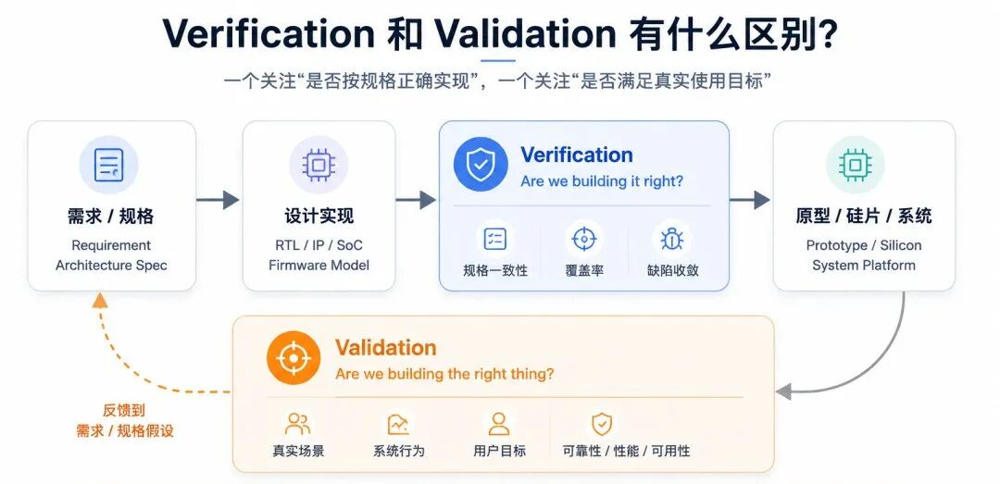

放到芯片研发里，可以这样理解：

**Verification** 更关注 RTL、IP、SoC、Firmware model 是否符合 specification、协议规范和架构约束。

**Validation** 更关注芯片或系统放到真实场景里，是否满足性能、可靠性、兼容性、可用性和用户目标。

前者更像是“对照规格逐项证明正确性”。后者更像是“回到真实系统目标，判断最终结果是否成立”。这不是谁更重要的问题，而是它们解决的风险不同。

## 21.2 **二、Verification 更关注规格一致性**

在 IC 研发中，Verification 通常更靠近设计实现阶段，尤其是在 pre-silicon 阶段。验证工程师会基于设计规格、协议规范、架构文档和功能需求，搭建 testbench，编写 test case、checker、assertion，收集 coverage，并通过 simulation、formal verification、emulation、FPGA prototype 等手段，证明设计实现是否符合预期。

Verification 很重视**可证明性**。它需要 test plan、coverage model、assertion、scoreboard、reference model、regression 和 bug tracking。它的核心目标不是证明几个典型场景能跑，而是系统性地降低设计缺陷风险。

## 21.3 **三、Validation 更关注真实目标是否成立**

Validation 更靠近系统集成、原型平台、硅后测试、实验室环境和真实 workload。它关心的问题不只是“设计有没有符合规格”，还包括：

**这个系统放到真实使用场景里，是否真的达到了目标？**

例如，一个 AI SoC 的 DDR controller 在 RTL verification 中已经通过协议检查，读写顺序也符合设计文档。但到了 system validation 阶段，还需要继续看：

- 跑真实模型推理时，带宽是否满足需求；

- 长时间压力测试下是否稳定；
- Linux driver、runtime 和 firmware 是否协同正常；
- 温度升高后性能是否出现不可接受的波动；
- 多任务并发时 QoS 是否符合系统预期；
- 目标应用场景关心的关键指标是否达标？

这些问题不一定都能在 RTL testbench 中完整地回答。因为它们涉及真实软件、真实板级环境、真实 I/O、真实功耗热行为，以及更长时间尺度上的系统运行。因此，Validation 的证据通常来自：

- prototype；

- emulation；
- FPGA platform；
- silicon board；
- lab measurement；
- system workload；
- bring-up log；
- User scenario test.

Validation 更关注最终系统是否可用、稳定、可靠，并且是否真正满足产品和用户目标。

## 21.4 **四、二者的差异**

| 维度 | Verification | Validation |
| --- | --- | --- |
| 核心问题 | 是否正确实现规格 | 是否满足真实使用目标 |
| 常见阶段 | 多在 Pre-silicon | 多在 Prototype、Post-silicon 和系统阶段 |
| 主要依据 | Specification、协议、架构约束 | Use case、系统需求、性能目标、可靠性目标 |
| 常见方法 | Simulation、Formal、UVM、Assertion、Coverage、Regression | Bring-up、系统测试、真实 workload、实验室测量、兼容性测试 |
| 关注证据 | 功能覆盖率、代码覆盖率、断言结果、bug 收敛 | 性能数据、稳定性结果、功耗热表现、系统日志、用户场景结果 |
| 典型问题 | 设计有没有按规格做对 | 规格定义的东西是不是解决了真实问题 |

**这个表里最容易被忽略的一点是：**

**Validation 有时会反过来挑战规格本身。**

也就是说，Verification 可能已经证明“设计符合规格”，但 Validation 仍然可能发现“规格本身不够好”。比如：

规格要求某个接口在理论带宽下达到目标，但真实 workload 中的数据访问模式并不理想；规格定义了某种错误恢复流程，但系统软件实际处理起来过于复杂，导致 bring-up 和维护成本很高；规格中假设某个使用场景很少发生，但真实客户环境中它反而频繁出现。

这时问题不一定是 RTL 写错了，而可能是架构假设、系统需求或使用场景理解不充分。

## 21.5 **五、为什么芯片项目里两者容易混淆？**

第一个原因是中文里它们都常被叫作“验证”。如果不区分语境，功能验证、系统验证、硅后验证、软件验证听起来都差不多。但在英文工程语境中，Verification 和 Validation 背后的问题意识不同：

- Verification 更强调 **conformance to specification**；
- Validation 更强调 fitness for intended use。

第二个原因是工具链和阶段会重叠。比如：

FPGA prototype 既可以用于 pre-silicon verification，也可以用于 software validation。Emulation 既能验证 RTL 系统行为，也能提前跑 firmware 和 driver。硅后实验室测试既会发现 validation 问题，也可能暴露 pre-silicon verification 漏掉的 RTL bug。

所以不能简单按工具划线，而要看这次活动到底在回答什么问题。

如果目标是证明设计符合 specification，这是 Verification。如果目标是证明系统满足真实场景和用户目标，这是 Validation。

## 21.6 **六、对工程师有什么启发？**

对验证工程师来说，理解 Validation 很重要。因为很多 RTL 验证的价值，最终要在系统场景里体现。一个在 testbench 中覆盖充分的功能，如果没有对应的真实 workload、软件路径和系统约束，可能仍然无法说明系统风险已经充分收敛。

对软件、Firmware 和 Bring-up 工程师来说，理解 Verification 也很重要。因为硅后遇到的问题，很多并不只是板级环境中的孤立现象，而是可以追溯到规格假设、RTL 行为、协议边界、异常路径覆盖不足和可观测性设计不足。

成熟的芯片团队不会把 Verification 和 Validation 割裂开。它们会尽量让验证资产向后延伸，让系统场景向前移动。例如：

- 把真实 workload 抽象成 pre-silicon 可运行的测试；

- 把driver smoke test 提前放到emulation或FPGA prototype上运行；

- 把硅后 error log 和 trace 机制提前纳入设计和验证计划；

- 让 coverage、debug、bring-up log 和系统测试结果形成反馈闭环。

这样做的目的不是增加流程，而是更早发现系统风险。

## 21.7 **总结**

**Verification 证明“设计是否按规格做对了”，Validation 证明“系统是否真正满足使用目标”。**

**前者强调规格一致性、覆盖率和缺陷收敛；后者强调真实场景、系统效果和最终可用性。**

你在项目中更常遇到哪类问题？

是**Verification 阶段漏掉的设计 bug**，还是**Validation 阶段才暴露的系统目标偏差**？

下一篇我们准备聊聊：Chiplet 时代，为什么验证复杂度会显著上升？敬请期待。

---

# 22. 从 IP 验证切到 SOC 验证，我才发现自己之前只是在”做局部题”

> 来源：https://mp.weixin.qq.com/s/QQo58CR6Asoq27F9a6rq9A
> 作者：make ic
> update 2026/08/29 12 : 59

---

做了这么多年 IP 验证，有一天 leader 说：”去接手 SOC 验证吧。”

IP 验证的核心诉求很清楚——**把这块逻辑跑透**。

Code coverage 告诉你哪些代码路径没走到，functional coverage 告诉你哪些设计意图没覆盖到。两者配合，你大概能知道这个 IP 的”健康度”。

这套方法论没错，但它的隐含前提是：**验证边界是固定的，你知道自己在验证什么。**

SOC 验证不满足这个前提。

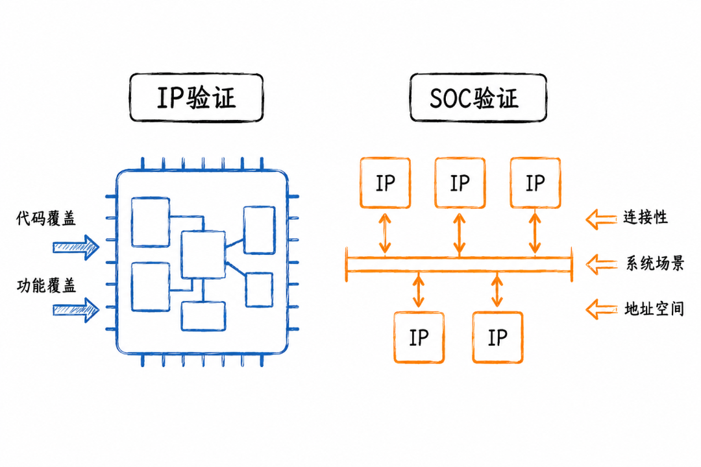

一个典型 SOC 里可能有几十个 IP，每个 IP 都带着自己的地址空间、中断线、DMA 通道、电源域。它们之间的交互不是”预先设计好的功能”，而是**涌现出来的系统行为**。

你不能用 line coverage 来衡量”CPU 通过 AXI 总线读 UART 寄存器这条路径有没有被覆盖”。这两件事压根不在同一个抽象层次上。

---

## 22.1 SOC 覆盖率的三个真正关注点

**第一，连接性 coverage。**

最基本的问题：所有该连的线，真的连对了吗？

听起来很蠢，但集成阶段的 bug 里，wire 接错、bit 反向、极性搞反——这类问题占比高得让人沉默。连接性验证不是”低级工作”，漏掉它就是在赌运气。

**第二，系统场景 coverage。**

SOC 真正的价值在于多个子系统协同工作。一个摄像头 SoC，ISP + CPU + DDR + DMA 同时跑的时候会不会死锁？这不是任何单个 IP 的问题，是系统级行为。

> 场景举例：DMA 突发传输期间 CPU 发起中断，结果 arbiter 饿死了某个 master——这种 bug 只在特定 traffic pattern 下才能复现。

这类场景必须人工定义，没有工具能自动帮你枚举”什么是有意义的系统场景”。这是 SOC 验证最考验工程师判断力的地方。

**第三，地址空间 coverage。**

每个寄存器有没有被访问到？边界地址有没有测过？地址解码逻辑对不对？

这块看起来机械，但漏测的后果是灾难性的——软件起来之后跑到错误的地址空间，调试起来极其痛苦。

---

## 22.2 为什么很多工程师切到 SOC 验证会不适应

**因为 IP 验证给人一种”覆盖率能收敛”的错觉。**

IP 验证里，你努力够，代码覆盖率能到 99%，剩下 1% 你能解释清楚为什么 waive。这是一种可量化、有终点感的工作。

SOC 验证没有这种安慰。

系统场景是开放的，地址空间可以无限细化，集成 bug 永远在你想不到的地方冒出来。覆盖率收敛更像一个工程判断，而不是一个数字达标。

这不是 SOC 验证的缺陷，这是它的本质。**复杂系统的验证本来就是一个不完备问题。**

接受这一点，才能在 SOC 验证里做出真正有价值的判断，而不是靠刷数字自我感动。

---

AI 芯片的爆发让 SOC 复杂度急剧上升。以 NVIDIA Blackwell、Apple M 系列这类产品为例，片上集成的 IP 数量、互联拓扑的复杂度已经超出了传统验证方法的舒适区。

正因如此，近几年 formal verification 在 SOC 连接性验证上的应用越来越受重视，部分团队开始用 ML 辅助生成系统级 test scenario。但工具再好，**工程师对系统行为的理解判断**仍然是无法被替代的那一环。

---

做 IP 验证是在解一道有标准答案的题。

做 SOC 验证更像是在给一个你永远不能完全理解的系统做体检——你只能尽量不漏掉重要的东西。

两种工作都需要，但需要的能力不太一样。

---

# 23. IP验证如何转向SoC验证

> 来源：https://mp.weixin.qq.com/s/aO3YZnk-9b3d2k9TZ81K9Q
> 作者：芯想事珹
> update 2026/08/29 13 : 01


很多做过 IP 级验证的，在进入 SoC 验证时会发现：UVM 还是那个 UVM，寄存器模型、Monitor、Scoreboard 也并不陌生，但问题的重心已经变了。要建立从模块级到系统级的验证思维，并梳理一条可执行的进阶路径。

IP 验证关注“一个模块是否足够正确”，SoC 验证关注“整个系统是否真的跑得起来”。从 IP 到 SoC，难点不只是环境变大，而是验证视角从局部时序切换到系统行为。

**核心思维差异**

IP 验证更像显微镜。它盯住的是单个 IP 的内部功能、边界条件和状态机覆盖，验证环境通常由 UVM 充当总线 Master，通过 Driver 主动向 DUT 灌激励，目标是尽可能穷举 IP 的行为边界。

SoC 验证更像望远镜。它关注的是系统集成、互联路径和真实应用场景，真实 CPU RTL 会成为总线 Master，验证重点转向 CPU 能否正确访问寄存器、中断能否被响应、多 IP 并发时总线是否竞争或死锁等系统级问题。

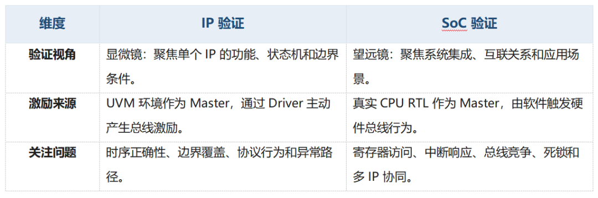

**SoC验证完整流程**

SoC 验证通常遵循“自顶向下规划、自底向上集成”的逻辑。文章将完整流程拆成六个关键阶段：

1. 制定验证计划：提取 SoC 功能点，覆盖连通性、启动复位、中断、功耗时钟、多 IP 协同等系统级测试点。

2. 搭建验证环境：完成 CPU、总线、IP、Memory 的 Top 层拼接；外部接口如 I2C、SPI、PCIe 挂载 UVM VIP，并配置为 Slave 或外部 Master 模式；同时挂载 Memory 模型用于存储 C 程序。

3. 冒烟测试：运行极简汇编或 C 代码，验证 CPU 到总线再到 Memory 的核心通路是否畅通。

4. 模块互联验证：围绕连通性、中断、DMA 等单项能力逐步验证模块之间的系统级协作。

5. 软硬件协同验证：由验证工程师或底层软件工程师编写 C 驱动代码，模拟真实软件行为来配置和驱动硬件。

6. 网表仿真与签核：带 SDF 延时文件跑核心用例，检查时序与 X 态传播，覆盖率达标后进入流片签核。

**SoC验证离不开C程序**

这是 IP 工程师转向 SoC 验证时最容易卡住的地方：为什么不能像 IP 验证那样继续让 UVM Driver 直接发总线事务？

原因在于 SoC 里已经有真实 CPU。总线时序不再由 UVM Driver 人工制造，而是由 CPU 硬件逻辑自然产生。验证工程师需要把 C 程序编译成机器码，加载到 SoC 的 Memory 中，让 CPU 执行这些机器码，从而产生真实的软件驱动行为。

因此，在 SoC 验证中，C 程序本质上替代了 IP 验证里的 uvm\_sequence：它不再是单纯的软件代码，而是驱动整个 SoC 运转的系统级激励源。

**C与UVM如何配合**

SoC 验证并不是抛弃 UVM，而是让 C 和 UVM 分工协作。文章总结了三种典型配合方式：

1. UVM 做“裁判与陪练”

在这种模式下，总线 UVM Driver 会被弱化或移除，C 程序负责配置外设和发起系统行为；UVM 保留 Monitor 与 Scoreboard，被动接收数据、观察总线行为，并完成结果比对和校验。

2. 通过握手机制实现同步

C 和 UVM 可以通过共享寄存器、共享内存或中断信号进行双向同步。比如 C 完成配置后写入特定标识通知 UVM 就绪，UVM 完成数据准备后写状态 Flag 或触发中断，再通知 C 继续执行。

3. 混合编译与仿真执行

实际运行时，C 程序会先通过交叉编译器转换成 .hex 或 .elf 机器码。仿真启动时，UVM 通过后门方式将机器码加载到 SoC 内存；CPU 启动后执行 C 代码，UVM 则同步进入监控、采集和校验阶段。

**转型建议**

从IP验证转到SoC验证，并不是把原来会的全部扔掉重来。IP级积累的那些东西，像寄存器抽象层、Scoreboard、Monitor、覆盖率建模这些，到了SoC级照样能用，不用推翻重学。真正需要调整的是看问题的角度，原来盯着一个模块的时序对不对、边界测没测全，现在得看整个系统在真实软件驱动下能不能跑起来。需要补的功课主要是C语言编程、理解CPU怎么访问内存和响应中断，还有C程序的编译加载脚本这些工程化的东西。思维方式也要跟着变，不再是关心单个IP有没有bug，而是多问一句：多个模块凑在一起，用真正的软件去驱动它，到底能不能协同完成系统任务。

**结 语**

要先完成视角切换，再理解完整流程，最后掌握 C 与 UVM 的协同方式。对有 IP 验证基础的工程师来说，这不是从零开始，而是把已有验证能力放到更大的系统上下文里重新使用。

**END**


---

# 24. [验证平台]时钟产生模块优化（二）

> 来源：https://mp.weixin.qq.com/s/Z8f7G6OcL3t2L9b6PFOYxw
> update 2026/08/29 13 : 08

`ifndef CREATE\_CLK\_MODULE\_SV

`define CREATE\_CLK\_MODULE\_SV

`timescale 1ns / 1fs

//============================================

// 时钟产生宏（随机相位偏移 + 频率抖动）

// 用法: `CREATE\_CLK(clk\_ref, 10.0, 0.0, 50.0, 100)

//   - clk\_ref    : 时钟信号名

//   - 10.0       : 周期，单位ns

//   - 0.0        : 相位偏移（可选），单位ns

//   - 50.0       : 占空比（可选），百分比

//   - 100        : 频率抖动（可选），单位ppm

// 说明: 启动时自动叠加1~10ns随机相位偏移

//       运行时每个周期按ppm值产生频率抖动

//============================================

`define CREATE\_CLK(clk\_name, period, phase=0.0, duty=50.0, jitter\_ppm=0) \

    gen\_clk\_module #(period,phase,duty,jitter\_ppm) \_\_``clk\_name``\_gen(clk\_name);

//`define CREATE\_CLK(clk\_name, period, phase=0.0, duty=50.0, jitter\_ppm=0) \

module gen\_clk\_module #(

    parameter real period, 

    parameter real phase      = 0.0, 

    parameter real duty       = 0.0, 

    parameter int  jitter\_ppm = 0 

    ) 

    (

    clk\_name

    );

  output clk\_name;

  logic clk\_tmp;

  real \_\_clk\_name\_jit;

  real \_\_clk\_name\_start\_phase;

  real \_\_clk\_name\_h\_period\_phase;

  real \_\_clk\_name\_l\_period\_phase;

  bit  \_\_clk\_name\_r\_select;

  assign clk\_name = clk\_tmp;

  initial begin 

    clk\_tmp = 1'b0;

    \_\_clk\_name\_start\_phase = (phase \* 1000 + $urandom\_range(1000, 10000)) \* 1ps;

    #\_\_clk\_name\_start\_phase; 

    forever begin 

      \_\_clk\_name\_jit = (jitter\_ppm > 0) ? ((period) \* (jitter\_ppm) \* ($urandom\_range(1000, 2000) - 1000) / 1000.0) : 0.0; 

      \_\_clk\_name\_r\_select = $urandom\_range(1,1); 

      clk\_tmp = 1'b1; 

      if(\_\_clk\_name\_r\_select) \_\_clk\_name\_h\_period\_phase = ((period) \* 1000000.0 \* ((duty) / 100.0) + \_\_clk\_name\_jit) \* 1fs; 

      else  \_\_clk\_name\_h\_period\_phase = ((period) \* 1000000.0 \* ((duty) / 100.0) - \_\_clk\_name\_jit) \* 1fs; 

      $display("h:%f",\_\_clk\_name\_h\_period\_phase); 

      #\_\_clk\_name\_h\_period\_phase; 

      clk\_tmp = 1'b0; 

      if(\_\_clk\_name\_r\_select) \_\_clk\_name\_l\_period\_phase = ((period) \* 1000000.0 \* ((100.0 - duty) / 100.0) + \_\_clk\_name\_jit) \* 1fs; 

      else  \_\_clk\_name\_l\_period\_phase = ((period) \* 1000000.0 \* ((100.0 - duty) / 100.0) - \_\_clk\_name\_jit) \* 1fs; 

      $display("l:%f",\_\_clk\_name\_l\_period\_phase); 

      #\_\_clk\_name\_l\_period\_phase; 

    end 

  end

endmodule

`define CREATE\_CLK\_SIMPLE(clk\_name, period) \

  bit clk\_name; \

  initial begin \

    clk\_name = 1'b0; \

    forever begin \

      #((period)/2.0); \

      clk\_name = ~clk\_name; \

    end \

  end

`endif

使用案例：

`timescale 1ns / 1ps

module heart\_tb();

reg clk;

reg reset\_n;

reg clk\_ref;

reg clk\_test;

reg clk\_ddr;

reg clk\_uart;

reg clk\_slow;

reg clk\_sys;

// 10ns周期，1000ppm频率抖动，启动时1~10ns随机相位偏移

`CREATE\_CLK(clk\_sys, 1.0, 0.0, 50.0, 10000)

`CREATE\_CLK(clk\_test, 1.0, 0.0, 50.0, 1000)

`CREATE\_CLK(clk\_ref, 1.0, 0.0, 50.0, 100)

endmodule

---

# 25. [验证平台]时钟产生器

> 来源：https://mp.weixin.qq.com/s/wyYaONu-688-_obyE4JYCg
> update 2026/08/29 13 : 30

// ============================================================

// clk\_gen\_macro.sv — 验证用时钟生成宏

// 一行宏调用，无需使用者写 initial/fork/join 等样板代码

// ============================================================

// 用法（在验证平台顶层直接调用）：

//

//   `CREATE\_CLK(clk\_sys, 100.0)              // 100MHz, 50% duty, 无频偏/相移

//   `CREATE\_CLK(clk\_ddr, 400.0, 0.5, 0.0, 0.0)  // 400MHz, 默认参数

//   `CREATE\_CLK(clk\_usb, 48.0, 0.5, 1.5, 0.02)  // 48MHz, 1.5ns相移, 2%抖动

//   `CREATE\_CLK(clk\_eth, 125.0, 0.55, 0.0, 0.005, 42)  // 带自定义种子

//

// 宏会自动声明 clock 变量（logic），自动创建 initial + fork 进程。

// 使用者只需在模块/endmodule 之间写一行宏调用即可。

// ============================================================

// ------------------------------------------------------------------

// `CREATE\_CLK(CLK\_NAME, FREQ\_MHZ, DUTY=0.5, PHASE\_NS=0.0, JITTER\_PCT=0.0, SEED=1)

//

// 参数:

//   CLK\_NAME   - 时钟信号名（自动声明为 logic）

//   FREQ\_MHZ   - 频率 (MHz, real)

//   DUTY       - 占空比 0.0~1.0 (默认 0.5 = 50%)

//   PHASE\_NS   - 相位偏移 (ns, 默认 0.0)

//   JITTER\_PCT - 频偏/周期抖动百分比 RMS (0.0~1.0, 默认 0.0)

//   SEED       - 随机种子 (int, 默认 1)

// ------------------------------------------------------------------

`define CREATE\_CLK(CLK\_NAME, FREQ\_MHZ, DUTY=0.5, PHASE\_NS=0.0, JITTER\_PCT=0.0, SEED=1) \

    logic CLK\_NAME;                                                                       \

    initial begin                                                                         \

        automatic real    \_\_f\_``CLK\_NAME = FREQ\_MHZ;                                     \

        automatic time    \_\_t\_``CLK\_NAME;                                                   \

        automatic real    \_\_d\_``CLK\_NAME = DUTY;                                          \

        automatic time    \_\_p\_``CLK\_NAME = PHASE\_NS \* 1ns;                                \

        automatic real    \_\_j\_``CLK\_NAME = JITTER\_PCT;                                    \

        automatic int     \_\_s\_``CLK\_NAME = SEED;                                          \

        CLK\_NAME = 1'b0;                                                                   \

        if (\_\_f\_``CLK\_NAME <= 0) begin                                                     \

            $fatal(1, "[CREATE\_CLK] %m: FREQ\_MHZ must be > 0 (got %0f)", \_\_f\_``CLK\_NAME); \

        end                                                                               \

        \_\_t\_``CLK\_NAME = (1\_000\_000.0 / \_\_f\_``CLK\_NAME) \* 1ps;                            \

        #(\_\_p\_``CLK\_NAME);                                                                \

        fork                                                                              \

            forever begin                                                                 \

                automatic time \_\_half\_h = \_\_t\_``CLK\_NAME \* \_\_d\_``CLK\_NAME;                \

                automatic time \_\_half\_l = \_\_t\_``CLK\_NAME \* (1.0 - \_\_d\_``CLK\_NAME);        \

                automatic time \_\_jit\_h  = \_\_j\_``CLK\_NAME > 0                              \

                    ? $dist\_normal(\_\_s\_``CLK\_NAME, 0, \_\_t\_``CLK\_NAME \* \_\_j\_``CLK\_NAME)    \

                    : 0;                                                                  \

                automatic time \_\_jit\_l  = \_\_j\_``CLK\_NAME > 0                              \

                    ? $dist\_normal(\_\_s\_``CLK\_NAME, 0, \_\_t\_``CLK\_NAME \* \_\_j\_``CLK\_NAME)    \

                    : 0;                                                                  \

                CLK\_NAME = 1'b1;                                                           \

                #(\_\_half\_h + \_\_jit\_h);                                                    \

                CLK\_NAME = 1'b0;                                                           \

                #(\_\_half\_l + \_\_jit\_l);                                                    \

            end                                                                           \

        join\_none                                                                          \

    end

// ============================================================

// 快速参考卡 — 常见频点一行宏

// ============================================================

//

// `CREATE\_CLK(clk\_sys,   100.0)                      // 100 MHz

// `CREATE\_CLK(clk\_bus,   50.0)                       // 50  MHz

// `CREATE\_CLK(clk\_ddr,   400.0)                      // 400 MHz

// `CREATE\_CLK(clk\_serdes, 312.5)                     // 312.5 MHz

// `CREATE\_CLK(clk\_usb,   48.0,  0.5, 0.0, 0.0)      // 48 MHz

// `CREATE\_CLK(clk\_eth,   125.0, 0.5, 0.0, 0.005)    // 125 MHz + 0.5% jitter

// `CREATE\_CLK(clk\_vco,   2000.0, 0.5, 0.0, 0.0, 42) // 2 GHz, 自定义种子

//

// 以上每行都是完整有效的调用。只需放在 module ... endmodule 之间即可。

---

# 26. 什么是BootROM？为什么芯片启动离不开它

> 来源：https://mp.weixin.qq.com/s/Xf0FnVGK_phjYzx8Mtu-9w
> 作者：芯片验证
> update 2026/08/29 13 : 34

一颗芯片刚上电时，系统还处在非常早期的状态。DDR通常还没有完成初始化，操作系统也还没有启动。即使启动镜像位于外部Flash、eMMC等介质中，芯片也需要先具备访问这些介质的基本硬件条件，并确定从哪里、以什么方式加载后续软件。这时需要有一段最早执行的代码，把芯片从“刚复位”的状态带到“可以继续启动”的状态。这段代码，通常就是BootROM。

严格来说，并不是所有芯片都必须使用BootROM；但对于包含CPU或管理处理器的复杂SoC，BootROM是一种非常常见的早期启动机制。

BootROM通常是处理器复位后最早执行的软件之一。它的任务不是完成整个系统启动，而是把芯片带到可以加载下一阶段软件的状态。DMXAI芯片验证

## 26.1 芯片上电后，谁来执行第一段代码

芯片启动不是从Linux、RTOS或应用程序开始的。在系统真正运行起来之前，处理器需要先知道从哪里取第一条指令，也需要判断启动模式是什么、下一阶段软件在哪里、当前硬件环境是否满足继续启动的条件。

这些事情不能等操作系统来做，因为操作系统本身还没有被加载；也不能完全交给外部软件，因为外部存储、总线接口和安全状态都可能还没有准备好。所以芯片内部通常会提供一段固化的启动代码。复位释放后，处理器会从芯片定义的复位入口开始取第一条指令，通常这个入口会指向BootROM所在地址或对应的启动逻辑。

BootROM通常是软件启动链路中非常靠前的一环，但在它执行之前，芯片内部的电源、复位、时钟以及部分硬件启动逻辑已经开始工作。一个简化后的启动链路，可以理解为：

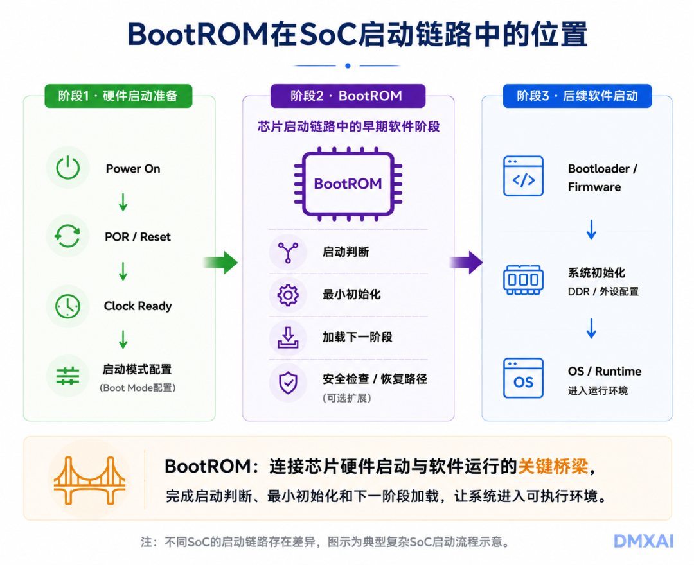

## 26.2 BootROM是什么

BootROM通常指固化在芯片内部ROM中的早期启动代码。严格来说，ROM是存储这些代码的硬件；工程讨论中常说的BootROM，通常指固化在片内ROM中的启动程序，以及围绕它形成的早期启动阶段。

从软件角度看，它是一段启动代码；从芯片架构角度看，它是连接硬件初始状态和软件运行环境之间的桥梁。

它和普通固件不同。普通固件可以放在Flash、eMMC或其他外部存储里，后续还能通过软件方式更新；BootROM则通常在芯片制造时就已经固化，回片后很难再修改。

这也是BootROM特殊的地方。它的位置非常早，权限通常很高，和芯片架构、启动模式、安全策略、存储接口、调试入口都有直接关系。它不一定代码量很大，但它必须足够可靠，因为后面所有启动阶段都依赖它先跑起来。

可以把BootROM理解成芯片启动链路的第一环。它不负责把整个系统完整拉起来，但要完成一个关键任务：让系统具备加载下一阶段Bootloader或固件的条件。

## 26.3 BootROM通常负责哪些事情

不同芯片的BootROM实现会有差异，但核心任务通常比较相似。

首先，它会判断启动模式。启动模式可能来自strap pin、eFuse、OTP、配置寄存器或其他硬件状态，用来决定芯片从SPI Flash、eMMC、SD、USB、UART或其他启动介质启动。

其次，它会准备最小硬件环境。比如配置必要的时钟、复位和访问权限，准备可用的片上SRAM，并初始化读取启动介质所需要的最小硬件环境。

第三，它会加载下一阶段软件。这个软件可能是Bootloader，也可能是安全固件、一级启动程序或厂商自定义的初始化代码。

第四，它可能承担安全启动相关工作。比如检查镜像头、校验签名、处理加密镜像、读取安全配置，或者根据安全策略决定是否允许继续启动。

最后，它还可能处理失败回退、下载或恢复路径。例如主启动介质失败后尝试备用启动源，或者在特定条件下进入UART、USB等下载模式。对于带安全机制的SoC，BootROM还可能参与调试权限的配置或认证；而JTAG等硬件调试链路本身通常由独立的调试基础设施实现。

BootROM不一定做很多事，但它做的每件事都处在启动链路最前面。一旦这里出错，后面的软件可能根本没有机会运行。

## 26.4 BootROM和Bootloader有什么区别

BootROM和Bootloader经常被放在一起讨论，但它们不是一回事。BootROM通常是芯片内部固化的第一阶段启动代码，复位后最先执行，通常不可随意更新。

Bootloader通常是由BootROM从外部存储或其他启动介质加载的下一阶段软件。它可以承担更复杂的初始化任务，比如DDR初始化、镜像加载、设备树处理、外设配置，最终进入RTOS、Linux或其他运行环境。

DMXAI芯片验证BootROM通常固化在芯片内部，负责最早期启动；Bootloader通常从外部存储加载，负责更复杂的初始化和系统加载。BootROM负责把系统带到“能加载下一阶段”的状态；Bootloader负责把系统继续带到“能运行完整软件”的状态。

实际芯片的启动链可能包含多个Bootloader、安全固件或厂商自定义初始化阶段，这里只是概念上的简化。

很多启动问题看起来像Bootloader没有跑起来，但真正原因可能发生在更早的BootROM阶段，比如启动介质选择错误、镜像格式解析失败、权限配置不对，或者片上SRAM不可用。

## 26.5 为什么BootROM一旦出错很难补救

BootROM的问题通常比普通软件问题更难处理，原因很直接：它太早，也太难更新。有些芯片会设计BootROM patch、eFuse配置或备用启动路径来规避部分问题，但这些能力通常有限，不能把BootROM当成普通软件一样随意更新。

如果BootROM里的启动模式判断错了，芯片可能从错误介质启动；如果镜像地址或格式解析错了，下一阶段软件可能加载失败；如果安全校验流程有问题，合法镜像可能无法通过，或者非法镜像被错误接受；如果调试入口处理不当，回片后问题定位会变得非常困难。

对Bring-up团队来说，BootROM问题尤其棘手。因为这个阶段很多调试条件还没有建立。DDR可能还不能用，复杂日志系统还没起来，驱动和操作系统都没有参与。团队可能只能依赖JTAG、UART、状态寄存器、启动进度码、电流变化或板级信号，一步步判断芯片到底运行到了哪里。

一个常见现象：芯片上电有电流、有时钟，但UART没有任何输出。此时问题未必在Linux或驱动，可能是BootROM甚至更早的启动阶段没有进入预期路径。

BootROM这“很早的一小段代码”不简单。它决定了芯片能不能进入后续可调试、可加载、可验证的状态。

## 26.6 为什么BootROM也需要专门验证？

BootROM验证不能只看“能不能跳到Bootloader”。它既包括软件逻辑，也包括BootROM和硬件启动配置、存储接口、安全状态、调试入口之间的交互。

真正需要关注的是：各种启动模式是否都被覆盖，镜像格式是否解析正确，异常路径是否可控，安全校验失败时是否有合理处理，如果架构定义了备用启动路径，主启动介质失败后能否按照预期进入fallback或recovery流程，eFuse或OTP配置组合是否符合预期，reset场景下状态是否一致。

BootROM验证不仅要覆盖正常启动路径，也要覆盖失败路径。比如镜像不存在、签名失败、介质读失败、配置冲突、非法启动模式、恢复入口条件不满足，都应该有明确处理方式。这些问题如果等回片后才第一次面对，定位成本会非常高。在Tapeout前，如果能在RTL仿真、Emulation或FPGA Prototype上提前跑通BootROM、Bootloader和基础启动链路，就可以提前暴露大量软件可见的系统问题。

对复杂SoC来说，提前建立可运行的FPGA Prototype环境，不只是验证功能，也是在提前验证启动链路、软件协同和调试路径。

这类验证不能替代真实硅片上的Bring-up，但可以减少回片后同时存在的未知数。至少团队可以提前确认：启动路径是否清楚，日志和进度码是否可用，失败模式是否可复现，软件镜像和硬件配置是否描述了同一个系统。

RTL仿真、Emulation和FPGA Prototype并不能等价复现真实硅片上的电源时序、模拟/PHY行为、真实OTP/eFuse状态以及部分安全和物理实现因素。它们能够降低Bring-up风险，但不能替代硅后验证。

对复杂SoC和AI芯片来说，它们完整的启动链往往还会涉及安全固件、多个处理器或管理核、DDR/HBM等内存系统、电源域管理以及后续driver/runtime初始化。BootROM虽然只负责最早的一段，但它决定了后续这些阶段能否获得一个可靠的启动基础。

## 26.7 总结DMXAI芯片验证

BootROM是复杂SoC启动链路中常见的早期软件阶段，连接复位入口、启动模式、最小硬件初始化、镜像加载、安全检查、恢复路径以及部分安全访问控制逻辑。

沟通交流微信:xor404，请备注单位和职务


---

# 27. 从精确控制到放手：SOC验证工程师的第一课

> 来源：https://mp.weixin.qq.com/s/hdP6VHrvRsOiQHjJ_q1f6w
> 作者：make ic
> update 2026/08/29 13 : 35

你在IP验证平台上调了三天的bug，终于把那个corner case抓住了。sequence里精确到第47个时钟周期拉高valid信号，第52个周期插入back pressure。波形完美重现，问题定位，修复验证，收工。

第二年你坐进SOC项目组。tech lead说，现在写个C程序让CPU去读那个寄存器。

**你突然意识到：你不再拥有时钟周期级别的控制权了。**

这是IP验证和SOC验证最本质的区别，也是大多数验证工程师转型时第一个卡住的地方。

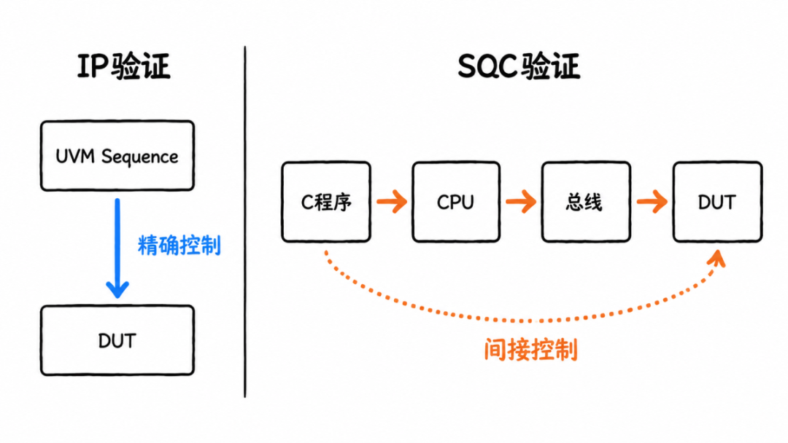

---

## 27.1 激励源的代际更替

IP验证的激励链条很短：你写UVM sequence → 驱动virtual interface → transaction在总线上 → DUT响应。整条路径透明可控，你就是那个orchestrator。

SOC验证的激励链条长得多：你写C程序 → 编译成指令 → CPU取指执行 → 发起总线transaction → 穿过interconnect → 最终到达目标IP。中间隔了编译器、CPU流水线、cache、总线仲裁、地址译码。

**问题来了：当transaction没按预期出现在总线上，是软件逻辑写错了，还是编译器优化了你的代码，还是cache命中导致没有总线访问，还是总线仲裁延迟了？**

你失去了直接控制激励的能力，但获得了更接近真实使用场景的测试环境。

这是一个trade-off，不是技术倒退。

---

## 27.2 Chiplet时代的验证困境

2025年UCIe 3.0发布，带宽翻倍到48 GT/s。多die封装成为主流，CPU die、AI加速die、IO die通过chiplet互联拼成一个SOC。

这让SOC验证更复杂了：

- 激励可能来自不同die上的多个CPU
- 跨die的延迟和时序不确定性增加
- 你需要协调多个软件栈同时跑

有个项目组尝试用纯软件测试chiplet间的coherency协议，测试代码写了2000行，跑了一周才触发一次bug。最后发现是多核之间的memory barrier没加对。

**在IP验证阶段，这个问题10行SystemVerilog就能稳定重现。**

---

## 27.3 你需要重建思维模型

从IP到SOC，验证工程师的技能栈发生了结构性变化：

**UVM/SystemVerilog的比重下降** → 你需要更多时间写C/汇编，理解编译器行为，调试软件栈

**Debugging方式变了** → 不能只看波形了，得学会用CPU trace、profiler、性能计数器

**Coverage策略变了** → 功能覆盖率需要mapping到软件行为，而不是纯硬件状态机

有验证工程师抱怨：”我是来做硬件验证的，不是来写驱动的。”这个抱怨有道理，但没意义。SOC验证的本质就是软硬件协同验证，你逃不掉。

---

## 27.4 控制的幻觉与真实的价值

IP验证让你感觉掌控一切，但那只是在验证环境里的掌控。SOC验证逼着你面对真实世界的复杂性：软件会写错，编译器会优化，CPU会乱序执行，cache会影响时序。

**真正有价值的bug，往往藏在这些你放弃精确控制之后的地方。**

一个DMA控制器在IP验证阶段跑了100万条random测试都没问题，到SOC验证时Linux启动过程中必现死锁。原因是驱动程序的中断处理和DMA描述符更新之间有race condition，这个场景在纯UVM环境里很难构造出来。

所以SOC验证不是IP验证的简化版，而是另一个维度的战场。你需要放弃一部分控制精度，换取覆盖真实使用场景的能力。

---

从IP到SOC，最难的不是学新工具或新语言，而是接受”我不再能精确控制每个时钟周期”这个事实。

但这也意味着你的工作更接近芯片的最终价值：**能跑软件的硬件才是真正的SOC。**

验证工程师的价值不在于你能控制多精确，而在于你能发现多少真实世界会遇到的问题。

---

# 28. 什么是Assertion？把芯片设计规则变成自动检查

> 来源：https://mp.weixin.qq.com/s/OznDZ-hQWs0v1dCGnAxnHA
> 作者：芯片验证
> update 2026/08/29 13 : 35

仿真跑完了，log里没有明显报错，波形也大致正常，是不是就说明设计正确？在芯片验证里，答案通常没有这么简单。

复杂RTL设计中，很多错误不会一直停在那里等人发现。它可能只持续几个cycle，可能只出现在某个状态切换瞬间，也可能只有在reset、backpressure、overflow、异常响应这类边界场景下才暴露。如果完全依赖看波形，很容易漏掉问题。Assertion就是为了解决这类问题。

DMXAI芯片验证在仿真验证中，Assertion不是testcase。Testcase负责制造场景，Assertion负责检查设计在这些场景下有没有违反规则。

## 28.1 为什么光靠看波形不够

看波形是芯片验证里非常重要的调试手段，但它不适合作为主要的规则检查方式。原因是：波形信息太多，而设计规则往往很具体。比如，某些valid/ready协议规定，在握手完成前，valid和相关payload必须满足特定的保持规则。FIFO通常要求empty时不应发生协议未允许的有效读出或underflow，full时不能继续写入新数据，除非设计协议明确允许同周期读写等特殊行为。再比如，req发出后，ack必须在规定周期内回来。

这些规则如果靠人每次打开波形去看，不仅效率低，也很难在大规模regression里持续执行。更现实的问题是，很多bug发生得很早，但系统最终错误可能很晚才出现。等输出结果错了再回头追，调试路径会很长。Assertion的作用，就是把这些关键规则提前写下来，让仿真在运行过程中自动检查。

## 28.2 Assertion是什么

Assertion可以理解成一种“可执行的设计规则”。更准确地说，设计规则通常会被描述成一个property，也就是在特定前提和时间关系下，设计应该满足什么行为；Assertion则要求工具对这个property进行检查。

在SystemVerilog中，这类规则通常通过SVA来描述。SVA本质上是在用语言描述这些时序property。例如：

- FIFO为空时不应发生协议未允许的有效读出或underflow；
- 状态机不能进入非法状态；
- request发出后必须在限定周期内得到response；
- reset释放后，架构规定需要初始化的关键状态，必须在规定时序内进入预期状态；
- valid保持期间，data不能违反协议规定的稳定性要求。

这些规则不一定负责制造输入场景。它们更像是放在设计旁边的检查器，持续观察DUT有没有做出不该做的行为。所以Assertion不是替代testcase，也不是替代Testbench。它解决的是另一个问题：当某个场景发生时，设计是否遵守了应该遵守的规则。

## 28.3 Assertion通常检查哪些规则

Assertion最常见的使用有几类。

第一类是协议规则。比如valid/ready、req/ack、AXI、APB这类总线接口，都有明确的握手、时序和稳定性要求。这类规则非常适合写成Assertion，因为一旦接口协议被破坏，后面看到的系统错误往往已经离根因很远。

第二类是时序关系。比如某个事件发生后，另一个事件必须在N个cycle内发生；某个enable拉高后，状态必须按规定顺序推进。这类规则靠波形检查很容易漏，用Assertion可以自动捕捉。

第三类是状态机和资源边界。非法状态、非法跳转、FIFO overflow/underflow、counter越界、buffer满空条件错误，都是Assertion常见的检查对象。

第四类是跨模块接口契约。很多SoC集成问题不是单个模块写错，而是上下游对接口、时钟、reset、配置顺序的理解不一致。把这些隐含假设变成显式property，是Assertion在SoC集成阶段非常重要的价值。

还有一些局部数据一致性也适合用Assertion检查。例如请求携带的ID、tag或attribute，在经过流水线、buffer或仲裁后，仍需要满足特定对应关系。

## 28.4 Assertion和Testbench是什么关系

如果把Testbench看成给DUT搭建验证环境的系统，那么Assertion就是放在关键位置上的规则检查器。

Testbench负责给DUT提供clock、reset、transaction、配置流程、数据包和异常场景，让DUT跑起来。Assertion则负责在DUT运行过程中检查关键规则有没有被破坏。

testcase解决“场景有没有发生”，Assertion解决“场景发生以后，设计有没有违反规则”。上面的区分主要针对simulation环境；在Formal中，场景的产生方式不同，但Assertion仍然用于表达和检查设计性质。

Assertion尤其适合检查局部时序关系、协议规则、不变量和控制行为，但不是所有功能正确性都适合写成Assertion。对于复杂数据计算、transaction级结果比较和端到端数据正确性，通常还需要scoreboard或reference model。Assertion、checker和scoreboard解决的是不同层次的问题。

## 28.5 Assertion为什么也能用于Formal Verification

在Simulation里，Assertion只能检查已经被激励到的场景。也就是说，如果testcase没有跑到某个状态，相关Assertion就没有机会触发。

在Formal Verification里，Assertion还可以承担另一种角色：作为需要证明的性质。在Formal Verification中，工具不是等待testcase产生某一条具体轨迹，而是在给定模型和约束条件下探索可能的输入和可达状态，并尝试证明这个property在约束范围内是否始终成立。如果证明不了，工具可能给出一个反例，告诉工程师在什么条件下规则会被打破。

在仿真中，Assertion只能检查已经被激励到的场景；在Formal Verification中，工具会在给定约束下尝试证明property是否成立，但证明成功、证明失败和证明尚未收敛，是不同结果。DMXAI芯片验证

在Formal环境中，还经常会区分不同property的角色：assert描述DUT必须满足的性质，assume描述环境或输入需要满足的约束，cover用于寻找某个目标场景是否能够发生。这也是Assertion很有价值的地方。它既可以在Simulation中帮助自动报错，也可以在Formal Verification中用于分析和证明协议不变量、FIFO边界、非法状态不可达、仲裁规则等关键性质。当然，Formal也不是万能的。复杂SoC状态空间很大，仍然需要合理抽象、约束和工程取舍。

## 28.6 Assertion没有报错，就说明验证到了吗？

答案是不一定。这是使用Assertion时很容易忽略的问题。Assertion没有失败，可能是规则确实一直成立，也可能是触发条件根本没有发生。比如有一条规则：request发出后，3个cycle内必须收到ack。如果整个regression里request从来没有发生，这条Assertion当然不会报错，但这并不说明request/ack路径已经被有效验证。

对于这类带触发前提的implication property，如果前提条件始终没有发生，property可能以Vacuous Pass的方式成立，也就是所谓vacuity。表面上没有失败，但真正需要验证的后续关系可能从未被检查。

所以，判断Assertion有没有价值，不能只看有没有failure。还要关注触发条件是否真正发生、property是否得到有效评估，以及工具提供的assertion coverage、cover property和functional coverage等证据。这也是为什么好的验证环境不只关心“有没有报错”，还要关心“检查是否真的发生过”。

## 28.7 什么样的Assertion才真正有价值

Assertion不是越多越好，也不是把所有“不应该发生”的情况都写一遍就有价值。好的Assertion至少要满足几个条件。

第一，规则要明确。它最好能对应Spec、interface contract或architecture requirement，而不是一句模糊的“系统不应该出错”。

第二，离根因要近。Bug刚发生时就报错，比系统几千个cycle以后输出错误再追根因更有价值。

第三，失败要容易解释。一条property最好对应一个清楚的设计意图。报错后，工程师能快速知道是哪条规则被破坏。

第四，要能判断是否真正被激活。否则Assertion永远是绿色的，但触发条件从未出现，验证证据就很弱。

比如接口边界、状态机关键跳转、FIFO和queue边界、跨模块接口契约、reset和低功耗切换路径、容易被软件配置影响的控制路径，都是值得优先考虑的位置。真正有用的Assertion，应该离问题足够近，让bug在刚刚发生时就被抓住。

## 28.8 总结

Assertion把芯片设计中的关键规则变成可以被工具检查的property。和Testbench、testcase或scoreboard一起，让协议、状态机、资源边界和跨模块接口契约的问题更早暴露；好的Assertion不只是“没有报错”，还要确认规则被真正激活、结果可解释。Assertion真正提高的，不只是检查效率，而是把原本存在工程师脑子里的设计意图，变成能够在每一次Regression中持续执行的验证规则。沟通交流加微信:xor404，请备注单位和职务。

---

# 29. SoC级SRAM/ROM验证方法

> 来源：https://mp.weixin.qq.com/s/GE9gO9ghg5Rs5n1oE2Yl8g
> 作者：芯想事珹
> update 2026/08/29 13 : 41


在SoC验证中，SRAM和ROM通常是最基础的片上存储模块。从模块级角度看，SRAM/ROM的功能似乎很简单：给定地址，完成读写或返回固定数据。但在SoC级环境中，memory验证并不只是验证一个数组是否能读写，而是要验证完整访问链路是否正确。

典型访问路径可以概括为：CPU / JTAG / DMA / Bus Master → 系统总线 → 地址译码 → 总线桥接 → Memory Slave → SRAM / ROM Model。

因此，SoC级memory验证的核心目标是：
不仅要确认存储数据正确，还要确认访问路径、地址映射、总线协议、响应时序和数据宽度处理都符合设计预期。

**01**

**SRAM/ROM验证的核心概念**

**Memory地址空间**

每个SRAM或ROM在SoC中都会有固定的地址范围，例如：

ROM  : 0x0000\_0000 ~ 0x0000\_7FFF

SRAM : 0x2000\_0000 ~ 0x2003\_FFFF

验证时首先要确认：

1. base地址是否正确

2. top地址是否正确

3. size是否和设计文档一致

4. 地址译码是否覆盖完整范围

5. 是否存在地址alias

如果一个memory容量为32KB，数据宽度为32bit，则word数量为：

32KB / 4 = 8192 words = 2^13

对应memory model中的地址宽度通常应为：

ADDRWIDTH = 13

如果地址宽度配置过小，就会出现高地址和低地址访问到同一物理存储单元的问题。

**CPU访问路径**

CPU访问memory时，验证的是处理器真实执行路径：

CPU Core → I-Code/D-Code/System Bus → AHB/AXI Bus → Memory

这种方式适合验证：

1. CPU是否能正常取指

2. CPU是否能读写SRAM

3. ROM vector table是否可访问

4. 总线地址译码是否正确

5. byte/halfword/word访问是否正确

常见的软件访问宏如下：

```
typedefunsignedint u32;
typedefunsignedshort u16;typedefunsignedchar u8;
#define reg_write32(addr, val)  (*(volatile u32 *)(addr) = (u32)(val))#define reg_read32(addr)        (*(volatile u32 *)(addr))
#define reg_write16(addr, val)  (*(volatile u16 *)(addr) = (u16)(val))#define reg_read16(addr)        (*(volatile u16 *)(addr))
#define reg_write8(addr, val)   (*(volatile u8 *)(addr) = (u8)(val))#define reg_read8(addr)         (*(volatile u8 *)(addr))
```

**JTAG访问路径**

JTAG访问memory时，验证的是debug访问链路：

JTAG TAP → Debug Module / DAP → Bus Master → System Bus → Memory

JTAG验证适合确认：

1. JTAG TAP是否正常

2. Debug访问路径是否打通

3. JTAG master是否能访问目标地址空间

4. ROM/SRAM是否能通过debug路径读写

5. 总线response是否正确返回

需要注意的是，JTAG能读到IDCODE，只能说明JTAG TAP链路正常；
并不代表JTAG一定能访问系统地址空间。

因此，一般需要先读一个已知系统寄存器，例如CPU ID寄存器，确认debug访问路径可用。

**02**

**SRAM验证方法**

SRAM是可读写存储器，因此验证重点包括数据通路、地址通路和字节写使能。

**word读写测试**

最基本的SRAM测试是32bit word写读：

```
reg_write32(addr, 0x11223344);
data = reg_read32(addr);if (data != 0x11223344) {    fail();}
```

常用pattern例如：

```
0x00000000
0xFFFFFFFF0x555555550xAAAAAAAA0x123456780x87654321
```

该测试可以发现：

1. 数据线stuck-at

2. 读写通路错误

3. 总线返回数据错误

4. 地址译码未命中

**byte lane测试**

对于32bit SRAM，通常有4个byte lane：

```
byte0 → data[7:0]
byte1 → data[15:8]byte2 → data[23:16]byte3 → data[31:24]
```

byte写测试可以验证写使能是否正确。

示例：

```
reg_write32(addr, 0xA5A5A5A5);
reg_write8(addr + 0, 0x11);// expected: 0xA5A5A511reg_write8(addr + 1, 0x22);// expected: 0xA5A52211reg_write8(addr + 2, 0x33);// expected: 0xA5332211reg_write8(addr + 3, 0x44);// expected: 0x44332211
```

如果结果不符合预期，通常需要检查：

1. byte enable信号是否正确

2. 总线WSTRB/HWRITE/HSIZE是否正确

3. endian处理是否正确

4. SRAM wrapper是否正确拼接byte lane

**halfword测试**

halfword测试用于验证16bit访问：

```
reg_write32(addr, 0xA5A5A5A5);
reg_write16(addr + 0, 0x1122);// expected: 0xA5A51122reg_write16(addr + 2, 0x3344);// expected: 0x33441122
```

该测试可以覆盖：

1. 16bit访问对齐

2. HSIZE或WSTRB处理

3. 低半字和高半字写入路径

**walking data测试**

walking data用于检查单bit数据线问题：

```
for (i = 0; i < 32; i++) {
    data = 1 << i;    reg_write32(addr, data);    check(addr, data);    data = ~data;    reg_write32(addr, data);    check(addr, data);}
```

该测试可以发现：

1. 数据线短路

2. 数据线断路

3. 单bit stuck-at 0/1

4. bit翻转错误

**地址alias测试**

地址alias测试是SRAM验证中非常重要的一项。

方法是在不同地址写入不同pattern，然后逐个读回：

```
reg_write32(base + 0x0000, pattern0);
reg_write32(base + 0x1000, pattern1);reg_write32(base + 0x2000, pattern2);reg_write32(base + 0x4000, pattern3);check(base + 0x0000, pattern0);check(base + 0x1000, pattern1);check(base + 0x2000, pattern2);check(base + 0x4000, pattern3);
```

如果某两个地址读回相同或互相覆盖，说明可能存在：

1. ADDRWIDTH配置过小

2. 地址线未连接

3. 地址译码范围错误

4. 高地址bit被截断

**sweep测试**

sweep测试会遍历SRAM某个地址范围，对每个word写入地址相关pattern，再全部读回检查。

```
for (addr = start; addr <= end; addr += 4) {
    data = pattern(addr);    reg_write32(addr, data);}for (addr = start; addr <= end; addr += 4) {    data = pattern(addr);    check(addr, data);}pattern最好和地址相关，例如：static u32 pattern(u32 addr){    u32 data;    data = addr ^ 0xA5A55A5A;    data = data + ((addr << 7) | (addr >> 25));    data = data ^ 0x3C3CC3C3;    return data;}
```

这种方式比固定pattern更容易发现地址alias问题。

**03**

**SRAM验证中的常见风险**

**sweep覆盖自身栈区**

如果测试程序本身运行在被测SRAM中，那么全空间sweep可能会覆盖：

1. stack

2. heap

3. .data

4. .bss

5. printf使用的runtime区域

典型现象是失败地址靠近SRAM顶部，例如：

ADDR = SRAM\_TOP附近

EXP  = pattern值

GOT  = 函数调用或printf写入的数据

这种情况并不一定是SRAM设计错误，而是测试程序破坏了自身运行环境。

解决方法是划定安全测试区域：

```
#define SRAM_TEST_START  0x20001000
#define SRAM_TEST_END    0x2003BFFC
```

保留顶部空间给stack使用。

**printf影响测试结果**

printf()通常会使用较多stack，也可能访问UART、semihosting或调试接口。
在memory sweep期间，频繁调用printf()可能引入额外干扰。

更稳妥的方式是：

1. 测试开始时打印一次

2. 测试过程中只在失败时打印

3. sweep循环中避免大量printf

4. fail时记录addr/exp/got

**测试范围必须word对齐**

对于32bit读写，地址应保持4字节对齐：

```
addr[1:0] == 2'b00
```

否则可能触发：

1. unaligned access fault

2. 总线拆分访问

3. wrapper不支持非对齐访问

4. 与预期不一致的数据拼接

**04**

**ROM验证方法**

ROM是只读存储器，验证重点不在写入，而在于：

1. ROM初始化内容是否正确

2. CPU/JTAG是否能读到ROM

3. 地址范围是否正确

4. 高地址是否存在alias

5. endian是否正确

ROM验证通常分为：

1. 读取关键地址

2. 读取vector table

3. 抽样检查

4. 全空间sweep compare

**ROM vector table检查**

对于Cortex-M类处理器，ROM起始地址通常存放vector table：

```
0x00000000 : Initial Stack Pointer
0x00000004 : Reset Handler0x00000008 : NMI Handler0x0000000C : HardFault Handler
```

因此ROM验证可以先读取前几个word：

```
ROM[0x00000000]
ROM[0x00000004]ROM[0x00000008]ROM[0x0000000C]
```

如果这些地址读不到，通常说明：

1. ROM未初始化

2. ROM地址译码错误

3. CPU/JTAG访问路径不通

4. ROM被remap到其他地址

**ROM golden data**

ROM读数据检查需要golden data。
golden data应来自和DUT一致的初始化文件。

常见初始化方式为bin二进制文件

```
fd = $fopen("image.bin", "rb");
$fread(data, fd);
```

如果ROM model使用二进制加载，那么testbench最好也用同样方式生成golden。

**端序处理**

ROM初始化时经常会遇到端序问题。

例如bin文件中四个byte为：

```
00000420
```

它在处理器视角下可能表示：

```
0x20040000
```

如果testbench没有做byte swap，就可能比较出错。

常见swizzle函数如下：

```
function [31:0] swizzle;
    input [31:0] data_in;begin    swizzle = {data_in[7:0],               data_in[15:8],               data_in[23:16],               data_in[31:24]};endendfunction
```

验证中应保证：

ROM model使用什么方式加载

golden就使用什么方式加载

这样才能避免由于端序不一致造成的误判。

**ROM抽样验证**

在全空间sweep之前，推荐先做抽样检查；

对于32bit word访问，最后几个地址应按4字节对齐，例如：

```
ROM_TOP_WORD = ROM_TOP - 3
```

如果ROM终址为：

```
0x00007FFF
```

最后一个word地址为：

```
0x00007FFC
```

**05**

**Access Fail和Data Mismatch的区别**

在memory验证中，必须区分两类错误：

**Access Fail**

表示访问事务本身失败。

可能原因包括：

1. JTAG bridge未enable

2. 地址不可达

3. 总线返回error

4. default slave响应

5. timeout

6. clock/reset未释放

7. 总线桥不支持该方向访问。

**Data Mismatch**

表示访问成功，但读回数据和期望不一致。

可能原因包括：

1. ROM初始化文件错误

2. endian处理错误

3. 地址alias

4. byte lane错误

5. memory内容被改写

6. golden data生成错误

这两类错误的定位方向完全不同，不能混在一起分析。

**06**

**波形检查方法**

当JTAG或CPU访问memory失败时，建议从波形中逐层确认。

**Master侧**

如果是AHB master，查看：

```
HADDR
HTRANSHWRITEHSIZEHREADYHRESPHRDATA
```

如果是AXI master，查看：

```
ARADDR
ARVALIDARREADYRVALIDRREADYRDATARRESP
```

首先确认访问是否真正发出。

**地址译码**

查看目标slave的select信号：

```
rom_hsel
sram_hsel
```

如果访问目标地址时，目标slave select没有拉高，说明问题在地址译码或总线路径。

**Slave侧**

对于AHB slave，查看：

```
HSEL
HADDRHTRANSHREADYHREADYOUTHRESPHRDATA
```

正常读操作应满足：

```
HSEL      = 1
HTRANS[1] = 1HWRITE    = 0HRESP     = OKAYHREADYOUT = 1后返回有效HRDATA
```

**07**

**总结**

SoC级SRAM/ROM验证并不是简单地读写memory数组，而是要验证一条完整的访问链路：

Master是否发起访问？

地址是否正确？

总线是否接收？

目标slave是否被选中？

ready/response是否正确？

读写数据是否符合预期？

其中最重要的原则是先验证访问路径，再验证数据内容，先判断transaction状态，再判断read data，先做抽样检查，再做全空间sweep。

优秀的SoC memory验证不是单纯比较数据，而是逐层确认访问链路，把问题准确归类为：路径问题、协议问题、地址问题、初始化问题、数据问题和测试方法问题，只有这样，memory验证结果才真正可信。

**END**


---

# 30. 一个中断，从外设到CPU，中间经过了什么？

> 来源：https://mp.weixin.qq.com/s/EWQJPg6bPxCRC6bm2EUOAg
> 作者：芯片验证
> update 2026/09/15 21 : 45

调UART时，我们可能会遇到这样的情况：接收FIFO里已经有数据，程序却一直没有进入中断处理函数。另一种情况是，程序能进入处理函数，却刚退出又进来，CPU反复处理同一个中断。

前一种情况，我们要找请求停在了哪里；后一种情况，则要确认是什么让请求一直存在。两者需要沿着同一条链路看：外设产生事件，形成中断状态，经过使能和屏蔽，再由中断控制器通知CPU。CPU转入处理程序后，还要处理外设、完成控制器侧的操作，才能结束这次中断处理。

外设有事件，不等于CPU已经收到中断；进入处理函数，也不等于这次中断已经处理完。外设的请求原因、控制器的处理状态和CPU的执行流程，需要分别确认。

我们用一次UART接收贯穿这条链路：数据进入FIFO，达到设定条件后请求CPU处理。先假设UART的供电、时钟、复位和收发配置正常，接收FIFO已启用，中断通过一条电平型请求接到控制器。控制器和CPU入口以Arm GICv3与AArch64为例，其他架构的入口和完成方式可能不同。

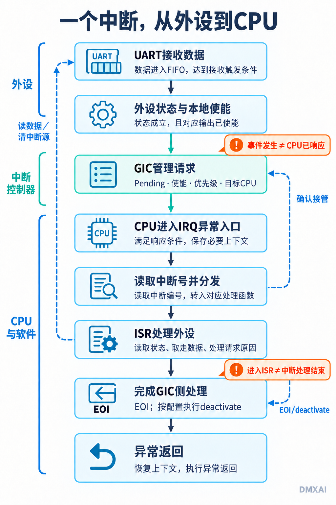

## 30.1 外设有了数据，中断请求怎么产生？

UART收到的数据先进入接收FIFO，也就是暂存数据的队列。CPU可以不断读状态，检查队列里有没有数据；启用接收中断后，则可以等硬件满足约定条件时再来处理，不必一直轮询。

这里的条件不一定是“收到一个字节”。例如，FIFO里的数据量达到设定阈值，才触发接收中断。一次中断对应的可能是多笔待取数据，不能用进入处理函数的次数，直接推算收到多少个字节。

外设还需要让软件知道发生了什么，因此会提供相应状态。有些状态锁存已经发生的事件，等待软件清除；有些状态与当前条件有关，例如队列是否达到阈值。读到一个状态位为1以后，我们还要知道它表示哪一种情况，才能决定怎么处理。

以Arm的PL011 UART为例，接收FIFO达到配置的触发水位会产生接收中断，读走数据使水位降到阈值以下，是清除该接收中断的一种方式。它也提供独立的中断清除入口，但清除中断状态并不会取走FIFO里的数据。清除后何时再次产生请求，还要看该中断的触发规则。

## 30.2 状态有了，为什么还没有中断？

假设接收条件已经满足，但对应中断没有使能，外设未必会向控制器提出请求。为了区分这两件事，一些外设会分别提供原始中断状态和经过屏蔽后的中断状态：前者用于查看相应中断源的状态，后者反映哪些请求通过了本地的使能或屏蔽控制。

因此，“状态位是1，但中断没来”未必是矛盾。我们可能读到了原始状态，却没有打开对应的中断输出。PL011就有这两类状态寄存器。不过，它的接收超时中断还存在使能影响事件产生的情况，不能仅凭“原始状态”这个名字，就假设任何事件在屏蔽期间都会被记录。

同一个UART可能有接收、发送、超时和错误等多个中断原因。这些原因可以分别控制，再汇总成一条请求送往中断控制器。控制器看到这条请求，并不等于已经知道UART内部是哪一个原因成立。

屏蔽不等于清除，解除屏蔽后能否上报先前的事件，要看状态是否被保留。即使外设已经输出请求，后面还要经过中断控制器和CPU各自的使能、屏蔽控制。

## 30.3 中断控制器怎样决定通知哪个CPU？

多个外设可能同时提出请求，多核SoC里也不止一个CPU可以处理。中断控制器负责管理这些请求，结合中断使能、优先级和目标CPU配置，决定哪些请求具备转发条件。

以接到GIC的这一路外设中断为例，请求可以进入pending状态，表示有中断等待处理。这里的pending和UART内部的状态，记录的是不同层面的事情：UART记录自身的接收或错误原因，GIC管理这一路中断是否待处理、是否正在处理。两处状态属于不同的硬件，软件访问其中一处，不会自动完成另一处的处理。

触发类型也在这里产生影响。电平型中断关注请求是否仍处于有效电平；边沿型中断则根据规定的跳变形成待处理请求，不要求输入一直保持有效。本文的UART使用电平型请求，后面能否结束当前请求，就与外设的请求信号是否恢复为无效电平有关。

pending也不意味着目标CPU马上进入处理函数。该中断可能被禁用，优先级可能未达到转发要求，或者目标CPU正在处理不允许被它抢占的中断。排查时，还要确认请求被路由到了我们正在观察的CPU，而不是另一个核。

## 30.4 CPU收到请求，怎样进入处理函数？

请求到达CPU后，还受CPU自身的中断屏蔽和异常路由配置约束。比如软件暂时屏蔽了相应IRQ，就可能出现控制器侧有待处理请求，而当前CPU还没有进入中断入口的情况。

在AArch64中，响应这类中断会进入异常处理流程。CPU保存异常返回地址和处理器状态，转到异常向量对应的入口；需要保留的通用寄存器则由入口软件保存。硬件负责转入入口，后续软件再完成保存上下文、识别来源和调用处理函数等工作。

在GICv3中，有可确认的请求时，软件读取相应的中断确认寄存器，可以取得中断编号，并推进该中断的处理状态。这次确认通常称为acknowledge，表示接管处理，不表示UART的数据已经取走，也不表示中断已经完成。

软件再根据中断编号分发到对应处理函数。裸机程序可以使用自己维护的分发表；Linux则通过架构入口和中断框架，调用注册的驱动处理函数。接下来，才轮到UART的处理代码读取外设状态和数据。

## 30.5 进入ISR后，我们具体要处理什么？

中断服务程序的英文是Interrupt Service Routine，简称ISR。进入UART的ISR后，我们仍要读取外设状态：这次是接收条件满足，还是发送、超时或错误原因触发？如果多个原因汇总在同一路中断上，不能只根据控制器返回的编号就选定处理分支。

沿着接收这条路径，软件把FIFO里的数据取出，保存到后续程序能够使用的缓冲区，并检查、处理接收错误。水位降到阈值以下不代表FIFO已经空了：剩余数据仍要继续取出，或由已配置好的接收超时等机制安排后续处理，不能让它们一直留在队列里。

ISR退出也不代表上层业务已经完成。数据包解析等较重的工作，可以由后续线程或其他执行路径继续处理。ISR需要先保存好数据和必要状态，把后续任务交给约定的处理路径；只打印一句“UART interrupt”，还没有完成这些工作。

## 30.6 清了外设状态，为什么还没有结束？

先看外设这一侧。对于前面的接收例子，如果我们读走足够的数据，让FIFO水位降到触发阈值以下，接收请求可以撤销。若同一路汇总输出上还有其他已使能的中断原因，仍需要继续处理对应原因，不能只盯着接收水位。

假如我们没有处理外设，只通知控制器“本次处理结束”，请求电平却仍然有效，那么控制器侧完成后，这一路中断仍可能再次被CPU响应。于是就出现开头的现象：ISR刚退出，又进入同一个ISR。通知完成并不会替我们读取FIFO，也不会替我们消除错误原因。

控制器本身也有需要结束的状态。GIC用active表示这一路中断已被接管、正在处理。清掉UART状态，并不自动解除GIC里的active；遗漏控制器要求的完成操作，可能使后续请求无法按预期再次被响应。

active和pending可以同时存在。对这里的电平型中断，这可能只是原请求仍然有效，不能仅凭这两个状态就判断又发生了一次新事件。

GICv3把结束处理分成两件事：恢复本次中断接管前的运行优先级，以及解除该中断的active状态。执行EOI（End of Interrupt）操作，可以根据配置同时完成这两件事，也可能只完成前者，之后还需要单独执行deactivate，解除active状态。因此，EOI不能笼统理解成“中断相关状态全部清零”。

在Linux中，这些控制器操作通常由中断框架和控制器驱动承担，设备ISR负责外设本身。裸机程序则需要按所用平台安排这些步骤。

消除外设的请求原因、完成控制器侧的处理、CPU从异常返回，是三个不同动作。具体操作可以由不同软件层承担，但不能省略需要的步骤，也不能用其中一个动作代替其他动作。

这些操作的顺序同样需要明确。对于电平型请求，如果希望完成后不再因旧原因进入中断，就要按平台要求让外设处理结果及时生效。某些平台需要特定的访问顺序、读回或内存屏障。清除访问在代码中排在前面，不足以证明请求信号已经恢复为无效电平；应使用平台和驱动框架规定的访问方式，而不是自行加一条屏障就认为处理完成。

最后，软件恢复保存的上下文，CPU按异常返回流程离开当前处理。在没有调度切换或其他待处理中断等情况时，程序可以接着执行被打断的工作。

## 30.7 再来一次事件，这条链路还能走通吗？

回到最初的两个现象。如果ISR一直没有进，我们可以依次确认：FIFO是否满足触发条件，外设状态是否成立，本地输出是否使能，控制器是否记录并允许转发，目标CPU是否正确，以及CPU入口和处理函数分发是否正常。每一步都对应不同证据，不必一开始就把问题归为“中断控制器坏了”或“驱动没注册好”。

如果ISR反复进入，就要核对请求原因有没有消除、是否还有其他中断源、控制器完成步骤是否正确。还要区分旧请求没有结束和新数据又满足了触发条件：持续有数据输入时，再次进入接收中断可能完全正常。

验证时，可以先输入一批足以触发接收中断的数据，然后停止输入。沿链路确认请求到达预期CPU、数据被正确取出，并完成外设和控制器侧的处理。本批数据及相关中断原因都处理完后，检查不会无故重复进入；再发下一批数据，确认链路还能正常响应。

再检查屏蔽期间来事件、ISR处理期间继续收数的情况，确认数据和事件按设计得到保留或处理。有新数据到来时，仍有待处理状态，并不一定是异常。

这样再看一次UART接收，我们就能把“中断来过”拆成可核对的过程：请求有没有送达，数据有没有交给软件，旧请求有没有结束，后续请求还能不能继续处理。走完这些步骤，才知道这条中断链路是否按预期工作。

我们持续分享芯片技术内容与内推职位信息，欢迎一起关注行业技术与职业机会。如有技术经验、人才需求或内推职位等分享，欢迎私信或通过服务菜单联系我们。


---

# 31. 芯片设计中，Reset释放时为什么容易出问题？

> 来源：https://mp.weixin.qq.com/s/0wdZm22eqmVwMpA4yn3mXA
> 作者：芯片验证
> update 2026/09/15 21 : 50

检查复位逻辑时，我们通常会先看：Reset有效以后，状态机有没有回到初始状态，计数器有没有清零。如果这些值都对了，很容易觉得复位已经没有问题。但解除复位后，逻辑还要重新跟着时钟运行。如果采用异步复位，就需要注：它生效时不需要等待时钟沿，释放时却需要考虑与时钟的关系。

复位释放后，寄存器可以恢复正常更新。如果释放时刻离有效时钟沿太近，即使前面的复位值正确，后面的状态更新也可能出错。

## 31.1 进入复位和退出复位，要求并不一样

异步复位不需要等有效时钟沿，就能让触发器进入规定的复位状态。但撤销复位时，触发器需要满足相对时钟的时间间隔要求，才能恢复正常工作。这对应时序分析里的recovery和removal检查：recovery约束复位释放到随后有效时钟沿之间的最小间隔；removal约束有效时钟沿到随后复位释放之间的最小间隔。它们与数据端的setup/hold要求类似，但检查的是异步控制端。

如果释放落入不满足这些要求的时间窗口，触发器可能出现亚稳态，无法保证按预期更新。复位有效阶段的最小脉宽等要求也需要满足。

## 31.2 复位释放后，状态位未必同步更新

一个复位信号驱动很多寄存器时，到达各个引脚的时间会受分发路径影响，时钟到达各个寄存器的时间也存在差异。如果没有处理好释放时序，一部分寄存器可能已经开始更新，另一部分还保持着复位值。

假设一个独热编码状态机只有两个合法状态`01`和`10`，每次只有一个状态位为1。复位值是`01`，退出复位后的第一次转换应该进入`10`。

如果在本应完成这次转换的有效时钟沿，一个状态位正常更新，另一个因复位释放时序问题仍保持复位值，就可能只完成一半转换：高位更新为1，低位仍为1，得到`11`；或者低位更新为0，高位仍为0，得到`00`。这两种结果都不在例子定义的合法状态里。这只是其中一种可能结果；如果发生recovery/removal违例，触发器也可能出现亚稳态，不能假设它一定保持复位值。

复位期间的值正确，还不能证明解除复位后的第一次状态更新也正确。DMXAI芯片验证

## 31.3 同步释放，要同步到哪个时钟

对于需要异步复位的逻辑，常见做法是“异步生效、同步释放”。复位有效时，同步器和下游逻辑进入复位；外部复位撤销后，由目标时钟驱动同步器逐级传递释放状态，再撤销本地复位。这样可以降低异步释放带来的亚稳态传播风险，让本地复位在目标时钟驱动下释放。但同步器的级数、实现方式，以及输出到下游复位引脚的路径，仍需要满足设计要求，不能只看到两级寄存器就认为已经安全。

同步到时钟A的复位，直接送给与A异步的时钟B域，仍可能在B的有效沿附近释放。每个目标域都需要有适合自身时钟的释放处理。反过来，同一时钟域里需要一起恢复的逻辑，也不能随意各放一个独立同步器。多个同步器可能在不同拍输出释放状态，让原本要协同工作的部分先后启动。是否允许这样做，要看设计有没有相应的启动协调机制。

## 31.4 时钟没恢复，本地复位也可能释放不了

同步释放需要目标时钟实际运行。如果这个时钟还被门控关着，外部Reset虽然已经撤销，同步器仍无法推进，本地逻辑就可能继续保持复位。例如，时钟控制逻辑要等模块退出复位才打开时钟，模块的复位同步器又等时钟才能释放，两边就会一直互相等待。检查启动顺序时，需要确认负责同步释放的时钟能先运行，并满足稳定性要求，再让本地逻辑退出复位。

## 31.5 验证要看到退出复位后的状态

功能验证时，可以改变外部复位释放相对时钟的相位，覆盖停钟后恢复等允许的场景。除了检查复位值，还要看本地复位何时释放、状态机第一次更新是否合法，以及逻辑是否按约定开始工作。

不过，普通RTL功能仿真通常不会真实建模触发器的亚稳态行为。随机改变释放相位，有助于检查数字逻辑和启动顺序，却不能证明真实硬件满足释放时序。还需要核对同步结构，并在正确的时钟和路径约束下检查下游寄存器的recovery/removal要求。

当我们看到Reset已经撤销、模块却没有正常运行时，可以继续往下查：本地时钟是否在跑，复位同步器是否完成释放，需要协同的状态位是否从预期的那一拍开始更新。只检查复位值，会漏掉这段恢复运行的过程。

欢迎关注公众号，我们一起关注芯片相关技术分享。如果您也想将自己的一些经验分享给更多同学，欢迎通过公众号服务-联系反馈菜单，提交想法或者加好友。

---

# 32. 只读一个寄存器，为什么也可能改变芯片状态？

> 来源：https://mp.weixin.qq.com/s/I0EJGGsN9OTg4YefLp53Bw
> 作者：芯片验证
> update 2026/09/15 21 : 50

排查芯片问题时，我们经常会先读一下状态寄存器，看看错误标志有没有置位。如果调试脚本读到了1，驱动随后读到的却是0，我们可能会怀疑：是谁清掉了状态？

如果这个字段采用读清零机制，脚本的那次读取就可能已经清掉了标志。整个过程中，我们没有执行任何写操作，芯片里的状态却已经变了。

寄存器访问由硬件逻辑处理。对于某些寄存器，硬件在返回读值的同时，还会执行清除标志、取出数据等动作。这类行为通常称为读取副作用（read side effect），它可以是设计规定的正常行为。

## 32.1 一次读取，也可以清掉状态

读清零（Read-to-Clear，常见标记为RC）就是一种典型情况：硬件记录事件，软件读取状态时，硬件会按spec清除相应字段。具体清除哪些位、在哪个时刻生效，要看寄存器spec。

假设有一个读清零的错误标志，事件发生后被置为1。按这个例子的约定，第一次读取返回1，并清掉该标志；清除生效后，如果没有新事件，第二次读取就返回0。

这样设计，可以让软件在获取事件记录时一并清除标志，省去一次单独的清除操作。清除动作由读访问触发，并不取决于读值最后交给了错误处理代码，还是仅仅显示在调试窗口里。

## 32.2 脚本先读了，驱动还能看到什么

沿着这个例子，如果脚本先读取了标志，却没有把结果交给驱动，驱动随后就可能按“没有错误待处理”继续执行。假如脚本也没有保存首次读值，排查时还会少掉一条事件记录。

对读清零字段，驱动读到0，并不能直接证明事件没有发生；还需要确认此前有没有其他访问清掉了记录。DMXAI芯片验证

批量读取寄存器的dump脚本、自动刷新的寄存器窗口，都需要考虑这一点。只要它们实际发出了会触发清除的读访问，就可能影响后续程序看到的状态。具体是否发生，取决于工具的访问方式和硬件定义，不能仅凭“这是调试操作”就认为没有影响。

## 32.3 读FIFO时，数据也可能被取走

读取带来的变化不止清零。有些FIFO数据寄存器在被读取时，会返回队首数据，同时让这笔数据出队。

假设这样的FIFO里依次存着A、B两笔数据。调试脚本先读一次，拿走A；业务代码再读，拿到的就是B。如果我们没有意识到前一次读取已经消耗了数据，就可能把现象误判为接收端漏了一笔。

这里消耗的是队列里的数据，和清除状态标志是两种不同机制。是否有不出队的查看入口、一次读取消耗多少数据，都要按具体接口确认。

## 32.4 不能只看RO，还要读访问说明

查手册时，除了读写属性，还要看字段描述和操作流程：读取会不会清除状态？清除的是当前字段，还是另一个寄存器里的标志？有没有规定访问顺序？

Intel的PCH寄存器文档中，`IC_CLR_INTR`标为只读（RO），读取它却会触发相关中断状态的清除。这是独立的清除入口，与前面的RC状态字段有所不同。RO限制的是软件写入，读取会触发哪些动作，仍要看字段描述和访问规则。

如果需要多个软件环节查看同一次事件记录，可以由约定的处理路径读取并保存结果，其他环节查看这份记录，避免各自重复读取硬件。保存的是当时的状态，不代表后续没有新事件。

批量dump时，应按手册排除会触发清除或出队的地址；需要观察时，优先使用手册明确支持的不改变状态的读取方式。

## 32.5 验证时，也要检查读取之后

验证读清零字段时，我们既要检查第一次读取返回的值，也要检查清除生效后的状态。可以先触发事件，再读取并检查返回值，随后在没有新事件和其他清除操作的条件下再次读取，确认相应标志已按spec清零。

验证序列里为了打印日志而增加的读取，也可能触发相同动作。安排激励和检查时，需要把这些访问算进去，否则后续检查面对的状态，可能已经被验证代码自己改过。

以后遇到“刚才还有，怎么再读就没了”，我们可以先对照访问记录：谁读过、读了哪个地址、那次读取按手册会触发什么动作。把这个过程还原出来，才能判断状态是被某次读取清掉了，还是硬件没有按预期保留。

欢迎关注公众号，我们一起关注芯片相关技术分享。如果您也想将自己的一些经验分享给更多同学，欢迎通过公众号服务-联系反馈菜单，提交想法或者加好友。

---

# 33. 芯片寄存器里的Reserved bit，为什么不能随便写？

> 来源：https://mp.weixin.qq.com/s/63WmVQ2q1omqJktPOvnEgg
> 作者：芯片验证
> update 2026/09/15 21 : 51

写驱动或调试寄存器时，我们经常会在手册里看到一些标着`reserved`、`RSVD`或“保留”的位，也就是Reserved bit。

一个32位寄存器，可能只有几个位用于使能、模式选择或状态指示，其余位置在手册里标为Reserved。看到这些位置没有具体的功能名称，我们可能会觉得：既然用不上，写什么应该都一样吧？

这里需要区分两件事：有没有公开功能定义，以及软件应该怎么访问。手册没有给保留位定义可供软件使用的功能，不代表软件就可以随便写。它仍可能要求这些位写0、保持复位值，或者原样写回读出的值。这些要求可能写在字段说明里，也可能统一写在寄存器章节开头。

因此，看到Reserved标记后，我们还要查清对应的访问要求。单看这个标记，不能确定这些位有没有实现逻辑，也不能认定它们可以随便写。手册没有说清的地方，也不能靠一次读写结果自己下结论。

如果手册要求某个保留位写0，我们就不能因为它没有公开的功能用途，顺手把它写成1。即使这次运行没有异常，也不能据此认为这种写法可用。DMXAI芯片验证

## 33.1 只改一个bit，为什么也会写到保留位

假设我们要将某个32位寄存器中的使能位置为1，用`ENABLE`表示这个位的掩码，驱动里常见这种写法：

```
val = readl(REG_CTRL);
val |= ENABLE;
writel(val, REG_CTRL);
```

这叫读-改-写（read-modify-write，RMW）：先把寄存器的值读到临时变量`val`中，修改其中的目标位，再写回寄存器。

我们本来只想把使能位置为1。`val |= ENABLE`只将临时变量里的对应位置为1，但`writel()`会把整个32位数值写入寄存器。其他位虽然保持了读出时的值，也会一起写回，包括保留位对应的值。

问题就在这里：**读出的值，未必就是手册允许写回的值。** 如果手册规定某个保留位读值未定义、写入必须为0，那么直接把读值写回，就不能保证满足要求。

所以问题不在RMW这个动作本身，而在于写回寄存器的每一位是否都符合手册要求。如果手册允许原样写回，而且其他字段的读写也不会带来问题，这种写法仍然可以使用。

## 33.2 写回之前，要确认哪些要求

处理保留位时，我们可以先看手册要求写回什么：

- 要求写0：在准备写入的数据中，将这些保留位对应的位置设为0。
- 要求保持复位值：按手册给出的复位值设置这些位置，不能默认所有保留位的复位值都是0。
- 要求原样写回：在写入数据中保留这些位的读值，不要顺手改成0或1。

还要检查同一寄存器里的其他字段。W1C（写1清零）状态位如果读出来是1，原样写回就会清除该状态；RC（读清零）字段在读取时就可能已经改变硬件状态；WO（只写）字段则不能靠读取来获得原来写入的值。也就是说，即使保留位处理正确，整个寄存器也未必适合直接读-改-写。

除非手册明确允许，否则不要为了“把功能都打开”就向整个寄存器写入`0xffffffff`。实际代码应根据手册中的字段定义和访问要求，确定掩码及最终写入值。

## 33.3 换一版芯片，旧写法可能出问题

有些原来标为Reserved的位置，后续芯片版本可能会被定义成新的功能位。假设旧版手册要求某个保留位写0，但旧驱动一直把它写成1，只是运行时没有发现异常。换到新版芯片后，如果这个位置被定义为某项功能的使能位，原来的写法就可能意外打开这项功能。

这个时候，代码没变，硬件对这个1的解释却变了。遵守旧版手册的保留位要求，有助于减少这类兼容性问题；迁移到新型号或新硅版本时，仍然需要核对对应的寄存器定义。

## 33.4 验证时，把手册里的要求落到检查上

做寄存器验证时，手册明确规定的行为要逐项检查。如果某些保留位规定为“写入被忽略”，我们可以在相同初始状态和输入条件下，只改变这些保留位对应的写入值，比较已定义功能的行为是否一致。其他功能位仍应按手册规定响应，不能把“保留位写入被忽略”理解成整次寄存器写入都被忽略。对于手册没有规定的行为，需要先澄清，不能自行假定结果。

到了Bring-up阶段，如果一次寄存器配置后外设出现异常，我们也可以检查实际写入的数据：除了目标字段，其他位置填入了什么值？这比只盯着使能位有没有置1，更容易发现访问方式上的问题。

写寄存器时，我们不只要确认目标字段怎么改，还要检查其余位会被写成什么。Reserved bit怎么处理，要按当前芯片手册来，不能靠一次运行正常就下结论。

---

# 34. GPIO 概念与 PL061 控制器实现·学习笔记

> 来源：https://mp.weixin.qq.com/s/PcgfSOUQEbLAiCgzlMWhtQ
> 作者：Hope
> update 2026/09/15 21 : 51

📖 本篇导读

本文完整整理《GPIO 概念与 PL061 控制器实现·学习笔记》，覆盖第1章至第6章，共6个章节。先看这份地图，能帮你快速定位想读的内容：

• **第1章**：GPIO 引言：PL061 = APB 从设备 + 8 个可编程引脚，双模式控制，地址掩码与逐引脚中断两大特色

• **第2章**：功能块与双模式：5 类寄存器 + 模式控制，GPIOAFSEL 切软件/硬件，硬件控制三组端口 nGPAFEN/GPAFOUT/GPAFIN

• **第3章**：数据寄存器与地址掩码：GPIODATA 占 256 地址，PADDR[9:2] 当掩码，写「1 改 0 不动」读「1 真值 0 读零」，GPIODIR 定方向

• **第4章**：中断系统：7 寄存器触发链 IS→IBE→IEV→IE→RIS/MIS→IC，初始化顺序防伪中断

• **第5章**：寄存器总览与标识：0x400 起 DIR/IS/IBE/IEV/IE/RIS/MIS/IC/AFSEL，PeriphID=0x061(ARM)、PCellID=0xB105F00D

• **第6章**：信号与总结：APB/片上/pad 三组信号，配置输出/读输入/配中断/切硬件的编程清单，全书主线

—— 以下进入正文 ——

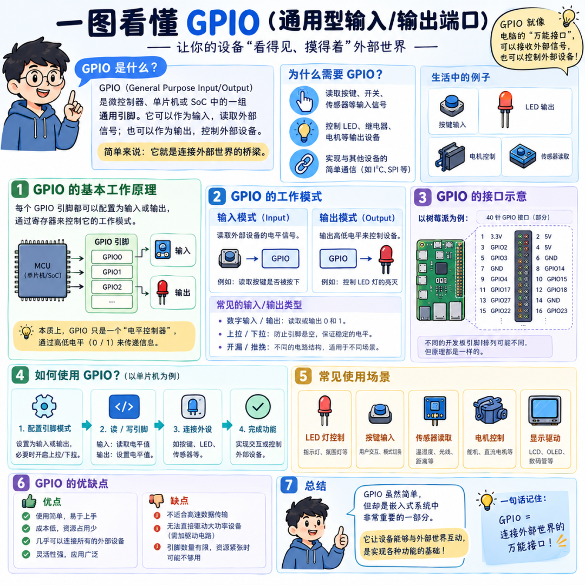

## 34.1 GPIO 概述

GPIO（General Purpose Input/Output，通用输入/输出）是 SoC 里最基础、也最常用的外设。这一章先讲清楚它是什么、能干什么。

◆ 核心观点：PL061 是 ARM 的 PrimeCell GPIO IP，本质是一个挂在 AMBA APB 总线上的**从设备**，对外提供 **8 个可独立编程方向的引脚**。它最特别的两个能力是：① 读写数据时用**地址线当掩码**，一次只动想动的引脚；② 每个引脚都能独立配成**中断源**（电平或边沿触发）。抓住这两点，GPIO 就学完一半了。

### 34.1.1 关于 PL061 GPIO

PL061 是一个符合 AMBA 规范的 SoC 外设，由 ARM 开发、测试并授权。它是一个 **AMBA 从设备（slave）**，挂在 **APB（Advanced Peripheral Bus）** 上。

它提供 8 个可编程的输入/输出引脚，支持**两种控制模式**：

|  |  |  |
| --- | --- | --- |
| 模式 | 控制途径 | 说明 |
| **软件模式** | APB 总线接口 | CPU 通过读写寄存器来操作引脚（默认模式） |
| **硬件模式** | 硬件控制接口 | 引脚交给其他外设（辅助源）直接驱动 |

关键设计点：

• 可以通过**多次实例化**拼出更宽的端口，例如 16、24、32、40 位；

• 提供**中断接口**，任意数量的引脚都可配成中断源；

• 中断可以由**电平**或**跳变（边沿）**触发；

• **系统复位后，所有引脚默认是输入**（安全方向，不会乱驱动总线）；

• 每个 pad 用三根线对接：数据输入（GPIN）、数据输出（GPOUT）、输出使能（nGPEN）。

### 34.1.2 特性清单

PL061 提供的特性，按重要性排序：

1. **AMBA 规范兼容**（Rev 2.0 起），容易集成进 SoC；

2. **8 个可独立编程的 I/O 引脚**，复位默认输入；

3. **可扩展性**：多次实例化拼成 16/24/32/40 位甚至更宽；

4. **可编程中断**：任意引脚，电平或跳变触发；

5. **硬件控制能力**：引脚可切换给外部辅助源驱动，适应不同系统配置；

6. **读写位掩码**：通过地址线在读写时做位掩码（这是 PL061 最独特的机制，第 3 章细讲）；

7. **标识寄存器**：唯一标识该外设（PeriphID / PCellID，第 5 章细讲）。

### 34.1.3 整体框图

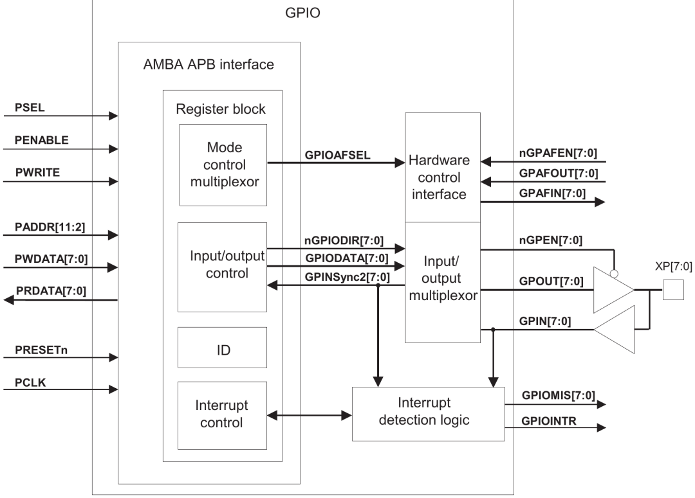

图 1-1　PL061 GPIO 框图与 pad 连接（PrimeCell GPIO block diagram and pads connections）

PL061 的内部结构如图 1-1 所示，可以拆成几个块：

• **AMBA APB 接口**：接收 PSEL/PENABLE/PWRITE/PADDR/PWDATA，驱动 PRDATA；

• **寄存器块（Register block）**：存放数据、方向、中断、模式、标识等寄存器；

• **模式控制多路选择器（Mode control multiplexor）**：根据 GPIOAFSEL 决定引脚由软件还是硬件控制；

• **输入/输出控制（Input/output control）**：产生 nGPIODIR、GPIODATA、GPINSync2 等；

• **输入/输出多路选择器（Input/output multiplexor）**：把数据送到 pad，或从 pad 读回；

• **中断控制 + 中断检测逻辑（Interrupt control / detection logic）**：产生 GPIOMIS 与合并的 GPIOINTR；

• **ID 块**：提供标识寄存器。

◆ 记忆要点：PL061 = **APB 从设备 + 8 引脚**，三种引脚信号（GPIN 输入 / GPOUT 输出 / nGPEN 输出使能），两种控制模式（软件 / 硬件），两个杀手锏（**地址掩码读写**、**逐引脚中断**）。

## 34.2 功能块与双模式控制

这一章讲 PL061 内部由哪几个功能块组成，以及「软件控制 / 硬件控制」两种模式是怎么切换的。

◆ 核心观点：PL061 的寄存器块可以归成五类——**数据方向、数据、中断控制、模式控制、标识**。其中「模式控制」决定了每个引脚到底听谁的：默认听 CPU（软件模式，走 APB），把 GPIOAFSEL 对应位置 1 后改听**硬件辅助源**（硬件模式，走 nGPAFEN/GPAFOUT/GPAFIN 三组端口）。这个「复用」能力让 GPIO 引脚能被别的外设共享。

### 34.2.1 五大寄存器类

CPU 通过 APB 接口访问 PL061 的数据、控制、状态信息。PL061 包含这些寄存器（按功能归类）：

|  |  |  |
| --- | --- | --- |
| 类别 | 寄存器 | 作用 |
| 数据方向 | GPIODIR | 每位置 1 = 输出，清 0 = 输入 |
| 数据 | GPIODATA | 读输入值 / 写输出值（带地址掩码） |
| 中断控制 | GPIOIS / IBE / IEV / IE / RIS / MIS / IC | 7 个寄存器配触发 + 看状态 + 清除 |
| 模式控制 | GPIOAFSEL | 每位置 1 = 硬件控制，清 0 = 软件控制 |
| 标识 | PeriphID / PCellID | 唯一标识外设，供 BIOS 自动识别 |

### 34.2.2 模式控制：软件 vs 硬件

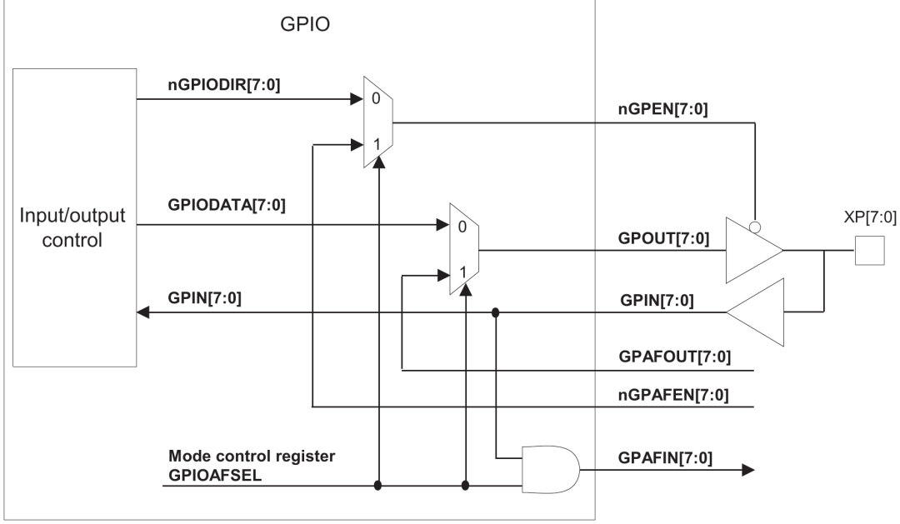

图 2-6　模式控制多路选择器（Mode control multiplexor）

每个 GPIO 引脚都可以在**软件控制**和**硬件控制**之间切换，切换开关就是 **GPIOAFSEL**（mode control select register）：

|  |  |  |  |
| --- | --- | --- | --- |
| GPIOAFSEL 位 | 模式 | 数据方向由谁定 | 数据由谁读写 |
| 0（默认） | **软件控制** | GPIODIR 寄存器 | 通过 APB 读写 GPIODATA |
| 1 | **硬件控制** | 辅助端口方向控制引脚 | 通过辅助端口读写（APB 仍可读引脚状态） |

要点：

• **软件模式**（默认）：数据方向由 GPIODIR 定，数据读写都走 APB 接口；

• **硬件模式**：数据方向改由辅助端口（nGPAFEN）控制，数据改由辅助端口（GPAFOUT/GPAFIN）读写；但**引脚状态仍可通过 APB 读回**；

• 硬件模式下，GPIODATA 寄存器依然能读那些配成输入的引脚的值。

图 2-6 展示了模式控制多路选择器的结构：nGPIODIR/GPIODATA 是软件侧，nGPAFEN/GPAFOUT/GPAFIN 是硬件侧，GPIOAFSEL 当选择开关。

### 34.2.3 硬件控制接口的三组信号

硬件模式下，引脚交给外部辅助源，用到三组信号（每组 8 位，对应 8 个引脚）：

|  |  |  |
| --- | --- | --- |
| 信号 | 方向（相对 GPIO） | 含义 |
| nGPAFEN[7:0] | 输入 | 硬件控制**输出使能**，低有效；不用时需接高 |
| GPAFOUT[7:0] | 输入 | 硬件控制的**数据输入**（辅助源要输出的值）；不用时可接低或高 |
| GPAFIN[7:0] | 输出 | 硬件控制的**数据输出**（引脚值送还给辅助源） |

简单理解：硬件模式下，`GPAFOUT` 是「辅助源想往引脚上写的数据」，`nGPAFEN` 决定这个引脚是输出还是输入，`GPAFIN` 是「引脚当前值」回送给辅助源。

◆ 记忆要点：模式切换靠 **GPIOAFSEL**——0 软件 / 1 硬件。软件模式用 GPIODIR+GPIODATA 走 APB；硬件模式改用 nGPAFEN（方向）+ GPAFOUT（写）+ GPAFIN（读）三组端口，APB 仍能偷看引脚状态。这个机制让 GPIO 引脚能被其他外设**复用共享**。

## 34.3 数据寄存器与地址掩码

这一章是 PL061 的**精髓**：GPIODATA 寄存器用地址线做位掩码，让软件能一次只改想改的引脚，而完全不碰其他引脚。

◆ 核心观点：GPIODATA 这一个 8 位寄存器，在内存映射里**占了 256 个地址**（偏移 0x000～0x3FC）。多出来的地址不是浪费——它们的 `PADDR[9:2]` 八根线被当成了**位掩码**：写的时候，地址位=1 的位才被改写，地址位=0 的位保持不变；读的时候，地址位=1 的位读回真实值，地址位=0 的位直接读成 0。这个设计让「读-改-写」变成了一条指令，还避免了多任务之间互相踩引脚。

### 34.3.1 GPIODATA：一个寄存器占 256 个地址

GPIODATA 是数据寄存器，8 位宽：

• 软件模式下，写入的值会送到 GPOUT 引脚——但只对**通过 GPIODIR 配成输出**的引脚生效；

• 读的时候，配成输出的位返回**上一次写入的值**，配成输入的位返回**引脚当前值（GPIN）**；

• 复位后所有位清 0。

关键机制：这个寄存器在地址空间里**重复映射了 256 次**（偏移 0x000 到 0x3FC）。这 256 个地址的差别只在 `PADDR[9:2]` 八根线上，而这八根线被用作**读写位掩码**。好处是：**独立的软件驱动可以在单次写操作里只改自己的位，不影响任何其他引脚**——不需要先读出、改位、再写回（不用 read-modify-write）。

### 34.3.2 写操作的地址掩码

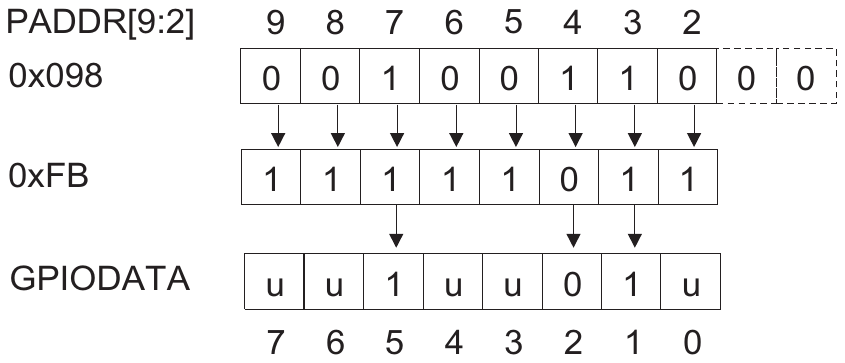

图 2-2　写地址掩码示例：地址 0x098（Example Write to address 0x098）

写 GPIODATA 时，**地址位（PADDR[9:2]）为 1 的位才会被改写**，为 0 的位保持不变。

**例子**：往地址 `GPIODATA + 0x098` 写 `0xFB`。

• `0x098` = 二进制 `0b000010011000`，取 `PADDR[9:2]` = `0b0000100110`；

• 展开：`PADDR[9:2]` 的第 0 位对应数据 bit 0，第 1 位对应 bit 1……所以掩码选中了 **bit 5、bit 2、bit 1**（这三个地址位是 1）；

• 写入值 `0xFB` = `1111 1011`，于是：

• bit 5 → 写 1；bit 2 → 写 0；bit 1 → 写 1；

• 其余位（7、6、4、3、0）**保持不变**。

|  |  |  |  |  |  |  |  |  |
| --- | --- | --- | --- | --- | --- | --- | --- | --- |
| 地址位 PADDR[9:2] | 9 | 8 | 7 | 6 | 5 | 4 | 3 | 2 |
| 0x098 | 0 | 0 | 1 | 0 | 0 | 1 | 1 | 0 |
| 写 0xFB | 1 | 1 | 1 | 1 | 1 | 0 | 1 | 1 |
| 结果 GPIODATA | u | u | 1 | u | u | 0 | 1 | u |

◆ 表中 `u` 表示该位保持不变（unchanged）。

### 34.3.3 读操作的地址掩码

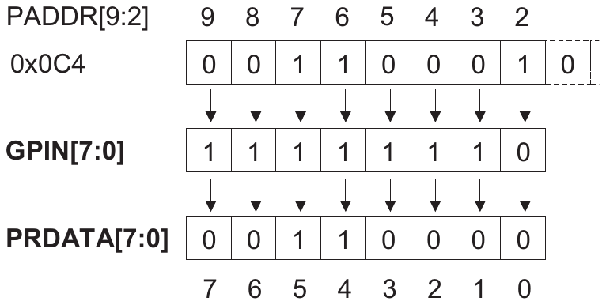

图 2-3　读地址掩码示例：地址 0x0C4（Example Read from address 0x0C4）

读 GPIODATA 时，**地址位为 1 的位读回真实值，为 0 的位读成 0**（不管引脚实际是什么电平）。

**例子**：从地址 `GPIODATA + 0x0C4` 读。

• `0x0C4` = `0b000011000100`，取 `PADDR[9:2]` = `0b0000110001`，掩码选中 **bit 5、bit 4、bit 0**；

• 假设引脚实际是 `GPIN[7:0] = 1111 1110`；

• 读回 `PRDATA[7:0] = 0011 0000`：bit 5/4/0 读回真实值（1、1、0），其余位被掩成 0。

|  |  |  |  |  |  |  |  |  |
| --- | --- | --- | --- | --- | --- | --- | --- | --- |
| PADDR[9:2] | 9 | 8 | 7 | 6 | 5 | 4 | 3 | 2 |
| 0x0C4 | 0 | 0 | 1 | 1 | 0 | 0 | 0 | 1 |
| GPIN[7:0] | 1 | 1 | 1 | 1 | 1 | 1 | 1 | 0 |
| PRDATA[7:0] | 0 | 0 | 1 | 1 | 0 | 0 | 0 | 0 |

**实用技巧**：想要一次读/写**全部 8 位**，用地址偏移 `0x3FC`（`PADDR[9:2]` 全 1）。

### 34.3.4 GPIODIR：方向寄存器

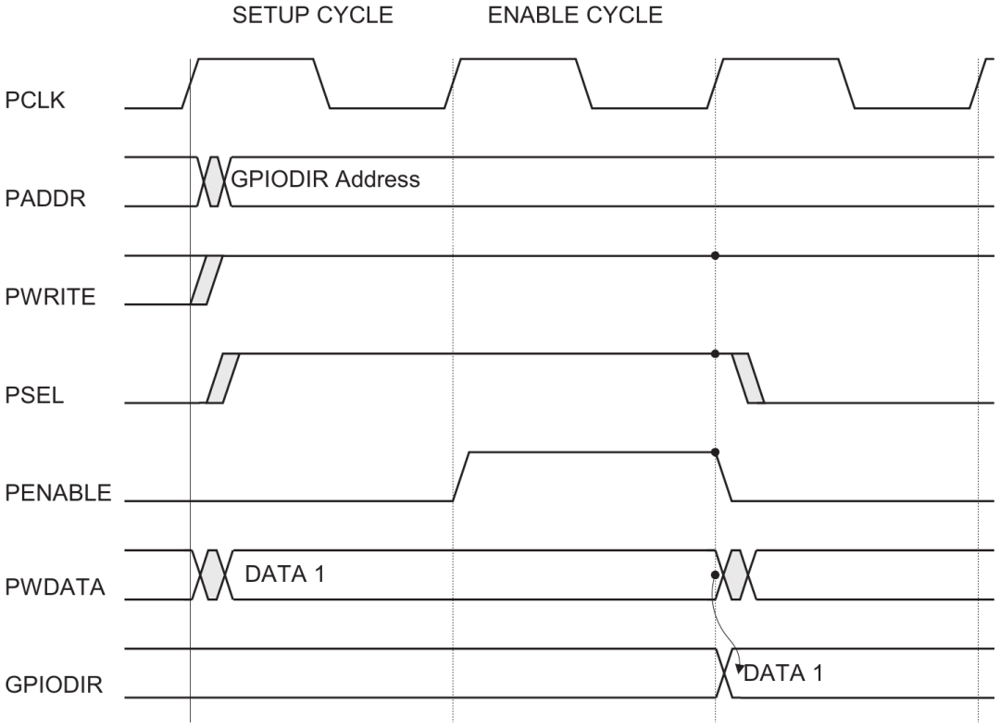

图 2-4　写方向寄存器时序（Write to data direction register）

GPIODIR 是数据方向寄存器，8 位宽，每个位对应一个引脚：

|  |  |
| --- | --- |
| GPIODIR 位 | 引脚方向 |
| 1 | **输出** （output） |
| 0 | **输入** （input） |

复位后所有位清 0，所以**默认所有引脚都是输入**。这与 PL061「上电不误驱动」的安全设计一致。

### 34.3.5 复位与初始化

• **接口复位**：上电复位（PRESETn 拉低）期间所有寄存器清 0，输出驱动器被禁用，引脚全配成输入；

• **配置时**（PRESETn 拉低时）还会：禁用所有中断（GPIOIE 清 0）、清除原始中断、选择边沿触发为默认中断源。

◆ 记忆要点：**地址掩码**是 PL061 的头号特性——GPIODATA 占 256 个地址，`PADDR[9:2]` 当掩码，写时「1 才改、0 不动」，读时「1 读真值、0 读成 0」；想操作全部位就用偏移 `0x3FC`。方向寄存器 GPIODIR「1 输出、0 输入」，复位全 0 即**全输入**。

## 34.4 中断系统

PL061 的每个引脚都能独立配成中断源，靠 **7 个中断寄存器**组成一条触发链。这一章把这条链彻底讲清楚。

◆ 核心观点：中断触发由 **3 个寄存器**（GPIOIS、GPIOIBE、GPIOIEV）决定「什么事件触发」，再由 **1 个寄存器**（GPIOIE）决定「要不要放行」，最后用 **2 个状态寄存器**（GPIORIS、GPIOMIS）看结果，用 **1 个寄存器**（GPIOIC）清除边沿。串成一句话：**IS 选边沿/电平 → IBE 选单/双边沿 → IEV 选上升/下降（或高/低）→ IE 放行 → RIS/MIS 看状态 → IC 写 1 清除**。

### 34.4.1 七个中断寄存器

每个引脚（bit）对应一份，8 位寄存器共管 8 个引脚：

|  |  |  |
| --- | --- | --- |
| 寄存器 | 类型 | 作用 |
| GPIOIS | R/W | 中断感应：0=边沿触发，1=电平触发 |
| GPIOIBE | R/W | 双边沿：1=上升+下降都触发（忽略 IEV） |
| GPIOIEV | R/W | 边沿时：1=上升/1=高电平；0=下降/低电平 |
| GPIOIE | R/W | 中断使能（掩码）：1=放行，0=屏蔽 |
| GPIORIS | 只读 | **原始** 中断状态（屏蔽前） |
| GPIOMIS | 只读 | **屏蔽后** 中断状态（被 GPIOIE 遮掉的就看不到） |
| GPIOIC | 只写 | 中断清除：写 1 清除对应边沿检测逻辑 |

这 7 个寄存器里，`GPIOIS`、`GPIOIBE`、`GPIOIEV` 三个共同决定「触发条件」，是理解中断的关键。

### 34.4.2 触发链：IS → IBE → IEV

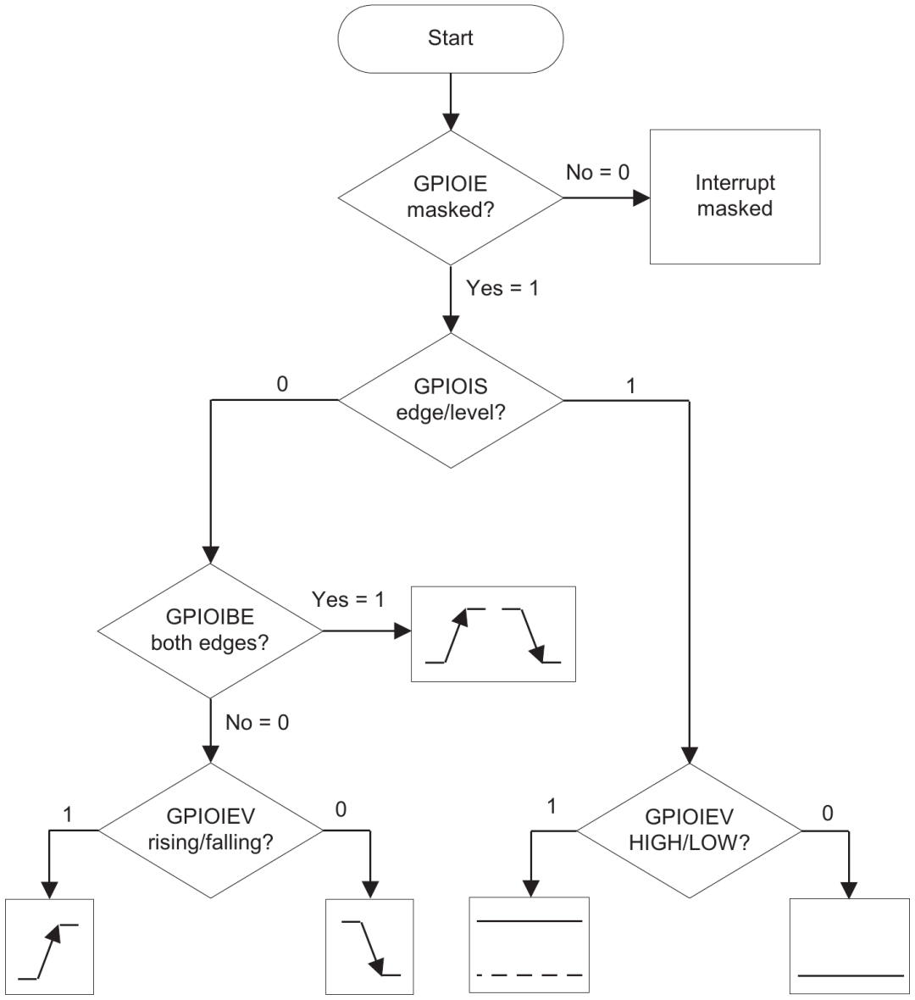

图 2-5　GPIO 中断寄存器触发链（PrimeCell GPIO interrupt registers）

触发条件的判定顺序（见图 2-5 的流程图）：

1. **GPIOIS** 先选大方向：0 = 走**边沿**检测，1 = 走**电平**检测；

2. 若走边沿，**GPIOIBE** 决定：1 = **双边沿**（上升+下降都触发，此时忽略 IEV），0 = 单边沿（交给 IEV）；

3. 单边沿时，**GPIOIEV** 定极性：1 = 上升沿（或高电平），0 = 下降沿（或低电平）；

4. 最后 **GPIOIE** 做总开关：1 = 放行，0 = 屏蔽（屏蔽后不产生中断）。

**实例**：让输入引脚 2 在**上升沿**触发中断，需要这样配：

|  |  |  |  |
| --- | --- | --- | --- |
| 寄存器 | 需要的值 | 位 2 | 其他位 |
| GPIOIS | 0 = 边沿 | 0 | x |
| GPIOIBE | 0 = 单边沿 | 0 | x |
| GPIOIEV | 1 = 上升沿 | 1 | x |
| GPIOIE | 1 = 使能 | 1 | 0（其余全屏蔽） |

◆ 表中 `x` 表示该位无关紧要——因为它被 GPIOIE 屏蔽了。

### 34.4.3 状态与清除：RIS → MIS → IC

• **GPIORIS**（raw）：读为 1 表示「触发条件已满足」，**还没经过 GPIOIE 屏蔽**；

• **GPIOMIS**（masked）：读为 1 表示「引脚正在申请中断」，是**屏蔽之后**的状态；读为 0 可能是没触发，也可能是被屏蔽了；

• **GPIOINTR**：单根合并输出 = GPIOMIS[7:0] 的**逻辑或**，送给中断控制器；

• **GPIOIC**：**写 1 清除**对应边沿检测逻辑，写 0 无效果（只写寄存器）。

设计意图：既提供**合并输出 GPIOINTR**，也提供**独立输出 GPIOMIS[7:0]**，让你可以用一个全局中断服务例程，也可以为每个引脚写独立驱动。

### 34.4.4 中断初始化顺序（避免伪中断）

边沿触发的中断，初始化顺序很重要，否则会产生**伪中断**。推荐顺序：

1. 先按需配 **GPIOIBE**（单/双边沿）；

2. 若选了单边沿，再配 **GPIOIEV**（上升/下降）；

3. 配 **GPIOIS** 选边沿路径；

4. 施加**三个时钟周期**，清空中断流水线；

5. 整个过程中保持 GPIN[7:0] 稳定；

6. 写 **0xFF 到 GPIOIC**，清除所有挂起中断；

7. 最后配 **GPIOIE** 使能中断。

◆ 记忆要点：三个「触发寄存器」记住口诀——**IS 定边沿/电平，IBE 定单/双边沿，IEV 定上升/下降（高低）**；再加 IE 当总闸、RIS/MIS 看状态、IC 写 1 清除。初始化务必「**先配触发、再清中断、最后开 IE**」，否则会招来伪中断。

## 34.5 寄存器总览与标识

这一章把 PL061 的全部寄存器按地址排一遍，并讲清楚标识寄存器怎么唯一识别这个外设。

◆ 核心观点：PL061 的寄存器布局很规整——**数据寄存器占一大片**（0x000～0x3FC，就是第 3 章说的 256 个地址），方向/中断/模式寄存器从 0x400 依次排到 0x420，最后 0xFE0 起是 4 个 PeriphID 和 4 个 PCellID。两个标识寄存器分别给出**「我是谁」（PartNumber=0x061，设计者是 ARM=0x41）**和**「我是 PrimeCell」（PCellID=0xB105F00D）**。

### 34.5.1 寄存器一览

基地址不固定（由系统定），但各寄存器的**偏移固定**：

|  |  |  |  |  |  |
| --- | --- | --- | --- | --- | --- |
| 地址偏移 | 类型 | 宽度 | 复位值 | 名称 | 说明 |
| 0x000～0x3FC | R/W | 8 | 0x00 | **GPIODATA** | 数据寄存器（地址掩码，256 个地址） |
| 0x400 | R/W | 8 | 0x00 | **GPIODIR** | 数据方向寄存器 |
| 0x404 | R/W | 8 | 0x00 | **GPIOIS** | 中断感应寄存器 |
| 0x408 | R/W | 8 | 0x00 | **GPIOIBE** | 中断双边沿寄存器 |
| 0x40C | R/W | 8 | 0x00 | **GPIOIEV** | 中断事件寄存器 |
| 0x410 | R/W | 8 | 0x00 | **GPIOIE** | 中断掩码寄存器 |
| 0x414 | 读 | 8 | 0x00 | **GPIORIS** | 原始中断状态 |
| 0x418 | 读 | 8 | 0x00 | **GPIOMIS** | 屏蔽后中断状态 |
| 0x41C | 写 | 8 | 0x00 | **GPIOIC** | 中断清除寄存器 |
| 0x420 | R/W | 8 | 0x00 | **GPIOAFSEL** | 模式控制选择寄存器 |
| 0x424～0xFCC | — | — | — | — | 保留（未来扩展/测试用） |
| 0xFE0 | 读 | 8 | 0x61 | **GPIOPeriphID0** | 外设标识 [7:0] |
| 0xFE4 | 读 | 8 | 0x10 | **GPIOPeriphID1** | 外设标识 [15:8] |
| 0xFE8 | 读 | 8 | 0x04 | **GPIOPeriphID2** | 外设标识 [23:16] |
| 0xFEC | 读 | 8 | 0x00 | **GPIOPeriphID3** | 外设标识 [31:24] |
| 0xFF0 | 读 | 8 | 0x0D | **GPIOPCellID0** | PrimeCell 标识 [7:0] |
| 0xFF4 | 读 | 8 | 0xF0 | **GPIOPCellID1** | PrimeCell 标识 [15:8] |
| 0xFF8 | 读 | 8 | 0x05 | **GPIOPCellID2** | PrimeCell 标识 [23:16] |
| 0xFFC | 读 | 8 | 0xB1 | **GPIOPCellID3** | PrimeCell 标识 [31:24] |

### 34.5.2 数据与方向寄存器

• **GPIODATA**：数据寄存器，读写都受**地址掩码**控制（见第 3 章）；

• **GPIODIR**：方向寄存器，1=输出、0=输入。

### 34.5.3 中断寄存器

第 4 章已详述：GPIOIS/GPIOIBE/GPIOIEV 定触发，GPIOIE 使能，GPIORIS/GPIOMIS 看状态，GPIOIC 清除。

### 34.5.4 模式控制寄存器

• **GPIOAFSEL**：1=硬件控制，0=软件控制（第 2 章已详述）。

### 34.5.5 标识寄存器

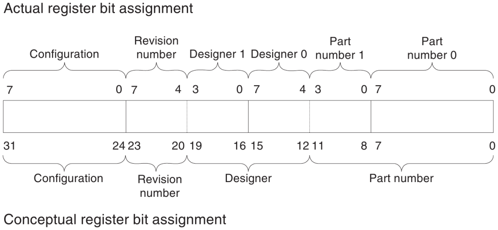

图 3-1　外设标识寄存器位分配（Peripheral identification register bit assignment）

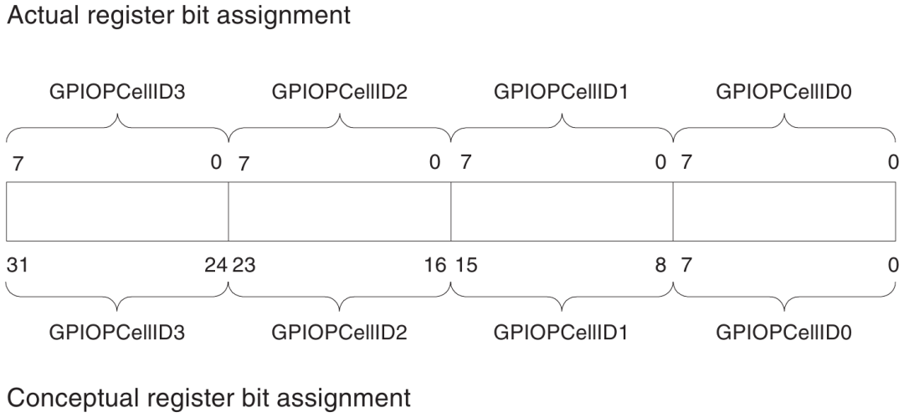

图 3-2　PrimeCell 标识寄存器位分配（PrimeCell identification register bit assignment）

两组标识寄存器，都是硬编码、只读，供 BIOS 自动扫描识别：

**外设标识（GPIOPeriphID0-3）**——把 4 个 8 位寄存器合起来看作一个 32 位数，分四段：

|  |  |  |  |
| --- | --- | --- | --- |
| 字段 | 位 | 值 | 含义 |
| Configuration | [31:24] | 0x00 | 配置选项 |
| Revision | [23:20] | 0x0 | 版本号（从 0 起） |
| Designer | [19:12] | 0x41 | 设计者 ARM（ASCII 'A'） |
| PartNumber | [11:0] | 0x061 | 产品代码 061 |

拆到单个寄存器：PeriphID0=0x61、PeriphID1=0x10（低 4 位 PartNumber1=0，高 4 位 Designer0=1）、PeriphID2=0x04（低 4 位 Designer1=4，高 4 位 Revision=0）、PeriphID3=0x00。

**PrimeCell 标识（GPIOPCellID0-3）**——固定为 **0xB105F00D**，是 ARM PrimeCell 外设的通用「身份证」，任何 PrimeCell 外设都是这个值：

|  |  |
| --- | --- |
| 寄存器 | 值 |
| GPIOPCellID0 | 0x0D |
| GPIOPCellID1 | 0xF0 |
| GPIOPCellID2 | 0x05 |
| GPIOPCellID3 | 0xB1 |

注意：PL061 的存储空间是 **4KB**，访问标识寄存器必须用 **32 位**（LDR/STR）访问。

◆ 记忆要点：寄存器从 0x400 起依次是 **DIR、IS、IBE、IEV、IE、RIS、MIS、IC、AFSEL**（各占 4 字节地址）；数据寄存器 GDATA 独占 0x000～0x3FC。标识两件套：**PeriphID = 0x00/0x10/0x04/0x61**（PartNumber 061、Designer 41），**PCellID = 0xB105F00D**（PrimeCell 通用身份证）。

## 34.6 信号与总结

这一章收尾：把 PL061 的全部信号按类别列一遍，再给一份「编程清单」和全书主线。

◆ 核心观点：PL061 的信号分三组——**APB 信号**（挂总线，P 前缀）、**片上信号**（接其他外设，含硬件控制 nGPAFEN/GPAFOUT/GPAFIN 和中断 GPIOMIS/GPIOINTR）、**到 pad 的信号**（接芯片引脚 nGPEN/GPOUT/GPIN）。学完整本书，只要记住一条主线：**GPIO = APB 从设备 + 8 引脚，用 GPIODIR 定方向、GPIODATA 传数据（地址掩码）、GPIOAFSEL 切模式、7 个中断寄存器管中断**。

### 34.6.1 AMBA APB 信号

PL061 作为 APB 从设备，P 前缀、高有效，低有效信号含小写 n：

|  |  |  |
| --- | --- | --- |
| 信号 | 方向 | 说明 |
| PRESETn | 输入 | 总线复位，低有效 |
| PCLK | 输入 | APB 时钟，所有传输的节拍 |
| PSEL | 输入 | 选中信号，1 表示本设备被选中 |
| PENABLE | 输入 | 使能，拉高一拍完成一次传输 |
| PWRITE | 输入 | 高=写，低=读 |
| PADDR[11:2] | 输入 | 地址总线子集 |
| PWDATA[7:0] | 输入 | 写数据 |
| PRDATA[7:0] | 输出 | 读数据 |

### 34.6.2 片上信号

接芯片内其他模块的信号：

|  |  |  |
| --- | --- | --- |
| 信号 | 方向 | 说明 |
| nGPAFEN[7:0] | 输入 | 硬件控制输出使能，低有效，不用时接高 |
| GPAFOUT[7:0] | 输入 | 硬件控制数据输入，不用时可接低或高 |
| GPAFIN[7:0] | 输出 | 硬件控制数据输出 |
| GPIOMIS[7:0] | 输出 | 到中断控制器的屏蔽后中断，高=有效匹配 |
| GPIOINTR | 输出 | GPIOMIS 的合并或（OR）版本 |
| SCANENABLE / SCANINPCLK / SCANOUTPCLK | — | 扫描测试用 |

### 34.6.3 到 pad 的信号

接芯片 I/O 引脚（pad）的信号，每个 pad 三根线：

|  |  |  |
| --- | --- | --- |
| 信号 | 方向 | 说明 |
| nGPEN[7:0] | 输出 | 输出使能，低有效，由 GPIODIR（软件模式）或辅助引脚（硬件模式）驱动 |
| GPOUT[7:0] | 输出 | 输出数据，由 GPIODATA（软件模式）或辅助引脚（硬件模式）驱动 |
| GPIN[7:0] | 输入 | 从 pad 读回的输入数据 |

注意：**GPIN 是异步信号**，读到 GPIODATA 前需要等待**两个 PCLK 上升沿**。

### 34.6.4 一份典型操作的编程清单

**配置引脚为输出并拉高**：

1. 写 GPIODIR：把对应位写 1（输出）；

2. 写 GPIODATA（用带掩码的地址，如 0x3FC 全写）：把对应位写 1（拉高）。

**读取引脚输入**：

1. 写 GPIODIR：对应位写 0（输入）；

2. 读 GPIODATA：对应位读回引脚电平（异步输入需等 2 个 PCLK）。

**配置上升沿中断**：

1. 写 GPIOIS：对应位 0（边沿）；

2. 写 GPIOIBE：对应位 0（单边沿）；

3. 写 GPIOIEV：对应位 1（上升沿）；

4. 写 GPIOIC：对应位写 1（清残留）；

5. 写 GPIOIE：对应位 1（使能）；

6. 中断处理：读 GPIOMIS（或 GPIORIS）确认 → 处理 → 写 GPIOIC 清除。

**切换为硬件控制**：

1. 写 GPIOAFSEL：对应位 1（硬件模式）；

2. 之后该引脚由 nGPAFEN（方向）/GPAFOUT（写）/GPAFIN（读）接管。

### 34.6.5 全书主线

1. **是什么**：GPIO = 通用输入输出，PL061 = APB 从设备 + 8 个可编程引脚（第 1 章）；

2. **什么结构**：5 类寄存器 + 模式控制，软件/硬件双模式（第 2 章）；

3. **怎么传数据**：GPIODATA + 地址掩码 + GPIODIR（第 3 章）；

4. **怎么中断**：7 寄存器触发链（第 4 章）；

5. **怎么配**：完整寄存器布局 + 标识（第 5 章）；

6. **怎么接线**：APB / 片上 / pad 三组信号（第 6 章）。

一句话总结：**GPIO 把「一根根引脚」抽象成「一个个寄存器位」，用 GPIODIR 定方向、GPIODATA 传数据、GPIOAFSEL 切复用、7 个中断寄存器管中断；其中「地址线当掩码」和「逐引脚中断」是 PL061 区别于普通 IO 口的两个招牌设计。**

◆ 记忆要点：全书抓三个核心——**「地址掩码」（GPIODATA 占 256 地址，PADDR[9:2] 当掩码）、「双模式」（GPIOAFSEL 切软件/硬件）、「中断链」（IS→IBE→IEV→IE→RIS/MIS→IC）**。寄存器记「数据/方向/中断×7/模式/标识」；方向 1 出 0 入、复位全输入；标识 PeriphID=0x061（ARM），PCellID=0xB105F00D。任何细节忘了，回到「**方向 → 数据 → 模式 → 中断**」这条线定位。

---

# 35. 芯片寄存器里的状态位，为什么要写1清零？

> 来源：https://mp.weixin.qq.com/s/fFkUrlPusQf6H__IjV79TQ
> 作者：芯片验证
> update 2026/09/15 21 : 53

写驱动或者调试外设时，我们经常会在寄存器手册里看到一种字段属性：W1C，Write 1 to Clear。第一次看到这个定义，很容易觉得反直觉。一个状态位已经是1了，为什么还要再写1才能清掉？如果想把它清零，直接写0不是更自然吗？

这个问题很容易让人困惑，但它背后其实是硬件事件和软件处理之间的一种约定。有些偶发漏中断、状态位意外消失的问题，最后会定位到W1C字段使用不当。

W1C不是为了让寄存器写法变复杂，而是为了让软件明确告诉硬件：这个已经发生过的事件，我处理完了，现在可以清掉。DMXAI芯片验证

## 35.1 状态位不是普通变量

我们平时软件开发给变量赋值，一般是需要清零就写0。但芯片寄存器里的状态位不一定是一个普通变量。比如某个外设传输完成后，硬件把done bit置1；收到一帧数据后，硬件把rx\_pending置1；发生错误后，硬件把error bit置1。这个1通常表示“某件事已经发生过”，是硬件把事件记录下来，等软件来处理。

如果这个状态位只是普通RW，软件写0就清掉，看起来也能工作。但同一个寄存器里往往还有其他状态位，硬件也可能在软件读写寄存器的过程中继续更新状态。我们真正需要的不是“把整个寄存器写成某个值”，而是“只清掉我已经处理过的那个事件”。

W1C的意思就是：对这个bit写1表示清除请求，写0表示不动它。这里的1不是要保存进去的新值，更像按下一个清除按钮，而不是给变量赋值。

## 35.2 写1清零，是为了只清该清的状态

假设一个状态寄存器里有两个W1C标志：

```
bit1 = rx_error
bit0 = tx_done
```

某一刻读出来是`0b11`，说明两个事件都发生了。现在我们只处理完了`tx_done`，想清bit0，`rx_error`还没处理，应该继续保留。

如果软件直接写清除掩码：

```
write 0b01
```

硬件看到bit0写1，就清掉`tx_done`；看到bit1写0，就保持`rx_error`不变。结果符合预期。

真正危险的是另一种很常见的写法：先读寄存器，再改某一位，最后把整个值写回去。比如代码里写成类似`reg |= TX_DONE`。从软件语义看，我们只是想“操作bit0”；但对W1C寄存器来说，写回去的是`0b11`，硬件会把bit0和bit1都当成清除请求。

所以，对纯W1C状态寄存器，通常应该直接写入需要清除的位掩码，而不是做普通的read-modify-write。具体写法仍要以寄存器spec为准。

W1C字段里，写回寄存器的每一个1，都可能清掉一个尚未处理的状态。问题不在于改了哪一位，而在于最终写入值里哪些bit是1。DMXAI芯片验证

这也是为什么很多芯片手册会提醒，带W1C字段的寄存器要避免普通read-modify-write写法。尤其在中断状态寄存器里，这类错误可能表现成偶发漏中断：事件确实来过，硬件也记录过，但软件在清另一个标志时顺手把它清掉了。

## 35.3 不能把所有寄存器都按一种写法处理

知道W1C以后，也不能反过来认为所有状态寄存器都可以直接写掩码。是否能这样处理，要看整个寄存器的字段属性。有些寄存器是纯W1C状态位，有些会混合RW配置位、RO状态位、reserved bit和W1C字段，也有的平台会提供单独的clear寄存器。

所以我们看寄存器时，不能只看字段名字，还要确认每个字段的访问属性和写入语义。混合多种属性时尤其要按照spec处理，否则一次写操作可能在清除状态的同时，意外改变其他控制位。

## 35.4 硬件又来一个事件怎么办

还有一个更容易被忽略的问题：软件清状态的同时，硬件如果又产生了同一个事件，这个bit最后应该是0还是1？

硬件set和软件clear同时发生时谁优先，没有统一答案，必须由寄存器spec明确规定，并在RTL实现和验证中保持一致，软件写法本身解决不了这个问题。

单个状态位也不能替代事件计数。如果同一个事件连续发生两次，而软件只看到一个pending bit为1，它最多知道“至少发生过一次”。系统如果必须区分每一次事件，就需要计数器、FIFO或者更明确的握手机制。

这也是寄存器设计和验证里很重要的一点：我们要验证的不是“写1以后bit会不会变0”，而是在硬件事件、软件清除、中断响应和异常路径同时存在时，状态位还能不能准确表达系统正在发生什么。

W1C里的“1”不是要写进去的状态，而是一个清除动作；写0表示不影响对应bit。真正危险的是把W1C状态寄存器当成普通变量做read-modify-write，导致尚未处理的pending状态被一起清掉。

---

# 36. Boot Mode是什么？芯片为什么会走错启动路径？

> 来源：https://mp.weixin.qq.com/s/shhBtPxaNJVkpQMc-2_nEQ
> 作者：芯片验证
> update 2026/09/15 22 : 04

当Bring-up遇到“上电没日志”时，我们很可能先去看Bootloader、镜像格式或者启动介质。镜像是不是烧错了？eMMC是不是没响应？QSPI Flash是不是没焊好？这些都是问题可能的方向，但还有一个更早的问题经常被忽略：芯片可能根本没有走到我们想要的那条启动路径。

比如镜像明明烧在eMMC里，芯片却被配置成从QSPI启动；拨码开关看起来拨对了，但上电采样时Boot pin电平不是预期；某个eFuse或OTP配置改变了启动优先级。这个时候，后面的镜像再正确，BootROM也没有机会加载它。

Boot Mode通常决定芯片早期启动路径，包括从哪个介质启动、进入哪种下载或恢复模式等；一旦方向选错，问题看起来像“软件没跑”，但真正原因可能是软件根本没有被读取。DMXAI芯片验证

## 36.1 Boot Mode不是软件选项，而是启动方向

Boot Mode不是Linux参数，也不是Bootloader菜单。它发生得更早，通常在POR或reset释放附近被采样，并在硬件启动逻辑或BootROM早期用于决定启动路径。

对复杂SoC来说，芯片上电后不会自动知道系统最后要运行Linux、RTOS还是某个应用。它需要先找到下一阶段镜像。这个镜像可能放在QSPI、SPI NAND、SD、eMMC、NAND，也可能通过UART、USB、JTAG等下载或恢复入口进入调试、加载流程，具体取决于芯片支持的启动方式。

Boot Mode解决的不是“系统最后运行什么”，而是“早期启动逻辑先进入哪条路径”。如果Boot Mode指向了错误介质，后面的Bootloader、固件、设备树、文件系统准备得再完整，也可能暂时没有意义。因为芯片启动链路还没有走到读取这些内容的位置。

## 36.2 Boot Mode通常从哪里来

不同芯片实现会有差异，但Boot Mode常见来源包括Boot Mode pin、strap pin、板上的拨码开关、电阻上下拉、eFuse、OTP、生命周期状态，以及厂商定义的下载或恢复规则。

有些配置来自板级硬件，有些配置来自芯片内部一次性或受限修改的状态。它们并不总是同等优先级。比如某些SoC中，eFuse或安全生命周期状态可能覆盖外部Boot pin；某些下载模式需要特定引脚组合；某些启动模式只在POR阶段采样，普通system reset未必会重新采样。

看Boot Mode时，不能只看“文档上支持哪些启动方式”，还要看当前这颗芯片、当前这块板、当前这次复位，实际会让启动逻辑看到什么状态。DMXAI芯片验证

所以排查Boot Mode时，我们看的不只是一个拨码开关位置。我们要确认的是：复位释放前后，芯片真正采到了哪些启动相关状态；这些状态经过内部优先级和安全规则之后，最终选择了哪条启动路径。

## 36.3 为什么芯片会走错启动路径

最常见的一类问题，是板上开关和逻辑电平被理解反了。拨码开关标着ON，不一定就代表Boot pin被芯片采成1。它到底是上拉、下拉，还是通过开关接到某个固定电平，需要回到原理图和实测波形里确认。

第二类问题是上下拉或复用电路影响了采样。Boot pin后续可能还会作为GPIO、外设信号或调试信号使用，但启动采样发生得更早。如果外部器件在上电阶段还没有进入稳定状态，或者复用电路对电平有影响，芯片采到的Boot Mode就可能和静态检查结果不一致。

第三类问题和reset时序有关。有些Boot Mode只在POR释放附近采样，如果电源、reset、外部器件输出或时钟状态还不稳定，采样窗口里看到的电平可能不是我们预期的稳态电平。稳态电平正确，不代表采样瞬间正确。这也是为什么有些问题按一下reset和完整断电重上电，现象并不完全一样。

还有一类问题来自eFuse、OTP或安全状态。比如芯片可能进入了安全启动路径，某些下载模式被关闭，或者fallback策略和研发阶段假设不同。外部Boot pin看起来没变，但内部配置已经改变了最终路径。

Boot Mode最容易误判的地方在于：我们看到的是板子上的开关和镜像文件，芯片采到的却是复位瞬间的真实电平和内部配置状态。

## 36.4 怎么判断Boot Mode有没有走对

最直接的办法，是看Boot Mode相关引脚在POR或reset释放附近的真实波形，而不是只看开关位置和万用表静态电平。采样发生在某个时间窗口里，静态检查只能回答一部分问题。

接下来可以看启动介质有没有被访问。如果预期从QSPI启动，就应该看到片选、时钟和数据线上的动作；如果预期从SD或eMMC启动，就要看接口初始化是否发生；如果预期进入UART或USB下载模式，也应该有相应握手迹象。

如果JTAG或厂商工具还能访问，可以进一步查看Boot状态寄存器、错误码、启动进度码、fallback状态，或者BootROM停留位置。有些芯片会提供sticky status，把启动失败原因保留下来，这对判断“到底选了哪条路”很关键。

没有访问启动介质，不一定是介质坏了；也可能是BootROM从一开始就没有选择它。

## 36.5 提前留下判断启动路径的证据

Boot Mode问题看起来像板级配置问题，但它不只发生在板子上。对复杂SoC来说，Boot Mode编码、内部优先级、eFuse覆盖关系、安全状态、fallback路径和错误状态，都需要在设计和验证阶段梳理清楚。

比较关键的是三件事：Boot Mode编码要和文档、RTL、BootROM和板级设计一致；POR和system reset下的采样行为要说清楚；空镜像、坏Header、介质访问失败、非法模式时要有可观察状态和最小恢复路径。

FPGA Prototype或Emulation可以提前验证BootROM对不同Boot Mode的选择逻辑、寄存器状态和软件路径，但不能替代真实硅片上的上电采样、电源时序和板级电平确认。真正到Bring-up时，我们仍然要用波形、状态寄存器、介质访问迹象和工具返回信息，把“芯片到底去了哪里”这件事确认下来。

## 36.6 先确认芯片到底去了哪里

当芯片上电后没有日志时，我们不应该只问“Bootloader为什么没跑”，而要先确认Boot Mode有没有被采成预期路径。镜像正确、介质正常、Bootloader代码也没问题，并不代表芯片真的去读了它。

Boot Mode看起来只是几个引脚或几位配置，但它决定的是启动链路第一步的方向。方向错了，后面所有正确的软件准备都可能暂时没有机会发挥作用。

Boot Mode通常决定芯片早期启动路径，包括从哪个介质启动、进入哪种下载或恢复模式等。它连接板级strap、电阻上下拉、eFuse、OTP、安全状态、BootROM和启动介质。一旦启动路径选错，外部看到的可能只是没有日志，但真正的问题可能发生在软件被读取之前。
