<!-- toc-start -->

# 目录

[1. UVM 基础第三天：怎样把波形还原成事务](#1-uvm-基础第三天怎样把波形还原成事务)  
　　[1.1 并行观察五条通道](#11-并行观察五条通道)  
　　[1.2 监视器只观察](#12-监视器只观察)  
　　[1.3 长期采样循环](#13-长期采样循环)  
　　[1.4 写请求不是一拍收齐](#14-写请求不是一拍收齐)  
　　[1.5 读响应也要按 ID 累积](#15-读响应也要按-id-累积)  
　　[1.6 复位不是只清一个信号](#16-复位不是只清一个信号)  
　　[1.7 不要只看有效信号](#17-不要只看有效信号)  
　　[1.8 不驱动接口](#18-不驱动接口)  
　　[1.9 读懂输出](#19-读懂输出)  
　　[1.10 真实调试：数量不对还是字段不对](#110-真实调试数量不对还是字段不对)  
　　[1.11 小结](#111-小结)  
　　[1.12 面试问答](#112-面试问答)  
　　[1.13 问题 2：monitor 可以为了修正信号临时驱动接口吗？](#113-问题-2monitor-可以为了修正信号临时驱动接口吗)  
[2. UVM 基础第一天：谁只是数据，谁会活在层级里](#2-uvm-基础第一天谁只是数据谁会活在层级里)  
　　[2.1 对象与组件：一个装数据，一个活在层级里](#21-对象与组件一个装数据一个活在层级里)  
　　[2.2 定义一笔总线事务](#22-定义一笔总线事务)  
　　[2.3 组件为什么需要父组件](#23-组件为什么需要父组件)  
　　[2.4 复制对象，不要只复制句柄](#24-复制对象不要只复制句柄)  
　　[2.5 读懂输出](#25-读懂输出)  
　　[2.6 真实调试：空句柄、共享句柄、丢失层级](#26-真实调试空句柄共享句柄丢失层级)  
　　[2.7 小结](#27-小结)  
　　[2.8 面试问答](#28-面试问答)  
　　[2.9 问题 2：为什么 `b = a` 之后改 `b` 会影响 `a`？在 UVM 数据流里怎么避免？](#29-问题-2为什么-b-a-之后改-b-会影响-a在-uvm-数据流里怎么避免)  
[3. UVM 基础第二天：一笔事务怎么同时送给多个地方](#3-uvm-基础第二天一笔事务怎么同时送给多个地方)  
　　[3.1 分析端口：发布者不关心谁在收](#31-分析端口发布者不关心谁在收)  
　　[3.2 声明发布端](#32-声明发布端)  
　　[3.3 广播前必须复制](#33-广播前必须复制)  
　　[3.4 订阅端只实现 `write`](#34-订阅端只实现-write)  
　　[3.5 读懂输出](#35-读懂输出)  
　　[3.6 真实调试：没有订阅、没有发布、对象被复用](#36-真实调试没有订阅没有发布对象被复用)  
　　[3.7 小结](#37-小结)  
　　[3.8 面试问答](#38-面试问答)  
　　[3.9 问题 2：analysis port 广播前为什么建议复制 transaction？](#39-问题-2analysis-port-广播前为什么建议复制-transaction)  
[4. UVM 基础第四天：怎样判断结果对不对](#4-uvm-基础第四天怎样判断结果对不对)  
　　[4.1 两路数据在记分板汇合](#41-两路数据在记分板汇合)  
　　[4.2 生成期望结果](#42-生成期望结果)  
　　[4.3 配对键：地址只是最小示例](#43-配对键地址只是最小示例)  
　　[4.4 expected 表也有自己的生命周期](#44-expected-表也有自己的生命周期)  
　　[4.5 比较前先排除错配](#45-比较前先排除错配)  
　　[4.6 收到实际结果后比较](#46-收到实际结果后比较)  
　　[4.7 结束时检查遗留项](#47-结束时检查遗留项)  
　　[4.8 读懂输出](#48-读懂输出)  
　　[4.9 真实调试：缺期望、缺实际、还是配错](#49-真实调试缺期望缺实际还是配错)  
　　[4.10 小结](#410-小结)  
　　[4.11 面试问答](#411-面试问答)  
　　[4.12 问题 2：为什么测试结束时还要检查遗留的 expected transaction？](#412-问题-2为什么测试结束时还要检查遗留的-expected-transaction)  
[5. 骨架 — 从 APB Monitor 看懂 UVC 架构](#5-骨架-从-apb-monitor-看懂-uvc-架构)  
　　[5.1 为什么需要 UVC？](#51-为什么需要-uvc)  
　　　　[5.1.1 UVC 开发的基本原则](#511-uvc-开发的基本原则)  
　　　　[5.1.2 从简单到复杂：UVC 开发的 7 个层次](#512-从简单到复杂uvc-开发的-7-个层次)  
　　[5.2 UVM Testbench 标准层次](#52-uvm-testbench-标准层次)  
　　[5.3 Agent 架构详解](#53-agent-架构详解)  
　　　　[5.3.1 Active vs Passive](#531-active-vs-passive)  
　　[5.4 Config Object 模式](#54-config-object-模式)  
　　[5.5 Cookbook 的 VIP 开发关键原则](#55-cookbook-的-vip-开发关键原则)  
　　　　[5.5.1 Package 组织](#551-package-组织)  
　　　　[5.5.2 Factory 注册](#552-factory-注册)  
　　　　[5.5.3 Config Object 模式](#553-config-object-模式)  
　　　　[5.5.4 TLM 松耦合](#554-tlm-松耦合)  
　　[5.6 Cookbook 推荐的分层复用策略](#56-cookbook-推荐的分层复用策略)  
　　[5.7 实战：APB Monitor VIP](#57-实战apb-monitor-vip)  
　　　　[5.7.1 APB 协议速览](#571-apb-协议速览)  
　　　　[5.7.2 apb\_transaction 定义](#572-apb_transaction-定义)  
　　　　[5.7.3 apb\_monitor 实现](#573-apb_monitor-实现)  
　　　　[5.7.4 apb\_agent 实现](#574-apb_agent-实现)  
　　　　[5.7.5 apb\_config 定义](#575-apb_config-定义)  
　　　　[5.7.6 在 env 中实例化](#576-在-env-中实例化)  
　　[5.8 下篇预告：Seq-Sqr-Drv 握手机制](#58-下篇预告seq-sqr-drv-握手机制)  
[6. 握手 — 让 APB Master VIP 动起来](#6-握手-让-apb-master-vip-动起来)  
　　[6.1 目录](#61-目录)  
　　[6.2 Seq-Sqr-Drv 握手机制](#62-seq-sqr-drv-握手机制)  
　　　　[6.2.1 两种通信方式](#621-两种通信方式)  
　　　　[6.2.2 三者分工](#622-三者分工)  
　　　　[6.2.3 代码层面发生了什么](#623-代码层面发生了什么)  
　　　　[6.2.4 宏展开](#624-宏展开)  
　　　　[6.2.5 Hook 回调](#625-hook-回调)  
　　[6.3 Sequencer 仲裁机制](#63-sequencer-仲裁机制)  
　　　　[6.3.1 仲裁队列](#631-仲裁队列)  
　　　　[6.3.2 Lock 与 Grab](#632-lock-与-grab)  
　　[6.4 Unidirectional Non-Pipelined 模式](#64-unidirectional-non-pipelined-模式)  
　　　　[6.4.1 Cookbook 的分类](#641-cookbook-的分类)  
　　　　[6.4.2 为什么 APB 适合这个模式](#642-为什么-apb-适合这个模式)  
　　[6.5 实战：APB Master VIP 扩展](#65-实战apb-master-vip-扩展)  
　　　　[6.5.1 apb\_driver 实现](#651-apb_driver-实现)  
　　　　[6.5.2 apb\_master\_sequencer](#652-apb_master_sequencer)  
　　　　[6.5.3 apb\_write\_sequence](#653-apb_write_sequence)  
　　　　[6.5.4 连续多笔写](#654-连续多笔写)  
　　　　[6.5.5 Agent 改为 active 模式](#655-agent-改为-active-模式)  
　　　　[6.5.6 在 test 中启动 sequence](#656-在-test-中启动-sequence)  
　　　　[6.5.7 验证要点](#657-验证要点)  
　　[6.6 小结](#66-小结)  
[7. 响应 — AHB 读写与 Bidirectional Driver](#7-响应-ahb-读写与-bidirectional-driver)  
　　[7.1 目录](#71-目录)  
　　[7.2 Bidirectional Non-Pipelined 模式](#72-bidirectional-non-pipelined-模式)  
　　　　[7.2.1 Cookbook 的分类](#721-cookbook-的分类)  
　　　　[7.2.2 为什么需要 response](#722-为什么需要-response)  
　　[7.3 Response 回传机制](#73-response-回传机制)  
　　　　[7.3.1 两种回传方式](#731-两种回传方式)  
　　　　[7.3.2 REQ/RSP 类型参数化](#732-reqrsp-类型参数化)  
　　[7.4 AHB 协议速览](#74-ahb-协议速览)  
　　　　[7.4.1 信号列表](#741-信号列表)  
　　　　[7.4.2 HTRANS 编码](#742-htrans-编码)  
　　　　[7.4.3 HBURST 类型](#743-hburst-类型)  
　　　　[7.4.4 HRESP 编码](#744-hresp-编码)  
　　　　[7.4.5 单笔写时序](#745-单笔写时序)  
　　　　[7.4.6 单笔读时序](#746-单笔读时序)  
　　　　[7.4.7 Wait State](#747-wait-state)  
　　[7.5 实战：AHB Master VIP](#75-实战ahb-master-vip)  
　　　　[7.5.1 ahb\_transaction 定义](#751-ahb_transaction-定义)  
　　　　[7.5.2 ahb\_driver 实现](#752-ahb_driver-实现)  
　　　　[7.5.3 ahb\_monitor 实现](#753-ahb_monitor-实现)  
　　　　[7.5.4 ahb\_master\_agent](#754-ahb_master_agent)  
　　　　[7.5.5 ahb\_write\_seq / ahb\_read\_seq](#755-ahb_write_seq-ahb_read_seq)  
　　　　[7.5.6 ahb\_config 定义](#756-ahb_config-定义)  
　　　　[7.5.7 在 env 中实例化](#757-在-env-中实例化)  
　　　　[7.5.8 验证要点](#758-验证要点)  
　　[7.6 小结](#76-小结)  
[8. AI 写 UVC？我踩了无数坑后，搞了个 Skill 包救自己](#8-ai-写-uvc我踩了无数坑后搞了个-skill-包救自己)  
　　[8.1 一周没更新，后台炸了](#81-一周没更新后台炸了)  
　　[8.2 第一次尝试：AI 的 UVM，语法都写不对](#82-第一次尝试ai-的-uvm语法都写不对)  
　　[8.3 第一轮突破：给 AI 加上"红绿灯"——TDD](#83-第一轮突破给-ai-加上红绿灯tdd)  
　　[8.4 第二轮突破：Wavedrom——让 AI 正确"看懂"时序](#84-第二轮突破wavedrom让-ai-正确看懂时序)  
　　[8.5 第三轮挑战：Guidelines——让 AI 写出"好"的 UVC](#85-第三轮挑战guidelines让-ai-写出好的-uvc)  
　　　　[8.5.1 问题一：Guideline 写得太抽象，AI 不理解](#851-问题一guideline-写得太抽象ai-不理解)  
　　　　[8.5.2 问题二：模型差异巨大](#852-问题二模型差异巨大)  
　　[8.6 最终方案：代码模板化，脚本 + Prompt 两步走](#86-最终方案代码模板化脚本-prompt-两步走)  
　　[8.7 env-builder：一个完整的 UVC 开发 Skill](#87-env-builder一个完整的-uvc-开发-skill)  
　　　　[8.7.1 uvc\_gen：UVC 框架生成脚本](#871-uvc_genuvc-框架生成脚本)  
　　　　[8.7.2 开发 UVC 的流程](#872-开发-uvc-的流程)  
　　[8.8 ic-verifier：一个面向 DV 的 AI Skill 技能包](#88-ic-verifier一个面向-dv-的-ai-skill-技能包)  
　　[8.9 总结：AI 开发 UVC 的正确姿势](#89-总结ai-开发-uvc-的正确姿势)  
　　　　[8.9.1 TDD 是必须的](#891-tdd-是必须的)  
　　　　[8.9.2 时序描述要结构化](#892-时序描述要结构化)  
　　　　[8.9.3 框架和逻辑分离](#893-框架和逻辑分离)  
　　　　[8.9.4 Guidelines 要具体](#894-guidelines-要具体)  
　　　　[8.9.5 不同模型要区别对待](#895-不同模型要区别对待)  
　　[8.10 项目地址](#810-项目地址)  
[9. 流水线 — Pipeline Driver 与 Outstanding 控制](#9-流水线-pipeline-driver-与-outstanding-控制)  
　　[9.1 目录](#91-目录)  
　　[9.2 Pipeline 是什么？用 get\_next\_item 能做得到吗？](#92-pipeline-是什么用-get_next_item-能做得到吗)  
　　　　[9.2.1 回顾：第 3 篇的非流水线模式](#921-回顾第-3-篇的非流水线模式)  
　　　　[9.2.2 哪些协议需要 pipeline driver](#922-哪些协议需要-pipeline-driver)  
　　　　[9.2.3 解决方案：get(req) + put(rsp)](#923-解决方案getreq-putrsp)  
　　　　[9.2.4 两种握手方式对比](#924-两种握手方式对比)  
　　[9.3 Pipeline + Outstanding：从简单示例到 AHB 实战](#93-pipeline-outstanding从简单示例到-ahb-实战)  
　　　　[9.3.1 Pipeline 核心架构](#931-pipeline-核心架构)  
　　　　[9.3.2 简单示例：两阶段协议](#932-简单示例两阶段协议)  
　　　　[9.3.3 AHB 实战：改造第 3 篇的 Driver](#933-ahb-实战改造第-3-篇的-driver)  
　　[9.4 关键概念与常见陷阱](#94-关键概念与常见陷阱)  
　　　　[9.4.1 为什么必须 clone](#941-为什么必须-clone)  
　　　　[9.4.2 set\_id\_info 为什么是必需的](#942-set_id_info-为什么是必需的)  
　　　　[9.4.3 mailbox vs queue](#943-mailbox-vs-queue)  
　　　　[9.4.4 pipeline vs burst](#944-pipeline-vs-burst)  
　　　　[9.4.5 线程安全](#945-线程安全)  
　　　　[9.4.6 常见陷阱速查](#946-常见陷阱速查)  
　　[9.5 下篇预告](#95-下篇预告)  
[10. 乱序 — 响应乱序处理与完整 Driver](#10-乱序-响应乱序处理与完整-driver)  
　　[10.1 目录](#101-目录)  
　　[10.2 响应的三种模式](#102-响应的三种模式)  
　　　　[10.2.1 从 Pipeline 到 Out-of-Order](#1021-从-pipeline-到-out-of-order)  
　　　　[10.2.2 乱序响应的特性](#1022-乱序响应的特性)  
　　　　[10.2.3 实现思路：在 Pipeline 上加 ID 匹配](#1023-实现思路在-pipeline-上加-id-匹配)  
　　[10.3 乱序响应匹配机制](#103-乱序响应匹配机制)  
　　　　[10.3.1 为什么 foreach 从头扫描天然满足保序](#1031-为什么-foreach-从头扫描天然满足保序)  
　　　　[10.3.2 匹配后的处理流程](#1032-匹配后的处理流程)  
　　　　[10.3.3 防御：匹配失败](#1033-防御匹配失败)  
　　[10.4 完整实例：五线程 Pipeline Driver](#104-完整实例五线程-pipeline-driver)  
　　　　[10.4.1 架构总览](#1041-架构总览)  
　　　　[10.4.2 完整 Driver 代码](#1042-完整-driver-代码)  
　　　　[10.4.3 对应的 Sequence 写法](#1043-对应的-sequence-写法)  
　　[10.5 常见陷阱](#105-常见陷阱)  
　　　　[10.5.1 收到预期外的响应 ID](#1051-收到预期外的响应-id)  
　　　　[10.5.2 同 ID 多笔 outstanding 的保序](#1052-同-id-多笔-outstanding-的保序)  
　　　　[10.5.3 outstanding\_cnt 的线程安全](#1053-outstanding_cnt-的线程安全)  
　　　　[10.5.4 pending\_q 只按 ID 匹配的隐患](#1054-pending_q-只按-id-匹配的隐患)  
　　　　[10.5.5 fork-join\_none 泄漏](#1055-fork-join_none-泄漏)  
[11. 换位 — 从 Master 到 Slave VIP](#11-换位-从-master-到-slave-vip)  
　　[11.1 Slave 模型解决什么问题](#111-slave-模型解决什么问题)  
　　　　[11.1.1 核心特点](#1111-核心特点)  
　　　　[11.1.2 为什么 Responder 是长生命周期 sequence？](#1112-为什么-responder-是长生命周期-sequence)  
　　[11.2 Cookbook 的 Responder 范式](#112-cookbook-的-responder-范式)  
　　　　[11.2.1 单 item 模式](#1121-单-item-模式)  
　　　　[11.2.2 多 item 模式](#1122-多-item-模式)  
　　[11.3 两类观察](#113-两类观察)  
　　[11.4 APB Slave 落地](#114-apb-slave-落地)  
　　[11.5 Reset 与死锁](#115-reset-与死锁)  
　　[11.6 总结](#116-总结)  
[12. 分层 — 打造可复用的 Sequence 体系](#12-分层-打造可复用的-sequence-体系)  
　　[12.1 不建议用 Sequence Library 组织场景](#121-不建议用-sequence-library-组织场景)  
　　[12.2 API Sequence：封装单笔访问](#122-api-sequence封装单笔访问)  
　　[12.3 Worker Sequence：组合完整任务](#123-worker-sequence组合完整任务)  
　　[12.4 Virtual Sequence：协调多个 Agent](#124-virtual-sequence协调多个-agent)  
　　[12.5 Sequence Guideline](#125-sequence-guideline)  
　　[12.6 总结](#126-总结)  
[13. UVM 源码精读 Day1：UVM 架构与包入口](#13-uvm-源码精读-day1uvm-架构与包入口)  
　　[13.1 UVM 架构与包入口结构图](#131-uvm-架构与包入口结构图)  
　　[13.2 uvm\_pkg.sv 核心包的骨架](#132-uvm_pkgsv-核心包的骨架)  
　　　　[13.2.1 宏保护机制](#1321-宏保护机制)  
　　　　[13.2.2 模块加载顺序](#1322-模块加载顺序)  
　　　　[13.2.3 DPI 条件编译与兼容性处理](#1323-dpi-条件编译与兼容性处理)  
　　　　[13.2.4 实验性轮询 API 的独立包](#1324-实验性轮询-api-的独立包)  
　　[13.3 uvm.sv 门面模式入口](#133-uvmsv-门面模式入口)  
　　[13.4 今日总结](#134-今日总结)  
[14. UVM 源码精读 Day2：基础框架总览：uvm_base.svh](#14-uvm-源码精读-day2基础框架总览uvm_basesvh)  
　　[14.1 基础框架总览：uvm\_base.svh](#141-基础框架总览uvm_basesvh)  
　　[14.2 关键特性](#142-关键特性)  
　　[14.3 源码分析](#143-源码分析)  
　　　　[14.3.1 前向声明解决循环依赖](#1431-前向声明解决循环依赖)  
　　　　[14.3.2 Include 顺序的分层设计](#1432-include-顺序的分层设计)  
　　　　[14.3.3 资源与配置系统的依赖链](#1433-资源与配置系统的依赖链)  
　　　　[14.3.4 策略类与组件的层次分离](#1434-策略类与组件的层次分离)  
　　[14.4 小结](#144-小结)  
[15. UVM 源码精读 Day3：核心对象体系 uvm_object](#15-uvm-源码精读-day3核心对象体系-uvm_object)  
　　[15.1 UVM 源码精读 Day3：核心对象体系 uvm\_object](#151-uvm-源码精读-day3核心对象体系-uvm_object)  
　　[15.2 类层次与核心属性](#152-类层次与核心属性)  
　　　　[15.2.1 核心属性](#1521-核心属性)  
　　[15.3 工厂模式创建 create()](#153-工厂模式创建-create)  
　　[15.4 数据复制体系 copy / clone](#154-数据复制体系-copy-clone)  
　　　　[15.4.1 clone 完整复制](#1541-clone-完整复制)  
　　　　[15.4.2 copy 与 do\_copy 钩子](#1542-copy-与-do_copy-钩子)  
　　[15.5 数据比较体系 compare](#155-数据比较体系-compare)  
　　[15.6 打印体系 print / sprint / convert2string](#156-打印体系-print-sprint-convert2string)  
　　　　[15.6.1 三种打印接口](#1561-三种打印接口)  
　　[15.7 序列化体系 pack / unpack](#157-序列化体系-pack-unpack)  
　　　　[15.7.1 pack 族方法](#1571-pack-族方法)  
　　　　[15.7.2 unpack 反向恢复](#1572-unpack-反向恢复)  
　　[15.8 记录体系 record](#158-记录体系-record)  
　　[15.9 field automation 标志位](#159-field-automation-标志位)  
　　[15.10 随机化事件回调](#1510-随机化事件回调)  
　　[15.11 今日总结](#1511-今日总结)  
[16. UVM 基础第五天：拼出一个不驱动也能自动抓错的环境](#16-uvm-基础第五天拼出一个不驱动也能自动抓错的环境)  
　　[16.1 环境拥有三个组件](#161-环境拥有三个组件)  
　　[16.2 创建环境成员](#162-创建环境成员)  
　　[16.3 连接两条分析支路](#163-连接两条分析支路)  
　　[16.4 测试只创建环境](#164-测试只创建环境)  
　　[16.5 读懂输出](#165-读懂输出)  
　　[16.6 真实调试：沿着数据流逐段确认](#166-真实调试沿着数据流逐段确认)  
　　[16.7 小结](#167-小结)  
　　[16.8 面试问答](#168-面试问答)  
　　[16.9 问题 1：什么是被动 UVM 环境，它适合什么场景？](#169-问题-1什么是被动-uvm-环境它适合什么场景)  

<!-- toc-end -->

---

# 1. UVM 基础第三天：怎样把波形还原成事务

> 来源：https://mp.weixin.qq.com/s/-H5VwAABCiAzFGTX80OcIg
> 作者：周漾
> update 2026/08/22 08 : 09

波形里是一拍一拍的信号，验证环境真正想处理的是“向地址写了某个数据”这种事务。监视器负责完成这次转换：它不驱动任何信号，只观察接口，在一次有效握手完成时重建一笔对象，再广播出去。

监视器是被动环境的入口。它采得不准，后面的预测器和记分板都会跟着错。

“被动”不等于简单。monitor 需要准确理解协议的观察点：什么时候一笔事务真正成立、哪些字段在这一拍稳定、同一笔事务可能因背压停留多少拍。它只要在这里多采一次或少采一次，后面的比较就会出现看似无关的错误，因此采样逻辑应该尽量贴近协议定义，而不是凭经验挑一个方便的时刻。

真实 AXI monitor 的复杂度主要来自“一个逻辑事务被拆在多条物理通道上”。一笔读请求从读地址通道开始，数据可能在多个读响应拍之后才收齐；一笔写请求的地址和写数据甚至可以独立到达，最后再由写响应确认。因此，一个可复用的 monitor 不是看到一个信号变化就立即发一个 transaction，而是要维护若干个半成品，直到字段齐全后才对外发布。

## 1.1 并行观察五条通道

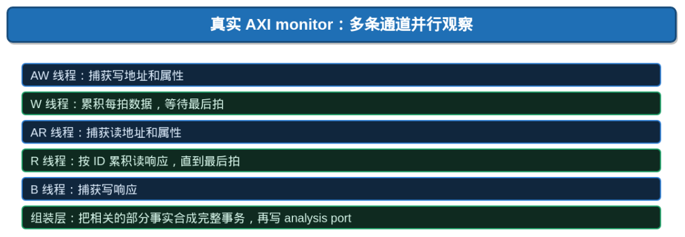

图 1：地址、写数据和响应由独立线程观察；监视器内部先组装，完整后才广播事务。

这一结构有两个层次。第一层是“拍级观察”：每个线程只关心本通道上的一次握手，例如读地址、写地址、写数据、读响应或写响应。第二层是“事务级组装”：把同一笔逻辑事务的多个拍合在一起，确认地址、数据、长度、响应或最后拍都已经到齐。分析端口应当收到第二层的完整事务，而不是一堆互相独立的半拍。

并行线程也解释了为什么 monitor 要有清楚的内部状态。写地址线程和写数据线程谁先运行不可预测；若它们共同改写同一个临时对象却没有一致的组装规则，就会在并发场景下生成半地址半数据的错误事务。真实环境里通常让每条通道先创建自己的局部快照，再用 ID 和完成状态把它们合并。

## 1.2 监视器只观察


图 1：监视器从接口观察信号、重建事务、发布给分析端口。

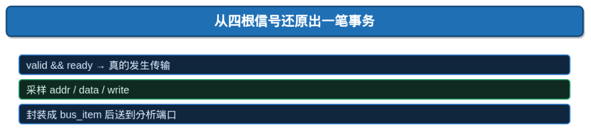

图 2：只有有效与就绪同时为高，才算真正发生了一笔传输。

有效信号表示发送方已经准备好了内容；就绪信号表示接收方愿意在这一拍接收。只有两个条件同时满足，地址、数据和方向才共同构成一次已经完成的传输。有效为高、就绪为低时，发送方通常必须保持当前内容不变，这只是“等待”，不是一笔新的事务。

## 1.3 长期采样循环

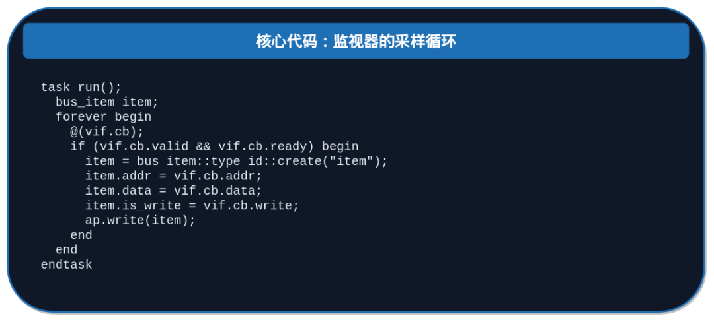

代码图 1：每个时钟点检查握手，成功时创建独立事务并发布。

创建对象放在握手条件内部有意为之。若每一拍都先创建对象、之后才判断是否有效，不但会产生大量无用对象，也容易让未初始化字段混进日志。先确认协议事件真的发生，再把当时稳定的信号抄进对象，monitor 输出才会和波形一一对应。

这段代码还体现了一个实用原则：monitor 发布的是“事实”，不应该在这里解释业务含义。例如地址 `0x00A0` 对应什么寄存器、数据是否合理，都应该由后续预测器或记分板判断。monitor 越少加入推断，越容易在不同测试里复用。

## 1.4 写请求不是一拍收齐

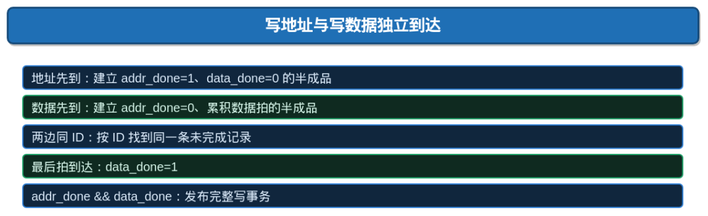

图 3：写地址与写数据可先后到达；监视器按 ID 保留半成品，直到两边都完成才发布。

AXI 写通道的难点不是“能否看到握手”，而是“何时认为这笔写完整”。地址通道握手之后，monitor 只知道目标位置、长度和 ID；写数据通道可能稍后才开始，也可能先到。写数据还可能有多个拍，必须一直累积到最后拍到达，才知道这一笔写的数据量是否与地址阶段声明的长度一致。

因此，真实 monitor 通常维护一张未完成写请求表。地址先到时，先建立一个“地址已完成、数据未完成”的条目；数据先到时，建立“数据已开始、地址未完成”的条目；两者的 ID 对上且数据最后拍出现之后，才把它交给完整事务处理。对同一个 ID 有多笔在飞时，不能只找到第一笔就结束，还要跳过已经收齐数据的旧条目，找到真正还缺数据的那一笔。

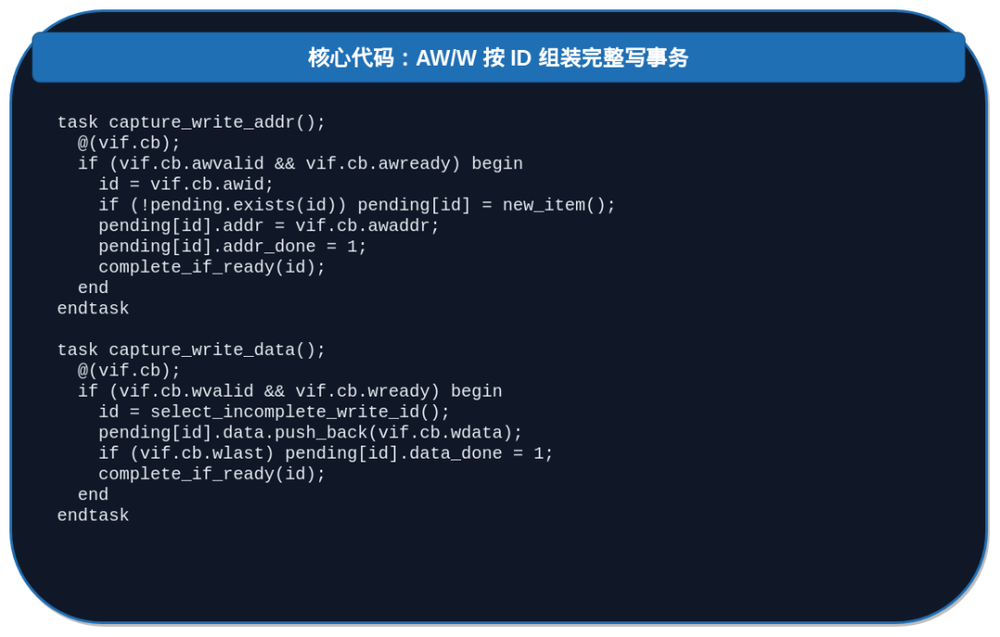

代码图 4：地址或数据先到都先保存在未完成表里；只有地址、全部数据和最后拍齐全才发布。

这段模式比简单的 `valid && ready` 多了一层检查：每个通道的握手只产生一个“部分事实”，不直接等同于完整请求。组装完成后还应检查数据拍数是否等于地址阶段声明的长度加一；否则 monitor 需要报告观察到的总线本身已不一致，而不是把一个不完整对象默默交给 scoreboard。

## 1.5 读响应也要按 ID 累积

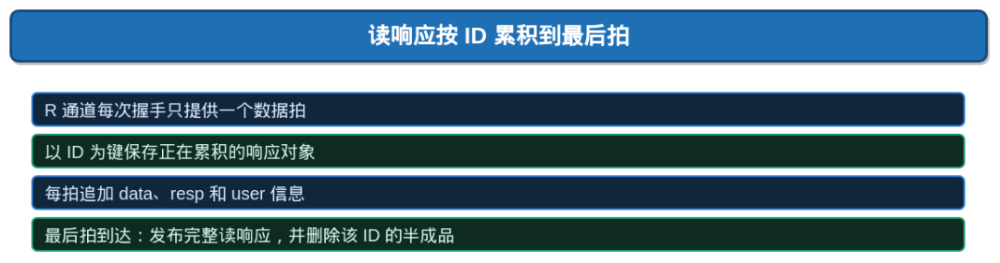

图 4：多个读响应拍可交错出现；每个 ID 各自累积，看到最后拍才发布完整响应。

读响应的难点与写数据类似。单个响应拍只包含这一拍的数据和状态，完整读结果可能跨多拍；如果多个 ID 的读请求同时在飞，响应拍还可能按 ID 交错。monitor 需要以 ID 为键保存正在累积的响应对象，每来一拍就追加数据和响应状态，直到看到该 ID 的最后拍才发布。

这里不能用“上一拍的响应对象”这种简单变量，因为它隐含假设所有响应严格连续。低负载时这个假设常常碰巧成立，一加入多个在飞请求就会把不同 ID 的数据拼在同一笔结果里。按 ID 建表虽然多了一点状态，却直接对应协议允许的并发行为。

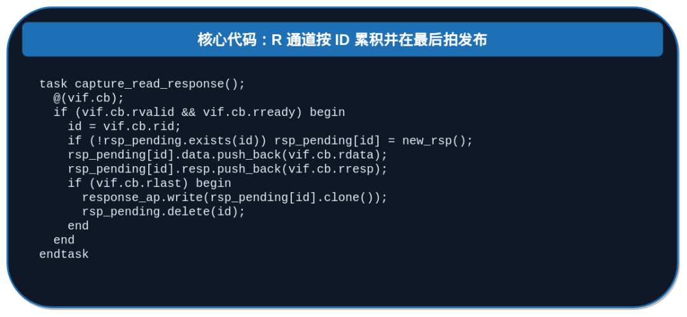

代码图 5：每个 ID 维护独立的累积对象；最后拍出现后才写分析端口并删除表项。

## 1.6 复位不是只清一个信号

真实 monitor 还必须把复位当成一次“半成品交易清场”。复位到来时，地址已到而数据未到的写、已经收了几拍但未收最后拍的读响应，都不应继续留在表里等后续拍；复位后的同一个 ID 是一段新的协议历史，不能和复位前的对象拼在一起。

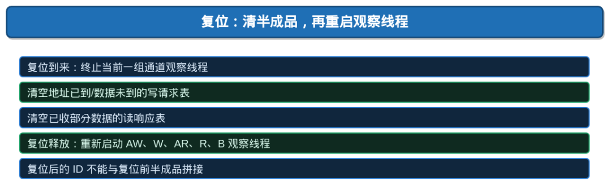

图 5：复位到来时杀掉当前观察轮次、清掉半成品表；复位释放后重新启动各通道观察线程。

这也是为什么成熟 monitor 会让各通道观察线程在一个可终止的并发组中运行。复位触发时，终止当前组、清空未完成状态；复位释放后重新创建新的观察组。只清表而不终止线程，旧线程可能继续等待复位前的条件；只终止线程而不清表，复位后的拍会被错误拼到旧事务里。

## 1.7 不要只看有效信号

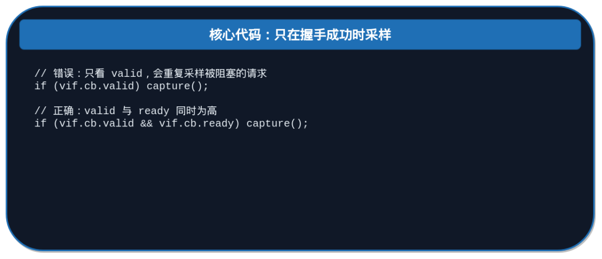

代码图 2：只看有效会把被阻塞的请求重复采样；必须同时看有效和就绪。

假设发送方从第 10 拍开始拉高有效，但接收方到第 13 拍才拉高就绪。正确 monitor 只在第 13 拍产生一笔事务；错误 monitor 会在第 10、11、12、13 拍各产生一笔。这样的错误在低负载下可能完全看不到，因为就绪常常一直为高；一旦加入背压，记分板就会突然出现“多出来的事务”。

## 1.8 不驱动接口

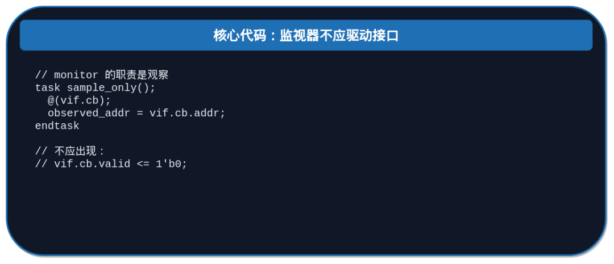

代码图 3：监视器只读取接口，不能改变被测信号。

监视器若写接口，会把自身观察到的行为和自己制造的行为混在一起。即使只是为了“清掉一个信号”而写了一次，也可能掩盖设计本来应该暴露的握手问题。需要产生或修改总线行为的职责属于其他类型的组件；被动 monitor 的可信度恰恰来自它从不干预。

## 1.9 读懂输出

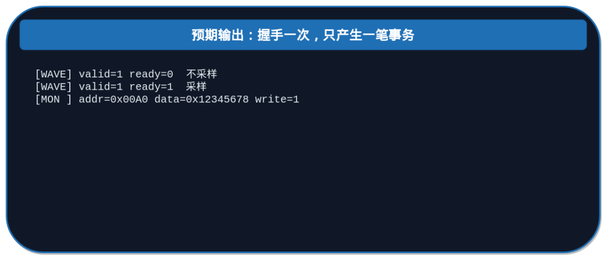

输出图 1：被阻塞的周期不采样，握手成功时只生成一笔事务。

正常输出里应当能看到：有效为高、就绪为低的周期没有事务日志；有效和就绪同为高的那个周期只出现一次事务。若日志里同一地址和数据连续出现多次，先将它们对应到波形中的握手周期，再判断是 monitor 重复采样，还是设计真的重复发起了事务。

对多拍事务，还要看“完整事务”日志出现的时机。写地址握手时可以有地址通道日志，写数据每拍也可以有拍级日志，但对外发布的完整写事务应当只在最后一拍数据到达且地址已经存在时出现。读响应同理：中间拍可以记录，完整响应只应在最后拍出现。若完整日志早于最后拍，说明 monitor 发布了半成品；若最后拍已出现却没有完整日志，通常是 ID 组装表或完成条件有问题。

## 1.10 真实调试：数量不对还是字段不对

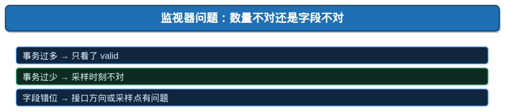

图 4：事务过多先查握手条件；事务过少查采样时刻；字段错位查接口与时序。

字段错误和数量错误应分开处理。数量不对通常是协议条件判断错；数量正确但地址或数据错，往往是采样点、接口方向或字段拼接错。混在一起查会让问题显得比实际复杂得多。

多拍和乱序场景下再增加一个判断：错误是发生在“拍级观察”还是“事务级组装”。拍级日志本身就错，优先查时钟块、接口方向和握手条件；每拍日志正确、完整事务错误，优先查 ID 查找、队列选择、最后拍判断和复位清场。把这两层分开，能避免从最末端的 scoreboard 报错一路猜回接口。

## 1.11 小结

监视器是波形到事务的翻译器。它必须长期运行、只观察、不驱动；只有握手成功时创建事务。最常见的错误是只看有效信号，导致同一笔被阻塞的请求被重复采样。

真实 AXI monitor 还要再多走一步：地址、数据和响应各自按拍观察，完整读写按 ID 组装，最后拍到达时才发布，复位时清掉所有半成品并重新开始。理解这层“拍级事实 → 事务级事实”的转换，才真正能读懂复杂 UVC monitor 为什么需要并行线程、未完成队列和分析端口。

## 1.12 面试问答

问题 1：为什么 monitor 通常只在 `valid && ready` 时创建一笔 transaction？

回答：`valid` 只说明发送方准备好了，`ready` 才说明接收方在这一拍真正接收。两者同时为高才是协议定义的一次完成传输。只看 `valid` 时，背压期间同一笔请求会被重复采样，导致下游出现多余事务。

## 1.13 问题 2：monitor 可以为了修正信号临时驱动接口吗？

回答：不应该。monitor 的可信度来自它只观察事实；一旦驱动接口，就会把自己制造的行为和设计行为混在一起，甚至掩盖原本的协议错误。采样、驱动和检查应由不同职责的组件承担。

---

# 2. UVM 基础第一天：谁只是数据，谁会活在层级里

> 来源：https://mp.weixin.qq.com/s/895Lh2rKU6qXSWH-rixlIw
> 作者：周漾
> update 2026/08/22 10 : 49

UVM 环境里最容易混淆的两个词是 object 和 component。名字都像对象，写法也都像类，但职责完全不同：一个装数据，另一个构成长期存在的验证结构。把这条边界弄清楚，后面监视器、记分板和环境的关系就不会乱。

本系列用一个简单总线的被动监视环境贯穿全文。今天先定义一次读写事务，并建立最小组件层级；后面会让监视器采样它、广播它、预测它、比对它，最后拼成自动检查闭环。

先建立一个总的画面：验证环境不是一个单独的程序，而是一棵长期存在的组件树，树上的节点各司其职；树中间不断流动的是短命的数据对象。一笔事务从接口上被观察到，变成对象，经过若干组件处理，最后要么被判为匹配，要么带着清晰的上下文报出错误。今天的两个基类正好对应这两层：`uvm_object` 描述流动的数据，`uvm_component` 描述处理数据的长期节点。

如果一开始不分这两层，环境通常会走向两个极端。把所有逻辑塞进一个巨大的类，会让采样、预测、比较和日志彼此纠缠；反过来，如果把每一笔事务也做成长期组件，层级会被大量临时节点污染，日志里满是没有意义的对象名。UVM 的基本结构不是为了增加类的数量，而是为了让这两种生命周期各自待在合适的位置。

## 2.1 对象与组件：一个装数据，一个活在层级里

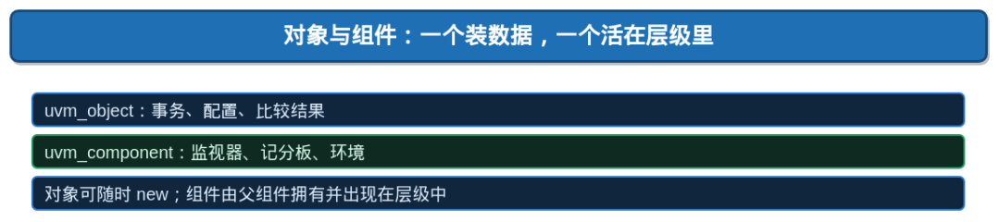

图 1：事务和配置属于 object；监视器、记分板、环境属于 component。

`uvm_object` 适合描述一笔可复制、可比较、可打印的数据。它没有父组件，也不会出现在测试层级中。`uvm_component` 则代表环境里的长期成员：有名字、有父组件、有层级路径，适合持有端口和子组件。

这不是命名习惯，而是生命周期的差异。一笔读写事务只在产生、传递、比较的短时间内有意义；下一笔事务到来之后，它通常就可以被丢弃。监视器和记分板却从开始观察到结束检查都要存在，因此它们需要稳定的名字和归属关系。把 monitor 写成 object，表面上也能编译，但它没有组件层级，也失去了组织长期资源的地方。

一个简单的判断方法是问自己：这个类代表“发生了什么”，还是代表“谁在长期做事”。前者通常是 object，例如事务、配置项、参考模型的结果；后者通常是 component，例如 monitor、scoreboard、environment。这个判断比死记基类名更可靠。

还可以从“是否需要父组件”来判断。事务 `bus_item` 即使独立存在也有完整意义：它本身就能说明地址、数据和方向。一个 monitor 脱离环境却没有完整意义，因为它不知道观察哪路接口、向谁发布结果、属于哪套验证结构。需要靠归属关系才能说明自己职责的类，就应当是 component。

名称在这两类对象里也承担不同角色。事务名主要服务于调试，例如区分同一时刻创建的 `req_17` 与 `rsp_17`；组件名则会一路拼成完整层级路径，例如 `uvm_test_top.env.mon`。前者帮助定位一笔数据，后者帮助定位一段长期逻辑。看到日志时先辨认这是对象名还是组件路径，能少走很多弯路。

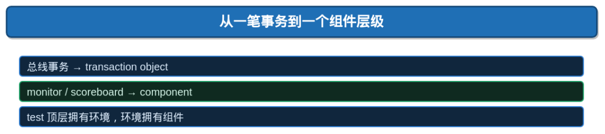

图 2：事务在组件之间流动；组件由父组件拥有，形成树。

这张图还说明了一个后面会反复遇到的原则：组件之间传的是对象，不是零散字段。若 monitor 直接把 `addr`、`data`、`is_write` 三个变量分别交给下游，任何一处遗漏或错拍都会让接收方拿到一组拼不起来的数据。把这些字段封装成 `bus_item`，下游收到的就是一次完整操作的快照。之后无论增加错误标记、响应状态还是时间戳，只需扩展对象字段，数据流的接口不需要整体改写。

## 2.2 定义一笔总线事务

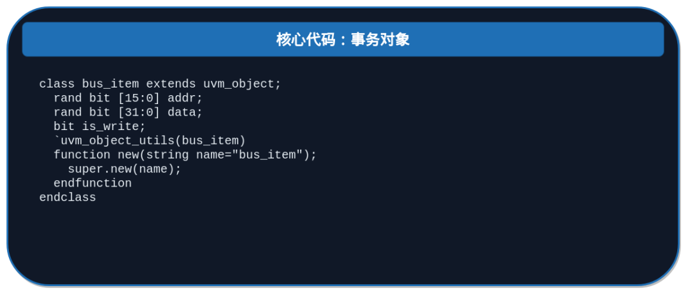

代码图 1：事务对象保存地址、数据和读写方向，随时可以创建多个实例。

对象只描述数据，不该承担长期运行、采样接口或保存环境层级这些职责。后面所有数据流动都围绕这笔 `bus_item` 展开。

代码里的注册宏只是让这个类型具备 UVM 常用的创建和工具支持；它不改变这笔事务本身的含义。真正要看的是字段：地址、数据、读写方向共同描述了一次观察到的操作。对象字段应当尽量是“这笔操作本身固有的事实”，不要把组件状态、接口句柄或统计计数混进来，否则复制和比较时很难定义到底哪些内容应该相同。

可以把事务对象理解成一张已经拍好的照片。照片里应有当时真正发生的内容：地址是多少、数据是多少、这是读还是写。照片不应带上“是哪个 monitor 拍的”“当前已经统计了多少笔”这类环境状态；那些信息属于组件本身。把快照和环境状态分开，事务才可以被日志、覆盖率、预测器和记分板安全地共享。

构造函数里的 `super.new(name)` 也有明确作用：它把这个对象的名字交给 UVM 的基础设施。即使名字不参与协议或比较，后续打印对象、报告错误、查看层级相关日志时都会使用它。给临时对象取稳定、可读的名字，不会让功能变对，却能让一条失败日志从“某个对象不匹配”变成“哪一笔对象不匹配”。

构造函数的默认名称也不是随意的。调试日志中会出现对象名，给临时对象一个稳定、可读的名字，能让同一时刻多笔事务的来源更容易分辨。名称不参与功能，但会直接影响日志是否能读。

## 2.3 组件为什么需要父组件

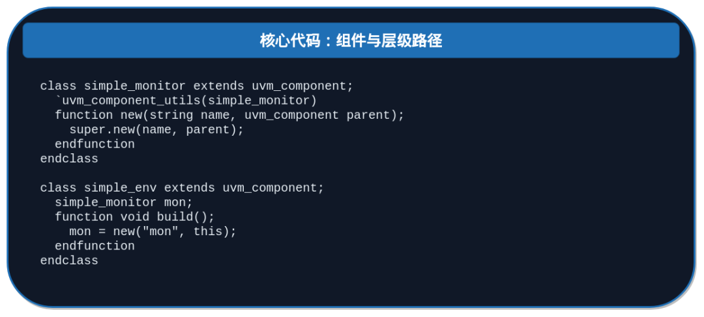

代码图 2：环境拥有监视器，监视器的层级路径因此是测试顶层的一部分。

父组件决定组件归属。组件创建时没有传入正确的父组件，往往不会出现在预期的层级里，后续的端口连接和报告路径也会跟着难查。

层级的价值在于把“谁拥有谁”变成可观察的信息。环境拥有 monitor，说明 monitor 是这套环境的一部分；环境销毁或重建时，它的成员也应一并管理。反过来，一个没有父组件的 monitor 看似存在，却像漂在环境之外，日志里缺少上下文，出问题时很难判断它属于哪一套配置或哪一个接口。

这一层级树也让同类组件可以安全地重复出现。一个环境可以有多个 monitor，只要它们的父组件相同、名字不同，层级路径就能明确区分。这样的区分后面会成为定位“是哪一路总线采错了”的基础。

组件树还有一个实践价值：它给阅读代码的人一个固定入口。拿到一个陌生环境时，先看顶层环境拥有谁，再看每个子组件负责什么，比从一堆独立类里反推关系可靠得多。本文的 `simple_env` 只有一个 monitor，是最小示例；实际环境中可以有多个 monitor、多个记分板或多个子环境，但“父组件拥有子组件”的结构不变。

创建组件时，名字和 parent 两个参数都不能省略其语义。名字用于区分同级兄弟，parent 用于确定归属。把两个 monitor 都叫 `mon`，日志难以区分；把 parent 传错，层级树会从错误的位置长出来。功能可能暂时还能跑，但调试、连接和统计都会失去上下文，因此应在最早创建时就把这两个信息写清楚。

## 2.4 复制对象，不要只复制句柄

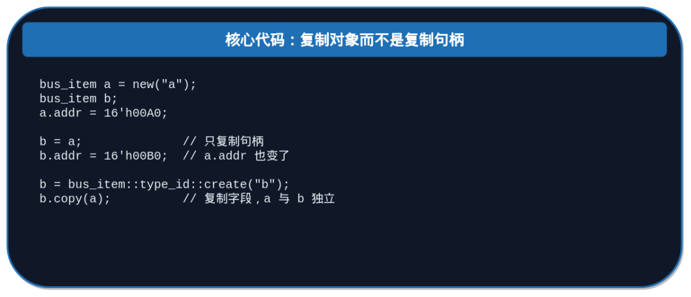

代码图 3：句柄赋值让两个变量指向同一对象；`copy()` 才是字段复制。

这和 SystemVerilog 类的规则一致。监视器后续会不断复用临时对象，如果把同一个句柄交给其他组件，下一笔采样会把前一笔数据改掉。广播前创建独立副本，是后面数据流正确的基础。

这里要分清两种“复制”。`b = a` 只是让 `b` 指向 `a` 指向的那一块对象；此后两个句柄没有边界。`copy()` 的意图是把字段值复制进另一个已经独立存在的对象。对于只有整型字段的事务，这个差别已经很重要；事务以后若增加队列、动态数组或子对象，复制策略还要继续明确，不能假设一句句柄赋值会自动产生副本。

在 UVM 环境里，这个问题会被分析端口放大。monitor 采完一笔事务后，可能同时把它交给日志、覆盖率和记分板。如果它们保存的是同一个句柄，而 monitor 又在下一拍复用了这个对象，那么三个消费者看到的“历史事务”会被一起改写。错误不会发生在赋值那一刻，而是发生在稍后某个消费者才使用对象时，因此日志经常看起来前后矛盾。

`copy()` 解决的是字段复制，不等于自动解决所有嵌套对象问题。事务只包含标量字段时，它足够直观；将来若对象中有队列、动态数组或另一个对象句柄，就需要明确那些成员是否也要建立独立副本。这个判断原则始终一样：下游是否应该看到一张不可再改变的快照。答案是肯定的，就不能共享可变的内部数据。

这类错误的典型现象不是立即报错，而是日志前后矛盾：日志组件先打印了一笔地址 `0x00A0` 的事务，记分板稍后看到同一个对象却变成了 `0x00B0`。当同一个对象被多个消费者异步保存时，现象会更随机，因此越早在边界处复制越容易定位。

## 2.5 读懂输出

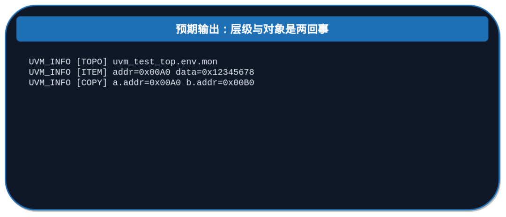

输出图 1：层级路径说明组件已正确归属；复制后的两笔对象地址不同。

看第一类输出时，重点看完整路径是否符合预期。若 monitor 出现在测试顶层下，说明 parent 关系建立正确；若路径缺少环境节点，或者同名 monitor 出现多次而无法区分，应先回到组件创建处。看第二类输出时，重点看复制后的字段是否独立：修改副本之后，原对象的地址和数据应保持原样。两个对象名字不同但字段仍同时变化，说明底层共享问题没有真正解决。

## 2.6 真实调试：空句柄、共享句柄、丢失层级


图 4：先确认对象是否创建，再确认是不是共享同一句柄，最后看组件是否挂在正确父组件下。

如果看到空句柄错误，第一件事不是给调用处加判空，而是找对象本该在哪个时刻创建。判空只能避免崩溃，不能建立缺失的数据。若看到多个订阅者记录到的字段彼此串台，优先打印对象句柄或对象名，确认它们是不是同一个实例。若组件层级不符合预期，再回到创建语句检查 parent 参数，而不是从数据比较逻辑里盲目找原因。

一个实用的排查顺序是：先确认“有没有对象”，再确认“是不是同一个对象”，最后确认“它属于哪个组件”。这三个问题分别对应空句柄、共享句柄和层级归属，现象容易混在一起，但根因层次不同。先把对象关系理清，再看具体字段，通常能把一大类 UVM 初学错误快速缩小。

## 2.7 小结

`uvm_object` 是可流动的数据，`uvm_component` 是长期存在的环境节点。对象要用独立副本在组件间传递；组件要带正确父组件形成清楚层级。后面的四篇都建立在这条边界之上。

把今天的内容压缩成一句话：事务对象回答“发生了什么”，组件回答“谁在处理它”。这条边界稳定之后，分析端口才有可以安全广播的数据，monitor 才有清楚的长期位置，scoreboard 才能拿到独立而可信的快照。

## 2.8 面试问答

问题 1：`uvm_object` 和 `uvm_component` 的核心区别是什么，为什么 transaction 通常继承前者？

回答：核心区别是生命周期与层级。`uvm_object` 表示短生命周期的可复制数据，没有父组件，不需要长期出现在环境树里；transaction 只是某一次操作的快照，适合继承它。`uvm_component` 表示长期工作的环境节点，有名字、父组件和层级路径，适合 monitor、scoreboard、env 这类需要持有端口或子组件的结构。

## 2.9 问题 2：为什么 `b = a` 之后改 `b` 会影响 `a`？在 UVM 数据流里怎么避免？

回答：这是句柄赋值，只复制了对象地址，`a` 与 `b` 指向同一个对象。避免方式是先创建独立对象，再调用 `copy()` 复制字段；在 monitor 向多个下游发布事务前尤其要这样做，否则下一拍复用对象时会悄悄改掉已经发布的数据。

---

# 3. UVM 基础第二天：一笔事务怎么同时送给多个地方

> 来源：https://mp.weixin.qq.com/s/GdnPKQR6cDeXUoFtHbvpgg
> 作者：周漾
> update 2026/08/22 10 : 50

监视器从波形还原出一笔事务之后，通常不只一个人需要它：记分板要比较，覆盖率要采样，日志要记录。让监视器挨个调用三个组件，会把它和消费者绑死，也会让后续扩展变得困难。

分析端口解决的就是这件事。监视器只负责发布，消费者各自订阅，一笔事务可以同时广播给多个地方。

这里的“广播”不是排队，也不是请求—响应关系。发布端调用一次 `write` 后，不会等某个消费者处理结束，也不会从消费者那里拿回结果。它适合传递已经观察到的事实：某一拍确实发生了一笔读写，所有关心这件事的人都应该看到同样的副本。

这条边界很重要。monitor 不应该因为记分板暂时忙就停止采样，否则观察结果会被下游性能影响；scoreboard 也不应该要求 monitor 了解比较策略。分析端口把这两个职责切开，后面增加覆盖率或日志订阅者时不需要修改 monitor。

## 3.1 分析端口：发布者不关心谁在收

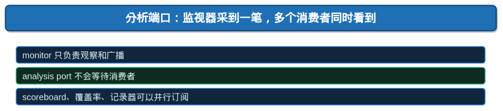

图 1：监视器发布一笔事务，记分板、覆盖率和日志组件各自接收。

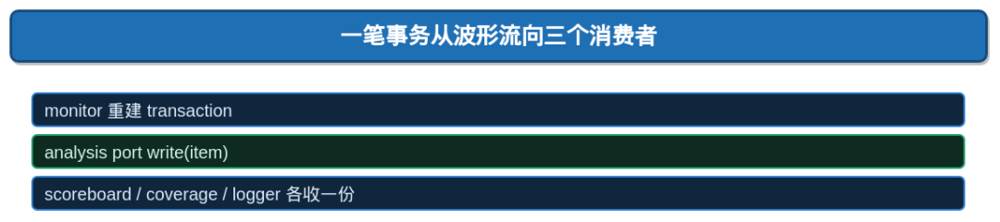

图 2：发布端只调用 `write`；消费者的数量不影响监视器代码。

真正的环境中，消费者可能不止三个。一个订阅者统计覆盖率，一个订阅者写调试日志，一个订阅者生成期望，一个订阅者检查实际数据。它们看到的是同一笔事务，但各自只做自己的事。把这一层设计成一对多，环境从一开始就具备扩展性，不会在增加一个检查功能时牵动所有旧代码。

## 3.2 声明发布端

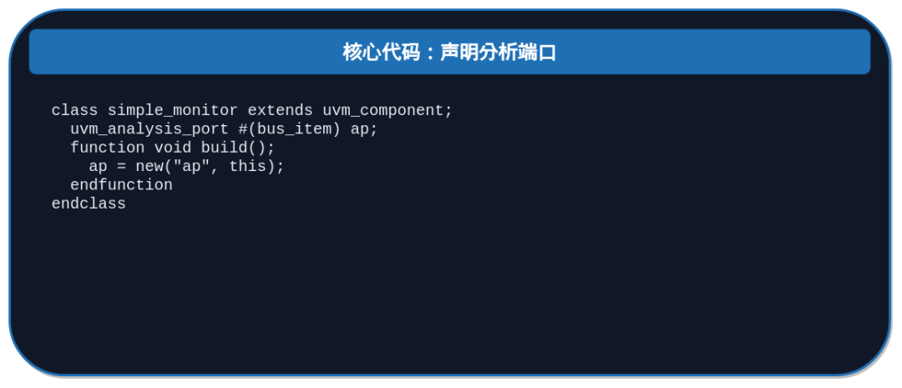

代码图 1：监视器拥有一个类型化的分析端口。

端口上的类型参数不是装饰。`uvm_analysis_port #(bus_item)` 明确规定这条通道只传 `bus_item`；消费者若期望别的对象类型，问题应该在连接时暴露，而不是在运行到某个字段访问时才出现。数据类型越早固定，后续的复制、比较和日志格式越容易统一。

## 3.3 广播前必须复制

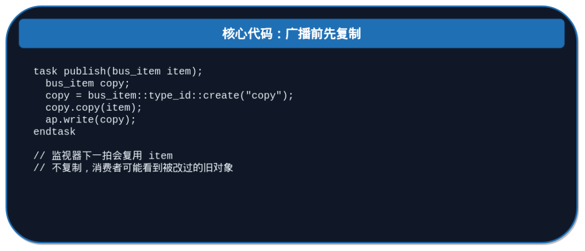

代码图 2：监视器下一拍会复用临时对象，因此发出前先创建副本。

复制的时机放在发布边界最合适。monitor 内部可以为了效率复用采样对象，但一旦调用 `ap.write`，它就把这笔数据交给了未知数量的外部消费者。之后任何对临时对象的改写都不应该影响已经发布的数据。把副本创建放在消费者侧也能勉强工作，但每个消费者都要记住这个约束，维护成本更高。

## 3.4 订阅端只实现 `write`

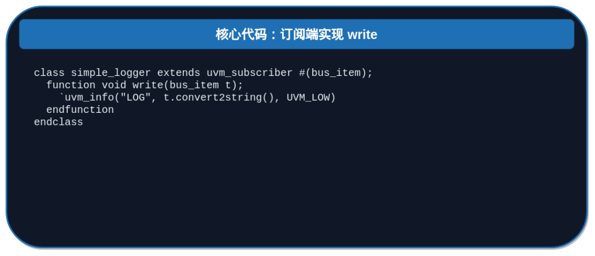

代码图 3：日志组件只定义收到事务之后该做什么。

订阅者的 `write` 应该短小、确定，不依赖 monitor 的内部状态。日志组件可以立刻格式化输出；覆盖率组件可以立刻采样；记分板组件可以把事务放进自己的待比较表。若一个订阅者需要耗时处理，它应当在自身内部把数据保存下来再异步处理，不能反过来让发布端承担等待责任。

## 3.5 读懂输出

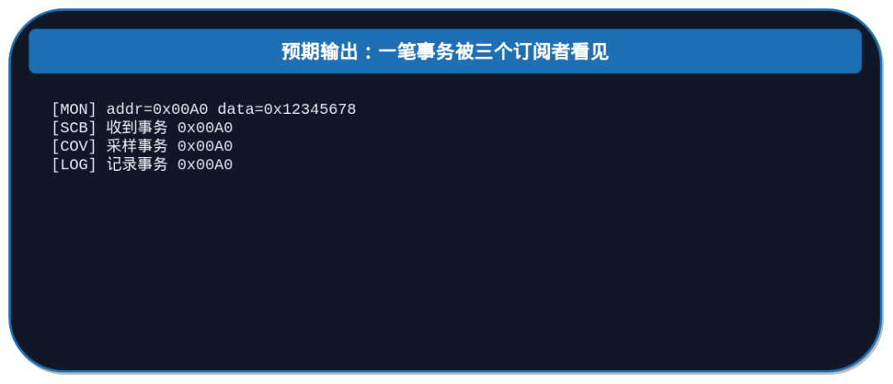

输出图 1：同一笔事务被监视器、记分板、覆盖率和日志组件分别看见。

读日志时，重点不是每一行的文字是否相同，而是它们是否指向同一个地址、数据和操作类型。若 monitor 的日志是 `0x00A0`，而 scoreboard 收到的是 `0x00B0`，优先怀疑对象复用或复制不完整；若 monitor 有输出而所有订阅者都没有输出，优先怀疑连接缺失；若只有一个订阅者没有输出，问题通常在该订阅者自身的实现。

## 3.6 真实调试：没有订阅、没有发布、对象被复用


图 4：先沿数据流确认发布、连接、接收，再检查对象是否在广播后被改写。

调试时可以把分析端口当成一条水管：先确认源头有没有水，再确认管子有没有接上，最后确认每个出口是否真的在取水。不要先去改消费者的功能逻辑，因为大部分“记分板没看到数据”的问题都发生在更早的发布或连接边界。

## 3.7 小结

分析端口把观察者和消费者解耦。监视器只采样和发布；消费者只处理收到的数据。最容易踩的坑是把监视器会复用的同一个对象直接广播出去，后续采样会悄悄改掉前一笔。

## 3.8 面试问答

问题 1：为什么 monitor 不应该直接调用 scoreboard 的方法，而应该通过 analysis port 发布事务？

回答：直接调用会让 monitor 知道 scoreboard 的存在和接口，新增覆盖率、日志等消费者时还要不断修改 monitor。analysis port 把发布者和消费者解耦：monitor 只发布观察事实，多个订阅者各自处理，组件职责更清楚，也更容易复用。

## 3.9 问题 2：analysis port 广播前为什么建议复制 transaction？

回答：monitor 常会复用临时 transaction 继续采样。若直接把同一句柄广播出去，订阅者保存的是可变对象，下一笔采样可能改掉上一笔内容。发布边界创建独立副本，能保证每个订阅者看到的是当时的稳定快照。

---

# 4. UVM 基础第四天：怎样判断结果对不对

> 来源：https://mp.weixin.qq.com/s/7hIZL3Pi2ggJFq4l6B_OUQ
> 作者：周漾
> update 2026/08/22 10 : 51

监视器能拿到实际发生的事务，但“看到了什么”不等于“知道它对不对”。判断正确性需要两路数据：一条路根据输入算出期望，另一条路从被测接口观察实际结果。预测器负责前者，记分板负责让两者汇合并比较。

预测与比对分开，是为了让错误定位更清楚：期望错了查模型，实际错了查设计或监视器，配对错了查键。

这三个来源不能混在一起。若 monitor 采错了数据，scoreboard 看到的是“实际不匹配”；若 predictor 的模型少了一个状态更新，scoreboard 看到的同样是“不匹配”；若两边数据其实都对、只是拿错了对象比较，结果还是“不匹配”。把预测、采样和比较拆开，才能沿着数据流逐段定位，不让一个泛化的错误消息掩盖真正原因。

## 4.1 两路数据在记分板汇合

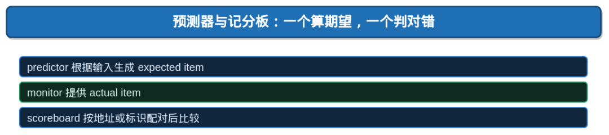

图 1：输入事务经过预测器形成期望；输出事务由监视器形成实际；记分板配对比较。

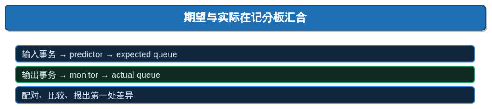

图 2：地址或标识是配对键，选错键会让本来正确的数据被错误配对。

配对键不是固定答案。简单、严格保序的总线可以按队列先入先出比较；读写可能乱序、地址会重复的协议则需要标识或一组联合字段。本文用地址建立最小模型，是为了把“期望与实际汇合”的结构讲清楚；真实环境里要先根据协议保证选择键，再写比较逻辑。若一个地址可被连续多次访问，单个地址就不再足够，必须把请求顺序或标识加入键。

## 4.2 生成期望结果

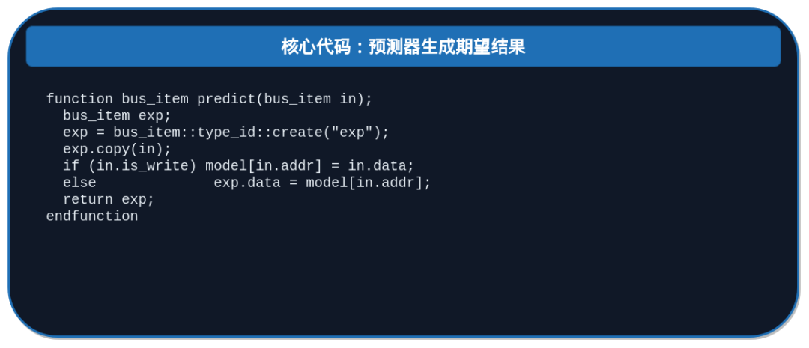

代码图 1：预测器维护一个参考模型，写更新模型，读从模型取期望数据。

参考模型不需要模仿被测设计的内部实现。它的职责是根据输入推导外部可见的期望行为，因此通常应比被测设计更直接、更容易审查。对于这个简单总线，模型就是一张按地址存数据的表；写操作更新表，读操作从表取值。模型越接近规格、越远离实现细节，越不容易和设计一起犯同一种错。

参考模型还需要明确“状态在什么时候更新”。以一笔写为例，地址和数据在接口上真正握手成功之前，模型不应提前把数据写进表；否则设计因背压而尚未接受写，随后一笔读却会从模型拿到未来数据，记分板会把设计正确的旧数据误报为错误。反过来，写一旦完成握手，模型应立即更新，因为从外部可见的角度，这笔写已经发生。

这种“只根据已确认事实更新模型”的原则适用于所有 predictor。预测器不应该猜测下一拍一定会发生什么，也不应该把测试原本计划发出的事务当作已经完成。它只消费 monitor 已经确认的事务，再生成与这些事实一致的期望结果。

## 4.3 配对键：地址只是最小示例

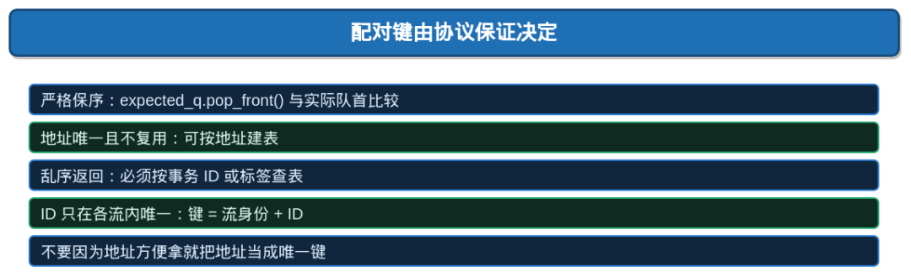

图 3：严格保序可按队列配对；地址复用或乱序返回时，必须使用 ID、标签或联合键。

按地址建表适合最小示例，因为一笔写后读同一地址的预期容易看懂。但它隐含两个前提：同一地址在实际结果回来前不会再次被访问，并且没有两笔相同地址的请求并行存在。真实环境往往不满足这两个前提。

例如，地址 `0x00A0` 的第一次读还在飞，第二次对同一地址的读已经发出。若 expected 表只有一个以地址为键的条目，第二次期望会覆盖第一次；第一次实际先回来时就会与第二次期望比较，得到一条看似“数据错”的错误。数据、模型和 monitor 可能都正确，真正错的是配对关系。

解决方法不是给 compare 加特殊补丁，而是换一个协议保证的键。严格保序的接口用队列最可靠；完成带回唯一 ID 的接口用 ID 建关联数组；若 ID 只在各流内唯一，则键应由流身份和 ID 共同组成。先定义“同一笔”的协议含义，再选择数据结构，这是 scoreboard 最重要的设计决策。

## 4.4 expected 表也有自己的生命周期

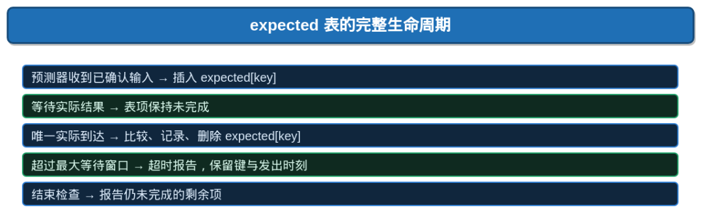

图 4：期望创建、等待实际、比较删除、超时报告四个状态必须完整闭合。

一条 expected 不是一条永久记录。它在 predictor 生成时插入表，在实际到来并匹配成功时删除；若长期没有实际结果，必须按超时或结束检查报告。漏掉任意一个状态都会造成误判：忘记插入会变成“没有对应期望”，忘记删除会被后续实际重复匹配，忘记超时则会让真正缺失的结果一直躺在表里不被发现。

在真实环境里，超时不应只靠“测试结束时表是否为空”。测试可能运行很长，某条请求在早期就已经永远丢失，等到结束才报会丢掉最有价值的时间上下文。更实用的做法是给每条 expected 记录发出时刻或时钟计数，在超过协议允许的最大等待窗口时单独报告，并保留 ID、地址、期望值和发出时间。

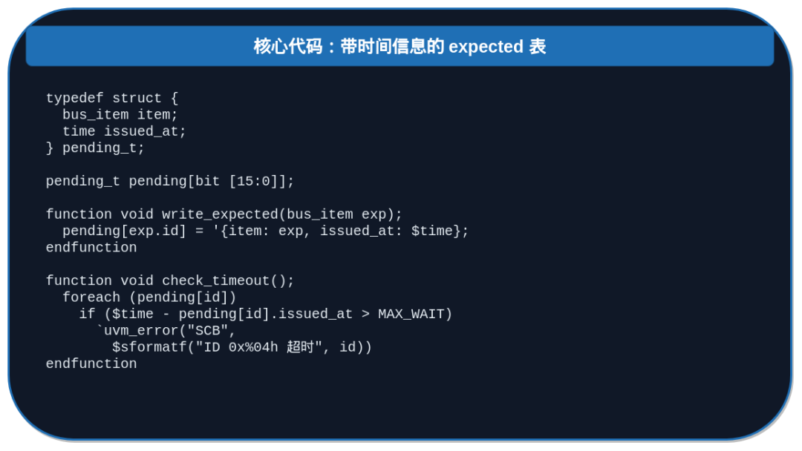

代码图 4：插入期望时记录时刻；超出等待窗口后单独报告，不把它混成普通数据不一致。

## 4.5 比较前先排除错配

收到实际结果时，直接比较字段看似简单，但实际调试里应先回答三个问题：这条实际有没有对应期望，键是否唯一，期望是否仍在有效期内。只有三者都确认之后，字段不一致才值得被当成模型或设计错误。

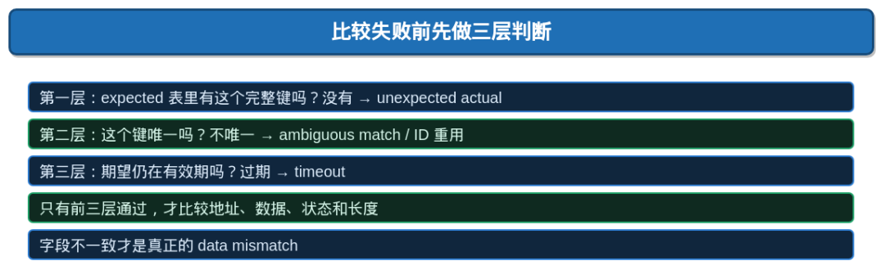

图 5：先确认配对存在与唯一，再比较字段；不同层次的失败要给不同报告。

若表里没有这个键，应报告“unexpected actual”，而不是 compare fail；它通常指向 monitor 漏采输入、ID 提前释放或接口出现了未预期结果。若同一个键对应多条期望，应报告“ambiguous match”，说明请求管理已经违反协议或数据结构选择不够。若键唯一且期望有效，才比较地址、数据、状态和长度等字段；这一层失败才是真正的 data mismatch。

把这三种错误分开，日志会立刻更有用。一个笼统的 `compare failed` 只说明最后一行返回了假，而分层报告能直接告诉调试者应该先去看 monitor、请求发起侧、配对表，还是被测设计的数据路径。

## 4.6 收到实际结果后比较

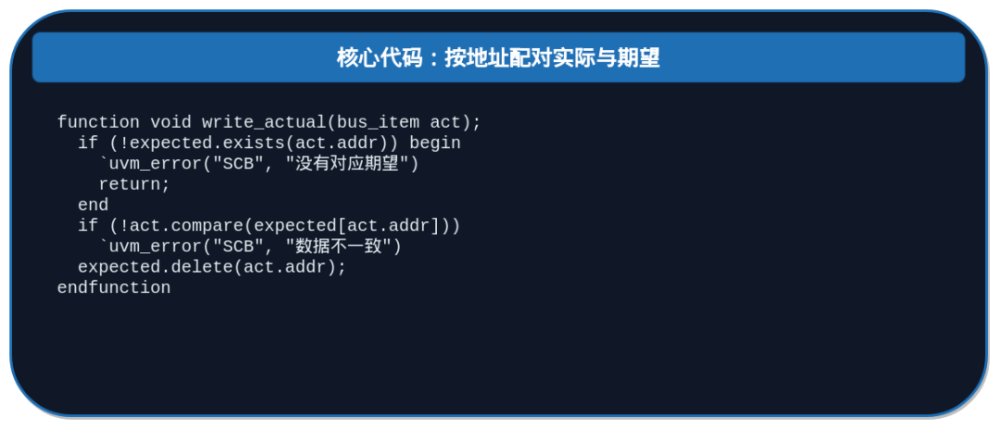

代码图 2：找不到期望、数据不一致、正常匹配三种情况分别处理。

“没有对应期望”与“数据不一致”需要分开报告。前者说明实际结果提前到达、预测路径漏了输入，或者配对键不对；后者说明两边确实对同一笔事务给出了不同数据。把两种情况都写成笼统的 compare fail，会让调试者先花时间确认是不是配对错了。

比较完成后删掉期望项也同样重要。否则同一个期望会被后续无关事务再次匹配，或者在结束检查时被误报为遗留项。记分板不是只会增长的日志，它需要维护清楚的“尚未完成”状态。

同样不要在比较失败后立即把所有上下文都删掉。比较器至少应保留失败时的期望对象、实际对象和键，用于错误报告；若环境支持继续收集多个错误，也要确保删除的是已经完成的匹配关系，而不是提前删除导致后续完成变成“没有对应期望”。这里的原则是：状态删除发生在“这笔配对已经被完整处理”之后，而不是发生在“刚看到某个对象”时。

## 4.7 结束时检查遗留项

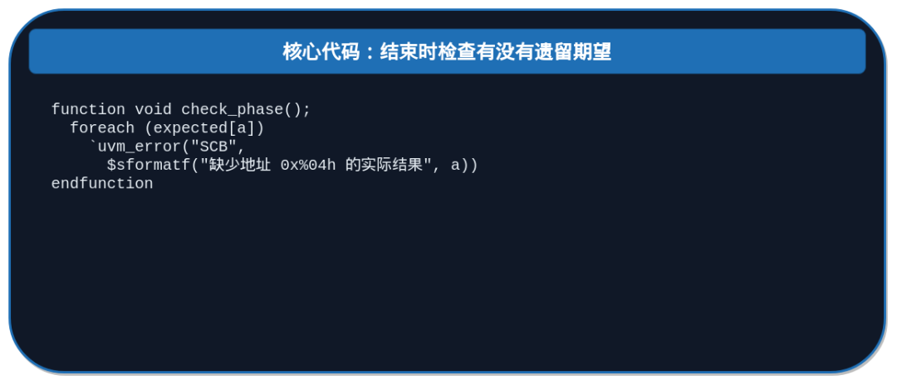

代码图 3：仍在期望表里的条目说明实际结果从未到达。

结束检查补的是数据流的另一半。很多环境只在实际数据到来时做比较，于是“多来了”能发现，“少来了”却被静默吞掉。仍留在表里的期望代表 monitor 从未看见对应结果、设计没有产生结果，或者结果走到了错误路径。无论哪一种，都应在最终报告里明确出现。

## 4.8 读懂输出

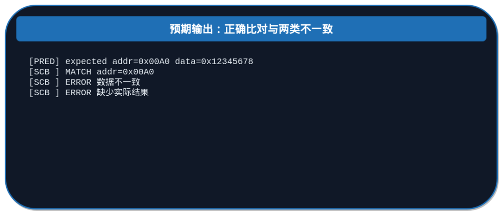

输出图 1：正确比对、数据不一致、缺少实际结果三种日志形态。

阅读这类日志时，先看地址或标识，再看期望和实际值，最后看是哪种错误类别。若同一地址连续报错，不能立刻认定数据模型错了；先确认该地址是否被多次访问，是否发生了旧期望和新实际的交叉配对。真实系统里的大量“scoreboard 错”最终都落在这个边界问题上。

一条有价值的 mismatch 日志至少应包含完整键、期望值、实际值、事务类型以及期望产生的时间。只有地址和数据的日志在简单例子里够用；一旦存在并行请求，缺少 ID 或时间信息会让同一个地址上的多笔操作无法区分。日志不是事后装饰，它是 scoreboard 给调试者提供的第一份证据。

## 4.9 真实调试：缺期望、缺实际、还是配错

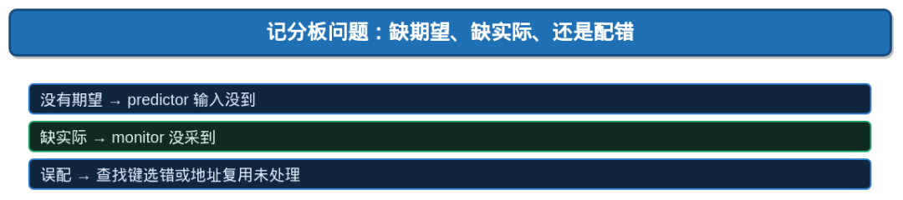

图 4：沿着期望与实际两条支路回溯，先确认数据到没到，再确认配对键。

调试顺序建议固定：先确认 predictor 是否收到输入并产生期望，再确认 monitor 是否观察到实际，最后确认二者是否使用同一把键汇合。直接从 compare 语句往回猜，容易在错误支路上停太久。

如果环境允许乱序，再把“键唯一性”和“ID 生命周期”放到字段比较之前。大量 mismatch 同时出现时，通常不是很多笔数据同时坏了，而是一笔早期错配把后续队列或表项全部带偏。先从第一条错误开始，看它的 expected 与 actual 是否真属于同一请求；这一步成立之后，后面的错误往往会大幅减少。

## 4.10 小结

预测器算期望，记分板判实际。两者分开能把问题定位在模型、监视器或被测设计。最容易踩的坑不是比较算法，而是配对键：地址复用或事务乱序时，简单按地址配对会产生误报。

一个成熟的 scoreboard 至少要完整管理四件事：期望何时创建、实际如何唯一配对、匹配后何时释放、长期未完成如何报告。compare 只是这条生命周期的最后一步；生命周期和键设计正确，比较代码往往反而很短。

## 4.11 面试问答

问题 1：predictor 和 scoreboard 为什么要分开，而不让 scoreboard 自己计算期望？

回答：分开后职责和错误来源更清楚。predictor 只根据输入和参考模型生成期望，scoreboard 只负责让期望与实际配对并比较。出现不一致时，可以分别检查模型、monitor 实际数据和配对键，不会把三个问题混成一个 compare fail。

## 4.12 问题 2：为什么测试结束时还要检查遗留的 expected transaction？

回答：只在实际到来时比较只能发现“多来”或“内容错”，却可能漏掉“本该来的结果根本没来”。遗留期望说明实际结果缺失、被 monitor 漏采、或走错路径，应按超时或缺失结果单独报告。

---

# 5. 骨架 — 从 APB Monitor 看懂 UVC 架构

> 来源：https://mp.weixin.qq.com/s/h9jzqyk9Hht6eoWCUG7qiQ
> 作者：福尔摩芯
> update 2026/08/22 11 : 29
> **已截图**

> “
>
> 这是 UVM VIP 开发系列的第 1 篇。我们将从零搭建一个 UVM 验证组件的骨架，理解 Cookbook 推荐的标准架构和复用策略，并用一个 APB Monitor VIP 把理论落地。

---

## 5.1 为什么需要 UVC？

做芯片验证的同学大概都有过这种经历：一个 SoC 项目里，APB、AHB、SPI、I2C 各种总线接口一堆，每个子模块的 testbench 都要写 driver、写 monitor、写 sequence。写完这个项目，下个项目换个协议，又得从头来一遍。

这就是 UVC 要解决的问题。

UVC（UVM Verification Component）是 UVM 标准里的叫法，业界更习惯叫 VIP（Verification IP），两个称呼混用，含义相同。核心思想就一个：**把协议验证相关的所有东西——agent、config、sequence——封装成一个独立可交付的单元，写一次，到处用。**

一个 SoC 项目里，APB 的 UVC 写好了，block-level 验证用它，SoC-level 集成也用它。不同项目之间也能复用。

### 5.1.1 UVC 开发的基本原则

UVM Cookbook 总结了几条 UVC 开发的核心原则，后面每篇都会用到：

- **Config Object 模式**：用独立的配置对象管理 agent 配置，不要散落一堆 config\_db
- **Factory 注册**：所有组件注册到 factory，支持运行时替换
- **TLM 松耦合**：组件间通过 TLM port 连接，不直接引用句柄
- **分层复用**：同一个 agent 在不同层级通过配置切换 active/passive

后面实战中会展开，这里先有个印象就行。

### 5.1.2 从简单到复杂：UVC 开发的 7 个层次

UVC 开发从简单到复杂，大致分这么几步：

1. **Monitor（只看不动）**：先搭一个 passive agent，能观测总线就行
2. **Driver（单向驱动）**：加上 driver 和 sequencer，让 VIP 能驱动 DUT
3. **Bidirectional（有来有回）**：处理 DUT 的响应，实现请求-应答
4. **Pipelined（流水线）**：多笔传输重叠执行，提升总线利用率
5. **Slave（换位思考）**：从 master 切换到 slave 角色，被动响应 DUT 请求
6. **Sequence 分层（代码组织）**：把 sequence 按低中高分层，提升复用性
7. **Virtual Sequence（全局协调）**：多个 agent 协作，编排复杂场景

这个系列按这个路径走，每篇一个层次，APB/AHB 实战贯穿。

下面先从 testbench 的整体结构说起。

---

## 5.2 UVM Testbench 标准层次

UVM testbench 的标准结构是一棵组件树：

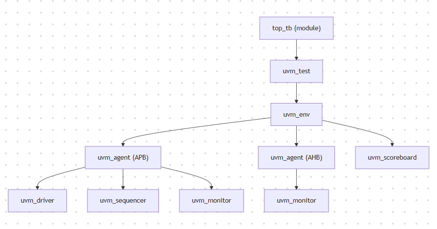

各层职责：

- **uvm\_test**：顶层，负责配置 env（通过 config\_db 传递 virtual interface 和配置对象）并启动 sequence
- **uvm\_env**：容器，组合 agent、scoreboard 等组件，建立 TLM 连接
- **uvm\_agent**：聚焦于特定 pin-level 接口的组件组合，是 UVC 的核心载体

关键原则：test 不关心 agent 内部怎么实现，只通过 config object 控制行为；env 只管组装和连接，不关心协议细节。

---

## 5.3 Agent 架构详解

Agent 是 UVC 的心脏。它围绕一个特定的 pin-level 接口，聚合三个核心组件：

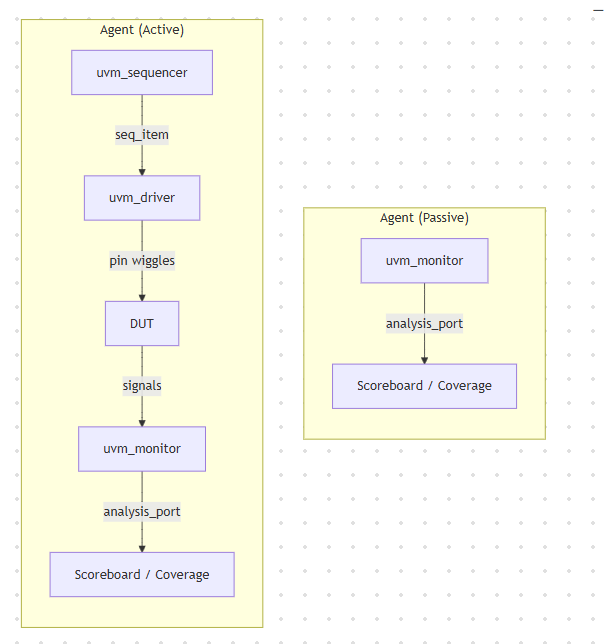

三个组件的职责

| 组件 | 职责 | 类比 |
| --- | --- | --- |
| **Driver** | 从 sequencer 获取 sequence\_item，转换为 pin-level 信号驱动 DUT | "翻译官"：把交易语言翻译成信号语言 |
| **Monitor** | 观测 DUT 信号，重建为 transaction，通过 analysis\_port 广播 | "记录员"：把信号语言翻译回交易语言 |
| **Sequencer** | 在 sequence 和 driver 之间路由和仲裁 sequence\_item | "调度员"：决定哪个 sequence 的交易先发 |

### 5.3.1 Active vs Passive

Agent 有两种工作模式，通过 `uvm_active_passive_enum` 控制：

- **UVM\_ACTIVE**：实例化 driver + sequencer + monitor。用于需要驱动 DUT 的场景（如 block-level 验证）
- **UVM\_PASSIVE**：仅实例化 monitor。用于只观测不驱动的场景（如 SoC-level 验证）

在 `build_phase` 中根据配置条件实例化：

```
class
class
 my_agent
extends
extends
 uvm_agent;
`uvm_component_utils(my_agent)
`uvm_component_utils(my_agent)
  my_agent_config  cfg;
  my_driver        drv;
  my_sequencer     sqr;
  my_monitor       mon;
function
function
void
void
 build_phase(uvm_phase phase);
super
super
.build_phase
.build_phase
(phase);
// 获取 config
// 获取 config
if
if
 (!uvm_config_db
#(my_agent_config)::get(this, "", "cfg", cfg))
#(my_agent_config)::get(this, "", "cfg", cfg))
`uvm_fatal("NOCONFIG", "my_agent_config not set")
`uvm_fatal("NOCONFIG", "my_agent_config not set")
// Monitor 始终创建
// Monitor 始终创建
    mon = my_monitor::type_id::create(
"mon"
"mon"
,
this
this
);
// Driver 和 Sequencer 仅在 active 模式下创建
// Driver 和 Sequencer 仅在 active 模式下创建
if
if
 (cfg
.active
.active
 == UVM_ACTIVE)
begin
begin
      drv = my_driver::type_id::create(
"drv"
"drv"
,
this
this
);
      sqr = my_sequencer::type_id::create(
"sqr"
"sqr"
,
this
this
);
end
end
endfunction
endfunction
function
function
void
void
 connect_phase(uvm_phase phase);
super
super
.connect_phase
.connect_phase
(phase);
if
if
 (cfg
.active
.active
 == UVM_ACTIVE)
begin
begin
      drv
.seq_item_port
.seq_item_port
.connect
.connect
(sqr
.seq_item_export
.seq_item_export
);
end
end
endfunction
endfunction
endclass
endclass
```

注意：**monitor 永远存在**，不受 active/passive 影响。这是 Cookbook 的核心设计——观测和驱动解耦。

---

## 5.4 Config Object 模式

Cookbook 推荐用独立的 **Config Object** 管理 agent 配置，而不是通过 `uvm_config_db` 散落各种裸类型。

```
class
class
 my_agent_config
extends
extends
 uvm_object;
`uvm_object_utils(my_agent_config)
`uvm_object_utils(my_agent_config)
  uvm_active_passive_enum  active = UVM_ACTIVE;
bit
bit
                      has_functional_coverage =
1
1
;
bit
bit
                      has_scoreboard =
1
1
;
virtual
virtual
 my_interface     vif;
//vif也放在cfg中，满足部分vseq监控intf的需求
//vif也放在cfg中，满足部分vseq监控intf的需求
endclass
endclass
```

为什么用 Config Object？

1. **内聚性**：一个 agent 的所有配置集中在一个对象里，不会漏配
2. **可追溯**：Config Object 可以用 `print()` 一次性打印所有配置
3. **可扩展**：新增配置项只需改 config class，不改 agent 接口
4. **嵌套友好**：Config Object 可以包含子 agent 的 Config Object，形成 "Russian Doll" 结构

```
env_config
  ├── agent_apb_config
  ├── agent_ahb_config
  └── scoreboard_config
```

在 test 中构建 config 对象，通过 `uvm_config_db` 传入 env：

```
class
class
 my_test
extends
extends
 uvm_test;
  my_env_config  env_cfg;
function
function
void
void
 build_phase(uvm_phase phase);
    env_cfg = my_env_config::type_id::create(
"env_cfg"
"env_cfg"
);
    env_cfg
.agent_apb_cfg
.agent_apb_cfg
.active
.active
 = UVM_ACTIVE;
    env_cfg
.agent_ahb_cfg
.agent_ahb_cfg
.active
.active
 = UVM_PASSIVE;
    uvm_config_db
#(my_env_config)::set(this, "env", "env_cfg", env_cfg)
#(my_env_config)::set(this, "env", "env_cfg", env_cfg)
;
endfunction
endfunction
endclass
endclass
```

---

## 5.5 Cookbook 的 VIP 开发关键原则

UVM Cookbook 总结了几条 VIP 开发的关键原则，贯穿整个系列：

### 5.5.1 Package 组织

Agent 类放在 verilog package 中，实现编译隔离和复用：

```
package
package
 apb_agent_pkg;
`include "uvm_macros.svh"
`
include
include
 "uvm_macros.svh"
import
import
 uvm_pkg::*;
`include "apb_transaction.sv"
`
include
include
 "apb_transaction.sv"
`include "apb_config.sv"
`
include
include
 "apb_config.sv"
`include "apb_driver.sv"
`
include
include
 "apb_driver.sv"
`include "apb_monitor.sv"
`
include
include
 "apb_monitor.sv"
`include "apb_sequencer.sv"
`
include
include
 "apb_sequencer.sv"
`include "apb_agent.sv"
`
include
include
 "apb_agent.sv"
`include "apb_sequences.sv"
`
include
include
 "apb_sequences.sv"
endpackage
endpackage
```

好处：不同协议的 package 互不依赖，编译顺序无关，可独立交付。

### 5.5.2 Factory 注册

所有组件必须用 `uvm_component_utils` 注册到 factory，这样 test 才能在运行时通过 factory override 替换组件类型：

```
class
class
 my_driver
extends
extends
 uvm_driver
#(my_transaction)
#(my_transaction)
;
`uvm_component_utils(my_driver)
`uvm_component_utils(my_driver)
endclass
endclass
```

注册后，test 可以通过 factory override 在不修改 agent 代码的情况下替换 driver：

```
// 在 test 中：把所有 my_driver 替换为 my_error_inject_driver
// 在 test 中：把所有 my_driver 替换为 my_error_inject_driver
my_driver::type_id::set_type_override(my_error_inject_driver::get_type());
```

### 5.5.3 Config Object 模式

第 4 章已详述。核心：用独立 Config Object 封装配置，不要用散落的 `uvm_config_db` 直接传裸类型。

### 5.5.4 TLM 松耦合

组件间通过 TLM port/export 连接，不直接引用对方的句柄：

- Driver 通过 `seq_item_port` 从 sequencer 获取 transaction
- Monitor 通过 `analysis_port` 向外广播 transaction
- 所有连接在 `connect_phase` 完成，编译时检查类型兼容性

---

## 5.6 Cookbook 推荐的分层复用策略

**"Russian Doll" 嵌套复用**是 Cookbook 推荐的分层策略。

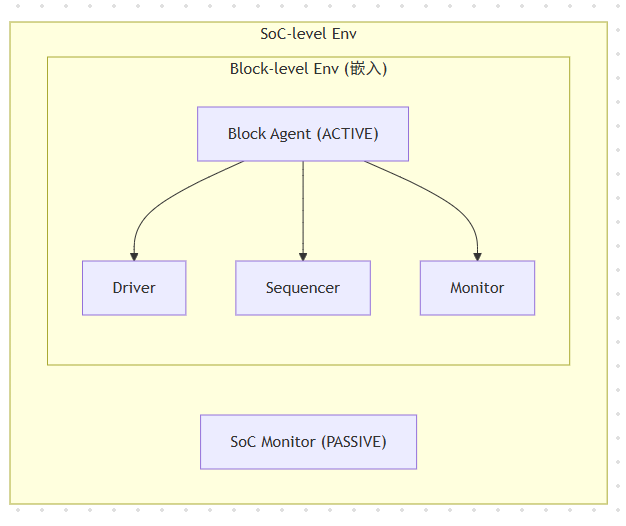

核心思想：

1. **Block-level**：Agent 设为 ACTIVE，驱动和监控 DUT 接口
2. **SoC-level**：将 block-level env 整体嵌入 SoC env，内部 agent 通过 config\_db 改为 PASSIVE
3. **Vertical reuse**：同一个 agent 类，在不同集成层级通过配置切换角色

```
// SoC-level test 中覆盖配置
// SoC-level test 中覆盖配置
uvm_config_db
#(uvm_active_passive_enum)::set(this, "env.blk_env.agent", "is_active", UVM_PASSIVE)
#(uvm_active_passive_enum)::set(this, "env.blk_env.agent", "is_active", UVM_PASSIVE)
;
```

你的 agent 代码只需要写一次，通过配置就能在 block-level（主动驱动）和 SoC-level（被动观测）之间切换。

---

## 5.7 实战：APB Monitor VIP

理论讲完，动手搭建第一个 UVC——一个 passive 的 APB Monitor VIP。

### 5.7.1 APB 协议速览

APB（Advanced Peripheral Bus）是 AMBA 协议族中最简单的总线，专为低带宽外设设计。它没有 burst、没有 pipeline、没有 out-of-order——每次传输都是独立的。

核心信号：

| 信号 | 方向 | 宽度 | 说明 |
| --- | --- | --- | --- |
| PCLK | Input | 1 | 时钟 |
| PRESETn | Input | 1 | 低有效复位 |
| PADDR | Master→Slave | 32 | 地址 |
| PSELx | Master→Slave | 1 | Slave 选择 |
| PENABLE | Master→Slave | 1 | 传输使能 |
| PWRITE | Master→Slave | 1 | 1=写, 0=读 |
| PWDATA | Master→Slave | 32 | 写数据 |
| PRDATA | Slave→Master | 32 | 读数据 |
| PREADY | Slave→Master | 1 | 传输完成（0=等待） |
| PSLVERR | Slave→Master | 1 | 传输错误 |
| PSTRB | Master→Slave | 4 | 字节选通（APB4 新增） |

APB 三状态 FSM：

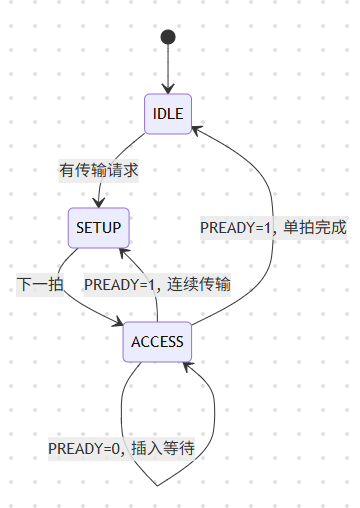

APB 写传输时序：

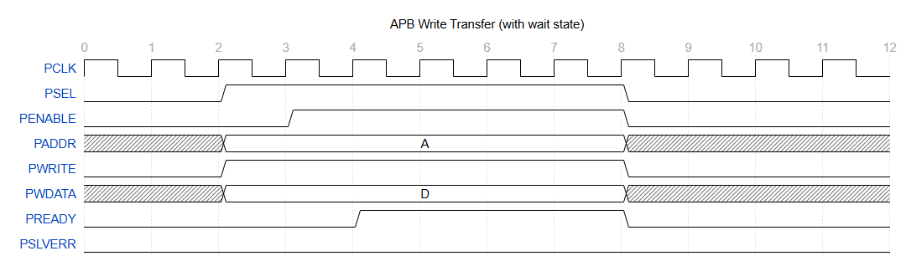

APB 读传输时序：

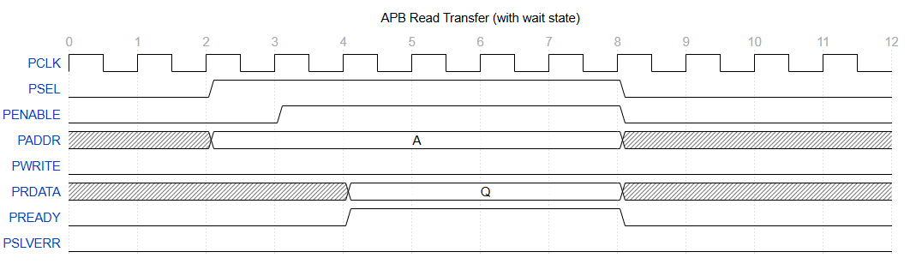

关键点：

- SETUP 阶段（第 2 拍）：PSEL=1, PENABLE=0，Master 驱动地址和控制信号
- ACCESS 阶段（第 3 拍起）：PENABLE=1，等待 PREADY=1
- PREADY=0 时所有信号保持不变，slave 插入等待状态
- PSLVERR 仅在 PREADY=1 且 PSEL=1 且 PENABLE=1 时有效

### 5.7.2 apb\_transaction 定义

```
class
class
 apb_transaction
extends
extends
 uvm_sequence_item;
`uvm_object_utils(apb_transaction)
`uvm_object_utils(apb_transaction)
rand
rand
bit
bit
 [
31
31
:
0
0
] addr;
rand
rand
bit
bit
 [
31
31
:
0
0
] data;
rand
rand
bit
bit
        write;
// 1=write, 0=read
// 1=write, 0=read
rand
rand
bit
bit
 [
3
3
:
0
0
]  strb;
// APB4 byte strobe
// APB4 byte strobe
function
function
new
new
(
string
string
 name =
"apb_transaction"
"apb_transaction"
);
super
super
.new
.new
(name);
endfunction
endfunction
function
function
string
string
 convert2string();
return
return
$sformatf
$sformatf
(
"APB %s addr=0x%08h data=0x%08h strb=0x%1h"
"APB %s addr=0x%08h data=0x%08h strb=0x%1h"
,
                     write ?
"WR"
"WR"
 :
"RD"
"RD"
, addr, data, strb);
endfunction
endfunction
endclass
endclass
```

### 5.7.3 apb\_monitor 实现

Monitor 是 passive agent 中唯一的活跃组件。它的职责：在 ACCESS phase 的 PREADY=1 时采样信号，封装为 transaction，通过 `analysis_port` 广播（代码中简写为 `ap`）。

```
class
class
 apb_monitor
extends
extends
 uvm_monitor;
`uvm_component_utils(apb_monitor)
`uvm_component_utils(apb_monitor)
virtual
virtual
 apb_interface  vif;
  uvm_analysis_port
#(apb_transaction)
#(apb_transaction)
  ap;
function
function
new
new
(
string
string
 name, uvm_component parent);
super
super
.new
.new
(name, parent);
endfunction
endfunction
function
function
void
void
 build_phase(uvm_phase phase);
super
super
.build_phase
.build_phase
(phase);
    ap =
new
new
(
"ap"
"ap"
,
this
this
);
endfunction
endfunction
task
task
 run_phase(uvm_phase phase);
forever
forever
begin
begin
      @(
posedge
posedge
 vif
.PCLK
.PCLK
);
// 复位期间不采样
// 复位期间不采样
if
if
 (!vif
.PRESETn
.PRESETn
)
continue
continue
;
// 等待 SETUP phase：PSEL=1, PENABLE=0
// 等待 SETUP phase：PSEL=1, PENABLE=0
if
if
 (vif
.PSEL
.PSEL
 && !vif
.PENABLE
.PENABLE
)
begin
begin
        apb_transaction txn = apb_transaction::type_id::create(
"txn"
"txn"
);
        txn
.addr
.addr
  = vif
.PADDR
.PADDR
;
        txn
.write
.write
 = vif
.PWRITE
.PWRITE
;
        txn
.strb
.strb
  = vif
.PSTRB
.PSTRB
;
// 等待 ACCESS phase 完成：PENABLE=1, PREADY=1
// 等待 ACCESS phase 完成：PENABLE=1, PREADY=1
        @(
posedge
posedge
 vif
.PCLK
.PCLK
);
while
while
 (vif
.PSEL
.PSEL
 && vif
.PENABLE
.PENABLE
 && !vif
.PREADY
.PREADY
)
begin
begin
          @(
posedge
posedge
 vif
.PCLK
.PCLK
);
end
end
// 采样数据
// 采样数据
if
if
 (txn
.write
.write
)
          txn
.data
.data
 = vif
.PWDATA
.PWDATA
;
else
else
          txn
.data
.data
 = vif
.PRDATA
.PRDATA
;
        ap
.write
.write
(txn);
end
end
end
end
endtask
endtask
endclass
endclass
```

关键设计：

- Monitor 只在 PREADY=1 时采样——这是 APB 协议规定的数据有效时刻
- `analysis_port.write()` 是非阻塞的，broadcast 给所有连接的 subscriber
- Monitor 不知道也不关心谁在监听，这是 TLM 松耦合的体现

### 5.7.4 apb\_agent 实现

Agent 把 Config Object、monitor 组装在一起：

```
class
class
 apb_agent
extends
extends
 uvm_agent;
`uvm_component_utils(apb_agent)
`uvm_component_utils(apb_agent)
  apb_agent_config  cfg;
  apb_monitor       mon;
function
function
void
void
 build_phase(uvm_phase phase);
super
super
.build_phase
.build_phase
(phase);
// 获取 config
// 获取 config
if
if
 (!uvm_config_db
#(apb_agent_config)::get(this, "", "cfg", cfg))
#(apb_agent_config)::get(this, "", "cfg", cfg))
`uvm_fatal("NOCONFIG", "apb_agent_config not set")
`uvm_fatal("NOCONFIG", "apb_agent_config not set")
// Monitor 始终创建
// Monitor 始终创建
    mon = apb_monitor::type_id::create(
"mon"
"mon"
,
this
this
);
// 本篇只用 passive 模式，不创建 driver 和 sequencer
// 本篇只用 passive 模式，不创建 driver 和 sequencer
// 扩展为 active 时，参考 §3 的条件实例化方式：
// 扩展为 active 时，参考 §3 的条件实例化方式：
//   if (cfg.active == UVM_ACTIVE) begin
//   if (cfg.active == UVM_ACTIVE) begin
//     drv = apb_driver::type_id::create("drv", this);
//     drv = apb_driver::type_id::create("drv", this);
//     sqr = apb_sequencer::type_id::create("sqr", this);
//     sqr = apb_sequencer::type_id::create("sqr", this);
//   end
//   end
endfunction
endfunction
function
function
void
void
 connect_phase(uvm_phase phase);
super
super
.connect_phase
.connect_phase
(phase);
// 传递 virtual interface 给 monitor
// 传递 virtual interface 给 monitor
    mon
.vif
.vif
 = cfg
.vif
.vif
;
endfunction
endfunction
endclass
endclass
```

### 5.7.5 apb\_config 定义

```
class
class
 apb_agent_config
extends
extends
 uvm_object;
`uvm_object_utils(apb_agent_config)
`uvm_object_utils(apb_agent_config)
  uvm_active_passive_enum  active = UVM_PASSIVE;
// 本篇只用 passive
// 本篇只用 passive
virtual
virtual
 apb_interface    vif;
function
function
new
new
(
string
string
 name =
"apb_agent_config"
"apb_agent_config"
);
super
super
.new
.new
(name);
endfunction
endfunction
endclass
endclass
```

### 5.7.6 在 env 中实例化

```
class
class
 my_env
extends
extends
 uvm_env;
`uvm_component_utils(my_env)
`uvm_component_utils(my_env)
  apb_agent        apb_agt;
  apb_agent_config apb_cfg;
function
function
void
void
 build_phase(uvm_phase phase);
super
super
.build_phase
.build_phase
(phase);
    apb_cfg = apb_agent_config::type_id::create(
"apb_cfg"
"apb_cfg"
);
// vif 由 test 通过 config_db 传入
// vif 由 test 通过 config_db 传入
if
if
 (!uvm_config_db
#(virtual apb_interface)::get(this, "", "apb_vif", apb_cfg.vif))
#(virtual apb_interface)::get(this, "", "apb_vif", apb_cfg.vif))
`uvm_fatal("NOVIF", "apb_interface not set")
`uvm_fatal("NOVIF", "apb_interface not set")
    uvm_config_db
#(apb_agent_config)::set(this, "apb_agt", "cfg", apb_cfg)
#(apb_agent_config)::set(this, "apb_agt", "cfg", apb_cfg)
;
    apb_agt = apb_agent::type_id::create(
"apb_agt"
"apb_agt"
,
this
this
);
endfunction
endfunction
endclass
endclass
```

至此，一个完整的 APB Monitor VIP 骨架就搭好了。

---

## 5.8 下篇预告：Seq-Sqr-Drv 握手机制

现在你有了一个能观测总线的 monitor，但它还不能驱动 DUT。要让 VIP "动起来"，需要理解 UVM 最核心的机制——**Sequence、Sequencer、Driver 三者握手**。

一句话总结：**Sequence 产生交易 → Sequencer 仲裁转发 → Driver 驱动信号**。

核心握手流程：

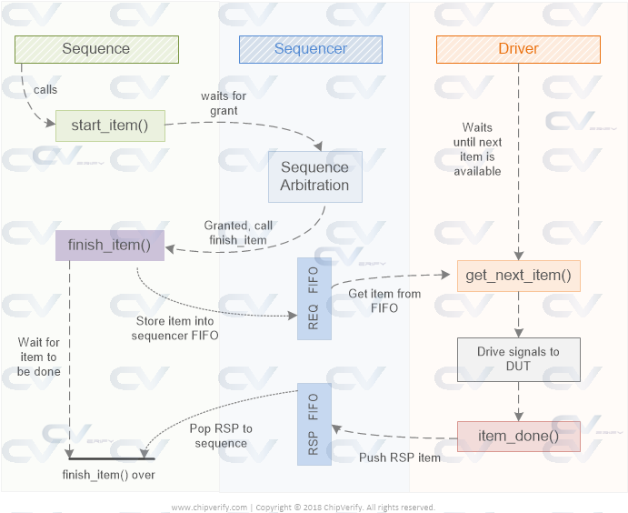

Seq-Sqr-Drv 握手流程

两种 Driver 模式：**get\_next\_item / item\_done**（阻塞式，driver 处理完才允许 sequence 发下一笔）和 **get / put**（另一种握手方式），第 2 篇详解。

第 2 篇将详解每个步骤的内部机制，并用 APB Master VIP 实战演示。

-- 点个关注，追更此系列 --

---

# 6. 握手 — 让 APB Master VIP 动起来

> 来源：https://mp.weixin.qq.com/s/RpABSbuC-ysRU_tYugGIZw
> 作者：福尔摩芯
> update 2026/08/22 11 : 30
> **已截图**

> “
>
> 上篇我们搭好了 passive agent 的骨架，monitor 能采信号了。但验证环境光"看"不够，还得能"动"——主动往总线上发交易。这就需要 Driver、Sequencer 和 Sequence 三者配合，也就是 UVM 的 **Seq-Sqr-Drv 握手机制**。

---

## 6.1 目录

1. Seq-Sqr-Drv 握手机制
2. Sequencer 仲裁机制
3. Unidirectional Non-Pipelined 模式
4. 实战：APB Master VIP 扩展

---

## 6.2 Seq-Sqr-Drv 握手机制

### 6.2.1 两种通信方式

UVM 的 driver 和 sequence 之间有两种通信方式：

1. **get\_next\_item / item\_done**：Driver 主动取交易，驱动完再通知。本文重点讲这种。
2. **put / get**：Sequence 主动推交易给 Driver。第 3 篇 AHB 部分展开。

APB 用的是第一种——Driver 按自己的节奏取交易、驱动信号、通知完成。

### 6.2.2 三者分工

先理清三个角色：

- **Sequence**：交易的"剧本"。定义要发什么交易、发几笔、什么顺序。
- **Sequencer**：交易的"调度员"。从多个 Sequence 里挑一笔，递给 Driver。
- **Driver**：交易的"执行者"。拿到 transaction，把它翻译成真实的信号波形。

它们的协作流程：


seq-sqr-drv-handshake

用文字描述就是：

1. Sequence 调 `start_item(req)`，告诉 Sequencer："我有一笔交易，准备好了。"
2. Sequencer 仲裁后调 `wait_for_grant()`，通知 Sequence："你被批准了。"
3. Sequence 对 `req` 做 randomize（如果需要），然后调 `finish_item(req)`，把交易正式提交。
4. Driver 这边一直在调 `get_next_item(req)`，阻塞等待。拿到 item 后开始驱动信号。
5. Driver 驱动完毕，调 `item_done(req)`，告诉 Sequencer："这笔搞定了。"

### 6.2.3 代码层面发生了什么

把上面的流程翻译成代码：

**Sequence 端：**

```
task
task
 body();
  req = apb_transaction::type_id::create(
"req"
"req"
);
  start_item(req);
assert
assert
(req
.randomize
.randomize
()
with
with
 { addr ==
32'h1000_0000
32'h1000_0000
; write ==
1
1
; });
  finish_item(req);
endtask
endtask
```

**Driver 端：**

```
task
task
 run_phase(uvm_phase phase);
forever
forever
begin
begin
    seq_item_port
.get_next_item
.get_next_item
(req);
// 阻塞等待
// 阻塞等待
    drive_transfer(req);
// 驱动信号
// 驱动信号
    seq_item_port
.item_done
.item_done
();
// 完成
// 完成
end
end
endtask
endtask
```

`get_next_item` 和 `item_done` 是跨组件的 **阻塞调用**——Sequence 和 Driver 各自跑在自己的线程里，靠 Sequencer 协调。

### 6.2.4 宏展开

实际写 sequence 时，很少手写 `start_item / finish_item`，通常用宏：

| 宏 | 展开 |
| --- | --- |
| `` `uvm_do(req) `` | create → start\_item → randomize → finish\_item |
| `` `uvm_do_with(req, { constraint }) `` | 同上，加内联约束 |
| `` `uvm_create(req) `` | 只做 create，不自动 start\_item |
| `` `uvm_send(req) `` | 手动 finish\_item（配合 `uvm\_create 使用） |

`` `uvm_do `` 一步到位，适合简单场景。需要精细控制时（比如 randomize 要分步做），用 `uvm_create` + `uvm_send` 拆开。

### 6.2.5 Hook 回调

握手机制还留了三个 hook，方便在 sequence 或 driver 侧插入自定义逻辑：

- **pre\_do**：在 `finish_item` 内部、transaction 发给 Driver 之前调用。可以做最后的修改。
- **mid\_do**：在 `finish_item` 内部、transaction 发给 Driver 之后调用。用得少。
- **post\_do**：在 `item_done` 之后、Sequence 拿到 response 时调用。

一般用不上，知道有这么回事就行。真正需要时再查 UVM 源码。

---

## 6.3 Sequencer 仲裁机制

### 6.3.1 仲裁队列

Sequencer 内部维护一个 **请求队列**。多个 Sequence 可以同时挂载到同一个 Sequencer 上，每个 Sequence 调 `start_item` 时就把请求入队。Sequencer 按仲裁策略逐个批准。

默认策略是 `SEQ_ARB_FIFO`——先进先出。UVM 还提供其他几种：

| 策略 | 含义 |
| --- | --- |
| `SEQ_ARB_FIFO` | FIFO，先请求先批准 |
| `SEQ_ARB_WEIGHTED` | 加权随机 |
| `SEQ_ARB_RANDOM` | 纯随机 |
| `SEQ_ARB_STRICT_FIFO` | 高优先级先，同优先级 FIFO |
| `SEQ_ARB_STRICT_RANDOM` | 高优先级先，同优先级随机 |

用 `set_arbitration()` 设置：

```
sequencer
.set_arbitration
.set_arbitration
(SEQ_ARB_STRICT_FIFO);
```

优先级通过 `start_item(req, priority)` 的第二个参数控制，数字越大越优先。

### 6.3.2 Lock 与 Grab

有时一个 Sequence 需要独占 Sequencer，连续发多笔交易而不被打断。有两种方式：

- **lock**：申请独占，但要排队等前面的交易发完。
- **grab**：强制插队独占，不等别人。

```
// lock：礼貌地排队独占
// lock：礼貌地排队独占
sequencer
.lock
.lock
(
this
this
);
// ... 发多笔交易 ...
// ... 发多笔交易 ...
sequencer
.unlock
.unlock
(
this
this
);
// grab：不排队，直接抢
// grab：不排队，直接抢
sequencer
.grab
.grab
(
this
this
);
// ... 发多笔交易 ...
// ... 发多笔交易 ...
sequencer
.ungrab
.ungrab
(
this
this
);
```

实际用得不多。大多数场景下用一个专门的 sequence 发连续交易就够了，不需要显式 lock。

---

## 6.4 Unidirectional Non-Pipelined 模式

### 6.4.1 Cookbook 的分类

UVM Cookbook 把总线驱动模式分了几类。APB 属于最简单的一种：**Unidirectional Non-Pipelined**。

- **Unidirectional**：单向驱动，没有 response 回传。Driver 发完交易就结束，不关心 Slave 的应答数据（monitor 会去采）。
- **Non-Pipelined**：一次一笔。上一笔 `item_done` 之后，下一笔才开始。

对比 AHB 的 pipelined 模式（第 4 篇），地址 phase 和 data phase 可以重叠。APB 没有这种重叠，一笔交易的 SETUP + ACCESS 全走完，才算结束。

### 6.4.2 为什么 APB 适合这个模式

APB 协议本身适合 unidirectional non-pipelined：

1. **单向驱动**：Master 驱动地址和控制信号，Slave 在 PREADY=1 时返回数据。Driver 不需要等 Slave 的 response 才算完成——它只要按 FSM 走完 SETUP → ACCESS 就行。
2. **无流水线**：APB 没有 overlapping 的概念。一笔传输必须从 SETUP 到 ACCESS 完整走完，才能开始下一笔。

所以 APB Driver 的实现很直接：一个 `forever` 循环，`get_next_item` → 驱动 FSM → `item_done`，没有多线程，没有 pipeline 深度管理。

---

## 6.5 实战：APB Master VIP 扩展

现在把上篇的 passive agent 扩展成 active agent，加上 Driver 和 Sequencer。

### 6.5.1 apb\_driver 实现

Driver 的职责：拿到 transaction，按 APB 协议驱动信号。

```
class
class
 apb_driver
extends
extends
 uvm_driver
#(apb_transaction)
#(apb_transaction)
;
`uvm_component_utils(apb_driver)
`uvm_component_utils(apb_driver)
virtual
virtual
 apb_if vif;
function
function
new
new
(
string
string
 name, uvm_component parent);
super
super
.new
.new
(name, parent);
endfunction
endfunction
virtual
virtual
function
function
void
void
 build_phase(uvm_phase phase);
super
super
.build_phase
.build_phase
(phase);
if
if
 (!uvm_config_db
#(virtual apb_if)::get(this, "", "vif", vif))
#(virtual apb_if)::get(this, "", "vif", vif))
`uvm_fatal("DRV", "Failed to get vif")
`uvm_fatal("DRV", "Failed to get vif")
endfunction
endfunction
task
task
 run_phase(uvm_phase phase);
forever
forever
begin
begin
      seq_item_port
.get_next_item
.get_next_item
(req);
      drive_transfer(req);
      seq_item_port
.item_done
.item_done
();
end
end
endtask
endtask
task
task
 drive_transfer(apb_transaction txn);
// SETUP phase
// SETUP phase
    @(
posedge
posedge
 vif
.PCLK
.PCLK
);
    vif
.PSEL
.PSEL
    <=
1'b1
1'b1
;
    vif
.PENABLE
.PENABLE
 <=
1'b0
1'b0
;
    vif
.PADDR
.PADDR
   <= txn
.addr
.addr
;
    vif
.PWRITE
.PWRITE
  <= txn
.write
.write
;
if
if
 (txn
.write
.write
)
      vif
.PWDATA
.PWDATA
 <= txn
.data
.data
;
// ACCESS phase
// ACCESS phase
    @(
posedge
posedge
 vif
.PCLK
.PCLK
);
    vif
.PENABLE
.PENABLE
 <=
1'b1
1'b1
;
// 等待 PREADY=1
// 等待 PREADY=1
do
do
 @(
posedge
posedge
 vif
.PCLK
.PCLK
);
while
while
 (!vif
.PREADY
.PREADY
);
// 撤销（下一拍）
// 撤销（下一拍）
    @(
posedge
posedge
 vif
.PCLK
.PCLK
);
    vif
.PSEL
.PSEL
    <=
1'b0
1'b0
;
    vif
.PENABLE
.PENABLE
 <=
1'b0
1'b0
;
endtask
endtask
endclass
endclass
```

**关键点：**

1. **SETUP 阶段**：PSEL=1，PENABLE=0，同时把地址和控制信号放上去。
2. **ACCESS 阶段**：下一时钟周期，PENABLE=1。
3. **等 PREADY**：Slave 可能插入 wait state，用 `do...while` 循环等待。
4. **撤销**：PREADY=1 后，下一拍把 PSEL 和 PENABLE 拉低，结束这笔交易。

### 6.5.2 apb\_master\_sequencer

Sequencer 只需要参数化，不需要额外逻辑：

```
class
class
 apb_master_sequencer
extends
extends
 uvm_sequencer
#(apb_transaction)
#(apb_transaction)
;
`uvm_component_utils(apb_master_sequencer)
`uvm_component_utils(apb_master_sequencer)
function
function
new
new
(
string
string
 name, uvm_component parent);
super
super
.new
.new
(name, parent);
endfunction
endfunction
endclass
endclass
```

就这么多。Sequencer 的仲裁、队列管理全是 `uvm_sequencer` 基类干的，子类不需要操心。

### 6.5.3 apb\_write\_sequence

写一笔交易的 sequence：

```
class
class
 apb_write_sequence
extends
extends
 uvm_sequence
#(apb_transaction)
#(apb_transaction)
;
`uvm_object_utils(apb_write_sequence)
`uvm_object_utils(apb_write_sequence)
rand
rand
bit
bit
 [
31
31
:
0
0
] addr;
rand
rand
bit
bit
 [
31
31
:
0
0
] data;
function
function
new
new
(
string
string
 name =
"apb_write_sequence"
"apb_write_sequence"
);
super
super
.new
.new
(name);
endfunction
endfunction
task
task
 body();
    req = apb_transaction::type_id::create(
"req"
"req"
);
    start_item(req);
assert
assert
(req
.randomize
.randomize
()
with
with
 {
      req
.addr
.addr
  ==
local
local
::addr;
      req
.write
.write
 ==
1
1
;
      req
.data
.data
  ==
local
local
::data;
    });
    finish_item(req);
endtask
endtask
endclass
endclass
```

`addr` 和 `data` 是 sequence 的成员变量，可以在 test 中 `randomize` 后再调 `start`。也可以用 `` `uvm_do_with `` 简化：

```
task
task
 body();
  req = apb_transaction::type_id::create(
"req"
"req"
);
`uvm_do_with(req, { req.addr == local::addr; req.write == 1; req.data == local::data; })
`uvm_do_with(req, { req.addr == local::addr; req.write == 1; req.data == local::data; })
endtask
endtask
```

### 6.5.4 连续多笔写

扩展一下，发 N 笔连续写：

```
class
class
 apb_write_burst_sequence
extends
extends
 uvm_sequence
#(apb_transaction)
#(apb_transaction)
;
`uvm_object_utils(apb_write_burst_sequence)
`uvm_object_utils(apb_write_burst_sequence)
rand
rand
int
int
unsigned
unsigned
 num_txns;
constraint
constraint
 c_num { num_txns
inside
inside
 {[
1
1
:
16
16
]}; }
function
function
new
new
(
string
string
 name =
"apb_write_burst_sequence"
"apb_write_burst_sequence"
);
super
super
.new
.new
(name);
endfunction
endfunction
task
task
 body();
repeat
repeat
 (num_txns)
begin
begin
      req = apb_transaction::type_id::create(
"req"
"req"
);
      start_item(req);
assert
assert
(req
.randomize
.randomize
()
with
with
 { req
.write
.write
 ==
1
1
; });
      finish_item(req);
end
end
endtask
endtask
endclass
endclass
```

`repeat` 循环，每次 `create` 一个新的 transaction。**注意必须每次 create**，不能复用同一个 handle——否则 randomize 会覆盖上一笔的数据，monitor 采到的全是最后一笔的值。

### 6.5.5 Agent 改为 active 模式

上篇的 agent 是 passive，只有 monitor。现在加上 driver 和 sequencer：

```
class
class
 apb_agent
extends
extends
 uvm_agent;
`uvm_component_utils(apb_agent)
`uvm_component_utils(apb_agent)
  apb_monitor          mon;
  apb_driver           drv;
  apb_master_sequencer sqr;
function
function
new
new
(
string
string
 name, uvm_component parent);
super
super
.new
.new
(name, parent);
endfunction
endfunction
virtual
virtual
function
function
void
void
 build_phase(uvm_phase phase);
super
super
.build_phase
.build_phase
(phase);
    mon = apb_monitor::type_id::create(
"mon"
"mon"
,
this
this
);
if
if
 (is_active == UVM_ACTIVE)
begin
begin
      drv = apb_driver::type_id::create(
"drv"
"drv"
,
this
this
);
      sqr = apb_master_sequencer::type_id::create(
"sqr"
"sqr"
,
this
this
);
end
end
endfunction
endfunction
virtual
virtual
function
function
void
void
 connect_phase(uvm_phase phase);
super
super
.connect_phase
.connect_phase
(phase);
if
if
 (is_active == UVM_ACTIVE)
      drv
.seq_item_port
.seq_item_port
.connect
.connect
(sqr
.seq_item_export
.seq_item_export
);
endfunction
endfunction
endclass
endclass
```

**关键点：**

1. **条件创建**：`is_active == UVM_ACTIVE` 时才创建 driver 和 sequencer。被动模式下只有 monitor。
2. **connect\_phase**：把 driver 的 `seq_item_port` 连到 sequencer 的 `seq_item_export`。这是 UVM 的标准 TLM 连接，建立 get\_next\_item/item\_done 的通信通道。

### 6.5.6 在 test 中启动 sequence

最后，在 test 里启动 sequence：

```
class
class
 apb_write_test
extends
extends
 uvm_test;
`uvm_component_utils(apb_write_test)
`uvm_component_utils(apb_write_test)
  apb_env env;
function
function
new
new
(
string
string
 name, uvm_component parent);
super
super
.new
.new
(name, parent);
endfunction
endfunction
virtual
virtual
function
function
void
void
 build_phase(uvm_phase phase);
super
super
.build_phase
.build_phase
(phase);
    env = apb_env::type_id::create(
"env"
"env"
,
this
this
);
endfunction
endfunction
task
task
 run_phase(uvm_phase phase);
    apb_write_burst_sequence seq;
    phase
.raise_objection
.raise_objection
(
this
this
);
    seq = apb_write_burst_sequence::type_id::create(
"seq"
"seq"
);
assert
assert
(seq
.randomize
.randomize
());
    seq
.start
.start
(env
.agt
.agt
.sqr
.sqr
);
    #
100
100
ns;
    phase
.drop_objection
.drop_objection
(
this
this
);
endtask
endtask
endclass
endclass
```

`seq.start(env.agt.sqr)` 把 sequence 挂到 agent 的 sequencer 上启动。Sequence 会自动发交易，Driver 自动取走驱动，Monitor 自动采样广播。

### 6.5.7 验证要点

跑完 test 后，检查：

1. **Driver 驱动的波形**：PSEL/PENABLE/PADDR/PWDATA 是否符合 APB FSM。
2. **Monitor 采样的 transaction**：和 Driver 发的是否一致（addr、data、write）。
3. **Transaction 数量**：sequence 发了多少笔，monitor 就应该采到多少笔。

如果有 wait state，Driver 的 `do...while` 循环会多等几个周期，波形上能看到 PENABLE=1 但 PREADY=0 的持续状态。

---

## 6.6 小结

本篇的核心就一件事：**让 APB Master VIP 能主动发交易**。

- Sequence 定义交易内容
- Sequencer 负责调度
- Driver 把交易翻译成信号
- 三者通过 `get_next_item / item_done` 握手

APB 是最简单的总线，所以握手机制也最直接——一个 `forever` 循环搞定。后面的 AHB 会引入 response 回传和 pipeline 重叠，复杂度逐步升级。

> 下一篇预告： APB 的 Driver 是单向的，发完就不管了。但 AHB 不一样——Slave 的响应（HRDATA/HRESP）需要回传给 Sequence。这就是 Bidirectional Driver，第 3 篇见。

UVM VIP开发系列：

[骨架 — 从 APB Monitor 看懂 UVC 架构](https://mp.weixin.qq.com/s?__biz=Mzk3NTg3ODUyNg==&mid=2247483846&idx=1&sn=aac68824b303db40dcf4882494d8faff&scene=21#wechat_redirect)

---

# 7. 响应 — AHB 读写与 Bidirectional Driver

> 来源：https://mp.weixin.qq.com/s/WntLXtJv4LsqtV5ZFz2GJw
> 作者：福尔摩芯
> update 2026/08/22 11 : 30
> **已截图**

> “
>
> APB 的 Driver 是"发完就走"——驱动完信号，调 `item_done()`，完事。但 AHB 不一样，Slave 会返回数据（读操作）和状态（HRESP），Driver 需要把这些信息带回给 Sequence。这种模式叫 **Bidirectional Driver**。

---

## 7.1 目录

1. Bidirectional Non-Pipelined 模式
2. Response 回传机制
3. AHB 协议速览
4. 实战：AHB Master VIP

---

## 7.2 Bidirectional Non-Pipelined 模式

### 7.2.1 Cookbook 的分类

上篇说过，UVM Cookbook 把总线驱动模式分了几类。APB 是 Unidirectional Non-Pipelined，AHB 在非流水线模式下是 **Bidirectional Non-Pipelined**。

两个关键词：

- **Bidirectional**：双向通信。Driver 发请求，Slave 返回响应。Driver 需要把响应带回给 Sequence。
- **Non-Pipelined**：一次一笔。上一笔传输完成（拿到 response）后，下一笔才开始。

对比 APB：

| 特性 | APB | AHB（非流水线） |
| --- | --- | --- |
| 方向 | 单向 | 双向 |
| Response | 可选（driver 可采 PRDATA 带回，也可让 monitor 采） | 必须（driver 采 HRDATA/HRESP 带回） |
| 握手 | get\_next\_item / item\_done | get\_next\_item / item\_done(rsp) |

### 7.2.2 为什么需要 response

APB 的读操作，Driver 可以采样 PRDATA 带回给 Sequence，也可以不采——让 Monitor 去采，Sequence 只管发交易。两种做法都行，看需求。

但 AHB 不一样。Sequence 发一笔读交易，通常需要知道 Slave 返回了什么数据。比如：

- 读寄存器值，根据值决定下一步操作
- 读 DMA 状态，判断传输是否完成
- 读 FIFO 数据，验证内容正确性

所以 AHB 的 Driver 必须把 response 带回来。

---

## 7.3 Response 回传机制

### 7.3.1 两种回传方式

UVM 提供两种方式把 response 从 Driver 传回 Sequence：

**方式一：item\_done(rsp)**

```
// Driver 端
// Driver 端
seq_item_port
.get_next_item
.get_next_item
(req);
drive_transfer(req);
seq_item_port
.item_done
.item_done
(rsp);
// 把 response 放入 response queue
// 把 response 放入 response queue
// Sequence 端
// Sequence 端
start_item(req);
finish_item(req);
// 阻塞，等 item_done
// 阻塞，等 item_done
get_response(rsp);
// 可选：需要读取 response 时才调
// 可选：需要读取 response 时才调
```

**方式二：put(rsp)**

```
// Driver 端
// Driver 端
seq_item_port
.get_next_item
.get_next_item
(req);
drive_transfer(req);
seq_item_port
.put
.put
(rsp);
// 主动 put response
// 主动 put response
// Sequence 端
// Sequence 端
start_item(req);
finish_item(req);
get_response(rsp);
```

两种方式的区别：

| 方式 | 时机 | 特点 |
| --- | --- | --- |
| item\_done(rsp) | 驱动完成后 | 标准流程，一个 item\_done 同时通知完成和传递 response |
| put(rsp) | 驱动过程中 | 可以在驱动过程中多次 put，适合需要中间结果的场景 |

AHB 用第一种就够了——驱动完地址 phase 和 data phase，拿到 HRDATA 和 HRESP，打包成 response，通过 `item_done(rsp)` 带回。如果 sequence 需要读取数据，再调 `get_response`。

### 7.3.2 REQ/RSP 类型参数化

UVM 的 sequence 和 driver 支持两个类型参数：

```
class
class
 ahb_sequence
extends
extends
 uvm_sequence
#(ahb_transaction, ahb_response)
#(ahb_transaction, ahb_response)
;
class
class
 ahb_driver
extends
extends
 uvm_driver
#(ahb_transaction, ahb_response)
#(ahb_transaction, ahb_response)
;
class
class
 ahb_sequencer
extends
extends
 uvm_sequencer
#(ahb_transaction, ahb_response)
#(ahb_transaction, ahb_response)
;
```

第一个是 REQ（请求），第二个是 RSP（响应）。

**单参数 vs 双参数：**

- **单参数**`uvm_sequence #(ahb_transaction)`：req 和 rsp 是同一个类型，甚至同一个对象。`item_done(req)` 把 req 放入 response queue，`get_response(req)` 取出的还是那个 req。
- **双参数**`uvm_sequence #(ahb_transaction, ahb_response)`：req 和 rsp 是不同类型。`item_done(rsp)` 放入 rsp 对象，`get_response(rsp)` 取出 rsp 对象。

单参数够用就用单参数，简单。需要 response 有额外字段（比如 error 标志）时，用双参数。

---

## 7.4 AHB 协议速览

### 7.4.1 信号列表

| 信号 | 方向 | 说明 |
| --- | --- | --- |
| HADDR | Master → Slave | 地址 |
| HTRANS | Master → Slave | 传输类型（IDLE/NONSEQ/SEQ/BUSY） |
| HWRITE | Master → Slave | 1=写，0=读 |
| HSIZE | Master → Slave | 传输大小（byte/halfword/word） |
| HBURST | Master → Slave | 突发类型（SINGLE/INCR/WRAP） |
| HWDATA | Master → Slave | 写数据 |
| HRDATA | Slave → Master | 读数据 |
| HREADY | Slave → Master | 传输完成（1=完成，0=等待） |
| HRESP | Slave → Master | 响应状态（OKAY/ERROR） |

### 7.4.2 HTRANS 编码

| 值 | 名称 | 含义 |
| --- | --- | --- |
| 2'b00 | IDLE | 空闲，不传输 |
| 2'b01 | BUSY | 忙，突发传输中暂停 |
| 2'b10 | NONSEQ | 非连续，突发传输第一拍或单笔传输 |
| 2'b11 | SEQ | 连续，突发传输后续拍 |

单笔传输只用 NONSEQ。

### 7.4.3 HBURST 类型

| 值 | 名称 | 含义 |
| --- | --- | --- |
| 3'b000 | SINGLE | 单笔传输 |
| 3'b001 | INCR | 未定义长度递增突发 |
| 3'b010 | WRAP4 | 4 拍回环突发 |
| 3'b011 | INCR4 | 4 拍递增突发 |
| 3'b100 | WRAP8 | 8 拍回环突发 |
| 3'b101 | INCR8 | 8 拍递增突发 |
| 3'b110 | WRAP16 | 16 拍回环突发 |
| 3'b111 | INCR16 | 16 拍递增突发 |

单笔传输用 SINGLE。

### 7.4.4 HRESP 编码

| 值 | 含义 |
| --- | --- |
| 1'b0 | OKAY：传输成功 |
| 1'b1 | ERROR：传输错误 |

时序图说明：`x` 表示信号未驱动或值无关，`2` 表示数据有效。

### 7.4.5 单笔写时序

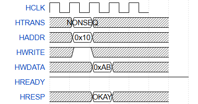

- 第 1 拍（Address phase）：HTRANS=NONSEQ，HADDR=目标地址，HWRITE=1
- 第 2 拍（Data phase）：HWDATA=写数据，HREADY=1 表示完成

### 7.4.6 单笔读时序

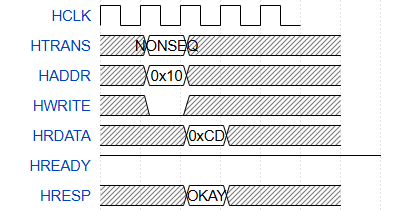

- 第 1 拍（Address phase）：HTRANS=NONSEQ，HADDR=目标地址，HWRITE=0
- 第 2 拍（Data phase）：HRDATA=读数据，HREADY=1 表示完成

### 7.4.7 Wait State

如果 Slave 需要更多时间，可以在 Data phase 拉低 HREADY，插入等待周期：

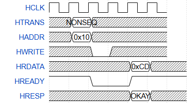

HREADY=0 期间，Master 等待。HREADY=1 时数据有效，传输完成。

---

## 7.5 实战：AHB Master VIP

### 7.5.1 ahb\_transaction 定义

```
class
class
 ahb_transaction
extends
extends
 uvm_sequence_item;
rand
rand
bit
bit
 [
31
31
:
0
0
] addr;
rand
rand
bit
bit
 [
31
31
:
0
0
] data;
rand
rand
bit
bit
        write;
rand
rand
bit
bit
 [
2
2
:
0
0
]  burst;
rand
rand
bit
bit
 [
2
2
:
0
0
]  size;
rand
rand
bit
bit
 [
1
1
:
0
0
]  trans;
`uvm_object_utils_begin(ahb_transaction)
`uvm_object_utils_begin(ahb_transaction)
`uvm_field_int(addr,  UVM_ALL_ON)
`uvm_field_int(addr,  UVM_ALL_ON)
`uvm_field_int(data,  UVM_ALL_ON)
`uvm_field_int(data,  UVM_ALL_ON)
`uvm_field_int(write, UVM_ALL_ON)
`uvm_field_int(write, UVM_ALL_ON)
`uvm_field_int(burst, UVM_ALL_ON)
`uvm_field_int(burst, UVM_ALL_ON)
`uvm_field_int(size,  UVM_ALL_ON)
`uvm_field_int(size,  UVM_ALL_ON)
`uvm_field_int(trans, UVM_ALL_ON)
`uvm_field_int(trans, UVM_ALL_ON)
`uvm_object_utils_end
`uvm_object_utils_end
function
function
new
new
(
string
string
 name =
"ahb_transaction"
"ahb_transaction"
);
super
super
.new
.new
(name);
endfunction
endfunction
constraint
constraint
 c_single {
    burst ==
3'b000
3'b000
;
// SINGLE
// SINGLE
    trans ==
2'b10
2'b10
;
// NONSEQ
// NONSEQ
  }
endclass
endclass
```

- `addr`：地址
- `data`：写数据或读数据
- `write`：1=写，0=读
- `burst`：突发类型，单笔传输用 SINGLE
- `size`：传输大小
- `trans`：传输类型，单笔传输用 NONSEQ

### 7.5.2 ahb\_driver 实现

```
class
class
 ahb_driver
extends
extends
 uvm_driver
#(ahb_transaction)
#(ahb_transaction)
;
`uvm_component_utils(ahb_driver)
`uvm_component_utils(ahb_driver)
virtual
virtual
 ahb_if vif;
function
function
new
new
(
string
string
 name, uvm_component parent);
super
super
.new
.new
(name, parent);
endfunction
endfunction
virtual
virtual
function
function
void
void
 build_phase(uvm_phase phase);
super
super
.build_phase
.build_phase
(phase);
if
if
 (!uvm_config_db
#(virtual ahb_if)::get(this, "", "vif", vif))
#(virtual ahb_if)::get(this, "", "vif", vif))
`uvm_fatal("DRV", "Failed to get vif")
`uvm_fatal("DRV", "Failed to get vif")
endfunction
endfunction
task
task
 run_phase(uvm_phase phase);
forever
forever
begin
begin
      seq_item_port
.get_next_item
.get_next_item
(req);
      drive_transfer(req);
      seq_item_port
.item_done
.item_done
(req);
// 用 req 作为 response（单参数）
// 用 req 作为 response（单参数）
end
end
endtask
endtask
task
task
 drive_transfer(ahb_transaction txn);
// Address phase
// Address phase
    @(
posedge
posedge
 vif
.HCLK
.HCLK
);
    vif
.HADDR
.HADDR
  <= txn
.addr
.addr
;
    vif
.HTRANS
.HTRANS
 <= txn
.trans
.trans
;
    vif
.HWRITE
.HWRITE
 <= txn
.write
.write
;
    vif
.HSIZE
.HSIZE
  <= txn
.size
.size
;
    vif
.HBURST
.HBURST
 <= txn
.burst
.burst
;
if
if
 (txn
.write
.write
)
      vif
.HWDATA
.HWDATA
 <= txn
.data
.data
;
// 等待 HREADY（地址 phase 可能被 slave 延迟）
// 等待 HREADY（地址 phase 可能被 slave 延迟）
while
while
 (!vif
.HREADY
.HREADY
) @(
posedge
posedge
 vif
.HCLK
.HCLK
);
// Data phase
// Data phase
    @(
posedge
posedge
 vif
.HCLK
.HCLK
);
while
while
 (!vif
.HREADY
.HREADY
) @(
posedge
posedge
 vif
.HCLK
.HCLK
);
// 采样 response
// 采样 response
if
if
 (!txn
.write
.write
)
      txn
.data
.data
 = vif
.HRDATA
.HRDATA
;
endtask
endtask
endclass
endclass
```

**关键点：**

1. **Address phase**：驱动地址、控制信号和写数据。HTRANS=NONSEQ 表示有效传输。
2. **等 HREADY**：地址 phase 期间，Slave 可能拉低 HREADY 插入等待。
3. **Data phase**：读操作采样 HRDATA。
4. **再次等 HREADY**：数据 phase 期间，Slave 可能再次插入等待。
5. **采样 response**：读操作时，把 HRDATA 写回 txn.data，通过 `item_done(req)` 带回给 Sequence。

### 7.5.3 ahb\_monitor 实现

```
class
class
 ahb_monitor
extends
extends
 uvm_monitor;
`uvm_component_utils(ahb_monitor)
`uvm_component_utils(ahb_monitor)
virtual
virtual
 ahb_if vif;
  uvm_analysis_port
#(ahb_transaction)
#(ahb_transaction)
 ap;
function
function
new
new
(
string
string
 name, uvm_component parent);
super
super
.new
.new
(name, parent);
endfunction
endfunction
virtual
virtual
function
function
void
void
 build_phase(uvm_phase phase);
super
super
.build_phase
.build_phase
(phase);
    ap =
new
new
(
"ap"
"ap"
,
this
this
);
if
if
 (!uvm_config_db
#(virtual ahb_if)::get(this, "", "vif", vif))
#(virtual ahb_if)::get(this, "", "vif", vif))
`uvm_fatal("MON", "Failed to get vif")
`uvm_fatal("MON", "Failed to get vif")
endfunction
endfunction
task
task
 run_phase(uvm_phase phase);
forever
forever
begin
begin
      @(
posedge
posedge
 vif
.HCLK
.HCLK
);
if
if
 (!vif
.HRESETn
.HRESETn
)
continue
continue
;
// 检测有效传输（NONSEQ 或 SEQ）
// 检测有效传输（NONSEQ 或 SEQ）
if
if
 (vif
.HTRANS
.HTRANS
 ==
2'b10
2'b10
 || vif
.HTRANS
.HTRANS
 ==
2'b11
2'b11
)
begin
begin
        ahb_transaction txn = ahb_transaction::type_id::create(
"txn"
"txn"
);
        txn
.addr
.addr
  = vif
.HADDR
.HADDR
;
        txn
.write
.write
 = vif
.HWRITE
.HWRITE
;
        txn
.size
.size
  = vif
.HSIZE
.HSIZE
;
        txn
.burst
.burst
 = vif
.HBURST
.HBURST
;
        txn
.trans
.trans
 = vif
.HTRANS
.HTRANS
;
// 等待地址 phase 完成
// 等待地址 phase 完成
while
while
 (!vif
.HREADY
.HREADY
) @(
posedge
posedge
 vif
.HCLK
.HCLK
);
// 等待数据 phase
// 等待数据 phase
        @(
posedge
posedge
 vif
.HCLK
.HCLK
);
while
while
 (!vif
.HREADY
.HREADY
) @(
posedge
posedge
 vif
.HCLK
.HCLK
);
// 采样数据
// 采样数据
if
if
 (txn
.write
.write
)
          txn
.data
.data
 = vif
.HWDATA
.HWDATA
;
else
else
          txn
.data
.data
 = vif
.HRDATA
.HRDATA
;
        ap
.write
.write
(txn);
end
end
end
end
endtask
endtask
endclass
endclass
```

**关键点：**

1. **检测有效传输**：HTRANS=NONSEQ（单笔）或 SEQ（突发后续拍）时，开始采样。
2. **等 HREADY**：地址 phase 和数据 phase 都可能被 Slave 延迟。
3. **采样数据**：写操作采样 HWDATA，读操作采样 HRDATA。
4. **广播 transaction**：通过 analysis\_port 广播，供 scoreboard 或其他组件使用。

### 7.5.4 ahb\_master\_agent

```
class
class
 ahb_master_agent
extends
extends
 uvm_agent;
`uvm_component_utils(ahb_master_agent)
`uvm_component_utils(ahb_master_agent)
  ahb_monitor          mon;
  ahb_driver           drv;
  ahb_master_sequencer sqr;
function
function
new
new
(
string
string
 name, uvm_component parent);
super
super
.new
.new
(name, parent);
endfunction
endfunction
virtual
virtual
function
function
void
void
 build_phase(uvm_phase phase);
super
super
.build_phase
.build_phase
(phase);
    mon = ahb_monitor::type_id::create(
"mon"
"mon"
,
this
this
);
if
if
 (is_active == UVM_ACTIVE)
begin
begin
      drv = ahb_driver::type_id::create(
"drv"
"drv"
,
this
this
);
      sqr = ahb_master_sequencer::type_id::create(
"sqr"
"sqr"
,
this
this
);
end
end
endfunction
endfunction
virtual
virtual
function
function
void
void
 connect_phase(uvm_phase phase);
super
super
.connect_phase
.connect_phase
(phase);
if
if
 (is_active == UVM_ACTIVE)
      drv
.seq_item_port
.seq_item_port
.connect
.connect
(sqr
.seq_item_export
.seq_item_export
);
endfunction
endfunction
endclass
endclass
```

和 APB agent 结构一样，条件创建 driver 和 sequencer。

### 7.5.5 ahb\_write\_seq / ahb\_read\_seq

```
class
class
 ahb_write_seq
extends
extends
 uvm_sequence
#(ahb_transaction)
#(ahb_transaction)
;
`uvm_object_utils(ahb_write_seq)
`uvm_object_utils(ahb_write_seq)
rand
rand
bit
bit
 [
31
31
:
0
0
] addr;
rand
rand
bit
bit
 [
31
31
:
0
0
] data;
function
function
new
new
(
string
string
 name =
"ahb_write_seq"
"ahb_write_seq"
);
super
super
.new
.new
(name);
endfunction
endfunction
task
task
 body();
    req = ahb_transaction::type_id::create(
"req"
"req"
);
    start_item(req);
assert
assert
(req
.randomize
.randomize
()
with
with
 {
      req
.addr
.addr
  ==
local
local
::addr;
      req
.write
.write
 ==
1
1
;
      req
.data
.data
  ==
local
local
::data;
    });
    finish_item(req);
endtask
endtask
endclass
endclass
class
class
 ahb_read_seq
extends
extends
 uvm_sequence
#(ahb_transaction)
#(ahb_transaction)
;
`uvm_object_utils(ahb_read_seq)
`uvm_object_utils(ahb_read_seq)
rand
rand
bit
bit
 [
31
31
:
0
0
] addr;
bit
bit
 [
31
31
:
0
0
] rdata;
function
function
new
new
(
string
string
 name =
"ahb_read_seq"
"ahb_read_seq"
);
super
super
.new
.new
(name);
endfunction
endfunction
task
task
 body();
    req = ahb_transaction::type_id::create(
"req"
"req"
);
    start_item(req);
assert
assert
(req
.randomize
.randomize
()
with
with
 {
      req
.addr
.addr
  ==
local
local
::addr;
      req
.write
.write
 ==
0
0
;
    });
    finish_item(req);
// 阻塞，等 item_done
// 阻塞，等 item_done
    get_response(req);
// 从 response queue 取出（单参数下 req=rsp，driver 修改的 data 在此可见）
// 从 response queue 取出（单参数下 req=rsp，driver 修改的 data 在此可见）
    rdata = req
.data
.data
;
// Slave 返回的读数据
// Slave 返回的读数据
endtask
endtask
endclass
endclass
```

**关键区别：**

- **Write seq**：发完交易就结束，不需要读取 response。
- **Read seq**：调 `get_response` 读取 Slave 返回的数据。

### 7.5.6 ahb\_config 定义

```
class
class
 ahb_config
extends
extends
 uvm_object;
`uvm_object_utils(ahb_config)
`uvm_object_utils(ahb_config)
virtual
virtual
 ahb_if vif;
  uvm_active_passive_enum is_active = UVM_ACTIVE;
function
function
new
new
(
string
string
 name =
"ahb_config"
"ahb_config"
);
super
super
.new
.new
(name);
endfunction
endfunction
endclass
endclass
```

和 APB config 一样，存 virtual interface 和 active/passive 配置。

### 7.5.7 在 env 中实例化

```
class
class
 ahb_env
extends
extends
 uvm_env;
`uvm_component_utils(ahb_env)
`uvm_component_utils(ahb_env)
  ahb_master_agent agt;
  ahb_config       cfg;
function
function
new
new
(
string
string
 name, uvm_component parent);
super
super
.new
.new
(name, parent);
endfunction
endfunction
virtual
virtual
function
function
void
void
 build_phase(uvm_phase phase);
super
super
.build_phase
.build_phase
(phase);
// 创建 config
// 创建 config
    cfg = ahb_config::type_id::create(
"cfg"
"cfg"
);
if
if
 (!uvm_config_db
#(virtual ahb_if)::get(this, "", "vif", cfg.vif))
#(virtual ahb_if)::get(this, "", "vif", cfg.vif))
`uvm_fatal("ENV", "Failed to get vif")
`uvm_fatal("ENV", "Failed to get vif")
// 设置 config
// 设置 config
    uvm_config_db
#(ahb_config)::set(this, "agt*", "cfg", cfg)
#(ahb_config)::set(this, "agt*", "cfg", cfg)
;
// 创建 agent
// 创建 agent
    agt = ahb_master_agent::type_id::create(
"agt"
"agt"
,
this
this
);
endfunction
endfunction
endclass
endclass
```

### 7.5.8 验证要点

跑完 test 后，检查：

1. **Write 操作**：Driver 驱动的 HADDR/HWDATA/HWRITE 是否正确，Monitor 采样的 transaction 是否一致。
2. **Read 操作**：Driver 采样的 HRDATA 是否正确带回给 Sequence，`get_response` 是否拿到正确值。
3. **Wait state**：如果 Slave 插入等待，Driver 和 Monitor 是否正确处理 HREADY=0 的情况。

---

## 7.6 小结

本篇的核心：**让 AHB Master VIP 能读写双向通信**。

- Bidirectional Driver 通过 `item_done(rsp)` 把 Slave 的响应带回给 Sequence
- AHB 的 address phase 和 data phase 都可能被 HREADY 延迟，Driver 需要等待
- Read 操作的 Sequence 需要调 `get_response` 获取返回数据

后面的 pipeline 模式会进一步复杂化——多笔传输重叠执行，address phase 和 data phase 分离到不同线程。

> “
>
> **下一篇预告：** 非流水线模式下，一笔传输走完才开始下一笔。但 AHB 支持 pipeline——上一笔的 data phase 和下一笔的 address phase 可以重叠。第 4 篇改造 Driver，实现 pipeline 深度可配置的连续传输。

UVM VIP 开发系列：

[骨架 — 从 APB Monitor 看懂 UVC 架构](https://mp.weixin.qq.com/s?__biz=Mzk3NTg3ODUyNg==&mid=2247483846&idx=1&sn=aac68824b303db40dcf4882494d8faff&scene=21#wechat_redirect)

---

# 8. AI 写 UVC？我踩了无数坑后，搞了个 Skill 包救自己

> 来源：https://mp.weixin.qq.com/s/JPJMb_WtbNge857dP66kCg
> 作者：福尔摩芯
> update 2026/08/22 11 : 31
> **已截图**


## 8.1 一周没更新，后台炸了

上周休假出去浪了一圈，整整一个星期没更新公众号。本来以为大家会把我忘了，结果后台私信和互动反而更多了。

看来大家对 UVM/UVC 的开发确实很感兴趣，这个话题的热度远超我的预期。

本来我在想，怎么能把 UVC 的开发介绍做得更浅显易懂一些。但是转念一想——现在都是 AI 时代了，**未来的 UVC 开发，完全可以交给 AI 来做啊！**

于是旅游回来以后，我就迫不及待地尝试了一下。

结果……一言难尽。

---

## 8.2 第一次尝试：AI 的 UVM，语法都写不对

我先用 mimo-v2.5-pro，让它按照我之前介绍的 UVC 开发思路，去开发一个 APB UVC。

信心满满地等它输出，然后一看代码，我人傻了：

```
// AI 生成的"精彩"代码
// AI 生成的"精彩"代码
class
class
 apb_driver
extends
extends
 uvm_driver;
    def run_phase(self, phase):
// 这是 Python 吧？！
// 这是 Python 吧？！
while
while
 True:
            item = self
.seq_item_port
.seq_item_port
.get_next_item
.get_next_item
()
            self
.drive
.drive
(item)
function
function
 drive(item):
// SV 里混 Python？
// SV 里混 Python？
if
if
 item
.direction
.direction
 ==
"READ"
"READ"
:
            self
.vif
.vif
.paddr
.paddr
 = item
.addr
.addr
// ...
// ...
```

**我：？？？这是 UVM？**

UVM 里混杂了 Python 的 `def`、`self`、`while True`，还有一堆不伦不类的语法。这要是能仿真通过，我把键盘吃了。

不死心，我又切到了 DeepSeek v4，结果也没好到哪里去。虽然语法错误少了，但生成的代码风格诡异，各种反模式层出不穷。

**原因分析：** 用于 AI 训练的 SystemVerilog/UVM 代码量，相比 Python、Java 这些主流语言，实在是太少了。AI 对 UVM 的理解，基本停留在"看起来像 UVM"的程度。

---

## 8.3 第一轮突破：给 AI 加上"红绿灯"——TDD

既然 AI 写的代码质量不行，那怎么才能让它**知道自己写错了**？

答案是：**测试！**

我让 AI 先写了一套 APB 的基本测试用例：

```
// 基础测试用例
// 基础测试用例
class
class
 apb_basic_test
extends
extends
 uvm_test;
// 1. 单次读操作
// 1. 单次读操作
// 2. 单次写操作
// 2. 单次写操作
// 3. 随机读写操作
// 3. 随机读写操作
// 4. 连续读（back-to-back read）
// 4. 连续读（back-to-back read）
// 5. 连续写（back-to-back write）
// 5. 连续写（back-to-back write）
// 6. 读写交替操作
// 6. 读写交替操作
endclass
endclass
```

然后告诉 AI："你按照 TDD 的方式开发 UVC，写完以后必须用仿真工具跑通这些测试，才算完成。"

这一步效果立竿见影！

AI 开发的 UVC 终于能编译通过、仿真成功了。但是……实际操作的时序还是有些问题。比如 APB 的 setup phase 和 access phase 时序不对，信号的驱动时机有偏差。

于是又继续来回迭代，让 AI 通过查看仿真波形（VCD）来识别自己的时序错误，然后修复。

**折腾了好几轮，UVC 终于能跑起来了。**

---

## 8.4 第二轮突破：Wavedrom——让 AI 正确"看懂"时序

时序问题一直困扰着我。

做芯片设计或验证的同学都知道，**描述时序是一件非常麻烦的事情**。尽管我们可以用自然语言描述，但要把一个时序描述清楚，自然语言的篇幅可能比 Verilog 代码还长。

比如你想告诉 AI："在时钟上升沿，如果 PSEL 为高且 PENABLE 为低，则进入 setup phase，此时 PADDR 和 PWRITE 必须稳定；下一个周期 PENABLE 拉高，进入 access phase……"

光描述一个 APB 的基本读写时序，就要写一大段。而且 AI 还不一定能完全理解。

**有没有一种好的交互格式，能让 AI 准确地知道各信号之间的时序关系？**

这时候我发现了一个叫 **WaveDrom** 的东西。

> “
>
> **WaveDrom** 是一个基于 JSON 格式描述数字时序图的开源工具。它使用一种叫做 WaveJSON 的语法，可以用简洁的 JSON 结构精确描述信号的波形时序。
>
> 官网：https://wavedrom.com/

举个例子，用 WaveDrom 描述一个简单的 APB 读操作：

```
{
"signal"
"signal"
: [
    {
"name"
"name"
:
"PCLK"
"PCLK"
,
"wave"
"wave"
:
"p....."
"p....."
},
    {
"name"
"name"
:
"PSEL"
"PSEL"
,
"wave"
"wave"
:
"01.0.."
"01.0.."
},
    {
"name"
"name"
:
"PENABLE"
"PENABLE"
,
"wave"
"wave"
:
"0.10.."
"0.10.."
},
    {
"name"
"name"
:
"PWRITE"
"PWRITE"
,
"wave"
"wave"
:
"0....."
"0....."
},
    {
"name"
"name"
:
"PADDR"
"PADDR"
,
"wave"
"wave"
:
"x=x..."
"x=x..."
,
"data"
"data"
: [
"addr"
"addr"
]},
    {
"name"
"name"
:
"PRDATA"
"PRDATA"
,
"wave"
"wave"
:
"x.=x.."
"x.=x.."
,
"data"
"data"
: [
"data"
"data"
]},
    {
"name"
"name"
:
"PREADY"
"PREADY"
,
"wave"
"wave"
:
"x.10.."
"x.10.."
}
  ],
"config"
"config"
: {
"hscale"
"hscale"
:
2
2
}
}
```

用这种格式，我可以把时序**精确地、结构化地**告诉 AI，而不是用一大段自然语言去描述。


时序图效果

AI 拿到这个 JSON 以后，就能清楚地知道：

- 什么时候 PSEL 拉高
- 什么时候 PENABLE 拉高
- 什么时候地址和数据必须稳定
- 什么时候从设备可以返回数据

**继续迭代 UVC，此时生成的代码时序已经比较准确了。**

---

## 8.5 第三轮挑战：Guidelines——让 AI 写出"好"的 UVC

UVC 能跑、时序也对了，但这还不够。

UVC 毕竟是给别人用的，需要满足一些工程规范：

- **高内聚、低耦合**：组件之间职责清晰
- **依赖注入原则**：配置通过顶层注入，而不是底层自己去 config\_db 里 get
- **避免递归式 config\_db**：不要到处乱 set/get，导致配置链路混乱
- **遵循 UVM Cookbook 的最佳实践**

于是我把 UVM Cookbook 里的 guideline 做成 skill，用来指导 AI 生成 UVC。

**然后……我就被拖进泥潭了。**

### 8.5.1 问题一：Guideline 写得太抽象，AI 不理解

一开始我写的 guideline 比较简短：

> “
>
> "代码要符合 OOP 思想，遵循高内聚低耦合原则。"

结果 AI 根本不买账。它"理解"的 OOP 跟我想要的完全不一样。

后来我发现，**必须写成"正确示范"和"错误示范"的形式**，AI 才能理解：

```
// ✅ DO: Use config to control active/passive
// ✅ DO: Use config to control active/passive
if
if
 (cfg
.is_active
.is_active
 == UVM_ACTIVE)
begin
begin
    drv = my_driver::type_id::create(
"drv"
"drv"
,
this
this
);
end
end
// ❌ DON'T: Use config_db for config within UVM hierarchy
// ❌ DON'T: Use config_db for config within UVM hierarchy
uvm_config_db
#(int)::get(this, "", "is_active", is_active)
#(int)::get(this, "", "is_active", is_active)
;
// WRONG
// WRONG
```

但是这样一来，skill 的内容就变得非常大，很快就把上下文窗口占满了。UVC 迭代两轮，上下文就没了。

### 8.5.2 问题二：模型差异巨大

不同模型对代码的理解能力天差地别：

| 模型 | 表现 |
| --- | --- |
| GPT-5.5 | 一直比较符合预期，理解能力强 |
| MIMO v2.5 | 偶尔降智，需要反复提醒 |
| DeepSeek v4 | 时好时坏，不太稳定 |

切换模型以后，之前好不容易调通的流程又开始出问题。

**这一刻我深刻体会到：光靠 prompt 和 guideline，是不够的。**

---

## 8.6 最终方案：代码模板化，脚本 + Prompt 两步走

折腾了好几天以后，我终于想通了一个道理：

> “
>
> **不要让 AI 做它不擅长的事情。**

AI 擅长什么？**填充逻辑、实现细节、处理变化的部分。**

AI 不擅长什么？**保证代码结构的一致性、遵循复杂的规范。**

那怎么办？

**脚本生成框架，AI 填充逻辑。**

以前我不是开发过一个生成 UVC 的脚本吗？（uvc\_gen）先把 UVC 的框架用脚本生成出来，再让 AI 去填充时序和具体的协议逻辑。

**说干就干！**

效果立竿见影——AI 生产出来的 UVC 非常符合我的预期了：

```
#
#
 第一步：脚本生成 UVC 框架
 第一步：脚本生成 UVC 框架
python3 uvc_gen.py -n apb -m single -v v1.0 -o ./my_project
#
#
 第二步：AI 填充时序和逻辑
 第二步：AI 填充时序和逻辑
#
#
 此时 AI 只需要关注 drive_trans() 和 rcv_data_phase() 的实现
 此时 AI 只需要关注 drive_trans() 和 rcv_data_phase() 的实现
```

脚本保证了代码结构、命名规范、TLM 连接等"骨架"部分的正确性，AI 只需要往里面填"肉"。

---

## 8.7 env-builder：一个完整的 UVC 开发 Skill

搞定了上面这些问题以后，我把整个流程整合成了一个 Claude Code Skill——**env-builder**。

这个 Skill 由两部分组成：

### 8.7.1 uvc\_gen：UVC 框架生成脚本

uvc\_gen 是一个 Python 脚本，支持生成常见的 UVM 组件框架：

**支持的模式：**

- **single 模式**：单 agent 类型（如 APB、SPI、I2C）
- **mstslv 模式**：主从类型（如 AXI、AHB）
- **多通道 env 层**：支持多个 agent 的环境封装

**设计原则：**

- 遵循**依赖注入**原则：UVC 开发后向使用者提供 `sequence_lib` 作为 API
- 控制 agent 只能通过顶层的 cfg 依赖注入
- 去掉了递归式的 `config_db`，避免底层配置被破坏
- 最终使用体验：**把 UVC 当作 Python 的库一样简洁，最大化方便使用者集成和复用**

```
# 安装
# 安装
npx skills add HolmeXin2630/ic-verifier -g
# 使用（自动调用 uvc_gen）
# 使用（自动调用 uvc_gen）
> /env-builder
> Create an APB UVC with driver, monitor, and sequencer
```

### 8.7.2 开发 UVC 的流程

参照 **Brainstorm** 的思路，开发 UVC 的过程中 AI 会层层询问你的需求：

```
┌─────────────────────────────────────────────────────────┐
│  Step 1: 需求澄清                                        │
│  - 这是什么协议？                                        │
│  - 需要哪些组件？（driver/monitor/scoreboard）            │
│  - 使用场景是什么？                                      │
│  - 时序要求是什么？                                      │
├─────────────────────────────────────────────────────────┤
│  Step 2: 生成 UVC 框架                                   │
│  - 调用 uvc_gen 生成代码骨架                             │
│  - 生成 config、transaction、agent 等组件                │
├─────────────────────────────────────────────────────────┤
│  Step 3: 编写开发文档                                    │
│  - 输出 spec（架构、接口、时序）                         │
│  - 用户确认后继续                                        │
├─────────────────────────────────────────────────────────┤
│  Step 4: TDD 开发                                        │
│  - 先写测试用例（RED）                                   │
│  - 填充实现逻辑（GREEN）                                 │
│  - 仿真验证（需要告知 AI 你的 EDA 工具）                 │
├─────────────────────────────────────────────────────────┤
│  Step 5: Review                                          │
│  - 调用 review-agent 审查代码                            │
│  - 检查 UVM 规范、命名、时序等                           │
│  - 发现问题则回到 Step 4                                 │
└─────────────────────────────────────────────────────────┘
```

在 TDD 开发过程中，你需要告知 AI 你所使用的 EDA 工具是什么（VCS、Xcelium、Questa 等），它会自动配置编译和仿真命令。

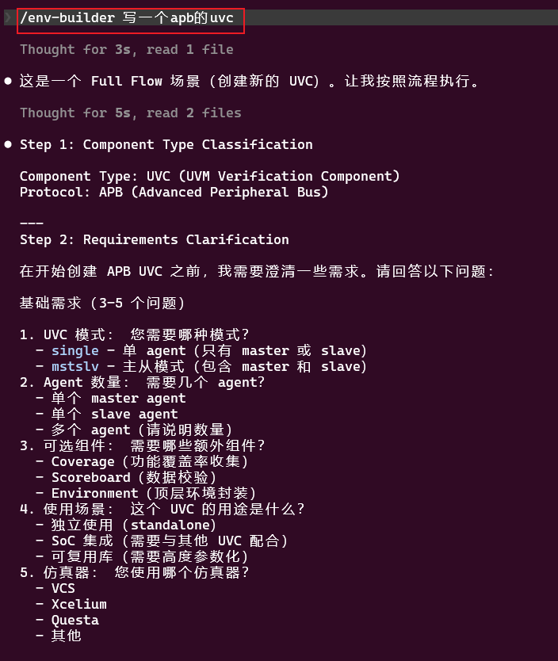

---

## 8.8 ic-verifier：一个面向 DV 的 AI Skill 技能包

env-builder 只是开始。

我的规划是开发一个完整的 **IC Verifier** 技能包，覆盖验证工程师的日常工作场景：

| Skill | 命令 | 状态 | 说明 |
| --- | --- | --- | --- |
| UVM Environment Builder | `/env-builder` | ✅ 可用 | UVC/VIP 开发全流程 |
| Testplan Manager | `/testplan` | 🔜 规划中 | 测试计划管理 |
| Coverage Closure | `/coverage` | 🔜 规划中 | 覆盖率收敛 |
| Formal Property | `/formal` | 🔜 规划中 | 形式化属性验证 |

**最终目标：** 让 AI 成为验证工程师的得力助手，而不是一个"看起来像在帮忙，实际上在添乱"的工具。

---

## 8.9 总结：AI 开发 UVC 的正确姿势

经过这一番折腾，我总结出了 AI 开发 UVC 的几个关键点：

### 8.9.1 TDD 是必须的

不要相信 AI 一次就能写对。先写测试，再写代码，让仿真工具来验证。

### 8.9.2 时序描述要结构化

用 WaveDrom 或类似的格式精确描述时序，而不是用自然语言"大概说一下"。

### 8.9.3 框架和逻辑分离

用脚本生成框架（保证结构正确），让 AI 只负责填充逻辑（发挥它的创造力）。

### 8.9.4 Guidelines 要具体

"符合 OOP 思想"这种抽象描述没用，必须写成"正确示范 vs 错误示范"的形式。

### 8.9.5 不同模型要区别对待

GPT-5.5、MIMO、DeepSeek 的表现差异很大，要根据实际情况调整策略。

---

## 8.10 项目地址

**ic-verifier：** https://github.com/HolmeXin2630/ic-verifier

欢迎安装试用：

```
npx skills add HolmeXin2630/ic-verifier -g
```

**欢迎大家使用，有任何问题和建议，欢迎在 GitHub 上提 issue！**

---

#UVM #VIP #UVC #AI #SKILL

---

# 9. 流水线 — Pipeline Driver 与 Outstanding 控制

> 来源：https://mp.weixin.qq.com/s/Cslz1CgEFaVXG7DCPgAtfg
> 作者：福尔摩芯
> update 2026/08/22 11 : 31
> **已截图**

> 上篇介绍了非流水线双向driver。本篇继续介绍pipeline driver。

---

## 9.1 目录

1. Pipeline 是什么？用 get\_next\_item 能做得到吗？
2. Pipeline + Outstanding：从简单示例到 AHB 实战
3. 关键概念与常见陷阱
4. 下篇预告

---

## 9.2 Pipeline 是什么？用 get\_next\_item 能做得到吗？

### 9.2.1 回顾：第 3 篇的非流水线模式

上篇的 AHB Driver 长这样：

task run\_phase(uvm\_phase phase);
    forever begin
        seq\_item\_port.get\_next\_item(req);
        drive\_transfer(req);                // 地址 phase + 数据 phase 串行完成
        seq\_item\_port.item\_done(req);       // 用 req 作为 response 带回
    end
endtask

一笔 transaction 的生命周期：

get\_next\_item ──→ 驱动地址 ──→ 等HREADY ──→ 驱动/采样数据 ──→ item\_done(rsp)
                                                                 │
                  ┌──────────────────────────────────────────────┘
                  ↓
           取下一条 get\_next\_item

时序上每笔占两个周期，三笔就是六个：

|  C1 |  C2 |  C3 |  C4 |  C5 |  C6 |
clk  |\_/‾\\_|\_/‾\\_|\_/‾\\_|\_/‾\\_|\_/‾\\_|\_/‾\\_|
addr |  A  |     |  B  |     |  C  |     |
data |     |  A  |     |  B  |     |  C  |

问题很明显：**Cycle 2 驱动 TX\_A 的数据时，总线的地址通道是空闲的**——完全可以同时发 TX\_B 的地址。

这就是流水线的思路——地址和数据 phase 重叠执行：

|  C1 |  C2 |  C3 |  C4 |
clk  |\_/‾\\_|\_/‾\\_|\_/‾\\_|\_/‾\\_|
addr |  A  |  B  |  C  |     |
data |     |  A  |  B  |  C  |

Cycle 2、3 里地址通道与数据通道同时有活：发 B 的地址时，A 的数据也在飞。3 笔传输只用 4 个周期，吞吐量提升了 50%。

### 9.2.2 哪些协议需要 pipeline driver

只要协议有独立的地址/数据通道，就可能需要 pipeline driver：

- **AHB**

  ：地址 phase 和数据 phase 在不同的周期，天然支持流水
- **AXI**

  ：五个独立通道，读写分离，outstanding 深度可达 16 甚至 256
- **PCIe**

  ：TLP 有独立的事务层，请求和完成分离，乱序返回是常态
- **TileLink**

  ：多通道协议，支持多级流水和乱序响应

这些协议的共同点：**请求发出去之后，响应不是立刻回来的。**

### 9.2.3 解决方案：get(req) + put(rsp)

`get_next_item` 到 `item_done` 之间，sequencer 是被锁住的——在调 `item_done()` 之前再调 `get_next_item()` 会直接死锁。要在 pipeline 中让多笔传输流动起来，必须取了 item 就立即释放 sequencer。

`get(req)` 正好满足这一点——它等价于 `get_next_item` + 立即 `item_done()`：

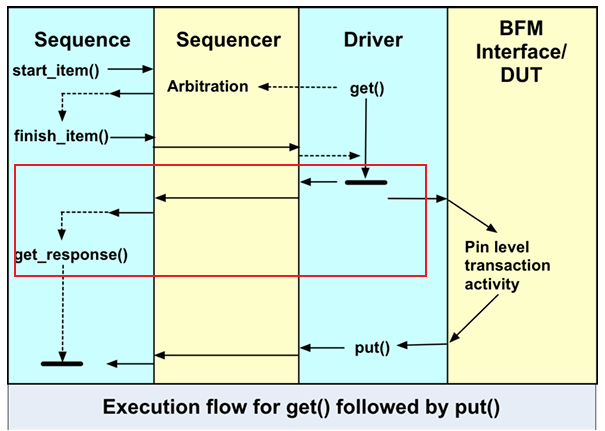

seq\_item\_port.get(req);    // get\_next\_item + 立即 item\_done()，取完就放
drive(req);                // 慢慢驱动，sequencer 已经释放了

`get()` 取到 item 后立即释放 sequencer，没有机会通过 `item_done(rsp)` 同步携带 response。如果需要回传 response，走 `put(rsp)` 异步路径：

// Driver 端
seq\_item\_port.get(req);              // 取 item + 立即释放 sequencer
// ... 进入流水线，可能经过很多个周期 ...
seq\_item\_port.put(rsp);              // 异步回传 response

// Sequence 端
start\_item(req);
finish\_item(req);                    // 立即返回（driver 已经 get 了）
get\_response(rsp);                   // 单独等 response

这正是 pipeline 需要的模式：反正 response 在取下一笔时还不存在，不如取了就放，数据阶段完成后再单独 `put(rsp)` 回传。

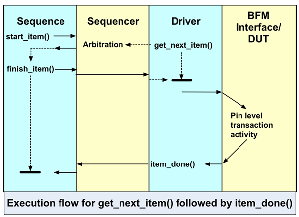

### 9.2.4 两种握手方式对比

|  | get\_next\_item + item\_done（第 2/3 篇） | get + put（本篇） |
| --- | --- | --- |
| 用法 | `get_next_item` → drive → `item_done(rsp)` | `get(req)` → clone → … → `put(rsp)` |
| sequencer 释放时机 | drive 完成后 | 取到 item 后立即 |
| response 回传 | 同步（item\_done 时一并携带） | 异步（数据阶段完成后单独 put） |
| 适用场景 | 非流水线 | **流水线** |

---

## 9.3 Pipeline + Outstanding：从简单示例到 AHB 实战

### 9.3.1 Pipeline 核心架构

用一句话概括：**`get(req)` 取完就放，clone 后入管，各级并行跑。**

sequencer ──── get(req) ────→ 取 item
       │                               │
       │                         clone = req.clone()
       │                               │
       └── 回到循环取下一笔              ├─→ 流水级 1：驱动地址 phase
                                       │        └─→ req\_mb.put(clone)
                                       │
                                       └─→ 流水级 2：驱动数据 phase
                                                └─→ put(rsp) 异步回传

三个关键动作：

- **取完就放**

  ：`get(req)` 一步完成 acquire + release，sequencer 立即可以取下一笔
- **clone 后入管**

  ：`$cast(clone, req.clone())` 保存到流水级中，原始 `req` 句柄会在下次 `get()` 时被覆盖
- **各级并行跑**

  ：`fork-join` 启动多个线程，每个线程是一个流水级，独立循环处理

### 9.3.2 简单示例：两阶段协议

先用一个极简的两阶段协议看骨架，不绑定具体总线：

class pipeline\_driver extends uvm\_driver #(my\_transaction);
    `uvm\_component\_utils(pipeline\_driver)

    virtual my\_if vif;
    mailbox #(my\_transaction) pipe\_mb = new(1);  // 容量 1：单级流水

    task run\_phase(uvm\_phase phase);
        fork
            get\_and\_drive();   // 取 item + 地址阶段
            data\_phase();      // 数据阶段
        join
    endtask

    // ---- 线程 1：取 item + 地址阶段 ----
    task get\_and\_drive();
        my\_transaction clone;
        forever begin
            seq\_item\_port.get(req);            // get() = get\_next\_item + 立即 item\_done
            $cast(clone, req.clone());         // clone：避免句柄覆盖

            // 驱动地址
            @(posedge vif.clk);
            vif.addr  <= clone.addr;
            vif.cmd   <= clone.cmd;
            vif.valid <= 1'b1;
            @(posedge vif.clk iff vif.ready);
            vif.valid <= 1'b0;

            // 地址阶段结束，传给数据阶段
            pipe\_mb.put(clone);
            // 不等数据阶段，立刻进入下一次 get()
        end
    endtask

    // ---- 线程 2：数据阶段 + 回传 response ----
    task data\_phase();
        my\_transaction tr, rsp;
        forever begin
            pipe\_mb.get(tr);                   // 阻塞等到有 item

            if (tr.cmd == WRITE) begin
                @(posedge vif.clk);
                vif.wdata <= tr.wdata;
                @(posedge vif.clk iff vif.wready);
            end else begin
                @(posedge vif.clk iff vif.rvalid);
                tr.rdata = vif.rdata;
            end

            // 异步回传 response
            $cast(rsp, tr.clone());
            rsp.set\_id\_info(tr);               // 绑定 ID
            seq\_item\_port.put(rsp);            // 异步回传
        end
    endtask
endclass

`pipe_mb = new(1)` 容量为 1——地址线程放入第二笔时，如果数据线程还没取走第一笔，地址线程会阻塞。天然建模**单级流水**：地址最多领先数据一拍。

时序：

| C1   | C2   | C3   | C4   |
get\_and\_drive   | addrA| addrB| addrC|      |
data\_phase      |      | dataA| dataB| dataC|
----------------+------+------+------+------+
bus addr        | A    | B    | C    |      |
bus data        |      | A    | B    | C    |

Cycle 2 起，`get_and_drive` 在发下一笔地址，`data_phase` 同时处理上一笔数据——线程并行、通道重叠，这就是 pipeline。

### 9.3.3 AHB 实战：改造第 3 篇的 Driver

有了上面的骨架，现在把第 3 篇的 AHB Driver 改造成流水线版本。

改造前先在第 3 篇的 `ahb_transaction` 中新增一个 `id` 字段。下篇做乱序匹配时 `id` 是核心查找键——现在加上，后续不用再改 transaction 定义。

#### 9.3.3.1 双线程架构

第 3 篇把地址和数据塞在同一个 `drive_transfer()` 里。改造的核心思路：拆成两个线程。

线程 1 (get\_and\_drive)         线程 2 (drive\_transfers)
        │                                  │
   get(req)                                │
        │                                  │
   clone(req)                              │
        │                                  │
   outstanding\_cnt++                       │
        │                                  │
   驱动地址 phase                           │
        │                                  │
   req\_mb.put(clone) ────→ req\_mb.get(tr) ─┤
                                           │
                                     驱动数据 phase
                                           │
                                     put(rsp) 异步回传
                                           │
                                     outstanding\_cnt--

class ahb\_pipeline\_driver extends uvm\_driver #(ahb\_transaction);
    `uvm\_component\_utils(ahb\_pipeline\_driver)

    virtual ahb\_if vif;
    ahb\_config       cfg;

    // 流水级间传递
    mailbox #(ahb\_transaction) req\_mb = new();

    // outstanding 控制
    int unsigned outstanding\_cnt = 0;

    function new(string name, uvm\_component parent);
        super.new(name, parent);
    endfunction

    function void build\_phase(uvm\_phase phase);
        super.build\_phase(phase);
        if (!uvm\_config\_db #(ahb\_config)::get(this, "", "cfg", cfg))
            `uvm\_fatal("DRV", "Failed to get config")
        if (!uvm\_config\_db #(virtual ahb\_if)::get(this, "", "vif", vif))
            `uvm\_fatal("DRV", "Failed to get vif")
    endfunction

    task run\_phase(uvm\_phase phase);
        fork
            get\_and\_drive();
            drive\_transfers();
        join
    endtask

    //----------------------------------------------
    // 线程 1：取 item + 驱动地址 phase
    //----------------------------------------------
    task get\_and\_drive();
        ahb\_transaction clone;
        forever begin
            wait(outstanding\_cnt < cfg.max\_outstanding);  // outstanding 控制

            seq\_item\_port.get(req);               // get()：取完立即释放 sequencer
            $cast(clone, req.clone());
            outstanding\_cnt++;

            // ---- 驱动地址 phase ----
            @(posedge vif.HCLK);
            vif.HADDR  <= clone.addr;
            vif.HTRANS <= clone.trans;
            vif.HWRITE <= clone.write;
            vif.HSIZE  <= clone.size;
            vif.HBURST <= clone.burst;

            while (!vif.HREADY) @(posedge vif.HCLK);

            req\_mb.put(clone);
        end
    endtask

    //----------------------------------------------
    // 线程 2：驱动数据 phase + 回传 response
    //----------------------------------------------
    task drive\_transfers();
        ahb\_transaction tr, rsp;
        forever begin
            req\_mb.get(tr);

            // ---- 驱动数据 phase ----
            // 写操作：驱动 HWDATA，等待 HREADY
            if (tr.write) begin
                @(posedge vif.HCLK);
                vif.HWDATA <= tr.data;
                while (!vif.HREADY) @(posedge vif.HCLK);
            end
            // 读操作：等待 HREADY，采样 HRDATA
            else begin
                @(posedge vif.HCLK);
                while (!vif.HREADY) @(posedge vif.HCLK);
                tr.data = vif.HRDATA;
            end

            // ---- 异步回传 response ----
            // 顺序响应场景：数据 phase 完成后直接回传
            // 乱序响应场景见下篇：放入 pending\_q，由 collect\_rsp 按 ID 匹配
            $cast(rsp, tr.clone());
            rsp.set\_id\_info(tr);
            seq\_item\_port.put(rsp);

            outstanding\_cnt--;
        end
    endtask

endclass

#### 9.3.3.2 Outstanding 深度控制

双线程跑起来之后，`get_and_drive` 发地址的速度可能远快于 `drive_transfers` 处理数据的速度。如果不加限制：

get\_and\_drive               req\_mb               DUT
       │                       (无限)                │
       ├─ get+clone ──→ put ──→ [T1,T2,...,T100]    │
       ├─ get+clone ──→ put ──→ 100个排队            │
       ├─ ...                                        │
       │                                             │
       │                     但DUT只能处理4笔 ────→ 缓冲区溢出！

所以需要 **Outstanding 控制**——限制"已发出但未收到响应"的事务数量。

上面代码用的是**计数器控制**，覆盖从"发出请求"到"收到响应"的完整生命周期。另一种方式是 mailbox 容量控制（`new(4)` 限制排队数），但只能管"排队等处理"的数量，管不到"已发出未响应"的数量——语义不如计数器精确。

#### 9.3.3.3 可配置深度

通过 config object 让 outstanding 深度可配置：

class ahb\_config extends uvm\_object;
    `uvm\_object\_utils(ahb\_config)

    virtual ahb\_if             vif;
    uvm\_active\_passive\_enum    is\_active = UVM\_ACTIVE;
    int unsigned               max\_outstanding = 4;   // ⬅ 新增

    function new(string name = "ahb\_config");
        super.new(name);
    endfunction
endclass

- `max_outstanding = 1`

  ：退化为串行，验证非流水线场景仍然正确
- `max_outstanding = 4`

  ：正常流水线测试
- `max_outstanding = 16`

  ：深度压测，验证 DUT 在极限 in-flight 下的表现

#### 9.3.3.4 验证 sequence

class ahb\_pipeline\_stress\_seq extends uvm\_sequence #(ahb\_transaction);
    `uvm\_object\_utils(ahb\_pipeline\_stress\_seq)

    int num\_txns = 20;

    function new(string name = "ahb\_pipeline\_stress\_seq");
        super.new(name);
    endfunction

    task body();
        ahb\_transaction req, rsp;

        // 用 fork...join\_none 并发发送请求，批量等待响应
        fork
            // 发送线程：连续发请求，不等响应
            repeat (num\_txns) begin
                req = ahb\_transaction::type\_id::create("req");
                start\_item(req);
                assert(req.randomize() with {
                    id inside {[0:3]};
                });
                finish\_item(req);         // 立即返回（driver 用了 get()，sequencer 已释放）
            end
        
            // 接收线程：批量等待响应
            repeat (num\_txns) begin
                get\_response(rsp);        // 单独等 response
                `uvm\_info("SEQ", $sformatf("Got rsp: id=%0d, addr=0x%0h, data=0x%0h",
                    rsp.id, rsp.addr, rsp.data), UVM\_MEDIUM)
            end
        join
    endtask
endclass

关键点：

- **`fork...join_none`**

  ：立即返回，两个线程在后台并行执行
- **`wait fork`**

  ：等待所有派生的线程完成

这样发送线程可以连续发请求，接收线程同时等待响应，driver 端才能真正 pipeline 起来——多个请求 in-flight。

> **注意**
>
> ：不能用 `fork...join`——它会阻塞直到两个线程都完成。如果发送线程因 outstanding 限制阻塞，而接收线程还没开始处理响应，会导致死锁。

注意区别：

- **第 3 篇**

  ：`finish_item(req)` 阻塞到 driver 的 `item_done(req)`，response 附在 req 上
- **本篇**

  ：`finish_item(req)` 立即返回（`get(req)` 内部已完成握手），`get_response(rsp)` 单独阻塞等 `put(rsp)`

#### 9.3.3.5 关于 pending\_q[$] 的设计选择

你可能注意到，顺序响应场景中并没有用到 `pending_q`——数据 phase 完成后直接回传 response。

为什么还要声明 `pending_q[$]`？因为下篇要做乱序响应匹配。到那时，`drive_transfers` 不再直接回传 response，而是把事务放入 `pending_q`，由专门的 `collect_rsp` 线程按 ID 匹配响应。

`pending_q[$]` 相比 mailbox 的优势：可以 `foreach` 遍历、按条件查找、从中间 `delete`——这些 mailbox 的 FIFO `get()` 做不到。

现在先理解顺序响应的流程，下篇再看 `pending_q` 如何在乱序场景中发挥作用。

---

## 9.4 关键概念与常见陷阱

### 9.4.1 为什么必须 clone

`req` 是 sequencer 内部的一个句柄。每次 `get(req)` 返回时，sequencer 会把 `req` 指向下一个可用的 transaction。如果不 clone 就直接放进 mailbox：

❌ 不 clone（Bug 场景）：

  Iter 1                        Iter 2
    │                             │
  get(req) → req → TX\_A        get(req) → req → TX\_B
                   │                          │
             mailbox.put(req)           req 被覆盖!
                   │                          │
             存的是引用 ──────────────→ mailbox里也变成TX\_B!

**clone 创建独立副本**，后续对 `req` 的覆盖不影响副本。

✅ 正确 clone：

  Iter 1                        Iter 2
    │                             │
  get(req) → req → TX\_A        get(req) → req → TX\_B
                   │                          │
             clone=req.clone()           req 被覆盖
                   │                          │
             clone→TX\_A(独立副本)        但clone不受影响
                   │
             mailbox.put(clone) → TX\_A 保持不变

### 9.4.2 set\_id\_info 为什么是必需的

`set_id_info(original_req)` 把原始请求上的 `sequence_id` 和 `transaction_id` 拷贝到 response 上。

一个 sequencer 上可能同时跑着多个 sequence：

┌─────────────────────────────────────┐
                 │            Sequencer                 │
                 │  ┌──────────────┐  ┌──────────────┐ │
                 │  │    seq\_A     │  │    seq\_B     │ │
                 │  │ req\_1, req\_2 │  │ req\_3, req\_4 │ │
                 │  └──────────────┘  └──────────────┘ │
                 └─────────────────────────────────────┘
                                   │
                           put(rsp) 回传
                                   │
                 ┌─────────────────┴─────────────────┐
                 │                                   │
           这个response给seq\_A?              还是给seq\_B?
                 │                                   │
                 └─────────────────┬─────────────────┘
                                   │
                           靠rsp上的ID判断!

- **`item_done(rsp)`**

  ：不需要手动 `set_id_info`——在 `get_next_item` 上下文中调用，sequencer 隐式知道是谁的请求
- **`put(rsp)`**

  ：**必须**手动 `set_id_info`——已脱离上下文，sequencer 没有隐式信息。漏了这一步，sequence 端 `get_response()` 永远阻塞

✅ 有 set\_id\_info：
  driver put(rsp) ──→ rsp 携带 sequence\_id + transaction\_id
                            │
                            ↓
                   sequencer 根据 ID 路由
                            │
                    ┌───────┴───────┐
                    ↓               ↓
                  seq\_A           seq\_B
                    │               │
              get\_response()  get\_response()
                    ↓               ↓
                   收到 ✅          收到 ✅

❌ 没有 set\_id\_info：
  driver put(rsp) ──→ rsp 没有 ID 信息
                            │
                            ↓
                   sequencer 不知道路由给谁
                            │
                            ↓
                   get\_response() 永久阻塞 ❌

### 9.4.3 mailbox vs queue

Pipeline 需要在线程间传递 transaction。两种选择：

| 特性 | `mailbox` | `queue` (`[$]`) |
| --- | --- | --- |
| 空时读取 | `get()` 自动阻塞 | 需手动 `wait(q.size()>0)` |
| 满时写入 | `put()` 自动阻塞（设容量时） | 永远成功，无限增长 |
| 访问方式 | 只能 FIFO | 可随机访问、遍历、从中间删除 |

选择原则：**顺序传递用 mailbox，需要按条件搜索/乱序匹配用 queue。**

本章的流水级间传递用 mailbox（FIFO 足够），但响应收集用 `pending_q[$]`（为下篇乱序做准备）。

### 9.4.4 pipeline vs burst

两个容易混淆的概念：

| 概念 | 层面 | 含义 |
| --- | --- | --- |
| **Pipeline** | Driver 架构 | 地址/数据 phase 重叠执行 |
| **Burst** | 协议定义 | HBURST 编码决定传输类型（SINGLE/INCR/WRAP） |

二者不同但相关：**burst 传输天然需要 pipeline driver 来驱动**——一个 INCR4 突发有 4 个数据拍，如果不流水，4 拍的突发就退化成了 4 笔单拍串行。

### 9.4.5 线程安全

`pending_q` 和 `outstanding_cnt` 被多个线程访问，但在 SystemVerilog 中这不是问题——SV 使用协同调度（cooperative scheduling），线程只在 `@(posedge clk)` 等事件控制处挂起。同一 delta cycle 内不存在真正的并发访问，没有竞态条件，无需加锁。

### 9.4.6 常见陷阱速查

| 陷阱 | 症状 | 修复 |
| --- | --- | --- |
| 不 clone | 多笔 transaction 数据相同或错乱 | `$cast(clone, req.clone())` |
| 不用 `get()` 而用 `get_next_item` + 延迟 `item_done()` | sequencer 被锁，pipeline 退化串行 | 用 `get(req)` 替代 `get_next_item` + 延迟 `item_done()` |
| `put(rsp)` 缺 `set_id_info` | sequence 端 `get_response` 永远阻塞 | `rsp.set_id_info(original_req)` |

---

## 9.5 下篇预告

本篇的 `drive_transfers` 假设响应按 FIFO 顺序回来——数据 phase 完成后直接回传 response。

但在多 ID 协议中，这个假设不总是成立。

这时候按顺序处理就不行了——需要在 `pending_q` 中按 ID 匹配。

下一篇将引入 `foreach` 遍历按 ID 匹配来处理乱序响应，同时把双线程扩展为三线程（独立的 `collect_rsp` 线程）。

---

> **下一篇：乱序 — 响应乱序处理与完整 Driver**

#UVM #VIP开发

[响应 — AHB 读写与 Bidirectional Driver](https://mp.weixin.qq.com/s?__biz=Mzk3NTg3ODUyNg==&mid=2247483857&idx=1&sn=462e5bfa8c244a08eea791b7caea0942&scene=21#wechat_redirect)

[握手 — 让 APB Master VIP 动起来](https://mp.weixin.qq.com/s?__biz=Mzk3NTg3ODUyNg==&mid=2247483850&idx=1&sn=255d760a88d96e00f54befe6fbc8b1ec&scene=21#wechat_redirect)

[骨架 — 从 APB Monitor 看懂 UVC 架构](https://mp.weixin.qq.com/s?__biz=Mzk3NTg3ODUyNg==&mid=2247483846&idx=1&sn=aac68824b303db40dcf4882494d8faff&scene=21#wechat_redirect)

---

# 10. 乱序 — 响应乱序处理与完整 Driver

> 来源：https://mp.weixin.qq.com/s/MrhfFlTGbW9MJBf0HN7deA
> 作者：福尔摩芯
> update 2026/08/22 11 : 31
> **已截图**

> 上篇实现了 Pipeline Driver，假设响应按 FIFO 顺序返回。真实协议中还有另一种响应模式：乱序返回。实现上只需在 pipeline 基础加上 ID 匹配。

---

## 10.1 目录

1. 响应的三种模式

2. 乱序响应匹配机制

3. 完整实例：五线程 Pipeline Driver

4. 常见陷阱

---

## 10.2 响应的三种模式

### 10.2.1 从 Pipeline 到 Out-of-Order

上篇的 pipeline driver 解决了吞吐量问题——地址和数据 phase 重叠执行，多笔传输并行流动。但有一个隐含假设：**响应按发出顺序返回。**

真实协议中，响应模式有三种：

| 模式 | 特征 | 典型协议 |
| --- | --- | --- |
| 顺序响应 | 响应严格按发出顺序返回 | 经典 AHB、APB |
| 乱序响应 | 不同 ID 可乱序，同 ID 保序 | AXI、PCIe、AHB with ID |
| 无响应 | 只发请求，不关心响应 | 某些写操作为主的场景 |

顺序响应用 `pending_q.pop_front()` 就够了。乱序响应需要按 ID 匹配——这是本篇要解决的问题。

### 10.2.2 乱序响应的特性

多 ID 协议中，不同 ID 的请求可能走不同内部路径，延迟不同，后发的可能先回来：

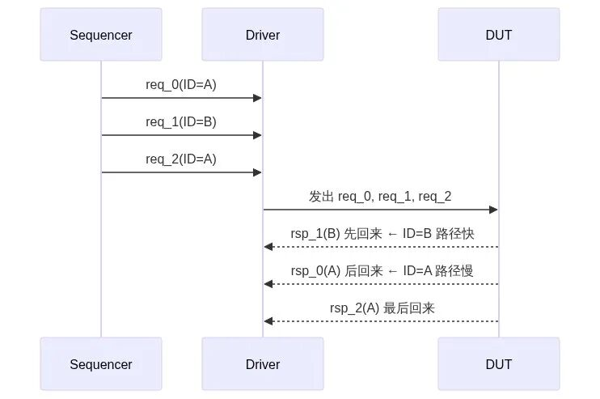

关键规则：**相同 ID 的事务必须保序，不同 ID 可以乱序。**

• ✅ 合法：rsp\_1(B) → rsp\_0(A) → rsp\_2(A)

• ❌ 非法：rsp\_2(A) → rsp\_0(A) — 同 ID 必须保序

### 10.2.3 实现思路：在 Pipeline 上加 ID 匹配

Pipeline driver 的架构不变——三个线程、mailbox 传递、outstanding 控制。唯一的改动在响应收集端：

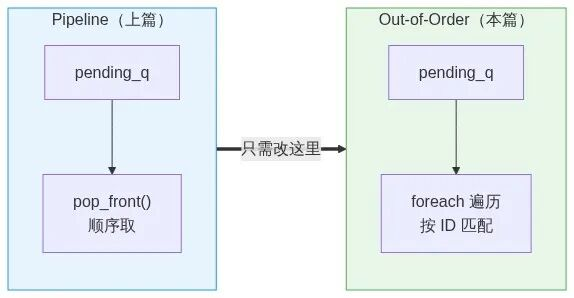

---

## 10.3 乱序响应匹配机制

### 10.3.1 为什么 foreach 从头扫描天然满足保序

`foreach` 从索引 0 开始扫描，找到第一个 ID 匹配的就 break。

假设队列里有两笔同 ID=A 的事务：req\_0(A) 在 index 0，req\_2(A) 在 index 2。

当 ID=A 的第一个响应到来时，`foreach` 从头扫，命中 index 0 的 req\_0——正好是最先发出的那笔。**FIFO 顺序自然保持。**

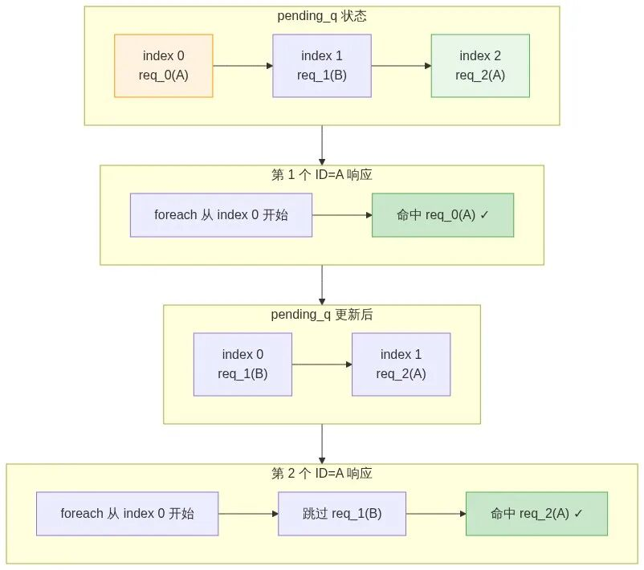

### 10.3.2 匹配后的处理流程

找到匹配项后，五步处理：

1. 填入 VIF 上采样的响应数据

2. `clone()` 创建独立副本

3. `set_id_info()` 携带 sequence 路由信息

4. `put(rsp)` 回传给 sequencer

5. `delete(i)` 从队列中移除，`outstanding_cnt--`

foreach (pending\_q[i]) begin
    if (pending\_q[i].id == vif.rsp\_id) begin
        // 1. 填入响应数据
        pending\_q[i].rdata  = vif.rdata;
        pending\_q[i].status = vif.rsp\_status;

        // 2-4. clone + set\_id\_info + put
        $cast(rsp, pending\_q[i].clone());
        rsp.set\_id\_info(pending\_q[i]);
        seq\_item\_port.put(rsp);

        // 5. 清理
        pending\_q.delete(i);
        outstanding\_cnt--;
        break;
    end
end

### 10.3.3 防御：匹配失败

如果 `foreach` 走完都没找到匹配项，说明收到了一个"凭空出现"的响应 ID——通常是 DUT bug 或 VIP 的 ID 管理有误：

if (found == -1)
    `uvm\_fatal("OOO\_DRV", $sformatf(
        "No pending request for response ID=%0d", vif.rsp\_id))

`uvm_fatal` 而非 `uvm_error`——继续运行没有意义，数据已经不可信。

---

## 10.4 完整实例：五线程 Pipeline Driver

### 10.4.1 架构总览

把 Pipeline + Outstanding + OOO 三大技术整合成一个完整的 driver。以类 AXI 协议为背景——读响应走 R 通道（`rvalid`/`rid`/`rdata`/`rresp`），写响应走 B 通道（`bvalid`/`bid`/`bresp`），两组独立信号，需要分别收集。

五个并行线程各管一段：

1. **get\_and\_drive**：取 item、控制 outstanding、`get()` 立即释放

2. **drive\_addr**：驱动地址阶段，完成后交给 `data_mb`

3. **drive\_data**：写操作驱动数据；读写都在本阶段结束后进入 `pending_q`

4. **collect\_read\_rsp**：监听 R 通道，按 `rid` + `cmd==READ` 匹配 `pending_q`，填入 `rdata`

5. **collect\_write\_rsp**：监听 B 通道，按 `bid` + `cmd==WRITE` 匹配 `pending_q`，填入 `bresp`

`outstanding_cnt` 的作用：控制"已发出但未响应"的事务数量。线程 1 发出请求时 `++`，线程 4/5 收到响应时 `--`。当计数达到 `max_outstanding` 时，线程 1 阻塞等待，防止发太快撑爆 DUT 或 VIP 内部缓冲。

> **为什么读写响应要分开？**
>
> AXI 的读响应（R 通道）和写响应（B 通道）是独立的，可能同时到达。用一个线程收集会丢掉另一个通道的响应。拆成两个线程各监听一个通道，互不干扰。

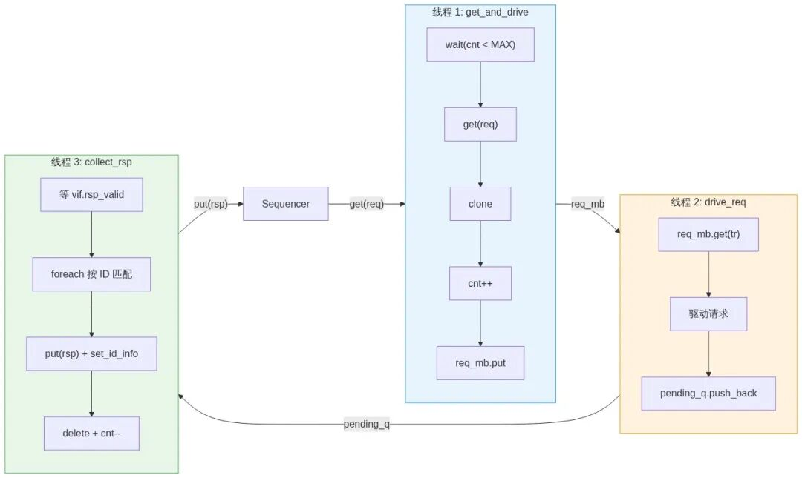

### 10.4.2 完整 Driver 代码

class full\_pipeline\_driver extends uvm\_driver #(my\_transaction);
`uvm\_component\_utils(full\_pipeline\_driver)

virtual my\_if vif;
  my\_config     cfg;

// 流水级间传递
mailbox #(my\_transaction) req\_mb  = new();    // get → 地址阶段
mailbox #(my\_transaction) data\_mb = new(1);   // 地址 → 数据：容量 1，单级流水

// in-flight 事务队列（读写共用，匹配时同时检查 id 和 cmd）
  my\_transaction pending\_q[$];

// outstanding 控制
int unsigned outstanding\_cnt = 0;

function new(string name, uvm\_component parent);
    super.new(name, parent);
endfunction

function void build\_phase(uvm\_phase phase);
    super.build\_phase(phase);
    if (!uvm\_config\_db #(my\_config)::get(this, "", "cfg", cfg))
      `uvm\_fatal("CFG", "Failed to get config")
endfunction

task run\_phase(uvm\_phase phase);
    fork
      get\_and\_drive();
      drive\_addr();
      drive\_data();
      collect\_read\_rsp();
      collect\_write\_rsp();
    join
endtask

//----------------------------------------------
// 线程 1：从 sequencer 取 item，控制 outstanding
//----------------------------------------------
task get\_and\_drive();
    my\_transaction clone;
    forever begin
      wait(outstanding\_cnt < cfg.max\_outstanding);
      seq\_item\_port.get(req);             // get：取到即释放
      $cast(clone, req.clone());
      outstanding\_cnt++;
      req\_mb.put(clone);
    end
endtask

//----------------------------------------------
// 线程 2：驱动地址阶段
//----------------------------------------------
task drive\_addr();
    my\_transaction tr;
    forever begin
      req\_mb.get(tr);

      @(posedge vif.clk);
      vif.arvalid <= 1'b1;
      vif.araddr  <= tr.addr;
      vif.arid    <= tr.id;
      vif.arlen   <= tr.len;

      @(posedge vif.clk iff vif.arready);
      vif.arvalid <= 1'b0;

      // 地址阶段结束，交给数据阶段；本线程可立刻处理下一笔地址
      data\_mb.put(tr);
    end
endtask

//----------------------------------------------
// 线程 3：驱动数据阶段（写走 W 通道），再进入 pending
//----------------------------------------------
task drive\_data();
    my\_transaction tr;
    forever begin
      data\_mb.get(tr);

      if (tr.cmd == WRITE) begin
        @(posedge vif.clk);
        vif.wvalid <= 1'b1;
        vif.wdata  <= tr.wdata;
        vif.wstrb  <= tr.wstrb;
        @(posedge vif.clk iff vif.wready);
        vif.wvalid <= 1'b0;
      end
      // 读：不在这里等 rdata——响应可能乱序，由 collect\_read\_rsp 按 ID 匹配

      // 请求侧已完成，放入 pending 等待响应
      pending\_q.push\_back(tr);
    end
endtask

//----------------------------------------------
// 线程 4：收集读响应（R 通道），乱序匹配
//----------------------------------------------
task collect\_read\_rsp();
    forever begin
      @(posedge vif.clk iff vif.rvalid);

      begin
        int found = -1;
        foreach (pending\_q[i]) begin
          if (pending\_q[i].id == vif.rid && pending\_q[i].cmd == READ) begin
            found = i;
            break;
          end
        end

        if (found == -1)
          `uvm\_fatal("FULL\_DRV", $sformatf("Unexpected R response, ID=%0d", vif.rid))

        // 填入读响应数据
        pending\_q[found].rdata = vif.rdata;
        pending\_q[found].rresp = vif.rresp;

        // 回传给 sequence
        begin
          my\_transaction rsp;
          $cast(rsp, pending\_q[found].clone());
          rsp.set\_id\_info(pending\_q[found]);
          seq\_item\_port.put(rsp);
        end

        // 清理
        pending\_q.delete(found);
        outstanding\_cnt--;
      end
    end
endtask

//----------------------------------------------
// 线程 5：收集写响应（B 通道），乱序匹配
//----------------------------------------------
task collect\_write\_rsp();
    forever begin
      @(posedge vif.clk iff vif.bvalid);

      begin
        int found = -1;
        foreach (pending\_q[i]) begin
          if (pending\_q[i].id == vif.bid && pending\_q[i].cmd == WRITE) begin
            found = i;
            break;
          end
        end

        if (found == -1)
          `uvm\_fatal("FULL\_DRV", $sformatf("Unexpected B response, ID=%0d", vif.bid))

        // 填入写响应
        pending\_q[found].bresp = vif.bresp;

        // 回传给 sequence
        begin
          my\_transaction rsp;
          $cast(rsp, pending\_q[found].clone());
          rsp.set\_id\_info(pending\_q[found]);
          seq\_item\_port.put(rsp);
        end

        // 清理
        pending\_q.delete(found);
        outstanding\_cnt--;
      end
    end
endtask

endclass

### 10.4.3 对应的 Sequence 写法

class ooo\_sequence extends uvm\_sequence #(my\_transaction);
`uvm\_object\_utils(ooo\_sequence)

int num\_txns = 20;

function new(string name = "ooo\_sequence");
    super.new(name);
endfunction

task body();
    my\_transaction req, rsp;

    // 并发发出所有请求
    fork
      repeat (num\_txns) begin
        req = my\_transaction::type\_id::create("req");
        start\_item(req);
        if (!req.randomize() with {
          id inside {[0:3]};
        })
          `uvm\_fatal("RAND", "Randomization failed")
        finish\_item(req);
      end
    join\_none

    // 批量等待响应
    repeat (num\_txns) begin
      get\_response(rsp);
      `uvm\_info("SEQ", $sformatf("Response: id=%0d, addr=0x%0h, rdata=0x%0h, bresp=%0d",
                                  rsp.id, rsp.addr, rsp.rdata, rsp.bresp), UVM\_MEDIUM)
    end
endtask
endclass

关键点：

• **`fork...join_none`**：立即返回，发送线程在后台并发发出请求

• **`get_response` 在主流程中顺序执行**：不在 fork 内部，而是等所有请求发出后再逐个等待响应

发送线程并发发出请求，`get_response` 在主流程中阻塞等待每个响应回来。driver 端才能真正 pipeline 起来——多个请求 in-flight，响应乱序回来时按 ID 匹配。

> **注意**
>
> ：不能把发送和接收都放在 `fork...join` 中——它会阻塞直到两个线程都完成。如果发送线程因 outstanding 限制阻塞，而接收线程还没开始处理响应，会导致死锁。

---

## 10.5 常见陷阱

### 10.5.1 收到预期外的响应 ID

`foreach` 走完没找到匹配项，`uvm_fatal` 触发。

排查方向：

• DUT 发回了一个 VIP 没有记录的 ID → DUT bug 或 VIP 的 ID 字段映射错误

• 同一笔 transaction 被响应了两次 → DUT bug

• `pending_q.delete(i)` 后没 break，继续遍历 → 逻辑错误

### 10.5.2 同 ID 多笔 outstanding 的保序

`foreach` 从头扫描，匹配最早的那笔——天然满足 FIFO 保序。但如果你的协议**不要求**同 ID 保序（某些自定义协议），这个策略就需要调整：可能需要按其他优先级匹配。

### 10.5.3 outstanding\_cnt 的线程安全

`outstanding_cnt` 被线程 1（++）和线程 4/5（--）同时访问。在 SystemVerilog 的协同调度模型下，这没有问题——线程只在 `@(posedge clk)` 等事件控制处挂起，同一 delta cycle 内不存在真正的并发。

### 10.5.4 pending\_q 只按 ID 匹配的隐患

AXI 读写通道的 ID 独立编号，同一 ID 可能同时出现在读和写上。如果 `pending_q` 只按 ID 匹配（不区分 cmd），读响应可能误匹配到写事务。本篇的代码同时匹配 `id` + `cmd`（`collect_read_rsp` 匹配 `id==rid && cmd==READ`，`collect_write_rsp` 匹配 `id==bid && cmd==WRITE`），避免了这个问题。

### 10.5.5 fork-join\_none 泄漏

实际开发中常见一个坑：每次循环都 `fork` 新线程但不回收，仿真越跑越慢最终挂掉。正确做法是用 `fork-join` 管理线程生命周期，或者用 mailbox + forever 循环代替反复 fork。

---

> **下一篇：换位 — 从 Master 到 AHB Slave VIP**

#UVM #VIP开发

[流水线 — Pipeline Driver 与 Outstanding 控制](https://mp.weixin.qq.com/s?__biz=Mzk3NTg3ODUyNg==&mid=2247483949&idx=1&sn=204ab4c85aed94570444b07a572800d4&scene=21#wechat_redirect)

[响应 — AHB 读写与 Bidirectional Driver](https://mp.weixin.qq.com/s?__biz=Mzk3NTg3ODUyNg==&mid=2247483857&idx=1&sn=462e5bfa8c244a08eea791b7caea0942&scene=21#wechat_redirect)

[握手 — 让 APB Master VIP 动起来](https://mp.weixin.qq.com/s?__biz=Mzk3NTg3ODUyNg==&mid=2247483850&idx=1&sn=255d760a88d96e00f54befe6fbc8b1ec&scene=21#wechat_redirect)

[骨架 — 从 APB Monitor 看懂 UVC 架构](https://mp.weixin.qq.com/s?__biz=Mzk3NTg3ODUyNg==&mid=2247483846&idx=1&sn=aac68824b303db40dcf4882494d8faff&scene=21#wechat_redirect)

---

# 11. 换位 — 从 Master 到 Slave VIP

> 来源：https://mp.weixin.qq.com/s/_OI8vzlIC3KZypVQa_Bwxg
> 作者：福尔摩芯
> update 2026/08/22 11 : 32
> **已截图**

> 前五篇站在 bus master 视角。本篇换到另一边：Slave VIP 不主动发请求，它看见请求后按可配置策略给出响应。

---

## 11.1 Slave 模型解决什么问题

在 master 模式下，sequence 产生读写请求，driver 驱动 pin-level 请求。

Slave VIP 刚好相反：**请求来自 DUT，VIP 的职责是在合适的时刻返回响应。** 这种由接口事件触发的 transactor，在 UVM Cookbook 中称为 **responder**。

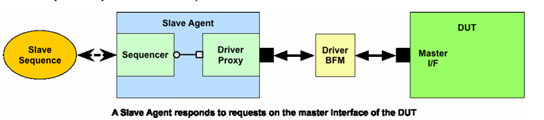

| 场景 | DUT 的角色 | Slave VIP 需要做什么 |
| --- | --- | --- |
| APB peripheral 验证 | APB Master | 返回 `PREADY`、`PRDATA`、`PSLVERR` |
| AXI interconnect 验证 | AXI Master | 接收 AR/AW/W，按规则返回 R/B |
| DMA 验证 | Memory Master | 充当 memory model |

**sequence 决定"回什么"，driver 决定"什么时候、怎样在引脚上回"。**

### 11.1.1 核心特点

• Responder 可以用多种方式实现

• 简单的总线 oriented responder 可以作为 `uvm_component` 实现，与 slave 接口交互，根据 bus master 的请求读写内存

• 复杂slave通常**使用 slave sequence：slave 的响应方式可以轻松改变**

### 11.1.2 为什么 Responder 是长生命周期 sequence？

Master sequence 可以决定"何时发下一笔"；但 slave 无法预知下一笔请求何时到来。

因此 responder sequence 往往是一个 **长生命周期 sequence**：reset 后启动，持续循环，直到仿真结束。它在 `forever` 循环中不断等待请求、生成响应，而不是像 master sequence 那样每笔交易都重新启动。

---

## 11.2 Cookbook 的 Responder 范式

Cookbook 把 slave sequence 的完整循环描述为四步：

1. sequence 交给 driver 一个空 request item

2. driver 检测到 master request，填充该 item

3. sequence 根据请求准备 response item

4. driver 用 response item 完成总线时序

### 11.2.1 单 item 模式

同一种 item 描述请求和响应。请求侧字段不随机；响应侧字段可随机。

class apb\_slave\_item extends uvm\_sequence\_item;
  `uvm\_object\_utils(apb\_slave\_item)

  // Master -> slave
  logic [31:0] addr;
  logic [31:0] wdata;
  bit          write;

  // Slave -> master
  rand logic [31:0] rdata;
  rand bit          slverr;
  rand int unsigned delay;

  constraint c\_delay { delay inside {[0:2]}; }
  constraint c\_err   { slverr dist {0 := 95, 1 := 5}; }
endclass

最小 memory responder：

class apb\_mem\_responder\_seq extends uvm\_sequence #(apb\_slave\_item);
  `uvm\_object\_utils(apb\_mem\_responder\_seq)

  logic [31:0] memory [logic [31:0]];

  task body();
    apb\_slave\_item req;
    apb\_slave\_item rsp;

    forever begin
      req = apb\_slave\_item::type\_id::create(\"req\");
      start\_item(req);
      finish\_item(req);

      rsp = apb\_slave\_item::type\_id::create(\"rsp\");
      rsp.copy(req);
      if (req.write)
        memory[req.addr] = req.wdata;

      assert (rsp.randomize() with {
        if (!req.write) rdata == memory[req.addr];
      });

      start\_item(rsp);
      finish\_item(rsp);
    end
  endtask
endclass

driver 节奏：

先取 `req` 采样 setup phase，`item_done()`；

再取 `rsp` 完成 access phase，第二次 `item_done()`。

task apb\_slave\_driver::run\_phase(uvm\_phase phase);
  apb\_slave\_item req;
  apb\_slave\_item rsp;

  vif.drive\_idle();
  forever begin
    seq\_item\_port.get\_next\_item(req);
    wait\_for\_and\_sample\_setup(req);
    seq\_item\_port.item\_done();

    seq\_item\_port.get\_next\_item(rsp);
    drive\_access\_response(rsp);
    seq\_item\_port.item\_done();
  end
endtask

### 11.2.2 多 item 模式

将"收到什么"和"要回什么"拆成不同 item，类型本身表达协议契约。具体实现可参照 *UVM Cookbook* p.227-229 的 APB 多 item 示例。

---

## 11.3 两类观察

slave 有两类完全不同的观察需求：

| 观察目的 | 需要的信息 | 最合适的归属 |
| --- | --- | --- |
| 为了产生响应 | 当前请求的地址、方向、写数据 | driver 或专用 request collector |
| 为了验证 | 完整 transaction、协议违规、coverage | monitor |

**方案一：driver 直接感知请求**

路径短，适合 APB 这类单 outstanding 协议。

**方案二：monitor / FIFO / sequence 解耦** 

适合随机 delay、错误注入、多 outstanding 场景。

---

## 11.4 APB Slave 落地

APB 是 responder 入门好例子：没有 burst，没有 ID，没有多 outstanding。

APB 一笔传输分为两个阶段：setup phase（`PSEL=1, PENABLE=0`，master 给出地址和控制信号）和 access phase（`PENABLE=1`，slave 返回响应）。

slave 在 access phase 可以拉低 `PREADY` 插入 wait state，通过 `PRDATA` 返回读数据，通过 `PSLVERR` 报告错误。

第 2 节的代码正是一个最小 memory slave：写请求更新内存，读请求返回已存数据，同时可随机注入 wait state 和错误。

---

## 11.5 Reset 与死锁

**问题一：Reset 会打断正在进行的传输。**

responder sequence 是 `forever` 循环长期运行的，reset 可能在任何时刻到来——sequence 正在等 driver 填充 request，或者 driver 正在驱动 access phase。如果不处理，reset 释放后 VIP 会继续使用 reset 前的残留状态。

因此：

• BFM 在 reset 时将所有输出恢复为协议定义的 idle 值

• 清空 request FIFO、待响应队列等临时状态

• 所有可能无限等待的点，都要有 reset 退出路径

**问题二：Driver 和 sequence 互相等待对方完成，容易死锁。**

sequence 在 `finish_item(req)` 等 driver 采样完；driver 在 `get_next_item(rsp)` 等 sequence 生成 response。如果顺序弄反——比如 sequence 先等 response，driver 还没拿到 request——就会死锁。

因此必须遵循固定的握手顺序：

sequence 交 req → driver 采样 req → item\_done(req)
sequence 生成 rsp → driver 取得 rsp → 完成 access → item\_done(rsp)

**问题三：不要用 busy wait 阻塞仿真推进。**

写 `while (!vif.pready);` 这类循环会让仿真卡死，因为没有时间推进，driver 和 sequence 永远等不到对方。应使用时钟事件 `@(posedge vif.pclk)` 或 BFM task，让仿真能正常推进。

---

## 11.6 总结

• Slave 模型的本质是 responder：由接口请求触发，而不是主动发起事务

• Responder 是长生命周期 sequence：reset 后启动，持续循环直到仿真结束

• Cookbook 给出两种范式：单 item 模式和多 item 模式

• **sequence 决定策略，driver 执行时序，monitor 负责观察，config 决定模式**

• Slave responder 是 active agent；只监控、不驱动的 agent 才是 passive

---

#UVM #VIP开发

[乱序 — 响应乱序处理与完整 Driver](https://mp.weixin.qq.com/s?__biz=Mzk3NTg3ODUyNg==&mid=2247483962&idx=1&sn=b6e84bdd487a38e0d350ee69dcc39f2f&scene=21#wechat_redirect)

[流水线 — Pipeline Driver 与 Outstanding 控制](https://mp.weixin.qq.com/s?__biz=Mzk3NTg3ODUyNg==&mid=2247483949&idx=1&sn=204ab4c85aed94570444b07a572800d4&scene=21#wechat_redirect)

[响应 — AHB 读写与 Bidirectional Driver](https://mp.weixin.qq.com/s?__biz=Mzk3NTg3ODUyNg==&mid=2247483857&idx=1&sn=462e5bfa8c244a08eea791b7caea0942&scene=21#wechat_redirect)

[握手 — 让 APB Master VIP 动起来](https://mp.weixin.qq.com/s?__biz=Mzk3NTg3ODUyNg==&mid=2247483850&idx=1&sn=255d760a88d96e00f54befe6fbc8b1ec&scene=21#wechat_redirect)

[骨架 — 从 APB Monitor 看懂 UVC 架构](https://mp.weixin.qq.com/s?__biz=Mzk3NTg3ODUyNg==&mid=2247483846&idx=1&sn=aac68824b303db40dcf4882494d8faff&scene=21#wechat_redirect)

---

# 12. 分层 — 打造可复用的 Sequence 体系

> 来源：https://mp.weixin.qq.com/s/U8KO3_mhdF21yPKz3fbUVQ
> 作者：福尔摩芯
> update 2026/08/22 11 : 32
> **已截图**

> 前六篇完成了 Agent介绍：transaction 经 sequencer 交给 driver，最终变成总线行为。本篇转向 transaction 的组织方式——如何用 Sequence 表达可复用的测试场景。

一个可复用的 VIP 不只是 driver、sequencer 和 monitor 的集合，还要向使用者提供稳定的操作入口。使用者通过这些入口发起读写、设置约束并获取结果，不需要了解 VIP 内部的 item 握手与 pin-level 时序。

这种接口设计遵循开闭原则：**对扩展开放，对修改关闭。** 新增测试场景时，应优先组合或扩展公开接口，而不是修改 driver、sequencer 等内部组件。只有协议能力或公共契约发生变化时，才需要修改 VIP 本身。

UVM VIP 的公共接口包括 transaction、config object、analysis port 等。对于 stimulus，Sequence 承担 API 的角色，并按职责分为三层：

• API Sequence 提供单笔读、单笔写等稳定操作

• Worker Sequence 组合 API Sequence，形成初始化、数据搬运和压力测试等任务

• Virtual Sequence 协调多个 Agent，表达系统级场景

公共 API 应围绕稳定的协议动作设计，而不是用一个 sequence 覆盖所有模式。协议动作变化慢，测试任务变化快；把二者分开，新需求通常只需增加 Worker 或 Virtual Sequence。

---

## 12.1 不建议用 Sequence Library 组织场景

结论：**不建议把 `uvm_sequence_library` 作为主要的 stimulus 组织方式，推荐使用 Hierarchical Sequences。**

`uvm_sequence_library` 从注册列表中选择 sequence 执行，适合生成随机组合，但不擅长表达初始化顺序、数据依赖和并发关系。UVM Cookbook 推荐使用普通 sequence 的串行、并行和层次组合。

Hierarchical Sequences 分为三层：

| 层级 | 职责 | 典型操作 |
| --- | --- | --- |
| API Sequence | 提供原子协议操作 | 单笔读、单笔写 |
| Worker Sequence | 组合成完整任务 | 地址遍历、数据搬运、压力流量 |
| Virtual Sequence | 协调多个 Agent | Master 发请求，Slave 注入延迟 |

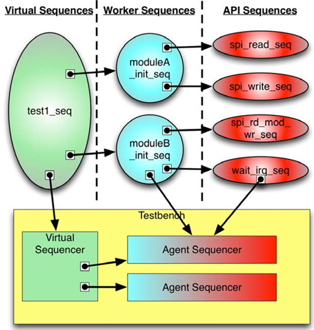

这里的“Sequence 体系”是普通 sequence 的分层组织，不是 `uvm_sequence_library` 类。

三层描述的是调用关系，不要求建立三层类继承。API Sequence 可以继承公共 base sequence；Worker Sequence 通过 `start()` 调用 API Sequence；Virtual Sequence 再协调不同 sequencer 上的 Worker Sequence。

---

## 12.2 API Sequence：封装单笔访问

API Sequence 是 Agent 对外提供的事务级接口。上层设置地址、数据等参数；API Sequence 负责创建 item、发送请求并取回 response。

下面是 AHB 单笔写：

class ahb\_single\_write\_seq extends uvm\_sequence #(ahb\_transaction);
  `uvm\_object\_utils(ahb\_single\_write\_seq)

  rand bit [31:0] addr;
  rand bit [31:0] data;

  task body();
    req = ahb\_transaction::type\_id::create("req");

    start\_item(req);
    assert(req.randomize() with {
      req.write == 1;
      req.addr  == local::addr;
      req.data  == local::data;
    });
    finish\_item(req);
  endtask
endclass

单笔读的结构相同，区别是把读数据作为输出：

class ahb\_single\_read\_seq extends uvm\_sequence #(ahb\_transaction);
  `uvm\_object\_utils(ahb\_single\_read\_seq)

  rand bit [31:0] addr;   // 输入
       bit [31:0] rdata;  // 输出

  task body();
    req = ahb\_transaction::type\_id::create("req");

    start\_item(req);
    assert(req.randomize() with {
      req.write == 0;
      req.addr  == local::addr;
    });
    finish\_item(req);

    get\_response(req);
    rdata = req.data;
  endtask
endclass

地址、写数据等输入声明为 `rand`，既能定向赋值，也能约束随机；读数据、响应状态等输出保持 non-rand。

API Sequence 不处理 pin-level 时序。HADDR、HTRANS 的驱动以及 HREADY wait state 仍属于 driver/BFM。API Sequence 与 Agent 放在同一个 package 中，随 Agent 一起复用。

API Sequence 的接口应保持小而完整。调用者只传完成操作所需的参数，不获取 driver、virtual interface 或内部队列句柄。如果新场景需要不同地址约束，可以随机化 sequence 或派生新 sequence；如果需要不同错误策略，可以通过 config 或 factory override 注入。两种方式都不要求修改现有 driver。

---

## 12.3 Worker Sequence：组合完整任务

Worker Sequence 调用 API Sequence，表达“先做什么、后做什么、重复多少次”。例如，对一段地址先写后读：

class ahb\_range\_rw\_seq extends uvm\_sequence #(ahb\_transaction);
  `uvm\_object\_utils(ahb\_range\_rw\_seq)

  rand bit [31:0] base\_addr;
  rand int unsigned count;

  constraint c\_count { count inside {[1:64]}; }

  task body();
    for (int i = 0; i < count; i++) begin
      ahb\_single\_write\_seq wr;
      ahb\_single\_read\_seq  rd;
      bit [31:0] expected = 32'h1000 + i;

      wr = ahb\_single\_write\_seq::type\_id::create($sformatf("wr\_%0d", i));
      wr.addr  = base\_addr + i \* 4;
      wr.data  = expected;
      wr.start(m\_sequencer, this);

      rd = ahb\_single\_read\_seq::type\_id::create($sformatf("rd\_%0d", i));
      rd.addr = base\_addr + i \* 4;
      rd.start(m\_sequencer, this);

      if (rd.rdata != expected)
        `uvm\_error("RANGE\_RW", $sformatf(
          "addr=%08h expected=%08h actual=%08h",
          rd.addr, expected, rd.rdata))
    end
  endtask
endclass

该 Worker Sequence 只描述地址递增、数据生成和读写顺序，不重复实现 item 握手。类似方式还可以构建：

• `ahb_random_rw_seq`：约束地址范围和读写比例

• `ahb_back2back_seq`：连续启动访问

• `ahb_dma_transfer_seq`：组合 burst read/write 完成数据搬运

层级由职责决定，不由代码量决定。只操作一个 Agent/Sequencer 的任务，即使包含循环、约束和 burst，通常仍属于 Worker Sequence。

子 sequence 使用 `start(m_sequencer, this)` 启动：`m_sequencer` 指定目标 sequencer，`this` 建立父子 sequence 关系。Worker Sequence 因而可以控制子 sequence 的执行顺序，同时不接触 transaction 的内部握手。

VIP 可以附带一组通用 Worker Sequence，例如连续读写、地址遍历和基础错误访问；项目使用者再组合出芯片相关场景。当某个 Worker 在多个项目中反复出现时，可以将其提升为 VIP 的公共能力，但仍应建立在已有 API Sequence 之上。

---

## 12.4 Virtual Sequence：协调多个 Agent

当场景需要控制多个 Agent，使用 Virtual Sequence。它不直接发送 item，而是在不同 sequencer 上启动 API 或 Worker Sequence。

例如：先通过寄存器 Agent 完成配置，再启动 AHB Master 传输，同时控制 AHB Slave 注入 wait state。此时需要表达多个接口之间的先后和并发关系。

**是否协调多个 sequencer，是区分 Worker Sequence 与 Virtual Sequence 的关键。** Virtual Sequence 的实现留到下一篇。

---

## 12.5 Sequence Guideline

| 推荐 | 不推荐 |
| --- | --- |
| VIP 提供少量、稳定的 API Sequence | 使用者直接修改 driver 或内部握手 |
| API Sequence 暴露 `rand` 输入和 non-rand 输出 | 向使用者暴露 virtual interface、pin-level 时序等内部细节 |
| Worker Sequence 通过 `start()` 组合 API Sequence | 在每个场景中重复创建 item 和实现握手 |
| sequence 用 `start()`，item 用 `start_item()` / `finish_item()` | 混用 sequence 与 item 的启动方式 |
| 获得 grant 后再随机化 item（late randomization） | 在场景开始前预先生成全部 item |
| 显式写出 create、约束、错误处理和发送步骤 | 使用 `uvm\_do\_\* `` 隐藏关键流程 |
| objection 由 test 或顶层控制线程管理 | 在 sequence 中 raise/drop objection |
| 时间与 pin-level 等待由 driver/BFM 管理 | 在 sequence 中直接使用 `#delay` |
| 用普通 sequence 的串行、并行和层次组合表达场景 | 依赖 `uvm_sequence_library` 随机决定场景流程 |

Guideline 的核心是保持依赖方向：使用者依赖公开的 Sequence API，不依赖 VIP 内部实现。新增测试需求优先增加 Worker/Virtual Sequence，而不是修改已有 API Sequence。

---

## 12.6 总结

• API Sequence 提供稳定的原子操作

• Worker Sequence 将原子操作组合成任务

• Virtual Sequence 协调多个 Agent

• 上层依赖下层，下层不感知具体测试场景

Sequence 复用的关键不是数量，而是稳定的接口和清晰的依赖方向。

#UVM #VIP开发

[换位 — 从 Master 到 Slave VIP](https://mp.weixin.qq.com/s?__biz=Mzk3NTg3ODUyNg==&mid=2247483971&idx=1&sn=fc42d6d65be4a8c0a62a00839b87eff3&scene=21#wechat_redirect)

[乱序 — 响应乱序处理与完整 Driver](https://mp.weixin.qq.com/s?__biz=Mzk3NTg3ODUyNg==&mid=2247483962&idx=1&sn=b6e84bdd487a38e0d350ee69dcc39f2f&scene=21#wechat_redirect)

[流水线 — Pipeline Driver 与 Outstanding 控制](https://mp.weixin.qq.com/s?__biz=Mzk3NTg3ODUyNg==&mid=2247483949&idx=1&sn=204ab4c85aed94570444b07a572800d4&scene=21#wechat_redirect)

[响应 — AHB 读写与 Bidirectional Driver](https://mp.weixin.qq.com/s?__biz=Mzk3NTg3ODUyNg==&mid=2247483857&idx=1&sn=462e5bfa8c244a08eea791b7caea0942&scene=21#wechat_redirect)

[握手 — 让 APB Master VIP 动起来](https://mp.weixin.qq.com/s?__biz=Mzk3NTg3ODUyNg==&mid=2247483850&idx=1&sn=255d760a88d96e00f54befe6fbc8b1ec&scene=21#wechat_redirect)

[骨架 — 从 APB Monitor 看懂 UVC 架构](https://mp.weixin.qq.com/s?__biz=Mzk3NTg3ODUyNg==&mid=2247483846&idx=1&sn=aac68824b303db40dcf4882494d8faff&scene=21#wechat_redirect)

---

# 13. UVM 源码精读 Day1：UVM 架构与包入口

> 来源：https://mp.weixin.qq.com/s/__KGwUFc8SD40LMAbGhZcg
> 作者：study buddy
> update 2026/08/22 11 : 42
> **已截图**


在深入 UVM 源码之前，理解其整体包结构和入口文件至关重要。UVM 1800.2-2020.3.1 采用高度模块化的 `SystemVerilog` 包设计，所有核心类都封装在 `uvm_pkg` 中，并通过 `uvm.sv` 作为统一的门面入口。本文将从源码层面解析这两个关键文件的设计意图。

## 13.1 UVM 架构与包入口结构图

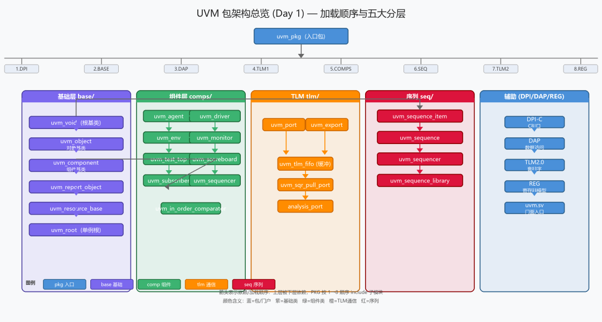

## 13.2 uvm\_pkg.sv 核心包的骨架

`uvm_pkg.sv` 是整个 UVM 库的骨架，负责定义 `uvm_pkg` 包并控制各子模块的加载顺序。

### 13.2.1 宏保护机制

```
`ifndef UVM_PKG_SV
 `define UVM_PKG_SV
```

**设计意图**使用 `ifndef`/`define` 宏保护防止文件被重复编译。这在大型验证环境中尤为重要，当多个模块通过不同路径包含 `uvm_pkg.sv` 时，能避免编译错误和符号重定义。

### 13.2.2 模块加载顺序

```
package uvm_pkg;

 `include "dpi/uvm_dpi.svh"
 `include "base/uvm_base.svh"
 `include "dap/uvm_dap.svh"
 `include "tlm1/uvm_tlm.svh"
 `include "comps/uvm_comps.svh"
 `include "seq/uvm_seq.svh"
 `include "tlm2/uvm_tlm2.svh"
 `include "reg/uvm_reg_model.svh"
```

**加载顺序解析**

1. **DPI 层**（`dpi/uvm_dpi.svh`）最先加载，提供 C 语言接口和外部函数声明，为后续 SystemVerilog 与 C 的交互奠定基础。
2. **基础层**（`base/uvm_base.svh`）核心基础设施，包括 `uvm_object`、`uvm_component`、`uvm_report_object` 等基础类，是整个 UVM 类的继承根基。
3. **DAP 层**（`dap/uvm_dap.svh`）数据访问端口（Data Access Ports），提供标准化的寄存器/存储器访问接口。
4. **TLM1 层**（`tlm1/uvm_tlm.svh`）事务级建模 1.0 接口，定义基础的 `put`/`get`/`transport` 端口和插座。
5. **组件层**（`comps/uvm_comps.svh`）UVM 标准组件库，如 `uvm_agent`、`uvm_driver`、`uvm_monitor`、`uvm_env`、`uvm_test` 等。
6. **序列层**（`seq/uvm_seq.svh`）序列机制，包括 `uvm_sequence`、`uvm_sequence_item`、`uvm_sequencer` 等，实现激励生成的分层调度。
7. **TLM2 层**（`tlm2/uvm_tlm2.svh`）事务级建模 2.0 接口，提供更丰富的 socket 和相位控制，兼容更高层次的抽象建模。
8. **寄存器层**（`reg/uvm_reg_model.svh`）寄存器模型，实现寄存器/存储器的前后门访问和镜像值管理。

**关键设计思想**

- **依赖顺序**基础层必须先于组件层加载，因为组件继承自基础类；TLM1 先于组件层，因为组件内部使用 TLM 端口；序列层依赖于组件层中的 `uvm_sequencer`。
- **分层解耦**每一层通过独立的 `.svh` 文件管理，便于单独维护和升级，例如 TLM2 的演进不会影响基础层的稳定性。

### 13.2.3 DPI 条件编译与兼容性处理

```
 `ifdef UVM_EXPERIMENTAL_POLLING_API
  `include "dpi/uvm_polling_dpi.svh"
  `include "base/uvm_hdl_polling.svh"
 `else
  export "DPI-C" function uvm_polling_value_change_notify;
  function void uvm_polling_value_change_notify(int sv_key);
     uvm_report_fatal("UVM_HDL_POLLING",
                      $sformatf("VPI access is disabled. Recompile without +define+UVM_HDL_NO_DPI"));
  endfunction
 `endif
```

**设计意图**

- **条件编译**通过 `UVM_EXPERIMENTAL_POLLING_API` 宏控制是否启用实验性的 HDL 轮询 API。这允许高级用户在需要 VPI 访问时启用额外功能，而普通用户保持轻量级编译。
- **桩函数（Stub）**当轮询功能未启用时，导出一个空的 DPI 函数，确保链接器不会因找不到符号而报错。这是 C/SV 混合编译中常见的兼容性技巧——提供一个默认实现，运行时再通过错误提示引导用户正确配置。

### 13.2.4 实验性轮询 API 的独立包

```
`ifdef UVM_EXPERIMENTAL_POLLING_API
 `ifdef UVM_PLI_POLLING_ENABLE
package uvm_polling_pkg;
   static bit notifier;
  `ifndef XCELIUM
   string notifier_signal_name = $sformatf("%m.notifier");
  `else
   string notifier_signal_name = $sformatf("%m::notifier");
  `endif
endpackage
 `endif
`endif
```

**关键细节**

- 使用独立的 `uvm_polling_pkg` 避免污染主包命名空间。
- 针对 Xcelium 仿真器的特殊处理（`::` 分隔符 vs `.` 分隔符），体现了跨工具兼容的细致考量。

## 13.3 uvm.sv 门面模式入口

```
`include "uvm_pkg.sv"
```

**设计意图**

- **Facade Pattern（门面模式）**`uvm.sv` 是整个 UVM 库的唯一外部可见入口。用户只需在测试平台顶部 `import uvm_pkg::*;` 并包含 `uvm_macros.svh`，无需关心内部数十个文件的复杂依赖关系。
- **简化集成**在仿真命令中只需 `-incdir` 指向 UVM 源码目录并包含 `uvm.sv`，编译器会自动递归处理所有 `include` 指令。这种"单点入口"设计极大地降低了集成门槛。

## 13.4 今日总结

| 文件 | 角色 | 核心设计思想 |
| --- | --- | --- |
| `uvm_pkg.sv` | 核心包定义 | 宏保护防重编译、按依赖顺序分层加载、DPI 条件编译与桩函数兼容 |
| `uvm.sv` | 统一入口 | 门面模式，对外暴露单一包含点，隐藏内部复杂依赖 |

理解这两个文件，相当于拿到了 UVM 源码世界的"地图和钥匙"。后续我们将沿着 `uvm_pkg.sv` 中的加载顺序，逐层深入分析每一层的核心实现。

*下一期：UVM Base 层 —— `uvm_object` 与 `uvm_component` 的生命周期管理。*

---

# 14. UVM 源码精读 Day2：基础框架总览：uvm_base.svh

> 来源：https://mp.weixin.qq.com/s/XZE4eAH6aSuEoZjnTWACKA
> 作者：study buddy
> update 2026/08/22 11 : 43
> **已截图**

— UVM 源码精读系列 - Day 2 —

## 14.1 基础框架总览：uvm\_base.svh

UVM 基础模块的组织结构，include 顺序的设计意图

---

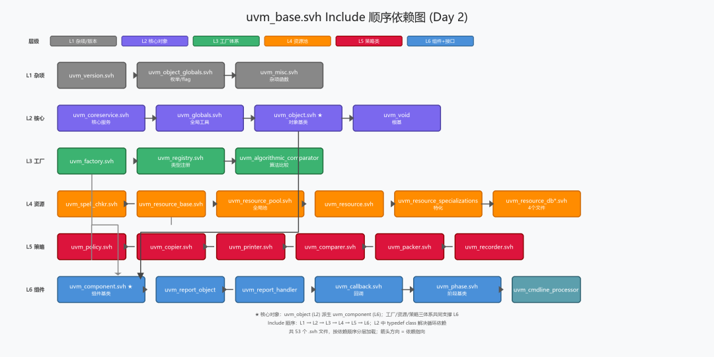

## 14.2 关键特性

- **依赖驱动的 Include 顺序**：文件按"被依赖者优先"原则严格排列，确保类型先定义后使用，避免编译时 forward reference 错误
- **前向声明解耦循环依赖**：`typedef class uvm_cmdline_processor` 在文件顶部声明，解决 uvm\_globals 与 cmdline\_processor 的相互引用
- **分层模块组织**：从基础类型 - 核心对象 - 工具策略 - 组件 - 接口，六层递进结构清晰划分职责边界
- **条件编译控制可选功能**：`ifndef UVM_REGEX_NO_DPI` 包裹 `uvm_regex_cache.svh`，允许在无 DPI 环境下编译
- **头文件保护宏**：`ifndef UVM_BASE_SVH` / `define UVM_BASE_SVH` 防止同一编译单元重复包含

## 14.3 源码分析

### 14.3.1 前向声明解决循环依赖

```
`ifndef UVM_BASE_SVH
`define UVM_BASE_SVH

  typedef class uvm_cmdline_processor;
```

`uvm_cmdline_processor` 在文件靠后位置（第 133 行）才被真正 `include`，但 `uvm_globals.svh`（第 54 行）需要引用它。SystemVerilog 的 `typedef class` 前向声明允许在完整类定义前使用类名，这是 UVM 处理模块间循环依赖的标准手法。

### 14.3.2 Include 顺序的分层设计

```
  // Miscellaneous classes and functions
  `include "base/uvm_version.svh"
  `include "base/uvm_object_globals.svh"
  `include "base/uvm_misc.svh"

  `include "base/uvm_coreservice.svh"
  `include "base/uvm_globals.svh"

  // The base object element
  `include "base/uvm_object.svh"

  `include "base/uvm_factory.svh"
  `include "base/uvm_registry.svh"
```

第一层（版本/全局/杂项）- 第二层（uvm\_object）- 第三层（工厂）。
`uvm_object` 是 UVM 的"万物之基"，工厂、配置、策略等所有机制都操作 `uvm_object` 或其派生类，因此必须最早完整定义。后续 `uvm_pool`（第 64-65 行）的键值类型也依赖 `uvm_object`。

### 14.3.3 资源与配置系统的依赖链

```
  `include "base/uvm_spell_chkr.svh"
  `include "base/uvm_resource_base.svh"
  `include "base/uvm_resource_pool.svh"
  `include "base/uvm_resource.svh"
  `include "base/uvm_resource_specializations.svh"
  `include "base/uvm_resource_db_implementation.svh"
  `include "base/uvm_resource_db.svh"
  `include "base/uvm_resource_db_options.svh"
  `include "base/uvm_config_db_implementation.svh"
  `include "base/uvm_config_db.svh"
```

资源系统的 include 顺序是教科书级的依赖链：
`resource_base` - `resource_pool`（管理资源的容器）- `resource`（具体资源对象）- `resource_specializations`（类型特化）- `resource_db`（静态接口）- `config_db`（基于 resource\_db 的封装）。
`uvm_config_db` 放在最后，说明它是对底层资源池的**门面模式（Facade）**封装。

### 14.3.4 策略类与组件的层次分离

```
  `include "base/uvm_policy.svh"
  `include "base/uvm_copier.svh"
  `include "base/uvm_printer.svh"
  `include "base/uvm_comparer.svh"
  `include "base/uvm_packer.svh"
  // ...
  `include "base/uvm_component.svh"
```

`uvm_policy` 及 copier/printer/comparer/packer 等策略类（第 82-94 行）在 `uvm_component`（第 125 行）之前引入。这体现了**策略模式（Strategy Pattern）**的设计：`uvm_object` 的数据方法（copy/compare/print/pack）依赖这些策略对象，而 `uvm_component` 作为 `uvm_object` 的派生类，必须在策略类可用后才能定义。

## 14.4 小结

`uvm_base.svh` 并非简单的"文件列表"，而是 UVM 基础架构的**编译时依赖图**。include 顺序严格反映了 UVM 的架构层次：基础类型 - 核心对象 - 工厂 - 资源池 - 策略 - 组件 - 接口。理解这份顺序，就是理解 UVM 的设计骨架。

---

# 15. UVM 源码精读 Day3：核心对象体系 uvm_object

> 来源：https://mp.weixin.qq.com/s/Hm8ZTcdEqOg-G8j0EU0MXQ
> 作者：study buddy
> update 2026/08/22 11 : 43
> **已截图**

— UVM 源码精读系列 - Day 3 —

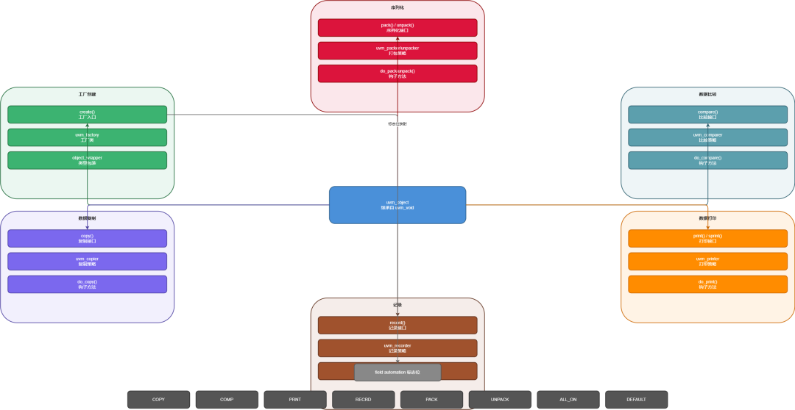uvm\_object 核心架构：中心类与七大操作体系

## 15.1 UVM 源码精读 Day3：核心对象体系 uvm\_object

`uvm\_object` 是 UVM 中所有可见对象的根基，包括 `uvm\_component`、`uvm\_sequence\_item`、`uvm\_sequence` 乃至寄存器模型中的 `uvm\_reg` 都直接或间接继承自它。理解 `uvm\_object` 的设计，等于掌握了 UVM 整个对象体系的 DNA。

## 15.2 类层次与核心属性

```
virtual class uvm_object extends uvm_void;
```

`uvm\_object` 直接继承自 `uvm\_void`（一个空基类，作为整个 UVM 类树的根）。这种设计使得 UVM 可以在最顶层统一处理所有对象的公共行为。

### 15.2.1 核心属性

| 属性 | 类型 | 作用 |
| --- | --- | --- |
| `m\_leaf\_name` | `string` | 对象实例名，可通过 `get\_name()`/`set\_name()` 访问 |
| `m\_inst\_id` | `int` | 实例唯一 ID，通过静态计数器递增分配 |
| `m\_inst\_count` | `static int` | 全局实例计数器 |
| `use\_uvm\_seeding` | `static bit` | 是否使用 UVM 全局种子机制（默认 1） |

**设计意图**每个对象都自带名称和唯一 ID，这是调试、打印、比较的基础。`m\_inst\_id` 保证了在大量对象实例化时，日志中总能精确定位到具体对象。

## 15.3 工厂模式创建 create()

```
static function uvm_object create (string name="");
```

`create()` 是 UVM 工厂模式的核心入口。与直接调用 `new()` 不同，`create()` 通过 `uvm\_factory` 在运行时查找对应的 `uvm\_object\_wrapper`，由工厂负责实例化正确的类型。

```
function uvm_object uvm_object::create (string name="");
  uvm_coreservice_t cs = uvm_coreservice_t::get();
  uvm_factory factory = cs.get_factory();
  return factory.create_object_by_type(get_type(), get_full_name(), name);
endfunction
```

**关键设计思想**

- **运行时多态**`create()` 返回的是 `uvm\_object` 基类句柄，但实际类型由工厂根据注册信息决定。这使得在测试平台中可以通过配置覆盖（override）将 `my\_driver` 替换为 `my\_err\_driver`，而无需修改源代码。
- **与 `new()` 的区别**`new()` 是编译时绑定，而 `create()` 是运行时绑定。UVM 推荐所有可复用组件都通过 `create()` 创建。

## 15.4 数据复制体系 copy / clone

### 15.4.1 clone 完整复制

```
function uvm_object uvm_object::clone();
  uvm_object tmp;
  tmp = this.create(get_name());
  if(tmp == null) begin
    uvm_report_warning("CRFLD", ...);
  end
  else begin
    tmp.copy(this);
  end
  return(tmp);
endfunction
```

`clone()` 的精髓是"先创建，再复制"利用 `create()` 确保工厂覆盖生效，然后调用 `copy()` 完成数据深拷贝。

### 15.4.2 copy 与 do\_copy 钩子

```
function void uvm_object::copy (uvm_object rhs, uvm_copier copier=null);
  uvm_coreservice_t coreservice = uvm_coreservice_t::get();
  uvm_copier m_copier;
  if(copier == null) begin
    m_copier = coreservice.get_default_copier();
  end else begin
    m_copier = copier;
  end
  if(m_copier.get_active_object_depth() == 0) begin
    m_copier.flush();
  end
  m_copier.copy_object(this, rhs);
endfunction
```

**钩子模式**`copy()` 是公共接口，负责初始化 `uvm\_copier` 并委托给 `m\_copier.copy\_object()`。最终底层会回调 `do\_copy()`，子类通过覆盖 `do\_copy()` 实现自定义字段复制。

```
function void uvm_object::do_copy (uvm_object rhs);
  return;
endfunction
```

**设计意图**将"框架流程"与"业务逻辑"分离。框架负责递归遍历、深度控制、循环检测，用户只需在 `do\_copy()` 中处理自己新增的字段。

## 15.5 数据比较体系 compare

```
function bit uvm_object::compare (uvm_object rhs, uvm_comparer comparer=null);
  if(comparer == null) begin
    comparer = uvm_comparer::get_default();
  end
  if(comparer.get_active_object_depth() == 0) begin
    comparer.flush();
  end
  compare = comparer.compare_object(get_name(), this, rhs);
endfunction
```

与 `copy` 完全对称的设计：初始化 `uvm\_comparer` -> 委托给 `comparer.compare\_object()` -> 底层回调 `do\_compare()`。

```
function bit uvm_object::do_compare (uvm_object rhs, uvm_comparer comparer);
  return 1;
endfunction
```

默认返回 `1`（相等），子类覆盖后添加自定义比较逻辑。这种设计让比较操作可以递归进行——`uvm\_comparer` 会自动处理嵌套对象的深度比较。

## 15.6 打印体系 print / sprint / convert2string

### 15.6.1 三种打印接口

| 方法 | 返回值 | 用途 |
| --- | --- | --- |
| `print(printer)` | `void` | 直接输出到文件/屏幕 |
| `sprint(printer)` | `string` | 返回格式化字符串，用于拼接日志 |
| `convert2string()` | `string` | 自定义简短描述，子类覆盖 |

```
function void uvm_object::print(uvm_printer printer=null);
  if(printer==null) begin
    printer = uvm_printer::get_default();
  end
  $fwrite(printer.get_file(), sprint(printer));
endfunction

function string uvm_object::sprint(uvm_printer printer=null);
  if(printer==null) begin
    printer = uvm_printer::get_default();
  end
  if(printer.get_active_object_depth() == 0) begin
    printer.flush();
    name = printer.get_root_enabled() ? get_full_name() : get_name();
  end else begin
    name = get_name();
  end
  printer.print_object(name, this);
  return printer.emit();
endfunction
```

**关键细节**

- `get\_active\_object\_depth() == 0` 判断当前是否为顶层对象，顶层才刷新 printer 缓冲区，避免中间对象干扰格式化。
- `get\_root\_enabled()` 控制是否打印完整层次名（`env.agent.driver`）还是仅打印局部名（`driver`）。
- 最终通过 `printer.print\_object()` 递归打印所有字段，底层回调 `do\_print()`。

## 15.7 序列化体系 pack / unpack

### 15.7.1 pack 族方法

```
function int uvm_object::pack (ref bit bitstream[], input uvm_packer packer=null);
  m_pack(packer);
  packer.get_packed_bits(bitstream);
  return packer.get_packed_size();
endfunction
```

| 方法 | 输出格式 |
| --- | --- |
| `pack(bitstream[])` | `bit` 数组 |
| `pack\_bytes(bytestream[])` | `byte unsigned` 数组 |
| `pack\_ints(intstream[])` | `int unsigned` 数组 |

三种接口共享同一个 `m\_pack()` 核心，只是最终获取二进制数据的格式不同。

```
function void uvm_object::m_pack (inout uvm_packer packer);
  if(packer == null) begin
    packer = uvm_packer::get_default();
  end
  if(packer.get_active_object_depth() == 0) begin
    packer.flush();
  end
  packer.pack_object(this);
endfunction
```

**设计意图**序列化体系是 UVM 跨进程通信和事务记录的基础。`uvm\_packer` 负责将对象字段按位/字节/int 打包成连续的二进制流，支持大小端转换和深度控制。

### 15.7.2 unpack 反向恢复

与 pack 完全对称，通过 `uvm\_unpacker` 将二进制流还原为对象字段。同样是"框架处理递归，用户覆盖 `do\_unpack()` 处理自定义字段"的模式。

## 15.8 记录体系 record

```
function void uvm_object::record (uvm_recorder recorder=null);
  if(recorder == null) begin
    recorder = uvm_recorder::get_default();
  end
  if(recorder.get_active_object_depth() == 0) begin
    recorder.flush();
  end
  recorder.record_object(get_name(), this);
endfunction
```

`record()` 用于将对象状态持久化到波形数据库（如 FSDB、TRN 等）。与 print/pack 相同的设计范式，底层回调 `do\_record()`。

## 15.9 field automation 标志位

`uvm\_object\_globals.svh` 中定义了 `uvm\_field\_flag\_t` 类型和一系列标志位，用于在 `uvm\_field\_\*` 宏中声明字段需要支持哪些操作。

```
typedef bit [31:0] uvm_field_flag_t;

parameter uvm_field_flag_t UVM_COPY       = 32'b00000000000000000000000000000001;
parameter uvm_field_flag_t UVM_COMPARE    = 32'b00000000000000000000000000000010;
parameter uvm_field_flag_t UVM_PRINT      = 32'b00000000000000000000000000000100;
parameter uvm_field_flag_t UVM_RECORD     = 32'b00000000000000000000000000001000;
parameter uvm_field_flag_t UVM_PACK       = 32'b00000000000000000000000000010000;
parameter uvm_field_flag_t UVM_UNPACK     = 32'b00000000000000000000000000100000;
```

**使用方式**

```
`uvm_object_utils_begin(my_item)
  `uvm_field_int(data, UVM_ALL_ON | UVM_DEC)
  `uvm_field_string(name, UVM_DEFAULT)
`uvm_object_utils_end
```

`UVM\_ALL\_ON` 等价于 `UVM\_COPY | UVM\_COMPARE | UVM\_PRINT | UVM\_RECORD | UVM\_PACK | UVM\_UNPACK`，表示该字段参与所有自动化操作。也可以通过按位或组合精确控制，例如 `UVM\_COPY | UVM\_COMPARE` 表示只参与复制和比较，不参与打印和序列化。

**设计意图**用位掩码实现编译时/运行时的行为控制，既灵活又高效。这种设计使得一个字段可以在不同场景下有不同的处理方式——例如密码字段可以设置 `UVM\_NOCOMPARE` 避免在比较时暴露。

## 15.10 随机化事件回调

```
function void uvm_object::pre_randomize();
  m_field_automation(null, UVM_PRE_RANDOMIZE, "");
endfunction

function void uvm_object::post_randomize();
  m_field_automation(null, UVM_POST_RANDOMIZE, "");
endfunction
```

`pre\_randomize()` 和 `post\_randomize()` 是 SystemVerilog 内建随机化机制的标准回调。UVM 在这里增加了 `m\_field\_automation()` 调用，使得 `uvm\_field\_\*` 宏注册的字段可以在随机化前后自动执行额外的约束处理。

## 15.11 今日总结

| 体系 | 公共接口 | 钩子方法 | 辅助类 | 核心设计模式 |
| --- | --- | --- | --- | --- |
| 创建 | `create()` | — | `uvm\_factory` | 工厂模式 |
| 复制 | `copy()` / `clone()` | `do\_copy()` | `uvm\_copier` | 模板方法模式 |
| 比较 | `compare()` | `do\_compare()` | `uvm\_comparer` | 模板方法模式 |
| 打印 | `print()` / `sprint()` | `do\_print()` | `uvm\_printer` | 模板方法模式 |
| 序列化 | `pack()` / `unpack()` | `do\_pack()` / `do\_unpack()` | `uvm\_packer` / `uvm\_unpacker` | 模板方法模式 |
| 记录 | `record()` | `do\_record()` | `uvm\_recorder` | 模板方法模式 |
| 自动化 | `m\_field\_automation()` | — | — | 位掩码标志控制 |

`uvm\_object` 的设计堪称 SystemVerilog 中**模板方法模式（Template Method Pattern）**的教科书级实现：公共接口定义算法骨架，钩子方法（`do\_\*`）留待子类扩展。这种设计带来的好处是

1. **一致性**所有数据操作方法（copy/compare/print/pack/record）遵循相同的"初始化工具类 -> 委托给工具类 -> 回调钩子"流程。 2. **可扩展性**子类只需覆盖对应的 `do\_\*` 方法，无需关心递归深度、循环引用检测等复杂逻辑。 3. **可组合性**通过 `uvm\_field\_\*` 宏和标志位，可以在不修改类定义的情况下精细控制字段行为。

---

# 16. UVM 基础第五天：拼出一个不驱动也能自动抓错的环境

> 来源：https://mp.weixin.qq.com/s/oJizJ8g5UwSY-XOy85mgKg
> 作者：周漾
> update 2026/08/22 18 : 08

前四天已经有了所有部件：事务对象、分析端口、监视器、预测器和记分板。今天把它们接成一个最小被动环境。它不驱动接口，不产生业务，只挂在真实系统旁边观察；但只要数据不一致，就能自动报出来。

被动环境是理解 UVM 结构最好的起点。它没有激励控制的复杂度，数据流却完整：接口到监视器，监视器到预测器和记分板，预测器再把期望交给记分板。

它适合的场景并不少。已有的软件、固件或别的验证组件正在产生真实业务时，可以把被动环境挂在旁边；它不改变任何信号，却能独立统计、预测和比较。即使暂时没有完整的主动激励环境，也可以先用被动环境把观察和检查闭环建立起来。

被动环境也有明确边界。它能回答“接口上实际发生的事务是否符合模型”，能统计真实业务覆盖了哪些情况，能记录长期运行中的异常；但它不能自行创造角落场景。若系统软件从不访问某个地址、从不产生某种错误响应，被动环境只能诚实地报告这种情况没有被看到，不能替代专门的激励。因此被动环境通常是第一层可靠性基础：先保证观察和检查正确，再决定是否需要额外的主动场景去补覆盖。

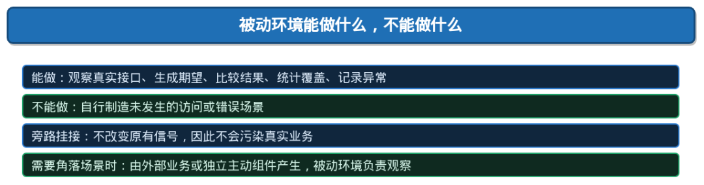

图 3：被动环境不改变真实流量，但能观察、预测、比对和统计；它不能自行制造未发生的场景。

这种边界对环境设计很有帮助。若一个组件只是为了“让测试通过”而开始往接口上驱动信号，它就不再是被动 monitor，而应成为另一个职责明确的主动组件。把旁路观察和主动控制混在一起，会让同一个环境既是裁判又是参与者，错误发生时很难判断是设计问题还是环境自己造成的。

## 16.1 环境拥有三个组件

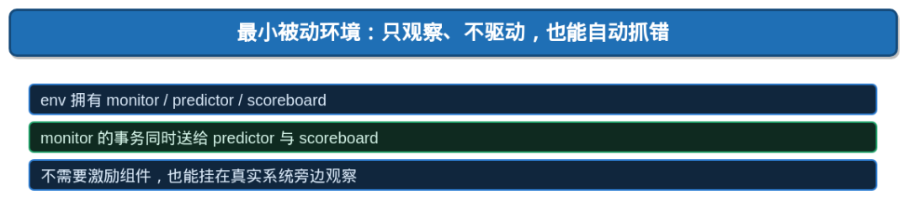

图 1：环境拥有监视器、预测器和记分板，不直接驱动被测接口。

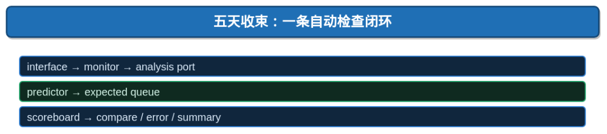

图 2：监视到的事务一边生成期望，一边作为实际，最终在记分板比较。

这里最容易困惑的是同一笔 monitor 事务为什么会走两条支路。送到 predictor 的那一份用来推导“按模型应该发生什么”；送到 scoreboard 的那一份表示“接口上实际发生了什么”。它们起点相同、职责不同，最终在记分板汇合。这样的结构让期望和实际都来自可追溯的数据源，而不是由一个组件凭空同时生成两者。

不要把 predictor 的输出误解为“另一份实际”。predictor 输出的是模型根据当前已确认输入推导出的结果，它可能和接口上的实际在时间上不同步：模型一看到写事务就更新内部表，而实际读结果要等若干拍之后才从接口回来。scoreboard 的价值正在于允许这种不同步存在，再通过键、队列或 FIFO 把两边正确配对。

也不要让 scoreboard 自己从输入重新计算期望。这样在小环境里代码会少几行，但预测规则和比较规则会混在一个组件中。出现 mismatch 时，调试者无法快速判断是模型算错、数据采错，还是比较键错。将 predictor 保持为独立部件，即使它的实现暂时只有一张地址表，也是在为后续复杂规则保留清晰边界。

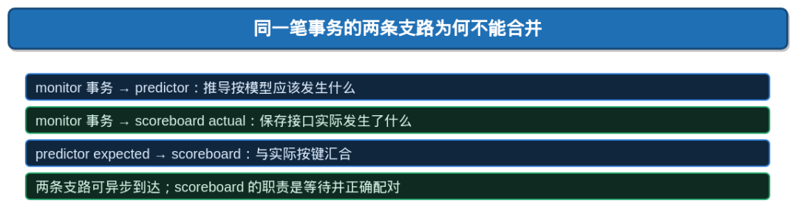

图 4：一条支路生成 expected，一条支路保存 actual；它们到达记分板的时刻可以不同，但来源必须都可追溯。

## 16.2 创建环境成员

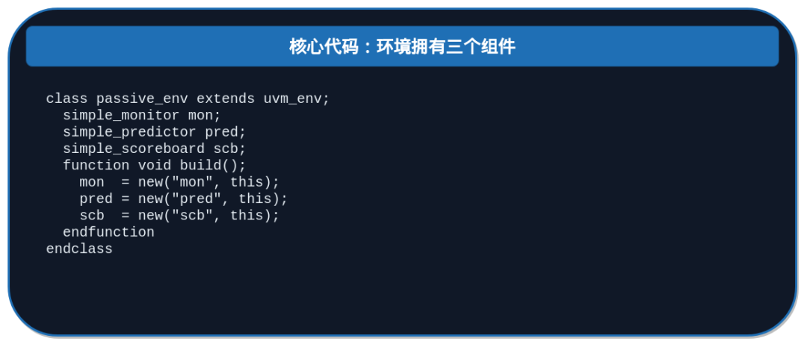

代码图 1：环境负责拥有和组织三个组件。

环境不需要把 monitor、predictor 和 scoreboard 的内部逻辑写在一起。它只创建并拥有这些成员，给每个成员明确的名字和归属。这样替换一个预测模型、增加一个日志订阅者，通常只影响环境的组织与连接，不会改动 monitor 的采样逻辑或 scoreboard 的比较逻辑。

环境的 `build` 阶段可以理解成“搭骨架”：创建长期存在的成员、给它们命名、准备各自的状态。这里不应该开始处理事务，也不应把数据流硬编码在创建语句里。创建和连接分开有实际好处：当某个组件缺失时，层级输出能先告诉你骨架哪里没搭好；当组件都在但数据没走通时，再去看连接关系，不会把两个问题混在一起。

真实工程里，接口句柄、模式开关等配置会在创建组件前提供给它们；这些配置决定 monitor 观察哪路信号、predictor 采用哪种规则、scoreboard 选哪种配对策略。它们是环境的输入，不是数据流本身。本文不展开配置机制的细节，只保留一个原则：组件在开始长期工作前，应已拿到完整且一致的运行上下文。

## 16.3 连接两条分析支路

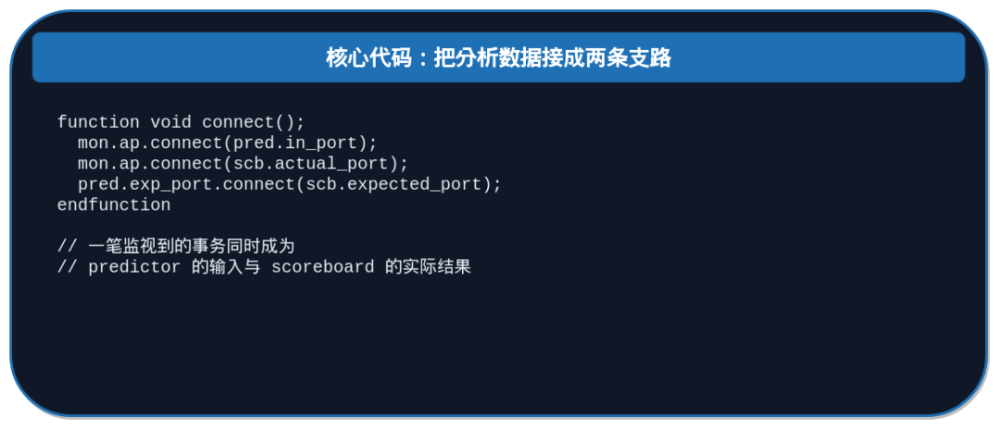

代码图 2：同一笔监视事务同时成为预测器输入与实际结果；预测器的输出再送给记分板。

连接关系是整套环境最值得画出来的部分。monitor 到 predictor 的连接缺失，scoreboard 会持续收到实际但没有期望；monitor 到 scoreboard 的连接缺失，预测器不断生成期望却没有实际来比较；predictor 到 scoreboard 的连接缺失，则两边数据都存在但永远不汇合。三种症状不同，连接图能把它们直接对应起来。

连接完成后，建议先跑一笔最小的已知事务，而不是马上跑长随机。目标不是覆盖功能，而是确认闭环完整：monitor 应有一行采样日志，predictor 应有一行期望日志，scoreboard 应有一行匹配日志。三行按因果顺序出现，说明接口观察、分析端口广播和比较器汇合都已工作。若直接从长随机开始，几百条日志会把最早的断点淹没。

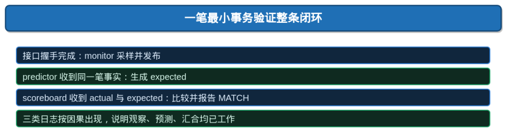

图 5：一笔可预期的写或读从接口进入，依次验证 monitor、predictor 和 scoreboard 三段都能工作。

## 16.4 测试只创建环境

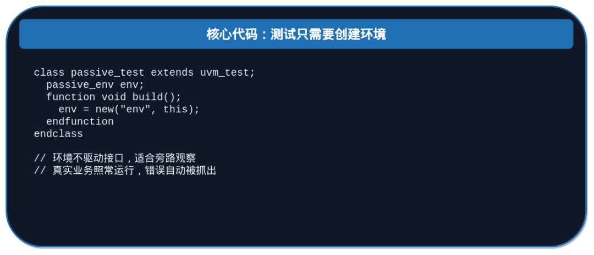

代码图 3：被动环境适合旁路挂在真实业务旁边，不改变原有流量。

被动不代表没有价值。它不产生读写，但可以发现设计输出与模型不一致、统计真实业务覆盖到的场景、记录长期运行中的异常。这种“先观察、再干预”的方式也适合把新环境逐步接入已有系统，降低一次性替换全部验证结构的风险。

旁路接入还有一个实际优势：它适合做环境的可信度建立。先让 monitor 只打印事务，确认与波形一致；再接 predictor，只打印期望；最后接 scoreboard，打开错误报告。每次只增加一层职责，出问题时回退范围很小。相比一次性接上大量检查和覆盖，这种增量方式更容易找出第一个配置或连接错误。

环境健康状态要同时看三类计数：monitor 采样数、predictor 生成的期望数、scoreboard 匹配数与错误数。采样数持续增长而期望数不增长，说明预测支路断了；期望数增长、匹配数不增长，说明实际或连接支路断了；匹配数增长但错误数也持续增长，才应开始深入数据模型或设计行为。

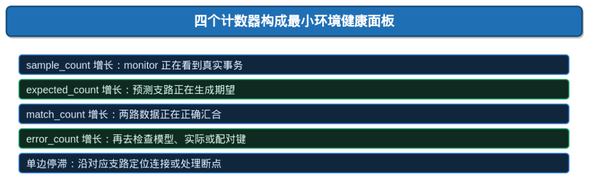

图 6：采样、期望、匹配和错误计数构成最小健康面板，能把闭环断点直接定位到一段支路。

## 16.5 读懂输出

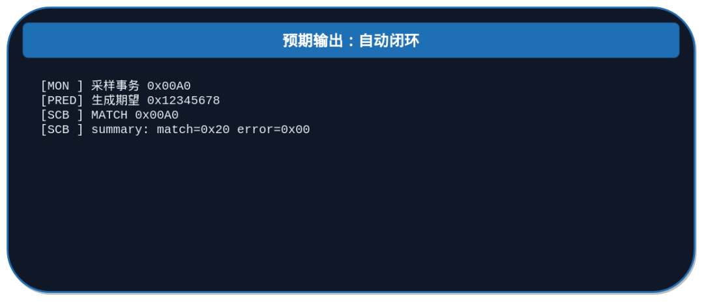

输出图 1：监视器采样、预测器生成期望、记分板匹配，形成自动闭环。

一条完整的正常日志应能按顺序读成一条故事：monitor 看到一笔操作，predictor 根据它生成期望，scoreboard 随后确认实际匹配。少掉其中任何一段，都不是“日志少了一行”这么简单，而是数据流有一段断开。把这三类日志标识固定下来，排查时可以快速定位断点。

若 monitor 和 predictor 的日志都有、scoreboard 却没有匹配，先不要假设 compare 有 bug。更常见的原因是两条支路使用的对象键不一致，或者 predictor 的 expected 仍在等待而实际被送到了另一个端口。若三条都有但顺序看起来颠倒，也不一定错：预测和实际可以异步到达，重点是每个完整键最终是否只匹配一次。

## 16.6 真实调试：沿着数据流逐段确认

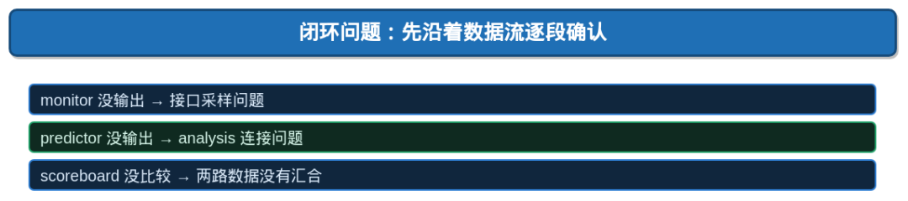

图 4：监视器没输出查接口；预测器没输出查分析连接；记分板没比较查两路是否汇合。

调试整个环境时，始终沿数据的方向走。先从接口与 monitor 开始，因为没有采样就没有后续；再看 monitor 的发布是否抵达 predictor 和 scoreboard；最后看 predictor 的期望是否抵达 scoreboard。这个顺序避免了在最末端看到“没有比较”之后，直接去修改比较算法。

对于被动环境，还应保留“原始证据”。发生 mismatch 时，保存 monitor 发布的事务副本、predictor 生成的期望副本、配对键和产生时间。只保留最终的错误字符串，之后很难分辨实际字段错了、预测状态错了，还是对象在分析端口之后被复用了。环境越靠近真实业务，这种原始证据越重要。

## 16.7 小结

最小被动环境说明了 UVM 的核心价值：结构化的数据流，而不是某一个 API。监视器负责观察，预测器负责算期望，记分板负责判对错，环境负责把它们组织起来。五篇连起来，已经形成一条自动检查闭环。

从实战角度看，被动环境的第一个成功标准不是覆盖率或复杂场景，而是可解释性：任何一笔事务为什么被采到、为什么得到这份期望、为什么被判匹配或失败，都能沿着一条清楚的数据路径回溯。做到这一点之后，增加主动激励、复杂预测规则或覆盖收敛，环境的骨架都不需要推倒重来。

## 16.8 面试问答

## 16.9 问题 1：什么是被动 UVM 环境，它适合什么场景？

回答：被动环境不驱动接口，只观察真实业务并做预测、比较、记录或覆盖统计。它适合旁路挂在已有软件、固件或其他验证组件产生的流量旁边；优点是不会改变原有行为，却能建立自动检查闭环。

问题 2：为什么同一笔 monitor 事务要同时送给 predictor 和 scoreboard？

回答：送给 predictor 的那一路用于生成“应该发生什么”，送给 scoreboard 的那一路代表“实际发生了什么”。两者从同一个观察事实出发、在 scoreboard 汇合比较，才能保证期望和实际都有可追溯来源。
