<!-- toc-start -->

# 目录

[1. VCS用户手册中关于X-Propagation功能的介绍与限制](#1-vcs用户手册中关于x-propagation功能的介绍与限制)  
　　[1.1 目录](#11-目录)  
　　[1.2 X 传播简介](#12-x-传播简介)  
　　　　[1.2.1 合并模式](#121-合并模式)  
　　[1.3 技术补充：门级仿真与伪穷举双态仿真](#13-技术补充门级仿真与伪穷举双态仿真)  
　　　　[1.3.1 门级仿真（Gate-Level Simulation）](#131-门级仿真gate-level-simulation)  
　　　　[1.3.2 伪穷举双态仿真（Pseudo-Exhaustive 2-State Simulation）](#132-伪穷举双态仿真pseudo-exhaustive-2-state-simulation)  
　　　　[1.3.3 对比总结](#133-对比总结)  
　　[1.4 技术补充：为什么门级原语自带 X 传播语义](#14-技术补充为什么门级原语自带-x-传播语义)  
　　　　[1.4.1 RTL 仿真 vs 门级仿真的本质区别](#141-rtl-仿真-vs-门级仿真的本质区别)  
　　　　[1.4.2 门级原语自带 X 传播语义的原因](#142-门级原语自带-x-传播语义的原因)  
　　　　[1.4.3 一句话总结](#143-一句话总结)  
　　[1.5 运行 X 传播仿真的指南](#15-运行-x-传播仿真的指南)  
　　[1.6 仿真差异与调试](#16-仿真差异与调试)  
　　　　[1.6.1 仿真差异的常见来源](#161-仿真差异的常见来源)  
　　　　[1.6.2 配置文件](#162-配置文件)  
　　　　[1.6.3 调试方法](#163-调试方法)  
　　　　[1.6.4 调试注意事项](#164-调试注意事项)  
　　[1.7 限制](#17-限制)  
　　　　[1.7.1 完全不支持的特性](#171-完全不支持的特性)  
　　　　[1.7.2 存在限制的特性](#172-存在限制的特性)  
　　　　[1.7.3 在调用点禁用 Xprop 并设置父链的限制](#173-在调用点禁用-xprop-并设置父链的限制)  
　　　　[1.7.4 在子程序体内禁用 Xprop 的限制](#174-在子程序体内禁用-xprop-的限制)  
　　　　[1.7.5 类型与存储器支持](#175-类型与存储器支持)  
　　　　[1.7.6 其他限制](#176-其他限制)  
[2. VCS UCLI 单步调试：零时间死循环（Zero-time Infinite Loop）的定位方法](#2-vcs-ucli-单步调试零时间死循环zero-time-infinite-loop的定位方法)  
　　[2.1 问题现象](#21-问题现象)  
　　[2.2 问题分析](#22-问题分析)  
　　[2.3 为什么常规排查难以定位](#23-为什么常规排查难以定位)  
　　[2.4 利用 VCS UCLI 定位死循环](#24-利用-vcs-ucli-定位死循环)  
　　　　[2.4.1 单步调试流程](#241-单步调试流程)  
　　　　[2.4.2 本次问题定位结果](#242-本次问题定位结果)  
　　[2.5 调试经验总结](#25-调试经验总结)  
[3. Verdi学习笔记](#3-verdi学习笔记)  
　　[3.1 Verdi配置信息](#31-verdi配置信息)  
　　[3.2 配置文件](#32-配置文件)  
　　[3.3 配置优先级](#33-配置优先级)  
　　[3.4 常用配置](#34-常用配置)  
　　　　[3.4.1 信号左对齐](#341-信号左对齐)  
　　　　[3.4.2 字体大小](#342-字体大小)  
　　　　[3.4.3 波形样式](#343-波形样式)  
　　　　[3.4.4 跳转信号](#344-跳转信号)  
　　　　[3.4.5 nSchema](#345-nschema)  
　　[3.5 Verdi使用流程](#35-verdi使用流程)  
　　[3.6 产生fsdb文件](#36-产生fsdb文件)  
　　[3.7 打开verdi界面](#37-打开verdi界面)  
　　　　[3.7.1 **（1）code only**](#371-1code-only)  
　　　　[3.7.2 **（2）fsdb/ztdb/vf**](#372-2fsdbztdbvf)  
　　　　[3.7.3 -dbdir](#373-dbdir)  
　　[3.8 Verdi命令和快捷键](#38-verdi命令和快捷键)  
　　[3.9 Verdi常用命令](#39-verdi常用命令)  
　　[3.10 Verdi常用快捷键](#310-verdi常用快捷键)  
　　[3.11 Verdi常用技巧](#311-verdi常用技巧)  
　　[3.12 fsdb相关](#312-fsdb相关)  
　　　　[3.12.1 单独打开fsdb](#3121-单独打开fsdb)  
　　　　[3.12.2 切割fsdb文件](#3122-切割fsdb文件)  
　　　　[3.12.3 仿真自动切割fsdb文件](#3123-仿真自动切割fsdb文件)  
　　　　[3.12.4 Virtual Top](#3124-virtual-top)  
　　[3.13 打开verdi快一点](#313-打开verdi快一点)  
　　　　[3.13.1 **（1）环境变量**](#3131-1环境变量)  
　　　　[3.13.2 **（2）preload**](#3132-2preload)  
　　　　[3.13.3 **（3）smart\_load**](#3133-3smart_load)  
　　[3.14 代码显示](#314-代码显示)  
　　　　[3.14.1 显示信号值](#3141-显示信号值)  
　　　　[3.14.2 折叠代码](#3142-折叠代码)  
　　　　[3.14.3 假逻辑变灰](#3143-假逻辑变灰)  
　　　　[3.14.4 显示mem值](#3144-显示mem值)  
　　[3.15 波形显示](#315-波形显示)  
　　　　[3.15.1 波形变色](#3151-波形变色)  
　　　　[3.15.2 状态机名称](#3152-状态机名称)  
　　　　[3.15.3 握手拍数（数边沿）](#3153-握手拍数数边沿)  
　　　　[3.15.4 时钟频率值](#3154-时钟频率值)  
　　　　[3.15.5 带宽利用率](#3155-带宽利用率)  
　　　　[3.15.6 force信息](#3156-force信息)  
　　[3.16 Trace功能](#316-trace功能)  
　　　　[3.16.1 OneTrace Chain\_Driver](#3161-onetrace-chain_driver)  
　　　　[3.16.2 Trace X](#3162-trace-x)  
　　　　[3.16.3 Auto Trace](#3163-auto-trace)  
　　　　[3.16.4 TFV](#3164-tfv)  
　　[3.17 查找vio](#317-查找vio)  
　　　　[3.17.1 Trace X](#3171-trace-x)  
　　　　[3.17.2 xrca选项](#3172-xrca选项)  
　　　　[3.17.3 smartLog查看所有vio](#3173-smartlog查看所有vio)  
　　[3.18 nSchema](#318-nschema)  
　　　　[3.18.1 nSchema视图设置](#3181-nschema视图设置)  
　　　　[3.18.2 电路图找逻辑](#3182-电路图找逻辑)  
　　[3.19 点波形跳转到代码定义处](#319-点波形跳转到代码定义处)  
　　　　[3.19.1 普通方法](#3191-普通方法)  
　　　　[3.19.2 修改配置](#3192-修改配置)  
　　　　[3.19.3 同步按钮](#3193-同步按钮)  
[4. fsdb波形分析接口 -- NPI介绍](#4-fsdb波形分析接口-npi介绍)  

<!-- toc-end -->

---

# 1. VCS用户手册中关于X-Propagation功能的介绍与限制

> 来源：https://mp.weixin.qq.com/s/6fu-9hZZZs0sb6vYseVSxQ
> update 2026/08/16 03 : 10
---

## 1.1 目录

1. X 传播简介
2. 技术补充：门级仿真与伪穷举双态仿真
3. 技术补充：为什么门级原语自带 X 传播语义
4. 运行 X 传播仿真的指南
5. 仿真差异与调试
6. 限制

---

## 1.2 X 传播简介

设计人员使用 RTL（寄存器传输级）结构来描述硬件行为。然而，某些 RTL 仿真语义不足以精确地建模硬件行为。因此，仿真结果往往比实际硬件行为过于乐观或过于悲观。

Verilog 中条件结构的仿真语义，以及 STD\_LOGIC 和 STD\_LOGIC\_VECTOR 类型的仿真语义，连同布尔等式运算符和关系运算符，都不足以精确建模未初始化寄存器和上电复位值中固有的不确定性。当以 X 值建模的不确定状态成为控制表达式时，这一问题尤为突出。

标准 RTL 仿真会忽略 X 值控制信号的不确定性，并赋予可预测的输出值。因此，RTL 仿真通常无法检测出与 X 传播缺失相关的设计问题。然而，同样的设计问题却可以在门级仿真中被检测到。借助 RTL 仿真中的 X 传播支持，工程师可以节省调试 RTL 仿真与门级仿真结果差异所需的时间和精力。

Verilog 和 VHDL 控制结构的仿真语义不足以处理在 X 控制下执行的语句的歧义性。一种更精确的仿真模型是：分别用控制信号为 0 和 1 两种情况执行设计，然后合并结果。

门级仿真和伪穷举双态仿真是用于暴露 X 传播（Xprop）问题的两种技术。然而，随着设计规模增大，这些技术变得越来越昂贵且耗时，通常只能覆盖整体设计空间的一小部分。

VCS Xprop 仿真器提供了一种有效的仿真模型，使 Xprop 问题能够通过标准 RTL 仿真得以暴露。

### 1.2.1 合并模式

VCS Xprop 仿真器提供两种内置合并模式，可在编译时或运行时选择：

| 模式 | 说明 | 特点 |
| --- | --- | --- |
| xmerge | 比标准门级仿真更为悲观 | 保守估计，可能产生过多 X 值 |
| tmerge | 更接近实际硬件行为 | 更常用的模式 |

除上述两种合并模式外，还可以在运行时选择vmerge 模式来指定标准 RTL 语义，该模式实际上会禁用增强的 Xprop 语义，即经典的 Verilog 和 VHDL（乐观）行为。

---

## 1.3 技术补充：门级仿真与伪穷举双态仿真

> 本节是对"门级仿真和伪穷举双态仿真是用于暴露 X 传播（Xprop）问题的两种技术"这句话的详细解释。

### 1.3.1 门级仿真（Gate-Level Simulation）

门级仿真是将设计综合后的门级网表（gate-level netlist）作为仿真对象，而非 RTL 代码。

- 为什么能暴露 Xprop 问题？ 门级网表由真实的逻辑门（与门、或门、触发器等）组成，这些门级原语本身就具备 X 传播语义——即当输入为 X 时，输出会根据逻辑门的真实行为产生 X 或确定值。这与实际硅片行为更接近。
- 缺点： 门级仿真速度远慢于 RTL 仿真，且需要先完成综合，调试也更困难（门级代码可读性差）。

### 1.3.2 伪穷举双态仿真（Pseudo-Exhaustive 2-State Simulation）

这是一种通过将 X 值替换为 0 和 1 两种状态分别仿真，然后比较结果的技术。

- 原理： 对于设计中每个不确定的 X 值，分别用 0 和 1 代入运行仿真。如果两次仿真结果不同，说明该 X 值会影响输出，即存在 Xprop 问题。
- "伪穷举"的含义： 真正的穷举需要遍历所有 X 值的 0/1 组合（组合爆炸），而"伪穷举"采用启发式策略，尽量覆盖关键路径，但无法做到完全穷尽。
- 缺点： 随着设计规模增大，组合数量指数级增长，耗时极长，且只能覆盖设计空间的一小部分。

### 1.3.3 对比总结

| 特性 | 门级仿真 | 伪穷举双态仿真 |
| --- | --- | --- |
| 仿真对象 | 综合后的门级网表 | RTL 代码（将 X 替换为 0/1） |
| Xprop 检测能力 | 天然支持（门级原语自带 X 语义） | 通过 0/1 分别仿真后比较 |
| 速度 | 慢 | 较慢（需多次运行） |
| 覆盖率 | 取决于测试激励 | 受限于组合爆炸，覆盖率有限 |
| 可调试性 | 差（门级可读性低） | 较好（RTL 级别） |

VCS Xprop 仿真器的优势就在于：它不需要跑门级仿真或多次双态仿真，而是在RTL 仿真内部通过合并机制（xmerge/tmerge）自动模拟 X 传播行为，从而在速度和精度之间取得平衡。

---

## 1.4 技术补充：为什么门级原语自带 X 传播语义

> 本节是对"门级网表由真实的逻辑门（与门、或门、触发器等）组成，这些门级原语本身就具备 X 传播语义"的深入解释。

### 1.4.1 RTL 仿真 vs 门级仿真的本质区别

在 RTL 仿真中，条件语句（如 if-else、case）的求值方式是确定性的：

```
// RTL 代码
// RTL 代码
always @(*) begin    if (sel)        out = a;    else        out = b;end
```

当 sel = X 时，RTL 仿真器会选择 else 分支（因为 X 被当作"假"处理），输出 out = b。这显然是错误的——实际硬件中，sel 不确定意味着输出也应该不确定。

同样的逻辑综合成门级网表后，可能是一个二选一多路选择器（MUX）：

```
sel
          |    a ----|\          | >---- out    b ----|/
```

门级仿真中，这个 MUX 的行为由真值表决定：

| sel | a | b | out |
| --- | --- | --- | --- |
| 0 | 0 | 0 | 0 |
| 0 | 0 | 1 | 0 |
| 0 | 1 | 0 | 0 |
| 0 | 1 | 1 | 1 |
| 1 | 0 | 0 | 0 |
| 1 | 0 | 1 | 1 |
| 1 | 1 | 0 | 0 |
| 1 | 1 | 1 | 1 |
| X | 0 | 0 | 0 |
| X | 0 | 1 | X |
| X | 1 | 0 | X |
| X | 1 | 1 | 1 |

关键在于：当 sel = X 且 a ≠ b 时，MUX 输出为X（不确定）。这就是"X 传播语义"——X 被正确地传播到了输出。

### 1.4.2 门级原语自带 X 传播语义的原因

门级原语（AND、OR、NOT、MUX、DFF 等）在仿真器中是通过真值表定义的，这些真值表直接建模了实际硅片的行为：

| 门类型 | 示例 | 行为说明 |
| --- | --- | --- |
| 与门（AND） | `0 AND X = 0` （0 主导），`1 AND X = X`（X 传播） | 0 主导，1 放行 |
| 或门（OR） | `1 OR X = 1` （1 主导），`0 OR X = X`（X 传播） | 1 主导，0 放行 |
| 非门（NOT） | `NOT X = X` （X 传播） | 直接传播 |
| 触发器（DFF） | 时钟为 X 时，输出合并为 X | 控制信号不确定时输出不确定 |

这些行为是仿真器在门级原语层面硬编码的，不需要用户额外设置。

而 RTL 级别的 if-else、case 等是行为级描述，仿真器按照语言标准（Verilog/VHDL）的求值规则执行——这些规则在设计时为了仿真速度做了简化，没有考虑 X 值对控制流的影响。

### 1.4.3 一句话总结

> 门级原语的 X 传播语义来自其真值表对实际硅片行为的直接建模；而 RTL 仿真语义是语言标准为了简化和加速而做的近似，在处理 X 值时过于乐观。 VCS Xprop 的作用就是在 RTL 级别"模拟"门级真值表的行为，让 X 值得到正确传播，而无需付出门级仿真的速度代价。

---

## 1.5 运行 X 传播仿真的指南

在整个设计上启用 Xprop 会改变仿真行为，并可能导致仿真失败。为了便于在现有设计上部署，可以采用以下分治（divide-and-conquer）策略来调试失败：

- 每次仅对部分模块启用 Xprop。
- 查找并修复所有设计或测试平台（testbench）问题。
- 对下一组模块重复上述步骤。

每次仅对一个小模块启用 Xprop 仿真，可以使仿真失败的调试更加容易。然而，独立地解决所有小模块中的 Xprop 仿真问题，并不能保证整个设计能够无 Xprop 问题地完成仿真。可能需要多次迭代才能调试并修复所有问题。

---

## 1.6 仿真差异与调试

### 1.6.1 仿真差异的常见来源

启用 Xprop 后，仿真差异最常见的来源之一是不正确的初始化序列。这种行为通常由复位信号或时钟信号在 0 与 X 之间、1 与 X 之间的跳变所引起。

如果触发器对其时钟信号的上升沿敏感，当使用 Verilog 的 posedge 或 VHDL 的 clk'event 方式编写代码时，X 到 1 的跳变会触发该触发器，并将输入端的值传递到输出端。实际上，在这些情况下，RTL 结构会将 X 到 1 的跳变视为有效（真）。然而，在 Xprop 仿真中，同样的时钟跳变会导致触发器将输入和输出进行合并，可能产生一个未知值。因此，为了有效地将新值加载到触发器中，必须确保时钟信号具有有效且稳定的值。

### 1.6.2 配置文件

您可以通过配置文件指定各种 Xprop 行为。在 Xprop 配置文件中，可以指定 DUT（被测设计）的顶层模块，并在 DUT 实例树上启用 Xprop。Xprop 技术针对的是仿真实际硬件的设计（可综合 RTL 代码）。不可综合的模块或测试平台模块应通过配置文件从 Xprop 仿真中排除。

### 1.6.3 调试方法

在 RTL 级别调试仿真不匹配问题比在门级更容易，因为 RTL 描述更接近电路的实际功能意图。调试 RTL 仿真失败有多种方法。

1. 识别回归（regression）或测试失败。
2. 在启用波形导出的情况下重新运行测试。
3. 定位到测试失败点（断言、监视器）。
4. 将不匹配的信号回溯到其源头。
5. 确定问题的根本原因。

| 方法 | 说明 |
| --- | --- |
| dump 文件比较 | 比较通过测试和失败测试的 dump 文件，在失败点附近搜索差异 |
| 通过/失败对比 | 比较仿真通过和仿真失败时的测试情况，识别可能导致失败的代码修改 |
| 断言与监视器 | 实现足够数量的断言或测试平台监视器，任何偏离正确设计功能的行为都会触发检查器并给出运行时错误信息 |

### 1.6.4 调试注意事项

传统的 RTL 调试技术可用于调试 Xprop 仿真失败。但是，通常不应将启用和未启用 Xprop 的波形文件进行对比。这会导致多余且浪费的调试周期。例如：

- 在正常 RTL 模式下，复位一个器件可能需要 10ms。
- 而在 Xprop 模式下，由于复位信号不确定，复位或时钟可能需要 100ms。

如果比较两种仿真的波形文件，由于两个仿真彼此之间并非逐周期精确对应（cycle accurate），实际问题出现在比最初几次仿真不匹配之处更远的未来某个时间点。

大多数仿真调试工具能够自动将信号变化跨多个逻辑层级回溯到导致该变化的某个源头。这些调试工具与 RTL 行为密切相关。由于启用 Xprop 后 VCS 的信号更新方式有所不同，这些调试工具在 Xprop 仿真中可能无法准确运作。使用这些调试工具时可能需要进行一些手动干预。

推荐的调试方法是：实现足够数量的断言或测试平台监视器。采用此方法，任何偏离正确设计功能的行为都会触发其中一个检查器，并给出运行时错误信息。您可以从该错误信息开始调试仿真问题。

---

## 1.7 限制

### 1.7.1 完全不支持的特性

X 传播不支持以下 VCS 特性：

- `+vcs+initreg`

  选项（详见"初始化 Verilog 变量、寄存器和存储器"章节中的说明）。

### 1.7.2 存在限制的特性

X 传播对以下 VCS 特性的支持存在限制：

- Verilog 代码覆盖率
  代码覆盖率不会排除那些在 X 值控制下模糊执行的分支。因此，启用 Xprop 后，代码覆盖率结果可能会出现高估的情况。
- 非定常边界的循环
  具有变量边界的循环是不可综合的。Xprop 要求循环边界为常量或常量表达式，以便对循环进行插桩（instrument）。除了使用显式的四态类型变量外，返回非常量值的函数也会被视为非常量表达式。
- VHDL 特有的限制
  VHDL 代码中不支持延迟（delay）。

### 1.7.3 在调用点禁用 Xprop 并设置父链的限制

这些在调用点的限制不会阻止过程体的插桩。如果某个调用被判定为不可进行 Xprop 处理（non-xpropable），则其所有内部结构语句也将被禁用 Xprop。

| 限制项 | 原因 |
| --- | --- |
| wait() 语句 | 无法将延迟值与正常值进行合并 |
| 信号输出参数 | 合并在调用点尚未完成，调用点不能位于 Xprop 区域内 |
| 上层引用和外部名称 | 子程序内部无法确定应从哪个调用点上下文中使用合并结果 |
| 副作用（Side Effects） | 副作用无法被合并 |
| 带输出参数的未插桩子程序 | 未被插桩的子程序无法以非确定性方式执行 |

### 1.7.4 在子程序体内禁用 Xprop 的限制

- return 语句
  return 语句会立即执行，无论该分支是否以确定性方式执行。

  > 注意： 此限制仅适用于 Verilog 方法。对于 VHDL，当指定 `-xprop=flowctrl` 开关时，return 语句是受支持的。
- 动态 for 循环边界
  与进程中循环边界不能为动态的不同，子程序的这一规则有所放宽，因为非约束类型在调用点会被静态约束。此时循环可以按静态边界进行迭代，但从子程序内部来看，边界表现为动态的。
- 边沿（Edges）
  子程序内部不会检测时钟边沿。子程序中的触发器不会被推断。子程序中的时钟边沿被视为子程序内的普通条件。
- 与进程中不同，子程序周围的 `translate_on` 或 `translate_off` 不会抑制 Xprop。
- `xprop_on` 或 `xprop_off` 编译指示（pragma）不会在子程序中抑制 Xprop。

### 1.7.5 类型与存储器支持

| 类别 | 支持情况 |
| --- | --- |
| 复合类型 | 仅支持整型（integral）、`std_logic`、枚举（enum）、布尔（boolean）和记录（record）类型 |
| 存储器 MDA | 支持基于 `std_logic` 基类型的 MDA（`std_logic`、`std_ulogic`、`std_logic_vector`、`std_ulogic_vector`） |
| 非 `std_[u]logic` 多维数组 | 不支持 |
| 含不支持类型字段的记录 | 不支持 |

> 注意： 对于整型、枚举和布尔类型，只有在 `synopsys_sim.setup` 文件中包含 `XPROP_ANALYSIS_CHECK=true` 条目时，才会进行插桩。

### 1.7.6 其他限制

- 系统任务限制：`$set_x_prop`（Verilog 系统任务）或 `set_x_prop`（VHDL）不会触发进程块重新求值。因此，除非输入数据发生变化，否则输出不会反映新合并方案的行为。
- case 语句限制： 对于 `unique`/`priority` case 语句或带 default 分支的 case 语句，如果非常量 case 表达式的位宽超过 8 位，则不进行插桩。

---

# 2. VCS UCLI 单步调试：零时间死循环（Zero-time Infinite Loop）的定位方法

> 来源：https://mp.weixin.qq.com/s/m62iht_OvumFnQ9qoDG_uw
> 作者：旺财
> update 2026/08/16 23 : 03

## 2.1 问题现象

在验证过程中，向 DUT 配置某个复位寄存器后，整个仿真环境突然卡住。最初怀疑是 RTL 状态机进入异常状态，但进一步观察后发现问题并非如此。

仿真具体表现如下：

- Simulation Time 停止，时间步不再向前推进；
- 时钟停止翻转，所有时序逻辑停止运行；
- 波形停止更新，Monitor、Driver 等组件不再打印日志；
- 仿真进程没有退出，但始终停留在同一个时间点。

这一现象说明，仿真并不是运行得很慢，而是 **Simulator 已经无法继续推进时间（Time Freeze）**。

---

## 2.2 问题分析

遇到这类问题，首先需要判断是 RTL 功能异常，还是 Simulator 本身被阻塞。

最开始通过 Trace 信号逐级排查，希望定位是否有状态机无法退出。但很快发现，由于连时钟都已经停止翻转，RTL 已经没有机会继续执行，因此基本可以排除 RTL 状态机导致卡死的可能。

这时排查重点应转向 **零时间死循环（Zero-time Infinite Loop）**。

零时间死循环是指某个 Process 在循环（while/always/forever）中不断执行，但循环体内没有任何能够推进仿真时间的事件控制语句，例如：

- `@(posedge clk)`
- `wait`
- `#delay`
- `task`

Simulator 会持续执行当前 Process，而不会切换到其它 Process，也不会推进 Event Scheduling，因此整个仿真时间始终保持不变。

这类问题既可能出现在 RTL，也可能出现在 Testbench、BFM 或模拟模型（Model）中，其中模拟模型由于内部状态较多，也是比较常见的来源。

---

## 2.3 为什么常规排查难以定位

确定怀疑方向后，尝试从寄存器配置开始追踪，搜索相关信号以及寄存器的 Load 路径，但并没有直接定位到问题。

原因在于，本次问题并不是寄存器直接控制了死循环，而是寄存器配置经过多层逻辑转换后，修改了模拟模型内部的一个变量，最终导致该变量满足某个 `while` 循环的进入条件。

由于真正发生死循环的是模型内部变量，而不是 RTL 信号，因此仅依赖代码搜索或 Trace 信号，很难快速定位问题。

---

## 2.4 利用 VCS UCLI 定位死循环

对于这类问题，最有效的方法是借助 VCS 提供的 **UCLI（Unified Command Line Interface）** 进行单步调试。

### 2.4.1 单步调试流程

当仿真卡住后：

1. 在终端按下 **Ctrl + C** 中断仿真；
2. 进入 UCLI 命令行模式；
3. 执行：step

连续执行 `step` 后，VCS 会逐步显示当前正在执行的代码位置，包括：

- Module
- File
- Line Number
- Current Process

最终即可定位到发生死循环的代码块。

---

### 2.4.2 本次问题定位结果

最终定位到模拟模型中的一个 `forver` 循环。

进一步分析发现，由于寄存器配置后，一个延时变量被设置为 `0`，导致 `forever` 内部没有消耗时间的task，即没有任何事件控制语句，因此 Simulator 一直停留在该循环中执行，最终导致仿真时间停止推进。

相比于盲目 Trace 信号，UCLI 的单步调试能够直接定位当前正在执行的代码位置，是排查零时间死循环最有效的方法之一。

---

## 2.5 调试经验总结

零时间死循环通常同时满足两个条件：

1. **循环条件始终成立，无法退出；**
2. **循环体内没有任何能够推进仿真时间的语句。**

因此，当出现 **Simulation Time 不再增加** 时，不建议首先修改 RTL 或反复重新编译，而应优先判断 Simulator 是否进入了零时间死循环。

对于 Time Freeze 类问题，UCLI 的 `step` 调试比盲目 Trace 信号或全局搜索代码更加直接、高效，应作为首选的定位手段。

---

# 3. Verdi学习笔记

> 来源：https://www.cnblogs.com/xianyuIC/p/19356143
> 作者：咸鱼IC
> 发布时间：2025-12-16 11:10
> update 2026/08/22 08 : 03

之前有一篇博客《[VCS+DVE+Verdi+Makefile使用](https://www.cnblogs.com/xianyuIC/p/17473754.html "发布于 2023-06-11 22:20")》里涉及了一些 Verdi 工具的用法，这里 Copy 过来，再丰富一下更多的 Verdi 的知识。Verdi 最开始由 Novas 公司设计，2008 年被台湾的 EDA 厂家 SpringSoft（源笙）收购，2012 年 Synopsys（新思）收购了 SpringSoft 公司，此后 Verdi 才正式属于 Synopsys。Verdi 之前的版本叫 Debussy，二者都是 19 世纪的古典音乐大师，可能老板是个音乐迷吧，取了个大师名。

Verdi 不是仿真器，只能查看波形，查看波形时必须引入 fsdb 文件（.fsdb/.vf），该文件可由 EDA 工具的仿真器来实现（如 Synopsys 的 VCS，Cadence 的 irun/xrun，Mentor 的 Questa），这个过程也称为 Dump 波形文件。一共有两种方式可以产生 fsdb 文件：

- **Verilog****系统函数**
  - TB内手写，大多用这种方法。
- **Ucli/Tcl****接口脚本**
  - 快捷但较复杂，不利于新手

## 3.1 Verdi配置信息

## 3.2 配置文件

Verdi 的 GUI 选项或窗口变动后，会自动同步到当前运行目录的 ***novas.rc*** 和 ***novas.conf*** 文件中：

- novas.rc 存储着各种 preferences 选项，诸如“font”、“color”等；
- novas.conf 存储着窗口布局信息，诸如“dock/undock”、“maximize/restore”、“display/hide”等；

## 3.3 配置优先级

但是下次新开 verdi 会丢失这些配置，得重新配置。这是因为 verdi 按某种优先级去检索配置信息，如下所示：

```
//================================================ 1、命令指定
    -rcFile <filename>
    -guiConf <filename>
//================================================ 2、系统环境
    setenv NOVAS_RC <path>/novas.rc
    setenv NOVAS_GUICONF <path>/novas.conf
//================================================ 3、运行目录
    ./novas.rc
    ./novas.conf
//================================================ 4、HOME目录
    ~/novas.rc
    ~/novas.conf
//================================================ 5、安装目录
    <install_path>/etc/novas.rc
```

命令指定不常用，推荐第二个方法。我们设置好各种配置信息后，将当前目录下的 ***novas.rc*** 和 ***novas.conf*** 文件复制到 $HOME 目录下（verdi 自己也会产生配置文件在 $HOME下），然后在自己 ***.cshrc\_local*** 文件中指定环境变量，指向自己 $HOME 下的文件。这样不管什么目录打开 verdi，都是自己喜欢的配置。

## 3.4 常用配置

### 3.4.1 信号左对齐

Waveform界面的波形信号名默认右对齐，可以这样修改：

Tools >>> Preferences >>> Waveform >>> View Options，将 Alignment 改成”Left“。

### 3.4.2 字体大小

Verdi 默认字体较小，现在多是 2K/4K 屏，可以这样调大字体：

Tools >>> Preferences >>> General >>> Appearance，将 Font 改成 14，显示效果比较好。

### 3.4.3 波形样式

Vivado 自带的 iSim 工具显示的高电平波形有一层淡淡的涂色，使得读者很容易区分高电平和低电平，Verdi 中可以这样实现。

Tools >>> Preferences >>> Waveform >>> Value System，将 Item=1 行，Stipple 选一个图案，Shape 选”Rectangle(with outline)。

### 3.4.4 跳转信号

拖拽波形窗口的信号到代码窗口会自动跳转到Trace处，想实现跳转到该信号的”definition“处，需要这样设置：

Tools >>> Preferences >>> Source Code >>> Miscellaneous，将 Drop Signal Action 改成”Jump Declaration“。

### 3.4.5 nSchema

nSchema 窗口的 view 只能临时设置，建议到 Preference 处配置一下，即可永久生效：

- Tools >>> Preferences >>> Schematics >>> RTL，勾选”Enable Detailed RTL“；
- Tools >>> Preferences >>> Schematics >>> Display Options，根据自己喜好，勾选 View Options 下的方框；

## 3.5 Verdi使用流程

## 3.6 产生fsdb文件

在 testbench 中添加 verdi 系统函数，即可在执行 VCS 仿真时产生fsdb文件。

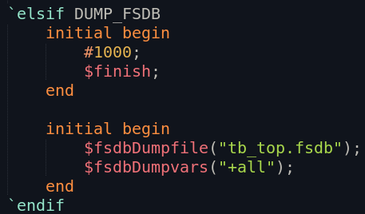

更多 verdi 系统函数可以查看 verdi 官方手册，即下面这个：

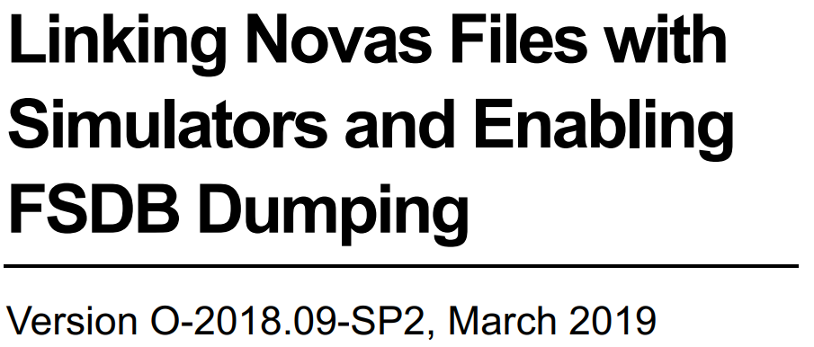

## 3.7 打开verdi界面

### 3.7.1 **（1）code only**

```
verdi -f filelist.f -top tb_top &
```

- -f：指定filelist文件；
- -top：指定top名；

### 3.7.2 **（2）fsdb/ztdb/vf**

```
verdi -ssf tb_top.fsdb -sswr signal.rc &
```

- -ssf：指定fsdb/ztdb/vf文件；
- -sswr：指定波形存储文件；

一般指定了 fsdb 文件就不用指定 filelist 和 top 了，这个指令是最使用的，工作中我多是用这个命令打开 DV 的波形。

### 3.7.3 -dbdir

有时候只指明 fsdb 文件，打开的 verdi 没有层次结构，或者缺些东西，那么需要指定 vcs 编译生成的库

```
verdi -ssf tb_top.fsdb -dbdir simv.daidir &
```

- -ssf：指定fsdb/ztdb/vf文件；
- -dbdir：指定编译数据库；

## 3.8 Verdi命令和快捷键

## 3.9 Verdi常用命令

Verdi 的操作技巧比较多，可以翻阅手册《Verdi and Siloti Command Reference》。

|  |  |
| --- | --- |
| **选项** | **说明** |
| -doc | 打开userGuide |
| -sv | 支持systemverilog语法 |
| +systemverilogext+.sv | 指定sv文件的后缀 |
| -ssv | 取消-v指定的library为lib cell |
| -ssy | 取消-y指定的library为lib cell |
| -ssz | 忽略`celldefine的compiler指令 |
| -top tb | 指定整个环境的top名称为tb |
| -vc | 支持DirectC语法 |
| -f | 指定文件列表 |
| -ssf | 指定波形文件 |
| -sswr | 指定signal.rc文件 |
| -preTitle | 指定GUI界面名称 |
| nologo | 关闭欢迎界面 |
| & | 使Verdi后台运行，不占用terminal |
| +define | 代码中没有指定Define，导致代码灰色，则可以打开verdi时指定 |

## 3.10 Verdi常用快捷键

Verdi 比较多快捷键，需要多多练习才能够掌握，下面是最常用的一些功能：

|  |  |
| --- | --- |
| **目标** | **快捷键** |
| 查看波形 | Ctrl+W |
| 100%显示 | f |
| 缩小波形 | z |
| 放大波形 | Z |
| 移动信号 | 中键选择位置+信号+M |
| 拷贝波形 | Ctrl+P |
| 粘贴波形 | 中间选择位置+Ins |
| 删除信号 | Del |
| 显示信号的绝对路径 | h |
| 重仿真后刷新波形 | L |
| 代码中出现当前时刻的值 | x |
| 直接添加信号 | g |
| 修改波形颜色 | c或t |
| 保存波形信号列表 | r |

更多知识可以查看一些博客总结：<https://blog.csdn.net/immeatea_aun/article/details/80961258>

## 3.11 Verdi常用技巧

## 3.12 fsdb相关

### 3.12.1 单独打开fsdb

使用命令`nWave xxx.fsdb &`即可。再用快捷键 G 添加信号。

### 3.12.2 切割fsdb文件

有时需要将 fsdb 文件提供给 AE 帮忙分析，但是 dump 下来的波形实在太大了，而且包含了很多不该透露的层次结构，这时就需要对 fsdb 文件进行切割，使用的命令是 “**fsdbextract**”。

```
fsdbextract source.fsdb -bt 10us -et 20us -s top/u_module1/u_module2/ -level 0 -o output.fsdb
```

- **source.fsdb：**需要切割的fsdb文件名
- **-bt：**begin time
- **-et：**end time
- **-s：**层次结构
- **-level 0：**该结构及其所有子层级
- **-o output.fsdb：**切割后的fsdb文件名

### 3.12.3 仿真自动切割fsdb文件

按仿真时间自动切割：

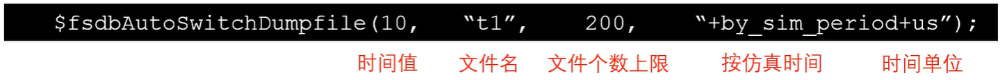

按现实时间自动切割：


### 3.12.4 Virtual Top

fsdb文件的产生源头包含”验证环境“+”DUT“，有的时候我们只有 DUT 代码，Verdi 打开 DUT 后加载该 fsdb 文件，拉信号波形时却报错说”List of Signal(s) Not Found“，那么只需要设置 Virtual Top 即可解决。

1. wave界面按”***g***“键打开”Get Signals“界面，找到”DUT“的 hierarchy 进行复制，如：`/anvu_uvmTestEnv_Top/x_Dut_x/xUser_Tested_NoCx`
2. 新建文本文件”vtop.map"，输入：`my_NOC = anvu_uvmTestEnv_Top.x_Dut_x.xUser_Tested_NoCx`，保存。
3. 重新打开Verdi，命令加上“`verdi -vtop vtop.map -f your_filelist -ssf your_fsdb &`"

注意：若 `.f` 文件中**包含了 `.map` 里指定的顶层模块源文件**（如 `anvu_uvmTestEnv_Top.v`），`-vtop` 选项会完全失效。

## 3.13 打开verdi快一点

### 3.13.1 **（1）环境变量**

1. `lscpu`查看系统支持的thread数量；
2. .cshrc\_local中设置环境变量`setenv FFR_MT_THREAD_COUNT n`，n为thread数量。
3. source ~/.cshrc\_local

### 3.13.2 **（2）preload**

Verdi 根据一个预先写好的配置文件去 load 用户指定的范围：

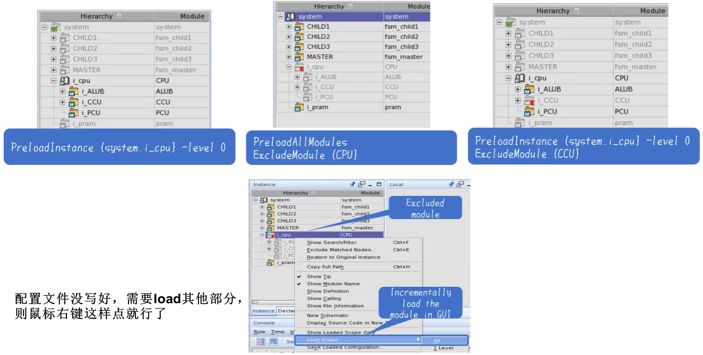

```
verdi -preload Config_file -dbdir ./simv.daidir
```

### 3.13.3 **（3）smart\_load**

Verdi 初始只 load 顶层，根据 debug 操作自动 load 相应范围：

```
verdi -smart_load_kdb -dbdir ./simv.daidir
```

## 3.14 代码显示

### 3.14.1 显示信号值

打开波形后，光标停在某个时刻，按一下 **x** 键，代码会显示这个时刻的值，方便阅读理解。

### 3.14.2 折叠代码

折叠代码可以让代码更方便阅读，不看的部分折叠住，只需要选中行，然后点击键盘的“+”或“-”来展开和折叠代码，如 always 块等。设置如下：

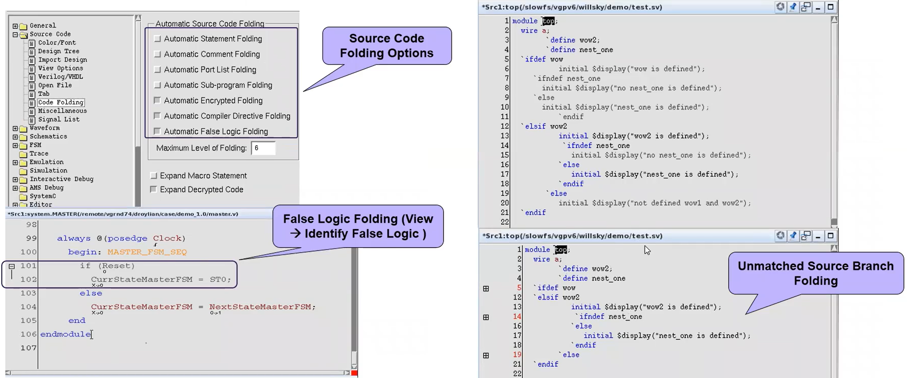

### 3.14.3 假逻辑变灰

View >>> Identify False Logic，可以将不活动的逻辑代码变灰，方便代码阅读。

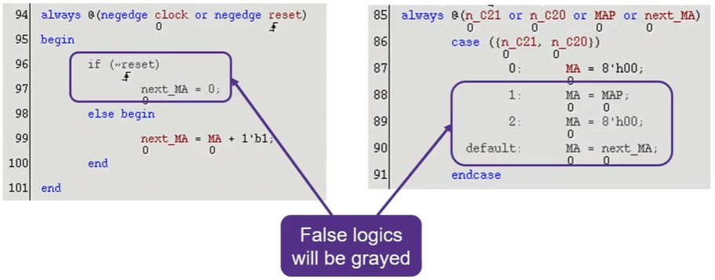

### 3.14.4 显示mem值

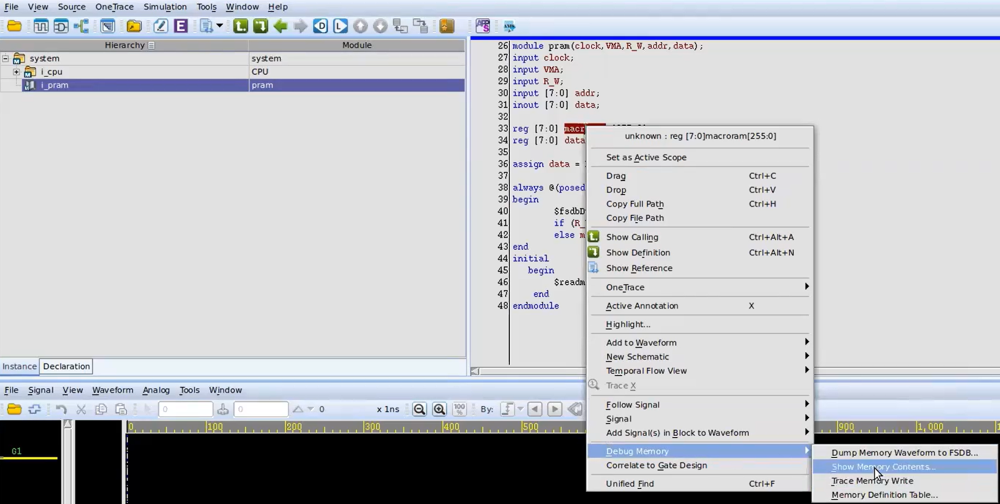

## 3.15 波形显示

### 3.15.1 波形变色

- 按一下 **C** 键，可以选择波形颜色；
- 按一下 **T** 键，可以切换波形颜色；

### 3.15.2 状态机名称

打开波形后，拉好状态机信号，点击一下电路图的图标，波形上就自动显示状态机名称了。

### 3.15.3 握手拍数（数边沿）

- wave 界面选中 clk、awvalid、awready 信号，右键 Logical Operation...，& 成一个新信号，命名”aw\_handshark"，然后选择“Create/Modify"；
- 鼠标选中刚刚创建的信号“aw\_handshark"，右键 Add/Remove >>> Add Counter Signal by >>> Any Change / Rising Edge / Failing Edge。

（如果需要outstanding值，可以将bvalid/bready如法炮制，二者进行逻辑相减即可）

### 3.15.4 时钟频率值

用鼠标左键将光标放在时钟上升沿起点，鼠标中间将另一个光标放在下一个时钟的上升沿，点击下面按钮即可显示时钟频率，这是最常用的办法了。

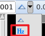

但是在变频 case 中，需要频繁这样操作很麻烦，那么可以用下面的方法将频率值打印出来。

1. 选中时钟，点击 Analog >>> Capture Frequency。
2. 选中新出现的波形，鼠标右键选择“Digital Waveform”

### 3.15.5 带宽利用率

1. 选中 rvalid 和 rready，点击 Logical Operation...，创建“&"的新信号。
2. 选中新信号，用光标确定时间段，右键点击 Signal Event Report...
3. 查看”Duty Cycle“，即是带宽利用率。

### 3.15.6 force信息

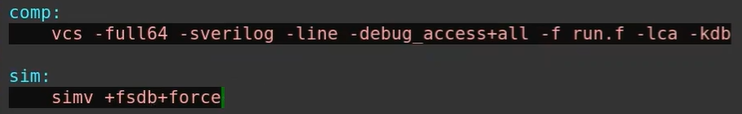

- 步骤一
  - 在 VCS 编译选项种加上”-debug\_access+f“或者”-debug\_access+all“
- 步骤二
  - 在 simv 运行选项中加上”+fsdb+force“
  - 或者，定义环境变量”setenv FSDB\_FORCE 1“

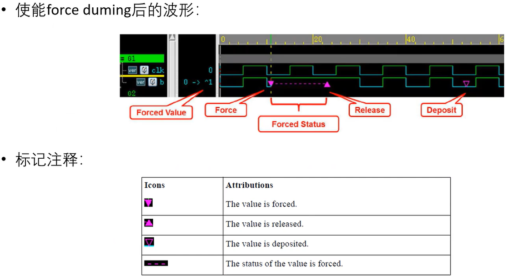

## 3.16 Trace功能

### 3.16.1 OneTrace Chain\_Driver

想 Trace A0，一个个 Trace 则会依次 A0 >>> A1 >>> A2 >>> A3 >>> A4，可以选中 A0，鼠标右键选择”OneTrace >>> Chain\_Driver“，直接追到底。

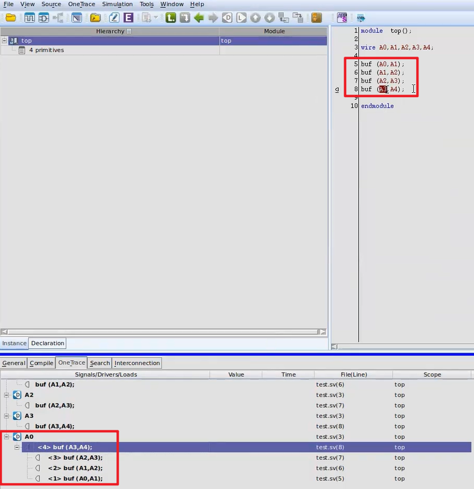

### 3.16.2 Trace X

波形中出现 X 态，可以右键选择”Trace X“，如果不对劲看看设置有没有问题。


结果会在下面三个地方显示出来：

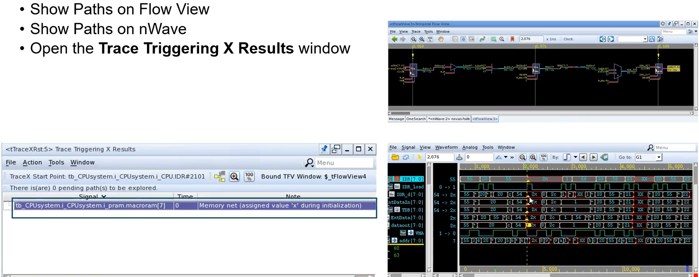

此外，x 态问题也可以用选项 **xrca** 来帮助定位，见下文。

### 3.16.3 Auto Trace

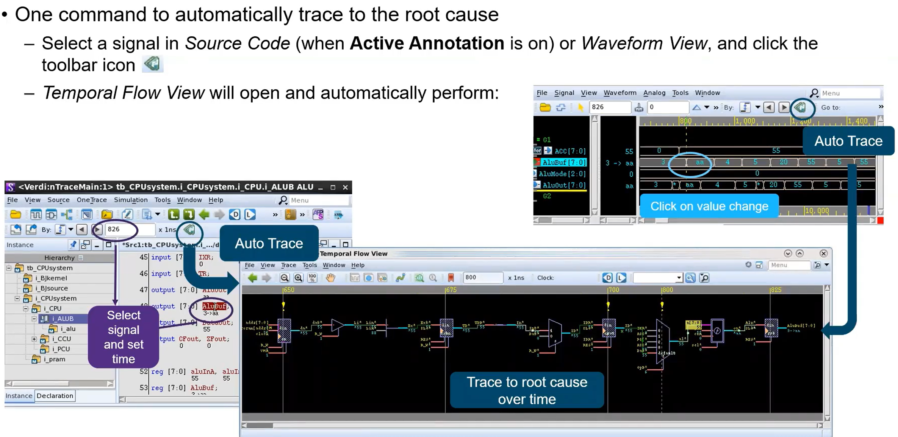

### 3.16.4 TFV

大部分时候追波形都是点三个窗口来回看，一点点找 root cause：
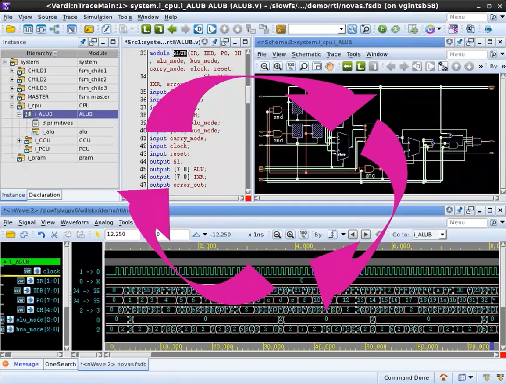

可以试试 TFV（Temporal Flow View）的方式追波形：

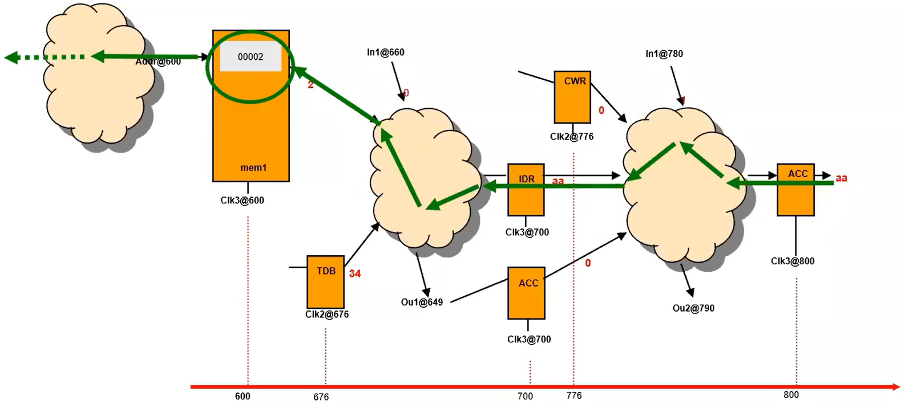

具体用法：

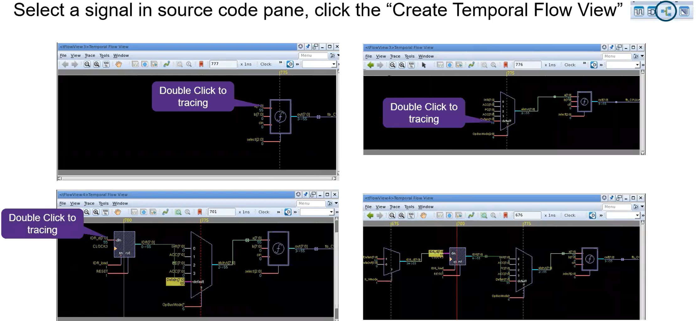

如果不想一个个的点，那么可以选中信号，点击”Trace This Value“，直接显示所有：

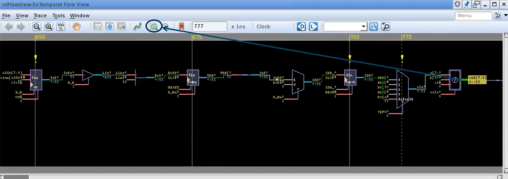

Waveform上也可以点出这个界面：

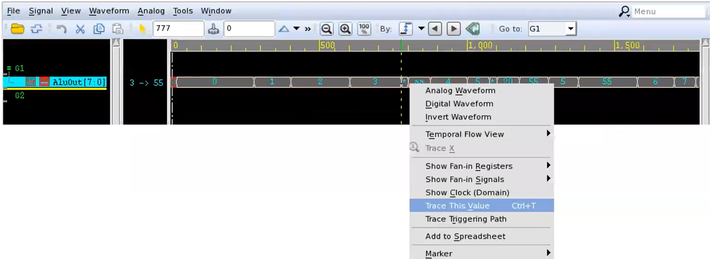

## 3.17 查找vio

### 3.17.1 Trace X

波形中出现 X 态，可以右键选择”Trace X“，如果不对劲看看设置有没有问题。

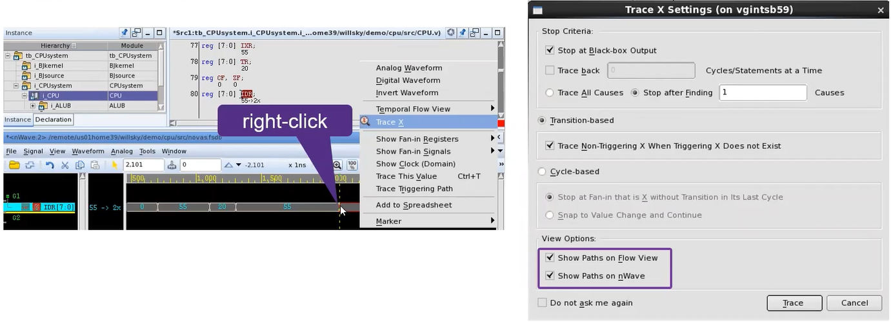

### 3.17.2 xrca选项

**用途：**

- **手动模式：**
  - 经用信号列表捕获了未知数，用户给文件加上-signal\_file 选项；
  - xrca实用程序跟踪给定的未知因素并找到根本原因；
- **自动模式：**
  - 无需给出信号列表，xrca 实用程序将从导入 FSDB 文件中查找所有未知项，并从那时开始跟踪；

**例子：**

```
xrca -lca -dbdir simv.daidir -ssf rtl.fsdb
xrca -lca -ssf rtl.fsdb
xrca -lca -dbdir simv.daidir -ssf rtl.fsdb -signal_file signal.list
```

report 保存在 ./xrcaLog/xrca\_report.xml，更多选项可以用”xrca -lca -h“查看。

report 是 xml 格式，可以用 verdi 打开查看，命令是`verdi -apex -load_trace_report ./xrcaLog/xrca_report.xml &`

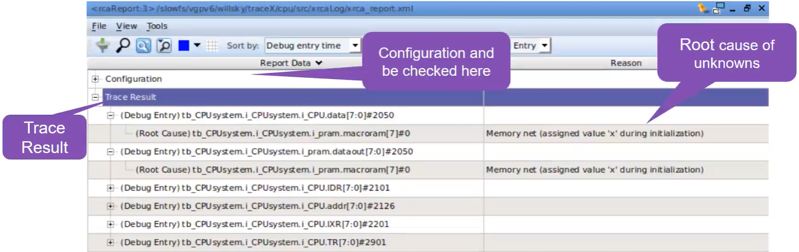

### 3.17.3 smartLog查看所有vio

（1）点击 smartLog

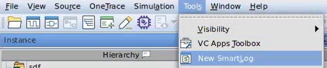

（2）选择 sim.log

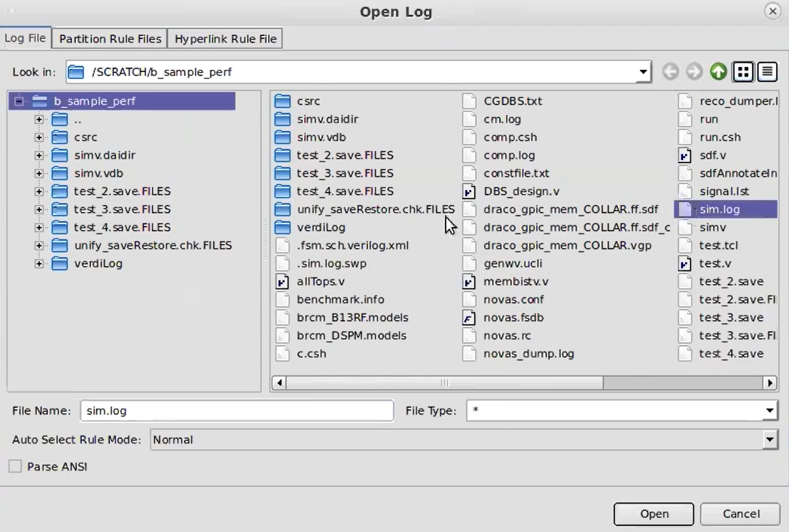

（3）选择 Hyperlink Rule File

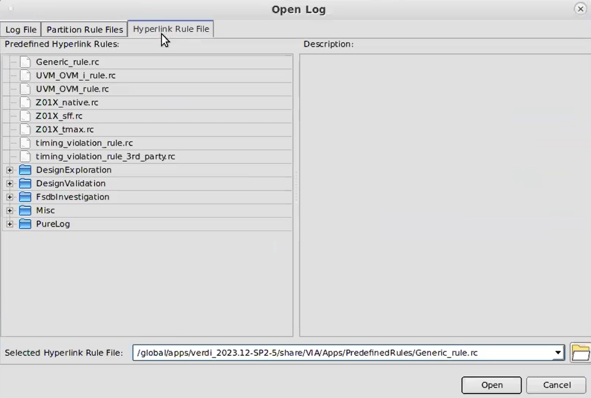

（4）查找 vio

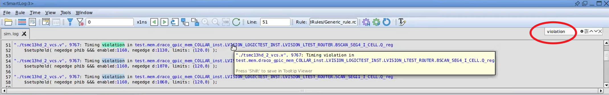

（5）点击rule设置

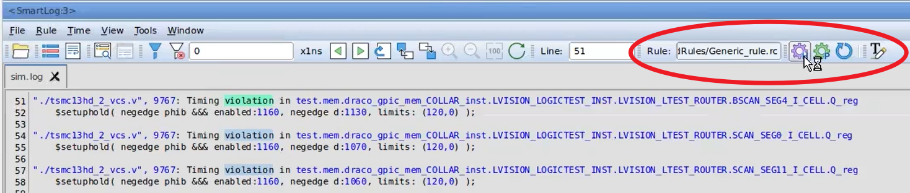

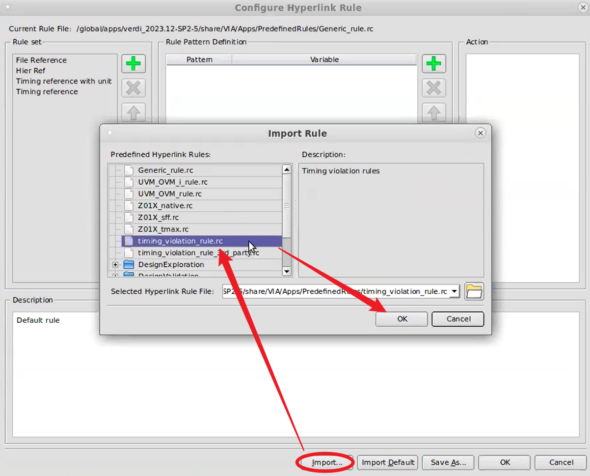

（6）点击 vio 信息就会自动加载波形到需要时间段

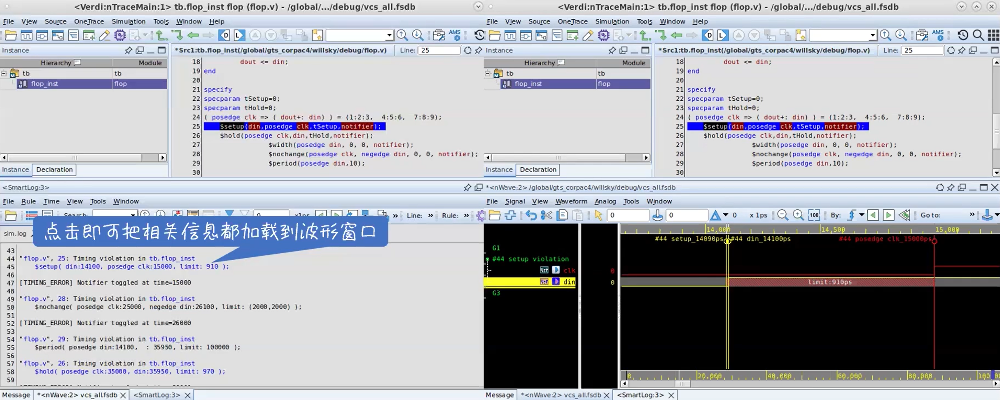

## 3.18 nSchema

### 3.18.1 nSchema视图设置

nSchema 的原始视图直接改 view 只能单次生效，可以在 Preference 处设置，即可永久生效：

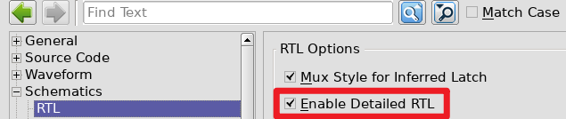

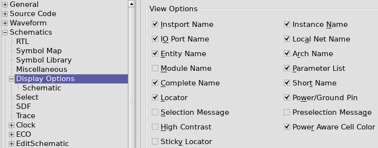

具体功能不啰嗦了，自己多点点点吧，有时候比代码好看些~

### 3.18.2 电路图找逻辑

后仿比较难点代码，可以打开一个新的电路图：

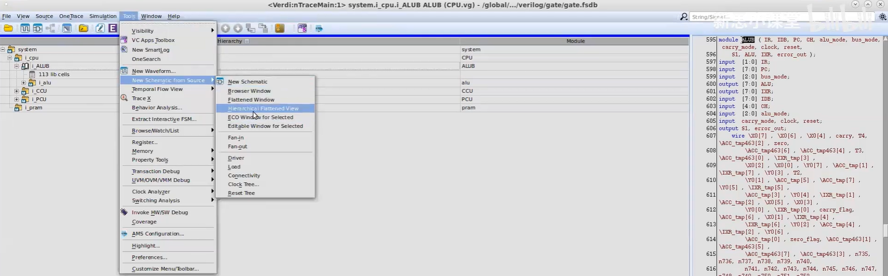

右边代码的信号往左边拖，可以更方便的看来源：

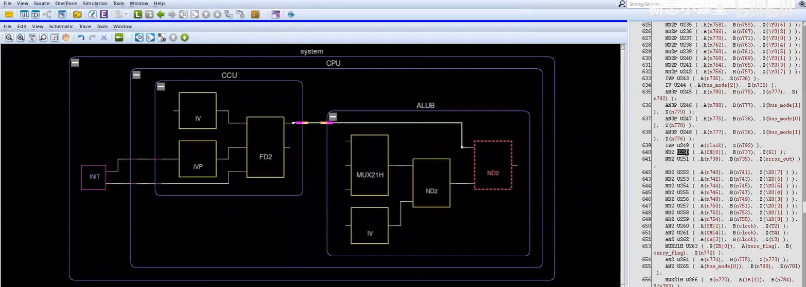

## 3.19 点波形跳转到代码定义处

### 3.19.1 普通方法

双击波形，或者用鼠标将信号拖拽到代码框里，可以跳转到该信号的”trace“处，而不是信号的”definition“处。这时需要继续操作：

- 点击鼠标右键选择”Signal >>> Show Signal Definition“，可以到达信号定义处；
- 或者，点击 Message 框，会呈现刚刚选中的信号的”definition“处和”trace“处，双击”definition“处可以到达代码定义点；

### 3.19.2 修改配置

修改 Preference，就可以实现跳转到该信号的”definition“处了，如下所示：

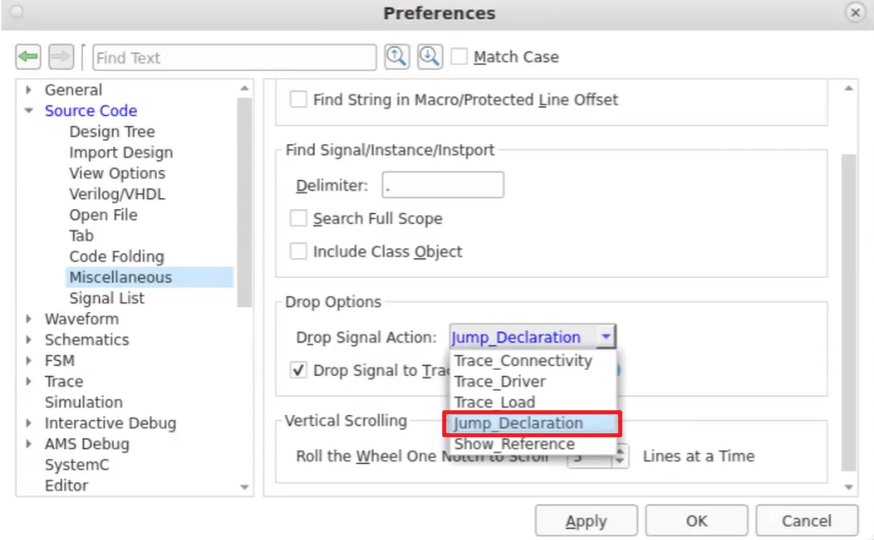

这样设置后，双击波形还是到达信号的”trace“处，但是用鼠标将信号拖拽到代码框里，就能到达信号的”definition“处了。这样想到哪就到哪，非常方便。

### 3.19.3 同步按钮

点亮两个方框的同步按钮，再点击波形信号，代码就会自动同步到定义处了。

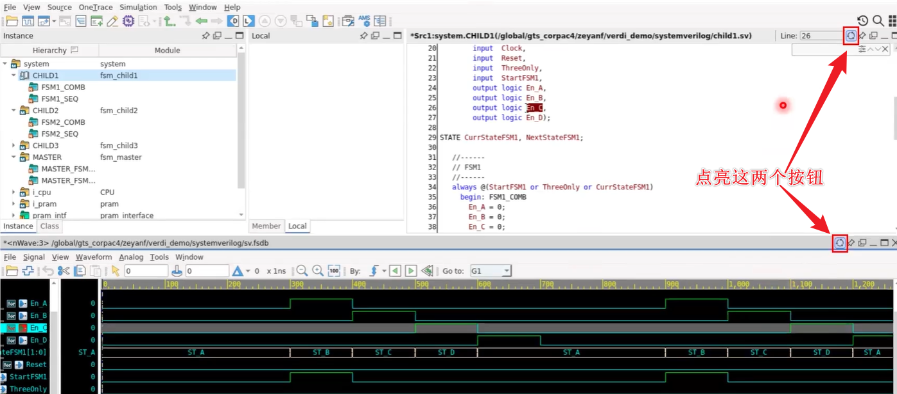

参考资料：

[1] [Bilibili 【芯片EDA技术席老师】](https://space.bilibili.com/627172006/lists/757549?type=season)

[2] [Bilibili 【新思小课堂】](https://space.bilibili.com/1833312766/lists/1467161?type=season)

[3] [芯片验证日记 Verdi用法小节](https://mp.weixin.qq.com/s/ddw2Ala_Yf2VU1tNAjBPpA)

---

# 4. fsdb波形分析接口 -- NPI介绍

> 来源：https://mp.weixin.qq.com/s/e74xzGVvzVdArMx271diqg
> 作者：cpu arch
> update 2026/08/29 13 : 32

fsdb波形读取和解析主要有以下几种方式：

1. 打开Verdi GUI界面，手动查找信号和分析。
2. 使用Synopsys的命令行工具（fsdbreport、fsdb2vcd），不需要加载verdi GUI。
3. 使用Synopsys的NPI接口，不需要加载verdi。

本文主要介绍Synopsys的NPI编程接口，全称为Native Programming Interface，其功能比fsdbreport和fsdb2vcd更加全面和强大，并且不需要加载verdi GUI来手动分析。官方文档和使用参考一般在安装路径下的/verdi/doc/VC\_Apps\_NPI.pdf和/verdi/share/npi/等路径。

NPI接口可以让用户调用实现特定的自动化功能，例如trace driver/load，抓取parameter、port、signal信息等，用户可以通过自动化脚本实现带宽、延迟统计、debug定位、信号trace等功能，极大提高工作效率。

NPI支持C/C++接口和TCL接口，也支持Python。NPI包含了Language model、Netlist Model、Text Model、Power Model、FSDB Model、Coverage Model等模型和功能。并且提供了很多库和函数接口可以直接调用，非常方便。

参考链接里提供了一些使用示例，脚本代码都是开源的，有感兴趣的可以尝试一下。

参考：

[我给AI写了一套"芯片验证SOP"，它真的帮我抓到了bug](https://mp.weixin.qq.com/s?__biz=Mzg4MzU2NTc4Ng==&mid=2247483659&idx=1&sn=e414339b2a20ed79fac544034d77d3c7&scene=21#wechat_redirect)

[xwave：一个让 AI 能直接查波形的命令行工具](https://mp.weixin.qq.com/s?__biz=Mzg4MTc1NzQ2MQ==&mid=2247503809&idx=1&sn=73f1cc7717851bd21e47b1658e79e30b&scene=21#wechat_redirect)
