<!-- toc-start -->

# 目录

[1. 专栏汇总](#1-专栏汇总)  
　　[1.1 卷芯菜不够卷](#11-卷芯菜不够卷)  
[2. 四类低功耗标准单元设计速查指南](#2-四类低功耗标准单元设计速查指南)  
　　[2.1 四类单元核心定位与基础属性](#21-四类单元核心定位与基础属性)  
　　[2.2 各单元关键使用规则](#22-各单元关键使用规则)  
　　[2.3 典型场景组合速查](#23-典型场景组合速查)  
　　[2.4 高频误区提醒](#24-高频误区提醒)  
[3. 低功耗设计概述——为什么我们需要关心功耗？](#3-低功耗设计概述为什么我们需要关心功耗)  
　　[3.1 为什么需要低功耗？](#31-为什么需要低功耗)  
　　[3.2 功耗的组成——动态、静态与漏电流](#32-功耗的组成动态静态与漏电流)  
　　　　[3.2.1 动态功耗](#321-动态功耗)  
　　　　[3.2.2 静态功耗](#322-静态功耗)  
　　　　[3.2.3 漏电流的几种类型](#323-漏电流的几种类型)  
　　[3.3 低功耗设计的挑战](#33-低功耗设计的挑战)  
　　[3.4 低功耗设计的趋势](#34-低功耗设计的趋势)  
[4. 功耗分析基础](#4-功耗分析基础)  
　　[4.1 功耗计算模型](#41-功耗计算模型)  
　　　　[4.1.1 动态功耗（开关功耗）](#411-动态功耗开关功耗)  
　　　　[4.1.2 静态功耗（漏电功耗）](#412-静态功耗漏电功耗)  
　　[4.2 电压与频率的关系](#42-电压与频率的关系)  
　　　　[4.2.1 临界路径延迟](#421-临界路径延迟)  
　　　　[4.2.2 电压-频率权衡](#422-电压-频率权衡)  
　　[4.3 工艺节点对功耗的影响](#43-工艺节点对功耗的影响)  
　　　　[4.3.1 动态功耗 vs 静态功耗趋势](#431-动态功耗-vs-静态功耗趋势)  
　　　　[4.3.2 先进工艺的关键问题](#432-先进工艺的关键问题)  
　　[4.4 本章小结](#44-本章小结)  
[5. 低功耗设计方法学](#5-低功耗设计方法学)  
　　[5.1 核心观点](#51-核心观点)  
　　[5.2 架构级：从源头掐灭功耗](#52-架构级从源头掐灭功耗)  
　　　　[5.2.1 并行与流水线](#521-并行与流水线)  
　　　　[5.2.2 动态电压频率调整（DVFS）](#522-动态电压频率调整dvfs)  
　　　　[5.2.3 电源门控（Power Gating）](#523-电源门控power-gating)  
　　[5.3 RTL级：代码里的功耗学问](#53-rtl级代码里的功耗学问)  
　　　　[5.3.1 门控时钟（Clock Gating）](#531-门控时钟clock-gating)  
　　　　[5.3.2 操作数隔离（Operand Isolation）](#532-操作数隔离operand-isolation)  
　　　　[5.3.3 状态机编码](#533-状态机编码)  
　　[5.4 门级：网表里的精细活](#54-门级网表里的精细活)  
　　　　[5.4.1 多阈值电压单元](#541-多阈值电压单元)  
　　　　[5.4.2 门级功耗优化（GPO）](#542-门级功耗优化gpo)  
　　[5.5 版图级：物理实现的最后一公里](#55-版图级物理实现的最后一公里)  
　　　　[5.5.1 电源网络优化](#551-电源网络优化)  
　　　　[5.5.2 时钟树综合（CTS）](#552-时钟树综合cts)  
　　　　[5.5.3 布局布线优化](#553-布局布线优化)  
　　[5.6 四个阶段的协同](#56-四个阶段的协同)  
　　[5.7 本章小结](#57-本章小结)  
[6. 时钟门控技术](#6-时钟门控技术)  
　　[6.1 核心观点](#61-核心观点)  
　　[6.2 原理：为什么要"关掉"时钟？](#62-原理为什么要关掉时钟)  
　　[6.3 实现方式：两种主流方案](#63-实现方式两种主流方案)  
　　　　[6.3.1 基于锁存器的时钟门控 ✅（推荐）](#631-基于锁存器的时钟门控-推荐)  
　　　　[6.3.2 基于寄存器的时钟门控 ❌（不推荐）](#632-基于寄存器的时钟门控-不推荐)  
　　[6.4 综合插入：工具怎么帮你做？](#64-综合插入工具怎么帮你做)  
　　　　[6.4.1 自动插入条件](#641-自动插入条件)  
　　　　[6.4.2 DC 综合命令](#642-dc-综合命令)  
　　[6.5 常见陷阱](#65-常见陷阱)  
　　　　[6.5.1 陷阱一：门控时钟的毛刺问题 ❌](#651-陷阱一门控时钟的毛刺问题)  
　　　　[6.5.2 陷阱二：门控时钟的时序分析 ❌](#652-陷阱二门控时钟的时序分析)  
　　　　[6.5.3 陷阱三：门控使能信号的 glitch ❌](#653-陷阱三门控使能信号的-glitch)  
　　[6.6 实战案例：16位数据通路](#66-实战案例16位数据通路)  
　　　　[6.6.1 原始 RTL](#661-原始-rtl)  
　　　　[6.6.2 功耗对比](#662-功耗对比)  
　　　　[6.6.3 额外优化](#663-额外优化)  
　　[6.7 本章小结](#67-本章小结)  
[7. 多阈值电压库](#7-多阈值电压库)  
　　[7.1 核心类比](#71-核心类比)  
　　[7.2 HVT、LVT、SLVT 三兄弟对比](#72-hvtlvtslvt-三兄弟对比)  
　　[7.3 多阈值综合策略：三步走](#73-多阈值综合策略三步走)  
　　　　[7.3.1 第一步：全 HVT 综合](#731-第一步全-hvt-综合)  
　　　　[7.3.2 第二步：局部替换 LVT（精准替换）](#732-第二步局部替换-lvt精准替换)  
　　　　[7.3.3 第三步：SLVT 救急](#733-第三步slvt-救急)  
　　　　[7.3.4 综合约束命令](#734-综合约束命令)  
　　[7.4 时序与功耗的权衡：找平衡点](#74-时序与功耗的权衡找平衡点)  
　　　　[7.4.1 功耗类型与策略选择](#741-功耗类型与策略选择)  
　　　　[7.4.2 安全余量](#742-安全余量)  
　　[7.5 实战避坑指南](#75-实战避坑指南)  
　　[7.6 本章小结](#76-本章小结)  
[8. 电源门控技术](#8-电源门控技术)  
　　[8.1 核心思想](#81-核心思想)  
　　[8.2 基本原理](#82-基本原理)  
　　[8.3 电源开关单元（PSW）](#83-电源开关单元psw)  
　　　　[8.3.1 实现方式](#831-实现方式)  
　　　　[8.3.2 驱动能力选择](#832-驱动能力选择)  
　　[8.4 状态保持策略](#84-状态保持策略)  
　　　　[8.4.1 SHR 注意事项](#841-shr-注意事项)  
　　[8.5 唤醒时间](#85-唤醒时间)  
　　[8.6 浪涌电流控制](#86-浪涌电流控制)  
　　　　[8.6.1 三种控制方法](#861-三种控制方法)  
　　　　[8.6.2 链式使能结构（推荐）](#862-链式使能结构推荐)  
　　[8.7 完整验证清单](#87-完整验证清单)  
　　[8.8 本章小结](#88-本章小结)  
[9. 多电压域设计](#9-多电压域设计)  
　　[9.1 为什么要划分电压域？](#91-为什么要划分电压域)  
　　[9.2 电平转换器（Level Shifter）——跨电压域的桥梁](#92-电平转换器level-shifter跨电压域的桥梁)  
　　　　[9.2.1 电平转换器的类型](#921-电平转换器的类型)  
　　　　[9.2.2 电平转换器的UPF实现](#922-电平转换器的upf实现)  
　　[9.3 隔离单元（Isolation Cell）——断电时的守护神](#93-隔离单元isolation-cell断电时的守护神)  
　　　　[9.3.1 隔离策略](#931-隔离策略)  
　　　　[9.3.2 隔离单元的UPF实现](#932-隔离单元的upf实现)  
　　[9.4 电压域划分的实战要点](#94-电压域划分的实战要点)  
[10. 动态电压频率调整](#10-动态电压频率调整)  
　　[10.1 DVFS的核心原理](#101-dvfs的核心原理)  
　　[10.2 DVFS的实现架构](#102-dvfs的实现架构)  
　　　　[10.2.1 硬件层](#1021-硬件层)  
　　　　[10.2.2 固件/软件层](#1022-固件软件层)  
　　　　[10.2.3 协同工作流程](#1023-协同工作流程)  
　　[10.3 软件与硬件的协同细节](#103-软件与硬件的协同细节)  
　　[10.4 实战案例：一个四核CPU的DVFS设计](#104-实战案例一个四核cpu的dvfs设计)  
　　　　[10.4.1 架构选择](#1041-架构选择)  
　　　　[10.4.2 电压频率表](#1042-电压频率表)  
　　　　[10.4.3 硬件实现](#1043-硬件实现)  
　　　　[10.4.4 软件控制](#1044-软件控制)  
　　[10.5 避坑指南](#105-避坑指南)  
　　[10.6 小结](#106-小结)  
[11. UPF基础概念](#11-upf基础概念)  
　　[11.1 什么是UPF？—— 说白了就是低功耗的"设计说明书"](#111-什么是upf-说白了就是低功耗的设计说明书)  
　　[11.2 UPF的发展历史：CPF vs UPF，一场标准之争](#112-upf的发展历史cpf-vs-upf一场标准之争)  
　　[11.3 UPF在低功耗流程中的角色](#113-upf在低功耗流程中的角色)  
　　　　[11.3.1 角色一：沟通的"通用语言"](#1131-角色一沟通的通用语言)  
　　　　[11.3.2 角色二：工具的"执行指令"](#1132-角色二工具的执行指令)  
　　　　[11.3.3 角色三：验证的"黄金参考"](#1133-角色三验证的黄金参考)  
[12. UPF电源状态定义](#12-upf电源状态定义)  
　　[12.1 端口状态定义：add\_port\_state](#121-端口状态定义add_port_state)  
　　[12.2 电源状态定义：add\_power\_state](#122-电源状态定义add_power_state)  
　　[12.3 电源状态表（PST）的构建](#123-电源状态表pst的构建)  
　　[12.4 实战中的注意事项](#124-实战中的注意事项)  
　　[12.5 完整示例：一个简单的电源状态定义](#125-完整示例一个简单的电源状态定义)  
[13. UPF中的电平转换器](#13-upf中的电平转换器)  
　　[13.1 电平转换器的基本概念](#131-电平转换器的基本概念)  
　　[13.2 set\_level\_shifter策略详解](#132-set_level_shifter策略详解)  
　　[13.3 自动插入 vs 手动指定](#133-自动插入-vs-手动指定)  
　　　　[13.3.1 自动插入](#1331-自动插入)  
　　　　[13.3.2 手动指定](#1332-手动指定)  
　　[13.4 电平转换器的规则检查](#134-电平转换器的规则检查)  
　　[13.5 实际项目中的策略选择](#135-实际项目中的策略选择)  
　　　　[13.5.1 ⚖️ `-location` 和 `-applies_to` 的关系：坐标轴模型](#1351-location-和-applies_to-的关系坐标轴模型)  
　　　　[13.5.2 🗺️ `-location` 与 `-applies_to` 的组合矩阵](#1352-location-与-applies_to-的组合矩阵)  
　　[13.6 小结](#136-小结)  
[14. UPF中的隔离单元](#14-upf中的隔离单元)  
　　[14.1 set\_isolation 策略：怎么加隔离](#141-set_isolation-策略怎么加隔离)  
　　[14.2 隔离控制信号：谁来发指令](#142-隔离控制信号谁来发指令)  
　　[14.3 保持模式 vs 钳位模式](#143-保持模式-vs-钳位模式)  
　　[14.4 隔离单元的物理实现](#144-隔离单元的物理实现)  
[15. UPF中的状态保持](#15-upf中的状态保持)  
　　[15.1 什么是状态保持？为什么需要它？](#151-什么是状态保持为什么需要它)  
　　[15.2 set\_retention策略详解](#152-set_retention策略详解)  
　　[15.3 保存与恢复控制](#153-保存与恢复控制)  
　　[15.4 保持寄存器综合](#154-保持寄存器综合)  
　　　　[15.4.1 📐 面积差异：定性分析](#1541-面积差异定性分析)  
[16. UPF中的电源开关](#16-upf中的电源开关)  
　　[16.1 电源开关的基本概念](#161-电源开关的基本概念)  
　　[16.2 create\_power\_switch命令详解](#162-create_power_switch命令详解)  
　　[16.3 开关控制逻辑](#163-开关控制逻辑)  
　　[16.4 开关链设计](#164-开关链设计)  
　　[16.5 实际项目中的避坑指南](#165-实际项目中的避坑指南)  
[17. UPF低功耗验证基础](#17-upf低功耗验证基础)  
　　[17.1 什么是静态验证（UPF Lint）？](#171-什么是静态验证upf-lint)  
　　[17.2 什么是动态验证（仿真）？](#172-什么是动态验证仿真)  
　　[17.3 手写 SVA（SystemVerilog Assertions）](#173-手写-svasystemverilog-assertions)  
　　[17.4 静态验证 vs 动态验证：一张表说清楚](#174-静态验证-vs-动态验证一张表说清楚)  
　　[17.5 先做静态，再做动态——这是我的习惯](#175-先做静态再做动态这是我的习惯)  
　　[17.6 一个简单的例子](#176-一个简单的例子)  
　　[17.7 总结一下](#177-总结一下)  
[18. UPF仿真流程](#18-upf仿真流程)  
　　[18.1 VCS中的UPF编译与仿真](#181-vcs中的upf编译与仿真)  
　　[18.2 QuestaSim中的UPF编译与仿真](#182-questasim中的upf编译与仿真)  
　　[18.3 UPF仿真选项详解](#183-upf仿真选项详解)  
　　[18.4 波形调试技巧](#184-波形调试技巧)  
　　[18.5 常见问题与调试方法](#185-常见问题与调试方法)  
[19. UPF与逻辑综合](#19-upf与逻辑综合)  
　　[19.1 DC/Genus中读取UPF的基本流程](#191-dcgenus中读取upf的基本流程)  
　　[19.2 多电压综合的关键配置](#192-多电压综合的关键配置)  
　　[19.3 综合后的报告分析](#193-综合后的报告分析)  
　　[19.4 常见问题与避坑指南](#194-常见问题与避坑指南)  
[20. UPF与物理实现](#20-upf与物理实现)  
　　[20.1 ICC2与Innovus中的UPF流程](#201-icc2与innovus中的upf流程)  
　　[20.2 电源网络规划](#202-电源网络规划)  
　　[20.3 PG连接](#203-pg连接)  
　　[20.4 多电压域的特殊处理](#204-多电压域的特殊处理)  
　　[20.5 验证与检查](#205-验证与检查)  

<!-- toc-end -->

---

# 1. 专栏汇总

## 1.1 卷芯菜不够卷

[芯片低功耗设计](https://mp.weixin.qq.com/mp/appmsgalbum?__biz=MzYzNDEzNTEzNg==&action=getalbum&album_id=4593598138716045316&subscene=126&scenenote=https%3A%2F%2Fmp.weixin.qq.com%2Fs%3F__biz%3DMzYzNDEzNTEzNg%3D%3D%26mid%3D2247485425%26idx%3D1%26sn%3Df64e2fc0c283f11a11f2b541eb99312e%26chksm%3Df1486a590c09fdcae8e01e7752ed9e5c6c10e333c00adfd1692119f7f1ac7012b5942c645345%26sessionid%3D1788829422%26scene%3D126%26clicktime%3D1788829614%26enterid%3D1788829614%26subscene%3D10000%26ascene%3D3%26fasttmpl_type%3D0%26fasttmpl_fullversion%3D8424583-zh_CN-zip%26fasttmpl_flag%3D0%26realreporttime%3D1788829614098%26devicetype%3Dandroid-34%26version%3D28004a52%26nettype%3D3gnet%26abtest_cookie%3DAAACAA%3D%3D%26lang%3Dzh_CN%26session_us%3Dgh_671cb9c711f7%26countrycode%3DCN%26exportkey%3Dn_ChQIAhIQU7Gs5vsuuQoCwAfF1JgiFxLlAQIE97dBBAEAAAAAAB%2FfJShS86kAAAAOpnltbLcz9gKNyK89dVj0VvzCVXfT2qb3ev9c6jhnH3ttWeRKGOANoSb2PJvWQOsEMrziw%2BkFkr2Wzeidm%2FqDDRyCdcyY9n%2BJ1R8mz2xdq7w1RAmIGMeLdhuOitparTeK6cXDmzW2fK19l%2F8rX7Aa38DbAH5iaeQkFnKf0d3gsHsFihUzgtiTj0vrufJXu19l6TiXM5mQULvjKvxvIrZ1cFxoeZI7uov06PFOaTmJotGe7FeZAqnD9643sKQTV8CTB7YKS5jAv0B9A72ygrk%3D%26pass_ticket%3DW253R1VHfPu1wlAFbzPYHSTjKADaz%2BiaZ2CijUrzLrZGpDLs4Hd%2BiMA9nKc95evi%26wx_header%3D3&nolastread=1#wechat_redirect)

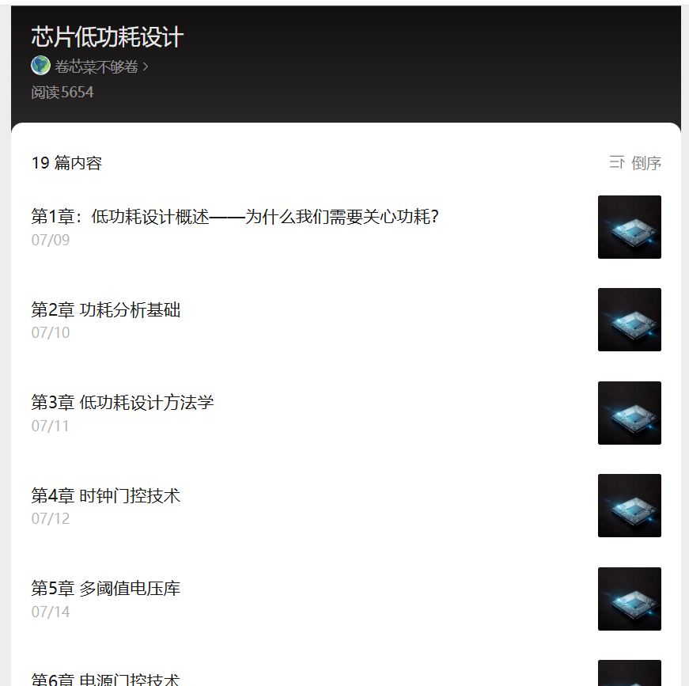


# 2. 四类低功耗标准单元设计速查指南

> 来源：https://mp.weixin.qq.com/s/hY-t2D5KPqOPxBL0vPFwxg
> 作者：原野
> update 2026/08/22 08 : 07

以下是四类低功耗标准单元的核心信息总结，覆盖功能定位、选型规则、放置要求与典型场景组合，可直接作为设计速查。

## 2.1 四类单元核心定位与基础属性

单元类型 核心解决问题 供电方式 控制信号 核心应用场景

Level Shifter (LS) 跨电压域电平不匹配，转换信号电平幅值 双电源（源域 + 目标域） 无 任意电压不同的两个电源域信号交互

Isolation Cell (ISO) 电源关断时不定态传播，钳位信号至固定电平 单电源（仅常开电源） 隔离使能 iso\_en 存在电源关断的跨域信号交互

ELS (带使能电平转换) 同时解决电平转换 + 隔离钳位，ISO+LS 二合一 双电源（源域 + 目标域） 隔离使能 iso\_en 同时跨电压 + 跨关断域的信号交互

Power Switch 电源域通断控制，实现掉电省电 输入接真实电源、输出接虚拟电源 睡眠使能 sleep\_en 所有可关断电源域的电源通路控制

## 2.2 各单元关键使用规则

1. Level Shifter

    • 单向器件：分低转高（L2H）、高转低（H2L），不可反向使用

    • 放置原则：统一放在目标电压域边界，输出端靠近负载，减少输出路径损耗

    • 能力边界：仅处理电平匹配，不解决跨时钟亚稳态、不解决掉电不定态

2. Isolation Cell

    • 分类：低钳位、高钳位，需根据后级电路的安全状态选型

    • 铁则：自身必须由常开电源供电，绝对不能放置在可关断域内

    • 放置规则：

    • 关断域→常开域（输出隔离）：放在常开接收域

    • 常开域→关断域（输入隔离）：放在常开发送域

    • 时序铁则：先隔离，后断电；先上电，后撤隔离

3. ELS

    • 本质：ISO 与 LS 集成的复合单元，功能与二者串联完全等效

    • 分类：按转换方向分 L2H/H2L；按隔离位置分输出隔离型（关断→常开）、输入隔离型（常开→关断）

    • 优势：面积更小、路径延迟更低、后端布线更简单，工业界优先选用

    • 放置：与分离式组合的放置逻辑完全对应，隔离侧必须落在常开电源域

4. Power Switch

主流为 Header PMOS 型，三大选型原则：

    1. 链结构：优先选双链分级结构（预充小管 + 主开关大管），大幅抑制上电浪涌电流；单链仅用于极小、低电流电源域

    2. 输出 Buffer：优先选择 Buffer 输出，保证长菊花链信号边沿质量；无 Buffer 仅用于极短链或链路末端

    3. 独立 NWELL：强制可靠性要求，开关管 N 阱独立隔离、单独接常开真实电源，防止关断态衬底漏电与闩锁效应

## 2.3 典型场景组合速查

信号流向 所需单元 放置 / 顺序

不同电压 + 无电源关断 仅 Level Shifter 目标电压域边界

同电压 + 关断域→常开域 仅 Isolation Cell 常开域边界

可关断低压→常开高压 ELS（输出隔离型 L2H）

或 LS → ISO（分离式） 常开高压域边界

常开低压→可关断高压 ELS（输入隔离型 L2H）

或 ISO → LS（分离式） ISO/ELS 在常开低压域，LS 输出侧在可关断高压域

可关断域电源通断控制 Power Switch（双链 + 带 Buffer + 独立 NWELL） 关断域四周 / 内部，沿电源轨排布

## 2.4 高频误区提醒

    1. LS 不能替代 ISO：LS 源域掉电后输出仍为不定态，无法阻断漏电

    2. ISO 不能替代 LS：同电压域才可用纯 ISO，电压不同必须做电平转换

    3. 隔离单元禁止放在可关断域：掉电后自身失电，完全失去隔离作用

    4. Power Switch 独立 N 阱禁止接虚拟电源：会引发衬底漏电与闩锁风险

需要我补充对应的 UPF 约束命令模板吗？

|（注：部分内容可能由 AI 生成）

---

# 3. 低功耗设计概述——为什么我们需要关心功耗？

> 来源：https://mp.weixin.qq.com/s?__biz=MzYzNDEzNTEzNg==&mid=2247485279&idx=1&sn=350ba84a9f4f87b73bdcd5f353e732f7&chksm=f0a23050c7d5b946c5065af7abc8d2129feba6d6de270c7c91e08d3eac5d44dc6060b441a05a&scene=178&cur_album_id=4593598138716045316&search_click_id=#rd
> 作者：扬帆远航0727
> update 2026/09/15 21 : 58
> **已截图**

最近在学习一些低功耗的知识，接下来会连载我找到的一些芯片低功耗设计的资料。

各位同学，大家好。我是你们的讲师，一个在芯片设计领域摸爬滚打了十几年的老兵。今天咱们开始第一课，聊聊低功耗设计。

你可能会问，现在芯片性能不是越来越强吗？为什么非要跟功耗过不去？说白了，功耗问题已经成了芯片设计的"卡脖子"环节。我刚开始做设计那会儿，大家更关心的是"能不能跑起来"、“频率够不够高”。但现在？功耗指标要是没过，流片回来就是一堆废铁。

## 3.1 为什么需要低功耗？

原因其实很直白，我归纳为三个层面：

- **散热与可靠性**

  ：芯片功耗越高，发热越严重。温度一上去，漏电流暴增，芯片寿命缩短。我在项目中遇到过一块AI加速芯片，因为功耗估算不足，散热方案没做好，跑起来直接"烫手"，最后不得不降频使用。
- **电池续航**

  ：手机、手表、IoT设备，用户可不想一天充三次电。你想想看，一个智能手环，如果功耗控制不好，续航只有半天，谁会买？
- **成本与封装**

  ：高功耗意味着需要更贵的封装（比如陶瓷封装、加散热片），甚至需要主动散热（风扇）。这些成本，最终都会转嫁到产品价格上。

> **核心观点**：低功耗设计不是"锦上添花"，而是"雪中送炭"。没有功耗意识的设计，在今天的市场竞争中寸步难行。

## 3.2 功耗的组成——动态、静态与漏电流

要解决功耗问题，首先得知道功耗从哪来。芯片功耗主要分三块：动态功耗、静态功耗和漏电流功耗。嗯，这里要注意，很多人容易把静态功耗和漏电流搞混，我习惯把它们分开讲。

### 3.2.1 动态功耗

动态功耗，说白了就是电路在"干活"时消耗的能量。它由两部分组成：

- **开关功耗**

  ：当门电路从0变1或从1变0时，需要对负载电容充放电。公式是：`P_sw = α × C_L × Vdd² × f`。其中α是翻转率，C\_L是负载电容，Vdd是电压，f是频率。
- **短路功耗**

  ：在信号翻转的瞬间，PMOS和NMOS会同时导通一小段时间，形成从电源到地的短路电流。

动态功耗是传统设计中占主导的功耗来源。我记得早期做手机芯片时，大家拼命降电压、降频率，就是为了压动态功耗。

### 3.2.2 静态功耗

静态功耗，是电路"闲着"的时候也在消耗的能量。它主要来自晶体管的漏电流。随着工艺节点不断缩小（从28nm到7nm再到3nm），静态功耗占比越来越高。

静态功耗的公式很简单：`P_static = I_leak × Vdd`。I\_leak就是漏电流。

### 3.2.3 漏电流的几种类型

漏电流不是一种，而是好几种。我给大家列个表，一目了然：

| 漏电流类型 | 英文缩写 | 产生原因 | 特点 |
| --- | --- | --- | --- |
| 亚阈值漏电流 | Isub | 晶体管关断时，沟道中仍有少量载流子通过 | 随温度升高指数级增加 |
| 栅极漏电流 | Igate | 栅氧化层太薄，电子隧穿通过 | 随栅氧厚度减小而增大 |
| 栅极感应漏电流 | GIDL | 漏极与栅极之间的强电场导致 | 在关断状态下明显 |
| PN结漏电流 | Irev | 源/漏与衬底之间的反向偏置PN结 | 随温度升高而增大 |

> **个人经验**：在28nm以下工艺中，亚阈值漏电流是"大头"。我曾经做过一个项目，芯片在待机模式下，静态功耗占了总功耗的60%以上。如果不做电源关断（Power Gating），电池根本撑不住。

## 3.3 低功耗设计的挑战

低功耗设计听起来简单，做起来全是坑。我总结了几大挑战：

- **性能与功耗的博弈**

  ：降电压能省电，但电路跑不快。提频率能提升性能，但功耗飙升。这个平衡点，很难找。
- **工艺波动的影响**

  ：先进工艺下，晶体管的阈值电压、沟道长度都有波动。同一片晶圆上，不同芯片的漏电流可能差好几倍。我在项目中就遇到过，同一批芯片，有的待机功耗只有1mW，有的却高达5mW。
- **温度效应**

  ：温度越高，漏电流越大。漏电流越大，芯片越热。这是个正反馈，搞不好就热失控。
- **设计复杂度**

  ：引入多电压域、电源关断、动态电压频率调整（DVFS）等技术，设计验证的复杂度成倍增加。

> **避坑指南**：我曾经在一个项目中，为了省功耗，把某个模块的电压降得太低，结果导致时序收敛不了。最后不得不重新调整电压域划分，浪费了两周时间。所以，低功耗设计一定要从架构层面就开始规划，不能等到后端再补救。

## 3.4 低功耗设计的趋势

未来低功耗设计往哪走？我个人认为有几个方向：

1. **更精细的功耗管理**

   ：从芯片级到模块级，甚至到寄存器级，实现"按需供电"。
2. **自适应电压调节**

   ：根据芯片的实际工作状态，动态调整电压和频率。比如，跑视频解码时用0.8V，待机时降到0.5V。
3. **新型器件与材料**

   ：比如FD-SOI、FinFET、GAAFET，甚至未来的碳纳米管、自旋电子器件，都能从物理层面降低功耗。
4. **AI辅助功耗优化**

   ：用机器学习来预测功耗热点，自动调整设计参数。这个方向我最近在关注，感觉很有潜力。

好了，第一章的内容就到这里。低功耗设计不是一门"玄学"，而是有章可循的工程方法。从下一章开始，我们会深入UPF（统一功耗格式），看看怎么用标准化的方式描述和管理功耗意图。

---

# 4. 功耗分析基础

> 来源：https://mp.weixin.qq.com/s?__biz=MzYzNDEzNTEzNg==&mid=2247485289&idx=1&sn=d5a6cc0be98dd526eae085fc32e853d4&chksm=f0a23066c7d5b970119cbe1528be619ad7cf76e45ab0028dea3b472fb4d458efa9506a6fdafa&scene=178&cur_album_id=4593598138716045316&search_click_id=#rd
> 作者：扬帆远航0727
> update 2026/09/15 21 : 58
> **已截图**

> 功耗分析基础：功耗计算模型，电压与频率的关系，工艺节点对功耗的影响

## 4.1 功耗计算模型

芯片的功耗分为两大类：**动态功耗** 和 **静态功耗**。

### 4.1.1 动态功耗（开关功耗）

发生在电路状态翻转时（给负载电容充放电）。

计算公式：

```
P_dynamic = α × C_L × V_DD² × f
```

| 参数 | 含义 |
| --- | --- |
| **α** | 翻转活动因子，每个时钟周期内节点平均翻转次数 |
| **C\_L** | 负载电容（门电容 + 连线电容 + 扇出输入电容） |
| **V\_DD** | 供电电压（**平方关系**） |
| **f** | 工作频率 |

> **核心结论**：动态功耗和电压的平方成正比，和频率成正比。降电压是降低动态功耗最有效的手段。

### 4.1.2 静态功耗（漏电功耗）

电路不翻转时也在耗电（晶体管关断时源漏之间仍有漏电流）。

计算公式：

```
P_static = I_leakage × V_DD
```

漏电流来源：

| 类型 | 说明 |
| --- | --- |
| **亚阈值漏电流** | 栅电压低于阈值电压时，沟道未完全关断（主要来源） |
| **栅极漏电流** | 栅氧化层太薄，电子隧穿（45nm以下严重） |
| **源漏结漏电流** | PN结反向偏置时的漏电 |

> **经验总结**：28nm以上工艺，动态功耗通常占80%以上；7nm/5nm工艺，静态功耗可能占40%甚至更多。

---

## 4.2 电压与频率的关系

### 4.2.1 临界路径延迟

数字电路从触发器输出到下一个触发器输入的最长组合逻辑路径，决定了芯片最高工作频率。

路径延迟模型：

```
T_delay ∝ V_DD / (V_DD - V_th)^α
```

- **V\_th**

  ：阈值电压
- **α**

  ：速度饱和因子（通常 1.3 ~ 2）

当 V\_DD 接近 V\_th 时，分母趋近于 0，延迟急剧增大，电路无法正常工作。

### 4.2.2 电压-频率权衡

| 目标 | 策略 |
| --- | --- |
| 高性能（高频） | → 高电压 |
| 低功耗（省电） | → 低电压，但频率也得降 |

> **应用场景**：手机芯片打游戏时用高频高电压，待机时用低频低电压。

> **避坑**：不要自行降低到工艺库推荐的最低电压以下，需考虑工艺角和温度变化。

---

## 4.3 工艺节点对功耗的影响

### 4.3.1 动态功耗 vs 静态功耗趋势

| 工艺节点 | 典型 V\_DD | 动态功耗趋势 | 静态功耗趋势 | 主要挑战 |
| --- | --- | --- | --- | --- |
| 180nm | 1.8V | 高 | 可忽略 | 动态功耗 |
| 90nm | 1.2V | 中等 | 开始显现 | 漏电开始抬头 |
| 45nm | 1.0V | 较低 | 显著 | 栅极漏电 |
| 28nm | 0.9V | 低 | 较高 | 亚阈值漏电 |
| 7nm | 0.7V | 很低 | 很高 | 静态功耗占主导 |

### 4.3.2 先进工艺的关键问题

1. **栅氧化层变薄**

   ：45nm时栅氧厚度约1.2nm（4-5个原子层），电子直接隧穿，栅极漏电流暴增
2. **阈值电压降低**

   ：导致亚阈值漏电流呈指数级增长
3. **温度反转效应**

   ：在28nm以下，低温反而可能导致延迟变大（载流子迁移率提高 vs 阈值电压升高的竞争结果）

---

## 4.4 本章小结

1. **功耗 = 动态功耗 + 静态功耗**

   ，公式要记牢
2. **电压和频率是跷跷板**

   ：降电压省电但降频，需通过电压-频率曲线权衡
3. **工艺越先进**

   ：动态功耗越低，但静态功耗越头疼（漏电问题严重）
4. **先进工艺建议**

   ：静态功耗占比超30%时，考虑使用多阈值库（HVT/SVT/LVT）或电源门控技术

---

# 5. 低功耗设计方法学

> 来源：https://mp.weixin.qq.com/s?__biz=MzYzNDEzNTEzNg==&mid=2247485302&idx=1&sn=f70e512f61820f70a20e7f86be4a150d&chksm=f0a23079c7d5b96fdb93422a927264f0f05a60a7de6d20d7d903759dd2d66c1dfb3f80dd19ff&scene=178&cur_album_id=4593598138716045316&search_click_id=#rd
> 作者：扬帆远航0727
> update 2026/09/15 21 : 59
> **已截图**

> 低功耗设计方法学：架构级、RTL级、门级、版图级的低功耗技术概览

## 5.1 核心观点

低功耗设计贯穿整个芯片设计流程，**越早想，代价越小，效果越好**。

| 设计阶段 | 优化重点 | 成本 |
| --- | --- | --- |
| 架构级 | 系统级策略决策 | 最低 |
| RTL级 | 代码级精细控制 | 中 |
| 门级 | 工具自动化优化 | 中 |
| 版图级 | 物理实现细节 | 最高 |

---

## 5.2 架构级：从源头掐灭功耗

> **核心思想**：不做无用功，别让电路干它不该干的事。 这是功耗优化的黄金时期，改动成本最低。

### 5.2.1 并行与流水线

- 用多核并行代替单核高频运行
- 例：1000个数据，单核 1GHz vs 10核并行各 100MHz
- 频率降低 → 电压平方级下降 → 功耗大幅节省
- **代价**

  ：面积增加（面积换功耗）

### 5.2.2 动态电压频率调整（DVFS）

- 活多时跑快点，活少时跑慢点
- 实战案例：视频播放场景降频 30%、降压 0.1V → 整体功耗降低 40%
- 现已是 SoC 标配技术

### 5.2.3 电源门控（Power Gating）

- 直接关断不使用的模块，连漏电都省了
- 例：AI 加速器平时不用 → 彻底断电
- **注意**

  ：唤醒时间、状态保存、电流冲击都是坑（后续章节详述 UPF 描述方法）

---

## 5.3 RTL级：代码里的功耗学问

> 架构定型后的"微操"优化阶段

### 5.3.1 门控时钟（Clock Gating）

- **最常用、最有效的 RTL 级技术**
- 时钟树消耗芯片总功耗的 30%-50%
- 没活干时掐掉时钟，避免无效翻转
- **建议**

  ：优先使用工具自动插入，手动写易出错且工具优化更好

### 5.3.2 操作数隔离（Operand Isolation）

- 当输出不需要更新时，把输入锁住
- 防止无用信号传播导致内部大量无效翻转
- 例：加法器输入 A 没变化但 B 在跳 → 隔离后避免无用翻转

### 5.3.3 状态机编码

- 格雷码比二进制码翻转次数少，适合低功耗场景
- 代价：面积稍大
- 需要权衡性能与功耗

---

## 5.4 门级：网表里的精细活

> 设计已变成标准单元网表，主要靠工具和库优化

### 5.4.1 多阈值电压单元

| 类型 | 速度 | 漏电 | 适用场景 |
| --- | --- | --- | --- |
| 高阈值（HVT） | 慢 | 低 | 非关键路径 |
| 标准阈值（SVT） | 中 | 中 | 一般路径 |
| 低阈值（LVT） | 快 | 高 | 关键路径 |

> ⚠️ 时序约束太松 → 工具全用 HVT → 漏电低但时序不过（矫枉过正的教训）

### 5.4.2 门级功耗优化（GPO）

| 优化手段 | 说明 |
| --- | --- |
| **引脚交换** | 翻转率高的信号接到低功耗输入引脚 |
| **单元尺寸调整** | 不影响时序前提下，用小单元替换大单元 |
| **缓冲树优化** | 减少不必要的缓冲器 |

---

## 5.5 版图级：物理实现的最后一公里

### 5.5.1 电源网络优化

- IR Drop 过大会导致：实际供电电压降低 → 时序变差 → 工具换更大单元 → 功耗上升（恶性循环）
- **建议**

  ：顶层金属的 30%-40% 留给电源网络

### 5.5.2 时钟树综合（CTS）

- 使用双倍间距时钟缓冲器，减少耦合电容
- 时钟树做得更平衡，减少不必要的缓冲器插入
- 在物理上实现门控时钟

### 5.5.3 布局布线优化

- 高翻转率模块就近放置，减少互连长度，降低动态功耗
- 低功耗模块放边缘，方便电源门控的供电网络设计

> ⚠️ **教训**：高翻转率模块间距过远 → 互连线长 → 动态功耗高 20% → 重新布局浪费两周

---

## 5.6 四个阶段的协同

**低功耗设计必须有全局观，各阶段环环相扣：**

```
架构级决策
    ↓ 影响
RTL级实现方式
    ↓ 影响
门级优化效果
    ↓ 影响
版图级布局布线
```

**常见失败模式：**

- 架构师说"我要 DVFS"，RTL 没留接口
- RTL 说"我要门控时钟"，后端发现时钟树插不进去

> 每个阶段都要为下一个阶段**留好接口、做好规划**。

---

## 5.7 本章小结

| 阶段 | 关键技术 | 核心原则 |
| --- | --- | --- |
| 架构级 | 并行/流水线、DVFS、电源门控 | 不做无用功 |
| RTL级 | 门控时钟、操作数隔离、状态机编码 | 代码即功耗 |
| 门级 | 多阈值电压库、引脚交换、单元尺寸优化 | 工具自动化 |
| 版图级 | 电源网络、CTS、布局优化 | 全局规划 |


**关键结论**：功耗优化贯穿全程，越早介入收益越大；但各阶段技术需协同，前一阶段要为后一阶段留好接口。

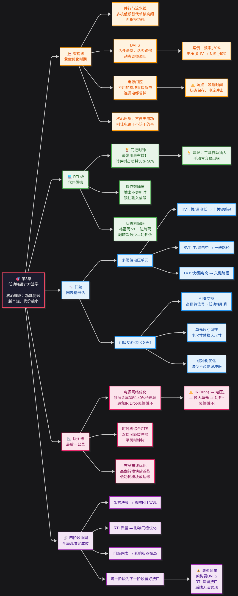

---

# 6. 时钟门控技术

> 来源：https://mp.weixin.qq.com/s?__biz=MzYzNDEzNTEzNg==&mid=2247485303&idx=1&sn=4b7717436e3114dc38771464a76d7b4b&chksm=f0a23078c7d5b96ea5e0841e7703a3c4d553a81fd1b36d47bbc3ac05cdc0d86c87aa32dc5700&scene=178&cur_album_id=4593598138716045316&search_click_id=#rd
> 作者：扬帆远航0727
> update 2026/09/15 21 : 59
> **已截图**

> 时钟门控技术：原理、实现方式、综合插入、常见陷阱与实战案例

## 6.1 核心观点

时钟门控是**最基础、最有效**的低功耗手段之一。芯片中大部分动态功耗消耗在时钟树上，时钟门控的核心思想：**没事别让时钟瞎跑**。

> 💡 核心公式回顾：`P_dynamic = α × C × V² × f` 时钟门控直接降低 **α（翻转因子）** 和 **f（有效频率）**，效果立竿见影。

---

## 6.2 原理：为什么要"关掉"时钟？

- 寄存器在每个时钟沿都会采样数据，但很多情况下数据根本没变化
- 时钟门控：**数据不需要更新时，把时钟"掐掉"**，寄存器不翻转，动态功耗下降
- 类比：时钟门控就像客厅的"人体感应灯"——有人才亮，没人自动灭

---

## 6.3 实现方式：两种主流方案

### 6.3.1 基于锁存器的时钟门控 ✅（推荐）

**结构**：锁存器 + 与门（或或门）

**为什么加锁存器？** 使能信号直接和时钟做与门会产生毛刺。锁存器将使能信号"对齐"到时钟低电平，保证输出干净。

```
// 基于锁存器的时钟门控单元
module clk_gate_latch (
inputwire clk,
inputwire en,
outputwire gclk
);
reg en_lat;
always @(*) begin
if (!clk)
            en_lat <= en;
end
assign gclk = clk & en_lat;
endmodule
```

> ⚠️ 建议直接例化库里的标准门控单元（如 `CKLNQD12`），自己写 RTL 容易出问题。

### 6.3.2 基于寄存器的时钟门控 ❌（不推荐）

- 直接用寄存器打一拍使能信号，再和时钟做与门
- 会多一个时钟周期延迟，使能信号时序紧张时易出现 setup 违例

---

## 6.4 综合插入：工具怎么帮你做？

### 6.4.1 自动插入条件

RTL 中需写清楚使能逻辑，工具自动识别并替换为时钟门控单元：

```
// 原始 RTL
always @(posedge clk) begin
if (en)
        data_q <= data_d;
end
```

### 6.4.2 DC 综合命令

```
set_clock_gating_style -sequential_cell latch -minimum_bitwidth 4
insert_clock_gating -verbose
```

| 参数 | 含义 |
| --- | --- |
| `-sequential_cell latch` | 使用锁存器类型门控单元 |
| `-minimum_bitwidth 4` | 少于4位寄存器组不插入门控（门控单元本身有开销） |

> 💡 **经验**：插入后一定要检查功耗报告。工具插得太激进可能导致面积增大、时序变差，建议位宽阈值设到 8 位以上。

---

## 6.5 常见陷阱

### 6.5.1 陷阱一：门控时钟的毛刺问题 ❌

- 组合逻辑使能信号 + 与门 → 毛刺 → 寄存器误触发 → 功能挂掉
- **解决**

  ：用带锁存器的标准门控单元，不要自己用与门搭

### 6.5.2 陷阱二：门控时钟的时序分析 ❌

- 门控单元增加延迟，影响时钟 skew，导致时钟树不平衡
- **解决**

  ：综合后一定要做 **STA**，检查门控时钟路径的 setup/hold

### 6.5.3 陷阱三：门控使能信号的 glitch ❌

- 使能信号来自组合逻辑也可能带毛刺，锁存器不能完全过滤
- **解决**

  ：使能信号尽量用寄存器输出，不要用组合逻辑直接驱动

> ⚠️ **教训**：曾遇到比较器输出带毛刺 → 门控时钟输出也带毛刺 → 查了三天。**所有门控使能信号必须打一拍寄存器。**

---

## 6.6 实战案例：16位数据通路

### 6.6.1 原始 RTL

```
always @(posedge clk) begin
if (wr_en)
        data_reg <= data_in;
end
```

### 6.6.2 功耗对比

| 指标 | 无时钟门控 | 有时钟门控 | 变化 |
| --- | --- | --- | --- |
| 动态功耗 | 12.5 mW | 4.2 mW | **↓ 66.4%** |
| 面积 | 320 μm² | 345 μm² | ↑ 7.8% |
| 时钟 skew | 45 ps | 52 ps | ↑ 15.6% |

### 6.6.3 额外优化

将 `wr_en` 先打一拍再送入门控单元，多用一个寄存器但彻底消除 glitch 风险。

> 有时候多花一点面积换可靠性，是值得的。

---

## 6.7 本章小结

| 要点 | 建议 |
| --- | --- |
| **单元选择** | 优先使用库里的标准门控单元 |
| **使能信号** | 尽量用寄存器输出，避免组合逻辑直接驱动 |
| **验证** | 综合后必须做 STA + 功耗分析 |
| **原则** | 不为省功耗而牺牲时序和功能正确性 |

**功耗收益**：有时钟门控 vs 无时钟门控，动态功耗可节省 **60% 以上**（代价：面积略增、skew略增）

---

# 7. 多阈值电压库

> 来源：https://mp.weixin.qq.com/s?__biz=MzYzNDEzNTEzNg==&mid=2247485318&idx=1&sn=768d6c8d544ffacb8df995cb1d751d57&chksm=f0a23089c7d5b99f0460d20183851b777fdf40af1422c827b14cddb22529cf0c430b607a5066&scene=178&cur_album_id=4593598138716045316&search_click_id=#rd
> 作者：扬帆远航0727
> update 2026/09/15 21 : 59
> **已截图**

> 多阈值电压库：HVT、LVT、SLVT的区别，多阈值综合策略，时序与功耗的权衡

## 7.1 核心类比

阈值电压（Vt）就像「水闸」：

- **阈值电压越高**

  → 水闸越高 → 水流（电流）越小 → 功耗低，但闸门开得慢（延迟大）
- **阈值电压越低**

  → 水闸越低 → 水流大、速度快，但功耗高

> ⚠️ HVT 省功耗但慢，LVT 快但费电，SLVT 是极端情况下的「救火队员」

---

## 7.2 HVT、LVT、SLVT 三兄弟对比

| 类型 | 阈值电压 | 漏电流 | 延迟 | 典型应用 |
| --- | --- | --- | --- | --- |
| **HVT** (High Vt) | 高 | **低** | 慢 | 非关键路径、低功耗区域 |
| **LVT** (Low Vt) | 低 | 高 | 快 | 关键路径、中等性能要求 |
| **SLVT** (Super Low Vt) | 极低 | **极高** | 极快 | 超高速关键路径、时序紧张区域 |

> 💡 HVT 的漏电流可能只有 LVT 的 **1/10**，代价是速度慢。

---

## 7.3 多阈值综合策略：三步走

**原则：先 HVT，后 LVT，最后 SLVT 兜底**

### 7.3.1 第一步：全 HVT 综合

- 先用 HVT 库跑一遍，看时序违例有多少
- 结果：大部分路径都能满足，只有少数关键路径出问题

### 7.3.2 第二步：局部替换 LVT（精准替换）

- 针对时序违例路径，把 HVT 单元替换成 LVT
- ⚠️ **要点**：精准替换，不要大面积替换，否则功耗失控
- 教训：30% 单元换 LVT → 功耗超 20%

### 7.3.3 第三步：SLVT 救急

- LVT 还不够时用 SLVT
- 漏电流太大，**万不得已才用**

### 7.3.4 综合约束命令

```
# 功耗约束
set_max_leakage_power
set_max_dynamic_power
# 关键路径分组
group_path -critical
```

---

## 7.4 时序与功耗的权衡：找平衡点

**核心方法：看 Slack（时序余量）**

| Slack 情况 | 策略 |
| --- | --- |
| **Slack > 0** （路径有富余） | 换成 HVT 省功耗 |
| **Slack < 0** （路径太紧） | 换成 LVT 或 SLVT 救火 |

### 7.4.1 功耗类型与策略选择

| 设计场景 | 主要矛盾 | 推荐策略 |
| --- | --- | --- |
| 高速设计 | 动态功耗主导 | 用 LVT（速度快，动态功耗降低） |
| 低功耗设计 | 漏电是主要矛盾 | 用 HVT（漏电流低） |

### 7.4.2 安全余量

> ⚠️ **教训**：Slack 为 +0.1ns 就全换 HVT → 流片后工艺偏差 → 时序崩了 **建议**：至少留 **0.2ns** 余量，别卡得太死

---

## 7.5 实战避坑指南

| 坑 | 问题 | 解法 |
| --- | --- | --- |
| **迷信 SLVT** | 漏电流大得离谱，全模块用 SLVT → 功耗翻倍 | 只在万不得已时用，精准替换 |
| **库兼容性** | 不同阈值驱动能力不同，替换引入新时序问题 | 替换时检查驱动强度 |
| **温度效应** | 高温下 LVT 漏电流急剧增加，常温功耗OK但高温超标 | 高温测试验证 LVT 单元漏电 |
| **HVT 全覆盖** | 整个芯片全用 HVT → 时序一塌糊涂 | 混合阈值策略 |

---

## 7.6 本章小结

```
多阈值选择逻辑：
  非关键路径 + 低功耗优先  →  HVT ✅
  关键路径 + 时序紧张      →  LVT ✅
  极端时序问题             →  SLVT ⚠️（慎用）
```

**综合流程**：

1. 全 HVT 综合 → 看 Slack
2. Slack 富余 → 换 HVT 降功耗
3. Slack 紧张 → 精准换 LVT
4. LVT 仍不够 → SLVT 兜底

**核心原则**：没有最好的策略，只有最适合项目的策略；动态功耗高用 LVT，静态功耗高用 HVT。

---

# 8. 电源门控技术

> 来源：https://mp.weixin.qq.com/s?__biz=MzYzNDEzNTEzNg==&mid=2247485343&idx=1&sn=f0ee931bdb7a2285c0bd6b24d413d2d9&chksm=f0a23090c7d5b986c43f6181febb5ffb348479f25bfa88f3ae707b27817597c0a64731017d75&scene=178&cur_album_id=4593598138716045316&search_click_id=#rd
> 作者：扬帆远航0727
> update 2026/09/15 21 : 59
> **已截图**

> 电源门控技术：原理、电源开关单元、状态保持策略、唤醒时间与浪涌电流控制

## 8.1 核心思想

电源门控 = **把暂时不用的模块电源直接掐掉**，断电后漏电路径彻底消失，功耗直接归零。

> 💡 实战效果：AI 加速器待机功耗降了 **90% 以上** ⚠️ 代价：需处理电源切换、状态恢复、唤醒浪涌电流等问题

---

## 8.2 基本原理

在模块的 VDD 和实际供电之间加一个**电源开关单元（PSW）**：

- 开关闭合 → 模块工作
- 开关断开 → 模块断电

**不是所有模块都能随便断电**：如 CPU L2 Cache，断电后数据全丢，下次唤醒需从 DDR 重新加载，功耗反而更高。

> ⚠️ 电源门控必须配合「状态保持」策略一起用。

---

## 8.3 电源开关单元（PSW）

### 8.3.1 实现方式

| 类型 | 接法 | 特点 |
| --- | --- | --- |
| **Header cell** ✅ | 接在 VDD 和虚拟 VDD 之间 | 常用，标准单元库兼容性最好 |
| **Footer cell** | 接在 VSS 和虚拟 VSS 之间 | 用得少，衬底偏置处理麻烦 |

- PSW 通常用**高阈值 PMOS 管**实现（对地传输强，漏电小）

### 8.3.2 驱动能力选择

```
I_PSW_total > I_peak_module × 1.2
```

- 留 **20% 余量**
- **其中I\_peak\_module是模块的最大瞬态电流。我一般留20%的余量。选小了，唤醒时电压跌得厉害；选大了，面积浪费。**
- 选小了 → 唤醒时电压跌得厉害
- 选大了 → 面积浪费

> ⚠️ **教训**：PSW 做得太大 → 唤醒时浪涌电流把电源轨拉到 0.7V → 逻辑全部翻转 → 加软启动才解决

---

## 8.4 状态保持策略

模块断电后，寄存器、SRAM 数据全丢失。三种主流方案：

| 方案 | 原理 | 面积开销 | 功耗开销 | 适用场景 |
| --- | --- | --- | --- | --- |
| **状态保持寄存器（SHR）** | 低漏电锁存器保存关键状态 | ~30% | 极低 | 控制状态机、关键配置 |
| **常开缓冲区（Always-on）** | 独立电源域保存数据 | ~50% | 低 | 少量关键信号 |
| **外部保存** | 断电前写数据到 SRAM/Flash | 几乎无 | 中等 | 大量数据 |

### 8.4.1 SHR 注意事项

> ⚠️ **教训**：SHR 保持电压 0.6V，但电源门控关断后虚拟 VDD 慢慢降到 0V → 数据丢失 **SHR 必须接在「永不关断」的电源域上**

> ⚠️ **教训**：SHR 保持模式下时钟未停 → 时钟通过寄生电容耦合到保持节点 → 数据翻转 → 睡眠模式莫名状态错乱 → 查了两周 **保持模式下时钟必须停掉**

---

## 8.5 唤醒时间

唤醒时间 = 发出唤醒信号到模块能正常工作 的总时间，由三部分组成：

| 组成部分 | 说明 | 量级 |
| --- | --- | --- |
| **PSW 导通时间** | EN 信号有效到 PSW 完全导通 | 几 ns ~ 几十 ns |
| **电压建立时间** | 虚拟 VDD 从 0V 升到 90% VDD | 与电容/电流相关 |
| **状态恢复时间** | SHR 切回正常模式 / 外部加载数据 | ~100ns |

**计算公式：**

```
T_wakeup = T_psw_on + (C_virtual × VDD × 0.9) / I_psw + T_restore
```

**示例**：

- 虚拟 VDD 电容：10nF
- VDD = 1.0V，PSW 电流 = 10mA
- 电压建立时间 = (10e-9 × 1.0 × 0.9) / 10e-3 = **0.9µs**
- 总唤醒时间 ≈ 1µs

> ⚠️ 唤醒时间不是越短越好。太短 → 浪涌电流很大

---

## 8.6 浪涌电流控制

唤醒瞬间从电源抽取的大电流，会导致电源电压跌落，严重时让其他模块复位。

> 💀 **教训**：GPU 模块唤醒时浪涌电流达 3A → 1.8V 电源轨被拉到 1.2V → 整个芯片挂了

### 8.6.1 三种控制方法

| 方法 | 说明 |
| --- | --- |
| **分级唤醒** | PSW 分多组，依次打开（先开 10% → 稳定后开 20% → …） |
| **软启动** | 电流源缓慢给虚拟 VDD 充电，设为正常工作电流的 10%~20% |
| **时钟门控配合** | 唤醒后先不给时钟，等电压稳定再释放，避免逻辑翻转附加电流 |

### 8.6.2 链式使能结构（推荐）

每一级 PSW 的打开依赖前一级电压检测信号，无论工艺偏差多大都能保证浪涌电流可控（伪代码）：

```
always
 @(
posedge
 clk
or
negedge
 rst_n)
begin
if
 (!rst_n)
begin
        en_chain[
0
] <=
1'b0
;
        en_chain[
1
] <=
1'b0
;
        en_chain[
2
] <=
1'b0
;
end
else
if
 (wakeup_req)
begin
        en_chain[
0
] <=
1'b1
;
// 第一组 PSW 打开
if
 (vdd_ok[
0
]) en_chain[
1
] <=
1'b1
;
// 电压稳定后第二组打开
if
 (vdd_ok[
1
]) en_chain[
2
] <=
1'b1
;
// 电压稳定后第三组打开
end
end
```

> ⚠️ **教训**：分级唤醒时 PSW 使能信号接到同一寄存器 → 走线延迟不同 → 后面的先开 → 浪涌更大 → 改用链式使能解决

---

## 8.7 完整验证清单

电源门控设计必须做完整仿真验证：

| 仿真类型 | 验证内容 |
| --- | --- |
| **唤醒瞬态仿真** | 电压波形和电流波形 |
| **状态保持静态仿真** | 漏电和噪声容限 |
| **多电源域协同仿真** | 多域同时唤醒 |

---

## 8.8 本章小结

```
电源门控三件套：
  怎么切 → 选好 PSW，算好尺寸，做好分级
  怎么保 → SHR / Always-on buffer，保持电源必须独立
  怎么醒 → 控制唤醒时间，分级/软启动抑制浪涌电流
```

**核心技术要点**：

- PSW 用 Header cell（高阈值 PMOS）
- PSW 尺寸留 20% 余量
- SHR 接永不关断电源域 + 保持模式下时钟必须停
- 唤醒用分级/链式使能 + 软启动控制浪涌电流

你想想看，这些技术单独看都不难，但组合在一起，再加上工艺偏差、温度变化、寄生参数，问题就变得很复杂。我建议你在做电源门控设计时，一定要做完整的仿真验证，包括：

- 唤醒过程的瞬态仿真（看电压波形和电流波形）
- 状态保持的静态仿真（看漏电和噪声容限）
- 多电源域同时唤醒的协同仿真

---

# 9. 多电压域设计

> 来源：https://mp.weixin.qq.com/s?__biz=MzYzNDEzNTEzNg==&mid=2247485358&idx=1&sn=1c50a8bd5086a4574c415ebe3d7450d1&chksm=f0a230a1c7d5b9b760b239d203fe613958085926adf16619ed92f27708a57cd8c3fa9a5211c2&scene=178&cur_album_id=4593598138716045316&search_click_id=#rd
> 作者：扬帆远航0727
> update 2026/09/15 22 : 00
> **已截图**

> 多电压域设计：电压域划分、电平转换器（Level Shifter）、隔离单元（Isolation Cell）

各位同学，咱们今天聊点硬核的——多电压域设计。说实话，这是低功耗设计里最考验功力的部分之一。你想想看，芯片里不同的模块跑在不同的电压下，就像一栋楼里有的房间开空调、有的不开，怎么让它们和谐共处？这就是我们要解决的问题。

## 9.1 为什么要划分电压域？

先问个问题：为什么要把芯片分成不同的电压域？

答案很简单——**省电**。但不是所有模块都需要省电到极致。

我举个例子。你手机里的CPU核心，跑游戏的时候需要1.0V甚至更高，但待机时只需要0.6V就能维持状态。如果你让整个芯片都跑1.0V，那待机功耗就白白浪费了。所以，我们把CPU核心、GPU、内存控制器、外设接口分别放在不同的电压域里，按需供电。

我个人习惯把电压域分成三类：

- **常开域（Always-On Domain）**

  ：永远不掉电，比如实时时钟、唤醒逻辑。电压通常较低（0.6V~0.8V）。
- **高性能域（High-Performance Domain）**

  ：需要高频率时用高电压（0.9V~1.2V），比如CPU、GPU。
- **低功耗域（Low-Power Domain）**

  ：跑在中等电压（0.7V~0.9V），比如外设、总线。

> **关键原则**：电压域划分不是拍脑袋决定的。你要先做功耗分析，找出哪些模块功耗占比高、哪些模块对性能敏感，然后才能画出合理的电压域边界。

## 9.2 电平转换器（Level Shifter）——跨电压域的桥梁

好，电压域划分好了。现在问题来了：一个1.0V的模块要发信号给一个0.6V的模块，怎么办？

直接连？不行。1.0V的信号对0.6V的接收端来说，可能烧坏栅氧化层。反过来，0.6V的信号对1.0V的接收端来说，可能识别不到高电平。

这时候就需要\*\*电平转换器（Level Shifter）\*\*了。说白了，它就是个电压翻译官。

### 9.2.1 电平转换器的类型

我在项目中遇到过三种常见的电平转换器：

| 类型 | 适用场景 | 特点 |
| --- | --- | --- |
| 单向电平转换器 | 信号从低电压域到高电压域 | 结构简单，面积小，延迟低 |
| 双向电平转换器 | 信号双向传输（如I2C总线） | 需要方向控制信号，面积较大 |
| 使能型电平转换器 | 需要关断输出时使用 | 带使能引脚，可配合隔离单元使用 |

嗯，这里要注意：**不是所有跨电压域的信号都需要电平转换器**。如果两个电压域电压相近（比如0.9V和1.0V），而且接收端能容忍电压差，那就可以直接连。但为了保险起见，我建议你**只要电压差超过0.2V，就老老实实加电平转换器**。我曾经因为偷懒没加，结果流片回来发现信号误码率飙升，那叫一个后悔。

### 9.2.2 电平转换器的UPF实现

在UPF里，电平转换器的声明很简单。看个例子：

```
# 定义电压域
create_power_domain PD_CPU -voltage
1.0
create_power_domain PD_IO -voltage
0.6
# 添加电平转换器
set_level_shifter LS_CPU2IO \
  -domain PD_CPU \
  -applies_to inputs \
  -rule low_to_high \
  -location self
```

这里我解释一下参数：

- `-applies_to inputs`

  ：表示在PD\_CPU的输入端口上加电平转换器（从低电压域到高电压域）。
- `-rule low_to_high`

  ：指定转换方向。如果信号从高到低，用`high_to_low`。
- `-location self`

  ：电平转换器放在当前域内。也可以放在`fanout`（扇出端）或`boundary`（边界）。

> **我的经验**：电平转换器的位置很关键。放在源端（self）可以减少延迟，但会增加源域的面积和功耗。放在目标端（fanout）则相反。我一般把高频信号的电平转换器放在源端，低频信号放在目标端。

## 9.3 隔离单元（Isolation Cell）——断电时的守护神

电平转换器解决了电压不同的问题，但还有一个更棘手的问题：**当一个电压域断电时，它的输出信号会变成什么？**

答案是：**不确定**。可能是高阻态，可能是浮空，也可能是乱跳。这会把接收端搞懵，甚至导致漏电流激增。

隔离单元就是干这个的——**在断电时，把输出钳位到一个确定的值**。

### 9.3.1 隔离策略

常见的隔离策略有两种：

- **钳位到0（Clamp to 0）**

  ：断电时输出0。适合控制信号、复位信号。
- **钳位到1（Clamp to 1）**

  ：断电时输出1。适合使能信号、时钟门控信号。

你可能会问：怎么选？

我告诉你一个简单的方法：**看接收端在断电期间需要什么状态**。如果接收端在断电期间需要保持复位状态，那就钳位到0。如果接收端需要保持使能状态，那就钳位到1。

举个例子。我曾经做过一个IoT芯片，其中有一个传感器接口域经常断电。它的输出连接到主控域的中断控制器。如果传感器域断电时输出浮空，中断控制器会误判为有中断，导致主控域频繁唤醒。后来我加了隔离单元，钳位到0，问题就解决了。

### 9.3.2 隔离单元的UPF实现

UPF里隔离单元的写法也很直接：

```
# 定义隔离策略
set_isolation ISO_SENSOR \
  -domain PD_SENSOR \
  -clamp_value
0
 \
  -applies_to outputs
# 指定隔离控制信号
set_isolation_control ISO_SENSOR \
  -domain PD_SENSOR \
  -isolation_signal iso_en \
  -isolation_sense high
```

这里的关键点：

- `-clamp_value 0`

  ：钳位到0。如果钳位到1，就写`1`。
- `-isolation_signal iso_en`

  ：隔离使能信号。当`iso_en`为高时，隔离生效。
- `-isolation_sense high`

  ：高电平有效。也可以设为`low`。

> ⚠️ **重要提醒**：隔离使能信号必须在断电之前拉高，在重新上电之后拉低。这个时序控制如果搞错了，芯片可能会出大问题。我建议你在仿真阶段专门写一个检查脚本，验证隔离信号的时序。

## 9.4 电压域划分的实战要点

讲了这么多理论，最后分享几个实战中的坑：

1. **不要划分太多电压域**

   。每个电压域都需要独立的电源网络、电平转换器和隔离单元，面积和布线成本会飙升。我见过一个项目分了12个电压域，结果后端工程师差点崩溃。一般来说，3~5个电压域是比较合理的。
2. **注意电压域之间的物理距离**

   。如果两个电压域离得太远，电平转换器的延迟会很大。我建议把经常通信的电压域放在一起。
3. **别忘了时钟和复位信号**

   。时钟和复位信号通常需要跨电压域传输，它们也需要电平转换器和隔离单元。很多人只关注数据信号，忽略了时钟，结果芯片跑不起来。
4. **仿真要覆盖所有电压域组合**

   。比如CPU域上电、GPU域断电、IO域保持——这种组合都要仿真到。我曾经漏掉一个组合，结果芯片在特定场景下死机，查了两个月才找到原因。

> **总结一下**：多电压域设计不是简单的加几个Level Shifter和Isolation Cell就完事了。它需要你从系统层面思考：哪些模块需要高性能？哪些模块可以省电？断电时其他模块怎么应对？只有把这些都想清楚了，你的低功耗设计才能真正落地。

好了，这一章就到这里。下一章我们聊聊动态电压频率调整（DVFS），那又是另一个有意思的话题。

---

# 10. 动态电压频率调整

> 来源：https://mp.weixin.qq.com/s?__biz=MzYzNDEzNTEzNg==&mid=2247485379&idx=1&sn=3cbd204d8b965f7459f2068bf7dd6f16&chksm=f0a230ccc7d5b9da4f2f607446d9380fd892e3a024e8a08c2d2910ee2fe56dd19858a9c1b886&scene=178&cur_album_id=4593598138716045316&search_click_id=#rd
> 作者：扬帆远航0727
> update 2026/09/15 22 : 00
> **已截图**

> 动态电压频率调整：DVFS原理、实现架构、软件与硬件的协同、实战案例

各位同学，今天我们来聊聊DVFS。说实话，这是低功耗设计里最"聪明"的技术之一。它不是简单地关掉模块，而是让芯片像开车一样——高速时猛踩油门，低速时轻踩油门。我当年第一次接触DVFS时，觉得这玩意儿简直是黑魔法，后来自己动手调过几次，才明白里面的门道有多深。

## 10.1 DVFS的核心原理

DVFS，全称Dynamic Voltage and Frequency Scaling。说白了，就是根据芯片当前的工作负载，动态调整供电电压和工作频率。

为什么要这么做？因为功耗和电压、频率的关系是这样的：

- **动态功耗**

  ≈ C × V² × f
- 你看，电压是平方项，影响最大
- 频率是线性项，影响次之

所以，降低电压和频率，功耗下降得特别明显。我举个例子：一个CPU核心跑1.2V、2GHz时功耗是5W，降到0.9V、1GHz时，功耗可能只有1W出头。省了将近80%。

> **关键点**：电压和频率不是独立调节的。频率升高时，必须同步升高电压，否则电路会因时序不满足而出错。反过来，频率降低时，电压可以跟着降。

为什么会这样？因为CMOS电路的延迟跟电压直接相关。电压越低，晶体管开关越慢。你想想看，频率高了但电压没跟上，信号传播时间不够，setup violation就来了。我在项目中遇到过这种情况，芯片跑着跑着突然死机，查了半天才发现是DVFS的电压爬升速度没跟上频率跳变。

## 10.2 DVFS的实现架构

DVFS不是一个人能干的活。它需要硬件、软件、电源管理单元（PMU）三方配合。我习惯把架构分成三层：

### 10.2.1 硬件层

- **电压调节器（VR）**

  ：可以是片外的DC-DC转换器，也可以是片内的LDO。我建议用DC-DC，效率高，但响应慢；LDO响应快，但效率低。
- **锁相环（PLL）或FLL**

  ：负责产生可变的时钟频率。PLL切换频率时有个锁定时间，大概几微秒到几十微秒。
- **电源域划分**

  ：DVFS通常只作用于某个独立的电压域。比如CPU核心是一个域，GPU是另一个域，各自独立调压调频。
- **性能监测单元**

  ：比如硬件计数器，用来监控CPU利用率、总线负载、缓存命中率等。

### 10.2.2 固件/软件层

- **操作系统调度器**

  ：Linux的cpufreq框架就是干这个的。它根据CPU利用率，决定要不要升频或降频。
- **电源管理固件（PM Firmware）**

  ：运行在专用微控制器上，负责执行电压频率切换的时序控制。
- **驱动层**

  ：提供接口给上层应用，比如通过sysfs调节governor策略。

### 10.2.3 协同工作流程

我举个例子，一个典型的DVFS切换流程：

1. 软件监测到CPU利用率超过80%，决定升频
2. 软件通过寄存器写目标频率值，触发硬件切换
3. 硬件先升高电压，等待电压稳定（等待时间由PMU的"电压就绪"信号决定）
4. 硬件切换PLL到新频率，等待PLL锁定
5. 硬件通知软件切换完成
6. 软件继续调度任务

> ⚠️ **注意**：电压必须先升后降，频率必须先降后升。顺序搞反了，芯片直接挂掉。我曾经在调试时故意写反了顺序，结果芯片瞬间进入复位，吓得我赶紧断电。

## 10.3 软件与硬件的协同细节

这里有个容易踩坑的地方：软件和硬件的握手信号。很多设计里，软件写寄存器后，硬件需要一段时间才能完成切换。如果软件在这段时间内又发了新指令，就会乱套。

我建议的做法是：

- 硬件提供一个"忙"状态寄存器，软件在写新指令前先查询
- 或者用中断通知软件切换完成
- 更激进的做法是硬件自动完成整个切换，软件只负责决策

你想想看，如果软件在电压还没稳定时就发了高频指令，那时序肯定崩。所以，协同的关键是"等待确认"。

## 10.4 实战案例：一个四核CPU的DVFS设计

好，我们来看一个具体的案例。假设我们要设计一个四核CPU，每个核心可以独立DVFS，也可以集群DVFS。

### 10.4.1 架构选择

我选择集群DVFS。为什么？因为独立DVFS虽然更精细，但每个核心需要独立的电压调节器和PLL，面积和成本太高。对于消费级芯片，集群DVFS性价比最高。

### 10.4.2 电压频率表

我们预先定义好一组电压频率对（OPP，Operating Performance Point）：

| OPP编号 | 频率（MHz） | 电压（V） | 典型功耗（W） |
| --- | --- | --- | --- |
| 0 | 500 | 0.75 | 0.5 |
| 1 | 1000 | 0.85 | 1.2 |
| 2 | 1500 | 0.95 | 2.5 |
| 3 | 2000 | 1.10 | 4.8 |

注意，这些OPP必须在芯片设计阶段通过静态时序分析（STA）验证过。不能随便写，否则流片回来跑不了那么高频率。

### 10.4.3 硬件实现

我们用UPF来描述这个DVFS域：

```
create_power_domain PD_CPU -voltage 0.75
create_supply_port VDD_CPU -domain PD_CPU
create_supply_net VDD_CPU_NET -domain PD_CPU
connect_supply_net VDD_CPU_NET -ports VDD_CPU

set_domain_supply_net PD_CPU -primary_power_net VDD_CPU_NET \
                             -primary_ground_net VSS

# 定义电压状态
add_power_state PD_CPU.sleep -state {VDD_CPU_NET 0.0}
add_power_state PD_CPU.opp0 -state {VDD_CPU_NET 0.75}
add_power_state PD_CPU.opp1 -state {VDD_CPU_NET 0.85}
add_power_state PD_CPU.opp2 -state {VDD_CPU_NET 0.95}
add_power_state PD_CPU.opp3 -state {VDD_CPU_NET 1.10}
```

这段UPF代码定义了CPU电源域，以及四个工作电压状态。实际综合时，工具会根据这些状态生成对应的电平转换单元和电源开关。

### 10.4.4 软件控制

在Linux中，我们可以用cpufreq的userspace governor手动控制：

bash复制

```
# 查看当前频率
cat /sys/devices/system/cpu/cpu0/cpufreq/scaling_cur_freq

# 设置目标频率（单位kHz）
echo 1500000 > /sys/devices/system/cpu/cpu0/cpufreq/scaling_setspeed

# 查看可用频率
cat /sys/devices/system/cpu/cpu0/cpufreq/scaling_available_frequencies
```

实际产品中，我们不会用userspace，而是用ondemand或schedutil governor。schedutil是内核调度器直接驱动的，响应更快。我建议新项目直接用schedutil，省事。

## 10.5 避坑指南

> **经验之谈**：
>
> - **电压纹波**
>
>   ：DVFS切换时，电流突变会导致电源纹波。我建议在电源网络上多放一些去耦电容，尤其是靠近CPU核心的位置。
> - **温度影响**
>
>   ：高温下晶体管变慢，同样的电压可能跑不到目标频率。所以OPP表要留余量，比如1.1V对应2GHz，但实际可能只能跑1.9GHz。
> - **切换延迟**
>
>   ：从低OPP切到高OPP，电压爬升需要时间。如果任务很紧急，可以先升频再升压？不行！必须先升压。所以，预测性调度很重要。

我曾经在一个项目中，DVFS切换时没处理好电压纹波，导致芯片在重负载下偶尔复位。查了整整两周，最后发现是去耦电容放少了。加了两颗10μF的电容后，问题消失。嗯，这种教训一次就够了。

## 10.6 小结

DVFS是低功耗设计的核心手段之一。它不像时钟门控那样简单粗暴，也不像电源关断那样彻底，但它能在性能和功耗之间找到最佳平衡点。我个人觉得，做DVFS设计，最重要的是理解"电压是老大，频率是小弟"这个关系。电压定了，频率才能定。顺序搞反了，芯片就罢工。

下一章我们会讲自适应电压调节（AVS），那是DVFS的进阶版，更智能，但也更复杂。到时候我们再细聊。

---

# 11. UPF基础概念

> 来源：https://mp.weixin.qq.com/s?__biz=MzYzNDEzNTEzNg==&mid=2247485380&idx=1&sn=8ed008941a461d89400695ba6478b38e&chksm=f0a230cbc7d5b9dd9faf10fe9559aa03ad337ee7f8317e79d6e96cd1663ac0230b1308c64e58&scene=178&cur_album_id=4593598138716045316&search_click_id=#rd
> 作者：扬帆远航0727
> update 2026/09/15 22 : 01
> **已截图**

> UPF基础概念：什么是UPF？UPF的发展历史（CPF vs UPF），UPF在低功耗流程中的角色

## 11.1 什么是UPF？—— 说白了就是低功耗的"设计说明书"

UPF，全称是 Unified Power Format，统一功耗格式。

名字挺长，但说白了，它就是一套标准化的语言。用来描述芯片的电源意图。

什么叫"电源意图"？

你想想看，一个芯片里，哪些模块需要一直供电？哪些模块可以随时关掉？关掉之后怎么恢复？电压要降到多少？这些信息，就是电源意图。

我习惯把UPF比作一张"供电地图"。

传统的网表只告诉你逻辑怎么连。UPF告诉你：电从哪里来，往哪里去，什么时候断，什么时候恢复。

没有UPF，你做的低功耗设计就是"盲人摸象"。

举个例子，一个简单的UPF命令：

```
create_supply_net VDD -domain TOP
create_supply_port VDD -domain TOP
create_power_domain PD_CPU -elements {cpu_top}
create_supply_net VDD_CPU -domain PD_CPU
create_supply_port VDD_CPU -domain PD_CPU
```

这几行代码，就定义了一个叫 PD\_CPU 的电源域。它有自己的供电网络 VDD\_CPU。这个域包含了 cpu\_top 这个模块。

嗯，这里要注意：UPF不是RTL代码，也不是网表。它是独立于设计的"元数据"。

我在项目中遇到过，有人把UPF写在RTL注释里。结果后端工具根本读不到。白忙活一场。

## 11.2 UPF的发展历史：CPF vs UPF，一场标准之争

低功耗设计不是今天才有的需求。早年间，大家各玩各的。

每家EDA公司都有自己的格式。Synopsys有，Cadence有，Mentor也有。设计团队要同时维护好几套脚本，苦不堪言。

直到2007年，事情有了转机。

**CPF（Common Power Format）** 先出来了。这是Cadence主导的格式。它很早就被Si2（Silicon Integration Initiative）组织接纳为标准。

CPF的特点是：

- 语法相对简洁
- 与设计流程绑定较紧
- Cadence工具支持最好

但问题也来了。CPF更像是一个"Cadence专属格式"。其他EDA工具支持得不好。

紧接着，2009年，**UPF** 登场了。

UPF是IEEE标准（IEEE 1801）。它由Synopsys、Mentor等公司联合推动。目标是做一个真正开放、中立的格式。

我当年刚入行时，正好赶上这两派打架。公司里老员工分成两拨。一拨说CPF好，一拨说UPF好。开会都能吵起来。

我个人习惯用UPF。原因很简单：它是IEEE标准，生态更广。

下面这个表格，可以帮你快速对比：

| 对比项 | CPF | UPF |
| --- | --- | --- |
| 提出者 | Cadence | Synopsys、Mentor等 |
| 标准化组织 | Si2 | IEEE（1801） |
| 推出时间 | 2007年 | 2009年 |
| 开放性 | 偏封闭 | 完全开放 |
| 工具支持 | Cadence为主 | 全行业 |
| 当前状态 | 逐渐边缘化 | 主流标准 |

现在，CPF基本已经退出了历史舞台。UPF 2.0、UPF 3.0 已经成为行业事实标准。

我建议你直接学UPF。别在CPF上浪费时间了。

## 11.3 UPF在低功耗流程中的角色

UPF不是孤立存在的。它贯穿了整个低功耗设计流程。

从架构设计，到RTL编码，到综合，到布局布线，再到物理验证。UPF无处不在。

我把它总结为三个核心角色：

### 11.3.1 角色一：沟通的"通用语言"

前端工程师说：“我这个模块要关掉。”

后端工程师问：“怎么关？什么时候关？恢复时序是什么？”

没有UPF，这两拨人得靠邮件、文档、口头沟通。信息一多，必然出错。

有了UPF，所有信息都写在一个文件里。前端写，后端读。工具也读。大家说的是同一种语言。

我曾经见过一个项目，因为没有UPF，前后端对"关电"的理解差了整整两周。最后不得不重做floorplan。教训深刻。

### 11.3.2 角色二：工具的"执行指令"

EDA工具是"瞎子"。它不知道你的低功耗意图。

你告诉综合工具：“这个模块要加隔离单元。” 工具问：“加在哪里？什么类型？”

UPF就是答案。

比如：

```
set_isolation PD_CPU -domain PD_CPU -clamp_value
0
```

这一行，工具就知道：在PD\_CPU边界上，加一个钳位到0的隔离单元。

没有UPF，工具只能靠猜测。猜对了是运气，猜错了就是bug。

### 11.3.3 角色三：验证的"黄金参考"

低功耗验证，是芯片验证中最头疼的部分之一。

你怎么知道关电顺序是对的？你怎么知道恢复时数据没丢？

UPF提供了验证的"黄金标准"。

仿真器读入UPF后，会自动检查：

- 电源域是否正确定义
- 电平转换器是否遗漏
- 隔离使能信号时序是否满足
- 状态保持单元是否正常工作

我建议你在仿真阶段就打开UPF检查。别等到后端再发现问题。那时候改起来，成本翻十倍。

> **核心总结**：
>
> - UPF = 电源意图的标准化描述
> - UPF = 前后端沟通的桥梁
> - UPF = 工具执行的依据
> - UPF = 低功耗验证的参考

> 💡 **个人小技巧**： 刚开始学UPF，别急着写复杂的power switch。先从最简单的power domain定义开始。一个域，一个供电网络，跑通一个demo。慢慢来。

> ⚠️ **避坑指南**： 我曾经见过有人把UPF写得比RTL还复杂。各种嵌套、各种条件。结果工具跑不动，仿真也跑不动。 记住：UPF是描述意图的，不是描述实现的。能简单，就别复杂。

好了，这一章就到这里。UPF的概念你大概清楚了。下一章，我们聊聊UPF的核心语法。从最简单的 supply net 开始。

---

# 12. UPF电源状态定义

> 来源：https://mp.weixin.qq.com/s?__biz=MzYzNDEzNTEzNg==&mid=2247485392&idx=1&sn=e4b48c2eb2a5e6fefffed61a360e59cc&chksm=f0a230dfc7d5b9c9d4afec4fb50e093838774ae30a48f87287b952c1467b066fa0f68f3055bd&scene=178&cur_album_id=4593598138716045316&search_click_id=#rd
> 作者：扬帆远航0727
> update 2026/09/15 22 : 01
> **已截图**

> UPF电源状态定义：add\_port\_state、add\_power\_state、电源状态表（PST）的构建

好，咱们继续往下聊。上一章我们把电源域和供电网络搭好了，但芯片不能只通电不通电两种状态吧？你得告诉工具，什么时候该跑高速，什么时候该打盹儿，什么时候干脆关机。这就是电源状态定义要干的事。

说白了，电源状态就是给芯片的各个电压域定个「工作档位」。我习惯把电源状态比作手机的省电模式——性能模式跑得快但费电，省电模式跑得慢但续航长。UPF里定义电源状态，就是把这些档位用标准语法写清楚。

## 12.1 端口状态定义：add\_port\_state

先说说最基础的 `add_port_state`。这个命令是干嘛的？它是给电源端口（supply port）定义「合法」的电压值。你想想看，一个电源端口不能随便给电压吧？1.0V、1.2V、0.9V，哪些是允许的，你得先列出来。

语法其实很简单：

```
add_port_state 电源端口名 -state {状态名 电压值}
```

举个例子，我有个核心电压端口叫 `VDD_CORE`，它支持两种工作电压：

```
add_port_state VDD_CORE -state {ON_1V0
1.0
} -state {ON_0V9
0.9
} -state {OFF
0.0
}
```

这里我定义了三个状态：`ON_1V0`（1.0V全速运行）、`ON_0V9`（0.9V降频运行）、`OFF`（0V关机）。

> 💡 **我的小习惯**：状态命名最好带上电压值，比如 `ON_1V0` 比 `ON_HIGH` 更直观。我在一个项目里吃过亏，用 `ON_HIGH` 和 `ON_LOW` 命名，结果后来电压从1.0V改到1.05V，所有脚本都得跟着改，麻烦死了。

多个端口可以分别定义，比如：

```
add_port_state VDD_MEM -state {ON_1V2
1.2
} -state {OFF
0.0
}
add_port_state VDD_IO  -state {ON_3V3
3.3
} -state {OFF
0.0
}
```

嗯，这里要注意：`add_port_state` 定义的是端口级别的状态，它只告诉工具「这个端口能输出哪些电压」，但没说整个芯片该怎么配合。要描述芯片级的协同工作，就得靠 `add_power_state` 了。

## 12.2 电源状态定义：add\_power\_state

`add_power_state` 是干嘛的？它是把多个电源端口的状态组合起来，定义成一个有意义的「芯片工作模式」。比如「全速运行模式」要求核心电压1.0V、内存电压1.2V、IO电压3.3V；「休眠模式」可能核心电压0V、内存电压1.2V（保持数据）、IO电压3.3V。

语法长这样：

```
add_power_state 状态名 -domain 电源域名 -state {端口
1
 状态
1
 端口
2
 状态
2
 ...}
```

看个实际例子：

```
add_power_state FULL_SPEED -domain PD_CORE \
    -state {VDD_CORE ON_1V0 VDD_MEM ON_1V2 VDD_IO ON_3V3}
add_power_state SLEEP -domain PD_CORE \
    -state {VDD_CORE OFF VDD_MEM ON_1V2 VDD_IO ON_3V3}
add_power_state DEEP_SLEEP -domain PD_CORE \
    -state {VDD_CORE OFF VDD_MEM OFF VDD_IO ON_3V3}
```

这里 `PD_CORE` 是电源域的名字。每个 `add_power_state` 定义了这个域下的一种工作模式。

> ⚠️ **我曾经踩过的坑**：刚开始写UPF时，我忘了在 `add_power_state` 里包含所有相关的电源端口。结果工具报错说「状态定义不完整」。后来我养成了习惯：定义状态前，先列个表格，把每个模式下的所有端口电压都写清楚，再翻译成UPF命令。

## 12.3 电源状态表（PST）的构建

好了，端口状态有了，电源状态也有了。但工具怎么知道这些状态之间的切换规则？比如从 `FULL_SPEED` 切到 `SLEEP`，哪些电压可以同时变？哪些必须保持？这就是电源状态表（Power State Table，简称PST）要解决的问题。

PST 说白了就是一个「状态切换矩阵」。它定义了所有合法的电源状态组合，以及它们之间的切换路径。构建 PST 用 `create_pst` 和 `add_pst_state` 命令。

基本流程分两步：

1. **创建PST表格**

   ：`create_pst 表格名 -supplies {端口列表}`
2. **添加状态行**

   ：`add_pst_state 状态名 -pst 表格名 -state {端口1 电压1 端口2 电压2 ...}`

看个完整的例子：

```
# 第一步：创建PST
create_pst CHIP_PST -supplies {VDD_CORE VDD_MEM VDD_IO}
# 第二步：添加状态行
add_pst_state FULL_SPEED -pst CHIP_PST \
    -state {VDD_CORE
1.0
 VDD_MEM
1.2
 VDD_IO
3.3
}
add_pst_state SLEEP -pst CHIP_PST \
    -state {VDD_CORE
0.0
 VDD_MEM
1.2
 VDD_IO
3.3
}
add_pst_state DEEP_SLEEP -pst CHIP_PST \
    -state {VDD_CORE
0.0
 VDD_MEM
0.0
 VDD_IO
3.3
}
add_pst_state SHUTDOWN -pst CHIP_PST \
    -state {VDD_CORE
0.0
 VDD_MEM
0.0
 VDD_IO
0.0
}
```

你看，PST 把每个电源端口在每个状态下的具体电压值都列出来了。工具拿到这个表，就知道哪些状态是合法的，哪些切换是允许的。

> **核心要点**：PST 里的电压值必须和 `add_port_state` 里定义的一致。比如 `add_port_state` 里 `ON_1V0` 是1.0V，那 PST 里就不能写1.05V。否则工具会报 mismatch 错误。

## 12.4 实战中的注意事项

我在几个项目里摸爬滚打后，总结了几条经验：

- **状态数量别太多**

  ：理论上你可以定义几十个状态，但实际项目中3-5个就够了。状态太多，验证工作量翻倍，而且容易出错。
- **注意状态命名规范**

  ：我建议团队统一命名风格，比如 `ACTIVE`、`SLEEP`、`DEEP_SLEEP`、`SHUTDOWN`。别一个人用 `MODE1`，另一个人用 `PERF_MODE`，后期维护会疯掉。
- **PST 要覆盖所有合法切换**

  ：比如从 `FULL_SPEED` 能不能直接切到 `DEEP_SLEEP`？如果可以，PST 里必须包含这两个状态。工具不会自动推断，你得显式写出来。
- **别忘了 always\_on 域**

  ：有些电源域（比如 always\_on 域）是永远不关的。在 PST 里，这些域的电压要写成固定值，比如 `VDD_ALWAYS_ON 1.0`。

> 💡 **我的一个实用技巧**：写 PST 之前，先画个状态转移图。用 Visio 或者 Draw.io 都行，把每个状态、每个端口的电压、允许的切换路径都画出来。然后照着图写 UPF 脚本，基本不会漏。我有个项目就是先画图再写脚本，一次仿真通过，省了不少时间。

## 12.5 完整示例：一个简单的电源状态定义

最后，给你看一个完整的例子，把今天讲的内容串起来：

```
# ========== 1. 定义供电端口（需提前存在） ==========
create_supply_port VDD_CORE -domain PD_TOP -direction increate_supply_port VDD_MEM -domain PD_TOP -direction increate_supply_port VDD_IO -domain PD_TOP -direction in
# ========== 2. 定义端口状态 ==========add_port_state VDD_CORE -state {ON_1V0 1.0} -state {ON_0V9 0.9} -state {OFF 0.0}add_port_state VDD_MEM  -state {ON_1V2 1.2} -state {OFF 0.0}add_port_state VDD_IO   -state {ON_3V3 3.3} -state {OFF 0.0}
# ========== 3. 构建电源状态表 ==========create_pst CHIP_PST -supplies {VDD_CORE VDD_MEM VDD_IO}
# ========== 4. 定义 PST 状态（引用状态名称，更规范） ==========add_pst_state FULL_SPEED -pst CHIP_PST \    -state {ON_1V0 ON_1V2 ON_3V3}add_pst_state LOW_SPEED -pst CHIP_PST \    -state {ON_0V9 ON_1V2 ON_3V3}add_pst_state SLEEP -pst CHIP_PST \    -state {OFF ON_1V2 ON_3V3}add_pst_state SHUTDOWN -pst CHIP_PST \    -state {OFF OFF OFF}
# ========== 5. （可选）用 add_power_state 补充描述功耗模式 ==========# 注意：此部分可能因工具而异，若工具不支持可删除add_power_state FULL_SPEED -domain PD_TOP \    -state {VDD_CORE ON_1V0 VDD_MEM ON_1V2 VDD_IO ON_3V3}add_power_state LOW_SPEED -domain PD_TOP \    -state {VDD_CORE ON_0V9 VDD_MEM ON_1V2 VDD_IO ON_3V3}add_power_state SLEEP -domain PD_TOP \    -state {VDD_CORE OFF VDD_MEM ON_1V2 VDD_IO ON_3V3}add_power_state SHUTDOWN -domain PD_TOP \    -state {VDD_CORE OFF VDD_MEM OFF VDD_IO OFF}
```

嗯，这个例子涵盖了今天讲的三个核心概念。你写 UPF 的时候，按照这个顺序来：先定义端口状态，再定义电源状态，最后构建 PST。顺序别搞反了，否则工具会报依赖错误。

好了，电源状态定义这块就聊到这儿。下一章我们讲讲电源切换的控制逻辑——怎么让芯片在状态之间安全地切换，不会出现电压冲突或者数据丢失。到时候见。

问：可以不用add\_power\_state 直接使用add\_pst\_state 吗？

**答：**

**当然可以！而且我强烈建议你直接去掉 `add_power_state`，仅使用 `add_pst_state`。**

这不仅完全合法，而且是目前工业界**最主流、最通用**的做法。下面我为你深入解析原因，并给你一份修正后的“纯净版”脚本。

- **如果你的目标是做芯片的静态功耗检查（验证 PST 合法性）**：只要 `create_pst` + `add_pst_state` 就足够了，`add_power_state` 完全多余。
- **如果你的目标是做动态门级仿真（带 UPF 的 VCS 仿真）**：虽然 `add_power_state` 用于描述状态跳转，但你依然可以不写它，因为工具允许通过 Tcl 变量或仿真平台直接控制电压值，不强制依赖 `add_power_state`。

绝大多数后端物理实现（ICC2/Innovus）和静态低功耗验证（CLP）流程中，**工具只认 `add_pst_state`，完全忽略 `add_power_state`**。在你的原始代码中，`add_power_state` 除了增加冗余和潜在的兼容性风险外，没有带来任何实际收益。

两者的区别如下：

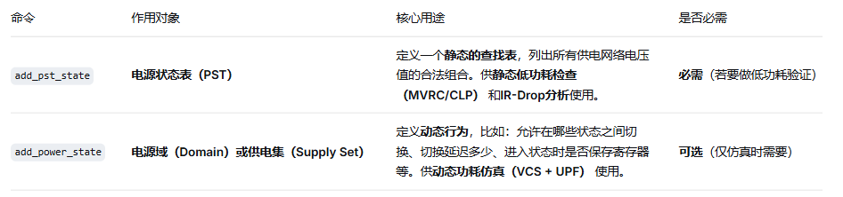

问：什么时候才需要请回 add\_power\_state？

答：

只有当你需要描述状态切换的时序条件时，才需要它。例如：

```
# 仅当你想告诉仿真器：从 SLEEP 进入 FULL_SPEED 需要 10ns 时
add_power_state SLEEP -domain PD_TOP \    -state {VDD_CORE OFF VDD_MEM ON_1V2 VDD_IO ON_3V3} \    -transition {FULL_SPEED -delay 10.0}
```

如果只是做物理实现或静态验证，这一段完全可以不写。

---

# 13. UPF中的电平转换器

> 来源：https://mp.weixin.qq.com/s?__biz=MzYzNDEzNTEzNg==&mid=2247485393&idx=1&sn=3d403e5d87f28ff5c3353ca53d3e6728&chksm=f0a230dec7d5b9c87913e8febc9c69b834f9f8fdfb0862e575c86227c521932a1862622461e6&scene=178&cur_album_id=4593598138716045316&search_click_id=#rd
> 作者：扬帆远航0727
> update 2026/09/15 22 : 01
> **已截图**

> UPF中的电平转换器：set\_level\_shifter策略、自动插入与手动指定

好，咱们今天聊聊电平转换器。这东西在低功耗设计里，说实话，是个绕不开的坎儿。

你想想看，一个芯片里，有的模块用0.8V供电，有的用1.2V。两个模块之间要传数据，信号从1.2V跑到0.8V的域里，如果不做处理，接收端可能根本认不出这个信号是高还是低。反过来，0.8V的信号直接怼到1.2V的域里，也可能导致漏电流暴增，甚至把管子搞坏。

电平转换器（Level Shifter）就是干这个的。它把信号从一个电压域，安全地转换到另一个电压域。今天我就把UPF里关于电平转换器的那些事儿，给你掰扯清楚。

## 13.1 电平转换器的基本概念

电平转换器本质上就是个特殊的buffer。它有两个电源：一个接输入侧的电压，一个接输出侧的电压。内部电路通过交叉耦合的PMOS结构，实现电平的稳定转换。

我个人习惯把电平转换器分成两类：

- **上升转换（Level Up）**

  ：从低压域到高压域。比如0.8V -> 1.2V。
- **下降转换（Level Down）**

  ：从高压域到低压域。比如1.2V -> 0.8V。

这里有个细节要注意：下降转换其实没那么复杂。很多标准单元库里的普通buffer，只要供电电压匹配，就能直接当下降转换器用。但上升转换不行，必须用专门的电路。

> **核心要点**：上升转换必须用专用电平转换单元，下降转换可以用普通buffer替代（前提是库支持）。

## 13.2 set\_level\_shifter策略详解

在UPF里，控制电平转换器插入的核心命令就是`set_level_shifter`。这个命令决定了：在哪些边界上插、用什么策略插、插什么类型的。

先看基本语法：

```
set_level_shifter -domain PD1 -applies_to inputs
set_level_shifter -domain PD2 -applies_to outputs
set_level_shifter -domain PD3 -applies_to both
set_level_shifter -domain PD4 -applies_to none
```

这里的`-applies_to`选项，说白了就是告诉工具：你要在哪个方向上插转换器。

- **inputs**

  ：在进入这个域的输入端口上插。信号从外部进来，先转成域内的电压。
- **outputs**

  ：在这个域的输出端口上插。信号从域内出去，转成外部电压。
- **both**

  ：进出都插。最保险，但面积和功耗也最大。
- **none**

  ：不插。你得自己手动处理。

我在项目中遇到过一种情况：某个模块既有0.8V的内核，又有1.2V的IO接口。这时候我一般会在内核域设`-applies_to outputs`，因为信号从内核出去要升压到IO域。而进入内核的信号，如果来自IO域，我会在IO域那边设`-applies_to outputs`，这样两边各管各的，逻辑清晰。

## 13.3 自动插入 vs 手动指定

工具可以自动帮你插电平转换器，你也可以手动指定。两种方式各有适用场景。

### 13.3.1 自动插入

自动插入是最省事的。你只需要在UPF里声明策略，工具在综合或布局布线阶段，会自动在跨域路径上插入合适的电平转换单元。

```
# 自动插入示例
set_level_shifter -domain PD_CORE -applies_to outputs \
                  -rule low_to_high -location self
set_level_shifter -domain PD_IO -applies_to inputs \
                  -rule high_to_low -location parent
```

这里`-location`参数也很关键：

- **self**

  ：转换器插在源域（发送端）。
- **parent**

  ：转换器插在目标域（接收端）。
- **fanout**

  ：转换器插在扇出点，适合多负载情况。

我个人习惯用`self`。为什么？因为转换器插在源域，它的电源和源域一致，不会引入额外的跨域供电问题。你想想看，如果插在目标域，目标域可能已经关掉了，那转换器就没电了，信号怎么传？

> 💡 **小技巧**：对于always-on的跨域路径，用`parent`或`fanout`可能更省面积。但对于可能关断的域，一定要用`self`。

### 13.3.2 手动指定

自动插入虽然方便，但有时候不够灵活。比如某些关键路径，你希望用特定尺寸的转换器，或者希望把转换器放在特定位置。这时候就得手动指定了。

手动指定有两种方式：

1. **在RTL中直接例化电平转换单元：**

```
// 手动例化电平转换器
LEVEL_SHIFTER U_LS (
.A(sig_from_core),   // 0.8V域的信号
.Z(sig_to_io),       // 1.2V域的信号
.VDDL(vdd_core),     // 低压电源
.VDDH(vdd_io)        // 高压电源
);
```

2. **在UPF中使用`-cells`选项指定特定单元：**

```
set_level_shifter -domain PD_CORE -applies_to outputs \
                  -cells {LS_HV_LV_X1 LS_HV_LV_X2}
```

我曾经在一个项目中，遇到一条跨域路径时序特别紧。自动插入的转换器延迟太大，怎么都修不满足。后来我手动指定了一个高速的LS\_HV\_LV\_X4单元，面积大了点，但时序过了。嗯，有时候就是这样，得在面积和性能之间做取舍。

## 13.4 电平转换器的规则检查

插完转换器之后，别忘了做检查。UPF提供了`check_power_domain`命令，可以帮你验证电平转换器是否插对了。

```
check_power_domain -level_shifter
```

这个命令会检查：

- 每个跨域路径上是否都有电平转换器
- 转换器的供电是否与两侧域匹配
- 是否有冗余的转换器（比如两个转换器串在一起）

> ⚠️ **避坑指南**：我曾经遇到过一个问题，检查报告显示某个路径上有两个电平转换器串在一起。原因是自动插入和手动指定冲突了。工具自动插了一个，我在RTL里又例化了一个。结果信号经过两次转换，延迟翻倍，时序直接崩了。所以，要么全自动，要么全手动，混着用一定要小心。

## 13.5 实际项目中的策略选择

说了这么多，到底该怎么选？我根据经验总结了一个表格：

| 场景 | 推荐策略 | 说明 |
| --- | --- | --- |
| 小规模设计，跨域路径少 | 手动指定 | 控制力强，容易优化 |
| 大规模设计，跨域路径多 | 自动插入 + 局部手动覆盖 | 效率高，关键路径单独处理 |
| 跨域路径时序紧张 | 手动指定高速单元 | 牺牲面积换性能 |
| 跨域路径面积敏感 | 自动插入 + 最小尺寸约束 | 用`-min_size`选项控制 |
| 多电压域层级嵌套 | 逐域设置，用`-location self` | 避免供电混乱 |

我个人建议，新手先从自动插入开始。等你对电平转换器的行为有了感觉，再尝试手动指定。毕竟，工具自动插的虽然不一定最优，但至少不会犯低级错误。

### 13.5.1 ⚖️ `-location` 和 `-applies_to` 的关系：坐标轴模型

可以把它们的关系想象成一个**二维坐标系**，共同决定了电平转换器的精确插入位置。

- **X轴（`-applies_to`）**：定义了策略关注的**信号方向**，即在**哪个边界**上采取行动。

- `inputs`：关注进入该域的信号。
- `outputs`：关注离开该域的信号。
- `both`：同时关注进入和离开的信号。

- **Y轴（`-location`）**：定义了在确定信号方向后，电平转换器实例**相对于该边界的物理摆放位置**。

- `self`：放在**策略所作用的电源域内部**。
- `parent`：放在**策略所作用的电源域外部（父级）**。
- `automatic`：**由工具自动决定**最佳位置。

### 13.5.2 🗺️ `-location` 与 `-applies_to` 的组合矩阵

`-location` 和 `-applies_to` 共有 6 种有效组合，它们决定了电平转换器的精确插入位置。为了直观理解，可以看下面的表格：

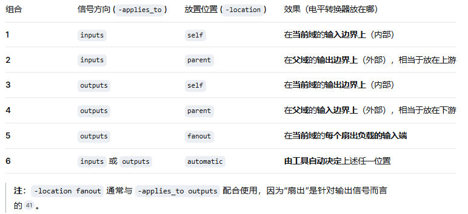

## 13.6 小结

电平转换器是跨电压域通信的桥梁。UPF里用`set_level_shifter`控制插入策略，你可以选择自动插入，也可以手动指定。关键是要理解`-applies_to`、`-location`和`-cells`这几个参数的含义。

记住一句话：上升转换必须用专用单元，下降转换可以偷懒。但偷懒之前，先确认你的库支持。

好，这一章就到这里。下一章我们聊聊隔离单元，那是另一个有意思的话题。

---

# 14. UPF中的隔离单元

> 来源：https://mp.weixin.qq.com/s?__biz=MzYzNDEzNTEzNg==&mid=2247485394&idx=1&sn=f57551e7de16a99632de1873754d4e56&chksm=f0a230ddc7d5b9cbb8f58dd7e8d8d89ad977abb5b646fa855abbe448d87996fb3d4e0a422ecf&scene=178&cur_album_id=4593598138716045316&search_click_id=#rd
> 作者：扬帆远航0727
> update 2026/09/15 22 : 02
> **已截图**

> UPF中的隔离单元：set\_isolation策略、隔离控制信号、保持与钳位模式

各位同学，今天我们来聊聊隔离单元。说实话，隔离是低功耗设计里最容易出问题的地方之一。我见过太多项目，功耗仿真跑得漂漂亮亮，结果芯片回来一测，数据莫名其妙就错了——十有八九是隔离没处理好。

隔离单元，说白了就是给跨电压域的信号加个"看门人"。当某个模块断电时，隔离单元负责给输出信号一个确定的值，防止浮空信号把接收端搞懵。嗯，这里要注意，隔离不是你想加就能加的，得讲究策略。

## 14.1 set\_isolation 策略：怎么加隔离

UPF里用 `set_isolation` 命令来指定隔离策略。我个人习惯先想清楚三个问题：隔离什么信号？用什么隔离方式？隔离控制信号怎么来？

先看一个最基本的例子：

```
set_isolation iso_pd1 \
  -domain PD1 \
  -isolation_supply VDD_ISO \
  -clamp_value
0
 \
  -applies_to outputs
```

这个命令的意思是：给 PD1 这个电源域的所有输出信号加隔离，钳位到 0，隔离供电用 VDD\_ISO。我在项目中遇到过，有人忘了指定 `-isolation_supply`，结果工具默认用了断电域的电源——那隔离单元也跟着断电了，等于白加。

`-applies_to` 参数有几种选择：

| 参数值 | 含义 | 我常用的场景 |
| --- | --- | --- |
| outputs | 只隔离输出信号 | 大多数情况，够用 |
| inputs | 只隔离输入信号 | 很少用，除非接收端特别脆弱 |
| both | 输入输出都隔离 | 双向信号或复杂接口 |

你想想看，如果只隔离输出，那断电域内部的信号乱飞怎么办？其实内部信号在域内，接收方也在同一个域，断电后大家都一样，无所谓。但跨域信号必须隔离，这是底线。

> **核心原则**：隔离的是跨电压域的信号，不是域内信号。别画蛇添足。

## 14.2 隔离控制信号：谁来发指令

隔离单元需要一个控制信号，告诉它"现在要隔离了"还是"正常传输"。这个控制信号从哪来？

我见过两种做法：

- **用电源域的状态信号**

  ：比如 PD1 的 `power_state` 信号，断电时自动拉高隔离使能。这是最稳妥的做法。
- **自己定义一个控制信号**

  ：用 `-control_signal` 指定。灵活性高，但容易出错。

看个例子：

```
set_isolation iso_pd1 \
  -domain PD1 \
  -control_signal iso_en \
  -isolation_supply VDD_ISO \
  -clamp_value
0
 \
  -applies_to outputs
```

这里我指定了 `iso_en` 作为控制信号。当 `iso_en` 为高时，隔离生效。但有个坑——`iso_en` 本身不能来自断电域！我曾经犯过这个错，把控制信号放在 PD1 内部，结果 PD1 一断电，控制信号也跟着没了，隔离单元直接罢工。

总结一句话：不加就是“全自动”，由硬件自动跟随电源状态；加了就是“手动挡”，交由你指定的逻辑去控制。 如果你没有特殊需求，强烈建议不加，省心又安全。

> ⚠️ **避坑指南**：隔离控制信号必须来自永远上电的域，或者来自外部引脚。否则就是"让瞎子带路"。

另外，控制信号的极性可以用 `-sense high` 或 `-sense low` 指定。默认是高有效。我建议统一用高有效，不然团队里其他人容易搞混。

## 14.3 保持模式 vs 钳位模式

隔离单元的输出值怎么定？有两种模式：

- **钳位模式（Clamp）**

  ：输出固定为 0 或 1。用 `-clamp_value 0` 或 `-clamp_value 1` 指定。
- **保持模式（Retention）**

  ：输出保持在断电前的最后一个值。用 `-retention` 指定。

怎么选？我个人的经验是：

| 场景 | 推荐模式 | 原因 |
| --- | --- | --- |
| 控制信号、使能信号 | 钳位到 0 | 防止误触发，安全第一 |
| 数据总线、地址总线 | 保持模式 | 减少恢复后的数据丢失 |
| 时钟、复位 | 钳位到安全值 | 时钟不能乱停，复位要确定 |

保持模式听起来很美好，但代价不小。它需要额外的寄存器来保存状态，面积和功耗都会增加。我有个项目，为了省面积，把所有信号都用了钳位模式，结果恢复时 CPU 从总线读到一堆 0，直接跑飞了。嗯，从那以后我学乖了——关键数据路径还是得用保持。

看一个保持模式的例子：

```
set_isolation iso_strategy \
  -domain PD1 \  -clamp_value latch \          # 核心：钳位为断电前的值  -isolation_signal iso_en \    # 隔离使能信号  -isolation_sense high \       # 高电平有效（使能隔离）  -isolation_supply VDD_ALWAYS_ON \ # 关键：这个锁存器必须由常开电源供电！  -applies_to outputs
```

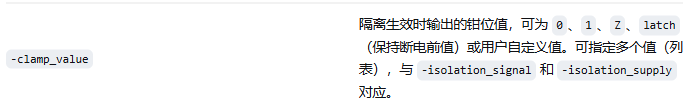

> 💡 **小技巧**：如果你不确定用哪种模式，先默认用钳位到 0。等仿真发现数据问题，再针对性改成保持模式。别一开始就全上保持，面积会爆炸。

## 14.4 隔离单元的物理实现

说完了策略，聊聊物理实现。隔离单元本质上是一个带使能端的锁存器或门电路。常见的实现方式有：

- **AND 门**

  ：控制信号为低时，输出钳位到 0。简单，但只能钳 0。
- **OR 门**

  ：控制信号为高时，输出钳位到 1。只能钳 1。
- **多路选择器**

  ：控制信号选择正常路径还是钳位值。灵活，面积稍大。
- **带寄存器的隔离单元**

  ：用于保持模式，面积最大。

我建议在综合阶段就让工具自动推断隔离单元类型。你只需要在 UPF 里指定策略，工具会从库里面挑合适的单元。但要注意，库里面得有对应的隔离单元，否则工具会报错。

举个例子，如果你的库只有 AND 型隔离单元，那 `-clamp_value 1` 就实现不了。这时候要么换库，要么自己写一个。

> **总结一下**：隔离单元不是万能药。用对了，它是低功耗设计的守护神；用错了，它就是数据错误的元凶。记住三点：控制信号不能来自断电域、关键数据用保持模式、仿真一定要覆盖隔离场景。

---

# 15. UPF中的状态保持

> 来源：https://mp.weixin.qq.com/s?__biz=MzYzNDEzNTEzNg==&mid=2247485395&idx=1&sn=05fef74c662f6aade379f6d37d689ac9&chksm=f0a230dcc7d5b9cae0c501dfdcb5207645079c433efc55d31234f2c61b14df10d8add00bd255&scene=178&cur_album_id=4593598138716045316&search_click_id=#rd
> 作者：扬帆远航0727
> update 2026/09/15 22 : 02
> **已截图**

> UPF中的状态保持：set\_retention策略、保存与恢复控制、保持寄存器综合

好，咱们今天聊一个在低功耗设计里特别关键的话题——状态保持。说白了，就是当芯片进入低功耗模式，把某些模块的电源关掉之后，怎么让这些模块醒来时还记得自己之前干了什么。

我刚开始接触UPF那会儿，觉得这玩意儿不就是加个寄存器嘛，有啥难的？结果第一次做项目就栽了跟头——醒来后数据全乱套了。嗯，从那以后我再也不敢小看这个set\_retention了。

## 15.1 什么是状态保持？为什么需要它？

先说说基本概念。你想想看，芯片里有些模块，比如CPU的寄存器文件、状态机、FIFO的读写指针，这些玩意儿一旦断电，里面的数据就全丢了。但有些场景下，我们希望在关电后还能把关键数据留住，等上电后再恢复回来。

这就是状态保持（State Retention）要解决的问题。它不像隔离那样只是把输出钳住，而是要把内部状态完整地保存下来。

> **核心要点**：状态保持 ≠ 不掉电。它是在主电源关断前，把数据搬到备用电源上；主电源恢复后，再把数据搬回来。

我个人习惯把状态保持分成三个环节：

- **保存（Save）**

  ：关电前，把数据从主寄存器拷贝到保持寄存器
- **保持（Retain）**

  ：主电源关断期间，由常开电源给保持寄存器供电
- **恢复（Restore）**

  ：主电源恢复后，把数据从保持寄存器拷回主寄存器

## 15.2 set\_retention策略详解

在UPF里，我们用 `set_retention` 命令来定义哪些寄存器需要做状态保持。这个命令的语法看起来简单，但里面的门道不少。

```
set_retention retention_name \
  -domain PD_SLEEP \
  -retention_power_net VDD_RET \
  -retention_ground_net VSS \
  -save_signal {save_ctrl high} \
  -restore_signal {restore_ctrl high} \
  -elements {u_core/u_cpu/regfile_*}
```

我来拆解一下这几个关键参数：

| 参数 | 说明 | 我的经验 |
| --- | --- | --- |
| -domain | 指定要操作的电源域 | 注意别写错了域名，我见过有人把PD\_SLEEP写成PD\_ACTIVE，结果综合出来一堆错误 |
| -retention\_power\_net | 保持寄存器的供电网络 | 这个网络必须是常开的，不能跟着主电源一起关 |
| -save\_signal / -restore\_signal | 保存和恢复的控制信号 | 这两个信号通常来自电源管理单元（PMU） |
| -elements | 指定哪些寄存器需要保持 | 可以用通配符，但别太宽泛，否则面积会爆炸 |

> 💡 **小技巧**：我建议你在写set\_retention时，先用一个小的测试集跑一遍，确认保存和恢复的时序没问题。我曾经在一个项目里，因为save信号和关电信号的时序没对齐，导致数据保存了一半就断电了——那叫一个惨。

## 15.3 保存与恢复控制

保存和恢复的控制，说白了就是两个信号怎么配合电源开关的时序。这里有个典型的流程：

1. **保存阶段**

   ：PMU拉高save信号 → 寄存器把数据锁到保持单元 → 等待保存完成 → 拉高隔离使能 → 关断主电源
2. **恢复阶段**

   ：打开主电源 → 等待电压稳定 → 拉高restore信号 → 数据从保持单元拷回主寄存器 → 拉低隔离使能 → 恢复正常工作

嗯，这里要注意一个关键点：**保存和恢复信号不能同时有效**。你想想看，如果一边在保存一边在恢复，那数据不就乱套了吗？

我在项目中遇到过一个问题：PMU给的save信号宽度不够，导致有些寄存器没来得及完成保存操作。后来我们加了一个握手机制——保存完成后，保持单元会回一个ack信号给PMU，PMU确认所有单元都保存完了才关电。

```
// 伪代码示例：保存与恢复的时序控制
always
 @(
posedge
 clk
or
negedge
 rst_n)
begin
if
 (!rst_n)
begin
    save_done <=
1'b0
;
    restore_done <=
1'b0
;
end
else
begin
// 保存完成检测
if
 (save_ctrl && retention_ready)
      save_done <=
1'b1
;
// 恢复完成检测
if
 (restore_ctrl && retention_ready)
      restore_done <=
1'b1
;
end
end
```

## 15.4 保持寄存器综合

说到保持寄存器的综合，这里面的坑就更多了。保持寄存器本质上是一个带备份存储单元的寄存器，通常有两种实现方式：

1. **气球式保留 (Balloon-style Retention)**

- **原理**：这种类型的寄存器包含一个额外的主锁存器（称为“气球锁存器”），用于在断电时保存数据。这个额外的锁存器**不在**功能数据通路上。
- **特点**：数据保存和恢复操作是显式控制的，通常需要独立的控制信号。

  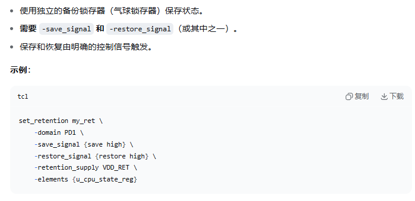

2. **主/从常活式保留 (Master/Slave-alive Retention)**

- **原理**：这种类型的寄存器**不需要**额外的锁存器。它直接利用寄存器内部的主锁存器（Master Latch）或从锁存器（Slave Latch）来保存数据。这个锁存器本身就**在**功能数据通路上。
- **特点**：数据保存和恢复通常是自动的，在电源状态切换时由硬件自己完成，因此可能不需要额外的控制信号。

  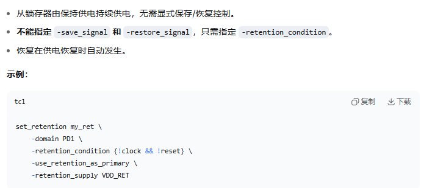

### 15.4.1 📐 面积差异：定性分析

- **气球式保留 (Balloon-style)**：面积更大。因为它是在标准主从触发器的基础上，**额外增加了一个独立的气球锁存器（Balloon Latch）**。这个额外的锁存器带来了明确的面积开销。
- **主/从常活式保留 (Master/Slave-alive)**：面积更小。因为它**复用了寄存器内部原有的主锁存器或从锁存器**来保存数据，无需额外的大尺寸锁存器，因此面积开销远小于气球式。

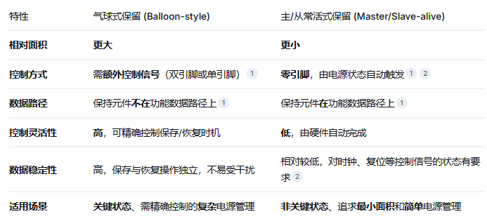

#### 15.4.1.1 如何抉择

1. **优先考虑主/从常活式 (Master/Slave-alive)**：如果**面积是第一优先级**，且被保存的数据对稳定性要求不那么苛刻，应优先选择。它适合保存可以快速重新初始化、或丢失后影响不大的状态。
2. **谨慎使用气球式 (Balloon-style)**：仅在**必须绝对保证数据安全**，且**能接受其面积开销**时使用。它适合保存CPU核心状态、关键FSM状态、缓存数据等一旦丢失就会导致系统崩溃或功能错误的**关键数据**。

综合工具怎么处理这些保持寄存器呢？我简单说一下流程：

1. **UPF解析阶段**

   ：工具读取set\_retention命令，识别出需要保持的寄存器
2. **RTL映射阶段**

   ：工具把普通的D触发器替换成带保持功能的寄存器单元
3. **电源连接阶段**

   ：工具自动把保持单元的电源接到VDD\_RET上
4. **控制信号连接阶段**

   ：工具把save/restore信号连到对应的保持单元上

> ⚠️ **警告**：千万不要手动去例化保持寄存器！我见过有人直接在RTL里例化了一个带保持功能的库单元，结果UPF里又用set\_retention指定了同一个寄存器——综合工具直接报错，说信号冲突。记住，保持寄存器的插入应该完全交给UPF和综合工具来处理。

综合完成后，我建议你检查一下这几个方面：

- 保持寄存器的数量对不对？别多也别少
- save/restore信号有没有被优化掉？有些工具会自作主张把看似"无用"的信号优化掉
- 保持寄存器的电源网络是不是真的连到了常开电源上？这个可以在网表里查

最后说一句，保持寄存器的面积开销不小。一个保持寄存器大概比普通寄存器大30%~50%。所以别一上来就给所有寄存器都加上保持功能，挑那些真正需要保持状态的寄存器就好。我一般会先和架构师沟通，确认哪些状态在唤醒后必须保留，其他的就让它丢了吧——反正重新初始化一下就行。

---

# 16. UPF中的电源开关

> 来源：https://mp.weixin.qq.com/s?__biz=MzYzNDEzNTEzNg==&mid=2247485423&idx=1&sn=24800be9e492b0ec1b03aacc62bb8085&chksm=f0a230e0c7d5b9f6f76e7e30069ad29631c198029cef6cb309267bbd0606bfa4172fce07a274&scene=178&cur_album_id=4593598138716045316&search_click_id=#rd
> 作者：扬帆远航0727
> update 2026/09/15 22 : 02
> **已截图**

> UPF中的电源开关：create\_power\_switch、开关控制逻辑、开关链设计

电源开关，说白了就是芯片里的「水龙头」。

你想啊，一个模块不用的时候，把它的电掐掉，这不就能省电了吗？这个「掐电」的动作，就是靠电源开关来完成的。我刚开始接触低功耗设计时，觉得这玩意儿不就是个MOS管嘛，有啥好讲的？后来在项目里吃过亏才发现，里面的门道还真不少。

## 16.1 电源开关的基本概念

电源开关，英文叫Power Switch，也叫Header Switch或Footer Switch。它的作用就是控制一个电源域是否供电。

我个人习惯把电源开关分成两类：

- **Header Switch**

  ：接在VDD和模块的虚拟VDD之间，控制供电的通断
- **Footer Switch**

  ：接在VSS和模块的虚拟VSS之间，控制地的通断

实际项目中，Header Switch用得更多一些。为什么呢？因为Footer Switch会抬高模块的地电位，对噪声敏感的设计不太友好。

> **关键点**：电源开关本质上是一个大尺寸的PMOS（Header）或NMOS（Footer）晶体管，通过栅极电压控制其导通或关断。

## 16.2 create\_power\_switch命令详解

在UPF里，我们用`create_power_switch`来定义电源开关。这个命令的语法看起来有点复杂，但拆开来看其实很简单。

```
create_power_switch switch_name \
    -domain domain_name \
    -output_supply_port {port_name net_name} \
    -input_supply_port {port_name net_name} \
    -control_port {port_name net_name} \
    -on_state {state_name input_port control_port} \
    -ack_port {port_name net_name} \
    -ack_delay {delay_value}
```

我来逐个解释一下这些参数：

| 参数 | 说明 | 我的经验 |
| --- | --- | --- |
| -domain | 指定这个开关属于哪个电源域 | 别搞混了，一个电源域可以有多个开关 |
| -output\_supply\_port | 开关的输出供电端口，连接到模块的虚拟电源 | 命名建议用VDD\_SW或VDD\_GATED |
| -input\_supply\_port | 开关的输入供电端口，来自主电源 | 通常就是VDD |
| -control\_port | 控制信号端口，决定开关通断 | 高电平导通还是低电平导通？看-on\_state定义 |
| -on\_state | 定义开关在什么条件下导通 | 这里容易出错，我后面会讲 |
| -ack\_port | 确认信号，表示开关状态已稳定 | 做安全关断时很有用 |

举个例子，一个最简单的电源开关定义：

```
create_power_switch sw_iso \
    -domain PD_DSP \
    -output_supply_port {vdd_sw VDD_GATED} \
    -input_supply_port {vdd VDD} \
    -control_port {sleep SLEEP_N} \
    -on_state {on_state vdd {SLEEP_N}} \
    -ack_port {ack ACK_SW}
```

这里有个坑，我刚开始用的时候踩过。你看`-on_state`的写法：`{on_state vdd {SLEEP_N}}`。它的意思是：当SLEEP\_N为高电平时，开关导通，输出端口vdd\_sw连接到输入端口vdd。说白了，SLEEP\_N=1时，开关打开，模块供电；SLEEP\_N=0时，开关关断，模块掉电。

> ⚠️ **注意**：-on\_state中的控制信号列表是「导通条件」。如果控制信号是低电平有效，记得在RTL里取反，或者在UPF里用逻辑表达式。

## 16.3 开关控制逻辑

电源开关不是随便就能关的。你想想看，一个模块正在处理数据，你突然把电掐了，数据丢了不说，还可能造成整个芯片死机。

所以，开关控制逻辑必须满足几个条件：

1. **先隔离，后关断**

   ：在关断电源之前，先把模块的输出信号隔离起来，防止浮空信号传到其他模块
2. **先保存，后掉电**

   ：如果有寄存器需要保存状态，得先把数据存到 retention register 里
3. **先上电，后工作**

   ：上电后要等电源稳定了，再解除隔离，让模块开始工作

我曾经在一个项目中，就因为忽略了上电顺序，导致模块刚上电时输出了一堆毛刺，把后面的逻辑给冲乱了。查了整整两天才找到原因。

典型的开关控制状态机是这样的：

```
// 伪代码示例
always @(posedge clk ornegedge rst_n) begin
if (!rst_n) begin
        sleep_req  <= 1'b0;
        iso_en     <= 1'b1;  // 默认隔离
        sw_off     <= 1'b1;  // 默认关断
        state      <= IDLE;
endelsebegin
case (state)
            IDLE: begin
if (power_down_req) begin
                    iso_en <= 1'b1;      // 先使能隔离
                    state  <= ISO_WAIT;
end
end
            ISO_WAIT: begin
if (iso_done) begin
                    sw_off <= 1'b1;      // 再关断电源
                    state  <= OFF;
end
end
            OFF: begin
if (power_up_req) begin
                    sw_off <= 1'b0;      // 先打开电源
                    state  <= ON_WAIT;
end
end
            ON_WAIT: begin
if (power_good) begin
                    iso_en <= 1'b0;      // 再解除隔离
                    state  <= IDLE;
end
end
endcase
end
end
```

> 💡 **小技巧**：我习惯在UPF里用`set_isolation`和`set_retention`配合电源开关一起使用。这样工具会自动帮你处理好隔离和保持的逻辑，省心不少。

## 16.4 开关链设计

单个电源开关能提供的电流是有限的。如果一个模块需要的电流很大，比如CPU核、GPU这些大家伙，你就得用多个开关并联起来。

但问题来了：如果所有开关同时打开，瞬间电流会非常大，造成电源电压跌落，甚至引发地弹效应。这就是所谓的「浪涌电流」问题。

怎么解决呢？用开关链（Switch Chain）。

开关链的设计思想很简单：把多个开关分成几组，一组一组地依次打开。就像你开家里的灯，不会一下子把所有灯都打开，而是一个一个开。

UPF里怎么描述开关链呢？其实没有专门的命令，而是通过控制信号的连接来实现。

```
// 定义三个开关，用不同的控制信号
create_power_switch sw_chain_0 \
    -domain PD_CORE \
    -output_supply_port {vdd_sw VDD_CORE_GATED} \
    -input_supply_port {vdd VDD_CORE} \
    -control_port {sleep_en SLEEP_EN_0} \
    -on_state {on vdd {SLEEP_EN_0}}

create_power_switch sw_chain_1 \
    -domain PD_CORE \
    -output_supply_port {vdd_sw VDD_CORE_GATED} \
    -input_supply_port {vdd VDD_CORE} \
    -control_port {sleep_en SLEEP_EN_1} \
    -on_state {on vdd {SLEEP_EN_1}}

create_power_switch sw_chain_2 \
    -domain PD_CORE \
    -output_supply_port {vdd_sw VDD_CORE_GATED} \
    -input_supply_port {vdd VDD_CORE} \
    -control_port {sleep_en SLEEP_EN_2} \
    -on_state {on vdd {SLEEP_EN_2}}
```

然后在RTL里，你用一个移位寄存器或者计数器，依次拉高SLEEP\_EN\_0、SLEEP\_EN\_1、SLEEP\_EN\_2。每个开关之间留几个时钟周期的间隔，让电源稳定一下。

> **设计要点**：
>
> - 开关链的级数取决于总电流和每个开关的驱动能力
> - 每级之间的延迟时间要足够，一般建议10-100ns
> - 关断时也要依次关断，避免电流突变

我记得有个项目，芯片的功耗要求特别严，我们用了16级开关链。每级开关的尺寸都不一样，前面的小一点，后面的大一点。这样做的目的是：先打开小开关，给模块一个「预热」的过程，再打开大开关提供主力电流。效果还不错，浪涌电流降低了将近40%。

---

开关链设计中，`-output_supply_port` 重复绑定同一个虚拟电源

> **原文示例**：三个开关的 `-output_supply_port` 都指向 `{vdd_sw VDD_CORE_GATED}`

- **问题**：在 UPF 语义中，**多个开关的输出连接到同一个供电网络是允许的**（并行连接），但需要注意：

- 这个供电网络（`VDD_CORE_GATED`）在仿真和综合中会被解析为**同一个 resolved supply net**。
- 如果这些开关的输出同时导通，它们可能会在仿真中产生**多驱动冲突（multiple drivers）**，除非该网络被声明为 **`resolved`**（如 `-resolve parallel_one_hot`）。

- 作者的意图是“多个开关并联”的经典设计，但**没有提醒读者该网络必须定义为 resolved supply net**。这是一个很大的潜在坑。

> **建议修正**：在示例前或后增加说明，提示 `VDD_CORE_GATED` 需要定义为 `resolved` 类型（如 `-resolve parallel_one_hot`），否则仿真工具会报错。

---

## 16.5 实际项目中的避坑指南

说了这么多，最后分享几个我踩过的坑：

- **开关尺寸别拍脑袋**

  ：我曾经为了省面积，把开关尺寸做小了，结果IR Drop超标，模块在低电压下直接罢工。后来老老实实做了电源完整性仿真，才把尺寸定下来。
- **注意开关的寄生效应**

  ：大尺寸的电源开关本身就有不小的寄生电容和电阻。这些寄生参数会影响开关的开关速度和功耗。我一般会在UPF里用`set_switch_model`来建模。
- **仿真验证不能省**

  ：电源开关的开关过程，一定要做动态仿真。我曾经见过一个设计，静态时序分析全过，但动态仿真时发现开关关断瞬间有毛刺，导致隔离信号失效。这种问题静态分析是看不出来的。
- **别忘了ESD保护**

  ：电源开关本身也是晶体管，也需要ESD保护。我见过有人把开关放在ESD环外面，结果流片回来一测试，开关先挂了。

> ⚠️ **重要提醒**：电源开关的布局布线要特别注意。大电流的走线要用宽金属，多个开关要均匀分布，避免电流集中。我曾经在一个项目里，因为开关都挤在模块的一角，导致另一端的电压降得厉害，模块工作不稳定。

说白了，create\_power\_switch只是定义了一个「开关」的接口，真正的难点在于控制逻辑的设计和开关链的规划。

---

# 17. UPF低功耗验证基础

> 来源：https://mp.weixin.qq.com/s?__biz=MzYzNDEzNTEzNg==&mid=2247485424&idx=1&sn=e7af986436764bdb4691f368435967b9&chksm=f0a230ffc7d5b9e9971669cb5ffe7b173a89a83ab208715aab184d2380fa8204c10ea938ce2e&scene=178&cur_album_id=4593598138716045316&search_click_id=&poc_token=HBdQqWqjC4NHqSUPYqyLHLHxkOz-1_CXMPmkvq5M
> 作者：扬帆远航0727
> update 2026/09/15 22 : 02
> **已截图**

> UPF低功耗验证基础：静态验证（UPF Lint）与动态验证（仿真）的区别

各位同学，今天我们来聊聊低功耗验证里最基础、也最容易混淆的两个概念——静态验证和动态验证。

说实话，我刚入行那会儿，也分不太清这两者的边界。总觉得"反正都是验证，跑一遍不就完了？"结果呢？有一次项目里，我光顾着跑仿真，忽略了UPF Lint检查，最后在顶层集成时发现电源域交叉引用全乱了……嗯，那滋味可不好受。

所以今天，我带你彻底搞懂它们。

## 17.1 什么是静态验证（UPF Lint）？

静态验证，说白了就是"不跑仿真，只做检查"。它像是一个语法和规则检查器，专门盯着你的UPF文件看。

我习惯叫它"UPF Lint"，因为它和代码Lint检查很像——不关心时序，不关心功能，只关心你的UPF描述是否合法、是否一致。

**它主要检查什么？**

- **电源域定义是否完整**

  ：每个power domain有没有指定primary power net？有没有遗漏的isolation策略？
- **电源网络连接是否正确**

  ：比如VDD和VSS有没有接反？level shifter的供电是否匹配？
- **低功耗单元是否缺失**

  ：比如always\_on buffer有没有放在正确的域里？
- **跨域路径是否合规**

  ：两个不同电压域之间的信号，有没有加isolation cell或level shifter？

> **核心要点**：静态验证不跑仿真，不产生波形。它只做"结构检查"和"规则检查"。

我在项目中遇到过一件事：有个同事写UPF时，把某个power domain的primary power net写成了VDDCORE，但实际设计中这个域用的是VDDIO。静态验证直接报错，一查才发现是笔误。要是等到仿真再发现，那得浪费多少时间？

## 17.2 什么是动态验证（仿真）？

动态验证，就是"跑仿真，看波形"。它关心的是：在电源开关、电压变化、模式切换的过程中，你的设计功能是否正确。

你想想看，静态验证只能告诉你"语法对不对"，但它没法告诉你"这个isolation cell在关断时输出是不是对的"。后者必须靠仿真。

**动态验证主要验证什么？**

- **电源关断/唤醒序列**

  ：比如某个模块关断后，输出是否被正确isolation？唤醒时，复位时序是否满足？
- **电压切换行为**

  ：比如DVFS场景下，电压从0.9V切换到1.1V时，逻辑功能是否正常？
- **低功耗控制信号**

  ：比如power switch的使能信号、retention控制信号，时序是否对齐？
- **跨域数据完整性**

  ：不同电压域之间的数据传递，有没有因为电平不匹配而出错？

> 💡 **我的建议**：动态验证一定要加"低功耗检查"的断言。比如用UPF自带的power aware assertion，或者自己写SVA。否则，你看到的波形可能只是"假象"。

我记得有一次做动态仿真，波形看起来一切正常，但总觉得哪里不对。后来加了一个isolation check的断言，果然抓到了一个bug——某个信号在关断后没有保持住，直接浮空了。嗯，这种问题，光看波形是看不出来的。

下面我从两个层面来详细说明：UPF 自带的 power-aware assertion 机制，以及手写 SVA。

一、UPF 自带的 Power-Aware Assertion（simstate 机制）

这是 UPF 标准（IEEE 1801）自带的"内置断言"。核心是 add\_power\_state 中的 -simstate 参数。仿真器会自动根据你定义的 simstate 来检查信号行为是否合法。

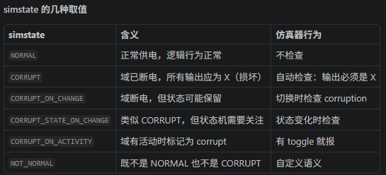

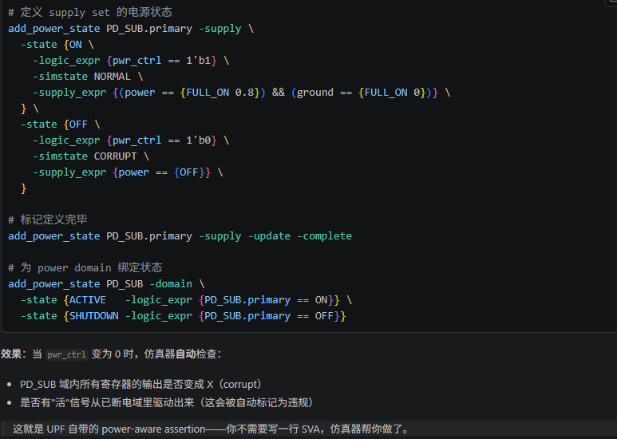

## 17.3 手写 SVA（SystemVerilog Assertions）

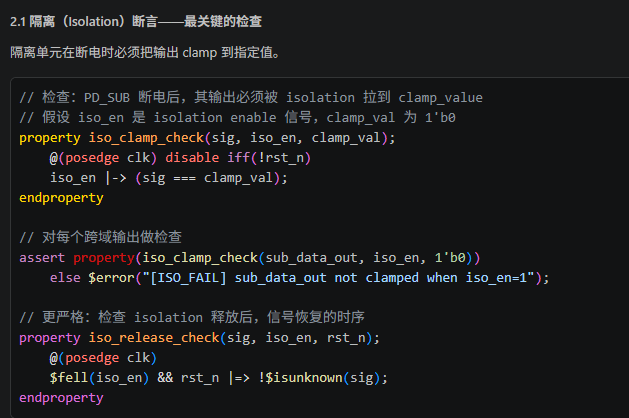

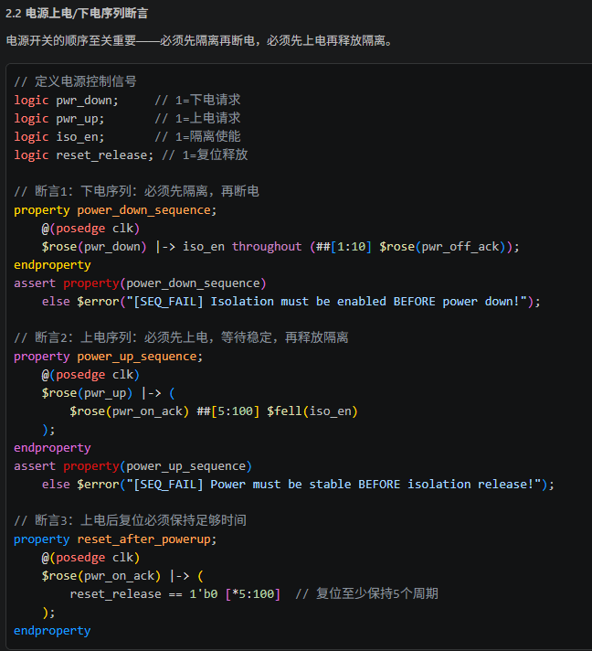

## 17.4 静态验证 vs 动态验证：一张表说清楚

| 对比维度 | 静态验证（UPF Lint） | 动态验证（仿真） |
| --- | --- | --- |
| **验证方式** | 不跑仿真，只做规则检查 | 跑仿真，看波形 |
| **验证对象** | UPF文件本身、电源域结构 | 设计功能 + 低功耗行为 |
| **发现的问题** | 语法错误、连接错误、缺失单元 | 时序错误、功能错误、控制逻辑错误 |
| **运行速度** | 快（几分钟到几十分钟） | 慢（几小时到几天） |
| **覆盖率** | 100%结构检查 | 取决于测试用例 |
| **适用阶段** | 早期（UPF编写阶段） | 中后期（集成验证阶段） |

这张表你最好记下来。面试时经常有人问："静态验证和动态验证有什么区别？"你把这几点说清楚，面试官就知道你是真干过活的。

## 17.5 先做静态，再做动态——这是我的习惯

我个人习惯的流程是这样的：

1. **写完UPF后，先跑一遍静态验证**

   。把语法错误、连接错误、缺失单元全部清掉。
2. **静态验证通过后，再跑动态仿真**

   。这时候你才能放心地去验证功能行为。
3. **仿真过程中，如果发现异常，回头再跑静态验证**

   。有时候仿真报错，其实是UPF写错了，而不是设计功能有问题。

> ⚠️ **避坑指南**：我曾经跳过静态验证，直接跑仿真。结果仿真跑了三天，最后发现是UPF里一个电源域名字写错了。三天白跑……从那以后，我再也不敢跳过静态验证了。

## 17.6 一个简单的例子

假设你有一个UPF片段：

```
create_power_domain PD_TOP -include_scope {top}
create_power_domain PD_SUB -include_scope {top/sub}
set_domain_supply_net PD_TOP -primary_power_net VDD_TOP -primary_ground_net VSS
set_domain_supply_net PD_SUB -primary_power_net VDD_SUB -primary_ground_net VSS
set_isolation PD_SUB -domain PD_SUB -isolation_net VDD_TOP -clamp_value 0
```

静态验证会检查什么？

- PD\_TOP和PD\_SUB的primary power net是否定义？
- isolation的供电网络VDD\_TOP是否存在？
- isolation的clamp\_value是否合法？

动态验证会检查什么？

- 当PD\_SUB关断时，输出是否真的被clamp到0？
- 唤醒时，isolation释放的时序是否和复位时序对齐？
- VDD\_SUB电压变化时，跨域信号有没有毛刺？

你看，两者关注的点完全不同，但缺一不可。

## 17.7 总结一下

静态验证和动态验证，就像盖房子时的"图纸审查"和"实际测试"。图纸审查能发现设计错误，但没法验证房子住起来舒不舒服；实际测试能验证功能，但没法保证图纸本身没有漏洞。

所以我的建议是：**两手都要抓，两手都要硬**。先静态，后动态，两者结合，才能把低功耗验证做扎实。

---

# 18. UPF仿真流程

> 来源：https://mp.weixin.qq.com/s?__biz=MzYzNDEzNTEzNg==&mid=2247485425&idx=1&sn=f64e2fc0c283f11a11f2b541eb99312e&chksm=f0a230fec7d5b9e842eea14478f519fc8b282c8e17ee6f36d5f10a884ed53863520e5389af8e&scene=178&cur_album_id=4593598138716045316&search_click_id=#rd
> 作者：扬帆远航0727
> update 2026/09/15 22 : 03
> **已截图**

> UPF仿真流程：VCS/Questa等工具中的UPF编译、仿真选项、波形调试

各位同学，今天我们来聊聊UPF仿真流程。说实话，很多工程师在写UPF的时候觉得挺顺手，一到仿真就抓瞎。为什么？因为UPF仿真和普通RTL仿真不一样，它涉及电源域、隔离策略、状态保持这些概念，仿真器得理解这些语义才行。

我个人习惯把UPF仿真分成三步：编译、仿真、调试。每一步都有坑，咱们一个一个说。

## 18.1 VCS中的UPF编译与仿真

VCS是Synopsys家的主力仿真器。它支持UPF的方式，说白了就是通过几个关键的编译选项来告诉仿真器：“嘿，我这设计里有低功耗意图，你帮我处理一下。”

最基本的编译命令长这样：

```
vcs -full64 -sverilog \
    -debug_access+all \
    -upf test.upf \
    -power=upf \
    top.sv \
    -l vcs_compile.log
```

这里有几个关键点：

- `-power=upf`

  ：告诉VCS启用UPF仿真模式。不加这个，UPF文件不会被解析。
- `-upf test.upf`

  ：指定UPF文件路径。可以指定多个，VCS会按顺序加载。
- `-debug_access+all`

  ：开启全部调试能力。我建议仿真阶段就加上，省得后面想查波形发现没开。

仿真命令：

```
./simv -l simv.log +UVM_TESTNAME=test_name \
       -power=upf \
       -ucli -do wave.tcl
```

`-power=upf`在仿真阶段也要加。嗯，这里要注意，VCS的UPF仿真分两个阶段：编译时解析UPF，仿真时模拟电源行为。两个阶段都得告诉仿真器"我在做UPF仿真"。

> **重要提示**：VCS在UPF仿真时，默认会检查电源域切换是否合法。比如某个域已经关了，你还往里写数据，仿真器会报错。这个检查很严格，但能帮你提前发现问题。

## 18.2 QuestaSim中的UPF编译与仿真

QuestaSim是Mentor（现Siemens EDA）的工具。它的UPF仿真流程和VCS大同小异，但选项名字不一样。

编译命令：

```
vlog -sv -work work \
     -power upf \
     -upf test.upf \
     top.sv
```

仿真命令：

```
vsim -power upf \
     -voptargs="+acc" \
     -do wave.do \
     work.top
```

我在项目中遇到过一个问题：用Questa仿真时，隔离单元的行为和预期不符。后来发现是`-power upf`选项没加对位置。编译和仿真阶段都得加，缺一个都不行。

> 💡 **小技巧**：如果你用Questa做UPF仿真，建议在vsim命令里加上`-voptargs="+acc"`。这个选项能让你看到所有内部信号，调试隔离和状态保持逻辑时特别有用。

## 18.3 UPF仿真选项详解

不管是VCS还是Questa，都有一些通用的UPF仿真选项。我整理了一个表格，方便大家对照：

| 选项 | VCS | Questa | 作用 |
| --- | --- | --- | --- |
| 启用UPF | -power=upf | -power upf | 告诉仿真器解析UPF |
| 指定UPF文件 | -upf file.upf | -upf file.upf | 加载UPF约束 |
| 电源域检查 | -power=upf\_check | -power upf\_check | 检查电源域合法性 |
| 隔离行为模拟 | 默认开启 | 默认开启 | 模拟隔离单元行为 |
| 状态保持模拟 | 默认开启 | 默认开启 | 模拟寄存器保持行为 |

你想想看，这些选项其实都是在告诉仿真器：“我要模拟真实的电源行为，别给我偷懒。”

## 18.4 波形调试技巧

波形调试是UPF仿真的重头戏。普通RTL仿真你只需要看数据对不对，UPF仿真你还得看电源对不对。

我个人习惯在波形里加这几类信号：

- **电源信号**

  ：VDD、VSS、power switch的控制信号。这些能告诉你某个域到底有没有电。
- **隔离控制信号**

  ：iso\_en、iso\_out。看隔离单元有没有在正确的时间开启。
- **状态保持信号**

  ：ret\_en、save/restore信号。检查寄存器有没有正确保存状态。
- **电源域状态**

  ：有些仿真器会生成`power_state`这类内部信号，可以直接看域是ON还是OFF。

我曾经调试过一个bug：某个模块在电源关断后，输出竟然还在跳变。查了半天，发现是隔离单元没加对。在波形里一看，iso\_en信号根本没拉高。嗯，这种问题在波形里一目了然。

> ⚠️ **避坑指南**：我曾经在调试时发现波形里隔离输出是X态。一开始以为是仿真器bug，后来发现是UPF里隔离策略写错了。隔离策略的`isolation_supply`没指定正确的电源，导致隔离单元没有供电。记住：隔离单元自己也得有电！

## 18.5 常见问题与调试方法

做UPF仿真，你大概率会遇到这几个问题：

1. **X态传播**

   ：电源关断后，输出变成X。这是正常的，但如果你看到不该有X的地方出现了X，那就有问题。
2. **隔离失败**

   ：电源关断后，输出还在变化。检查隔离单元有没有正确插入。
3. **状态保持失败**

   ：电源恢复后，寄存器值丢了。检查retention策略。
4. **仿真速度慢**

   ：UPF仿真比普通仿真慢很多。我建议只对关键场景做UPF仿真，不要每个test都跑。

调试方法其实就一句话：**从波形里找线索，从UPF里找原因。** 波形告诉你现象，UPF告诉你原因。两者结合，大部分问题都能解决。

> 💡 **我的习惯**：调试时我会同时打开三个窗口：波形窗口、UPF文件、RTL代码。波形里看到异常，立刻去UPF里查对应的策略，再去RTL里看实现。这样效率最高。

好了，关于UPF仿真流程就讲这么多。记住：工具只是工具，关键是你得理解UPF的语义。仿真器帮你检查语法，但语义上的正确性还得靠你自己判断。

---

# 19. UPF与逻辑综合

> 来源：https://mp.weixin.qq.com/s?__biz=MzYzNDEzNTEzNg==&mid=2247485426&idx=1&sn=9d6263815b372fb34ca7c659fcf693ee&chksm=f0a230fdc7d5b9eb1c0338e5676d547b674a7c466cea7fec04e5f244ee7b07844bba09369bd8&scene=178&cur_album_id=4593598138716045316&search_click_id=#rd
> 作者：扬帆远航0727
> update 2026/09/15 22 : 03
> **已截图**

> UPF与逻辑综合：DC/Genus中读取UPF、多电压综合流程、报告分析

逻辑综合，说白了就是把RTL代码翻译成门级网表。但加了低功耗设计后，这事就没那么简单了。你想想看，芯片里有的模块跑1.0V，有的跑0.8V，还有的干脆关掉电源——综合工具得知道这些信息才行。UPF就是干这个的。

我个人习惯，在综合阶段就把UPF吃进去。别等到后端再搞，那时候发现问题改起来太痛苦了。我在项目中遇到过好几次，综合时没处理好电压域，结果后端跑完发现时序收敛不了，回头改RTL和UPF，整个项目延期两周。嗯，从那以后我再也不敢轻视综合阶段的UPF检查了。

## 19.1 DC/Genus中读取UPF的基本流程

不管是Synopsys的DC还是Cadence的Genus，读取UPF的流程大同小异。核心就三步：读设计、读UPF、做综合。

先看DC的典型脚本：

```
# 第一步：读入设计
read_verilog [list top.v core.v io.v]
current_design top
link

# 第二步：读取UPF
load_upf power_intent.upf
# 或者用 source power_intent.tcl（如果UPF里用了Tcl扩展）

# 第三步：检查UPF一致性
check_mv_design -verbose > check_mv.rpt

# 第四步：做综合
compile_ultra -gate_clock -retime
```

Genus这边稍微有点不同：

```
# Genus流程
read_hdl -language sv [list top.sv core.sv io.sv]
elaborate top

# 读取UPF
read_power_intent -1801 upf_file.upf
commit_power_intent

# 综合
syn_generic
syn_map
syn_opt
```

> 💡 **我的小技巧**：在DC里，我习惯先读UPF再跑check\_mv\_design。这个检查能发现很多低级错误，比如电源域没连对、隔离单元漏了、电平转换器类型不匹配。我曾经在一个项目里，check\_mv\_design报出47个warning，我一个个查，最后发现是UPF里一个power\_state写错了。要是没做这个检查，流片回来芯片肯定不工作。

## 19.2 多电压综合的关键配置

多电压综合，说白了就是让工具知道：哪些cell用哪个电压。工具会根据UPF里的power domain定义，自动选择合适的库单元。

这里有几个关键点：

- **库文件要配全**

  ：每个电压域都要有对应的库。比如1.0V的库、0.8V的库、还有always-on的库。
- **电平转换器要自动插入**

  ：跨电压域的信号，工具会自动加level shifter。但你要告诉工具用哪种类型。
- **隔离单元要正确**

  ：关掉的域输出到开着的域，必须加isolation cell。

看一个DC的库配置例子：

```
# 设置多电压库
set target_library [list \
"tcbn28hpcplusbwp40t140_ccs.db" \    # 1.0V库
"tcbn28hpcplusbwp40t140_ccs_08.db" \ # 0.8V库
"tcbn28hpcplusbwp40t140_ccs_ao.db" \ # always-on库
]

# 设置电压域对应的库
set_voltage 1.0 -object_list [get_power_domain PD_CORE]
set_voltage 0.8 -object_list [get_power_domain PD_IO]
set_voltage 1.0 -object_list [get_power_domain PD_ALWAYS_ON]
```

> ⚠️ **注意**：库文件的顺序很重要！DC默认用第一个库做综合。如果你把always-on库放第一个，工具可能会把大部分cell都映射到always-on库上，导致面积和功耗都变大。我建议把主电压域的库放第一个。

## 19.3 综合后的报告分析

综合完，别急着跑后端。先看看报告，确认低功耗结构没问题。

我最关心的几个报告：

| 报告类型 | 命令 | 关注点 |
| --- | --- | --- |
| 功耗报告 | report\_power | 各电压域功耗、漏电占比 |
| 电压域报告 | report\_mv\_domain | 域内cell数量、电压值、状态 |
| 隔离单元报告 | report\_isolation | 隔离单元类型、位置、使能信号 |
| 电平转换报告 | report\_level\_shifter | 转换器类型、跨域路径 |
| 时序报告 | report\_timing | 跨域路径时序、setup/hold |

举个例子，看电压域报告：

```
DC> report_mv_domain

Power Domain Summary
--------------------
Domain Name    | Voltage | Cells | State
PD_CORE        | 1.0V    | 45231 | ON
PD_IO          | 0.8V    | 12345 | ON
PD_ALWAYS_ON   | 1.0V    | 5678  | ON
PD_SLEEP       | 0.0V    | 0     | OFF (retention)

Isolation Cells: 234
Level Shifters:  89
Retention Regs:  1234
```

看到PD\_SLEEP域的状态是OFF，但还有retention寄存器。这说明工具正确理解了你的低功耗意图。如果这里显示ON，那就有问题了——要么UPF没写对，要么工具没读进去。

> **核心要点**：综合阶段的UPF检查，比后端更重要。因为综合决定了门级网表的结构，一旦网表错了，后端再怎么修也修不回来。我建议在综合完成后，花30分钟仔细看一遍所有低功耗相关的报告，确认每个电压域、每个隔离单元、每个电平转换器都是你想要的。

## 19.4 常见问题与避坑指南

做多电压综合，我踩过不少坑。分享几个典型的：

- **UPF版本不匹配**

  ：DC支持UPF 2.0/2.1，Genus支持UPF 2.1/3.0。如果你用了UPF 3.0的特性，DC可能不认。我建议统一用UPF 2.1，兼容性最好。
- **电平转换器方向反了**

  ：从高电压到低电压，需要level shifter。但有时候工具会插反。检查报告时，确认转换方向正确。
- **隔离单元使能信号没连**

  ：isolation cell的enable信号必须来自always-on域。如果连到了可关断域，关电时隔离单元自己先掉了，那就没意义了。
- **retention寄存器没加save/restore**

  ：综合工具不会自动加save/restore控制逻辑。你需要在UPF里用retention\_save\_restore来指定。

我曾经在一个项目里，综合完发现功耗比预期高了30%。查了半天，原来是UPF里一个power\_state写错了，导致某个域一直没关掉。嗯，从那以后我每次综合完，都会手动检查每个电压域的cell数量——如果某个域应该关掉但还有cell，那肯定有问题。

好了，这一章的内容就这些。多电压综合其实不复杂，关键是细心。把UPF写对、把库配好、把报告看仔细，基本就不会出大问题。

---

# 20. UPF与物理实现

> 来源：https://mp.weixin.qq.com/s?__biz=MzYzNDEzNTEzNg==&mid=2247485427&idx=1&sn=c2929caf17a45ea62d75188e953bc9d6&chksm=f0a230fcc7d5b9ea014216a821feab92bb323f2e3cd7c917e0482f382299e899925d02d2d5aa&scene=178&cur_album_id=4593598138716045316&search_click_id=#rd
> 作者：扬帆远航0727
> update 2026/09/15 22 : 03
> **已截图**

> UPF与物理实现：ICC2/Innovus中UPF流程、电源网络规划、PG连接

好，咱们今天聊点实在的。UPF写完了，仿真也过了，接下来怎么办？

得把它变成真正的芯片版图。这一步，就是物理实现。

说白了，就是把逻辑上的低功耗意图，翻译成物理上的电源网络和标准单元连接。我见过不少团队，UPF写得漂漂亮亮，一到后端就抓瞎。为什么？因为工具不认识你的"美好愿望"，它只认命令和规则。

## 20.1 ICC2与Innovus中的UPF流程

先说流程。不管是ICC2还是Innovus，处理UPF的思路其实差不多。我个人习惯把流程分成三步：

1. **读入UPF**

   ：让工具知道你的电源域、电平转换器、隔离策略。
2. **创建电源网络**

   ：把逻辑上的VDD/VSS，变成物理上的金属走线。
3. **连接PG**

   ：把标准单元、宏单元的电源引脚，接到对应的网络上。

嗯，这里要注意。ICC2和Innovus的命令不一样，但逻辑是相通的。我当年从ICC转到Innovus时，花了整整一周才适应命令差异。你想想看，同样的功能，一个叫`create_power_domain`，另一个叫`createPowerDomain`，大写小写都能折腾你半天。

先看ICC2的典型流程：

```
# 读入UPF
read_parasitic_tech -name typical
read_physical -lef tech.lef
read_netlist top.v
read_upf top.upf
link_design top

# 初始化电源网络
create_power_domain PD_TOP
create_power_domain PD_CORE -voltage 0.8
create_power_domain PD_IO -voltage 1.8

# 创建电源网络
create_power_straps -direction horizontal -layer M6 -width 1.0 -start_x 10 -step_x 100
create_power_straps -direction vertical -layer M7 -width 1.0 -start_y 10 -step_y 100

# 连接PG
connect_pg_net -automatic
derive_pg_connection -power_net {VDD VDD_CORE VDD_IO} -ground_net {VSS}
```

再看Innovus的对应流程：

```
# 读入UPF
read_lef tech.lef
read_netlist top.v
read_upf top.upf
init_design

# 创建电源网络
createPowerDomain -name PD_TOP
createPowerDomain -name PD_CORE -voltage 0.8
createPowerDomain -name PD_IO -voltage 1.8

# 创建电源网络
createPowerStrap -direction horizontal -layer M6 -width 1.0 -startX 10 -stepX 100
createPowerStrap -direction vertical -layer M7 -width 2.0 -startY 10 -stepY 100

# 连接PG
connectPG -net VDD -inst * -port VDD
connectPG -net VSS -inst * -port VSS
derivePGConnection -powerNets {VDD VDD_CORE VDD_IO} -groundNets {VSS}
```

> **关键点**：`read_upf`必须在`link_design`或`init_design`之前执行。我见过有人顺序搞反，结果工具报错说找不到电源域。折腾了两天才发现是顺序问题。

## 20.2 电源网络规划

电源网络规划，说白了就是给芯片铺"电网"。你想想看，整个芯片的功耗都靠这些金属线供电。铺得不好，IR Drop大得吓人，芯片直接罢工。

我个人习惯从顶层开始规划。先确定几个关键参数：

- **金属层选择**

  ：顶层用厚金属（M6/M7/M8），电阻小，适合长距离传输。底层用薄金属（M1/M2），电阻大，只做局部连接。
- **线宽和间距**

  ：线宽越大，电阻越小，但占面积。我一般用1-2um的线宽，间距至少0.5um。
- **网格密度**

  ：太密了浪费面积，太疏了IR Drop大。经验值是每50-100um放一条电源线。

嗯，这里有个坑。我曾经在一个项目中，为了省面积，把电源线间距拉到了200um。结果后仿IR Drop直接超标20%。改版花了两周，教训深刻。

电源网络规划的具体步骤：

1. **创建电源环（Power Ring）**

   ：围绕芯片或宏单元，用顶层金属画一圈。宽度一般是5-10um。
2. **创建电源条带（Power Strap）**

   ：横竖交叉的金属线，形成网格。宽度1-2um，间距50-100um。
3. **创建电源轨（Power Rail）**

   ：标准单元内部的M1电源线，宽度0.1-0.2um，间距等于标准单元高度。

> 💡 **小技巧**：对于多电压域设计，不同电压域的电源网络要物理隔离。我习惯在电压域边界留出2-3um的间距，避免短路。另外，电平转换器要放在电压域边界，一边接一个电压。

## 20.3 PG连接

PG连接，就是把电源网络和标准单元、宏单元的电源引脚连起来。这一步看似简单，但最容易出问题。

为什么？因为一个芯片里有成千上万个标准单元，每个单元都有VDD和VSS引脚。你得确保每个引脚都接到了正确的电源网络上。对于多电压域设计，还得区分VDD\_CORE和VDD\_IO。

我记得有一次，一个实习生做完PG连接后，跑LVS报了几万个错误。一查，原来是VDD和VDD\_CORE搞混了。核心区的标准单元接到了1.8V的IO电源上，直接烧了。

PG连接的典型命令：

```
# ICC2: 自动连接
connect_pg_net -automatic

# 手动连接（用于特殊场景）
connect_pg_net -net VDD_CORE -inst * -port VDD -voltage 0.8
connect_pg_net -net VDD_IO -inst * -port VDD -voltage 1.8
connect_pg_net -net VSS -inst * -port VSS

# 验证连接
check_pg_connectivity -check_all
```

在Innovus中：

```
# Innovus: 自动连接
connectPG -net VDD -inst * -port VDD
connectPG -net VSS -inst * -port VSS

# 多电压域连接
connectPG -net VDD_CORE -inst * -port VDD -voltage 0.8
connectPG -net VDD_IO -inst * -port VDD -voltage 1.8

# 验证
verifyConnectivity -type pg
```

> ⚠️ **警告**：PG连接完成后，一定要跑`check_pg_connectivity`或`verifyConnectivity`。我见过有人跳过这步，结果流片回来芯片不工作。一查，发现某个宏单元的VDD没接上。这种错误在仿真阶段根本发现不了，只有物理验证才能抓到。

## 20.4 多电压域的特殊处理

多电压域设计，PG连接要格外小心。我总结了几条经验：

- **电平转换器**

  ：必须放在电压域边界。输入端接源电压域，输出端接目标电压域。
- **隔离单元**

  ：放在电压域边界，确保断电域的输出不会影响其他域。
- **电源开关**

  ：用于控制某个电压域的开关。开关本身需要常开电源供电。

> **核心要点**：电源开关的VDD必须接常开电源（比如VDD\_TOP），不能接被关断的电源（比如VDD\_CORE\_SW）。否则开关自己都没电了，还怎么控制别人？

## 20.5 验证与检查

PG连接做完后，别急着往下走。先跑一遍验证。我常用的检查项：

| 检查项 | 命令（ICC2） | 命令（Innovus） |
| --- | --- | --- |
| PG连接完整性 | `check_pg_connectivity` | `verifyConnectivity -type pg` |
| 电源域边界 | `check_power_domain` | `verifyPowerDomain` |
| 电平转换器 | `check_level_shifter` | `verifyLevelShifter` |
| 隔离单元 | `check_isolation` | `verifyIsolation` |

嗯，这里要提醒一句。验证命令跑完，如果报错，一定要逐条排查。我见过有人看到几百个warning就直接忽略了，结果流片回来芯片功耗高了30%。一查，原来是某个电压域的隔离单元没加，漏电严重。
