<!-- toc-start -->

# 目录

[1. Memory存储器学习笔记](#1-memory存储器学习笔记)  
　　　　[1.0.1 **应用场景**](#101-应用场景)  
　　　　[1.0.2 **速写延迟**](#102-速写延迟)  
　　　　[1.0.3 **价格**](#103-价格)  

<!-- toc-end -->

---

# 1. Memory存储器学习笔记

> 来源：https://mp.weixin.qq.com/s/VvkenHZ6NyiIS73OyZX3WA
> 作者：Equilibria
> update 2026/08/22 11 : 38
> **已截图**

前言

最近都没什么动力写文章了，主要是因为现在的 AI 回答得又快又好，所以有种写了也是白写的感觉，我所付出的都只是给 AI 投喂训练数据。既然 AI 要干掉我，我后面就出个 AI 芯片系列文章。

随着长鑫存储成为 A 股第一市值，SK 海力士在美股上市，存储芯片的热度一直居高不下。借此机会，顺手把自己尘封已久的学习笔记翻出来整理一下发个科普贴。

1. SRAM (Static Random-Access Memory)

SRAM 静态随机存储器不需要刷新电路即能保存它内部存储的数据，而DRAM每隔一段时间，要刷新充电一次，否则内部的数据即会消失。

SRAM具有很高的性能，但是也有它的缺点，即它的集成度较低，同样面积的硅片可以做出更大容量的DRAM，因此SRAM显得更贵。

SRAM主要用于高速缓存（Cache)，它是利用晶体管来存储数据，与 DRAM 通过电容存储数据方式不同。

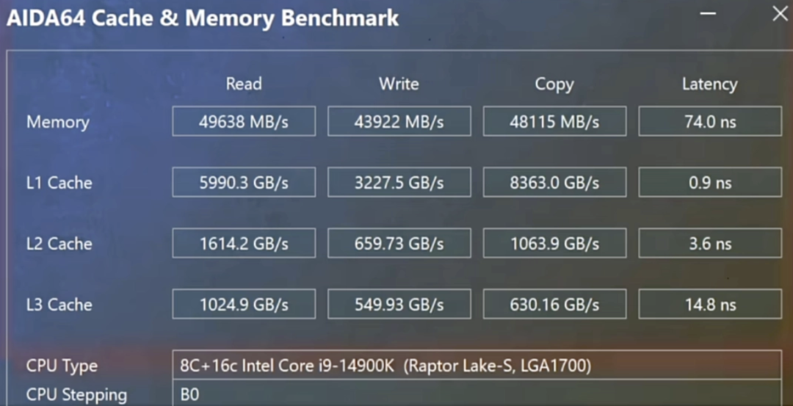

SRAM一般可分为五大部分：存储单元阵列(core cells array)，行/列地址译码器(decode），灵敏放大器(Sense Amplifier），控制电路(control circuit），缓冲/驱动电路(FFIO）。

两个或非门构成的RS触发器，再加两个与门构成1 bit SRAM。因为没有电容，读写数据都是一瞬间完成，速度非常快。

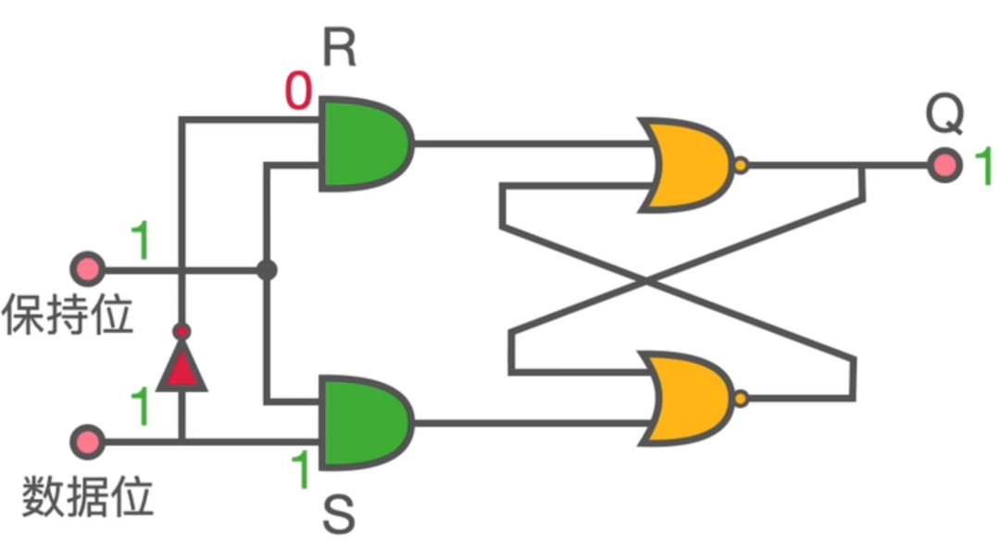

2. DRAM (Dynamic Random Access Memory)

动态随机存取存储器是最为常见的系统内存，DRAM 只能将数据保持很短的时间。为了保持数据，DRAM使用电容存储，所以必须隔一段时间刷新（refresh）一次，如果存储单元没有被刷新，存储的信息就会丢失。

同步动态随机存储器，同步是指 Memory工作需要同步时钟，内部的命令的发送与数据的传输都以它为基准；动态是指存储阵列需要不断的刷新来保证数据不丢失；随机是指数据不是线性依次存储，而是自由指定地址进行数据读写。

DRAM按照产品分类分为DDR/LPDDR/GDDR和传统型(SDR)DRAM。

DDR是Double Data Rate SDRAM的缩写，即双倍速率同步动态随机存储器，主要应用在个人计算机、服务器上。

GDDR指的是Graphics DDR，主要应用于图像处理领域，位宽更大，功耗更高。

LPDDR 内存全称是Low Power Double Data Rate SDRAM，中文意为低功耗双倍数据速率内存，是美国JEDEC固态协会面向低功耗内存制定的通信标准，主要针对于移动端电子产品。相比于DDR来说，LPDDR最大的特点就是功耗更低。

Write：G=1，D=1，充电写1；G=1，D=0，放电写0。

Read：G=1，通过放大器读取当前电压。

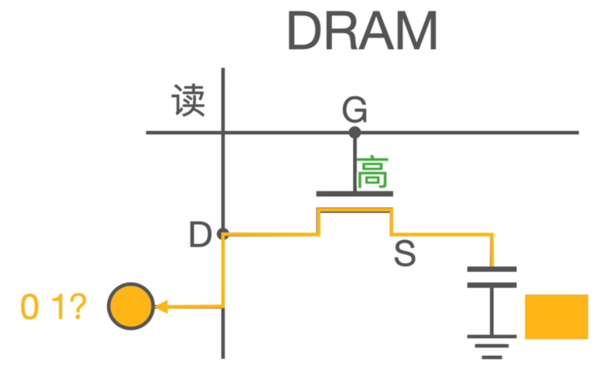

### 1.0.1 **应用场景**

- SRAM 主要应用于CPU 和GPU的寄存器，Cache，Buffer。
- DRAM 主要应用于DDR。

### 1.0.2 **速写延迟**

- SRAM 是由两个非门组成，读写延迟可以做到一个时钟。
- DRAM 一般通过DDR总线方式读取，读写延迟一般在60~200个时钟。

### 1.0.3 **价格**

- SRAM 12nm工艺，1GB 约 3W RMB左右。
- DDR4 当前价格1GB 16RMB。（标准化且量大）

3. PSRAM (Pseudo static random access memory)

PSRAM是一种伪静态SRAM存储器，它具有**类似SRAM的接口协议**：给出地址、读、写命令，就可以实现存取，不像DRAM需要memory controller来控制内存单元定期数据刷新，接口简单。

PSRAM的内核是**DRAM架构**：1T1C一个晶体管一个电容构成存储cell，而传统SRAM需要6T即六个晶体管构成一个存储cell。（现在 2T 即可）

**与DRAM相比的优势区别：**
PSRAM在容量大小上并不占据优势，更多使用DRAM的客户，会在读取速度上考虑用到PSRAM，因为PSRAM相对于DRAM的读取速度要快。

**与SRAM相比的优势区别：**

对比SRAM，PSRAM市面上的产品比SRAM的容量大一倍以上，PSRAM目前最大容量达到64Mbit，并有并口跟SPI接口两种模式，对需要更少I/O的设计应用更为广泛，其次，PSRAM在价格上要低于SRAM。

PSRAM采用的自行刷新（Self-Refresh）技术，不需要刷新电路即能保存它内部存储的数据；而DRAM每隔一段时间，要刷新充电一次，否则内部的数据会消失，因此PSRAM具有更低的功耗水平。

因此，相较于DRAM，PSRAM具有管脚精简、低功耗的优势；而与SRAM比较，PSRAM又具有价格上的优势。

**应用**：PSRAM 更适用于低功耗、高密度存储且不需要复杂控制的嵌入式系统，DRAM 更适合需要大容量高速数据存取的高性能应用。

4. Flash

NOR Flash更像内存，有独立的地址线和数据线，但价格比较贵，容量比较小；而NAND型更像硬盘，地址线和数据线是共用的I/O线，而且NAND的成本较NOR来说很低，而容量却大很多。

因此 NOR 闪存比较适合频繁随机读写的场合，通常用于存储程序代码并直接在闪存运行，容量通常不大；NAND型闪存主要用来存储资料，我们常用的闪存产品，如U盘、SD卡都是用NAND型闪存。

向数据单元内写入数据的过程就是向电荷势阱注入电荷的过程，写入数据有两种技术：热电子注入(hot electron injection)和 F-N 隧道效应(Fowler Nordheim tunneling)，前一种是通过源极给浮栅充电，后一种是通过硅基层给浮栅充电。

NOR FLASH 通过热电子注入方式给浮栅充电，而 NAND 则通过 F-N隧道效应给浮栅充电。

在写入新数据之前，必须先将原来的数据擦除，也就是将浮栅的电荷放掉，两种 FLASH 都是通过 F-N 隧道效应放电。

浮栅层有电荷为0，无电荷为1。

- G极加20V高压，衬底0V，电子进入浮栅层，完成写入，从1写为0；

- 衬底加20V高压，G极0V，电子吸出浮栅层，完成擦除，从0变成1。

遂穿层本质也是绝缘体，寿命的限制是因为遂穿层不断有电子出入，导致损坏。电压足够高就会形成隧道效应，电子就可以穿过遂穿层。

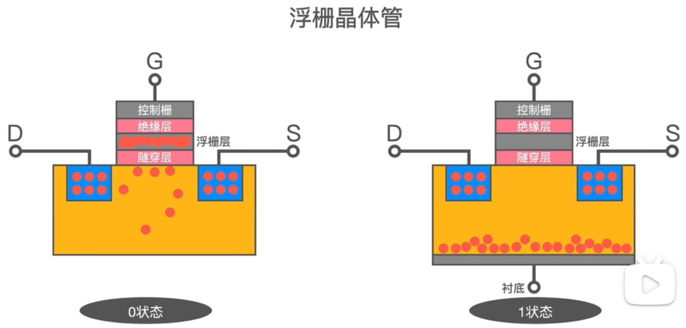

在G极加低压，如果浮栅层没有电荷则形成N沟道，检测到电流(读1)；如果有电荷，因为排斥作用，形成不了N沟道，检测不到电流(读0)。

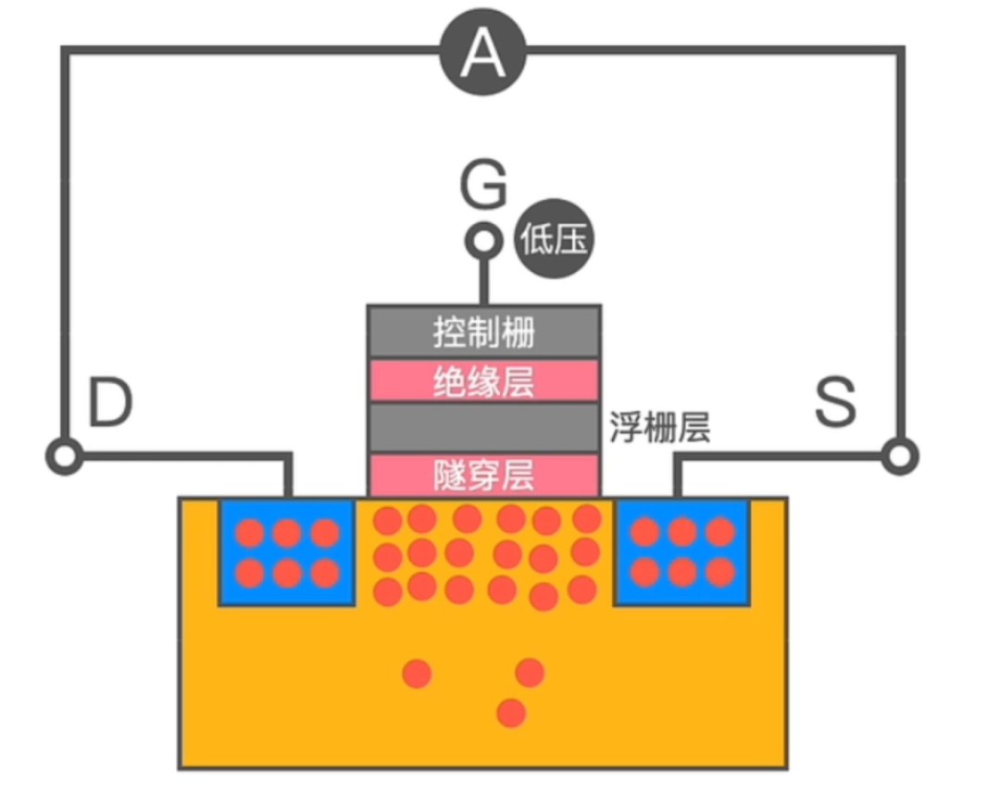

4.1 NOR 和 NAND 对比

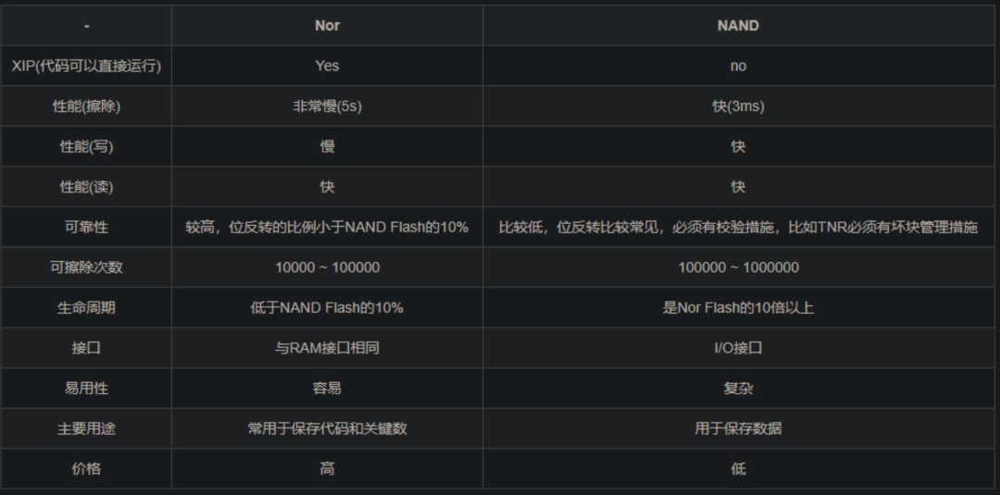

NorFlash（1 Page = 256Byte）

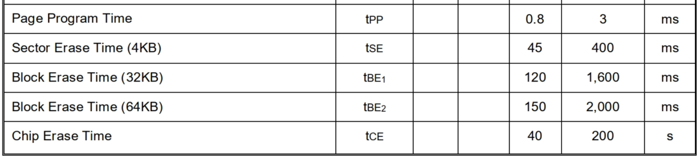

NandFlash

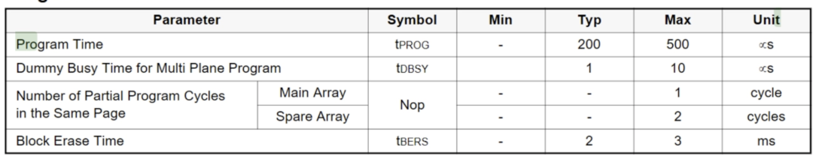

4.2 SLC/MLC/TLC

Nand Flash闪存颗粒中根据存储密度的差异可分为SLC、MLC、TLC和QLC四种：

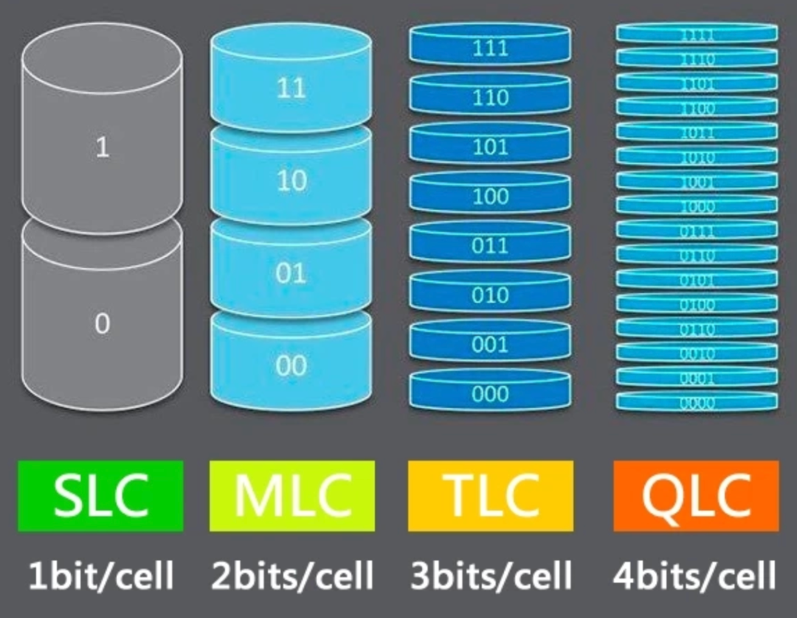

第一代SLC（Single-Level Cell）每单元可存储1比特数据(1bit/cell)，性能好、寿命长，可经受10万次编程/擦写循环，但容量低、成本高，如今已经非常罕见；

第二代MLC（Multi-Level Cell）每单元可存储2比特数据(2bits/cell)，性能、寿命、容量、成各方面比较均衡，可经受1万次编程/擦写循环，现在只有在少数高端SSD中可以见到；

第三代TLC（Trinary-Level Cell）每单元可存储3比特数据(3bits/cell)，性能、寿命变差，只能经受3千次编程/擦写循环，但是容量可以做得更大，成本也可以更低，是当前最普及的（主流手机应用）；

第四代QLC（Quad-Level Cell）每单元可存储4比特数据(4bits/cell)，性能、寿命进一步变差，只能经受1000次编程/擦写循环，但是容量更容易提升，成本也继续降低。

SLC可以简单认为是利用浮栅是否存储电荷来表征数字0'和1'的，MLC则是利用浮栅中电荷多少来表征00，01，10和11，TLC与MLC相同。

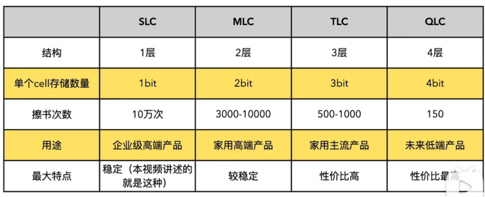

TLC是目前消费级SSD的主流，价格便宜，但可以通过高性能主控器、算法来弥补、提高TLC闪存的性能。

4.3 OTP/MTP

OTP: One-Time Programmable，只允许编程一次，一旦被编程，数据永久有效不能篡改；

MTP: Multiple-Time Programmable，可以多次编程。

OTP 是一种特殊类型的非易失性存储器  只允许编程一次，一旦被编程，数据永久有效。

相较于MTP (multi-time programmable ) 如EEPROM等，OTP 的面积更小而且不需要额外的制造步骤，因此广泛应用于low-cost 芯片中，OTP常用于存储可靠且可重复读取的数据，如：启动程序、加密密钥、模拟器件配置参数等。

4.4 eMMC 和 UFS

eMMC（Embedded Multi Media Card）是一种嵌入式多媒体存储卡标准，它最初是为了解决手机存储容量不足的问题而开发的。eMMC在设计和功能上与闪存相似，但更为简化。

eMMC存储技术采用了闪存和控制器的一体化设计，相比于传统的NAND闪存和单独的控制器，具有更加紧凑的设计和更低的成本。

性能：eMMC的读写速度相对较慢，与UFS相比，其性能较低。它的连续读写速度通常在100-200MB/s之间，随机读写速度则更低。

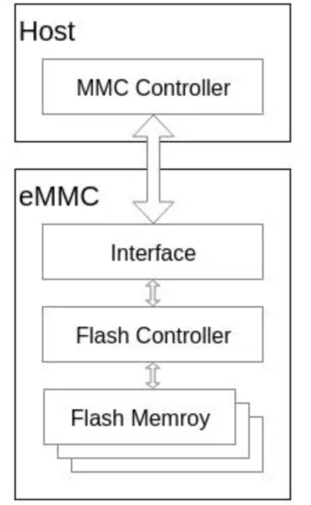

由于Nand Flash自身的物理特性，需要实现坏块管理、磨损均衡、ECC等诸多功能，这些功能就是由FTL（Flash Translation Layer）来实现。

eMMC内部集成的闪存控制器则实现了FTL等功能，减少了由于不同型号Nand Flash的各种特性差异造成的软件开发复杂度；同时闪存控制器也提供了Cache、Memory array、interleave等多种功能，大大提高了Nand Flash读写操作性能。

UFS（Universal Flash Storage）是一种通用闪存存储标准，它的设计目标是提供更高的性能和更低的能耗。

UFS在连续读写速度、随机读写速度以及能效上都优于eMMC。

性能：UFS的读写速度远高于eMMC。连续读写速度通常在700-1000MB/s之间，随机读写速度也更高。这使得UFS在处理大量数据时更为高效。

不管是eMMC还是UFS它们大多都是协议、或者通道上的区别，但是真正储存数据的核心关键还是NAND芯片，NAND芯片的品质才是决定存储是否稳定好用的关键。

5. 参考资料

https://www.bilibili.com/video/BV1cK421Y7Bg/?spm\_id\_from=333.999.0.0&vd\_source=1a89ca09926ad55a60f1f415bd0dd519

https://www.bilibili.com/video/BV1yu4y117by/?spm\_id\_from=333.788.recommend\_more\_video.-1&vd\_source=1a89ca09926ad55a60f1f415bd0dd519

---

如果文章对你有帮助的话麻烦点赞 + 收藏 + 关注，感谢！

本文首发于公众号【Equilibria】，欢迎关注获取最新文章和独家内容。

相关文章：[LPDDR内存学习笔记](https://mp.weixin.qq.com/s?__biz=Mzg2NTg0MDk4OA==&mid=2247484283&idx=1&sn=bcb19823c3e3f2628ae58104a3d102e0&scene=21#wechat_redirect)
