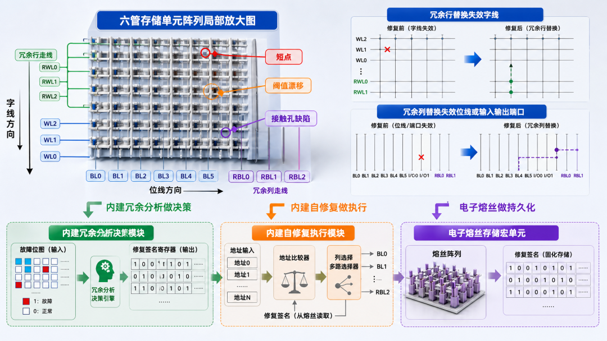
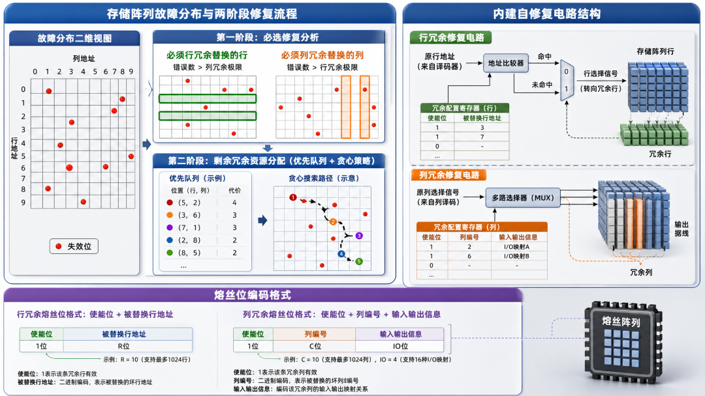
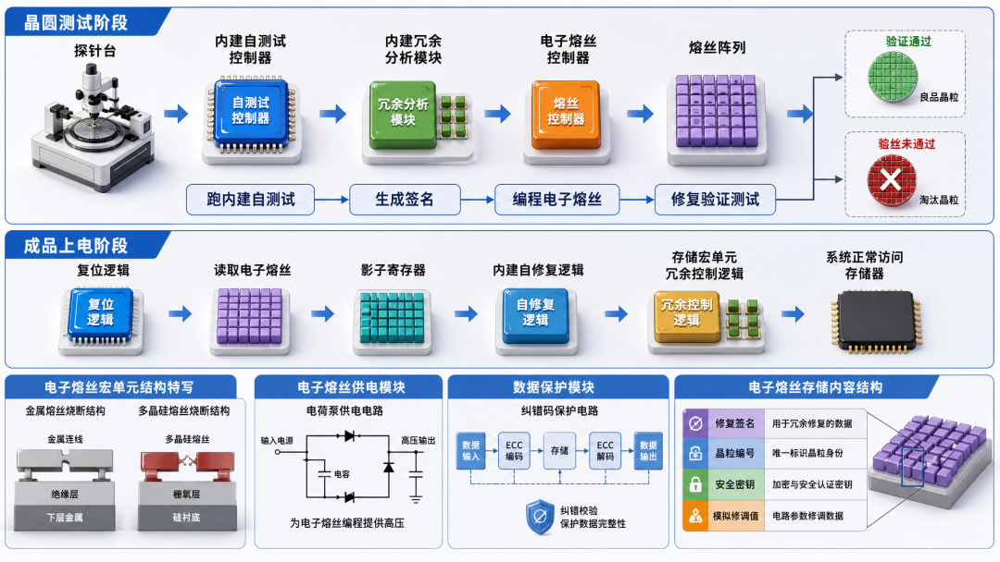

<!-- toc-start -->

# 目录

[1. Memory存储器学习笔记](#1-memory存储器学习笔记)  
　　　　[1.0.1 **应用场景**](#101-应用场景)  
　　　　[1.0.2 **速写延迟**](#102-速写延迟)  
　　　　[1.0.3 **价格**](#103-价格)  
[2. 存储器冗余修复：BIRA / BISR 与 eFuse 是怎么配合的](#2-存储器冗余修复bira-bisr-与-efuse-是怎么配合的)  
　　[2.1 为什么存储良率必须“就地修”](#21-为什么存储良率必须就地修)  
　　[2.2 BIRA的修复签名，BISR怎么落地](#22-bira的修复签名bisr怎么落地)  
　　[2.3 eFuse不是简单ROM，而是修复结果的落袋为安](#23-efuse不是简单rom而是修复结果的落袋为安)  
　　[2.4 从测试台到上电启动的整条链路](#24-从测试台到上电启动的整条链路)  
　　[2.5 工程权衡：冗余、熔丝与测试成本](#25-工程权衡冗余熔丝与测试成本)  

<!-- toc-end -->

---

# 1. Memory存储器学习笔记

> 来源：https://mp.weixin.qq.com/s/VvkenHZ6NyiIS73OyZX3WA
> 作者：Equilibria
> update 2026/08/22 11 : 38
> **已截图**

前言

最近都没什么动力写文章了，主要是因为现在的 AI 回答得又快又好，所以有种写了也是白写的感觉，我所付出的都只是给 AI 投喂训练数据。既然 AI 要干掉我，我后面就出个 AI 芯片系列文章。

随着长鑫存储成为 A 股第一市值，SK 海力士在美股上市，存储芯片的热度一直居高不下。借此机会，顺手把自己尘封已久的学习笔记翻出来整理一下发个科普贴。

1. SRAM (Static Random-Access Memory)

SRAM 静态随机存储器不需要刷新电路即能保存它内部存储的数据，而DRAM每隔一段时间，要刷新充电一次，否则内部的数据即会消失。

SRAM具有很高的性能，但是也有它的缺点，即它的集成度较低，同样面积的硅片可以做出更大容量的DRAM，因此SRAM显得更贵。

SRAM主要用于高速缓存（Cache)，它是利用晶体管来存储数据，与 DRAM 通过电容存储数据方式不同。

SRAM一般可分为五大部分：存储单元阵列(core cells array)，行/列地址译码器(decode），灵敏放大器(Sense Amplifier），控制电路(control circuit），缓冲/驱动电路(FFIO）。

两个或非门构成的RS触发器，再加两个与门构成1 bit SRAM。因为没有电容，读写数据都是一瞬间完成，速度非常快。

2. DRAM (Dynamic Random Access Memory)

动态随机存取存储器是最为常见的系统内存，DRAM 只能将数据保持很短的时间。为了保持数据，DRAM使用电容存储，所以必须隔一段时间刷新（refresh）一次，如果存储单元没有被刷新，存储的信息就会丢失。

同步动态随机存储器，同步是指 Memory工作需要同步时钟，内部的命令的发送与数据的传输都以它为基准；动态是指存储阵列需要不断的刷新来保证数据不丢失；随机是指数据不是线性依次存储，而是自由指定地址进行数据读写。

DRAM按照产品分类分为DDR/LPDDR/GDDR和传统型(SDR)DRAM。

DDR是Double Data Rate SDRAM的缩写，即双倍速率同步动态随机存储器，主要应用在个人计算机、服务器上。

GDDR指的是Graphics DDR，主要应用于图像处理领域，位宽更大，功耗更高。

LPDDR 内存全称是Low Power Double Data Rate SDRAM，中文意为低功耗双倍数据速率内存，是美国JEDEC固态协会面向低功耗内存制定的通信标准，主要针对于移动端电子产品。相比于DDR来说，LPDDR最大的特点就是功耗更低。

Write：G=1，D=1，充电写1；G=1，D=0，放电写0。

Read：G=1，通过放大器读取当前电压。

### 1.0.1 **应用场景**

- SRAM 主要应用于CPU 和GPU的寄存器，Cache，Buffer。
- DRAM 主要应用于DDR。

### 1.0.2 **速写延迟**

- SRAM 是由两个非门组成，读写延迟可以做到一个时钟。
- DRAM 一般通过DDR总线方式读取，读写延迟一般在60~200个时钟。

### 1.0.3 **价格**

- SRAM 12nm工艺，1GB 约 3W RMB左右。
- DDR4 当前价格1GB 16RMB。（标准化且量大）

3. PSRAM (Pseudo static random access memory)

PSRAM是一种伪静态SRAM存储器，它具有**类似SRAM的接口协议**：给出地址、读、写命令，就可以实现存取，不像DRAM需要memory controller来控制内存单元定期数据刷新，接口简单。

PSRAM的内核是**DRAM架构**：1T1C一个晶体管一个电容构成存储cell，而传统SRAM需要6T即六个晶体管构成一个存储cell。（现在 2T 即可）

**与DRAM相比的优势区别：**
PSRAM在容量大小上并不占据优势，更多使用DRAM的客户，会在读取速度上考虑用到PSRAM，因为PSRAM相对于DRAM的读取速度要快。

**与SRAM相比的优势区别：**

对比SRAM，PSRAM市面上的产品比SRAM的容量大一倍以上，PSRAM目前最大容量达到64Mbit，并有并口跟SPI接口两种模式，对需要更少I/O的设计应用更为广泛，其次，PSRAM在价格上要低于SRAM。

PSRAM采用的自行刷新（Self-Refresh）技术，不需要刷新电路即能保存它内部存储的数据；而DRAM每隔一段时间，要刷新充电一次，否则内部的数据会消失，因此PSRAM具有更低的功耗水平。

因此，相较于DRAM，PSRAM具有管脚精简、低功耗的优势；而与SRAM比较，PSRAM又具有价格上的优势。

**应用**：PSRAM 更适用于低功耗、高密度存储且不需要复杂控制的嵌入式系统，DRAM 更适合需要大容量高速数据存取的高性能应用。

4. Flash

NOR Flash更像内存，有独立的地址线和数据线，但价格比较贵，容量比较小；而NAND型更像硬盘，地址线和数据线是共用的I/O线，而且NAND的成本较NOR来说很低，而容量却大很多。

因此 NOR 闪存比较适合频繁随机读写的场合，通常用于存储程序代码并直接在闪存运行，容量通常不大；NAND型闪存主要用来存储资料，我们常用的闪存产品，如U盘、SD卡都是用NAND型闪存。

向数据单元内写入数据的过程就是向电荷势阱注入电荷的过程，写入数据有两种技术：热电子注入(hot electron injection)和 F-N 隧道效应(Fowler Nordheim tunneling)，前一种是通过源极给浮栅充电，后一种是通过硅基层给浮栅充电。

NOR FLASH 通过热电子注入方式给浮栅充电，而 NAND 则通过 F-N隧道效应给浮栅充电。

在写入新数据之前，必须先将原来的数据擦除，也就是将浮栅的电荷放掉，两种 FLASH 都是通过 F-N 隧道效应放电。

浮栅层有电荷为0，无电荷为1。

- G极加20V高压，衬底0V，电子进入浮栅层，完成写入，从1写为0；

- 衬底加20V高压，G极0V，电子吸出浮栅层，完成擦除，从0变成1。

遂穿层本质也是绝缘体，寿命的限制是因为遂穿层不断有电子出入，导致损坏。电压足够高就会形成隧道效应，电子就可以穿过遂穿层。

在G极加低压，如果浮栅层没有电荷则形成N沟道，检测到电流(读1)；如果有电荷，因为排斥作用，形成不了N沟道，检测不到电流(读0)。

4.1 NOR 和 NAND 对比

NorFlash（1 Page = 256Byte）

NandFlash

4.2 SLC/MLC/TLC

Nand Flash闪存颗粒中根据存储密度的差异可分为SLC、MLC、TLC和QLC四种：

第一代SLC（Single-Level Cell）每单元可存储1比特数据(1bit/cell)，性能好、寿命长，可经受10万次编程/擦写循环，但容量低、成本高，如今已经非常罕见；

第二代MLC（Multi-Level Cell）每单元可存储2比特数据(2bits/cell)，性能、寿命、容量、成各方面比较均衡，可经受1万次编程/擦写循环，现在只有在少数高端SSD中可以见到；

第三代TLC（Trinary-Level Cell）每单元可存储3比特数据(3bits/cell)，性能、寿命变差，只能经受3千次编程/擦写循环，但是容量可以做得更大，成本也可以更低，是当前最普及的（主流手机应用）；

第四代QLC（Quad-Level Cell）每单元可存储4比特数据(4bits/cell)，性能、寿命进一步变差，只能经受1000次编程/擦写循环，但是容量更容易提升，成本也继续降低。

SLC可以简单认为是利用浮栅是否存储电荷来表征数字0'和1'的，MLC则是利用浮栅中电荷多少来表征00，01，10和11，TLC与MLC相同。

TLC是目前消费级SSD的主流，价格便宜，但可以通过高性能主控器、算法来弥补、提高TLC闪存的性能。

4.3 OTP/MTP

OTP: One-Time Programmable，只允许编程一次，一旦被编程，数据永久有效不能篡改；

MTP: Multiple-Time Programmable，可以多次编程。

OTP 是一种特殊类型的非易失性存储器  只允许编程一次，一旦被编程，数据永久有效。

相较于MTP (multi-time programmable ) 如EEPROM等，OTP 的面积更小而且不需要额外的制造步骤，因此广泛应用于low-cost 芯片中，OTP常用于存储可靠且可重复读取的数据，如：启动程序、加密密钥、模拟器件配置参数等。

4.4 eMMC 和 UFS

eMMC（Embedded Multi Media Card）是一种嵌入式多媒体存储卡标准，它最初是为了解决手机存储容量不足的问题而开发的。eMMC在设计和功能上与闪存相似，但更为简化。

eMMC存储技术采用了闪存和控制器的一体化设计，相比于传统的NAND闪存和单独的控制器，具有更加紧凑的设计和更低的成本。

性能：eMMC的读写速度相对较慢，与UFS相比，其性能较低。它的连续读写速度通常在100-200MB/s之间，随机读写速度则更低。

由于Nand Flash自身的物理特性，需要实现坏块管理、磨损均衡、ECC等诸多功能，这些功能就是由FTL（Flash Translation Layer）来实现。

eMMC内部集成的闪存控制器则实现了FTL等功能，减少了由于不同型号Nand Flash的各种特性差异造成的软件开发复杂度；同时闪存控制器也提供了Cache、Memory array、interleave等多种功能，大大提高了Nand Flash读写操作性能。

UFS（Universal Flash Storage）是一种通用闪存存储标准，它的设计目标是提供更高的性能和更低的能耗。

UFS在连续读写速度、随机读写速度以及能效上都优于eMMC。

性能：UFS的读写速度远高于eMMC。连续读写速度通常在700-1000MB/s之间，随机读写速度也更高。这使得UFS在处理大量数据时更为高效。

不管是eMMC还是UFS它们大多都是协议、或者通道上的区别，但是真正储存数据的核心关键还是NAND芯片，NAND芯片的品质才是决定存储是否稳定好用的关键。

5. 参考资料

https://www.bilibili.com/video/BV1cK421Y7Bg/?spm\_id\_from=333.999.0.0&vd\_source=1a89ca09926ad55a60f1f415bd0dd519

https://www.bilibili.com/video/BV1yu4y117by/?spm\_id\_from=333.788.recommend\_more\_video.-1&vd\_source=1a89ca09926ad55a60f1f415bd0dd519

---

如果文章对你有帮助的话麻烦点赞 + 收藏 + 关注，感谢！

本文首发于公众号【Equilibria】，欢迎关注获取最新文章和独家内容。

相关文章：[LPDDR内存学习笔记](https://mp.weixin.qq.com/s?__biz=Mzg2NTg0MDk4OA==&mid=2247484283&idx=1&sn=bcb19823c3e3f2628ae58104a3d102e0&scene=21#wechat_redirect)

---

# 2. 存储器冗余修复：BIRA / BISR 与 eFuse 是怎么配合的

> 来源：https://mp.weixin.qq.com/s/PBz2T-bUHJG21fEH2gfwCA
> 作者：最初的梦想
> update 2026/09/15 21 : 43

## 2.1 为什么存储良率必须“就地修”

FinFET 时代，存储阵列是芯片里密度最高、缺陷最集中的区域。一个 6T SRAM 单元里的短点、阈值漂移或接触孔缺陷，都能让整行或整列数据失效。如果把这些 die 直接扔掉，先进工艺下的良率会难看得很。工程上的常规做法是在每个 memory macro 里预埋**冗余行（spare row）**和**冗余列（spare column）**，用“修好再出货”换取良率。

冗余资源的用法并不复杂：冗余行通过替换失效字线来修复整行错误，冗余列则替换失效位线或 I/O。真正的技术难点在于，`MBIST` 跑出来的失败信息只是一堆地址和位图，必须有人决定“哪个坏行/列由哪条冗余资源替换”。这个角色就是 `BIRA`（Built-In Redundancy Analysis）。它通常集成在 BIST 控制器内部或作为独立模块挂接在测试接口上，把故障位图转成一份结构化的**修复签名（repair signature）**。

值得区分的是，`BISR`（Built-In Self Repair）并不负责“算”，只负责“干”。它拿到 BIRA 的签名后，把对应的冗余行/列使能、地址比较器、多路选择器配置好，让 memory 在物理层面真正切换到冗余资源。至于 `eFuse`，则是把这份修复签名在掉电后固定下来的非易失介质。三者分工非常清晰：BIRA 做决策，BISR 做执行，eFuse 做持久化。

## 2.2 BIRA的修复签名，BISR怎么落地

BIRA 的核心任务是一个组合优化问题：给定若干 spare row 和 spare column，把故障点全部覆盖。实际算法会根据冗余结构分为不同层级。对于简单的一维修复（只有 spare row 或只有 spare column），问题退化为地址去重，实现相对直接。真正复杂的是**二维冗余**：同一个故障点既可以由行 spare 修，也可以由列 spare 修，还可能出现“必须用行 spare”或“必须用列 spare”的强制情形。

工程上常用两阶段策略。第一阶段做 **must-repair 分析**：如果某一行上的错误数量已经超过列 spare 能覆盖的极限，那么这一行必须被一个行 spare 替换；列方向同理。第二阶段再用搜索或启发式方法分配剩余的 spare。当 spare 数量很少时，可以用穷举；当数量稍大，BIRA 会退化为基于优先队列或贪心策略的算法，因为完整的二维冗余分配是 NP-hard，在片内硬件实现里不可能无限制地穷举。BIRA 的输出通常被编码成一组 fuse 位：对每个行 spare，记录“使能位 + 被替换行的地址”；对每个列 spare，记录“使能位 + 被替换列的编号”，有时还要加上 I/O 信息。

BISR 拿到这份签名后，在**修复模式**下把这些值写入冗余配置寄存器。这些寄存器控制着地址比较器和列选择 mux：当访问到一个坏地址时，比较器命中，输出被重定向到对应的 spare row；对于列修复，则是把坏列的数据位替换成 spare column 的输出。在制造测试阶段，BISR 往往在 BIST/BIRA 结束后立即触发；在最终产品上，这些配置则由 eFuse 在每次 POR（Power-On Reset）后自动加载。

## 2.3 eFuse不是简单ROM，而是修复结果的落袋为安

eFuse 的本质是一次性可编程非易失存储。它通过大电流烧断金属或多晶硅熔丝来改变电阻状态，从而记录 0/1。与 Flash 相比，eFuse 不需要额外的工艺层，可以直接用逻辑工艺实现，面积小，读取速度快，因此非常适合在先进 SoC 里存放小数据量的“芯片级常量”——修复签名正是最典型的应用之一。

在 memory 修复链路里，eFuse 扮演的角色是把 BIRA/BISR 的结果**永久化**。晶圆测试阶段，ATE 跑完 BIST，BIRA 算出签名，如果该 die 可修复，测试程序会把签名编程进 eFuse macro。编程完成后通常还会再跑一次完整 BIST，确认修复有效。封装完成后的上电阶段，POR 逻辑会先把 eFuse 内容读入一组**影子寄存器（shadow register）**，BISR 再把影子寄存器中的配置写入 memory 的冗余控制逻辑。此后系统才能正常使用 memory。

eFuse 本身也有不少工程细节。它的编程电流很大，通常需要专用电源或 charge pump，编程时间按位算在百微秒到毫秒量级；读取则快得多，纳秒到几十纳秒级。eFuse 数据保留目标一般是十年以上，但高温、重复读取或编程电压不稳都会影响可靠性。因此很多设计会给 eFuse 区域加 ECC，甚至预留一部分 eFuse 做自冗余。另外，eFuse 里不仅存 repair signature，还常有 die ID、安全密钥、模拟模块修调值等，修复数据只是其中一块 payload。

## 2.4 从测试台到上电启动的整条链路

把这三块拼起来，完整的流程是这样的：晶圆探针台上，MBIST 控制器启动内建自测试；出现 fail 后，BIRA 模块收集故障位图并计算修复方案；如果找到可行解，测试程序调用 eFuse 控制器把签名写入熔丝；随后进行修复验证测试。通不过的 die 被标记为不可修复，直接淘汰。

封装后，芯片每次上电时，eFuse 控制器先把熔丝数据读到安全寄存器或 shadow SRAM，BISR 再用这些数据配置 memory 冗余。这一步必须在系统真正访问 memory 之前完成，否则 CPU 读到的是带缺陷的数据。因此 eFuse 读取常常放在 POR 序列的最前端，和 PLL 锁定、电源稳压、安全 boot 等步骤并行或串行调度。修复签名一旦加载完成，BISR 通常会把配置锁死，防止运行期间被误改。

有些设计还会把 eFuse 数据做冗余或加密。原因很简单：这份签名本质上就是该 die 的缺陷地图，如果被恶意读取，可能泄露工艺敏感信息；同时，如果加载过程出错，会导致修复失败甚至系统崩溃。因此 eFuse 读取路径的完整性校验和权限控制，往往是 SoC 安全架构的一部分。

## 2.5 工程权衡：冗余、熔丝与测试成本

BIRA/BISR + eFuse 的组合并非没有代价。冗余行/列会占用 5% 到 20% 的 memory 面积；BIRA 算法越复杂，硬件面积和测试时间就越长；eFuse 的位数也有限，如果冗余资源太多、签名太长，eFuse macro 本身就会吃掉不少面积。设计时需要在“良率提升”与“面积/成本”之间反复迭代。

另一个常见坑是**修复签名的格式兼容**。如果流片后测试程序、BIRA 算法或 eFuse map 布局发生变化，三者之间必须严格对齐，否则会出现“eFuse 里写了错误的 spare 地址”这种难以定位的 bug。此外，eFuse 编程阶段的 IR drop、高温退火后的 retention、以及读取时的电源噪声，都是可靠性评估必须覆盖的项目。

本文图片由AI辅助生成
