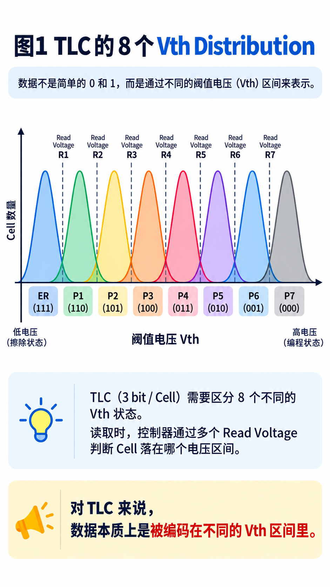
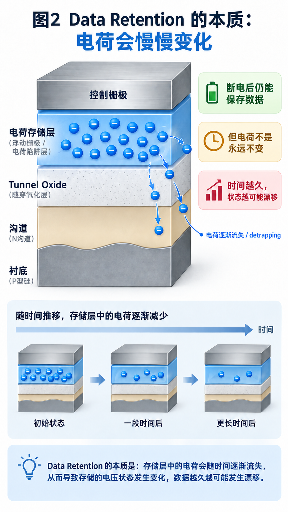
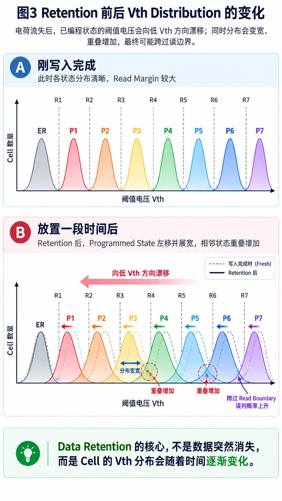
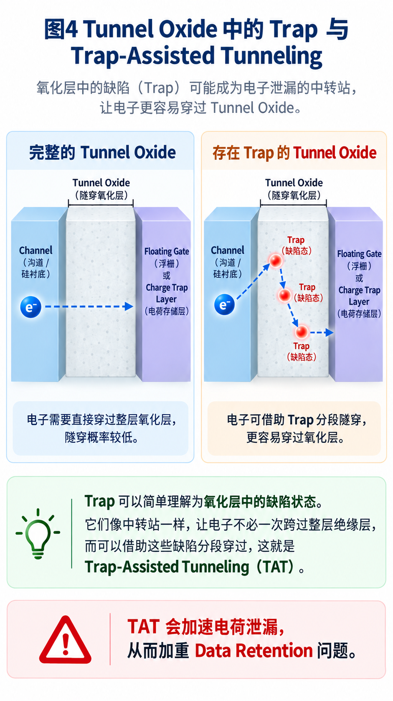

<!-- toc-start -->

# 目录

[1. SSD科普三十一：为什么Flash叫Flash？](#1-ssd科普三十一为什么flash叫flash)  
　　[1.1 为什么人类需要一种新的存储器？](#11-为什么人类需要一种新的存储器)  
　　[1.2 浮栅晶体管：让晶体管拥有“记忆”](#12-浮栅晶体管让晶体管拥有记忆)  
　　[1.3 浮栅晶体管里面存的是什么？](#13-浮栅晶体管里面存的是什么)  
　　[1.4 电子如何进入浮栅？](#14-电子如何进入浮栅)  
　　[1.5 为什么叫Flash？从EPROM到Flash的演进](#15-为什么叫flash从eprom到flash的演进)  
　　[1.6 为什么后来出现NAND Flash？](#16-为什么后来出现nand-flash)  
　　[1.7 从Flash到SSD](#17-从flash到ssd)  
[2. SSD科普三十八：NAND断电以后，数据到底能保存多久？](#2-ssd科普三十八nand断电以后数据到底能保存多久)  
　　[2.1 NAND保存的并不是“0”和“1”](#21-nand保存的并不是0和1)  
　　[2.2 时间久了，Cell里的电荷并不会永远待在原地](#22-时间久了cell里的电荷并不会永远待在原地)  
　　[2.3 电荷变化以后，首先改变的是Vth](#23-电荷变化以后首先改变的是vth)  
　　[2.4 真正危险的不是Vth变化，而是跨过Read Boundary](#24-真正危险的不是vth变化而是跨过read-boundary)  
　　[2.5 为什么有些Cell特别容易出问题？](#25-为什么有些cell特别容易出问题)  
　　[2.6 Trap到底是什么？](#26-trap到底是什么)  
　　[2.7 Trap还可能变成电子泄漏的“中转站”](#27-trap还可能变成电子泄漏的中转站)  
　　[2.8 为什么NAND越老，Retention通常越差？](#28-为什么nand越老retention通常越差)  
　　[2.9 温度为什么也很重要？](#29-温度为什么也很重要)  
　　[2.10 现代3D NAND还多了一个问题](#210-现代3d-nand还多了一个问题)  
　　[2.11 SSD为什么平时看起来没有这么脆弱？](#211-ssd为什么平时看起来没有这么脆弱)  
　　[2.12 时间才是Data Retention真正的对手](#212-时间才是data-retention真正的对手)  

<!-- toc-end -->

---

# 1. SSD科普三十一：为什么Flash叫Flash？

> 来源：https://mp.weixin.qq.com/s/YgKBcrICOXk2k7qkpCqUcg
> 作者：磊扑满
> update 2026/08/16 01 : 16
我们每天都在使用 Flash。

手机里的存储芯片，是 Flash。

U盘，是 Flash。

SSD 中使用的 NAND，也是 Flash。

但是不知道大家有没有想过一个问题：

> **为什么这种存储技术叫 Flash？**

Flash 这个英文单词，我们并不陌生。

它代表闪光、闪现，描述某个瞬间发生的事情。

英语里面还有一个俚语：

> flash in a pan

意思是“昙花一现”，形容某个东西突然出现，但是很快消失。

那么问题来了：

Flash Memory 是不是因为它速度特别快，像闪电一样，所以才叫 Flash？

其实以前我也一直这么认为。

直到最近整理资料时，我翻到了一本90年代关于 Flash Memory 的书。

几十年前的工程师，在那个年代就已经开始探索一个问题：

> 有没有一种存储器，可以像 ROM 一样长期保存数据，又可以像 RAM 一样重新写入？

而 Flash 的诞生，并不是一个突然出现的技术，而是半导体存储技术经过几十年演进后的结果。

想理解 Flash 为什么出现，我们需要先回到最初的问题：

计算机到底需要什么样的存储器？

---

## 1.1 为什么人类需要一种新的存储器？

计算机发展初期，存储器一直面临两个矛盾。

一方面，计算机希望存储器速度足够快，可以让 CPU 随时读取和修改数据。

另一方面，又希望数据能够长期保存，即使断电以后也不会消失。

但是早期存储器很难同时满足这两个要求。

RAM（Random Access Memory）解决了速度问题。

RAM 可以被 CPU 快速访问，非常适合作为计算机运行时的数据空间。

但是 RAM 有一个明显缺点：

> 一旦断电，里面的数据也会消失。

因此，RAM 更像计算机运行过程中的“短期记忆”。

而 ROM（Read Only Memory）解决了数据保存的问题。

ROM 中的数据即使断电，也不会丢失。

但是 ROM 最大的问题是：

> 数据写入以后，很难再次修改。

如果程序需要更新，通常意味着重新制作芯片。

于是工程师开始寻找一种新的存储方式：

既能够像 ROM 一样保存数据，又能够重新写入。

这就是非易失存储器（Non-Volatile Memory）发展的起点。

---

## 1.2 浮栅晶体管：让晶体管拥有“记忆”

要实现一种可以长期保存数据，同时又能够修改的存储器，首先需要解决一个问题：

如何让一个电子器件记住自己的状态？

答案来自 MOS 晶体管结构的改进。

普通 MOS 晶体管通过 Gate（栅极）的电压，控制 Source 和 Drain 之间是否形成导电沟道。

当 Gate 施加合适的电压时，沟道形成，电流可以通过。

当 Gate 电压消失时，沟道关闭，电流停止。

但是普通 MOS 晶体管存在一个问题：

它只能表示当前状态。

断电以后，Gate 上的电压消失，之前的信息也随之消失。

工程师开始思考：

如果能够把某种状态保存下来，是不是就可以让晶体管拥有记忆能力？

于是，浮栅晶体管（Floating Gate Transistor）出现了。

浮栅晶体管在普通 MOS 晶体管基础上增加了一层 Floating Gate。

这层浮栅位于控制栅和沟道之间，并且被绝缘层包围。

它就像一个被封闭的小仓库。

电子进入以后，不容易离开。

因此，即使断电，浮栅中的电荷仍然可以保持。

这就是非易失存储器能够实现长期保存数据的物理基础。

---

## 1.3 浮栅晶体管里面存的是什么？

浮栅晶体管能够保存信息，那么它到底保存的是什么？

答案是：

> 浮栅里面保存的是电荷状态。

很多人第一次接触存储器时，会认为存储单元里面直接保存的是数字 0 和 1。

但实际上，物理世界中并不存在一个真正的“0”或者“1”。

存储器保存的是某种物理状态，而控制器再把这种状态解释成数字信息。

对于浮栅晶体管来说，这种物理状态就是：

浮栅中的电荷。

电子带负电。

当电子进入浮栅以后，会改变晶体管周围的电场环境，从而影响控制栅对于沟道的控制能力。

简单来说：

浮栅中的电子越多，控制栅越难控制沟道，晶体管越难导通。

因此，需要更高的电压才能让晶体管开启。

这个电压就是：

阈值电压（Threshold Voltage，Vth）。

所以：

> 浮栅电荷增加 → 阈值电压升高
> 浮栅电荷减少 → 阈值电压降低

读取存储单元时，控制器并不是直接看到浮栅里面有多少电子。

它实际上是施加读取电压，检测晶体管是否导通，再根据导通状态判断浮栅中的电荷状态。

这就是后来非易失存储器保存信息的基本原理。

---

## 1.4 电子如何进入浮栅？

浮栅已经解决了“如何保存状态”的问题。

但是新的问题又出现了：

浮栅被绝缘层包围，电子正常情况下无法进入。

那么，如何把电子放进去？

又如何把电子取出来？

答案是利用半导体中的特殊物理现象。

在一定条件下，通过施加高电压，可以让电子获得足够能量，或者利用隧穿效应，让电子穿过非常薄的绝缘层。

当电子进入浮栅时：

浮栅电荷状态发生改变。

晶体管阈值电压发生改变。

存储状态也随之改变。

这个过程就是写入。

而当电子离开浮栅时：

阈值电压恢复。

存储状态也随之改变。

这个过程就是擦除。

浮栅晶体管解决了“如何保存信息”的问题，但要真正成为一种实用的存储产品，还需要经历下一阶段的发展。

---

## 1.5 为什么叫Flash？从EPROM到Flash的演进

浮栅技术出现以后，工程师首先想到的是：

能不能利用这种结构制造一种可以保存数据，又可以重新写入的存储器？

于是，EPROM 出现了。

EPROM（Erasable Programmable Read Only Memory）最大的突破是：

> 数据第一次可以被写入，也可以被擦除。

EPROM 利用浮栅中的电荷状态保存信息。

但是它有一个明显的问题：

擦除数据需要紫外线。

芯片需要放在紫外灯下面照射，让浮栅中的电子释放出来。

这种方式虽然可行，但是操作复杂，不适合大规模应用。

后来 EEPROM（Electrically Erasable Programmable Read Only Memory）出现。

EEPROM 解决了 EPROM 最大的问题：

> 不再需要紫外线，可以通过电信号完成擦除。

这让存储器具备了在线修改能力。

但是 EEPROM 也存在新的问题。

为了支持更加灵活的小粒度擦除，需要给每个存储单元增加更多控制电路。

结果就是：

> 芯片面积增加。
> 制造成本提高。
> 存储密度降低。

于是工程师开始思考：

> 能不能保留 EEPROM 的电擦除能力，同时降低成本，提高存储密度？

答案就是 Flash。

Flash 做出的最大改变，就是改变了擦除方式。

EEPROM 可以针对较小粒度进行擦除。

而 Flash 选择了一种折中的方案：

> 不再追求单个存储单元独立擦除，而是一次擦除一个更大的区域。

例如：

一个 Block。这种设计减少了外围控制电路，提高了存储密度，也降低了成本。

相比 EEPROM，Flash 更适合制造大容量存储器。

而 Flash 这个名字，通常认为也与这种快速、大规模擦除方式有关。

它并不是简单表示“读取速度快”。

它体现的是一种存储技术上的突破：

> 通过一次性擦除大片区域，让存储器从复杂的修改方式走向高密度、低成本的大规模应用。

---

## 1.6 为什么后来出现NAND Flash？

Flash 解决了：

> 数据可以保存。
> 也可以重新写入。

但是存储行业还有另一个永恒的问题：

> 成本!

如果每一个存储单元都采用独立连接方式，需要大量控制电路，芯片面积也会增加。

于是 Flash 继续发展，其中一个重要方向就是 NAND Flash。

NAND Flash 采用多个存储单元串联的结构，通过减少外围电路，提高单位面积上的存储容量。

相比 NOR Flash：

NAND Flash 牺牲了一部分随机访问能力，但是换来了更高密度和更低成本。

因此今天：

手机。

U盘。

存储卡。

SSD。

主要使用的都是 NAND Flash。

---

## 1.7 从Flash到SSD

今天的一块 SSD 中，包含：

- NAND Flash；
- SSD Controller；
- Firmware；
- ECC；
- FTL。

但是最底层的故事，其实从一个非常简单的问题开始：

> **如何让数据在断电以后依然保存？**

几十年的存储技术发展，并不是某一项技术突然出现，而是在一次次取舍和优化中不断演进。

> **存储技术的发展路线：**
>
> ROM
> ↓
> 浮栅晶体管
> ↓
> EPROM
> ↓
> EEPROM
> ↓
> Flash Memory
> ↓
> NAND Flash
> ↓
> SSD

ROM 解决了数据长期保存的问题；

浮栅晶体管让存储单元拥有了保存状态的能力；

EPROM 实现了可擦写存储；

EEPROM 解决了电擦除的问题；

Flash 通过块级擦除方式，在存储密度、成本和可擦写能力之间取得了新的平衡；

最终，NAND Flash 成为了现代 SSD 的核心存储介质。

---

所以，Flash 这个名字，并不是简单因为它“速度快”。

它背后记录的是存储技术发展过程中的一次重要变化：

> **通过改变擦除方式，让存储器从复杂的修改方式，走向高密度、低成本的大规模存储。**

下一次看到 NAND Flash 时，不要只把它看成一颗存储芯片。

它背后，是几十年半导体技术不断演进的结果。

---

谢谢你读我的文章

---

# 2. SSD科普三十八：NAND断电以后，数据到底能保存多久？

> 来源：https://mp.weixin.qq.com/s/XhEQEMM7WbGCY-90-hEJfQ
> 作者：磊扑满
> update 2026/09/15 21 : 52

《三体》中有一段我一直印象很深。

当人类开始认真思考一个问题——**如果有一天人类文明消失了，我们留下的信息还能保存多久？**

为了让后来的文明仍然有机会知道人类曾经存在过，他们开始研究各种信息保存方式。

小说里提到，未来的高密度存储器，大约只能保存几百到几千年；一些更古老的电子存储介质可以达到几千年；特殊材料制造的光盘，大约可以保存 **10 万年**；高质量的印刷品，甚至可以达到 **20 万年**。

但如果把时间继续拉长到 **1 亿年**，这些方法还是不够。

研究人员最后发现，真正已经经受住漫长时间考验的，反而是一些最原始的“记录”：岩洞壁画保存了数万年，石器上的刻痕可以追溯到几百万年前，甚至恐龙脚印都跨越了上亿年。

于是最后得到的方法简单得近乎原始：

> **把字刻在石头上。**

这些数字当然是小说中的设定，但它提出了一个很有意思的问题：

**信息，到底能保存多久？**

对于 SSD 来说，这个问题同样存在。

我们经常说 NAND Flash 是一种 **Non-Volatile Memory（非易失存储）**。电脑关机以后，DRAM 里的数据会消失，而 NAND 里的数据仍然能够保存下来。

于是很容易产生一种直觉：

**既然 NAND 断电以后还能保存数据，那是不是只要不去动它，这些数据就可以一直保存下去？**

实际上并不是。

即使 NAND 完全断电，没有执行 Read，也没有进行 Program 和 Erase，Cell 内部保存的状态仍然会随着时间缓慢变化。

这就是 NAND 一个非常重要的可靠性问题：

**Data Retention。**

它真正要回答的问题其实是：

> **NAND 明明是非易失存储，为什么放久了以后，数据仍然可能变得不可靠？**

---

## 2.1 NAND保存的并不是“0”和“1”

要理解 Data Retention，还是得回到 NAND 最基本的物理状态。

NAND Cell 并不是在内部放了一个真正的“0”或者“1”。它真正保存的是**电荷状态**。

早期的 Planar NAND，也就是二维平面结构的 NAND，大量使用 Floating Gate，也就是把电子存储在被绝缘层包围的浮栅中；现在很多 3D NAND 则采用 Charge Trap 结构，把电荷存储在绝缘材料中的陷阱位置。

两种结构在细节上不同，但对我们理解 Retention 来说，可以先抓住同一个核心：

> **NAND通过改变Cell中的存储电荷，改变晶体管的Threshold Voltage，也就是Vth。**

读取 NAND 时，真正判断的也不是“里面到底有几个电子”，而是通过不同 Read Voltage 去判断 Cell 的 Vth 落在哪个范围。

SLC 只需要区分两个状态，相对简单。

到了 TLC，一个 Cell 要表示 3 bit 数据，就必须区分 8 个不同的 Vth State；QLC 则要区分 16 个。

因此，真正存储数据的是一组不同的 **Vth Distribution**。

这一步很重要，因为理解了这一点以后，Data Retention 就不再是“数据神秘地消失”，而会变成一个非常具体的问题：

**如果这些 Vth 随时间发生变化，会发生什么？**

---

## 2.2 时间久了，Cell里的电荷并不会永远待在原地

NAND之所以能够断电保存数据，是因为负责存储电荷的区域被绝缘材料包围。

但“绝缘”并不等于“绝对不会漏”。

对于 Floating Gate NAND 来说，浮栅和下面的 Silicon Channel 之间隔着一层很薄的绝缘层，通常称为 **Tunnel Oxide**。

Tunnel Oxide 可以先把它理解成：

**存储电荷与硅衬底之间的一道绝缘屏障。**

Program 和 Erase 的时候，NAND 会利用很强的电场，让电子通过量子隧穿等机制穿过这道屏障，从而改变 Cell 中保存的电荷量。

操作结束以后，外部高电压撤掉，绝大多数电子会被保留下来。

但问题在于，这道屏障并不是一个数学意义上的“无限高墙”。

随着时间推移，总会存在非常微弱的电荷迁移和泄漏过程。

于是，Cell 中原本被精确控制的电荷状态并不是永远固定不变的。

> **Non-Volatile的真正含义，是断电后不需要持续供电来维持数据，而不是数据状态永远不会随时间改变。**

对于现代 Charge Trap 3D NAND，具体的储电结构已经不同，因此不能简单地把所有 Retention 都描述成“电子从 Floating Gate 漏出去”。

更准确的说法应该是：

> **随着时间推移，存储层中的电荷状态会发生变化，从而引起Cell的Vth变化。**

这才是 Data Retention 最核心的起点。

---

## 2.3 电荷变化以后，首先改变的是Vth

假设某个 Program State 中的 Cell 原本保存了一定数量的电子，对应着比较高的 Vth。

如果随着时间推移，其中一部分电荷发生了损失，那么这个 Cell 的 Vth 通常就会向较低的方向移动。

于是原来的 Vth Distribution 也会发生变化。

最简单的情况下，我们可以先把它想象成：

> Program完成
> ↓
> Cell保存一定电荷
> ↓
> 随时间发生电荷损失
> ↓
> Vth降低
> ↓
> Vth Distribution向左移动

真实 NAND 的情况还会更复杂。

因为不是每一个 Cell 的变化速度都完全一样，有些 Cell 变化得慢，有些 Cell 变化得快，所以除了 Distribution 整体位置变化以外，还可能看到**展宽、尾部拉长以及相邻 State 之间重叠增加**。

这其实就是整篇文章最关键的一张图。

因为 NAND 并不要求每一个 Cell 的 Vth 永远保持在完全相同的位置。

真正重要的是：

**它还能不能被正确地分到原来的State里。**

---

## 2.4 真正危险的不是Vth变化，而是跨过Read Boundary

假设有两个相邻的 State。

刚 Program 完成时，两组 Distribution 之间还有足够大的间隔，Read Voltage 放在中间，可以比较可靠地区分两边的 Cell。

这段能够容忍 Vth 波动的空间，可以简单理解为 **Read Margin**。

但是随着 Retention Time 增长，其中一些 Cell 的 Vth 开始漂移。

只要它们仍然待在原来的判决范围内，虽然 Vth 已经发生变化，读出来的数据仍然是正确的。

真正的问题发生在某些 Cell 穿过 Read Boundary 以后。

原本属于高 Vth State 的 Cell，被读取电路判断成了旁边较低的 State。

这时，物理层面的 Vth 漂移终于变成了一个真正的 **Raw Bit Error**。

所以 Data Retention 的完整逻辑其实并不复杂：

> 存储电荷随时间发生变化
> ↓
> Cell的Vth发生变化
> ↓
> Vth Distribution移动、展宽或尾部恶化
> ↓
> 相邻State之间的Read Margin缩小
> ↓
> 一部分Cell跨过Read Boundary
> ↓
> Raw Bit Error增加

再往下，才轮到 SSD Controller 中的 ECC 接手。

只要 Raw Bit Error 仍然处于 ECC 的纠错能力以内，Host 最终看到的数据可能仍然完全正确。

但如果错误继续增长，最终超过可恢复范围，就可能真正变成无法纠正的数据错误。

也就是说：

> **Retention首先损失的不是“用户数据”，而是NAND内部的Read Margin。**

我觉得这是理解 Data Retention 最重要的一句话。

---

## 2.5 为什么有些Cell特别容易出问题？

还有一个很容易被忽略的问题。

如果 Retention 只是所有 Cell 以完全相同的速度缓慢漂移，那么情况其实还没有那么糟糕。

麻烦在于：

**不同Cell的Retention特性并不完全一样。**

由于制造过程差异以及 Cell 本身经历的电气应力不同，有些 Cell 的电荷损失速度明显高于其他 Cell。

在一些研究中，这类 Cell 会被称为：

**Retention-prone Cell。**

这里的 prone 可以理解成“更容易受到 Retention 影响”。

与之相对，还有 Retention-resistant Cell，也就是电荷状态相对稳定、变化较慢的 Cell。

因此同一个 State 里的 Cell 放置相同时间以后，并不会像军队一样整整齐齐地一起向左移动。

有些走得慢。

有些走得快。

甚至可能只有很小一部分 Cell 特别快。

结果就是 Distribution 的尾部开始向邻近 State 延伸。

这也是为什么只说一句：

**“Retention导致Vth下降。”**

其实还不够。

更完整的理解应该是：

> **Retention不仅改变Vth的平均位置，还会改变整个Cell群体的统计分布。**

而 NAND 最终能不能可靠读取，恰恰取决于这些 Distribution 之间还能不能保持足够清晰的边界。

---

## 2.6 Trap到底是什么？

讲到这里，就不得不介绍一个经常出现在 NAND Reliability 里的词：

**Trap。**

这个词很容易让人误解。

这里的 Trap 并不是一个肉眼可见的“洞”，而是绝缘层或材料界面中的某些缺陷状态，它们能够暂时捕获电子或空穴。

理想情况下，我们希望 Tunnel Oxide 是非常完整、均匀的绝缘层。

但真实半导体材料不可能完美无缺。

尤其 NAND 经历大量 Program / Erase 操作以后，反复的高电场和电子隧穿会给介质带来电气应力，并产生或者激活更多缺陷状态。

这些 Trap 会影响电荷的运动。

有时，电子会被 Trap 捕获，这就是 **Trapping**。

之后，这些原本被困住的电子也可能重新离开 Trap，这个过程叫做 **Detrapping**。

所以看到 Detrapping 时，不妨先把它理解成：

> **原本被材料缺陷暂时困住的电荷，又重新释放出来。**

这件事情为什么和 Retention 有关？

因为这些被捕获、释放的电荷本身也会影响 Cell 的电场和 Vth。

因此随着时间推移，Cell 的 Vth 并不一定只存在一个简单、完全一致的变化机制。

这也是为什么真实的 Retention Distribution 会比“整齐地向左平移”复杂得多。

---

## 2.7 Trap还可能变成电子泄漏的“中转站”

还有一个名字更吓人的机制：

**Trap-Assisted Tunneling，简称TAT。**

其实拆开以后就很好理解。

正常情况下，一个电子想直接穿过完整的绝缘层，概率非常低。

但如果绝缘层中间恰好存在合适的 Trap，情况就可能发生变化。

电子不一定非要一次穿过整道绝缘屏障。

它可能借助中间的缺陷状态完成隧穿过程。

可以把它非常粗略地想象成：

原本要一次跨过一条很宽的沟。

现在沟中间突然出现了几个可以落脚的位置。

于是越过去的概率提高了。

但这个比喻只能帮助理解，真实过程仍然是量子隧穿和材料缺陷共同作用的结果。

这类由 Trap 辅助产生的泄漏路径，会让部分 Cell 的电荷损失明显快于平均水平，也是 Retention Distribution 出现异常尾部的重要物理来源之一。

这样再回过头看前面的 Retention-prone Cell 就更容易理解了。

一些 Cell 因为材料、缺陷和历史应力不同，其泄漏路径可能比其他 Cell 更明显，于是它们的 Vth 变化得更快。

---

## 2.8 为什么NAND越老，Retention通常越差？

讲到这里，另一个现象也就很好解释了：

**随着P/E Cycle增加，Retention通常会恶化。**

Program 和 Erase 并不是没有代价的。

每一次 P/E Cycle，都要在 NAND Cell 上施加高电场，让大量电子穿过相关介质。

这种反复的电气应力会逐渐改变绝缘层和材料界面的状态，并增加与 Trap 有关的缺陷。

于是一个已经经历大量 P/E Cycle 的 Cell，与刚开始使用时相比，保存电荷的环境已经不再完全相同。

更多缺陷意味着潜在的电荷变化和泄漏过程更复杂。

因此：

> P/E Cycle增加
> ↓
> 介质和界面受到更多电气应力
> ↓
> Trap等缺陷状态增加或发生变化
> ↓
> 电荷保持能力下降
> ↓
> Retention特性恶化

这也解释了一个看起来很反直觉的现象：

**同样一份数据，写在一块很新的 NAND 上和写在已经经历大量擦写的 NAND 上，长期保存能力并不一定相同。**

Data Retention 和 Endurance，从来都不是两个完全独立的问题。

---

## 2.9 温度为什么也很重要？

时间并不是影响 Retention 的唯一变量。

**温度同样非常重要。**

很多与电荷迁移、Trap 和 Detrapping 有关的过程都具有温度依赖性，因此高温通常会加速一部分 Retention 相关的变化。

这也是为什么 NAND 和 SSD 的 Retention Qualification 经常会使用高温 Bake 来加速观察数据随时间的退化。

但是这里要特别注意一个边界：

**不能简单地说所有Retention机制都会被高温以完全相同的方式加速。**

不同物理机制对温度和电场的响应并不完全一样，因此实际可靠性验证除了温度加速之外，还需要考虑不能简单通过高温等效的行为。公开的 SSD Reliability 资料也明确把这两类情况分开处理。

所以对于普通使用者来说，可以记住：

> **高温通常不利于长期数据保持。**

但对于分析 NAND 具体失效机制，就不能只用一句“温度越高，电子跑得越快”把所有现象都解释掉。

---

## 2.10 现代3D NAND还多了一个问题

前面的很多经典 Retention 物理研究都来自 Floating Gate NAND。

但现代 3D NAND 大量使用 **Charge Trap** 结构，所以不能认为两者的 Retention 行为完全一样。

Charge Trap NAND 中，电荷不是集中保存在一个导电 Floating Gate 里，而是存储在绝缘材料中的局部 Trap 状态中。

这会带来一些不同的可靠性现象。

例如在一些 3D Charge Trap NAND 中，可以观察到 **Early Retention Loss**：

也就是 Cell 刚 Program 完成后的较短时间里，Vth 就会出现一段比较明显的快速变化，之后变化速度再逐渐放缓。公开资料把它与 Charge Trap 结构中的电荷迁移特性联系起来。

这一部分我不准备在这篇文章继续展开。

因为如果再继续讲 Charge Trap 中电荷的空间迁移、不同 Retention 阶段和 3D NAND 特有机制，这篇文章就会从“什么是 Data Retention”变成“3D NAND Reliability 专题”。

这里知道一件事就够了：

> **Data Retention是一个普遍问题，但具体的电荷变化机制会随着NAND结构和技术代际而变化。**

所以不能拿某一代 Floating Gate NAND 的模型，解释所有现代 3D NAND 的全部 Retention 行为。

---

## 2.11 SSD为什么平时看起来没有这么脆弱？

看到这里，也许会产生一个疑问：

既然 NAND Cell 一直在发生 Retention，为什么我们平时使用 SSD，好像没有感觉数据天天在坏？

因为我们前面讨论的是 **NAND Cell 的 Raw Reliability**。

而真正的 SSD 并不会毫无保护地把 NAND 暴露给 Host。

首先有 ECC。

只要 Retention 引入的 Raw Bit Error 仍然处于 ECC 的纠错能力之内，最终返回给 Host 的数据依然可以完全正确。

其次，SSD 还可以通过读取阈值调整、数据重写或其他介质管理机制处理逐渐恶化的数据。

这里我不准备继续展开具体 Firmware 策略，因为不同产品的实现差异很大，而且这篇文章的主线是 NAND 为什么会发生 Data Retention，而不是 SSD Firmware 怎样管理 Retention。

只需要知道：

**SSD可靠，并不是因为NAND Cell从来不出错，而是因为整个系统一直在容忍、检测和处理这些错误。**

而 Retention真正危险的时候，是 Raw Bit Error 一直增长，最终开始逼近甚至超过系统能够恢复的范围。

---

## 2.12 时间才是Data Retention真正的对手

现在再回到文章开头。

为什么《三体》里研究了那么多先进的信息保存方式以后，最后却回到了：

> **把字刻在石头上。**

因为只要把时间尺度拉得足够长，我们习以为常的“稳定”都会变成相对概念。

NAND Flash 也是一样。

Program完成的那一刻，我们只是把大量 Cell 推到了预定的 Vth State。

但这不是时间的终点。

从那一刻开始，电荷仍然可能缓慢变化，Trap仍然存在，材料仍然会表现出自己的物理特性。

于是：

> 存储电荷发生变化
> ↓
> Vth发生变化
> ↓
> Vth Distribution逐渐变化
> ↓
> Read Margin缩小
> ↓
> Raw Bit Error增加
> ↓
> 最终可能超过系统能够恢复的范围

这条链，就是 **Data Retention**。

所以“非易失”从来都不是“永恒”。

它真正表达的只是：

**当电源消失以后，NAND不需要持续供电，就能够把数据保存很长时间。**

至于这个“很长时间”究竟有多长，则取决于 NAND 的结构、P/E Cycle、温度、Cell本身的差异以及整个 SSD 的错误恢复能力。

在工程世界里，我们几乎从不谈真正的永恒。

我们谈的是：

**在规定的时间、温度和使用寿命范围内，数据还能不能可靠地被读回来。**

而这，才是 Data Retention 真正关心的问题。

---

 

谢谢你读我的文章
