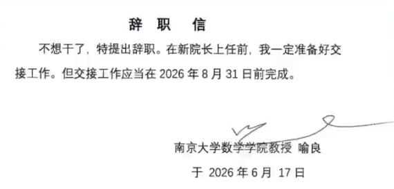

# 1 南大院长一句“不想干了”刷屏：芯片工程师到底什么时候该离职？

> 来源：https://mp.weixin.qq.com/s/tPNvVstF5gDvvxxtFhwv0g
> 作者：芯片验证那些事儿
> update 2026/08/16 03 : 41

 

就是这样一封短得不能再短的辞职信，迅速冲上热搜。南京大学数学学院工作人员向媒体确认，喻良教授确实已经卸任院长。

但这句话能够刷屏，本身就很值得思考。

大家真正关心的，可能并不是一位大学院长为什么卸任，而是这句“不想干了”，说出了太多职场人想说、却不敢说的话。

尤其是在芯片行业。

这两年，我在给芯片工程师做求职辅导和职业规划时，反复遇到同一个问题：

> **“老师，我现在这份工作越来越没有成长，但平台还可以、收入也不算低，我到底该不该走？”**

有人在大厂做了几年，简历看起来不错，实际上每天都在重复跑回归、改脚本、看波形；

有人拿着“模块负责人”的头衔，却没有验证方案制定权，也没有真正搭建过验证环境；

有人已经拿到了涨薪30%的Offer，却担心新公司项目不稳定；

还有人明明已经非常痛苦，却因为“都坚持这么久了”，继续消耗自己。

那么，芯片工程师到底什么时候该离职？

我想结合这些年指导的真实案例，谈谈我的看法。

---

## 1.1 “不想干了”可以是情绪，但离职必须是一道计算题

很多人把离职理解成一道态度题：

- 能不能忍；
- 要不要拼；
- 是不是玻璃心；
- 离开算不算逃避。

但真正成熟的职业决策，从来不是证明自己能忍多久。

离职本质上是一道计算题：**继续留下的收益，是否还大于留下的成本？新机会带来的长期增量，能否覆盖跳槽风险？**

如果只是某一天被领导批评、项目加班或者绩效不理想，第二天就想辞职，这通常是情绪。

但如果你已经连续半年甚至一年没有获得新的技术积累，工作内容越来越重复，能够接触的核心任务越来越少，个人竞争力还在持续下降，那就不是矫情，而是职业风险正在累积。

对芯片工程师来说，真正危险的不是忙，而是：

> **每天都很忙，但一年以后，简历上仍然写不出新的东西。**

很多时候，求职差的并不是能力，而是没有提前准备。等到面试结束才发现问题，代价往往比提前规划大得多。

---

## 1.2 出现下面5种情况，你就应该认真评估是否离开

### 1.2.1 工作很忙，但能力结构长期没有变化

验证工程师最容易掉进一种陷阱：把工作量当成成长。

每天跑回归、分析失败用例、维护脚本、更新用例列表，当然都属于工作。但如果做了三年，你仍然没有独立完成过下面这些事情，就要警惕了：

- 没有主导过验证计划和测试点拆解；
- 没有独立搭建或重构过UVM验证环境；
- 没有设计过关键Scoreboard、Reference Model或者Checker；
- 没有系统做过覆盖率收敛；
- 没有处理过复杂协议、性能、低功耗、一致性或者后仿问题；
- 没有把发现Bug的过程沉淀成可讲清楚的方法论；
- 离开当前项目后，能力很难迁移到新的芯片和新的公司。

这种情况下，你积累的可能只是“对当前环境越来越熟”，而不是市场认可的可迁移能力。

熟练不等于稀缺，忙碌也不等于成长。

### 1.2.2 项目经历看起来很多，却形成不了履历资产

芯片行业判断一个机会，不能只看公司名字，也不能只听“我们做的是AI芯片”“我们做的是高端服务器CPU”。

你要看自己在项目里究竟处于什么位置：

- 是核心模块负责人，还是外围配合人员？
- 是从零到一参与，还是只在后期维护？
- 能否接触架构、设计和验证方案，还是只能执行现成用例？
- 项目是否有明确的流片和量产计划？
- 最终能否在简历上形成一段经得住追问的经历？

有的人三年只做了一个项目，却能把架构、验证策略、难点、Bug、覆盖率和流片结果讲得非常扎实。

有的人参与了五个项目，每个项目都只做了一点外围工作，面试官深入追问两句就讲不下去。

真正决定下一份工作上限的，不是项目数量，而是你在项目中的深度、责任边界和可证明成果。

### 1.2.3 名义上升职了，实际上离核心技术越来越远

不少工程师工作几年后都会遇到一个选择：继续走技术路线，还是转项目管理、团队管理？

管理并不是天然比技术更高级。

如果所谓的“负责人”只是开会、排期、催进度、整理汇报，却没有人员决策权、技术决策权和资源协调权，这种岗位很容易让你同时失去两样东西：

- 技术深度越来越弱；
- 管理能力又没有真正建立起来。

最后简历上有了管理头衔，市场却仍然按照普通工程师评价你。

所以，技术转管理之前一定要问清楚：我是在获得新的能力，还是只是在承担更多杂事？

### 1.2.4 决定你成长的关键条件已经消失

一份工作值不值得留下，往往取决于几个关键变量：

- 有没有值得学习的直属领导；
- 能不能接触核心项目；
- 团队是否稳定；
- 公司是否还愿意投入这个方向；
- 项目能不能持续推进；
- 你的成果能否被关键决策者看到。

如果当初吸引你加入的领导已经离职，项目不断延期，核心成员持续流失，而你被安排的工作也越来越边缘化，那么即使公司名字和岗位名称没有变化，这份工作的实际价值也已经变了。

职业规划不能只看你入职时拿到了什么，更要看这些条件现在还剩下多少。

### 1.2.5 你不是暂时疲惫，而是已经看不到未来

项目冲刺阶段很累，不代表一定要离职；遇到难题、被指出不足，也不代表公司不适合你。

真正应该警惕的是：

- 你已经持续很久没有成就感；
- 每天只想完成最低限度的工作；
- 对新的任务不再期待，只剩抵触；
- 身体和情绪长期受到影响；
- 即使薪资上涨一点，你也不愿意继续做同样的事情。

这往往说明问题已经不只是收入，而是岗位内容、发展方向或者组织环境与你不再匹配。

离开不一定是失败。有时候，承认一条路不再适合自己，反而是对职业生涯负责。

---

## 1.3 芯片工程师想跳槽，至少提前3个月做准备

很多人最吃亏的地方，是等到实在忍不下去了才开始准备。

这时候简历没有整理，项目讲不清楚，基础知识忘得差不多，目标岗位也没想明白，只能一边焦虑，一边海投。

比较稳妥的做法，是把准备拆成五步。

### 1.3.1 第一步：盘点自己的能力和项目

把过去几年的工作按照“项目背景—本人职责—技术难点—解决方案—实际成果”重新梳理。

不要只写“负责PCIe模块验证”“参与NoC验证”，而要回答：你负责了什么边界？解决了什么问题？与其他候选人相比，难点在哪里？

### 1.3.2 第二步：确定目标，而不是盲目海投

你下一步究竟想做PCIe、NoC、DDR、CPU、NPU、低功耗还是SoC系统验证？

是继续做模块验证，还是转Top、子系统、性能验证或者验证平台开发？

目标不同，简历强调的项目、需要准备的知识以及选择公司的标准都不同。

### 1.3.3 第三步：用面试验证真实竞争力

不要等到最想去的公司开放岗位，才参加人生第一场面试。

先用几家匹配度中等的公司验证简历反馈和面试水平，记录每次被问住的问题，针对性补齐短板，再冲刺核心目标。

### 1.3.4 第四步：比较Offer背后的真实价值

Offer选择不能只比数字。

同样是60万元年包，一家公司可能是稳定现金，另一家可能包含高比例年终奖和不确定期权；同样叫“AI芯片验证”，有人负责Tensor Core核心模块，有人可能只做外围接口和回归维护。

一定要把团队、领导、项目阶段、职责边界、工作强度、现金收入和长期履历放在一起比较。

### 1.3.5 第五步：确认Offer后，体面完成交接

离职最能体现一个人的职业素养。

即使决定离开，也要把环境、脚本、遗留问题、关键文档和后续风险交接清楚。芯片行业的圈子并不大，过去的同事和领导，很可能在几年后再次与你合作。

“不想干了”可以很潇洒，但该做的交接不能少。

---

## 1.4 我为什么一直建议：职业规划要做在离职之前

我平时接触过不少芯片验证工程师。有应届生不知道如何选择第一份工作，有工作两三年的工程师陷在重复劳动里，也有资深工程师在大厂、创业公司、技术路线和管理岗位之间反复纠结。

他们表面上问的是：

- 这个Offer能不能接？
- 现在是不是跳槽的好时机？
- 我的薪资是不是低了？
- 这家公司值不值得去？
- 要不要从XXX转YYY芯片？

但更深一层的问题往往是：

> **我现在拥有的筹码是什么？下一步最值得积累的东西是什么？这个选择会把我带到哪里？**

这也是我做求职辅导和职业规划的价值。

我能提供的并不是一句简单的“去”或者“不去”，而是结合候选人的学历、工作年限、项目深度、技术方向、家庭城市、薪资结构和长期目标，帮助他完成：

- 职业定位与技术路线梳理；
- 简历诊断和项目经历重构；
- 面试知识体系与项目深挖；
- 模拟面试和薄弱环节定位；
- Offer对比、风险评估与谈薪；
- 入职后1—3年的成长路径设计。

每一份好结果背后，都不是临时抱佛脚，而是把方向、简历、项目表达和面试准备一项项做扎实。

我一直强调：

> **好的职业规划，不是在人最焦虑的时候替他做决定，而是让他在机会到来之前，已经拥有选择权。**

---

## 1.5 写在最后

“不想干了”之所以能够刷屏，是因为成年人的工作里，有太多无法写进辞职信的疲惫。

但对芯片工程师来说，真正重要的从来不是敢不敢辞职，而是离开以后，你能不能走向一个更好的位置。

如果平台已经无法提供新的成长，自己的竞争力还在持续下降，就不要因为头衔、沉没成本或者对未知的恐惧，一直留在原地。

离职不是目的，成长才是。

如果你正处于下面这些阶段：

- 不确定现在是否应该跳槽；
- 同时拿到多个Offer，不知道怎么选择；
- 想换技术方向，却担心过去的经验浪费；
- 简历投出去没有反馈，项目优势写不出来；
- 面试总被追问到哑口无言，却不知道怎么补；
- 工作多年，仍然看不清未来三到五年的路线；

可以把你的基本情况、项目经历和目前困惑整理好，找我做一次系统的求职辅导或职业规划。

我专注芯片验证技术分享、求职辅导和职业规划。

也欢迎把这篇文章转给正在纠结“该留下，还是该离开”的朋友。也许他缺的不是一句“再坚持一下”，而是一次认真审视自己职业方向的机会。
