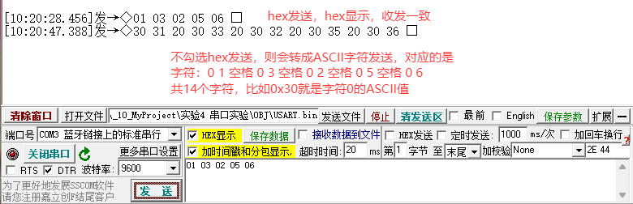
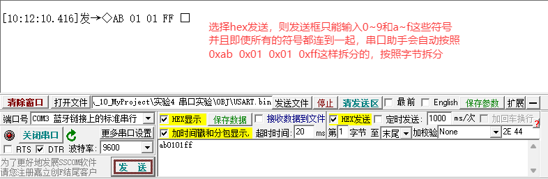

<!-- toc-start -->

# 目录

[1. 串口助手 + MCU串口打印过程分析和转换](#1-串口助手-mcu串口打印过程分析和转换)  
　　[1.1 各个类型打印转换（MCU侧，C语言）](#11-各个类型打印转换mcu侧c语言)  
　　　　[1.1.1 打印字符串 char\*](#111-打印字符串-char)  
　　　　[1.1.2 打印十进制整形（文本输出，ASCII）](#112-打印十进制整形文本输出ascii)  
　　　　[1.1.3 打印浮点数文本](#113-打印浮点数文本)  
　　　　[1.1.4 发送原始二进制HEX字节（直接发内存比特，不是字符）](#114-发送原始二进制hex字节直接发内存比特不是字符)  
　　[1.2 空格的核心问题：什么时候是字符，什么时候当分隔符？](#12-空格的核心问题什么时候是字符什么时候当分隔符)  
　　[1.3 需求：发送1~255整形，分隔符为空格](#13-需求发送1255整形分隔符为空格)  
　　[1.4 需求：发送固定255个字节，每个字节取值1‑255（纯二进制流，无分隔）](#14-需求发送固定255个字节每个字节取值1255纯二进制流无分隔)  
　　　　[1.4.1 在PC上做txt文件，或者复制粘贴给串口助手发送这255字节？](#141-在pc上做txt文件或者复制粘贴给串口助手发送这255字节)  
　　[1.5 上位机收发模式对照表](#15-上位机收发模式对照表)  
　　　　[1.5.1 容易踩坑清单](#151-容易踩坑清单)  
　　[1.6 总结](#16-总结)  

<!-- toc-end -->

---

# 1. 串口助手 + MCU串口打印过程分析和转换

> 来源：https://mp.weixin.qq.com/s/0_IslQT06ccIPBAZSuNqtQ
> 作者：嵌入式电子学习
> update 2026/09/27 18 : 31

> 字数 2459，阅读大约需 13 分钟


> **1、文本模式（ASCII模式，人看得懂）：发送的是字符编码。比如数字 `123`，不是发0x7B这个字节，而是发字符'1'、'2'、'3'的ASCII码：0x31 0x32 0x33。串口助手“文本模式”就是这个。**
> **2、HEX/二进制模式（原始字节，机器码）：直接发送字节本身的值。发送字节0x7B，就是一个字节，代表十进制123；人眼看不懂，是原始二进制流。串口助手“HEX模式”。**

- **空格也分两种身份：作为普通ASCII字符；作为解析分隔符。发送行为、接收解析行为是分开的：MCU发送端行为 ≠ 串口助手接收解析行为。**
- **[常用的串口助手到底在发送什么？区分一下hex和ascii对串口发送的影响](https://mp.weixin.qq.com/s?__biz=MzYyNTA5OTU0Mw==&mid=2247484390&idx=1&sn=112821a689ec313a839f632920cf94c3&scene=21#wechat_redirect)**
- **[浮点数和定点数：32位浮点数拆分成高16位和低16位进行串口发送](https://mp.weixin.qq.com/s?__biz=MzYyNTA5OTU0Mw==&mid=2247485329&idx=1&sn=0371d504ec2521d3ab200d493f2841d1&scene=21#wechat_redirect)**
- **[串口发送时的小端发送、大端发送和低位先行](https://mp.weixin.qq.com/s?__biz=MzYyNTA5OTU0Mw==&mid=2247485335&idx=1&sn=24d120b4eaae37dfb9e220cbf4021189&scene=21#wechat_redirect)**





---

## 1.1 各个类型打印转换（MCU侧，C语言）

### 1.1.1 打印字符串 char\*

```
char buf[]="Hello ABC";
HAL_UART_Transmit(&huart1,(uint8_t*)buf,strlen(buf),10);
```

- 发送每一个字符的**ASCII编码**，空格 `' '` 的ASCII码是 **0x20**。
- 这里空格**就是普通字符，实实在在发送一个字节0x20，接收端文本模式就看到空格**。

### 1.1.2 打印十进制整形（文本输出，ASCII）

用 `sprintf` / `snprintf` 先格式化到字符缓冲区，再发串口。

```
char tx_buf[32];
int16_t val = 123;
snprintf(tx_buf,sizeof(tx_buf),"%d",val);  //把数字转成ASCII字符串"123"
HAL_UART_Transmit(&huart1,(uint8_t*)tx_buf,strlen(tx_buf),10);
```

`snprintf`：安全版本，防止缓冲区越界，嵌入式优先用这个。

- `%d`：十进制有符号整数文本
- `%u`：十进制无符号整数文本
- `%x / %02X`：十六进制文本。`%02X` → 数值5输出字符串"05"（两个字符）

> 注意：`%02X`输出的是字符'0'、'5'两个ASCII字节，不是直接发送字节0x05！！

### 1.1.3 打印浮点数文本

STM32默认库`sprintf`**不支持%f**，要打开编译器选项启用float‑printf。

```
snprintf(tx_buf,sizeof(tx_buf),"%.2f",123.45f);
//输出字符串 "123.45"，发送对应ASCII字节
```

- 上面全部属于【文本ASCII输出】：**MCU把数字翻译成人可读的字符，串口发送字符编码**。**不是发送变量内存原始二进制！**

### 1.1.4 发送原始二进制HEX字节（直接发内存比特，不是字符）

比如要发送字节`0x05`，不要用`%02X`；直接把数值放进uint8\_t数组发送：

```
uint8_t bin_buf[]={0x05,0xFF,0x10};
HAL_UART_Transmit(&huart1,bin_buf,3,10);
```

直接输出3个原始字节。串口助手必须切到**HEX接收模式**才能看见05 FF 10；切文本模式看到乱码。

> 总结MCU侧转换套路：
>
> 1. 1. 想人看得懂（数字、小数、文字）：用`snprintf`转成ASCII字符串缓冲区，再发送。空格、换行都是普通字符。
> 2. 2. 想发送机器原始字节（ADC码、float二进制、1‑255字节流）：直接填充`uint8_t[]`数组，直接发送数组，不要用sprintf格式化。

---

## 1.2 空格的核心问题：什么时候是字符，什么时候当分隔符？

- **发送端：MCU/串口助手发送的时候，空格永远就是一个字节0x20，不会自动消失。只有【接收解析软件】才会把空格当成分隔符！发送环节不会自动吃掉空格！**

#### 1.2.0.1 **发送时**

- 文本模式输入 `123 456`：发送：`'1','2','3',0x20,'4','5','6'`；空格0x20真实发出去。
- HEX模式输入 `7B 20 C8`：中间空格**仅仅是你输入窗口的视觉分隔符！不会作为字节发送！**

> 重点：串口助手HEX输入框里的空格，**只是用来方便你分开看每个字节，不会输出0x20字节**！这是最容易踩的大坑！

#### 1.2.0.2 **接收解析的时候（上位机软件行为，MCU本身不做解析）**

- 串口助手【文本接收模式】：收到0x20，屏幕就显示空格，原样展示，不会丢弃。
- 串口助手【HEX接收模式】：收到0x20，显示 `20`。
- **只有当上位机做“解析、分割数据”功能（例如：多字节解析、按分隔符分割帧）的时候，软件才会把空格、回车、Tab当成分隔符，把0x20丢弃，用来切分一串数字。**

#### 1.2.0.3 举例子：

MCU发送ASCII文本：`"10 20 30\r\n"`
字节序列：`'1','0',0x20,'2','0',0x20,'3','0',0x0D,0x0A`

- 串口助手文本看：`10 20 30`，带空格。
- 如果上位机脚本/软件开启“按空格分割解析”：软件读到0x20，识别成分隔，分割出三个数字10、20、30；**软件解析的时候把空格丢弃，但是原始串口数据流里面0x20是真实存在的。**

> 空格字节0x20：
>
> - • 作为传输：实实在在的一个字节；
> - • 分隔符只是上层解析软件的逻辑，不是硬件串口自带功能。串口硬件只管搬运字节，不懂什么叫分隔符。

---

## 1.3 需求：发送1~255整形，分隔符为空格

#### 1.3.0.1 方案A：文本ASCII模式（人眼可读，串口助手文本窗口看得见数字和空格）

需求输出文本：`"1 2 3 ... 255 "`，每个数字+空格：

- 数字1：字符`'1'`(1字节) + 空格`0x20` →共2字节
- 数字10：`'1','0'` +空格 →3字节
- 数字255：`'2','5','5'` +空格 →4字节

**总字节数不固定！因为1位数、2位数、3位数字符长度不一样！**

MCU示例代码：

```
char tx_buf[8];
for(uint16_t i=1;i<=255;i++)
{
    snprintf(tx_buf,sizeof(tx_buf),"%d ",i); //%d后面带一个空格作为分隔符
    HAL_UART_Transmit(&huart1,(uint8_t*)tx_buf,strlen(tx_buf),10);
}
```

发送出来就是：`1 2 3 … 255`。

> 上位机设置：串口助手接收切【文本模式】；如果需要解析数值，上位机软件按空格0x20分割字符串提取数字。
> 缺点：字节长度可变，不适合二进制协议，适合调试看日志。

#### 1.3.0.2 方案B：二进制原始字节模式（每个数字1‑255占**1个字节**，数值就是字节本身；再额外发一个字节0x20作为分隔符）

- 每个元素 =【1字节数据】 +【1字节空格分隔符0x20】
- 1~255一共255个数字：总字节= 255\*2 = **510字节**。

```
uint8_t sep_space = 0x20;
for(uint16_t i=1;i<=255;i++)
{
    uint8_t val = (uint8_t)i;
    HAL_UART_Transmit(&huart1,&val,1,10);
    HAL_UART_Transmit(&huart1,&sep_space,1,10);
}
```

> 上位机设置：串口助手切【HEX接收模式】，你会看到每个数据字节后面跟着20；文本模式打开全部乱码。
> 注意：这里空格0x20是**真实发送出去的一个字节**，不是输入框的视觉分隔。

重点区分：

- 文本模式：`255` 是三个字符'2','5','5'（3字节）
- 二进制模式：数值255就是1个字节`0xFF`

---

## 1.4 需求：发送固定255个字节，每个字节取值1‑255（纯二进制流，无分隔）

- 每个字节1‑255，一共严格**255字节**，就是原始二进制数据，不是数字字符。

MCU代码：

```
uint8_t bin_tx[255];
//填充1~255
for(int i=0;i<255;i++)
{
    bin_tx[i] = (uint8_t)(i+1);
}
//一次性发送255字节
HAL_UART_Transmit(&huart1,bin_tx,255,10);
```

> 上位机串口助手：接收必须切到 **HEX模式**，看到255个字节：`01 02 03 ... FF`；切文本模式全部是乱码。

### 1.4.1 在PC上做txt文件，或者复制粘贴给串口助手发送这255字节？

- 这里有巨大坑：**普通txt是ASCII文本文件，不是二进制文件！**

#### 1.4.1.1 方式1：串口助手HEX输入框复制粘贴发送（最简单，不需要文件）

1. 在记事本写一串：`01 02 03 04 … FF`，每个字节两位十六进制，空格用来视觉隔开；
2. 全部复制；
3. 串口助手切换到【HEX发送模式】，粘贴到发送输入框；
4. 点击发送。

> ✔这里输入框的空格**仅为视觉分隔，不会发送0x20字节**，正好输出严格255个原始字节。
> ❗千万不要把这串粘贴到文本发送模式，那样会发送字符'0','1',' ','0','2'……完全不是想要的二进制。

#### 1.4.1.2 方式2：制作真正的二进制bin文件（不是txt），串口助手发送文件

- 普通`.txt`存的是字符，不能直接当二进制流发送。
- 需要生成二进制`.bin`文件，内容就是255字节：0x01,0x02…0xFF。
  串口助手使用【发送文件】功能，选中这个bin文件，发送。

> 记事本无法直接编辑二进制bin。简易工具：HxD（免费十六进制编辑器），新建255字节，填充01‑FF，保存为`.bin`。如果你保存成txt，里面写`01 02 03 ...`，那是文本，一个数字两个字符，文件大小远大于255字节，发送出来完全错误。

---

## 1.5 上位机收发模式对照表

| 场景 | 串口助手发送模式 | 串口助手接收模式 | 说明 |
| --- | --- | --- | --- |
| 看打印日志、数字文字、小数（MCU sprintf输出） | 文本 | 文本 | 收发都是ASCII字符；空格0x20真实传输显示 |
| 发送原始二进制字节流（ADC、255字节数据、float二进制） | HEX | HEX | 输入框空格仅视觉分隔，不发出0x20；看到两位十六进制 |
| 把二进制数据当文本发送 | 禁止文本模式发二进制 | 文本 | 全部乱码 |

### 1.5.1 容易踩坑清单

1. 用`%02X`sprintf打印得到字符串"FF"，不等于发送字节0xFF；
2. HEX发送框中间空格不会输出0x20；文本发送框的空格会输出0x20；
3. 空格成为分隔符，**是上层软件解析逻辑，串口硬件本身不分隔任何东西**；
4. **txt文本文件≠二进制数据文件，不要直接拿txt当二进制数据包发送**；
5. **文本模式下数字字符字节数随位数变化；二进制模式固定一个字节代表0‑255数值**。

---

## 1.6 总结

1. **人要看 → ASCII文本，snprintf转字符串；**
2. **机器协议、原始字节 → uint8\_t数组直接发送，切HEX；**
3. **HEX输入框空格只是眼睛看的，不会发出去；文本框空格是真的发0x20；**
4. **分隔符是软件解析逻辑，串口硬件不懂分隔；**
5. **想要固定长度数据包，优先二进制模式；文本模式字节长度不固定。**
